TCS/SE/46/2023-24

June 7, 2023

National Stock Exchange of India Limited

Exchange Plaza, C-1, Block G, Bandra Kurla

Complex, Bandra (East)

Mumbai - 400051

Symbol - TCS

BSE Limited

P. J. Towers,

Dalal Street,

Mumbai - 400001

Scrip Code No. 532540

Dear Sirs,

# Sub: Annual General Meeting Notice, Integrated Annual Report 2022-23

The twenty-eighth Annual General Meeting (“AGM”) of the Company will be held on Thursday, June 29, 2023 at 3.30 p.m. IST through Video Conferencing/Other Audio Visual Means.

Pursuant to Regulation 34(1) of Securities and Exchange Board of India (Listing Obligations and Disclosure Requirements) Regulations, 2015, we are submitting herewith the Integrated Annual Report containing the Notice of AGM for the financial year 2022-23 which is being sent only through electronic mode to the Members, who have registered their e-mail addresses with the Company/ Depositories.

The Integrated Annual Report containing the Notice is also uploaded on the Company’s website www.tcs.com.

This is for your information and records.

Thanking you,

Yours faithfully,

For Tata Consultancy Services Limited

# Pradeep Manohar Gaitonde

# Company Secretary

cc:

1. National Securities Depository Limited

2. Central Depository Services (India) Limited

3. TSR Consultants Private Limited

# TATA CONSULTANCY SERVICES

Tata Consultancy Services Limited

9th Floor Nirmal Building Nariman Point Mumbai 400 021

Tel 91 22 6778 9595 Fax 91 22 6630 3672 e-mail corporate.office@tcs.com website www.tcs.com

Registered Office 9th Floor Nirmal Building Nariman Point Mumbai 400 021

Corporate Identity No. (CIN): L22210MH1995PLC084781

# Innovate, Adapt, Thrive

Integrated Annual Report

2022-23

natural_image

Collage of industrial and technological themes including scientists, engineers, wind turbines, solar panels, and engineers (no text or symbols)

# About TCS

Tata Consultancy Services is an IT services, consulting and business solutions organization that has been partnering with many of the world’s largest businesses in their transformation journeys for over 55 years. Its consulting-led, cognitive powered, portfolio of business, technology and engineering services and solutions is delivered through its unique Location Independent Agile™ delivery model, recognized as a benchmark of excellence in software development.

A part of the Tata group, India’s largest multinational business group, TCS has over 614,000 of the world’s besttrained consultants in 55 countries. The company generated consolidated revenues of US \$27.9 billion in the fiscal year ended March 31, 2023, and is listed on the BSE and the NSE in India.

TCS’ proactive stance on climate change and award-winning work with communities across the world have earned it a place in leading sustainability indices such as the MSCI Global Sustainability Index and the FTSE4Good Emerging Index. For more information, visit www.tcs.com

Innovate, Adapt, Thrive.

This year’s theme reflects the agility that enterprises require to thrive in a fast-changing, uncertain world. For two years, enterprises battled for scarce talent to embrace the cloud and experiment with powerful technologies like AI and ML. They had just gotten started on their growth and transformation journeys when the war in Europe changed everything. With raging inflation and resultant interest rate hikes dampening global economic outlook, companies are now recalibrating their plans and adapting to the changed circumstances.

TCS, with its full services capability, helps clients thrive in good times and bad. It helped them move to the cloud, accelerate their innovation, adopt new business models and drive competitive differentiation. Now it is helping them adapt, transforming their operations and giving them the agility, resilience and efficiency needed to weather the storm. Its clients see it as their preferred all-weather partner, making its services an enterprise staple, and its business very resilient.

Recent Annual Report Themes   
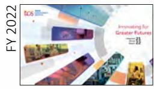

text_image

FY 2022
tcs
Innovating for
Greater Futures
三B

Innovating for Greater Futures

natural_image

Exterior view of a modern building with warm lighting and landscaping, labeled 'Building on belief' (no other text or symbols visible)

Building on Belief

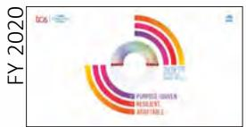

pie

FY 2020
| Category | Value |
|---|---|
| PUPPES | 15 |
| GREEN | 14 |
| RESILNT | 13 |
| ABSTRACT | 12 |

Purpose-driven. Resilient. Adaptable   
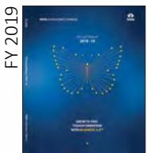

text_image

FY 2019
2018-19
INTERNATIONAL BETA
THE WORLD IN A BOOK OF THE
FUTURE OF THE FUTURE
OF THE WORLD IN A BOOK OF THE
FUTURE OF THE FUTURE

Growth and Transformation with Business 4.0TM

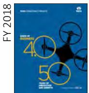

text_image

FY 2018
4.0
5.0
THE WORLD OF BUSINESS
AFTER: 3/17/2018
GARANT GOURN
MARTIN & CHEESE

Dawn of Business 4.0TM

# Content

About TCS.... . 02

Board of Directors... 04

Management Team.. 05

Letter from the Chairman.. 06

Letter to Shareholders. 08

Letter from the CEO.. 11

The Year Gone by... 12

# Integrated Reporting Framework

TCS Integrated Business Model… 15

Financial Capital… 16

Human Capital… 18

Intellectual Capital… 20

Social Capital… 22

Natural Capital… 24

# Thematic Section

Helping Versuni become a Digital-First,

Innovation-Led Standalone Entity… 26

Enabling Eversource Energy’s Transition to a Green Energy Future… 27

Innovate, Adapt, Thrive: A Fireside Chat.. 28

Revolutionizing Small Value Payments in South Africa....... 30

Supporting Takenaka Corporation Realize its Vision of a Sustainable Society... 31

Q&A with CFO and CHRO.. 32

Innovating to Improve Crop Yields and Farmer Incomes.. 34

# Statutory Section

Notice… 35

Directors’ Report.. 72

Management Discussion and Analysis. 86

Awards and Accolades.. 109

Corporate Governance Report. 11

Corporate Social Responsibility... 13

14Business Responsibility and Sustainability Report…….........

# Consolidated Financial Statements

Independent Auditor’s Report 183

Consolidated Balance Sheet… 190

Consolidated Statement of Profit and Loss… 191

Consolidated Statement of Changes in Equity... 192

Consolidated Statement of Cash Flows 194

Notes forming part of the Consolidated Financial Statements… 196

# Standalone Financial Statements

Independent Auditor’s Report… 251

Standalone Balance Sheet 260

Standalone Statement of Profit and Loss… 261

Standalone Statement of Changes in Equity..... 262

Standalone Statement of Cash Flows 264

Notes forming part of the Standalone Financial Statements 266

Statement under section 129 of the Companies Act, 2013 relating to Subsidiary Companies… 316

Glossary 321

# Sustainability Disclosures

Identification of Material Topics 330

Climate change risk and opportunities assessment and management… 333

GRI Content Index… 339

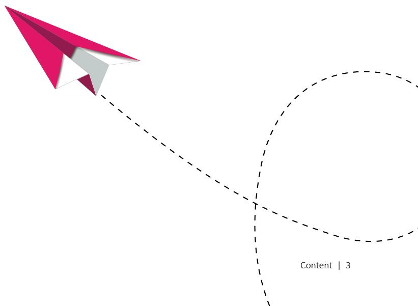

text_image

Content | 3

# Board of Directors

Non-Independent, Non Executive   
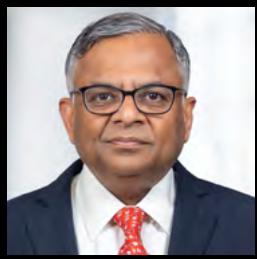

natural_image

Portrait of a man wearing glasses, suit, and red tie (no text or symbols visible)

N Chandrasekaran Chairman   

natural_image

Portrait of an elderly woman wearing glasses and traditional attire (no visible text or symbols)

Aarthi Subramanian   

Independent, Non Executive   
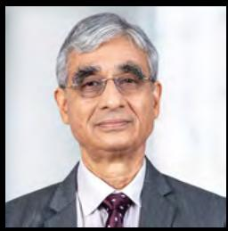

natural_image

Portrait of an elderly man with gray hair and glasses, wearing a suit and tie (no visible text or symbols)

O P Bhatt

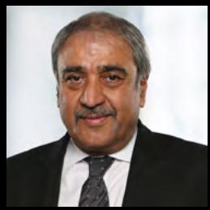

natural_image

Portrait of a man in formal attire (no visible text or symbols)

Dr Pradeep Kumar Khosla   

natural_image

Portrait of a woman with short blonde hair wearing a gray blazer and pink top (no visible text or symbols)

Hanne Sorensen

Non-Independent, Executive   
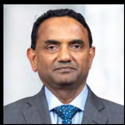

natural_image

Portrait of a man in business attire (no visible text or symbols)

K Krithivasan CEO & MD   

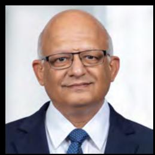

natural_image

Portrait of a bald man wearing glasses and a suit (no text or symbols visible)

N G Subramaniam COO & ED   

natural_image

Portrait of a man in a suit and tie, smiling (no visible text or symbols)

Keki Mistry   

natural_image

Portrait of a man in formal attire with glasses (no visible text or symbols)

Don Callahan   

<table><tr><td>I</td><td>Independent, Non-Executive Director</td></tr><tr><td>NE</td><td>Non-Independent, Executive Director</td></tr><tr><td>N</td><td>Non-Independent, Non-Executive Director</td></tr></table>

Board Committees

C Chairman

M Member

Audit Committee

Nomination and Remuneration Committee

Stakeholders’ Relationship Committee

Corporate Social Responsibility Committee

Executive Committee

Risk Management Committee\*

\*Samir Seksaria (Chief Financial Officer) is also a member of the Committee

Average Age (years)

56

63

72

Average Tenure on the Board (years)

Board Independence (%)

56% Independent

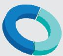

44% Non-Independent

Average Tenure of Independent Directors on the Board (years)

# Management Team

# Corporate

# K Krithivasan

Chief Executive Officer

and Managing Director

# N G Subramaniam

Chief Operating Officer

and Executive Director

# Samir Seksaria

Chief Financial Officer

# Milind Lakkad

Chief Human Resources Officer

# Rajashree R

Chief Marketing Officer

# K Ananth Krishnan

Chief Technology Officer

# Madhav Anchan

General Counsel Legal

# Pradeep Manohar Gaitonde

Company Secretary

# Business Heads

# Susheel Vasudevan

Relationship Incubation Group

# Krishnan Ramanujam

Enterprise Growth Group

# Debashis Ghosh

Business Transformation Group

# Suresh Muthuswami

Chairman – TCS North America

# Amit Bajaj

North America

# Amit Kapur

UK & Ireland

# Sapthagiri Chapalapalli

Europe

natural_image

Business meeting in an office with four professionals seated around a table, no visible text or signage

# Letter from the

#

# Chairman

The global environment is going through considerable changes. At the same time, the world is navigating several important transitions: the Energy transition, the Supply Chain transition and the AI transition. Undoubtedly, these transitions will require significant investments in technology and innovation, and offer a huge growth opportunity for the IT industry.

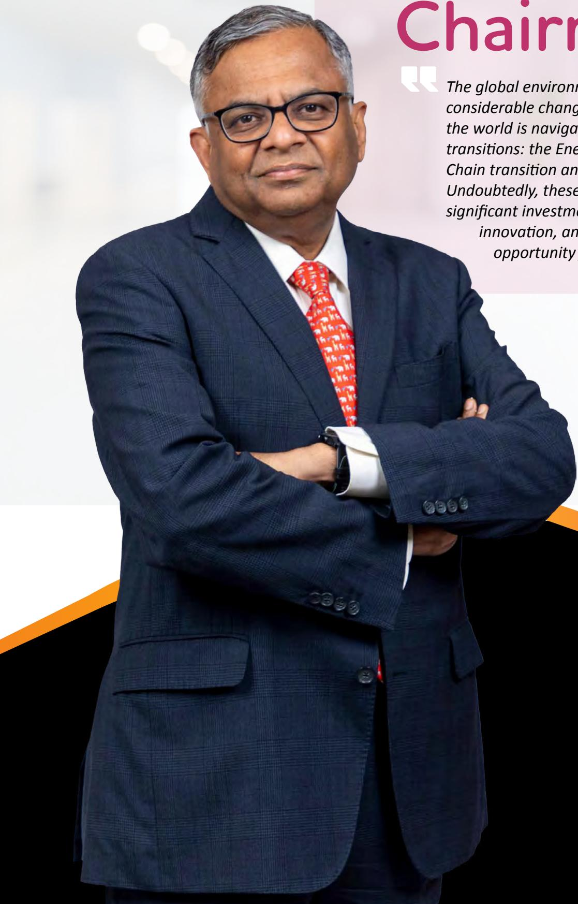

text_image

Chair
The global environr
considerable chang
the world is naviga
transitions: the Ene
Chain transition an
Undoubtedly, these
significant investmo
innovation, an
opportunity

# Dear Shareholder,

I am pleased to share that your company has done well in a volatile global environment in the year gone by. In FY 2023, your company delivered revenue of ₹225,458 crore, a growth of 17.6%. This growth has come at an industry-leading operating margin of 24.1%.

TCS continues to play a crucial role with clients to enable their business transformation, helping them accelerate new technology adoption and bring agility into execution. We work with large enterprises on transformation initiatives to build a digital foundation for the future, enable strategic leverage of data and artificial intelligence (AI) and reimagine customer and employee experiences.

Your company delivered healthy client metrics enabled by new customer additions and deep client relationships. In FY 2023, growth has come from broad-based performance across markets and industry verticals. The order book continues to be strong, indicating demand for your company’s services. From a talent perspective, the employee strength grew to over 614,000 associates with 35.7% women associates.

The global environment is going through considerable changes. Geopolitical factors such as the conflict between Russia and Ukraine, rising inflation and volatile commodity prices have caused slowing down of global growth and created stress in the overall economic environment.

At the same time, the world is navigating several transitions. Undoubtedly, these transitions will require significant investments in technology and innovation, and offer a huge growth opportunity for the IT industry.

The global energy transition is accelerating. Businesses are making clear commitments towards a sustainable future. There are many innovations across products, services, manufacturing, and delivery. New business models are also emerging. This requires investments in technology and innovation including electric mobility, renewable power, hydrogen and sustainable fuel. In addition, sustainability compliance and reporting requirements are fast evolving as new standards and regulations are coming into play. Across the facets of this transition, investments in IT and digital technology will be an important enabler for businesses.

The supply chain transition resulting from the geo-political situation is altering the global supply chains. Companies are rebalancing their supply chains for resilience and efficiency. New global supply chain ecosystems are being created with India playing an important role. This is being led by significant capital investments in technology to set-up ‘digital-first’ manufacturing and supply chain operations as well as to build ecosystem integration with partners.

In the past decade, there has been a rapid evolution of digital technologies, bringing about a transformation across every industry. Now, the advancements in AI have made AI transition a central focus. The impact of AI and Machine learning is going to be profound. There is a transition already underway from predictive AI to generative AI. Majority of the businesses are still adopting predictive AI and are on the journey of capturing large volume of data, harnessing the power of cloud and IoT. There are varying levels of adoption in companies across sectors. Leveraging generative AI would further require technology innovation and investments.

There is another important area that companies need to focus on – building talent for the future. The energy, supply chain and AI transitions are going to require companies to reskill/upskill existing talent base, hire and integrate new talent and invest in research. Our technology strengths make us well-placed to respond to the global demand and scale up our talent base.

As the future of work is evolving, enterprises globally are also assessing their approach to talent. Today, companies can tap into talent anywhere and leaders need to learn how to harness the global talent pool effectively. Technology and tools are facilitating collaboration and enabling virtual and hybrid models of work. Harnessing this talent will need an approach that leverages technologies like AI and cloud to enable effective employee engagement and collaboration.

Your company is significantly investing in building AI capabilities which include products and platforms that are AI-powered. Over the last few years, your company has leveraged partnerships to design and orchestrate a completely indigenous software-defined 4G/5G network stack. 5G technologies along with IoT, edge and AI will enable new digital transformation opportunities across industries, both industrial and consumer. We will also invest in research areas important for the future, in collaboration with our global academic partners and start-up ecosystem.

I would like to thank Rajesh Gopinathan for his contribution during his tenure as CEO & MD and I wish him the very best for the future. I also take this opportunity to wish K Krithivasan the very best in his new role as CEO & MD of your company.

On behalf of the Board of Directors of Tata Consultancy Services, I want to thank you for your continued trust, confidence, and support.

Warm regards, N Chandrasekaran Chairman

Our full services capability enables us to help our clients thrive, in good times and bad. During the up-cycle, we help clients accelerate and expand their technology-led innovation to differentiate themselves and drive growth. On the down cycle, we help them adapt, using technology to drive the efficiency, agility and resilience needed to cope with a faltering economy, and prepare for better times ahead.

# Letter to Shareholders1

# Dear Stakeholder,

Demand for our services showed remarkable resilience even as other parts of the technology universe deflated, and macroeconomic uncertainties worsened in our major markets throughout FY 2023. Our revenue for the year was ₹225,458 crore, a growth of 17.6% over the prior year (13.7% in constant currency).

This growth came with an industry leading operating margin of 24.1%. Our Net Margin was at 18.7%. The Earnings Per Share was at ₹115.19, a growth of 11.2% over the prior year.

From an industry vertical perspective, growth in FY 2023 was led by Retail and Consumer Business, which grew 22.1%, Life Sciences and Healthcare which grew 20.2% and Communications, Media and Technology which grew 18.1%. Banking, Financial Services and Insurance grew 14.6% while Manufacturing grew 14.1%. Others, which make up 8.2% of revenues, grew 22.5%.

By geographic markets, North America grew 24.2%, UK grew 11.4% and Continental Europe grew 9.2%. Among emerging markets, Latin America grew 24.8%, India grew 14.9%, Middle East & Africa grew 12.5% while Asia Pacific grew 7.1%.

The Board has recommended a final dividend of ₹24 per share, bringing the total dividend for the year to ₹115 per share. For the full year, the company’s shareholder payout was ₹42,079 crore, 108.2% of the free cash flow during the year.

# Innovate, Adapt, Thrive

Our performance this year reflects how much of an enterprise staple IT services have become. Our full services capability enables us to help our clients thrive, in good times and bad. During the up-cycle, we help clients accelerate and expand their technology-led innovation to differentiate themselves and drive growth. On the down cycle, we help them adapt, using

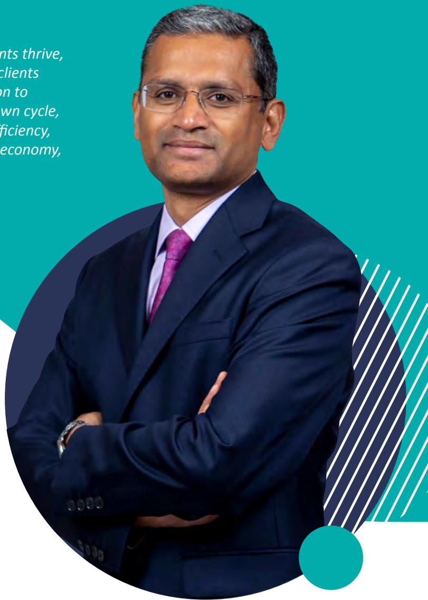

text_image

nts thrive,
clients
in to
wn cycle,
ficiency,
economy,

technology to drive the efficiency, agility and resilience needed to cope with a faltering economy, and prepare for better times ahead.

Cloud transformation remained a high priority area for enterprises in FY 2023, with greater focus on execution. They engaged us to take up the modernization and migration of their bigger, more complex workloads. The breadth and depth of our cloud expertise, our scale, deep domain knowledge, strong partnership credentials with the hyperscalers and our portfolio of intellectual property on the cloud, give us a distinct competitive edge in this phase of the cloud adoption cycle.

We also helped clients cope with the challenge of managing cloud expenses. In some cases, it required rearchitecting their application stack to be more cloud native, capable of dynamically ramping up resource consumption during periods of high demand, and automatic ramping down at other times. Elsewhere, we offered our FinOps advisory and cloud managed services to rein in cloud costs.

The adoption of cloud technologies continues to drive innovation within enterprises. The availability of compute, data and networks at scale provides access to powerful technologies like advanced analytics and machine learning, applied to diverse areas like computer vision, text and speech processing, in domains like dynamic supply chain optimization, new molecule discovery in life sciences and usage-based pricing of insurance coverage.

Newer developments like generative AI, large language models, and quantum computing triggered more experimentation and innovation by our clients. Our investments in research and innovation across different industries, and our Pace innovation architecture have positioned us well to partner with them in these initiatives. Our Agile Innovation Cloud offering, where we create dedicated, location-independent innovation teams to help clients accelerate and scale up their innovation, gained further traction in FY 2023. 7 new clients signed up during the year, bringing the total to 30 clients.

Some of the emerging innovation themes that we helped customers with include ecosystem and multi-industry models underpinned by technologies like data marketplaces, API and blockchain, in industries like transportation and public sector; AI-powered autonomous robotics in the logistics industry, and new applications for digital twins in the BFSI, Telecom and Retail industries.

Within our growth and transformation (G&T) portfolio, business model innovation continued to be a key theme. For example, for a large Fortune 500 electric gas utility, we built the service delivery platform central to their new business model of providing warranty repair, refurbishment and replacement services of various home appliances to households.

Ingram Micro, one of the largest technology distributors in the US, engaged us as a partner to power their pivot into e-commerce and achieve their mission to transform from a traditional distributor to a platform company that does distribution. Tapestry Inc, a leading New York-based house of iconic accessories and lifestyle brands such as Coach, Kate Spade, & Stuart Weitzman, partnered with TCS to drive their omnichannel modernization and transform the customer journey experience.

Other G&T themes, such as M&A and sustainability continued to bring in high-profile deal wins and new strategic engagements for us in FY 2023. Elsewhere in this report, you can read about the work we did for Philips Domestic Appliances in its journey to be a standalone company, and how we helped Eversource Energy pursue its carbon neutrality aspirations.

Digital transformation, which began in the front office, towards enhancing customer experience, made further inroads within the enterprise during the year, unlocking tremendous value in the middle and back office. As critical technologies such as machine vision and conversational systems get better with the use of AI, our Machine First™ approach is helping clients use them innovatively in the back office, embedding them into reimagined processes to drive greater velocity, agility, throughput and resilience – which, among other things, also enhances customer experience.

Newer developments like generative AI, large language models, and quantum computing triggered more experimentation and innovation by our clients. Our investments in research and innovation across different industries, and our Pace innovation architecture have positioned us well to partner with them in these initiatives.

Applied at scale, across a broad set of business or IT operations, this can result in an entirely new operating model that significantly boosts our clients’ competitiveness. As macroeconomic uncertainty increased in the second half of the year, we saw clients adapting by reprioritizing their spends and showing greater interest in such operating model transformations.

TCS Cognix™, our AI-driven human machine collaboration suite, has been a game changer, enabling faster transformations that deliver concrete business benefits within months. Its 600 pre-built configurable and reusable digital solutions enable plug and play transformation of a range of business and technology functions, horizontal and vertical. Nearly 300 of our clients have used it to transform their business and IT operations.

In traditional outsourcing deals, we saw more multi-services integrated deals. By consolidating multiple elements of the operation stack – processes, applications, and the underlying technology and infrastructure – with a single strategic partner, clients not only achieve greater accountability, but also reduce complexity and derisk their larger business transformations. The same rationale is driving more vendor consolidation initiatives that favor a few strategic partners with end-to-end service offerings, the right innovation capabilities and scale.

All these trends play to our strengths. Our scale, structure, and ability to bring together different capabilities into a seamless service delivery team, helped us win several large deals throughout the year.

# Investing in People

The supplyside challenges of the last two years peaked in the first half of FY 2023, with employee churn reaching unprecedented levels. We broke out of the vicious cycle of hiring and counter-hiring within the industry by investing in onboarding an unprecedent number of fresh engineers – over 110,000 in FY 2022 and over 44,000 in FY 2023 – and training them on the technologies most in demand.

In FY 2023, we focused on utilizing the spare capacity built up in the prior year, and recalibrated our hiring especially as attrition started falling in the second half of the year. Our LTM attrition in IT services for the year was 20.1%. Net addition in FY 2023 was 22,600, and the closing headcount was 614,795. Our workforce continued to be very diverse, with over 150 nationalities represented and with women making up 35.7% of the employee base.

Our investments in organic talent development continue to deliver exceptional outcomes. In FY 2023, TCSers logged 48.3 million learning hours, and acquired nearly 6 million competencies. Popular technologies witnessed unprecedented levels of interest from our employees. During the year, 53,000 TCSers acquired certification on hyperscaler cloud skills, bringing the total number to over 110,000, making TCS one of the Top 2 partners to the largest cloud providers.

# Caring for Communities

We continued to work with communities across the world, pursuing our long-standing commitment to programs in the areas of skills development, bridging of digital divides and STEM education. In FY 2023, we estimate that our community initiatives touched the lives of over 4.5 million beneficiaries – women, youth and members of marginalized communities.

Our large programs in India around literacy, digital entrepreneurship and youth skilling continued to gain scale. Likewise, our STEM initiatives outside India. goIT is shaping the next generation of digital innovators in 42 countries, while Ignite my Future in School program has doubled its original goal, serving over 2 million students and educators in five geographies worldwide since inception in 2017.

Our employee volunteer program called HOPE (Hours of Purpose by Employees) resulted in over 2.8 million hours of volunteering effort towards promoting issues most relevant in their local communities, such as mental health, climate action, circularity, education, skilling, mentoring, and conservation.

On the environmental front, we continue to make good progress in our net zero journey. We have brought down our absolute carbon footprint across Scope 1 and Scope 2 emissions by 71% over base year 2016, meeting our target two years ahead of time. This was despite increased electricity consumption in FY 2023 from employees’ return to office. In addition to enterprisewide initiatives for energy efficiency, we have also significantly increased our use of renewable energy. Renewable energy sources today make up 55% of the total (7.25% in 2016).

# So long, farewell

This year marks a key milestone in my journey with TCS, and an important transition point for the company, as I step down from my role as CEO and MD on 31st May 2023. It has been an absolute privilege and an unparalleled learning experience to lead our company in the last six years, a period of tremendous growth and transformation for us.

On a more personal note, I am grateful to Chandra, our Chairman, for his mentorship and backing over the years, to our Board members for their guidance, and to all our customers for the confidence they reposed in us. I take this opportunity to thank all my colleagues whose support and trust made my journey as CEO successful, satisfying and unforgettable. I also thank all my fellow TCSers whose energy, dedication and aspirations continue to power the organization’s success.

I have had the pleasure of interacting with some of you in person over the last decade. Your feedback and insights helped me learn and shaped my worldview. Thank you for all your support and encouragement.

With enterprises relying on technology ever more to drive their competitive differentiation, technology intensity is rising and on a secular basis, the share of IT services within overall tech spending is also going up. I am confident that TCS’ best years are ahead, and I look forward to watching the company’s continued success from outside.

# Best Regards, Rajesh Gopinathan

Chief Executive Officer and Managing Director (For FY 2022-23)

# Letter from the

# CEO

# Dear Shareholder,

I am truly humbled by this opportunity to lead this remarkable organization that I have been part of for 34 years. The culture, values and ethos of TCS and the Tata group have been an inspiration always. Your company has a very strong leadership team and a workforce that is highly motivated. It is my privilege to lead this talented team.

As part of the transition, I interacted with a number of our customers, leadership teams and employees. This has further enriched my understanding of the depth of our customer relationships, customers ‘priorities and the opportunities ahead of us. I see a huge potential to create positive impact for our clients, our employees and for the broader community of stakeholders that we serve.

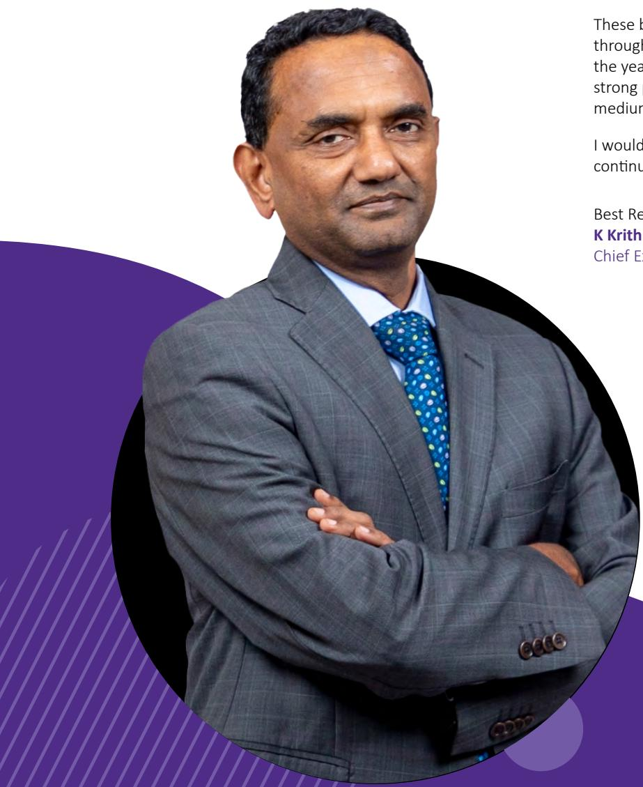

text_image

These b
through
the year
strong p
mediur
I would
continu
Best Re
K Krith
Chief Ex

As part of their continuing digital transformation journey, we see sustained focus on cloud adoption, data architecture, customer experience and business model transformation. Through these initiatives, our customers intend to avoid technology obsolescence, become an intelligent enterprise, introduce new products and services, orchestrate ecosystems and provide immersive, hyper-personalized experiences. In addition, all our customers have also committed to ambitious net-zero carbon emission targets.

On top of these current focus areas, technologies like 5G, IoT, generative AI, virtual reality / metaverse, digital twin and others are also gaining attention and are likely to attract investments in the short to medium term.

As technology adoption will remain a key driver of business growth and transformation for our clients, we have been relentlessly focussed on our clients’ needs and have been investing in building newer capabilities to help them accelerate technology adoption. Your company continues to focus on enhancing the talent base of its associates, building partnerships with key technology providers, expanding the innovation ecosystem and building its own products and platforms.

These business and technology trends drove a strong deal flow throughout FY 2023, peaking in the fourth quarter. We closed the year with an order book of \$34.1 Bn. This along with the strong pipeline replenishment gives us a good visibility for the medium term.

I would like to take this opportunity to thank you for your continued support in this exciting journey ahead.

Best Regards,

K Krithivasan

Chief Executive Officer and Managing Director

# The Year Gone by

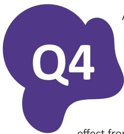

text_image

Q4
effect from

After a stellar 22-year career at TCS and a successful stint as Managing Director and CEO from 2017 to 2023, Rajesh Gopinathan decided to step down from his role, and resign from TCS effective September 15, 2023, to pursue other interests. The Board nominated K Krithivasan to step into the role with om June 1, 2023.

Ranked the number one IT service provider for customer satisfaction in Europe in an independent survey of over 1,800 CXOs by Whitelane Research. This is the tenth consecutive year that TCS has received the top ranking in this survey. Of the top 23 IT service providers ranked on customer satisfaction, TCS topped the list, scoring 83%, versus the group’s average of 75%.

Announced an expansion of its long-standing partnership with Phoenix Group, UK’s largest long-term savings and retirements provider, to digitally transform the latter’s ReAssure business using the TCS BaNCS™ based digital platform, and to administer the insurer’s 3 million policies. Consolidating on TCS’ platform will help Phoenix Group drive synergies and enhance customer experience.

Named to the Forbes list of America’s Best Large Employers, based on a large, independent survey of US employees. TCS was also recognized as a Global Top Employer for the eighth year in a row, and as Top Employer in North America, Europe, Asia Pacific, and Latin America.

Rated Baa1 by Moody’s credit rating agency, reflecting moderate credit risk for entities in the investment grade category. The company’s good corporate governance practices, extremely strong balance sheet, large liquidity and net cash position were cited as key credit strengths supporting this rating.

TCS-sponsored marathons, such as the TCS New York City Marathon, TCS Amsterdam Marathon, TCS Toronto Waterfront Marathon and TCS Lidingöloppet returned to the streets, much to the delight of runners and spectators alike. The company also took on the title sponsorship of the TCS London Marathon.

Named to FORTUNE® magazine’s list of the World’s Most Admired Companies, regarded as a barometer of corporate reputation. Evaluation criteria include innovation, social responsibility, quality of management, global competitiveness, talent management, and quality of products/services.

FORTUNE

natural_image

Abstract graphic with colorful vertical bars on a dark blue background (no text or symbols)

WORLD'S MOST ADMIRED COMNIE 2023

Announced a special dividend of ₹67 per share, along with three interim dividends of ₹8 each. This, along with the final dividend of ₹24, amounted to a total dividend of ₹115 per share. The total shareholder payout for the year was ₹42,079 crore.

Selected as a strategic partner by Bombardier, a global leader in aviation, to drive its organization-wide IT and digital transformation to enhance its agility. TCS will modernize the aviation leader’s legacy systems across multiple verticals, deploy and integrate new systems around the S/4 HANA ERP platform and transform the operating model using AI and ML.

text_image

TCS-sponsored Marathons, such as the TCS New York City Marathon, TCS Amsterdam Marathon, TCS Toronto Waterfront Marathon and TCS Lidingöloppet returned to the streets, much to the delight of runners and spectators alike. The company also took on the title sponsorship of the TCS London Marathon.
TCS New York City Marathon
TCS Amsterdam Marathon
TCS Lidingöloppet
FINISH
TCS Amsterdam MARATHON
NORGAIN
6:47:25
TCS
TATA
LIDINGÖLOPPET
The Year Gone by | 12

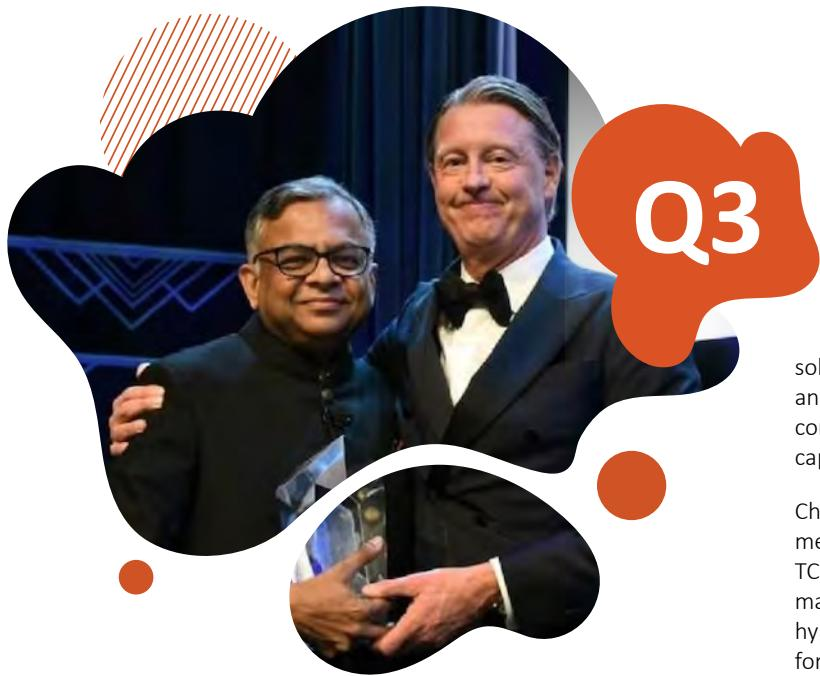

text_image

Q3
sol
an
co
cap
Ch
me
TC
ma
hy
for

Tata Group Chairperson and TCS Chairman, N Chandrasekaran, was bestowed with the Eisenhower Global Leadership Award for his contribution to commerce, by the non-profit, Business Council for International Understanding. Hans Vestberg, the Chairman and CEO of Verizon, presented N Chandrasekaran with the award and described him as “one of the most purpose-driven and influential leaders of our time”.

Selected by Sainsbury’s, a leading supermarket retailer in UK, as its transformation partner to modernize its infrastructure landscape using TCS Enterprise Cloud™. Additionally, TCS will provide end-to-end managed services for application support, information security, modern workplace services, and network connectivity. The new flexible and scalable digital core will help Sainsbury’s provide better value to customers through innovation and lower cost to serve; drive growth with data-led, machine-first core operations; and meet its net zero goals.

Selected by AGL, Australia’s largest energy provider, as the partner for the Retail Next Program, which lays the foundation for their strategic business transformation into a multi-service retailer. The program aims to create a new unified platform for CRM, product catalogue and process automation. TCS brings together cross-industry expertise like service bundling and retail customer analytics, in addition to deep knowledge of utilities which will help AGL enhance its speed to market, and transform

consumer and agent experience.

Launched the TCS Quantum Computing Lab on AWS to help enterprises explore, develop, and test business solutions and accelerate the adoption of quantum computing, considered one of the most promising technologies of the decade. TCS will leverage the virtual research and development environment to design industry-leading solutions, build domain-centric performance benchmarks, and work with clients to co-create new use cases of quantum computing to tackle business challenges that defy the capabilities of conventional technologies.

Chosen by Rail Delivery Group, UK’s leading rail industry membership body, for the creation of a Rail Data Marketplace. TCS will leverage the data syndication, monetization and marketplace features of its DeXAM platform on a leading hyperscaler platform to combine fragmented sources of rail data forming one digital service. This will optimize the sharing of data and real-time information to passengers and operational bodies, improve transparency and enable a UK-wide railway innovation ecosystem.

Enhanced its award-winning Quartz™ solution to enable central and commercial banks to support the entire lifecycle of Central Bank Digital Currency (CBDC) issuance, book-keeping and transactions. With the enhanced solution, central banks will be able to manage the issuance and distribution of CBDCs while commercial banks can transact with other banks and payment services providers using CBDCs as well as offer their customers the ability to hold CBDC balances.

Partnered with BT Group, UK’s leading provider of fixed and mobile telecommunications, for its Digital Unit to boost its modernization plans. TCS will manage and ramp down over 70% of Digital’s legacy technology estate and boost its capacity to accelerate the build of its new strategic technology architecture, supporting the Group’s growth.

Won the 2022 Microsoft Supplier of the Year award in the large supplier category. TCS was recognized for consistently delivering new capabilities with automation solutions that help improve accuracy for Microsoft, while also increasing its speed to market. TCS was cited for its expertise across industries that enables Microsoft to better serve customers, showcasing what it means to focus on strategy, impact, agility, and modernization.

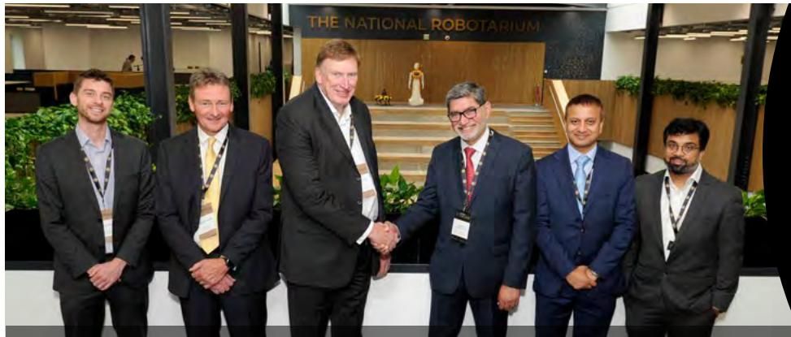

text_image

THE NATIONAL ROBOTARIUM

Delegates from The National Robotarium and TCS announce a major research partnership

Announced a major applied engineering and research partnership with The National Robotarium, the UK’s largest and most advanced AI and robotics research center. The partnership will work on innovation, to support early-stage AI and robotics product development, entrepreneurship, job creation and building digital skills in the workforce.

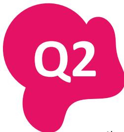

text_image

Q2

Partnered with C&S Wholesale

Grocers, Inc., to build a new cloudbased operations platform to reduce the company’s carbon footprint and enhance the customer experience.

Using AI and machine learning, C&S’s new operations platform will monitor traffic patterns and identify optimal distribution routes, thereby ng food waste and achieving greater fuel efficiency.

Launched the TCS Mobility Cloud Suite, a rich toolbox of cloud-enabled software to help automotive manufacturers and suppliers innovate, adapt, and thrive. It includes ready-to-deploy automotive-specific digital frameworks, custom solutions, accelerators, and use cases that enable automakers and their solution providers to embrace digital technologies and new business models across the entire mobility value chain.

Boots, a leading UK health and beauty retailer, announced the launch of the new INNOVATE workspace, powered by TCS Pace™, at its headquarters in Nottingham, UK. INNOVATE aims to nurture a start-up culture within the organization and is designed to be an agile incubator, combining creative space with top talent and emerging technology, to drive innovation.

Launched its ESG Integration Solution on AWS to help financial institutions more easily and accurately measure the impact of environmental, social, and governance (ESG) factors in their investment analysis. With a cloud-native ESG data ingestion platform and proprietary ESG scoring model, the solution is integrated with AWS Data Exchange, and enables greater transparency and flexibility in measuring investment portfolios against ESG criteria and benchmarks.

Former CFO, V Ramakrishnan (“Ramki”) passed away in July 2022. He served as the CFO of TCS from February 2017 until his retirement in April 2021. He was ranked Best CFO in the All-Asia Executive Team survey by Institutional Investors magazine. He was an accomplished professional known for his tremendous dedication and commitment, with an association of over four decades with TCS and the Tata Group.

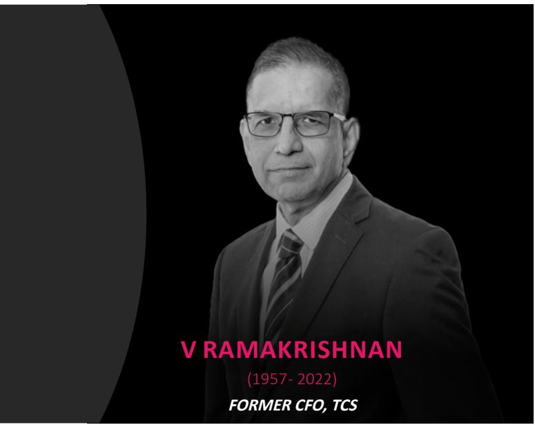

text_image

V RAMAKRISHNAN
(1957- 2022)
FORMER CFO, TCS

Was the only Indian brand in the Top 50 in the 2022 Kantar BrandZ Top 100 Most Valuable Global Brands. TCS was also named among the Top 10 fastest growing brands with its brand value growing 61% YoY (as measured by Kantar). Later in the year, the company was ranked the second most valuable IT services brand (brand value up 2% to US\$17.2 billion) by Brand Finance.

Ranked #2 in CRN’s 2022 Solution Provider 500 list that ranks the top system integrators, IT services providers and IT consultants by revenue in North America. In the UK, TCS retained its #1 position by revenue across the entire technology ecosystem including hyperscalers, software vendors and IT/ITe service providers in the 2022 TechMarketView UK Software and IT Services Supplier Rankings report.

Launched TCS Pace Port™ Pittsburgh, its fourth global research and co-innovation hub after Tokyo, New York and Amsterdam. The latest facility, in the Carnegie Mellon University campus, specializes in innovation in the manufacturing and utilities sectors. Later in the year, TCS launched its fifth Pace Port in Toronto.

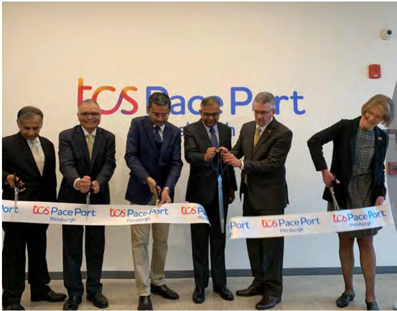

text_image

tCS Pace Port
Pittsburgh
tCS Pace Port
Pittsburgh
tCS Pace Port
Pittsburgh
tCS Pace Port
Pittsburgh
tCS Pace Port
Pittsburgh

Selected by The Kansas Department of Labor to deploy a modern, secure, cloud-based platform for the state’s unemployment insurance program, replacing its 70s-era mainframe system. Once deployed, the new system is expected to drastically improve the delivery of services to Kansas residents. The TCS-built platform is currently used by the state labor departments in Connecticut, Maine, Mississippi, Missouri, and Wyoming, and is under implementation at a couple of other states.

Named by FinanceAsia in its list of Asia’s Best Companies 2022, as the Best Managed Company in India, as well as Most Effective in Creating and Implementing D&I Policies over the past 12 months. The list is based on their annual poll of investors and analysts in the region. - - - - -

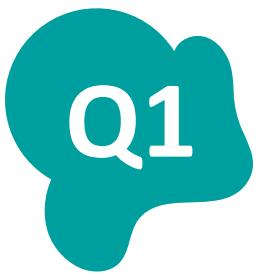

text_image

Q1

# TCS Integrated Business Model

Value Creation using the Five Capitals   
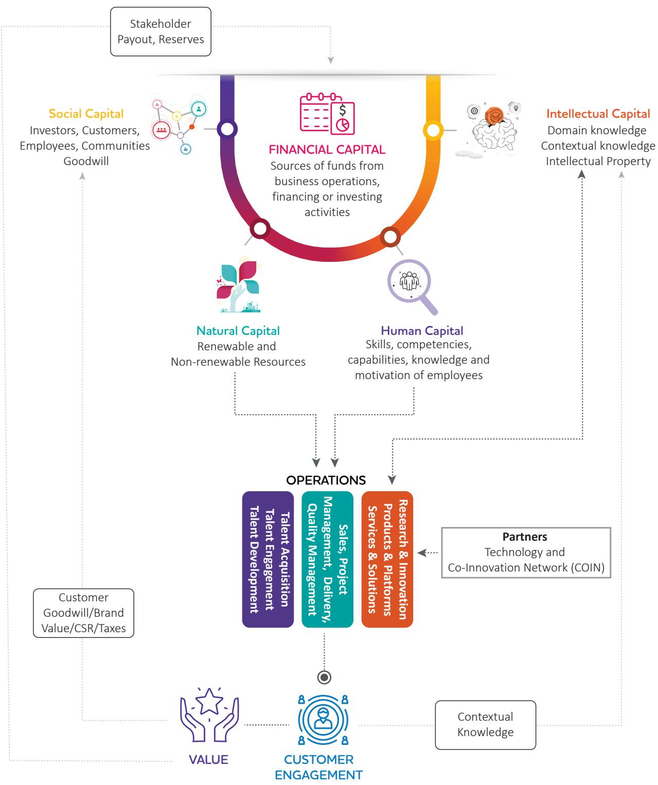

flowchart

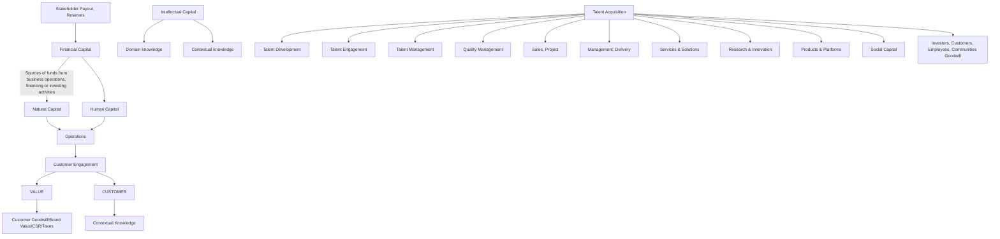
```mermaid
graph TD
    A["Financial Capital"] -->|Sources of funds from business operations, financing or investing activities| B["Natural Capital"]
    A --> C["Human Capital"]
    B --> D["Operations"]
    C --> D
    D --> E["Customer Engagement"]
    E --> F["VALUE"]
    E --> G["CUSTOMER"]
    F --> H["Customer Goodwill/Brand Value/CSR/Taxes"]
    G --> I["Contextual Knowledge"]
    J["Stakeholder Payout, Reserves"] --> A
    K["Intellectual Capital"] --> L["Domain knowledge"]
    K --> M["Contextual knowledge"]
    N["Talent Acquisition"] --> O["Talent Development"]
    N --> P["Talent Engagement"]
    N --> Q["Talent Management"]
    N --> R["Quality Management"]
    N --> S["Sales, Project"]
    N --> T["Management, Delivery"]
    N --> U["Services & Solutions"]
    N --> V["Research & Innovation"]
    N --> W["Products & Platforms"]
    N --> X["Social Capital"]
    N --> Y["Investors, Customers, Employees, Communities Goodwill"]
```

# Financial Capital

TCS’ longevity is testimony to the strength of our business model and our ability to reinvent ourselves in an ever-evolving technology landscape to stay relevant to our customers while remaining focused on creating value for all our stakeholders.

# Outcomes

Best in class profitability and strong balance sheet provide greater ability to invest in newer capabilities and to weather economic dowturns, macro uncertainties   
Consistently high shareholder returns enhances social capital

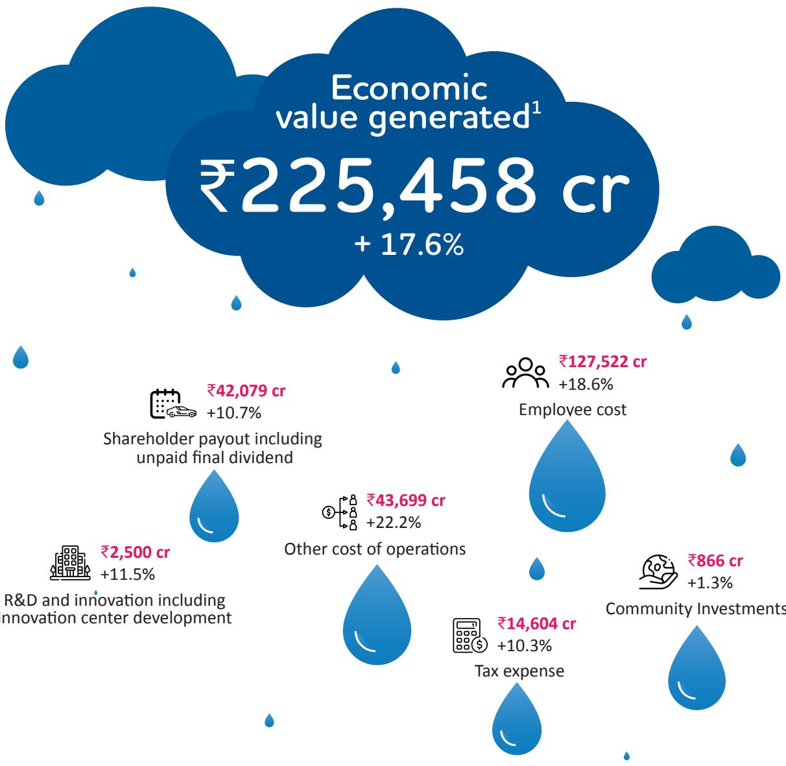

other

| Category                                      | Value (€)     |
|-----------------------------------------------|---------------|
| Employee cost                                | 127,522        |
| Other cost of operations                     | 43,699        |
| R&D and innovation including innovation center development | 2,500         |
| Tax expense                                  | 14,604        |
| Community Investments                        | 866           |
| Shareholder payout including unpaid final dividend | 42,079        |
| Shareholder payout including unpaid final dividend | +42,079        |
| Other cost of operations                      | +22.2%        |
| R&D and innovation including innovation center development | +11.5%        |
| Employee cost                                 | +18.6%        |
| Community Investments                        | +1.3%         |

Revenue Trend CAGR 12.9%   
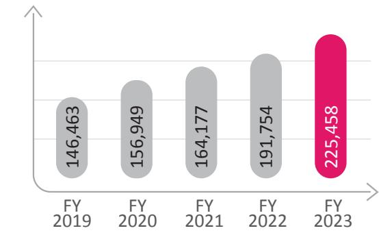

bar

| Fiscal Year | Value |
|---|---|
| FY 2019 | 146,463 |
| FY 2020 | 156,949 |
| FY 2021 | 164,177 |
| FY 2022 | 191,754 |
| FY 2023 | 225,458 |

(₹ crore)

Operating Profit Trend   
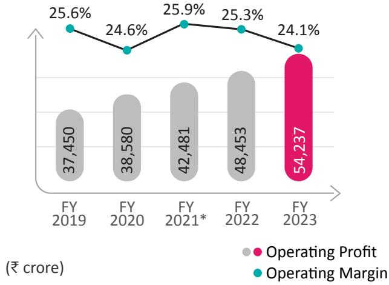

bar_line

| Fiscal Year | Operating Profit (₹ crore) | Operating Margin (%) |
| :--- | :--- | :--- |
| FY 2019 | 37,450 | 25.6 |
| FY 2020 | 38,580 | 24.6 |
| FY 2021* | 42,481 | 25.9 |
| FY 2022 | 48,453 | 25.3 |
| FY 2023 | 54,237 | 24.1 |
(₹ crore)

Earnings per share CAGR 11.4%   
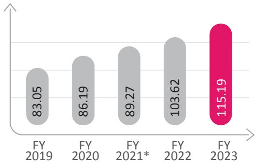

bar

| Year | Value |
| :--- | :--- |
| FY 2019 | 83.05 |
| FY 2020 | 86.19 |
| FY 2021* | 89.27 |
| FY 2022 | 103.62 |
| FY 2023 | 115.19 |

(Amount in ₹)

OCF and Cash Conversion   
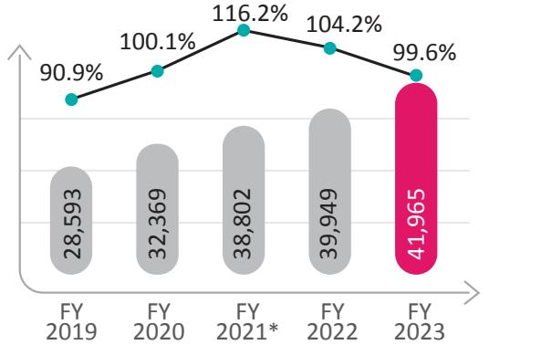

bar_line

| Year | Value | Percentage (%) |
| :--- | :--- | :--- |
| FY 2019 | 28,593 | 90.9 |
| FY 2020 | 32,369 | 100.1 |
| FY 2021* | 38,802 | 116.2 |
| FY 2022 | 39,949 | 104.2 |
| FY 2023 | 41,965 | 99.6 |

(₹ crore)   
Operating Cash Flow (OCF)   
OCF to Net Profit Ratio

# Cash Usage#

• Invested Funds   
• Acquisitions etc   
• Capex   
Shareholder Distribution

\# Cash usage for the period FY 2019 to FY 2023

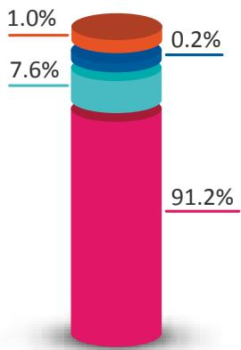

bar_stacked

| Category | Percentage (%) |
| :--- | :--- |
| Segment 1 | 1.0 |
| Segment 2 | 7.6 |
| Segment 3 | 0.2 |
| Segment 4 | 91.2 |

# Shareholder Payouts

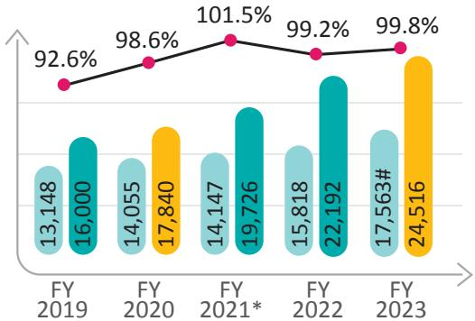

bar_line

| Year | Bar Value | Line Value (%) |
| :--- | :--- | :--- |
| FY 2019 | 13,148 | 92.6 |
| FY 2020 | 16,000 | 98.6 |
| FY 2021* | 14,147 | 101.5 |
| FY 2022 | 15,818 | 99.2 |
| FY 2023 | 17,563# | 99.8 |

Dividend Special Dividend Buyback including tax   
Shareholder Payout ratio (Including special dividend and buyback, including tax)

\# includes proposed final dividend

(₹ crore)

Best in Class Talent Management   
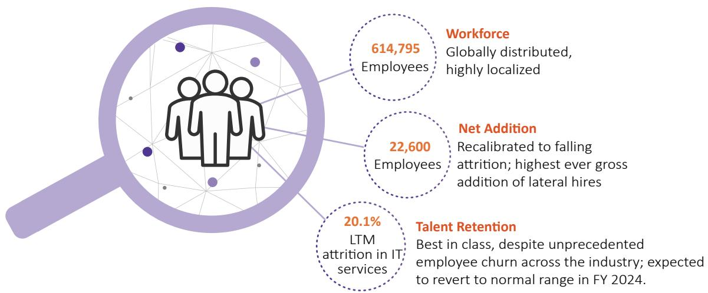

other

| Category | Value | Notes |
| -------- | ----- | ----- |
| Workforce | 614,795 | Globally distributed, highly localized |
| Net Addition | 22,600 | Recalibrated to falling attrition; highest ever gross addition of lateral hires |
| Talent Retention | 20.1% | Best in class, despite unprecedented employee churn across the industry; expected to revert to normal range in FY 2024. |

Talent Diversity and Inclusion

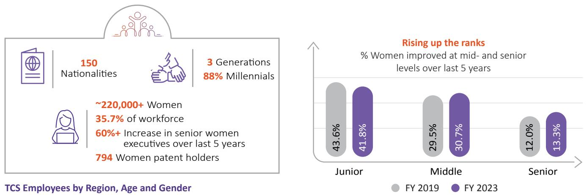

bar

| Region | Age Group | Women (%) | Female (%) |
| :--- | :--- | :--- | :--- |
| Nationalities | 150 | 43.6 | 41.8 |
| 3 Generations | 3 | 35.7 | 88 |
| Women | ~220,000+ | 60 | 60 |
| Workforce | 35.7 | 35.7 | 35.7 |
| Increase in senior women executives over last 5 years | 794 | 60 | 60 |
| Women patent holders | | | |
| Junior | | | 43.6 |
| Middle | | 29.5 | 30.7 |
| Senior | | 12.0 | 13.3 |
Rising up the ranks
% Women improved at mid- and senior levels over last 5 years

India   
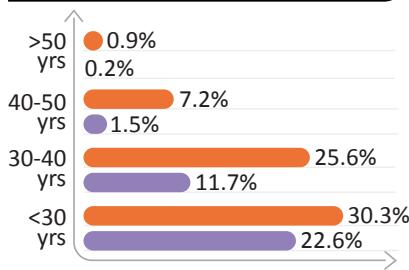

bar

| Age Group | Orange (%) | Purple (%) |
|---|---|---|
| >50 yrs | 0.9 | 0.2 |
| 40-50 yrs | 7.2 | 1.5 |
| 30-40 yrs | 25.6 | 11.7 |
| <30 yrs | 30.3 | 22.6 |

Europe   
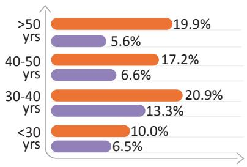

bar

| Age Group | Orange Bar (%) | Purple Bar (%) |
| :--- | :--- | :--- |
| >50 yrs | 19.9 | 5.6 |
| 40-50 yrs | 17.2 | 6.6 |
| 30-40 yrs | 20.9 | 13.3 |
| <30 yrs | 10.0 | 6.5 |

North America   
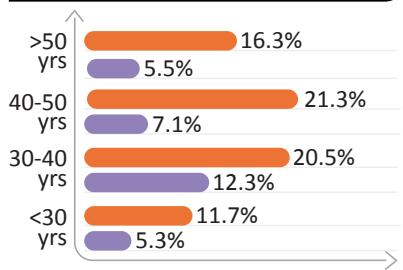

bar

| Age Group | Orange Bar (%) | Purple Bar (%) |
|---|---|---|
| >50 yrs | 16.3 | 5.5 |
| 40-50 yrs | 21.3 | 7.1 |
| 30-40 yrs | 20.5 | 12.3 |
| <30 yrs | 11.7 | 5.3 |

Emerging Markets   
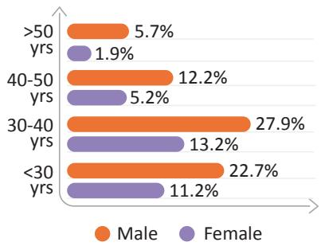

bar

| Age Group | Male (%) | Female (%) |
|---|---|---|
| >50 yrs | 5.7 | 1.9 |
| 40-50 yrs | 12.2 | 5.2 |
| 30-40 yrs | 27.9 | 13.2 |
| <30 yrs | 22.7 | 11.2 |

United Kingdom   
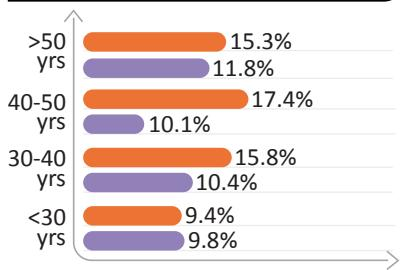

bar

| Age Group | Orange Bar (%) | Purple Bar (%) |
|---|---|---|
| >50 yrs | 15.3 | 11.8 |
| 40-50 yrs | 17.4 | 10.1 |
| 30-40 yrs | 15.8 | 10.4 |
| <30 yrs | 9.4 | 9.8 |

APAC   
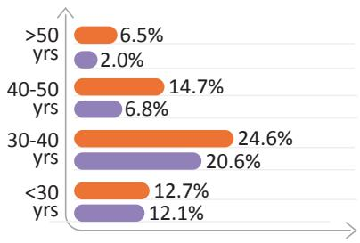

bar

| Age Group | Orange Bar (%) | Purple Bar (%) |
|---|---|---|
| >50 yrs | 6.5 | 2.0 |
| 40-50 yrs | 14.7 | 6.8 |
| 30-40 yrs | 24.6 | 20.6 |
| <30 yrs | 12.7 | 12.1 |

# Talent Development

TCS takes a purpose-centric approach to learning and development that leverages horizontal collaboration and the abundance of internal expertise. Catering to millennial tastes, training is just-in-time, just-for-me and just-enough.

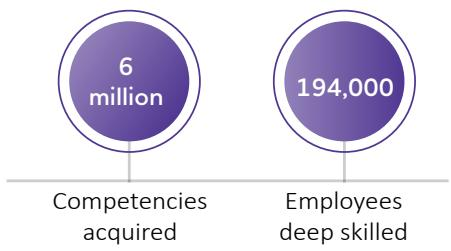

pie

| Category              | Value     |
| --------------------- | --------- |
| Competencies acquired | 6 million |
| Employees deep skilled | 194,000   |

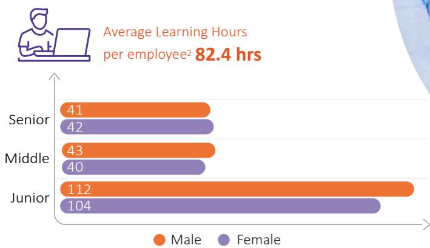

bar

Average Learning Hours per employee² 82.4 hrs
| Employee | Male | Female |
| :--- | :--- | :--- |
| Senior | 41 | 42 |
| Middle | 43 | 40 |
| Junior | 112 | 104 |

natural_image

Group of business professionals in a meeting setting, smiling and clapping (no visible text or symbols)

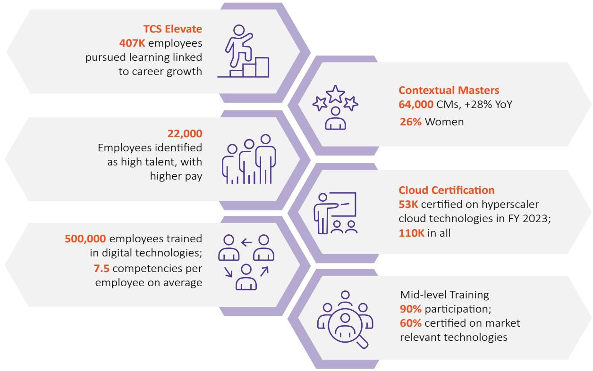

other

| Category | Value |
| --- | --- |
| TCS Elevate | 407K employees |
| Contextual Masters | 64,000 CMs, +28% YoY |
| Cloud Certification | 53K certified on hyperscaler cloud technologies in FY 2023; 110K in all |
| Digital Technologies | 500,000 employees trained in digital technologies; 7.5 competencies per employee on average |
| Market Relevant Technologies | 90% participation; 60% certified on market relevant technologies |

# Intellectual Capital

The company channelizes its research and innovation efforts and outcomes towards building better futures through two external facing brands:

TCS Research produces foundational inventions that impact industry and society.   
TCS PaceTM brings the best of TCS’ intellectual content, innovation assets, capabilities, and practices to clients.

Focus Areas of TCS’ R&I:   

natural_image

Abstract diagram of interlocking gears with icons representing technology, energy, and sustainability (no text or symbols)

  
Purposeful AI

  
Computing Futures

# Physical Sciences

• Meta Materials for Communications   
• New Materials Formulation   
• Li-ion Batteries   
• Catalysis   
Effluent Treatment

# Behavioural and Business Sciences

• Emotional Wellbeing for Enterprise   
• Consumer Behavior in Retail   
• Gamified Engagement and Learning   
• Understanding Personae in Connected Homes

# Life Sciences

• Generative Design in:   
◦ Drug (including vaccines and proteins) design and synthesis   
◦ Molecules, Formulations and Manufacturing Processes

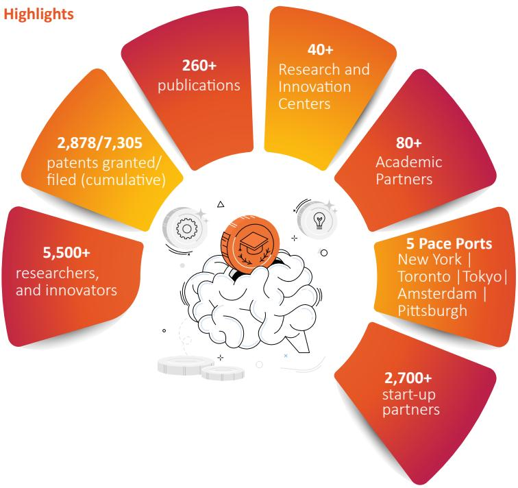

  
Digital Sciences

  
Sustainability

# Computing / Data Sciences

• High Performance Computing and AI   
• Multicloud deployments   
Cyber Cloud - Data Residency, Compliance, Security - Resilience on Cloud   
Low Energy Hardware, Low Energy High Performance Computing   
• Edge Hardware for Compute and Communication   
• Quantum Communications   
• Robo Logistics   
• Learning Aided Adaptive Software   
• Digital Transformation for Applications   
AI in Software Development Lifecycle and Data Analytics   
• AI for Cybersecurity   
Privacy preserving Service Operations, Privacy preserving Biometrics, Trustworthy AI   
Remote Sensing Spacetech for Sustainability and Infrastructure   
• Energy Internet and Carbon Market   
Sustainability in Manufacturing, Carbon Capture, NetZero Transition and Renewables

# tos BOUNCS™

• 10 new wins and 15 go-lives in FY 2023   
• Highlights:

◦ Services more than 35% of the world’s banking population

8 out of top 10 custodian and asset management firms run on TCS BaNCS

◦ More than 100 million transactions run on TCS BaNCS Cloud daily   
◦ Records 10 million new trades per day (peak) across 100+ countries   
◦ Offers ready market connectivity to 45+ local markets for settlements   
◦ Services over 30 million life, annuity and pension policies and 135 million property and casualty policies across the globe

# IgNIo

World leading cognitive automation software for IT and business operations   
18,832 ignio trained professionals, 8,664 ignio certified professionals till date   
• 186+ deals closed, 27 new customers went live in FY 2023

# tosioN

• 450+ new wins in FY 2023   
62 million candidates assessed   
• 70+ new learning programs launched   
• 16 patents filed in FY 2023; 23 granted   
• Over 1,900 corporates now use TCS NQT for fresher hiring

# ADDTM

Comprehensive suite for digital transformation of drug development and clinical trials   
700+ clinical trials supported by TCS ADD Platforms till date.   
• 2 new wins and 4 go-lives in FY 2023

# tcS HOBS™

Plug and play SaaS based business platform to digitally transform business, network and revenue management domains of subscription-based businesses   
• 5 new wins and 6 go-lives in FY 2023

# tos Optumera™

AI and ML powered merchandise optimization platform that enables retailers to optimize their space, mix and price in an integrated manner   
• 2 new wins and 4 go-lives in FY 2023

# tos TwinX™

AI powered enterprise digital twin covering customer, product and process to help business leaders simulate and optimize enterprise decisions, predict and proactively manage outcomes   
• Helps businesses achieve:

◦ Upto 10-15% increase in revenue   
◦ Reduced revenue leakage   
◦ Upto 2X faster time to market   
◦ Upto 15% reduction in cycle time   
◦ Enhanced customer experience   
◦ Minimized waste

• 10 new wins and 7 go-lives in FY 2023

# tcs OmniStore™

AI powered unified commerce platform to orchestrate unified omnichannel customer journeys and help businesses roll out new services and apps quickly without worrying about channel constraints. It can serve diverse lines of business – general merchandise, discount, specialty, fashion, restaurant, post office, telecom, and travel and hospitality industries   
• 8 go-lives in FY 2023

# MasterCraft

Digital platform to optimally automate and manage IT processes. FY 2023 highlights:   
Processed 325 billion records for data privacy and 15 billion records for data quality

◦ Automated generation of 60+ million lines of Java and JavaScript code, with over 50% productivity gains   
◦ Analyzed 600 million lines of legacy code, delivering a productivity improvement of 20-30%

• 111 new wins in FY 2023

# jile

SaaS-based, scalable Agile DevOps platform to accelerate software development and delivery and integrate DevOps tools   
• 23 new wins and 6 go-lives in FY 2023

# QUARTZ

Intelligent smart contract development toolkits, Integration solutions and ‘Designed for DLT’ business solutions that provides foundational technology, tools and business components for creating distributed ledger solutions across varied industries   
• 5 new wins and 6 go-lives in FY 2023

# Social Capital

TCS’ business model and strategy have resulted in deep and enduring customer relationships, a vibrant and engaged workforce, a steady expansion of its addressable market, a strong reputation as a responsible corporate citizen and a proven track record in delivering longer term stakeholder value. All of this has significantly enhanced the company’s brand value, which is a quantifiable measure of its social capital with stakeholders.

# Customers

Customer-centricity is at the core of TCS’ business strategy. It seeks to deliver superior outcomes, and build strong, enduring relationships. By proactively investing in building newer capabilities, and launching new services and solutions with which to add value in newer parts of the client’s business, TCS continually expands and deepens its client relationships.

Large Client Metrics   
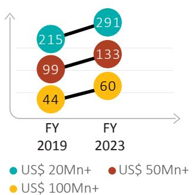

line

| Year | US$ 20Mn+ | US$ 50Mn+ | US$ 100Mn+ |
|---|---|---|---|
| FY 2019 | 215 | 99 | 44 |
| FY 2023 | 291 | 133 | 60 |

Rev per US\$ 1 Million+ Client (\$ Mn)   
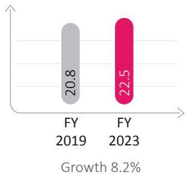

bar

| Year | Value |
| :--- | :--- |
| FY 2019 | 20.8 |
| FY 2023 | 22.5 |
Growth 8.2%

# Outcomes

Expanding participation across broad range of stakeholders across the enterprise including business heads, CMOs, CROs, COOs, CFOs and even CEOs   
Continual expansion of customer relationships in terms of services consumed   
Highly satisfied customers

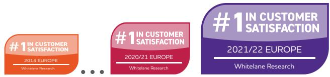

text_image

#1 IN CUSTOMER SATISFACTION
2014 EUROPE
Whitelane Research
#1 IN CUSTOMER SATISFACTION
2020/21 EUROPE
Whitelane Research
#1 IN CUSTOMER SATISFACTION
2021/22 EUROPE
Whitelane Research

flowchart

```mermaid
graph TD
    A["User"] --> B["Node"]
    C["User"] --> B
    D["User"] --> B
    E["User"] --> B
    F["User"] --> B
    G["User"] --> B
    H["User"] --> B
    I["User"] --> B
    J["User"] --> B
    K["User"] --> B
    L["User"] --> B
    M["User"] --> B
    N["User"] --> B
    O["User"] --> B
    P["User"] --> B
    Q["User"] --> B
    R["User"] --> B
    S["User"] --> B
    T["User"] --> B
    U["User"] --> B
    V["User"] --> B
    W["User"] --> B
    X["User"] --> B
    Y["User"] --> B
    Z["User"] --> B
    AA["User"] --> B
    AB["User"] --> B
    AC["User"] --> B
    AD["User"] --> B
    AE["User"] --> B
    AF["User"] --> B
    AG["User"] --> B
    AH["User"] --> B
    AI["User"] --> B
    AJ["User"] --> B
    AK["User"] --> B
    AL["User"] --> B
    AM["User"] --> B
    AN["User"] --> B
    AO["User"] --> B
    AP["User"] --> B
    AQ["User"] --> B
    AR["User"] --> B
    AS["User"] --> B
    AT["User"] --> B
    AU["User"] --> B
    AV["User"] --> B
    AW["User"] --> B
    AX["User"] --> B
    AY["User"] --> B
    AZ["User"] --> B
    BA["User"] --> B
    BB["User"] --> B
    BC["User"] --> B
    BD["User"] --> B
    BE["User"] --> B
    BF["User"] --> B
    BG["User"] --> B
    BH["User"] --> B
    BI["User"] --> B
    BJ["User"] --> B
    BK["User"] --> B
    BL["User"] --> B
    BM["User"] --> B
    BN["User"] --> B
    BO["User"] --> B
    BP["User"] --> B
    BQ["User"] --> B
```

# Investors

TCS is seen as a benchmark in its outreach to investors, its transparency and disclosures, and communication of its longerterm strategy. For the last many years, its Investor Relations program has been winning awards based on surveys of investors and analysts across Asia.

other

| Metric | Value |
|---|---|
| Meetings* | 699 |
| Hours | 269 |

# Analyst Relations

TCS has a robust engagement program with research firms and industry analysts. Briefing industry analysts and participating in competitive assessments ensures visibility with prospective clients who use such reports to evaluate vendors.

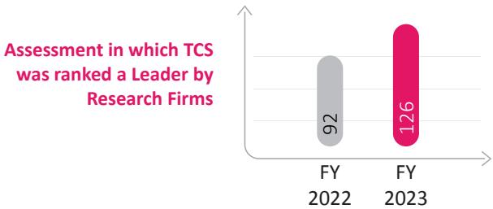

bar

Assessment in which TCS was ranked a Leader by Research Firms
| Year | Count |
| :--- | :--- |
| FY 2022 | 92 |
| FY 2023 | 126 |

# Branding

The strength of its customer relationships, reputation as a good employer, and the goodwill it enjoys with investors, local communities, academia and other stakeholders have helped build up the TCS brand. The brand has been strengthened by its tagline \`Building on Belief’, marketing campaigns and sponsored events. TCS is among the Top 2 brands in IT services by brand value according to Brand Finance.

TCS Brand Valuation   
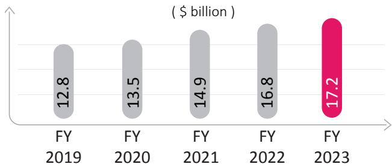

bar

| Fiscal Year | Value ($ billion) |
| :--- | :--- |
| FY 2019 | 12.8 |
| FY 2020 | 13.5 |
| FY 2021 | 14.9 |
| FY 2022 | 16.8 |
| FY 2023 | 17.2 |

Source: Brand Finance

Community1   
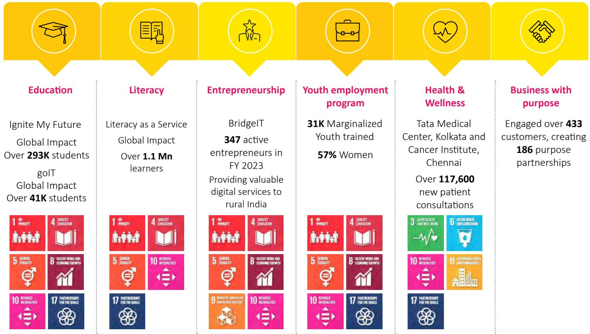

other

| Category | Subcategory | Value |
| -------- | ----------- | ----- |
| Education | Ignite My Future Global Impact Over 293K students goIT Global Impact Over 41K students | 293K |
| Education | Literacy as a Service Global Impact Over 1.1 Mn learners | 1.1Mn |
| Education | Entrepreneurship BridgeIT 347 active entrepreneurs in FY 2023 Providing valuable digital services to rural India | 347 |
| Education | Youth employment program 31K Marginalized Youth trained 57% Women | 31K |
| Education | Health & Wellness Tata Medical Center, Kolkata and Cancer Institute, Chennai Over 117,600 new patient consultations | 117,600 |
| Education | Business with purpose Engaged over 433 customers, creating 186 purpose partnerships | 433 |
| Literacy | 1 No Poverty | 1 |
| Literacy | 4 Quality Education | 4 |
| Literacy | 5 Gender Tolerance | 5 |
| Literacy | 8 Decent WORK AND ECONOMIC GROWTH | 8 |
| Literacy | 10 Retracted Responsibilities | 10 |
| Literacy | 17 Partnerships FOR THE GOALS | 17 |
| Entrepreneurship | 1 No Poverty | 1 |
| Entrepreneurship | 4 Quality Education | 4 |
| Entrepreneurship | 5 Gender Tolerance | 5 |
| Entrepreneurship | 8 Decent WORK AND ECONOMIC GROWTH | 8 |
| Entrepreneurship | 9 Recreality Innovation AND INRACTIVISION | 9 |
| Entrepreneurship | 10 Retracted Responsibilities | 10 |
| Entrepreneurship | 17 Partnerships FOR THE GOALS | 17 |
| Youth employment program | 1 No Poverty | 1 |
| Youth employment program | 4 Quality Education | 4 |
| Youth employment program | 5 Gender Tolerance | 5 |
| Youth employment program | 8 Decent WORK AND ECONOMIC GROWTH | 8 |
| Youth employment program | 10 Retracted Responsibilities | 10 |
| Youth employment program | 17 Partnerships FOR THE GOALS | 17 |
Business with purpose Engaged over 433 customers, creating 186 purpose partnerships

Our CSR programs on Education, Employment and Entrepreneurship ensured the   
inclusion of marginalized talent through social transformation

# 2.3x

Enhancement in income for women who complete YEP and get employment in comparison to a female employee in a rural areas

# 2.5x

Higher earnings for women BridgeIT participants compared to other selfemployed in rural India

# 88%

Students who completed goIT demonstrated understanding of how technology can be used to improve their community

# 81%

LaaS Program participants encouraged their own children especially girls to go to schools

  
₹866 crore CSR Spend

  
4.5 million beneficiaries

  
150K+ volunteers 2.8 million hours

  
7 major partnerships for program implementation at scale

natural_image

Outdoor scene with people gathered under trees, one person standing and another seated on a patterned mat (no visible text or symbols)

# Natural Capital

TCS combines its strong sense of purpose with digital expertise and innovation to drive not only its own sustainability journey, but also that of its customers. The company’s environmental stewardship rests on four pillars: carbon footprint mitigation, water conservation and recycling, waste reduction and recycling, and preserving biodiversity.

Energy Management and GHG Emissions Reduction 1   

text_image

7 AFFORDABLE AND CLEAN ENERGY
11 SUSTAINABLE CITIES AND COMMUNITIES
9 INDUSTRY, INNOVATION AND INFRASTRUCTURE
12 RESPONSIBLE CONSUMPTION AND PRODUCTION
13 CLIMATE ACTION

Target: 70% reduction of Scope 1 + 2 emissions by 2025 (vs base year 2016) and Net Zero by 2030

# Initiatives:

• 85% of emissions across Scope 1 and Scope 2 due to purchased electricity for office blocks.   
• Prioritized energy optimization and greater use of renewable energy.   
• Use of Clever Energy to optimize energy consumption, green buildings, green IT.

Outcomes   
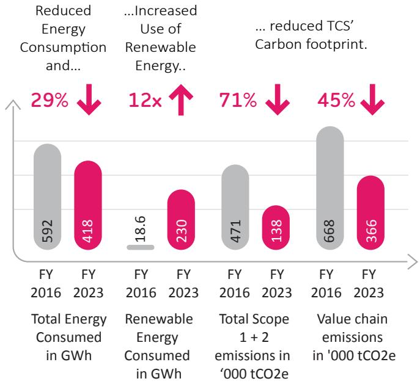

bar

| Year | Total Energy Consumed in GWh | Renewable Energy Consumed in GWh | Total Scope 1 + 2 emissions in '000 tCO2e | Value chain emissions in '000 tCO2e |
| :--- | :--- | :--- | :--- | :--- |
| FY 2016 | 592 | 18.6 | 471 | 668 |
| FY 2023 | 418 | 230 | 138 | 366 |
Red: Reduced Energy Consumption and...; ... Increased Use of Renewable Energy..; ... reduced TCS' Carbon footprint.
-29% ↓
-12x ↑
-71% ↓
-45% ↓

Achievements   
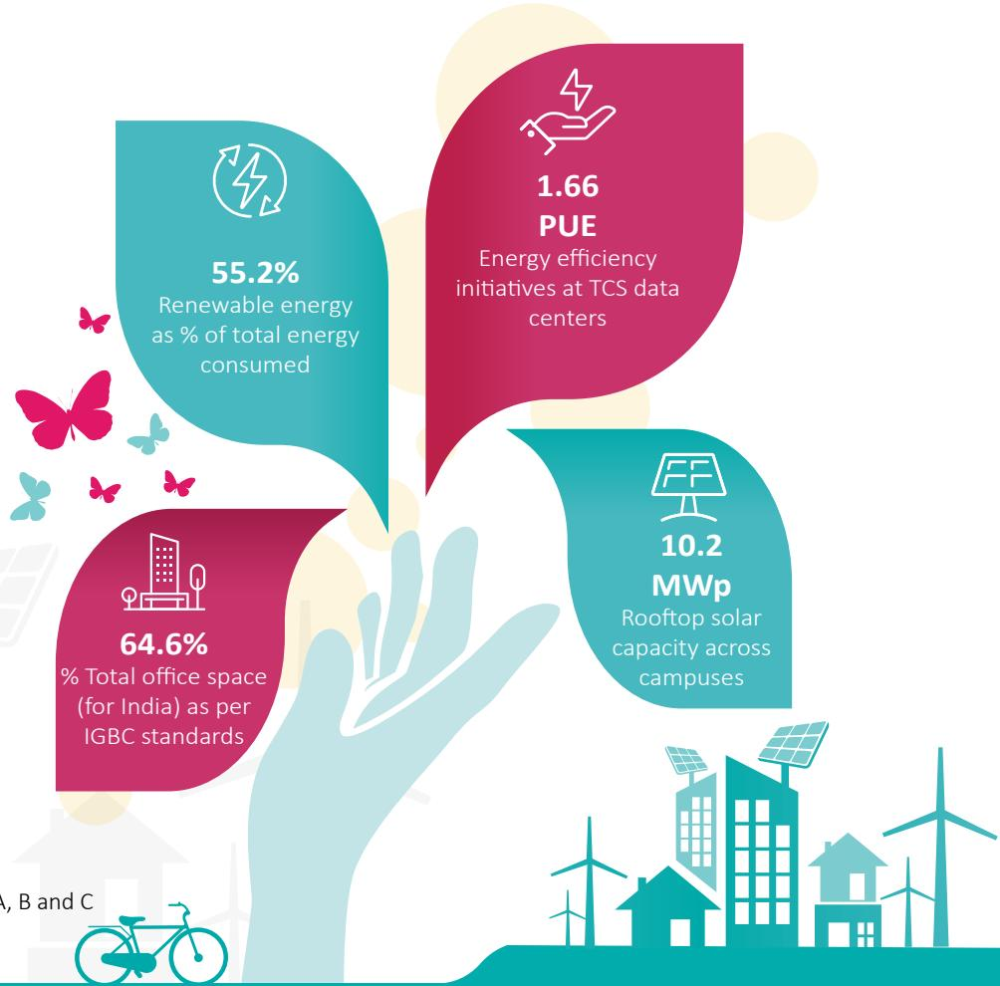

other

| Metric | Value |
| --- | --- |
| Renewable energy as % of total energy consumed | 55.2 |
| PUE | 1.66 |
| 64.6% Total office space (for India) as per IGBC standards | 64.6 |
| Rooftop solar capacity across campuses | 10.2 |

1 TCFD Metrics and Targets A, B and C

# Water Conservation

Target: 3% YoY reduction in freshwater consumption across owned campuses

Initiatives include conservation, sewage treatment and reuse, rainwater harvesting (RWH) and employee awareness. All new campuses have been designed for 50% higher water efficiency, 100% treatment and recycling of sewage, and rainwater harvesting.

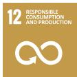

text_image

Conserv
TCS be
its cam
► 593
► 187
► 39,0

# Waste Reduction & Reuse

Target: Reduction in waste generation, maximizing recycling/ reuse to divert waste sent to landfill

# 100%

Recycling of regulated wastes, e-waste, printer cartridges, paper, packaging and plastics

# 88.4%

Food wastes recycled in biodigesters and organic waste converters on campuses

# Biodiversity

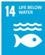

natural_image

Silhouette illustration of a hand holding butterflies, birds flying, and trees (no text or symbols)

Conservation and enhancement initiatives within TCS campuses.

TCS believes in preserving and enriching the biodiversity within its campuses. Various initiatives have helped support

593 species of flora   
187 species of fauna   
39,000 well grown trees.

# 2.29 Bn

Liters of fresh water consumed in FY 2023

# 2.5%

Water from RWH; 90 % from third party sources; 7.6% from ground water

# 88%

Water recycled (TCS owned campuses)

# 36%

Increased water consumption YoY at owned campuses due to 5 times increase in headcount

# Helping Versuni become a Digital-First, Innovation-Led Standalone Entity

Growth and transformation are often constrained by the challenge of integrating with the legacy operations stack, and the complexity that entails. So when health-tech giant Royal Philips sold Philips Domestic Appliances in 2021 to Hillhouse, a private equity firm, the standalone company, rebranded as Versuni, saw the separation as a once-in-a-lifetime opportunity to wipe the slate clean and transform into a digitally lean, agile, and innovation-led organization.

Versuni partnered with TCS in its transformation journey from strategy through execution, with a vision to embed insights and agility into core processes, enabling shorter time to value and quicker responses to market changes through a new cloud-first application landscape. The program entailed decoupling the company from the parent’s systems, while simultaneously transforming it across all business domains, within an ambitious 2-year timeframe.

The business transformation, enabled by SAP as the digital core, establishes best practices-based processes from the consumer

products industry and simplified ways of working to drive speed, agility and insights-led decision-making.

TCS enabled Versuni’s strategies for driving revenue growth opportunities and innovative product launches. The new processes support Versuni’s journey to develop products made with more sustainable materials, that are easier to repair, refurbish, recycle, and help to reduce waste.

Enhancements were made to deliver superior business outcomes across every function. Integrating supply chain planning with factory scheduling will enable higher warehouse productivity and more timely shipments. AI-powered insights in finance will help improve cash flow, free up cash and drive efficiencies in back-office functions. The new people processes will provide a better employee experience and enable a more responsive HR function.

Partnering with TCS helped Versuni deploy a new digital foundation and operate as an independent entity. The new fitfor-purpose stack enables Versuni to more effectively respond to the fast-changing demands of the consumer products market, and pursue its vision of turning houses into homes, and building lifetime engagement with consumers.

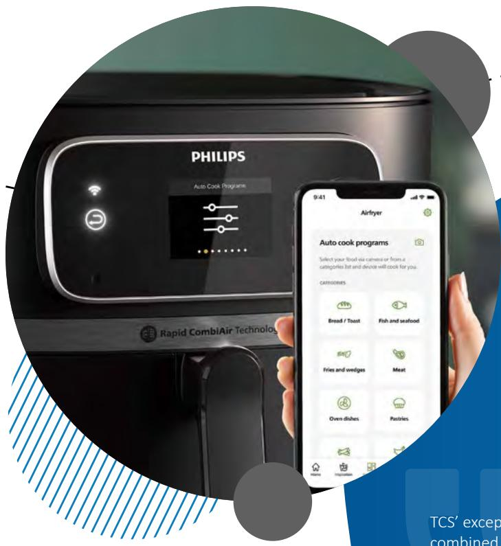

text_image

PHILIPS
Auto Cook Programs
9:41
Airfryer
Auto cook programs
Select your food via camera or from a
categories hot and device will cook for you.
cartioconers
Bread / Toast Fish and seafood
Fries and wedges Meat
Oven dishes Pastries
TCS' except
combined

I am really happy to have partnered with TCS in this journey. TCS has been an invaluable partner in our process and digital transformation journey with SAP as the main enabling technology suite. The hard work and dedication demonstrated by each member of the TCS team has not gone unnoticed. The leadership advisory services and commitment combined with the team’s domain and technology expertise is helping us get to our goals as an insights-led digital company.

# Corine Adams

CIO, Versuni

TCS’ exceptional leadership, expertise, and flexibility combined with their passion and thorough understanding of our mission to become insights-led, makes them an outstanding partner. The TCS leadership team has been with us every step of the way. This transformation will help us continue to innovate and to stay true to our mission to turn houses into homes.

# Henk S. de Jong

CEO, Versuni

# Enabling Eversource Energy’s

# Transition to a Green Energy Future

Energy utilities are leading the world’s energy transition, investing in renewable energy sources as part of their journey to carbon neutrality. Leaders in the sector are using technology innovatively to draw environmentally conscious consumers looking for greener choices, and grow their new clean energy businesses.

Eversource Energy is a Fortune 500 energy company that operates New England’s largest energy delivery system, with 4.4 million customers across Connecticut (CT), Massachusetts (MA) and New Hampshire. It is focused on making its operations carbon neutral by 2030, and bringing more clean and affordable energy to New England.

Eversource partnered with TCS to build a solution that would help them on-board distributed solar power capacity within its grid by purchasing power from residential, industrial and commercial customers who install solar panels and storage on their properties, and enabling them to avail of incentives offered by their respective states, as part of state-level Net Zero programs.

The TCS-built solution includes onboarding of new solar customers, a customer application that helps keep track of the units generated, and a pricing engine that uses a declining block pricing mechanism to incentivize early enrolment as a producer. It also includes a billing system that processes recovery charges, solar credits and incentive payments, and enables flexible payment options as well as hardship relief options to improve affordability and increase adoption of energy efficiency programs.

To facilitate quick roll outs across states, TCS architected a reusable framework that would simplify adoption of each state’s incentive program into Eversource’s core platform, enabling the utility to pursue a very aggressive implementation schedule for each state.

Using this solution, Eversource has been able to leverage state incentives to make green energy affordable and rapidly benefit nearly 430,000 customers in CT and MA so far, while driving growth of its clean energy business. At the same time, it is projected to produce over 9,700 MWh of solar power, accelerating not only its own journey to carbon neutrality but also that of the states it services.

Making green energy affordable is central to our business strategy. Its technology enablement was a fairly complex program with multiple sub-programs running concurrently. TCS did an outstanding job in collaborating well with multiple stakeholders and managing risks very well. The TCS team’s contextual knowledge of the Eversource business and technology landscape resulted in a high quality solution that helped meet the regulatory mandate as well as Eversource’s clean energy and energy affordability goals.

# David Coco

Director, IT Business Solutions Eversource Energy

natural_image

Two engineers in safety vests and hard hats inspecting solar panels on a rooftop (no visible text or symbols)

# How does TCS help clients innovate, adapt and thrive?

KAK: With all the geo-political tension and economic uncertainty in today’s world, companies need to respond quickly to events on the ground and cope with surprises, while staying focused on fulfilling customer needs and wants, with innovative products and services.

TCS helps them on both these fronts. We help build a futureready, digital core that enables quick, insights-driven decision making. We transform IT and business operating models using technology, making them more efficient, agile and responsive, freeing up resources to support innovation. Partnering with us enables our clients to try out a larger number of innovative ideas quickly, and launch new products, services and business models to drive growth and transformation.

Innovate, Adapt, Thrive refers to how our scale, full services capability and innovation offerings enable our clients to respond to short-term challenges while accelerating their pursuit of longer-term aspirations.

# Innovation is about having a lightbulb moment. How do you scale that?

HV: People often relate innovations to serendipitous discoveries. We help clients structure and scale the innovation process using the TCS Agile Innovation Cloud (AIC). This framework brings together the best of TCS’ talent, research and innovation inputs, global capabilities and ecosystem partnerships to scale up and speed up ‘Ideas to Outcomes’.

For an insurance major, we worked with the client’s teams and collated actionable innovation ideas through a series of brainstorming workshops using the Clay Map. Leveraging our AIC, we rapidly built POCs every quarter, some of which got turned into MVPs and rolled out across the enterprise. In just eight months, dozens of innovation ideas were identified, and 24 progressed to become MVPs.

One reason for this high yield is that our teams leverage their contextual knowledge, learned over years spent immersed in the client’s IT and business landscape, to come up with ideas deeply rooted in that organization’s reality and therefore more likely to succeed.

# Generative AI is the talk of the season. What is the business opportunity around it?

KAK: We see interest in exploring use cases right across the enterprise. The most obvious areas are conversational systems, content creation and digital marketing, and activities which

require processing of large amounts of unstructured data, text, images and higher-level abstraction.

Legal and procurement teams can use it to trawl through contracts to identify specific clauses, or prepare a summary of variations of a particular clause. HR could use it for handling employee queries. Sales and customer service want smart assistants that can explain product features and answer questions. In IT, generative AI can create basic code snippets or quality check developed code for adherence to standards.

These are just the initial ideas based on the standalone capabilities of generative AI. Over time, you will see newer use cases that are more combinatorial, driving greater spending by enterprises and expanding the opportunity significantly.

# If generative AI takes over coding, won’t the IT services industry become redundant?

KAK: Software that writes software has been around for a long time. In fact, this is the 50th anniversary of TCS’ very first offshore development project, delivered using an in-house code generator. In the 80s, our TRDDC was famous for its tools foundry, which could generate custom code translators on demand, converting source code from any programming language to any other language.

TCS MasterCraft™ is today used by hundreds of our clients for developing, transforming and maintaining model-based applications. In fact, our award-winning product suite, TCS BaNCS™, is written and maintained using MasterCraft. Even though there is effort involved in defining the model up-front, clients see significant productivity benefits.

The new low code, no code platforms have done away even with those overheads. Their graphical drag and drop user interface empowers people with no coding knowledge to build sophisticated applications very quickly.

And yet, none of this has led to any demand compression. It has only led to more growth. We believe generative AI will be no different. Like prior breakthrough technologies, it will sharply bring down the effort per function point, driving up programmer productivity immensely. This will result in greater consumption, with volume growth more than making up for the effort deflation.

# What is the evidence for this thesis?

HV: The evidence is empirical. Every new generation of technology has led to reduction in programming effort per function point. But while that has steadily fallen, aggregate spending on IT services has only risen year after year, over decades.

Take for example, the switch from assembly language to C. Its compilers came with large, extensible libraries of reusable pre-defined procedures. A developer could invoke a procedure with one line of code in C and embed its entire logic in the code base, without actually coding all of it from scratch. Three lines of C accomplished what took 30 lines in assembly language. The 10x effort deflation didn’t result in mass layoffs of programmers. Instead, there was an explosion in software development because the same IT team could now build ten times as many function points.

Similarly, enterprises adopted offshore outsourcing, it led to a big cost deflation, but nobody’s IT budgets deflated. Instead, those savings went into building new systems and volumes rose to fill budgets and spending on IT services has only expanded. Likewise with low-code, no-code platforms.

# Why is that so? Farm mechanization caused effort deflation and rendered the agricultural workforce redundant in the West.

KAK: With most goods and services, when the price falls, any increase in volume is limited by how much of that good or service the market can consume in a defined period. When farm mechanization reduced the cost of tilling, the increased demand for men in tractors was not large enough to compensate for the effort deflation because there was only so much land available to till.

Demand for IT services behaves differently. In every enterprise, there is significant unmet demand. Every CIO has limited capacity for new system development, resulting in a requirement backlog that never gets fulfilled. Technologies like generative AI or low code-no code can help a CIO expand capacity and accomplish much more with the same budget. But even then, the backlog never goes away because there is no limit on business users’ ingenuity or competitive drive. Demand just rises to fill the incremental capacity created by new technologies.

HV: The emergence of new technologies triggers more ideas, experimentation and more demand for our services. To that extent, business application of generative AI, along with other technologies, will itself drive the incremental demand that fills up the capacity it frees up through higher productivity.

# Indian IT companies are seen as fast followers on new technologies. Will that change with generative AI?

KAK: We have been leaders for a while, but perceptions can be too rooted in historic stereotypes to recognize the change. Back in 2008, when the term SaaS was still new, we had built a subscription-based, single instance, multi-tenant core banking platform using TCS BaNCS for small banks in India. A similar model is powering start-up banks in Israel today. The insurance platform launched in 2009, with shared services bundled in, went on to make us the market leader in life and pensions administration in the UK.

Historically, gaining leadership in IT services on any new technology required just training sufficient numbers of people in that technology, ahead of market demand. In the last decade, we not only did that at scale on the entire class of digital technologies, but also invested in higher order capabilities so we could advise our clients on how best to harness the combinatorial power of new technologies in their specific business context.

We scaled up our Research and Innovation, exploring use cases across different industries, creating solutions and showcasing them at our innovation centers. We expanded COIN, created new innovation frameworks and set up Pace Ports, our co-innovation hubs, across the world. Today, we not only have a large number of patents, but also the largest portfolio of products and platforms in our peer set, helping win large transformational engagements that uniquely distinguish us.

We are helping clients explore and develop end-to-end scenarios in combining technologies like quantum computing, generative AI, 5G and the emerging 6G, and new concepts in cyber security. Here in India, we have stitched together a fully indigenous network stack for 4G and 5G, a unique achievement that differentiates us from our global peers.

Elsewhere, we are pursuing 5G-enabled opportunities in operational technologies such as autonomous machines and remote operations. We are looking at emerging cross-industry ecosystem business models in sustainability and energy transition, which will be the big drivers of growth in the coming years.

HV: On the cloud, the biggest technology trend in recent years, we were one of the earliest to set up dedicated business units for each of the three leading hyperscaler clouds. Our early investments in building deep expertise and a large portfolio of innovative cloud-native solutions helped us capture tremendous growth and gain share.

We are today one of the largest partners – in some cases, the largest partner – to each of those providers, in terms of number of employees with certifications, volumes of workloads migrated to the cloud and in number of solutions and intellectual property on their platforms.

We are the launch partner for their latest offerings, whether it is AWS’ Mainframe Modernization, Finspace, and IoT Fleetwise offerings, or Azure’s Sustainability, Supply Chain Platform, and Financial Services and Retail Industry Cloud, and now for Google Cloud’s Generative AI solutions. If all this isn’t leadership, what is?

# Revolutionizing Small Value Payments in South Africa

BankservAfrica, Africa’s leading automated clearing house, has been facilitating payments in South Africa and the region, for over five decades through its seamless interbank clearing and settlement services. It has a track record of pioneering innovations like the SASWITCH, a national network of interoperable ATMs, in the mid-80s.

When the South African Reserve Bank unveiled its Vision 2025 strategy to reform the South African national payment system framework, BankservAfrica took the lead along with its ecosystem partners, and engaged TCS to build a new platform for rapid payments that would usher in the era of modern, cost-effective, instant digital payments on the continent.

TCS designed a high availability, containerized, cloud optimized solution with TCS BaNCS for Market Infrastructure at its core, using high performance microservices for clearing and payment. Hosted on a public cloud, the solution is very resilient and can auto-scale.

On the front-end, users can make a payment, or a request for payment, through a payment service called PayShap, formally launched in March 2023. Very conveniently, users don’t need to enter the recipient’s bank account or branch code details to make payments. Instead, they can use a unique identifier such as the recipient’s mobile number, or a bank-generated identification number, which serves as a proxy for the full banking details. This proxy and resolution is enabled through a tamper-proof blockchain-based solution powered by TCS’ Quartz Smart Solution.

By democratizing access to a frictionless system for low value payments, TCS’ innovative solution for BankservAfrica has the potential to reduce the use of cash for small transactions and accelerate formalization of the unorganized sector. It will drive new fee-based revenues for banks, and also offer customer insights with which they can offer credit to more consumers. This will not only improve financial inclusion, but also add to South Africa’s GDP growth – a fitting outcome for two very purpose-driven organizations that came together to build this platform of national importance.

natural_image

Smiling person in orange vest holding a smartphone at a market stall with red chili peppers and produce (no visible text or symbols)

BankservAfrica views cost-effective digital payments as a pathway to improving credit access and financial inclusion in South Africa. After an extensive evaluation, we selected TCS for their deep understanding of the payments ecosystem, global experience, technological expertise, intellectual property and shared values. The outcome has been very gratifying. By changing consumer behaviors, PayShap has the potential to reshape sectors and transform the South African economy.

Roshan Moonsamy

Interim CEO and CFO

BankservAfrica

# Supporting Takenaka Corporation Realize its Vision of a Sustainable Society

Founded by a master builder (toryo) more than 400 years ago, Takenaka Corporation has specialized in building construction with an integrated design-build approach that includes initial planning and aftercare services like maintenance. It has redefined urban landscapes in Japan and around the world, with famous landmarks like Tokyo Tower and Changi International Airport. At the core of its longstanding business success is its passion for innovation rooted in its toryo spirit, quality management, and its commitment to realizing a sustainable society.

Takenaka’s Vision for 2030 aims to realize a fourth industrial revolution in the building industry by embracing digital transformation across the construction value chain. It is addressing key problems facing the industry in Japan, such as labor shortage, by using digital technologies to increase employee productivity and improve the work-life balance of employees. Its innovation initiatives include AI-based design and construction planning, next-generation work sites with construction robots and remotely operated cranes, and environmentally conscious smart buildings with intelligent controls using IoT. The foundation for this innovation is the Building 4.0TM digital platform, which is being developed and operated in partnership with TCS.

Building 4.0TM will integrate data from sales, design, estimation, engineering, construction management, facilities management services, human resources and accounting. This will enable superior decision-making across a wide range of operations through advanced analysis using machine learning and AI. In building design, for example, structural engineers can use AI-based cross-section estimations to more efficiently implement optimal structural designs. In construction, it can enable better construction planning using accurate forecasts of materials and personnel required to achieve target schedules, improve visibility of project progress, and enhance labor productivity.

TCS is supporting Takenaka in promoting innovation, building construction digital twins, simulating human behavior, utilizing knowledge of the construction field, and exploring “what-if” scenarios. The knowledge gained from these efforts will help Takenaka develop comprehensive and sustainable solutions through better designs, understand project risks, and improve KPIs for quality, cost, schedule, safety, and the environment.

We selected TCS for supporting our digital transformation not only because of its accumulated global knowledge and technological capabilities, but also because throughout the long histories of both companies, there is a common bond in our corporate cultures of valuing stakeholders, including society and customers as well as employees. Building 4.0 will turn the dreams of our stakeholders into reality, and we would like to develop it as a foundation to connect with a sustainable society of the future.

# Keizo Iwashita

General Manager of Digital Division & Executive Officer Takenaka Corporation

natural_image

Architectural rendering of a modern architectural complex with greenery and surrounding urban landscape (no visible text or symbols)

Through Building 4.0TM, Takenaka will continue to create new value for society and customers while improving business efficiency. It will also contribute to the realization of a sustainable society enabling new architecture and urban creation services that is in harmony with the environment and local communities.

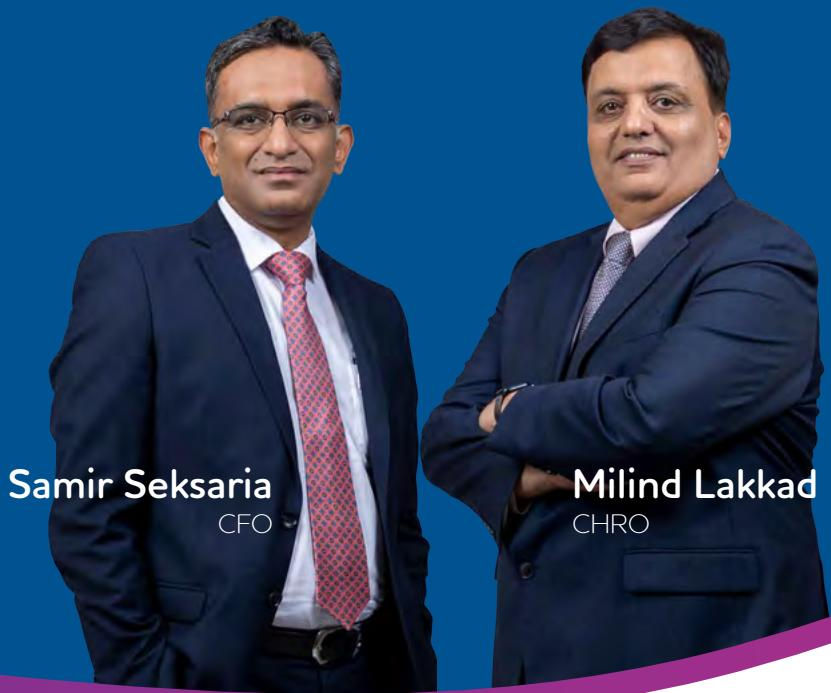

text_image

Samir Seksaria
CFO
Milind Lakkad
CHRO

You stood out in the industry with virtually zero attrition at senior levels. Now you had CEO-level attrition for the first time in your history. What does this say about your retention of senior talent?

ML: One swallow does not a summer make. This unprecedented event at TCS is just a reminder that CEOs are human too, and might want to pursue their dreams and aspirations just like anybody else. As for our track record in retaining senior leadership talent, it remains industry-leading.

I am proud to say that almost the entire team of 25 business heads we had created in 2008 is still in TCS. We have over 125,000 TCSers today with an average tenure of over 10 years in TCS. This cohort represents the true strength of TCS. They are the custodians of our culture, values and institutional memory, and have been central to our ability to weather the unprecedented attrition and influx of fresh talent without letting it affect the high quality of project outcomes that our clients have come to expect from TCS.

We not only retained our leadership talent better, but also expanded the leadership pool six-fold in the last five years by incubating a next generation of leaders running sub-ISUs, with P&L responsibilities. The breadth and depth of our leadership bench today makes our succession planning an industry benchmark, with multiple equally-qualified successors for any leadership position, starting from the CEO down, as you recently witnessed.

Is normalizing attrition a margin tailwind for FY 2024? What is your margin outlook for the year?

SS: Normalizing attrition is definitely a relief, but I wouldn’t call it a tailwind. We incurred a 1.4% margin headwind in FY 2023 from backfilling and retention expenses. If we onboarded a lateral hire at a 20% premium during the year, that increase in employee cost is a recurring one. But yes, hopefuly we won’t have any new headwind due to attrition in FY 2024.

Also, with the supplyside challenges easing, incremental cost of hiring laterals should be lower, and it also gives us an opportunity to bring down subcontractor expense. That is one important margin lever for FY 2024. Utilization improvement, flatter employee pyramid and hopefully, currency support, are the other levers. On the other hand, we will have our usual wage increase in Q1 and we should see further increases in travel expenses during the year.

You won many large outsourcing deals in FY 2023, and your highest ever number of large deals in Q4. Won’t this hurt margins in FY 2024?

SS: It is not true that large outsourcing deals are necessarily margin dilutive. A few high profile mega-deals in the industry whose low quality revenues impacted margins have resulted in that perception. In the last five years, TCS has won several mega deals with TCV over \$500 million, and every year we win dozens of large deals, with TCV over \$50 million. And yet, during this period, our EBIT margin has remained in a tight band between 24 and 26 percent.

Profitability of large deals depends on how you construct them. A client might push for a certain amount of absolute cost reduction at the time of contract renewal. The service provider can either drop prices and sacrifice margins to deliver those

savings, or propose a completely different operating model that uses lesser effort, protects or even expands margins, and achieves the client’s objectives.

TCS has differentiated itself in this space with the latter approach. Its win-win propositions reimagine the customer’s operating model, leveraging AI and machine learning to reduce human intervention while improving process velocity and operational resilience. Customers have really taken to this idea. In FY 2023, we signed 29 large operating model transformation deals, covering business as well as IT operations, compared to 18 in the prior year.

# Attrition among women is higher than for men. Why? How are you addressing this?

ML: Historically, women’s attrition at TCS has been similar or lower than men’s attrition, so this is unusual. There might be other reasons but intuitively, I would think working from home during the pandemic reset the domestic arrangements for some women, keeping them from returning to office even after everything normalized.

The higher attrition among women in FY 2023 is a setback to our efforts to promote gender diversity but we are doubling down on it. Focused leadership development programs like iExcel are driving tremendous change. Of all the leadership positions fulfilled with internal candidates in FY 2023, women made up 23% of the selected candidates, even though they account for only 14% of the applicant pool. This speaks well of the quality of the women candidates in our leadership pool as well as the supportive attitudes of our business leaders in promoting diversity. Likewise, in our external hiring, women make up 38.1% of our net hires this year, versus 35.7% in our workforce.

# Why is Return to Office so important to TCS? Why not let employees continue to work from home?

ML: Work from home is definitely more convenient for everybody, but there were drawbacks. Tenured employees who are well networked within the organization can work effectively and even collaborate virtually using the social capital built up over the years. That isn’t the case with more junior employees. Workplace essentials like collaboration, mentorship and teambuilding suffered a lot in these two years.

Then there is the matter of organizational culture. Over half our workforce today was hired after March 2020. New employees get acculturated through physical interactions with senior colleagues and leaders, by observing and following their behaviors and ways of thinking. Without those interactions, employee engagement as well as acculturation got badly impacted. All these factors led us to gradually bring back people to our offices during the year.

# With laterals brought in at higher salaries, how do you manage the wage gaps between individuals of similar profile doing similar work?

ML: Yes, this is another unusual, industry-wide problem. The pay disparities will eventually go away for two reasons. One, we are running a program called Elevate that empowers employees to take control of their careers and pursue their aspirations by achieving certain learning goals. Meeting those goals can result in significant pay increases, perhaps even a doubling of salary. Second, there will be a natural time-correction through performance-linked wage increases, promotions and voluntary attrition.

# Will sticky onsite inflation be a structural headwind for your margins?

SS: In the short term, higher onsite wage inflation is a headwind because our legacy contracts have much lower cost of living adjustments written in. But in the medium and longer term, this will get adjusted.

Wage inflation affects everybody in the market including the clients themselves. Newer contracts reflect the changed cost structure for onsite effort. Also, contractual terms now peg annual cost of living increases to prevailing inflation rates. That should help mitigate inflation risks in longer term contracts.

# Without the inflation differential, the Rupee may show greater strength than in the past. How will your margins sustain then?

SS: Inflation differential is not the only driver of currency depreciation. Rupee is also affected by India’s trade deficit, interest rate differentials and capital movements. But for argument’s sake, let us assume that we may not have the benefit of currency depreciation in the future. Now remember, the currency depreciation basically helps us offset wage inflation in India which historically, we never passed on to clients. In the changed circumstances, this too will get baked into new contracts the same way onsite wage inflation has been. So in the longer term, we should be able to sustain our current margins.

# Finally, a question on generative AI. Will the productivity gains delink revenue growth from headcount addition in the future? Can we expect a higher margin as a consequence?

ML: In my view, the productivity benefits will get baked into clients’ expectations around project velocity and throughput. For a given project team size, clients will expect much higher output at a much faster pace, compared to today. On aggregate, as the unit price of a function point falls, we expect volumes to increase. With ever-increasing dependence on technology for competitive differentiation, we expect enterprise spending to keep growing, for which we will have to keep hiring new talent. So the linearity between revenue and headcount is not going away any time soon.

SS: Margins are a measure of relative competitiveness. Based just on the productivity improvements in code generation using generative AI, it is difficult to see how a technology which is freely available to everyone – service providers as well as clients’ IT teams – can change relative competitiveness and by extension, margins. Margin improvement is possible from selling higher-priced growth and transformation solutions which use generative AI. Likewise, new software products or platforms which use generative AI to deliver superior business outcomes.

# Innovating to Improve Crop Yields and Farmer Incomes

With climate change, agriculture is increasingly vulnerable to extreme weather events, inconsistent rainfall, as well as increased pest and disease outbreaks. This affects crop yields, farmer incomes and food security.

To help address these challenges, TCS built a digital platform to empower the Indian farmer and improve the resilience of the nation’s farming sector. The TCS Digital Platform for Next Generation Agriculture (DNA) is a state-of-the-art, cloud-based decision intelligence and crop monitoring system that provides customized, site-specific predictive advisory services to farmers and other players in the food value chain.

TCS DNA uses an innovative \`Sky-Earth’ convergence, intelligently fusing remote-sensing data from earth observation satellites and drones with data from proximal sensors and handheld devices on the field. This gives scale and reduces cost significantly without sacrificing accuracy. Proprietary AI/ML algorithms are utilized to analyze the data and provide reliable information and predictive intelligence on weather, soil condition, crop health, and pest forecasts. Farmers can use these insights to make quicker and more informed decisions, optimize production costs and improve their yield.

Rallis India Ltd, a leading agri-input company, partnered with TCS for the first field deployment of the new platform, to improve the productivity of its hybrid seed production farms, as well as for internal business planning. Branded Drishti (“Vision”), the platform is used to monitor approximately 130 million hectares of agricultural land across India, for various aspects such as crop productivity, soil moisture, early alerts for pest outbreak, as well as seasonal weather anomalies and extreme weather events. The platform has helped Rallis increase the field scouting efficiency of its hybrid seed production team, and improved yield by 1 to 2%.

TCS DNA is also helping Amalgamation Plantations, the second largest producer of tea in India, improve the quality and sustainability of tea leaves procured from small tea growers. It is being used to remotely monitor various aspects of small plantations using satellite imagery, predict pest and disease and improve quality. This is expected to help small tea growers improve their income by 15% and reduce rejections by 20%.

Our partnership with TCS is helping us alleviate the issues of farmers and agriculture. The Drishti platform identifies problem areas and offers actionable insights to farmers in India, leading to effective crop management by reducing the risks and minimizing the loss in yield.

Sanjiv Lal

MD & CEO

Rallis India

natural_image

Three people outdoors in a green field, one holding a tablet, another in traditional attire, and a third in red shawl (no visible text or symbols)

# Notice

Notice is hereby given that the twenty-eighth Annual General Meeting of Tata Consultancy Services Limited will be held on Thursday, June 29, 2023, at 3:30 p.m. (IST) through Video Conferencing (“VC”)/Other Audio Visual Means (“OAVM”) to transact the following business:

# Ordinary Business

1. To receive, consider and adopt

a. the Audited Standalone Financial Statements of the Company for the financial year ended March 31, 2023, together with the Reports of the Board of Directors and the Auditors thereon; and   
b. the Audited Consolidated Financial Statements of the Company for the financial year ended March 31, 2023, together with the Report of the Auditors thereon.

2. To confirm the payment of Interim Dividends (including a special dividend) on Equity Shares and to declare a Final Dividend on Equity Shares for the financial year 2022-23.

3. To appoint a director in place of Aarthi Subramanian (DIN 07121802), who retires by rotation and, being eligible, offers herself for re-appointment.

text_image

Business meeting photo with visible text overlay on the right side discussing documents and a document, featuring office interior background.

# Special Business

# 4. Appointment of K Krithivasan as Director of the Company

To consider and, if thought fit, to pass the following resolution as an Ordinary Resolution:

“RESOLVED that K Krithivasan (DIN 10106739), who was appointed by the Board of Directors, based on the recommendation of the Nomination and Remuneration Committee, as an Additional Director of the Company with effect from June 1, 2023 and who holds office up to the date of this Annual General Meeting of the Company in terms of Section 161(1) and any other applicable provisions, if any, of the Companies Act, 2013 (“Act”) (including any modification and re-enactment thereof), and Article 73 of the Article of Association of the Company, and who is eligible for appointment and has consented to act as a Director of the Company and in respect of whom the Company has received a notice in writing from a Member under Section 160(1) of the Act proposing his candidature for the office of Director of the Company, be and is hereby appointed as a Director of the Company, not liable to retire by rotation.”

# 5.	 Appointment of K Krithivasan as Chief Executive Officer and Managing Director of the Company

To consider and, if thought fit, to pass the following resolution as an Ordinary Resolution:

“RESOLVED that pursuant to the provisions of Sections 196, 197, 203 and other applicable provisions, if any, of the Companies Act, 2013 (“Act”) (including any modification and re-enactment thereof) read with Schedule V of the Act, and the Companies (Appointment and Remuneration of Managerial Personnel) Rules, 2014, as amended from time to time, the consent of the Company be and is hereby accorded for appointment and terms of remuneration of K Krithivasan (DIN 10106739), as the Chief Executive Officer and Managing Director of the Company for a period of five years with effect from June 1, 2023, as recommended by Nomination and Remuneration Committee and approved by the Board of Directors, upon the terms and conditions set out in the Explanatory Statement annexed to the Notice convening this Annual General Meeting, (including the remuneration to be paid in the event of loss or inadequacy of profits in any financial year during the tenure of his appointment), with authority to the Board of Directors to alter and vary the terms and conditions of the said appointment in such manner as may be agreed to between the Board of Directors and K Krithivasan.”

“RESOLVED FURTHER that the Board of Directors of the Company (which term shall be deemed to herein after include any Committee of the Board constituted to exercise its powers, including the powers conferred by this Resolution), be and is hereby authorised to take all such steps as may be necessary, proper and expedient to give effect to this Resolution.”

# 6.	 To approve existing as well as new material related party transactions with

i. Tata Sons Private Limited and/or its subsidiaries, (other than Tejas Networks Limited and/or its subsidiaries)   
ii. Joint Ventures, Associate Companies of Tata Sons Private Limited and their subsidiaries and Joint Ventures & Associate Companies of subsidiaries of Tata Sons Private Limited (excluding Tata Motors Limited, Jaguar Land Rover Limited and/or their subsidiaries)   
iii.	 Tejas Networks Limited and/or its subsidiaries   
iv. Tata Motors Limited, Jaguar Land Rover Limited and/or their subsidiaries   
v. Subsidiaries of the Company (other than wholly owned subsidiaries)

To consider and if thought fit, to pass the following resolution as an Ordinary Resolution:

“RESOLVED that pursuant to the provisions of Regulation 23(4) of the Securities and Exchange Board of India (Listing Obligations and Disclosure Requirements) Regulations, 2015 (“SEBI Listing Regulations”), as amended from time to time, the applicable provisions of the Companies Act, 2013 (“Act”) read with Rules made thereunder, other applicable laws/statutory provisions, if any, (including any statutory modification(s) or amendment(s) or re-enactment(s) thereof, for the time being in force), the Company’s Policy on Related Party Transactions, and subject to such approval(s), consent(s), permission(s) as may be necessary from time to time and basis the approval and recommendation of the Audit Committee and the Board of Directors of the Company, the approval of the Members of the Company be and is hereby accorded to the Company to enter/continue to enter into Material Related Party Transaction(s)/ Contract(s)/Arrangement(s)/Agreement(s) (whether by way of an individual transaction or transaction taken together or series of transactions or otherwise) with entities falling within the definition of ‘Related Party’ under Section 2(76) of the Act and Regulation 2(1)(zb) of the SEBI Listing Regulations, for each of the financial years (“FY”) in the course of (a) availing and rendering of IT services/ITeS/consulting service(s); (b) reimbursement of expenses including towards availing/providing for sharing/usage of each other’s resources viz. employees, office space, infrastructure including IT assets, taxes and related owned/ third-party services; (c) purchase/ sale/exchange/transfer/lease of business asset(s) and/or equipment to meet its business objectives/requirements; (d) transfer of any resources, services or obligations to meet its business objectives/requirements (“Related Party Transactions”) on such material terms and conditions as detailed in the explanatory statement to this Resolution and as may be mutually agreed between related parties

and the Company, such that the maximum value of the Related Party Transactions with such parties, in aggregate, does not exceed value as specified under each category, in the explanatory statement, provided that the said Transaction(s)/Contract(s)/Arrangement(s)/Agreement(s) shall be carried out at in the ordinary course of business and in respect of transactions with related parties under Section 2(76) of the Act, are at arm’s length basis.”

“RESOLVED FURTHER that the Board of Directors of the Company (hereinafter referred to as ‘Board’ which term shall be deemed to include the Audit Committee of the Company and any duly constituted/ to be constituted Committee of Directors thereof to exercise its powers including powers conferred under this resolution) be and is hereby authorised to do all such acts, deeds, matters and things as it may deem fit at its absolute discretion and to take all such steps as may be required in this connection including finalizing and executing necessary documents, contract(s), scheme(s), agreement(s) and such other documents as may be required, seeking all necessary approvals to give effect to this resolution, for and on behalf of the Company and settling all such issues, questions, difficulties or doubts whatsoever that may arise and to take all such decisions from powers herein conferred to, without being required to seek further consent or approval of the Members and that the Members shall be deemed to have given their approval thereto expressly by the authority of this resolution.”

“RESOLVED FURTHER that all actions taken by the Board in connection with any matter referred to or contemplated in this resolution, be and are hereby approved, ratified and confirmed in all respects.”

# Notes

1. The Ministry of Corporate Affairs (“MCA”) has vide its General Circular Nos. 14/2020 dated April 8, 2020 and 17/2020 dated April 13, 2020, in relation to “Clarification on passing of ordinary and special resolutions by companies under the Companies Act, 2013 and the rules made thereunder on account of the threat posed by Covid -19”, General Circular Nos. 20/2020 dated May 5, 2020, and subsequent circulars issued in this regard, the latest being 10/2022 dated December 28, 2022 in relation to “Clarification on holding of annual general meeting (AGM) through Video Conferencing (VC) or Other Audio Visual Means (OAVM)”, (collectively referred to as “MCA Circulars”) permitted the holding of the Annual General Meeting (“AGM”) through VC/OAVM, without the physical presence of the Members at a common venue. In compliance with the MCA Circulars, the AGM of the Company is being held through VC /OAVM. The registered office of the Company shall be deemed to be the venue for the AGM.

2. The Explanatory Statement pursuant to Section 102 of the Companies Act, 2013 (“Act”) setting out material facts concerning the business under Item Nos. 4 to 6 of the

Notice, is annexed hereto. Further, the relevant details with respect to Item Nos. 3 and 4 pursuant to Regulation 36(3) of the SEBI (Listing Obligations and Disclosure Requirements) Regulations, 2015 (“SEBI Listing Regulations”) and Secretarial Standard on General Meetings issued by the Institute of Company Secretaries of India, in respect of Directors seeking appointment/re-appointment at this AGM are also annexed.

3. In accordance with the aforesaid MCA Circulars and Circular Nos. SEBI/HO/CFD/CMD1/CIR/P/2020/79 dated May 12, 2020, SEBI/HO/CFD/CMD2/CIR/P/2021/11 dated January 15, 2021, SEBI/HO/CFD/CMD2/CIR/P/2022/62 dated May 13, 2022 and SEBI/HO/CFD/PoD-2/P/CIR/2023/4 dated January 5, 2023 issued by Securities Exchange Board of India (collectively referred to as “SEBI Circulars”), the Notice of the AGM along with the Integrated Annual Report for FY 2022-23 is being sent by electronic mode to those Members whose e-mail addresses are registered with the Company/Depositories.

If your e-mail address is not registered with the Company/ Depositories, you may register on or before 5:00 p.m. (IST) on Thursday, June 22, 2023 to receive this Notice of the AGM and the Integrated Annual Report for FY 2022-23 by completing the process for registration of e-mail address as under:

a) Click on the URL: https://on.tcs.com/EmailRegn.   
b) Select the Name of the Company from dropdown: Tata Consultancy Services Limited.   
c) Enter DP and Client ID (if shares held in electronic form)/Folio number (if shares held in physical form) and Permanent Account Number (“PAN”). In the event PAN details are not registered for physical folio, Member to enter one of the Share Certificate numbers.   
d) Enter Mobile number and e-mail ID.   
e) System generated One Time Password (“OTP”) to be sent on mobile number and e-mail ID.   
f) Enter OTP received on mobile number and e-mail ID.   
g) Click on Submit button.   
h) On completing the above process your request will be accepted and request id will be generated. Email registered is for limited purpose of sending notice pertaining to the current event.

Members may note that the Notice and Integrated Annual Report 2022-23 will also be available on the Company’s website www.tcs.com, websites of the Stock Exchanges i.e. BSE Limited and National Stock Exchange of India Limited at www.bseindia.com and www.nseindia.com respectively, and on the website of NSDL https://www.evoting.nsdl.com.

4. Pursuant to the provisions of the Act, a Member entitled to attend and vote at the AGM is entitled to appoint a proxy to attend and vote on his/her behalf and the proxy need not be a Member of the Company. Since this AGM is being held pursuant to the MCA Circulars through VC/OAVM, physical attendance of Members has been dispensed with. Accordingly, the facility for appointment of proxies by the Members will not be available for the AGM and hence the Proxy Form, Attendance Slip and route map of AGM are not annexed to this Notice.   
5. Institutional shareholders/corporate shareholders (i.e. other than individuals, HUFs, NRIs, etc.) are required to send a scanned copy (PDF/JPG Format) of their respective Board or governing body Resolution/Authorization etc., authorizing their representative to attend the AGM through VC/OAVM on their behalf and to vote through remote e-voting. The said Resolution/Authorization shall be sent to the Scrutinizer by e-mail on its registered e-mail address to tcs.scrutinizer@gmail.com with a copy marked to evoting@nsdl.co.in. Institutional shareholders (i.e. other than individuals, HUFs, NRIs etc.) can also upload their Board Resolution/Power of Attorney/Authority Letter, etc. by clicking on “Upload Board Resolution/Authority Letter” displayed under “e-Voting” tab in their login.   
6. The Company has fixed Thursday, June 15, 2023 as the ‘Record Date’ for determining entitlement of Members to final dividend for the financial year ended March 31, 2023, if approved at the AGM.   
7. If the final dividend, as recommended by the Board of Directors, is approved at the AGM, payment of such dividend subject to deduction of tax at source will be made on Monday, July 3, 2023, as under:

i. To all Beneficial Owners in respect of shares held in dematerialized form as per the data as may be made available by the National Securities Depository Limited (NSDL) and the Central Depository Services (India) Limited (CDSL), collectively “Depositories”, as of end of day on Thursday, June 15, 2023.   
ii. To all Members in respect of shares held in physical form after giving effect to valid transmission or transposition requests lodged with the Company as of the close of business hours on Thursday, June 15, 2023.

8. Members are requested to intimate changes, if any, pertaining to their name, postal address, email address, telephone/mobile numbers, Permanent Account Number (PAN), mandates, nominations, power of attorney, bank details such as, name of the bank and branch details, bank account number, MICR code, IFSC code, etc.

a. For shares held in electronic form: to their Depository Participants (DPs)   
b. For shares held in physical form: to the Company/ Registrar and Transfer Agents (RTA) in prescribed Form

ISR-1 and other forms pursuant to SEBI Circular No. SEBI/HO/MIRSD/MIRSD-PoD-1/P/CIR/2023/37 dated March 16, 2023. In the absence of any of the required documents in a folio, on or after October 1, 2023, the folio shall be frozen by the RTA. Intimation letters along with Business Reply Envelopes for furnishing the required details are being sent by the Company. Members may also refer to Frequently Asked Questions (“FAQs”) on Company’s website https://on.tcs.com/IR-FAQ.

9. Members may please note that SEBI vide its Circular No. SEBI/HO/MIRSD/MIRSD\_RTAMB/P/CIR/2022/8 dated January 25, 2022 has mandated the Listed Companies to issue securities in dematerialized form only while processing service requests viz. Issue of duplicate securities certificate; claim from unclaimed suspense account; renewal/exchange of securities certificate; endorsement; sub-division/splitting of securities certificate; consolidation of securities certificates/folios; transmission and transposition. Accordingly, Members are requested to make service requests by submitting a duly filled and signed Form ISR – 4, the format of which is available on the Company’s website at https://on.tcs.com/IR-FAQ and on the website of the Company’s RTA, TSR Consultants Private Limited (“TCPL”) at https://www.tcplindia.co.in/. It may be noted that any service request can be processed only after the folio is KYC Compliant.   
10. In terms of Regulation 40(1) of SEBI Listing Regulations, as amended from time to time, transfer, transmission and transposition of securities shall be effected only in dematerialized form. In view of the same and to eliminate all risks associated with physical shares and avail various benefits of dematerialization, Members are advised to dematerialize the shares held by them in physical form. Members can contact the Company or TCPL, for assistance in this regard.   
11. Members holding shares in physical form, in identical order of names, in more than one folio are requested to send to the Company or TCPL, the details of such folios together with the share certificates along with the requisite KYC Documents for consolidating their holdings in one folio. Requests for consolidation of share certificates shall be processed in dematerialized form.   
12. As per the provisions of Section 72 of the Act, the facility for making nomination is available for the Members in respect of the shares held by them. Members who have not yet registered their nomination are requested to register the same by submitting Form No. SH-13. If a Member desires to opt out or cancel the earlier nomination and record a fresh nomination, he/she may submit the same in Form ISR-3 or SH-14 as the case may be. The said forms can be downloaded from the Company’s website https://on.tcs. com/IR-FAQ. Members are requested to submit the said details to their DP in case the shares are held by them in dematerialized form and to TCPL in case the shares are held in physical form.

13. In case of joint holders, the Member whose name appears as the first holder in the order of names as per the Register of Members of the Company as on the cut-off date will be entitled to vote during the AGM.

14. Members seeking any information with regard to the financial statements or any matter to be placed at the AGM, are requested to write to the Company on or before June 28, 2023 through e-mail on investor.relations@tcs.com. The same will be replied by the Company suitably.

15. Members are requested to note that, dividends if not encashed for a period of 7 years from the date of transfer to Unpaid Dividend Account of the Company, are liable to be transferred to the Investor Education and Protection Fund (“IEPF”). Further, all the shares in respect of which dividend has remained unclaimed for 7 consecutive years or more from the date of transfer to unpaid dividend account shall also be transferred to IEPF. In view of this, Members are requested to claim their dividends from the Company, within the stipulated timeline. The Members, whose unclaimed dividends and/or shares have been transferred to IEPF, may contact the Company or TCPL and submit the required documents for issue of Entitlement Letter. The Members can attach the Entitlement Letter and other required documents and file the IEPF-5 form for claiming the dividend and/or shares available on www.iepf.gov.in. For details, please refer to Corporate Governance Report which is a part of this report and FAQ of investor page on Company’s website https://on.tcs.com/IR-FAQ.

16. Members attending the meeting through VC/OAVM shall be counted for the purpose of determining the quorum under Section 103 of the Act.

17. Pursuant to the Finance Act, 2020, dividend income will be taxable in the hands of shareholders w.e.f. April 1, 2020 and the Company is required to deduct tax at source from dividend paid to shareholders at the prescribed rates. For the prescribed rates for various categories, please refer to the Finance Act, 2020 and the amendments thereof. The shareholders are requested to update their valid PAN with the DPs (if shares held in dematerialized form) and the Company/TCPL (if shares are held in physical form).

A Resident individual shareholder with PAN and whose income does not exceed maximum amount not chargeable to tax or who is not liable to pay income tax, as the case may be, can submit a yearly declaration in Form No. 15G/15H, to avail the benefit of non-deduction of tax at source by e-mail to TCS-Exemptforms2324@tcplindia.co.in or upload the documents on https://on.tcs.com/FormsRegn by 11:59 p.m. (IST) on Wednesday, June 7, 2023.

Shareholders are requested to note that in case their PAN is not registered or having invalid PAN or Specified Person as defined under Section 206AB of the Income-tax Act, the tax will be deducted at a higher rate prescribed under Section 206AA or 206AB of the Income-tax Act, as applicable.

Non-resident shareholders [including Foreign Institutional Investors (FIIs)/Foreign Portfolio Investors (FPIs)] can avail beneficial rates under tax treaty between India and their country of tax residence, subject to providing necessary documents i.e. No Permanent Establishment and Beneficial Ownership Declaration, Tax Residency Certificate, Form 10F, any other document which may be required to avail the tax treaty benefits. For this purpose, the shareholder may submit the above documents (PDF/JPG Format) by e-mail to TCS-Exemptforms2324@tcplindia.co.in or upload the documents on https://on.tcs.com/FormsRegn. The aforesaid declarations and documents need to be submitted by the shareholders by 11:59 p.m. (IST) on Wednesday, June 7, 2023.

For further details please refer to FAQs on Taxation of Dividend Distribution at https://on.tcs.com/IR-FAQ.

18. Instructions for e-voting and joining the AGM are as follows:

# A. VOTING THROUGH ELECTRONIC MEANS

i. In compliance with the provisions of Section 108 of the Act, read with Rule 20 of the Companies (Management and Administration) Rules, 2014, as amended from time to time, Regulation 44 of the SEBI Listing Regulations and in terms of SEBI Circular no. SEBI/HO/CFD/CMD/CIR/P/2020/242 dated December 9, 2020 in relation to “e-voting Facility Provided by Listed Entities”, the Members are provided with the facility to cast their vote electronically, through the e-voting services provided by NSDL, on all the resolutions set forth in this Notice. The instructions for e-voting are given herein below.

ii. The remote e-voting period commences on Monday, June 26, 2023 (9:00 a.m. IST) and ends on Wednesday, June 28, 2023 (5:00 p.m. IST). During this period, Members holding shares either in physical form or in dematerialized form, as on Thursday, June 22, 2023 i.e. cut-off date, may cast their vote electronically.

The e-voting module shall be disabled by NSDL for voting thereafter. Members have the option to cast their vote on any of the resolutions using the remote e-voting facility, either during the period commencing from June 26, 2023 to June 28, 2023 or e-voting during the AGM. Members who have voted on some of the resolutions during the said voting period are also eligible to vote on the remaining resolutions during the AGM.

iii. The Members who have cast their vote by remote e-voting prior to the AGM may also attend/participate in the AGM through VC/OAVM but shall not be entitled to cast their vote on such resolution again.

iv. The Board of Directors has appointed P N Parikh (Membership No. FCS 327) and failing him,

Jigyasa Ved (Membership No. FCS 6488) of Parikh & Associates, Company Secretaries as the Scrutinizer to scrutinize the e-voting process in a fair and transparent manner.

v. The voting rights of Members shall be in proportion to their shares in the paid-up equity share capital of the Company as on the cut-off date.

vi. Any person holding shares in physical form and non-individual shareholders, who acquires shares of the Company and becomes a Member of the Company after sending of the Notice and holding shares as of the cut-off date, may obtain the User ID and Password by sending a request at evoting@nsdl.co.in. However, if he/ she is already registered with NSDL for remote e-voting then he/she can use his/her existing User ID and Password for casting the vote. In case of individual shareholders holding securities in dematerialized mode and who acquires shares of the Company and becomes a Member of the Company after sending of the Notice and holding shares as of the cut-off date may follow steps mentioned below under “Login method for remote e-voting and joining virtual meeting for individual shareholders holding securities in dematerialized mode.”

vii. The details of the process and manner for remote e-voting are explained herein below:

The way to vote electronically on NSDL e-voting system consists of “Two Steps” which are mentioned below:

Step 1: Access to NSDL e-voting system

Step 2: Cast your vote electronically on NSDL e-voting system.

# Details on Step 1 are mentioned below

# I) Login method for remote e-voting and joining the virtual meeting for individual shareholders holding securities in dematerialized mode

Pursuant to SEBI Circular no. SEBI/HO/CFD/CMD/ CIR/P/2020/242 dated December 9, 2020 on “e-voting facility provided by Listed Companies”, e-voting process has been enabled to all the individual demat account holders, by way of single login credential, through their demat accounts/websites of Depositories/DPs to increase the efficiency of the voting process. Individual demat account holders would be able to cast their vote without having to register again with the e-voting service provider (“ESP”) thereby not only facilitating seamless authentication but also ease and convenience of participating in e-voting process. Shareholders are advised to update their mobile number and e-mail ID with their DPs to access e-voting facility.

<table><tr><td>Type of shareholders</td><td>Login Method</td></tr><tr><td>Individual Shareholders holding securities in dematerialized mode with NSDL.</td><td>A.NSDL IDeAS facilityIf you are already registered, follow the below steps1. Visit the e-Services website of NSDL. Open web browser by typing the following URL:https://eservices.nsdl.com/ either on a Personal Computer or on a mobile.2. Once the home page of e-Services is launched, click on the “Beneficial Owner” icon under “Login” which is available under “IDeAS” section.3. A new screen will open. You will need to enter your User ID and Password. After successful authentication, you will be able to see e-voting services.4. Click on “Access to e-voting” appearing on the left-hand side under e-voting services and you will be able to see e-voting page.5. Click on options available against Company name or e-Voting service provider - NSDL and you will be re-directed to NSDL e-voting website for casting your vote during the remote e-voting period or joining virtual meeting and e-voting during the meeting.If you are not registered, follow the below stepsa. Option to register is available athttps://eservices.nsdl.com.b. Select “Register Online for IDeAS” Portal or click athttps://on.tcs.com/NSDLRegn.c. Please follow steps given in points 1-5.</td></tr><tr><td></td><td>B.e-voting website of NSDL1. Open web browser and type the following URL:https://www.evoting.nsdl.com/ either on a personal computer or on a mobile phone.2. Once the home page of e-voting system is launched, click on the icon “Login” which is available under ‘Shareholder/Member’ section.3. A new screen will open. You will need to enter your User ID (i.e. your sixteen digit demat account number held with NSDL), Password/OTP and a Verification Code as shown on the screen.4. After successful authentication, you will be redirected to NSDL website wherein you can see e-voting page. Click on options available against Company name or e-voting service provider- NSDL and you will be redirected to e-voting website of NSDL for casting your vote during the remote e-voting period or joining virtual meeting and e-voting during the meeting.C. Shareholders/Members can also download NSDL Mobile App “NSDL Speede” facility by scanning the QR code mentioned below for seamless voting experience. App Store [07Y3] Google Play </td></tr><tr><td>Individual Shareholders holding securities in dematerialized mode with CDSL</td><td>1. Existing users who have opted for Easi/Easiest, they can login through their User ID and Password. Option will be made available to reach e-voting page without any further authentication. The URL for users to login to Easi/Easiest arehttps://on.tcs.com/CDSLRegn or www.cdslindia.comand click on login and select MyEasi.2. After successful login of Easi/Easiest the user will be also able to see the e-voting menu. The menu will have links of e-voting service provider i.e. NSDL. Click on NSDL to cast your vote during the remote e-voting period or joining virtual meeting and e-voting during the meeting.3. If the user is not registered for Easi/Easiest, option to register is available athttps://on.tcs.com/CDSLEasiRegn4. Alternatively, the user can directly access e-voting page by providing demat account number and PAN from a link inwww.cdslindia.comhome page. The system will authenticate the user by sending OTP on registered Mobile and e-mail as recorded in the demat Account. After successful authentication, user will be provided links for the respective ESP i.e. NSDL where the e-voting is in progress.</td></tr><tr><td>Individual Shareholders (holding securities in demat mode) login through their DPs</td><td>1. You can also login using the login credentials of your demat account through your DP registered with NSDL/CDSL for e-voting facility.2. Once logged-in, you will be able to see the e-voting option. Once you click on e-voting option, you will be redirected to NSDL/CDSL Depository site after successful authentication, wherein you can see e-voting feature.3. Click on options available against Company name or e-voting service provider- NSDL and you will be redirected to e-voting website of NSDL for casting your vote during the remote e-voting period or joining virtual meeting and e-voting during the meeting.</td></tr></table>

App Store   
Google Play

Important note: Members who are unable to retrieve User ID/Password are advised to use Forgot User ID and Forgot Password option available at respective websites.

Helpdesk for Individual Shareholders holding securities in demat mode for any technical issues related to login through Depository i.e. NSDL and CDSL.

<table><tr><td>Login type</td><td>Helpdesk details</td></tr><tr><td>Securities held with NSDL</td><td>Please contact NSDL helpdesk by sending a request atevoting@nsdl.co.inor call at +91 22 48867000 and +91 22 24997000</td></tr><tr><td>Securities held with CDSL</td><td>Please contact CDSL helpdesk by sending a request athelpdesk.evoting@cdslindia.comor contact at toll free no. 1800225533</td></tr></table>

# II) Login method for e-voting and joining virtual meeting for shareholders other than Individual shareholders holding securities in demat mode and shareholders holding securities in physical mode.

How to Log-in to NSDL e-Voting website?

1. Visit the e-voting website of NSDL. Open web browser by clicking the URL: https://www.evoting.nsdl.com/ either on a Personal Computer or on a mobile.   
2. Once the home page of e-voting system is launched, click on the icon “Login” which is available under ‘Shareholder/ Member’ section.   
3. A new screen will open. You will have to enter your User ID, Password/OTP and a verification code as shown on the screen.   
4. Alternatively, if you are registered for NSDL eservices i.e. IDeAS, you can log-in at https://eservices.nsdl.com/ with your existing IDeAS login. Once you log-in to NSDL eservices after using your login credentials, click on e-voting and you can proceed to Step 2 i.e. Cast your vote electronically.

5. Your User ID details are given below:

<table><tr><td>Manner of holding shares i.e. Demat (NSDL or CDSL) or Physical</td><td>Your User ID is:</td></tr><tr><td>a) For Members who hold shares in demat account with NSDL.</td><td>8 Character DP ID followed by 8 Digit Client IDFor example if your DP ID is IN300*** and Client ID is 12***** then your user ID is IN300***12*****</td></tr><tr><td>b) For Members who hold shares in demat account with CDSL.</td><td>16 Digit Beneficiary IDFor example if your Beneficiary ID is 12********** then your user ID is 12**********</td></tr><tr><td>c) For Members holding shares in Physical Form.</td><td>EVEN Number followed by Folio Number registered with the CompanyFor example if EVEN is 123456 and folio number is 001*** then user ID is 123456001***</td></tr></table>

6. Password details for shareholders other than Individual shareholders are given below:

a) If you are already registered for e-voting, then you can use your existing password to login and cast your vote.   
b) If you are using NSDL e-voting system for the first time, you will need to retrieve the ‘initial password’ which was communicated to you by NSDL. Once you retrieve your ‘initial password’, you need to enter the ‘initial password’ and the system will force you to change your password.   
c) How to retrieve your ‘initial password’?

(i) If your e-mail ID is registered in your demat account or with the Company, your ‘initial password’ is communicated to you on your e-mail ID. Trace the e-mail sent to you from NSDL in your mailbox from evoting@nsdl.com. Open the e-mail and open the attachment i.e. a .pdf file. Open the .pdf file.

The password to open the .pdf file is your 8 digit client ID for NSDL account, last 8 digits of client ID for CDSL account or folio number for shares held in physical form. The .pdf file contains your ‘User ID’ and your ‘initial password’.

(ii) In case you have not registered your e-mail address with the Company/Depository, please follow instructions mentioned below in this notice.

7. If you are unable to retrieve or have not received the “Initial password” or have forgotten your password:

a) Click on “Forgot User Details/Password?”(If you are holding shares in your demat account with NSDL or CDSL) option available on www.evoting.nsdl.com.

b) “Physical User Reset Password?” (If you are holding shares in physical mode) option available on www.evoting.nsdl.com.   
c) If you are still unable to get the password by aforesaid two options, you can send a request at evoting@nsdl.co.in mentioning your demat account number/folio number, PAN, name and registered address.   
d) Members can also use the OTP based login for casting the votes on the e-voting system of NSDL.

8. After entering your password, tick on Agree to “Terms and Conditions” by selecting on the check box.   
9. Now, you will have to click on “Login” button.   
10. After you click on the “Login” button, home page of e-voting will open.

# Details on Step 2 are given below:

How to cast your vote electronically on NSDL e-voting system?

1. After successful login at Step 1, you will be able to see all the companies’ “EVEN” in which you are holding shares and whose voting cycle and general meeting is in active status.   
2. Select “EVEN” of Company, which is 123989 for which you wish to cast your vote during the remote e-voting period and casting your vote during the General Meeting. For joining virtual meeting, you need to click on “VC/OAVM” link placed under “Join Meeting”.   
3. Now you are ready for e-voting as the voting page opens.   
4. Cast your vote by selecting appropriate options i.e. assent or dissent, verify or modify the number of shares for which you wish to cast your vote and click on “Submit” and also “Confirm” when prompted.

5. Upon confirmation, the message “Vote cast successfully” will be displayed and you will receive a confirmation by way of a SMS on your registered mobile number.   
6. You can also take the printout of the votes cast by you by clicking on the print option on the confirmation page.   
7. Once you confirm your vote on the resolution, you will not be allowed to modify your vote.

# General Guidelines for shareholders

1. It is strongly recommended not to share your password with any other person and take utmost care to keep your password confidential. Login to the e-voting website will be disabled upon five unsuccessful attempts to key in the correct password. In such an event, you will need to go through the “Forgot User Details/Password?” or “Physical User Reset Password?” option available on https://www.evoting.nsdl.com to reset the password.   
2. In case of any queries related to e-voting, you may refer the Frequently Asked Questions (“FAQs”) for Shareholders and e-voting user manual for Shareholders available at the download section of https://www.evoting.nsdl.com or call on +91 22 48867000 and +91 22 24997000 or send the request to Pallavi Mhatre, Senior Manager, NSDL at evoting@nsdl.co.in.   
3. Members may send a request to evoting@nsdl.co.in for procuring user id and password for e-voting by providing demat account number / Folio number, client master or copy of Consolidated Account statement, PAN (self-attested scanned copy of PAN card), AADHAAR (self-attested scanned copy of Aadhaar Card). If you are an Individual shareholder holding securities in demat mode, you are requested to refer to the login method explained above.   
4. The instructions for members for e-voting on the day of the AGM are mentioned in point number 18(A).

# B. INSTRUCTIONS FOR MEMBERS FOR ATTENDING THE AGM THROUGH VC/OAVM ARE AS UNDER

1. Members will be able to attend the AGM through VC/OAVM or view the live webcast of AGM provided by NSDL at https://www.evoting.nsdl.com following the steps mentioned above for login to NSDL e-voting system. After successful login, you can see VC/OAVM link placed under Join meeting menu against company name. You are requested to click on VC/OAVM link placed under “Join Meeting” menu.

Members who do not have the User ID and Password for e-voting or have forgotten the User ID and Password may retrieve the same by following the remote e-voting instructions mentioned in the Notice.

Further Members can also use the OTP based login for logging into the e-voting system of NSDL.

2. Facility of joining the AGM through VC/OAVM shall open 30 minutes before the time scheduled for the AGM.   
3. Members who need assistance before or during the meeting, can contact NSDL on evoting @nsdl.co.in +91 22 48867000 and +91 22 24997000 or contact Amit Vishal, Assistant Vice President – NSDL at amitv@nsdl.co.in or Sanjeev Yadav, Assistant Manager-NSDL at sanjeevy@nsdl.co.in   
4. Members who would like to express their views or ask questions during the AGM may register themselves as a speaker by sending their request from their registered e-mail address mentioning their name, DP ID and Client ID/Folio number, PAN, mobile number at tcsagm.speakers@tcs.com from June 23, 2023 (9:00 a.m. IST) to June 25, 2023 (5:00 p.m. IST). Those Members who have registered themselves as a speaker will only be allowed to express their views/ask questions during the AGM. The Company reserves the right to restrict the number of speakers depending on the availability of time for the AGM.

# Other Instructions

1. The Scrutinizer shall, immediately after the conclusion of voting at the AGM, unblock the votes cast through remote e-voting (votes cast during the AGM and votes cast through remote e-voting) and will submit a consolidated Scrutinizer’s Report of the total votes cast in favour or against, if any, to the Chairman or a person authorised by him in writing, who shall countersign the same. The results will be announced within the time stipulated under the applicable laws.   
2. The result declared along with the Scrutinizer’s Report shall be placed on the Company’s website www.tcs.com and on the website of NSDL https://www.evoting.nsdl.com immediately. The Company shall simultaneously forward the results to National Stock Exchange of India Limited and BSE Limited, where the shares of the Company are listed.

By order of the Board of Directors

Pradeep Manohar Gaitonde

Company Secretary

Membership No. ACS 7016

Mumbai, April 12, 2023

# Registered Office:

9th Floor, Nirmal Building, Nariman Point,

Mumbai 400 021

CIN: L22210MH1995PLC084781

Tel: +91 22 6778 9595

Email: investor.relations@tcs.com

Website: www.tcs.com

# Explanatory Statement

As required by Section 102 of the Companies Act, 2013 (“Act”), the following explanatory statement sets out all material facts relating to the business mentioned under Item Nos. 4 to 6 of the accompanying Notice:

# Item Nos. 4 and 5

The Board of Directors, at its meeting held on April 12, 2023, based on the recommendation of the Nomination and Remuneration Committee, appointed K Krithivasan as an Additional Director of the Company with effect from June 1, 2023. The Board, at the same meeting, also appointed K Krithivasan as Chief Executive Officer and Managing Director (“CEO and MD”) of the Company, for a period of five years with effect from June 1, 2023, subject to approval of the Members.

In terms of Section 161(1) of the Act, K Krithivasan holds the office of Additional Director only upto the date of this Annual General Meeting of the Company, and is eligible for appointment as a Director. The Company has received a notice in writing from a Member, in terms of Section 160(1) of the Act, proposing his candidature for the office of Director.

K Krithivasan has also confirmed that he is not disqualified from being appointed as Director, in terms of the provisions of Section 164(1), 164(2) of the Act and is not debarred to hold the office of a Director by virtue of any order passed by SEBI or any other authority and has given his consent to act as a Director of the Company.

Prior to his appointment as the CEO and MD, K Krithivasan was the Global Head of Banking, Financial Services, and Insurance (BFSI) Business Group and played a key role in building deep customer relationships and mindshare as well as market positioning across geographies. He has been with the Company for over 3 decades helping customers with their growth and transformation journeys and technology strategies.

He holds a Bachelor’s Degree in Mechanical Engineering from the University of Madras and a Master’s Degree in Industrial and Management Engineering from IIT Kanpur.

Further details of K Krithivasan have been given in Annexure A to this Notice.

The main terms and conditions of appointment of K Krithivasan (hereinafter referred to as “CEO and MD”) are given below:

# A. Tenure of Appointment

The appointment as CEO and MD is for a period of five years with effect from June 1, 2023.

# B. 	 Nature of Duties

The CEO and MD shall devote his whole time and attention to the business of the Company and shall perform such duties as may be entrusted to him by the Board from time to time and separately communicated to him and exercise such powers as may be assigned to him, subject to the superintendence, control and directions of the

Board in connection with and in the best interests of the business of the Company and the business of one or more of its associated companies and/or subsidiaries, including performing duties as assigned to the CEO and MD from time to time by serving on the Boards of such associated companies and/or subsidiaries or any other executive body or any committee of such a company.

# C. 	 Remuneration

# a. Basic Salary

Basic Salary of ₹10,00,000 per month; upto a maximum of ₹16,00,000 per month.

The annual increments which will be effective 1st April each year, will be decided by the Board based on the recommendations of the Nomination and Remuneration Committee (“NRC”) and will be performance-based and take into account the Company’s performance as well, within the said maximum amount.

# b. 	 Benefits, Perquisites, and Allowances

Details of Benefits, Perquisites and Allowances are as follows:

i. Rent-free residential accommodation (partly furnished or otherwise) with the Company bearing the cost of repairs, maintenance, society charges and utilities (e.g., gas, electricity and water charges) for the said accommodation or house rent, house maintenance and utility allowances aggregating 85% of the Basic Salary (in case residential accommodation is not provided by the Company).   
ii. Hospitalisation and major medical expenses, car facility, telecommunication facility and housing loan facility as per Rules of the Company.   
iii. Other perquisites and allowances given below subject to a maximum of 55 percent of the Basic Salary; this shall include medical allowance, leave travel concession/allowance and other allowances/personal accident insurance/club membership fees.   
iv. Contribution to Provident Fund, Superannuation Fund or Annuity Fund and Gratuity Fund as per the Rules of the Company.   
v. Leave and encashment of unavailed leave as per the Rules of the Company.

# c. Commission

In addition to Salary, Benefits, Perquisites and Allowances, the CEO and MD would be paid such remuneration by way of Commission, calculated with reference to the net profits of the Company in a particular financial year, as may be determined by the Board of the Company subject to the overall ceilings stipulated in Section 197 of the Act. The specific amount payable to the CEO and MD will be based on his performance as evaluated by the Board or the NRC and approved by the Board and will be payable annually after the annual accounts have been approved by the Board of Directors and adopted by members.

# D. 	 Minimum Remuneration

Notwithstanding anything to the contrary herein contained, where in any financial year during the tenure of the CEO and MD, the Company has no profits or its profits are inadequate, the Company will pay remuneration by way of Salary, Benefits, Perquisites, Allowances and Commission subject to such further approvals as may be required.

# E. Insurance

The Company will take an appropriate Directors’ and Officers’ Liability Insurance policy and pay the premiums for the same. It is intended to maintain such insurance cover for the entire term, subject to the terms of such policy in force from time to time. A copy of the policy document shall be supplied on request.

# F. Other terms of Appointment

The CEO and MD shall enter into an Agreement, containing, inter alia, the following terms:

i. The CEO and MD shall not become interested or otherwise concerned, directly or through his spouse and/or children, in any selling agency of the Company.   
ii. The terms and conditions of the appointment of the CEO and MD may be altered and varied from time to time by the Board as it may, in its discretion deem fit, irrespective of the limits stipulated under Schedule V of the Act or any amendments made hereafter in this regard in such manner as may be agreed to between the Board and the CEO and MD, subject to such approvals as may be required.   
iii. The Agreement may be terminated by either party by giving to the other party six months’ notice of such termination or the Company paying six months’ remuneration in lieu thereof.   
iv. The employment of the CEO and MD may be terminated by the Company without notice or payment in lieu of notice:

a. if the CEO and MD is found guilty of any gross negligence, default or misconduct in connection with or affecting the business of the Company or any subsidiary or associated company to which he is required to render services; or

b. in the event of any serious repeated or continuing breach (after prior warning) or non-observance by the CEO and MD of any of the stipulations contained in the Agreement

v. Upon the termination by whatever means of the CEO and MD’s employment:

a. the CEO and MD shall immediately cease to hold offices held by him in any holding company, subsidiaries or associated companies without claim for compensation for loss of office by virtue of Section 167(1) (h) of the Act and unless the Board of Directors of the Company decide otherwise, shall resign as trustee of any trusts connected with the Company.   
b. the CEO and MD shall not, without the consent of the Company, at any time thereafter represent himself as connected with the Company or any of the subsidiaries or associated companies.

vi. All Personnel Policies of the Company and the related Rules which are applicable to other employees of the Company shall also be applicable to the CEO and MD, unless specifically provided otherwise.   
vii. The terms and conditions of appointment of the CEO and MD also include clauses pertaining to adherence with the Tata Code of Conduct and maintenance of confidentiality.   
viii. If at any time, the CEO and MD ceases to be a Director of the Company for any reason whatsoever, he shall cease to be the CEO and MD and employee of the Company. In case of termination for any reason whatsoever, the CEO and MD will cease to be the Director and employee of the Company.

Notwithstanding the above, the Board, may at its absolute discretion decide to continue him as a Director or an employee of the Company.

In compliance with the provisions of Sections 196, 197, 203 and other applicable provisions, if any, read with Schedule V of the Act, as amended from time to time, the terms of appointment and remuneration of the CEO and MD as specified above are now being placed before the Members for their approval. The Board recommends the passing of the Resolutions at Item Nos. 4 and 5 as an Ordinary Resolutions for approval of the Members.

Except K Krithivasan and his relatives, none of the other Directors and Key Managerial Personnel of the Company and their respective relatives is concerned or interested, in the Resolutions set out at Item Nos. 4 and 5 of the Notice.

# Item No. 6

Pursuant to the amended Regulation 23 of SEBI (Listing Obligations and Disclosure Requirements) Regulations, 2015 (‘‘SEBI Listing Regulations’’), the threshold limit for determination of material Related Party Transactions is the lower of ₹1,000 crores (Rupees One thousand crores) or 10% (ten percent) of the annual consolidated turnover of the listed entity as per the last audited financial statements of the listed entity and such material related party transactions exceeding the limits, would require prior approval of Members by means of an ordinary resolution.

Tata Consultancy Services Limited (“the Company” or “TCS”), being a globally recognised provider of IT services, participates in the digitisation initiatives of entities within Tata group and partners in respective entities’ growth and transformation journeys. During the course of rendering such services, the Company also leverages niche skills, capabilities and resources of entities within the “Tata Group”. The transactions that the Company has had with its related parties for the last three years are given below:

Year ended March 31, 2023   
(\` crore) 

<table><tr><td>Transactions</td><td>Tata Sons Private Limited</td><td>Other than wholly owned subsidiaries of the Company</td><td>Subsidiaries of Tata Sons Private Limited</td><td>Associates/joint ventures of Tata Sons Private Limited and their subsidiaries</td><td>Total</td></tr><tr><td>IT/ITE services rendered</td><td>38</td><td>1,063</td><td>1,152</td><td>2,506</td><td>4,759</td></tr><tr><td>Other income</td><td>-</td><td>-</td><td>-</td><td>-</td><td>-</td></tr><tr><td>Procurement of goods and services</td><td>-</td><td>59</td><td>577</td><td>363</td><td>1,000</td></tr><tr><td>Brand equity contribution</td><td>99</td><td>-</td><td>-</td><td>-</td><td>99</td></tr><tr><td>Non IT/ITE services availed</td><td>1</td><td>-</td><td>23</td><td>59</td><td>83</td></tr><tr><td>Lease rental</td><td>-</td><td>-</td><td>56</td><td>47</td><td>103</td></tr></table>

Year ended March 31, 2022   
(\` crore) 

<table><tr><td>Transactions</td><td>Tata Sons Private Limited</td><td>Other than wholly owned subsidiaries of the Company</td><td>Subsidiaries of Tata Sons Private Limited</td><td>Associates/joint ventures of Tata Sons Private Limited and their subsidiaries</td><td>Total</td></tr><tr><td>IT/ITE services rendered</td><td>40</td><td>1,164</td><td>770</td><td>2,233</td><td>4,207</td></tr><tr><td>Other income</td><td>-</td><td>1</td><td>-</td><td>-</td><td>1</td></tr><tr><td>Procurement of goods and services</td><td>-</td><td>345</td><td>549</td><td>306</td><td>1,200</td></tr><tr><td>Brand equity contribution</td><td>100</td><td>-</td><td>-</td><td>-</td><td>100</td></tr><tr><td>Non IT/ITE services availed</td><td>1</td><td>-</td><td>19</td><td>45</td><td>65</td></tr><tr><td>Lease rental</td><td>-</td><td>-</td><td>73</td><td>24</td><td>97</td></tr></table>

Year ended March 31, 2021   
(\` crore) 

<table><tr><td>Transactions</td><td>Tata Sons Private Limited</td><td>Other than wholly owned subsidiaries of the Company</td><td>Subsidiaries of Tata Sons Private Limited</td><td>Associates/joint ventures of Tata Sons Private Limited and their subsidiaries</td><td>Total</td></tr><tr><td>IT/ITE services rendered</td><td>35</td><td>1,104</td><td>591</td><td>1,752</td><td>3,482</td></tr><tr><td>Other income</td><td>-</td><td>1</td><td>-</td><td>-</td><td>1</td></tr><tr><td>Procurement of goods and services</td><td>1</td><td>268</td><td>447</td><td>443</td><td>1,159</td></tr><tr><td>Brand equity contribution</td><td>100</td><td>-</td><td>-</td><td>-</td><td>100</td></tr><tr><td>Non IT/ITE services availed</td><td>-</td><td>-</td><td>17</td><td>42</td><td>59</td></tr><tr><td>Lease rental</td><td>1</td><td>-</td><td>36</td><td>45</td><td>82</td></tr></table>

In view of the changes in the threshold for determining the related party transactions that require prior shareholder approval and considering the fact that the list of related parties will change dynamically with no action on the part of the Company and to facilitate seamless contracting and rendering/availing of product and services between the Company and “related parties”, the Company seeks the approval of the shareholders to approve entering into contracts/arrangements within the thresholds and conditions mentioned in the resolution. All the contracts/arrangements and the transactions with “related parties” are reviewed and approved by the Audit Committee. Further, the transactions that require testing of arm’s length pricing are reviewed by our statutory auditors for being at arm’s length.

# The details of transactions that require approval are given below

i.	 Tata Sons Private Limited and/or its Subsidiaries (other than Tejas Networks Limited and/or its subsidiaries) 

<table><tr><td>Sr. No.</td><td>Description</td><td>Particulars</td></tr><tr><td>1.</td><td>Name of the related party</td><td>Tata Sons Private Limited and/or its subsidiaries (other than Tejas Networks Limited and/or its subsidiaries)(please refer to Annexure B for list of subsidiaries)</td></tr><tr><td>2.</td><td>Nature of relationship [including nature of its interest (financial or otherwise)]</td><td>Holding Company – Tata Sons Private Limited and its subsidiaries which are covered under Section 2(76) of the Act</td></tr><tr><td>3.</td><td>Type of the proposed transaction</td><td>(a) Rendering of IT/ITE Services including IT, Infrastructure, Cloud, IOT and Digital Engineering, Digital Transformation, Analytics, Cyber Security, and such related areas(b) Supply of hardware and software(c) reimbursement of expenses relating to IT Infrastructure services(d) Procurement of goods, services, sponsorship, etc.(e) Leasing of property(f) Any transfer of resources, services, or obligations to meet its objectives/requirements</td></tr><tr><td>4.</td><td>Nature, duration/tenure, material terms, monetary value and particulars of contract/arrangement</td><td>Transactions in the normal course of business with terms and conditions that are generally prevalent in the industry segments that the Company operates in. Monetary value of transactions with a single related party subject to a maximum of 1.1 percent of the consolidated turnover of the Company per annum through contracts/arrangements which are entered for a duration upto 5 years and a cumulative threshold of 4.4 percent of the consolidated turnover of the Company across all related parties per annum</td></tr><tr><td>5.</td><td>Particulars of the proposed transaction</td><td>Same as Sr. No. 3</td></tr><tr><td>6.</td><td>Tenure of the transaction</td><td>Contracts/arrangements with a duration upto 5 years</td></tr><tr><td>7.</td><td>Value of the proposed transaction</td><td>1.1 percent of the consolidated turnover of the Company per annum with a single related party subject to a cumulative threshold of 4.4 percent of the consolidated turnover of the Company per annum across all related parties in this category</td></tr><tr><td>8.</td><td>Percentage of TCS's annual consolidated turnover, for the immediately preceding financial year, that is represented by the value of the proposed transaction</td><td>1.1 percent of the consolidated turnover of the Company per annum with single related party4.4 percent of the consolidated turnover of the Company per annum across all related parties</td></tr><tr><td>9.</td><td>Justification of the proposed transaction</td><td>The Company, being a globally recognised provider of IT services participates in the digitisation initiatives of entities within Tata group and partners in respective entities' growth and transformation journeys. During the course of rendering such services, the Company also leverages niche skills, capabilities and resources of entities within the group. These transactions aim at providing enhanced level of user experience to the end-consumers of Tata group and provide the entities within the group cutting edge technologies to sustain and grow their business</td></tr><tr><td>10.</td><td>Details of the valuation report or external party report (if any) enclosed with the Notice</td><td>All contracts with related party defined as per Section 2(76) of the Act are reviewed for arm's length testing internally and by Statutory Auditors</td></tr><tr><td>11.</td><td>Name of the Director or Key Managerial Personnel, who is related</td><td>N Chandrasekaran, N G Subramaniam and Aarthi Subramanian</td></tr><tr><td>12.</td><td colspan="2">Following additional disclosures to be made in case of loans, inter-corporate deposits, advances or investments made or given</td></tr><tr><td>A</td><td>Source of funds</td><td>Not Applicable</td></tr><tr><td>B</td><td>In case any financial indebtedness is incurred to make or give loans,intercorporate deposits, advances or investment:Nature of indebtedness;cost of funds; andtenure of the indebtedness</td><td>Not Applicable</td></tr><tr><td>C</td><td>Terms of the loan, inter-corporate deposits, advances or investment made or given(including covenants, tenure, interest rate and repayment schedule, whether secured or unsecured; if secured, the nature of security)</td><td>Not Applicable</td></tr><tr><td>D</td><td>the purpose for which the funds will be utilized by the ultimate beneficiary of such funds pursuant to the RPT</td><td>Not Applicable</td></tr><tr><td>13.</td><td>Any other relevant information</td><td>All important information forms part of the statement setting out material facts, pursuant to Section 102(1) of the Act, forming part of this Notice</td></tr></table>

ii. Joint Ventures, Associate Companies of Tata Sons Private Limited and their subsidiaries and Joint ventures & Associate Companies of subsidiaries of Tata Sons Private Limited (excluding Tata Motors Limited, Jaguar Land Rover Limited and/or their subsidiaries) 

<table><tr><td>Sr. No.</td><td>Description</td><td>Particulars</td></tr><tr><td>1.</td><td>Name of the related party</td><td>Joint Ventures, Associate Companies of Tata Sons Private Limited and their subsidiaries and Joint ventures &amp; Associate Companies of subsidiaries of Tata Sons Private Limited (excluding Tata Motors Limited, Jaguar Land Rover Limited and/or their subsidiaries)(please refer to Annexure B for list of Joint Ventures, Associate Companies, and their subsidiaries)</td></tr><tr><td>2.</td><td>Nature of relationship[including nature of its interest (financial or otherwise)]</td><td>Joint Ventures, Associate Companies of Tata Sons Private Limited and their subsidiaries, related parties as per SEBI Listing regulations</td></tr><tr><td>3.</td><td>Type of the proposed transaction</td><td>(a) Rendering of IT/ITE Services including IT, Infrastructure, Cloud, IOT and Digital Engineering, Digital Transformation, Analytics, Cyber Security, and such related areas(b) Supply of hardware and software(c) reimbursement of expenses relating to IT Infrastructure services(d) Procurement of goods, services, sponsorship, etc.(e) Leasing of property(f) Any transfer of resources, services or obligations to meet its objectives/requirements</td></tr><tr><td>4.</td><td>Nature, duration/tenure, material terms, monetary value and particulars of contract/arrangement</td><td>Transactions in the normal course of business with terms and conditions that are generally prevalent in the industry segments that the Company operates in. Monetary value of transactions with a single related party subject to a maximum of 1.1 percent of the consolidated turnover of the Company per annum through contracts/arrangements which are entered for a duration upto 5 years and a cumulative threshold of 2.2 percent of the consolidated turnover of the Company across all related parties per annum</td></tr><tr><td>5.</td><td>Particulars of the proposed transaction</td><td>Same as Sr. No. 3</td></tr><tr><td>6.</td><td>Tenure of the transaction</td><td>Contracts/arrangements with a duration upto 5 years</td></tr><tr><td>7.</td><td>Value of the proposed transaction</td><td>1.1 percent of the consolidated turnover of the Company per annum with a single related party subject to a cumulative threshold of 2.2 percent of the consolidated turnover of the Company per annum across all related parties in this category</td></tr><tr><td>8.</td><td>Percentage of TCS's annual consolidated turnover, for the immediately preceding financial year, that is represented by the value of the proposed transaction</td><td>1.1 percent of the consolidated turnover of the Company per annum with single related party2.2 percent of the consolidated turnover of the Company per annum across all related parties</td></tr><tr><td>9.</td><td>Justification of the proposed transaction</td><td>The Company, being a globally recognised provider of IT services participates in the digitisation initiatives of entities within Tata group and partners in respective entities' growth and transformation journeys. During the course of rendering such services, the Company also leverages niche skills, capabilities and resources of entities within the group. These transactions aim at providing enhanced level of user experience to the end-consumers of Tata group and provide the entities within the group cutting edge technologies to sustain and grow their business</td></tr><tr><td>10.</td><td>Details of the valuation report or external party report (if any) enclosed with the Notice</td><td>All contracts with related party defined as per Section 2(76) of the Act are reviewed for arm's length testing internally and by Statutory Auditors</td></tr><tr><td>11.</td><td>Name of the Director or Key Managerial Personnel, who is related</td><td>N Chandrasekaran, N G Subramaniam and Aarthi Subramanian</td></tr><tr><td>12.</td><td colspan="2">Following additional disclosures to be made in case of loans, inter-corporate deposits, advances or investments made or given</td></tr><tr><td>A</td><td>Source of funds</td><td>Not Applicable</td></tr><tr><td>B</td><td>In case any financial indebtedness is incurred to make or give loans, intercorporate deposits, advances or investment:• Nature of indebtedness;• cost of funds; and• tenure of the indebtedness</td><td>Not Applicable</td></tr><tr><td>C</td><td>Terms of the loan, inter-corporate deposits, advances or investment made or given(including covenants, tenure, interest rate and repayment schedule, whether secured or unsecured; if secured, the nature of security)</td><td>Not Applicable</td></tr><tr><td>D</td><td>the purpose for which the funds will be utilized by the ultimate beneficiary of such funds pursuant to the RPT</td><td>Not Applicable</td></tr><tr><td>13.</td><td>Any other relevant information</td><td>All important information forms part of the statement setting out material facts, pursuant to Section 102(1) of the Act, forming part of this Notice</td></tr></table>

iii.	 Tejas Networks Limited and/or its subsidiaries 

<table><tr><td>Sr. No.</td><td>Description</td><td>Particulars</td></tr><tr><td>1.</td><td>Name of the related party</td><td>Tejas Networks Limited and/or its subsidiaries(please refer to Annexure B for list of subsidiaries)</td></tr><tr><td>2.</td><td>Nature of relationship [including nature of its interest (financial or otherwise)]</td><td>Tejas Networks Limited is a subsidiary of Tata Sons Private Limited and hence related party under Section 2(76) of the Act of Tata Sons Private Limited</td></tr><tr><td>3.</td><td>Type of the proposed transaction</td><td>(a) Rendering of IT/ITE Services including IT, Infrastructure, Cloud, IOT and Digital Engineering, Digital Transformation, Analytics, Cyber Security, and such related areas(b) Supply of hardware and software(c) reimbursement of expenses(d) Procurement of goods, services, sponsorship, etc.(e) Leasing of property(f) Any transfer of resources, services or obligations to meet its objectives/requirements</td></tr><tr><td>4.</td><td>Nature, duration/tenure, material terms, monetary value and particulars of contract/arrangement</td><td>Transactions in the normal course of business with terms and conditions that are generally prevalent in the industry segments that the company is operating in. Monetary value of transactions subject to a maximum of ₹15,000 crore through contracts/arrangements for a duration upto twelve years</td></tr><tr><td>5.</td><td>Particulars of the proposed transaction</td><td>Same as Sr. No. 3</td></tr><tr><td>6.</td><td>Tenure of the transaction</td><td>Contractual commitments expected for a tenure of 12 years</td></tr><tr><td>7.</td><td>Value of the proposed transaction</td><td>₹15,000 crore</td></tr><tr><td>8.</td><td>Percentage of TCS's annual consolidated turnover, for the immediately preceding financial year, that is represented by the value of the proposed transaction.</td><td>Value of the proposed transaction represents 6.6 percent of the consolidated turnover of the Company for FY 2023.</td></tr><tr><td>9.</td><td>Justification of the proposed transaction</td><td>The domain expertise and competencies available within the group and the collaboration with the company will help in delivering world class technology to one of the high-priority and prestigious projects of the Government of India and further establish Tata Group's commitment to attain Atmanirbhar Bharat</td></tr><tr><td>10.</td><td>Details of the valuation report or external party report (if any) enclosed with the Notice</td><td>All contracts with related party defined as per Section 2(76) of the Act are reviewed for arm's length testing internally and by Statutory Auditors</td></tr><tr><td>11.</td><td>Name of the Director or Key Managerial Personnel, who is related</td><td>N G Subramaniam</td></tr><tr><td>12.</td><td colspan="2">Following additional disclosures to be made in case of loans, inter-corporate deposits, advances or investments made or given</td></tr><tr><td>A</td><td>Source of funds</td><td>Please refer Sr. No. 12 C below</td></tr><tr><td>B</td><td>In case any financial indebtedness is incurred to make or give loans, intercorporate deposits, advances or investment:• Nature of indebtedness;• cost of funds; and• tenure of the indebtedness</td><td>Not Applicable</td></tr><tr><td>C</td><td>Terms of the loan, inter-corporate deposits, advances or investment made or given(including covenants, tenure, interest rate and repayment schedule, whether secured or unsecured; if secured, the nature of security)</td><td>Unsecured Interest-free mobilization advance to be given upto ₹1,500 crore to facilitate procurement of equipment, on the back of similar unsecured interest-free mobilization advance received from the end-customer.Adjustment of advance/s against progressive delivery of milestones, on the same terms as committed by the Company to end-customer</td></tr><tr><td>D</td><td>The purpose for which the funds will be utilized by the ultimate beneficiary of such funds pursuant to the RPT</td><td>Same as Sr. No. 12 C</td></tr><tr><td>13.</td><td>Any other relevant information</td><td>All important information forms part of the statement setting out material facts, pursuant to Section 102(1) of the Act, forming part of this Notice</td></tr></table>

iv. Tata Motors Limited, Jaguar Land Rover Limited and/or their subsidiaries 

<table><tr><td>Sr. No.</td><td>Description</td><td>Particulars</td></tr><tr><td>1.</td><td>Name of the related party</td><td>Tata Motors Limited, Jaguar Land Rover Limited and/or their subsidiaries (please refer to Annexure B for list of subsidiaries)</td></tr><tr><td>2.</td><td>Nature of relationship [including nature of its interest (financial or otherwise)]</td><td>Tata Motors Limited is an associate of Tata Sons Private Limited. Jaguar Land Rover Limited is a subsidiary of Tata Motors Limited and hence related party as per SEBI Listing regulations</td></tr><tr><td>3.</td><td>Type of the proposed transaction</td><td>(a) Rendering of IT/ITE Services including IT, Infrastructure, Cloud, IOT and Digital Engineering, Digital Transformation, Analytics, Cyber Security, and such related areas(b) Supply of hardware and software(c) Reimbursement of expenses relating to IT Infrastructure services(d) Procurement of goods, services, sponsorship, etc.(e) Any transfer of resources, services or obligations to meet its objectives/requirements</td></tr><tr><td>4.</td><td>Nature, duration/tenure, material terms, monetary value and particulars of contract/arrangement</td><td>Transactions in the normal course of business with terms and conditions that are generally prevalent in the industry segments that the company operates in. Monetary value of transactions upto approx. ₹5,000 crore per annum</td></tr><tr><td>5.</td><td>Particulars of the proposed transaction</td><td>Same as Sr. No. 3</td></tr><tr><td>6.</td><td>Tenure of the transaction</td><td>Contracts/arrangements with a duration upto five years, extendable by another five years</td></tr><tr><td>7.</td><td>Value of the proposed transaction</td><td>Approx. ₹5,000 crore per annum</td></tr><tr><td>8.</td><td>Percentage of TCS's annual consolidated turnover, for the immediately preceding financial year, that is represented by the value of the proposed transaction.</td><td>Maximum up to 2.2 percent of the consolidated turnover of the Company per annum for duration of contract</td></tr><tr><td>9.</td><td>Justification of the proposed transaction</td><td>The Company, being a globally recognised provider of IT services participates in the digitisation initiatives of entities within Tata group and partners in respective entities' growth and transformation journeys. During the course of rendering such services, the Company also leverages niche skills, capabilities and resources of entities within the group. These transactions aim at providing enhanced level of user experience to the end-consumers of Tata group and provide the entities within the group cutting edge technologies to sustain and grow their business</td></tr><tr><td>10.</td><td>Details of the valuation report or external party report (if any) enclosed with the Notice</td><td>Company's governance policies with respect to negotiation with third parties are followed for all contracts/arrangements with related party as defined under SEBI Listing Regulations. These contracts/arrangements are approved by the Audit Committee on quarterly basis</td></tr><tr><td>11.</td><td>Name of the Director or Key Managerial Personnel, who is related</td><td>N Chandrasekaran, Hanne Sorensen and O P Bhatt</td></tr><tr><td>12.</td><td colspan="2">Following additional disclosures to be made in case of loans, inter-corporate deposits, advances or investments made or given</td></tr><tr><td>A</td><td>Source of funds</td><td>Not Applicable</td></tr><tr><td>B</td><td>In case any financial indebtedness is incurred to make or give loans, intercorporate deposits, advances or investment:• Nature of indebtedness;• cost of funds; and• tenure of the indebtedness</td><td>Not Applicable</td></tr><tr><td>C</td><td>Terms of the loan, inter-corporate deposits, advances or investment made or given(including covenants, tenure, interest rate and repayment schedule, whether secured or unsecured; if secured, the nature of security)</td><td>Not Applicable</td></tr><tr><td>D</td><td>The purpose for which the funds will be utilized by the ultimate beneficiary of such funds pursuant to the RPT</td><td>Not Applicable</td></tr><tr><td>13.</td><td>Any other relevant information</td><td>All important information forms part of the statement setting out material facts, pursuant to Section 102(1) of the Act, forming part of this Notice</td></tr></table>

# v.	 Subsidiaries of the Company (other than wholly owned subsidiaries)

<table><tr><td>Sr. No.</td><td>Description</td><td>Particulars</td></tr><tr><td>1.</td><td>Name of the related party</td><td>Subsidiaries of the Company (other than wholly owned subsidiaries)(please refer to Annexure B for list of subsidiaries)</td></tr><tr><td>2.</td><td>Nature of relationship [including nature of its interest (financial or otherwise)]</td><td>Subsidiaries of the Company which are covered under Section 2(76) of the Act</td></tr><tr><td>3.</td><td>Type of the proposed transaction</td><td>(a) Rendering of IT/ITE Services including IT, Infrastructure, Cloud, IOT and Digital Engineering, Digital Transformation, Analytics, Cyber Security, and such related areas(b) Supply of hardware and software(c) Reimbursement of expenses relating to IT Infrastructure services(d) Procurement of goods, services, sponsorship, etc.(e) Leasing of property(f) Any transfer of resources, services or obligations to meet its objectives/requirements</td></tr><tr><td>4.</td><td>Nature, duration/tenure, material terms, monetary value and particulars of contract/arrangement</td><td>Transactions in the normal course of business with terms and conditions that are generally prevalent in the industry segments that the company operates in. Monetary value of transactions with a single related party subject to a maximum of 1.1 percent of the consolidated turnover of the Company per annum through contracts/arrangements which are entered for a duration up to 5 years or more and a cumulative threshold of 2.22 percent of the consolidated turnover of the Company across all related parties per annum</td></tr><tr><td>5.</td><td>Particulars of the proposed transaction</td><td>Same as Sr. No. 3</td></tr><tr><td>6.</td><td>Tenure of the transaction</td><td>Contracts/arrangements with a duration upto 5 years or more</td></tr><tr><td>7.</td><td>Value of the proposed transaction</td><td>1.1 percent of the consolidated turnover of the Company per annum with a single related party subject to a cumulative threshold of 2.2 percent of the consolidated turnover of the Company per annum across all related parties</td></tr><tr><td>8.</td><td>Percentage of TCS's annual consolidated turnover, for the immediately preceding financial year, that is represented by the value of the proposed transaction.(and for a RPT involving a subsidiary,such percentage calculated on the basis of the subsidiary's annual turnover on a standalone basis shall be additionally provided)</td><td>1.1 percent of the consolidated turnover of the Company with single related party2.2 percent of the consolidated turnover of the Company across all related partiesUp to 50 percent of respective subsidiary turnover</td></tr><tr><td>9.</td><td>Justification of the proposed transaction</td><td>As per global network delivery model of TCS, the subsidiaries operating in respective countries enters into the contracts from customers and outsource the service delivery to the parent company TCS Limited. Solutions framework along with trained domain experts of TCS Limited ensure delivery of high quality and certainty to end-customers at respective countries</td></tr><tr><td>10.</td><td>Details of the valuation report or external party report (if any) enclosed with the Notice</td><td>All contracts with related party defined as per Section 2(76) of the Act are reviewed for arm's length testing by compliance team and Statutory Auditors</td></tr><tr><td>11.</td><td>Name of the Director or Key Managerial Personnel, who is related</td><td>Person/s holding position of Chief Executive Officer and Managing Director and/or Executive Director and/or Chief Operating Officer</td></tr><tr><td>12.</td><td colspan="2">Following additional disclosures to be made in case of loans, inter-corporate deposits, advances or investments made or given</td></tr><tr><td>A</td><td>Source of funds</td><td>Not Applicable</td></tr><tr><td>B</td><td>In case any financial indebtedness is incurred to make or give loans,intercorporate deposits, advances or investment:Nature of indebtedness;cost of funds; andtenure of the indebtedness</td><td>Not Applicable</td></tr><tr><td>C</td><td>Terms of the loan, inter-corporate deposits, advances or investment made or given(including covenants, tenure, interest rate and repayment schedule, whether secured or unsecured; if secured, the nature of security)</td><td>Not Applicable</td></tr><tr><td>D</td><td>The purpose for which the funds will be utilized by the ultimate beneficiary of such funds pursuant to the RPT</td><td>Not Applicable</td></tr><tr><td>13.</td><td>Any other relevant information</td><td>All important information forms part of the statement setting out material facts, pursuant to Section 102(1) of the Act, forming part of this Notice</td></tr></table>

None of the Directors or Key Managerial Personnel of the Company or its respective relatives, other than as mentioned above, is concerned or interested, in the resolution.

The said transaction(s)/contract(s)/arrangement(s) have been recommended by the Audit Committee and Board of Directors of the Company for consideration and approval by the Members.

It is pertinent to note that no related party shall vote to approve this Resolution whether the entity is a related party to the particular transaction or not.

Details of Directors seeking appointment/re-appointment at the Annual General Meeting   
\*Chairperson   
(In pursuance of Regulation 36(3) of the SEBI Listing Regulations and Secretarial Standard – 2 on General Meetings)   
For other details such as number of meetings of the board attended during the year, remuneration drawn and relationship with other directors and key managerial personnel, in respect of the above Directors, please refer to the corporate governance report which is a part of this report. 

<table><tr><td>Particulars</td><td>Aarthi Subramanian</td><td>K Krithivasan</td></tr><tr><td>DIN</td><td>07121802</td><td>10106739</td></tr><tr><td>Date of Birth and Age</td><td>June 26, 1967 (55 years)</td><td>May 5, 1964 (58 years)</td></tr><tr><td>Date of Appointment</td><td>March 12, 2015</td><td>June 1, 2023</td></tr><tr><td>Qualifications</td><td>B. Tech in Computer ScienceMaster's Degree in Engineering Management</td><td>Bachelor's Degree in Mechanical EngineeringMaster's Degree in Industrial and Management Engineering</td></tr><tr><td>Expertise in specific functional areas</td><td>Wide experience in Information Technology</td><td>Wide experience in Information Technology</td></tr><tr><td>Terms and Conditions of appointment/re-appointment</td><td>Not Applicable</td><td>Appointed as the CEO and MD for a period of five years w.e.f. from June 1, 2023.Terms and conditions of his appointment and proposed remuneration are specified in the resolution and explanatory statement annexed to this notice.</td></tr><tr><td>Details of Remuneration sought to be paid</td><td>Sitting fees for attending Board Meetings and Committee Meetings, if any, where she is a member.</td><td>Details of remuneration sought to be paid are detailed in Explanatory Statement – Item No. 5</td></tr><tr><td>Number of Board meeting attended during the year (Financial Year 2022-23)</td><td>6 (Six)</td><td>Not Applicable</td></tr><tr><td>Directorships held in other companies (excluding Foreign Companies)</td><td>Tata Industries LimitedTata Capital LimitedTata AIA Life Insurance Company LimitedTata Payments LimitedTata Unistore LimitedInfiniti Retail LimitedTata Business Hub LimitedTata Digital Private LimitedSupermarket Grocery Supplies Private LimitedTata Neu Private Limited</td><td>Nil</td></tr><tr><td>Listed Entities from which he/she has resigned as Director in past 3 years</td><td>Nil</td><td>Nil</td></tr><tr><td>Memberships/Chairmanships of committees of other companies</td><td>Tata Capital LimitedStakeholders Relationship Committee*Corporate Social Responsibility CommitteeInformation Technology Strategy CommitteeInfiniti Retail LimitedAudit CommitteeNomination and Remuneration CommitteeRisk Management CommitteeCorporate Social Responsibility Committee*Technology CommitteeTata UniStore LimitedInternal Audit CommitteeTata Industries LimitedNomination and Remuneration CommitteeRisk Management Committee*Tata Digital Private LimitedNomination and Remuneration CommitteeCorporate Social Responsibility Committee*</td><td>Nil</td></tr><tr><td>Number of Equity Shares held in the Company</td><td>5,600</td><td>11,232</td></tr></table>

Annexure B

i. List of subsidiaries of Tata Sons Private Limited (excluding Tata Consultancy Services Limited, Tejas Networks Limited and/or their subsidiaries) as on March 31, 2023 

<table><tr><td>Sr. No.</td><td>Name</td></tr><tr><td>1</td><td>Ewart Investments Limited</td></tr><tr><td>2</td><td>Tata Limited</td></tr><tr><td>3</td><td>Indian Rotorcraft Limited</td></tr><tr><td>4</td><td>Panatone Finvest Limited</td></tr><tr><td>5</td><td>Akashastha Technologies Private Limited</td></tr><tr><td>6</td><td>Tata Communications Limited</td></tr><tr><td>7</td><td>Tata Communications Transformation Services Limited</td></tr><tr><td>8</td><td>Tata Communications Collaboration Services Private Limited</td></tr><tr><td>9</td><td>Tata Communications Payment Solutions Limited</td></tr><tr><td>10</td><td>Tata Communications Lanka Limited</td></tr><tr><td>11</td><td>Tata Communications Services (International) Pte. Limited</td></tr><tr><td>12</td><td>Tata Communications (Bermuda) Limited</td></tr><tr><td>13</td><td>Tata Communications (Netherlands) B.V.</td></tr><tr><td>14</td><td>Tata Communications (Hong Kong) Limited</td></tr><tr><td>15</td><td>ITXC IP Holdings S.A.R.L.</td></tr><tr><td>16</td><td>Tata Communications (America) Inc.</td></tr><tr><td>17</td><td>Tata Communications (International) Pte Limited</td></tr><tr><td>18</td><td>Tata Communications (Canada) Limited</td></tr><tr><td>19</td><td>TATA COMMUNICATIONS (BELGIUM) SRL</td></tr><tr><td>20</td><td>Tata Communications (Italy) SRL</td></tr><tr><td>21</td><td>Tata Communications (Portugal) Unipessoal LDA</td></tr><tr><td>22</td><td>Tata Communications (France) SAS</td></tr><tr><td>23</td><td>Tata Communications (Nordic) AS</td></tr><tr><td>24</td><td>Tata Communications (Guam) L.L.C.</td></tr><tr><td>25</td><td>Tata Communications (Portugal) Instalacao E Manutencao De Redes LDA</td></tr><tr><td>26</td><td>Tata Communications (Australia) Pty Limited</td></tr><tr><td>27</td><td>Tata Communications SVCS Pte Ltd</td></tr><tr><td>28</td><td>Tata Communications (Poland) SP.Z.O.O.</td></tr><tr><td>29</td><td>Tata Communications (Japan) KK.</td></tr><tr><td>30</td><td>Tata Communications (UK) Limited</td></tr><tr><td>31</td><td>Tata Communications Deutschland GMBH</td></tr><tr><td>32</td><td>Tata Communications (Middle East) FZ-LLC</td></tr><tr><td>33</td><td>Tata Communications (Hungary) KFT</td></tr><tr><td>34</td><td>Tata Communications (Ireland) DAC</td></tr><tr><td>35</td><td>Tata Communications (Russia) LLC</td></tr><tr><td>36</td><td>Tata Communications (Switzerland) GmbH</td></tr><tr><td>37</td><td>Tata Communications (Sweden) AB</td></tr><tr><td>38</td><td>TCPOP Communication GmbH</td></tr><tr><td>39</td><td>Tata Communications (Taiwan) Limited</td></tr><tr><td>40</td><td>Tata Communications (Thailand) Limited</td></tr><tr><td>41</td><td>Tata Communications (Malaysia) Sdn. Bhd.</td></tr><tr><td>42</td><td>Tata Communications Transformation Services South Africa (Pty) Ltd</td></tr><tr><td>43</td><td>Tata Communications (Spain) S.L.</td></tr><tr><td>44</td><td>Tata Communications (Beijing) Technology Limited</td></tr><tr><td>45</td><td>VSNL SNOSPV Pte. Limited</td></tr><tr><td>46</td><td>Tata Communications (South Korea) Limited</td></tr><tr><td>47</td><td>Tata Communications Transformation Services (Hungary) Kft.</td></tr><tr><td>48</td><td>Tata Communications Transformation Services Pte Limited</td></tr><tr><td>49</td><td>Tata Communications (Brazil) Participacoes Limitada</td></tr><tr><td>50</td><td>Tata Communications Transformation Services (US) Inc</td></tr><tr><td>51</td><td>Tata Communications Comunicacoes E Multimídia (Brazil) Limitada</td></tr><tr><td>52</td><td>Nexus Connexion (SA) Pty Limited</td></tr><tr><td>53</td><td>SEPCO Communications (Pty) Limited</td></tr><tr><td>54</td><td>Tata Communications (New Zealand) Limited</td></tr><tr><td>55</td><td>Tata Communications MOVE B.V.</td></tr><tr><td>56</td><td>Tata Communications MOVE Nederland B.V.</td></tr><tr><td>57</td><td>MuCoso B.V.</td></tr><tr><td>58</td><td>NetFoundry Inc.</td></tr><tr><td>59</td><td>TCTS Senegal Limited</td></tr><tr><td>60</td><td>OASIS Smart SIM Europe SAS</td></tr><tr><td>61</td><td>Oasis Smart E-Sim Pte Ltd</td></tr><tr><td>62</td><td>TS Investments Limited</td></tr><tr><td>63</td><td>Tata SIA Airlines Limited</td></tr><tr><td>64</td><td>Tata Incorporated</td></tr><tr><td>65</td><td>Tata Investment Corporation Limited</td></tr><tr><td>66</td><td>Simto Investment Company Limited</td></tr><tr><td>67</td><td>Tata Asset Management Private Limited</td></tr><tr><td>68</td><td>Tata Asset Management (Mauritius) Private Limited</td></tr><tr><td>69</td><td>Tata Pension Management Limited</td></tr><tr><td>70</td><td>Tata Consulting Engineers Limited</td></tr><tr><td>71</td><td>Ecofirst Services Limited</td></tr><tr><td>72</td><td>TCE QSTP-LLC</td></tr><tr><td>73</td><td>Tata Engineering Consultants Saudi Arabia Company</td></tr><tr><td>74</td><td>Tata International AG, Zug</td></tr><tr><td>75</td><td>TRIF Investment Management Limited</td></tr><tr><td>76</td><td>Tata Advanced Systems Limited</td></tr><tr><td>77</td><td>Aurora Integrated Systems Private Limited</td></tr><tr><td>78</td><td>Nova Integrated Systems Limited</td></tr><tr><td>79</td><td>TASL Aerostructures Private Limited</td></tr><tr><td>80</td><td>Tata Capital Limited</td></tr><tr><td>81</td><td>Tata Capital Advisors Pte. Limited</td></tr><tr><td>82</td><td>Tata Capital Financial Services Limited</td></tr><tr><td>83</td><td>Tata Capital General Partners LLP</td></tr><tr><td>84</td><td>Tata Capital Growth Fund I</td></tr><tr><td>85</td><td>Tata Capital Healthcare General Partners LLP</td></tr><tr><td>86</td><td>Tata Capital Housing Finance Limited</td></tr><tr><td>87</td><td>Tata Capital Plc</td></tr><tr><td>88</td><td>Tata Capital Pte. Limited</td></tr><tr><td>89</td><td>Tata Cleantech Capital Limited</td></tr><tr><td>90</td><td>Tata Opportunities General Partners LLP</td></tr><tr><td>91</td><td>Tata Securities Limited</td></tr><tr><td>92</td><td>Tata Capital Special Situation Fund</td></tr><tr><td>93</td><td>Tata Capital Healthcare Fund I</td></tr><tr><td>94</td><td>Tata Capital Innovations Fund</td></tr><tr><td>95</td><td>Tata Capital Growth Fund II</td></tr><tr><td>96</td><td>TCL Employee Welfare Trust</td></tr><tr><td>97</td><td>Tata Capital Growth II General Partners LLP</td></tr><tr><td>98</td><td>Tata Capital Healthcare Fund II</td></tr><tr><td>99</td><td>Tata Capital Healthcare II General Partners LLP</td></tr><tr><td>100</td><td>Tata Housing Development Company Limited</td></tr><tr><td>101</td><td>Apex Realty Private Limited</td></tr><tr><td>102</td><td>Concept Developers &amp; Leasing Limited</td></tr><tr><td>103</td><td>HLT Residency Private Limited</td></tr><tr><td>104</td><td>Kriday Realty Private Limited</td></tr><tr><td>105</td><td>One-Colombo Project (Private) Limited</td></tr><tr><td>106</td><td>Promont Hillside Private Limited</td></tr><tr><td>107</td><td>Smart Value Homes (Boisar) Private Limited</td></tr><tr><td>108</td><td>Tata Value Homes Limited</td></tr><tr><td>109</td><td>THDC Management Services Limited</td></tr><tr><td>110</td><td>World-One (Sri Lanka) Projects Pte. Limited</td></tr><tr><td>111</td><td>World-One Development Company Pte. Limited</td></tr><tr><td>112</td><td>Synergizers Sustainable Foundation</td></tr><tr><td>113</td><td>Technopolis Knowledge Park Limited</td></tr><tr><td>114</td><td>Princeton Infrastructure Private Limited</td></tr><tr><td>115</td><td>Ardent Properties Private Limited</td></tr><tr><td>116</td><td>Promont Hilltop Private Limited</td></tr><tr><td>117</td><td>Smart Value Homes (Peenya Project) Private Limited</td></tr><tr><td>118</td><td>Smart Value Homes (New Project) LLP</td></tr><tr><td>119</td><td>HL Promoters Private Limited</td></tr><tr><td>120</td><td>SAS Realtech LLP</td></tr><tr><td>121</td><td>Tata Realty and Infrastructure Limited</td></tr><tr><td>122</td><td>Acme Living Solutions Private Limited</td></tr><tr><td>123</td><td>HV Farms Private Limited</td></tr><tr><td>124</td><td>TRIF Gurgaon Housing Projects Private Limited</td></tr><tr><td>125</td><td>Wellkept Facility Mangement Services Private Limited</td></tr><tr><td>126</td><td>TRIL Roads Private Limited</td></tr><tr><td>127</td><td>TRIL Urban Transport Private Limited</td></tr><tr><td>128</td><td>Hampi Expressways Private Limited</td></tr><tr><td>129</td><td>Dharamshala Ropeway Limited</td></tr><tr><td>130</td><td>International Infrabuild Private Limited</td></tr><tr><td>131</td><td>Uchit Expressways Private Limited</td></tr><tr><td>132</td><td>Durg Shivnath Expressways Private Limited</td></tr><tr><td>133</td><td>Matheran Rope-Way Private Limited</td></tr><tr><td>134</td><td>MIA Infrastructure Private Limited</td></tr><tr><td>135</td><td>TRIL Bengaluru Real Estate One Private Limited</td></tr><tr><td>136</td><td>TRIL Bengaluru Consultants Private Limited</td></tr><tr><td>137</td><td>TRIL Bengaluru Real Estate Three Private Limited</td></tr><tr><td>138</td><td>TRIL IT4 Private Limited</td></tr><tr><td>139</td><td>Tata Trustee Company Private Limited</td></tr><tr><td>140</td><td>Niskalp Infrastructure Services Limited</td></tr><tr><td>141</td><td>India Emerging Companies Investment Limited</td></tr><tr><td>142</td><td>Inshaallah Investments Limited</td></tr><tr><td>143</td><td>Tata Autocomp Systems Limited</td></tr><tr><td>144</td><td>Automotive Stampings and Assemblies Limited</td></tr><tr><td>145</td><td>Nanjing Tata Autocomp Systems Limited</td></tr><tr><td>146</td><td>TACO Engineering Services GmbH</td></tr><tr><td>147</td><td>Ryhpez Holding (Sweden) AB</td></tr><tr><td>148</td><td>TitanX Holding AB</td></tr><tr><td>149</td><td>TitanX Engine Cooling Inc.</td></tr><tr><td>150</td><td>TitanX Engine Cooling Kunshan Co. Ltd.</td></tr><tr><td>151</td><td>TitanX Engine Cooling AB</td></tr><tr><td>152</td><td>TitanX Refrigeracao de Motores LTDA</td></tr><tr><td>153</td><td>TitanX Engine Cooling, Poland</td></tr><tr><td>154</td><td>TitanX Engine Cooling SRL</td></tr><tr><td>155</td><td>Changshu Tata AutoComp Systems Limited</td></tr><tr><td>156</td><td>Tata Toyo Radiator Limited</td></tr><tr><td>157</td><td>Tata Autocomp Hendrickson Suspensions Private Limited</td></tr><tr><td>158</td><td>TACO EV Component Solutions Private Limited</td></tr><tr><td>159</td><td>TACO Punch Powertrain Private Limited</td></tr><tr><td>160</td><td>Tata International Limited</td></tr><tr><td>161</td><td>Blackwood Hodge Zimbabwe (Private) Limited</td></tr><tr><td>162</td><td>Calsea Footwear Private Limited</td></tr><tr><td>163</td><td>Pamodzi Hotels Plc</td></tr><tr><td>164</td><td>Tata Africa (Cote D’Ivoire) SARL</td></tr><tr><td>165</td><td>Tata Africa Holdings (Ghana) Limited</td></tr><tr><td>166</td><td>TATA Africa Holdings (Kenya) Limited</td></tr><tr><td>167</td><td>Tata Africa Holdings (SA) (Proprietary) Limited</td></tr><tr><td>168</td><td>Tata Africa Holdings (Tanzania) Limited</td></tr><tr><td>169</td><td>Tata Africa Services (Nigeria) Limited</td></tr><tr><td>170</td><td>Tata De Mocambique, Limitada</td></tr><tr><td>171</td><td>Tata Holdings Mocambique Limitada</td></tr><tr><td>172</td><td>Tata International Metals (Americas) Limited</td></tr><tr><td>173</td><td>Tata International Metals (Asia) Limited</td></tr><tr><td>174</td><td>Tata International Metals (Guangzhou) Limited</td></tr><tr><td>175</td><td>Tata International Singapore Pte Limited</td></tr><tr><td>176</td><td>Tata South East Asia (Cambodia) Limited</td></tr><tr><td>177</td><td>Tata Uganda Limited</td></tr><tr><td>178</td><td>Tata West Asia FZE</td></tr><tr><td>179</td><td>Tata Zambia Limited</td></tr><tr><td>180</td><td>Tata Zimbabwe (Private) Limited</td></tr><tr><td>181</td><td>TIL Leather Mauritius Limited</td></tr><tr><td>182</td><td>Tata International West Asia DMCC</td></tr><tr><td>183</td><td>Motor-Hub East Africa Limited</td></tr><tr><td>184</td><td>Tata International Vietnam Company Limited</td></tr><tr><td>185</td><td>Tata International Unitech (Senegal) SARL</td></tr><tr><td>186</td><td>Tata International Canada Limited</td></tr><tr><td>187</td><td>Newshelf 1369 Pty Ltd.</td></tr><tr><td>188</td><td>Alliance Finance Corporation Limited</td></tr><tr><td>189</td><td>AFCL Ghana Limited</td></tr><tr><td>190</td><td>AFCL Premium Services Ltd.</td></tr><tr><td>191</td><td>AFCL Zambia Limited</td></tr><tr><td>192</td><td>Alliance Leasing Limited</td></tr><tr><td>193</td><td>Stryder Cycle Private Limited</td></tr><tr><td>194</td><td>AFCL RSA (Pty) Limited</td></tr><tr><td>195</td><td>TISPL Trading Company Limited</td></tr><tr><td>196</td><td>Société Financière Décentralisé Alliance Finance Corporation Senegal</td></tr><tr><td>197</td><td>Tata International Vehicle Applications Private Limited</td></tr><tr><td>198</td><td>Taj Air Limited</td></tr><tr><td>199</td><td>Impetis Biosciences Limited</td></tr><tr><td>200</td><td>Tata Teleservices Limited</td></tr><tr><td>201</td><td>Tata Tele NXTGEN Solutions Limited</td></tr><tr><td>202</td><td>NVS Technologies Limited</td></tr><tr><td>203</td><td>TTL Mobile Private Limited</td></tr><tr><td>204</td><td>Tata Teleservices (Maharashtra) Limited</td></tr><tr><td>205</td><td>Tata Digital Private Limited</td></tr><tr><td>206</td><td>Tata Payments Limited</td></tr><tr><td>207</td><td>Supermarket Grocery Supplies Private Limited</td></tr><tr><td>208</td><td>Innovative Retail Concepts Private Limited</td></tr><tr><td>209</td><td>Savis Retail Private Limited</td></tr><tr><td>210</td><td>Delyver Retail Network Private Limited</td></tr><tr><td>211</td><td>Dailyninja Delivery Services Private Limited</td></tr><tr><td>212</td><td>Tata 1mg Technologies Private Limited</td></tr><tr><td>213</td><td>Tata 1mg Healthcare Solutions Private Limited</td></tr><tr><td>214</td><td>LFS Healthcare Private Limited</td></tr><tr><td>215</td><td>Infiniti Retail Limited</td></tr><tr><td>216</td><td>Tata Fintech Private Limited</td></tr><tr><td>217</td><td>Tata Neu Private Limited</td></tr><tr><td>218</td><td>Protraviny Private Limited</td></tr><tr><td>219</td><td>Tata Unistore Limited</td></tr><tr><td>220</td><td>Tata AIG General Insurance Company Limited</td></tr><tr><td>221</td><td>Tata Medical and Diagnostics Limited</td></tr><tr><td>222</td><td>Talace Private Limited</td></tr><tr><td>223</td><td>Air India Limited</td></tr><tr><td>224</td><td>Air India Express Limited</td></tr><tr><td>225</td><td>AIX Connect Private Limited</td></tr><tr><td>226</td><td>Tata Electronics Private Limited</td></tr><tr><td>227</td><td>Vidiyal Residency Private Limited</td></tr><tr><td>228</td><td>Tata Business Hub Limited</td></tr><tr><td>229</td><td>Tata Elxsi Limited</td></tr><tr><td>230</td><td>Ranata Hospitality Private Limited</td></tr><tr><td>231</td><td>Agratas Energy Storage Solutions Private Limited</td></tr></table>

ii. List of Joint Ventures, Associate Companies of Tata Sons Private Limited and their subsidiaries and Joint ventures & Associate Companies of subsidiaries of Tata Sons Private Limited (excluding Tata Motors Limited, Jaguar Land Rover Limited and/or their subsidiaries) as on March 31, 2023

<table><tr><td>Sr. No.</td><td>Name</td></tr><tr><td>1</td><td>Tata Chemicals Limited</td></tr><tr><td>2</td><td>Rallis India Limited</td></tr><tr><td>3</td><td>Ncourage Social Enterprise Foundation</td></tr><tr><td>4</td><td>Valley Holdings Inc.</td></tr><tr><td>5</td><td>Tata Chemicals North America Inc.</td></tr><tr><td>6</td><td>Tata Chemicals (Soda Ash) Partners</td></tr><tr><td>7</td><td>TCSAP LLC</td></tr><tr><td>8</td><td>Homefield Pvt. UK Limited</td></tr><tr><td>9</td><td>TCE Group Limited</td></tr><tr><td>10</td><td>Tata Chemicals Africa Holdings Limited</td></tr><tr><td>11</td><td>Natrium Holdings Limited</td></tr><tr><td>12</td><td>Tata Chemicals Europe Limited</td></tr><tr><td>13</td><td>Winnington CHP Limited</td></tr><tr><td>14</td><td>Brunner Mond Group Limited</td></tr><tr><td>15</td><td>Tata Chemicals Magadi Limited</td></tr><tr><td>16</td><td>Northwich Resource Management Limited</td></tr><tr><td>17</td><td>Gusiute Holdings (UK) Limited</td></tr><tr><td>18</td><td>British Salt Limited</td></tr><tr><td>19</td><td>Cheshire Salt Holdings Limited</td></tr><tr><td>20</td><td>Cheshire Salt Limited</td></tr><tr><td>21</td><td>Brinefield Storage Limited</td></tr><tr><td>22</td><td>Cheshire Cavity Storage 2 Limited</td></tr><tr><td>23</td><td>New Cheshire Salt Works Limited</td></tr><tr><td>24</td><td>Tata Chemicals International Pte. Limited</td></tr><tr><td>25</td><td>Tata Chemicals (South Africa) Proprietary Limited</td></tr><tr><td>26</td><td>Magadi Railway Company Limited</td></tr><tr><td>27</td><td>Alcad</td></tr><tr><td>28</td><td>TC (Soda Ash) Partners Holdings</td></tr><tr><td>29</td><td>Tata Consumer Products Limited</td></tr><tr><td>30</td><td>Tata Consumer Products UK Group Ltd.</td></tr><tr><td>31</td><td>Tata Global Beverages Holdings Limited</td></tr><tr><td>32</td><td>Tata Global Beverages Services Ltd.</td></tr><tr><td>33</td><td>Tata Consumer Products GB Ltd.</td></tr><tr><td>34</td><td>Tata Consumer Products Overseas Holdings Ltd.</td></tr><tr><td>35</td><td>Tata Global Beverages Overseas Ltd.</td></tr><tr><td>36</td><td>Lyons Tetley Ltd.</td></tr><tr><td>37</td><td>Drassington Ltd.</td></tr><tr><td>38</td><td>Teapigs Ltd.</td></tr><tr><td>39</td><td>Teapigs US LLC</td></tr><tr><td>40</td><td>Stansand Ltd.</td></tr><tr><td>41</td><td>Stansand (Brokers) Ltd.</td></tr><tr><td>42</td><td>Stansand (Africa) Ltd.</td></tr><tr><td>43</td><td>Stansand (Central Africa) Ltd.</td></tr><tr><td>44</td><td>Tata Consumer Products Polska sp.zo.o</td></tr><tr><td>45</td><td>Tata Consumer Products US Holdings Inc.</td></tr><tr><td>46</td><td>Tata Waters LLC</td></tr><tr><td>47</td><td>Tetley USA Inc.</td></tr><tr><td>48</td><td>Good Earth Corporation</td></tr><tr><td>49</td><td>Good Earth Teas Inc.</td></tr><tr><td>50</td><td>Tata Consumer Products Canada Inc.</td></tr><tr><td>51</td><td>Tata Consumer Products Australia Pty Ltd.</td></tr><tr><td>52</td><td>Earth Rules Pty Ltd.</td></tr><tr><td>53</td><td>Tata Global Beverages Investments Ltd.</td></tr><tr><td>54</td><td>Campestres Holdings Ltd.</td></tr><tr><td>55</td><td>Kahutara Holdings Ltd.</td></tr><tr><td>56</td><td>Suntyco Holding Ltd.</td></tr><tr><td>57</td><td>Onomento Co Ltd.</td></tr><tr><td>58</td><td>Tata Consumer Products Capital Ltd.</td></tr><tr><td>59</td><td>Tata Coffee Ltd.</td></tr><tr><td>60</td><td>Consolidated Coffee Inc.</td></tr><tr><td>61</td><td>Tata Coffee Vietnam Company Ltd.</td></tr><tr><td>62</td><td>Eight O’Clock Holdings Inc.</td></tr><tr><td>63</td><td>Eight O’Clock Coffee Company.</td></tr><tr><td>64</td><td>Tata Tea Extractions Inc.</td></tr><tr><td>65</td><td>Tata Tea Holdings Private Ltd.</td></tr><tr><td>66</td><td>NourishCo Beverages Ltd.</td></tr><tr><td>67</td><td>Tata Consumer Soulfull Private Limited</td></tr><tr><td>68</td><td>Tata SmartFoodz Limited</td></tr><tr><td>69</td><td>TRIL Constructions Ltd.</td></tr><tr><td>70</td><td>TCPL Beverages &amp; Foods Limited</td></tr><tr><td>71</td><td>Joekels Tea Packers Proprietary Limited</td></tr><tr><td>72</td><td>Tetley ACI (Bangladesh) Ltd</td></tr><tr><td>73</td><td>Tata Steel Limited</td></tr><tr><td>74</td><td>ABJA Investment Co. Pte. Ltd.</td></tr><tr><td>75</td><td>Adityapur Toll Bridge Company Limited</td></tr><tr><td>76</td><td>Tata Steel Special Economic Zone Limited</td></tr><tr><td>77</td><td>Indian Steel &amp; Wire Products Ltd.</td></tr><tr><td>78</td><td>Tata Steel Utilities and Infrastructure Services Limited</td></tr><tr><td>79</td><td>Haldia Water Management Limited</td></tr><tr><td>80</td><td>Kalimati Global Shared Services Limited</td></tr><tr><td>81</td><td>Mohar Export Services Pvt. Ltd</td></tr><tr><td>82</td><td>Rujuvalika Investments Limited</td></tr><tr><td>83</td><td>Tata Steel Mining Limited</td></tr><tr><td>84</td><td>Tata Korf Engineering Services Ltd.</td></tr><tr><td>85</td><td>Tata Metaliks Ltd.</td></tr><tr><td>86</td><td>Tata Steel Long Products Limited</td></tr><tr><td>87</td><td>T Steel Holdings Pte. Ltd.</td></tr><tr><td>88</td><td>T S Global Holdings Pte Ltd.</td></tr><tr><td>89</td><td>Orchid Netherlands (No.1) B.V.</td></tr><tr><td>90</td><td>&amp;Eastern Steel Fabricators Philippines, Inc.</td></tr><tr><td>91</td><td>The Siam Industrial Wire Company Ltd.</td></tr><tr><td>92</td><td>TSN Wires Co., Ltd.</td></tr><tr><td>93</td><td>Tata Steel Europe Limited</td></tr><tr><td>94</td><td>Apollo Metals Limited</td></tr><tr><td>95</td><td>Blastmega Limited</td></tr><tr><td>96</td><td>British Steel Corporation Limited</td></tr><tr><td>97</td><td>British Steel Directors (Nominees) Limited</td></tr><tr><td>98</td><td>British Steel Nederland International B.V.</td></tr><tr><td>99</td><td>C V Benine</td></tr><tr><td>100</td><td>Catnic GmbH</td></tr><tr><td>101</td><td>Catnic Limited</td></tr><tr><td>102</td><td>Tata Steel Mexico SA de CV</td></tr><tr><td>103</td><td>Cogent Power Limited</td></tr><tr><td>104</td><td>Corbeil Les Rives SCI</td></tr><tr><td>105</td><td>Corby (Northants) &amp; District Water Company Limited</td></tr><tr><td>106</td><td>Corus CNBV Investments</td></tr><tr><td>107</td><td>Corus Engineering Steels (UK) Limited</td></tr><tr><td>108</td><td>Corus Engineering Steels Holdings Limited</td></tr><tr><td>109</td><td>Corus Engineering Steels Limited</td></tr><tr><td>110</td><td>Corus Group Limited</td></tr><tr><td>111</td><td>Corus Holdings Limited</td></tr><tr><td>112</td><td>Corus International (Overseas Holdings) Limited</td></tr><tr><td>113</td><td>Corus International Limited</td></tr><tr><td>114</td><td>Corus International Romania SRL.</td></tr><tr><td>115</td><td>Corus Investments Limited</td></tr><tr><td>116</td><td>Corus Ireland Limited</td></tr><tr><td>117</td><td>Corus Liaison Services (India) Limited</td></tr><tr><td>118</td><td>Corus Management Limited</td></tr><tr><td>119</td><td>Corus Property</td></tr><tr><td>120</td><td>Corus UK Healthcare Trustee Limited</td></tr><tr><td>121</td><td>Crucible Insurance Company Limited</td></tr><tr><td>122</td><td>Degels GmbH</td></tr><tr><td>123</td><td>Demka B.V.</td></tr><tr><td>124</td><td>00026466 Limited</td></tr><tr><td>125</td><td>Fischer Profil GmbH</td></tr><tr><td>126</td><td>Gamble Simms Metals Limited</td></tr><tr><td>127</td><td>Grant Lyon Eagre Limited</td></tr><tr><td>128</td><td>H E Samson Limited</td></tr><tr><td>129</td><td>Hadfields Holdings Limited</td></tr><tr><td>130</td><td>Halmstad Steel Service Centre AB</td></tr><tr><td>131</td><td>Hammermega Limited</td></tr><tr><td>132</td><td>Hille &amp; Muller GmbH</td></tr><tr><td>133</td><td>Hille &amp; Muller USA Inc.</td></tr><tr><td>134</td><td>Hoogovens USA Inc.</td></tr><tr><td>135</td><td>Huizenbezit “Breesaap” B.V.</td></tr><tr><td>136</td><td>Inter Metal Distribution SAS</td></tr><tr><td>137</td><td>Layde Steel S.L.</td></tr><tr><td>138</td><td>London Works Steel Company Limited</td></tr><tr><td>139</td><td>Montana Bausysteme AG</td></tr><tr><td>140</td><td>Naantali Steel Service Centre OY</td></tr><tr><td>141</td><td>Norsk Stal Tynnplater AS</td></tr><tr><td>142</td><td>Norsk Stal Tynnplater AB</td></tr><tr><td>143</td><td>Orb Electrical Steels Limited</td></tr><tr><td>144</td><td>Oremco Inc.</td></tr><tr><td>145</td><td>Plated Strip (International) Limited</td></tr><tr><td>146</td><td>Rafferty-Brown Steel Co Inc Of Conn.</td></tr><tr><td>147</td><td>Runmega Limited</td></tr><tr><td>148</td><td>S A B Profiel B.V.</td></tr><tr><td>149</td><td>S A B Profil GmbH</td></tr><tr><td>150</td><td>Service Center Gelsenkirchen GmbH</td></tr><tr><td>151</td><td>Service Centre Maastricht B.V.</td></tr><tr><td>152</td><td>Societe Europeenne De Galvanisation (Segal) Sa</td></tr><tr><td>153</td><td>Staalverwerking en Handel B.V.</td></tr><tr><td>154</td><td>Stewarts And Lloyds (Overseas) Limited</td></tr><tr><td>155</td><td>Surahammar Bruks AB</td></tr><tr><td>156</td><td>Swinden Housing Association Limited</td></tr><tr><td>157</td><td>Tata Steel Belgium Packaging Steels N.V.</td></tr><tr><td>158</td><td>Tata Steel Belgium Services N.V.</td></tr><tr><td>159</td><td>Tata Steel Denmark Byggsystemer A/S</td></tr><tr><td>160</td><td>Tata Steel France Holdings SAS</td></tr><tr><td>161</td><td>Tata Steel Germany GmbH</td></tr><tr><td>162</td><td>Tata Steel IJmuiden BV</td></tr><tr><td>163</td><td>Tata Steel International (Americas) Holdings Inc</td></tr><tr><td>164</td><td>Tata Steel International (Americas) Inc</td></tr><tr><td>165</td><td>Tata Steel International (Czech Republic) S.R.O</td></tr><tr><td>166</td><td>Tata Steel International (France) SAS</td></tr><tr><td>167</td><td>Tata Steel International (Germany) GmbH</td></tr><tr><td>168</td><td>Tata Steel International (South America) Representações LTDA</td></tr><tr><td>169</td><td>Tata Steel International (Italia) SRL</td></tr><tr><td>170</td><td>Tata Steel International (Middle East) FZE</td></tr><tr><td>171</td><td>Tata Steel International Limited</td></tr><tr><td>172</td><td>Tata Steel International (Poland) sp Zoo</td></tr><tr><td>173</td><td>Tata Steel International (Sweden) AB</td></tr><tr><td>174</td><td>Tata Steel International (India) Limited</td></tr><tr><td>175</td><td>Tata Steel International Iberica SA</td></tr><tr><td>176</td><td>Tata Steel Istanbul Metal Sanayi ve Ticaret AS</td></tr><tr><td>177</td><td>Tata Steel Maubeuge SAS</td></tr><tr><td>178</td><td>Tata Steel Nederland BV</td></tr><tr><td>179</td><td>Tata Steel Nederland Consulting &amp; Technical Services BV</td></tr><tr><td>180</td><td>Tata Steel Nederland Services BV</td></tr><tr><td>181</td><td>Tata Steel Nederland Technology BV</td></tr><tr><td>182</td><td>Tata Steel Nederland Tubes BV</td></tr><tr><td>183</td><td>Tata Steel Netherlands Holdings B.V.</td></tr><tr><td>184</td><td>Tata Steel Norway Byggsystemer A/S</td></tr><tr><td>185</td><td>Tata Steel Sweden Byggsystem AB</td></tr><tr><td>186</td><td>Tata Steel UK Consulting Limited</td></tr><tr><td>187</td><td>Tata Steel UK Holdings Limited</td></tr><tr><td>188</td><td>Tata Steel UK Limited</td></tr><tr><td>189</td><td>Tata Steel USA Inc.</td></tr><tr><td>190</td><td>The Newport And South Wales Tube Company Limited</td></tr><tr><td>191</td><td>Thomas Processing Company</td></tr><tr><td>192</td><td>Thomas Steel Strip Corp.</td></tr><tr><td>193</td><td>TS South Africa Sales Office Proprietary Limited</td></tr><tr><td>194</td><td>Tulip UK Holdings (No.2) Limited</td></tr><tr><td>195</td><td>Tulip UK Holdings (No.3) Limited</td></tr><tr><td>196</td><td>U.E.S. Bright Bar Limited</td></tr><tr><td>197</td><td>UK Steel Enterprise Limited</td></tr><tr><td>198</td><td>Unitol SAS</td></tr><tr><td>199</td><td>Fischer Profil Produktions-und-Vertriebs- GmbH</td></tr><tr><td>200</td><td>Al Rimal Mining LLC</td></tr><tr><td>201</td><td>TSMUK Limited</td></tr><tr><td>202</td><td>T S Canada Capital Ltd</td></tr><tr><td>203</td><td>Tata Steel Minerals Canada Limited</td></tr><tr><td>204</td><td>Tata Steel (Thailand) Public Company Limited</td></tr><tr><td>205</td><td>Tata Steel Manufacturing (Thailand) Public Company Limited</td></tr><tr><td>206</td><td>The Siam Construction Steel Company Limited</td></tr><tr><td>207</td><td>The Siam Iron and Steel (2001) Company Limited</td></tr><tr><td>208</td><td>T S Global Procurement Company Pte. Ltd.</td></tr><tr><td>209</td><td>Tata Steel International (Shanghai) Ltd.</td></tr><tr><td>210</td><td>TS Asia (Hong Kong) Ltd.</td></tr><tr><td>211</td><td>Tata Steel Advanced Materials Limited</td></tr><tr><td>212</td><td>Tata Steel Downstream Products Limited</td></tr><tr><td>213</td><td>Tayo Rolls Limited</td></tr><tr><td>214</td><td>The Tata Pigments Limited</td></tr><tr><td>215</td><td>The Tinplate Company of India Limited</td></tr><tr><td>216</td><td>Tata Steel Foundation</td></tr><tr><td>217</td><td>Jamshedpur Football and Sporting Private Limited</td></tr><tr><td>218</td><td>Bhubaneshwar Power Private Limited</td></tr><tr><td>219</td><td>Angul Energy Limited</td></tr><tr><td>220</td><td>Tata Steel Support Services Limited</td></tr><tr><td>221</td><td>Bhushan Steel (South) Ltd.</td></tr><tr><td>222</td><td>Tata Steel Technical Services Limited</td></tr><tr><td>223</td><td>Bhushan Steel (Australia) PTY Ltd.</td></tr><tr><td>224</td><td>Bowen Energy PTY Ltd.</td></tr><tr><td>225</td><td>Bowen Coal PTY Ltd.</td></tr><tr><td>226</td><td>Bowen Consolidated PTY Ltd.</td></tr><tr><td>227</td><td>Creative Port Development Private Limited</td></tr><tr><td>228</td><td>Subarnarekha Port Private Limited</td></tr><tr><td>229</td><td>Ceramat Private Limited</td></tr><tr><td>230</td><td>Tata Steel TABB Limited</td></tr><tr><td>231</td><td>S &amp; T Mining Company Limited</td></tr><tr><td>232</td><td>Medica TS Hospital Pvt. Ltd.</td></tr><tr><td>233</td><td>Neelachal Ispat Nigam Limited</td></tr><tr><td>234</td><td>The Indian Hotels Company Limited</td></tr><tr><td>235</td><td>Piem Hotels Limited</td></tr><tr><td>236</td><td>Benares Hotels Limited</td></tr><tr><td>237</td><td>United Hotels Limited</td></tr><tr><td>238</td><td>Roots Corporation Limited</td></tr><tr><td>239</td><td>Inditravel Limited</td></tr><tr><td>240</td><td>Taj Trade &amp; Transport Company Limited</td></tr><tr><td>241</td><td>KTC Hotels Limited</td></tr><tr><td>242</td><td>Northern India Hotels Limited</td></tr><tr><td>243</td><td>Taj Enterprises Limited</td></tr><tr><td>244</td><td>Skydeck Properties and Developers Private Limited</td></tr><tr><td>245</td><td>Sheena Investments Private Limited</td></tr><tr><td>246</td><td>ELEL Hotels and Investments Limited</td></tr><tr><td>247</td><td>Luthria and Lalchandani Hotel and Properties Private Limited</td></tr><tr><td>248</td><td>Ideal Ice &amp; Cold Storage Company Limited</td></tr><tr><td>249</td><td>Genness Hospitality Private Limited</td></tr><tr><td>250</td><td>Qurio Hospitality Private Limited</td></tr><tr><td>251</td><td>United Overseas Holdings Inc.</td></tr><tr><td>252</td><td>St. James Court Hotel Limited</td></tr><tr><td>253</td><td>Taj International Hotels Limited</td></tr><tr><td>254</td><td>Taj International Hotels (H.K.) Limited</td></tr><tr><td>255</td><td>Piem International (HK) Limited</td></tr><tr><td>256</td><td>IHOCO BV.</td></tr><tr><td>257</td><td>IHMS Hotels (SA)(Pty) Limited</td></tr><tr><td>258</td><td>Kadisland Hospitality Private Limited</td></tr><tr><td>259</td><td>Suisland Hospitality Private Limited</td></tr><tr><td>260</td><td>Good Hope Palace Hotels Proprietary Limited</td></tr><tr><td>261</td><td>Zarrenstar Hospitality Private Limited</td></tr><tr><td>262</td><td>The Tata Power Company Limited</td></tr><tr><td>263</td><td>Tata Power Delhi Distribution Limited</td></tr><tr><td>264</td><td>NDPL Infra Limited</td></tr><tr><td>265</td><td>TP Ajmer Distribution Limited</td></tr><tr><td>266</td><td>Tata Power Jamshedpur Distribution Limited</td></tr><tr><td>267</td><td>Tata Power Solar Systems Limited</td></tr><tr><td>268</td><td>Chirasthayee Saurya Limited</td></tr><tr><td>269</td><td>Tata Power Trading Company Limited</td></tr><tr><td>270</td><td>Maithon Power Limited</td></tr><tr><td>271</td><td>Tata Power Green Energy Limited</td></tr><tr><td>272</td><td>Tata Power Renewable Energy Limited</td></tr><tr><td>273</td><td>TP Wind Power Limited</td></tr><tr><td>274</td><td>Supa Windfarm Limited</td></tr><tr><td>275</td><td>Nivade Windfarm Limited</td></tr><tr><td>276</td><td>Poolavadi Windfarm Limited</td></tr><tr><td>277</td><td>Vagarai Windfarm Limited</td></tr><tr><td>278</td><td>Walwhan Renewable Energy Limited</td></tr><tr><td>279</td><td>Walwhan Solar MP Limited</td></tr><tr><td>280</td><td>Walwhan Solar PB Limited</td></tr><tr><td>281</td><td>Walwhan Solar TN Limited</td></tr><tr><td>282</td><td>Walwhan Wind RJ Limited</td></tr><tr><td>283</td><td>Clean Sustainable Solar Energy Private Limited</td></tr><tr><td>284</td><td>MI Mysolar24 Private Limited</td></tr><tr><td>285</td><td>Walwhan Solar BH Limited</td></tr><tr><td>286</td><td>Walwhan Solar MH Limited</td></tr><tr><td>287</td><td>Walwhan Solar AP Limited</td></tr><tr><td>288</td><td>Walwhan Solar KA Limited</td></tr><tr><td>289</td><td>Walwhan Energy RJ Limited</td></tr><tr><td>290</td><td>Walwhan Urja Anjar Limited</td></tr><tr><td>291</td><td>Walwhan Solar RJ Limited</td></tr><tr><td>292</td><td>Northwest Energy Private Limited</td></tr><tr><td>293</td><td>Walwhan Solar Raj Limited</td></tr><tr><td>294</td><td>Solarsys Renewable Energy Private Limited</td></tr><tr><td>295</td><td>Dreisatz Mysolar 24 Private Limited</td></tr><tr><td>296</td><td>Walwhan Urja India Limited</td></tr><tr><td>297</td><td>Walwhan Solar Energy GJ Limited</td></tr><tr><td>298</td><td>Nelco Limited</td></tr><tr><td>299</td><td>Nelco Network Products Limited</td></tr><tr><td>300</td><td>Trust Energy Resources Pte. Limited</td></tr><tr><td>301</td><td>PT Sumber Energi Andalan TBK</td></tr><tr><td>302</td><td>Tata Power International Pte. Ltd.</td></tr><tr><td>303</td><td>Far Eastern Natural Resources LLC</td></tr><tr><td>304</td><td>Khopoli Investments Limited</td></tr><tr><td>305</td><td>Bhivpuri Investments Limited</td></tr><tr><td>306</td><td>Bhira Investments Pte Limited</td></tr><tr><td>307</td><td>TP Renewable Microgrid Limited</td></tr><tr><td>308</td><td>TP Solapur Limited</td></tr><tr><td>309</td><td>TP Kirnali Limited</td></tr><tr><td>310</td><td>TP Central Odisha Distribution Limited</td></tr><tr><td>311</td><td>TP Kirnali Solar Limited</td></tr><tr><td>312</td><td>TP Solapur Solar Limited</td></tr><tr><td>313</td><td>TP Saurya Ltd</td></tr><tr><td>314</td><td>TP Akkalkot Renewable Ltd</td></tr><tr><td>315</td><td>TP Roofurja Renewable Limited</td></tr><tr><td>316</td><td>TP Western Odisha Distribution Limited</td></tr><tr><td>317</td><td>TP Southern Odisha Distribution Limited</td></tr><tr><td>318</td><td>TP Northern Odisha Distribution Limited</td></tr><tr><td>319</td><td>TP Solapur Saurya Limited</td></tr><tr><td>320</td><td>PT Andalan Group Power</td></tr><tr><td>321</td><td>PT Sumber Power Nusantara</td></tr><tr><td>322</td><td>PT Indopower Energi Abadi</td></tr><tr><td>323</td><td>PT Andalan Power Teknikatama</td></tr><tr><td>324</td><td>TP Solar Limited</td></tr><tr><td>325</td><td>TP Nanded Limited</td></tr><tr><td>326</td><td>TP Green Nature Limited</td></tr><tr><td>327</td><td>TP Adhrit Solar Limited</td></tr><tr><td>328</td><td>TP Arya Saurya Limited</td></tr><tr><td>329</td><td>TP Saurya Bandita Limited</td></tr><tr><td>330</td><td>TP Ekadash Limited</td></tr><tr><td>331</td><td>TP Govardhan Creatives Limited</td></tr><tr><td>332</td><td>TP Narmada Solar Limited</td></tr><tr><td>333</td><td>TP Bhaskar Renewables Limited</td></tr><tr><td>334</td><td>TP Atharva Solar Limited</td></tr><tr><td>335</td><td>TP VIVAGREEN LIMITED</td></tr><tr><td>336</td><td>TP VARDHAMAN SURYA LIMITED</td></tr><tr><td>337</td><td>TP Kaunteya Saurya Limited</td></tr><tr><td>338</td><td>Trent Limited</td></tr><tr><td>339</td><td>Nahar Retail Trading Services Limited</td></tr><tr><td>340</td><td>Fiora Business Support Services Limited</td></tr><tr><td>341</td><td>Trent Global Holdings Limited</td></tr><tr><td>342</td><td>Fiora Hypermarket Limited</td></tr><tr><td>343</td><td>Fiora Online Limited</td></tr><tr><td>344</td><td>Booker India Limited</td></tr><tr><td>345</td><td>Booker Satnam Wholesale Limited</td></tr><tr><td>346</td><td>Voltas Limited</td></tr><tr><td>347</td><td>Voltas Netherlands B.V.</td></tr><tr><td>348</td><td>Lalbuksh Voltas Engineering Services &amp; Trading L.L.C.</td></tr><tr><td>349</td><td>Weathermaker FZE</td></tr><tr><td>350</td><td>Saudi Ensas Company for Engineering Services W.L.L.</td></tr><tr><td>351</td><td>Universal MEP Projects &amp; Engineering Services Limited</td></tr><tr><td>352</td><td>Voltas Qatar W.L.L.</td></tr><tr><td>353</td><td>Voltas Oman SPC</td></tr><tr><td>354</td><td>Universal MEP Projects Pte Limited</td></tr><tr><td>355</td><td>Agro Foods Punjab Limited</td></tr><tr><td>356</td><td>Westerwork Engineers Limited</td></tr><tr><td>357</td><td>HI-Volt Enterprises Pvt. Ltd.</td></tr><tr><td>358</td><td>Titan Company Limited</td></tr><tr><td>359</td><td>TCL Watches Switzerland AG</td></tr><tr><td>360</td><td>Titan Engineering &amp; Automation Limited</td></tr><tr><td>361</td><td>Titan Watch Company Hong Kong Limited</td></tr><tr><td>362</td><td>CaratLane Trading Private Limited</td></tr><tr><td>363</td><td>Titan Holdings International FZCO</td></tr><tr><td>364</td><td>Titan Global Retail L.L.C</td></tr><tr><td>365</td><td>Titan Commodity Trading Limited</td></tr><tr><td>366</td><td>StudioC Inc</td></tr><tr><td>367</td><td>TEAL USA Inc</td></tr><tr><td>368</td><td>TCL North America Inc</td></tr><tr><td>369</td><td>Titan International QFZ LLC</td></tr><tr><td>370</td><td>Ferbine Private Limited</td></tr><tr><td>371</td><td>Amalgamated Plantations Private Limited</td></tr><tr><td>372</td><td>Lokmanaya Hospital Private Limited</td></tr><tr><td>373</td><td>Novalead Pharma Private Limited</td></tr><tr><td>374</td><td>Vortex Engineering Private Limited</td></tr><tr><td>375</td><td>Sea6 Energy Private Limited</td></tr><tr><td>376</td><td>Alef Mobitech Solutions Private Limited</td></tr><tr><td>377</td><td>Tema India Limited</td></tr><tr><td>378</td><td>Kapsons Industries Private Limited</td></tr><tr><td>379</td><td>Tata Technologies Limited</td></tr><tr><td>380</td><td>TVS Supply Chain Solutions Limited</td></tr><tr><td>381</td><td>Fincare Business Services Limited</td></tr><tr><td>382</td><td>Tata Projects Limited</td></tr><tr><td>383</td><td>Artson Engineering Limited (AEL)</td></tr><tr><td>384</td><td>Ujjwal Pune Limited</td></tr><tr><td>385</td><td>TPL-CIL Construction LLP</td></tr><tr><td>386</td><td>TCC Construction Private Limited</td></tr><tr><td>387</td><td>TP Luminaire Private Limited</td></tr><tr><td>388</td><td>TQ Cert Services Private Limited</td></tr><tr><td>389</td><td>TQ Services Europe GmbH</td></tr><tr><td>390</td><td>Industrial Quality Services, LLC Oman</td></tr><tr><td>391</td><td>Ind Project Engineering (Shanghai) Co Ltd</td></tr><tr><td>392</td><td>TPL-Asara Engineering South Africa (Proprietary) Limited</td></tr><tr><td>393</td><td>TPL INFRA PROJECTS (BRAZIL) PROJETOS DE INFRAESTRUTURA E ENGENHARIA LTDA</td></tr><tr><td>394</td><td>Anderson Diagnostic Services Pvt. Ltd.</td></tr><tr><td>395</td><td>Indusface Private Limited</td></tr><tr><td>396</td><td>Linux Laboratories Private Limited</td></tr><tr><td>397</td><td>Fincare Small Finance Bank Limited</td></tr><tr><td>398</td><td>Atulaya Healthcare Private Limited</td></tr><tr><td>399</td><td>Cnergyis Infotech India Private Limited</td></tr><tr><td>400</td><td>Deeptek Inc, a Delaware Corporation</td></tr><tr><td>401</td><td>Speech and Software Technologies (India) Private Limited</td></tr><tr><td>402</td><td>The Associated Building Company Limited</td></tr><tr><td>403</td><td>Tata Enterprises (Overseas) AG</td></tr><tr><td>404</td><td>Tata Motors (SA) (Proprietary) Limited</td></tr><tr><td>405</td><td>A.O. Avron</td></tr><tr><td>406</td><td>United Telecom Limited</td></tr><tr><td>407</td><td>STT Global Data Centres India Private Limited</td></tr><tr><td>408</td><td>Smart ICT Services Private Limited</td></tr><tr><td>409</td><td>Cellcure Cancer Centre Private Limited</td></tr><tr><td>410</td><td>Tata Overseas Development Co. Ltd.</td></tr><tr><td>411</td><td>Inter Consumer Goods AG</td></tr><tr><td>412</td><td>Tata International UK Ltd.</td></tr><tr><td>413</td><td>Strategic Energy Technology Systems Private Limited</td></tr><tr><td>414</td><td>Tata AIA Life Insurance Company Limited</td></tr><tr><td>415</td><td>Tata Play Limited</td></tr><tr><td>416</td><td>Active Digital Services Private Limited</td></tr><tr><td>417</td><td>Tata Play Broadband Private Limited</td></tr><tr><td>418</td><td>TSBB Voice Private Limited</td></tr><tr><td>419</td><td>Tata Industries Limited</td></tr><tr><td>420</td><td>Qubit Investments Pte. Limited</td></tr><tr><td>421</td><td>Flisom – AG</td></tr><tr><td>422</td><td>915 Labs Inc</td></tr><tr><td>423</td><td>Flisom Hungary Kft</td></tr><tr><td>424</td><td>Smart ClassEdge Systems Limited</td></tr><tr><td>425</td><td>HELA Systems Private Limited</td></tr><tr><td>426</td><td>Tata Lockheed Martin Aerostructures Limited</td></tr><tr><td>427</td><td>Tata Sikorsky Aerospace Limited</td></tr><tr><td>428</td><td>Tata Boeing Aerospace Limited</td></tr><tr><td>429</td><td>LTH Milcom Private Limited</td></tr><tr><td>430</td><td>Arvind and Smart Value Homes LLP</td></tr><tr><td>431</td><td>Sohna City LLP</td></tr><tr><td>432</td><td>Kolkata-One Excelton Private Limited</td></tr><tr><td>433</td><td>Sector 113 Gatevida Developers Private Limited</td></tr><tr><td>434</td><td>One Bangalore Luxury Projects LLP</td></tr><tr><td>435</td><td>Land kart Builders Private Limited</td></tr><tr><td>436</td><td>Pune Solapur Expressways Private Limited</td></tr><tr><td>437</td><td>Arrow Infraestate Pvt Limited</td></tr><tr><td>438</td><td>Gurgaon Constructwell Private Limited</td></tr><tr><td>439</td><td>Gurgaon Realtech Limited</td></tr><tr><td>440</td><td>Infopark Properties Limited</td></tr><tr><td>441</td><td>Mikado Realtors Private Limited</td></tr><tr><td>442</td><td>Industrial Minerals and Chemicals Company Private Limited</td></tr><tr><td>443</td><td>Pune IT City Metro Rail Limited</td></tr><tr><td>444</td><td>Tata Ficosa Automotive Systems Private Limited</td></tr><tr><td>445</td><td>Tata AutoComp GY Batteries Private Limited</td></tr><tr><td>446</td><td>Air International TTR Thermal Systems Private Limited</td></tr><tr><td>447</td><td>Tata Autocomp Katcon Exhaust Systems Private Limited</td></tr><tr><td>448</td><td>TM Automotive Seating Systems Private Limited</td></tr><tr><td>449</td><td>TACO Sasken Automotive Electronics Limited</td></tr><tr><td>450</td><td>Tata Autocomp SECO Powertrain Private Limited</td></tr><tr><td>451</td><td>Tata AutoComp Gotion Green Energy Solutions Private Limited</td></tr><tr><td>452</td><td>TACO Prestolite Electric Private Limited</td></tr><tr><td>453</td><td>Tata Precision Industries (India) Limited</td></tr><tr><td>454</td><td>Tata International GST AutoLeather Limited</td></tr><tr><td>455</td><td>Women in Transport</td></tr><tr><td>456</td><td>Ferguson Place (Proprietary) Limited</td></tr><tr><td>457</td><td>Air India SATS Airport Services Private Ltd.</td></tr><tr><td>458</td><td>TRIL Infopark Limited</td></tr><tr><td>459</td><td>TM Railway Seating Private Limited</td></tr></table>

iii. List of subsidiaries of Tejas Networks Limited as on March 31, 2023

<table><tr><td>Sr. No.</td><td>Name</td></tr><tr><td>1</td><td>Tejas Communication Pte Limited</td></tr><tr><td>2</td><td>Tejas Communications (Nigeria) Limited</td></tr><tr><td>3</td><td>Saankhya Labs Private Limited</td></tr><tr><td>4</td><td>Saankhya Labs Inc</td></tr><tr><td>5</td><td>Saankhya Strategic Electronics Private Limited</td></tr></table>

iv. List of subsidiaries of Tata Motors Limited and Jaguar Land Rover Limited as on March 31, 2023 

<table><tr><td>Sr. No.</td><td>Name</td></tr><tr><td>1</td><td>TML Business Services Limited</td></tr><tr><td>2</td><td>Tata Motors European Technical Centre PLC</td></tr><tr><td>3</td><td>Tata Motors Insurance Broking and Advisory Services Limited</td></tr><tr><td>4</td><td>TMF Holdings Limited</td></tr><tr><td>5</td><td>TML Holdings Pte. Limited</td></tr><tr><td>6</td><td>Tata Hispano Motors Carrocera S.A.</td></tr><tr><td>7</td><td>Tata Hispano Motors Carrocerries Maghreb SA</td></tr><tr><td>8</td><td>Trilix S.r.l.</td></tr><tr><td>9</td><td>Tata Precision Industries Pte. Limited</td></tr><tr><td>10</td><td>Tata Technologies Limited</td></tr><tr><td>11</td><td>Tata Motors Body Solutions Limited (Name changed from Tata Marcopolo Motors Limited w.e.f. December 30, 2022)</td></tr><tr><td>12</td><td>Jaguar Land Rover Technology and Business Services India Private Limited</td></tr><tr><td>13</td><td>TML CV Mobility Solutions Limited</td></tr><tr><td>14</td><td>Tata Daewoo Commercial Vehicle Company Limited</td></tr><tr><td>15</td><td>Tata Daewoo Commercial Vehicle Sales and Distribution Company Limited</td></tr><tr><td>16</td><td>Tata Motors (Thailand) Limited</td></tr><tr><td>17</td><td>Tata Motors (SA) (Proprietary) Limited</td></tr><tr><td>18</td><td>PT Tata Motors Indonesia</td></tr><tr><td>19</td><td>PT Tata Motors Distribusi Indonesia</td></tr><tr><td>20</td><td>Jaguar Land Rover Automotive plc</td></tr><tr><td>21</td><td>Jaguar Land Rover Holdings Limited</td></tr><tr><td>22</td><td>Jaguar Land Rover Limited</td></tr><tr><td>23</td><td>Jaguar Land Rover Austria GmbH</td></tr><tr><td>24</td><td>Jaguar Land Rover Japan Limited</td></tr><tr><td>25</td><td>JLR Nominee Company Limited</td></tr><tr><td>26</td><td>Jaguar Land Rover Deutschland GmbH</td></tr><tr><td>27</td><td>Jaguar Land Rover North America LLC</td></tr><tr><td>28</td><td>Jaguar Land Rover Nederland BV</td></tr><tr><td>29</td><td>Jaguar Land Rover Portugal- Veículos e Peças, Lda.</td></tr><tr><td>30</td><td>Jaguar Land Rover Australia Pty Limited</td></tr><tr><td>31</td><td>Jaguar Land Rover Italia Spa</td></tr><tr><td>32</td><td>Jaguar Land Rover Korea Company Limited</td></tr><tr><td>33</td><td>Jaguar Land Rover (China) Investment Co. Limited</td></tr><tr><td>34</td><td>Jaguar Land Rover Canada ULC</td></tr><tr><td>35</td><td>Jaguar Land Rover France, SAS</td></tr><tr><td>36</td><td>Jaguar Land Rover (South Africa) (Pty) Limited</td></tr><tr><td>37</td><td>Jaguar e Land Rover Brasil Indústria e Comércio de Veículos LTDA</td></tr><tr><td>38</td><td>Limited Liability Company "Jaguar Land Rover" (Russia)</td></tr><tr><td>39</td><td>Jaguar Land Rover (South Africa) Holdings Limited</td></tr><tr><td>40</td><td>Jaguar Land Rover Ventures Limited</td></tr><tr><td>41</td><td>Jaguar Land Rover India Limited</td></tr><tr><td>42</td><td>Jaguar Land Rover Espana SL</td></tr><tr><td>43</td><td>Jaguar Land Rover Belux NV</td></tr><tr><td>44</td><td>Jaguar Cars South Africa (Pty) Limited</td></tr><tr><td>45</td><td>Jaguar Cars Limited</td></tr><tr><td>46</td><td>Land Rover Exports Limited</td></tr><tr><td>47</td><td>Land Rover Ireland Limited</td></tr><tr><td>48</td><td>The Daimler Motor Company Limited</td></tr><tr><td>49</td><td>Daimler Transport Vehicles Limited</td></tr><tr><td>50</td><td>S.S. Cars Limited</td></tr><tr><td>51</td><td>The Lanchester Motor Company Limited</td></tr><tr><td>52</td><td>Shanghai Jaguar Land Rover Automotive Services Company Limited</td></tr><tr><td>53</td><td>Jaguar Land Rover Pension Trustees Limited</td></tr><tr><td>54</td><td>Jaguar Land Rover Slovakia s.r.o</td></tr><tr><td>55</td><td>Jaguar Land Rover Singapore Pte. Ltd.</td></tr><tr><td>56</td><td>Jaguar Racing Limited</td></tr><tr><td>57</td><td>InMotion Ventures Limited</td></tr><tr><td>58</td><td>In-Car Ventures Limited</td></tr><tr><td>59</td><td>InMotion Ventures 2 Limited</td></tr><tr><td>60</td><td>InMotion Ventures 3 Limited</td></tr><tr><td>61</td><td>Jaguar Land Rover Colombia S.A.S</td></tr><tr><td>62</td><td>Jaguar Land Rover Ireland (Services) Limited</td></tr><tr><td>63</td><td>Jaguar Land Rover Taiwan Company Limited</td></tr><tr><td>64</td><td>Jaguar Land Rover Servicios México, S.A. de C.V.</td></tr><tr><td>65</td><td>Jaguar Land Rover México, S.A.P.I. de C.V.</td></tr><tr><td>66</td><td>Jaguar Land Rover Classic USA LLC</td></tr><tr><td>67</td><td>Tata Technologies Pte Limited</td></tr><tr><td>68</td><td>Tata Technologies (Thailand) Limited</td></tr><tr><td>69</td><td>Tata Manufacturing Technologies (Shanghai) Co. Limited</td></tr><tr><td>70</td><td>INCAT International Plc.</td></tr><tr><td>71</td><td>Tata Technologies Gmbh</td></tr><tr><td>72</td><td>Tata Technologies Europe Limited</td></tr><tr><td>73</td><td>Tata Technologies Nordics AB</td></tr><tr><td>74</td><td>Tata Technologies Inc.</td></tr><tr><td>75</td><td>Tata Technologies de Mexico, S.A. de C.V.</td></tr><tr><td>76</td><td>Cambric Limited</td></tr><tr><td>77</td><td>Tata Technologies SRL Romania</td></tr><tr><td>78</td><td>Tata Motors Finance Solutions Limited</td></tr><tr><td>79</td><td>Tata Motors Finance Limited</td></tr><tr><td>80</td><td>Jaguar Land Rover Hungary KFT</td></tr><tr><td>81</td><td>Jaguar Land Rover Classic Deutschland GmbH</td></tr><tr><td>82</td><td>Brabo Robotics and Automation Limited</td></tr><tr><td>83</td><td>Bowler Motors Limited</td></tr><tr><td>84</td><td>Jaguar Land Rover (Ningbo) Trading Co. Limited</td></tr><tr><td>85</td><td>Tata Motors Passenger Vehicles Limited</td></tr><tr><td>86</td><td>Tata Passenger Electric Mobility Limited</td></tr><tr><td>87</td><td>TML Smart City Mobility Solutions Limited</td></tr><tr><td>88</td><td>TML Smart City Mobility Solutions (J&amp;K) Private Limited</td></tr></table>

v. List of subsidiaries of the Company (other than wholly owned subsidiaries) as on March 31, 2023

<table><tr><td>Sr. No.</td><td>Name</td></tr><tr><td>1</td><td>APTOnline Limited</td></tr><tr><td>2</td><td>C-Edge Technologies Limited</td></tr><tr><td>3</td><td>MahaOnline Limited</td></tr><tr><td>4</td><td>MP Online Limited</td></tr><tr><td>5</td><td>Tata Consultancy Services Japan, Ltd.</td></tr></table>

# Directors’ Report

To the Members,

The Directors present this Integrated Annual Report of Tata Consultancy Services Limited (the Company or TCS) along with the audited financial statements for the financial year ended March 31, 2023.

The consolidated performance of the Company and its subsidiaries has been referred to wherever required.

# 1. Financial results

(\` crore) 

<table><tr><td rowspan="2"></td><td colspan="2">Standalone</td><td colspan="2">Consolidated</td></tr><tr><td>Financial Year 2022-23 (FY 2023)</td><td>Financial Year 2021-22 (FY 2022)</td><td>Financial Year 2022-23 (FY 2023)</td><td>Financial Year 2021-22 (FY 2022)</td></tr><tr><td>Revenue from operations</td><td>1,90,354</td><td>1,60,341</td><td>2,25,458</td><td>1,91,754</td></tr><tr><td>Other income</td><td>5,328</td><td>7,486</td><td>3,449</td><td>4,018</td></tr><tr><td>Total income</td><td>1,95,682</td><td>1,67,827</td><td>2,28,907</td><td>1,95,772</td></tr><tr><td>Expenses</td><td></td><td></td><td></td><td></td></tr><tr><td>Operating expenditure</td><td>1,39,357</td><td>1,14,096</td><td>1,66,199</td><td>1,38,697</td></tr><tr><td>Depreciation and amortisation expense</td><td>3,940</td><td>3,522</td><td>5,022</td><td>4,604</td></tr><tr><td>Total expenses</td><td>1,43,297</td><td>1,17,618</td><td>1,71,221</td><td>1,43,301</td></tr><tr><td>Profit before finance costs and tax</td><td>52,385</td><td>50,209</td><td>57,686</td><td>52,471</td></tr><tr><td>Finance costs</td><td>695</td><td>486</td><td>779</td><td>784</td></tr><tr><td>Profit before tax</td><td>51,690</td><td>49,723</td><td>56,907</td><td>51,687</td></tr><tr><td>Tax expense</td><td>12,584</td><td>11,536</td><td>14,604</td><td>13,238</td></tr><tr><td>Profit for the year</td><td>39,106</td><td>38,187</td><td>42,303</td><td>38,449</td></tr><tr><td>Attributable to:</td><td></td><td></td><td></td><td></td></tr><tr><td>Shareholders of the Company</td><td>39,106</td><td>38,187</td><td>42,147</td><td>38,327</td></tr><tr><td>Non-controlling interests</td><td>NA</td><td>NA</td><td>156</td><td>122</td></tr><tr><td>Opening balance of retained earnings</td><td>68,949</td><td>70,928</td><td>78,158</td><td>79,586</td></tr><tr><td>Closing balance of retained earnings</td><td>62,228</td><td>68,949</td><td>74,722</td><td>78,158</td></tr></table>

# 2. Return of surplus funds to Shareholders

In line with the practice of returning 80 to 100 percent free cash flow to shareholders and based on the Company’s performance, the Directors have declared three interim dividends of ₹8 per equity share and a special dividend of ₹67 aggregating to ₹91 per equity share involving a cash outflow of ₹33,297 crore during the year. The Directors have also recommended a final dividend of ₹24 per equity share, the final dividend on equity shares, if approved by the Members, would involve a cash outflow of ₹8,782 crore. The total shareholders payout excluding the buyback tax of ₹4,192 crore paid at the beginning of FY 2023, would involve a total cash outflow of ₹42,079 crore at ₹115 per equity share, resulting in a dividend payout of 107.6 percent of the standalone profits of the Company.

For FY 2022, the Company paid a total dividend of ₹43 per equity share, which resulted in an outflow of ₹15,818 crore

and a dividend payout of 41.4 percent of the standalone profits of the Company. In addition to the above, the Company bought back 4,00,00,000 equity shares at a price of ₹4,500 per equity share for an aggregate consideration of ₹18,000 crore. The offer size of the buyback was 21.03 percent and 19.06 percent of the aggregate paid-up equity share capital and free reserves as per audited condensed standalone interim financial statements and audited condensed consolidated interim financial statements of the Company as at December 31, 2021, respectively.

The Dividend Distribution Policy, in terms of Regulation 43A of the Securities and Exchange Board of India (Listing Obligations and Disclosure Requirements) Regulations, 2015 (“SEBI Listing Regulations”) is available on the Company’s website at https://on.tcs.com/Dividend.

# 3. Transfer to reserves

The closing balance of the retained earnings of the Company for FY 2023, after all appropriation and adjustments was ₹62,228 crore.

# 4. Company’s performance

On a consolidated basis, the revenue for FY 2023 was ₹2,25,458 crore, higher by 17.6 percent over the previous year’s revenue of ₹1,91,754 crore. The profit after tax (PAT) attributable to shareholders and non-controlling interests for FY 2023 and FY 2022 was ₹42,303 crore and ₹38,449 crore, respectively.

The PAT attributable to shareholders for FY 2023 was ₹42,147 crore registering a growth of 10.0 percent over the PAT of ₹38,327 crore in FY 2022.

On a standalone basis, the revenue for FY 2023 was ₹1,90,354 crore, higher by 18.7 percent over the previous year’s revenue of ₹1,60,341 crore in FY 2022. The PAT attributable to shareholders in FY 2023 was ₹39,106 crore registering a growth of 2.4 percent over the PAT of ₹38,187 crore in FY 2022.

# 5. Quality initiatives

The Company continues to strengthen its commitment to the highest levels of quality, superior customer experience, best-in-class service management, robust information security and privacy practices and mature business continuity management.

The relevance of TCS’ integrated Quality Management System (iQMS™) is continually evaluated for new service offerings, emerging delivery methodologies, industry best practices and latest technologies, and adequately upgraded to provide outstanding value and experience to its customers.

TCS has successfully achieved Maturity Level 5 in CMMI Enterprise Wide assessment for Development. TCS has successfully completed the annual ISO surveillance audit and has been recommended for continuation of its enterprise-wide certification. TCS’s enterprise ISO certification scope includes conformance to the following globally recognized standards: ISO 9001:2015 (Quality Management), ISO 20000-1:2018 (IT Service Management), ISO 22301:2019 (Business Continuity Management), ISO 27001:2013 (Information Security Management), ISO 27017:2015 (Information Security Controls for Cloud Services), ISO 27018:2019 (Protection of PII in Public Clouds as PII Processors), ISO 27701:2019 (Privacy Information Management Systems), AS 9100:2016 (Aerospace Industry), ISO 13485:2016 (Medical Devices) and TL 9000–SV R6.2/R5.7 (Telecom Industry).

The customer-centricity, focus on their growth and transformation, rigor in operations and commitment to delivery excellence have resulted in sustained high customer satisfaction levels in the periodic surveys conducted by the Company. This is validated by top rankings in third party surveys as well. TCS achieved the top position in Whitelane customer satisfaction survey for the tenth consecutive year, with an overall satisfaction score of 83 percent compared to the industry average of 75 percent.

TCS has received multiple external awards this year, in the areas of quality and data privacy. TCS won the Data Security Council of India (DSCI) Excellence Award 2022 in category Best Privacy Practices in Organization, two years in a row; PICCASO Privacy Awards Europe 2022 for Best Privacy Programme; Gold award won by BFSI Cognitive Business Operations - IT IS Team in 8th National Institute for Quality and Reliability (NIQR) Annual Six Sigma/Task Achievement Competition; Customer Experience Team of the Year Award by Global Sourcing Association – UK.

# 6. Subsidiary companies

On March 31, 2023, the Company has 51 subsidiaries and there has been no material change in the nature of the business of the subsidiaries. There are no associates or joint venture companies within the meaning of Section 2(6) of the Companies Act, 2013 (“Act”).

On May 18, 2022, Tata Consultancy Services Asia Pacific Pte. Ltd. acquired additional 6.8 percent ownership interest in Tata Consultancy Services (China) Co., Ltd. (TCS China) thereby making it a wholly owned subsidiary.

Tata Consultancy Services Danmark ApS was liquidated effective July 27, 2022.

On March 16, 2023, TCS China acquired 100 percent ownership interest in TCS Financial Solutions (Beijing) Co., Ltd. from TCS Financial Solutions Australia Pty Limited.

Pursuant to the provisions of Section 129(3) of the Act, a statement containing the salient features of financial statements of the Company’s subsidiaries in Form No. AOC-1 is attached to the financial statements of the Company.

Further, pursuant to the provisions of Section 136 of the Act, the financial statements of the Company, consolidated financial statements along with relevant documents and separate audited financial statements in respect of subsidiaries, are available on the Company’s website at https://www.tcs.com/investor-relations.

# 7. Directors’ responsibility statement

Pursuant to Section 134(5) of the Act, the Board of Directors, to the best of its knowledge and ability, confirm that:

i. In the preparation of the annual accounts, the applicable accounting standards have been followed and there are no material departures;   
ii. They have selected such accounting policies and applied them consistently and made judgments and estimates that are reasonable and prudent so as to give a true and fair view of the state of affairs of the Company at the end of the financial year and of the profit of the Company for that period;

iii. They have taken proper and sufficient care for the maintenance of adequate accounting records in accordance with the provisions of the Act for safeguarding the assets of the Company and for preventing and detecting fraud and other irregularities;   
iv. They have prepared the annual accounts on a going concern basis;   
v. They have laid down internal financial controls to be followed by the Company and such internal financial controls are adequate and operating effectively;   
vi. They have devised proper systems to ensure compliance with the provisions of all applicable laws and that such systems are adequate and operating effectively.

Based on the framework of internal financial controls and compliance systems established and maintained by the Company, the work performed by the internal, statutory and secretarial auditors and external consultants, including the audit of internal financial controls over financial reporting by the statutory auditors and the reviews performed by management and the relevant board committees, including the audit committee, the Board is of the opinion that the Company’s internal financial controls were adequate and effective during FY 2023.

# 8. Directors and key managerial personnel

As on March 31, 2023, the Company has nine Directors comprising of two Executive Directors and seven Non-Executive Directors out of which five are Independent Directors. There are two women directors.

On April 16, 2022, the Members approved the re-appointment of Rajesh Gopinathan (DIN 06365813) and N G Subramaniam (DIN 07006215) as the CEO and MD and COO and ED, respectively.

On February 12, 2023, the Members approved the re-appointment of Dr Pradeep Kumar Khosla (DIN 03611983) as an Independent Director. In the opinion of the Board, he is a person of integrity, fulfils requisite conditions as per applicable laws and is independent of the management of the Company.

Rajesh Gopinathan would relinquish his position of CEO and MD of the Company with effect from June 1, 2023. The Board places on record its appreciation of the invaluable services of Rajesh Gopinathan as the CEO and MD.

The Board appointed K Krithivasan (DIN 10106739) as the Chief Executive Officer Designate with effect from March 16, 2023 and as CEO and MD with effect from June 1, 2023 for a period of five years, subject to approval of the Members at the ensuing Annual General Meeting (AGM). K Krithivasan heads the Banking, Financial Services, and Insurance (BFSI) Business Group at the Company and has been part of the global technology sector for over 34 years, having joined the Company in 1989.

Aarthi Subramanian (DIN 07121802) retires by rotation and being eligible, offers herself for re-appointment.

A resolution seeking shareholders’ approval for their appointment/re-appointment along with other required details forms part of the Notice.

Pursuant to the provisions of Section 149 of the Act, the Independent Directors have submitted declarations that each of them meets the criteria of independence as provided in Section 149(6) of the Act along with Rules framed thereunder and Regulation 16(1)(b) of the SEBI Listing Regulations. There has been no change in the circumstances affecting their status as independent directors of the Company.

During the year under review, the non-executive directors of the Company had no pecuniary relationship or transactions with the Company, other than sitting fees, commission and reimbursement of expenses, if any.

Pursuant to the provisions of Section 203 of the Act, Rajesh Gopinathan, CEO and MD, N G Subramaniam, COO and ED, Samir Seksaria, Chief Financial Officer and Pradeep Manohar Gaitonde, Company Secretary are the Key Managerial Personnel of the Company as on March 31, 2023.

# 9. Number of meetings of the Board

Six meetings of the Board were held during the year. For details of meetings of the Board, please refer to the Corporate Governance Report, which is a part of this report.

# 10. Board evaluation

The Board of Directors has carried out an annual evaluation of its own performance, board committees, and individual directors pursuant to the provisions of the Act and SEBI Listing Regulations.

The performance of the board was evaluated by the Board after seeking inputs from all the directors on the basis of criteria such as the board composition and structure, effectiveness of board processes, information and functioning, etc.

The performance of the committees was evaluated by the Board after seeking inputs from the committee members on the basis of criteria such as the composition of committees, effectiveness of committee meetings, etc.

The above criteria are broadly based on the Guidance Note on Board Evaluation issued by the Securities and Exchange Board of India on January 5, 2017. In a separate meeting of Independent Directors, Performance of Non-Independent directors, the Board as a whole and Chairman of the Company was evaluated, taking into account the views of executive directors and non-executive directors.

The Board and the Nomination and Remuneration Committee reviewed the performance of individual directors on the basis of criteria such as the contribution of the individual director to the board and committee

meetings like preparedness on the issues to be discussed, meaningful and constructive contribution and inputs in meetings, etc.

At the board meeting that followed the meeting of the independent directors and meeting of Nomination and Remuneration Committee, the performance of the Board, its Committees, and individual directors was also discussed. Performance evaluation of independent directors was done by the entire Board, excluding the independent director being evaluated.

# 11. Policy on directors’ appointment and remuneration and other details

The Company’s policy on appointment of directors is available on the Company’s website at https://on.tcs.com/ApptDirectors.

The policy on remuneration and other matters provided in Section 178(3) of the Act has been disclosed in the Corporate Governance Report, which is a part of this report and is also available on the Company’s website at https://on.tcs.com/remuneration-policy.

# 12. Corporate Social Responsibility (CSR)

TCS’ CSR initiatives and activities are aligned to the requirements of Section 135 of the Act.

A brief outline of the CSR policy of the Company and the initiatives undertaken by the Company on CSR activities during the year are set out in Annexure I of this report in the format prescribed in the Companies (Corporate Social Responsibility Policy) Rules, 2014. This Policy is available on the Company’s website at https://on.tcs.com/Global-CSR-Policy

For other details regarding the CSR Committee, please refer to the Corporate Governance Report, which is a part of this report.

# 13. Internal financial control systems and their adequacy

The details in respect of internal financial control and their adequacy are included in the Management Discussion and Analysis, which is a part of this report.

# 14. Audit committee

The details pertaining to the composition of the Audit Committee are included in the Corporate Governance Report, which is a part of this report.

# 15. Auditors

At the twenty-seventh AGM held on June 9, 2022, the Members approved the re-appointment of B S R & Co. LLP, Chartered Accountants (Firm Registration No.101248W/W-100022) as Statutory Auditors of the Company to hold office for a period of five years from the conclusion of that AGM till the conclusion of the thirtysecond AGM to be held in the year 2027.

# 16. Auditor’s report and Secretarial audit report

The statutory auditor’s report and the secretarial auditor’s report do not contain any qualifications, reservations, or adverse remarks or disclaimer. Secretarial audit report is attached to this report as Annexure II.

# 17. Risk management

The Board of Directors of the Company has a Risk Management Committee to frame, implement and monitor the risk management plan for the Company.

The Committee is responsible for monitoring and reviewing the risk management plan and ensuring its effectiveness. The Audit Committee has additional oversight in the area of financial risks and controls. The major risks identified by the businesses and functions are systematically addressed through mitigating actions on a continuing basis. The development and implementation of risk management policy has been covered in the Management Discussion and Analysis, which forms part of this report.

# 18. Vigil Mechanism

The Company has a Whistle Blower Policy and has established the necessary vigil mechanism for directors and employees in conformation with Section 177(9) of the Act and Regulation 22 of SEBI Listing Regulations, to report concerns about unethical behaviour. This Policy is available on the Company’s website at https://on.tcs.com/WhistleBP.

# 19. Particulars of loans, guarantees and investments

The particulars of loans, guarantees and investments as per Section 186 of the Act by the Company, have been disclosed in the financial statements.

# 20. Transactions with related parties

None of the transactions with related parties fall under the scope of Section 188(1) of the Act. Accordingly, the disclosure of related party transactions as required under Section 134(3)(h) of the Act in Form AOC-2 is not applicable to the Company for FY 2023 and hence does not form part of this report.

Pursuant to SEBI Listing Regulations, the resolution for seeking approval of the shareholders on material related party transactions is being placed at the AGM.

# 21. Annual Return

Pursuant to Section 92(3) read with Section 134(3)(a) of the Act, the Annual Return as on March 31, 2023 is available on the Company’s website at https://on.tcs.com/annualreturn-22-23.

# 22. Particulars of employees

The information under Section 197 of the Act read with Rule 5 of the Companies (Appointment and Remuneration of Managerial Personnel) Rules, 2014:

a. The ratio of the remuneration of each director to the median remuneration of the employees of the Company and percentage increase in remuneration of each Director, Chief Executive Officer, Chief Financial Officer and Company Secretary in the financial year:

<table><tr><td>Name</td><td>Ratio to median remuneration</td><td>% increase in remuneration in the financial year</td></tr><tr><td>Non-executive Directors:</td><td></td><td></td></tr><tr><td>N Chandrasekaran*</td><td>-</td><td>-</td></tr><tr><td>O P Bhatt</td><td>41.16</td><td>10.41</td></tr><tr><td>Aarthi Subramanian#</td><td>-</td><td>-</td></tr><tr><td>Dr Pradeep Kumar Khosla</td><td>37.10</td><td>10.80</td></tr><tr><td>Hanne Sorensen</td><td>37.32</td><td>11.46</td></tr><tr><td>Keki Mistry</td><td>41.03</td><td>9.80</td></tr><tr><td>Don Callahan</td><td>37.23</td><td>10.76</td></tr><tr><td>Executive Directors:</td><td></td><td></td></tr><tr><td>Rajesh Gopinathan</td><td>427.10</td><td>13.17</td></tr><tr><td>N G Subramaniam</td><td>345.68</td><td>14.08</td></tr><tr><td>Chief Financial Officer:</td><td></td><td></td></tr><tr><td>Samir Seksaria</td><td>-</td><td>$</td></tr><tr><td>Company Secretary:</td><td></td><td></td></tr><tr><td>Pradeep Manohar Gaitonde</td><td>-</td><td>$</td></tr></table>

\* As a policy, N Chandrasekaran, Chairman, has abstained from receiving commission from the Company and hence not stated.   
# In line with the internal guidelines of the Company, no payment is made towards commission to the Non-Executive Directors of the Company, who are in full time employment with any other Tata Company and hence not stated.   
\$ Remuneration received in FY 2023 is not comparable with remuneration received in FY 2022 (for part of the year) and hence not stated.

b. The percentage increase in the median remuneration of employees in the financial year is 5.11 percent.   
c. The number of permanent employees on the rolls of Company are 6,14,795.   
d. The average annual increase was in the range of 5-8 percent in India. However, during the course of the year, the total increase is in the range of 6-9 percent, after accounting for promotions and other event based compensation revisions.

Employees outside India received a wage increase varying from 1.5 to 5.5 percent.

The increase in remuneration is in line with the market trends in the respective countries. In order to ensure that remuneration reflects the Company’s performance, the performance pay is also linked to organization performance and individual utilization in addition to individual performance.

Increase in the managerial remuneration for the year was 13.58 percent.

e. The Company affirms that the remuneration is as per the remuneration policy of the Company.

f. The statement containing names of top ten employees in terms of remuneration drawn and the particulars of employees as required under Section 197(12) of the Act read with Rule 5(2) and 5(3) of the Companies (Appointment and Remuneration of Managerial Personnel) Rules, 2014, is provided in a separate annexure forming part of this report.

Further, the report and the accounts are being sent to the Members excluding the aforesaid annexure. In terms of Section 136 of the Act, the said annexure is open for inspection and any Member interested in obtaining a copy of the same may write to the Company Secretary.

# 23. Integrated Report

The Company has voluntarily provided Integrated Report, which encompasses both financial and non-financial information to enable the Members to take well informed decisions and have a better understanding of the Company’s long term perspective. The Report also touches upon aspects such as organisation’s strategy, governance framework, performance and prospects of value creation based on the five forms of capital viz. financial capital, intellectual capital, human capital, social capital and natural capital.

# 24. Disclosure requirements

As per SEBI Listing Regulations, the Corporate Governance Report with the Auditors’ Certificate thereon, and the integrated Management Discussion and Analysis, the Business Responsibility and Sustainability Report (“BRSR”) form part of the Director’s Report.

The BRSR indicates the Company’s performance against the principles of the ‘National Guidelines on Responsible Business Conduct’. This would enable the Members to have an insight into Environmental, Social and Governance initiatives of the Company.

The Company has devised proper systems to ensure compliance with the provisions of all applicable Secretarial Standards issued by the Institute of Company Secretaries of India and that such systems are adequate and operating effectively.

# 25. Deposits from public

The Company has not accepted any deposits from public and as such, no amount on account of principal or interest on deposits from public was outstanding as on the date of the balance sheet.

# 26. Conservation of energy, technology absorption, foreign exchange earnings and outgo

# Conservation of energy

The Company is committed towards conservation of energy and climate action which is reaffirmed in its Environmental Sustainability policy (https://on.tcs.com/Environmental-Sustainability).

During the year, several initiatives were aligned to achieve the carbon targets which included those in building and IT infrastructure. Initiatives in building infrastructure included higher energy efficiencies in heating, ventilation, and air conditioning (HVAC) systems, uninterruptible power supply (UPS), LEDs, motors, chillers and Energy Monitoring and Analytics (Clever Energy + Resource Oprtimization Center) which resulted in energy savings of 4,219 MWh, equivalent to 3,016 tCO2e reduction during FY 2023.

Initiatives in green IT focussed on data center and IT device consolidation and optimization to reduce the carbon footprint. Our data centers had a weighted average power utilisation effectiveness (PUE) of 1.66 during the year. In addition to this, the Company ensures energy efficiency of the equipment it procures.

The Company continues to leverage the TCS’ IoT-based Real-time Energy Management System (TCS Clever EnergyTM) that involves real time monitoring to optimization of operational energy efficiency across all offices.

The roof top solar photo voltaic installations this year remained at 10.2 MWp contributing to 3.44 percent of total electricity use in the reporting year. The c ompany increased the renewable energy procurement through switch over to green tariffs for its operations in several states in India and addition to open access power purchase agreements (PPA). The renewable energy procurement has resulted in an increase in renewable energy use to 55.2 percent of total energy use.

TCS is certified to ISO 50001:2018 standards for Energy Management Systems (EnMS) across 19 campuses in India of which 14 campuses were included in FY 2023 ensuring our commitment to energy conservation and management.

The above energy efficiency and renewable energy procurement efforts helped achieve a year-on-year reduction in absolute carbon footprint (across Scope 1 and Scope 2) of TCS’ global operations by 12.4 percent. The Company has achieved a 71 percent reduction in absolute emissions (Scope 1 and Scope 2) when compared to the base year of FY 2016 thereby achieving the 2025 target (of 70 percent reduction) ahead of time. The electricity consumption across TCS operations increased by 33.3 percent compared to FY 2022. This is due to increased resumption of operations in FY 2023 compared to FY 2022 and inclusion of 22 locations globally in the reporting boundary during the current year.

The Company has achieved carbon neutrality across Scope 1 and Scope 2 in Asia Pacific\*, Europe, North America, UK & Ireland\*\*, Latin America, Middle East & Africa regions during the reporting year.

Continued focus on the above initiatives will enable steer the Company towards achieving its carbon target to become net zero by 2030.

# Technology absorption, adoption and innovation

# Research & Development (R&D): Specific areas in which R&D was carried out by the Company

With innovation being central to the Company’s purpose statement TCS Research, TCS PACE™ and TCS Co-Innovation Network(COIN)™ adopted many initiatives to address customer needs and create impact.

In its fifth decade, TCS Research continued to expand its foundational research in computing, and its intersection with the sciences. As part of physical sciences research, TCS focused on formulation of new materials with applications in batteries, catalysis and industrial effluents. Teams also worked on carbon capture, digital twins for continuous manufacture of biopharma, and emission reduction in industries. Generative Design research and realisation of this with complex problems with customers showed that algorithmic methods, including AI, can transform early stage design of complex systems with significant benefits over the traditional methods. In the life sciences area, the c ompany explored generative design across drug design and synthesis, molecules and formulations, and manufacturing processes. TCS Research used diffusion models as well as large language models for computational creativity. The software research teams worked on learning aided adaptive software, digital transformation of applications, and AI in the software development lifecycle and data analytics. Cyber security remains an important area of

research; AI for cybersecurity, privacy enabled service operations, privacy preserving biometrics and trustworthy AI initiatives are in progress. Research in AI was oriented around the latest in Generative Large Language Models, to create techniques for controlled code generation, question answering, consistent image generation, solving optimisation problems and other core AI problems.

The Company expanded its space tech research, working on on-board computing for remote sensing satellites to reduce data and bandwidth for ground communication; it is also leveraging neuromorphic computing for low power computing at the edge. In the area of embedded devices and intelligent systems, research continued solving customer problems in machine, material, infrastructure, and people sensing, using AIoT and edge computing. Teams also worked on meta materials for next gen communications, computational sensing/imaging and neuromorphic computing.

TCS deepened its expertise in heterogeneous computing. The high performance computing team is working on accelerating runtime performance of computing systems while minimizing energy consumption and costs. Quantum computing, resilience on cloud with data residency, compliance and security on cloud are other areas of focus.

In the area of behavioural and business sciences, the Company created tools for emotional wellbeing of employees, studied consumer behaviour in retail and gamified learning. Research also provided intervention options for caregivers of elders in connected homes.

Quantum computing initiatives progressed with Proofs of Concepts and customer engagements. Research based offerings in robotics are moving to deployment for logistics and warehouses. TCS’ Digital twins are now integrating industrial, data driven, physics-based and enterprise models to offer comprehensive insights to customers.

TCS’ IP based offerings made headway. TCS TwinX™, an AI powered enterprise digital twin platform for risk-free business simulations, is available on Google Cloud. The c ompany’s substantial Investments in IP, as in MFDM™, TCS Cognix™, ignio™, Pace Ports™, and Dedicated Cloud Units, was seen as a key strength by analysts. TCS Avapresence, a cloud-based virtual event platform with extended reality(XR) elements, was leveraged by customers for product launches. TCS Conversa™ and TCS GoSafe™ have multiple implementations across the globe; TCS CrystallusTM adoption and Industry Innovations continue to resonate well with customers in their enterprise transformation journey. Semiconductor engineering, 5G engineering and software product engineering services made a mark and won awards. The c ompany’s research and innovation in meta-materialbased antenna, network softwarization and desegregation, expanded the opportunity pipeline. TCS contributed in the area of interoperability of ORAN sub-systems. It contributed to the Chromite Core community in processor design and verification areas.

The Company’s Pace Ports™ are spaces that connect customers to all of TCS’ organizational capabilities in innovation, technology, and industry expertise. The c ompany inaugurated two Pace Ports this year: TCS Pace Port™ Pittsburgh, on the Carnegie Mellon University campus; and TCS Pace Port™ Toronto. TCS and Boots launched an innovation hub, INNOVATE Powered by TCS Pace™, at the Boots Nottingham headquarters. TCS forged a major applied engineering and research partnership with The National Robotarium, UK’s largest and most advanced AI and robotics research centre. TCS launched a Quantum Computing Lab on AWS.

TCS COINTM expanded its global footprint. It now has over 2,700 start-ups in the network and 80+ active academic partnerships. COIN Business Accelerator, a high-touch program with emerging tech companies, has kicked off its 3rd cohort. The Accelerator is playing an instrumental part in TCS’ ecosystem strategy, increasing its innovation footprint, and winning deals.

In keeping with the Company’s commitment to social responsibility and sustainability, TCS Research continued its focus on energy, circularity, and development related projects. These have won appreciation from analysts. TCS’ Clever Energy was launched on Google Cloud. TCS’ futuristic accessibility research was also lauded. Barclays leveraged TCS’ VHAB, a gamified assistive tech offering, to help children with special needs. The Digital farming Initiative enabled carbon sequestration in agriculture. TCS’ energy research teams worked on smart grids, the EV ecosystem, the energy internet, and carbon market.

TCS conducted several sustainathons to create pools of ideas to address social issues. TCS Sustainathon South Africa 2022 focused on nutrition and food security for underprivileged South African children. Another sustainathon was launched in UK and Ireland with University of Glasgow to Develop Sustainable Technology Solutions that support businesses.

The Digital Impact Square, that encourages innovation using digital technologies to address social challenges, onboarded many new projects selected from 900+ applications. DiSQ expanded its ecosystem with more network partners. Several companies within the purview of DiSQ have won awards. The TCS Research Scholarship Program, that completed 10 years, has been extended.

In keeping with the Company’s belief of building greater futures through innovation and collective knowledge, Research and Innovation initiatives to foster a culture of creativity continued this year. An organization-wide incubation bootcamp to encourage and support entrepreneurial ideas in areas of Space Tech, Future of Software, Sustainability, Financial Crime and Compliance was held. To further scale out the concept of Rapid Labs, “Build your own Rapid” initiative was held, mentoring teams to create labs that can deliver quick MVPs for customer requests. The TCS Innovista 2022 contest drew

10,000+ innovative entries. TCS won four awards in the Tata Innovista 2022 finals.

TCS CodeVita completed a decade of engaging students with programming as a sport. Season 10 saw participation of 100,000+ students from 87 countries and was one of the most competitive finales in the contest’s history.

TCS OmniStoreTM and TCS OptumeraTM won Stevies at the International Business Awards 2022 in the AI/ML solution category. TCS won gold in the category ‘Smart Technology - Electricity Transmission’ at Indian Smart Grid Forum (ISGF) Innovation Awards 2023. VidyutVanika created in collaboration with IIIT Hyderabad won at the international smart grid competition PowerTAC 2022. TCS’ Digital Farming Initiatives won the NASSCOM Enterprise Cloud Awards ’22. ignio™ AIOps was awarded significant industry accolades.

TCS continues to contribute to standards in areas such as environmental engineering, cyber security, cyber resilience, Internet of Things, smart cities, software architecture, quantum computing & communication, accessibility of ICT for the differently abled, AI and FinTech-RegTech.

The c ompany’s intellectual property grew with 260+ publications and presentations in top-tier journals and conferences. As of March 31, 2023, 7305 patents have been filed (cumulatively) by the company and 2878 have been granted. TCS won many awards relating to IP, including the Asia IP Elite Award 2022 for being an exemplar of IP value creation.

# Future course of action:

TCS will continue to scale the Patents, Products and Platforms strategy across the organization, harnessing the collective knowledge and creativity of internal teams and of partners to deliver innovative solutions for customers.

# Expenditure on R&D:

TCS research and innovation centres are located in India and other parts of the world. The research centres in India, as certified by Department of Scientific & Industrial Research (DSIR), function from Pune, Chennai, Bengaluru, Delhi- NCR, Hyderabad, Kolkata and Mumbai.

Expenditure incurred in the R&D centers and innovation centers of TCS during FY 2023 and FY 2022 are given below:

(\` crore) 

<table><tr><td rowspan="2" colspan="2">Expenditure on R&amp;D and innovation</td><td colspan="2">Standalone</td><td colspan="2">Consolidated</td></tr><tr><td>FY 2023</td><td>FY 2022</td><td>FY 2023</td><td>FY 2022</td></tr><tr><td>a.</td><td>Capital</td><td>1</td><td>-*</td><td>1</td><td>-*</td></tr><tr><td>b.</td><td>Recurring</td><td>375</td><td>337</td><td>380</td><td>341</td></tr><tr><td>c.</td><td>Total R&amp;D expenditure (a+b)</td><td>376</td><td>337</td><td>381</td><td>341</td></tr><tr><td>d.</td><td>Innovation center expenditure</td><td>2,048</td><td>1,841</td><td>2,119</td><td>1,901</td></tr><tr><td>e.</td><td>Total R&amp;D and innovation expenditure (c+d)</td><td>2,424</td><td>2,178</td><td>2,500</td><td>2,242</td></tr><tr><td>f.</td><td>R&amp;D and innovation expenditure as a percentage of total turnover</td><td>1.3%</td><td>1.4%</td><td>1.1%</td><td>1.2%</td></tr></table>

\*Represents value less than ₹0.50 crore

# Foreign exchange earnings and outgo

Export revenue constituted 94.3 percent of the total standalone revenue in FY 2023 (94.0 percent in FY 2022).

(\` crore) 

<table><tr><td colspan="2">Foreign exchange earnings and outgo</td><td>FY 2023</td><td>FY 2022</td></tr><tr><td>a.</td><td>Foreign exchange earnings</td><td>1,83,412</td><td>1,55,240</td></tr><tr><td>b.</td><td>CIF Value of imports</td><td>144</td><td>216</td></tr><tr><td>c.</td><td>Expenditure in foreign currency</td><td>75,786</td><td>63,689</td></tr></table>

# 27. Acknowledgements

The Directors thank the Company’s employees, customers, vendors, investors and academic partners for their continuous support. The Directors also thank the Government of India, Governments of various states in India, Governments of various countries and concerned Government departments and agencies for their co-operation.

The Directors appreciate and value the contribution made by every member of the TCS family.

On behalf of the Board of Directors

N Chandrasekaran

Chairman

DIN 00121863

Mumbai, April 12, 2023

# Annual Report on CSR Activities

# 1. Brief outline on CSR Policy of the Company

TCS’ CSR vision is to empower people and communities, building self-reliance through purpose and technology while ensuring the values of fairness, equity, and respect for human rights. The Company remains steadfast in its mission to connect people to opportunities in the digital economy while building equitable, inclusive pathways for all – especially women, youth, and marginalized groups.

TCS invests in addressing the most pressing needs of the community through various CSR initiatives and programs across globe aligned with the U.N. Sustainable Development Goals, against the primary focus areas of education, skilling, employment, and entrepreneurship. With a focus on bridging the access to opportunity gap, the Company also invests in social innovation and community projects targeted at marginalized sections of society. The Company invests in basic health and wellness, water sanitation and hygiene, conservation, and disaster relief efforts to support the basic needs of communities across the globe.

By applying its resources towards communities that need it the most, TCS ensures equitable access. The Company’s CSR

strategy incorporates an inclusive approach into the design of every program. In India this is also aligned to its support of the Government of India’s Affirmative Action Policy and the Tata Group’s Affirmative Action Program.

With a view to grow the capacity of grassroot organizations and the knowledge base of community issues, TCS also invests in strategic partnerships, research, and insights and in providing pro-bono technology consulting.

To achieve transformational impact, TCS leverages the best of the Company’s capabilities – its intellectual, technology, human and financial capital. TCS aims to create innovative solutions to societal challenges applying its contextual knowledge while harnessing the expertise of a diverse network of leaders; execute and scale programs using its technology capabilities; engage its large employee base to volunteer their time, skills and expertise as last-mile connectors and make impact investments in large scale, sustainable, multi-year programs that empower communities.

The projects undertaken are within the broad framework of Schedule VII to the Act.

2. Composition of the CSR committee: 

<table><tr><td>Sr. No.</td><td>Name of Director</td><td>Designation/Nature of Directorship</td><td>Number of meetings of CSR Committee held during the year</td><td>Number of meetings of CSR Committee attended during the year</td></tr><tr><td>1</td><td>N Chandrasekaran</td><td>Chairman, Non-independent Non-Executive Director</td><td>4</td><td>4</td></tr><tr><td>2</td><td>O P Bhatt</td><td>Member, Independent, Non-Executive Director</td><td>4</td><td>4</td></tr><tr><td>3</td><td>N G Subramaniam</td><td>Member, Non-Independent, Executive Director</td><td>4</td><td>4</td></tr></table>

# 3. Provide the web-link where Composition of CSR committee, CSR Policy and CSR Projects approved by the board are disclosed on the website of the Company

Composition of the CSR committee shared above and is available on the Company’s website at https://www.tcs.com/corporate-governance.

CSR policy - https://on.tcs.com/Global-CSR-Policy

CSR projects - https://www.tcs.com/corporate-socialresponsibility

# 4. Provide the executive summary along with web-link(s) of Impact Assessment of CSR Projects carried out in pursuance of sub-rule (3) of rule 8, if applicable

TCS has been conducting internal impact assessments to monitor and evaluate its strategic CSR programs. The Company takes cognizance of Sub-Rule (3) of Rule 8 of the Companies (Corporate Social Responsibility Policy) Rules, 2014 and has initiated impact assessment of BridgeIT - Development Focus project through an independent agency. The report is available on the Company’s website at https://on.tcs.com/BridgeIT-2023

5. (a) Average net profit of the Company as per sub-section (5) of Section 135: ₹38,662 crore

(b) Two percent of average net profit of the Company as per sub-section (5) of section 135: ₹773 crore

(c) Surplus arising out of the CSR Projects or programmes or activities of the previous financial years : NIL

(d) Amount required to be set off for the financial year, if any : NIL

(e) Total CSR obligation for the financial year [5(b)+5(c)-5(d)]: ₹773 crore

6. (a) Amount spent on CSR Projects (both Ongoing Project and other than Ongoing Project): ₹775 crore

(b) Amount spent in Administrative Overheads: ₹8 crore

(c) Amount spent on Impact Assessment, if applicable: NIL

(d) Total amount spent for the Financial Year [6(a)+6(b)+6(c)]: ₹783 crore

(e) CSR amount spent or unspent for the financial year:

(\` crore) 

<table><tr><td rowspan="3">Total Amount Spent for the Financial Year</td><td colspan="5">Amount Unspent</td></tr><tr><td colspan="2">Total Amount transferred to Unspent CSR Account as per Section 135(6) of the Act</td><td colspan="3">Amount transferred to any fund specified under Schedule VII as per second proviso to Section 135(5) of the Act</td></tr><tr><td>Amount</td><td>Date of transfer</td><td>Name of the Fund</td><td>Amount</td><td>Date of transfer</td></tr><tr><td>783</td><td>NIL</td><td>-</td><td>-</td><td>NIL</td><td>-</td></tr></table>

(f) Excess amount for set off, if any:

(\` crore) 

<table><tr><td>Sr. No.</td><td>Particular</td><td>Amount</td></tr><tr><td>(1)</td><td>(2)</td><td>(3)</td></tr><tr><td>(i)</td><td>Two percent of average net profit of the Company as per Section 135(5)</td><td>773</td></tr><tr><td>(ii)</td><td>Total amount spent for the Financial Year</td><td>783</td></tr><tr><td>(iii)</td><td>Excess amount spent for the financial year [(ii)-(i)]</td><td>10</td></tr><tr><td>(iv)</td><td>Surplus arising out of the CSR projects or programmes or activities of the previous financial years, if any</td><td>NIL</td></tr><tr><td>(v)</td><td>Amount available for set off in succeeding financial years [(iii)-(iv)]</td><td>10</td></tr></table>

7. Details of Unspent CSR amount for the preceding three financial years:

(₹ crore) 

<table><tr><td>(1)</td><td>(2)</td><td>(3)</td><td>(4)</td><td>(5)</td><td colspan="2">(6)</td><td>(7)</td><td>(8)</td></tr><tr><td rowspan="2">Sr. No.</td><td rowspan="2">Preceding Financial Year</td><td rowspan="2">Amount transferred to Unspent CSR Account under Section 135 (6)</td><td rowspan="2">Balance Amount in Unspent CSR Account under Section 135 (6)</td><td rowspan="2">Amount spent in the reporting Financial Year</td><td colspan="2">Amount transferred to a Fund as specified under Schedule VII as per second proviso Section 135(5), if any</td><td rowspan="2">Amount remaining to be spent in succeeding financial years</td><td rowspan="2">Deficiency, if any</td></tr><tr><td>Amount</td><td>Date of transfer</td></tr><tr><td></td><td>-</td><td>NIL</td><td>-</td><td>-</td><td>-</td><td>-</td><td>-</td><td>-</td></tr></table>

8. Whether any capital assets have been created or acquired through Corporate Social Responsibility amount spent in the Financial Year:

No

If Yes, enter the number of Capital assets created/ acquired : Not Applicable

Furnish the details relating to such asset(s) so created or acquired through Corporate Social Responsibility amount spent in the Financial Year:

<table><tr><td rowspan="2">Sr. No.</td><td rowspan="2">Short particulars of the property or asset(s) [including complete address and location of the property]</td><td rowspan="2">Pincode of the property or asset(s)</td><td rowspan="2">Date of creation</td><td rowspan="2">Amount of CSR amount spent</td><td colspan="3">Details of entity/Authority/Beneficiary of the registered owner</td></tr><tr><td>CSR Registration Number, if applicable</td><td>Name</td><td>Registered address</td></tr><tr><td>(1)</td><td>(2)</td><td>(3)</td><td>(4)</td><td>(5)</td><td colspan="3">(6)</td></tr><tr><td colspan="8">NIL</td></tr></table>

9. Specify the reason(s), if the company has failed to spend two per cent of the average net profit as per section 135(5) - Not Applicable

# Rajesh Gopinathan

Chief Executive Officer and Managing Director

DIN 06365813

# N Chandrasekaran

Chairman, Corporate Social Responsibility Committee

DIN 00121863

# Annexure II

# Form No. MR-3

# Secretarial Audit Report

# for the financial year ended March 31, 2023

[Pursuant to section 204 (1) of the Companies Act, 2013 and Rule No. 9 of the Companies (Appointment and Remuneration of Managerial Personnel) Rules, 2014]

To,

The Members,

# Tata Consultancy Services Limited

We have conducted the secretarial audit of the compliance of applicable statutory provisions and the adherence to good corporate practices by Tata Consultancy Services Limited (hereinafter called “the Company”). Secretarial Audit was conducted in a manner that provided us a reasonable basis for evaluating the corporate conducts/statutory compliances and expressing our opinion thereon.

Based on our verification of the Company’s books, papers, minute books, forms and returns filed and other records maintained by the Company, to the extent the information provided by the Company, its officers, agents and authorised representatives during the conduct of secretarial audit, the explanations and clarifications given to us and the representations made by the Management and considering the relaxations granted by the Ministry of Corporate Affairs and Securities and Exchange Board of India warranted due to the spread of the COVID-19 pandemic, we hereby report that in our opinion, the Company has during the audit period covering the financial year ended on March 31, 2023, generally complied with the statutory provisions listed hereunder and also that the Company has proper Board processes and compliance mechanism in place to the extent, in the manner and subject to the reporting made hereinafter:

We have examined the books, papers, minute books, forms and returns filed and other records made available to us and maintained by the Company for the financial year ended on March 31, 2023 according to the applicable provisions of:

(i) The Companies Act, 2013 (the Act) and the rules made thereunder;   
(ii) The Securities Contract (Regulation) Act, 1956 (‘SCRA’) and the rules made thereunder;   
(iii) The Depositories Act, 1996 and the Regulations and Bye-laws framed thereunder;   
(iv) Foreign Exchange Management Act, 1999 and the rules and regulations made thereunder to the extent of Foreign Direct Investment, Overseas Direct Investment and External Commercial Borrowings;   
(v) The following Regulations and Guidelines prescribed under the Securities and Exchange Board of India Act, 1992 (‘SEBI Act’):

(a) The Securities and Exchange Board of India (Substantial Acquisition of Shares and Takeovers) Regulations, 2011;   
(b) The Securities and Exchange Board of India (Prohibition of Insider Trading) Regulations, 2015;   
(c) The Securities and Exchange Board of India (Issue of Capital and Disclosure Requirements) Regulations, 2018 and amendments from time to time;   
(d) The Securities and Exchange Board of India (Share Based Employee Benefits and Sweat Equity) Regulations, 2021; (Not applicable to the Company during the audit period)   
(e) The Securities and Exchange Board of India (Issue and Listing of Non-Convertible Securities) Regulations, 2021; (Not applicable to the Company during the audit period)   
(f) The Securities and Exchange Board of India (Registrars to an Issue and Share Transfer Agents) Regulations, 1993 regarding the Companies Act and dealing with client; (Not applicable to the Company during the audit period)   
(g) The Securities and Exchange Board of India (Delisting of Equity Shares) Regulations, 2021; (Not applicable to the Company during the audit period) and   
(h) The Securities and Exchange Board of India (Buyback of Securities) Regulations, 2018;

(vi) Other laws applicable specifically to the Company namely:-

a) Information Technology Act, 2000 and the rules made thereunder;   
b) Special Economic Zones Act, 2005 and the rules made thereunder;   
c) Software Technology Parks of India rules and regulations   
d) The Indian Copyright Act, 1957   
e) The Patents Act, 1970   
f) The Trade Marks Act, 1999

We have also examined compliance with the applicable clauses of the following:

(i) Secretarial Standards issued by The Institute of Company Secretaries of India with respect to board and general meetings.   
(ii) The Listing Agreements entered into by the Company with National Stock Exchange of India Limited and BSE Limited

read with the SEBI (Listing Obligations and Disclosure Requirements) Regulations, 2015.

During the period under review, the Company has complied with the provisions of the Act, Rules, Regulations, Guidelines, standards etc. mentioned above.

We further report that:

The Board of Directors of the Company is duly constituted with proper balance of Executive Directors, Non-Executive Directors and Independent Directors. The changes in the composition of the Board of Directors that took place during the period under review were carried out in compliance with the provisions of the Act.

Adequate notice was given to all directors to schedule the Board Meetings, agenda and detailed notes on agenda were sent at least seven days in advance for meetings other than those held at shorter notice, and a system exists for seeking and obtaining further information and clarifications on the agenda items before the meeting and for meaningful participation at the meeting.

As per the minutes, decisions at the Board Meetings were taken unanimously.

We further report that there are adequate systems and processes in the Company commensurate with the size and operations of the Company to monitor and ensure compliance with applicable Laws, Rules, Regulations and Guidelines etc.

We further report that during the audit period no events occurred which had bearing on the Company’s affairs in pursuance of the above referred Laws, Rules, Regulations, Guidelines, Standards etc.

For Parikh & Associates

Company Secretaries

P. N. Parikh

Partner

FCS No: 327 CP No: 1228

UDIN: F000327E000066844

PR No.: 1129/2021

Place: Mumbai

Date: 12.04.2023

This Report is to be read with our letter of even date which is annexed as Annexure A and Forms an integral part of this report.

# ‘Annexure A’

To,

The Members,

# Tata Consultancy Services Limited

Our report of even date is to be read along with this letter.

1. Maintenance of secretarial record is the responsibility of the management of the Company. Our responsibility is to express an opinion on these secretarial records based on our audit.   
2. We have followed the audit practices and process as were appropriate to obtain reasonable assurance about the correctness of the contents of the secretarial records. The verification was done on test basis to ensure that correct facts are reflected in secretarial records. We believe that the process and practices, we followed provide a reasonable basis for our opinion.   
3. We have not verified the correctness and appropriateness of financial records and Books of Accounts of the Company.

4. Where ever required, we have obtained the Management Representation about the Compliance of Laws, Rules and Regulations and happening of events etc.

5. The Compliance of the provisions of Corporate and other applicable laws, rules, regulations, standards is the responsibility of management. Our examination was limited to the verification of procedure on test basis.

6. The Secretarial Audit report is neither an assurance as to the future viability of the Company nor of the efficacy or effectiveness with which the management has conducted the affairs of the Company.

For Parikh & Associates

Company Secretaries

P. N. Parikh

Partner

FCS No: 327 CP No: 1228

UDIN: F000327E000066844

PR No.: 1129/2021

Place: Mumbai

Date: 12.04.2023

natural_image

Abstract diagram with overlapping translucent circles and a dashed curved line, no text or symbols present

# Management Discussion and Analysis

# Overview of the Industry

Global GDP in FY 2023 was affected by the Russia-Ukraine war and resultant dislocations in supply chains, leading to surging food and energy inflation. Central banks raised interest rates sharply in response. As a result, the global GDP is estimated to have grown at a more subdued 3.4% in 2022, versus 5.9% in the prior year1 .

Global technology spending on Enterprise software and IT services crossed the \$2 trillion2 mark in 2022, growing 5.5% YoY. IT services grew 3.5% YoY, to \$1,250 billion. This growth was led by accelerated cloud adoption, preference for external expertise due to severe talent scarcity, and expanding scope of digital transformation to cover more back-office operational areas.

The global IT services industry continues to be a highly fragmented one, with even the largest provider having a midsingle digit market share. TCS is among the largest IT services providers globally, with a market share of 2.2%, and has outperformed the market, growing significantly higher than market growth over the last decade.

1 World Economic Outlook, IMF, April 2023   
2 Gartner   
3 GRI 2-22

text_image

³GRI 2-22
Milestone 2
Milestone 3

Global Spend on IT Services (\$ Bn)   
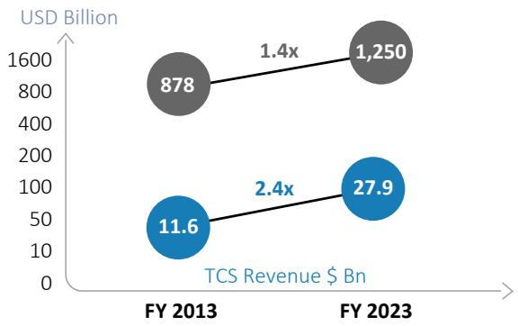

line

| Year | TCS Revenue ($ Bn) | Growth Rate |
| :--- | :--- | :--- |
| FY 2013 | 878 | 1.4x |
| FY 2023 | 1,250 | 2.4x |
| TCS Revenue $ Bn | 11.6 | |
| TCS Revenue $ Bn | 27.9 | |

The outperformance may be attributed to market share gains resulting from TCS’ longer-term, purpose-driven partnerships with its customers, its agile organization structure, and a very stable management team; its investments in organic talent development, research and innovation, intellectual property and in building newer capabilities that have helped expand wallet share with clients; and better execution resulting in greater customer satisfaction.

# TCS’ Business

# An Overview

TCS is an IT services, consulting and business solutions organization partnering many of the world’s largest businesses in their transformational journeys for the last 55 years. It has a global presence, deep domain expertise in multiple industry verticals and a complete portfolio of offerings – grouped under consulting and service integration, application services, digital transformation services, cloud services, engineering services, cognitive business operations, and products and platforms – targeting every C-suite stakeholder.

The company leverages all these capabilities and its deep contextual knowledge of its customers’ businesses to craft unique, high quality, high impact solutions designed to deliver differentiated business outcomes. These solutions are delivered using its Secure Borderless Workspaces™ (SBWS™) operating model which enables a highly distributed, Location Independent Agile™ delivery.

TCS geographic footprint covers North America, Latin America, the United Kingdom, Continental Europe, Asia Pacific, India and Middle-East Africa.

TCS considers industry verticals as its primary go-to-market business segments. The key vertical clusters are: Banking, Financial Services and Insurance (BFSI), Communication, Media and Technology (CMT), Retail and Consumer Business, Life Sciences and Healthcare, Manufacturing and Others.

# Strategy for Sustainable Growth3

Customer-centricity is at the heart of TCS’ strategy, organization structure and investment decisions. TCS’ customer-centric worldview helps spot trends early, embrace business opportunities by making the right investments and mitigating risks while discharging its social and environmental responsibilities.

TCS has been broadening and deepening customer relationships by continually looking for new opportunities and newer areas in their businesses to add value, proactively investing in building newer capabilities, reskilling its workforce and launching newer services, solutions, products and platforms to address those opportunities.

In the last few years, the company has been using its investments in research and innovation, its intellectual property and deep contextual knowledge of the customer’s business and technology landscape to proactively pitch ideas and solutions designed to improve the client’s topline and help drive competitive differentiation.

These growth and transformation (G&T) engagements are higher value engagements catering to the needs of a broader set of stakeholders in the client organization, enjoying greater visibility within the CXO suite and more closely aligned with their business strategy. An expanding share of this business is helping drive a steady increase in the scope and scale of services consumed year after year, and an expansion of TCS’ share of wallet, as evidenced by the client metrics.

Over time, this strategy has resulted in deep and enduring customer relationships, a vibrant and engaged workforce, industry-leading profitability, a steady expansion of the addressable market, and a proven track record in delivering longer term stakeholder value.

# Enabling Investments

TCS pioneered4 the use of the word ‘digital’ to describe the new family of technologies that emerged in the last decade. Quick to recognize the potential of cloud, the company made investments ahead of time in launching new platform-based business models as far back as in 20095 , reskilling the workforce, research and innovation, building collaborative workspaces and innovation centers, intellectual property, and alliances and partnerships. Those early investments have given TCS a head start in participating in its customers’ G&T journeys.

The company continues to invest in co-innovation hubs, launching TCS Pace Ports™ in major markets. TCS teams use these physical spaces to work with academic and start-up partners, ideate jointly with client teams and rapidly build prototypes. The Pace Ports at Pittsburgh in the US, in the Carnegie Mellon University campus, and the other in Toronto, Canada, were formally inaugurated this year. Including the ones in Tokyo, New York and Amsterdam, the company has five Pace Ports in all.

The company launched joint innovation hubs as well, using the TCS Pace™ framework. TCS and Boots launched an agile incubator called INNOVATE Powered by TCS Pace™, at Boots’ Nottingham headquarters in the UK. TCS forged a major applied engineering and research partnership with The National Robotarium, UK’s largest and most advanced AI and robotics research centre, located at Heriot-Watt University’s Edinburgh campus.

TCS continued to expand and deepen its industry-leading portfolio of products and platforms, launching new variants within the ignio™ suite and building newer functionality and features in the TCS BaNCS™ suite, HOBS, TwinX, Mastercraft and Jile. TCS Omnistore™ now offers three more modules as part of its AI powered enterprise personalization - Unified and composable commerce, Enterprise personalization, and Marketing hub.

TCS’ dedicated practice units around AWS, Microsoft Azure and Google Cloud Platform have been steadily investing in training, certifications, credentials and in building solutions and intellectual property on their respective hyperscaler stacks. In FY 2023, the company crossed the milestone of 100,000 hyperscaler-certified employees. By virtue of being one of their largest system integrator partners with deep domain expertise across multiple areas, TCS was the launch partner for many new solutions introduced by hyperscaler platforms during the year.

The company has leveraged its deep domain knowledge across multiple industries to create an extensive catalog of over 100 industry cloud offerings addressing the needs of clients across 20 industries. The portfolio of TCS solutions available on public hyperscaler cloud platforms continued to expand. In FY 2023, TCS Dexam™, TCS DigiGov™, TCS Cognitive Plant Operations, TCS Mobility Cloud Suite and TCS ESG Integrator were added to the list of existing solutions like TCS Omnistore™, TCS MasterCraft™, 5G Edge Suite, TwinX, TCS Clever Energy™, TCS IP2™ and TCS Envirozone™.

Strategic Responses to Opportunities and Threats 

<table><tr><td>Opportunity / Threat</td><td>TCS Approach</td><td>Outcomes</td></tr><tr><td>Macroeconomic uncertainty impacting decision making and prompting cost reduction initiatives</td><td>Proven track record in helping enterprises reduce their cost of operations.Proactive pitching of IT and business operating model transformations that not only deliver greater efficiency, but also enhance enterprise agility, resilience and throughput.Leveraging full services capability and deep client relationships to propose product-aligned operating models.Use of TCS CognixTM to accelerate operations transformation, using over 600 pre-built automation components that infuse AI/ML and other technologies into IT and business processes to reduce human intervention, increase velocity and throughput.</td><td>Strong deal flow resulting in a robust order book that gives better visibility of medium-term growth.Market share gains in vendor consolidations.Efficiency gains helping fund client’s transformation programs in some instances.TCS Cognix recognized as a means of driving quicker realization of Rol and used by nearly 300 clients.</td></tr></table>

4 Ref AR FY 2012, MD&A, Pages 25, 29

5 Ref AR FY 2010, Letter from CEO, Page 7

<table><tr><td>Opportunity / Threat</td><td>TCS Approach</td><td>Outcomes</td></tr><tr><td>Greater interest in using technology to drive business growth and differentiation</td><td>Focused on developing contextual knowledge and applying that for inside-out transformations.Continued investments in research and innovation, TCS Pace Ports, and intellectual property (IP).Dedicated practice with domain experts to bring together TCS’ differentiated capabilities from across the organization to stitch together comprehensive solutions.Proactive pitching of solutions to customers’ most pressing business problems.New brand tagline ‘Building on Belief’ to strengthen positioning as a growth and transformation partner.</td><td>Expansion of addressable market.Growing share of G&amp;T business adding to growth.Higher quality revenue, lending margin resilience.More deeply embedded in the client’s business.Engaging with a broader set of buyers in the client organization.Higher visibility within C-Suites.</td></tr><tr><td>Accelerated adoption of public cloud</td><td>Dedicated business units with end to end capabilities on each of the hyperscaler platforms.Continued investment by each of these units in skills, certifications, credentials, IP and accelerators.Articulated the multi-horizon cloud transformation framework.Made available TCS products and solutions on public clouds.</td><td>Strong growth in cloud transformation revenues.Top tier partner to each of the hyperscalers.Preferred partner to clients seeking to use cloud native capabilities to power their growth and transformation.Over 110,000 hyperscaler-certified employees.</td></tr><tr><td>Greater acceptance of as-a-Service platforms</td><td>Strengthened alliances and launched new offerings around the popular and new SaaS products.Helped ISV* clients upgrade their products to launch new SaaS versions.Partnering with product manufacturers to help launch innovative as-a-Service offerings using TCS Bringing Life to Things IoT framework.TCS IP:Promoted SaaS versions of in-house product portfolio, now available on hyperscaler platforms.Used IP portfolio to launch new platforms that bundle IP and shared services on the cloud.</td><td>Stronger win-win partnerships.Expansion of addressable market.Strong growth in SaaS sales.Platforms drive stickier relationships, with long term revenue visibility.</td></tr></table>

\* Independent Software Vendor

# Talent Management

TCS aims to attract, develop, motivate and retain diverse talent, that is critical for its competitive differentiation and continued success. The company’s talent management strategy seeks to maximize the potential of every employee by creating a purpose-driven, inclusive, stimulating, and rewarding work environment, delivering outstanding employee experience, while fueling business growth. TCS strives to create a vibrant workplace and an engaged workforce by encouraging four behaviors: follow your passion, stay hungry, commit to lifelong learning and thrive together.

In FY 2023, TCS made a net addition of 22,600 employees globally, taking the total employee base to 614,795, representing 150 nationalities.

After two years of remote working, TCS initiated a Return to Office initiative to better integrate and acculturate new recruits, deepen employee engagement levels, drive purposeful engagement and extend the spirit of #OneTCS. As an outcome, 50% of employees started working from office for two or more days in a week.

# Industry-First Initiatives

Intensified focus on equipping the company’s mid-level managers with market relevant skills by providing the right learning and certification opportunities to help them succeed in a world of new technologies. More than 90% of the target employee pool is participating in this strategic program and close to 60% is certified in various market relevant skills.

Xcelerate - The industry recognized Talent Transformation platform for employees, to capture employees’ aspirations and mapping them to future opportunities. Aspirations of nearly 2/3rd of TCSers were captured, with \~100K progressing towards their aspired roles.   
Engagement with Purpose – A platform for employees to live TCS’ values through collective community service, enhance organizational belonging and self-actualization. More than 400,000 employees were engaged as part of the initiative.

# Talent Acquisition

In FY 2023, TCS responded with agility to the changing supply side dynamics which saw the unprecedented industry-wide employee churn peaking mid-year, then falling sharply in the latter half. This entailed recalibrating talent acquisition dynamically to fully utilize the additional capacity built up in the prior year.

The company remains the preferred employer and one of the largest job creators in IT services in several major markets, for both freshers and lateral hires. In addition to about 44,000 fresh engineers, TCS onboarded its highest ever number of lateral recruits during the year. It also pivoted from a virtual-only mode to a hybrid model of virtual and in-person recruitment focused on attracting the right talent, creating better employee experiences, and building the TCS brand.

# Key Achievements:

TCS National Qualifier Test: Over 618,000 students from more than 4,200 institutes in India competed for the opportunity to work for TCS.   
Hiring from India’s top B-schools, including the top 3 IIMs, continues with internship and placement offers as part of the strategic leadership program.   
TCS CareersNext: TCS’ virtual career fair platform was leveraged for conducting 3 virtual hiring drives in this year, yielding over 32,000 registrations and 8,000 job applications.   
TCS HackQuest, the company’s flagship ethical hacking competition now in its 7th season saw over 58,000 registrations from more than 3,000 institutes across India.   
Programs to improve diversity in hiring produced encouraging outcomes. Rebegin, an initiative for experienced women professionals re-entering the workforce after a break saw nearly 14,000 job applications. Over 200 job applications were received from people with disabilities.   
TCS Sigma launched in FY 2023 to provide career opportunities for graduates and postgraduates in pharmacy in the company’s life sciences business.

TCS Academic Interface Program continued to engage with faculty and students through focus group connects, workshops, faculty development programs and other campus outreach activities. In FY 2023, TCS engaged with over 216,000 students and about 17,000 faculty members in nearly 1,500 partner academic institutes across the world. More than 2,000 interns were engaged during the year.

# Culture and Diversity

TCS is an equal opportunity employer and has a well-defined and progressive Diversity, Equity and Inclusion (DEI) policy embracing all diversity parameters which includes gender, marital status, religion, race/caste, colour, age, ancestry, nationality, language, ethnic origin, socio-economic status, physical appearance, disability, sexual orientation, gender identity and/or expression and any other category protected by applicable law.

TCS recognizes that a diverse and inclusive workforce is necessary to drive innovation, foster creativity, and guide business strategies. Its disclosures around DEI earned it a place in the Bloomberg Gender-Equality Index (GEI) once again. Other highlights include:

iExcel: TCS’ flagship executive leadership development program for women completed 22 editions, benefiting 1,450 women leaders.   
The Diversity Maturity Matrix: An in-house diversity measurement tool that aims at identifying gaps and assessing an organization’s maturity in DEI.   
Client engagement: Allies of Diversity is a program where senior leadership from client organizations are invited to share diversity best practices. Engagement with 75 C-Suite leaders with 63 different client organizations has been completed till date. An Allies of Diversity conclave was organized in London to provide a forum for DEI leaders to share organizational learnings. DEI focused learning programs were conducted for 4 client organizations.   
The Workplace Coach: A 75-hour internal coach certification program enabling individuals to become coaches. This supports individuals within the organization towards ACC certification. So far, 3 cohorts have completed this program bringing together over 450 internal coaches.   
Education and Sensitization: TCS has mandatory online training designed to sensitize employees on key concepts of DEI. 504,255 employees completed this in FY 2023.   
Employee Resource Groups: These serve as platforms for under-represented communities and their allies to share concerns, experiences, stories and strategic solutions. TCS has 13 voluntary, employee-led groups that have come together based on shared diversity identity characteristics or interest.

Champions of Equity: This campaign was created to ensure a fair and inclusive culture at the workplace. Under this program, 105,000 employees have taken a pledge till date, to be a Champion of Equity – someone who treats everyone with fairness and transparency, and takes an inclusive approach towards every individual, culture and system.   
TCS Culture Survey: As part of the Belongingness campaign, TCS Culture Survey was rolled out and responded to by over 7,000 employees across 7 geographies.   
Employee Engagement: Over 84,000 employees participated in DEI learning programs and diversity celebration month.   
Supplier Diversity: TCS has a Supplier Diversity Program that identifies certified diverse suppliers that can provide competitive, high-quality goods and services, whose business model is aligned with the company’s business strategy.

# Talent Development

TCS strongly believes that every employee should have access to market relevant learning opportunities for career growth and no TCSer should be left behind. The company has adopted a segmented approach to learning to ensure this.

TCS Elevate: TCS’ pioneering program linking learning to career growth and reward covered over 407,000 employees. Over 22,000 employees were identified as high talent and received increased compensation.

Contextual Masters: TCS’ program to identify tenured employees with contextual knowledge of the customer’s business and technology landscape, continues to expand. The company has over 64,000 Contextual Masters who are being groomed to be next generation transformation leaders with specially curated leadership development programs designed in collaboration with Ivy league institutions.

# Key Metrics:

60,000 open positions fulfilled using up-skilled / crossskilled employees.   
TCSers invested in 82.4 hours of learning on average during the year.

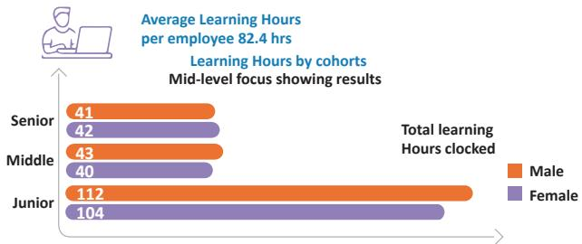

bar

Average Learning Hours per employee 82.4 hrs
Learning Hours by cohorts
Mid-level focus showing results
| Cohort | Male | Female |
| :--- | :--- | :--- |
| Senior | 41 | 42 |
| Middle | 43 | 40 |
| Junior | 112 | 104 |
Total learning Hours clocked; Average: Learning Hours per employee 82.4 hrs; Total: Learning Hours clocked; Mid-level focus: Male and Female cohorts.

TCSers acquired 53,000 certifications on various hyperscaler cloud technologies during the year. With over 110,000 cloud certified employees in total, TCS is the #1 partner for Google and #2 partner for Microsoft Azure.

500,000 employees trained in digital technologies, with an average of \~7.5 competencies per employee.   
568,000 employees have acquired Agile competency, with 495,000 of them groomed as Agile practitioners, over 35,000 as Agile certified and about 3,000 as mentors and coaches.   
Taking advantage of the large numbers of employees who started returning to office after two years of entirely virtual working, the company adopted an increasingly phygital (physical + digital) approach to learning and development. Over 80,000 TCSers benefited from in-person training during the year.

# Building on Belief through Purposeful People Policies

Based on feedback received from employees, evolving needs of the workforce and best practices in the field of human capital management, the company makes refinements to existing policies and introduces new policy. In FY 2023, TCS:

Introduced a new policy on workforce fluidity, in keeping with its talent cloud strategy, that encourages employees to take ownership of their careers by seeking new and challenging opportunities at defined periodicity.   
Introduced a policy on flexible work arrangements, which provides necessary support and flexibility for caregivers of young children, expectant women employees, and persons with disability.   
Extended its policy on DEI to include gender identity, individuals with mental variations and HIV/Aids affected persons at the workplace, and to comply with relevant inclusivity laws.

# Talent Transformation

TCS has multiple initiatives to help employees grow in their careers:

Mentoring: TCS has been building a culture of mentoring and coaching in the organization through systemic intervention programs as part of its Mentor Capability Building Framework. This was further strengthened during the year with the introduction of two new certifications – Platinum and NexGen certification in mentoring. TCS currently has about 36,000 mentors in the organization of whom more than 3,500 Gold and Silver certified.

• iConnect is a highly collaborative tool designed to help employees reach out to senior mentors for guidance on career paths, and have face to face dialogues about their role and career. In FY 2023, over 29,000 iConnect sessions were initiated.

C Talent Review is TCS’ process to assess and review the leadership pool in the organization. It enables leaders to share their career aspirations and preferences of mobility, followed by an assessment of their leadership attributes. The objective of the program is to create and sustain a healthy leadership pipeline.

Exciting Opportunities is the internal platform to publish niche and critical open positions to the leadership and

high potential communities, thereby facilitating talent mobility. This embodies the company’s philosophy of giving the first right of refusal for all leadership positions to internal candidates, thereby enabling better leadership development and building strong organizational loyalty.

# Competitive Compensation

TCS’ business model depends on its ability to attract and retain talent in the highly competitive, global market for software engineers with graduate or post-graduate degrees in engineering and with relevant technical skills.

Compensation levels are merit based, determined by qualification, experience levels, special skills if any, and individual performance. Compensation structures are driven by prevailing practices in each country that TCS operates in. The merit based, democratized, transparent talent framework – Elevate, is designed to establish a tighter linkage between learning, skill development, career and reward. The company regularly benchmarks its compensation plans and benefits with the market to ensure competitiveness.

At TCS, three months’ notice is required from either side for termination6 . Although most of the organization’s activities are performed by full-time employees, TCS uses contractors, especially for short-term assignments or those requiring skills not internally available.

# Engagement with Purpose

With more employees returning to work, various programs were run to enable higher levels of engagement. More than 320,000 employees were engaged through townhalls and project confluences with an emphasis on Living my Values, Build my Career and Lifelong Learning. The company enabled more than 22,000 mentoring sessions and over 15,000 career conversations.

Highlights of the company’s key engagement forums:

New Joinee Integration: Various structured programs such as meet and greet sessions, workplace visits and leader connects were organized to improve the integration experience of new joiners at various milestones of their induction in the initial one year. The effectiveness of these programs was demonstrated by the high 83% iBelong satisfaction index.   
TCS Cares: Aims to build an emotionally strong and mentally resilient workforce. A special edition targeting leaders saw participation by over 1,100 leaders. 87% of participants agreed that it helped in their wellbeing and 80% agreed that their productivity increased after attending this program.   
Fit4life: Builds a fraternity of health and fitness conscious employees and creates a culture of fitness. 54,000 active participants logged physical activity equivalent to running 24 million kms.   
Purpose4Life: Forum for volunteering for community projects in the areas of education, health and environment. More than 40,000 volunteers participated in various social

outreach initiatives, contributing 898,000 volunteering hours that benefited 394,000 individuals in the community.

• PULSE: Pulse 2022 recorded an enthusiastic participation with more than 400k employees taking in the survey. TCS has achieved Satisfaction Index of 79.5 and Engagement Index of 81.0.

Other engagement and collaboration platforms in TCS include:

Knome, KnowMax, GEMS: Platforms for social collaboration within the organization, learning, sharing and for rewards and recognition.   
Safety First: Initiative focused on employee safety and security.   
Maitree: Community of TCSers and their families who plan activities that help create a bond among employees and promote work-life balance.

# Employee Retention

TCS’ values-driven culture, progressive HR policies, and philosophy of investing in people and empowering them have been integral to creating a culture of belonging and One TCS and also made it an industry benchmark in talent retention.

The company’s philosophy of grooming leadership from within, and giving first right of refusal to internal talent for new open positions, inspires higher levels of loyalty to the organization. This has resulted in a very strong, deeply acculturated mid-layer with long tenures in the company. This cohort played a pivotal role in seamlessly integrating new talent in FY 2023 and added significant value through their contributions and contextual knowledge.

Unprecedented levels of employee churn across the industry drove TCS’ attrition to an all-time high in the first half of FY 2023. It trended down in the second half. IT services attrition was 20.1% on an LTM basis.

# Occupational Health and Safety

TCS has a well-defined Occupational Health and Safety (OHS) policy and supporting processes to ensure the safety and well-being of its employees. Safety lead and lag indicators are measured across the organization and reported. The Stakeholders’ Relationship Committee in the Board reviews the company’s health and safety performance on a half-yearly basis. Over 94% of the workforce is represented in joint managementemployee health and safety committees that monitor, advise, and drive occupational, health and safety initiatives.

TCS is certified to ISO 45001:2018 Occupational Health and Safety Management System standard across 127 of its facilities worldwide covering approximately 94% of its total footprint. The company continued to focus on creating ergonomic awareness including correct postures and workstation stretches for an office-based work environment and remote working environment, as employees worked in hybrid mode during the year. General safety awareness (fire safety, office safety, road safety etc.,) and safety incident reporting awareness was also provided to employees through monthly themes and campaign initiatives. There were also several fitness programs, including yoga and meditation practices, mental health and wellbeing which drew employee participation.

# FINANCIAL PERFORMANCE OVERVIEW

The discussions in this section relate to the consolidated, Rupee-denominated financial results pertaining to the year that ended March 31, 2023. The financial statements of Tata Consultancy Services Limited and its subsidiaries (collectively referred to as ‘TCS’ or ‘the Company’) are prepared in accordance with the Indian Accounting Standards (referred to as ‘Ind AS’) prescribed under section 133 of the Companies Act, 2013, read with the Companies (Indian Accounting Standards) Rules, as amended from time to time. Significant accounting policies used in the preparation of the financial statements are disclosed in the notes to the consolidated financial statements.

The following table gives an overview of the consolidated financial results of the company:

(\` crore) 

<table><tr><td rowspan="2"></td><td colspan="3">FY 2023</td><td colspan="2">FY 2022</td></tr><tr><td>Amount</td><td>% of Revenue</td><td>% Growth</td><td>Amount</td><td>% of Revenue</td></tr><tr><td>Revenue from operations</td><td>225,458</td><td>100.0</td><td>17.6</td><td>191,754</td><td>100.0</td></tr><tr><td>Earnings before interest, tax, depreciation and amortization (EBITDA) (before other income)</td><td>59,259</td><td>26.3</td><td>11.7</td><td>53,057</td><td>27.7</td></tr><tr><td>Profit Before Tax (PBT)</td><td>56,907</td><td>25.2</td><td>10.1</td><td>51,687</td><td>27.0</td></tr><tr><td>Profit after tax attributable to shareholders of the company</td><td>42,147</td><td>18.7</td><td>10.0</td><td>38,327</td><td>20.0</td></tr><tr><td>Earnings per share (in ₹)</td><td>115.19</td><td></td><td>11.2</td><td>103.62</td><td></td></tr></table>

# Analysis of revenue growth

On a reported basis, TCS’ revenue grew 17.6% in FY 2023, compared to 16.8% in the prior year. The growth was driven by accelerated spending on digital transformation initiatives, cloud adoption and increased outsourcing, aided by currency benefit.

Average currency exchange rates during FY 2023 for the three major currencies are given below:

<table><tr><td>Currency</td><td>Weightage (%)</td><td>FY 2023₹</td><td>FY 2022₹</td><td>% Change YoY</td></tr><tr><td>USD</td><td>56.0</td><td>80.74</td><td>74.61</td><td>8.2</td></tr><tr><td>GBP</td><td>12.8</td><td>96.98</td><td>101.50</td><td>(4.5)</td></tr><tr><td>EUR</td><td>10.8</td><td>84.01</td><td>86.36</td><td>(2.7)</td></tr></table>

Movements in currency exchange rates through the year resulted in a positive impact of 3.9% on the reported revenue. The constant currency revenue growth for the year, which is the reported revenue growth stripped of the currency impact, was 13.7%.

<table><tr><td>Growth attributable to</td><td>FY 2023 (%)</td><td>FY 2022 (%)</td></tr><tr><td>Business growth</td><td>13.7</td><td>15.4</td></tr><tr><td>Impact of exchange rate</td><td>3.9</td><td>1.4</td></tr><tr><td>Total Growth</td><td>17.6</td><td>16.8</td></tr></table>

# Segmental Performance

The revenue break-up by Industry Vertical and Geography is provided below:

Revenue by Industry Vertical   
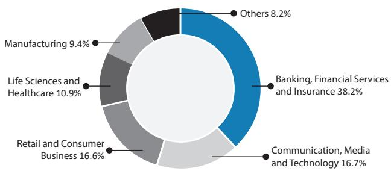

pie

| Category | Percentage (%) |
| :--- | :--- |
| Banking, Financial Services and Insurance | 38.2 |
| Communication, Media and Technology | 16.7 |
| Retail and Consumer Business | 16.6 |
| Life Sciences and Healthcare | 10.9 |
| Manufacturing | 9.4 |
| Others | 8.2 |

Revenue by Geography   
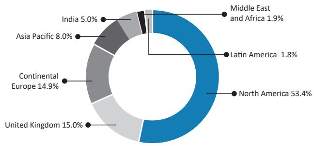

pie

| Region | Percentage (%) |
| :--- | :--- |
| North America | 53.4 |
| United Kingdom | 15.0 |
| Continental Europe | 14.9 |
| Asia Pacific | 8.0 |
| India | 5.0 |
| Latin America | 1.8 |
| Middle East and Africa | 1.9 |

Segment revenues, year on year growth, a brief commentary and segment margins are provided below: 

<table><tr><td>Industry Vertical</td><td>Segment Revenue FY 2023 (FY 2022) ₹ crore</td><td>YoY Revenue Growth %</td><td>Key Demand Drivers7</td><td>Segment Margin FY 2023 (FY 2022) %</td></tr><tr><td>Banking, Financial Services and Insurance</td><td>86,127(75,126)</td><td>14.6</td><td>AI for risk monitoring and management, fraud detection and trading strategies.Customer journey transformation, ecosystem strategies for new products and services, connected insurance, fintech adoption.Decentralized finance, embedded finance, Banking as a Service, document custody transformation.Sustainability and climate change initiatives, green lending.</td><td>25.9(26.9)</td></tr><tr><td>Communication, Media and Technology</td><td>37,653(31,874)</td><td>18.1</td><td>5G and fiber rollout, network virtualization, cloud enablement, product, and platform engineering.AI-monitored networks, generative AI for automated content creation.Hyper-personalization, immersive experiences in gaming, recommendation engines.</td><td>28.3(29.9)</td></tr><tr><td>Retail and Consumer Business</td><td>37,506(30,715)</td><td>22.1</td><td>Retail and Consumer Packaged Goods (CPG):Marketplace, social commerce, future stores, digital advertising platform, payments.Smart shelves, smart manufacturing, automated micro-fulfilment centers.Resilient and intelligent supply chain, partner integration, track and trace, last-mile delivery, AI enabled inventory management.Seamless and unified customer experience across channels (omni-channel), hyper personalization, CX and recommendations, AI for apparel design and personalized fashion recommendations.Green labeling.Travel, Transportation and Hospitality (TTH):Retailing in airlines, new distribution capability, experiential selling and non-booking revenues in hospitality, decision intelligence.Automation and self-service, touchless experience, digital identity solutions, maintenance drones in airlines, autonomous vehicles, and robots in airports.Warehouse robotics, intelligent shipment planning, last mile delivery, real-time operations visibility, AI-enabled pricing, end-to-end shipment visibility in logistics.Safe and sustainable travel.</td><td>25.7(27.8)</td></tr><tr><td>Life Sciences and Healthcare</td><td>24,605 (20,462)</td><td>20.2</td><td>Life Sciences:Drug discovery, virtual clinical trials, connected labs, and instruments.Digital twin for manufacturing and factory of the future.AI-led pharmacovigilance and product surveillance.Healthcare:Patient experience, health data platforms.Wearable devices, mobile health.AI powered diagnosis, treatment planning, digital surgery, personalized medicine.</td><td>28.0(30.0)</td></tr><tr><td>Manufacturing</td><td>21,236 (18,610)</td><td>14.1</td><td>Integration across silos and digital twins for product innovation-connected assets and plants, remote asset management.Resilient supply chain, parts track and trace.Front-end digital investments to enhance customer experience.Plant safety, energy efficiency and decarbonization, emission tracking and monitoring, sustainability focus on facilities waste management and energy, EVs.</td><td>27.5(30.1)</td></tr><tr><td>Others</td><td>18,331 (14,967)</td><td>22.5</td><td>Connected ecosystems for utilities, connected home, smart metering and alerts, virtual power plants, remote monitoring and infra inspection.AI-enabled smart grids, patterns, and predictions.Energy transition, emission detection and monitoring in critical infrastructure.</td><td>21.1(20.6)</td></tr></table>

# Business Outlook

Global growth is projected to moderate from 3.4 percent in 2022 to 2.8 percent in 20238 , weighed down by central banks raising interest rates to fight inflation, and Russia’s war in Ukraine. In major economies, the heightened risk of a recession – made worse by a banking crisis – has led to uncertainty in enterprise decision-making, affecting spending on capex and certain discretionary programs.

Despite this, spending on IT services has been resilient so far. Cloud migration programs are continuing apace, and clients continue to launch new G&T projects. The higher level of uncertainty in the business environment has made clients more receptive to proactive proposals around IT and business operating model transformations that can not only deliver significant efficiencies but also help them become more agile and resilient. All this has resulted in a strong order book for

FY 2023, at \$34.1 Bn, which is 1.2 times revenue. The pipeline has also grown well.

This provides visibility on medium-term growth amid nearterm uncertainty. If the delayed decision-making and cash conservation seen in some segments at the end of FY 2023 flows over into the first half of FY 2024, that could result in some moderation in full year revenue growth after two years of strong growth.

Key demand drivers expected to power the company’s growth in FY 2024 include:

Technology transformation: IT infrastructure modernization, cloud enablement, application and data estate modernization, cloud migration, data centre and collocated data support, digital workplace, digital twins, cyber security, ERP modernization, low-code no-code, 5G/ Edge and AI adoption.

G&T: Customer experience transformation using personalization, omnichannel implementation, immersive experiences using XR/Metaverse, product and business model innovation, supply chain modernization, M&A integration / divestitures, sustainability.   
Operations: Traditional outsourcing, vendor consolidation and multi-services deals, AI/ML-led transformation of IT / business operations for greater resilience and leaner operating models, managed services models and real time operation visibility.

# Enterprise Risk Management9

FY 2023 saw multiple external and internal challenges continuing to shape the overall risk profile of the company. Macroeconomic and geo-political risks had an impact throughout the year. The Russia-Ukraine war and geo-political tensions, trade wars and imposed sanctions were pervasive and had direct and cascading impacts on economies and businesses. Shortages, rising inflation, supply-chain disruptions, energy crisis led to further uncertainties in the economic growth environment, with the year ending with banking industry upheavals in US and Europe. During the year, IT organizations including TCS faced the

knock-on effects of the pandemic including attrition and impact of hybrid modes of working. Technological advancements and breakthroughs like generative AI and metaverse have opened up new vistas of both risks and opportunities.

TCS continues to monitor this uncertain and dynamic business environment very closely and has strengthened the deployment of its Enterprise Risk Management framework to address the risks and leverage the associated opportunities. This framework enables risk identification, risk assessment, risk response planning and actions, risk monitoring and overall risk governance. Key risk indicators and control indicators are used to anticipate risks and assess effectiveness of their mitigation actions respectively.

TCS takes a holistic view of its enterprise risk profile, covering strategic, operational, compliance, financial and catastrophic risks, thus enabling informed decision-making. Risks are assessed and managed at various levels with a top-down and bottom-up approach across the enterprise, business units, geographies, business functions, customer relationships and individual projects.

Listed below are some of the key risks, anticipated impact on the company and mitigation strategies.

<table><tr><td>Key Risks (R) / Opportunity (O)</td><td>Impact on the Company</td><td>In case of risk, approach to adapt or mitigate10</td><td>Financial implications of the risk or opportunity11</td></tr><tr><td>Volatile global political and economic environment (R)</td><td>Geo-politics and macroeconomic volatility can affect demand for the company&#x27;s services. The ongoing Russia-Ukraine war has led to supply chain disruptions, energy crisis, food and merchandise scarcities and related inflation.Persistent high inflation in major economies could affect consumer spending and fuel social unrest. Repeated interest rate hikes by central banks to rein in the inflation could result in economic slowdowns.Continuing turmoil in the banking sector could affect not only spending in that sector, but also squeeze liquidity.All of these could affect clients&#x27; business outlook and result in reduced demand for TCS&#x27; services. It could also increase TCS&#x27; costs of doing business.In addition, there could be risks to service delivery, business continuity, cybersecurity, sanctions compliance and human rights risks in geopolitically sensitive zones, all of which could increase costs or affect the company&#x27;s revenue growth.</td><td>Broad-based business mix, well diversified across geographies and industry verticals.Monitor changing geopolitical scenarios, the potential business implications and strengthen internal controls to further safeguard against secondary risks.Offerings and value propositions targeting all stakeholders (in addition to the CIO) in the customer organization, covering discretionary as well as non-discretionary spends, and relevant at every point in the business cycle.Participate in the customer&#x27;s G&amp;T initiatives through services and offerings including advisory services, migration and modernization of applications and workplace transformation using location independent agile, deep contextual knowledge and data-driven analytics and dashboards.Where customer&#x27;s discretionary budgets are uncertain, focus on cost and optimization propositions in the short term to improve their business efficiency.</td><td>Negative</td></tr></table>

9 TCFD Risk Management A, B and C   
10 GRI 3-3   
11 GRI 201-2, TCFD Risk Management A, B and C

<table><tr><td>Key Risks (R) / Opportunity (O)</td><td>Impact on the Company</td><td>In case of risk, approach to adapt or mitigate $^{10}$ </td><td>Financial implications of the risk or opportunity $^{11}$ </td></tr><tr><td></td><td></td><td>Proactively invest in infrastructure and resourcing to satisfy anticipated customer demand for flexible products and platforms-based solution offerings and subscription-based services to gain market share and new clients and markets.Enter into more long-term contracts.Target market segments which provide counter-cyclical support in times of downturn.Leverage business ecosystem through collaboration with partners, start-ups and alliances to participate in transformation initiatives of customers.Country-level business continuity plans in place to address potential conflicts in the region.</td><td></td></tr><tr><td rowspan="2">Talent risk due to huge demand for talent globally and attrition (R &amp; O)</td><td>The company's ability to attract, develop, motivate, and retain talent is critical to its business success.Talent scarcity can lead to poaching of the company's employees and result in higher attrition. This can disrupt ongoing projects, slow down planned ramp ups and affect revenue growth.Inability to scale up experienced professionals with niche digital skills from the market, can also impact TCS' ability to grow.</td><td>Commitment to organic talent development, best in class learning and development, career growth linkage to cross-skilling / upskilling, preference to internal talent for new leadership positions, all incentivize planning of longer-term careers in TCS and improved retention.Tactical initiatives to retain talent using proactive as well as reactive initiatives.Focused employee engagement to reduce attrition, increase sense of belonging and build capability to capture the demand from the market.Leverage top employer brand and social networking sites and talent sourcing channels to tap into the passive pool.Reduce talent acquisition cycle time to improve joining rates through innovative practices.Engage in various markets through investments in STEM/golT programs, campus engagements, local hiring and building reputation to attract local talent.</td><td>Negative</td></tr><tr><td>Opportunity:Talent scarcity in major markets is impeding enterprises' ability to staff projects, increasing the propensity to outsource.Superior talent retention by TCS can result in greater delivery certainty and therefore a differentiated positioning for the company, driving market share gains.</td><td>Proactive pitches to clients for operating model transformations leveraging AI and automation, or managed services models to enable tapping into global talent pools.Commitment to organic talent development, best in class learning and development, career growth linkage to cross-skilling / upskilling, preference to internal talent for new leadership positions, all incentivize planning of longer-term careers in TCS and best in class talent retention.Focused employee engagement to reduce attrition, increase sense of belonging and build capacity to capture market share.Higher level of industrialization, with robust processes and controls, and knowledge management reduces disruption due to attrition of individual team members, and helps differentiate TCS.</td><td>Positive</td></tr><tr><td>Restrictions on global mobility, location strategies (R)</td><td>Distributed software development models require the free movement of people across countries and any restrictions in key markets pose a threat to the global mobility of skilled professionals.Restrictions could also be due to legislations which limit / delay the availability of work visas or which apply onerous eligibility criteria or costs, leading to project delays and increased expenses.</td><td>Ongoing monitoring of the global environment, working with advisors, partners and governments to promote local talent building efforts.Material reduction in dependency on work visas through increased local hiring, use of contractors, local mobility and training in all major markets.Leveraging the SBWSTM model to deliver from anywhere. Use of Location Independent Agile to promote systematic collaboration and reduce the need for co-location.Active engagement in Science, Technology, Engineering and Math (STEM) initiatives designed to structurally increase the availability of engineering talent in major markets.Greater brand visibility through event sponsorships, community outreach, showcasing of investments, innovation capabilities and employment generation.Increased outreach to government stakeholders, trade bodies, think tanks and research institutes.</td><td>Negative</td></tr><tr><td>Business model changes in customer enviroment (R &amp; O)</td><td>Rapidly evolving technologies are changing technology consumption patterns, creating new classes of buyers within the enterprise, giving rise to entirely new business models and therefore new kinds of competitors.High levels of economic uncertainty can result in clients recalibrating their IT programs and pulling back their spending on discretionary projects.Increased focus on corporate restructuring and mergers and acquisitions in some industries is driving vendor consolidation, insourcing and cost reduction pressures.These changes require agile responses. Inability to quickly adapt could affect company's competitiveness and result in loss of market share.</td><td>Investments in innovation and differentiated capabilities at scale on emerging technologies through large scale reskilling, external hiring, research and innovation, solution development and IP asset creation leveraging deep contextual knowledge across customer specific domain, technologies and processes.Dedicated business service units providing end-to-end transformational and operational solutions on leading cloud platforms spanning advisory, migration and modernization and support of applications.Constantly scouring the technology landscape using strong partnerships with clients, technology providers, academia, and start-ups, to spot new trends, technologies and potential threats, invest early in building capabilities to mitigate risks and participate in the opportunities.</td><td>Negative</td></tr><tr><td>Key Risks (R) / Opportunity (O)</td><td>Impact on the Company</td><td>In case of risk, approach to adapt or mitigate10</td><td>Financial implications of the risk or opportunity11</td></tr><tr><td></td><td>Opportunity:Increased focus on corporate restructuring and mergers and acquisitions in some industries is creating new opportunities for IT separations and integrations.Interest in technology-enabled business model innovation has opened up opportunities for the company to participate in clients' growth and transformation spending.Pressure to establish competitive differentiation is driving enterprises to look for partners to speed up and scale up their innovation efforts.This is also driving greater interest in pre-built solutions, products and platforms that can accelerate the deployment of transformational solutions.The quest for cost efficiency along with greater resilience and agility in operations is expanding the opportunity for comprehensive operating model transformations.</td><td>Steadily expanding coverage of newer buyers in the enterprise by constantly launching new offerings and solutions to their most pressing business problems.Innovative offerings like operating model transformations using TCS Cognix to help deliver significant cost savings quickly, Location Independent Agile methods to mitigate location constraints and pricing and margin pressures.An entrepreneurial mindset, a decentralized decision-making which empowers frontline managers to take decisions, and an organization structure that enables the company to adapt to constantly evolving situations on the ground with agility and speed.Differentiated solutions for organization divestiture and integration, catering to M&amp;A-induced demand for advisory and business consolidation related services.Large portfolio of IP made available on hyperscaler clouds to accelerate clients' Horizon 2 and 3 transformation journeys.PacePort co-innovation hubs, Agile innovation cloud framework, and extended innovation ecosystem including partners and start-ups to help clients accelerate their product and business model innovation.Bringing Life to Things framework to help clients create connected products, launch remote monitoring and maintenance services.Solutions like TCS HOBS and Servitization engine to help clients embrace subscription-based business models.Focused investments to expand presence in clients' growth and transformation spending, including programs like Contextual Masters to build organizational capacity, new brand tagline, amplification of transformation successes.Platform-based business models and AI-based operating models to disrupt conventional labor arbitrage based constructs, and gain market share.</td><td>Positive</td></tr><tr><td>Currency volatility (R)</td><td>Volatility in currency exchange movements results in transaction and translation exposure. TCS' functional currency is the Indian Rupee. Appreciation of the Rupee against any major currency could impact the reported revenue in Rupee terms, the profitability and also result in collection losses.Conversely, depreciation could optically inflate revenues and earnings, distorting stakeholder perceptions of the underlying business momentum and profitability.</td><td>Currency hedging policy that is aligned with market best practices, to limit impact of short term exchange volatility on receivables, forecasted revenue and other current assets and liabilities.Hedging strategies guided and monitored periodically by the Risk Management Committee of the Board.Management commentary based on constant currency figures to enable a currency-neutral understanding of business growth.</td><td>Negative / Positive</td></tr><tr><td>Breach of data protection laws (R)</td><td>The focus on data privacy and protection of personal data has increased compliance risk.Legislations like GDPR in Europe carry severe consequences for non-compliance or breach. Many other countries have enacted or are enacting their Data Privacy regulations to ensure protection of personal data.Violation of data protection laws or security breaches can result in substantive liabilities, fines or penalties and reputational impact.</td><td>Global privacy policy covering all geographies, all areas of operations, and stakeholders, which sets out the privacy principles and guidance for deployment.Organization structure with the Global Privacy Office to strategize, monitor and guide deployment of data privacy framework across the enterprise. Data Protection Officers and other privacy officers have been appointed for TCS entities as required by local privacy regulations to monitor and drive implementation of data protection principles. Business Privacy Leaders are appointed to deploy compliance to the data privacy framework in all functions and business units.Unified global framework PrivACE adopted across all entities and branches to standardize privacy practices while catering to local requirements.Continuous monitoring and analysis of changes to regulatory and legal landscape and enhancing the data privacy framework.Privacy Information Management Systems (ISO 27701:2019) adopted and certified.Embedded privacy by design and privacy by default principles in development of new or changed internal processes, services and products.Data protection controls and robust risk response mechanisms to protect personal data in the TCS ecosystem and also in customer engagements.Industry standard data masking and encryption technologies to protect personal data.Vendors and third parties subjected to due diligence, contracted with appropriate privacy obligations and tracked for compliance based on risk assessment.Mandatory trainings and workshops on data protection, Privacy by Design and global privacy regulations. Continuous awareness campaigns through blog posts, email broadcasts, gamification, roadshows and online events.Risk assessments related to cross border transfers and maintaining data transfer agreements, where required for the transfer of data across jurisdictions.Periodic reviews and audits by independent audit firm to verify compliance to obligations in addition to internal audits across the ecosystem.</td><td>Negative</td></tr><tr><td>Cyber Attacks (R &amp; O)</td><td>Risks of cyber-attacks are on the rise due to the fast-evolving nature of the threat. There is also an increased risk due to various pandemic themed cyber threats and attacks due to geo-political drivers.In addition to impact on business operations, a security breach could result in reputational damage, penalties and legal and financial liabilities.</td><td>Use of advanced tools based on AI/ML to prevent and detect incursions with quarantine capabilities, including perimeter security controls with advanced tools, enhanced internal vulnerability detection, data leak prevention tools, defined and tested incident management and recovery process in compliance with industry best practices.Continued reinforcement of stringent security policies and procedures (certified against ISO 27001) including enhanced security measures and awareness building to combat phishing attempts and soliciting for fraudulent causes or charities through social media, text or calls.Close collaboration with Computer Emergency Response Team (CERT) and other private cyber intelligence agencies, and enhanced awareness of emerging cyber threats.Enterprise-wide training and awareness programs on Information Security including the extensively used enterprise-wide communication and collaboration platforms accessed through mobile or desktop channels.Strict access controls including non-persistent passwords (OTP) for secure access to enterprise applications/network, special handling of privileged administrator accounts, rigorous access management on all cloud deployments.Encryption of data, data back-up and recovery mechanisms for ensuring business continuity.Ability to isolate TCS enterprise network from client network and defined escalation mechanisms to handle security incidents in client environment.Periodic rigorous testing to validate effectiveness of controls through vulnerability assessment and penetration testing.Internal and external audits, red teaming, “breach and attack” simulation.Sourcing threat intelligence from various government, public and private sources to proactively block IPs used by threat actors.State of the art security operations center with automated playbooks.</td><td>Negative</td></tr><tr><td></td><td>Opportunity:Enterprises are increasing their investments in building cyber resilience and turning to specialized third parties to be detect and foil intrusion attempts and limit the impact.This presents a fast growing business opportunity for TCS to become the preferred cyber security partner to its clients.</td><td>Investments in building local threat management centers across the world.Launch of new services and solutions including the Cyber Defense Suite.</td><td>Positive</td></tr><tr><td>Non-compliance to complex and changing global regulations (R)</td><td>As a global organization, the company has to comply with complex regulatory requirements across multiple jurisdictions, covering across a broad range of areas grouped under environmental, social and governance themes.The fast pace and complex nature of changes in the regulatory requirements requires quick identification and sound understanding of these requirements along with agility in adaptation in business operations. Failure to comply could result in penalties, reputational damage and criminal prosecution.</td><td>Deployment of a comprehensive global compliance management framework that enables tracking of regulatory changes across various jurisdictions, including new countries of operations and functional areas and management of compliance risks.In-house digitized regulatory compliance platform enabling clear accountability, tracking of compliance obligations and governance to ensure long-term business sustainability.Operationalized regulatory requirements through business policies and embedding into business processes.100% digitized, quarterly regulatory compliance declarations enabling self-governance of all compliance areas applicable to company’s global operations.Up to date, effective internal controls to comply with regulations, keep a check on unlawful and fraudulent activities and internal audits to provide compliance assurance.Strong focus on fostering ethical and compliance culture; awareness through web-based compliance training courses for all staff and regular notifications/alerts on regulatory changes communicated to stakeholders.Strong governance at board, executive and management levels through compliance committees and compliance working groups.</td><td>Negative</td></tr><tr><td>Intellectual Property (IP) infringement and leakage (R)</td><td>Risk of infringement of IP of third parties including suppliers, partners and alliance organizations by TCS may lead to potential liabilities, increased litigation and impact reputation.Inadequate protection of TCS' IP may lead to potential loss of ownership rights, revenue and value.</td><td>Establishment of an industry leading IP management framework (IP 4.0) with institutionalized frameworks, processes and procedures that address the risk of infringement of third-party IP while ensuring safeguarding of TCS' own IP assets.Establishment of a centralized IP and Software Product Engineering group that strives to build an IP-led culture and IP related awareness effectively.Well-defined (software) asset lifecycle governance framework that incorporates policy guidance and risk mitigation guidelines on IP, legal, software product engineering and business-related risks.IP governance program that ensures that there is right access and right use of TCS IP, customer IP, partner IP, and third-party IP in service and partner engagements.Other key controls include employee confidentiality agreement, training and awareness for IP protection and prevention of IP contamination and infringement. Digitized system to enable strict controls around movement of people and information across TCS' product teams and customer account teams.</td><td>Negative</td></tr><tr><td>Litigation risks (R)</td><td>Litigation risks might arise from commercial disputes, perceived violation of intellectual property rights/trade secret violations and employment related matters.The company's rising profile and scale also makes it an attractive target to meritless lawsuits.Besides the distraction and legal expense, litigations garner negative media attention and pose reputation risk. Adverse rulings can result in substantive damages.</td><td>Strengthening internal processes and controls to adequately ensure compliance with contractual obligations, information security and compliance with IP policies and procedures for protection of intellectual property and avoidance of allegations of trade secret violations.Improved governance and controls over immigration process /increasing localization and inclusion of arbitration provisions in employment contracts.Training and sensitization of business managers to spot the risks, adhere to best practices and escalate potential disputes within the organization for early mitigation steps.</td><td>Negative</td></tr><tr><td>Key Risks (R) / Opportunity (O)</td><td>Impact on the Company</td><td>In case of risk, approach to adapt or mitigate $^{10}$ </td><td>Financial implications of the risk or opportunity $^{11}$ </td></tr><tr><td></td><td></td><td>Team of in-house counsels in all major geographies and a network of reputed global law firms in countries it operates in.Robust mechanism to track and respond to notices as well as defend the company’s position in all claims and litigation.</td><td></td></tr><tr><td rowspan="2">Sustainability Risks- Climate change and Environmental aspects (R &amp; O) $^{12}$ </td><td>Extreme weather events due to climate change pose a threat to human safety and can cause business disruptions.With globally distributed operations, the company faces physical risks to life and property due to extreme weather events, transition risks resulting from disruptions in the market and emerging regulations, disruptions to operations due to water scarcity, risks of inadvertent non-compliance to emerging regulatory requirements around circular economy, e-waste and solid waste regulations, impacting health and safety in local communities, business disruption and reputational damage. All of these could affect TCS’ growth and profitability.</td><td>An environmentally sustainable approach through green policies, processes, frameworks and infrastructure, on target to achieve net zero carbon emissions by 2030.Delivery centers designed to withstand extreme weather events. Business continuity plans are tested periodically to ensure effectiveness.Green buildings, efficient operations, green IT, greater use of renewable energy to reduce carbon footprint; adoption of newer technologies and methods to manage waste in line with circular economy principles.Operational and engineering controls to minimize freshwater consumption, upgradation of water infrastructure and more water efficient systems.Water management through sewage treatment, recycling of treated water and rainwater harvesting.Supply chain sustainability through responsible sourcing, including leveraging sustainability ratings platform.Year-round employee engagement on environmental awareness and sensitizing them towards nature and conservation of resources.Initiatives like TCS Circle4Llife $^{\text{TM}}$  and Sustainathons to come up with technology-led innovations to safeguard TCS’ environment.</td><td>Negative</td></tr><tr><td>Opportunity:As enterprises look to reduce their own carbon footprint and cater to the growing demand more environmentally friendly products and services, it opens up new business opportunities for TCS to provide technology-led solutions to help them realize their green plans.Proactive measures taken by TCS to reduce its environmental footprint strengthens the brand and makes it attractive to enterprises looking for an IT partner with a shared purpose. It also helps attract and retain younger, more purpose-driven employees.</td><td>Dedicated business units for each of the large hyperscaler providers, helping clients migrate their workloads from owned data centers to the cloud, thereby reducing the carbon footprint associated with those workloads.Steadily expanding suite of sustainability services including designing sustainability strategy, sustainability innovation, sustainable consumer analytics and sustainability dashboards.Build and promote TCS products and solutions such as TCS Clever Energy $^{\text{TM}}$ , Envirozone $^{\text{TM}}$ , ESG integration solution, to help accelerate customers’ sustainability journeys.</td><td>Positive</td></tr><tr><td>Key Risks (R) / Opportunity (O)</td><td>Impact on the Company</td><td>In case of risk, approach to adapt or mitigate10</td><td>Financial implications of the risk or opportunity11</td></tr><tr><td rowspan="2">Challenges and Opportunities with Disruptive Technologies (R &amp; O)</td><td>Disruptive cutting-edge technologies like quantum computing, generative AI and large language models and metaverse could impact TCS' business:Quantum computing may increase exposure to cyberattacks because existing security infrastructure may prove inadequate.Generative AI, large language models and metaverse could lead to legal liabilities through plagiarism, deep fakes and privacy and copyright infringement issues.The efficacy of AI models depends on the quality of the data they are trained on. Unless specifically designed to prevent such outcomes, the models could be vitiated by all kinds of human biases contained in large data sets, and produce outcomes that cause reputational damage and legal liabilities.Generative AI technologies could disrupt software development and testing activities, distorting customer expectations in the short term.</td><td>Ensure controlled use of these technologies through pilots/research.Restricted access to generative AI technologies like ChatGPT on company network until proven safe.Work with government bodies, regulators and academia to build consensus about policies and guidelines for use of these technologies.Embark on large-scale skilling of employees to prepare for deployment on market-oriented products and services based on these technologies.Participate as a member of industry specific large language models consortia.</td><td>Negative</td></tr><tr><td>Opportunity:Generative AI technologies also have the potential to reimagine existing products and services and can also open up opportunities in form of new solutions using those technologies, and new services needing newer kinds of skills.</td><td>Proactively invest in research around embedding generative AI capabilities into software development processes to boost productivity.Develop niche skills to tap demand created for Post Quantum cryptography services as customers seek Quantum safe security algorithms.Leverage opportunities to market TCS' own generative AI tools and services as overall attention and adoption of the technology increases.</td><td>Positive</td></tr></table>

# Internal Financial Control Systems and their Adequacy

TCS has aligned its current systems of internal financial control with the requirement of Companies Act, 2013, on the lines of the globally accepted risk-based framework issued by the Committee of Sponsoring Organizations (COSO) of the Treadway Commission. The Internal Control – Integrated Framework (the 2013 framework) is intended to increase transparency and accountability in an organization’s process of designing and implementing a system of internal control. The framework requires a company to identify and analyze risks and manage appropriate responses. The company has successfully laid down the framework and ensured its effectiveness.

TCS’ internal controls are commensurate with its size and the nature of its operations. These have been designed to provide reasonable assurance with regard to recording and providing reliable financial and operational information, complying with applicable statutes, safeguarding assets from unauthorized use, executing transactions with proper authorization and ensuring compliance with corporate policies. TCS has a well-defined delegation of power with authority limits for approving contracts as well as expenditure. Processes for formulating and reviewing annual and long-term business plans have been laid down. TCS uses a state-of-the-art enterprise resource planning (ERP) system that connects all parts of the organization, to record data for accounting, consolidation and management information purposes. It has continued its efforts to align all its processes and controls with global best practices.

TCS management assessed the effectiveness of the company’s internal control over financial reporting (as defined in Regulation 17 of SEBI (Listing Obligations and Disclosure Requirements) Regulations, 2015 (SEBI LODR) as of March 31, 2023.

B S R & Co. LLP, the statutory auditors of TCS have audited the financial statements included in this annual report and have issued an attestation report on the company’s internal control over financial reporting (as defined in section 143 of Companies Act, 2013).

TCS has appointed PricewaterhouseCoopers Services LLP (PwC) LLP to oversee and carry out internal audit of its activities. The audit is based on an internal audit plan, which is reviewed each year in consultation with the statutory auditors and approved by the Audit Committee. In line with international practice, the conduct of internal audit is oriented towards the review of internal controls and risks in the company’s operations such as software delivery, accounting and finance, procurement, employee engagement, travel, insurance, IT processes, including the subsidiaries and foreign branches.

TCS also undergoes periodic audit by specialized third party consultants and professionals for business specific compliances such as quality management, service management, information security, etc. The Audit Committee reviews reports submitted by the management and audit reports submitted by internal auditors and statutory auditors. Suggestions for improvement are considered and the audit committee follows up on corrective action. The audit committee also meets TCS’ statutory auditors to ascertain, inter alia, their views on the adequacy of internal control systems and keeps the board of directors informed of its major observations periodically.

Based on its evaluation (as defined in section 177 of Companies Act 2013 and Regulation 18 of SEBI LODR), TCS’ Audit Committee has concluded that, as of March 31, 2023, the company’s internal financial controls were adequate and operating effectively.

rmance Trend – 10 y 

<table><tr><td rowspan="2"></td><td colspan="9">Ind AS</td><td colspan="3">Indian GAAP</td></tr><tr><td>FY 2023</td><td>FY 2022</td><td>FY 2021*</td><td>FY 2021</td><td>FY 2020</td><td>FY 2019</td><td>FY 2018</td><td>FY 2017</td><td>FY 2016</td><td>FY 2015#</td><td>FY 2015</td><td>FY 2014</td></tr><tr><td>Revenue from operations</td><td></td><td></td><td></td><td></td><td></td><td></td><td></td><td></td><td></td><td></td><td></td><td></td></tr><tr><td>Total revenue from operations</td><td>225,458</td><td>191,754</td><td>164,177</td><td>164,177</td><td>156,949</td><td>146,463</td><td>123,104</td><td>117,966</td><td>108,646</td><td>94,648</td><td>94,648</td><td>81,809</td></tr><tr><td>Revenue by geographic segments</td><td></td><td></td><td></td><td></td><td></td><td></td><td></td><td></td><td></td><td></td><td></td><td></td></tr><tr><td>Americas</td><td>124,336</td><td>100,072</td><td>84,278</td><td>84,278</td><td>82,000</td><td>77,562</td><td>66,145</td><td>66,091</td><td>60,011</td><td>51,053</td><td>51,053</td><td>45,259</td></tr><tr><td>Europe</td><td>67,436</td><td>61,142</td><td>52,346</td><td>52,346</td><td>48,037</td><td>43,456</td><td>34,155</td><td>30,038</td><td>29,092</td><td>26,730</td><td>26,730</td><td>23,433</td></tr><tr><td>India</td><td>11,271</td><td>9,805</td><td>8,449</td><td>8,449</td><td>8,964</td><td>8,393</td><td>7,921</td><td>7,415</td><td>6,729</td><td>6,108</td><td>6,108</td><td>5,488</td></tr><tr><td>Others</td><td>22,415</td><td>20,735</td><td>19,104</td><td>19,104</td><td>17,948</td><td>17,052</td><td>14,883</td><td>14,422</td><td>12,814</td><td>10,757</td><td>10,757</td><td>7,629</td></tr><tr><td>Cost</td><td></td><td></td><td></td><td></td><td></td><td></td><td></td><td></td><td></td><td></td><td></td><td></td></tr><tr><td>Employee cost</td><td>127,522</td><td>107,554</td><td>91,814</td><td>91,814</td><td>85,952</td><td>78,246</td><td>66,396</td><td>61,621</td><td>55,348</td><td>48,296</td><td>50,924</td><td>40,486</td></tr><tr><td>Other operating cost</td><td>38,677</td><td>31,143</td><td>25,817</td><td>27,035</td><td>28,888</td><td>28,711</td><td>24,192</td><td>24,034</td><td>22,621</td><td>19,242</td><td>19,242</td><td>16,170</td></tr><tr><td>Total cost (excluding interest &amp; depreciation)</td><td>166,199</td><td>138,697</td><td>117,631</td><td>118,849</td><td>114,840</td><td>106,957</td><td>90,588</td><td>85,655</td><td>77,969</td><td>67,538</td><td>70,166</td><td>56,656</td></tr><tr><td>Profitability</td><td></td><td></td><td></td><td></td><td></td><td></td><td></td><td></td><td></td><td></td><td></td><td></td></tr><tr><td>EBITDA (before other income)</td><td>59,259</td><td>53,057</td><td>46,546</td><td>45,328</td><td>42,109</td><td>39,506</td><td>32,516</td><td>32,311</td><td>30,677</td><td>27,110</td><td>24,482</td><td>25,153</td></tr><tr><td>Profit before tax</td><td>56,907</td><td>51,687</td><td>44,978</td><td>43,760</td><td>42,248</td><td>41,563</td><td>34,092</td><td>34,513</td><td>31,840</td><td>28,437</td><td>25,809</td><td>25,402</td></tr><tr><td>Profit after tax attributable to shareholders of the Company</td><td>42,147</td><td>38,327</td><td>33,388</td><td>32,430</td><td>32,340</td><td>31,472</td><td>25,826</td><td>26,289</td><td>24,270</td><td>21,912</td><td>19,852</td><td>19,164</td></tr><tr><td>Financial Position</td><td></td><td></td><td></td><td></td><td></td><td></td><td></td><td></td><td></td><td></td><td></td><td></td></tr><tr><td>Equity share capital</td><td>366</td><td>366</td><td>370</td><td>370</td><td>375</td><td>375</td><td>191</td><td>197</td><td>197</td><td>196</td><td>196</td><td>196</td></tr><tr><td>Reserves and surplus</td><td>90,058</td><td>88,773</td><td>87,014</td><td>86,063</td><td>83,751</td><td>89,071</td><td>84,937</td><td>86,017</td><td>70,875</td><td>52,499</td><td>50,439</td><td>48,999</td></tr><tr><td>Gross block of property, plant and equipment</td><td>32,344</td><td>30,300</td><td>28,658</td><td>28,658</td><td>26,444</td><td>24,522</td><td>22,720</td><td>20,891</td><td>19,308</td><td>16,624</td><td>16,624</td><td>13,162</td></tr><tr><td>Total investments</td><td>37,163</td><td>30,485</td><td>29,373</td><td>29,373</td><td>26,356</td><td>29,330</td><td>36,008</td><td>41,980</td><td>22,822</td><td>1,662</td><td>1,662</td><td>3,434</td></tr><tr><td>Net current assets</td><td>66,712</td><td>65,959</td><td>66,076</td><td>65,125</td><td>63,177</td><td>70,047</td><td>63,396</td><td>65,804</td><td>47,644</td><td>30,726</td><td>28,495</td><td>27,227</td></tr><tr><td>Earnings per share in ₹</td><td></td><td></td><td></td><td></td><td></td><td></td><td></td><td></td><td></td><td></td><td></td><td></td></tr><tr><td>EPS- as reported</td><td>115.19</td><td>103.62</td><td>89.27</td><td>86.71</td><td>86.19</td><td>83.05</td><td>134.19</td><td>133.41</td><td>123.18</td><td>111.87</td><td>101.35</td><td>97.67</td></tr><tr><td>EPS- adjusted for Bonus Issue</td><td>115.19</td><td>103.62</td><td>89.27</td><td>86.71</td><td>86.19</td><td>83.05</td><td>67.10</td><td>66.71</td><td>61.59</td><td>55.94</td><td>50.68</td><td>48.84</td></tr><tr><td>Headcount (number)</td><td></td><td></td><td></td><td></td><td></td><td></td><td></td><td></td><td></td><td></td><td></td><td></td></tr><tr><td>Headcount (including subsidiaries) as on March  $31^{st}$ </td><td>614,795</td><td>592,195</td><td>488,649</td><td>488,649</td><td>448,464</td><td>424,285</td><td>394,998</td><td>387,223</td><td>353,843</td><td>319,656</td><td>319,656</td><td>300,464</td></tr></table>

company transitioned into Ind AS from Ap   
ding provision towards legal   
ing the impact of one-time employe

# Overview of Funds Invested

Funds invested exclude earmarked balances with banks and equity shares measured at fair value through other comprehensive income.

(\` Crore) 

<table><tr><td rowspan="2"></td><td>FY 2023</td><td>FY 2022</td><td>FY 2023</td><td>FY 2022</td><td>FY 2023</td><td>FY 2022</td></tr><tr><td colspan="2">Current</td><td colspan="2">Non-current</td><td colspan="2">Total funds invested</td></tr><tr><td>Investments in mutual funds, Government securities and others</td><td>36,897</td><td>30,262</td><td>230</td><td>187</td><td>37,127</td><td>30,449</td></tr><tr><td>Deposits with banks</td><td>8,223</td><td>15,784</td><td>1,334</td><td>1,232</td><td>9,557</td><td>17,016</td></tr><tr><td>Inter-corporate deposits</td><td>846</td><td>6,074</td><td>170</td><td>303</td><td>1,016</td><td>6,377</td></tr><tr><td>Cash and bank balances</td><td>2,124</td><td>2,211</td><td>-</td><td>-</td><td>2,124</td><td>2,211</td></tr><tr><td>Total</td><td>48,090</td><td>54,331</td><td>1,734</td><td>1,722</td><td>49,824</td><td>56,053</td></tr></table>

Total invested funds include ₹2,080 crore and ₹1,722 crore for FY 2023 and FY 2022, respectively, pertaining to trusts and TCS Foundation held for specified purposes.

Ratio Analysis – 10 years 

<table><tr><td rowspan="2"></td><td></td><td colspan="9">Ind As</td><td colspan="3">Indian GAAP</td></tr><tr><td>Unit</td><td>FY 2023</td><td>FY 2022</td><td>FY 2021*</td><td>FY 2021</td><td>FY 2020</td><td>FY 2019</td><td>FY 2018</td><td>FY 2017</td><td>FY 2016</td><td>FY 2015#</td><td>FY 2015</td><td>FY 2014</td></tr><tr><td>Ratios - Financial Performance</td><td></td><td></td><td></td><td></td><td></td><td></td><td></td><td></td><td></td><td></td><td></td><td></td><td></td></tr><tr><td>Employee Cost / Total Revenue</td><td>%</td><td>56.6</td><td>56.1</td><td>55.9</td><td>55.9</td><td>54.8</td><td>53.4</td><td>53.9</td><td>52.2</td><td>50.9</td><td>51.0</td><td>53.8</td><td>49.5</td></tr><tr><td>Other Operating Cost / Total Revenue</td><td>%</td><td>17.1</td><td>16.2</td><td>15.7</td><td>16.5</td><td>18.4</td><td>19.6</td><td>19.7</td><td>20.4</td><td>20.9</td><td>20.4</td><td>20.3</td><td>19.8</td></tr><tr><td>Total cost (excluding interest &amp; depreciation) / Total Revenue</td><td>%</td><td>73.7</td><td>72.3</td><td>71.6</td><td>72.4</td><td>73.2</td><td>73.0</td><td>73.6</td><td>72.6</td><td>71.8</td><td>71.4</td><td>74.1</td><td>69.3</td></tr><tr><td>EBITDA (Before Other Income) / Total Revenue</td><td>%</td><td>26.3</td><td>27.7</td><td>28.4</td><td>27.6</td><td>26.8</td><td>27.0</td><td>26.4</td><td>27.4</td><td>28.2</td><td>28.6</td><td>25.9</td><td>30.7</td></tr><tr><td>Profit Before Tax / Total Revenue</td><td>%</td><td>25.2</td><td>27.0</td><td>27.4</td><td>26.7</td><td>26.9</td><td>28.4</td><td>27.7</td><td>29.3</td><td>29.3</td><td>30.0</td><td>27.3</td><td>31.1</td></tr><tr><td>Tax / Total Revenue</td><td>%</td><td>6.5</td><td>6.9</td><td>7.0</td><td>6.8</td><td>6.2</td><td>6.8</td><td>6.7</td><td>6.9</td><td>6.9</td><td>7.2</td><td>6.6</td><td>7.4</td></tr><tr><td>Effective Tax Rate- Tax / PBT</td><td>%</td><td>25.7</td><td>25.6</td><td>25.5</td><td>25.6</td><td>23.2</td><td>24.1</td><td>24.1</td><td>23.6</td><td>23.6</td><td>23.5</td><td>23.7</td><td>23.9</td></tr><tr><td>Profit After Tax / Total Revenue</td><td>%</td><td>18.7</td><td>20.0</td><td>20.3</td><td>19.8</td><td>20.6</td><td>21.5</td><td>21.0</td><td>22.3</td><td>22.3</td><td>23.2</td><td>21.0</td><td>23.4</td></tr><tr><td>Ratios - Growth</td><td></td><td></td><td></td><td></td><td></td><td></td><td></td><td></td><td></td><td></td><td></td><td></td><td></td></tr><tr><td>Total Revenue</td><td>%</td><td>17.6</td><td>16.8</td><td>4.6</td><td>4.6</td><td>7.2</td><td>19.0</td><td>4.4</td><td>8.6</td><td>14.8</td><td>15.7</td><td>15.7</td><td>29.9</td></tr><tr><td>EBITDA (Before Other Income)</td><td>%</td><td>11.7</td><td>14.0</td><td>10.5</td><td>7.6</td><td>6.6</td><td>21.5</td><td>0.6</td><td>5.3</td><td>25.3</td><td>7.8</td><td>(2.7)</td><td>39.4</td></tr><tr><td>Profit After Tax</td><td>%</td><td>10.0</td><td>14.8</td><td>3.2</td><td>0.3</td><td>2.8</td><td>21.9</td><td>(1.8)</td><td>8.3</td><td>22.3</td><td>14.3</td><td>3.6</td><td>37.7</td></tr><tr><td>Ratios - Balance Sheet</td><td></td><td></td><td></td><td></td><td></td><td></td><td></td><td></td><td></td><td></td><td></td><td></td><td></td></tr><tr><td>Debt (excluding lease liabilities) - Equity Ratio</td><td>Times</td><td>-</td><td>-</td><td>-</td><td>-</td><td>-</td><td>-</td><td>0.0</td><td>0.0</td><td>0.0</td><td>0.0</td><td>0.0</td><td>0.0</td></tr><tr><td>Current Ratio</td><td>Times</td><td>2.5</td><td>2.6</td><td>3.0</td><td>2.9</td><td>3.3</td><td>4.2</td><td>4.6</td><td>5.5</td><td>4.1</td><td>3.9</td><td>2.4</td><td>2.7</td></tr><tr><td>Days Sales Outstanding (DSO) in ₹ terms</td><td>Days</td><td>67</td><td>65</td><td>67</td><td>67</td><td>71</td><td>68</td><td>74</td><td>70</td><td>81</td><td>79</td><td>79</td><td>81</td></tr><tr><td>Days Sales Outstanding (DSO) in $ terms</td><td>Days</td><td>65</td><td>64</td><td>68</td><td>68</td><td>67</td><td>69</td><td>74</td><td>73</td><td>80</td><td>78</td><td>78</td><td>82</td></tr><tr><td>Invested Funds / Capital Employed</td><td>%</td><td>50.4</td><td>57.4</td><td>52.6</td><td>53.1</td><td>47.7</td><td>55.2</td><td>55.6</td><td>55.8</td><td>45.8</td><td>42.3</td><td>43.9</td><td>44.0</td></tr><tr><td>Capital Expenditure / Total Revenue</td><td>%</td><td>1.4</td><td>1.5</td><td>1.9</td><td>1.9</td><td>2.0</td><td>1.5</td><td>1.5</td><td>1.7</td><td>1.8</td><td>3.1</td><td>3.1</td><td>3.8</td></tr></table>

Note : The Company transitioned into Ind AS from April 1, 2015.   
\*Excluding provision towards legal claim.   
#Excluding the impact of one-time employee reward.

<table><tr><td rowspan="2"></td><td></td><td colspan="9">Ind As</td><td colspan="3">Indian GAAP</td></tr><tr><td>Unit</td><td>FY 2023</td><td>FY 2022</td><td>FY 2021*</td><td>FY 2021</td><td>FY 2020</td><td>FY 2019</td><td>FY 2018</td><td>FY 2017</td><td>FY 2016</td><td>FY 2015#</td><td>FY 2015</td><td>FY 2014</td></tr><tr><td>Operating Cash Flows / Total Revenue</td><td>%</td><td>18.6</td><td>20.8</td><td>23.6</td><td>23.6</td><td>20.6</td><td>19.5</td><td>20.4</td><td>21.4</td><td>17.6</td><td>20.5</td><td>20.5</td><td>18.0</td></tr><tr><td>Free Cash Flow / Operating Cash Flow Ratio</td><td>%</td><td>92.7</td><td>92.6</td><td>91.9</td><td>91.9</td><td>90.5</td><td>92.5</td><td>92.8</td><td>92.3</td><td>89.7</td><td>84.8</td><td>84.8</td><td>78.9</td></tr><tr><td>Depreciation of Property, Plant and Equipment / Average Gross Block of Property, Plant and Equipment</td><td>%</td><td>9.2</td><td>9.1</td><td>8.7</td><td>8.7</td><td>8.6</td><td>8.5</td><td>9.1</td><td>9.5</td><td>10.0</td><td>11.7</td><td>11.7</td><td>10.6</td></tr><tr><td>Ratios - Per Share</td><td></td><td></td><td></td><td></td><td></td><td></td><td></td><td></td><td></td><td></td><td></td><td></td><td></td></tr><tr><td>EPS- adjusted for Bonus</td><td>₹</td><td>115.19</td><td>103.62</td><td>89.27</td><td>86.71</td><td>86.19</td><td>83.05</td><td>67.10</td><td>66.71</td><td>61.59</td><td>55.94</td><td>50.68</td><td>48.84</td></tr><tr><td>Price Earnings Ratio, end of year</td><td>Times</td><td>27.8</td><td>36.1</td><td>35.6</td><td>36.6</td><td>21.2</td><td>24.1</td><td>21.2</td><td>18.2</td><td>20.4</td><td>22.8</td><td>25.1</td><td>21.8</td></tr><tr><td>Dividend Per Share</td><td>₹</td><td>115.00</td><td>43.00</td><td>38.00</td><td>38.00</td><td>73.00</td><td>30.00</td><td>50.00</td><td>47.00</td><td>43.50</td><td>79.00</td><td>79.00</td><td>32.00</td></tr><tr><td>Dividend Per Share- adjusted for Bonus</td><td>₹</td><td>115.00</td><td>43.00</td><td>38.00</td><td>38.00</td><td>73.00</td><td>30.00</td><td>25.00</td><td>23.50</td><td>21.75</td><td>39.50</td><td>39.50</td><td>16.00</td></tr><tr><td>Market Capitalization / Total Revenue</td><td>Times</td><td>5.2</td><td>7.1</td><td>7.2</td><td>7.2</td><td>4.4</td><td>5.1</td><td>4.4</td><td>4.1</td><td>4.6</td><td>5.3</td><td>5.3</td><td>5.1</td></tr></table>

Note : The Company transitioned into Ind AS from April 1, 2015.   
\*Excluding provision towards legal claim.   
#Excluding the impact of one-time employee reward.

# Awards and Accolades

# Financial Capital

Ranked #1 by revenue in the UK across the entire technology ecosystem for the second year, in the 2022 TechMarketView UK Software and IT Services Supplier Rankings.   
Ranked #2, up one place over the prior year’s position, in CRN’s 2022 Solution Provider 500 rankings of the top system integrators, service providers and IT consultants by revenue in North America.   
Won 3 awards at the India Risk Management Awards (IRMA) 2022 by ICICI Lombard and CNBC-TV18: ‘Masters of Risk in IT-ITes’ under the Large Cap category, Masters of Risk in Regulatory Compliance and Masters of Risk in Cyber Security.   
Recognized with a special award in the category \`Regional Asian Investor in Ireland’, at the 2022 Asia Matters Business Awards.

# Intellectual Capital

Awarded the Asia IP Elite Award 2022 for being an Exemplar of IP Value.   
Named the Top Indian Company for Creating Brand in India and Abroad and awarded the World Intellectual Property Organization’s (WIPO’s) Users Trophy at the National Intellectual Property Awards 2021 & 2022.   
Won ASSOCHAM IP Excellence Award for Best Intellectual Property (IP) Portfolio in the Large Enterprises category.   
- Won the CXO Tech Innovation Award for digital innovation in smart collaboration at the CXO Tech Awards 2022.   
Recognized with \`The Innovative 100’ and \`Mission Critical Master’ awards by CIO 100 India.   
TCS BaNCS™ ranked # 1 in the Investment and Fund Management category for the third consecutive year, and #2 in the InsurTech category in the IBS Intelligence Sales League Tables for 2022.

natural_image

Group of business professionals celebrating with a trophy in an office setting (no visible text or symbols)

TCS Quartz™ for Markets recognized as Best New Post Trade Solution of the Year by Financial Technologies Forum.   
TCS Quartz recognized as an Industry Special Leader and ranked #1 Fraud Management solution in the IBS Intelligence Sales League Tables for 2022.   
TCS Quartz won Outstanding Innovation of the Year at the Industry Excellence Awards by the Asset Servicing Times.   
TCS OmniStore™ won the Omnichannel Technology of the Year award from Retail Systems for delivering a seamless customer experience.   
• TCS OmniStore and TCS Optumera™ won 2 Stevies at the International Business Awards 2022 in the AI/ML solution category.   
The TCS Smart Store solution won the Best Customer Solution award at the IoT Solution Awards 2022 during the IoT Solutions World Congress.   
TCS Marketing Data Hub won the Economic Times DATA CON Awards 2022 for Automated Data Management.   
• CS Design Toolkit was awarded a Bronze award at the Stevie Awards Asia Pacific 2022 for Innovative Achievement in Customer Satisfaction.   
TCS ADD™ Connected Clinical Trials platform won the India Pharma Award 2022 in the category, Excellence in Ancillary Pharma Services.

Won an award for Revenue Generation (Customer Experience) at the Mint TechCircle Business Transformation Awards 2022.   
Awarded SAP Customer Award for “Best supplier collaboration story” for TCS Procurement 4.0.   
Won the Customer Innovation Award from Commvault in the Governance and compliance category for Digital Compliance solution.   
Won a Gold at the Indian Smart Grid Forum Innovation Awards 2023 in the category ‘Smart Technology - Electricity Transmission’ for AI-Powered Control and Management of Power Networks.   
Awarded 2 Golds at the 12th Competition on Software Verification (SV-COMP 2023) in the Reach Safety and Termination categories for TCS Research’s tools VeriAbs and FuzzNT respectively.   
Won the \`Special Purpose Vehicle Design’ Award at the 12th CII Design Excellence Awards 2022 for PalPicker, a fork-over autonomous mobile robot by TCS.   
Won 5 Stevies® in different categories at the 2023 Stevie® Awards for Sales & Customer Service, for solutions targeting the BFSI vertical.   
Won 2 awards at 2022 Brandon Hall Group Excellence in Technology Awards: 1 Gold for Best Advance in Business Strategy and Technology Innovation and 1 Silver for Best Advance in Learning Management Technology.   
TCS products and solutions won 2 Gold, 3 Silver and 1 Bronze Stevies at the Stevie International Business Awards® 2022: 1 Gold in the Project Management Solution category for TCS Allocation Reimagination, 1 Gold in the Software Defined Infrastructure category for TCS Infrastructure as Code; 2 Silvers in the Artificial Intelligence/ Machine Learning Solution category for TCS Optumera™ and TCS OmniStore™; 1 Silver Stevie in the Event Management Solution category for TCS Prime Events and 1 Bronze in the Collaboration/Social Networking Solution category for TCS Enterprise Social Collaboration.

# Human Capital

Named in the Forbes annual list of America’s Best Large Employers, based on an independent survey of 45,000 employees working for American companies with more than 1,000 employees.   
C Certified as a Global Top Employer 2023 by the Top Employers Institute:

o Recognized as a Top Employer in Europe for the eleventh consecutive year, and the Number One Top Employer in Belgium, Denmark, and The Netherlands.

o Recognized as a Top Employer in the UAE, Kingdom of Saudi Arabia, and South Africa for the eighth successive year.

Featured in 2023 Bloomberg Gender-Equality Index.

Won the Best of Best award from Association for Talent Development (ATD) for the fifth time in a row.

Won 4 Golds and 1 Silver at the ET HR Future Skills awards for best learning teams.

Recognized among the Most Preferred Workplaces 2022 by Team Marksmen in collaboration with India Today Television.

• Won 6 Gold and 2 Silver awards at the 14th Annual 2022 Golden Bridge (Globee) Business and Innovation Awards in the following HR categories: Achievement of the Year in Learning and Development, Best Use of Reward and Recognition, Most Effective Use of HR Technology, Most Effective Use of Internal Communications, Human Resources Outstanding Performance of the Year and Human Resources Project or Initiative of the Year.

• Won 32 Brandon Hall awards (21 Golds, 7 Silvers and 4 Bronzes) and 13 Stevie awards (5 Golds, 5 Silvers and 3 Bronzes) across various functions in HR.

Won the Indian Achievers’ Award 2022 for Excellence in Industry Academia Collaboration from Indian Achievers Forum for the second year in a row.

# Social Capital

# CUSTOMER

Ranked the #1 IT service provider for customer satisfaction in Europe in an independent survey of over 1,800 CXOs of the continent’s top IT spenders by Whitelane Research. This is the tenth consecutive year that TCS has topped this survey. TCS was also ranked #1 in France, Germany and the Nordics in the country-specific rankings published in Q4.   
Ranked #1 in customer satisfaction in the UK, for the seventh year by Whitelane Research, with an overall customer satisfaction score of 82%.   
Won the Supplier of the Year award in the Large Category (by spend) at the 2022 Microsoft Supplier Prestige Awards.   
• Won the 2022 Best IT Supplier Award from Infineon Technologies AG.   
TCS and Virgin Media O2 won the GSA Professional Award 2022 in the category of Customer Experience Team of the Year for the technology transformation resulting in a cloudnative, resilient, future-ready IT infrastructure.

# INDUSTRY ANALYST

TCS was ranked a Leader in 126 competitive assessments published by leading research firms in FY 2023 (92 in FY 2022). In 15 of these, TCS was positioned the foremost leader or ranked #1.   
Won the 2021 Best Practices Company of the Year Award for its visionary innovation, market-leading performance, and unmatched customer impact in the GCC’s Business Process Outsourcing Industry by Frost and Sullivan.

# INVESTOR

Recognized in FinanceAsia’s Best Managed Companies 2022 list as the Best Managed Company and Most Effective in creating and implementing D&I Policies over the past 12 months, in India, based on a poll of investors and analysts across Asia.

# PARTNER

Won three 2022 Microsoft Partner of the Year awards in the categories: SAP on Azure, Retail & Consumer Goods, and Global SI & Advisory Digital Transformation.   
- Named to the Microsoft Business Applications 2022/2023 Inner Circle, for the third consecutive year. This is based on TCS’ sales achievements that place it in the top echelons of Microsoft Business Applications’ global network of partners.   
Recognized as the Microsoft Customer Success Partner of the Year for its commitment and dedication to building strong customer relationships and helping clients achieve their businesses success.   
Won two Google Cloud Partner of the Year 2021 awards in the categories: Industry Solution Partner of the Year for Retail and Global Diversity & Inclusion Partner of the Year.   
Recognized as Enterprise Partner of the Year at the India 2022 AWS Partners of the Year awards; as the Security Partner of the Year (APJ) and Migration Partner of the Year (APJ) at the 2022 Regional and Global AWS Partners of the Year Awards.   
Won ANZ 2022 AWS Partners of the Year award in the category Global Systems Integrator; and GSI Partner of the Year award at the AWS Summit, Bogota, Colombia.   
TCS Interactive won the Digital Experience (DX) Partner of the Year 2022 award from Adobe.   
Recognized as Global Partner of the Year 2022 by Beyond Trust.   
Won Pega’s Industry Excellence Award for Financial Services at the PegaWorldiNspire 2022.   
Awarded Partner of the Year 2022 by Creatio for outstanding commitment to partnership and implementation of solutions.

Won the SAP System Integrator BeLux 2022 award at the SAP BeLux Partner Awards for its strong partnership with SAP and its ongoing commitment to digital transformation and optimizing business processes.   
Won the Consulting Partner award in Manufacturing and Energy at the Salesforce 2022 Partner Innovation Awards.   
• Named Intel Global System Integrator Partner of the year 2022.   
• Won Qlik Global Transformation Awards 2022 for Partners Leveraging Active Intelligence for Transformation and Impact.   
Won the Qlik Partner Excellence Award FY 21-22 in the category \`Most Deal Influencer SI Partner’.   
Won 3 partner awards from Software AG: EMEA IOT Partner, EMEA hybrid Integration Partner and Global Hybrid Integration Partner.   
Won the ‘Transformation Partner of the Year Award’ at the Hitachi Vantara GSI Summit 2022 in Lisbon, Portugal.   
Won the SUSE India Innovation Hero Award 2022 in the \`Kubernetes Innovators’ category.   
• Won the ‘Emerging Partner of the Year 2022’ award from Nexthink.   
• Recognized as BMC’s Partner of the Year 2022 in the category \`Digital Business Automation’.   
• Won the 2022 Growth Global System Integrator Partner of the Year award from Nutanix.   
Won the APJ Top Alliance Growth Partner of the Year Award at Microfocus Partner Leadership Summit 2022.   
Won 2 awards at Yellow.ai’s first-ever Virtual Partner Success Kickoff: Industry Partner of the Year – North America and Digital Transformation Award for TCS BaNCS.   
Awarded by Siemens for the Highest Enterprise Sales Achievement for the Year 2022.   
Recognized by Informatica as the Growth Global System Integrator Partner of the Year 2022.   
Won 2 partner awards from Quadient at Inspire Days 2023: Services Partner of the Year – Americas and Breakthrough Partner of the Year – EMEA.   
Named by Saviynt as the ‘Delivery Partner of the Year’ for APAC region.

# COMMUNITY

Named as one of the top 50 community-minded companies in the United States; recognized as the Information Technology Sector Lead for the fourth year and honored with the Strategic Volunteer Award for aligning employee volunteer time and talent with its strategic CSR programs.   
Won the Gold award in the WASH Initiative category at the 6th CSR Health Impact Awards for TCS’ IoTbased smart water management solution in support of the Government of India’s Jal Jeevan Mission.   
Ranked the 2nd Largest CSR Spender according to the 2022 Burgundy Private Hurun India 500 list.   
Awarded Gold at The Economic Times Human Capital Awards 2022 in the Excellence in Social Initiative category for the Sadhana SamarpaN initiative under TCS Purpose4Life.

# BRAND

Named in the Fortune® magazine’s 2023 list of the World’s Most Admired Companies.   
Ranked the second most valuable IT services brand globally by Brand Finance.   
Only brand from India in the Top 50 in the 2022 Kantar BrandZ Top 100 Most Valuable Global Brands; also ranked among the Top 10 fastest growing brands globally.   
TCS brand ranked #4 overall and #1 among all technology firms in the 2022 FutureBrand Index for innovation, good customer service, contented workforce and strong management.

Ranked as the most valuable Indian brand by Kantar BrandZ India; TCS’ brand value rose 212% from 2020 to 2022.   
Ranked as the second most valuable Indian company by the 2022 Hurun Global 500 report.   
Won a Gold at the ITSMA 2022 Marketing Excellence Awards in the category \`Collaborating with Sales’ for Digital Store.   
Won a Drum Award for B2B 2022 in the category ‘Most Effective Digital Transformation Initiative’.

# Natural Capital

Won first place at the Celonis Ecosystem Hackathon for Smart Metering for Utilities to Reduce CO2 Emissions under the Use Case Ideation category.   
TCS’ Digital Farming Initiatives won the NASSCOM Enterprise Cloud Awards ‘22 in the category \`Excellence in Leveraging Cloud for Sustainability’.   
TCS’ Food Digital Twin won the 2022 Vivekananda Sustainability Award for ‘Innovative Use of Technology for Environmental Improvement’.   
• Won an award for ‘Natural Resources Conservation’ at the Dun & Bradstreet ESG Awards 2023.

# Corporate Governance Report

# I. Company’s Philosophy on Corporate Governance

Effective corporate governance practices constitute the strong foundation on which successful commercial enterprises are built to last. The Company’s philosophy on corporate governance oversees business strategies and ensures fiscal accountability, ethical corporate behaviour and fairness to all stakeholders comprising employees, investors, customers, regulators, suppliers and the society at large. Strong leadership and effective corporate governance practices have been the Company’s hallmark inherited from the Tata culture and ethos.

The Company follows the Tata Group philosophy of building sustainable businesses that are rooted in the community and demonstrate care for the environment. Being a part of the Tata Group, which epitomizes sustainability, the Company has inherited a strong legacy of fair and transparent ethical governance, as embodied in the Tata Code of Conduct (TCoC).

The Company has adopted a Code of Conduct for its employees including the Chief Executive Officer and Managing Director and the Executive Directors. In addition, the Company has adopted a Code of Conduct for its nonexecutive directors which includes Code of Conduct for Independent Directors that suitably incorporates the duties of independent directors as laid down in the Companies Act, 2013 (“the Act”).

The Company’s corporate governance philosophy has been further strengthened through the Tata Business Excellence Model, the TCS Code of Conduct for Prevention of Insider Trading and the Code of Corporate Disclosure Practices (“Insider Trading Code”). The Company has in place an

natural_image

Two business professionals reviewing documents in an office setting (no visible text or symbols)

Information Security Policy that ensures proper utilization of IT resources.

The Company is in compliance with the requirements stipulated under Regulations 17 to 27 read with Schedule V and clauses (b) to (i) and (t) of sub-regulation (2) of Regulation 46 of Securities and Exchange Board of India (Listing Obligations and Disclosure Requirements) Regulations, 2015 (“SEBI Listing Regulations”), as applicable, with regard to corporate governance.

The details of TCS’ board structure and the various committees that constitute the governance structure1 of the organization are covered in detail in this report.

The various material aspects of corporate governance and TCS’ approach to them are discussed in the table below:

<table><tr><td>Material Topic</td><td colspan="2">TCS’ Approach</td></tr><tr><td>Board effectiveness, independence and protection of minority shareholders’ interests</td><td colspan="2">Board effectiveness is enhanced by setting a high bar in selecting the right mix of individuals to serve on the Board, with the right qualifications, expertise and experience, who can collectively serve the best interests of all stakeholders, maintain board and management accountability and drive corporate ethics, values and sustainability. Profiles of Board of Directors are available athttps://www.tcs.com/ir-corporate-governance.For greater diversity of opinions and perspectives within the Board, the Nomination and Remuneration  $Committee^2$  has fostered diversity in terms of backgrounds, areas of expertise and:Gender: Two (22.2 per cent) of the nine Directors are women.Nationality: Three nationalities represented – Indian, American and Danish.Industry: Technology, Banking, Energy, Transportation and Academia.</td></tr><tr><td>Material Topic</td><td colspan="2">TCS' Approach</td></tr><tr><td></td><td colspan="2">TCS' policy on Appointment of Directors and Board Diversity can be found athttps://on.tcs.com/appointment-BoD.Board independence is ensured by having an independent majority, with 5 independent directors out of 9 i.e., 55.6 percent. None of the independent directors is related to each other, or to the non-independent directors. Average tenure of independent directors is 6 years.Board effectiveness is further improved by ensuring that none of the directors holds directorships in more than seven listed entities, and none of the executive directors serves as an independent director on the Boards of more than three listed entities.TCS' governance philosophy around minority shareholders' interests is guided by the TCoC which emphasizes fairness and transparency to all stakeholders. Further a qualified, diverse and independent Board ensures that minority shareholders' interests are protected.TCS strives to reduce information asymmetry through transparency, extensive disclosures and detailed commentary of the demand environment and the state of the business, and material developments. The Company provides a variety of channels including a structured global investor outreach program, through which minority shareholders can interact with the management or the Board.Shareholders can communicate concerns and grievances to the Company Secretary's office through a well-publicized channel, where complaints are tracked till closure. The Stakeholders' Relationship Committee oversees the redressal of these complaints.</td></tr><tr><td>Avoidance of conflict of interest3</td><td colspan="2">Chairmanship4of the Board is a non-executive position, and separate from that of the Chief Executive Officer and Managing Director (CEO and MD).TCoC5for non-executive directors, and for independent directors, carries explicit clauses covering avoidance of conflict of interest. Likewise, it explicitly prohibits any employee – including the executive directors – from accepting any position of responsibility, with or without remuneration, with any other organization without TCS' prior written approval. For the executive directors, such approval must be obtained from the Board.</td></tr><tr><td>Values, Ethics and compliance6</td><td colspan="2">Over the last five decades, TCS has consistently demonstrated very principled conduct and has earned its reputation for trust and integrity while building a highly successful global business. The Company's core values are: Leading Change, Integrity, Respect for the Individual, Excellence, and Learning and Sharing.The TCoC serves as a moral guide and a governing framework for responsible corporate citizenship. It sets out guidelines on various topics including respect for human rights, prohibition of bribery and corruption, recognition of employees' freedom of association, and avoidance of conflicts of interest.Every employee of the Company is required to sign the TCoC at the time of joining. Web-based annual refresher courses are mandated to ensure continued awareness of the Code. Further, frequent communications from the leadership, reiterate the importance of the company values and the TCoC.Customers are made aware of the TCoC principles in contract discussions, and through inclusion of specific clauses in proposals and contracts.Employees also undergo Web-based mandatory training every year on Anti-bribery and ethical behaviour. They can raise ethics concerns on Ultimatix – the intranet portal of the Company, which are investigated and tracked to closure by the HR department. Employees and other stakeholders can also report any non - compliance to the TCoC or to the laws of the land by senior executives directly to the Chairman of the Audit Committee under the Whistle blower Policy without fear of retaliation. Information about these channels is communicated to employees as part of the mandatory training modules.</td></tr><tr><td>Material Topic</td><td colspan="2">TCS' Approach</td></tr><tr><td></td><td colspan="2">Compliance to laws of the countries in which we operate, as well as global legislation such as Foreign Corrupt Practices Act, Bribery Act, 2010, etc. are monitored through formal compliance procedures led by the Corporate compliance office. Changes to legislation are closely monitored, risks are evaluated and effectively managed across the business operations.Governance, Risk and Compliance are overseen by the Chief Compliance Officer, Chief Risk Officer and the Chief HR Officer who report to the Chief Operating Officer and Executive Director (COO and ED), and CEO and MD respectively. At the apex level, the Audit Committee headed by an Independent Director oversees compliance to the TCoC, Anti-Bribery and Anti-Corruption Policy, Gift and Hospitality Policy and also to the external regulations.</td></tr><tr><td>Tax Strategy7</td><td colspan="2">TCS is committed to comply with the applicable laws and regulations, and believes in reporting to the respective tax authorities, relevant information that is complete and accurate, in a timely manner.TCS does not engage in aggressive and contrived tax planning or tax structuring for the purpose of gaining tax advantages. TCS's tax policy is to optimize the tax cost, avail tax incentives where available, while achieving 100 per cent compliance with the spirit as well as the letter of the tax laws and regulations in all countries in which it operates. Compliance is achieved through a robust compliance reporting and monitoring process, with a strong governance on minimizing the tax risk. TCS has zero tolerance towards tax evasion, or the facilitation of tax evasion, by itself or by its employees or vendors.TCS maintains open and collaborative relationships with governments and tax authorities worldwide. Where appropriate, TCS seeks advance clearance from tax authorities on the proposed tax treatment of transactions, helping pre-empt future disputes.</td></tr><tr><td rowspan="7">Board Oversight of Sustainability Matters8</td><td colspan="2">TCS' approach to sustainable growth is built on the belief that it can expand its business by creating longer term value for all its stakeholders, including employees, customers, suppliers and local communities, while also valuing the environment. The various sustainability topics material to TCS are overseen by the relevant Board committees, as outlined below:</td></tr><tr><td>Material Sustainability Topics</td><td>Board Committee</td></tr><tr><td>Financial reporting, robustness of internal controls and risk management systems, auditor remuneration, compliance to policies around insider trading, whistle blower, ethics and TCoC.</td><td>Audit Committee</td></tr><tr><td>Risk management policy and plan, management of foreign exchange risks, cyber security risks, data privacy risks and intellectual property infringement risks.</td><td>Risk Management Committee</td></tr><tr><td>Recommend composition of Board and its committees, appointment/re-appointment of directors and KMP, design executive directors' remuneration, recommend remuneration policy for directors, executive team and KMP, evaluation of the performance of the Board, Committees and Directors.</td><td>Nomination and Remuneration Committee</td></tr><tr><td>Health and safety at the workplace, shareholder grievances and other sustainability initiatives.</td><td>Stakeholders' Relationship Committee</td></tr><tr><td>Community initiatives and Corporate Social Responsibility, including compliances.</td><td>Corporate Social Responsibility Committee</td></tr><tr><td>Succession planning</td><td colspan="2">TCS' philosophy of empowering employees, its industry-leading talent retention, and an organization structure that devolves executive decision-making across the three business groups (viz., Relationship Incubation group, Enterprise Growth group and Business Transformation group) have resulted in a large and deep bench of leadership talent that enables robust succession planning and continuity and consistency in strategy. Succession planning for the top two leadership positions in each business unit is reviewed by senior management. Additionally, heads of business units carry out succession planning for key functions within their units.Succession planning at senior management levels is reviewed by the Board. Business or unit heads are invited to present on specific topics at Board meetings from time to time, offering an opportunity to the directors to assess their values, competencies, and capabilities.</td></tr><tr><td>Material Topic</td><td colspan="2">TCS’ Approach</td></tr><tr><td>Building sustainable and responsible supply chain</td><td colspan="2">TCS requires its suppliers to sign the TCoC upon empanelment. That includes principles on protecting and safeguarding human rights, treating all persons with respect and dignity while safeguarding their rights, the abolition of forced and compulsory labor, child labor in the supply chain and strong corporate governance practices including anti-corruption and bribery and promoting fair business practices across the supply chain. TCoC also requires its suppliers to protect the environment and make conscious use of scarce natural resources in their business processes and at the same time highlighting the importance of health and safety in its workplace and expects the supplier to comply with sustainable business practices in letter and spirit in turn for its employees.The Company supports the principles contained in the Universal Declaration of Human Rights, the ILO Declaration on Fundamental Principles and Rights at Work, and the United Nations Guiding Principles on Business and Human Rights. It works with its suppliers to ensure that they too are fully aligned with these principles.</td></tr></table>

# II. Board of Directors

i. As on March 31, 2023, the Company has nine Directors. Of the nine Directors, seven (i.e. 77.8 percent) are Non-Executive Directors out of which five (i.e. 55.6 percent) are Independent Directors including women directors.

The composition of the Board is in conformity with Regulation 17 of the SEBI Listing Regulations read with Sections 149 and 152 of the Act.

ii. None of the Directors on the Board:

holds directorships in more than ten public companies;   
serves as Director or as independent directors in more than seven listed entities; and   
who are the Executive Directors serve as independent directors in more than three listed entities.

Necessary disclosures regarding Committee positions in other public companies as on March 31, 2023 have been made by the Directors. None of the Directors is related to each other except N G Subramaniam and N Chandrasekaran.

iii. Independent Directors are non-executive directors as defined under Regulation 16(1)(b) of the SEBI Listing Regulations and Section 149(6) of the Act along with rules framed thereunder. In terms of Regulation 25(8) of SEBI Listing Regulations, they have confirmed that they are not aware of any circumstance or situation which exists or may be reasonably anticipated that could impair or impact their ability to discharge their duties. Based on the declarations received from the Independent Directors, the Board of Directors has confirmed that they meet the criteria of independence

as mentioned under Section 149(6) of the Act and Regulation 16(1)(b) of the SEBI Listing Regulations and that they are independent of the management. Further, the Independent Directors have included their names in the data bank of Independent Directors maintained with the Indian Institute of Corporate Affairs in terms of Section 150 of the Act read with Rule 6 of the Companies (Appointment and Qualification of Directors) Rules, 2014.

iv. Six Board Meetings were held during the year under review and the gap between two meetings did not exceed one hundred and twenty days. The said meetings were held on: April 11, 2022; July 8, 2022; October 10, 2022; January 9, 2023 and March 13 and 14, 2023 and March 16, 2023. The necessary quorum was present for all the meetings.

v. The names and categories of the directors on the Board, their attendance at Board Meetings held during the year under review and at the last Annual General Meeting (“AGM”), name of other listed entities in which the Director is a director and the number of Directorships and Committee Chairmanships/Memberships held by them in other public limited companies as on March 31, 2023 are given herein below. Other directorships do not include directorships of private limited companies, foreign companies and companies registered under Section 8 of the Act. Further, none of them is a member of more than ten committees or chairman of more than five committees across all the public limited companies in which he/she is a director. For the purpose of determination of limit of the Board Committees, chairpersonship and membership of the Audit Committee and Stakeholders’ Relationship Committee has been considered as per Regulation 26(1)(b) of SEBI Listing Regulations.

<table><tr><td rowspan="2">Name of the Director and DIN</td><td rowspan="2">Category</td><td rowspan="2">Number of Board Meetings attended during the FY 2023</td><td rowspan="2">Whether attended last AGM held on June 9, 2022</td><td colspan="2">Number of Directorships in other Public Companies</td><td colspan="2">Number of Committee positions held in other Public Companies</td><td rowspan="2">Directorship in other listed entity (Category of Directorship)</td></tr><tr><td>Chairman</td><td>Member</td><td>Chairman</td><td>Member</td></tr><tr><td>N Chandrasekaran (Chairman)DIN 00121863</td><td>Non-Independent, Non-Executive</td><td>6</td><td>Yes</td><td>7</td><td>-</td><td>-</td><td>-</td><td>1. Tata Steel Limited @2. Tata Motors Limited@3. Tata Consumer Products Limited @4. The Tata Power Company Limited @5. The Indian Hotels Company Limited @6. Tata Chemicals Limited @</td></tr><tr><td>Rajesh Gopinathan (Chief Executive Officer and Managing Director)DIN 06365813</td><td>Non-Independent, Executive</td><td>6</td><td>Yes</td><td>-</td><td>-</td><td>-</td><td>-</td><td>-</td></tr><tr><td>N G Subramaniam (Chief Operating Officer and Executive Director)DIN 07006215</td><td>Non-Independent, Executive</td><td>6</td><td>Yes</td><td>2</td><td>1</td><td>-</td><td>-</td><td>1. Tata Elxsi Limited @2. Tata Communications Limited@3. Tejas Networks Limited @</td></tr><tr><td>O P BhattDIN 00548091</td><td>Independent, Non-Executive</td><td>6</td><td>Yes</td><td>1</td><td>3</td><td>1</td><td>5</td><td>1. Hindustan Unilever Limited #2. Tata Steel Limited #3. Tata Motors Limited #4. Aadhar Housing Finance Limited (Debt Listed)#</td></tr><tr><td>Aarthi SubramanianDIN 07121802</td><td>Non-Independent, Non-Executive</td><td>6</td><td>Yes</td><td>2</td><td>5</td><td>1</td><td>3</td><td>Tata Capital Limited (Debt Listed)@</td></tr><tr><td>Dr Pradeep Kumar Khosla*DIN 03611983</td><td>Independent, Non-Executive</td><td>4</td><td>Yes</td><td>-</td><td>-</td><td>-</td><td>-</td><td>-</td></tr><tr><td>Hanne SorensenDIN 08035439</td><td>Independent, Non-Executive</td><td>6</td><td>Yes</td><td>-</td><td>1</td><td>-</td><td>2</td><td>Tata Motors Limited #</td></tr><tr><td>Keki MistryDIN 00008886</td><td>Independent, Non-Executive</td><td>6</td><td>Yes</td><td>1</td><td>4</td><td>1</td><td>6</td><td>1. Housing Development Finance Corporation Limited $2. Torrent Power Limited #3. HDFC Life Insurance Company Limited^4. HDFC Asset Management Company Limited@5. HDFC ERGO General Insurance Company Limited</td></tr><tr><td>Don CallahanDIN 08326836</td><td>Independent, Non-Executive</td><td>6</td><td>Yes</td><td>-</td><td>-</td><td>-</td><td>-</td><td>-</td></tr></table>

\*Re-appointed as Independent Director for a second term w.e.f. January 11, 2023

Category of directorship held:

@Non-Independent, Non-Executive # Independent, Non-Executive \$ Executive Director ^ Nominee, Non-Executive

Video-conferencing facilities are also used to facilitate Directors travelling / residing abroad or at other locations to participate in the meetings.

vi. During FY 2023, information as mentioned in Part A of Schedule II of the SEBI Listing Regulations, has been placed before the Board for its consideration.   
vii. During FY 2023, two meetings of the Independent Directors were held on April 8, 2022 and March 13, 2023. The Independent Directors, inter alia, reviewed the performance of Non-Independent Directors, Board as a whole and Chairman of the Company, taking into account the views of Executive Directors and Non-Executive Directors.   
viii. The Board periodically reviews the compliance reports of all laws applicable to the Company.   
ix. Details of equity shares of the Company held by the Directors as on March 31, 2023 are given below:

<table><tr><td>Name</td><td>Category</td><td>Number of equity shares</td></tr><tr><td>N Chandrasekaran</td><td>Non-Independent, Non-Executive</td><td>1,77,056</td></tr><tr><td>Aarthi Subramanian</td><td>Non-Independent, Non-Executive</td><td>5,600</td></tr><tr><td>Rajesh Gopinathan</td><td>Non-Independent, Executive</td><td>2,760</td></tr><tr><td>N G Subramaniam</td><td>Non-Independent, Executive</td><td>1,97,760</td></tr><tr><td>Keki Mistry*</td><td>Independent, Non-Executive</td><td>4,150</td></tr></table>

\*includes shares held jointly with his relative

The Company has not issued any convertible instruments.

x. The Board has identified the following skills/expertise/competencies fundamental for the effective functioning of the Company which are currently available with the Board:

<table><tr><td>Global Business</td><td>Understanding, of global business dynamics, across various geographical markets, industry verticals and regulatory jurisdictions.</td></tr><tr><td>Strategy and Planning</td><td>Appreciation of long-term trends, strategic choices and experience in guiding and leading management teams to make decisions in uncertain environments.</td></tr><tr><td>Governance</td><td>Experience in developing governance practices, serving the best interests of all stakeholders, maintaining board and management accountability, building long - term effective stakeholder engagements and driving corporate ethics and values.</td></tr></table>

The eligibility of a person to be appointed as a Director of the Company is dependent on whether the person possesses the requisite skill sets identified by the Board as above and whether the person is a proven leader in running a business that is relevant to the Company’s business or is a proven academician in the field relevant to the Company’s business. Being an IT service provider, the Company’s business runs across different industry verticals, geographical markets and is global in nature. The Directors so appointed are drawn from diverse backgrounds and possess special skills with regard to the industries/fields from where they come.

# III. Committees of the Board

i. There are six Board Committees as on March 31, 2023, details of which are as follows

<table><tr><td>Name of the Committee</td><td>Extract of terms of reference</td><td colspan="2">Category and composition</td><td>Other details</td></tr><tr><td rowspan="8">Audit Committee</td><td rowspan="8">Committee is constituted in line with the provisions of Regulation 18 of SEBI Listing Regulations and Section 177 of the Act. The terms of reference of the Committee, inter alia, includes:Oversight of financial reporting process.Reviewing with the management, the annual financial statements and auditors' report thereon before submission to the Board for approval.Evaluation of internal financial controls and risk management systems.Recommendation for appointment, remuneration and terms of appointment of auditors of the Company.Approve policies in relation to the implementation of the Insider Trading Code and to supervise implementation of the same.To consider matters with respect to the TCoC, Anti-Bribery and Anti-Corruption Policy and Gift and Hospitality Policy.</td><td>Name</td><td>Category</td><td rowspan="8">Four meetings of the Audit Committee were held during the year under review and the gap between two meetings did not exceed one hundred and twenty days.Committee invites such of the executives as it considers appropriate, representatives of the statutory auditors and internal auditors, to be present at its meetings.The Company Secretary acts as the Secretary to the Audit Committee.Pradeep Manohar Gaitonde, Company Secretary is the Compliance Officer to ensure compliance and effective implementation of the Insider Trading Code.Quarterly Reports are sent to the members of the Audit Committee on matters relating to the Insider Trading Code.The previous AGM of the Company was held on June 9, 2022 and was attended by Keki Mistry, Chairman of the Audit Committee.</td></tr><tr><td>Keki Mistry (Chairman)</td><td>Independent, Non-Executive</td></tr><tr><td>O P Bhatt</td><td>Independent, Non-Executive</td></tr><tr><td>Aarthi Subramanian</td><td>Non-Independent, Non-Executive</td></tr><tr><td>Dr Pradeep Kumar Khosla</td><td>Independent, Non-Executive</td></tr><tr><td>Hanne Sorensen</td><td>Independent, Non-Executive</td></tr><tr><td>Don Callahan</td><td>Independent, Non-Executive</td></tr><tr><td></td><td></td></tr><tr><td rowspan="5">Nomination and Remuneration Committee ("NRC")</td><td rowspan="5">Committee is constituted in line with the provisions of Regulation 19 of SEBI Listing Regulations and Section 178 of the Act.The terms of reference, inter alia, includes:Recommend to the Board the setup and composition of the Board and its Committees.Recommend to the Board the appointment/re-appointment of Directors and Key Managerial Personnel.Support the Board and Independent Directors in evaluation of the performance of the Board, its Committees and individual Directors.Recommend to the Board the Remuneration Policy for Directors, executive team or Key Managerial Personnel as well as the rest of employees.Oversee familiarization programs for Directors.</td><td>Name</td><td>Category</td><td rowspan="5">Four NRC meetings were held during the year under review.The Company does not have any Employee Stock Option Scheme.Details of Performance Evaluation Criteria and Remuneration Policy are provided at serial no. III (iii) below.The previous AGM of the Company was held on June 9, 2022 and was attended by O P Bhatt, Chairman of the NRC.</td></tr><tr><td>O P Bhatt(Chairman)</td><td>Independent, Non-Executive</td></tr><tr><td>N Chandrasekaran</td><td>Non-Independent, Non-Executive</td></tr><tr><td>Hanne Sorensen</td><td>Independent, Non-Executive</td></tr><tr><td colspan="2"></td></tr><tr><td rowspan="5">Stakeholders' Relationship Committee ("SRC")</td><td rowspan="5">Committee is constituted in line with the provisions of Regulation 20 of SEBI Listing Regulations and Section 178 of the Act.The terms of reference, inter alia, includes:Consider and resolve the grievances of security holders.Consider and approve issue of share certificates, transfer and transmission of securities, etc.Review activities with regard to the Health Safety and Sustainability initiatives of the Company.</td><td>Name</td><td>Category</td><td rowspan="5">Two meetings of the SRC were held during the year under review.Details of Investor complaints and Compliance Officer are provided at serial no. III (ii) below.The previous AGM of the Company was held on June 9, 2022 and was attended by Dr Pradeep Kumar Khosla, Chairman of the SRC.</td></tr><tr><td>Dr Pradeep Kumar Khosla (Chairman)</td><td>Independent, Non-Executive</td></tr><tr><td>Rajesh Gopinathan</td><td>Non-Independent, Executive</td></tr><tr><td>Keki Mistry</td><td>Independent, Non-Executive</td></tr><tr><td></td><td></td></tr><tr><td rowspan="4">Corporate Social Responsibility ("CSR") Committee</td><td rowspan="4">Committee is constituted in line with the provisions of Section 135 of the Act.The terms of reference of the committee, inter alia, includes:Formulate and recommend to the Board, a CSR Policy indicating the activities to be undertaken by the Company as specified in Schedule VII to the Act.Recommend the amount of expenditure to be incurred on the activities mentioned in the CSR Policy.Monitor the CSR Policy.</td><td>Name</td><td>Category</td><td rowspan="4">Four meetings of the CSR Committee were held during the year under review.Four Board meetings of TCS Foundation, a Section 8 company which was incorporated with sole objective of carrying on CSR activities of the Company were held during the year.</td></tr><tr><td>N Chandrasekaran (Chairman)</td><td>Non-Independent, Non-Executive</td></tr><tr><td>O P Bhatt</td><td>Independent, Non-Executive</td></tr><tr><td>N G Subramaniam</td><td>Non-Independent, Executive</td></tr><tr><td rowspan="7">Risk Management Committee ("RMC")</td><td rowspan="7">Committee is constituted in line with the provisions of Regulation 21 of SEBI Listing Regulations.The terms of reference of the committee, inter alia, includes:Formulate, monitor and review risk management policy and plan, inter alia, covering investment of surplus funds, management of foreign exchange risks, cyber security risks, data privacy risks and intellectual property infringements risks.Approve addition/deletion of banks from time to time for carrying out Treasury transactions and delegate the said power to such person as may deem fit.</td><td>Name</td><td>Category</td><td rowspan="7">Three meetings of the RMC were held during the year under review.Fortnightly reports on management of foreign exchange risks are made available to the members of the RMC.</td></tr><tr><td>Keki Mistry (Chairman)</td><td>Independent, Non-Executive</td></tr><tr><td>Don Callahan</td><td>Independent, Non-Executive</td></tr><tr><td>Rajesh Gopinathan</td><td>Non-Independent, Executive</td></tr><tr><td>N G Subramaniam</td><td>Non-Independent, Executive</td></tr><tr><td>Samir Seksaria</td><td>Chief Financial Officer</td></tr><tr><td colspan="2"></td></tr><tr><td rowspan="4">Executive  $Committee^9$ </td><td rowspan="4">Detailed review of the following matters which form part of terms of Executive Committee, were presented to the Board:Business and strategy review;Long-term financial projections and cash flows;Capital and revenue budgets and capital expenditure programmes;Acquisitions, divestments and business restructuring proposals;Senior management succession planning;Any other item as may be decided by the Board.</td><td>Name</td><td>Category</td><td rowspan="4">The said matters were discussed in various Board meetings held during the year under review in the presence of the Executive Committee Members with the intent to avail expertise of all Board members.</td></tr><tr><td>N Chandrasekaran (Chairman)</td><td>Non-Independent, Non-Executive</td></tr><tr><td>Rajesh Gopinathan</td><td>Non-Independent, Executive</td></tr><tr><td></td><td></td></tr><tr><td colspan="5">The terms of reference of these committees are available on the website (https://www.tcs.com/ir-corporate-governance)</td></tr></table>

# ii. Stakeholders’ Relationship Committee-other details

a. Name, designation and address of Compliance Officer:

Pradeep Manohar Gaitonde, Company Secretary

Tata Consultancy Services Limited, 9th Floor, Nirmal Building, Nariman Point,

Mumbai 400 021, India

Telephone: +91 22 6778 9595

b. Details of investor complaints received and resolved during FY 2023 are as follows:

<table><tr><td>Opening as on April 1, 2022</td><td>Received during the year</td><td>Resolved during the year</td><td>Closing as on March 31, 2023</td></tr><tr><td>-</td><td>178</td><td>174</td><td>4</td></tr></table>

# iii. Nomination and Remuneration Committee-other details

# Performance Evaluation Criteria for Independent Directors

The performance evaluation criteria for independent directors is determined by the Nomination and Remuneration Committee. An indicative list of factors on which evaluation was carried out includes participation and contribution by a director, commitment, effective deployment of knowledge and expertise, integrity and maintenance of confidentiality and independence of behaviour and judgement.

# Remuneration Policy10

Remuneration policy of the Company is designed to create a high-performance culture. It enables the Company to attract, retain and motivate employees to achieve results. Our business model promotes customer centricity and requires employee mobility to address project needs.

The remuneration policy supports such mobility through pay models that are compliant to local regulations. In each country where the Company operates, the remuneration structure is tailored to the regulations, practices and benchmarks prevalent in the IT industry.

The Company pays remuneration by way of salary, benefits, perquisites and allowances (fixed component) and commission (variable component) to its Managing Director and the Executive Directors. Annual increments are recommended by the Nomination and Remuneration Committee within the salary scale approved by the Board and Members and are effective April 1, each year.

The Board of Directors, on the recommendation of the Nomination and Remuneration Committee, decides the commission payable to the Managing Director and the Executive Directors out of the profits for the financial year and within the ceilings prescribed under the Act, based on the Board evaluation process considering the criteria such as the performance of the Company as well as that of the Managing Director and each Executive Director.

The Company pays sitting fees of \`30,000 per meeting to its Non-Executive Directors for attending meetings of the Board and meetings of committees of the Board. The Company also pays commission to the Non-Executive Directors within the ceiling of 1 percent of the net profits of the Company as computed under the applicable provisions of the Act, with the approval of the Members. The said commission is decided each year by the Board of Directors, on the recommendation of the Nomination and Remuneration Committee and distributed amongst the Non-Executive Directors based on the Board evaluation process, considering criteria such as their attendance and contribution at the Board and Committee meetings, as well as the time spent on operational matters other than at meetings. The Company also reimburses the out-of-pocket expenses incurred by the Directors for attending the meetings. The Remuneration policy is available on

https://on.tcs.com/remuneration-policy.

# iv. Details of the Remuneration for the year ended March 31, 2023

# a) Non-Executive Directors

(\` lakh) 

<table><tr><td>Name</td><td>Commission</td><td>Sitting Fees</td></tr><tr><td>N Chandrasekaran, Chairman@</td><td>-</td><td>4.20</td></tr><tr><td>O P Bhatt</td><td>275.00</td><td>6.00</td></tr><tr><td>Aarthi Subramanian@@</td><td>-</td><td>3.00</td></tr><tr><td>Dr Pradeep Kumar Khosla</td><td>250.00</td><td>3.30</td></tr><tr><td>Hanne Sorensen</td><td>250.00</td><td>4.80</td></tr><tr><td>Keki Mistry</td><td>275.00</td><td>5.10</td></tr><tr><td>Don Callahan</td><td>250.00</td><td>4.20</td></tr><tr><td>Total</td><td>1,300.00</td><td>30.60</td></tr></table>

@ As a policy, N Chandrasekaran, Chairman, has abstained from receiving commission from the Company.   
@@ In line with the internal guidelines of the Company, no payment is made towards commission to the Non-Executive Directors of the Company, who are in full time employment with any other Tata Company.

b) Managing Director and Executive Director   
(\` lakh) 

<table><tr><td>Name of Director</td><td>Salary</td><td>Benefits, Perquisites and Allowances</td><td>Commission</td><td>ESPS*</td></tr><tr><td>Rajesh GopinathanChief Executive Officer and Managing Director</td><td>173.00</td><td>243.00</td><td>2,500.00</td><td>-</td></tr><tr><td>N G SubramaniamChief Operating Officer and Executive Director</td><td>161.30</td><td>248.90</td><td>1,950.00</td><td>-</td></tr></table>

\*Employee Stock Purchase Scheme

The above figures do not include provisions for encashable leave, gratuity and premium paid for group health insurance, as actuarial valuation and premium payments are done at the Company level.

Services of the Executive Directors may be terminated by either party, giving the other party six months’ notice or the Company paying six months’ salary in lieu thereof. There is no separate provision for payment of severance pay.

v. Number of committee meetings held and attendance records 

<table><tr><td>Name of the Committee</td><td>Audit Committee</td><td>Nomination and Remuneration Committee</td><td>Stakeholders&#x27; Relationship Committee</td><td>Corporate Social Responsibility Committee</td><td>Risk Management Committee</td></tr><tr><td>No. of meetings held →</td><td>4</td><td>4</td><td>2</td><td>4</td><td>3</td></tr><tr><td>Date of meetings →</td><td>April 11, 2022; July 8, 2022; October 10, 2022 and January 9, 2023</td><td>April 11, 2022; October 11, 2022; March 13, 2023 and March 16, 2023</td><td>September 6, 2022 and January 11, 2023</td><td>April 14, 2022; July 18, 2022; October 11, 2022 and February 13, 2023@</td><td>July 5, 2022; October 12, 2022; and January 11, 2023</td></tr><tr><td colspan="6">No. of meetings attended</td></tr><tr><td>Name of Member</td><td></td><td></td><td></td><td></td><td></td></tr><tr><td>N Chandrasekaran</td><td>-</td><td>4</td><td>-</td><td>4</td><td>-</td></tr><tr><td>Rajesh Gopinathan</td><td>-</td><td>-</td><td>2</td><td>-</td><td>3</td></tr><tr><td>O P Bhatt</td><td>4</td><td>4</td><td>-</td><td>4</td><td>-</td></tr><tr><td>N G Subramaniam</td><td>-</td><td>-</td><td>-</td><td>4</td><td>3</td></tr><tr><td>Aarthi Subramanian</td><td>4</td><td>-</td><td>-</td><td>-</td><td>-</td></tr><tr><td>Dr Pradeep Kumar Khosla</td><td>3</td><td>-</td><td>2</td><td>-</td><td>-</td></tr><tr><td>Hanne Sorensen</td><td>4</td><td>4</td><td>-</td><td>-</td><td>-</td></tr><tr><td>Keki Mistry</td><td>4</td><td>-</td><td>2</td><td>-</td><td>3</td></tr><tr><td>Don Callahan</td><td>4</td><td>-</td><td>-</td><td>-</td><td>3</td></tr><tr><td>Samir Seksaria</td><td>-</td><td>-</td><td>-</td><td>-</td><td>3</td></tr><tr><td>Whether quorum was present for all the meetings</td><td colspan="5">The necessary quorum was present for all the above committee meetings</td></tr></table>

@ TCS Foundation, a Section 8 company incorporated in 2015 with sole objective of carrying on CSR activities of the Company, has held four meetings during the FY 2023

# IV. General Body Meetings

i. General Meeting

a. Annual General Meeting (“AGM”):

<table><tr><td>Financial Year</td><td>Date</td><td>Time</td><td>Venue</td></tr><tr><td>2020</td><td>June 11, 2020</td><td rowspan="3">3.30 p.m.</td><td rowspan="3">Meeting conducted through VC / OAVM pursuant to the MCA Circular</td></tr><tr><td>2021</td><td>June 10, 2021</td></tr><tr><td>2022</td><td>June 9, 2022</td></tr></table>

b. Extraordinary General Meeting:

No extraordinary general meeting of the members was held during FY 2023.

c. Special resolution:

Special resolution for change of place of keeping and inspection of the registers and Annual Returns of the Company was passed at the AGM held in 2022 and no special resolution was passed in the previous AGMs held in 2021 and 2020.

ii. Details of special resolution passed through postal ballot, the persons who conducted the postal ballot exercise, details of the voting pattern and procedure of postal ballot:

The Company had sought the approval of the shareholders by way of a Special Resolution through notice of postal ballot dated January 9, 2023 for appointment of Dr Pradeep Kumar Khosla (DIN 03611983) as a director and re-appointment as an independent director for a second consecutive term of five years which was duly passed and the results of which were announced on February 13, 2023. P N Parikh (Membership No. FCS 327) of Parikh & Associates, Practising Company Secretaries, was appointed as the Scrutinizer to scrutinize the postal ballot process by voting through electronic means only (remote e-voting) in a fair and transparent manner. Details of the voting pattern are provided below:

<table><tr><td colspan="3">Votes in favour of the resolution</td><td colspan="3">Votes against the resolution</td><td colspan="2">Invalid votes</td></tr><tr><td>Number of members voted</td><td>Number of valid Votes cast (Shares)</td><td>Percentage of total number of valid votes cast</td><td>Number of members voted</td><td>Number of valid votes cast (Shares)</td><td>Percentage of total number of valid votes cast</td><td>Total number of members whose votes were declared invalid</td><td>Total number of invalid votes cast (Shares)</td></tr><tr><td>10,887</td><td>3,34,46,40,571</td><td>99.05</td><td>569</td><td>3,21,56,152</td><td>0.95</td><td>-</td><td>-</td></tr></table>

Procedure for postal ballot: The postal ballot was carried out as per the provisions of Sections 108 and 110 and other applicable provisions of the Act, read with the Rules framed thereunder and read with the General Circular nos. 14/2020, 17/2020, 22/2020, 33/2020, 39/2020, 10/2021, 20/2021, 3/2022, 11/2022 dated April 8, 2020, April 13, 2020, June 15, 2020, September 28, 2020, December 31, 2020, June 23, 2021, December 8, 2021, May 5, 2022, December 28, 2022 respectively issued by the Ministry of Corporate Affairs.

iii. Details of special resolution proposed to be conducted through postal ballot:

None of the businesses proposed to be transacted at the ensuing AGM requires passing of a special resolution through postal ballot.

V. A certificate has been received from Parikh & Associates, Practising Company Secretaries, that none of the Directors on the Board of the Company has been debarred or disqualified from being appointed or continuing as directors of companies by the Securities and Exchange Board of India, Ministry of Corporate Affairs or any such statutory authority.   
VI. B S R & Co. LLP, Chartered Accountants (Firm Registration No. 101248W/W–100022) has been appointed as the Statutory Auditors of the Company. The particulars of payment of Statutory Auditors’ fees, on consolidated basis for FY 2023 is given below: (\` lakh)

<table><tr><td>Particulars</td><td>Amount</td></tr><tr><td>Services as statutory auditors (including quarterly audits)</td><td>1,120.40</td></tr><tr><td>Tax audit</td><td>70.00</td></tr><tr><td>Services for tax matters</td><td>24.10</td></tr><tr><td>Other matters</td><td>402.01</td></tr><tr><td>Reimbursement of out-of-pocket expenses</td><td>86.20</td></tr><tr><td>Total</td><td>1,702.71</td></tr></table>

VII. Other Disclosures 

<table><tr><td>Particulars</td><td>Statutes</td><td>Details</td><td>Website link for details/policy</td></tr><tr><td>Related party transactions ("RPT")</td><td>Regulation 23 of SEBI Listing Regulations and as defined under the Act</td><td>During the year all RPTs entered by the Company were in the ordinary course of business and in respect of transactions with related parties under Section 2(76) of the Act, are at arm's length basis and were approved by the members of Audit Committee including Independent Directors. The Company had sought the approval of shareholders at the 27th AGM held on June 9, 2022 for material RPT as per Regulation 23 of SEBI Listing Regulations. Similarly the Company intends seeking approval of its shareholders for the existing and material related party transactions for FY 2023 at its ensuing annual general meeting to be held on June 29,2023.The Board's approved policy for related party transactions is uploaded on the website of the Company.</td><td>https://on.tcs.com/RPT</td></tr><tr><td>Details of non-compliance by the Company, penalty, strictures imposed on the Company by the stock exchange, or Securities and Exchange Board of India or any statutory authority on any matter related to capital markets during the last three financial years</td><td>Schedule V (C) 10(b) to the SEBI Listing Regulations</td><td>NIL</td><td></td></tr><tr><td>Whistle Blower Policy and Vigil Mechanism</td><td>Regulation 22 of SEBI Listing Regulations</td><td>The Company has this Policy and has established the necessary vigil mechanism for directors and employees to report concerns about unethical behaviour. No person has been denied access to the Chairman of the Audit Committee. The said policy has been uploaded on the website of the Company.</td><td>https://on.tcs.com/WhistleBP</td></tr><tr><td>Discretionary requirements</td><td>Schedule II Part E of the SEBI Listing Regulations</td><td>The auditors' report on financial statements of the Company are unmodified.Internal auditors of the Company make quarterly presentations to the Audit Committee on their reports.</td><td></td></tr><tr><td>Subsidiary Companies</td><td>Regulation 24 of the SEBI Listing Regulations</td><td>The Audit Committee reviews the consolidated financial statements of the Company and the investments made by its unlisted subsidiary companies.The minutes of the Board meetings along with a report on significant developments of the unlisted subsidiary companies are periodically placed before the Board of Directors of the Company.The Company does not have any material unlisted subsidiary company.The Company has a policy for determining ‘material subsidiaries’ which is disclosed on its website.</td><td>https://on.tcs.com/Subsidiary</td></tr><tr><td>Policy on Determination of Materiality for Disclosures</td><td>Regulation 30 of the SEBI Listing Regulations</td><td>Policy on Determination of Materiality for Disclosures</td><td>https://on.tcs.com/Material</td></tr><tr><td>Policy on Archival and Preservation of Documents</td><td>Regulations 30 and 9 of the SEBI Listing Regulations</td><td>The Company has adopted this policy.</td><td>https://on.tcs.com/Archival</td></tr><tr><td>Reconciliation of Share Capital Audit Report</td><td>Regulation 76 of the SEBI (Depositories and Participants) Regulations, 2018 and SEBI Circular No. D&amp;CC/FITTC/Cir-16/2002</td><td>A practising Company Secretary carried out a share capital audit to reconcile the total admitted equity share capital with the National Securities Depository Limited (“NSDL”) and the Central Depository Services (India) Limited (“CDSL”) and the total issued and listed equity share capital. The audit report confirms that the total issued/paid-up capital is in agreement with the total number of shares in physical form and the total number of dematerialized shares held with NSDL and CDSL.</td><td>https://www.tcs.com/ir-corporate-governance</td></tr><tr><td>Code of Conduct</td><td>Regulation 17 of the SEBI Listing Regulations</td><td>The members of the Board and Senior Management Personnel have affirmed compliance with the Code of Conduct applicable to them during the year ended March 31, 2023. A certificate by the CEO and MD, on the compliance declarations received from the members of the Board and Senior Management forms part of this report.</td><td>https://www.tcs.com/tata-code-of-conduct</td></tr><tr><td>Dividend Distribution Policy</td><td>Regulation 43A of the SEBI Listing Regulations</td><td>A regular annual dividend generally consists of three interim dividends after each of the first three quarters of the fiscal year, topped up with a final dividend after the fourth quarter.In addition, every second or third year, the accumulated surplus cash has been returned to shareholders through a special dividend.</td><td>https://on.tcs.com/Dividend</td></tr><tr><td>Terms of Appointment of Independent Directors</td><td>Regulation 46 of SEBI Listing Regulations and Section 149 read with Schedule IV to the Act</td><td>Terms and conditions of appointment/re-appointment of Independent Directors are available on the Company's website.</td><td>https://on.tcs.com/ApptID</td></tr><tr><td>Familiarization Program</td><td>Regulation 25(7) and 46 of SEBI Listing Regulations</td><td>Details of familiarization program imparted to Independent Directors are available on the Company's website.</td><td>https://on.tcs.com/familiarization-programme</td></tr><tr><td>Disclosure under the Sexual Harassment of Women at Workplace (Prevention, Prohibition and Redressal) Act, 2018</td><td>Section 134 of the Act, read with Rule 8 of the Companies (Accounts) Rules, 2014</td><td>The details have been disclosed in the Business Responsibility and Sustainability Report forming part of the Integrated Annual Report.</td><td></td></tr></table>

# VIII. Means of Communication

The quarterly, half-yearly and annual financial results of the Company are published in leading newspapers in India which include, The Indian Express, Financial Express, Loksatta, Business Standard, The Hindu Business Line, Hindustan Times and Sandesh. The results are also displayed on the Company’s website www.tcs.com.

Statutory notices are published in The Free Press Journal, Business Standard and Navshakti. The Company also issues press releases from time to time. Financial Results, Statutory Notices, Press Releases and Presentations made to the institutional investors/analysts after the declaration of the quarterly, half-yearly and annual results are submitted to the National Stock Exchange of India Limited (NSE) and BSE Limited (BSE) as well as uploaded on the Company’s website. Frequently Asked Questions (FAQs) giving details about the Company and its shares is uploaded on the Company’s website https://www.tcs.com/investorrelations. The Management Discussion and Analysis Report is a part of the Integrated Annual Report.

# IX. General shareholder information

# i. Annual General Meeting for FY 2023

Date : June 29, 2023

Time : 3.30 p.m. (IST)

Venue : Meeting is being conducted through VC/OAVM pursuant to the MCA General Circulars dated May 5, 2020 read with general circulars dated April 8, 2020, April 13, 2020, January 13, 2021, December 8, 2021, December 14, 2021, May 5, 2022 and December 28, 2022. For details, please refer to the Notice of this AGM.

As required under Regulation 36(3) of the SEBI Listing Regulations and Secretarial Standard 2 on General Meetings, particulars of Directors seeking re-appointment at this AGM are given in the Annexure to the Notice of this AGM.

# ii. Financial Calendar

Year ending March 31

AGM in June

iii. Dividend Payment The final dividend, if approved, shall be paid/credited on Monday, July 3, 2023

iv. Date of Book Closure/ Record Date As mentioned in the Notice of this AGM

v. Listing on Stock Exchanges National Stock Exchange of India Limited Exchange Plaza, C-1, Block G, Bandra Kurla Complex, Bandra (East), Mumbai 400 051

BSE Limited

P. J. Towers, Dalal Street, Mumbai 400 001

# vi. Stock Codes/Symbol

NSE : TCS

BSE : 532540

Listing Fees as applicable have been paid.

vii.Corporate Identity Number (CIN) : L22210MH1995PLC084781

of the Company

# viii. Market Price Data

High, Low (based on daily closing prices) and number of equity shares traded during each month in FY 2023 on NSE and BSE:

<table><tr><td rowspan="2">Month</td><td colspan="3">NSE</td><td colspan="3">BSE</td></tr><tr><td>High (₹)</td><td>Low (₹)</td><td>Total number of equity shares traded</td><td>High (₹)</td><td>Low (₹)</td><td>Total number of equity shares traded</td></tr><tr><td>Apr-2022</td><td>3,814.80</td><td>3,471.90</td><td>4,32,95,317</td><td>3,814.05</td><td>3,474.30</td><td>25,10,240</td></tr><tr><td>May-2022</td><td>3,542.40</td><td>3,167.65</td><td>5,11,24,294</td><td>3,542.05</td><td>3,166.60</td><td>36,60,216</td></tr><tr><td>Jun-2022</td><td>3,440.15</td><td>3,088.90</td><td>5,06,89,330</td><td>3,438.80</td><td>3,089.25</td><td>24,67,335</td></tr><tr><td>Jul-2022</td><td>3,315.10</td><td>2,994.60</td><td>5,98,47,596</td><td>3,316.15</td><td>2,993.55</td><td>38,61,555</td></tr><tr><td>Aug-2022</td><td>3,422.50</td><td>3,132.55</td><td>3,43,42,786</td><td>3,422.45</td><td>3,133.70</td><td>30,20,461</td></tr><tr><td>Sep-2022</td><td>3,242.95</td><td>2,982.05</td><td>5,39,36,799</td><td>3,241.30</td><td>2,982.80</td><td>45,03,708</td></tr><tr><td>Oct-2022</td><td>3,193.15</td><td>2,984.95</td><td>3,65,59,310</td><td>3,193.05</td><td>2,985.70</td><td>44,09,532</td></tr><tr><td>Nov-2022</td><td>3,397.35</td><td>3,205.65</td><td>3,55,04,157</td><td>3,397.40</td><td>3,206.00</td><td>38,39,303</td></tr><tr><td>Dec-2022</td><td>3,475.65</td><td>3,202.05</td><td>3,23,69,777</td><td>3,475.10</td><td>3,201.60</td><td>16,43,242</td></tr><tr><td>Jan-2023</td><td>3,436.30</td><td>3,211.55</td><td>3,99,21,886</td><td>3,435.85</td><td>3,212.00</td><td>16,15,077</td></tr><tr><td>Feb-2023</td><td>3,558.05</td><td>3,312.85</td><td>3,13,42,992</td><td>3,553.95</td><td>3,314.15</td><td>11,07,802</td></tr><tr><td>Mar-2023</td><td>3,390.40</td><td>3,106.10</td><td>39,995,219</td><td>3,389.70</td><td>3,105.90</td><td>14,00,734</td></tr></table>

# ix. Performance of the share price of the Company in comparison to the BSE Sensex

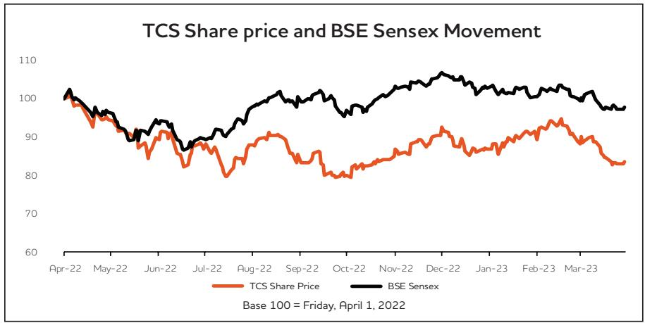

# x. Registrar and Transfer Agents

Name and Address : TSR Consultants Private Limited (TCPL)

C-101, 1st Floor, 247 Park,

Lal Bahadur Shastri Marg,

Vikhroli West, Mumbai 400 083

Telephone: +918108118484

Fax: +91226656 8494

E-mail: csg-unit@tcplindia.co.in

Website: https://www.tcplindia.co.in

# xi. Places for acceptance of documents

Documents will be accepted at the above address between 10.00 a.m. and 5.00 p.m. (Monday to Friday except bank holidays). For the convenience of the shareholders, documents will also be accepted at the following branches of TCPL:

<table><tr><td>Place</td><td>Name and Address</td><td>Phone/Email</td></tr><tr><td>Mumbai</td><td>TSR Consultants Private LimitedBuilding 17/19, Office no. 415Rex Chambers, Ballard Estate, Walchand Hirachand Marg,Fort, Mumbai-400 001</td><td>Tel: +91 7304874606Email:csg-unit@tcplindia.co.in</td></tr><tr><td>Bengaluru</td><td>TSR Consultants Private LimitedC/o.Mr. D. Nagendra Rao“Vaghdevi” 543/A, 7th Main 3rd Cross, HanumanthnagarBengaluru-560 019</td><td>Tel: +91 80 26509004Email:csg-unit@tcplindia.co.in</td></tr><tr><td>Kolkata</td><td>TSR Consultants Private LimitedC/o. Link Intime Private LimitedVaishno Chamber, Flat No. 502 &amp; 503 5th Floor, 6,Brabourne Road, Kolkata- 700001</td><td>Tel: +91 33 40081986Email:csg-unit@tcplindia.co.in</td></tr><tr><td>New Delhi</td><td>TSR Consultants Private LimitedC/o. Link Intime India Private LimitedNoble Heights, 1st Floor Plot No NH-2, C-1 Block, LSCNear Savitri Market, Janakpuri, New Delhi – 110 058</td><td>Tel: +91 11 49411030Email:csg-unit@tcplindia.co.in</td></tr><tr><td>Jamshedpur</td><td>TSR Consultants Private LimitedQtr. No. L-4/5, Main Road, Bistupur(Beside Chappan-Bhog Sweet Shop)Jamshedpur-831 001</td><td>Tel: +91 657 2426937Email:csg-unit@tcplindia.co.in</td></tr><tr><td>Ahmedabad</td><td>TSR Consultants Private LimitedC/o. Link Intime India Private LimitedAmarnath Business Centre-1 (ABC-1)Beside Gala Business Centre, Nr. St. Xavier’s College CornerOff. C.G. Road, Ellisbridge, Ahmedabad-380006</td><td>Tel: +91 79 26465179Email:csg-unit@tcplindia.co.in</td></tr></table>

# xii. Share Transfer System

In terms of Regulation 40(1) of SEBI Listing Regulations, as amended from time to time, transfer, transmission and transposition of securities shall be effected only in dematerialized form.

Pursuant to SEBI Circular dated January 25, 2022, the listed companies shall issue the securities in dematerialized form only, for processing any service requests from shareholders viz., issue of duplicate share certificates, endorsement, transmission, transposition, etc. After processing the service request, a letter of confirmation will be issued to the shareholders and shall be valid for a period of 120 days, within which the shareholder shall make a request to the Depository Participant for dematerializing those shares. If the shareholders fail to submit the dematerialisation request within 120 days, then the Company shall credit those shares in the Suspense Escrow Demat account held by the Company. Shareholders can claim these shares transferred to Suspense Escrow Demat account on submission of necessary documentation.

The Directors and certain Company officials (including Chief Financial Officer and Company Secretary) are authorized by the Board severally to approve transfers, which are noted at subsequent Board Meetings.

# xiii. Shareholding as on March 31, 2023

# a) Distribution of equity shareholding

<table><tr><td>Number of shares</td><td>Holding</td><td>Percentage to capital</td><td>Number of accounts</td><td>Percentage to total accounts</td></tr><tr><td>1-100</td><td>4,94,62,770</td><td>1.35</td><td>23,14,765</td><td>88.31</td></tr><tr><td>101-500</td><td>5,21,27,240</td><td>1.42</td><td>2,58,714</td><td>9.88</td></tr><tr><td>501-1000</td><td>1,87,54,401</td><td>0.51</td><td>26,324</td><td>1.00</td></tr><tr><td>1001-5000</td><td>3,30,46,498</td><td>0.90</td><td>17,176</td><td>0.66</td></tr><tr><td>5001-10000</td><td>1,08,58,233</td><td>0.30</td><td>1,539</td><td>0.06</td></tr><tr><td>10001-20000</td><td>1,07,71,057</td><td>0.29</td><td>767</td><td>0.03</td></tr><tr><td>20001-30000</td><td>84,82,523</td><td>0.23</td><td>346</td><td>0.01</td></tr><tr><td>30001-40000</td><td>61,77,198</td><td>0.17</td><td>177</td><td>0.01</td></tr><tr><td>40001- 50000</td><td>54,50,619</td><td>0.15</td><td>120</td><td>0.00</td></tr><tr><td>50001-100000</td><td>2,67,46,395</td><td>0.74</td><td>371</td><td>0.01</td></tr><tr><td>100001-above</td><td>3,43,71,74,439</td><td>93.94</td><td>800</td><td>0.03</td></tr><tr><td>TOTAL</td><td>3,65,90,51,373</td><td>100.00</td><td>26,21,099</td><td>100.00</td></tr></table>

b) Categories of equity shareholding

<table><tr><td>Category</td><td>Number of equity shares held</td><td>Percentage of holding</td></tr><tr><td>Promoter</td><td>2,64,43,17,117</td><td>72.27</td></tr><tr><td>Other Entities of the Promoter Group</td><td>10,68,956</td><td>0.03</td></tr><tr><td>Mutual Funds</td><td>12,70,84,071</td><td>3.47</td></tr><tr><td>Banks, Financial Institutions, State and Central Government</td><td>1,96,96,625</td><td>0.53</td></tr><tr><td>Insurance Companies</td><td>20,36,77,391</td><td>5.57</td></tr><tr><td>Foreign Institutional Investors</td><td>46,53,36,259</td><td>12.72</td></tr><tr><td>NRIs, OBCs, Foreign Nationals</td><td>77,22,080</td><td>0.21</td></tr><tr><td>Corporate Bodies, Trusts</td><td>1,10,67,582</td><td>0.29</td></tr><tr><td>Indian Public and Others</td><td>17,63,09,365</td><td>4.83</td></tr><tr><td>Alternate Investment Fund</td><td>21,70,419</td><td>0.06</td></tr><tr><td>IEPF account</td><td>6,01,508</td><td>0.02</td></tr><tr><td>TOTAL</td><td>3,65,90,51,373</td><td>100.00</td></tr></table>

c) Top ten equity shareholders of the Company

<table><tr><td>Sr. No.</td><td>Name of the shareholders*</td><td>Number of equity shares held</td><td>Percentage of holding</td></tr><tr><td>1</td><td>Tata Sons Private Limited</td><td>2,64,43,17,117</td><td>72.27</td></tr><tr><td>2</td><td>Life Insurance Corporation of India</td><td>16,34,27,223</td><td>4.47</td></tr><tr><td>3</td><td>SBI Mutual Fund</td><td>3,65,24,190</td><td>1.00</td></tr><tr><td>4</td><td>Invesco Developing Markets Fund</td><td>3,10,72,921</td><td>0.85</td></tr><tr><td>5</td><td>Axis Mutual Fund</td><td>1,96,65,244</td><td>0.54</td></tr><tr><td>6</td><td>Government of Singapore</td><td>1,64,30,083</td><td>0.45</td></tr><tr><td>7</td><td>NPS Trust</td><td>1,58,20,315</td><td>0.43</td></tr><tr><td>8</td><td>Vanguard Emerging Markets Stock Index Fund,A Series of Vanguard International Equity Index Funds</td><td>1,41,75,888</td><td>0.39</td></tr><tr><td>9</td><td>Vanguard Total International Stock Index Fund</td><td>1,34,57,122</td><td>0.37</td></tr><tr><td>10</td><td>UTI Mutual Fund</td><td>1,26,67,041</td><td>0.35</td></tr></table>

\*Shareholding is consolidated based on Permanent Account Number (PAN) of the shareholder

# xiv. Dematerialization of shares and liquidity

The Company’s shares are compulsorily traded in dematerialized form on NSE and BSE. Equity shares of the Company representing 99.98 percent of the Company’s equity share capital are dematerialized as on March 31, 2023. Under the Depository System, the International Securities Identification Number (ISIN) allotted to the Company’s shares is INE467B01029.

# xv. Outstanding GDRs/ADRs/Warrants or any convertible instruments, conversion date and likely impact on equity

The Company has not issued any GDRs/ADRs/Warrants or any convertible instruments in the past and hence, as on March 31, 2023, the Company does not have any outstanding GDRs/ADRs/Warrants or any convertible instruments.

# xvi. Commodity price risk or foreign exchange risk and hedging activities

The Company does not deal in commodities and hence the disclosure pursuant to SEBI Circular dated November 15, 2018 is not required to be given. For a detailed discussion on foreign exchange risk and hedging activities, please refer to Management Discussion and Analysis Report.

# xvii. Loans and advances

The Company has not given any loans and advances to firms/company in which directors are interested.

# xviii.Equity shares in the suspense account

In accordance with the requirement of Regulation 34(3) and Part F of Schedule V to the SEBI Listing Regulations, details of equity shares in the suspense account are as follows:

<table><tr><td>Particulars</td><td>Number of shareholders</td><td>Number of equity shares</td></tr><tr><td>Aggregate number of shareholders and the outstanding shares in the suspense account lying as on April 1, 2022</td><td>26</td><td>1,640</td></tr><tr><td>Shareholders who approached the Company for transfer of shares from suspense account during the year</td><td>-</td><td>-</td></tr><tr><td>Shareholders to whom shares were transferred from the suspense account during the year</td><td>-</td><td>-</td></tr><tr><td>Shareholders whose shares are transferred to the demat account of the IEPF Authority as per Section 124 of the Act</td><td>26</td><td>820</td></tr><tr><td>Aggregate number of shareholders and the outstanding shares in the suspense account lying as on March 31, 2023</td><td>26</td><td>820</td></tr></table>

The voting rights on the shares outstanding in the suspense account as on March 31, 2023 shall remain frozen till the rightful owner of such shares claims the shares.

# xix. Transfer of unclaimed/unpaid amounts to the Investor Education and Protection Fund

Pursuant to Sections 124 and 125 of the Act read with the Investor Education and Protection Fund Authority (Accounting, Audit, Transfer and Refund) Rules, 2016 (“IEPF Rules”), dividend, if not claimed for a period of seven years from the date of transfer to Unpaid Dividend Account of the Company, are liable to be transferred to IEPF.

Further, all the shares in respect of which dividend has remained unclaimed for seven consecutive years or more from the date of transfer to unpaid dividend account shall also be transferred to IEPF Authority. The said requirement does not apply to shares in respect of which there is a specific order of Court, Tribunal or Statutory Authority, restraining any transfer of the shares.

In the interest of the shareholders, the Company sends periodical reminders to the shareholders to claim their dividends in order to avoid transfer of dividends/shares to IEPF Authority. Notices in this regard are also published in the newspapers and the details of unclaimed dividends and shareholders whose shares are liable to be transferred to the IEPF Authority, are uploaded on the Company’s website https://on.tcs.com/unclaimed-dividend.

In light of the aforesaid provisions, the Company has during the year, transferred to IEPF the unclaimed dividends, outstanding for seven years, of the Company, erstwhile CMC Limited (since amalgamated with the Company). Further, shares of the Company, in respect of which dividend has not been claimed for seven consecutive years or more from the date of transfer to unpaid dividend account, have also been transferred to the demat account of IEPF Authority.

The details of unclaimed dividends and shares transferred to IEPF during FY 2023 are as follows:

<table><tr><td>Financial year</td><td>Amount of unclaimed dividend transferred (₹ lakh)</td><td>Number of shares transferred</td></tr><tr><td>2014-15</td><td>214.43*</td><td>2,589</td></tr><tr><td>2015-16</td><td>168.93*</td><td>47,643</td></tr><tr><td>TOTAL</td><td>383.36</td><td>50,232</td></tr></table>

\*Includes dividend and fractional shares entitlement arising out of amalgamation of erstwhile CMC Limited

The Members who have a claim on above dividends and/or shares are requested to follow the below process:

1. Submit self-attested copies of documents provided in IEPF 5 helpkit, which is available on IEPF website (www.iepf.gov.in) to the Company/ Registrar and Transfer Agent (RTA).

2. After verification of the aforesaid documents submitted, Company will issue an entitlement letter.   
3. File Form IEPF-5 on IEPF website and send self-attested copies of IEPF-5 form along with the acknowledgement (SRN), Indemnity bond and entitlement letter to RTA.   
4. On receipt of the physical documents mentioned above, Company will submit e-Verification report, for further processing by the IEPF Authority.

Members are requested to note that no claims shall lie against the Company in respect of the dividend/shares transferred to IEPF.

The following table give information relating to various outstanding dividends and the dates by which they can be claimed by the shareholders from the Company’s RTA:

<table><tr><td>Financial Year</td><td>Date of declaration</td><td>Last date for claiming unpaid dividend</td></tr><tr><td>2015-16</td><td>June 17, 2016</td><td>July 17, 2023</td></tr><tr><td rowspan="4">2016-17</td><td>July 14, 2016</td><td>August 15, 2023</td></tr><tr><td>October 13, 2016</td><td>November 16, 2023</td></tr><tr><td>January 12, 2017</td><td>February 12, 2024</td></tr><tr><td>June 16, 2017</td><td>July 16, 2024</td></tr><tr><td rowspan="4">2017-18</td><td>July 13, 2017</td><td>August 13, 2024</td></tr><tr><td>October 12, 2017</td><td>November 12, 2024</td></tr><tr><td>January 11, 2018</td><td>February 10, 2025</td></tr><tr><td>June 15, 2018</td><td>July 15, 2025</td></tr><tr><td rowspan="4">2018-19</td><td>July 10, 2018</td><td>August 9, 2025</td></tr><tr><td>October 11, 2018</td><td>November 10, 2025</td></tr><tr><td>January 10, 2019</td><td>February 9, 2026</td></tr><tr><td>June 13, 2019</td><td>July 13, 2026</td></tr><tr><td rowspan="5">2019-20</td><td>July 9, 2019</td><td>August 8, 2026</td></tr><tr><td>October 10, 2019</td><td>November 9, 2026</td></tr><tr><td>January 17, 2020</td><td>February 16, 2027</td></tr><tr><td>March 10, 2020</td><td>April 9, 2027</td></tr><tr><td>June 11, 2020</td><td>July 11, 2027</td></tr><tr><td rowspan="4">2020-21</td><td>July 9, 2020</td><td>August 8, 2027</td></tr><tr><td>October 7, 2020</td><td>November 6, 2027</td></tr><tr><td>January 8, 2021</td><td>February 7, 2028</td></tr><tr><td>June 10, 2021</td><td>July 10, 2028</td></tr><tr><td rowspan="4">2021-22</td><td>July 8, 2021</td><td>August 7, 2028</td></tr><tr><td>October 8, 2021</td><td>November 7, 2028</td></tr><tr><td>January 12, 2022</td><td>February 11, 2029</td></tr><tr><td>June 9, 2022</td><td>July 9, 2029</td></tr><tr><td rowspan="3">2022-23</td><td>July 8, 2022</td><td>August 7, 2029</td></tr><tr><td>October 10, 2022</td><td>November 9, 2029</td></tr><tr><td>January 9, 2023</td><td>February 8, 2030</td></tr></table>

# xx. Plant locations

In view of the nature of the Company’s business viz. Information Technology (IT) Services and IT Enabled Services, the Company operates from various offices in India and abroad. The Company has a manufacturing facility at 17-B, Tivim Industrial Estate, Karaswada, Mapusa– Bardez, Goa.

# xxi. Address for correspondence

# Tata Consultancy Services Limited

9th Floor, Nirmal Building, Nariman Point, Mumbai 400 021, India

Telephone: +91 22 6778 9595

Designated e-mail address for Investor Services: investor.relations@tcs.com

For queries on IEPF related matters: iepf.assist@tcs.com

Website: www.tcs.com

# DECLARATION REGARDING COMPLIANCE BY BOARD MEMBERS AND SENIOR MANAGEMENT PERSONNEL WITH THE COMPANY’S CODE OF CONDUCT

This is to confirm that the Company has adopted a Code of Conduct for its employees, including the Managing Director and Executive Directors.

In addition, the Company has adopted a Code of Conduct for its Non-Executive Directors and Independent Directors. These Codes are available on the Company’s website.

I confirm that the Company has, in respect of the year ended March 31, 2023, received from the Senior Management Team of the Company and the Members of the Board a declaration of compliance with the Code of Conduct as applicable to them.

For the purpose of this declaration, Senior Management Team means the Chief Financial Officer, Global Head-HR, Global Business Unit Heads, Global Head-Legal and the Company Secretary as on March 31, 2023.

Rajesh Gopinathan

Chief Executive Officer and

Managing Director

DIN: 06365813

Mumbai, April 12, 2023

# PRACTISING COMPANY SECRETARIES’ CERTIFICATE ON CORPORATE GOVERNANCE

# To the Members of Tata Consultancy Services Limited

We have examined the compliance of the conditions of Corporate Governance by Tata Consultancy Services Limited (‘the Company’) for the year ended on March 31, 2023, as stipulated under Regulations 17 to 27, clauses (b) to (i) and (t) of sub- regulation (2) of Regulation 46 and para C, D and E of Schedule V of the Securities and Exchange Board of India (Listing Obligations and Disclosure Requirements) Regulations, 2015 (“SEBI Listing Regulations”).

The compliance of the conditions of Corporate Governance is the responsibility of the management. Our examination was limited to the review of procedures and implementation thereof, as adopted by the Company for ensuring compliance with conditions of Corporate Governance. It is neither an audit nor an expression of opinion on the financial statements of the Company.

In our opinion and to the best of our information and according to the explanations given to us, and the representations made by the Directors and the Management and considering the

relaxations granted by the Ministry of Corporate Affairs and Securities and Exchange Board of India warranted due to the spread of the COVID-19 pandemic, we certify that the Company has complied with the conditions of Corporate Governance as stipulated in the SEBI Listing Regulations for the year ended on March 31, 2023.

We further state that such compliance is neither an assurance as to the future viability of the Company nor of the efficiency or effectiveness with which the management has conducted the affairs of the Company.

# For Parikh & Associates

Practising Company Secretaries

# P. N. Parikh

FCS: 327 CP: 1228

UDIN: F000327E000066987

PR No.: 1129/2021

Mumbai,

Date: 12.04.2023

# CERTIFICATE OF NON-DISQUALIFICATION OF DIRECTORS

(Pursuant to Regulation 34(3) and Schedule V Para C clause (10)(i) of the SEBI (Listing Obligations and Disclosure Requirements) Regulations, 2015)

To,

The Members

# Tata Consultancy Services Limited

9th Floor, Nirmal Building,

Nariman Point, Mumbai 400 021

We have examined the relevant registers, records, forms, returns and disclosures received from the Directors of Tata Consultancy Services Limited having CIN L22210MH1995PLC084781 and having registered office at 9th Floor, Nirmal Building, Nariman Point, Mumbai 400 021 (hereinafter referred to as ‘the Company’), produced before me/us by the Company for the purpose of issuing this Certificate, in accordance with Regulation 34(3) read with Schedule V Para-C Sub clause 10(i) of the Securities Exchange Board of India (Listing Obligations and Disclosure Requirements) Regulations, 2015.

In our opinion and to the best of our information and according to the verifications (including Directors Identification Number (DIN) status at the portal www.mca.gov.in) as considered necessary and explanations furnished to us by the Company & its officers, we hereby certify that none of the Directors on the Board of the Company as stated below for the Financial Year ending on March 31, 2023 have been debarred or disqualified from being appointed or continuing as Directors of companies by the Securities and Exchange Board of India, Ministry of Corporate Affairs, or any such other Statutory Authority.

<table><tr><td>Sr. No.</td><td>Name of Director</td><td>DIN</td><td>Date of Appointment in Company *</td></tr><tr><td>1.</td><td>N Chandrasekaran</td><td>00121863</td><td>September 6, 2007</td></tr><tr><td>2.</td><td>Rajesh Gopinathan</td><td>06365813</td><td>February 21, 2017</td></tr><tr><td>3.</td><td>N G Subramaniam</td><td>07006215</td><td>February 21, 2017</td></tr><tr><td>4.</td><td>O P Bhatt</td><td>00548091</td><td>April 2, 2012</td></tr><tr><td>5.</td><td>Aarthi Subramanian</td><td>07121802</td><td>March 12, 2015</td></tr><tr><td>6.</td><td>Dr. Pradeep Kumar Khosla</td><td>03611983</td><td>January 11, 2018</td></tr><tr><td>7.</td><td>Hanne Sorensen</td><td>08035439</td><td>December 18, 2018</td></tr><tr><td>8.</td><td>Keki Mistry</td><td>00008886</td><td>December 18, 2018</td></tr><tr><td>9.</td><td>Don Callahan</td><td>08326836</td><td>January 10, 2019</td></tr></table>

\*the date of appointment is as per the MCA Portal.

Ensuring the eligibility for the appointment/continuity of every Director on the Board is the responsibility of the management of the Company. Our responsibility is to express an opinion on these based on our verification. This certificate is neither an assurance as to the future viability of the Company nor of the efficiency or effectiveness with which the management has conducted the affairs of the Company.

For Parikh & Associates

Practising Company Secretaries

P. N. Parikh

Partner

FCS No. 327 CP No. 1228

UDIN: F000327E000067053

PR No.: 1129/2021

Mumbai Date: 12.04.2023

text_image

Integrated Annual Report 2022-23

natural_image

Two women smiling while interacting with smartphones and tomatoes in a fruit market, surrounded by colorful abstract shapes (no text or symbols)

# Corporate Social

# Responsibility

# Overview

In keeping with the Tata Group’s purpose-driven worldview, TCS’ vision is to empower people and communities to build self-reliance through technology while promoting the values of fairness, equity and respect for human rights. Its mission is to connect people to opportunities in the digital economy while building equitable, inclusive pathways for all – especially women, youth, and marginalized groups.

TCS invests in addressing the most pressing needs of the community through various CSR initiatives and programs focused on education, skilling, employment, and entrepreneurship, aligned with the UN Sustainable Development Goals (UN SDGs). With a focus on bridging gaps in access to opportunities, TCS also invests in social innovation and community projects targeted the poorest sections of society, and supports programs addressing basic health and wellness, water sanitation and hygiene, conservation, and disaster relief efforts across the globe.

TCS leverages its intellectual capability, technological expertise, financial capacity and the skills of its employees to support wide-reaching, high-impact programs for social impact. These comprehensive programs are designed to be holistic and adaptable for community empowerment and lasting societal development.

Over 150,000 TCSers served their local communities by volunteering 2.8 million hours in FY 2023, impacting the lives of over 1.25 million people.

Overall, TCS empowered 4.5 million people across the world during the year, creating equitable and inclusive pathways for

# 1.1 million women, 581,000 youth and 1.3 million marginalized people through its strategic CSR programs.

# Key highlights:

Closed the literacy gap for 1.13 million Indians, including a pioneering public-private partnership reaching all 52 districts of Madhya Pradesh with the State Literacy Mission Authority.   
GoIT continues to empower the next generation of innovators in school; 41,971 students across 28 countries are now digital innovators, solving real-world problems.   
Ignite my Future helped 293,697 students across India, US, Canada and ANZ learn computational thinking.   
Nearly half the goIT and IMF benefi ciaries are girls and over 70% from minorities and underserved groups.   
Youth Employment Program (YEP) empowered 10,869 rural youth, creating new pathways to 21st century jobs, and now reaches students across every state and union territory in India.   
BridgeIT program is helping marginalized youth turn into digital entrepreneurs and earn well, providing essential lastmile services for 1,736 villages in rural India.   
Supported NGOs across the world through pro-bono projects. Also supported institutions such as, Tata Memorial Center and Cancer Institute in India.   
Engaged 433 customers through the Business with Purpose program, creating 186 purpose partnerships to jointly serve communities in need around the world.   
Engaged 2,368 cross-sector leaders through 13 Digital Empowers thought leadership forums, using their collective wisdom to help advance advocacy and policy eff orts globally.   
Supported 77,303 refugees and families and contributed €1.28 million through humanitarian response to the Ukraine war.

# Literacy as a Service

Adult non-literacy continues to be a problem holding back India from reaching its full economic potential. Women account for 65% of the illiterate population, and the rest is from marginalized communities. To address the causes of non-literacy, TCS devised the Literacy as a Service Program (LaaS) which augments the Government of India’s efforts to improve literacy. LaaS provides an innovative teaching method by combining the power of IT with the theory of cognition and laws of perception. LaaS adopts creative means of delivery to enable functional literacy, such as animated graphic patterns for easy visual and auditory learning.

Modules on the platform include functional literacy (8-10 hours), digital literacy (5-7 hours), and awareness on key citizen entitlements (3-4 hours), available in 12 languages – nine Indian, and three foreign.

Thus far, LaaS has successfully paved the way to self-reliance for over 1.13 million learners (\~60% women) and more than 200,000 Preraks through literacy.

In August 2022, TCS launched the ‘Each one Empowers one’ portal which allows employees of TCS and Tata Group, along with their families, to empower non-literates in their local community, such as security guards, domestic workers and gardeners.

The program has generated transforming impact by promoting social inclusion, financial stability and economic growth. It has also propelled neo-literates to receive better access to government benefit programs, financial systems and empowered them to have a more significant say in family and community decision-making.

# LaaS Case Study

Pyari Ben resides in the Bijori hamlet of Puwasa village, in Madhya Pradesh’s Alirajpur district, one of the least literate and poorest districts in the country. Due to limited local employment prospects, villagers from Alirajpur travel for work to nearby Gujarat cities; Pyari is not an

exception in this regard. She never had the opportunity to attend school, so she never achieved literacy. This became difficult because she couldn’t keep track of her hard-earned daily income as a construction worker.

She gained basic literacy skills after joining the Literacy as a Service (LaaS) program, which made her realize that her contractor used to defraud her by not paying her the proper wages. LaaS gave her the awareness she needed to fight for her rights and ultimately get her dues. She can now calculate her working hours and daily pay, create a budget, and save money.

She created a bank account and enrolled in Ayushman Bharat, a health insurance scheme, to obtain medical benefits for herself and her family. As a migrant who travels from her village to distant work locations, she can now read and recognize train numbers to board the correct train. Pyari inspired other women in the village and encouraged them to participate in this program.

# Ignite My Future (IMF)

Ignite My Future is a teacher professional development program which introduces the concept of computational thinking into all core subjects. This is a transdisciplinary education program that transforms the way students learn.

IMF has generated a great impact through professional development offerings, special projects as well as volunteer and customer engagements with the partnered schools. IMF’s Learning Leaders community supports the growing global community of partnered educators, committed to learnings about the power of computational thinking. This year, IMF India launched Learning Leaders’ regional chapters, catering to regional learning requirements of the teachers from the partner districts across India.

One of the IMF’s pioneering STEM initiative interventions, Global Innovations Project (GIP) aims to connect students and teachers from around the world as they explore and solve real-world problems using computational thinking.

This year, IMF India has launched its Season 1 of GIP, where students were asked to explore accessible and adaptive tools, identify and problem-solve community level issues that are limiting the accessibility and inclusivity of all the learners. Teachers and students from schools like School of Scholars (Maharashtra), BGS Schools (Karnataka), Podar International School (Maharashtra), Rajya Ashram Paddhati Vidyalaya (Samaj Kalyan Department, Uttar Pradesh), APSWREIS (Andhra Pradesh) in India have collaborated with schools from North America in this experiential journey.

Overall, the participants from India worked on 109 innovation projects, clocking over 560 collaborative learning hours and 268 videos over Microsoft Flip tool. Teachers were very appreciative of the opportunity to learn and collaborate with educators around the world.

In FY 2023, IMF benefi ted more than 293,000 students and educators across North America, India, UK and Ireland, APAC and ANZ.

# IMF Case Study

This year, Ignite My Future made its impact through professional development, volunteer and customer engagement and special projects. One such collaboration was with the Meghe Group of Schools to encourage students for an interest in STEM and computational thinking.

“The purpose of education is best served when students are doing something that would not only improve their competencies but also create positive social impact. Global innovation project is one such opportunity I believe, because students are not only reflecting upon what they have learnt but are also getting step closer towards sustainable development goals. I am glad and proud of all the efforts that students and teachers have put in, also that they have consciously chosen to be a part of this project in identifying how can they improve accessibility not only around them but also pick up global perspectives around it. I am sure that the seeds of efforts that we are putting in most our students today, will give us citizens of tomorrow who would have SDGs as inherent part of their lives. Thankyou TCS!” - Director, Meghe Group of Schools

# goIT

TCS’ flagship program goIT (go Innovate Together) is a Digital Innovation program which prepares students with culturally relevant and context-appropriate learning experiences, coupled with modern technologies.

Across the world, the gap between employers’ needs and available skills is growing. The National Science Foundation predicts that 80% of the jobs that will be created in the next decade will require a form of mathematics and science skilling. Insufficient numbers of students pursuing these streams, and lack of focus on innovation, problem-solving and creativity in school curricula, are the big challenges in fulfi lling those future jobs.

goIT prepares students with engaging design workshops and custom mentorship to pursue the careers of tomorrow of which involve STEM and computer sciences. It uses a fourpronged model of (1) volunteer-driven engagements, inperson or virtually, (2) seamless year-round connects via goIT Online, (3) SDG-focused monthly challenges and (4) Work experience designed to introduce students to local experts and opportunities. Each prong is layered with school district partnerships and mentoring by industry professionals from TCS which helps students develop core skills and makes goIT a unique program.

After over a decade of success and a footprint across 42 countries, goIT has benefited over 144,000 students who have designed more than 29,000 tech-for-good digital innovation prototypes.

Over 41,000 students and educators have benefited from this program in FY 2023 globally.

# goIT Case Study

Speaking about her experience at the first inaugural TCS goIT program in Saudi Arabia, Leah, a Grade 7 student, said, “I am super happy to have had the opportunity to get involved in the design thinking program. The mobile app training is cool, and I am proud of my project on improving world health by using technology.”

The event was celebrated with more than 100 learners from the Al Sahafa International School, Riyadh. Under the theme of UN SDG, students ideated solutions for good health and wellbeing, affordable and clean energy, and zero hunger.

Grade 7 students prototyped a mobile solution called ‘Team Earth’ which displays the location of the nearest renewable energy outlets and finds an environmental, social, and governance volunteer. Meanwhile, Grade 5 students pitched a technology solution to solve world hunger by creating an app called ‘Free Supermarket’ which would help people make and receive donations.

Excited to see the STEM exposure students received through the TCS goIT program, the Academic Coordinator of Al Sahafa International School, Ola Mourad said, “Programs like this are extremely important in showing students how they can succeed in a range of fields, with a good grounding in IT.”

# BridgeIT

BridgeIT is a unique initiative created to bridge the digital divide that places socially and economically underprivileged communities at a disadvantage. The program creates digital entrepreneurs who use IT to help local citizens avail essential digital services in education, adult literacy, unemployment and social discrimination. It attempts to address prevailing social inequities in India by proactively reaching out to women, Scheduled Caste and Scheduled Tribes (SC/ST) communities.

Launched in 2014, BridgeIT has a footprint across 30 districts in 10 states. The program offers budding entrepreneurs the skills, mentoring, technology, tools and resources required to set up a Digital Service Centre from where they can provide services such as generating and updating documents (such as Aadhar cards, Pan cards, and voters ID), enrolling for diff erent government schemes, fi lling in online forms and cash withdrawals/deposits from the bank to fellow villagers.

In FY 2023, the program had 347 active digital entrepreneurs providing several of these services in 1,735 villages. 146 of these entrepreneurs were women.

# BridgeIT Case Study

Priyanka Kumari, a native of Dihi village, Latehar District, Jharkhand, had never dreamt that one day she would be an entrepreneur and earn an income of more than \`40,000/-per month. Priyanka always had a desire to have her own identity. When she got married, she was still doing her graduation. She continued her studies after marriage and completed her graduation in 2016. In 2020, when she heard of BridgeIT she grabbed the opportunity to be part of the program.

natural_image

Woman working at a desk with a printer and laptop, surrounded by shelves and posters (no visible text or symbols)

Gradually, she became a successful digital entrepreneur and is now providing several services such as photocopying, printing, taking and printing passport size photos, paying land taxes, booking railway tickets, Aadhaar, PAN Card and Ration card services, etc. Today, Priyanka not only runs a shop near her residence, she also has taken up the responsibility of another shop at the Panchayat Bhawan of her village, employing two other people from the village.

BridgeIT has inspired her to dream big and is successfully supporting Priyanka in achieving her plans for future. She says, “My dream is to expand my business further and I want to keep the latest models of mobile phones and other accessories for sale in my shop. Moreover, I also want to open a tent house employing more needy people in the business. Besides, I am planning to buy a new scooty.”

# Youth Employment Program (YEP)

YEP tackles one of the biggest challenges in India – unemployment among youth, especially those from marginalized sections of society, due to lack of 21st century skills. YEP provides employability training, imparting skills such as business communication, aptitude, computer programming and domain skills with the help of subject matter experts, domain leaders, and certified trainers from TCS.

The program offers participants a smooth transition from college to careers, building their confidence and enhancing their social and economic status through its unique teach, coach, mentor, and place model. It helps them navigate opportunities available in the Indian job market with career guidance and mentoring,

training on interview skills and access to market-facing certifications and hands-on real-time project experience.

# Since its inception, the program has:

Improved the economic and social status of the beneficiaries and their families.   
Encouraged diversity and gender parity within the workforce while creating inclusion and access for marginalized groups across the country.   
Increased the credibility and visibility of the training partner institutions involved with YEP.   
Enabled access for corporates to season-agnostic, industryready talent.   
Created specific career paths for students in hospitality, banking, retail and IT (which include cyber security, networking, IT automation, Data Analytics, UX, SFDC to name a few, etc.).

In FY 2023, more than 31,000 students were trained across India, of which 57% were women and 17% from the groups qualifying for affirmative action programs. Over 10,000 students have gained employment in the IT/ITES, banking, retail fields.

# YEP Case Study

Preeti Diwakar was born and brought up at Panipat in Haryana, and later her family shifted to Kaushambi in Uttar Pradesh. Her father worked as a helper at local grocery shops while her mother supported with household chores in neighborhood. Their meagre income barely put food on the table for the family of fi ve.

natural_image

Portrait of a woman in a dark blazer and red sweater, standing outdoors with trees in the background (no visible text or symbols)

Preeti had to fi ght hard in her pursuit of education. She funded her own education by taking up tuitions and borrowing course books from senior students in school. While pursuing BCom at University of Allahabad, she discovered a strong desire to learn about the intricacies of stock market, and later taught her classmates. But she had neither the funds to invest nor the confidence to speak about it. She also lacked clarity on career goals or available job prospects.

TCS Youth Employability Program brought a ray of sunshine to her gloomy worldview. During the Covid years, Preeti not only learned math and reasoning skills, she also worked on her overall personality. She learnt from her trainer, the importance of public speaking, projecting confidence in online interviews, and active listening. In the TCS NQT exam later that year, she scored 77.39% and got placed in December ’21.

She launched a website and her first YouTube channel “Commerce Stocking” about stock market investment tips. In December’22, she quit her job and became an entrepreneur, launching her dream website for educating people on the financial sector. In her own words, it was TCS’ YEP which enabled her to find her own voice and she has been following it all along since then.

# Social Innovation

Digital Impact Square (DISQ) is a social innovation platform established in 2015 in Nashik, Maharashtra. The platform encourages innovation among young employees who harness the power of digital technology and engage with the digital ecosystem, to develop solutions for a lasting change in society.

Since its founding, DISQ has worked with 7 cohorts with more than 600 innovators, 35% of who are female. These innovators hail from 22 states and from over 180 colleges across India.

In FY 2023, DISQ encouraged innovation using digital technologies to address the social challenges drawn from the voice of citizens, domain experts, local administration, and the government and has nurtured over 65 changemakers. These are purpose-led innovations in agri-tech, assistive-tech, health and wellness tech and sustainability tech across india.

DISQ offers innovators extensive mentoring, access to ecosystems specific to their challenges, and a seed fund for investment in creating their innovation and start-up, along with physical infrastructure that fosters out-of-the-box thinking and a supportive ecosystem with domain partners for validation.

Modeled around DISQ, Petronas and TCS in Malaysia, recently launched SEEd.Lab - a one-of-its-kind social enterprise innovation hub which targets youth unemployment. It promotes selfsustaining enterprises that forge solutions to the challenges faced in their communities by leveraging technology and innovation.

# DISQ Case Study

Vesatogo Innovations is a Nashik-based agritech startup conceptualized in 2019 by DISQ Changemakers who were passionate about reimagining the agrarian landscape.

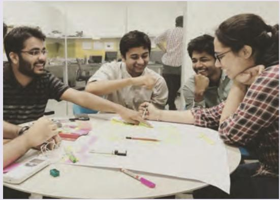

natural_image

Group of four people gathered around a table with colorful materials, engaged in a meeting or discussion (no visible text or symbols)

Their solution, conceptualized and designed at TCS’ Digital Impact Square (DISQ), provides mobile and web-based seed to-plate supply chain management tools to reduce operating costs for farmer producer organizations and agribusinesses, and enable small farmers to have better market linkages.

It was awarded the National Startup Award 2021 in the Rural Impact category and was amongst the selected 175 startups across country to interact with the Honourable Prime Minister Narendra Modi.

Other accolades include the Emerging Social Enterprise 2021 award from TiE Hyderabad, winner of TATA Motor’s TACNet Initiative and Best Indian Social Enterprise Award by Action for India 2019.

# Health and Wellness

Holistic well-being programs offered within TCS promote healthier lifestyles by offering work-life balance and by looking into emotional health. When people are in a state of well-being at work, they are motivated to realize their potential, take on responsibility, build positive workplace relationships, manage their time better, make meaningful contributions, and be productive and creative.

TCS actively promotes healthy and active lifestyles with employee engagement programs like Fit4Life, Purpose4Life and SafetyFirst which help create awareness about health and fitness and enables its employees to engage with the community for a positive impact.

TCS has provided an integrated Hospital Management System and IT infrastructure, which includes a comprehensive and fully integrated web-based solution to The Cancer Institute, Chennai. TCS has also provided support to integrate the Health Insurance Scheme with the National Medical Commission (NMC) dashboard to facilitate daily syncing of patient data and statistics to aid monitoring and auditing. It has also been building new features including compliance with statutory requirements.

TCS continued its support of the Hospital Management System (HMS) at Tata Medical Center (TMC), Kolkata. TMC Kolkata was recently accredited with National Accreditation Board for Hospitals and Healthcare Providers (NABH), which assures quality service to patients. TCS plays a crucial role in by providing IT solutions for various non-conformities raised by NABH Assessors. It works closely with the Bone Marrow Transplant department to provide IT related support for its FACT accreditation and has provided IT support to TMC for their Pharmacy migration to ‘TATA 1mg.’

TCS’ transformations at Tata Medical Center, Kolkata and Cancer Institute, Chennai facilitated more than 117,600 new patient consultations in FY 2023.

TCS partnered with TMC, Kolkata to successfully establish Tata Translational Cancer Research Centre (TTCRC). The partnership was established to create an interactive environment for clinicians, scientists, and industry to collaborate and translate data driven and discovery-based science for improvements in patient care. It focuses on personalizing therapies, decreasing the cost of treatment, and developing innovative care delivery models for cancer patients in India.

TCS contributes to initiatives at TTCRC through multi-omics and bioinformatics analysis, scientific data management, management of multi-centric clinical studies – such as the large one on Acute Lymphoblastic Leukemia (ALL), clinical decisions automation and the development of innovative digital solutions.

# HOPE - Hours of Purpose by Employees

TCS’ growing, highly skilled and diverse workforce serves as champions to build organic connects with the community while accelerating social impact. Opportunities for employees to volunteer time include skills-based volunteering, pro bono support to community-based organization and social cause leadership. TCS community investments have been actualized, in a large part, by its large employee base who generously volunteer their time, skills and expertise as last-mile connectors.

In FY 2023, TCS launched the civic movement #millionhoursofpurpose, a collaborative effort by TCSers to volunteer a million hours of purpose in a quarter which celebrates a positive impact for the people, by the people.

The initiative encourages employees to support in different causes, be it an employee’s own initiative, a TCS community program, a TATA engagement or one with its customers. Through this, TCSers have created positive impact in myriad ways,

addressing the 17 UN SDGs, ranging from planting saplings and trees, making and distributing newspaper bags, raising mental health awareness and educating children in schools, to name a few. TCSers also contribute to the Tata group’s volunteering initiatives twice a year, such as Tata Volunteering Week and Pro-Engage (long-term pro bono volunteering).

All the volunteering initiatives are monitored and driven by ‘Purpose Councils’ which consists of leaders from regions and business units. Omnichannel campaigns have also been launched at unit, branch and account level business groups to raise awareness, drive efforts, generate feedback and collect ideas. This has been supported by corporate-led communication and marketing events which have helped realize the initiative, project themes and recognize star volunteers, events, volunteer stories and journeys. TCSers far exceeded the pledge of a #millionhoursofpurpose, by volunteering over 2 million hours in Q4.

HOPE Case Study   
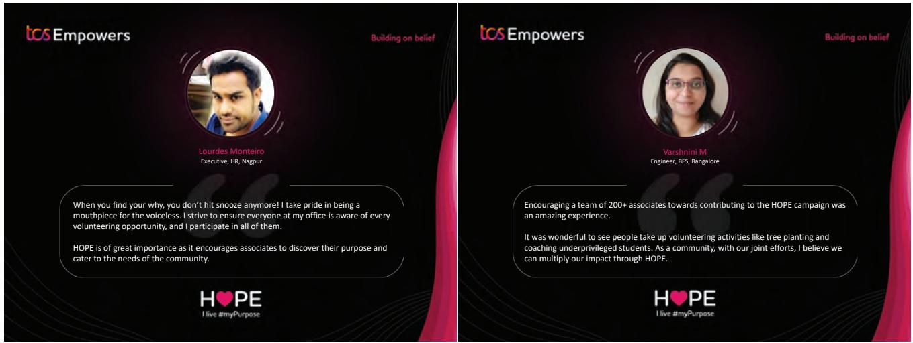

text_image

tcs Empowers
Building on belief
Lourdes Monteiro
Executive, HR, Nagpur
When you find your why, you don't hit snooze anymore! I take pride in being a mouthpiece for the voiceless. I strive to ensure everyone at my office is aware of every volunteering opportunity, and I participate in all of them.
HOPE is of great importance as it encourages associates to discover their purpose and cater to the needs of the community.
HOPE
I live #myPurpose
tcs Empowers
Building on belief
Varshnini M
Engineer, BFS, Bangalore
Encouraging a team of 200+ associates towards contributing to the HOPE campaign was an amazing experience.
It was wonderful to see people take up volunteering activities like tree planting and coaching underprivileged students. As a community, with our joint efforts, I believe we can multiply our impact through HOPE.
HOPE
I live #myPurpose

# Volunteering for Youth Employment Program (YEP)

Rahul Pathak’s journey of volunteering started six years back, with him travelling to Osmanabad around 280 kms from Pune over weekends to teach the students of Terna College of Engineering.

natural_image

Portrait of a smiling man wearing sunglasses and a light-colored shirt, outdoors with blurred background (no text or symbols visible)

Rahul did face challenges initially teaching in virtual mode, but he overcame it by using effective online teaching skills like polling, breakout rooms etc. He felt because of the virtual mode now he can contribute to engineering colleges outside Maharashtra. In his sessions, Rahul always gives practical examples which the students can relate to, and understand better. He also helps these youth in developing confidence so that they can succeed in all aspects of their lives.

Rahul quotes “I felt quite proud as a teacher when my students secured their dream jobs. My life suddenly seemed to have a meaning and purpose. Giving is the greatest feeling in the world, and seeing my students achieve their goals and flourish in their jobs brings me enormous joy. Continue to contribute to this worthy cause; these youngsters desperately need mentoring from TCS YEP Faculties.”

# TCS Volunteers Deploy with Red Cross, NA

In Oct’22, five TCSers deployed to Florida with the Red Cross to volunteer in areas impacted by Hurricane Ian, the deadliest hurricane to have hit Florida in decades. Their reasons were diff erent and refl ected their life experiences. Some signed on to a 9-day deployment to give back to the community the help they had received during a natural disaster. Others had served previously with the military or a service organization and wanted to use that experience to help.

natural_image

Group photo of five people posing at night with tents in the background (no visible text or symbols)

During their deployment, Aria Rahimi, Lewis Hunt, Charu Mehndiratta, Patty Sanchez, and Niki Shah packed food supplies and distributed them to affected communities on Pine Island and other areas in Lee County. They assisted in identifying and addressing local needs with respect to shelter, food, health and spiritual services.

# Business with Purpose

Business with Purpose is a distinctive framework that enables ‘Purpose Partnerships’ with like-minded organizations to advance access, equity and inclusion around the world. The

function serves as an accelerator for social good and as a catalyst between purpose-driven organizations. Several studies and surveys have revealed that consumers are loyal towards organizations that are “purpose driven” and have an objective of “giving back to the community.”

Business with Purpose provides opportunities for business leaders from customers’ organizations to meet their commitment to the society. This is enabled with strategic and established programs like goIT, Ignite My Future in School, Youth Employment which addresses pressing issues in countries where TCS and its customers live and work.

Over 185 customer leaders which include 45 senior executives participated in various CSR initiatives globally in FY 2023.

# Community Innovation Program

This initiative provides advisory and technology consulting services on pro bono basis, to build capacity and capability for organizations and non-profits that seek to create social and environmental impact.

In this digital age, it is imperative for non-profit organizations to use technology to become sustainable and build trust with a multitude of stakeholders. TCS’ leadership and employees provide pro bono technology services to such organizations to generate sustainable impact. TCS works closely with key stakeholders to understand their requirements and build the right software tools that help them establish a digital presence, raise funds more easily, build transparency in their operations and work more effi ciently.

This helps those organizations extend their support to more local and global beneficiaries, demonstrating the force multiplier eff ect that technology can play. Millions of dollars of ‘social value’ have been generated by this program since its inception.

# International Medical Corps (IMC) Case Study

A first responder, International Medical Corps (IMC) provides emergency relief to those struck by conflict, disaster, and disease.

IMC approached TCS seeking help in digitizing their vendor pre-qualification platform, a critical component of the procurement workflow. IMC does not procure supplies from a vendor who has not completed the qualification process or whose qualification has lapsed, which can lead to a shortage of critical supplies that IMC beneficiaries depend on.

The process was arduous and complicated with a high margin for potential error. After in-depth research seeking to gain a comprehensive understanding of IMC’s vendor pre-qualification system, TCS redesigned and enhanced the existing system by placing it in a digital platform that is more transparent and accessible for IMC’s team. The system offers IMC a structured workflow for maintaining vendor information, tracking critical vendor qualification status, and ensuring the organization has on-demand and concurrent access to vital information throughout the vendor database.

Last year, the organization responded directly to the needs of more than 18 million people in 30 countries on five continents, including more than 1 million people in the United States.

“Being a first responder organization means our work is fast-paced and vital to vulnerable populations. Working with TCS enabled us to increase the efficiency of our vendor prequalification process, which is critical to our operations,” said Salma Abdelfattah, Pharmaceutical Services Coordinator, International Medical Corps.

# Digital Empowers

TCS’s Digital Empowers is a thought leadership initiative that raises awareness on how digital tools and innovative technology catalyzes social impact. The program focuses on convening experts from technology, business, non-profit, public policy, and academia to ideate, collaborate, and create digitally driven solutions towards challenges of social impact. TCS has grown the Digital Empowers community by more than 500 individuals and the website provides up-to-date information for forums, events and insight reports.

For FY 2023, TCS Digital Empowers, North America partnered with Chief Executives for Corporate Purpose (CECP) and PYXERA Global to host an eight-part virtual forum series on food security, the future of work, mental health equity, the digital divide and disaster response. The final forum took place in February 2023, and the seven forums in 2022 culminated in an annual 2023 Summit.

The pilot of Digital Empowers Collaborative launched this year, facilitated a 20-person collaboration from across sectors to explore how digital can empower a more equitable and inclusive future of work. The group hosted four expert speakers and spent more than 150 professional hours to develop three partnership solution concepts to improve the future of work:

1) Digital Upskilling - A path to bring down the digital divide for rural residents over the age of 50 for better participation in the digital economy.   
2) Generational Workforce Knowledge Retention - A digital wiki concept developed to support institutional knowledge retention and cross-pollination of senior knowledge to juniors enabling the retention of knowledge from a growing retiring population amidst the high turnover rate experienced by many organizations.   
3) Equitable Foundation for the Workforce of Tomorrow – An employee resource group idea designed for a large-scale group with high accountability and impact to create a safer and more transparent workplace

# Purpose Partnerships

TCS’ CSR education programs focus on developing 21st century skills among the underrepresented and socio-economically weaker sections of society. The National Education Policy 2020 also recommends that skills like computational thinking, design thinking, problem-solving, and critical thinking should be included in the curriculum.

The company leverages its industry and social responsibility expertise to builds the capacity of educators and to nurture students from marginalized communities globally. This is achieved through partnerships with the right institutions for disseminating TCS’ programs such as IMF and goIT which are in line with nationwide goals.

The partnership with Samagra Shiksha Abhiyan enabled statewide deployment of these programs throughout India. For example, in Gujarat training of 75,000 middle school teachers from 14,486 schools is expected to benefi t 1.8 million students in grades 6, 7 and 8 over a period of 3 years

# Major partnerships in FY 2023 include:

Partnership with the state government departments of social welfare for deployment in residential and dayboarding schools they run. For example, partnerships with UP Samaj Kalyan department (105 schools) and the Andhra Pradesh social welfare department (189 schools).   
Partnership with the education department to integrate 21st-century skills into textbooks and the curriculum.   
• Partnering with ACM India to organizing challenges to generate interest and motivate students. For example, the Bebras India CT challenge which reached 65,000 students aged between 8-18, from 20 states in 8 different languages; and goIT monthly challenge for the global innovator.   
Membership of bodies such as the Computer Science Teachers Association.   
Partnership with Tata group companies such as Tata Steel Foundation which brought computational thinking to 5,000 students from schools in tribal areas.   
Partnership with Academia to design and develop a M.A in Education (Ed Tech) course for in-service teachers on Computational teaching from 2023-2024 at Tata Institute of Social Sciences (TISS).   
Partnership with Gujarat Knowledge Society to improve the knowledge and employability of young undergraduate/ graduate students from over 450 government and government aided colleges.   
Partnership with department of higher and technical education, Puducherry, to deploy youth employment program in 11 government aided colleges to enhance the employability of graduate and undergraduate youth.   
Partnership for inclusion of dedicated career paths in IT – Full Stack Web Development, Cloud Computing, Artificial Intelligence, UX design, Project Management, IT Support, IT Automation, Digital Marketing, Data Analytics and domain – hospitality.

# Disaster Relief Efforts

# Ukraine War

TCS extended its support to the humanitarian tragedy that unfolded in Ukraine through financial contribution of €1 million to UNICEF, CARE, and the European Food Banks Federation (FEBA). A matched giving campaign for the company’s employees and networks was launched to build on the initiatives of its employees across Europe. TCS employees in the region collectively donated €130,000 which was matched by TCS, totalling €260,000. This resulted in a final contribution of €1,260,000.

TCS participated in the ‘Sunflower Project’, an initiative from the ‘Tent Partnership for Refugees’. It provided mentoring, training and upskilling to displaced Ukrainians to support their economic integration in the host countries. It also organized inkind donations of more than 300 laptops to schools that support refugees in Europe.

TCS launched several mentorship programs in Europe to help refugees enter the labor market. This involves capacity building to strengthen the capabilities of NGOs through participation in TCS’s Global Community Innovation program and exploration of the upskilling needs of refugees with TCS Education Business Units. TCS worked with another non-profit organization in Finland that trains refugees from Ukraine as part of a program.

# Turkey / Syria Earthquake

The earthquake in Turkey and Syria caused massive destruction and loss of lives. TCSers were quick to respond and extended their support to the humanitarian tragedy. Employees volunteered with local NGOs and launched donation drives across TCS’ offices in Europe to collect winter clothes, blankets, food, and hygiene supplies for the affected population.

natural_image

Group photo of four people standing beside a silver car trunk in a workshop (no visible text or symbols)

The company partnered with non-profit partners like UNICEF, CARE and the European Food Banks Federation to address critical needs such as access to safe drinking water and sanitation services, benefi ting over 20 million people. Furthermore, short-term relief support such as shelter, food and health and long-term resilience care (child protection, psychosocial protection and temporary learning spaces) were provided.

TCS also made a financial contribution to UNICEF’s long-term humanitarian relief efforts in support and solidarity with the people of Turkey and Syria. Additionally, a matched giving campaign was launched for the global workforce across various platforms. Donations made by TCS employees, their families and networks were matched up to €200,000, for a combined contribution of up to €550,000, through this.

# Assam Floods

During the Assam fl ood, TCS aided the relief activities through its branch in Kolkata. Flood responses were carried out in the severely affected areas of Cachar District, including the Kalain, Katigorah, Borkhola and Salchapra blocks.

Over 1,200 household beneficiaries were identified after a thorough door-to-door survey and approximately 850 shelter kits and 800 housing kits were distributed to them. The volunteering efforts included surveying each village to identify beneficiary households, identifying and finalizing potential distribution sites, and meeting stakeholders such as the District Disaster Management Authority, and local security forces to coordinate eff orts. TCS also rendered additional support through volunteer mapping, coupon generation and distribution at the village level, as well as relief distribution.

# Business

# Responsibility &

# Sustainability Report

In May 2022, TCS became the first company to publish the Business Responsibility and Sustainability Report (BRSR) to provide investors with enhanced disclosures about its ESG practices. The BRSR framework is based on the National Guidelines for Responsible Business Conduct (NGRBC) and consists of three sections:

Section A provides a broad overview of the business, its offerings, business and operations footprint, employees, related parties, CSR and transparency.

Section B covers management and process disclosures related to the businesses aimed at demonstrating the structures, policies and processes put in place towards adopting the NGRBC Principles and Core Elements.

Section C provides indicator-wise disclosures mapped to the nine principles of NGRBC which are listed at the start of Section B.

# SECTION A: GENERAL DISCLOSURES

# I. Details of the listed entity1

1. Corporate Identity Number (CIN) of the Listed Entity: L22210MH1995PLC084781   
2. Name of the Listed Entity: Tata Consultancy Services Limited   
3. Year of incorporation: 1995   
4. Registered office address: 9th Floor, Nirmal Building, Nariman Point, Mumbai - 400 021, India   
5. Corporate address: TCS House, Raveline Street, Fort, Mumbai 400 001, Maharashtra, India.   
6. E-mail: corporate.sustainability@tcs.com   
7. Telephone: 91 22 6778 9595   
8. Website: www.tcs.com   
9. Financial year for which reporting is being done: Financial year 2022-23 (April 1, 2022 to March 31, 2023)

natural_image

Group of business professionals in a meeting setting, seated around a laptop and standing near a brick wall (no visible text or symbols)

10. Name of the Stock Exchange(s) where shares are listed: National Stock Exchange of India Limited and BSE Limited   
11. Paid-up Capital: ₹365.91 crore   
12. Name and contact details (telephone, email address) of the person who may be contacted in case of any queries on the BRSR report:

Name: Milind Lakkad

Designation: Chief Human Resources Officer

Telephone number: 022 67789999

E-mail id: corporate.sustainability@tcs.com

13. Reporting boundary - Are the disclosures under this report made on a standalone basis (i.e. only for the entity) or on a consolidated basis (i.e. for the entity and all the entities which form a part of its consolidated financial statements, taken together).2

<table><tr><td>Data</td><td>Basis</td><td>Exclusions</td></tr><tr><td>Financial</td><td>TCS&#x27; consolidated global operations.</td><td>None</td></tr><tr><td>Human Resources</td><td>Generic topics: TCS&#x27; global operations, including wholly owned subsidiaries.Statutory topics: TCS&#x27; India operations.</td><td>Non wholly owned subsidiaries accounting for &lt; 0.26% of the consolidated headcount.Exclusions pertaining to individual disclosures are mentioned in the respective Notes.</td></tr><tr><td>Environmental</td><td>TCS&#x27; global offices and delivery centers where it has operational control.</td><td>Centers where TCS does not have operational control accounting for &lt; 2% headcount.</td></tr></table>

The data measurement techniques used, and the basis of calculations and estimates have been mentioned in the relevant areas of this report. TCS does not believe there is any substantial divergence from the GRI Indicator Protocols. The scope, boundaries, and methodology for data analysis in this document remain the same as in the prior year and are mentioned above. There has been no restatement3 of information or changes in the material topics since the prior year. The data is sourced from Ultimatix, TCS’ core enterprise platform. Other supporting data is reviewed by relevant third-party assurers as part of ISO and financial audit.

External Assurance4 : Ernst & Young Associates LLP has assured the data presented under GRI Standards of disclosure as specified in their Assurance Statement. The scope and basis of assurance have been described in their assurance letter. The Board was not involved in seeking this assurance.

# II. Products/services5

14. Details of business activities (accounting for 90% of the turnover):

TCS provides IT services, consulting and business solutions to many of the world’s largest businesses in their transformational journeys. Segment revenues, year on year growth, a brief commentary and segment margins are provided in the Financial Performance Overview section of Management Discussion and Analysis, which is a part of this Integrated Annual Report.

15. Products/Services sold by the entity (accounting for 90% of the entity’s Turnover):

Application Development and Maintenance, Consulting and Service Integration, Digital Transformation Services, Cognitive Business Operations and Products and Platforms.

Some of the services broadly map to NIC classes 6201, 6202, 6209 and 6311.

# III. Operations6

16. Number of locations where plants and/or operations/offices of the entity are situated:

<table><tr><td>Location</td><td>Number of plants</td><td>Number of offices (Delivery offices)</td><td>Total</td></tr><tr><td>National</td><td>NA</td><td>Delivery centers – 111, Offices – 9</td><td>120</td></tr><tr><td>International</td><td>NA</td><td>Delivery centers – 73, Offices – 112</td><td>185</td></tr></table>

# 17. Markets served by the entity:

# a. Number of locations

<table><tr><td>Locations</td><td>Number</td></tr><tr><td>National (No. of States)</td><td>28 States and 8 Union Territories</td></tr><tr><td>International (No. of Countries)</td><td>53</td></tr></table>

# b. What is the contribution of exports as a percentage of the total turnover of the entity?

The contribution of exports as a percentage of TCS’ Standalone turnover is 94.3%.

# c. A brief on types of customers

TCS works with leading corporations across the world - typically Fortune 1000 or Global 2000 corporations and the public sector. In India, TCS works with departments of the Government of India, various state governments, systemically important entities and the private sector.

# IV. Employees

# 18. Details as at the end of Financial Year: FY 2022-23

# a. Employees (including differently abled)7 :

<table><tr><td rowspan="2">S. No.</td><td rowspan="2">Particulars</td><td rowspan="2">Total (A)</td><td colspan="2">Male</td><td colspan="2">Female</td></tr><tr><td>No. (B)</td><td>% (B / A)</td><td>No. (C)</td><td>% (C / A)</td></tr><tr><td>1.</td><td>Permanent (D)</td><td>613,194</td><td>393,771</td><td>64.2</td><td>219,423</td><td>35.8</td></tr><tr><td>2.</td><td>Other than Permanent (E)</td><td>2,527</td><td>1,343</td><td>53.1</td><td>1,184</td><td>46.9</td></tr><tr><td>3.</td><td>Total employees (D + E)</td><td>615,721</td><td>395,114</td><td>64.2</td><td>220,607</td><td>35.8</td></tr></table>

# Notes:

Based on TCS’ global headcount; excludes employees of non-wholly owned subsidiaries.   
• Other than Permanent category includes individuals on direct TCS contracts / retainers.

# b. Differently abled Employees:

<table><tr><td rowspan="2">S. No</td><td rowspan="2">Particulars</td><td rowspan="2">Total (A)</td><td colspan="2">Male</td><td colspan="2">Female</td></tr><tr><td>No. (B)</td><td>% (B / A)</td><td>No. (C)</td><td>% (C / A)</td></tr><tr><td>1.</td><td>Permanent (D)</td><td>953</td><td>725</td><td>76.1</td><td>228</td><td>23.9</td></tr><tr><td>2.</td><td>Other than Permanent (E)</td><td>0</td><td>0</td><td>0</td><td>0</td><td>0</td></tr><tr><td>3.</td><td>Total differently abled employees (D + E)</td><td>953</td><td>725</td><td>76.1</td><td>228</td><td>23.9</td></tr></table>

# Note:

Differently abled includes hearing, visual, locomotor, orthopedic and others.

# 19. Participation/Inclusion/Representation of women8

<table><tr><td rowspan="2"></td><td rowspan="2">Total (A)</td><td colspan="2">No. and percentage of Females</td></tr><tr><td>No. (B)</td><td>% (B / A)</td></tr><tr><td>Board of Directors</td><td>9</td><td>2</td><td>22.2</td></tr><tr><td>Key Management Personnel</td><td>4</td><td>0</td><td>0.0</td></tr><tr><td>Senior Management</td><td>29,933</td><td>3,981</td><td>13.3</td></tr></table>

# Notes:

Key Management Personnel (KMP) are Chief Executive Officer and Managing Director (CEO & MD), Chief Operating Officer and Executive Director (COO), Chief Financial Officer (CFO) and Company Secretary (CS).   
Senior Management excludes Directors and KMP.

20. Turnover rate for permanent employees9 

<table><tr><td rowspan="2"></td><td colspan="3">FY 2022-23</td><td colspan="3">FY 2021-22</td><td colspan="3">FY 2020-21</td></tr><tr><td>Male</td><td>Female</td><td>Total</td><td>Male</td><td>Female</td><td>Total</td><td>Male</td><td>Female</td><td>Total</td></tr><tr><td>Permanent Employees</td><td>20.9%</td><td>21.9%</td><td>21.3%</td><td>17.3%</td><td>17.8%</td><td>17.5%</td><td>7.5%</td><td>7.5%</td><td>7.5%</td></tr></table>

Note:   
Turnover rates mentioned above are for TCS’ global headcount, excluding non-wholly owned subsidiaries.

# V. Holding, Subsidiary and Associate Companies (including joint ventures)

21. Names of holding / subsidiary10 

<table><tr><td>S. No.</td><td>Name of the holding/ subsidiary/(A)</td><td>Indicate whether holding/ Subsidiary</td><td>% of shares held by listed entity</td><td>Does the entity indicated at column A, participate in the Business Responsibility initiatives of the listed entity? (Yes/No)</td></tr><tr><td>1</td><td>Tata Sons Private Limited</td><td>Holding</td><td>N/A</td><td>Yes</td></tr><tr><td>2</td><td>TCS Foundation</td><td>Subsidiary</td><td>100</td><td>Yes</td></tr><tr><td>3</td><td>APTOnline Limited</td><td>Subsidiary</td><td>89</td><td>Yes</td></tr><tr><td>4</td><td>MP Online Limited</td><td>Subsidiary</td><td>89</td><td>Yes</td></tr><tr><td>5</td><td>TCS e-Serve International Limited</td><td>Subsidiary</td><td>100</td><td>Yes</td></tr><tr><td>6</td><td>C-Edge Technologies Limited</td><td>Subsidiary</td><td>51</td><td>Yes</td></tr><tr><td>7</td><td>MahaOnline Limited</td><td>Subsidiary</td><td>74</td><td>Yes</td></tr><tr><td>8</td><td>Tata Consultancy Services (Thailand) Limited</td><td>Subsidiary</td><td>100</td><td>Yes</td></tr><tr><td>9</td><td>Tata Consultancy Services (Philippines) Inc.</td><td>Subsidiary</td><td>100</td><td>Yes</td></tr><tr><td>10</td><td>Tata Consultancy Services Asia Pacific Pte Ltd.</td><td>Subsidiary</td><td>100</td><td>Yes</td></tr><tr><td>11</td><td>Tata Consultancy Services Malaysia Sdn Bhd</td><td>Subsidiary</td><td>100</td><td>Yes</td></tr><tr><td>12</td><td>Tata Consultancy Services (China) Co., Ltd.</td><td>Subsidiary</td><td>100</td><td>Yes</td></tr><tr><td>13</td><td>PT Tata Consultancy Services Indonesia</td><td>Subsidiary</td><td>100</td><td>Yes</td></tr><tr><td>14</td><td>Tata Consultancy Services Japan, Ltd.</td><td>Subsidiary</td><td>66</td><td>Yes</td></tr><tr><td>15</td><td>TCS FNS Pty Limited</td><td>Subsidiary</td><td>100</td><td>Yes</td></tr><tr><td>16</td><td>TCS Financial Solutions Australia Pty Limited</td><td>Subsidiary</td><td>100</td><td>Yes</td></tr><tr><td>17</td><td>TCS Financial Solutions Beijing Co., Ltd.</td><td>Subsidiary</td><td>100</td><td>Yes</td></tr><tr><td>18</td><td>Tata Consultancy Services (South Africa) (PTY) Ltd.</td><td>Subsidiary</td><td>100</td><td>Yes</td></tr><tr><td>19</td><td>Tata Consultancy Services (Africa) (PTY) Ltd.</td><td>Subsidiary</td><td>100</td><td>Yes</td></tr><tr><td>20</td><td>Tata Consultancy Services Saudi Arabia</td><td>Subsidiary</td><td>100</td><td>Yes</td></tr><tr><td>21</td><td>Tata Consultancy Services Qatar L.L.C.</td><td>Subsidiary</td><td>100</td><td>No</td></tr><tr><td>22</td><td>Tata Consultancy Services Netherlands BV</td><td>Subsidiary</td><td>100</td><td>Yes</td></tr><tr><td>23</td><td>Tata Consultancy Services Deutschland GmbH</td><td>Subsidiary</td><td>100</td><td>Yes</td></tr><tr><td>24</td><td>Tata Consultancy Services Switzerland Ltd.</td><td>Subsidiary</td><td>100</td><td>Yes</td></tr><tr><td>25</td><td>Tata Consultancy Services France</td><td>Subsidiary</td><td>100</td><td>Yes</td></tr><tr><td>26</td><td>Tata Consultancy Services Sverige AB</td><td>Subsidiary</td><td>100</td><td>Yes</td></tr><tr><td>27</td><td>Tata Consultancy Services Belgium</td><td>Subsidiary</td><td>100</td><td>Yes</td></tr><tr><td>28</td><td>Tata Consultancy Services Italia s.r.l.</td><td>Subsidiary</td><td>100</td><td>Yes</td></tr><tr><td>29</td><td>Tata Consultancy Services Luxembourg S.A.</td><td>Subsidiary</td><td>100</td><td>No</td></tr><tr><td>30</td><td>Tata Consultancy Services Osterreich GmbH</td><td>Subsidiary</td><td>100</td><td>No</td></tr><tr><td>31</td><td>Tata Consultancy Services De Espana S.A.</td><td>Subsidiary</td><td>100</td><td>Yes</td></tr><tr><td>32</td><td>Tata Consultancy Services (Portugal) Unipessoal, Limitada</td><td>Subsidiary</td><td>100</td><td>Yes</td></tr><tr><td>33</td><td>Diligenta Limited</td><td>Subsidiary</td><td>100</td><td>Yes</td></tr><tr><td>34</td><td>Tata Consultancy Services UK Limited</td><td>Subsidiary</td><td>100</td><td>Yes</td></tr><tr><td>35</td><td>Tata America International Corporation</td><td>Subsidiary</td><td>100</td><td>Yes</td></tr><tr><td>36</td><td>Tata Consultancy Services Canada Inc.</td><td>Subsidiary</td><td>100</td><td>Yes</td></tr><tr><td>37</td><td>TCS Iberoamerica SA</td><td>Subsidiary</td><td>100</td><td>No</td></tr><tr><td>38</td><td>TCS Solution Center S.A.</td><td>Subsidiary</td><td>100</td><td>No</td></tr><tr><td>39</td><td>Tata Consultancy Services Do Brasil Ltda</td><td>Subsidiary</td><td>100</td><td>Yes</td></tr><tr><td>40</td><td>Tata Consultancy Services De Mexico S.A., De C.V.</td><td>Subsidiary</td><td>100</td><td>Yes</td></tr><tr><td>41</td><td>TCS Uruguay S.A.</td><td>Subsidiary</td><td>100</td><td>Yes</td></tr><tr><td>42</td><td>Tata Consultancy Services Chile S.A.</td><td>Subsidiary</td><td>100</td><td>No</td></tr><tr><td>43</td><td>Tata Consultancy Services Argentina S.A.</td><td>Subsidiary</td><td>100</td><td>Yes</td></tr><tr><td>44</td><td>TATASOLUTION CENTER S.A.</td><td>Subsidiary</td><td>100</td><td>Yes</td></tr><tr><td>45</td><td>TCS Inversiones Chile Limitada</td><td>Subsidiary</td><td>100</td><td>No</td></tr><tr><td>46</td><td>MGDC S.C.</td><td>Subsidiary</td><td>100</td><td>No</td></tr><tr><td>47</td><td>TCS Business Services GmbH</td><td>Subsidiary</td><td>100</td><td>Yes</td></tr><tr><td>48</td><td>Tata Consultancy Services Ireland Limited</td><td>Subsidiary</td><td>100</td><td>Yes</td></tr><tr><td>49</td><td>TCS Technology Solutions AG</td><td>Subsidiary</td><td>100</td><td>No</td></tr><tr><td>50</td><td>Saudi Desert Rose Holding B.V.</td><td>Subsidiary</td><td>100</td><td>No</td></tr><tr><td>51</td><td>Tata Consultancy Services Bulgaria EOOD</td><td>Subsidiary</td><td>100</td><td>Yes</td></tr><tr><td>52</td><td>Tata Consultancy Services Guatemala, S.A.</td><td>Subsidiary</td><td>100</td><td>Yes</td></tr></table>

# VI. CSR Details

22. (i) Whether CSR is applicable as per section 135 of Companies Act, 2013: (Yes/No) Yes

(ii) Turnover (in ₹) ₹225,458 crore

(iii) Net worth (in ₹) ₹90,424 crore

# VII. Transparency and Disclosures Compliances

23. Complaints/Grievances on any of the principles (Principles 1 to 9) under the National Guidelines on Responsible Business Conduct:

\* Note:   
Data specific to India 

<table><tr><td rowspan="2">Stakeholder group from whom complaint isreceived</td><td>Grievance Redressal Mechanism in Place (Yes/No)</td><td colspan="3">FY 2022-23</td><td colspan="3">FY 2021-22</td></tr><tr><td>(If Yes,then provide web-link for grievance redress policy) $^{11}$ </td><td>Number of complaints filed during the year</td><td>Number of complaints pending resolution at close of the year</td><td>Remarks</td><td>Number of complaints filed during the year</td><td>Number of complaints pending resolution at close of the year</td><td>Remarks</td></tr><tr><td>Communities</td><td>Yeshttps://on.tcs.com/Global-CSR-Policy</td><td>0</td><td>0</td><td>-</td><td>0</td><td>0</td><td>-</td></tr><tr><td>Investors (other than shareholders)</td><td>NA</td><td>NA</td><td>NA</td><td>NA</td><td>NA</td><td>NA</td><td>NA</td></tr><tr><td>Shareholders</td><td>YesAs per SEBI Listing Regulations</td><td>178</td><td>4</td><td>-</td><td>87</td><td>0</td><td>-</td></tr><tr><td>Employees *</td><td>Yes</td><td>735</td><td>11</td><td>In Progress</td><td>190</td><td>14</td><td>-</td></tr><tr><td>Customers</td><td>Yes. Escalation mechanisms are defined in individual client contracts and addressed as per TCS Quality Policy.</td><td>80</td><td>14</td><td>In Progress</td><td>65</td><td>9</td><td>-</td></tr><tr><td>Value Chain Partners</td><td>https://on.tcs.com/WhistleBP</td><td>6</td><td>0</td><td>Closed</td><td>0</td><td>0</td><td>-</td></tr></table>

# 24. Overview of the entity’s material responsible business conduct issues12

Please indicate material responsible business conduct and sustainability issues pertaining to environmental and social matters that present a risk or an opportunity to your business, rationale for identifying the same, approach to adapt or mitigate the risk along-with its financial implications, as per the following format

<table><tr><td>S. No.</td><td>Material issue identified</td><td>Indicate whether risk or opportunity (R/O)</td><td>Rationale for identifying the risk/opportunity</td><td>In case of risk, approach to adapt or mitigate $^{13}$ </td><td>Financial implications of the risk or opportunity (Indicate positive or negative implications) $^{14}$ </td></tr><tr><td colspan="6">Kindly refer the “Enterprise Risk Management section” in Management Discussion and Analysis</td></tr></table>

# SECTION B: MANAGEMENT AND PROCESS DISCLOSURES

This section describes the structures, policies and processes aligned to nine principles of business responsibility. These briefly are as follows:

P1 Business should conduct and govern themselves with Ethics, Transparency and Accountability   
P2 Businesses should provide goods and services that are safe and contribute to sustainability throughout their life cycle   
P3 Businesses should promote the wellbeing of all employees   
P4 Businesses should respect the interests of, and be responsive towards all stakeholders, especially those who are disadvantaged, vulnerable and marginalized   
P5 Businesses should respect and promote human rights   
P6 Business should respect, protect, and make efforts to restore the environment   
P7 Businesses, when engaged in influencing public and regulatory policy, should do so in a responsible manner

P9 Businesses should engage with and provide value to their customers and consumers in a responsible manner

<table><tr><td colspan="2">Disclosure Questions</td><td>P1</td><td>P2</td><td>P3</td><td>P4</td><td>P5</td><td>P6</td><td>P7</td><td>P8</td><td>P9</td></tr><tr><td colspan="11">Policy and management processes</td></tr><tr><td>1.</td><td>a. Whether your entity&#x27;s policy/policies cover each principle and its core elements of the NGRBCs. (Yes/No) $^{15}$ </td><td>Y</td><td>Y</td><td>Y</td><td>Y</td><td>Y</td><td>Y</td><td>Y</td><td>Y</td><td>Y</td></tr><tr><td></td><td>b. Has the policy been approved by the Board? (Yes/No) $^{17}$ </td><td>Y</td><td>Y</td><td>Y</td><td>Y</td><td>Y</td><td>Y</td><td>Y</td><td>Y</td><td>Y</td></tr><tr><td></td><td>c. Web Link of the Policies, if available $^{17}$ </td><td colspan="9">P1 to P9: Tata Code of Conduct  $^{16}$ (TCoC)P1: Whistleblower Policy $^{17}$ P2: Green Procurement Policy $^{18}$ P3 and P5: Employees related Policies $^{19}$ P4 and P8: CSR Policy $^{20}$ P6: Environmental Sustainability Policy $^{21}$ </td></tr><tr><td>2.</td><td>Whether the entity has translated the policy into procedures. (Yes / No) $^{22}$ </td><td>Y</td><td>Y</td><td>Y</td><td>Y</td><td>Y</td><td>Y</td><td>Y</td><td>Y</td><td>Y</td></tr><tr><td>3.</td><td>Do the enlisted policies extend to your value chain partners? (Yes/ No) $^{23}$ </td><td>Y</td><td>Y</td><td>Y</td><td>Y</td><td>Y</td><td>Y</td><td>Y</td><td>Y</td><td>Y</td></tr><tr><td>4.</td><td>Name of the national and international codes/certifications/labels/ standards (e.g. Forest Stewardship Council, Fairtrade, Rainforest Alliance, Trustea) standards (e.g. SA 8000, OHSAS, ISO, BIS) adopted by your entity and mapped to each principle.</td><td>Y $^{24}$ </td><td>Y $^{25}$ </td><td>Y $^{26}$ </td><td>NA</td><td>Y $^{27}$ </td><td>Y $^{28}$ </td><td>NA</td><td>NA</td><td>NA</td></tr><tr><td>5.</td><td>Specific commitments, goals and targets set by the entity with defined timelines, if any $^{29}$ .</td><td>N</td><td>N</td><td>N</td><td>N</td><td>N</td><td>Y $^{30}$ </td><td>N</td><td>N</td><td>N</td></tr><tr><td>6.</td><td>Performance of the entity against the specific commitments, goals and targets along-with reasons in case the same are not met.</td><td>NA</td><td>NA</td><td>NA</td><td>NA</td><td>NA</td><td>Y $^{31}$ </td><td>NA</td><td>NA</td><td>NA</td></tr></table>

15 GRI 2-23   
16 https://on.tcs.com/Tata-Code-Of-Conduct   
17 https://on.tcs.com/WhistleBP   
18 https://on.tcs.com/GPP   
19 HR policies available to employees on Ultimatix, TCS Intranet   
20 https://on.tcs.com/Global-CSR-Policy   
21 https://on.tcs.com/Environmental-Sustainability   
22 GRI 2-24   
23 GRI 2-23   
24 TATA Code of Conduct   
25 iQMSTM, TCS’ Integrated Quality Management System, comprehensively integrates the requirements and best practices of the latest industry models, frameworks and standards such as ISO 9001:2015, ISO 20000:2018, ISO 27001:2013, ISO 22301:2019, ISO 27701:2019, ISO 20017:2015, ISO 27018:2019, CMMI® DEV v 2.0 and CMMI® SVC v2.0; Environmental Management System Standard ISO 14001:2015, Occupational Health and Safety Management System Standard ISO 45001:2018; as well as industry domain specific standards such as AS9100 (Aerospace), TL9000 (Telecom) and ISO 13485 (Medical Devices).   
26 Energy Management System Standard ISO 50001:2018   
27 TCS is aligned with international laws, principles, and norms, including those contained in the Universal Declaration of Human Rights, ILO Declaration on Fundamental Principles and Rights at Work, United Nations Guiding Principles on Business and Human Rights and are a signatory to the UN Global Compact (UNGC) since 2006.   
28 ISO 14001:2015, ISO 50001:2018   
29 GRI 3-3   
30 70% Reduction in absolute Scope 1 + Scope 2 emissions (vs base year 2016), Net zero by 2030   
31 71% Reduction in Scope 1 and 2 emissions (vs base year 2016) and renewable energy use at 55.2% in FY 2023

# Governance, leadership and oversight

7. Statement by director responsible for the business responsibility report, highlighting ESG related challenges, targets and achievements (listed entity has flexibility regarding the placement of this disclosure)32

N G Subramaniam, COO & Executive Director, TCS33: “Our net zero goal underlines our renewed commitment to environmental stewardship. To curb emissions and limit global warming to well below 2, preferably to 1.5 degrees Celsius, compared to preindustrial levels, all organizations will have to reimagine existing business models and aim for sustainable growth. We are in a unique position to combine our purpose-driven world view with digital innovation to not only drive our own sustainability, but also partner with customers, civil society and governments to lead and shape solutions for a sustainable future,”

At the core of TCS’ strategy to reduce its carbon footprint is increased use of renewable sources of energy, and improved energy efficiency. The company’s strategy for the latter includes addition of more green buildings to the company’s real estate portfolio, reduction of IT system power usage, and the use of TCS Clever Energy™, which leverages IoT, machine learning and AI to optimize energy consumption across campuses. TCS’ Vision 25x25 is a strategic lever that delinks TCS’ business growth from campus expansion and brings down emissions related to employee commutes and business travel.

Environmental targets and achievements are part of Natural Capital section, which is a part of Integrated Annual Report.

8. Details of the highest authority responsible for implementation and oversight of the Business Responsibility policy (ies)34.

Name: Milind Lakkad Designation: Chief Human Resources Officer Telephone number: 022 67789999 E-mail id: corporate.sustainability@tcs.com

9. Does the entity have a specified Committee of the Board/ Director responsible for decision making on sustainability related issues? (Yes / No). If yes, provide details35.

The Stakeholders’ Relationship Committee (SRC) of the Board of Directors is responsible for decision making on sustainability related issues.

<table><tr><td>DIN</td><td>Name</td><td>Designation</td></tr><tr><td>03611983</td><td>Dr Pradeep Kumar Khosla</td><td>Chairman</td></tr><tr><td>00008886</td><td>Keki Mistry</td><td>Member</td></tr><tr><td>06365813</td><td>Rajesh Gopinathan</td><td>Member</td></tr></table>

10. Details of Review of NGRBCs by the Company:

<table><tr><td>Subject for Review</td><td colspan="9">Indicate whether review was undertaken by (D)irector / (C)ommittee of the Board / Any (O)ther Committee / (B)oard of Directors</td><td colspan="9">Frequency: Annually (A) / Half yearly (H) / Quarterly (Q) / Any other – please specify</td></tr><tr><td></td><td>P1</td><td>P2</td><td>P3</td><td>P4</td><td>P5</td><td>P6</td><td>P7</td><td>P8</td><td>P9</td><td>P1</td><td>P2</td><td>P3</td><td>P4</td><td>P5</td><td>P6</td><td>P7</td><td>P8</td><td>P9</td></tr><tr><td>Performance against above policies and follow up action</td><td>C</td><td>C</td><td>B</td><td>C</td><td>B</td><td>C</td><td>C</td><td>C</td><td>B</td><td>Q</td><td>H</td><td>Q</td><td>Q</td><td>Q</td><td>H</td><td>H</td><td>Q</td><td>Q</td></tr><tr><td>Compliance with statutory requirements of relevance to the principles, and, rectification of any non-compliances</td><td colspan="9">Statutory Compliance Certificate on applicable laws is provided by the CEO to the Board of Directors.</td><td colspan="9">Quarterly</td></tr><tr><td></td><td>P1</td><td>P2</td><td>P3</td><td>P4</td><td>P5</td><td>P6</td><td>P7</td><td>P8</td><td>P9</td><td rowspan="2" colspan="9">Annual where applicable</td></tr><tr><td>11.Has the entity carried out independent assessment/evaluation of the working of its policies by an external agency? (Yes/No).If yes, provide name of the agency. $^{36}$ </td><td>N</td><td> $Y^{37}$ </td><td> $Y^{38}$ </td><td>N</td><td>N</td><td> $Y^{38}$ </td><td>N</td><td>N</td><td>N</td></tr></table>

12. If answer to question (1) above is “No” i.e. not all Principles are covered by a policy, reasons to be stated:

All the principles are covered by a policy at TCS.

# SECTION C: PRINCIPLE WISE PERFORMANCE DISCLOSURE

PRINCIPLE 1: Businesses should conduct and govern themselves with integrity, and in a manner that is Ethical, Transparent and Accountable.

# Essential Indicators

1. Percentage coverage by training and awareness programs on any of the Principles during the financial year# : 

<table><tr><td>Segment</td><td>Total number of training and awareness programs held *</td><td>Topics / principles covered under the training and its impact</td><td>%age of persons in respective category covered by the awareness programs</td></tr><tr><td>Board of Directors</td><td>1</td><td>All</td><td>100%</td></tr><tr><td>Key Managerial Personnel</td><td>1</td><td>All</td><td>100%</td></tr><tr><td>Employees other than BoD and KMPs</td><td>18,738</td><td>All</td><td>99%</td></tr></table>

Notes:

All nine principles laid down in BRSR are covered by TCS mandatory trainings and Tata Code of Conduct (TCoC), which is adhered to by all employees and Directors.

Awareness programs covering the applicable principles were held and attended by all respective committee members of the Board and/or the Board of Directors.

\*The count is based on the total number of relevant offering IDs of Virtual / Instructor Led Training programs in the learning management system, conducted in FY 2023, covering any of the nine principles.

2. Details of fines / penalties /punishment/ award/ compounding fees/ settlement amount paid in proceedings (by the entity or by directors / KMPs) with regulators/ law enforcement agencies/ judicial institutions, in the financial year, in the following format (Note: the entity shall make disclosures on the basis of materiality as specified in Regulation 30 of SEBI (Listing Obligations and Disclosure Obligations) Regulations, 2015 and as disclosed on the entity’s website)39: 

<table><tr><td colspan="6">Monetary</td></tr><tr><td></td><td>NGRBC Principle</td><td>Name of the regulatory/ enforcement agencies/ judicial institutions</td><td>Amount (In INR)</td><td>Brief of the Case</td><td>Has an appeal been preferred? (Yes/No)</td></tr><tr><td>Penalty/ Fine</td><td rowspan="3" colspan="5">NIL</td></tr><tr><td>Settlement</td></tr><tr><td>Compounding fee</td></tr></table>

<table><tr><td></td><td colspan="4">Non-Monetary</td></tr><tr><td></td><td>NGRBC Principle</td><td>Name of the regulatory/ enforcement agencies/ judicial institutions</td><td>Brief of the Case</td><td>Has an appeal been preferred? (Yes/No)</td></tr><tr><td>Imprisonment</td><td rowspan="2" colspan="4">NIL</td></tr><tr><td>Punishment</td></tr></table>

3. Of the instances disclosed in Question 2 above, details of the Appeal/ Revision preferred in cases where monetary or nonmonetary action has been appealed. 

<table><tr><td>Case Details</td><td>Name of the regulatory / enforcement agencies / judicial institutions</td></tr><tr><td colspan="2">Not Applicable</td></tr></table>

4. Does the entity have an anti-corruption or anti-bribery policy? If yes, provide details in brief and if available, provide a weblink to the policy40.

Yes. The TCoC contains guidelines on anti-bribery and anti-corruption. TCS is committed to upholding the highest moral and ethical standards, and does not tolerate bribery or corruption in any form. The policy is available on the company website at: https://on.tcs.com/Tata-Code-Of-Conduct

5. Number of Directors/KMPs/employees/workers against whom disciplinary action was taken by any law enforcement agency for the charges of bribery/ corruption41:

<table><tr><td></td><td>FY 2022-23</td><td>FY 2021-22</td></tr><tr><td>Directors</td><td>NIL</td><td>NIL</td></tr><tr><td>KMPs</td><td>NIL</td><td>NIL</td></tr><tr><td>Employees</td><td>1 (Under fraud)</td><td>3 (Under fraud)</td></tr></table>

Note:   
Data specific to India. Cases pertain to employees in continued employment, where investigation by law enforcement agencies is underway, pending conclusion.

6. Details of complaints with regard to conflict of interest:

<table><tr><td rowspan="2"></td><td colspan="2">FY 2022-23</td><td colspan="2">FY 2021-22</td></tr><tr><td>Number</td><td>Remarks</td><td>Number</td><td>Remarks</td></tr><tr><td>Number of complaints received in relation to issues of Conflict of Interest of the Directors</td><td>NIL</td><td>NIL</td><td>NIL</td><td>NIL</td></tr><tr><td>Number of complaints received in relation to issues of Conflict of Interest of the KMPs</td><td>NIL</td><td>NIL</td><td>NIL</td><td>NIL</td></tr></table>

7. Provide details of any corrective action taken or underway on issues related to fines / penalties / action taken by regulators/ law enforcement agencies/ judicial institutions, on cases of corruption and conflicts of interest.

Not Applicable

# Leadership Indicators

1. Awareness programs conducted for value chain partners on any of the Principles during the financial year:

<table><tr><td>Total number of Awareness programs held</td><td>Topics / Principles covered under the training</td><td>% of value chain programs partners covered (by value of business done with such partners) under the awareness programs</td></tr><tr><td>878</td><td>Principle 3: Awareness on Safe Work at height, Use of Personal Protective equipments, First aid &amp; Medical Emergency, Incident Reporting, Housekeeping Awareness, Slip, trip, Falls, General Briefing on Covid-19, Electrical safety, Material Handling, Chemical Safety, Food Safety, Awareness on Earthing, Lux, Noise and Indoor Air Quality Monitoring, Material Safety Data Sheet, HSE Legal Requirement, Lock-out and Tag-out, Permit to WorkPrinciple 6: Environmental Awareness – Overview, Noise Pollution, Energy Conservation, Waste Disposal, Green IT, Energy Management System</td><td>100% value chain partner were covered by training on various OH&amp;S topics (including induction)</td></tr></table>

2. Does the entity have processes in place to avoid/ manage conflict of interests involving members of the Board? (Yes/No) If Yes, provide details of the same.

Yes. Kindly refer to the section titled “Material aspects and TCS’ approach to them” in the Corporate Governance Report within the Integrated Annual Report.

# PRINCIPLE 2 Businesses should provide goods and services in a manner that is sustainable and safe

# Essential Indicators

1. Percentage of R&D and capital expenditure (capex) investments in specific technologies to improve the environmental and social impacts of product and processes to total R&D and capex investments made by the entity, respectively.

<table><tr><td>Amount in ₹ crore</td><td>FY 2022-23</td><td>FY 2021-22</td><td>Details of improvements in environmental and social impacts42</td></tr><tr><td>R&amp;D</td><td>2,500(1.1% of Turnover)</td><td>2,242(1.2% of Turnover)</td><td>TCS&#x27; investments in research and innovation have resulted in solutions like EnvirozoneTM, Clever Energy and IP2TM. TCS has been using Clever Energy for the last few years to reduce its energy consumption, and is now commercially selling it and the other two solutions to clients to help them achieve their sustainability goals. All of this, along with greater use of renewable energy has helped TCS bring down its carbon footprint by 71% versus base year 2016.43</td></tr><tr><td>Capex</td><td>3,063(1.4% of Turnover)</td><td>2,964(1.5% of Turnover)</td><td>Investments in green buildings across locations.</td></tr></table>

2. a. Does the entity have procedures in place for sustainable sourcing44? (Yes/No)

Yes. TCS’ Sustainable Supply Chain policy and Green Procurement policy outline its commitment to making its supply chain more responsible and sustainable. The policies are available on TCS website:

<table><tr><td>TCS Policy</td><td>Web link</td></tr><tr><td>Sustainable Supply Chain policy</td><td>https://on.tcs.com/SSCP</td></tr><tr><td>Green Procurement policy</td><td>https://on.tcs.com/GPP</td></tr></table>

b. If yes, what percentage of inputs were sourced sustainably?

100% of the companies’ suppliers are covered in the responsible sourcing program.

3. Describe the processes in place to safely reclaim your products for reusing, recycling and disposing at the end of life, for (a) Plastics (including packaging) (b) E-waste (c) Hazardous waste and (d) other waste45.

TCS does not manufacture any product hence this question is not applicable.

4. Whether Extended Producer Responsibility (EPR) is applicable to the entity’s activities (Yes / No). If yes, whether the waste collection plan is in line with the Extended Producer Responsibility (EPR) plan submitted to Pollution Control Boards? If not, provide steps taken to address the same.

No. EPR is not applicable to TCS.

# Leadership Indicators

1. Has the entity conducted Life Cycle Perspective / Assessments (LCA) for any of its products (for manufacturing industry) or for its services (for service industry)? If yes, provide details in the following format?

TCS is primarily an IT services organization and products, if any, are software products. Hence the life-cycle approach is not applicable to the company’s offerings.

<table><tr><td>NIC Code</td><td>Name of Product/Service</td><td>% of total Turnover contributed</td><td>Boundary for which the Life Cycle Perspective / Assessment was conducted</td><td>Whether conducted by independent external agency (Yes/No)</td><td>Results communicated in public domain (Yes/No). If yes, provide the web-link.</td></tr><tr><td colspan="6">Not Applicable</td></tr></table>

2. If there are any significant social or environmental concerns and/or risks arising from production or disposal of your products / services, as identified in the Life Cycle Perspective / Assessments (LCA) or through any other means, briefly describe the same along-with action taken to mitigate the same46.

TCS is a provider of IT consulting services and business solutions. No social or environmental concerns are associated with the use of its offerings. Details of the environmental footprint of TCS’ operations and mitigation steps are provided as part of disclosures under Principle 6.

3. Percentage of recycled or reused input material to total material (by value) used in production (for manufacturing industry) or providing services (for service industry).

Not applicable to TCS.

4. Of the products and packaging reclaimed at end of life of products, amount (in metric tonnes) reused, recycled, and safely disposed, as per the following format:

Not applicable to TCS.

5. Reclaimed products and their packaging materials (as percentage of products sold) for each product category.

Not applicable to TCS.

PRINCIPLE 3: Businesses should respect and promote the well-being of all employees, including those in their value chains Essential Indicators

1. Details of measures for the well-being of employees47:

<table><tr><td rowspan="3">Category</td><td colspan="11">% of employees covered by</td></tr><tr><td rowspan="2">Total (A)</td><td colspan="2">Health Insurance</td><td colspan="2">Accident Insurance</td><td colspan="2">Maternity benefits</td><td colspan="2">Paternity benefits</td><td colspan="2">Day care facilities</td></tr><tr><td>Number (B)</td><td>% (B/A)</td><td>Number (C)</td><td>% (C/A)</td><td>Number (D)</td><td>% (D/A)</td><td>Number (E)</td><td>% (E/A)</td><td>Number (F)</td><td>% (F/A)</td></tr><tr><td colspan="12">Permanent Employees</td></tr><tr><td>Male</td><td>334,825</td><td>334,825</td><td>100.0</td><td>334,825</td><td>100.0</td><td>NA</td><td>NA</td><td>54</td><td>0.02</td><td>334,044</td><td>99.8</td></tr><tr><td>Female</td><td>189,017</td><td>189,017</td><td>100.0</td><td>189,017</td><td>100.0</td><td>189,017</td><td>100.0</td><td>NA</td><td>NA</td><td>188,796</td><td>99.9</td></tr><tr><td>Total</td><td>523,842</td><td>523,842</td><td>100.0</td><td>523,842</td><td>100.0</td><td>189,017</td><td>100.0</td><td>54</td><td>0.02</td><td>522,840</td><td>99.8</td></tr><tr><td>Other than Permanent Employees</td><td></td><td></td><td></td><td></td><td></td><td></td><td></td><td></td><td></td><td></td><td></td></tr><tr><td>Male</td><td>1,256</td><td>1,256</td><td>100.0</td><td>1,256</td><td>100.0</td><td>NA</td><td>NA</td><td>NA</td><td>NA</td><td>NA</td><td>NA</td></tr><tr><td>Female</td><td>1,156</td><td>1,156</td><td>100.0</td><td>1,156</td><td>100.0</td><td>1,156</td><td>100.0</td><td>NA</td><td>NA</td><td>NA</td><td>NA</td></tr><tr><td>Total</td><td>2,412</td><td>2,412</td><td>100.0</td><td>2,412</td><td>100.0</td><td>1,156</td><td>100.0</td><td>NA</td><td>NA</td><td>NA</td><td>NA</td></tr></table>

Notes:   
Data specific to India.   
• Paternity Leave benefit is applicable only to employees of the erstwhile TCS e-Serve Limited.   
TCS does not offer daycare facilities on its premises. TCS has location-wise tie-ups with third-party run day care centers, which employees can avail of.   
TCS monitors and tracks compliance of vendors with regard to statutory benefits and other state-wise labor rules pertaining to individuals on their payrolls working on TCS premises.

2. Details of retirement benefits, for Current Financial Year and Previous Financial Year48. 

<table><tr><td rowspan="2">Benefits</td><td colspan="2">FY 2022-23</td><td colspan="2">FY 2021-22</td></tr><tr><td>No. of employees covered as a % of total employees</td><td>Deducted and deposited with the authority (Y/N/N.A.)</td><td>No. of employees covered as a % of total employees</td><td>Deducted and deposited with the authority (Y/N/N.A.)</td></tr><tr><td>PF</td><td>100</td><td>Y</td><td>100</td><td>Y</td></tr><tr><td>Gratuity</td><td>100</td><td>Y</td><td>100</td><td>Y</td></tr><tr><td>ESI</td><td>5</td><td>Y</td><td>6</td><td>Y</td></tr><tr><td>SA</td><td>6</td><td>Y</td><td>6</td><td>Y</td></tr><tr><td>NPS</td><td>2</td><td>Y</td><td>1</td><td>Y</td></tr></table>

Notes:

• Data specific to India.

• All employees are covered under PF and Gratuity from their date of joining.

TCS monitors and tracks compliance of vendors with regard to statutory benefits and other state-wise labor rules pertaining to individuals on their payrolls working on TCS premises.

# 3. Accessibility of workplaces

Are the premises / offices of the entity accessible to differently abled employees and workers, as per the requirements of the Rights of Persons with Disabilities Act, 2016 (RPWD 2016 ACT)? If not, whether any steps are being taken by the entity in this regard.

Yes. All TCS-owned premises have accessibility provided as per the RPWD 2016 ACT.

# 4. Does the entity have an equal opportunity policy as per the Rights of Persons with Disabilities Act, 2016? If so, provide a weblink to the policy. –

Yes. The Tata Code of Conduct can be accessed at: https://www.tcs.com/tata-code-of-conduct. Additionally, there is a Disability Inclusion Policy, governing TCS’ India operations mapped to the RPWD 2016 ACT, governing TCS’ India operations, available to employees on the company’s local intranet.

5. Return to work and Retention rates of permanent employees that took parental leave49. 

<table><tr><td rowspan="2">Gender</td><td colspan="2">Permanent employees</td></tr><tr><td>Return to work rate</td><td>Retention rate</td></tr><tr><td>Male</td><td>100%</td><td>87%</td></tr><tr><td>Female</td><td>91%</td><td>90%</td></tr><tr><td>Total</td><td>91%</td><td>90%</td></tr></table>

Notes:

C Data specific to India.

Return to work: Rate of employees who joined back from their parental leave in FY 2023.

Retention Rate: Of the employees “Returned to Work”, % of employees those who are employed with TCS at the end of FY 2023.

: Parental leave includes maternity leave, paternity leave and adoption leave.

6. Is there a mechanism available to receive and redress grievances50 for the following categories of employees and worker? If yes, give details of the mechanism in brief. 

<table><tr><td></td><td>Yes/No(If Yes, then give details of the mechanism in brief)</td></tr><tr><td>Permanent Employees</td><td>Yes, employees can use the “Employee Concerns” application to log their grievances in TCS internal portal, which is addressed by the respective stakeholders within the stipulated timelines.</td></tr><tr><td>Other than Permanent Employees</td><td>Yes, Non-permanent employees can raise the grievances via email to the concerned stakeholders.</td></tr></table>

48 GRI 201-3   
49 GRI 401-3   
50 GRI 2-25

7. Membership of employees and worker in association(s) or Unions recognised by the listed entity51: 

<table><tr><td rowspan="2">Category</td><td colspan="3">FY 2022-23</td><td colspan="3">FY 2021-22</td></tr><tr><td>Total employees in respective category (A)</td><td>No. of employees in respective category, who are part of association(s) or Union (B)</td><td>% (B / A)</td><td>Total employees in respective category (C)</td><td>No. of employees in respective category, who are part of association(s) or Union (D)</td><td>% (D/ C)</td></tr><tr><td>Total Permanent Employees</td><td>523,842</td><td>55</td><td>0.01</td><td>508,186</td><td>55</td><td>0.01</td></tr><tr><td>-Male</td><td>334,825</td><td>55</td><td>0.02</td><td>325,241</td><td>55</td><td>0.02</td></tr><tr><td>-Female</td><td>189,017</td><td>0</td><td>0.00</td><td>182,945</td><td>0</td><td>0.00</td></tr></table>

Note: Data specific to India.

8. Details of training given to employees and workers52: 

<table><tr><td rowspan="3">Category</td><td colspan="5">FY 2022-23</td><td colspan="5">FY 2021-22</td></tr><tr><td rowspan="2">Total (A)</td><td colspan="2">On Health and Safety Measures</td><td colspan="2">On Skill Upgradation</td><td rowspan="2">Total (D)</td><td colspan="2">On Health and Safety Measures</td><td colspan="2">On Skill Upgradation</td></tr><tr><td>No. (B)</td><td>% (B/A)</td><td>No. (C)</td><td>% (C/A)</td><td>No. (E)</td><td>% (E/D)</td><td>No. (F)</td><td>% (F/D)</td></tr><tr><td colspan="11">Employees</td></tr><tr><td>Male</td><td>393,771</td><td>388,587</td><td>98.7</td><td>349,717</td><td>88.8</td><td>379,942</td><td>374,645</td><td>98.6</td><td>367,461</td><td>96.7</td></tr><tr><td>Female</td><td>219,423</td><td>213,293</td><td>97.2</td><td>193,281</td><td>88.1</td><td>210,720</td><td>205,656</td><td>97.6</td><td>201,314</td><td>95.5</td></tr><tr><td>Total</td><td>613,194</td><td>601,880</td><td>98.2</td><td>542,998</td><td>88.6</td><td>590,662</td><td>580,301</td><td>98.2</td><td>568,775</td><td>96.3</td></tr></table>

Note:   
Data is based on TCS’ global headcount of permanent employees, and excludes employees of non-wholly owned subsidiaries.

9. Details of performance and career development reviews of employees53: 

<table><tr><td rowspan="2">Category</td><td colspan="3">FY 2022-23</td><td colspan="3">FY 2021-22</td></tr><tr><td>Total (A)</td><td>No. (B)</td><td>% (B/A)</td><td>Total (C)</td><td>No. (D)</td><td>% (D/C)</td></tr><tr><td colspan="7">Employees</td></tr><tr><td>Male</td><td>253,389</td><td>248,055</td><td>97.9</td><td>251,176</td><td>248,972</td><td>99.1</td></tr><tr><td>Female</td><td>143,140</td><td>136,061</td><td>95.1</td><td>131,896</td><td>130,857</td><td>99.2</td></tr><tr><td>Total</td><td>396,529</td><td>384,116</td><td>96.9</td><td>383,072</td><td>379,829</td><td>99.2</td></tr></table>

Notes:   
Data specific to India.   
Column A represents employees eligible for annual performance review and excludes new joiners with less than a year in the company.

# 10. Health and safety management system:

a. Whether an occupational health and safety management system has been implemented by the entity? (Yes/ No). If yes, the coverage such system54?

Yes. TCS is certified to ISO 45001:2018 Occupational Health and Safety (OHS) Management System standard across 127 of its facilities worldwide as on 31st March, 2023. These certified locations constitute 81% of office footprint and >94% of people footprint operating from these locations.

TCS has a well-defined Occupational Health and Safety (OHS) policy and supporting processes to ensure the safety and wellbeing of its employees. Safety lead and lag indicators are measured across the organization and reported. The board-level Stakeholders’ Relationship Committee reviews the company’s health and safety performance on a half yearly basis. Over 94% of the workforce is represented in joint management-employee health and safety committees that monitor, advise and drive occupational, health and safety initiatives.

b. What are the processes used to identify work-related hazards and assess risks on a routine and non-routine basis by the entity55?

As a part of its ISO 45001:2018 compliant Occupational Health and Safety Management System, TCS has a documented procedure to carry out assessment of work-related hazards and risks for all routine and non-routine activities carried out at any location. Hazard and risk identification is carried out by the process owners in consultation with the safety experts. The process owners are responsible to ensure adequate controls are identified and implemented to control the identified OHS risks. Mitigation plan and controls are provided to eliminate the identified hazards and risks.

c. Whether you have processes for workers to report the work related hazards and to remove themselves from such risks. (Y/N)56

Yes. TCS has a safety incident reporting and management process to ensure that all work-related incidents (which include accidents, near-misses, unsafe conditions and unsafe acts) are reported and closed after taking necessary corrective actions. This is enabled through an online safety incident reporting tool which is accessible to all TCS employees to facilitate transparent reporting. The platform also supports incident investigation and corrective action with the perspective of eliminating hazards and preventing incidents. The awareness to employees on incident reporting is created during induction, mandatory OHS web-based training (WBT) and communication through mailers during monthly theme on incident reporting. The action owners are also sensitized on the importance of taking corrective action within given timelines with the perspective of eliminating hazards and ensuring mitigation plan is implemented

TCSers can also report their health and safety related issues or concerns through an internal administration helpdesk and these issues are resolved by the concerned action owner within prescribed timelines. They can also email their concerns to the Corporate HSE email ID and communicate with local health and safety teams.

d. Do the employees of the entity have access to non-occupational medical and healthcare services? (Yes/ No)57

Yes. TCS recognizes that overall physical and mental wellbeing of its employees is integral to its success and growth aspirations. TCS has taken a holistic approach to well-being to cover mental health, ergonomic health, physical health, and safety at home, delivered through digital channels, hospital insurance services, occupational health services and through seamless integration of all stakeholders.

TCS has occupational health centers (OHC) at TCS facilities in India. The employees and contractors at these facilities have access to non-occupational medical and healthcare services as well. During the year, TCS facilitated several virtual specialist consultations with physiotherapists, gynecologists, nutritionists, gastroenterologists with whom employees can book prescheduled appointments and avail the services. These consulting services have helped employees to a large extent during their return to the offices after the pandemic.

Beyond the OHCs, TCS provides comprehensive medical and healthcare services to employees through the company-funded medical insurance to employees and their dependents. In overseas geographies, non-occupational medical and healthcare services are provided as per the country regulations.

To enable physical fitness, TCS has recreational facilities and gymnasiums at many of its facilities; it organized yoga programs such as online sessions, sun salutation challenge and personalized yoga training; continued to run the Fit4Life program with daily workout sessions, walking and running challenges.

Mental well being: TCS, through its TCS Cares initiative, instituted programs for employees and their families to help cope with the mental stress and anxiety. Online counselling sessions and self-help resources help employees facing high distress levels through empathetic support by HR, managers, and peers. Emotional well-being (EWB) leaves are available to employees who need it. With many employees returning to work during the year, ‘Return to office’ transition program included multiple training and sensitization programs for HRs, managers and employees. TCS Cares mental health wellness web-based training (WBT) was completed by many employees during the year. Also, several leaders completed the Cares Leadership Program. Global mental health month was observed in October where two major events on ‘Resilience’ were carried out through #OneTCS events.

# 11. Details of safety related incidents58, in the following format:

Typical to any service sector company operating out of office-based premises, most common injuries occur due to slips, trips and falls or being struck by stationary objects, road accidents in company provided transport. TCS ensures capturing all types of incidents including accidents, near-misses and safety observations and ensuring 100% closure of the reported incidents with appropriate corrective and preventive actions.

The safety incident statistics is given below – 

<table><tr><td>Safety Incident/Number</td><td>Category</td><td>FY 2022-23</td><td>FY 2021-22</td></tr><tr><td>Lost Time Injury Frequency Rate (LTIFR) (per one million-person hours worked)</td><td>Employees</td><td>0.0160</td><td>0.0032</td></tr><tr><td>Total recordable work-related injuries</td><td>Employees</td><td>46</td><td>4</td></tr><tr><td>No. of fatalities</td><td>Employees</td><td>0</td><td>0</td></tr><tr><td>High consequence work-related injury or ill-health (excluding fatalities)</td><td>Employees</td><td>0</td><td>0</td></tr></table>

# 12. Describe the measures taken by the entity to ensure a safe and healthy work place59.

TCS recognizes that occupational, health and safety (OHS) and overall physical and mental wellbeing of its employees is integral to its success and growth aspirations as spelled out in its OHS Policy. TCS is committed to provide safe workplaces focusing on preventing injuries, illnesses, and continuously strives to eliminate hazards and reduce OHS risks.

There are no major health and safety (H&S) risks associated with TCS’ services as the company provides customized software solutions and IT services. Key workplace safety risks include fire safety in buildings, office safety risks such as slips/ trips/ falls and electrical safety (e.g., electric shock) from use of office equipment and road safety risks during commutes in companyprovided vehicles. Key occupational health related risks are associated with workplace ergonomics, indoor air quality, workplace illumination and noise. Hazard identification and risk assessment process is conducted to identify each such risk and ensure that proper mitigation measures are put in place to create a healthy and safe work environment.

Some of the mitigation measures to prevent or mitigate significant occupational health & safety impacts include,

• Provision and maintenance of fire detection, alarm and suppression systems.   
• Regular site review, inspections and audits to assess safety preparedness.   
C Regular mock drills for fire as well as medical emergencies.   
Provision of ergonomically designed chairs and workstations to prevent musculoskeletal disorders (MSD’s) and low radiation computer monitors for better visual health.   
Digital monitoring of indoor air quality and periodic cleaning of the HVAC ducts to avoid sick building syndrome.   
Regular training on occupational health & safety training to sensitize employees on OHS aspects to inculcate a culture of safety.   
Employee engagement campaigns on health & safety topics such as fire safety, road safety, emergency evacuation, ergonomics among others.

13. Number of Complaints on the following made by employees60: 

<table><tr><td rowspan="2"></td><td colspan="3">FY 2022-23</td><td colspan="3">FY 2021-22</td></tr><tr><td>Filed during the year</td><td>Pending resolution at the end of year</td><td>Remarks</td><td>Filed during the year</td><td>Pending resolution at the end of year</td><td>Remarks</td></tr><tr><td>Working Conditions</td><td rowspan="2">581</td><td rowspan="2">0</td><td rowspan="2">NIL</td><td rowspan="2">40</td><td rowspan="2">0</td><td rowspan="2">NIL</td></tr><tr><td>Health &amp; Safety</td></tr></table>

Notes:

Human rights related complaints disclosed under Principle 5.

The sharp increase in complaints YoY is due to the increase in number of employees working from office in FY 2023.

# 14. Assessments for the year61:

<table><tr><td></td><td>% of your plants and offices that were assessed (by entity or statutory authorities or third parties)</td></tr><tr><td>Health and safety practices</td><td>TCS has 127 locations globally certified as compliant with ISO 45001:2018, OHS Standards. 100% of TCS offices have been audited during FY 2023 by qualified internal auditors at TCS.</td></tr><tr><td>Working Conditions</td><td>Every year, one third of TCS locations are identified to be sampled for external/ third party audits. In FY 2023, 41 offices have undergone ISO 45001:2018 audits by TUV Nord for occupational health and safety (external auditor).99 statutory audits were conducted on health and safety practices (lift, fire, electrical and food safety) in FY 2023 for offices in India. There were 13 third party audits conducted on HSE on behalf of customers.</td></tr></table>

# 15. Provide details of any corrective action taken or underway to address safety-related incidents (if any) and on significant risks / concerns arising from assessments of health & safety practices and working conditions62.

There were a few road/transport, slip, trip and fall related incidents during the year which have been investigated and closed with necessary corrective and preventive actions. Defensive driving focus and behavioral based safety practices have been emphasized as corrective measures.

# Leadership Indicators

1. Does the entity extend any life insurance or any compensatory package in the event of death of Employees (Y/N) - Yes   
2. Provide the measures undertaken by the entity to ensure that statutory dues have been deducted and deposited by the value chain partners.

TCS monitors and tracks the compliance of value chain partners locally and centrally. Every month administration teams at each center upload the applicable, verified compliance documents in the company’s compliance tracking system for central monitoring. TCS ensures that monthly statutory dues are remitted to respective PF / ESI / LWF etc. authority by the contractors and proof of the same is produced to the company on a periodic basis.

3. Provide the number of employees having suffered high consequence work- related injury / ill-health / fatalities (as reported in Q11 of Essential Indicators above), who have been are rehabilitated and placed in suitable employment or whose family members have been placed in suitable employment63:

<table><tr><td rowspan="2"></td><td colspan="2">Total no. of affected employees/ workers</td><td colspan="2">No. of employees/workers that are rehabilitated and placed in suitable employment or whose family members have been placed in suitable Employment</td></tr><tr><td>FY 2022-23</td><td>FY 2021-22</td><td>FY 2022-23</td><td>FY 2021-22</td></tr><tr><td>Employees</td><td>0</td><td>0</td><td>0</td><td>0</td></tr></table>

4. Does the entity provide transition assistance programs to facilitate continued employability and the management of career endings resulting from retirement or termination of employment? (Yes/ No) - No

5. Details on assessment of value chain partners64: 

<table><tr><td></td><td>% of value chain partners (by value of business done with such partners) that were assessed</td></tr><tr><td>Health and safety practices</td><td rowspan="2">TCS&#x27; supply chain sustainability requirements are integrated with online procurement platform, ‘Sourcing module’ and ‘Risk module’. TCS&#x27; HSE policies, procedures, guidelines, and Supplier Code of Conduct (SCoC) are included in sourcing module in RFP template for digital acceptance by all suppliers/ vendors who are considered for evaluation.Some critical suppliers such as regulated waste disposal services (e-waste, hazardous waste, battery wastes), bottled water suppliers, food suppliers for cafeteria and similar suppliers undergo legal due diligence and site inspection before initiating the negotiation process. The procurement team ensures that SCoC acceptance is done by vendors and all compliances are in place for which a tracking system is maintained.TCS also conducts periodic audits/review of processes/documents of on-boarded vendors who have contractual agreement.</td></tr><tr><td>Working Conditions</td></tr></table>

# 6. Provide details of any corrective actions taken or underway to address significant risks / concerns arising from assessments of health and safety practices and working conditions of value chain partners64.

The company conducts regular H&S audits for high-risk vendors such as caterers, transport vendors, and bottled water vendors. Any findings during these audits are tracked to closure. For example, if any vehicle provided by a transport vendor is found noncompliant to the TCS safety standards and guidelines, it is immediately removed from the roster.

# PRINCIPLE 4: Businesses should respect the interests of, and be responsive to all its stakeholders Essential Indicators

# 1. Describe the processes for identifying key stakeholder groups of the entity65.

TCS engages with a broad spectrum of stakeholders, to deepen its insights into their needs and expectations, and to develop sustainable strategies for the short, medium and long term. Stakeholder engagement also helps to manage risks and opportunities in business operations. The key stakeholders identified in consultation with the company’s management are: customers, employees, shareholders, academic institutions, staffing firms, other suppliers, technology partners and collaborators, industry bodies, governments, NGOs, local communities, regulators and society at large.

Some other stakeholders that TCS closely engages with – such as industry analysts, equity analysts, and the news media –are proxies for other named stakeholders – i.e. customers, shareholders, and society at large, respectively.

Stakeholder interactions might be structured (e.g. surveys, account statements) or unstructured (town halls, 1x1 or group meetings). Based on mutual convenience and need, the engagement may be scheduled as needed, or pre-scheduled on a periodic basis, or ongoing (e.g. website, social media).

2. List stakeholder groups identified as key for your entity and the frequency of engagement with each stakeholder group66 

<table><tr><td>Stakeholder Group</td><td>Whether identified as Vulnerable &amp; Marginalized Group (Yes/ No)</td><td>Channels of Communication (Email, SMS, Newspaper, Pamphlets, Advertisement, Community Meetings, Notice Board, Website), Other</td><td>Frequency of Engagement (Annually/ Half yearly/ Quarterly / others – please specify)</td><td>Purpose and scope of engagement including key topics and concerns raised during such engagement</td></tr><tr><td>Customers</td><td>No</td><td>As needed: Project-related calls and meetings; project management reviews; relationship meetings and reviews; executive meetings and briefings; customer visits; responses to RFIs/ RFPs; sponsored events; mailers; newsletters; brochures</td><td>Continuous: TCS website; social media (LinkedIn, Twitter, Facebook, Instagram, YouTube)Half-yearly: Customer satisfaction surveysAnnual: Customer summits; Innovation days; Executive customer surveys; Sponsored Community events</td><td>Understanding client, industry and business challengesIdentifying opportunities to improve TCS’ service and products for cross-sellingDeciding on investments and capabilities required to fulfil demandUnderstanding client’s data privacy and security requirements</td></tr><tr><td>Stakeholder Group</td><td>Whether identified as Vulnerable &amp; Marginalized Group (Yes/ No)</td><td>Channels of Communication (Email, SMS, Newspaper, Pamphlets, Advertisement, Community Meetings, Notice Board, Website), Other</td><td>Frequency of Engagement (Annually/ Half yearly/ Quarterly / others - please specify)</td><td>Purpose and scope of engagement including key topics and concerns raised during such engagement</td></tr><tr><td>Investors and Shareholders</td><td>No</td><td>As needed: Press releases and press conferences; email advisories; in-person meetings; investor conferences; non-deal roadshows; conference calls</td><td>Quarterly: Financial statements in IndAS and IFRS; earnings call; exchange notifications; press conferencesContinuous: Investors page on the TCS websiteAnnual: Annual General Meeting; Annual Report</td><td>Educating the investor community about TCS integrated value creation model and business strategy for the long termHelping investors voice their concerns regarding company policies, reporting, strategy, etc.Understanding shareholder expectations</td></tr><tr><td>Employees</td><td>No</td><td>As needed: Town halls; roadshows; project or operations reviews; video conferences; audio conference calls; one-on-one counselling</td><td>Monthly: @TCS (in-house magazine)Continuous:TCS website;Communication via TCS intranet, dipstick surveys; grievance redressal system, OneTCS NewsroomAnnual: PULSE (employee feedback survey); long-service awards; sales meets; Blitz (business planning meet)</td><td>Career Management and Growth ProspectsLearning opportunitiesCompensation structureBuilding a safety culture and inculcating safe work practices among employeesImproving Diversity, Equity and Inclusion</td></tr><tr><td>Partners and Collaborators</td><td>No</td><td>As needed: Meetings/calls; COINTM meetings; visits; partner events</td><td>Monthly: Conference callsQuarterly: Business reviewsAnnual: Partner events</td><td>Stronger partnershipsDemand SustainabilityCredit worthinessEthical BehaviorFair Business PracticesGovernance</td></tr><tr><td>Academic Institutions</td><td>No</td><td>As needed: Academic Interface Program; Co-Innovation Network (COINTM) meetings</td><td>Continuous: TCS website; academic portalAnnual: Sangam (high-level academic conference); campus recruitment</td><td>Knowledge-exchange collaborationAdvancing the academic's research program / curriculum enhancementJob creationInternship opportunitiesFaculty development</td></tr><tr><td>Recruiters; staffing firms; other suppliers</td><td>No</td><td>One-time: RFIs/RFPs; empanelment process</td><td>As needed: Transactional meetings; periodic reviews; surveysContinuous: Tata Code of Conduct, Supplier evaluations</td><td>Diversity hiring initiatives and what are the biggest challengesAdaptation of procurement processes to environmental, economic and ethical requirements</td></tr><tr><td>Industry bodies, Regulators</td><td>No</td><td>As needed (need basis / usually 1-2 meetings in 3 months' basis):Conferences and seminars, working committee meetings, surveys, other meetings</td><td>Annual: Conferences; summits</td><td>Ensure 100% compliance to all local lawsCross-industry sustainability initiatives and knowledge transfer to promote sustainability</td></tr><tr><td>Stakeholder Group</td><td>Whether identified as Vulnerable &amp; Marginalized Group (Yes/ No)</td><td>Channels of Communication (Email, SMS, Newspaper, Pamphlets, Advertisement, Community Meetings, Notice Board, Website), Other</td><td>Frequency of Engagement (Annually/ Half yearly/ Quarterly / others – please specify)</td><td>Purpose and scope of engagement including key topics and concerns raised during such engagement</td></tr><tr><td>Governments; NGOs; local communities; media, industry analysts, society at large</td><td>No</td><td>As needed: Governance RFIs/RFPs; presentations; project meetings; reviews; calls and meetings; surveys; consultative sessions; field visits; due diligence; calls and meetings; conferences and seminars; surveys; press releases; press conferences; media interviews and quotes; sponsored events, Analyst Days</td><td>Continuous: Annual General Meeting, Quarterly Reports and Annual Report, Earnings Conference Call, Media interaction, Press Releases, TCS website</td><td>Understand areas for sustainable developmentCommunicate TCS' performance and strategyManage TCS' brand and reputation;Share and contribute to thought leadership and insight into public and business concerns;Discuss TCS' response to responsible business issuesWork in partnership to develop solutions to global challenges</td></tr></table>

# Leadership Indicators

1. Provide the processes for consultation between stakeholders and the Board on economic, environmental, and social topics or if consultation is delegated, how is feedback from such consultations provided to the Board.

TCS is an IT services, consulting and business solutions organization with a presence across multiple geographies, industries, services and products. TCS consults stakeholders on material topics and also conducts annual materiality assessments to update

the list on an ongoing basis. Stakeholder interactions result in the identification of a broad funnel of issues important to each of the constituencies. The Company’s Sustainability Council uses discussions with internal and external stakeholders, as well as its own judgment, to prioritize and arrive at a list of material topics with significant economic, environmental, or social impacts on TCS’ business, reputation, and operations. The TCS management shares feedback with the Board on these issues.

2. Whether stakeholder consultation is used to support the identification and management of environmental, and social topics (Yes / No). If so, provide details of instances as to how the inputs received from stakeholders on these topics were incorporated into policies and activities of the entity.

Yes, TCS’ ESG strategy on material topics uses inputs gathered during stakeholder consultations.

3. Provide details of instances of engagement with, and actions taken to, address the concerns of vulnerable/ marginalized stakeholder groups.

All of TCS’ CSR programs are focused on addressing the most pressing issues and meeting the needs of the most vulnerable populations across the globe especially women, youth, and marginalized groups. TCS ensures assurance across the organization, to operate its business in an ethical, economic, social, and environmentally sustainable manner, while recognizing the needs and interests of its critical stakeholders. TCS’ CSR projects evolve in accordance with feedback/concerns received from key stakeholders. TCS views feedback from the field – from implementation partners and from the target communities – as fundamental to ensure CSR Project success. Post program implementation, surveys and questionnaires capture the feedback which is then duly implemented.

1. Employees who have been provided training on human rights issues and policy(ies) of the entity, in the following format67:

<table><tr><td rowspan="2">Category</td><td colspan="3">FY 2022-23</td><td colspan="3">FY 2021-22</td></tr><tr><td>Total (A)</td><td>No. of employees / workers covered (B)</td><td>% (B / A)</td><td>Total (C)</td><td>No. of employees/ workers covered (D)</td><td>% (D / C)</td></tr><tr><td>Permanent</td><td>523,842</td><td>519,799</td><td>99.2</td><td>508,186</td><td>504,115</td><td>99.2</td></tr><tr><td>Other than permanent</td><td>2,412</td><td>2,396</td><td>99.3</td><td>2,011</td><td>1,982</td><td>98.6</td></tr><tr><td>Total Employees</td><td>526,254</td><td>522,195</td><td>99.2</td><td>510,197</td><td>506,097</td><td>99.2</td></tr></table>

Note:   
C Data specific to India.

2. Details of minimum wages paid to employees, in the following format68:

<table><tr><td rowspan="3">Category</td><td colspan="5">FY 2022-23</td><td colspan="5">FY 2021-22</td></tr><tr><td rowspan="2">Total (A)</td><td colspan="2">Equal to Minimum Wage</td><td colspan="2">More than Minimum Wage</td><td rowspan="2">Total (D)</td><td colspan="2">Equal to Minimum Wage</td><td colspan="2">More than Minimum Wage</td></tr><tr><td>No. (B)</td><td>% (B / A)</td><td>No. (C)</td><td>% (C / A)</td><td>No. (E)</td><td>% (E/ D)</td><td>No. (F)</td><td>% (F/ D)</td></tr><tr><td>Permanent</td><td></td><td></td><td></td><td></td><td></td><td></td><td></td><td></td><td></td><td></td></tr><tr><td>Male</td><td>334,827</td><td>554</td><td>0.2</td><td>334,273</td><td>99.8</td><td>325,241</td><td>726</td><td>0.2</td><td>324,515</td><td>99.8</td></tr><tr><td>Female</td><td>189,015</td><td>533</td><td>0.3</td><td>188,482</td><td>99.7</td><td>182,945</td><td>557</td><td>0.3</td><td>182,388</td><td>99.7</td></tr><tr><td>Other than Permanent</td><td></td><td></td><td></td><td></td><td></td><td></td><td></td><td></td><td></td><td></td></tr><tr><td>Male</td><td>1,256</td><td>242</td><td>19.3</td><td>1,014</td><td>80.7</td><td>1,070</td><td>110</td><td>10.3</td><td>960</td><td>89.7</td></tr><tr><td>Female</td><td>1,156</td><td>332</td><td>28.7</td><td>824</td><td>71.3</td><td>941</td><td>169</td><td>18.0</td><td>772</td><td>82.0</td></tr></table>

Note:   
Data specific to India.

3. Details of remuneration/salary/wages, in the following format69:

<table><tr><td rowspan="2"></td><td colspan="2">Male</td><td colspan="2">Female</td></tr><tr><td>Number</td><td>Median remuneration/salary/ wages of respective category (₹ Lakh per annum)</td><td>Number</td><td>Median remuneration/salary/ wages of respective category (₹ Lakh per annum)</td></tr><tr><td>Board of Directors (BoD)</td><td>7</td><td>280.1</td><td>2</td><td>128.9</td></tr><tr><td>Key Managerial Personnel</td><td>4</td><td>1,463.4</td><td>-</td><td>NA</td></tr><tr><td>Employees other than BoD and KMP</td><td></td><td></td><td></td><td></td></tr><tr><td>(a) Junior</td><td>169,358</td><td>3.80</td><td>118,949</td><td>3.85</td></tr><tr><td>(b) Middle</td><td>146,469</td><td>14.23</td><td>66,935</td><td>11.62</td></tr><tr><td>(c) Senior</td><td>18,996</td><td>35.99</td><td>3,131</td><td>34.17</td></tr></table>

Notes:   
At TCS, remuneration is the same for men and women working full-time, in the same grade, in the same role, and at the same location, and with the same level of experience 70. Where relevant, the company publishes the raw mean and median pay differences between genders (not normalized for part-timers or grade and role differences) on its own website as well as on public sites. Gaps in median salary between genders at middle and senior levels is due to a higher proportion of women at the junior ends of each cohort. TCS’ focused diversity and inclusion programs are expected to narrow this gap over time.

• Data is specific to India.   
The median remuneration of Non-Executive, Non-Independent Directors is Nil (refer serial no. III(iv)(a) of the Corporate Governance Report)   
• Key Managerial Personnel include CEO, COO, CFO and Company Secretary.

4. Do you have a focal point (Individual/ Committee) responsible for addressing human rights impacts or issues caused or contributed to by the business71? (Yes/No) - Yes   
5. Describe the internal mechanisms in place to redress grievances related to human rights issues72.

Reporting avenues have been provided for TCS’ employees, customers, suppliers and other stakeholders to raise concerns or make disclosures when they become aware of any actual or potential violation of the Company Code, policies or law including human rights violations. the Employees can use the “Employee Concerns” application to log their grievances in TCS internal portal, which is addressed by the respective stakeholders within the stipulated timelines. Non-permanent employees can raise the grievances via email to the concerned stakeholders. Additionally, anybody can make protected disclosures under the company’s Whistle Blower policy. Representations made in the reporting avenues are reviewed and appropriate action is taken on substantiated violations.

6. Number of Complaints on the following made by employees73:

<table><tr><td rowspan="2"></td><td colspan="3">FY 2022-23</td><td colspan="3">FY 2021-22</td></tr><tr><td>Filed during the year</td><td>Pending resolution at the end of year</td><td>Remarks</td><td>Filed during the year</td><td>Pending resolution at the end of year</td><td>Remarks</td></tr><tr><td>Sexual Harassment</td><td>49</td><td>8</td><td>Review in progress</td><td>36</td><td>16</td><td>Review in progress</td></tr><tr><td>Discrimination at workplace</td><td>3</td><td>0</td><td>Closed</td><td>1</td><td>0</td><td>Closed</td></tr><tr><td>Child Labour</td><td>0</td><td>0</td><td>0</td><td>0</td><td>0</td><td>NIL</td></tr><tr><td>Forced Labour/ Involuntary Labour</td><td>0</td><td>0</td><td>0</td><td>0</td><td>0</td><td>NIL</td></tr><tr><td>Wages</td><td>0</td><td>0</td><td>0</td><td>0</td><td>0</td><td>NIL</td></tr><tr><td>Other human rights related issues</td><td>0</td><td>0</td><td>0</td><td>0</td><td>0</td><td>NIL</td></tr></table>

Note:

Data specific to India

7. Mechanisms to prevent adverse consequences to the complainant in discrimination and harassment cases74.

Concerns on discrimination and harassment are dealt with confidentially. TCS does not tolerate any form of retaliation against anyone reporting good faith concerns. Anyone involved in targeting such a person raising such complaints will be subject to disciplinary action.

8. Do human rights requirements form part of your business agreements and contracts? (Yes/No)75 Yes

# 9. Assessments for the year:

<table><tr><td></td><td>% of your plants and offices that were assessed (by entity or statutory authorities or third parties)</td></tr><tr><td>Child labour</td><td rowspan="6">TCS internally monitors compliance for all relevant laws and policies pertaining to these issues at 100% of its offices. There have been no observations by local statutory / third parties in India in FY 2023.</td></tr><tr><td>Forced/involuntary labour</td></tr><tr><td>Sexual harassment</td></tr><tr><td>Discrimination at workplace</td></tr><tr><td>Wages</td></tr><tr><td>Others – please specify</td></tr></table>

# 10. Provide details of any corrective actions taken or underway to address significant risks / concerns arising from the assessments at Question 9 above.

Not Applicable

# Leadership Indicators

# 1. Details of a business process being modified / introduced as a result of addressing human rights grievances/complaints.

Human rights are protected and upheld in TCS’ core value of ‘Respect for the individual’ and enshrined in the TCoC that guides how TCS conducts itself in every community that it operates in. TCS has relevant in-house policies and procedures to reinforce human rights, resulting in an impeccable track record of never facing any human rights grievances or complaints. Further, TCS continually gathers feedback and keeps track of developments in the regulatory area to further strengthen existing processes.

# 2. Details of the scope and coverage of any human rights due-diligence conducted.

TCS adopts a zero-tolerance approach to issues related to human rights. TCS follows all government regulations and regulatory policies and comply to global and local laws in the countries where the company operates and complies to all applicable global and local laws including collective bargaining agreements through its policies and standards. While empaneling suppliers, the company carries out extensive due diligence on various ESG areas, including human rights.

# 3. Is the premise/office of the entity accessible to differently abled visitors, as per the requirements of the Rights of Persons with Disabilities Act, 2016?

Yes. TCS believes in accessibility for all.

# 4. Details on assessment of value chain partners:

<table><tr><td></td><td>% of value chain partners (by value of business done with such partners) that were assessed</td></tr><tr><td>Sexual Harassment</td><td>All value chain partners are expected to adhere to the TCoC, which does not tolerate any form of harassment, whether sexual, physical, verbal or psychological. However, TCS does not conduct any formal assessment for the same.</td></tr><tr><td>Discrimination at workplace</td><td rowspan="4">100% of value chain partners were assessed.</td></tr><tr><td>Child Labour</td></tr><tr><td>Forced Labour / Involuntary Labour</td></tr><tr><td>Wages</td></tr><tr><td>Others – please specify</td><td>Not Applicable</td></tr></table>

# 5. Provide details of any corrective actions taken or underway to address significant risks / concerns arising from the assessments at Question 4 above.

There were no significant risks / concerns arising from the assessments.

# Essential Indicators

# 1. Details of total energy consumption (in Joules or multiples) and energy intensity, in the following format76:

Much of the electricity that TCS uses comes from the grid but over the years, TCS has increased the share of renewable electricity (RE) through onsite rooftop solar generation, procurement from third party producers and purchase of Energy Attribute Certificate (EAC) in certain countries. The RE consumption as a % of total energy consumption has increased from 37.2% in FY 2022 to 55.2% in FY 2023. Electricity consumption across TCS operations increased by 33.3% y-o-y due to increased resumption of operations (compared to FY 2022) and inclusion of additional offices.

Other sources of energy include natural gas (mainly used for space heating/cooling), district heating and cooling, fuel used in company owned vehicles, cooking gas used in cafeteria and diesel used in diesel generators (mainly used as a back-up source for power shortages).

Details of total energy consumption (in Joules or multiples) and energy intensity are provided below:

<table><tr><td>Parameter</td><td>FY 2022-23</td><td>FY 2021-22</td></tr><tr><td colspan="3">From renewable sources</td></tr><tr><td>Total electricity consumption (A)</td><td>830,388,643</td><td>401,662,127</td></tr><tr><td>Total fuel consumption (B)</td><td>NIL</td><td>NIL</td></tr><tr><td>Energy consumption through other sources (C)</td><td>154,994</td><td>8,482,654</td></tr><tr><td>Total energy consumed from renewable sources (A+B+C)</td><td>830,543,637</td><td>410,144,781</td></tr><tr><td colspan="3">From non-renewable sources</td></tr><tr><td>Total electricity consumption (D)</td><td>602,410,331</td><td>672,917,518</td></tr><tr><td>Total fuel consumption (E) $^{77}$ </td><td>72,062,111</td><td>41,303,253</td></tr><tr><td>Energy consumption through other sources (F)</td><td>NIL</td><td>NIL</td></tr><tr><td>Total energy consumed from non-renewable sources (D+E+F)</td><td>674,472,442</td><td>714,220,770</td></tr><tr><td>Energy intensity per rupee of turnover(Total energy consumption/turnover in rupees)</td><td>0.0007</td><td>0.0006</td></tr></table>

Note: Indicate if any independent assessment/ evaluation/assurance has been carried out by an external agency? (Y/N) If yes, name of the external agency.

Yes. This data has been subject to independent assurance by Ernst & Young Associates LLP (EY).

# 2. Does the entity have any sites / facilities identified as designated consumers (DCs) under the Performance, Achieve and Trade (PAT) Scheme of the Government of India? (Y/N) If yes, disclose whether targets set under the PAT scheme have been achieved. In case targets have not been achieved, provide the remedial action taken, if any.

Not Applicable to TCS.

# 3. Provide details of the following disclosures related to water78, in the following format:

The sources of freshwater at TCS include third party water (90%), groundwater (7.6%) and rainwater harvested (2.5%). TCS optimizes water consumption through conservation, sewage treatment and reuse, and rainwater harvesting. All new campuses have been designed for higher water efficiencies, 100% treatment and recycling of sewage, and rainwater harvesting. The detailed break up is given below.

<table><tr><td colspan="2">Parameter</td><td>FY 2022-23</td><td>FY 2021-22</td></tr><tr><td colspan="2">Water withdrawal by source (in kilolitres)</td><td></td><td></td></tr><tr><td>(i)</td><td>Surface water</td><td>NIL</td><td>NIL</td></tr><tr><td>(ii)</td><td>Groundwater</td><td>173,539</td><td>121,756</td></tr><tr><td>(iii)</td><td>Third party water</td><td>2,058,419</td><td>1,243,889</td></tr><tr><td>(iv)</td><td>Seawater / desalinated water</td><td>NIL</td><td>NIL</td></tr></table>

<table><tr><td>Parameter</td><td>FY 2022-23</td><td>FY 2021-22</td></tr><tr><td>(v) Others – Rainwater utilized</td><td>56,730</td><td>75,314</td></tr><tr><td>Total volume of water withdrawal (in kilolitres) (i + ii + iii + iv + v)</td><td>2,288,688</td><td>1,440,959</td></tr><tr><td>Total volume of water consumption (in kilolitres)</td><td>2,082,781</td><td>1,319,696</td></tr><tr><td>Water intensity per rupee of turnover (Water consumed / turnover)</td><td>0.0000009</td><td>0.0000007</td></tr></table>

Note: Indicate if any independent assessment/ evaluation/assurance has been carried out by an external agency? (Y/N) If yes, name of the external agency.

Yes. This data has been subject to independent assurance by Ernst & Young Associates LLP (EY).

# 4. Has the entity implemented a mechanism for Zero Liquid Discharge? If yes, provide details of its coverage and implementation79.

Yes, TCS has achieved zero liquid discharge across all the campuses. TCS optimizes water consumption through conservation, sewage treatment and reuse, and rainwater harvesting. All new campuses have been designed for 100% treatment and recycling of sewage, and rainwater harvesting.

# 5. Please provide details of air emissions (other than GHG emissions) by the entity, in the following format:

TCS being an IT consulting services and business solutions company does not have significant air emissions other than those arising from the operation of diesel generator sets during power outages.

TCS’ operations in India have necessary consent under the Air (Prevention & Control of Pollution) Act (1981), for operation of DG sets and ensures compliance to the conditions which includes stack emission parameters like nitrous oxide, non-methane hydrocarbons, carbon monoxide, particulate matter, etc. Stack emission monitoring is conducted as per the frequency required under the Consent To Operate (CTO) the generator sets.

Note: Indicate if any independent assessment/ evaluation/assurance has been carried out by an external agency? (Y/N) If yes, name of the external agency.

The DG stack emissions are sampled and analyzed by government approved laboratories and the reports are reviewed by the internal team to ensure compliance to the CTO conditions. These stack emission reports are submitted to government authorities (State Pollution Control Boards) as per consent conditions. These reports are also verified during internal and external audits to check compliance.

# 6. Provide details of greenhouse gas emissions (Scope 1 and Scope 2 emissions) & its intensity, in the following format80:

The Scope 1 emissions are from direct GHG sources like fuel used in company owned vehicles, diesel generators & cafeteria, fugitive emissions from refrigerants and fuel used for space heating. Scope 1 accounts to about 15.2% of the Scope 1 + Scope 2 carbon footprint in FY 2023. The remaining 84.8% are from indirect emissions, referred to as Scope 2 emissions, associated with purchased electricity. The breakup is provided as required in the table below.

<table><tr><td>Parameter</td><td>Unit</td><td>FY 2022-2381</td><td>FY 2021-22</td></tr><tr><td>Total Scope 1 emissions (Break-up of the GHG into CO2, CH4, N2O, HFCs, PFCs, SF6, NF3, if available)</td><td>Metric tonnes of CO2</td><td>20,972</td><td>16,68482</td></tr><tr><td>- CO2</td><td>tCO2e</td><td>4,780</td><td>2,813</td></tr><tr><td>- CH4</td><td>tCO2e</td><td>2.73</td><td>1.38</td></tr><tr><td>- N2O</td><td>tCO2e</td><td>39.8</td><td>28.3</td></tr><tr><td>- HFC</td><td>tCO2e</td><td>16,150</td><td>13,841</td></tr><tr><td>Total Scope 2 emissions (Break-up of the GHG into CO2, CH4, N2O, HFCs, PFCs, SF6, NF3, if available)</td><td>Metric tonnes of CO2 equivalent</td><td>117,265</td><td>141,045</td></tr><tr><td>Total Scope 1 and Scope 2 emissions per rupee of Turnover</td><td>tCO2e/Million INR</td><td>0.05</td><td>0.08</td></tr></table>

Note: Indicate if any independent assessment/ evaluation/assurance has been carried out by an external agency? (Y/N) If yes, name of the external agency.

Yes. This data has been subject to independent assurance by Ernst & Young Associates LLP (EY).

# 7. Does the entity have any project related to reducing Green House Gas emission? If Yes, then provide details83.

Yes. TCS had set a target to reduce its absolute Scope 1 and Scope 2 emissions by 70% by 2025 and become net zero by 2030. The first part was achieved in FY 2023 through a combination of green infrastructure, green IT, energy efficiency and renewable energy.

# Commitment to Science Based Targets initiative (SBTi)

In June 2022, TCS has responded to SBTi’s urgent call for corporate climate action by committing to align with 1.5°C and net-zero through the Business Ambition for 1.5°C campaign. This is published on SBTi website and can be viewed at Companies taking action - Science Based Targets. TCS is working on the next steps to developing company targets for validation by SBTi.

# Green Infrastructure and IT enabled operational efficiency:

All new campuses owned by TCS are designed according to green building standards for energy and resource efficiency. They have roof-top solar photovoltaic installations to reduce the carbon footprint. Currently, 36 TCS offices, with over 23.68 million sq. ft of office area, are certified green buildings by Indian Green Building Council (IGBC). These make up over 64.6% of TCS’ total real estate portfolio in India.

During the year, several initiatives were aligned to achieve the carbon targets which included those in building and IT infrastructure. Initiatives in building infrastructure included energy efficiencies in HVAC systems, Uninterrupted Power Supply (UPS), LEDs, motors, and chillers.

HVAC system upgradation included deployment of energy efficient fans for Air handling units (AHUs), Variable Refrigerant Flow (VRF) systems for 24X7 on variable load, oilless centrifugal chillers like magnetic or ceramic bearing chillers and chiller plant manager.   
• Energy efficient UPS included Insulated Gate Bipolar Transistors (IGBT) based UPS with high efficiency and modular UPS.   
Other energy efficiency initiatives included LED lighting with advanced controls, EFF1/IE3 rated high efficiency motors, 11KV power distribution from sub-station to different buildings, use of 11 kV centrifugal chillers and elevators with energy efficient and gearless motors.

# Green IT:

Initiatives in green IT focused on data center and IT device consolidation and optimization to reduce the carbon footprint. The areas covered under green IT initiatives include IT energy optimization in data center and equipment rooms. In addition, green attributes are considered in every asset procurement. TCS’ data centers have a weighted average PUE of 1.66.

TCS’ IoT-based Real-time Energy Management System (TCS Clever Energy™)84 initiative involves real time monitoring to optimize the operational energy efficiency across all offices. The smart, scalable, analytics driven IoT solution uses TCS Connected Universe Platform (TCUP) IoT platform, which forms the backbone enabling visualization of data acquired from various locations and facilities’ energy meters and sensors.

# Renewable Energy:

The roof top solar photo voltaic installations this year remained at 10.2 MWp contributing to 3.4% of total electricity use in FY 2023. The company increased its renewable energy procurement through a) switch over to green tariffs for its operations in Hyderabad, Bengaluru, Indore, Bhubaneshwar, Pune, and Thane, b) 1 MWp open access power purchase agreements (PPA) signed at Siruseri (as an extension to the previous 12 MWp PPA). The renewable energy procurement has resulted in an increase in renewable energy use to 55.2% of total energy use.

# Carbon Neutrality:

The company became carbon neutral across Scope 1 and Scope 2 emissions in North America, UK and Ireland (except Diligenta), Europe, Asia Pacific (excluding Japan), Latin America, and Middle East & Africa in FY 2023.

\*\* 100% of the regulated waste (hazardous wastes, e-waste, battery waste), plastic wastes, paper & packaging wastes are disposed through recycling. The generated quantities, if remaining at the end of the financial year for disposal, are stored at the facilities and recycled through approved/ authorized vendors.   
8. Provide details related to waste management by the entity, in the following format85: 

<table><tr><td>Parameter</td><td>FY 2022-23</td><td>FY 2021-22</td></tr><tr><td colspan="3">Total Waste generated (in metric tonnes)</td></tr><tr><td>Plastic waste (A)</td><td>46.7</td><td>42.9</td></tr><tr><td>E-waste (B)</td><td>415</td><td>563</td></tr><tr><td>Bio-medical waste (C)</td><td>0.83</td><td>1.61</td></tr><tr><td>Construction and demolition waste (D)</td><td>194,973</td><td>62.4</td></tr><tr><td>Battery waste (E)</td><td>387</td><td>286</td></tr><tr><td>Radioactive waste (F)</td><td>NA</td><td>NA</td></tr><tr><td>Other Hazardous waste. Please specify, if any. (G)</td><td>26.1</td><td>27.6</td></tr><tr><td>Other Non-hazardous waste generated (H). Please specify, if any. (Break-up by composition i.e. by materials relevant to the sector)</td><td>3,538</td><td>2,351</td></tr><tr><td>Quantity of office paper [t]</td><td>115</td><td>41.5</td></tr><tr><td>Quantity of Newspaper / Magazine [t]</td><td>3.8</td><td>2.3</td></tr><tr><td>Quantity of packaging material waste[t]</td><td>199</td><td>151.2</td></tr><tr><td>Quantity of Restroom waste generated [t]</td><td>357</td><td>98</td></tr><tr><td>Quantity of Cafeteria dry waste generated [t]</td><td>220</td><td>114</td></tr><tr><td>Quantity of Other mixed waste generated [t]</td><td>592</td><td>315.2</td></tr><tr><td>Other office scrap waste generated [t]</td><td>137</td><td>217.2</td></tr><tr><td>Garden waste generated [t]</td><td>1,261</td><td>1,330</td></tr><tr><td>Total food waste generated [t]</td><td>653</td><td>81.9</td></tr><tr><td>Total (A+B + C + D + E + F + G + H)</td><td>199,386</td><td>3,384.5</td></tr><tr><td>For each category of waste generated, total waste recovered through recycling, re-using or other recovery operations (in metric tonnes)</td><td></td><td></td></tr><tr><td colspan="3">Category of waste</td></tr><tr><td>(i) Recycled **</td><td></td><td></td></tr><tr><td>- Battery</td><td>422</td><td>258</td></tr><tr><td>-E-waste</td><td>424</td><td>583</td></tr><tr><td>-Hazardous waste</td><td>25</td><td>27</td></tr><tr><td>-Non-Hazardous waste</td><td>1,685</td><td>1,077</td></tr><tr><td>-Plastic Waste</td><td>46</td><td>38</td></tr><tr><td>-Construction &amp; Demolition waste</td><td></td><td>61.6</td></tr><tr><td>(ii) Re-used</td><td>194,316</td><td></td></tr><tr><td>(iii) Other recovery operations</td><td>-</td><td>-</td></tr><tr><td>Total</td><td>196,918</td><td>2,044.6</td></tr><tr><td colspan="3">For each category of waste generated, total waste disposed by nature of disposal method (in metric tonnes)</td></tr><tr><td>Category of waste</td><td></td><td></td></tr><tr><td>(i) Incineration</td><td></td><td></td></tr><tr><td>- Biomedical waste</td><td>0.8</td><td>1.6</td></tr><tr><td>- Non-hazardous waste</td><td>61.7</td><td>36.4</td></tr><tr><td>(ii) Landfilling</td><td></td><td></td></tr><tr><td>- Non-hazardous waste</td><td>1,612</td><td>1,112</td></tr><tr><td>- Construction &amp; demolition waste</td><td>519</td><td>-</td></tr><tr><td>(iii) Other disposal operations</td><td>-</td><td></td></tr><tr><td>Total</td><td>2,193.5</td><td>1,150</td></tr></table>

Note: Indicate if any independent assessment/ evaluation/assurance has been carried out by an external agency? (Y/N) If yes, name of the external agency.

Yes. This data has been subject to independent assurance by Ernst & Young Associates LLP (EY).

9. Briefly describe the waste management practices adopted in your establishments. Describe the strategy adopted by your company to reduce usage of hazardous and toxic chemicals in your products and processes and the practices adopted to manage such wastes.86

Not applicable. TCS does not manufacture anything and therefore does not use any hazardous or toxic chemicals in its processes.

10. If the entity has operations/offices in/around ecologically sensitive areas (such as national parks, wildlife sanctuaries, biosphere reserves, wetlands, biodiversity hotspots, forests, coastal regulation zones etc.) where environmental approvals / clearances are required, please specify details in the following format87:

Yes, TCS has its office in Kalinga Park, Bhubaneswar, Odisha which is located near Chandaka Wildlife Sanctuary. TCS office is located in the Special Economic Zone (SEZ) developed by the Odisha Industrial Infrastructure Development Corporation (IDCO). All necessary environmental clearances have been obtained for the campus.

<table><tr><td>S. No.</td><td>Location of operations/offices</td><td>Type of operations</td><td>Whether the conditions of environmental approval / clearance are being complied with? (Y/N) If no, the reasons thereof and corrective action taken, if any.</td></tr><tr><td>1</td><td>TCS Kalinga Park, Chandaka Industrial Estate, Bhubanewar, Odisha</td><td>Software Consultancy Services</td><td>Yes, the conditions of Environmental Clearance have been complied with.</td></tr></table>

11. Details of environmental impact assessments of projects undertaken by the entity based on applicable laws, in the current financial year88:

<table><tr><td>Name and brief details of project</td><td>EIA Notification No.</td><td>Date</td><td>Whether conducted by independent external agency (Yes / No)</td><td>Results communicated in public domain (Yes / No)</td><td>Relevant Web link</td></tr><tr><td>Expansion of TCS Noida ITSEZ Campus, Uttar Pradesh.</td><td>EC23B039UP128426</td><td>January 12, 2023</td><td>Yes</td><td>Yes</td><td rowspan="2">https://www.tcs.com/investor-relations/environmental-impact-assessments-details</td></tr><tr><td>Proposed Expansion at, Rajarhat Kolkata, West Bengal.</td><td>EC22B039WB170289</td><td>May 13, 2022</td><td>Yes</td><td>Yes</td></tr></table>

12. Is the entity compliant with the applicable environmental law/ regulations/ guidelines in India; such as the Water (Prevention and Control of Pollution) Act, Air (Prevention and Control of Pollution) Act, Environment protection act and rules thereunder (Y/N). If not, provide details of all such non-compliances, in the following format89:

Yes, TCS has complied with applicable environmental law/regulations / guidelines applicable in India. No fine/penalty/action was initiated against the entity under any of the applicable environmental laws/regulation/guidelines.

<table><tr><td>S. No.</td><td>Specify the law / regulation / guidelines which was not complied with</td><td>Provide details of the non-compliance</td><td>Any fines / penalties / action taken by regulatory agencies such as pollution control boards or by courts</td><td>Corrective action taken, if any</td></tr><tr><td colspan="5">Not Applicable</td></tr></table>

# Leadership Indicators

1. Provide break-up of the total energy consumed (in Joules or multiples) from renewable and non-renewable sources, in the following format:

This information has been covered in Principle 6, Q1 of the Essential Indicators90.

2. Provide the following details related to water discharged91:

<table><tr><td colspan="2">Parameter</td><td>FY 2022-23</td><td>FY 2021-22</td></tr><tr><td colspan="4">Water discharge by destination and level of treatment (in kilolitres)</td></tr><tr><td>(i)</td><td>To Surface water</td><td></td><td></td></tr><tr><td></td><td>- No treatment</td><td>0</td><td>0</td></tr><tr><td></td><td>- With treatment – please specify level of treatment</td><td>0</td><td>0</td></tr><tr><td>(ii)</td><td>To Groundwater</td><td></td><td></td></tr><tr><td></td><td>- No treatment</td><td>0</td><td>0</td></tr><tr><td></td><td>- With treatment – please specify level of treatment</td><td>0</td><td>0</td></tr><tr><td>(iii)</td><td>To Seawater</td><td></td><td></td></tr><tr><td></td><td>- No treatment</td><td>0</td><td>0</td></tr><tr><td></td><td>- With treatment – please specify level of Treatment</td><td>0</td><td>0</td></tr><tr><td>(iv)</td><td>Sent to third-parties</td><td></td><td></td></tr><tr><td></td><td>- No treatmentNote: Wastewater sent for municipal treatment</td><td>92,510</td><td>19,216</td></tr><tr><td></td><td>- Tertiary treatment</td><td>67,180</td><td>86,073</td></tr></table>

<table><tr><td>Parameter</td><td>FY 2022-23</td><td>FY 2021-22</td></tr><tr><td>(v) Others</td><td></td><td></td></tr><tr><td>- No treatment</td><td>0</td><td>0</td></tr><tr><td>- With treatment – please specify level of treatment</td><td>0</td><td>0</td></tr><tr><td>Total water discharged (in kilolitres)</td><td>159,690</td><td>105,289</td></tr></table>

Note: This data pertains to India only.

Note: Indicate if any independent assessment/ evaluation/assurance has been carried out by an external agency? (Y/N) If yes, name of the external agency.

Yes. This data has been subject to independent assurance by Ernst & Young Associates LLP (EY).

# 3. Water withdrawal, consumption and discharge in areas of water stress (in kiloliters):

For each facility / plant located in areas of water stress, provide the following information92:

(i) Name of the area: Data provided for 12 areas as per CGWB in individual tabs   
(ii) Nature of operations: Software and IT operations   
(iii) Water withdrawal, consumption and discharge in the following format:

<table><tr><td colspan="2">Parameter</td><td>FY 2022-23</td><td>FY 2021-22</td></tr><tr><td colspan="4">Water withdrawal by source (in kilolitres)</td></tr><tr><td>(i)</td><td>Surface water</td><td>0</td><td>0</td></tr><tr><td>(ii)</td><td>Groundwater</td><td>43,320</td><td>0</td></tr><tr><td>(iii)</td><td>Third party water</td><td>505,970</td><td>531,427</td></tr><tr><td>(iv)</td><td>Seawater / desalinated water</td><td>0</td><td>0</td></tr><tr><td>(v)</td><td>Others (Rain water)</td><td>610</td><td>0</td></tr><tr><td colspan="2">Total volume of water withdrawal (in kilolitres)</td><td>549,900</td><td>531,427</td></tr><tr><td colspan="2">Total volume of water consumption (in kilolitres)</td><td>526,730</td><td>520,733</td></tr><tr><td colspan="2">Water intensity per rupee of turnover (Water consumed / turnover)</td><td>0.00000023</td><td>0.00000027</td></tr><tr><td colspan="4">Water discharge by destination and level of treatment (in kiloliters)</td></tr><tr><td>(i)</td><td>Into Surface water</td><td></td><td></td></tr><tr><td></td><td>- No treatment</td><td>0</td><td>0</td></tr><tr><td></td><td>- With treatment – please specify level of treatment</td><td>0</td><td>0</td></tr><tr><td>(ii)</td><td>Into Groundwater</td><td></td><td></td></tr><tr><td></td><td>- No treatment</td><td>0</td><td>0</td></tr><tr><td></td><td>- With treatment – please specify level of treatment</td><td>0</td><td>0</td></tr><tr><td>(iii)</td><td>Into Seawater</td><td></td><td></td></tr><tr><td></td><td>- No treatment</td><td>0</td><td>0</td></tr><tr><td></td><td>- With treatment – please specify level of treatment</td><td>0</td><td>0</td></tr><tr><td>(iv)</td><td>Sent to third-parties</td><td></td><td></td></tr><tr><td></td><td>- No treatmentNote: Wastewater sent for municipal treatment</td><td>20,150</td><td>7,622</td></tr><tr><td></td><td>- With treatment – please specify level of treatmentNote: Tertiary treatment</td><td>3,020</td><td>3,071</td></tr></table>

<table><tr><td>Parameter</td><td>FY 2022-23</td><td>FY 2021-22</td></tr><tr><td>(v) Others</td><td></td><td></td></tr><tr><td>- No treatment</td><td>0</td><td>0</td></tr><tr><td>- With treatment – please specify level of treatment</td><td>0</td><td>0</td></tr><tr><td>Total water discharged (in kilolitres)</td><td>23,170</td><td>10,693</td></tr></table>

Note:

This data pertains to India only.

Note: Indicate if any independent assessment/ evaluation/assurance has been carried out by an external agency? (Y/N) If yes, name of the external agency.

Yes. This data has been subject to independent assurance by Ernst & Young Associates LLP (EY).

4. Please provide details of total Scope 3 emissions & its intensity, in the following format93: 

<table><tr><td>Parameter</td><td>Unit</td><td>FY 2022-23</td><td>FY 2021-22</td></tr><tr><td>Total Scope 3 emissions94(Break-up of the GHG into CO2, CH4, N2O, HFCs, PFCs, SF6, NF3, if available)</td><td>Metric tonnes of CO2 equivalent</td><td>366,606</td><td>358,453</td></tr><tr><td>Category 1 – Purchased goods &amp; services</td><td>tCO2e</td><td>2,515</td><td>12,020</td></tr><tr><td>Category 2 – Capital goods</td><td>tCO2e</td><td>18,549</td><td>111,290</td></tr><tr><td>Category 3 Fuel and energy related activities (not included in Scope 1 or 2)</td><td>tCO2e</td><td>32,094</td><td>52,415</td></tr><tr><td>Category 4 – Upstream transportation and distribution</td><td>tCO2e</td><td>5,107</td><td>7,542</td></tr><tr><td>Category 5 – Waste generated in operations</td><td>tCO2e</td><td>1,070</td><td>639</td></tr><tr><td>Category 6 – Business travel</td><td>tCO2e</td><td>89,907</td><td>35,043</td></tr><tr><td>Category 7 – Employee commuting(Work from home (WFH) emission is included in this category as per GHG protocol since both are pandemic years)</td><td>tCO2e</td><td>217,364</td><td>139,504</td></tr><tr><td>Total Scope 3 emissions per rupee of turnover</td><td>tCO2e/INR</td><td>0.00000016</td><td>0.00000019</td></tr></table>

Note: Indicate if any independent assessment/ evaluation/assurance has been carried out by an external agency? (Y/N) If yes, name of the external agency.

Yes. This data has been subject to independent assurance by Ernst & Young Associates LLP (EY).

5. With respect to the ecologically sensitive areas reported at Question 10 of Essential Indicators above, provide details of significant direct & indirect impact of the entity on biodiversity in such areas along-with prevention and remediation activities95.

<table><tr><td>Sr. No</td><td>Initiative undertaken</td><td>Details of the initiative(Web-link, if any, may be provided along-with summary)</td><td>Outcome of the initiative</td></tr><tr><td>1</td><td>Chandaka Wildlife sanctuary authority has developed the trench followed by 5 feet wall with fencing along the border of the sanctuary so that the possibility of elephants crossing the trench is eliminated hence, any impact of TCS operations on wildlife is not expected. However, TCS has undertaken following initiatives:Minimizing light pollution around the wildlife sanctuaryInternal initiatives within its campus towards biodiversity conservation and enhancementInternal initiatives towards water and waste management</td><td>Installation of inward facing low intensity peripheral lightsPlantation of native/indigenous plants, medicinal and spice garden, butterfly gardenProvision of organic waste technologies-Vermicomposting and organic waste converterProvision of rainwater harvesting structure and sewage treatment plant (STP)</td><td>Inward direction peripheral lights of low intensity to avoid any impact on wildlife movement. High mast lights in TCS parking area are switched off after 11 pm.Protection of native/medicinal, plant species as well as butterfly species.Garden and food waste vermicomposting and organic waste composting technology has been installed to generate organic manure and it is reused for landscaping.100% treatment and recycling of wastewater inside the premises.Groundwater recharging pits for enriching the water table.</td></tr></table>

As a proactive initiative, TCS has included ‘Urban Biodiversity’ conservation as an integral part of TCS Environmental Sustainability Policy and its long-term plan for sustainable development. Biodiversity action plan is implemented across 18 TCS campuses in India to conserve and enhance urban biodiversity. Biodiversity mapping for various flora and fauna species is conducted on an annual basis. TCS campuses across India are home to over 590+ flora species and 180+ fauna species. 10 species of IUCN category trees i.e., Endemic, Endangered, Threatened, Vulnerable and Rare species, are protected within TCS campuses.

6. If the entity has undertaken any specific initiatives or used innovative technology or solutions to improve resource efficiency, or reduce impact due to emissions / effluent discharge / waste generated, please provide details of the same as well as outcome of such initiatives, as per the following format:

<table><tr><td>Sr. No</td><td>Initiative undertaken</td><td>Details of the initiative (Web-link, if any, may be provided along-with summary)</td><td>Outcome of the initiative</td></tr><tr><td>1</td><td>HVAC energy efficiency projects</td><td>Energy efficient fans driven AHU’sVRF systems for 24x7 systems on variable loadOilless Centrifugal Chillers like Magnetic or Ceramic Bearing chillersChiller plant manager</td><td>505,266 kWh energy savings</td></tr><tr><td>2</td><td>UPS based energy efficiency projects</td><td>IGBT based UPS with high efficiency and Modular UPS</td><td>333,448kWh energy savings</td></tr><tr><td>3</td><td>Energy Monitoring and Analytics (Clever Energy + Resource Optimization Center) $^{96}$ </td><td>Chiller OptimizationAHU OptimizationAC Schedule ChangeElimination of energy wastage in the non-peak hour operations</td><td>3.38 Mn kWh energy savings</td></tr></table>

7. Does the entity have a business continuity and disaster management plan? Give details in 100 words/ web link.

The business continuity and disaster management function in TCS supports the strategic objective of the organization, protects business interest, and proactively strengthens the organization’s ability to effectively respond to internal and external threats and enable seamless, continued delivery of critical business operations, in the event of any disruption. The end-to-end framework is effectively managed through defined policy, procedures, guidelines and through in-house developed tools that support planning and communication with all stakeholders. The framework is fully compliant and certified to ISO 22301:2019, CMMI-SVC and is integrated with TCS quality management system for consistent deployment across the organization.

TCS has Emergency Preparedness Plans (EPP) for disasters such as earthquake, floods, cyclones etc in its internal portal. The plan outlays the responsibilities of action owners, plan description including precautions to be taken, evacuation procedures and post incident action plan which would need to be followed at locations facing the emergency scenario.

Every customer relationship, region (branch), global delivery center and corporate IS function maintains a BCP plan that is updated once in six months or on a need basis. The framework ensures that respective owners consider all contractual/ regulatory requirements, scope of services, demographics of operations, interdependencies of services and underlying assets, identifies business impact of loss/ interruption or disruption, and determines appropriate continuity strategy for the same. The associated potential risks are identified, assessed and appropriate response is devised to handle respective risks.

8. Disclose any significant adverse impact to the environment, arising from the value chain of the entity. What mitigation or adaptation measures have been taken by the entity in this regard97.

No significant adverse impact envisaged from TCS’ value chain.

9. Percentage of value chain partners (by value of business done with such partners) that were assessed for environmental impacts98.

TCS assesses 100% of its suppliers’ environmental footprint at the time of their respective empanelment. Towards ongoing sustainability assessment, TCS launched its Supplier Sustainability Assessment Platform and initiated on-boarding of its top supply chain partners in FY 2023. Through this platform, TCS plans to support its suppliers with engagement and guidance to help them improve their sustainability performance.

During FY 2023, TCS has also implemented system-enabled database checks and risk profiling of its top 80% suppliers (by spend) across sectors and geographies. Of the top 80% suppliers by spend, 20% suppliers have already completed sustainability assessment for environment criteria.

# PRINCIPLE 7 Businesses, when engaging in influencing public and regulatory policy, should do so in a manner that is responsible and transparent Essential Indicators

1. a. Number of affiliations with trade and industry chambers/ associations99

9 in India, and 3 outside India. TCS works with various leading trade bodies/ industry chambers/ associations in India. In addition, TCS collaborates with bilateral/ multilateral international chambers, based out of India, on multiple technology and trade related matters.

b. List the top 10 trade and industry chambers/ associations (determined based on the total members of such body) the entity is a member of/ affiliated to100

<table><tr><td>Sr. No.</td><td>Name of the trade and industry chambers/associations</td><td>Reach of trade and industry chambers/ associations(State/National)</td></tr><tr><td>1</td><td>National Association of Software and Service Companies (NASSCOM)</td><td>National</td></tr><tr><td>2</td><td>Confederation of Indian Industry (CII)</td><td>National</td></tr><tr><td>3</td><td>Federation of Indian Chambers of Commerce &amp; Industry (FICCI)</td><td>National</td></tr><tr><td>4</td><td>Associated Chambers of Commerce &amp; Industry of India (ASSOCHAM)</td><td>National</td></tr><tr><td>5</td><td>Public Affairs Forum of India (PAFI)</td><td>National</td></tr><tr><td>6</td><td>The Information Technology Industry Council</td><td>International</td></tr><tr><td>7</td><td>BitKom</td><td>International</td></tr><tr><td>8</td><td>Indo American Chamber of Commerce (IACC)</td><td>National</td></tr><tr><td>9</td><td>Whitehall and Industry Group</td><td>International</td></tr><tr><td>10</td><td>British Business Promotion Association</td><td>International</td></tr></table>

2. Provide details of corrective action taken or underway on any issues related to anti-competitive conduct by the entity, based on adverse orders from regulatory authorities

<table><tr><td>Name of authority</td><td>Brief of the case</td><td>Corrective action taken</td></tr><tr><td colspan="3">Not Applicable</td></tr></table>

1. Details of public policy positions advocated by the entity: 

<table><tr><td>S. No.</td><td>Public policy advocated</td><td>Method resorted for such advocacy</td><td>Whether information available in public domain? (Yes/No)</td><td>Frequency of Review by Board (Annually/ Half yearly/ Quarterly / Others - please specify)</td><td>Web Link, if available</td></tr><tr><td>1.</td><td>Special Economic Zones (SEZ) reforms introduced by GOI: Recommendations for inclusion of hybrid working, ease of compliances and reporting in SEZs</td><td>Industry meetings with Ministry of Electronics and Information and Technology (MeitY), Department of Commerce, Ministry of Finance (MoF).Participation in round tables discussions and consultations organized by industry associations such as CII, FICCI, NASSCOM.Recommendations submitted to relevant government departments, trade associations on request.</td><td>Yes</td><td>As and when required.</td><td rowspan="5"></td></tr><tr><td>2.</td><td>GOI&#x27;s endeavor to facilitate Free Trade Agreements (FTAs) to leverage India&#x27;s ability to be a key trading partner: Engagements and recommendations highlighting potential for the services sector arising out of FTAs</td><td>Multiple engagements with governments to share concerns over totalization, mobility of resources, amongst other challenges.Shared inputs as a part of industry representations with relevant government departments-Department of Commerce, and industry bodies such as CII, FICCI, NASSCOM, highlighting challenges related to non-tariff barriers (NTBs), mobility of STEM talent and other issues related to taxation.</td><td>Partially</td><td>As and when required.</td></tr><tr><td>3.</td><td>Promoting trade in goods and services: Recommendations on India&#x27;s Foreign Trade Policy (FTP) (released on 31st March 2023) by the Ministry of Commerce, GOI</td><td>Engaged through the Board of Trade wherein Rajesh Gopinathan, CEO and MD was appointed as a non-official member by the Ministry of Commerce and Industry.Provided the Ministry with regular inputs and recommendations on the sectoral opportunities for India.</td><td>Yes</td><td>As and when required.</td></tr><tr><td>4.</td><td>Data regulation policies by the GOI: Recommendations on the Digital Personal Data Protection Bill (DPDPB), 2022</td><td>Participated in the consultation process facilitated by MeitY.Submitted recommendations on applicability, definitions amongst other recommendations.</td><td>Yes</td><td>As and when required.</td></tr><tr><td>5.</td><td>Ongoing engagements on policies and regulations under consideration by Government of India and maybe important for the technology sector, namely:A. Telecom- 5GB. Digital India ActC. National Data Governance PolicyD. DESH Bill-Cybersecurity</td><td>Engaging with multiple Ministries and relevant working committees.Participated in policy discussions, consultations, round-tables and/or expert meetings to share insights on critical upcoming policies and regulations such as- Draft Telecommunications Bill, Proposed Digital India Act, National Data Governance Policy, Draft DESH Bill and on topical issues such as cybersecurity.</td><td>Yes</td><td>As and when required.</td></tr></table>

# PRINCIPLE 8 Businesses should promote inclusive growth and equitable development

# Essential Indicators

1. Details of Social Impact Assessments (SIA) of projects undertaken by the entity based on applicable laws, in the current financial year101.

<table><tr><td>Name and brief details of project</td><td>Whether conducted by independent external agency (Yes/No)</td><td>Results communicated in public domain (Yes/No)</td><td>Relevant web link</td></tr><tr><td>BridgeIT program, Development Focus, Bangalore</td><td>Yes</td><td>Yes</td><td>https://on.tcs.com/BridgeIT-2023</td></tr></table>

2. Provide information on project(s) for which ongoing Rehabilitation and Resettlement (R&R) is being undertaken by your entity, in the following format:

Not applicable for TCS.

3. Describe the mechanisms to receive and redress grievances of the community102.

All agreements between TCS and the stakeholders, contain clauses on handling of grievances, disputes etc. Additionally, TCS Regional Leaders are connected at the ground level and provide feedback for implementation if any. Post program implementation, surveys and questionnaires capture the feedback which is duly implemented.

4. Percentage of input material (inputs to total inputs by value) sourced from suppliers103:

<table><tr><td></td><td>FY 2022-23</td><td>FY 2021-22</td></tr><tr><td>Directly sourced from MSMEs / small producers</td><td>12.9%</td><td>8.4%</td></tr><tr><td>Sourced directly from within the district and neighboring districts</td><td>91.6%</td><td>91.0%</td></tr></table>

# Leadership Indicators

1. Provide details of actions taken to mitigate any negative social impacts identified in the Social Impact Assessments (Reference: Question 1 of Essential Indicators above):

Not applicable for TCS.

2. Provide the following information on CSR projects undertaken by your entity in designated aspirational districts as identified by government bodies: 

<table><tr><td>Sr. No.</td><td>Program</td><td>State</td><td>Aspirational District</td><td>Amount spent (in ₹ crore)</td></tr><tr><td>1</td><td>Youth Employment Program</td><td>Andaman and Nicobar Islands, Andhra Pradesh, Arunachal Pradesh, Assam, Bihar, Chandigarh, Chhattisgarh, Dadra and Nagar Haveli, Daman and Diu, Delhi, Goa, Gujarat, Haryana, Himachal Pradesh, Jammu &amp; Kashmir, Jharkhand, Karnataka, Kerala, Ladakh, Lakshadweep, Madhya Pradesh, Maharashtra, Manipur, Meghalaya, Mizoram, Nagaland, Odisha, Puducherry, Punjab, Rajasthan, Tamil Nadu, Telangana, Tripura, Uttar Pradesh, Uttarakhand and West Bengal</td><td>Agra, Alwar, Anuppur, Araria, Aurangabad, Bahraich, Balangir, Ballia, Balrampur, Banas kantha, Banka, Bankura, BaraBanki, Baramula, Bareilly, Bastar, Basti, Belgaum, Bellary, Bhadradri Kothagudem, Bhagalpur, Bharatpur, Bharuch, Bhavnagar, Bhojpur, Beed, Birbhum, Chamba, Chandauli, Chhindwara, Chitradurga, Cuddalore, Dakshin, Darbhanga, Darrang, Deoghar, Deoria, Dewas, Dhalai, Dhanbad, Dhenkanal, Dhule, Dohad, Dumka, Dungarpur, East Champaran, East Khasi Hills, Faizabad, Fatehpur, Firozpur, Gadchiroli, Gajapati, Garhchiroli, Gaya, Goalpara, Gonda, Gopalganj, Hardoi, Haridwar, Hazaribagh, Jabalpur, Jalgaon, Jalpaiguri, Jamtara, Jashpur Kamrup, Metropolitan, Kandhamal, Kannur, Karaikal, Kendujhar, Kheda, Cooch Behar, Kokrajhar, Kupwara, Kurnool, Lakshadweep, Madhubani, Malappuram, Malkangiri, Mau Mayurbhanj, Meerut, Moradabad, Murshidabad, Muzaffarpur, Nagaon, Nagapattinam, Nalanda, Nalgonda, Nandurbar, Nizamabad, North Tripura, Osmanabad, Palakkad, Panchmahal, Paschim Bardhaman, Pashchimi Singhbhum, Patna, Prakasam, Pratapgarh, Purba Bardhaman, Purnia, Puruliya, Rae Bareli, Raichur, Raigarh, Raipur Rajnandgaon, Ramgarh, Ranchi, Rewa, Ri Bhoi, Rohtas, Sabarkantha, Sagar, Sahibganj, Salem, Saraikela-Kharsawan, Satna, Seoni, Shahjahanpur, Sitapur, Sonbhadra, South 24 Parganas, Surguja, Tirunelveli, Tirupur, Tiruvannamalai, Tumakuru, Udham Singh Nagar, Ujjain, Unnao, Vadodara, Vaishali, Valsad, Vidisha, Viluppuram, Virudhunagar, Visakhapatnam, Vizianagaram, Wayanad, West Nimar, YSR Kadapa, Yadgir, Yavatmal</td><td>7.63</td></tr><tr><td>2</td><td>BridgeIT</td><td>Mizoram, Karnataka, Odisha, Jharkhand</td><td>Aizawl, Raichur, Raichur, Yadgir, Gajapati, Rayagada, Lohardaga and Latehar</td><td>1.46</td></tr><tr><td>3</td><td>LaaS</td><td>Bihar, Chandigarh, Delhi, Gujarat, Madhya Pradesh, Maharashtra, Odisha, Punjab, Telangana, Uttar Pradesh, West Bengal</td><td>Bhavnagar, Indore, Ujjain, Dhar, Jhabua, West Nimar, Dahod, Alirajpur, Seoni, Palghar, Barwani, Guna, Rajgarh, Damoh, Chhatarpur, Singrauli, Mandla, Anuppur, Balaghat, Betul, Burhanpur, Chhindwara, Dewas, Dindori, Gwalior, Jabalpur, Katni, Morena, Raisen, Ratlam, Rewa, Sagar, Satna, Shahdol, Shivpuri, Sidhi, Umaria, Vidisha</td><td>0.92</td></tr><tr><td>4</td><td>goIT</td><td>Kerala, Gujarat, Maharashtra, Andhra Pradesh, Tamil Nadu, Telangana, Karnataka, Uttar Pradesh, Manipur, Madhya Pradesh, Odisha, West Bengal, Ladakh</td><td>Yavatmal, Dhule, Palnadu District, Vadodara, Palakkad, Visakhapatnam, Dhenkanal, Kendujhar</td><td>0.60</td></tr><tr><td>5</td><td>Ignite My Future</td><td>Tamil Nadu, Kerala, West Bengal, Puducherry, Karnataka, Maharashtra, Uttar Pradesh, Ladakh, Andhra Pradesh, Manipur, Rajasthan, Delhi, Jammu &amp; Kashmir, Gujarat, Madhya Pradesh, Odisha, Jharkhand</td><td>Bankura, South 24 Parganas, Tumakuru, Ayodhya, Meerut, Raebareli, Sultanpur, Visakhapatnam, Palakkad, Virudhunagar, Bankura, North 24 Parganas, Virudhunagar</td><td>0.59</td></tr></table>

Note:   
The amount mentioned above is for the entire program across all districts (not only the aspirational ones).

3. a) Do you have a preferential procurement policy where you give preference to purchase from suppliers comprising marginalized /vulnerable groups? (Yes/No)

While procuring goods/services from MSME vendors, TCS treats MSME vendors at par with non MSME vendors. However, TCS follows more preferential payment norms for MSME vendors.

b) From which marginalized /vulnerable groups do you procure?

Please refer to the above answer

c) What percentage of total procurement (by value) does it constitute?

Please refer to answer for Q.4 in Principle 8, Essential indicators

4. Details of the benefits derived and shared from the intellectual properties owned or acquired by your entity (in the current financial year), based on traditional knowledge:

<table><tr><td>Sr.No.</td><td>Intellectual Property based on traditional knowledge</td><td>Owned / Acquired (Yes/No)</td><td>Benefit shared (Yes/No)</td><td>Basis of calculating Benefit share</td></tr><tr><td colspan="5">Not Applicable</td></tr></table>

5. Details of corrective actions taken or underway, based on any adverse order in intellectual property related disputes wherein usage of traditional knowledge is involved.

<table><tr><td>Name of authority</td><td>Brief of the case</td><td>Corrective action taken</td></tr><tr><td colspan="3">Not Applicable</td></tr></table>

6. Details of beneficiaries of CSR Projects:

<table><tr><td>Sr.No.</td><td>CSR Project</td><td>No. of persons benefited from CSR projects</td><td>% of beneficiaries from vulnerable and marginalized groups</td></tr><tr><td>1</td><td>Literacy as a Service (LaaS)</td><td>1,328,976</td><td>60%</td></tr><tr><td>2</td><td>BridgeIT</td><td>319,547</td><td>77%</td></tr><tr><td>3</td><td>Youth Employment Program</td><td>31,155</td><td>17%</td></tr><tr><td>4</td><td>goIT</td><td>41,971</td><td>77%</td></tr><tr><td>5</td><td>Ignite My Future</td><td>293,697</td><td>70%</td></tr></table>

# PRINCIPLE 9 Businesses should engage with and provide value to their consumers in a responsible manner Essential Indicators

1. Describe the mechanisms in place to receive and respond to consumer complaints and feedback104.

TCS’ customers are large enterprises, typically Fortune 1000 or Global 2000 corporations. They are provided with multiple mechanisms to report complaints or feedback.

Each customer concern is addressed with utmost care at all levels. TCS teams acknowledge, analyze the incidents and develop an action plan to resolve it. The team engages with the customer, to validate the action plan and regularly updates customers about the progress of action taken.

TCS has a structured approach to receive feedback from customers periodically. Such feedback is analyzed for improvements and action plans are implemented to ensure utmost customer satisfaction.

For privacy specific complaints, they can also raise incidents with TCS’ Data Protection or Privacy Officers. The contact details of the data protection and privacy officers is available in TCS website at https://www.tcs.com/privacy-policy or as otherwise notified to the customers from time to time.

2. Turnover of products and/ services as a percentage of turnover from all products/service that carry information about:

Not Applicable

3. Number of consumer complaints in respect of the following:

<table><tr><td rowspan="2"></td><td colspan="2">FY 2022-23</td><td rowspan="2">Remarks</td><td colspan="2">FY 2021-22</td><td>Remarks</td></tr><tr><td>Received during the year</td><td>Pending resolution at end of year</td><td>Received during the year</td><td>Pending resolution at end of year</td><td></td></tr><tr><td>Data privacy</td><td>19</td><td>5</td><td>TCS treats Customers as consumers. These complaints pertain to accidental data sharing with unintended recipients</td><td>6</td><td>2</td><td>TCS treats Customers as consumers. These complaints pertain to accidental data sharing with unintended recipients</td></tr><tr><td>Advertising</td><td>NA</td><td>NA</td><td>NA</td><td>NA</td><td>NA</td><td>NA</td></tr><tr><td>Cyber-security</td><td>NIL</td><td>NIL</td><td>NIL</td><td>NIL</td><td>NIL</td><td>NIL</td></tr><tr><td>Delivery of essential services</td><td>NIL</td><td>NIL</td><td>NIL</td><td>NIL</td><td>NIL</td><td>NIL</td></tr><tr><td>Restrictive Trade Practices</td><td>NIL</td><td>NIL</td><td>NIL</td><td>NIL</td><td>NIL</td><td>NIL</td></tr><tr><td>Unfair Trade Practices</td><td>NIL</td><td>NIL</td><td>NIL</td><td>NIL</td><td>NIL</td><td>NIL</td></tr></table>

4. Details of instances of product recalls on account of safety issues:

Not applicable.

5. Does the entity have a framework/ policy on cyber security and risks related to data privacy? (Yes/No) If available, provide a web-link of the policy105.

TCS has information security policy which covers for cybersecurity and is approved by top management.

TCS has deployed cybersecurity framework which is aligned with NIST CSF106.

TCS’ commitment to privacy is espoused in the company’s Global Privacy Policy. This is accessible from TCS website.

6. Provide details of any corrective actions taken or underway on issues relating to advertising, and delivery of essential services; cyber security and data privacy of customers; re-occurrence of instances of product recalls; penalty / action taken by I regulatory authorities on safety of products / services. /

Please refer to the answer to Q.5 above. All the initiatives explained above has ensured that TCS did not have any incidents leading to regulatory issues / penalties.

# Leadership Indicators

1. Channels / platforms where information on products and services of the entity can be accessed (provide web link, if available).

www.tcs.com

2. Steps taken to inform and educate consumers about safe and responsible usage of products and/or services.

Not applicable, as TCS does not have any products/services that can entail safety issues or a usage abuse.

3. Mechanisms in place to inform consumers of any risk of disruption/discontinuation of essential services.

Each customer relationship in TCS has a business continuity mechanism to handle any disruption of services/products and a suitable communication plan.

4. Does the entity display product information on the product over and above what is mandated as per local laws? (Yes/No/Not Applicable) If yes, provide details in brief. Did your entity carry out any survey with regard to consumer satisfaction relating to the major products / services of the entity, significant locations of operation of the entity or the entity as a whole? (Yes/No)

Not Applicable

5. Provide the following information relating to data breaches:

a. Number of instances of data breaches along-with impact: As a data fiduciary, TCS has not had any data breach incidents in FY 2023.

b. Percentage of data breaches involving personally identifiable information of customers: 0%

# Consolidated

# Financial Statements

Independent Auditor’s Report

# To the Members of

# Tata Consultancy Services Limited

Report on the Audit of the Consolidated Financial Statements

# Opinion

We have audited the consolidated financial statements of Tata Consultancy Services Limited (hereinafter referred to as the Holding Company”) and its subsidiaries (Holding Company and its subsidiaries together referred to as “the Group”), which comprise the consolidated balance sheet as at 31 March 2023, and the consolidated statement of profit and loss (including other comprehensive income), consolidated statement of changes in equity and consolidated statement of cash flows for the year then ended, and notes to the consolidated financial statements, including a summary of significant accounting policies and other explanatory information (hereinafter referred to as “the consolidated financial statements”).

In our opinion and to the best of our information and according to the explanations given to us, the aforesaid consolidated financial statements give the information required by the Companies Act, 2013 (“Act”) in the manner so required and give a true and fair view in conformity with the accounting principles generally accepted in India, of the consolidated state of affairs of the Group as at 31 March 2023, of its consolidated profit and other comprehensive income, consolidated changes in equity and consolidated cash flows for the year then ended.

# Basis for Opinion

We conducted our audit in accordance with the Standards on Auditing (SAs) specified under Section 143(10) of the Act. Our responsibilities under those SAs are further described in the Auditor’s Responsibilities for the Audit of the Consolidated Financial Statements section of our report. We are independent

natural_image

Office scene with hands interacting with a computer screen displaying financial data (no readable text or symbols)

of the Group in accordance with the ethical requirements that are relevant to our audit of the consolidated financial statements in terms of the Code of Ethics issued by the Institute of Chartered Accountants of India and the relevant provisions of the Act, and we have fulfilled our other ethical responsibilities in accordance with these requirements. We believe that the audit evidence obtained by us is sufficient and appropriate to provide a basis for our opinion on the consolidated financial statements.

# Key Audit Matter(s)

Key audit matters are those matters that, in our professional judgment, were of most significance in our audit of the consolidated financial statements of the current period. These matters were addressed in the context of our audit of the consolidated financial statements as a whole, and in forming our opinion thereon, and we do not provide a separate opinion on these matters.

Revenue recognition– Fixed price contracts where revenue is recognized using percentage of completion method 

<table><tr><td colspan="2">See Note 5(a) and Note 12 to consolidated financial statements</td></tr><tr><td>The key audit matter</td><td>How the matter was addressed in our audit</td></tr><tr><td>The Group inter alia engages in Fixed-price contracts, wherein, revenue is recognized using the percentage of completion computed as per the input method based on the Group’s estimate of contract costs. We identified revenue recognition of fixed price contracts where the percentage of completion is used as a key audit matter since-there is an inherent risk and presumed fraud risk around the accuracy and existence of revenues recognised considering the customised and complex nature of these contracts and significant inputs of IT systems;</td><td>Our audit procedures included the following:Obtained an understanding of the systems, processes and controls implemented by the Group for recording and computing revenue and the associated contract assets, unearned and deferred revenue balances.Involvement of our Information technology ('IT') specialists, as required:Assessed the IT environment in which the business systems operate and tested system controls over computation of revenue recognised;Tested the IT controls over appropriateness of cost and revenue reports generated by the system;</td></tr><tr><td>The key audit matter</td><td>How the matter was addressed in our audit</td></tr><tr><td>application of revenue recognition accounting standard (Ind AS 115, Revenue from Contracts with customers) is complex and involves a number of key judgments and estimates in mainly identifying performance obligations, related transaction price and estimating the future cost-to- completion of these contracts, which is used to determine the percentage of completion of the relevant performance obligation;these contracts may involve onerous obligations which requires critical assessment of foreseeable losses to be made by the Group; andat year-end, significant amount of work in progress (Contract assets), related to these contracts are recognised on the balance sheet.</td><td>Tested the controls pertaining to allocation of resources and budgeting systems which prevent the unauthorized recording/ changes to costs incurred; andTested on a random sampling basis the controls relating to the estimation of contract costs required to complete the respective projects.On selected specific and statistical samples of contracts, we tested that the revenue recognized is in accordance with the revenue recognition accounting standard including –Evaluated the identification of performance obligations and the ascribed transaction price;For testing the Group’s computation of the estimation of contract costs and onerous obligations, if any. We:assessed that the estimates of costs to complete were reviewed and approved by appropriate designated management personnel;performed a retrospective analysis of costs incurred with estimated costs to identify significant variations and challenged whether those variations are required to be considered in estimating the remaining costs to complete the contract;assessed the appropriateness of work in progress (contract assets) on balance sheet date by evaluating the underlying documentation to identify possible changes in estimated costs to complete the remaining performance obligations; andinspected underlying documents and performed analytics to determine reasonableness of contract costs.</td></tr></table>

# Other Information

The Holding Company’s Management and Board of Directors are responsible for the other information. The other information comprises the information included in the Holding Company’s Annual r eport, but does not include the financial statements and auditor’s reports thereon. The Holding Company’s Annual r eport is expected to be made available to us after the date of this auditor’s report.

Our opinion on the consolidated financial statements does not cover the other information and we will not express any form of assurance conclusion thereon.

In connection with our audit of the consolidated financial statements, our responsibility is to read the other information identified above when it becomes available and, in doing so, consider whether the other information is materially inconsistent with the consolidated financial statements or our knowledge obtained in the audit, or otherwise appears to be materially misstated.

# Management’s and Board of Directors’ Responsibilities for the Consolidated Financial Statements

The Holding Company’s Management and Board of Directors are responsible for the preparation and presentation of these consolidated financial statements in term of the requirements of the Act that give a true and fair view of the consolidated state

of affairs, consolidated profit/ loss and other comprehensive income, consolidated statement of changes in equity and consolidated cash flows of the Group in accordance with the accounting principles generally accepted in India, including the Indian Accounting Standards (Ind AS) specified under Section 133 of the Act. The respective Management and Board of Directors of the companies included in the Group are responsible for maintenance of adequate accounting records in accordance with the provisions of the Act for safeguarding the assets of each company and for preventing and detecting frauds and other irregularities; the selection and application of appropriate accounting policies; making judgments and estimates that are reasonable and prudent; and the design, implementation and maintenance of adequate internal financial controls, that were operating effectively for ensuring the accuracy and completeness of the accounting records, relevant to the preparation and presentation of the consolidated financial statements that give a true and fair view and are free from material misstatement, whether due to fraud or error, which have been used for the purpose of preparation of the consolidated financial statements by the Management and Board of Directors of the Holding Company, as aforesaid.

In preparing the consolidated financial statements, the respective Management and Board of Directors of the companies included in the Group are responsible for assessing the ability of each company to continue as a going concern, disclosing, as applicable, matters related to going concern and using the going concern basis of accounting unless the respective Board of Directors either intends to liquidate the Company or to cease operations, or has no realistic alternative but to do so.

The respective Board of Directors of the companies included in the Group are responsible for overseeing the financial reporting process of each company.

# Auditor’s Responsibilities for the Audit of the Consolidated Financial Statements

Our objectives are to obtain reasonable assurance about whether the consolidated financial statements as a whole are free from material misstatement, whether due to fraud or error, and to issue an auditor’s report that includes our opinion. Reasonable assurance is a high level of assurance, but is not a guarantee that an audit conducted in accordance with SAs will always detect a material misstatement when it exists. Misstatements can arise from fraud or error and are considered material if, individually or in the aggregate, they could reasonably be expected to influence the economic decisions of users taken on the basis of these consolidated financial statements.

As part of an audit in accordance with SAs, we exercise professional judgment and maintain professional skepticism throughout the audit. We also:

Identify and assess the risks of material misstatement of the consolidated financial statements, whether due to fraud or error, design and perform audit procedures responsive to those risks, and obtain audit evidence that is sufficient and appropriate to provide a basis for our opinion. The risk of not detecting a material misstatement resulting from fraud is higher than for one resulting from error, as fraud may involve collusion, forgery, intentional omissions, misrepresentations, or the override of internal control.   
Obtain an understanding of internal control relevant to the audit in order to design audit procedures that are appropriate in the circumstances. Under Section 143(3) (i) of the Act, we are also responsible for expressing our opinion on whether the company has adequate internal financial controls with reference to financial statements in place and the operating effectiveness of such controls.   
Evaluate the appropriateness of accounting policies used and the reasonableness of accounting estimates and related disclosures made by the Management and Board of Directors.   
Conclude on the appropriateness of the Management and Board of Directors use of the going concern basis of accounting in preparation of consolidated financial statements and, based on the audit evidence obtained, whether a material uncertainty exists related to events or conditions that may cast significant doubt on the appropriateness of this assumption. If we conclude that

a material uncertainty exists, we are required to draw attention in our auditor’s report to the related disclosures in the consolidated financial statements or, if such disclosures are inadequate, to modify our opinion. Our conclusions are based on the audit evidence obtained up to the date of our auditor’s report. However, future events or conditions may cause the Group to cease to continue as a going concern.

• Evaluate the overall presentation, structure and content of the consolidated financial statements, including the disclosures, and whether the consolidated financial statements represent the underlying transactions and events in a manner that achieves fair presentation.

We communicate with those charged with governance of the Holding Company and such other companies included in the consolidated financial statements of which we are the independent auditors regarding, among other matters, the planned scope and timing of the audit and significant audit findings, including any significant deficiencies in internal control that we identify during our audit.

We also provide those charged with governance with a statement that we have complied with relevant ethical requirements regarding independence, and to communicate with them all relationships and other matters that may reasonably be thought to bear on our independence, and where applicable, related safeguards.

From the matters communicated with those charged with governance, we determine those matters that were of most significance in the audit of the consolidated financial statements of the current period and are therefore the key audit matters. We describe these matters in our auditor’s report unless law or regulation precludes public disclosure about the matter or when, in extremely rare circumstances, we determine that a matter should not be communicated in our report because the adverse consequences of doing so would reasonably be expected to outweigh the public interest benefits of such communication.

# Report on Other Legal and Regulatory Requirements

1. As required by the Companies (Auditor’s Report) Order, 2020 (“the Order”) issued by the Central Government of India in terms of Section 143(11) of the Act, we give in the “Annexure A” a statement on the matters specified in paragraphs 3 and 4 of the Order, to the extent applicable.

2. A. As required by Section 143(3) of the Act, we report, to the extent applicable, that:

a. We have sought and obtained all the information and explanations which to the best of our knowledge and belief were necessary for the purposes of our audit of the aforesaid consolidated financial statements.

b. In our opinion, proper books of account as required by law relating to preparation of the aforesaid consolidated financial statements have been kept so far as it appears from our examination of those books.

c. The consolidated balance sheet, the consolidated statement of profit and loss (including other comprehensive income), the consolidated statement of changes in equity and the consolidated statement of cash flows dealt with by this Report are in agreement with the relevant books of account maintained for the purpose of preparation of the consolidated financial statements.   
d. In our opinion, the aforesaid consolidated financial statements comply with the Ind AS specified under Section 133 of the Act.   
e. On the basis of the written representations received from the directors of the Holding Company as on 31 March 2023 taken on record by the Board of Directors of the Holding Company and on the basis of written representations received by the management from directors of its subsidiaries which are incorporated in India, as on 31 March 2023, none of the directors of the Group companies incorporated in India is disqualified as on 31 March 2023 from being appointed as a director in terms of Section 164(2) of the Act.   
f. With respect to the adequacy of the internal financial controls with reference to financial statements of the Holding Company and its subsidiary companies incorporated in India and the operating effectiveness of such controls, refer to our separate Report in “Annexure B”.

B. With respect to the other matters to be included in the Auditor’s Report in accordance with Rule 11 of the Companies (Audit and Auditors) Rules, 2014, in our opinion and to the best of our information and according to the explanations given to us:

a. The consolidated financial statements disclose the impact of pending litigations as at 31 March 2023 on the consolidated financial position of the Group. Refer income tax liabilities disclosed in the consolidated balance sheet along with Note 10(g) and Note 20 to the consolidated financial statements.   
b. The Group did not have any material foreseeable losses on long-term contracts including derivative contracts during the year ended 31 March 2023.   
c. There has been no delay in transferring amounts to the Investor Education and Protection Fund

by the Holding Company during the year ended 31 March 2023. There are no amounts which are required to be transferred to the Investor Education and Protection Fund by the Subsidiary Companies incorporated in India during the year ended 31 March 2023.

d. (i) The management of the Holding Company represented that, to the best of their knowledge and belief, as disclosed in the Note 23 to the consolidated financial statements, no funds have been advanced or loaned or invested (either from borrowed funds or share premium or any other sources or kind of funds) by the Holding Company or any of its subsidiary companies incorporated in India to or in any other person(s) or entity(ies), including foreign entities (“Intermediaries”), with the understanding, whether recorded in writing or otherwise, that the Intermediary shall directly or indirectly lend or invest in other persons or entities identified in any manner whatsoever by or on behalf of the Holding Company or any of its subsidiary companies incorporated in India (“Ultimate Beneficiaries”) or provide any guarantee, security or the like on behalf of the Ultimate Beneficiaries.

(ii) The management of the Holding Company represented that, to the best of their knowledge and belief, as disclosed in the Note 23 to the consolidated financial statements, no funds have been received by the Holding Company or any of its subsidiary companies incorporated in India from any person(s) or entity(ies), including foreign entities (“Funding Parties”), with the understanding, whether recorded in writing or otherwise, that the Holding Company or any of its subsidiary companies incorporated in India shall directly or indirectly, lend or invest in other persons or entities identified in any manner whatsoever by or on behalf of the Funding Parties (“Ultimate Beneficiaries”) or provide any guarantee, security or the like on behalf of the Ultimate Beneficiaries.   
(iii) Based on the audit procedures performed that have been considered reasonable and appropriate in the circumstances, nothing has come to our notice that has caused us to believe that the representations under sub-clause (i) and (ii) of Rule 11(e), as

provided under (i) and (ii) above, contain any material misstatement.

e. The interim dividend declared and paid by the Holding Company during the year and until the date of this audit report is in accordance with Section 123 of the Act.

The final dividend paid by the Holding Company and its subsidiary companies incorporated in India during the year in respect of the same declared for the previous year is in accordance with Section 123 of the Act to the extent it applies to payment of dividend.

As stated in Note 29 to the financial statements, the Board of Directors of the Holding Company have proposed final dividend for the year which is subject to the approval of the members at the ensuing Annual General Meeting. The dividend declared is in accordance with Section 123 of the Act to the extent it applies to declaration of dividend.

f. As proviso to rule 3(1) of the Companies (Accounts) Rules, 2014 is applicable for the Holding Company or any of its subsidiary companies incorporated in India only with effect from 1 April 2023, reporting under Rule 11(g) of

the Companies (Audit and Auditors) Rules, 2014 is not applicable.

C. With respect to the matter to be included in the Auditor’s Report under Section 197(16) of the Act:

In our opinion and according to the information and explanations given to us, the remuneration paid during the current year by the Holding Company to its directors is in accordance with the provisions of Section 197 of the Act. The remuneration paid to any director by the Holding Company is not in excess of the limit laid down under Section 197 of the Act. The subsidiary companies incorporated in India have not paid any remuneration to its directors during the year. The Ministry of Corporate Affairs has not prescribed other details under Section 197(16) of the Act which are required to be commented upon by us.

For B S R & Co. LLP

Chartered Accountants

Firm’s Registration No: 101248W/W-100022

Amit Somani

Partner

Place : Mumbai

Membership No: 060154

Date : 12 April 2023

ICAI UDIN:23060154BGXCZT4611

# Annexure A to the Independent Auditor’s Report on the Consolidated Financial Statements of Tata Consultancy Services Limited for the year ended 31 March 2023

# (Referred to in paragraph 1 under ‘Report on Other Legal and Regulatory Requirements’ section of our report of even date)

(xxi) In our opinion and according to the information and explanations given to us, the Companies (Auditor’s Report) Order, 2020 of the Holding Company did not include any unfavourable answers or qualifications or adverse remarks. In respect of the following entities the CARO report relating to them has not been issued by its auditor till the date of principal auditor’s report:

<table><tr><td>Name of the Subsidiaries</td><td>CIN</td></tr><tr><td>MP Online Limited</td><td>U72400MP2006PLC018777</td></tr><tr><td>APT Online Limited</td><td>U75142TG2002PLC039671</td></tr><tr><td>C-Edge Technologies Limited</td><td>U72900MH2006PLC159038</td></tr><tr><td>Mahaonline Limited</td><td>U72900MH2010PLC206026</td></tr><tr><td>TCS e-Serve International Limited</td><td>U72300MH2007PLC240002</td></tr></table>

For B S R & Co. LLP

Chartered Accountants

Firm’s Registration No: 101248W/W-100022

Amit Somani

Partner

Membership No: 060154

ICAI UDIN:23060154BGXCZT4611

Place : Mumbai

Date : 12 April 2023

# Annexure B to the Independent Auditor’s Report on the Consolidated Financial Statements of Tata Consultancy Services Limited for the year ended 31 March 2023

Report on the internal financial controls with reference to the aforesaid consolidated financial statements under Clause (i) of Sub-section 3 of Section 143 of the Companies Act, 2013

(Referred to in paragraph 2A(f) under ‘Report on Other Legal and Regulatory Requirements’ section of our report of even date)

# Opinion

In conjunction with our audit of the consolidated financial statements of Tata Consultancy Services Limited (hereinafter referred to as “the Holding Company”) as of and for the year ended 31 March 2023, we have audited the internal financial controls with reference to the financial statements of the Holding Company and such companies incorporated in India under the Companies Act, 2013, which are its subsidiary companies, as of that date.

In our opinion, the Holding Company and such companies incorporated in India which are its subsidiary companies, have, in all material respects, adequate internal financial controls with reference to financial statements and such internal financial controls were operating effectively as at 31 March 2023, based on the internal financial controls with reference to financial statements criteria established by such companies considering the essential components of such internal controls stated in the Guidance Note on Audit of Internal Financial Controls Over Financial Reporting issued by the Institute of Chartered Accountants of India (the “Guidance Note”).

# Management’s and Board of Directors’ Responsibilities for Internal Financial Controls

The respective Company’s Management and the Board of Directors are responsible for establishing and maintaining internal financial controls based on the internal financial controls with reference to financial statements based on the criteria established by the respective company considering the essential components of internal control stated in the Guidance Note. These responsibilities include the design, implementation and maintenance of adequate internal financial controls that were operating effectively for ensuring the orderly and efficient conduct of its business, including adherence to the respective company’s policies, the safeguarding of its assets, the prevention and detection of frauds and errors, the accuracy and completeness of the accounting records, and the timely preparation of reliable financial information, as required under the Act.

# Auditor’s Responsibility

Our responsibility is to express an opinion on the internal financial controls with reference to financial statements based on our audit. We conducted our audit in accordance with the Guidance Note and the Standards on Auditing, prescribed under Section 143(10) of the Act, to the extent applicable to an audit of internal financial controls with reference to financial statements. Those Standards and the Guidance Note require that we comply with ethical requirements and plan and perform the audit to obtain reasonable assurance about whether adequate internal financial controls with reference to financial statements were established and maintained and if such controls operated effectively in all material respects.

Our audit involves performing procedures to obtain audit evidence about the adequacy of the internal financial controls

with reference to financial statements and their operating effectiveness. Our audit of internal financial controls with reference to financial statements included obtaining an understanding of internal financial controls with reference to financial statements, assessing the risk that a material weakness exists, and testing and evaluating the design and operating effectiveness of internal control based on the assessed risk. The procedures selected depend on the auditor’s judgement, including the assessment of the risks of material misstatement of the consolidated financial statements, whether due to fraud or error.

We believe that the audit evidence we have obtained is sufficient and appropriate to provide a basis for our audit opinion on the internal financial controls with reference to financial statements.

# Meaning of Internal Financial Controls with Reference to Financial Statements

A company’s internal financial controls with reference to financial statements is a process designed to provide reasonable assurance regarding the reliability of financial reporting and the preparation of consolidated financial statements for external purposes in accordance with generally accepted accounting principles. A company’s internal financial controls with reference to financial statements include those policies and procedures that (1) pertain to the maintenance of records that, in reasonable detail, accurately and fairly reflect the transactions and dispositions of the assets of the Company; (2) provide reasonable assurance that transactions are recorded as necessary to permit preparation of consolidated financial statements in accordance with generally accepted accounting principles, and that receipts and expenditures of the Company are being made only in accordance with authorisations of management and directors of the Company; and (3) provide reasonable assurance regarding prevention or timely detection of unauthorised acquisition, use, or disposition of the Company’s assets that could have a material effect on the consolidated financial statements.

# Inherent Limitations of Internal Financial Controls with Reference to Financial Statements

Because of the inherent limitations of internal financial controls with reference to financial statements, including the possibility of collusion or improper management override of controls, material misstatements due to error or fraud may occur and not be detected. Also, projections of any evaluation of the internal financial controls with reference to financial statements to future periods are subject to the risk that the internal financial controls with reference to financial statements may become inadequate because of changes in conditions, or that the degree of compliance with the policies or procedures may deteriorate.

For B S R & Co. LLP

Chartered Accountants

Firm’s Registration No: 101248W/W-100022

Amit Somani

Partner

Place : Mumbai

Membership No: 060154

Date : 12 April 2023

ICAI UDIN:23060154BGXCZT4611

(\` crore) 

<table><tr><td></td><td>Note</td><td>As atMarch 31, 2023</td><td>As atMarch 31, 2022</td></tr><tr><td colspan="4">ASSETS</td></tr><tr><td colspan="4">Non-current assets</td></tr><tr><td>Property, plant and equipment</td><td>10(a)</td><td>10,230</td><td>10,774</td></tr><tr><td>Capital work-in-progress</td><td>10(a)</td><td>1,234</td><td>1,205</td></tr><tr><td>Right-of-use assets</td><td>9</td><td>7,560</td><td>7,636</td></tr><tr><td>Goodwill</td><td>10(b)</td><td>1,858</td><td>1,787</td></tr><tr><td>Other intangible assets</td><td>10(c)</td><td>867</td><td>1,101</td></tr><tr><td colspan="4">Financial assets</td></tr><tr><td>Investments</td><td>8(a)</td><td>266</td><td>223</td></tr><tr><td colspan="4">Trade receivables</td></tr><tr><td>Billed</td><td>8(b)</td><td>149</td><td>145</td></tr><tr><td>Unbilled</td><td></td><td>199</td><td>55</td></tr><tr><td>Loans</td><td>8(e)</td><td>173</td><td>311</td></tr><tr><td>Other financial assets</td><td>8(f)</td><td>2,149</td><td>2,253</td></tr><tr><td>Income tax assets (net)</td><td></td><td>2,583</td><td>1,983</td></tr><tr><td>Deferred tax assets (net)</td><td>17</td><td>3,307</td><td>3,708</td></tr><tr><td>Other assets</td><td>10(d)</td><td>2,806</td><td>2,023</td></tr><tr><td>Total non-current assets</td><td></td><td>33,381</td><td>33,204</td></tr><tr><td colspan="4">Current assets</td></tr><tr><td>Inventories</td><td>10(e)</td><td>28</td><td>20</td></tr><tr><td colspan="4">Financial assets</td></tr><tr><td>Investments</td><td>8(a)</td><td>36,897</td><td>30,262</td></tr><tr><td colspan="4">Trade receivables</td></tr><tr><td>Billed</td><td>8(b)</td><td>41,049</td><td>34,074</td></tr><tr><td>Unbilled</td><td></td><td>8,905</td><td>7,736</td></tr><tr><td>Cash and cash equivalents</td><td>8(c)</td><td>7,123</td><td>12,488</td></tr><tr><td>Other balances with banks</td><td>8(d)</td><td>3,909</td><td>5,733</td></tr><tr><td>Loans</td><td>8(e)</td><td>1,325</td><td>6,445</td></tr><tr><td>Other financial assets</td><td>8(f)</td><td>1,319</td><td>1,390</td></tr><tr><td>Income tax assets (net)</td><td></td><td>8</td><td>11</td></tr><tr><td>Other assets</td><td>10(d)</td><td>9,707</td><td>10,151</td></tr><tr><td>Total current assets</td><td></td><td>1,10,270</td><td>1,08,310</td></tr><tr><td>TOTAL ASSETS</td><td></td><td>1,43,651</td><td>1,41,514</td></tr><tr><td colspan="4">EQUITY AND LIABILITIES</td></tr><tr><td colspan="4">Equity</td></tr><tr><td>Share capital</td><td>8(k)</td><td>366</td><td>366</td></tr><tr><td>Other equity</td><td></td><td>90,058</td><td>88,773</td></tr><tr><td>Equity attributable to shareholders of the Company</td><td></td><td>90,424</td><td>89,139</td></tr><tr><td>Non-controlling interests</td><td></td><td>782</td><td>707</td></tr><tr><td>Total equity</td><td></td><td>91,206</td><td>89,846</td></tr><tr><td colspan="4">Liabilities</td></tr><tr><td colspan="4">Non-current liabilities</td></tr><tr><td colspan="4">Financial liabilities</td></tr><tr><td>Lease liabilities</td><td></td><td>6,203</td><td>6,368</td></tr><tr><td>Other financial liabilities</td><td>8(g)</td><td>353</td><td>572</td></tr><tr><td>Employee benefit obligations</td><td>13</td><td>536</td><td>677</td></tr><tr><td>Deferred tax liabilities (net)</td><td>17</td><td>792</td><td>590</td></tr><tr><td>Unearned and deferred revenue</td><td></td><td>1,003</td><td>1,110</td></tr><tr><td>Total non-current liabilities</td><td></td><td>8,887</td><td>9,317</td></tr><tr><td colspan="4">Current liabilities</td></tr><tr><td colspan="4">Financial liabilities</td></tr><tr><td>Lease liabilities</td><td></td><td>1,485</td><td>1,450</td></tr><tr><td>Trade payables</td><td></td><td>10,515</td><td>8,045</td></tr><tr><td>Other financial liabilities</td><td>8(g)</td><td>9,068</td><td>7,687</td></tr><tr><td>Unearned and deferred revenue</td><td></td><td>3,843</td><td>3,635</td></tr><tr><td>Other liabilities</td><td>10(f)</td><td>4,892</td><td>8,392</td></tr><tr><td>Provisions</td><td>10(g)</td><td>345</td><td>1,411</td></tr><tr><td>Employee benefit obligations</td><td>13</td><td>4,065</td><td>3,810</td></tr><tr><td>Income tax liabilities (net)</td><td></td><td>9,345</td><td>7,921</td></tr><tr><td>Total current liabilities</td><td></td><td>43,558</td><td>42,351</td></tr><tr><td>TOTAL EQUITY AND LIABILITIES</td><td></td><td>1,43,651</td><td>1,41,514</td></tr></table>

NOTES FORMING PART OF Consolidated FINANCIAL STATEMENTS

As per our report of even date attached

For B S R & Co. LLP

Chartered Accountants

Firm’s registration no: 101248W/W-100022

Amit Somani

Partner

Membership No: 060154

Mumbai, April 12, 2023

For and on behalf of the Board

Rajesh Gopinathan

CEO and Managing Director

N Ganapathy Subramaniam

COO and Executive Director

Samir Seksaria

CFO

Pradeep Manohar Gaitonde

Company Secretary

Mumbai, April 12, 2023

(\` crore) 

<table><tr><td></td><td>Note</td><td>Year endedMarch 31, 2023</td><td>Year endedMarch 31, 2022</td></tr><tr><td>Revenue from operations</td><td>12</td><td>2,25,458</td><td>1,91,754</td></tr><tr><td>Other income</td><td>13</td><td>3,449</td><td>4,018</td></tr><tr><td>TOTAL INCOME</td><td></td><td>2,28,907</td><td>1,95,772</td></tr><tr><td colspan="4">Expenses</td></tr><tr><td>Employee benefit expenses</td><td>14</td><td>127,522</td><td>107,554</td></tr><tr><td>Cost of equipment and software licences</td><td>15(a)</td><td>1,881</td><td>1,163</td></tr><tr><td>Finance costs</td><td>16</td><td>779</td><td>784</td></tr><tr><td>Depreciation and amortisation expense</td><td></td><td>5,022</td><td>4,604</td></tr><tr><td>Other expenses</td><td>15(b)</td><td>36,796</td><td>29,980</td></tr><tr><td>TOTAL EXPENSES</td><td></td><td>1,72,000</td><td>1,44,085</td></tr><tr><td>PROFIT BEFORE TAX</td><td></td><td>56,907</td><td>51,687</td></tr><tr><td colspan="4">Tax expense</td></tr><tr><td>Current tax</td><td>17</td><td>14,757</td><td>13,654</td></tr><tr><td>Deferred tax</td><td>17</td><td>(153)</td><td>(416)</td></tr><tr><td>TOTAL TAX EXPENSE</td><td></td><td>14,604</td><td>13,238</td></tr><tr><td>PROFIT FOR THE YEAR</td><td></td><td>42,303</td><td>38,449</td></tr><tr><td colspan="4">OTHER COMPREHENSIVE INCOME (OCI)</td></tr><tr><td colspan="4">Items that will not be reclassified subsequently to profit or loss</td></tr><tr><td>Remeasurement of defined employee benefit plans</td><td></td><td>350</td><td>261</td></tr><tr><td>Net change in fair values of investments in equity shares carried at fair value through OCI</td><td></td><td>(2)</td><td>(4)</td></tr><tr><td>Income tax on items that will not be reclassified subsequently to profit or loss</td><td></td><td>(75)</td><td>19</td></tr><tr><td colspan="4">Items that will be reclassified subsequently to profit or loss</td></tr><tr><td>Net change in fair values of investments other than equity shares carried at fair value through OCI</td><td></td><td>(679)</td><td>(516)</td></tr><tr><td>Net change in intrinsic value of derivatives designated as cash flow hedges</td><td></td><td>(25)</td><td>(37)</td></tr><tr><td>Net change in time value of derivatives designated as cash flow hedges</td><td></td><td>32</td><td>(34)</td></tr><tr><td>Exchange differences on translation of financial statements of foreign operations</td><td></td><td>655</td><td>20</td></tr><tr><td>Income tax on items that will be reclassified subsequently to profit or loss</td><td></td><td>236</td><td>196</td></tr><tr><td>TOTAL OTHER COMPREHENSIVE INCOME / (LOSSES)</td><td></td><td>492</td><td>(95)</td></tr><tr><td>TOTAL COMPREHENSIVE INCOME FOR THE YEAR</td><td></td><td>42,795</td><td>38,354</td></tr><tr><td colspan="4">Profit for the year attributable to:</td></tr><tr><td>Shareholders of the Company</td><td></td><td>42,147</td><td>38,327</td></tr><tr><td>Non-controlling interests</td><td></td><td>156</td><td>122</td></tr><tr><td></td><td></td><td>42,303</td><td>38,449</td></tr><tr><td colspan="4">Other comprehensive income for the year attributable to:</td></tr><tr><td>Shareholders of the Company</td><td></td><td>493</td><td>(63)</td></tr><tr><td>Non-controlling interests</td><td></td><td>(1)</td><td>(32)</td></tr><tr><td></td><td></td><td>492</td><td>(95)</td></tr><tr><td colspan="4">Total comprehensive income for the year attributable to:</td></tr><tr><td>Shareholders of the Company</td><td></td><td>42,640</td><td>38,264</td></tr><tr><td>Non-controlling interests</td><td></td><td>155</td><td>90</td></tr><tr><td></td><td></td><td>42,795</td><td>38,354</td></tr><tr><td>Earnings per equity share:- Basic and diluted (₹)</td><td>18</td><td>115.19</td><td>103.62</td></tr><tr><td>Weighted average number of equity shares</td><td></td><td>365,90,51,373</td><td>369,88,32,195</td></tr></table>

NOTES FORMING PART OF Consolidated FINANCIAL STATEMENTS

As per our report of even date attached

For B S R & Co. LLP

Chartered Accountants

Firm’s registration no: 101248W/W-100022

Amit Somani

Partner

Membership No: 060154

Mumbai, April 12, 2023

For and on behalf of the Board

Rajesh Gopinathan

CEO and Managing Director

N Ganapathy Subramaniam

COO and Executive Director

Samir Seksaria

CFO

Pradeep Manohar Gaitonde

Company Secretary

Mumbai, April 12, 2023

QUITY SHARE CAP   
\` crore 

<table><tr><td>Balance as at April 1, 2022</td><td>Changes in equity share capital due to prior period errors</td><td>Restated balance as at April 1, 2022</td><td>Changes in equity share capital during the year</td><td>Balance as at March 31, 2023</td></tr><tr><td>366</td><td>-</td><td>366</td><td>-</td><td>366</td></tr></table>

<table><tr><td>Balance as at April 1, 2021</td><td>Changes in equity share capital due to prior period errors</td><td>Restated balance as at April 1, 2021</td><td>Changes in equity share capital during the year*</td><td>Balance as at March 31, 2022</td></tr><tr><td>370</td><td>-</td><td>370</td><td>(4)</td><td>366</td></tr></table>

efer Note 8(

OTHER EQUI   
\` crore 

<table><tr><td colspan="6">Reserves and surplus</td><td colspan="4">Items of other comprehensive income</td><td rowspan="3">Equity attributable to shareholders of the Company</td><td rowspan="3">Non-controlling interests</td><td rowspan="3">Total equity</td></tr><tr><td rowspan="2">Capital reserve</td><td rowspan="2">Capital redemption reserve</td><td rowspan="2">General reserve</td><td rowspan="2">Special Economic Zone re-investment reserve</td><td rowspan="2">Retained earnings</td><td rowspan="2">Statutory reserve</td><td rowspan="2">Investment revaluation reserve</td><td colspan="2">Cash flow hedging reserve</td><td rowspan="2">Foreign currency translation reserve</td></tr><tr><td>Intrinsic value</td><td>Time value</td></tr><tr><td>75</td><td>440</td><td>-</td><td>7,287</td><td>78,158</td><td>162</td><td>488</td><td>27</td><td>(53)</td><td>2,189</td><td>88,773</td><td>707</td><td>89,480</td></tr><tr><td>-</td><td>-</td><td>-</td><td>-</td><td>42,147</td><td>-</td><td>-</td><td>-</td><td>-</td><td>-</td><td>42,147</td><td>156</td><td>42,303</td></tr><tr><td>-</td><td>-</td><td>-</td><td>-</td><td>275</td><td>-</td><td>(447)</td><td>(19)</td><td>25</td><td>659</td><td>493</td><td>(1)</td><td>492</td></tr><tr><td>-</td><td>-</td><td>-</td><td>-</td><td>42,422</td><td>-</td><td>(447)</td><td>(19)</td><td>25</td><td>659</td><td>42,640</td><td>155</td><td>42,795</td></tr><tr><td>-</td><td>-</td><td>-</td><td>-</td><td>(41,347)</td><td>-</td><td>-</td><td>-</td><td>-</td><td>-</td><td>(41,347)</td><td>(63)</td><td>(41,410)</td></tr><tr><td>-</td><td>-</td><td>-</td><td>-</td><td>(8)</td><td>-</td><td>-</td><td>-</td><td>-</td><td>-</td><td>(8)</td><td>(17)</td><td>(25)</td></tr><tr><td>-</td><td>-</td><td>-</td><td>8,380</td><td>(8,380)</td><td>-</td><td>-</td><td>-</td><td>-</td><td>-</td><td>-</td><td>-</td><td>-</td></tr><tr><td>-</td><td>-</td><td>-</td><td>(3,858)</td><td>3,858</td><td>-</td><td>-</td><td>-</td><td>-</td><td>-</td><td>-</td><td>-</td><td>-</td></tr><tr><td>-</td><td>-</td><td>-</td><td>-</td><td>19</td><td>(19)</td><td>-</td><td>-</td><td>-</td><td>-</td><td>-</td><td>-</td><td>-</td></tr><tr><td>75</td><td>440</td><td>-</td><td>11,809</td><td>74,722</td><td>143</td><td>41</td><td>8</td><td>(28)</td><td>2,848</td><td>90,058</td><td>782</td><td>90,840</td></tr><tr><td>75</td><td>436</td><td>27</td><td>2,538</td><td>79,586</td><td>407</td><td>828</td><td>56</td><td>(27)</td><td>2,137</td><td>86,063</td><td>675</td><td>86,738</td></tr><tr><td>-</td><td>-</td><td>-</td><td>-</td><td>38,327</td><td>-</td><td>-</td><td>-</td><td>-</td><td>-</td><td>38,327</td><td>122</td><td>38,449</td></tr><tr><td>-</td><td>-</td><td>-</td><td>-</td><td>280</td><td>-</td><td>(340)</td><td>(29)</td><td>(26)</td><td>52</td><td>(63)</td><td>(32)</td><td>(95)</td></tr><tr><td>-</td><td>-</td><td>-</td><td>-</td><td>38,607</td><td>-</td><td>(340)</td><td>(29)</td><td>(26)</td><td>52</td><td>38,264</td><td>90</td><td>38,354</td></tr><tr><td>-</td><td>-</td><td>-</td><td>-</td><td>(13,317)</td><td>-</td><td>-</td><td>-</td><td>-</td><td>-</td><td>(13,317)</td><td>(58)</td><td>(13,375)</td></tr><tr><td>-</td><td>-</td><td>-</td><td>-</td><td>(49)</td><td>-</td><td>-</td><td>-</td><td>-</td><td>-</td><td>(49)</td><td>-</td><td>(49)</td></tr><tr><td>-</td><td>-</td><td>-</td><td>-</td><td>(4,192)</td><td>-</td><td>-</td><td>-</td><td>-</td><td>-</td><td>(4,192)</td><td>-</td><td>(4,192)</td></tr><tr><td>-</td><td>4</td><td>-</td><td>-</td><td>(18,000)</td><td>-</td><td>-</td><td>-</td><td>-</td><td>-</td><td>(17,996)</td><td>-</td><td>(17,996)</td></tr><tr><td>-</td><td>-</td><td>-</td><td>9,407</td><td>(9,407)</td><td>-</td><td>-</td><td>-</td><td>-</td><td>-</td><td>-</td><td>-</td><td>-</td></tr><tr><td>-</td><td>-</td><td>-</td><td>(4,658)</td><td>4,658</td><td>-</td><td>-</td><td>-</td><td>-</td><td>-</td><td>-</td><td>-</td><td>-</td></tr><tr><td>-</td><td>-</td><td>(27)</td><td>-</td><td>272</td><td>(245)</td><td>-</td><td>-</td><td>-</td><td>-</td><td>-</td><td>-</td><td>-</td></tr><tr><td>75</td><td>440</td><td>-</td><td>7,287</td><td>78,158</td><td>162</td><td>488</td><td>27</td><td>(53)</td><td>2,189</td><td>88,773</td><td>707</td><td>89,480</td></tr></table>

spectively Gain of \`275 crore and \`280 crore on remeasurement of defined employee benefit plans (net of tax) is recognised as a part of retained earnings for the years ended March 31, 2023 and 2022,   
Total equity (primarily retained earnings) includes \`1,601 crore and \`1,759 crore as at March 31, 2023 and 2022, respectively, pertaining to trusts and TCS Foundation held for specified purposes.

# Nature and purpose of reserves

# (a) Capital reserve

The Group recognises profit and loss on purchase, sale, issue or cancellation of the Group’s own equity instruments to capital reserve.

# (b) Capital redemption reserve

As per Companies Act, 2013, capital redemption reserve is created when company purchases its own shares out of free reserves or securities premium. A sum equal to the nominal value of the shares so purchased is transferred to capital redemption reserve. The reserve is utilised in accordance with the provisions of section 69 of the Companies Act, 2013.

# (c) General reserve

The general reserve is a free reserve which is used from time to time to transfer profits from / to retained earnings for appropriation purposes. As the general reserve is created by a transfer from one component of equity to another and is not an item of other comprehensive income, items included in the general reserve will not be reclassified subsequently to statement of profit and loss.

# (d) Special Economic Zone re-investment reserve

The Special Economic Zone (SEZ) re-investment reserve is created out of the profit of eligible SEZ units in terms of the provisions of section 10AA(1)(ii) of the Income-tax Act, 1961. The reserve will be utilised by the Group for acquiring new assets for the purpose of its business as per the terms of section 10AA(2) of Income-tax Act, 1961.

# (e) Retained earnings

This reserve represents undistributed accumulated earnings of the Group as on the balance sheet date.

# (f) Statutory reserve

Statutory reserves are created to adhere to requirements of applicable laws and will be utilised in accordance with the said laws.

# (g) Investment revaluation reserve

This reserve represents the cumulative gains and losses arising on the revaluation of equity and debt instruments on the balance sheet date measured at fair value through other comprehensive income. The reserves accumulated will be reclassified to retained earnings and profit and loss respectively, when such instruments are disposed.

# (h) Cash flow hedging reserve

The cash flow hedging reserve represents the cumulative effective portion of gains or losses arising on changes in fair value of designated portion of hedging instruments entered into for cash flow hedges. Such gains or losses will be reclassified to statement of profit and loss in the period in which the underlying hedged transaction occurs.

# (i) Foreign currency translation reserve

The exchange differences arising from the translation of financial statements of foreign operations with functional currency other than Indian Rupee is recognised in other comprehensive income and is presented within equity in the foreign currency translation reserve.

NOTES FORMING PART OF Consolidated FINANCIAL STATEMENTS 

<table><tr><td colspan="2">As per our report of even date attached</td><td colspan="2">For and on behalf of the Board</td></tr><tr><td colspan="2">For B S R &amp; Co. LLPChartered AccountantsFirm’s registration no: 101248W/W-100022</td><td>Rajesh GopinathanCEO and Managing Director</td><td>N Ganapathy SubramaniamCOO and Executive Director</td></tr><tr><td colspan="2">Amit SomaniPartnerMembership No: 060154</td><td>Samir SeksariaCFO</td><td>Pradeep Manohar GaitondeCompany Secretary</td></tr><tr><td colspan="2">Mumbai, April 12, 2023</td><td>Mumbai, April 12, 2023</td><td></td></tr></table>

(\` crore) 

<table><tr><td></td><td>Year endedMarch 31, 2023</td><td>Year endedMarch 31, 2022</td></tr><tr><td colspan="3">CASH FLOWS FROM OPERATING ACTIVITIES</td></tr><tr><td>Profit for the year</td><td>42,303</td><td>38,449</td></tr><tr><td>Adjustments for:</td><td></td><td></td></tr><tr><td>Depreciation and amortisation expense</td><td>5,022</td><td>4,604</td></tr><tr><td>Bad debts and advances written off, allowance for doubtful trade receivables and advances (net)</td><td>140</td><td>135</td></tr><tr><td>Tax expense</td><td>14,604</td><td>13,238</td></tr><tr><td>Net (gain) / loss on lease modification</td><td>2</td><td>(7)</td></tr><tr><td>Net loss on sub-lease</td><td>-</td><td>9</td></tr><tr><td>Unrealised foreign exchange gain</td><td>(189)</td><td>(120)</td></tr><tr><td>Net gain on disposal of property, plant and equipment</td><td>(26)</td><td>(23)</td></tr><tr><td>Net gain on disposal / fair valuation of investments</td><td>(224)</td><td>(198)</td></tr><tr><td>Interest income</td><td>(3,248)</td><td>(2,663)</td></tr><tr><td>Dividend income</td><td>(15)</td><td>(4)</td></tr><tr><td>Finance costs</td><td>779</td><td>784</td></tr><tr><td>Operating profit before working capital changes</td><td>59,148</td><td>54,204</td></tr><tr><td>Net change in</td><td></td><td></td></tr><tr><td>Inventories</td><td>(8)</td><td>(12)</td></tr><tr><td>Trade receivables</td><td></td><td></td></tr><tr><td>Billed</td><td>(6,501)</td><td>(4,210)</td></tr><tr><td>Unbilled</td><td>(1,182)</td><td>(934)</td></tr><tr><td>Loans and other financial assets</td><td>261</td><td>(116)</td></tr><tr><td>Other assets</td><td>(25)</td><td>807</td></tr><tr><td>Trade payables</td><td>2,036</td><td>186</td></tr><tr><td>Unearned and deferred revenue</td><td>39</td><td>(103)</td></tr><tr><td>Other financial liabilities</td><td>1,417</td><td>1,153</td></tr><tr><td>Other liabilities and provisions</td><td>(254)</td><td>460</td></tr><tr><td>Cash generated from operations</td><td>54,931</td><td>51,435</td></tr><tr><td>Taxes paid (net of refunds)</td><td>(12,966)</td><td>(11,486)</td></tr><tr><td>Net cash generated from operating activities</td><td>41,965</td><td>39,949</td></tr><tr><td colspan="3">CASH FLOWS FROM INVESTING ACTIVITIES</td></tr><tr><td>Bank deposits placed</td><td>(4,548)</td><td>(15,947)</td></tr><tr><td>Inter-corporate deposits placed</td><td>(8,293)</td><td>(14,619)</td></tr><tr><td>Purchase of investments#</td><td>(1,29,745)</td><td>(75,374)</td></tr><tr><td>Payment for purchase of property, plant and equipment</td><td>(2,532)</td><td>(2,483)</td></tr><tr><td>Payment including advances for acquiring right-of-use assets</td><td>(213)</td><td>(15)</td></tr><tr><td>Payment for purchase of intangible assets</td><td>(355)</td><td>(497)</td></tr><tr><td>Proceeds from bank deposits</td><td>6,252</td><td>11,950</td></tr><tr><td>Proceeds from inter-corporate deposits</td><td>13,654</td><td>19,498</td></tr><tr><td>Proceeds from disposal / redemption of investments#</td><td>1,22,687</td><td>73,852</td></tr><tr><td>Proceeds from sub-lease receivable</td><td>2</td><td>3</td></tr></table>

(\` crore) 

<table><tr><td></td><td>Year endedMarch 31, 2023</td><td>Year endedMarch 31, 2022</td></tr><tr><td>Proceeds from disposal of property, plant and equipment</td><td>37</td><td>31</td></tr><tr><td>Interest received</td><td>3,080</td><td>2,700</td></tr><tr><td>Dividend received</td><td>13</td><td>4</td></tr><tr><td>Net cash generated from / (used in) investing activities</td><td>39</td><td>(897)</td></tr><tr><td colspan="3">CASH FLOWS FROM FINANCING ACTIVITIES</td></tr><tr><td>Repayment of lease liabilities</td><td>(1,515)</td><td>(1,417)</td></tr><tr><td>Interest paid</td><td>(779)</td><td>(698)</td></tr><tr><td>Dividend paid</td><td>(41,347)</td><td>(13,317)</td></tr><tr><td>Dividend paid to non-controlling interests</td><td>(63)</td><td>(58)</td></tr><tr><td>Transfer of funds to buy-back escrow account</td><td>-</td><td>(180)</td></tr><tr><td>Transfer of funds from buy-back escrow account</td><td>18</td><td>162</td></tr><tr><td>Expenses for buy-back of equity shares</td><td>-</td><td>(49)</td></tr><tr><td>Tax on buy-back of equity shares</td><td>(4,192)</td><td>-</td></tr><tr><td>Buy-back of equity shares</td><td>-</td><td>(18,000)</td></tr><tr><td>Advance towards purchase of non-controlling interests</td><td>-</td><td>(24)</td></tr><tr><td>Net cash used in financing activities</td><td>(47,878)</td><td>(33,581)</td></tr><tr><td>Net change in cash and cash equivalents</td><td>(5,874)</td><td>5,471</td></tr><tr><td>Cash and cash equivalents at the beginning of the year</td><td>12,488</td><td>6,858</td></tr><tr><td>Exchange difference on translation of foreign currency cash and cash equivalents</td><td>509</td><td>159</td></tr><tr><td>Cash and cash equivalents at the end of the year</td><td>7,123</td><td>12,488</td></tr><tr><td colspan="3">Components of cash and cash equivalents</td></tr><tr><td colspan="3">Balances with banks</td></tr><tr><td>In current accounts</td><td>2,114</td><td>2,211</td></tr><tr><td>In deposit accounts</td><td>4,999</td><td>10,277</td></tr><tr><td>Cheques on hand</td><td>-*</td><td>-*</td></tr><tr><td>Cash on hand</td><td>-*</td><td>-*</td></tr><tr><td>Remittances in transit</td><td>10</td><td>-*</td></tr><tr><td></td><td>7,123</td><td>12,488</td></tr></table>

\*Represents values less than \`0.50 crore.   
# Purchase of investments include \`165 crore and \`17 crore for the years ended March 31, 2023 and 2022, respectively, and proceeds from disposal / redemption of investments include \`161 crore and \`87 crore for the years ended March 31, 2023 and 2022, respectively, held by trusts and TCS Foundation held for specified purposes.

NOTES FORMING PART OF Consolidated FINANCIAL STATEMENTS 

<table><tr><td>As per our report of even date attached</td><td colspan="2">For and on behalf of the Board</td></tr><tr><td>For B S R &amp; Co. LLPChartered AccountantsFirm’s registration no: 101248W/W-100022</td><td>Rajesh GopinathanCEO and Managing Director</td><td>N Ganapathy SubramaniamCOO and Executive Director</td></tr><tr><td>Amit SomaniPartnerMembership No: 060154</td><td>Samir SeksariaCFO</td><td>Pradeep Manohar GaitondeCompany Secretary</td></tr><tr><td>Mumbai, April 12, 2023</td><td>Mumbai, April 12, 2023</td><td></td></tr></table>

# Notes forming part of Consolidated Financial Statements

# 1) Corporate information

Tata Consultancy Services Limited (“the Company”) and its subsidiaries (collectively together with employee welfare trusts referred to as “the Group”) provide IT services, consulting and business solutions and have been partnering with many of the world’s largest businesses in their transformation journeys. The Group offers a consulting-led, cognitive powered, integrated portfolio of IT, business and engineering services and solutions. This is delivered through its unique Location-Independent Agile delivery model recognised as a benchmark of excellence in software development.

The Company is a public limited company incorporated and domiciled in India. The address of its corporate office is TCS House, Raveline Street, Fort, Mumbai - 400001. As at March 31, 2023, Tata Sons Private Limited, the holding company owned 72.27% of the Company’s equity share capital.

The Board of Directors approved the consolidated financial statements for the year ended March 31, 2023 and authorised for issue on April 12, 2023.

# 2) Statement of compliance

These consolidated financial statements have been prepared in accordance with the Indian Accounting Standard (referred to as “Ind AS”) prescribed under section 133 of the Companies Act, 2013 read with the Companies (Indian Accounting Standards) Rules as amended from time to time.

# 3) Basis of preparation

These consolidated financial statements have been prepared on historical cost basis except for certain financial instruments and defined benefit plans which are measured at fair value or amortised cost at the end of each reporting period. Historical cost is generally based on the fair value of the consideration given in exchange for goods and services. Fair value is the price that would be received to sell an asset or paid to transfer a liability in an orderly transaction between market participants at the measurement date. All assets and liabilities have been classified as current and non-current as per the Group’s normal operating cycle. Based on the nature of services rendered to customers and time elapsed between deployment of resources and the realisation in cash and cash equivalents of the consideration for such services rendered, the Group has considered an operating cycle of 12 months.

The statement of cash flows has been prepared under indirect method, whereby profit or loss is adjusted for the effects of transactions of a non-cash nature, any deferrals or accruals of past or future operating cash receipts or payments and items of income or expense associated with investing or financing cash flows. The cash flows from operating, investing and financing activities of the Group are segregated. The Group considers all highly liquid investments that are readily convertible to known amounts of cash and are subject to an insignificant risk of changes in value to be cash equivalents.

The functional currency of the Company and its Indian subsidiaries is the Indian Rupee (\`). The functional currency of foreign subsidiaries is the currency of the primary economic environment in which the entity operates. Foreign currency transactions are recorded at exchange rates prevailing on the date of the transaction. Foreign currency denominated monetary assets and liabilities are retranslated at the exchange rate prevailing on the balance sheet dates and exchange gains and losses arising on settlement and restatement are recognised in the statement of profit and loss. Non-monetary assets and liabilities that are measured in terms of historical cost in foreign currencies are not retranslated.

The significant accounting policies used in preparation of the consolidated financial statements have been discussed in the respective notes.

# 4) Basis of consolidation

The Company consolidates all entities which are controlled by it.

The Company establishes control when; it has power over the entity, is exposed, or has rights, to variable returns from its involvement with the entity and has the ability to affect the entity’s returns by using its power over relevant activities of the entity.

Entities controlled by the Company are consolidated from the date control commences until the date control ceases.

The results of subsidiaries acquired, or sold, during the year are consolidated from the effective date of acquisition and up to the effective date of disposal, as appropriate.

The financial statements of the Group companies are consolidated on a line-by-line basis and all inter-company transactions, balances, income and expenses are eliminated in full on consolidation.

Changes in the Company’s interests in subsidiaries that do not result in a loss of control are accounted for as equity transactions. The carrying amount of the Company’s interests and the non-controlling interests are adjusted to reflect the changes in their relative interests in the subsidiaries. Any difference between the amount by which the non-controlling interests are adjusted and the fair value of the consideration paid or received is recognised directly in equity and attributed to shareholders of the Company.

Assets and liabilities of entities with functional currency other than the functional currency of the Company have been translated using exchange rates prevailing on the balance sheet date. Statement of profit and loss of such entities has been translated using weighted average

# Notes forming part of Consolidated Financial Statements

exchange rates. Translation adjustments have been reported as foreign currency translation reserve in the statement of changes in equity. When a foreign operation is disposed off in its entirety or partially such that control, significant influence or joint control is lost, the cumulative amount of exchange differences related to that foreign operation recognised in OCI is reclassified to statement of profit and loss as part of the gain or loss on disposal.

# 5) Use of estimates and judgements

The preparation of consolidated financial statements in conformity with the recognition and measurement principles of Ind AS requires management to make estimates and judgements that affect the reported balances of assets and liabilities, disclosures of contingent liabilities as at the date of consolidated financial statements and the reported amounts of income and expenses for the periods presented.

Estimates and underlying assumptions are reviewed on an ongoing basis. Revisions to accounting estimates are recognised in the period in which the estimates are revised and future periods are affected.

The Group uses the following critical accounting estimates in preparation of its consolidated financial statements:

# (a) Revenue recognition

Revenue for fixed-price contracts is recognised using percentage-of-completion method. The Group uses judgement to estimate the future cost-to-completion of the contracts which is used to determine degree of completion of the performance obligation.

# (b) Useful lives of property, plant and equipment

The Group reviews the useful life of property, plant and equipment at the end of each reporting period. This reassessment may result in change in depreciation expense in future periods.

# (c) Impairment of goodwill

The Group estimates the value-in-use of the cash generating units (CGUs) based on the future cash flows after considering current economic conditions and trends, estimated future operating results and growth rate and anticipated future economic and regulatory conditions. The estimated cash flows are developed using internal forecasts. The discount rates used for the CGUs represent the weighted average cost of capital based on the historical market returns of comparable companies.

# (d) Fair value measurement of financial instruments

When the fair value of financial assets and financial liabilities recorded in the balance sheet cannot be measured based on quoted prices in active markets, their fair value is measured using valuation techniques including the Discounted Cash Flow model. The inputs to these models are taken from observable markets

where possible, but where this is not feasible, a degree of judgement is required in establishing fair values. Judgements include considerations of inputs such as liquidity risk, credit risk and volatility. Changes in assumptions about these factors could affect the reported fair value of financial instruments.

# (e) Provision for income tax and deferred tax assets

The Group uses estimates and judgements based on the relevant rulings in the areas of allocation of revenue, costs, allowances and disallowances which is exercised while determining the provision for income tax. A deferred tax asset is recognised to the extent that it is probable that future taxable profit will be available against which the deductible temporary differences and tax losses can be utilised. Accordingly, the Group exercises its judgement to reassess the carrying amount of deferred tax assets at the end of each reporting period.

# (f) Provisions and contingent liabilities

The Group estimates the provisions that have present obligations as a result of past events and it is probable that outflow of resources will be required to settle the obligations. These provisions are reviewed at the end of each reporting period and are adjusted to reflect the current best estimates.

The Group uses significant judgements to assess contingent liabilities. Contingent liabilities are recognised when there is a possible obligation arising from past events, the existence of which will be confirmed only by the occurrence or non-occurrence of one or more uncertain future events not wholly within the control of the Group or a present obligation that arises from past events where it is either not probable that an outflow of resources will be required to settle the obligation or a reliable estimate of the amount cannot be made. Contingent assets are neither recognised nor disclosed in the consolidated financial statements.

# (g) Employee benefits

The accounting of employee benefit plans in the nature of defined benefit requires the Group to use assumptions. These assumptions have been explained under employee benefits note.

# (h) Leases

The Group evaluates if an arrangement qualifies to be a lease as per the requirements of Ind AS 116. Identification of a lease requires significant judgement. The Group uses significant judgement in assessing the lease term (including anticipated renewals) and the applicable discount rate.

The Group determines the lease term as the noncancellable period of a lease, together with both periods covered by an option to extend the lease

# Notes forming part of Consolidated Financial Statements

if the Group is reasonably certain to exercise that option; and periods covered by an option to terminate the lease if the Group is reasonably certain not to exercise that option. In assessing whether the Group is reasonably certain to exercise an option to extend a lease, or not to exercise an option to terminate a lease, it considers all relevant facts and circumstances that create an economic incentive for the Group to exercise the option to extend the lease, or not to exercise the option to terminate the lease. The Group revises the lease term if there is a change in the noncancellable period of a lease.

The discount rate is generally based on the incremental borrowing rate specific to the lease being evaluated or for a portfolio of leases with similar characteristics.

# 6) Recent pronouncements

Ministry of Corporate Affairs (“MCA”) notifies new standard or amendments to the existing standards under Companies (Indian Accounting Standards) Rules as issued from time to time. On March 31, 2023, MCA amended the Companies (Indian Accounting Standards) Rules, 2015 by issuing the Companies (Indian Accounting Standards) Amendment Rules, 2023, applicable from April 1, 2023, as below:

# Ind AS 1 – Presentation of Financial Statements

The amendments require companies to disclose their material accounting policies rather than their significant accounting policies. Accounting policy information, together with other information, is material when it can reasonably be expected to influence decisions of primary users of general purpose financial statements. The Group does not expect this amendment to have any significant impact in its financial statements.

# Ind AS 12 – Income Taxes

The amendments clarify how companies account for deferred tax on transactions such as leases and decommissioning obligations. The amendments narrowed the scope of the recognition exemption in paragraphs 15 and 24 of Ind AS 12 (recognition exemption) so that it no longer applies to transactions that, on initial recognition, give rise to equal taxable and deductible temporary differences. The Group is evaluating the impact, if any, in its financial statements.

# Ind AS 8 – Accounting Policies, Changes in Accounting Estimates and Errors

The amendments will help entities to distinguish between accounting policies and accounting estimates. The definition of a change in accounting estimates has been replaced with a definition of accounting estimates. Under the new definition, accounting estimates are “monetary amounts in financial statements that are subject to measurement uncertainty”. Entities develop accounting estimates if accounting policies require items in financial

statements to be measured in a way that involves measurement uncertainty. The Group does not expect this amendment to have any significant impact in its financial statements.

# 7) Business combinations

The Group accounts for its business combinations under acquisition method of accounting. Acquisition related costs are recognised in the consolidated statement of profit and loss as incurred. The acquiree’s identifiable assets, liabilities and contingent liabilities that meet the condition for recognition are recognised at their fair values at the acquisition date.

Purchase consideration paid in excess of the fair value of net assets acquired is recognised as goodwill. Where the fair value of identifiable assets and liabilities exceed the cost of acquisition, after reassessing the fair values of the net assets and contingent liabilities, the excess is recognised as capital reserve.

The interest of non-controlling shareholders is initially measured either at fair value or at the non-controlling interests’ proportionate share of the acquiree’s identifiable net assets. The choice of measurement basis is made on an acquisition-by-acquisition basis. Subsequent to acquisition, the carrying amount of non-controlling interests is the amount of those interests at initial recognition plus the non-controlling interests’ share of subsequent changes in equity of subsidiaries.

Business combinations arising from transfers of interests in entities that are under common control are accounted at historical cost. The difference between any consideration given and the aggregate historical carrying amounts of assets and liabilities of the acquired entity is recorded in shareholders’ equity.

# 8) Financial assets, financial liabilities and equity instruments

Financial assets and liabilities are recognised when the Group becomes a party to the contractual provisions of the instrument. Financial assets and liabilities are initially measured at fair value, except for trade receivables which are initially measured at transaction price. Transaction costs that are directly attributable to the acquisition or issue of financial assets and financial liabilities (other than financial assets and financial liabilities at fair value through profit or loss) are added to or deducted from the fair value measured on initial recognition of financial asset or financial liability.

The Group derecognises a financial asset only when the contractual rights to the cash flows from the asset expire, or when it transfers the financial asset and substantially all the risks and rewards of ownership of the asset to another entity. The Group derecognises financial liabilities when, and only when, the Group’s obligations are discharged, cancelled or have expired.

# Notes forming part of Consolidated Financial Statements

# Cash and cash equivalents

The Group considers all highly liquid investments, which are readily convertible into known amounts of cash that are subject to an insignificant risk of change in value to be cash equivalents. Cash and cash equivalents consist of balances with banks which are unrestricted for withdrawal and usage.

# Financial assets at amortised cost

Financial assets are subsequently measured at amortised cost if these financial assets are held within a business whose objective is to hold these assets in order to collect contractual cash flows and the contractual terms of the financial assets give rise on specified dates to cash flows that are solely payments of principal and interest on the principal amount outstanding.

# Financial assets at fair value through other comprehensive income

Financial assets are measured at fair value through other comprehensive income if these financial assets are held within a business whose objective is achieved by both collecting contractual cash flows on specified dates that are solely payments of principal and interest on the principal amount outstanding and selling financial assets.

The Group has made an irrevocable election to present subsequent changes in the fair value of equity investments not held for trading in other comprehensive income.

# Financial assets at fair value through profit or loss

Financial assets are measured at fair value through profit or loss unless they are measured at amortised cost or at fair value through other comprehensive income on initial recognition. The transaction costs directly attributable to the acquisition of financial assets and liabilities at fair value through profit or loss are immediately recognised in statement of profit and loss.

# Financial liabilities

Financial liabilities are measured at amortised cost using the effective interest method.

# Equity instruments

An equity instrument is a contract that evidences residual interest in the assets of the Company after deducting all of its liabilities. Equity instruments issued by the Group are recognised at the proceeds received net of direct issue cost.

# Derivative accounting

# • Instruments in hedging relationship

The Group designates certain foreign exchange forward, currency options and futures contracts as hedge instruments in respect of foreign exchange risks. These hedges are accounted for as cash flow hedges.

The Group uses hedging instruments that are governed by the policies of the Company and its

subsidiaries which are approved by their respective Board of Directors. The policies provide written principles on the use of such financial derivatives consistent with the risk management strategy of the Company and its subsidiaries.

The hedge instruments are designated and documented as hedges at the inception of the contract. The Group determines the existence of an economic relationship between the hedging instrument and hedged item based on the currency, amount and timing of their respective cash flows. The effectiveness of hedge instruments to reduce the risk associated with the exposure being hedged is assessed and measured at inception and on an ongoing basis. If the hedged future cash flows are no longer expected to occur, then the amounts that have been accumulated in other equity are immediately reclassified in net foreign exchange gains in the statement of profit and loss.

The effective portion of change in the fair value of the designated hedging instrument is recognised in the other comprehensive income and accumulated under the heading cash flow hedging reserve.

The Group separates the intrinsic value and time value of an option and designates as hedging instruments only the change in intrinsic value of the option. The change in fair value of the intrinsic value and time value of an option is recognised in the other comprehensive income and accounted as a separate component of equity. Such amounts are reclassified into the statement of profit and loss when the related hedged items affect profit and loss.

Hedge accounting is discontinued when the hedging instrument expires or is sold, terminated or no longer qualifies for hedge accounting. Any gain or loss recognised in other comprehensive income and accumulated in equity till that time remains and is recognised in statement of profit and loss when the forecasted transaction ultimately affects profit and loss. Any gain or loss is recognised immediately in the statement of profit and loss when the hedge becomes ineffective.

# • Instruments not in hedging relationship

The Group enters into contracts that are effective as hedges from an economic perspective, but they do not qualify for hedge accounting. The change in the fair value of such instrument is recognised in the statement of profit and loss.

# Impairment of financial assets (other than at fair value)

The Group assesses at each date of balance sheet whether a financial asset or a group of financial assets is impaired. Ind AS 109 requires expected credit losses to be measured