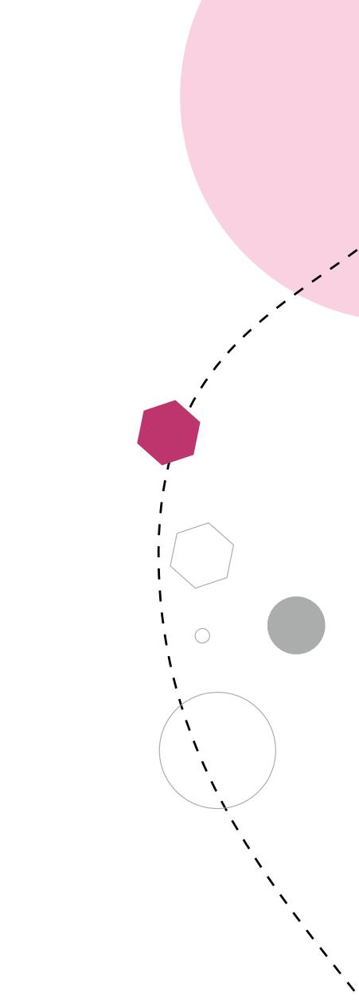
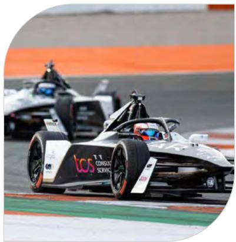

# Notes forming part of Consolidated Financial Statements

through a loss allowance. The Group recognises lifetime expected losses for all contract assets and / or all trade receivables that do not constitute a financing transaction. In determining the allowances for doubtful trade receivables, the Group has used a practical expedient by computing the expected credit loss allowance for trade receivables based on a provision matrix. The provision matrix takes into account historical credit loss experience and is adjusted for forward looking information. The expected credit loss allowance is based on the ageing of the receivables that are due and allowance rates used in the provision matrix. For all other financial assets, expected credit losses are measured at an amount equal to the 12-months expected credit losses or at an amount equal to the life time expected credit losses if the credit risk on the financial asset has increased significantly since initial recognition.

# (a) Investments

Investments consist of the following:

Investments – Non-current

(\` crore) 

<table><tr><td></td><td>As atMarch 31, 2023</td><td>As atMarch 31, 2022</td></tr><tr><td>Investments designated at fair value through OCI</td><td></td><td></td></tr><tr><td>Fully paid equity shares (unquoted)</td><td></td><td></td></tr><tr><td>Mozido LLC</td><td>82</td><td>76</td></tr><tr><td>FCM LLC</td><td>62</td><td>57</td></tr><tr><td>Taj Air Limited</td><td>19</td><td>19</td></tr><tr><td>Philippine Dealing System Holdings Corporation</td><td>7</td><td>7</td></tr><tr><td>Less: Impairment in value of investments</td><td>(134)</td><td>(123)</td></tr><tr><td>Investments carried at amortised cost</td><td></td><td></td></tr><tr><td>Government bonds and securities (quoted)</td><td>188</td><td>187</td></tr><tr><td>Corporate bonds (quoted)</td><td>42</td><td>-</td></tr><tr><td></td><td>266</td><td>223</td></tr></table>

Investments – Non-current includes \`229 crore and \`187 crore as at March 31, 2023 and 2022, respectively, pertaining to trusts held for specified purposes.

# Investments - Current

(\` crore) 

<table><tr><td></td><td>As atMarch 31, 2023</td><td>As atMarch 31, 2022</td></tr><tr><td colspan="3">Investments carried at fair value through profit or loss</td></tr><tr><td>Mutual fund units (quoted)</td><td>2,296</td><td>1,874</td></tr><tr><td colspan="3">Investments carried at fair value through OCI</td></tr><tr><td>Government bonds and securities (quoted)</td><td>26,128</td><td>25,667</td></tr><tr><td>Corporate bonds (quoted)</td><td>3,110</td><td>1,242</td></tr><tr><td colspan="3">Investments carried at amortised cost</td></tr><tr><td>Corporate bonds (quoted)</td><td>10</td><td>10</td></tr><tr><td>Certificate of deposits (quoted)</td><td>2,955</td><td>99</td></tr><tr><td>Commercial papers (quoted)</td><td>2,398</td><td>381</td></tr><tr><td>Treasury bills (quoted)</td><td>-</td><td>989</td></tr><tr><td></td><td>36,897</td><td>30,262</td></tr></table>

Investments – Current includes \`68 crore and \`100 crore as at March 31, 2023 and 2022, respectively, pertaining to trusts and TCS Foundation held for specified purposes.

Government bonds and securities includes bonds pledged with bank for credit facility and with manager to the buy-back amounting to \`1,650 crore and \`3,560 crore as at March 31, 2023 and 2022, respectively.

# Notes forming part of Consolidated Financial Statements

Aggregate value of quoted and unquoted investments is as follows:

(\` crore) 

<table><tr><td></td><td>As atMarch 31, 2023</td><td>As atMarch 31, 2022</td></tr><tr><td>Aggregate value of quoted investments</td><td>37,127</td><td>30,449</td></tr><tr><td>Aggregate value of unquoted investments (net of impairment)</td><td>36</td><td>36</td></tr><tr><td>Aggregate market value of quoted investments</td><td>37,121</td><td>30,455</td></tr><tr><td>Aggregate value of impairment of investments</td><td>134</td><td>123</td></tr></table>

Market value of quoted investments carried at amortised cost is as follows:

(\` crore) 

<table><tr><td></td><td>As atMarch 31, 2023</td><td>As atMarch 31, 2022</td></tr><tr><td>Government bonds and securities</td><td>186</td><td>192</td></tr><tr><td>Corporate bonds</td><td>50</td><td>10</td></tr><tr><td>Certificate of deposits</td><td>2,951</td><td>99</td></tr><tr><td>Commercial papers</td><td>2,400</td><td>381</td></tr><tr><td>Treasury bills</td><td>-</td><td>990</td></tr></table>

Equity instruments designated at fair value through OCI are as follows:

(\` crore) 

<table><tr><td>In Numbers</td><td>Currency</td><td>Face value per share</td><td>Equity instruments designated at fair value through OCI</td><td>As at March 31, 2023</td><td>As at March 31, 2022</td></tr><tr><td></td><td></td><td></td><td>Fully paid equity shares (unquoted)</td><td></td><td></td></tr><tr><td>1,00,00,000</td><td>USD</td><td>1</td><td>Mozido LLC</td><td>82</td><td>76</td></tr><tr><td>15</td><td>USD</td><td>5,00,000</td><td>FCM LLC</td><td>62</td><td>57</td></tr><tr><td>1,90,00,000</td><td>INR</td><td>10</td><td>Taj Air Limited</td><td>19</td><td>19</td></tr><tr><td>5,00,000</td><td>PHP</td><td>100</td><td>Philippine Dealing System Holdings Corporation</td><td>7</td><td>7</td></tr><tr><td></td><td></td><td></td><td>Less: Impairment in value of investments</td><td>(134)</td><td>(123)</td></tr><tr><td></td><td></td><td></td><td></td><td>36</td><td>36</td></tr></table>

The movement in fair value of investments carried / designated at fair value through OCI is as follows:

(\` crore)

# Balance at the beginning of the year

Net loss arising on revaluation of financial assets carried at fair value

Net loss arising on revaluation of investments other than equities carried at fair value through other comprehensive income

Deferred tax relating to net loss arising on revaluation of investments other than equities carried at fair value through other comprehensive income

Net cumulative gain reclassified to statement of profit and loss on sale of investments other than equities carried at fair value through other comprehensive income

Deferred tax relating to net cumulative gain reclassified to statement of profit and loss on sale of investments other than equities carried at fair value through other comprehensive income

# Balance at the end of the year

<table><tr><td>Year endedMarch 31, 2023</td><td>Year endedMarch 31, 2022</td></tr><tr><td>488(2)(676)</td><td>828(4)(516)</td></tr><tr><td>233(3)</td><td>180-</td></tr><tr><td>1</td><td>-</td></tr><tr><td>41</td><td>488</td></tr></table>

# Notes forming part of Consolidated Financial Statements

# (b) Trade receivables – Billed

Trade receivables - Billed (unsecured) consist of the following:

Trade receivables - Billed - Non-current

(\` crore)

Trade receivables - Billed

Less: Allowance for doubtful trade receivables - Billed

Considered good

<table><tr><td>As atMarch 31, 2023</td><td>As atMarch 31, 2022</td></tr><tr><td>824(675)</td><td>1,013(868)</td></tr><tr><td>149</td><td>145</td></tr></table>

Ageing for trade receivables – non-current outstanding as at March 31, 2023 is as follows:

(\` crore) 

<table><tr><td rowspan="2">Particulars</td><td rowspan="2">Not due</td><td colspan="5">Outstanding for following periods from due date of payment</td><td rowspan="2">Total</td></tr><tr><td>Less than 6 months</td><td>6 months - 1 year</td><td>1 - 2 years</td><td>2 - 3 years</td><td>More than 3 years</td></tr><tr><td>Trade receivables - Billed</td><td></td><td></td><td></td><td></td><td></td><td></td><td></td></tr><tr><td>Undisputed trade receivables – considered good</td><td>-</td><td>-</td><td>-</td><td>71</td><td>83</td><td>638</td><td>792</td></tr><tr><td rowspan="2">Disputed trade receivables – considered good</td><td>-</td><td>-</td><td>-</td><td>-</td><td>8</td><td>24</td><td>32</td></tr><tr><td>-</td><td>-</td><td>-</td><td>71</td><td>91</td><td>662</td><td>824</td></tr><tr><td rowspan="2">Less: Allowance for doubtful trade receivables - Billed</td><td></td><td></td><td></td><td></td><td></td><td></td><td>(675)</td></tr><tr><td></td><td></td><td></td><td></td><td></td><td></td><td>149</td></tr><tr><td rowspan="2">Trade receivables - Unbilled</td><td></td><td></td><td></td><td></td><td></td><td></td><td>199</td></tr><tr><td></td><td></td><td></td><td></td><td></td><td></td><td>348</td></tr></table>

Ageing for trade receivables – non-current outstanding as at March 31, 2022 is as follows:

(\` crore) 

<table><tr><td rowspan="2">Particulars</td><td rowspan="2">Not due</td><td colspan="5">Outstanding for following periods from due date of payment</td><td rowspan="2">Total</td></tr><tr><td>Less than 6 months</td><td>6 months - 1 year</td><td>1 - 2 years</td><td>2 - 3 years</td><td>More than 3 years</td></tr><tr><td>Trade receivables - Billed</td><td></td><td></td><td></td><td></td><td></td><td></td><td></td></tr><tr><td>Undisputed trade receivables – considered good</td><td>-</td><td>-</td><td>12</td><td>123</td><td>247</td><td>615</td><td>997</td></tr><tr><td rowspan="2">Disputed trade receivables – considered good</td><td>-</td><td>-</td><td>-</td><td>-</td><td>-</td><td>16</td><td>16</td></tr><tr><td>-</td><td>-</td><td>12</td><td>123</td><td>247</td><td>631</td><td>1013</td></tr><tr><td rowspan="2">Less: Allowance for doubtful trade receivables- Billed</td><td></td><td></td><td></td><td></td><td></td><td></td><td>(868)</td></tr><tr><td></td><td></td><td></td><td></td><td></td><td></td><td>145</td></tr><tr><td rowspan="2">Trade receivables - Unbilled</td><td></td><td></td><td></td><td></td><td></td><td></td><td>55</td></tr><tr><td></td><td></td><td></td><td></td><td></td><td></td><td>200</td></tr></table>

# Notes forming part of Consolidated Financial Statements

Trade receivables - Billed – Current

(\` crore) 

<table><tr><td></td><td>As atMarch 31, 2023</td><td>As atMarch 31, 2022</td></tr><tr><td>Trade receivables- Billed</td><td>41,244</td><td>34,253</td></tr><tr><td>Less: Allowance for doubtful trade receivables- Billed</td><td>(297)</td><td>(219)</td></tr><tr><td>Considered good</td><td>40,947</td><td>34,034</td></tr><tr><td>Trade receivables- Billed</td><td>343</td><td>286</td></tr><tr><td>Less: Allowance for doubtful trade receivables- Billed</td><td>(241)</td><td>(246)</td></tr><tr><td>Credit impaired</td><td>102</td><td>40</td></tr><tr><td></td><td>41,049</td><td>34,074</td></tr></table>

Ageing for trade receivables – current outstanding as at March 31, 2023 is as follows:

(\` crore) 

<table><tr><td rowspan="2">Particulars</td><td rowspan="2">Not due</td><td colspan="5">Outstanding for following periods from due date of payment</td><td rowspan="2">Total</td></tr><tr><td>Less than 6 months</td><td>6 months - 1 year</td><td>1 - 2 years</td><td>2 - 3 years</td><td>More than 3 years</td></tr><tr><td>Trade receivables - Billed</td><td></td><td></td><td></td><td></td><td></td><td></td><td></td></tr><tr><td>Undisputed trade receivables – considered good</td><td>36,529</td><td>3,360</td><td>889</td><td>119</td><td>53</td><td>256</td><td>41,206</td></tr><tr><td>Undisputed trade receivables – credit impaired</td><td>65</td><td>42</td><td>2</td><td>24</td><td>36</td><td>170</td><td>339</td></tr><tr><td>Disputed trade receivables – considered good</td><td>-</td><td>-</td><td>12</td><td>1</td><td>-</td><td>25</td><td>38</td></tr><tr><td>Disputed trade receivables – credit impaired</td><td>-</td><td>-</td><td>-</td><td>-</td><td>1</td><td>3</td><td>4</td></tr><tr><td></td><td>36,594</td><td>3,402</td><td>903</td><td>144</td><td>90</td><td>454</td><td>41,587(538)</td></tr><tr><td>Less: Allowance for doubtful trade receivables- Billed</td><td></td><td></td><td></td><td></td><td></td><td></td><td>41,049</td></tr><tr><td>Trade receivables - Unbilled</td><td></td><td></td><td></td><td></td><td></td><td></td><td>8,905</td></tr><tr><td></td><td></td><td></td><td></td><td></td><td></td><td></td><td>49,954</td></tr></table>

Ageing for trade receivables – current outstanding as at March 31, 2022 is as follows:

(\` crore) 

<table><tr><td rowspan="2">Particulars</td><td rowspan="2">Not due</td><td colspan="5">Outstanding for following periods from due date of payment</td><td rowspan="2">Total</td></tr><tr><td>Less than 6 months</td><td>6 months - 1 year</td><td>1 - 2 years</td><td>2 - 3 years</td><td>More than 3 years</td></tr><tr><td>Trade receivables - Billed</td><td></td><td></td><td></td><td></td><td></td><td></td><td></td></tr><tr><td>Undisputed trade receivables – considered good</td><td>30,102</td><td>2,601</td><td>582</td><td>585</td><td>154</td><td>205</td><td>34,229</td></tr><tr><td>Undisputed trade receivables – credit impaired</td><td>2</td><td>3</td><td>7</td><td>81</td><td>25</td><td>152</td><td>270</td></tr><tr><td>Disputed trade receivables – considered good</td><td>-</td><td>-</td><td>-</td><td>-</td><td>-</td><td>24</td><td>24</td></tr><tr><td>Disputed trade receivables – credit impaired</td><td>-</td><td>-</td><td>-</td><td>9</td><td>-</td><td>7</td><td>16</td></tr><tr><td></td><td>30,104</td><td>2,604</td><td>589</td><td>675</td><td>179</td><td>388</td><td>34,539(465)</td></tr><tr><td>Less: Allowance for doubtful trade receivables- Billed</td><td></td><td></td><td></td><td></td><td></td><td></td><td>34,074</td></tr><tr><td>Trade receivables - Unbilled</td><td></td><td></td><td></td><td></td><td></td><td></td><td>7,736</td></tr><tr><td></td><td></td><td></td><td></td><td></td><td></td><td></td><td>41,810</td></tr></table>

# Notes forming part of Consolidated Financial Statements

# (c) Cash and cash equivalents

Cash and cash equivalents consist of the following:

(\` crore) 

<table><tr><td></td><td>As atMarch 31, 2023</td><td>As atMarch 31, 2022</td></tr><tr><td colspan="3">Balances with banks</td></tr><tr><td>In current accounts</td><td>2,114</td><td>2,211</td></tr><tr><td>In deposit accounts</td><td>4,999</td><td>10,277</td></tr><tr><td>Cheques on hand</td><td>-*</td><td>-*</td></tr><tr><td>Cash on hand</td><td>-*</td><td>-*</td></tr><tr><td>Remittances in transit</td><td>10</td><td>-*</td></tr><tr><td></td><td>7,123</td><td>12,488</td></tr></table>

\*Represents value less than \`0.50 crore.

Balances with banks in current accounts include \`8 crore and \`32 crore as at March 31, 2023 and 2022, respectively, pertaining to trusts held for specified purposes.

# (d) Other balances with banks

Other balances with banks consist of the following:

(\` crore) 

<table><tr><td></td><td>As atMarch 31, 2023</td><td>As atMarch 31, 2022</td></tr><tr><td>Earmarked balances with banks</td><td>685</td><td>226</td></tr><tr><td>Short-term bank deposits</td><td>3,224</td><td>5,507</td></tr><tr><td></td><td>3,909</td><td>5,733</td></tr></table>

Earmarked balances with banks primarily relate to margin money for purchase of investments, margin money for derivative contracts, unclaimed dividends and liquidity backstop as a part of regulatory requirements.

# (e) Loans

Loans (unsecured) consist of the following:

Loans – Non-current

(\` crore) 

<table><tr><td></td><td>As atMarch 31, 2023</td><td>As atMarch 31, 2022</td></tr><tr><td>Considered good</td><td></td><td></td></tr><tr><td>Inter-corporate deposits</td><td>170</td><td>303</td></tr><tr><td>Loans and advances to employees</td><td>3</td><td>8</td></tr><tr><td></td><td>173</td><td>311</td></tr></table>

Loans – Current

(\` crore) 

<table><tr><td></td><td>As atMarch 31, 2023</td><td>As atMarch 31, 2022</td></tr><tr><td>Considered good</td><td></td><td></td></tr><tr><td>Inter-corporate deposits</td><td>846</td><td>6,074</td></tr><tr><td>Loans and advances to employees</td><td>479</td><td>371</td></tr><tr><td>Credit impaired</td><td></td><td></td></tr><tr><td>Loans and advances to employees</td><td>32</td><td>23</td></tr><tr><td>Less: Allowance on loans and advances to employees</td><td>(32)</td><td>(23)</td></tr><tr><td></td><td>1,325</td><td>6,445</td></tr></table>

Inter-corporate deposits yield fixed interest rate and are placed with financial institutions, who are authorized to accept and use such inter-corporate deposits as per regulations applicable to them. Inter-corporate deposits include \`932 crore and \`978 crore as at March 31, 2023 and 2022, respectively, pertaining to trusts and TCS Foundation held for specified purposes.

# Notes forming part of Consolidated Financial Statements

# (f) Other financial assets

Other financial assets consist of the following:

Other financial assets – Non-current

(\` crore) 

<table><tr><td></td><td>As atMarch 31, 2023</td><td>As atMarch 31, 2022</td></tr><tr><td>Security deposits</td><td>614</td><td>825</td></tr><tr><td>Earmarked balances with banks</td><td>192</td><td>183</td></tr><tr><td>Long-term bank deposits</td><td>1,334</td><td>1,232</td></tr><tr><td>Interest receivable</td><td>2</td><td>-</td></tr><tr><td>Others</td><td>7</td><td>13</td></tr><tr><td></td><td>2,149</td><td>2,253</td></tr></table>

# Other financial assets - Current

(\` crore) 

<table><tr><td></td><td>As atMarch 31, 2023</td><td>As atMarch 31, 2022</td></tr><tr><td>Security deposits</td><td>378</td><td>178</td></tr><tr><td>Fair value of foreign exchange derivative assets</td><td>191</td><td>388</td></tr><tr><td>Interest receivable</td><td>720</td><td>648</td></tr><tr><td>Others</td><td>30</td><td>176</td></tr><tr><td></td><td>1,319</td><td>1,390</td></tr></table>

Interest receivable includes \`66 crore and \`34 crore as at March 31, 2023 and 2022, respectively, pertaining to trusts and TCS Foundation held for specified purposes.

# (g) Trade Payables

Ageing for trade payables outstanding as at March 31, 2023 is as follows:

(\` crore) 

<table><tr><td rowspan="2">Particulars</td><td rowspan="2">Not due</td><td colspan="4">Outstanding for following periods from due date of payment</td><td rowspan="2">Total</td></tr><tr><td>Less than 1 year</td><td>1 - 2 years</td><td>2 - 3 years</td><td>More than 3 years</td></tr><tr><td>Trade payables</td><td></td><td></td><td></td><td></td><td></td><td></td></tr><tr><td>Others</td><td>1,776</td><td>1,903</td><td>-</td><td>9</td><td>42</td><td>3,730</td></tr><tr><td>Disputed dues- Others</td><td>-</td><td>-</td><td>-</td><td>-</td><td>29</td><td>29</td></tr><tr><td></td><td>1776</td><td>1903</td><td>-</td><td>9</td><td>71</td><td>3,759</td></tr><tr><td>Accrued expenses</td><td></td><td></td><td></td><td></td><td></td><td>6,756</td></tr><tr><td></td><td></td><td></td><td></td><td></td><td></td><td>10,515</td></tr></table>

Ageing for trade payables outstanding as at March 31, 2022 is as follows:

(\` crore) 

<table><tr><td rowspan="2">Particulars</td><td rowspan="2">Not due</td><td colspan="4">Outstanding for following periods from due date of payment</td><td rowspan="2">Total</td></tr><tr><td>Less than 1 year</td><td>1 - 2 years</td><td>2 - 3 years</td><td>More than 3 years</td></tr><tr><td>Trade payables</td><td></td><td></td><td></td><td></td><td></td><td></td></tr><tr><td>Others</td><td>1,187</td><td>778</td><td>22</td><td>8</td><td>52</td><td>2,047</td></tr><tr><td>Disputed dues- Others</td><td>-</td><td>-</td><td>-</td><td>-</td><td>32</td><td>32</td></tr><tr><td></td><td>1187</td><td>778</td><td>22</td><td>8</td><td>84</td><td>2,079</td></tr><tr><td>Accrued expenses</td><td></td><td></td><td></td><td></td><td></td><td>5,966</td></tr><tr><td></td><td></td><td></td><td></td><td></td><td></td><td>8,045</td></tr></table>

# Notes forming part of Consolidated Financial Statements

# (h) Other financial liabilities

Other financial liabilities consist of the following:

Other financial liabilities – Non-current

(\` crore) 

<table><tr><td></td><td>As atMarch 31, 2023</td><td>As atMarch 31, 2022</td></tr><tr><td>Capital creditors</td><td>120</td><td>339</td></tr><tr><td>Others</td><td>233</td><td>233</td></tr><tr><td></td><td>353</td><td>572</td></tr></table>

Others include advance taxes paid of \`226 crore and \`226 crore as at March 31, 2023 and 2022, respectively, by the seller of TCS e-Serve Limited (merged with the Company) which, on refund by tax authorities, is payable to the seller.

# Other financial liabilities – Current

(\` crore) 

<table><tr><td></td><td>As atMarch 31, 2023</td><td>As atMarch 31, 2022</td></tr><tr><td>Accrued payroll</td><td>6,847</td><td>5,572</td></tr><tr><td>Unclaimed dividends</td><td>51</td><td>46</td></tr><tr><td>Fair value of foreign exchange derivative liabilities</td><td>141</td><td>128</td></tr><tr><td>Capital creditors</td><td>731</td><td>771</td></tr><tr><td>Liabilities towards customer contracts</td><td>1,137</td><td>1,034</td></tr><tr><td>Others</td><td>161</td><td>136</td></tr><tr><td></td><td>9,068</td><td>7,687</td></tr></table>

# (i) Financial instruments by category

The carrying value of financial instruments by categories as at March 31, 2023 is as follows:

(\` crore) 

<table><tr><td></td><td>Fair value through profit or loss</td><td>Fair value through other comprehensive income</td><td>Derivative instruments in hedging relationship</td><td>Derivative instruments not in hedging relationship</td><td>Amortised cost</td><td>Total carrying value</td></tr><tr><td colspan="7">Financial assets</td></tr><tr><td>Cash and cash equivalents</td><td>-</td><td>-</td><td>-</td><td>-</td><td>7,123</td><td>7,123</td></tr><tr><td>Bank deposits</td><td>-</td><td>-</td><td>-</td><td>-</td><td>4,558</td><td>4,558</td></tr><tr><td>Earmarked balances with banks</td><td>-</td><td>-</td><td>-</td><td>-</td><td>877</td><td>877</td></tr><tr><td>Investments</td><td>2,296</td><td>29,274</td><td>-</td><td>-</td><td>5,593</td><td>37,163</td></tr><tr><td colspan="7">Trade receivables</td></tr><tr><td>Billed</td><td>-</td><td>-</td><td>-</td><td>-</td><td>41,198</td><td>41,198</td></tr><tr><td>Unbilled</td><td>-</td><td>-</td><td>-</td><td>-</td><td>9,104</td><td>9,104</td></tr><tr><td>Loans</td><td>-</td><td>-</td><td>-</td><td>-</td><td>1,498</td><td>1,498</td></tr><tr><td>Other financial assets</td><td>-</td><td>-</td><td>37</td><td>154</td><td>1,751</td><td>1,942</td></tr><tr><td></td><td>2,296</td><td>29,274</td><td>37</td><td>154</td><td>71,702</td><td>1,03,463</td></tr><tr><td colspan="7">Financial liabilities</td></tr><tr><td>Trade payables</td><td>-</td><td>-</td><td>-</td><td>-</td><td>10,515</td><td>10,515</td></tr><tr><td>Lease liabilities</td><td>-</td><td>-</td><td>-</td><td>-</td><td>7,688</td><td>7,688</td></tr><tr><td>Other financial liabilities</td><td>-</td><td>-</td><td>-</td><td>141</td><td>9,280</td><td>9,421</td></tr><tr><td></td><td>-</td><td>-</td><td>-</td><td>141</td><td>27,483</td><td>27,624</td></tr></table>

Loans include inter-corporate deposits of \`1,016 crore, with original maturity period within 24 months.

# Notes forming part of Consolidated Financial Statements

The carrying value of financial instruments by categories as at March 31, 2022 is as follows:

(\` crore) 

<table><tr><td></td><td>Fair value through profit or loss</td><td>Fair value through other comprehensive income</td><td>Derivative instruments in hedging relationship</td><td>Derivative instruments not in hedging relationship</td><td>Amortised cost</td><td>Total carrying value</td></tr><tr><td colspan="7">Financial assets</td></tr><tr><td>Cash and cash equivalents</td><td>-</td><td>-</td><td>-</td><td>-</td><td>12,488</td><td>12,488</td></tr><tr><td>Bank deposits</td><td>-</td><td>-</td><td>-</td><td>-</td><td>6,739</td><td>6,739</td></tr><tr><td>Earmarked balances with banks</td><td>-</td><td>-</td><td>-</td><td>-</td><td>409</td><td>409</td></tr><tr><td>Investments</td><td>1,874</td><td>26,945</td><td>-</td><td>-</td><td>1,666</td><td>30,485</td></tr><tr><td colspan="7">Trade receivables</td></tr><tr><td>Billed</td><td>-</td><td>-</td><td>-</td><td>-</td><td>34,219</td><td>34,219</td></tr><tr><td>Unbilled</td><td>-</td><td>-</td><td>-</td><td>-</td><td>7,791</td><td>7,791</td></tr><tr><td>Loans</td><td>-</td><td>-</td><td>-</td><td>-</td><td>6,756</td><td>6,756</td></tr><tr><td>Other financial assets</td><td>-</td><td>-</td><td>124</td><td>264</td><td>1,840</td><td>2,228</td></tr><tr><td></td><td>1,874</td><td>26,945</td><td>124</td><td>264</td><td>71,908</td><td>1,01,115</td></tr><tr><td colspan="7">Financial liabilities</td></tr><tr><td>Trade payables</td><td>-</td><td>-</td><td>-</td><td>-</td><td>8,045</td><td>8,045</td></tr><tr><td>Lease liabilities</td><td>-</td><td>-</td><td>-</td><td>-</td><td>7,818</td><td>7,818</td></tr><tr><td>Other financial liabilities</td><td>-</td><td>-</td><td>22</td><td>106</td><td>8,131</td><td>8,259</td></tr><tr><td></td><td>-</td><td>-</td><td>22</td><td>106</td><td>23,994</td><td>24,122</td></tr></table>

Loans include inter-corporate deposits of \`6,377 crore, with original maturity period within 36 months.

Carrying amounts of cash and cash equivalents, trade receivables, loans and trade payables as at March 31, 2023 and 2022, approximate the fair value due to their nature. Carrying amounts of bank deposits, earmarked balances with banks, other financial assets and other financial liabilities which are subsequently measured at amortised cost also approximate the fair value due to their nature in each of the periods presented. Fair value measurement of lease liabilities is not required. Fair value of investments carried at amortised cost is \`5,587 crore and \`1,672 crore as at March 31, 2023 and 2022, respectively.

# (j) Fair value hierarchy

The fair value hierarchy is based on inputs to valuation techniques that are used to measure fair value that are either observable or unobservable and consists of the following three levels:

Level 1 — Inputs are quoted prices (unadjusted) in active markets for identical assets or liabilities.   
Level 2 — Inputs are other than quoted prices included within Level 1 that are observable for the asset or liability, either directly (i.e. as prices) or indirectly (i.e. derived from prices).   
Level 3 — Inputs are not based on observable market data (unobservable inputs). Fair values are determined in whole or in part using a valuation model based on assumptions that are neither supported by prices from observable current market transactions in the same instrument nor are they based on available market data.

The cost of unquoted investments included in Level 3 of fair value hierarchy approximate their fair value because there is a wide range of possible fair value measurements and the cost represents estimate of fair value within that range.

# Notes forming part of Consolidated Financial Statements

The following table summarises financial assets and liabilities measured at fair value on a recurring basis and financial assets that are not measured at fair value on a recurring basis (but fair value disclosures are required):

(\` crore)   
As at March 31, 2023   
Financial assets 

<table><tr><td>Mutual fund units</td></tr><tr><td>Equity shares</td></tr><tr><td>Government bonds and securities</td></tr><tr><td>Corporate bonds</td></tr><tr><td>Certificate of deposits</td></tr><tr><td>Commercial papers</td></tr><tr><td>Fair value of foreign exchange derivative assets</td></tr></table>

# Financial liabilities

Fair value of foreign exchange derivative liabilities

<table><tr><td>Level 1</td><td>Level 2</td><td>Level 3</td><td>Total</td></tr><tr><td>2,296</td><td>-</td><td>-</td><td>2,296</td></tr><tr><td>-</td><td>-</td><td>36</td><td>36</td></tr><tr><td>26,314</td><td>-</td><td>-</td><td>26,314</td></tr><tr><td>3,160</td><td>-</td><td>-</td><td>3,160</td></tr><tr><td>2,951</td><td>-</td><td>-</td><td>2,951</td></tr><tr><td>2,400</td><td>-</td><td>-</td><td>2,400</td></tr><tr><td>-</td><td>191</td><td>-</td><td>191</td></tr><tr><td>37,121</td><td>191</td><td>36</td><td>37,348</td></tr><tr><td>-</td><td>141</td><td>-</td><td>141</td></tr><tr><td>-</td><td>141</td><td>-</td><td>141</td></tr></table>

(\` crore)

As at March 31, 2022   
Financial assets 

<table><tr><td>Mutual fund units</td></tr><tr><td>Equity shares</td></tr><tr><td>Government bonds and securities</td></tr><tr><td>Corporate bonds</td></tr><tr><td>Certificate of deposits</td></tr><tr><td>Commercial papers</td></tr><tr><td>Treasury bills</td></tr><tr><td>Fair value of foreign exchange derivative assets</td></tr></table>

# Financial liabilities

Fair value of foreign exchange derivative liabilities

<table><tr><td>Level 1</td><td>Level 2</td><td>Level 3</td><td>Total</td></tr><tr><td>1,874</td><td>-</td><td>-</td><td>1,874</td></tr><tr><td>-</td><td>-</td><td>36</td><td>36</td></tr><tr><td>25,859</td><td>-</td><td>-</td><td>25,859</td></tr><tr><td>1,252</td><td>-</td><td>-</td><td>1,252</td></tr><tr><td>99</td><td>-</td><td>-</td><td>99</td></tr><tr><td>381</td><td>-</td><td>-</td><td>381</td></tr><tr><td>990</td><td>-</td><td>-</td><td>990</td></tr><tr><td>-</td><td>388</td><td>-</td><td>388</td></tr><tr><td>30,455</td><td>388</td><td>36</td><td>30,879</td></tr><tr><td>-</td><td>128</td><td>-</td><td>128</td></tr><tr><td>-</td><td>128</td><td>-</td><td>128</td></tr></table>

Reconciliation of Level 3 fair value measurement of financial assets is as follows:

(\` crore)   
Balance at the beginning of the year 

<table><tr><td>Impairment in value of investments</td></tr><tr><td>Other adjustments during the year</td></tr><tr><td>Translation exchange difference</td></tr></table>

# Balance at the end of the year

<table><tr><td>Year endedMarch 31, 2023</td><td>Year endedMarch 31, 2022</td></tr><tr><td>36(2)-236</td><td>93(4)(55)236</td></tr></table>

# (k) Derivative financial instruments and hedging activity

The Group’s revenue is denominated in various foreign currencies. Given the nature of the business, a large portion of the costs are denominated in Indian Rupee. This exposes the Group to currency fluctuations.

The Board of Directors has constituted a Risk Management Committee (RMC) to frame, implement and monitor the risk management plan of the Group which inter-alia covers risks arising out of exposure to foreign currency fluctuations. Under the guidance and framework provided by the RMC, the Group uses various derivative instruments such as foreign exchange forward, currency options and futures contracts in which the counter party is generally a bank.

# Notes forming part of Consolidated Financial Statements

The following are outstanding currency options contracts, which have been designated as cash flow hedges:

Foreign currency 

<table><tr><td>US Dollar</td></tr><tr><td>Great Britain Pound</td></tr><tr><td>Euro</td></tr><tr><td>Australian Dollar</td></tr><tr><td>Canadian Dollar</td></tr></table>

<table><tr><td colspan="3">As at March 31, 2023</td><td colspan="3">As at March 31, 2022</td></tr><tr><td>No. of contracts</td><td>Notional amount of contracts (In million)</td><td>Fair value (₹ crore)</td><td>No. of contracts</td><td>Notional amount of contracts (In million)</td><td>Fair value (₹ crore)</td></tr><tr><td>8</td><td>225</td><td>13</td><td>63</td><td>1,635</td><td>44</td></tr><tr><td>22</td><td>200</td><td>14</td><td>41</td><td>338</td><td>55</td></tr><tr><td>22</td><td>203</td><td>10</td><td>53</td><td>382</td><td>25</td></tr><tr><td>-</td><td>-</td><td>-</td><td>30</td><td>202</td><td>(21)</td></tr><tr><td>-</td><td>-</td><td>-</td><td>25</td><td>137</td><td>(1)</td></tr></table>

\*Represents value less than \`0.50 crore.

The movement in cash flow hedging reserve for derivatives designated as cash flow hedges is as follows:

(\` crore)

# Balance at the beginning of the year

(Gain) / loss transferred to profit and loss on occurrence of forecasted hedge transactions

Deferred tax on (gain) / loss transferred to profit and loss on occurrence of forecasted hedge transactions

Change in the fair value of effective portion of cash flow hedges

Deferred tax on change in the fair value of effective portion of cash flow hedges

# Balance at the end of the year

<table><tr><td colspan="2">Year endedMarch 31, 2023</td><td colspan="2">Year endedMarch 31, 2022</td></tr><tr><td>Intrinsic value</td><td>Time value</td><td>Intrinsic value</td><td>Time value</td></tr><tr><td>27(376)</td><td>(53)488</td><td>56(636)</td><td>(27)525</td></tr><tr><td>90</td><td>(144)</td><td>139</td><td>(122)</td></tr><tr><td>351</td><td>(456)</td><td>599</td><td>(559)</td></tr><tr><td>(84)</td><td>137</td><td>(131)</td><td>130</td></tr><tr><td>8</td><td>(28)</td><td>27</td><td>(53)</td></tr></table>

The Group has entered into derivative instruments not in hedging relationship by way of foreign exchange forward, currency options and futures contracts. As at March 31, 2023 and 2022, the notional amount of outstanding contracts aggregated to \`47,500 crore and \`46,392 crore, respectively, and the respective fair value of these contracts have a net gain of \`13 crore and \`158 crore.

Exchange loss of \`1,162 crore and gain of \`645 crore on foreign exchange forward, currency options and futures contracts that do not qualify for hedge accounting have been recognised in the consolidated statement of profit and loss for the years ended March 31, 2023 and 2022, respectively.

Net foreign exchange gain / (loss) include loss of \`112 crore and gain of \`111 crore transferred from cash flow hedging reserve for the years ended March 31, 2023 and 2022, respectively.

Net loss on derivative instruments of \`20 crore recognised in cash flow hedging reserve as at March 31, 2023, is expected to be transferred to the statement of profit and loss by March 31, 2024. The maximum period over which the exposure to cash flow variability has been hedged is through calendar year 2023.

Following table summarises approximate gain / (loss) on Group’s other comprehensive income on account of appreciation / depreciation of the underlying foreign currencies:

(\` crore)

10% Appreciation of the underlying foreign currencies

10% Depreciation of the underlying foreign currencies

<table><tr><td>As atMarch 31, 2023</td><td>As atMarch 31, 2022</td></tr><tr><td>-</td><td>(387)</td></tr><tr><td>544</td><td>2,034</td></tr></table>

# Notes forming part of Consolidated Financial Statements

# (l) Financial risk management

The Group is exposed primarily to fluctuations in foreign currency exchange rates, credit, liquidity and interest rate risks, which may adversely impact the fair value of its financial instruments. The Group has a risk management policy which covers risks associated with the financial assets and liabilities. The risk management policy is approved by the Board of Directors. The focus of the risk management committee is to assess the unpredictability of the financial environment and to mitigate potential adverse effects on the financial performance of the Group.

# Market risk

Market risk is the risk that the fair value or future cash flows of a financial instrument will fluctuate because of changes in market prices. Such changes in the values of financial instruments may result from changes in the foreign currency exchange rates, interest rates, credit, liquidity and other market changes. The Group’s exposure to market risk is primarily on account of foreign currency exchange rate risk.

# C Foreign currency exchange rate risk

The fluctuation in foreign currency exchange rates may have potential impact on the consolidated statement of profit and loss and other comprehensive income and equity, where any transaction references more than one currency or where assets / liabilities are denominated in a currency other than the functional currency of the respective entities. Considering the countries and economic environment in which the Group operates, its operations are subject to risks arising from fluctuations in exchange rates in those countries.

The Group, as per its risk management policy, uses derivative instruments primarily to hedge foreign exchange. Further, any movement in the functional currencies of the various operations of the Group against major foreign currencies may impact the Group’s revenue in international business.

The Group evaluates the impact of foreign exchange rate fluctuations by assessing its exposure to exchange rate risks. It hedges a part of these risks by using derivative financial instruments in line with its risk management policies.

The foreign exchange rate sensitivity is calculated by aggregation of the net foreign exchange rate exposure and a simultaneous parallel foreign exchange rates shift of all the currencies by 10% against the respective functional currencies of Tata Consultancy Services Limited and its subsidiaries.

The following analysis has been worked out based on the net exposures for each of the subsidiaries and Tata Consultancy Services Limited as of the date of balance sheet which could affect the statement of profit and loss and other comprehensive income and equity. Further the exposure as indicated below is mitigated by some of the derivative contracts entered into by the Group as disclosed in note 8(k).

The following table sets forth information relating to unhedged foreign currency exposure as at March 31, 2023:

(\` crore)

Net financial assets

Net financial liabilities

<table><tr><td>USD</td><td>EUR</td><td>GBP</td><td>Others</td></tr><tr><td>3,869(11,021)</td><td>262(657)</td><td>90(1,536)</td><td>2,136(270)</td></tr></table>

10% appreciation / depreciation of the respective functional currency of Tata Consultancy Services Limited and its subsidiaries with respect to various foreign currencies would result in increase / decrease in the Group’s profit before taxes by approximately \`713 crore for the year ended March 31, 2023.

The following table sets forth information relating to unhedged foreign currency exposure as at March 31, 2022:

(\` crore)

Net financial assets

Net financial liabilities

<table><tr><td>USD</td><td>EUR</td><td>GBP</td><td>Others</td></tr><tr><td>2,900(8,589)</td><td>165(437)</td><td>84(1,290)</td><td>1,234(421)</td></tr></table>

# Notes forming part of Consolidated Financial Statements

10% appreciation / depreciation of the respective functional currency of Tata Consultancy Services Limited and its subsidiaries with respect to various foreign currencies would result in increase / decrease in the Group’s profit before taxes by approximately \`635 crore for the year ended March 31, 2022.

# • Interest rate risk

The Group’s investments are primarily in fixed rate interest bearing investments. Hence, the Group is not significantly exposed to interest rate risk.

# Credit risk

Credit risk is the risk of financial loss arising from counterparty failure to repay or service debt according to the contractual terms or obligations. Credit risk encompasses of both, the direct risk of default and the risk of deterioration of creditworthiness as well as concentration of risks. Credit risk is controlled by analysing credit limits and creditworthiness of customers on a continuous basis to whom the credit has been granted after obtaining necessary approvals for credit.

Financial instruments that are subject to concentrations of credit risk principally consist of trade receivables, loans, investments, derivative financial instruments, cash and cash equivalents, bank deposits and other financial assets. Inter-corporate deposits of \`1,016 crore are with a financial institution having a high credit-rating assigned by credit-rating agencies. Bank deposits include an amount of \`4,273 crore held with three banks having high credit rating which are individually in excess of 10% or more of the Group’s total bank deposits as at March 31, 2023. None of the other financial instruments of the Group result in material concentration of credit risk.

# • Exposure to credit risk

The carrying amount of financial assets and contract assets represents the maximum credit exposure. The maximum exposure to credit risk was \`1,09,258 crore and \`1,05,498 crore as at March 31, 2023 and 2022, respectively, being the total of the carrying amount of balances with banks, bank deposits, investments, trade receivables, loan, contract assets and other financial assets.

The Group’s exposure to customers is diversified and no single customer contributes to more than 10% of outstanding trade receivables and contract assets as at March 31, 2023 and 2022.

# • Geographic concentration of credit risk

Geographic concentration of trade receivables (gross and net of allowances) and contract assets is as follows:

<table><tr><td rowspan="2"></td><td colspan="2">As at March 31, 2023</td><td colspan="2">As at March 31, 2022</td></tr><tr><td>Gross%</td><td>Net%</td><td>Gross%</td><td>Net%</td></tr><tr><td>United States of America</td><td>43.65</td><td>44.31</td><td>43.79</td><td>44.69</td></tr><tr><td>India</td><td>15.45</td><td>14.06</td><td>15.51</td><td>13.83</td></tr><tr><td>United Kingdom</td><td>16.05</td><td>16.37</td><td>16.47</td><td>16.86</td></tr></table>

Geographical concentration of trade receivables (gross and net of allowances) and contract assets is allocated based on the location of the customers.

The allowance for lifetime expected credit loss on trade receivables for the years ended March 31, 2023 and 2022, was \`126 crore and \`123 crore respectively. The reconciliation of allowance for doubtful trade receivables is as follows:

(\` crore) 

<table><tr><td>Balance at the beginning of the year</td></tr><tr><td>Change during the year</td></tr><tr><td>Bad debts written off</td></tr><tr><td>Translation exchange difference</td></tr><tr><td>Balance at the end of the year</td></tr></table>

<table><tr><td>Year endedMarch 31, 2023</td><td>Year endedMarch 31, 2022</td></tr><tr><td>1,333</td><td>1,289</td></tr><tr><td>126</td><td>123</td></tr><tr><td>(253)</td><td>(83)</td></tr><tr><td>7</td><td>4</td></tr><tr><td>1,213</td><td>1,333</td></tr></table>

# Notes forming part of Consolidated Financial Statements

# Liquidity risk

Liquidity risk refers to the risk that the Group cannot meet its financial obligations. The objective of liquidity risk management is to maintain sufficient liquidity and ensure that funds are available for use as per requirements. The Group consistently generated sufficient cash flows from operations to meet its financial obligations including lease liabilities as and when they fall due.

The tables below provide details regarding the contractual maturities of significant financial liabilities as at:

(\` crore) 

<table><tr><td>March 31, 2023</td><td>Due in $1^{st}$  year</td><td>Due in  $2^{nd}$  year</td><td>Due in  $3^{rd}$  to  $5^{th}$  year</td><td>Due after  $5^{th}$  year</td><td>Total</td></tr><tr><td>Non-derivative financial liabilities</td><td></td><td></td><td></td><td></td><td></td></tr><tr><td>Trade payables</td><td>10,515</td><td>-</td><td>-</td><td>-</td><td>10,515</td></tr><tr><td>Lease liabilities</td><td>1,969</td><td>1,771</td><td>3,185</td><td>2,836</td><td>9,761</td></tr><tr><td>Other financial liabilities</td><td>8,948</td><td>51</td><td>302</td><td>9</td><td>9,310</td></tr><tr><td></td><td>21,432</td><td>1,822</td><td>3,487</td><td>2,845</td><td>29,586</td></tr><tr><td>Derivative financial liabilities</td><td>141</td><td>-</td><td>-</td><td>-</td><td>141</td></tr><tr><td></td><td>21,573</td><td>1,822</td><td>3,487</td><td>2,845</td><td>29,727</td></tr></table>

(\` crore) 

<table><tr><td>March 31, 2022</td><td>Due in $1^{st}$  year</td><td>Due in  $2^{nd}$  year</td><td>Due in  $3^{rd}$  to  $5^{th}$  year</td><td>Due after  $5^{th}$  year</td><td>Total</td></tr><tr><td>Non-derivative financial liabilities</td><td></td><td></td><td></td><td></td><td></td></tr><tr><td>Trade payables</td><td>8,045</td><td>-</td><td>-</td><td>-</td><td>8,045</td></tr><tr><td>Lease liabilities</td><td>1,850</td><td>1,618</td><td>3,201</td><td>3,150</td><td>9,819</td></tr><tr><td>Other financial liabilities</td><td>7,582</td><td>343</td><td>231</td><td>5</td><td>8,161</td></tr><tr><td></td><td>17,477</td><td>1,961</td><td>3,432</td><td>3,155</td><td>26,025</td></tr><tr><td>Derivative financial liabilities</td><td>128</td><td>-</td><td>-</td><td>-</td><td>128</td></tr><tr><td></td><td>17,605</td><td>1,961</td><td>3,432</td><td>3,155</td><td>26,153</td></tr></table>

# (m) Equity instruments

The authorised, issued, subscribed and fully paid up share capital consist of the following:

(\` crore)

# Authorised

460,05,00,000 equity shares of \`1 each

(March 31, 2022: 460,05,00,000 equity shares of \`1 each)

105,02,50,000 preference shares of \`1 each

(March 31, 2022: 105,02,50,000 preference shares of \`1 each)

# Issued, Subscribed and Fully paid up

365,90,51,373 equity shares of \`1 each

(March 31, 2022: 365,90,51,373 equity shares of \`1 each)

<table><tr><td>As atMarch 31, 2023</td><td>As atMarch 31, 2022</td></tr><tr><td>460</td><td>460</td></tr><tr><td>105</td><td>105</td></tr><tr><td>565</td><td>565</td></tr><tr><td>366</td><td>366</td></tr><tr><td>366</td><td>366</td></tr></table>

The Company’s objective for capital management is to maximise shareholder value, safeguard business continuity and support the growth of the Company. The Company determines the capital requirement based on annual operating plans and long-term and other strategic investment plans. The funding requirements are met through equity and operating cash flows generated. The Company is not subject to any externally imposed capital requirements.

# Notes forming part of Consolidated Financial Statements

The Company bought back 4,00,00,000 equity shares for an aggregate amount of \`18,000 crore being 1.08% of the total paid up equity share capital at \`4,500 per equity share in the previous year. The equity shares bought back were extinguished on March 29, 2022.

# I. Reconciliation of number of shares

<table><tr><td rowspan="2"></td><td colspan="2">As at March 31, 2023</td><td colspan="2">As at March 31, 2022</td></tr><tr><td>Number of shares</td><td>Amount(₹ crore)</td><td>Number of shares</td><td>Amount(₹ crore)</td></tr><tr><td colspan="5">Equity shares</td></tr><tr><td>Opening balance</td><td>365,90,51,373</td><td>366</td><td>369,90,51,373</td><td>370</td></tr><tr><td>Shares extinguished on buy-back</td><td>-</td><td>-</td><td>(4,00,00,000)</td><td>(4)</td></tr><tr><td>Closing balance</td><td>365,90,51,373</td><td>366</td><td>365,90,51,373</td><td>366</td></tr></table>

# II. Rights, preferences and restrictions attached to shares

The Company has one class of equity shares having a par value of \`1 each. Each shareholder is eligible for one vote per share held and carry a right to dividend. The dividend proposed by the Board of Directors is subject to the approval of the shareholders in the ensuing Annual General Meeting, except in case of interim dividend. In the event of liquidation, the equity shareholders are eligible to receive the remaining assets of the Company after distribution of all preferential amounts, in proportion to their shareholding.

# III. Shares held by Holding company, its Subsidiaries and Associates

(\` crore) 

<table><tr><td></td><td>As atMarch 31, 2023</td><td>As atMarch 31, 2022</td></tr><tr><td>Equity shares</td><td></td><td></td></tr><tr><td>Holding company</td><td></td><td></td></tr><tr><td>264,43,17,117 equity shares (March 31, 2022: 264,43,17,117 equity shares) are held by Tata Sons Private Limited</td><td>264</td><td>264</td></tr><tr><td>Subsidiaries and Associates of Holding company</td><td></td><td></td></tr><tr><td>7,220 equity shares (March 31, 2022: 7,220 equity shares) are held by Tata Industries Limited*</td><td>-</td><td>-</td></tr><tr><td>10,14,172 equity shares (March 31, 2022: 10,14,172 equity shares) are held by Tata Investment Corporation Limited*</td><td>-</td><td>-</td></tr><tr><td>46,798 equity shares (March 31, 2022: 46,798 equity shares) are held by Tata Steel Limited*</td><td>-</td><td>-</td></tr><tr><td>766 equity shares (March 31, 2022: 766 equity shares) are held by The Tata Power Company Limited*</td><td>-</td><td>-</td></tr><tr><td></td><td>264</td><td>264</td></tr></table>

\*Equity shares having value less than \`0.50 crore.

# IV. Details of shares held by shareholders holding more than 5% of the aggregate shares in the Company

# Equity shares

Tata Sons Private Limited, the holding company % of shareholding

<table><tr><td>As atMarch 31, 2023</td><td>As atMarch 31, 2022</td></tr><tr><td>264,43,17,117</td><td>264,43,17,117</td></tr><tr><td>72.27%</td><td>72.27%</td></tr></table>

# Notes forming part of Consolidated Financial Statements

# V. Equity shares movement during 5 years preceding March 31, 2023

# C Equity shares issued as bonus

The Company allotted 191,42,87,591 equity shares as fully paid up bonus shares by capitalisation of profits transferred from retained earnings amounting to \`86 crore and capital redemption reserve amounting to \`106 crore in the quarter ended June 30, 2018, pursuant to an ordinary resolution passed after taking the consent of shareholders through postal ballot.

# C Equity shares extinguished on buy-back

The Company bought back 4,00,00,000 equity shares for an aggregate amount of \`18,000 crore being 1.08% of the total paid up equity share capital at \`4,500 per equity share. The equity shares bought back were extinguished on March 29, 2022.

The Company bought back 5,33,33,333 equity shares for an aggregate amount of \`16,000 crore being 1.42% of the total paid up equity share capital at \`3,000 per equity share. The equity shares bought back were extinguished on January 6, 2021.

The Company bought back 7,61,90,476 equity shares for an aggregate amount of \`16,000 crore being 1.99% of the total paid up equity share capital at \`2,100 per equity share. The equity shares bought back were extinguished on September 26, 2018.

# VI. Disclosure of Shareholding of Promoters

Disclosure of shareholding of promoters as at March 31, 2023 is as follows:

<table><tr><td rowspan="3">Promoter name</td><td colspan="4">Shares held by promoters</td><td rowspan="3">% Change during the year</td></tr><tr><td colspan="2">As at March 31, 2023</td><td colspan="2">As at March 31, 2022</td></tr><tr><td>No. of shares</td><td>% of total shares</td><td>No. of shares</td><td>% of total shares</td></tr><tr><td>Tata Sons Private Limited</td><td>2,64,43,17,117</td><td>72.27%</td><td>2,64,43,17,117</td><td>72.27%</td><td>-</td></tr><tr><td>Total</td><td>2,64,43,17,117</td><td>72.27%</td><td>2,64,43,17,117</td><td>72.27%</td><td>-</td></tr></table>

Disclosure of shareholding of promoters as at March 31, 2022 is as follows:

<table><tr><td rowspan="3">Promoter name</td><td colspan="4">Shares held by promoters</td><td rowspan="3">% Change during the year</td></tr><tr><td colspan="2">As at March 31, 2022</td><td colspan="2">As at March 31, 2021</td></tr><tr><td>No. of shares</td><td>% of total shares</td><td>No. of shares</td><td>% of total shares</td></tr><tr><td>Tata Sons Private Limited</td><td>2,64,43,17,117</td><td>72.27%</td><td>2,66,91,25,829</td><td>72.16%</td><td>0.11%</td></tr><tr><td>Total</td><td>2,64,43,17,117</td><td>72.27%</td><td>2,66,91,25,829</td><td>72.16%</td><td>0.11%</td></tr></table>

# 9) Leases

A contract is, or contains, a lease if the contract conveys the right to control the use of an identified asset for a period of time in exchange for consideration.

# Group as a lessee

The Group accounts for each lease component within the contract as a lease separately from non-lease components of the contract and allocates the consideration in the contract to each lease component on the basis of the relative standalone price of the lease component and the aggregate standalone price of the non-lease components.

The Group recognises right-of-use asset representing its right to use the underlying asset for the lease term at the lease commencement date. The cost of the right-of-use asset measured at inception shall comprise of the amount of the initial measurement of the lease liability adjusted for any lease payments made at or before the commencement date less any lease

# Notes forming part of Consolidated Financial Statements

incentives received, plus any initial direct costs incurred and an estimate of costs to be incurred by the lessee in dismantling and removing the underlying asset or restoring the underlying asset or site on which it is located. The right-of-use asset is subsequently measured at cost less any accumulated depreciation, accumulated impairment losses, if any and adjusted for any remeasurement of the lease liability. The right-of-use asset is depreciated using the straight-line method from the commencement date over the shorter of lease term or useful life of right-of-use asset. The estimated useful lives of right-of-use assets are determined on the same basis as those of property, plant and equipment. Right-of-use assets are tested for impairment whenever there is any indication that their carrying amounts may not be recoverable. Impairment loss, if any, is recognised in the statement of profit and loss.

The Group measures the lease liability at the present value of the lease payments that are not paid at the commencement date of the lease. The lease payments are discounted using the interest rate implicit in the lease, if that rate can be readily determined. If that rate cannot be readily determined, the Group uses incremental borrowing rate. For leases with reasonably similar characteristics, the Group, on a lease-by-lease basis, may adopt either the incremental borrowing rate specific to the lease or the incremental borrowing rate for the portfolio as a whole. The lease payments shall include fixed payments, variable lease payments, residual value guarantees, exercise price of a purchase option where the Group is reasonably certain to exercise that option and payments of penalties for terminating the lease, if the lease term reflects the lessee exercising an option to terminate the lease. The lease liability is subsequently remeasured by increasing the carrying amount to reflect interest on the lease liability, reducing the carrying amount to reflect the lease payments made and remeasuring the carrying amount to reflect any reassessment or lease modifications or to reflect revised in-substance fixed lease payments. The Group recognises the amount of the re-measurement of lease liability due to modification as an adjustment to the right-of-use asset and statement of profit and loss depending upon the nature of modification. Where the carrying amount of the right-of-use asset is reduced to zero and there is a further reduction in the measurement of the lease liability, the Group recognises any remaining amount of the remeasurement in statement of profit and loss.

The Group has elected not to apply the requirements of Ind AS 116 Leases to short-term leases of all assets that have a lease term of 12 months or less and leases for which the underlying asset is of low value. The lease payments associated with these leases are recognised as an expense on a straight-line basis over the lease term.

# Group as a lessor

At the inception of the lease the Group classifies each of its leases as either an operating lease or a finance lease. The Group recognises lease payments received under operating leases as income on a straight-line basis over the lease term. In case of a finance lease, finance income is recognised over the lease term based on a pattern reflecting a constant periodic rate of return on the lessor’s net investment in the lease. When the Group is an intermediate lessor it accounts for its interests in the head lease and the sub-lease separately. It assesses the lease classification of a sub-lease with reference to the right-of-use asset arising from the head lease, not with reference to the underlying asset. If a head lease is a short-term lease to which the Group applies the exemption described above, then it classifies the sub-lease as an operating lease.

If an arrangement contains lease and non-lease components, the Group applies Ind AS 115 Revenue from contracts with customers to allocate the consideration in the contract.

The details of the right-of-use assets held by the Group is as follows:

(\` crore) 

<table><tr><td>Leasehold land</td></tr><tr><td>Buildings</td></tr><tr><td>Leasehold improvements</td></tr><tr><td>Computer equipment</td></tr><tr><td>Software licences</td></tr><tr><td>Vehicles</td></tr><tr><td>Office equipment</td></tr></table>

<table><tr><td>Additions for the year ended March 31, 2023</td><td>Net carrying amount as at March 31, 2023</td></tr><tr><td>179</td><td>940</td></tr><tr><td>1,236</td><td>6,330</td></tr><tr><td>14</td><td>30</td></tr><tr><td>73</td><td>125</td></tr><tr><td>-</td><td>96</td></tr><tr><td>17</td><td>34</td></tr><tr><td>1</td><td>5</td></tr><tr><td>1,520</td><td>7,560</td></tr></table>

# Notes forming part of Consolidated Financial Statements

(\` crore) 

<table><tr><td></td><td>Additions for the year ended March 31, 2022</td><td>Net carrying amount as at March 31, 2022</td></tr><tr><td>Leasehold land</td><td>100</td><td>774</td></tr><tr><td>Buildings</td><td>1,357</td><td>6,586</td></tr><tr><td>Leasehold improvements</td><td>-</td><td>23</td></tr><tr><td>Computer equipment</td><td>4</td><td>81</td></tr><tr><td>Software licences</td><td>145</td><td>133</td></tr><tr><td>Vehicles</td><td>16</td><td>32</td></tr><tr><td>Office equipment</td><td>2</td><td>7</td></tr><tr><td></td><td>1,624</td><td>7,636</td></tr></table>

Depreciation on right-of-use assets is as follows:

(\` crore) 

<table><tr><td></td><td>Year endedMarch 31, 2023</td><td>Year endedMarch 31, 2022</td></tr><tr><td>Leasehold land</td><td>10</td><td>9</td></tr><tr><td>Buildings</td><td>1,530</td><td>1,465</td></tr><tr><td>Leasehold improvements</td><td>6</td><td>6</td></tr><tr><td>Computer equipment</td><td>32</td><td>23</td></tr><tr><td>Software licences</td><td>37</td><td>38</td></tr><tr><td>Vehicles</td><td>16</td><td>16</td></tr><tr><td>Office equipment</td><td>3</td><td>3</td></tr><tr><td></td><td>1,634</td><td>1,560</td></tr></table>

Interest on lease liabilities is \`492 crore and \`519 crore for for the years ended March 31, 2023 and 2022, respectively.

The Group incurred \`318 crore and \`277 crore for the years ended March 31, 2023 and 2022, respectively, towards expenses relating to short-term leases and leases of low-value assets.

The total cash outflow for leases is \`2,538 crore and \`2,228 crore for the years ended March 31, 2023 and 2022, respectively, including cash outflow for short term and low value leases.

The Group has lease term extension options that are not reflected in the measurement of lease liabilities. The present value of future cash outflows for such extension periods is \`786 crore and \`773 crore as at March 31, 2023 and 2022, respectively.

Lease contracts entered by the Group majorly pertain for buildings taken on lease to conduct its business in the ordinary course.

The Group does not have any lease restrictions and commitment towards variable rent as per the contract.

# 10) Non-financial assets and non-financial liabilities

# (a) Property, plant and equipment

Property, plant and equipment are stated at cost comprising of purchase price and any initial directly attributable cost of bringing the asset to its working condition for its intended use, less accumulated depreciation (other than freehold land) and impairment loss, if any.

Depreciation is provided for property, plant and equipment on a straight-line basis so as to expense the cost less residual value over their estimated useful lives based on a technical evaluation. The estimated useful lives and residual values are reviewed at the end of each reporting period, with the effect of any change in estimate accounted for on a prospective basis.

# Notes forming part of Consolidated Financial Statements

The estimated useful lives are as mentioned below:

<table><tr><td>Type of asset</td><td>Useful lives</td></tr><tr><td>Buildings</td><td>20 years</td></tr><tr><td>Leasehold improvements</td><td>Lease term</td></tr><tr><td>Plant and equipment</td><td>10 years</td></tr><tr><td>Computer equipment</td><td>4 years</td></tr><tr><td>Vehicles</td><td>4 years</td></tr><tr><td>Office equipment</td><td>2-5 years</td></tr><tr><td>Electrical installations</td><td>4-10 years</td></tr><tr><td>Furniture and fixtures</td><td>5 years</td></tr></table>

Depreciation is not recorded on capital work-in-progress until construction and installation are complete and the asset is ready for its intended use.

Property, plant and equipment with finite life are evaluated for recoverability whenever there is any indication that their carrying amounts may not be recoverable. If any such indication exists, the recoverable amount (i.e. higher of the fair value less cost to sell and the value-in-use) is determined on an individual asset basis unless the asset does not generate cash flows that are largely independent of those from other assets. In such cases, the recoverable amount is determined for the cash generating unit (CGU) to which the asset belongs.

If the recoverable amount of an asset (or CGU) is estimated to be less than its carrying amount, the carrying amount of the asset (or CGU) is reduced to its recoverable amount. An impairment loss is recognised in the statement of profit and loss.

<table><tr><td></td><td>Freehold land</td><td>Buildings</td><td>Leasehold improvements</td><td>Plant and equipment</td><td>Computer equipment</td><td>Vehicles</td><td>Office equipment</td><td>Electrical installations</td><td>Furniture and fixtures</td><td>Total</td></tr><tr><td>Cost as at April 1, 2022</td><td>352</td><td>7,829</td><td>2,569</td><td>770</td><td>12,087</td><td>39</td><td>2,686</td><td>2,062</td><td>1,906</td><td>30,300</td></tr><tr><td>Additions</td><td>-</td><td>234</td><td>72</td><td>56</td><td>1,628</td><td>8</td><td>180</td><td>67</td><td>69</td><td>2,314</td></tr><tr><td>Disposals</td><td>-</td><td>(5)</td><td>(15)</td><td>-</td><td>(342)</td><td>(4)</td><td>(69)</td><td>(9)</td><td>(14)</td><td>(458)</td></tr><tr><td>Translation exchange difference</td><td>2</td><td>8</td><td>47</td><td>2</td><td>62</td><td>-</td><td>18</td><td>18</td><td>31</td><td>188</td></tr><tr><td>Cost as at March 31, 2023</td><td>354</td><td>8,066</td><td>2,673</td><td>828</td><td>13,435</td><td>43</td><td>2,815</td><td>2,138</td><td>1,992</td><td>32,344</td></tr><tr><td>Accumulated depreciation as at April 1, 2022</td><td>-</td><td>(3,343)</td><td>(1,736)</td><td>(377)</td><td>(8,563)</td><td>(35)</td><td>(2,315)</td><td>(1,503)</td><td>(1,654)</td><td>(19,526)</td></tr><tr><td>Depreciation</td><td>-</td><td>(398)</td><td>(186)</td><td>(80)</td><td>(1,755)</td><td>(4)</td><td>(219)</td><td>(140)</td><td>(110)</td><td>(2,892)</td></tr><tr><td>Disposals</td><td>-</td><td>4</td><td>15</td><td>-</td><td>340</td><td>3</td><td>62</td><td>9</td><td>14</td><td>447</td></tr><tr><td>Translation exchange difference</td><td>-</td><td>(7)</td><td>(38)</td><td>(1)</td><td>(47)</td><td>-</td><td>(15)</td><td>(12)</td><td>(23)</td><td>(143)</td></tr><tr><td>Accumulated depreciation as at March 31, 2023</td><td>-</td><td>(3,744)</td><td>(1,945)</td><td>(458)</td><td>(10,025)</td><td>(36)</td><td>(2,487)</td><td>(1,646)</td><td>(1,773)</td><td>(22,114)</td></tr><tr><td>Net carrying amount as at March 31, 2023</td><td>354</td><td>4,322</td><td>728</td><td>370</td><td>3,410</td><td>7</td><td>328</td><td>492</td><td>219</td><td>10,230</td></tr><tr><td>Capital work-in-progress*</td><td></td><td></td><td></td><td></td><td></td><td></td><td></td><td></td><td></td><td>1,234</td></tr><tr><td>Total</td><td></td><td></td><td></td><td></td><td></td><td></td><td></td><td></td><td></td><td>11,464</td></tr></table>

<table><tr><td></td><td>Freehold land</td><td>Buildings</td><td>Leasehold improvements</td><td>Plant and equipment</td><td>Computer equipment</td><td>Vehicles</td><td>Office equipment</td><td>Electrical installations</td><td>Furniture and fixtures</td><td>Total</td></tr><tr><td>Cost as at April 1, 2021</td><td>351</td><td>7,777</td><td>2,502</td><td>737</td><td>10,734</td><td>40</td><td>2,574</td><td>2,058</td><td>1,885</td><td>28,658</td></tr><tr><td>Additions</td><td>-</td><td>51</td><td>108</td><td>35</td><td>1,868</td><td>-</td><td>187</td><td>41</td><td>55</td><td>2,345</td></tr><tr><td>Disposals</td><td>-</td><td>(2)</td><td>(53)</td><td>(1)</td><td>(515)</td><td>(1)</td><td>(75)</td><td>(44)</td><td>(42)</td><td>(733)</td></tr><tr><td>Translation exchange difference</td><td>1</td><td>3</td><td>12</td><td>(1)</td><td>-</td><td>-</td><td>-</td><td>7</td><td>8</td><td>30</td></tr><tr><td>Cost as at March 31, 2022</td><td>352</td><td>7,829</td><td>2,569</td><td>770</td><td>12,087</td><td>39</td><td>2,686</td><td>2,062</td><td>1,906</td><td>30,300</td></tr><tr><td>Accumulated depreciation as at April 1, 2021</td><td>-</td><td>(2,947)</td><td>(1,575)</td><td>(302)</td><td>(7,531)</td><td>(33)</td><td>(2,199)</td><td>(1,393)</td><td>(1,568)</td><td>(17,548)</td></tr><tr><td>Depreciation</td><td>-</td><td>(396)</td><td>(205)</td><td>(76)</td><td>(1,547)</td><td>(3)</td><td>(191)</td><td>(149)</td><td>(122)</td><td>(2,689)</td></tr><tr><td>Disposals</td><td>-</td><td>2</td><td>52</td><td>-</td><td>510</td><td>1</td><td>75</td><td>43</td><td>42</td><td>725</td></tr><tr><td>Translation exchange difference</td><td>-</td><td>(2)</td><td>(8)</td><td>1</td><td>5</td><td>-</td><td>-</td><td>(4)</td><td>(6)</td><td>(14)</td></tr><tr><td>Accumulated depreciation as at March 31, 2022</td><td>-</td><td>(3,343)</td><td>(1,736)</td><td>(377)</td><td>(8,563)</td><td>(35)</td><td>(2,315)</td><td>(1,503)</td><td>(1,654)</td><td>(19,526)</td></tr><tr><td>Net carrying amount as at March 31, 2022</td><td>352</td><td>4,486</td><td>833</td><td>393</td><td>3,524</td><td>4</td><td>371</td><td>559</td><td>252</td><td>10,774</td></tr><tr><td>Capital work-in-progress*</td><td></td><td></td><td></td><td></td><td></td><td></td><td></td><td></td><td></td><td>1,205</td></tr><tr><td>Total</td><td></td><td></td><td></td><td></td><td></td><td></td><td></td><td></td><td></td><td>11,979</td></tr></table>

# Notes forming part of Consolidated Financial Statements

# Capital work-in-progress

# C Capital work-in-progress ageing

Ageing for capital work-in-progress as at March 31, 2023 is as follows:

(\` crore)   
Capital work-in-progress   
Projects in progress 

<table><tr><td colspan="4">Amount in Capital work-in-progress for a period of</td><td rowspan="2">Total</td></tr><tr><td>Less than 1 year</td><td>1 - 2 years</td><td>2 - 3 years</td><td>More than 3 years</td></tr><tr><td>658</td><td>212</td><td>42</td><td>322</td><td>1,234</td></tr><tr><td>658</td><td>212</td><td>42</td><td>322</td><td>1,234</td></tr></table>

Ageing for capital work-in-progress as at March 31, 2022 is as follows:

(\` crore)   
Capital work-in-progress   
Projects in progress 

<table><tr><td colspan="4">Amount in Capital work-in-progress for a period of</td><td rowspan="2">Total</td></tr><tr><td>Less than 1 year</td><td>1 - 2 years</td><td>2 - 3 years</td><td>More than 3 years</td></tr><tr><td>691</td><td>102</td><td>39</td><td>373</td><td>1,205</td></tr><tr><td>691</td><td>102</td><td>39</td><td>373</td><td>1205</td></tr></table>

Project execution plans are modulated basis capacity requirement assessment on an annual basis and all the projects are executed as per rolling annual plan.

# (b) Goodwill

Goodwill represents the cost of acquired business as established at the date of acquisition of the business in excess of the acquirer’s interest in the net fair value of the identifiable assets, liabilities and contingent liabilities less accumulated impairment losses, if any. Goodwill is tested for impairment annually or when events or circumstances indicate that the implied fair value of goodwill is less than its carrying amount.

CGUs to which goodwill has been allocated are tested for impairment annually, or more frequently when there is indication for impairment. The financial projections basis which the future cash flows have been estimated consider economic uncertainties, reassessment of the discount rates, revisiting the growth rates factored while arriving at terminal value and subjecting these variables to sensitivity analysis. If the recoverable amount of a CGU is less than its carrying amount, the impairment loss is allocated first to reduce the carrying amount of any goodwill allocated to the unit and then to the other assets of the unit pro-rata on the basis of the carrying amount of each asset in the unit.

Goodwill consists of the following:

(\` crore)   
Balance at the beginning of the year   
Translation exchange difference   
Balance at the end of the year 

<table><tr><td>As atMarch 31, 2023</td><td>As atMarch 31, 2022</td></tr><tr><td>1,787</td><td>1,798</td></tr><tr><td>71</td><td>(11)</td></tr><tr><td>1,858</td><td>1,787</td></tr></table>

Goodwill of \`685 crore and \`646 crore as at March 31, 2023 and 2022, respectively, has been allocated to the TCS business in France. The estimated value-in-use of this CGU is based on the future cash flows using a 1.50% annual growth rate for periods subsequent to the forecast period of 5 years and discount rate of 9.30%. An analysis of the sensitivity of the computation to a change in key parameters (operating margin, discount rates and long term average growth rate), based on reasonable assumptions, did not identify any probable scenario in which the recoverable amount of the CGU would decrease below its carrying amount.

The remaining amount of goodwill of \`1,173 crore and \`1,141 crore as at March 31, 2023 and 2022, respectively, (relating to different CGUs individually immaterial) has been evaluated based on the cash flow forecasts of the related CGUs and the recoverable amounts of these CGUs exceeded their carrying amounts.

# Notes forming part of Consolidated Financial Statements

# (c) Other intangible assets

Intangible assets purchased including acquired in business combination, are measured at cost as at the date of acquisition, as applicable, less accumulated amortisation and accumulated impairment, if any.

Intangible assets consist of rights under licensing agreement and software licences and customer-related intangibles.

Following table summarises the nature of intangibles and their estimated useful lives:

<table><tr><td>Type of asset</td><td>Useful lives</td></tr><tr><td>Rights under licensing agreement and software licencesCustomer-related intangibles</td><td>Lower of licence period and 2-5 years3 years</td></tr></table>

Intangible assets are amortised on a straight-line basis over the period of its economic useful life.

Intangible assets with finite life are evaluated for recoverability whenever there is any indication that their carrying amounts may not be recoverable. If any such indication exists, the recoverable amount (i.e. higher of the fair value less cost to sell and the value-in-use) is determined on an individual asset basis unless the asset does not generate cash flows that are largely independent of those from other assets. In such cases, the recoverable amount is determined for the cash generating unit (CGU) to which the asset belongs.

If the recoverable amount of an asset (or CGU) is estimated to be less than its carrying amount, the carrying amount of the asset (or CGU) is reduced to its recoverable amount. An impairment loss is recognised in the statement of profit and loss.

Intangible assets consist of the following:

(\` crore) 

<table><tr><td></td><td>Rights under licensing agreement and software licences</td><td>Customer-related intangibles</td><td>Total</td></tr><tr><td>Cost as at April 1, 2022</td><td>1,697</td><td>121</td><td>1,818</td></tr><tr><td>Additions</td><td>262</td><td>-</td><td>262</td></tr><tr><td>Disposals / Derecognised</td><td>(73)</td><td>-</td><td>(73)</td></tr><tr><td>Translation exchange difference</td><td>6</td><td>5</td><td>11</td></tr><tr><td>Cost as at March 31, 2023</td><td>1,892</td><td>126</td><td>2,018</td></tr><tr><td>Accumulated amortisation as at April 1, 2022</td><td>(596)</td><td>(121)</td><td>(717)</td></tr><tr><td>Amortisation</td><td>(496)</td><td>-</td><td>(496)</td></tr><tr><td>Disposals / Derecognised</td><td>73</td><td>-</td><td>73</td></tr><tr><td>Translation exchange difference</td><td>(6)</td><td>(5)</td><td>(11)</td></tr><tr><td>Accumulated amortisation as at March 31, 2023</td><td>(1,025)</td><td>(126)</td><td>(1,151)</td></tr><tr><td>Net carrying amount as at March 31, 2023</td><td>867</td><td>-</td><td>867</td></tr></table>

(\` crore) 

<table><tr><td></td><td>Rights under licensing agreement and software licences</td><td>Customer-related intangibles</td><td>Total</td></tr><tr><td>Cost as at April 1, 2021</td><td>740</td><td>122</td><td>862</td></tr><tr><td>Additions</td><td>1,002</td><td>-</td><td>1,002</td></tr><tr><td>Disposals / Derecognised</td><td>(42)</td><td>-</td><td>(42)</td></tr><tr><td>Translation exchange difference</td><td>(3)</td><td>(1)</td><td>(4)</td></tr><tr><td>Cost as at March 31, 2022</td><td>1,697</td><td>121</td><td>1,818</td></tr><tr><td>Accumulated amortisation as at April 1, 2021</td><td>(265)</td><td>(117)</td><td>(382)</td></tr><tr><td>Amortisation</td><td>(349)</td><td>(6)</td><td>(355)</td></tr><tr><td>Disposals / Derecognised</td><td>16</td><td>-</td><td>16</td></tr><tr><td>Translation exchange difference</td><td>2</td><td>2</td><td>4</td></tr><tr><td>Accumulated amortisation as at March 31, 2022</td><td>(596)</td><td>(121)</td><td>(717)</td></tr><tr><td>Net carrying amount as at March 31, 2022</td><td>1,101</td><td>-</td><td>1,101</td></tr></table>

# Notes forming part of Consolidated Financial Statements

The estimated amortisation for the years subsequent to March 31, 2023 is as follows:

<table><tr><td colspan="2">Year ending March 31,</td></tr><tr><td>2024</td><td></td></tr><tr><td>2025</td><td></td></tr><tr><td>2026</td><td></td></tr><tr><td>2027</td><td></td></tr><tr><td>2028</td><td></td></tr></table>

(\` crore) 

<table><tr><td colspan="2">Amortisation expense</td></tr><tr><td></td><td>466</td></tr><tr><td></td><td>274</td></tr><tr><td></td><td>82</td></tr><tr><td></td><td>44</td></tr><tr><td></td><td>1</td></tr><tr><td></td><td>867</td></tr></table>

# (d) Other assets

Other assets consist of the following:

Other assets – Non-current

# Considered good

<table><tr><td>Capital advances</td></tr><tr><td>Advances to related parties</td></tr><tr><td>Contract assets</td></tr><tr><td>Prepaid expenses</td></tr><tr><td>Contract fulfillment costs</td></tr><tr><td>Others</td></tr></table>

# Advances to related parties, considered good, comprise:

<table><tr><td>Voltas Limited</td></tr><tr><td>Tata Realty and Infrastructure Ltd</td></tr><tr><td>Tata Projects Limited</td></tr><tr><td>Titan Engineering and Automation Limited</td></tr><tr><td>Saankhya Labs Private Limited</td></tr><tr><td>Universal MEP Projects &amp; Engineering Services Limited</td></tr></table>

\*Represents value less than \`0.50 crore.

# Other assets – Current

# Considered good

<table><tr><td>Advance to suppliers</td></tr><tr><td>Advance to related parties</td></tr><tr><td>Contract assets</td></tr><tr><td>Prepaid expenses</td></tr><tr><td>Prepaid rent</td></tr><tr><td>Contract fulfillment costs</td></tr><tr><td>Indirect taxes recoverable</td></tr><tr><td>Others</td></tr></table>

(\` crore) 

<table><tr><td>As atMarch 31, 2023</td><td>As atMarch 31, 2022</td></tr><tr><td>68</td><td>78</td></tr><tr><td>63</td><td>23</td></tr><tr><td>215</td><td>171</td></tr><tr><td>2,138</td><td>1,291</td></tr><tr><td>114</td><td>150</td></tr><tr><td>208</td><td>310</td></tr><tr><td>2,806</td><td>2,023</td></tr><tr><td>-*</td><td>-*</td></tr><tr><td>-*</td><td>-*</td></tr><tr><td>54</td><td>23</td></tr><tr><td>-</td><td>-*</td></tr><tr><td>8</td><td>-</td></tr><tr><td>1</td><td>-</td></tr></table>

(\` crore) 

<table><tr><td>As atMarch 31, 2023</td><td>As atMarch 31, 2022</td></tr><tr><td>91</td><td>202</td></tr><tr><td>9</td><td>8</td></tr><tr><td>5,616</td><td>4,248</td></tr><tr><td>1,494</td><td>2,994</td></tr><tr><td>20</td><td>18</td></tr><tr><td>1,035</td><td>1,074</td></tr><tr><td>1,049</td><td>1,310</td></tr><tr><td>393</td><td>297</td></tr></table>

(\` crore)

# Considered doubtful

Advance to suppliers

Other advances

Less: Allowance on doubtful assets

# Advance to related parties, considered good comprise:

Tata Sons Private Limited

Tata AIG General Insurance Company Limited

Titan Company Limited

<table><tr><td>As atMarch 31, 2023</td><td>As atMarch 31, 2022</td></tr><tr><td>2</td><td>2</td></tr><tr><td>4</td><td>4</td></tr><tr><td>(6)</td><td>(6)</td></tr><tr><td>9,707</td><td>10,151</td></tr><tr><td>7</td><td>7</td></tr><tr><td>1</td><td>1</td></tr><tr><td>1</td><td>-</td></tr></table>

\*Represents value less than \`0.50 crore.

Non-current – Others includes advance of \`177 crore and \`271 crore towards acquiring right-of-use of leasehold land as at March 31, 2023 and 2022, respectively.

Contract fulfillment costs of \`967 crore and \`809 crore for the years ended March 31, 2023 and 2022, respectively, have been amortised in the consolidated statement of profit and loss. Refer note 12 for changes in contract assets.

# (e) Inventories

Inventories consists of a) Raw materials, sub-assemblies and components, b) Work-in-progress, c) Stores and spare parts and d) Finished goods. Inventories are carried at lower of cost and net realisable value. The cost of raw materials, sub-assemblies and components is determined on a weighted average basis. Cost of finished goods produced or purchased by the Group includes direct material and labour cost and a proportion of manufacturing overheads.

Inventories consist of the following:

(\` crore)

Raw materials, sub-assemblies and components Finished goods and work-in-progress

<table><tr><td>As atMarch 31, 2023</td><td>As atMarch 31, 2022</td></tr><tr><td>23</td><td>17</td></tr><tr><td>5</td><td>3</td></tr><tr><td>28</td><td>20</td></tr></table>

\*Represents value less than \`0.50 crore.

# (f) Other liabilities

Other liabilities consist of the following:

# Other liabilities – Current

(\` crore)

Advance received from customers

Indirect taxes payable and other statutory liabilities

Tax liability on buy-back of equity shares

Others

<table><tr><td>As atMarch 31, 2023</td><td>As atMarch 31, 2022</td></tr><tr><td>543</td><td>468</td></tr><tr><td>4,119</td><td>3,632</td></tr><tr><td>-</td><td>4,192</td></tr><tr><td>230</td><td>100</td></tr><tr><td>4,892</td><td>8,392</td></tr></table>

# Notes forming part of Consolidated Financial Statements

# (g) Provisions

Provisions consist of the following:

Provisions – Current

Provision towards legal claim (Refer note 19)

Provision for foreseeable loss

Other provisions

(\` crore) 

<table><tr><td>As atMarch 31, 2023</td><td>As atMarch 31, 2022</td></tr><tr><td>206</td><td>1,249</td></tr><tr><td>101</td><td>131</td></tr><tr><td>38</td><td>31</td></tr><tr><td>345</td><td>1,411</td></tr></table>

# 11) Other equity

Other equity consist of the following:

# Capital reserve

# Capital redemption reserve

# Opening balance

Transfer from retained earnings

# General reserve

# Opening balance

Transfer to retained earnings

# Special Economic Zone re-investment reserve

# Opening balance

Transfer from retained earnings

Transfer to retained earnings

# Retained earnings

# Opening balance

Profit for the year

Remeasurement of defined employee benefit plans

Expenses for buy-back of equity shares

Tax on buy-back of equity shares

Buy-back of equity shares

Transfer from Special Economic Zone re-investment reserve

Transfer from general reserve

Purchase of non-controlling interests

Less: Appropriations

Dividend on equity shares

Transfer to capital redemption reserve

Transfer to Special Economic Zone re-investment reserve

Transfer from statutory reserve

(\` crore) 

<table><tr><td>As atMarch 31, 2023</td><td>As atMarch 31, 2022</td></tr><tr><td>75</td><td>75</td></tr><tr><td>440</td><td>436</td></tr><tr><td>-</td><td>4</td></tr><tr><td>440</td><td>440</td></tr><tr><td>-</td><td>27</td></tr><tr><td>-</td><td>(27)</td></tr><tr><td>-</td><td>-</td></tr><tr><td>7,287</td><td>2,538</td></tr><tr><td>8,380</td><td>9,407</td></tr><tr><td>(3,858)</td><td>(4,658)</td></tr><tr><td>11,809</td><td>7,287</td></tr><tr><td>78,158</td><td>79,586</td></tr><tr><td>42,147</td><td>38,327</td></tr><tr><td>275</td><td>280</td></tr><tr><td>-</td><td>(49)</td></tr><tr><td>-</td><td>(4,192)</td></tr><tr><td>-</td><td>(17,996)</td></tr><tr><td>3,858</td><td>4,658</td></tr><tr><td>-</td><td>27</td></tr><tr><td>(8)</td><td>-</td></tr><tr><td>1,24,430</td><td>1,00,641</td></tr><tr><td>41,347</td><td>13,317</td></tr><tr><td>-</td><td>4</td></tr><tr><td>8,380</td><td>9,407</td></tr><tr><td>(19)</td><td>(245)</td></tr><tr><td>74,722</td><td>78,158</td></tr></table>

(\` crore) 

<table><tr><td></td><td>As atMarch 31, 2023</td><td>As atMarch 31, 2022</td></tr><tr><td colspan="3">Statutory reserve</td></tr><tr><td>Opening balance</td><td>162</td><td>407</td></tr><tr><td>Transfer to retained earnings</td><td>(19)</td><td>(245)</td></tr><tr><td></td><td>143</td><td>162</td></tr><tr><td colspan="3">Investment revaluation reserve</td></tr><tr><td>Opening balance</td><td>488</td><td>828</td></tr><tr><td>Change during the year (net)</td><td>(447)</td><td>(340)</td></tr><tr><td></td><td>41</td><td>488</td></tr><tr><td colspan="3">Cash flow hedging reserve (Refer note 8(k))</td></tr><tr><td>Opening balance</td><td>(26)</td><td>29</td></tr><tr><td>Change during the year (net)</td><td>6</td><td>(55)</td></tr><tr><td></td><td>(20)</td><td>(26)</td></tr><tr><td colspan="3">Foreign currency translation reserve</td></tr><tr><td>Opening balance</td><td>2,189</td><td>2,137</td></tr><tr><td>Change during the year (net)</td><td>659</td><td>52</td></tr><tr><td></td><td>2,848</td><td>2,189</td></tr><tr><td></td><td>90,058</td><td>88,773</td></tr></table>

# 12) Revenue recognition

The Group earns revenue primarily from providing IT services, consulting and business solutions. The Group offers a consultingled, cognitive powered, integrated portfolio of IT, business and engineering services and solutions.

Revenue is recognised upon transfer of control of promised products or services to customers in an amount that reflects the consideration which the Group expects to receive in exchange for those products or services.

Revenue from time and material and job contracts is recognised on output basis measured by units delivered, efforts expended, number of transactions processed, etc.   
Revenue related to fixed price maintenance and support services contracts where the Group is standing ready to provide services is recognised based on time elapsed mode and revenue is straight lined over the period of performance.   
In respect of other fixed-price contracts, revenue is recognised using percentage-of-completion method (‘POC method’) of accounting with contract costs incurred determining the degree of completion of the performance obligation. The contract costs used in computing the revenues include cost of fulfilling warranty obligations.   
Revenue from the sale of distinct internally developed software and manufactured systems and third party software is recognised upfront at the point in time when the system / software is delivered to the customer. In cases where implementation and / or customisation services rendered significantly modifies or customises the software, these services and software are accounted for as a single performance obligation and revenue is recognised over time on a POC method .   
Revenue from the sale of distinct third party hardware is recognised at the point in time when control is transferred to the customer.   
The solutions offered by the Group may include supply of third-party equipment or software. In such cases, revenue for supply of such third party products are recorded at gross or net basis depending on whether the Group is acting as the principal or as an agent of the customer. The Group recognises revenue in the gross amount of consideration when it is acting as a principal and at net amount of consideration when it is acting as an agent.

Revenue is measured based on the transaction price, which is the consideration, adjusted for volume discounts, service level credits, performance bonuses, price concessions and incentives, if any, as specified in the contract with the customer. Revenue also excludes taxes collected from customers.

The Group’s contracts with customers could include promises to transfer multiple products and services to a customer. The Group assesses the products / services promised in a contract and identifies distinct performance obligations in the contract.

# Notes forming part of Consolidated Financial Statements

Identification of distinct performance obligation involves judgement to determine the deliverables and the ability of the customer to benefit independently from such deliverables.

Judgement is also required to determine the transaction price for the contract and to ascribe the transaction price to each distinct performance obligation. The transaction price could be either a fixed amount of customer consideration or variable consideration with elements such as volume discounts, service level credits, performance bonuses, price concessions and incentives. The transaction price is also adjusted for the effects of the time value of money if the contract includes a significant financing component. Any consideration payable to the customer is adjusted to the transaction price, unless it is a payment for a distinct product or service from the customer. The estimated amount of variable consideration is adjusted in the transaction price only to the extent that it is highly probable that a significant reversal in the amount of cumulative revenue recognised will not occur and is reassessed at the end of each reporting period. The Group allocates the elements of variable considerations to all the performance obligations of the contract unless there is observable evidence that they pertain to one or more distinct performance obligations.

The Group exercises judgement in determining whether the performance obligation is satisfied at a point in time or over a period of time. The Group considers indicators such as how customer consumes benefits as services are rendered or who controls the asset as it is being created or existence of enforceable right to payment for performance to date and alternate use of such product or service, transfer of significant risks and rewards to the customer, acceptance of delivery by the customer, etc.

Contract fulfilment costs are generally expensed as incurred except for certain software licence costs which meet the criteria for capitalisation. Such costs are amortised over the contractual period or useful life of licence, whichever is less. The assessment of this criteria requires the application of judgement, in particular when considering if costs generate or enhance resources to be used to satisfy future performance obligations and whether costs are expected to be recovered.

Contract assets are recognised when there are excess of revenues earned over billings on contracts. Contract assets are classified as unbilled receivables (only act of invoicing is pending) when there is unconditional right to receive cash, and only passage of time is required, as per contractual terms.

Unearned and deferred revenue (“contract liability”) is recognised when there are billings in excess of revenues.

The billing schedules agreed with customers include periodic performance based payments and / or milestone based progress payments. Invoices are payable within contractually agreed credit period.

In accordance with Ind AS 37, the Group recognises an onerous contract provision when the unavoidable costs of meeting the obligations under a contract exceed the economic benefits to be received.

Contracts are subject to modification to account for changes in contract specification and requirements. The Group reviews modification to contract in conjunction with the original contract, basis which the transaction price could be allocated to a new performance obligation, or transaction price of an existing obligation could undergo a change. In the event transaction price is revised for existing obligation, a cumulative adjustment is accounted for.

The Group disaggregates revenue from contracts with customers by nature of services, industry verticals and geography.

Revenue disaggregation by nature of services is as follows:

(\` crore)

Consultancy services

Sale of equipment and software licences

<table><tr><td>Year endedMarch 31, 2023</td><td>Year endedMarch 31, 2022</td></tr><tr><td>2,23,332</td><td>1,90,289</td></tr><tr><td>2,126</td><td>1,465</td></tr><tr><td>2,25,458</td><td>1,91,754</td></tr></table>

Revenue disaggregation by industry vertical and geography has been included in segment information (Refer note 19).

While disclosing the aggregate amount of transaction price yet to be recognised as revenue towards unsatisfied (or partially satisfied) performance obligations, along with the broad time band for the expected time to recognise those revenues, the Group has applied the practical expedient in Ind AS 115. Accordingly, the Group has not disclosed the aggregate transaction price allocated to unsatisfied (or partially satisfied) performance obligations which pertain to contracts where revenue recognised corresponds to the value transferred to customer typically involving time and material, outcome based and event based contracts.

# Notes forming part of Consolidated Financial Statements

Unsatisfied (or partially satisfied) performance obligations are subject to variability due to several factors such as terminations, changes in scope of contracts, periodic revalidations of the estimates, economic factors (changes in currency rates, tax laws etc). The aggregate value of transaction price allocated to unsatisfied (or partially satisfied) performance obligations is \`1,38,231 crore out of which 53.17% is expected to be recognised as revenue in the next year and the balance thereafter. No consideration from contracts with customers is excluded from the amount mentioned above.

Changes in contract assets are as follows:

(\` crore) 

<table><tr><td></td><td>Year endedMarch 31, 2023</td><td>Year endedMarch 31, 2022</td></tr><tr><td>Balance at the beginning of the year</td><td>4,419</td><td>4,080</td></tr><tr><td>Invoices raised that were included in the contract assets balance at the beginning of the year</td><td>(3,305)</td><td>(3,150)</td></tr><tr><td>Increase due to revenue recognised during the year, excluding amounts billed during the year</td><td>4,519</td><td>3,457</td></tr><tr><td>Translation exchange difference</td><td>198</td><td>32</td></tr><tr><td>Balance at the end of the year</td><td>5,831</td><td>4,419</td></tr></table>

Changes in unearned and deferred revenue are as follows:

(\` crore) 

<table><tr><td></td><td>Year endedMarch 31, 2023</td><td>Year endedMarch 31, 2022</td></tr><tr><td>Balance at the beginning of the year</td><td>4,745</td><td>4,847</td></tr><tr><td>Revenue recognised that was included in the unearned and deferred revenue balance at the beginning of the year</td><td>(3,071)</td><td>(3,251)</td></tr><tr><td>Increase due to invoicing during the year, excluding amounts recognised as revenue during the year</td><td>3,088</td><td>3,094</td></tr><tr><td>Translation exchange difference</td><td>84</td><td>55</td></tr><tr><td>Balance at the end of the year</td><td>4,846</td><td>4,745</td></tr></table>

Reconciliation of revenue recognised with the contracted price is as follows:

(\` crore) 

<table><tr><td></td><td>Year endedMarch 31, 2023</td><td>Year endedMarch 31, 2022</td></tr><tr><td>Contracted price</td><td>2,28,932</td><td>1,94,777</td></tr><tr><td>Reductions towards variable consideration components</td><td>(3,474)</td><td>(3,023)</td></tr><tr><td>Revenue recognised</td><td>2,25,458</td><td>1,91,754</td></tr></table>

The reduction towards variable consideration comprises of volume discounts, service level credits, etc.

# Notes forming part of Consolidated Financial Statements

# 13) Other income

Dividend income is recorded when the right to receive payment is established. Interest income is recognised using the effective interest method.

Other income consist of the following:

(\` crore) 

<table><tr><td></td><td>Year endedMarch 31, 2023</td><td>Year endedMarch 31, 2022</td></tr><tr><td>Interest income</td><td>3,248</td><td>2,663</td></tr><tr><td>Dividend income</td><td>15</td><td>4</td></tr><tr><td>Net gain on disposal / fair valuation of investments carried at fair value through profit or loss</td><td>220</td><td>198</td></tr><tr><td>Net gain on sale of investments other than equity shares carried at fair value through OCI</td><td>4</td><td>-</td></tr><tr><td>Net gain on disposal of property, plant and equipment</td><td>26</td><td>23</td></tr><tr><td>Net gain / (loss) on lease modification</td><td>(2)</td><td>7</td></tr><tr><td>Net loss on sub-lease</td><td>-</td><td>(9)</td></tr><tr><td>Net foreign exchange gain / (loss)</td><td>(159)</td><td>1,045</td></tr><tr><td>Other income</td><td>97</td><td>87</td></tr><tr><td></td><td>3,449</td><td>4,018</td></tr><tr><td colspan="3">Interest income comprise:</td></tr><tr><td>Interest on bank balances and bank deposits</td><td>291</td><td>295</td></tr><tr><td>Interest on financial assets carried at amortised cost</td><td>657</td><td>546</td></tr><tr><td>Interest on financial assets carried at fair value through OCI</td><td>2,131</td><td>1,818</td></tr><tr><td>Other interest (including interest on tax refunds)</td><td>169</td><td>4</td></tr><tr><td colspan="3">Dividend income comprise:</td></tr><tr><td>Dividend from mutual fund units and other investments</td><td>15</td><td>4</td></tr></table>

# 14) Employee benefits

# Defined benefit plans

For defined benefit plans, the cost of providing benefits is determined using the Projected Unit Credit Method, with actuarial valuations being carried out at each balance sheet date. Remeasurement, comprising actuarial gains and losses, the effect of the changes to the asset ceiling and the return on plan assets (excluding interest), is reflected immediately in the balance sheet with a charge or credit recognised in other comprehensive income in the period in which they occur. Past service cost, both vested and unvested, is recognised as an expense at the earlier of (a) when the plan amendment or curtailment occurs; and (b) when the entity recognises related restructuring costs or termination benefits.

The retirement benefit obligations recognised in the balance sheet represents the present value of the defined benefit obligations reduced by the fair value of scheme assets. Any asset resulting from this calculation is limited to the present value of available refunds and reductions in future contributions to the scheme.

The Group provides benefits such as gratuity, pension and provident fund (Company managed fund) to its employees which are treated as defined benefit plans.

# Defined contribution plans

Contributions to defined contribution plans are recognised as expense when employees have rendered services entitling them to such benefits.

The Group provides benefits such as superannuation, provident fund (other than Company managed fund) and foreign defined contribution plans to its employees which are treated as defined contribution plans.

# Notes forming part of Consolidated Financial Statements

# Short-term employee benefits

All employee benefits payable wholly within twelve months of rendering the service are classified as short-term employee benefits. Benefits such as salaries, wages etc. and the expected cost of ex-gratia are recognised in the period in which the employee renders the related service. A liability is recognised for the amount expected to be paid when there is a present legal or constructive obligation to pay this amount as a result of past service provided by the employee and the obligation can be estimated reliably.

# Compensated absences

Compensated absences which are expected to occur within twelve months after the end of the period in which the employee renders the related services are recognised as undiscounted liability at the balance sheet date. Compensated absences which are not expected to occur within twelve months after the end of the period in which the employee renders the related services are recognised as an actuarially determined liability at the present value of the defined benefit obligation at the balance sheet date using the Projected Unit Credit Method.

Employee benefit expenses consist of the following:

(\` crore) 

<table><tr><td></td><td>Year endedMarch 31, 2023</td><td>Year endedMarch 31, 2022</td></tr><tr><td>Salaries, incentives and allowances</td><td>1,14,359</td><td>96,263</td></tr><tr><td>Contributions to provident and other funds</td><td>9,644</td><td>8,450</td></tr><tr><td>Staff welfare expenses</td><td>3,519</td><td>2,841</td></tr><tr><td></td><td>1,27,522</td><td>1,07,554</td></tr></table>

Employee benefit obligations consist of the following:

# Employee benefit obligations – Non-current

(\` crore) 

<table><tr><td></td><td>As atMarch 31, 2023</td><td>As atMarch 31, 2022</td></tr><tr><td>Gratuity liability</td><td>11</td><td>13</td></tr><tr><td>Foreign defined benefit plans</td><td>383</td><td>490</td></tr><tr><td>Other employee benefit obligations</td><td>142</td><td>174</td></tr><tr><td></td><td>536</td><td>677</td></tr></table>

# Employee benefit obligations – Current

(\` crore)

Compensated absences

Other employee benefit obligations

<table><tr><td>As atMarch 31, 2023</td><td>As atMarch 31, 2022</td></tr><tr><td>4,027</td><td>3,760</td></tr><tr><td>38</td><td>50</td></tr><tr><td>4,065</td><td>3,810</td></tr></table>

# Notes forming part of Consolidated Financial Statements

Employee benefit plans consist of the following:

# Gratuity and pension

In accordance with Indian law, Tata Consultancy Services Limited and its subsidiaries in India operate a scheme of gratuity which is a defined benefit plan. The gratuity plan provides for a lump sum payment to vested employees at retirement, death while in employment or on termination of employment of an amount equivalent to 15 to 30 days’ salary payable for each completed year of service. Vesting occurs upon completion of five continuous years of service. The Company manages the plan through a trust. Trustees administer contributions made to the trust. Certain overseas subsidiaries of the Company also provide for retirement benefit pension plans in accordance with the local laws.

The following table sets out the details of the defined benefit retirement plans and the amounts recognised in the financial statements:

(\` crore) 

<table><tr><td rowspan="2"></td><td colspan="5">Year ended March 31, 2023</td><td colspan="5">Year ended March 31, 2022</td></tr><tr><td>Domestic plans Funded</td><td>Domestic plans Unfunded</td><td>Foreign plans Funded</td><td>Foreign plans Unfunded</td><td>Total</td><td>Domestic plans Funded</td><td>Domestic plans Unfunded</td><td>Foreign plans Funded</td><td>Foreign plans Unfunded</td><td>Total</td></tr><tr><td colspan="11">Change in benefit obligations</td></tr><tr><td>Benefit obligations, beginning of the year</td><td>4,482</td><td>3</td><td>2,294</td><td>269</td><td>7,048</td><td>4,315</td><td>12</td><td>2,292</td><td>237</td><td>6,856</td></tr><tr><td>Translation exchange difference</td><td>-</td><td>-</td><td>94</td><td>29</td><td>123</td><td>-</td><td>-</td><td>(17)</td><td>4</td><td>(13)</td></tr><tr><td>Plan participants&#x27; contribution</td><td>-</td><td>-</td><td>18</td><td>-</td><td>18</td><td>-</td><td>-</td><td>15</td><td>-</td><td>15</td></tr><tr><td>Service cost</td><td>515</td><td>-</td><td>37</td><td>50</td><td>602</td><td>539</td><td>-</td><td>51</td><td>47</td><td>637</td></tr><tr><td>Interest cost</td><td>332</td><td>-</td><td>30</td><td>11</td><td>373</td><td>296</td><td>-</td><td>19</td><td>3</td><td>318</td></tr><tr><td>Remeasurement of the net defined benefit liability</td><td>(158)</td><td>-</td><td>(627)</td><td>(39)</td><td>(824)</td><td>(188)</td><td>1</td><td>(34)</td><td>(9)</td><td>(230)</td></tr><tr><td>Past service cost / (credit)</td><td>-</td><td>-</td><td>(7)</td><td>-</td><td>(7)</td><td>-</td><td>-</td><td>3</td><td>-</td><td>3</td></tr><tr><td>Benefits paid</td><td>(504)</td><td>-</td><td>(6)</td><td>(26)</td><td>(536)</td><td>(489)</td><td>(1)</td><td>(35)</td><td>(13)</td><td>(538)</td></tr><tr><td>Shift of plan from unfunded to funded position</td><td>-</td><td>-</td><td>-</td><td>-</td><td>-</td><td>9</td><td>(9)</td><td>-</td><td>-</td><td>-</td></tr><tr><td>Benefit obligations, end of the year</td><td>4,667</td><td>3</td><td>1,833</td><td>294</td><td>6,797</td><td>4,482</td><td>3</td><td>2,294</td><td>269</td><td>7,048</td></tr></table>

(\` crore) 

<table><tr><td rowspan="2"></td><td colspan="5">Year ended March 31, 2023</td><td colspan="5">Year ended March 31, 2022</td></tr><tr><td>Domestic plans Funded</td><td>Domestic plans Unfunded</td><td>Foreign plans Funded</td><td>Foreign plans Unfunded</td><td>Total</td><td>Domestic plans Funded</td><td>Domestic plans Unfunded</td><td>Foreign plans Funded</td><td>Foreign plans Unfunded</td><td>Total</td></tr><tr><td colspan="11">Change in plan assets</td></tr><tr><td>Fair value of plan assets, beginning of the year</td><td>5,527</td><td>-</td><td>2,132</td><td>-</td><td>7,659</td><td>4,706</td><td>-</td><td>2,073</td><td>-</td><td>6,779</td></tr><tr><td>Translation exchange difference</td><td>-</td><td>-</td><td>111</td><td>-</td><td>111</td><td>-</td><td>-</td><td>(21)</td><td>-</td><td>(21)</td></tr><tr><td>Interest income</td><td>425</td><td>-</td><td>26</td><td>-</td><td>451</td><td>335</td><td>-</td><td>16</td><td>-</td><td>351</td></tr><tr><td>Employers&#x27; contributions</td><td>1,060</td><td>-</td><td>19</td><td>-</td><td>1,079</td><td>980</td><td>-</td><td>48</td><td>-</td><td>1,028</td></tr></table>

# Notes forming part of Consolidated Financial Statements

(\` crore)

Plan participants’ contribution Benefits paid Remeasurement - return on plan assets excluding amount included in interest income Fair value of plan assets, end of the year

<table><tr><td colspan="5">Year ended March 31, 2023</td><td colspan="5">Year ended March 31, 2022</td></tr><tr><td>Domestic plans Funded</td><td>Domestic plans Unfunded</td><td>Foreign plans Funded</td><td>Foreign plans Unfunded</td><td>Total</td><td>Domestic plans Funded</td><td>Domestic plans Unfunded</td><td>Foreign plans Funded</td><td>Foreign plans Unfunded</td><td>Total</td></tr><tr><td>-</td><td>-</td><td>18</td><td>-</td><td>18</td><td>-</td><td>-</td><td>15</td><td>-</td><td>15</td></tr><tr><td>(504)</td><td>-</td><td>(6)</td><td>-</td><td>(510)</td><td>(489)</td><td>-</td><td>(35)</td><td>-</td><td>(524)</td></tr><tr><td>(103)</td><td>-</td><td>(371)</td><td>-</td><td>(474)</td><td>(5)</td><td>-</td><td>36</td><td>-</td><td>31</td></tr><tr><td>6,405</td><td>-</td><td>1,929</td><td>-</td><td>8,334</td><td>5,527</td><td>-</td><td>2,132</td><td>-</td><td>7,659</td></tr></table>

(\` crore)

# Funded status

Deficit of plan assets over obligations Surplus of plan assets over obligations

<table><tr><td colspan="5">As at March 31, 2023</td><td colspan="5">As at March 31, 2022</td></tr><tr><td>Domestic plans Funded</td><td>Domestic plans Unfunded</td><td>Foreign plans Funded</td><td>Foreign plans Unfunded</td><td>Total</td><td>Domestic plans Funded</td><td>Domestic plans Unfunded</td><td>Foreign plans Funded</td><td>Foreign plans Unfunded</td><td>Total</td></tr><tr><td>(8)</td><td>(3)</td><td>(89)</td><td>(294)</td><td>(394)</td><td>(10)</td><td>(3)</td><td>(221)</td><td>(269)</td><td>(503)</td></tr><tr><td>1,746</td><td>-</td><td>185</td><td>-</td><td>1,931</td><td>1,055</td><td>-</td><td>59</td><td>-</td><td>1,114</td></tr><tr><td>1,738</td><td>(3)</td><td>96</td><td>(294)</td><td>1,537</td><td>1,045</td><td>(3)</td><td>(162)</td><td>(269)</td><td>611</td></tr></table>

(\` crore)

# Category of assets

Corporate bonds Equity instruments Government bonds and securities Insurer managed funds Bank balances Others

<table><tr><td colspan="5">As at March 31, 2023</td><td colspan="5">As at March 31, 2022</td></tr><tr><td>Domestic plans Funded</td><td>Domestic plans Unfunded</td><td>Foreign plans Funded</td><td>Foreign plans Unfunded</td><td>Total</td><td>Domestic plans Funded</td><td>Domestic plans Unfunded</td><td>Foreign plans Funded</td><td>Foreign plans Unfunded</td><td>Total</td></tr><tr><td>1,832</td><td>-</td><td>287</td><td>-</td><td>2,119</td><td>1,697</td><td>-</td><td>369</td><td>-</td><td>2,066</td></tr><tr><td>121</td><td>-</td><td>352</td><td>-</td><td>473</td><td>66</td><td>-</td><td>543</td><td>-</td><td>609</td></tr><tr><td>2,917</td><td>-</td><td>-</td><td>-</td><td>2,917</td><td>2,625</td><td>-</td><td>195</td><td>-</td><td>2,820</td></tr><tr><td>1,390</td><td>-</td><td>543</td><td>-</td><td>1,933</td><td>983</td><td>-</td><td>503</td><td>-</td><td>1,486</td></tr><tr><td>16</td><td>-</td><td>94</td><td>-</td><td>110</td><td>10</td><td>-</td><td>24</td><td>-</td><td>34</td></tr><tr><td>129</td><td>-</td><td>653</td><td>-</td><td>782</td><td>146</td><td>-</td><td>498</td><td>-</td><td>644</td></tr><tr><td>6,405</td><td>-</td><td>1,929</td><td>-</td><td>8,334</td><td>5,527</td><td>-</td><td>2,132</td><td>-</td><td>7,659</td></tr></table>

# Notes forming part of Consolidated Financial Statements

Net periodic gratuity / pension cost, included in employee cost consists of the following components:

(\` crore) 

<table><tr><td rowspan="2"></td><td colspan="5">Year ended March 31, 2023</td><td colspan="5">Year ended March 31, 2022</td></tr><tr><td>Domestic plans Funded</td><td>Domestic plans Unfunded</td><td>Foreign plans Funded</td><td>Foreign plans Unfunded</td><td>Total</td><td>Domestic plans Funded</td><td>Domestic plans Unfunded</td><td>Foreign plans Funded</td><td>Foreign plans Unfunded</td><td>Total</td></tr><tr><td>Service cost</td><td>515(93)</td><td>-</td><td>374</td><td>5011</td><td>602(78)</td><td>539(39)</td><td>-</td><td>513</td><td>473</td><td>637(33)</td></tr><tr><td>Net interest on net defined benefit (asset) / liability</td><td></td><td></td><td></td><td></td><td></td><td></td><td></td><td></td><td></td><td></td></tr><tr><td>Past service cost / (credit)</td><td>-</td><td>-</td><td>(7)</td><td>-</td><td>(7)</td><td>-</td><td>-</td><td>3</td><td>-</td><td>3</td></tr><tr><td>Net periodic gratuity / pension cost</td><td>422</td><td>-</td><td>34</td><td>61</td><td>517</td><td>500</td><td>-</td><td>57</td><td>50</td><td>607</td></tr><tr><td>Actual return on plan assets</td><td>322</td><td>-</td><td>(345)</td><td>-</td><td>(23)</td><td>330</td><td>-</td><td>52</td><td>-</td><td>382</td></tr></table>

Remeasurement of the net defined benefit (asset) / liability:

(\` crore) 

<table><tr><td rowspan="2"></td><td colspan="5">Year ended March 31, 2023</td></tr><tr><td>Domestic plans Funded</td><td>Domestic plans Unfunded</td><td>Foreign plans Funded</td><td>Foreign plans Unfunded</td><td>Total</td></tr><tr><td>Actuarial (gains) and losses arising from changes in demographic assumptions</td><td>30</td><td>-</td><td>-</td><td>5</td><td>35</td></tr><tr><td>Actuarial (gains) and losses arising from changes in financial assumptions</td><td>(164)</td><td>-</td><td>(625)</td><td>(47)</td><td>(836)</td></tr><tr><td>Actuarial (gains) and losses arising from changes in experience adjustments</td><td>(24)</td><td>-</td><td>(2)</td><td>3</td><td>(23)</td></tr><tr><td>Remeasurement of the net defined benefit liability</td><td>(158)</td><td>-</td><td>(627)</td><td>(39)</td><td>(824)</td></tr><tr><td>Remeasurement- return on plan assets excluding amount included in interest income</td><td>103</td><td>-</td><td>371</td><td>-</td><td>474</td></tr><tr><td>Asset ceiling recognised in OCI</td><td>-</td><td>-</td><td>-</td><td>-</td><td>-</td></tr><tr><td></td><td>(55)</td><td>-</td><td>(256)</td><td>(39)</td><td>(350)</td></tr></table>

(\` crore) 

<table><tr><td rowspan="2"></td><td colspan="5">Year ended March 31, 2022</td></tr><tr><td>Domestic plans Funded</td><td>Domestic plans Unfunded</td><td>Foreign plans Funded</td><td>Foreign plans Unfunded</td><td>Total</td></tr><tr><td>Actuarial (gains) and losses arising from changes in demographic assumptions</td><td>(20)</td><td>-</td><td>(13)</td><td>(2)</td><td>(35)</td></tr><tr><td>Actuarial (gains) and losses arising from changes in financial assumptions</td><td>(166)</td><td>-</td><td>(55)</td><td>(25)</td><td>(246)</td></tr><tr><td>Actuarial (gains) and losses arising from changes in experience adjustments</td><td>(2)</td><td>1</td><td>34</td><td>18</td><td>51</td></tr><tr><td>Remeasurement of the net defined benefit liability</td><td>(188)</td><td>1</td><td>(34)</td><td>(9)</td><td>(230)</td></tr><tr><td>Remeasurement- return on plan assets excluding amount included in interest income</td><td>5</td><td>-</td><td>(36)</td><td>-</td><td>(31)</td></tr><tr><td></td><td>(183)</td><td>1</td><td>(70)</td><td>(9)</td><td>(261)</td></tr></table>

The assumptions used in accounting for the defined benefit plan are set out below:

Discount rate

Rate of increase in compensation levels of covered employees

Rate of return on plan assets

Weighted average duration of defined benefit obligations

<table><tr><td colspan="2">Year ended March 31, 2023</td><td colspan="2">Year ended March 31, 2022</td></tr><tr><td>Domestic plans</td><td>Foreign plans</td><td>Domestic plans</td><td>Foreign plans</td></tr><tr><td>7.25%- 7.50%</td><td>2.16%- 9.40%</td><td>4.50%-7.25%</td><td>0.77%-8.30%</td></tr><tr><td>4.00%- 8.00%</td><td>1.50%- 7.00%</td><td>4.00%-6.00%</td><td>1.50%-7.00%</td></tr><tr><td>7.25%- 7.50%</td><td>2.16%- 9.40%</td><td>4.50%-7.25%</td><td>0.77%-8.30%</td></tr><tr><td>2-13 Years</td><td>3-28 Years</td><td>2-16 years</td><td>3-31 years</td></tr></table>

Future mortality assumptions are taken based on the published statistics by the Insurance Regulatory and Development Authority of India.

The expected benefits are based on the same assumptions as are used to measure Group’s defined benefit plan obligations as at March 31, 2023. The Group is expected to contribute \`55 crore to defined benefit plan obligations funds for the year ending March 31, 2024 comprising domestic component of \`8 crore and foreign component of \`47 crore.

The significant actuarial assumptions for the determination of the defined benefit obligations are discount rate and expected salary increase. The sensitivity analysis below have been determined based on reasonably possible changes of the respective assumptions occurring at the end of the reporting period, while holding all other assumptions constant.

If the discount rate increases / decreases by 0.50%, the defined benefit obligations would increase / (decrease) as follows:

(\` crore) 

<table><tr><td></td><td>As atMarch 31, 2023</td><td>As atMarch 31, 2022</td></tr><tr><td>Increase of 0.50%</td><td>(265)</td><td>(372)</td></tr><tr><td>Decrease of 0.50%</td><td>290</td><td>422</td></tr></table>

If the expected salary growth increases / decreases by 0.50%, the defined benefit obligations would increase / (decrease) as follows:

(\` crore) 

<table><tr><td></td><td>As atMarch 31, 2023</td><td>As atMarch 31, 2022</td></tr><tr><td>Increase of 0.50%</td><td>155</td><td>200</td></tr><tr><td>Decrease of 0.50%</td><td>(147)</td><td>(188)</td></tr></table>

# Notes forming part of Consolidated Financial Statements

The sensitivity analysis presented above may not be representative of the actual change in the defined benefit obligations as it is unlikely that the change in assumptions would occur in isolation of one another as some of the assumptions may be correlated.

Furthermore, in presenting the above sensitivity analysis, the present value of the defined benefit obligations has been calculated using the Projected Unit Credit Method at the end of the reporting period, which is the same as that applied in calculating the defined benefit obligation liability recognised in the balance sheet.

Each year an Asset-Liability matching study is performed in which the consequences of the strategic investment policies are analysed in terms of risk and return profiles. Investment and contribution policies are integrated within this study.

The defined benefit obligations shall mature after year ended March 31, 2023 as follows:

<table><tr><td rowspan="2">Year ending March 31,</td><td>(₹ crore)</td></tr><tr><td>Defined benefit obligations</td></tr><tr><td>2024</td><td>755</td></tr><tr><td>2025</td><td>644</td></tr><tr><td>2026</td><td>617</td></tr><tr><td>2027</td><td>618</td></tr><tr><td>2028</td><td>609</td></tr><tr><td>2029-2033</td><td>2,722</td></tr></table>

# Provident fund

In accordance with Indian law, all eligible employees of Tata Consultancy Services Limited in India are entitled to receive benefits under the provident fund plan in which both the employee and employer (at a determined rate) contribute monthly to a trust set up by the Company to manage the investments and distribute the amounts entitled to employees. This plan is a defined benefit plan as the Company is obligated to provide its members a rate of return which should, at the minimum, meet the interest rate declared by Government administered provident fund. A part of the Company’s contribution is transferred to Government administered pension fund. The contributions made by the Company and the shortfall of interest, if any, are recognised as an expense in profit and loss under employee benefit expenses. In accordance with an actuarial valuation of provident fund liabilities on the basis of guidance issued by Actuarial Society of India and based on the assumptions as mentioned below, there is no deficiency in the interest cost as the present value of the expected future earnings of the fund is greater than the expected amount to be credited to the individual members based on the expected guaranteed rate of interest of Government administered provident fund.

All eligible employees of Indian subsidiaries of the Company are entitled to receive benefits under the provident fund plan in which both the employee and employer (at a determined rate) contribute monthly to the Government administered provident fund plan. A part of the company’s contribution is transferred to Government administered pension fund. This plan is a defined contribution plan as the obligation of the employer is limited to the monthly contributions made to the fund. The contributions made to the fund are recognised as an expense in profit and loss under employee benefit expenses.

The details of fund and plan assets are given below:

<table><tr><td rowspan="2"></td><td colspan="2">(₹ crore)</td></tr><tr><td>As at March 31, 2023</td><td>As at March 31, 2022</td></tr><tr><td>Fair value of plan assets</td><td>25,511</td><td>22,814</td></tr><tr><td>Present value of defined benefit obligations</td><td>(25,511)</td><td>(22,814)</td></tr><tr><td>Net excess / (shortfall)</td><td>-</td><td>-</td></tr></table>

The plan assets have been primarily invested in Government securities and corporate bonds.

# Notes forming part of Consolidated Financial Statements

The principal assumptions used in determining the present value obligations of interest guarantee under the deterministic approach are as follows:

Discount rate

Average remaining tenure of investment portfolio

Guaranteed rate of return

<table><tr><td>As atMarch 31, 2023</td><td>As atMarch 31, 2022</td></tr><tr><td>7.50%</td><td>7.00%</td></tr><tr><td>7 years</td><td>8 years</td></tr><tr><td>8.15%</td><td>8.10%</td></tr></table>

The Group expensed \`1,628 crore and \`1,383 crore for the years ended March 31, 2023 and 2022, respectively, towards provident fund.

# Superannuation

All eligible employees on Indian payroll are entitled to benefits under Superannuation, a defined contribution plan. The Group makes monthly contributions until retirement or resignation of the employee. The Group recognises such contributions as an expense when incurred. The Group has no further obligation beyond its monthly contribution.

The Group expensed \`394 crore and \`383 crore for the years ended March 31, 2023 and 2022, respectively, towards Employees’ Superannuation Fund.

# Foreign defined contribution plans

The Group expensed \`2,109 crore and \`1,796 crore for the years ended March 31, 2023 and 2022, respectively, towards foreign defined contribution plans.

# 15) Cost recognition

Costs and expenses are recognised when incurred and have been classified according to their nature.

The costs of the Group are broadly categorised in employee benefit expenses, cost of equipment and software licences, depreciation and amortisation expense and other expenses. Other expenses mainly include fees to external consultants, facility expenses, travel expenses, communication expenses, bad debts and advances written off, allowance for doubtful trade receivables and advances (net) and other expenses. Other expenses are aggregation of costs which are individually not material such as commission and brokerage, recruitment and training, entertainment, etc.

# (a) Cost of equipment and software licences

Cost of equipment and software licences consist of the following:

(\` crore)

Raw materials, sub-assemblies and components consumed Equipment and software licences purchased

# Finished goods and work-in-progress

Opening stock

Less: Closing stock

<table><tr><td>Year endedMarch 31, 2023</td><td>Year endedMarch 31, 2022</td></tr><tr><td>37</td><td>29</td></tr><tr><td>1,846</td><td>1,137</td></tr><tr><td>1,883</td><td>1,166</td></tr><tr><td>3</td><td>-*</td></tr><tr><td>5</td><td>3</td></tr><tr><td>(2)</td><td>(3)</td></tr><tr><td>1,881</td><td>1,163</td></tr></table>

\*Represents value less than \`0.50 crore.

# Notes forming part of Consolidated Financial Statements

# (b) Other expenses

Other expenses consist of the following:

(\` crore) 

<table><tr><td>Fees to external consultants</td></tr><tr><td>Facility expenses</td></tr><tr><td>Travel expenses</td></tr><tr><td>Communication expenses</td></tr><tr><td>Bad debts and advances written off, allowance for doubtful trade receivables and advances (net)</td></tr><tr><td>Other expenses</td></tr></table>

<table><tr><td>Year endedMarch 31, 2023</td><td>Year endedMarch 31, 2022</td></tr><tr><td>21,337</td><td>17,409</td></tr><tr><td>2,655</td><td>2,139</td></tr><tr><td>2,675</td><td>1,589</td></tr><tr><td>2,246</td><td>2,050</td></tr><tr><td>140</td><td>135</td></tr><tr><td>7,743</td><td>6,658</td></tr><tr><td>36,796</td><td>29,980</td></tr></table>

# 16) Finance costs

Finance costs consist of the following:

(\` crore) 

<table><tr><td>Interest on lease liabilities</td></tr><tr><td>Interest on tax matters</td></tr><tr><td>Other interest costs</td></tr></table>

<table><tr><td>Year endedMarch 31, 2023</td><td>Year endedMarch 31, 2022</td></tr><tr><td>492</td><td>519</td></tr><tr><td>46</td><td>218</td></tr><tr><td>241</td><td>47</td></tr><tr><td>779</td><td>784</td></tr></table>

# 17) Income taxes

Income tax expense comprises current tax expense and the net change in the deferred tax asset or liability during the year. Current and deferred taxes are recognised in statement of profit and loss, except when they relate to items that are recognised in other comprehensive income or directly in equity, in which case, the current and deferred tax are also recognised in other comprehensive income or directly in equity, respectively.

# Current income taxes

The current income tax expense includes income taxes payable by the Company and its subsidiaries in India and overseas. The current tax payable by the Company and its subsidiaries in India is Indian income tax payable after taking credit for tax relief available for export operations in Special Economic Zones (SEZs).

Current income tax payable by overseas branches of the Company is computed in accordance with the tax laws applicable in the jurisdiction in which the respective branch operates. The taxes paid are generally available for set off against the Indian income tax liability of the Company’s worldwide income.

The current income tax expense for overseas subsidiaries has been computed based on the tax laws applicable to each subsidiary in the respective jurisdiction in which it operates.

Advance taxes and provisions for current income taxes are presented in the balance sheet after off-setting advance tax paid and income tax provision arising in the same tax jurisdiction and where the relevant tax paying unit intends to settle the asset and liability on a net basis.

# Deferred income taxes

Deferred income tax is recognised using the balance sheet approach. Deferred income tax assets and liabilities are recognised for deductible and taxable temporary differences arising between the tax base of assets and liabilities and their carrying amount, except when the deferred income tax arises from the initial recognition of goodwill or an asset or liability in a transaction that is not a business combination and affects neither accounting nor taxable profit or loss at the time of the transaction.

Deferred income tax assets are recognised to the extent that it is probable that taxable profit will be available against which the deductible temporary differences and the carry forward of unused tax credits and unused tax losses can be utilised.

# Notes forming part of Consolidated Financial Statements

The carrying amount of deferred income tax assets is reviewed at each reporting date and reduced to the extent that it is no longer probable that sufficient taxable profit will be available to allow all or part of the deferred income tax asset to be utilised.

Deferred income tax liabilities are recognised for all taxable temporary differences except in respect of taxable temporary differences associated with investments in subsidiaries where timing of the reversal of the temporary difference can be controlled and it is probable that the temporary difference will not reverse in the foreseeable future.

Deferred tax assets and liabilities are measured using substantively enacted tax rates expected to apply to taxable income in the years in which the temporary differences are expected to be received or settled.

For operations carried out in SEZs, deferred tax assets or liabilities, if any, have been established for the tax consequences of those temporary differences between the carrying values of assets and liabilities and their respective tax bases that reverse after the tax holiday ends.

Deferred tax assets and liabilities are offset when they relate to income taxes levied by the same taxation authority and the relevant entity intends to settle its current tax assets and liabilities on a net basis.

Deferred tax assets include Minimum Alternate Tax (MAT) paid in accordance with the tax laws in India, to the extent it would be available for set off against future current income tax liability. Accordingly, MAT is recognised as deferred tax asset in the balance sheet when the asset can be measured reliably and it is probable that the future economic benefit associated with the asset will be realised.

The income tax expense consists of the following:

(\` crore) 

<table><tr><td></td><td>Year endedMarch 31, 2023</td><td>Year endedMarch 31, 2022</td></tr><tr><td>Current tax</td><td></td><td></td></tr><tr><td>Current tax expense for current year</td><td>15,389</td><td>14,333</td></tr><tr><td>Current tax benefit pertaining to prior years</td><td>(632)</td><td>(679)</td></tr><tr><td></td><td>14,757</td><td>13,654</td></tr><tr><td>Deferred tax</td><td></td><td></td></tr><tr><td>Deferred tax benefit for current year</td><td>(130)</td><td>(333)</td></tr><tr><td>Deferred tax benefit pertaining to prior years</td><td>(23)</td><td>(83)</td></tr><tr><td></td><td>(153)</td><td>(416)</td></tr><tr><td></td><td>14,604</td><td>13,238</td></tr></table>

The reconciliation of estimated income tax expense at Indian statutory income tax rate to income tax expense reported in consolidated statement of profit and loss is as follows:

(\` crore) 

<table><tr><td></td><td>Year endedMarch 31, 2023</td><td>Year endedMarch 31, 2022</td></tr><tr><td>Profit before tax</td><td>56,907</td><td>51,687</td></tr><tr><td>Indian statutory income tax rate</td><td>34.94%</td><td>34.94%</td></tr><tr><td>Expected income tax expense</td><td>19,887</td><td>18,062</td></tr><tr><td colspan="3">Tax effect of adjustments to reconcile expected income tax expense to reported income tax expense</td></tr><tr><td>Tax holidays</td><td>(5,112)</td><td>(4,792)</td></tr><tr><td>Income exempt from tax</td><td>(236)</td><td>(396)</td></tr><tr><td>Undistributed earnings in branches and subsidiaries</td><td>276</td><td>(47)</td></tr><tr><td>Tax on income at different rates</td><td>508</td><td>980</td></tr><tr><td>Tax pertaining to prior years</td><td>(655)</td><td>(762)</td></tr><tr><td>Others (net)</td><td>(64)</td><td>193</td></tr><tr><td>Total income tax expense</td><td>14,604</td><td>13,238</td></tr></table>

# Notes forming part of Consolidated Financial Statements

Tata Consultancy Services Limited benefits from the tax holiday available for units set up under the Special Economic Zone Act, 2005. These tax holidays are available for a period of fifteen years from the date of commencement of operations. Under the SEZ scheme, the unit which begins providing services on or after April 1, 2005 will be eligible for deductions of 100% of profits or gains derived from export of services for the first five years, 50% of such profits or gains for a further period of five years and 50% of such profits or gains for the balance period of five years subject to fulfilment of certain conditions. From April 1, 2011, profits from units set up under SEZ scheme are subject to Minimum Alternate Tax (MAT).

Significant components of net deferred tax assets and liabilities for the year ended March 31, 2023 are as follows:

(\` crore) 

<table><tr><td></td><td>Opening balance</td><td>Recognised in profit and loss</td><td>Recognised in / reclassified from other comprehensive income</td><td>Adjustments / Utilisation</td><td>Exchange difference</td><td>Closing balance</td></tr><tr><td colspan="7">Deferred tax assets / (liabilities) in relation to</td></tr><tr><td>Property, plant and equipment and intangible assets</td><td>434</td><td>250</td><td>-</td><td>-</td><td>2</td><td>686</td></tr><tr><td>Provision for employee benefits</td><td>1,042</td><td>73</td><td>(62)</td><td>-</td><td>3</td><td>1,056</td></tr><tr><td>Cash flow hedges</td><td>7</td><td>-</td><td>(1)</td><td>-</td><td>-</td><td>6</td></tr><tr><td>Receivables, financial assets at amortised cost</td><td>471</td><td>(46)</td><td>-</td><td>-</td><td>13</td><td>438</td></tr><tr><td>MAT credit entitlement</td><td>975</td><td>-</td><td>-</td><td>(975)</td><td>-</td><td>-</td></tr><tr><td>Branch profit tax</td><td>(77)</td><td>(58)</td><td>-</td><td>-</td><td>-</td><td>(135)</td></tr><tr><td>Undistributed earnings of subsidiaries</td><td>(355)</td><td>(179)</td><td>-</td><td>-</td><td>-</td><td>(534)</td></tr><tr><td>Unrealised gain on securities carried at fair value through profit or loss / other comprehensive income</td><td>(320)</td><td>(1)</td><td>234</td><td>-</td><td>3</td><td>(84)</td></tr><tr><td>Lease liabilities</td><td>241</td><td>5</td><td>-</td><td>-</td><td>4</td><td>250</td></tr><tr><td>Others</td><td>700</td><td>109</td><td>-</td><td>-</td><td>23</td><td>832</td></tr><tr><td></td><td>3,118</td><td>153</td><td>171</td><td>(975)</td><td>48</td><td>2,515</td></tr></table>

Gross deferred tax assets and liabilities are as follows:

# As at March 31, 2023

# Deferred tax assets / (liabilities) in relation to

Property, plant and equipment and intangible assets

Provision for employee benefits

Cash flow hedges

Receivables, financial assets at amortised cost

Branch profit tax

Undistributed earnings of subsidiaries

Unrealised gain on securities carried at fair value through profit or loss / other comprehensive income

Lease liabilities

Others

(\` crore) 

<table><tr><td>Assets</td><td>Liabilities</td><td>Net</td></tr><tr><td>788</td><td>102</td><td>686</td></tr><tr><td>1,065</td><td>9</td><td>1,056</td></tr><tr><td>6</td><td>-</td><td>6</td></tr><tr><td>438</td><td>-</td><td>438</td></tr><tr><td>-</td><td>135</td><td>(135)</td></tr><tr><td>-</td><td>534</td><td>(534)</td></tr><tr><td>(83)</td><td>1</td><td>(84)</td></tr><tr><td>250</td><td>-</td><td>250</td></tr><tr><td>843</td><td>11</td><td>832</td></tr><tr><td>3,307</td><td>792</td><td>2,515</td></tr></table>

# Notes forming part of Consolidated Financial Statements

Significant components of net deferred tax assets and liabilities for the year ended March 31, 2022 are as follows:

(\` crore) 

<table><tr><td></td><td>Opening balance</td><td>Recognised in profit and loss</td><td>Recognised in / reclassified from other comprehensive income</td><td>Adjustments / utilisation</td><td>Exchange difference</td><td>Closing balance</td></tr><tr><td colspan="7">Deferred tax assets / (liabilities) in relation to</td></tr><tr><td>Property, plant and equipment and intangible assets</td><td>309</td><td>131</td><td>-</td><td>-</td><td>(6)</td><td>434</td></tr><tr><td>Provision for employee benefits</td><td>897</td><td>94</td><td>58</td><td>(2)</td><td>(5)</td><td>1,042</td></tr><tr><td>Cash flow hedges</td><td>(8)</td><td>-</td><td>16</td><td>-</td><td>(1)</td><td>7</td></tr><tr><td>Receivables, financial assets at amortised cost</td><td>424</td><td>42</td><td>-</td><td>-</td><td>5</td><td>471</td></tr><tr><td>MAT credit entitlement</td><td>1,710</td><td>-</td><td>-</td><td>(735)</td><td>-</td><td>975</td></tr><tr><td>Branch profit tax</td><td>(310)</td><td>233</td><td>-</td><td>-</td><td>-</td><td>(77)</td></tr><tr><td>Undistributed earnings of subsidiaries</td><td>(198)</td><td>(157)</td><td>-</td><td>-</td><td>-</td><td>(355)</td></tr><tr><td>Unrealised gain on securities carried at fair value through profit or loss / other comprehensive income</td><td>(500)</td><td>-</td><td>180</td><td>-</td><td>-</td><td>(320)</td></tr><tr><td>Lease liabilities</td><td>261</td><td>(22)</td><td>-</td><td>-</td><td>2</td><td>241</td></tr><tr><td>Others</td><td>579</td><td>95</td><td>-</td><td>-</td><td>26</td><td>700</td></tr><tr><td></td><td>3,164</td><td>416</td><td>254</td><td>(737)</td><td>21</td><td>3,118</td></tr></table>

Gross deferred tax assets and liabilities are as follows:

(\` crore)

# As at March 31, 2022

# Deferred tax assets / (liabilities) in relation to

Property, plant and equipment and intangible assets

Provision for employee benefits

Cash flow hedges

Receivables, financial assets at amortised cost

MAT credit entitlement

Branch profit tax

Undistributed earnings of subsidiaries

Unrealised gain on securities carried at fair value through profit or loss / other comprehensive income

Lease liabilities

Others

<table><tr><td>Assets</td><td>Liabilities</td><td>Net</td></tr><tr><td>539</td><td>105</td><td>434</td></tr><tr><td>1,062</td><td>20</td><td>1,042</td></tr><tr><td>7</td><td>-</td><td>7</td></tr><tr><td>471</td><td>-</td><td>471</td></tr><tr><td>975</td><td>-</td><td>975</td></tr><tr><td>-</td><td>77</td><td>(77)</td></tr><tr><td>-</td><td>355</td><td>(355)</td></tr><tr><td>(320)</td><td>-</td><td>(320)</td></tr><tr><td>240</td><td>(1)</td><td>241</td></tr><tr><td>734</td><td>34</td><td>700</td></tr><tr><td>3,708</td><td>590</td><td>3,118</td></tr></table>

Under the Income-tax Act, 1961, unabsorbed business losses expire 8 years after the year in which they originate. In respect of certain foreign subsidiaries, business losses can be carried forward indefinitely unless there is a substantial change in the ownership.

# Notes forming part of Consolidated Financial Statements

Unrecognised deferred tax assets relate primarily to business losses and tax credit entitlements which do not qualify for recognition as per the applicable accounting standards. These unexpired business losses will expire based on the year of origination as follows:

March 31,

2028

(\` crore)

<table><tr><td>Unabsorbed business losses</td></tr><tr><td>35</td></tr><tr><td>35</td></tr></table>

Under the Income-tax Act, 1961, Tata Consultancy Services Limited is liable to pay Minimum Alternate Tax in the tax holiday period. MAT paid can be carried forward for a period of 15 years and can be set off against the future tax liabilities. MAT is recognised as a deferred tax asset only when the asset can be measured reliably and it is probable that the future economic benefit associated with the asset will be realised.

Deferred tax liability on temporary differences of \`7,180 crore as at March 31, 2023, associated with investments in subsidiaries, has not been recognised, as it is the intention of Tata Consultancy Services Limited to reinvest the earnings of these subsidiaries for the foreseeable future.

# Direct tax contingencies

The Company and its subsidiaries have ongoing disputes with income tax authorities in India and in some of the other jurisdictions where they operate. The disputes relate to tax treatment of certain expenses claimed as deduction, computation or eligibility of tax incentives and allowances and characterisation of fees for services received. The Company and its subsidiaries have recognised contingent liability in respect of tax demands received from direct tax authorities in India and other jurisdictions of \`1,542 crore and \`1,652 crore as at March 31, 2023 and 2022, respectively. These demand orders are being contested by the Company and its subsidiaries based on the management evaluation and advise of tax consultants. In respect of tax contingencies of \`318 crore and \`318 crore as at March 31, 2023 and 2022, respectively, not included above, the Company is entitled to an indemnification from the seller of TCS e-Serve Limited.

The Group periodically receives notices and inquiries from income tax authorities related to the Group’s operations in the jurisdictions it operates in. The Group has evaluated these notices and inquiries and has concluded that any consequent income tax claims or demands by the income tax authorities will not succeed on ultimate resolution.

The number of years that are subject to tax assessments varies depending on tax jurisdiction. The major tax jurisdictions of Tata Consultancy Services Limited include India, United States of America and United Kingdom. In India, tax filings from fiscal 2018 are generally subject to examination by the tax authorities. In United States of America, the federal statute of limitation applies to fiscals 2017 and earlier and applicable state statutes of limitation vary by state. In United Kingdom, the statute of limitation generally applies to fiscal 2018 and earlier.

# 18) Earnings per share

Basic earnings per share is computed by dividing profit or loss attributable to equity shareholders of the Company by the weighted average number of equity shares outstanding during the period. The Company did not have any potentially dilutive securities in any of the years presented.

Profit for the year attributable to shareholders of the Company (\` crore)

Weighted average number of equity shares

Basic and diluted earnings per share (\`)

Face value per equity share (\`)

<table><tr><td>Year endedMarch 31, 2023</td><td>Year endedMarch 31, 2022</td></tr><tr><td>42,147</td><td>38,327</td></tr><tr><td>365,90,51,373</td><td>369,88,32,195</td></tr><tr><td>115.19</td><td>103.62</td></tr><tr><td>1</td><td>1</td></tr></table>

# 19) Segment information

Operating segments are defined as components of an enterprise for which discrete financial information is available that is evaluated regularly by the chief operating decision maker, in deciding how to allocate resources and assessing performance. The Group’s chief operating decision maker is the Chief Executive Officer and Managing Director.

# Notes forming part of Consolidated Financial Statements

The Group has identified business segments (‘industry vertical’) as reportable segments. The business segments comprise: 1) Banking, Financial Services and Insurance, 2) Manufacturing, 3) Retail and Consumer Business, 4) Communication, Media and Technology, 5) Life Sciences and Healthcare and 6) Others such as Energy, Resources and Utilities, s-Governance and Products.

Revenue and expenses directly attributable to segments are reported under each reportable segment. Expenses which are not directly identifiable to each reporting segment have been allocated since associated revenue of the segment or manpower efforts. All other expenses which are not attributable or allocable to segments have been disclosed as unallocable expenses.

The assets and liabilities of the Group are used interchangeably amongst segments. Allocation of such assets and liabilities is not practicable and any forced allocation would not result in any meaningful segregation. Hence assets and liabilities have not been identified to any of the reportable segments.

Summarised segment information for the years ended March 31,2023 and 2022, is as follows:

Year ended March 31, 2023   
(\` crore) 

<table><tr><td></td><td>Banking, Financial Services and Insurance</td><td>Manufacturing</td><td>Retail and Consumer Business</td><td>Communication, Media and Technology</td><td>Life Sciences and Healthcare</td><td>Others</td><td>Total</td></tr><tr><td>Revenue from operations</td><td>86,127</td><td>21,236</td><td>37,506</td><td>37,653</td><td>24,605</td><td>18,331</td><td>2,25,458</td></tr><tr><td>Segment result</td><td>22,345</td><td>5,842</td><td>9,636</td><td>10,667</td><td>6,894</td><td>3,875</td><td>59,259</td></tr><tr><td>Total unallocable expenses</td><td></td><td></td><td></td><td></td><td></td><td></td><td>5,801</td></tr><tr><td>Operating income</td><td></td><td></td><td></td><td></td><td></td><td></td><td>53,458</td></tr><tr><td>Other income</td><td></td><td></td><td></td><td></td><td></td><td></td><td>3,449</td></tr><tr><td>Profit before tax</td><td></td><td></td><td></td><td></td><td></td><td></td><td>56,907</td></tr><tr><td>Tax expense</td><td></td><td></td><td></td><td></td><td></td><td></td><td>14,604</td></tr><tr><td>Profit for the year</td><td></td><td></td><td></td><td></td><td></td><td></td><td>42,303</td></tr><tr><td>Depreciation and amortisation expense(unallocable)</td><td></td><td></td><td></td><td></td><td></td><td></td><td>5,021</td></tr><tr><td>Significant non-cash items (allocable)</td><td>32</td><td>6</td><td>6</td><td>5</td><td>25</td><td>65</td><td>139</td></tr></table>

Year ended March 31, 2022   
(\` crore) 

<table><tr><td></td><td>Banking, Financial Services and Insurance</td><td>Manufacturing</td><td>Retail and Consumer Business</td><td>Communication, Media and Technology</td><td>Life Sciences and Healthcare</td><td>Others</td><td>Total</td></tr><tr><td>Revenue from operations</td><td>75,126</td><td>18,610</td><td>30,715</td><td>31,874</td><td>20,462</td><td>14,967</td><td>1,91,754</td></tr><tr><td>Segment result</td><td>20,174</td><td>5,602</td><td>8,534</td><td>9,518</td><td>6,139</td><td>3,090</td><td>53,057</td></tr><tr><td>Total unallocable expenses</td><td></td><td></td><td></td><td></td><td></td><td></td><td>5,388</td></tr><tr><td>Operating income</td><td></td><td></td><td></td><td></td><td></td><td></td><td>47,669</td></tr><tr><td>Other income</td><td></td><td></td><td></td><td></td><td></td><td></td><td>4,018</td></tr><tr><td>Profit before tax</td><td></td><td></td><td></td><td></td><td></td><td></td><td>51,687</td></tr><tr><td>Tax expense</td><td></td><td></td><td></td><td></td><td></td><td></td><td>13,238</td></tr><tr><td>Profit for the year</td><td></td><td></td><td></td><td></td><td></td><td></td><td>38,449</td></tr><tr><td>Depreciation and amortisation expense(unallocable)</td><td></td><td></td><td></td><td></td><td></td><td></td><td>4,604</td></tr><tr><td>Significant non-cash items (allocable)</td><td>14</td><td>(3)</td><td>10</td><td>2</td><td>(1)</td><td>113</td><td>135</td></tr></table>

# Notes forming part of Consolidated Financial Statements

Information regarding geographical revenue is as follows:

(\` crore) 

<table><tr><td></td><td>Year endedMarch 31, 2023</td><td>Year endedMarch 31, 2022</td></tr><tr><td colspan="3">Americas</td></tr><tr><td>North America</td><td>1,20,336</td><td>96,865</td></tr><tr><td>Latin America</td><td>4,000</td><td>3,207</td></tr><tr><td colspan="3">Europe</td></tr><tr><td>United Kingdom</td><td>33,861</td><td>30,399</td></tr><tr><td>Continental Europe</td><td>33,575</td><td>30,743</td></tr><tr><td>Asia Pacific</td><td>18,132</td><td>16,927</td></tr><tr><td>India</td><td>11,271</td><td>9,805</td></tr><tr><td>Middle East and Africa</td><td>4,283</td><td>3,808</td></tr><tr><td></td><td>2,25,458</td><td>1,91,754</td></tr></table>

Geographical revenue is allocated based on the location of the customers.

Information regarding geographical non-current assets is as follows:

(\` crore) 

<table><tr><td>Geography</td><td>As at March 31, 2023</td><td>As at March 31, 2022</td></tr><tr><td>Americas</td><td></td><td></td></tr><tr><td>North America</td><td>1,899</td><td>1,637</td></tr><tr><td>Latin America</td><td>1,056</td><td>852</td></tr><tr><td>Europe</td><td></td><td></td></tr><tr><td>United Kingdom</td><td>1,487</td><td>1,470</td></tr><tr><td>Continental Europe</td><td>2,422</td><td>2,164</td></tr><tr><td>Asia Pacific</td><td>848</td><td>743</td></tr><tr><td>India</td><td>19,254</td><td>19,494</td></tr><tr><td>Middle East and Africa</td><td>178</td><td>152</td></tr><tr><td></td><td>27,144</td><td>26,512</td></tr></table>

Geographical non-current assets (property, plant and equipment, right-of-use assets, goodwill, other intangible assets, income tax assets and other non-current assets) are allocated based on the location of the assets.

# Information about major customers

No single customer represents 10% or more of the Group’s total revenue for the years ended March 31, 2023 and 2022, respectively.

# 20) Commitments and contingencies

# Capital commitments

The Group has contractually committed (net of advances) \`1,543 crore and \`1,439 crore as at March 31, 2023 and 2022, respectively, for purchase of property, plant and equipment.

# Contingencies

# • Direct tax matters

Refer note 17.

# Notes forming part of Consolidated Financial Statements

# • Indirect tax matters

The Company and its subsidiaries have ongoing disputes with tax authorities mainly relating to treatment of characterisation and classification of certain items. The Company and its subsidiaries have demands amounting to \`568 crore and \`568 crore as at March 31, 2023 and 2022, respectively, from various indirect tax authorities which are being contested by the Company and its subsidiaries based on the management evaluation and advice of tax consultants.

# • Other claims

Claims aggregating \`277 crore and \`291 crore as at March 31, 2023 and 2022, respectively, against the Group have not been acknowledged as debts.

In addition to above, in October 2014, Epic Systems Corporation (referred to as Epic) filed a legal claim against the Company in the Court of Western District Madison, Wisconsin alleging unauthorised access to and download of their confidential information and use thereof in the development of the Company’s product MedMantra.

In April 2016, the Company received an unfavourable jury verdict awarding damages of \`7,730 crore (US \$940 million) to Epic which was thereafter reduced by the Trial Court to \`3,454 crore (US \$420 million). Pursuant to reaffirmation of the District Court Order in March 2019, the Company filed an appeal in the Appeals Court to fully set aside the Order. Epic also filed a cross appeal challenging the reduction by the District Court judge of \`822 crore (US \$100 million) award and \`1,645 crore (US \$200 million) in punitive damages.

On August 20, 2020, the Appeals Court (a) vacated the award of \`2,303 crore (US \$280 million) in punitive damages considering the award to be constitutionally excessive and remanded the case back to District Court with instructions to reassess and reduce the punitive damages award to at most \`1,151 crore (US \$140 million), (b) affirmed the District Court’s decision vacating the jury’s award of \`822 crore (US \$100 million) in compensatory damages for alleged use of “other confidential information” by the Company, and, (c) affirmed the District Court’s decision upholding the jury’s award of \`1,151 crore (US \$140 million) in compensatory damages for use of the comparative analysis by the Company. Considering all the facts and various legal precedence, on a conservative and prudent basis, the Company provided \`1,218 crore (US \$165 million) towards this legal claim in its statement of profit and loss for three month period ended September 30, 2020. This was presented as an “exceptional item” in the consolidated statement of profit and loss. On April 8, 2021, Epic approached the Supreme Court seeking review of the Order of the Appeals Court which was denied by the Supreme Court on March 21, 2022.

On April 21, 2022, Epic invoked payment of \`1,151 crore (US \$140 million) out of \`3,618 crore (US \$440 million) Letter of Credit provided as security, towards compensatory damages awarded by the District Court and confirmed by the Appeals Court, already provided for in the earlier years.

On July 1, 2022, the District Court passed an Order affirming the punitive damages at \`1,151 crore (US \$140 million). The Company has filed an appeal on November 16, 2022, in the Appeals Court to reduce the punitive damages awarded by the District Court, which is pending.

Pursuant to encashment of the Letter of Credit towards compensatory damages, the value of Letter of Credit made available to Epic stands reduced to \`1,250 crore (US \$152 million).

# • Letter of comfort

The Company has given letter of comfort to banks for credit facilities availed by its subsidiaries. As per the terms of letter of comfort, the Company undertakes not to divest its ownership interest directly or indirectly in the subsidiary and provide such managerial, technical and financial assistance to ensure continued successful operations of the subsidiary.

The amounts assessed as contingent liability do not include interest that could be claimed by counter parties.

<table><tr><td rowspan="2">Name of the entity</td><td rowspan="2">Country of incorporation</td><td rowspan="2">% of voting power as at March 31, 2023</td><td rowspan="2">% of voting power as at March 31, 2022</td><td colspan="2">Net assets, i.e. total assets minus total liabilities</td><td colspan="2">Share in Profit or loss</td><td colspan="2">Share in other comprehensive income</td><td colspan="2">Share in total comprehensive income</td></tr><tr><td>As % of consolidated net assets</td><td>Amount (₹ crore)</td><td>As % of consolidated profit or loss</td><td>Amount (₹ crore)</td><td>As % of consolidated other comprehensive income</td><td>Amount (₹ crore)</td><td>As % of total comprehensive income</td><td>Amount (₹ crore)</td></tr><tr><td>Tata Consultancy Services Limited</td><td>India</td><td>-</td><td>-</td><td>76.39</td><td>74,538</td><td>87.24</td><td>39,106</td><td>243.21</td><td>(394)</td><td>86.67</td><td>38,712</td></tr><tr><td>Subsidiaries (held directly)</td><td></td><td></td><td></td><td></td><td></td><td></td><td></td><td></td><td></td><td></td><td></td></tr><tr><td>Indian</td><td></td><td></td><td></td><td></td><td></td><td></td><td></td><td></td><td></td><td></td><td></td></tr><tr><td>APTOnline Limited</td><td>India</td><td>89.00</td><td>89.00</td><td>0.12</td><td>116</td><td>0.04</td><td>16</td><td>-</td><td>-</td><td>0.04</td><td>16</td></tr><tr><td>MP Online Limited</td><td>India</td><td>89.00</td><td>89.00</td><td>0.13</td><td>127</td><td>0.06</td><td>26</td><td>-</td><td>-</td><td>0.06</td><td>26</td></tr><tr><td>C-Edge Technologies Limited</td><td>India</td><td>51.00</td><td>51.00</td><td>0.37</td><td>361</td><td>0.19</td><td>86</td><td>-</td><td>-</td><td>0.19</td><td>86</td></tr><tr><td>MahaOnline Limited</td><td>India</td><td>74.00</td><td>74.00</td><td>0.09</td><td>86</td><td>0.02</td><td>7</td><td>-</td><td>-</td><td>0.02</td><td>7</td></tr><tr><td>TCS e-Serve International Limited</td><td>India</td><td>100.00</td><td>100.00</td><td>0.26</td><td>249</td><td>0.21</td><td>92</td><td>-</td><td>-</td><td>0.21</td><td>92</td></tr><tr><td>TCS Foundation</td><td>India</td><td>100.00</td><td>100.00</td><td>1.34</td><td>1,306</td><td>(0.36)</td><td>(161)</td><td>-</td><td>-</td><td>(0.36)</td><td>(161)</td></tr><tr><td>Foreign</td><td></td><td></td><td></td><td></td><td></td><td></td><td></td><td></td><td></td><td></td><td></td></tr><tr><td>Diligenta Limited</td><td>U.K.</td><td>100.00</td><td>100.00</td><td>1.56</td><td>1,525</td><td>0.28</td><td>124</td><td>23.46</td><td>(38)</td><td>0.19</td><td>86</td></tr><tr><td>Tata Consultancy Services Canada Inc.</td><td>Canada</td><td>100.00</td><td>100.00</td><td>1.40</td><td>1,367</td><td>1.86</td><td>835</td><td>-</td><td>-</td><td>1.87</td><td>835</td></tr><tr><td>Tata America International Corporation</td><td>U.S.A.</td><td>100.00</td><td>100.00</td><td>1.68</td><td>1,642</td><td>2.15</td><td>962</td><td>1.23</td><td>(2)</td><td>2.15</td><td>960</td></tr><tr><td>Tata Consultancy Services Asia Pacific Pte Ltd.</td><td>Singapore</td><td>100.00</td><td>100.00</td><td>1.04</td><td>1,011</td><td>0.62</td><td>278</td><td>-</td><td>-</td><td>0.62</td><td>278</td></tr><tr><td>Tata Consultancy Services Belgium</td><td>Belgium</td><td>100.00</td><td>100.00</td><td>0.48</td><td>465</td><td>0.22</td><td>97</td><td>-</td><td>-</td><td>0.22</td><td>97</td></tr><tr><td>Tata Consultancy Services Deutschland GmbH</td><td>Germany</td><td>100.00</td><td>100.00</td><td>0.82</td><td>804</td><td>0.60</td><td>269</td><td>(17.28)</td><td>28</td><td>0.66</td><td>297</td></tr><tr><td>Tata Consultancy Services Netherlands BV</td><td>Netherlands</td><td>100.00</td><td>100.00</td><td>3.16</td><td>3,080</td><td>1.05</td><td>469</td><td>-</td><td>-</td><td>1.05</td><td>469</td></tr><tr><td>Tata Consultancy Services Sverige AB</td><td>Sweden</td><td>100.00</td><td>100.00</td><td>0.93</td><td>906</td><td>0.44</td><td>198</td><td>-</td><td>-</td><td>0.44</td><td>198</td></tr><tr><td>TCS FNS Pty Limited</td><td>Australia</td><td>100.00</td><td>100.00</td><td>0.15</td><td>143</td><td>0.10</td><td>43</td><td>-</td><td>-</td><td>0.10</td><td>43</td></tr><tr><td>TCS Iberoamerica SA</td><td>Uruguay</td><td>100.00</td><td>100.00</td><td>1.85</td><td>1,806</td><td>0.39</td><td>174</td><td>-</td><td>-</td><td>0.39</td><td>174</td></tr><tr><td>Tata Consultancy Services (Africa) (PTY) Ltd.</td><td>South Africa</td><td>100.00</td><td>100.00</td><td>0.05</td><td>49</td><td>0.06</td><td>27</td><td>-</td><td>-</td><td>0.06</td><td>27</td></tr><tr><td>Tata Consultancy Services Qatar L.L.C.</td><td>Qatar</td><td>100.00</td><td>100.00</td><td>0.04</td><td>35</td><td>-</td><td>(2)</td><td>-</td><td>-</td><td>-</td><td>(2)</td></tr><tr><td>Tata Consultancy Services UK Limited</td><td>U.K.</td><td>100.00</td><td>100.00</td><td>0.03</td><td>29</td><td>-</td><td>1</td><td>-</td><td>-</td><td>-</td><td>1</td></tr></table>

Notes forming part of Consolidated Financial Statements 

<table><tr><td rowspan="2">Name of the entity</td><td rowspan="2">Country of incorporation</td><td rowspan="2">% of voting power as at March 31, 2023</td><td rowspan="2">% of voting power as at March 31, 2022</td><td colspan="2">Net assets, i.e. total assets minus total liabilities</td><td colspan="2">Share in Profit or loss</td><td colspan="2">Share in other comprehensive income</td><td colspan="2">Share in total comprehensive income</td></tr><tr><td>As % of consolidated net assets</td><td>Amount (₹ crore)</td><td>As % of consolidated profit or loss</td><td>Amount (₹ crore)</td><td>As % of consolidated other comprehensive income</td><td>Amount (₹ crore)</td><td>As % of total comprehensive income</td><td>Amount (₹ crore)</td></tr><tr><td>Tata Consultancy Services Ireland Limited</td><td>Ireland</td><td>100.00</td><td>100.00</td><td>0.34</td><td>329</td><td>0.14</td><td>64</td><td>-</td><td>-</td><td>0.14</td><td>64</td></tr><tr><td>Subsidiaries (held indirectly) Foreign</td><td></td><td></td><td></td><td></td><td></td><td></td><td></td><td></td><td></td><td></td><td></td></tr><tr><td>Tata Consultancy Services (China) Co., Ltd.</td><td>China</td><td>100.00</td><td>93.20</td><td>0.32</td><td>309</td><td>0.10</td><td>47</td><td>-</td><td>-</td><td>0.11</td><td>47</td></tr><tr><td>Tata Consultancy Services Japan, Ltd.</td><td>Japan</td><td>66.00</td><td>66.00</td><td>1.72</td><td>1,677</td><td>0.72</td><td>323</td><td>-</td><td>-</td><td>0.72</td><td>323</td></tr><tr><td>Tata Consultancy Services Malaysia Sdn Bhd</td><td>Malaysia</td><td>100.00</td><td>100.00</td><td>0.07</td><td>69</td><td>0.04</td><td>17</td><td>-</td><td>-</td><td>0.04</td><td>17</td></tr><tr><td>PT Tata Consultancy Services Indonesia</td><td>Indonesia</td><td>100.00</td><td>100.00</td><td>0.03</td><td>31</td><td>0.03</td><td>14</td><td>-</td><td>-</td><td>0.03</td><td>14</td></tr><tr><td>Tata Consultancy Services (Philippines) Inc.</td><td>Philippines</td><td>100.00</td><td>100.00</td><td>0.13</td><td>127</td><td>0.18</td><td>80</td><td>(1.23)</td><td>2</td><td>0.18</td><td>82</td></tr><tr><td>Tata Consultancy Services (Thailand) Limited</td><td>Thailand</td><td>100.00</td><td>100.00</td><td>0.01</td><td>6</td><td>-</td><td>1</td><td>-</td><td>-</td><td>-</td><td>1</td></tr><tr><td>Tata Consultancy Services Italia s.r.l.</td><td>Italy</td><td>100.00</td><td>100.00</td><td>0.08</td><td>78</td><td>-</td><td>-</td><td>-</td><td>-</td><td>-</td><td>-</td></tr><tr><td>Tata Consultancy Services Luxembourg S.A.</td><td>Capellen (G.D. de Luxembourg)</td><td>100.00</td><td>100.00</td><td>0.12</td><td>118</td><td>0.12</td><td>53</td><td>-</td><td>-</td><td>0.12</td><td>53</td></tr><tr><td>Tata Consultancy Services Switzerland Ltd.</td><td>Switzerland</td><td>100.00</td><td>100.00</td><td>0.86</td><td>844</td><td>0.46</td><td>207</td><td>(16.05)</td><td>26</td><td>0.52</td><td>233</td></tr><tr><td>Tata Consultancy Services Osterreich GmbH</td><td>Austria</td><td>100.00</td><td>100.00</td><td>-</td><td>4</td><td>-</td><td>-</td><td>-</td><td>-</td><td>-</td><td>-</td></tr><tr><td>Tata Consultancy Services Danmark ApS</td><td>Denmark</td><td>-</td><td>100.00</td><td>-</td><td>-</td><td>(0.01)</td><td>(5)</td><td>-</td><td>-</td><td>(0.01)</td><td>(5)</td></tr><tr><td>Tata Consultancy Services De Espana S.A.</td><td>Spain</td><td>100.00</td><td>100.00</td><td>0.12</td><td>121</td><td>0.10</td><td>43</td><td>-</td><td>-</td><td>0.10</td><td>43</td></tr><tr><td>Tata Consultancy Services (Portugal) Unipessoal, Limitada</td><td>Portugal</td><td>100.00</td><td>100.00</td><td>0.04</td><td>35</td><td>0.04</td><td>19</td><td>-</td><td>-</td><td>0.04</td><td>19</td></tr><tr><td>Tata Consultancy Services France</td><td>France</td><td>100.00</td><td>100.00</td><td>(0.38)</td><td>(367)</td><td>0.05</td><td>24</td><td>(9.88)</td><td>16</td><td>0.09</td><td>40</td></tr><tr><td>Tata Consultancy Services Saudi Arabia</td><td>Saudi Arabia</td><td>100.00</td><td>100.00</td><td>0.14</td><td>134</td><td>0.02</td><td>11</td><td>(1.23)</td><td>2</td><td>0.03</td><td>13</td></tr><tr><td>TCS Business Services GmbH</td><td>Germany</td><td>100.00</td><td>100.00</td><td>0.08</td><td>76</td><td>0.01</td><td>4</td><td>(29.01)</td><td>47</td><td>0.11</td><td>51</td></tr><tr><td>TCS Technology Solutions AG</td><td>Germany</td><td>100.00</td><td>100.00</td><td>0.73</td><td>716</td><td>0.66</td><td>295</td><td>(86.43)</td><td>140</td><td>0.98</td><td>435</td></tr></table>

Notes forming part of Consolidated Financial Statements 

<table><tr><td rowspan="2">Name of the entity</td><td rowspan="2">Country of incorporation</td><td rowspan="2">% of voting power as at March 31, 2023</td><td rowspan="2">% of voting power as at March 31, 2022</td><td colspan="2">Net assets, i.e. total assets minus total liabilities</td><td colspan="2">Share in Profit or loss</td><td colspan="2">Share in other comprehensive income</td><td colspan="2">Share in total comprehensive income</td></tr><tr><td>As % of consolidated net assets</td><td>Amount (₹ crore)</td><td>As % of consolidated profit or loss</td><td>Amount (₹ crore)</td><td>As % of consolidated other comprehensive income</td><td>Amount (₹ crore)</td><td>As % of total comprehensive income</td><td>Amount (₹ crore)</td></tr><tr><td>Saudi Desert Rose Holding B.V.</td><td>Netherlands</td><td>100.00</td><td>100.00</td><td>-</td><td>2</td><td>-</td><td>-</td><td>-</td><td>-</td><td>-</td><td>-</td></tr><tr><td>Tata Consultancy Services (South Africa) (PTY) Ltd.</td><td>South Africa</td><td>100.00</td><td>100.00</td><td>0.10</td><td>93</td><td>0.08</td><td>38</td><td>-</td><td>-</td><td>0.09</td><td>38</td></tr><tr><td>TCS Financial Solutions Beijing Co., Ltd.</td><td>China</td><td>100.00</td><td>100.00</td><td>0.04</td><td>37</td><td>(0.01)</td><td>(4)</td><td>-</td><td>-</td><td>(0.01)</td><td>(4)</td></tr><tr><td>TCS Financial Solutions Australia Pty Limited</td><td>Australia</td><td>100.00</td><td>100.00</td><td>0.11</td><td>74</td><td>0.08</td><td>34</td><td>-</td><td>-</td><td>0.08</td><td>34</td></tr><tr><td>Tata Consultancy Services Bulgaria EOOD</td><td>Bulgaria</td><td>100.00</td><td>100.00</td><td>0.03</td><td>26</td><td>0.04</td><td>16</td><td>-</td><td>-</td><td>0.04</td><td>16</td></tr><tr><td>TCS Solution Center S.A.</td><td>Uruguay</td><td>100.00</td><td>100.00</td><td>0.34</td><td>329</td><td>0.25</td><td>117</td><td>-</td><td>-</td><td>0.26</td><td>117</td></tr><tr><td>TCS Uruguay S.A.</td><td>Uruguay</td><td>100.00</td><td>100.00</td><td>0.25</td><td>240</td><td>0.23</td><td>101</td><td>-</td><td>-</td><td>0.23</td><td>101</td></tr><tr><td>Tata Consultancy Services Argentina S.A.</td><td>Argentina</td><td>100.00</td><td>100.00</td><td>0.01</td><td>5</td><td>0.01</td><td>4</td><td>-</td><td>-</td><td>0.01</td><td>4</td></tr><tr><td>Tata Consultancy Services Do Brasil Ltda</td><td>Brazil</td><td>100.00</td><td>100.00</td><td>0.42</td><td>406</td><td>0.17</td><td>85</td><td>-</td><td>-</td><td>0.19</td><td>85</td></tr><tr><td>Tata Consultancy Services De Mexico S.A., De C.V.</td><td>Mexico</td><td>100.00</td><td>100.00</td><td>1.18</td><td>1,150</td><td>0.83</td><td>370</td><td>(6.79)</td><td>11</td><td>0.84</td><td>381</td></tr><tr><td>MGDC S.C.</td><td>Mexico</td><td>100.00</td><td>100.00</td><td>0.06</td><td>59</td><td>0.01</td><td>6</td><td>(0.62)</td><td>1</td><td>0.02</td><td>7</td></tr><tr><td>TCS Inversiones Chile Limitada</td><td>Chile</td><td>100.00</td><td>100.00</td><td>0.33</td><td>344</td><td>0.15</td><td>74</td><td>-</td><td>-</td><td>0.16</td><td>74</td></tr><tr><td>Tata Consultancy Services Chile S.A.</td><td>Chile</td><td>100.00</td><td>100.00</td><td>0.42</td><td>428</td><td>0.19</td><td>83</td><td>-</td><td>-</td><td>0.18</td><td>83</td></tr><tr><td>Tata Consultancy Services Guatemala, S.A.</td><td>Guatemala</td><td>100.00</td><td>100.00</td><td>0.01</td><td>20</td><td>0.02</td><td>7</td><td>-</td><td>-</td><td>0.02</td><td>7</td></tr><tr><td>TATASOLUTION CENTER S.A.</td><td>Ecuador</td><td>100.00</td><td>100.00</td><td>0.11</td><td>120</td><td>0.11</td><td>49</td><td>0.62</td><td>(1)</td><td>0.10</td><td>48</td></tr><tr><td>Trusts</td><td>India</td><td>-</td><td>-</td><td>0.29</td><td>295</td><td>0.01</td><td>3</td><td>-</td><td>-</td><td>0.01</td><td>3</td></tr><tr><td>TOTAL</td><td></td><td></td><td></td><td>100.00</td><td>97,580(6,374)</td><td>100.00</td><td>44,827(2,524)</td><td>100.00</td><td>(162)654</td><td>100.00</td><td>44,665(1,870)</td></tr><tr><td>a) Adjustments arising out of consolidation</td><td></td><td></td><td></td><td></td><td></td><td></td><td></td><td></td><td></td><td></td><td></td></tr><tr><td>b) Non-controlling interests</td><td></td><td></td><td></td><td></td><td></td><td></td><td></td><td></td><td></td><td></td><td></td></tr><tr><td>Indian subsidiaries</td><td></td><td></td><td></td><td></td><td></td><td></td><td></td><td></td><td></td><td></td><td></td></tr><tr><td>APTOOnline Limited</td><td></td><td></td><td></td><td></td><td>(13)</td><td></td><td>(2)</td><td></td><td>-</td><td></td><td>(2)</td></tr><tr><td>MP Online Limited</td><td></td><td></td><td></td><td></td><td>(14)</td><td></td><td>(3)</td><td></td><td>-</td><td></td><td>(3)</td></tr></table>

<table><tr><td rowspan="2">Name of the entity</td><td rowspan="2">Country of incorporation</td><td rowspan="2">% of voting power as at March 31, 2023</td><td rowspan="2">% of voting power as at March 31, 2022</td><td colspan="2">Net assets, i.e. total assets minus total liabilities</td><td colspan="2">Share in Profit or loss</td><td colspan="2">Share in other comprehensive income</td><td colspan="2">Share in total comprehensive income</td></tr><tr><td>As % of consolidated net assets</td><td>Amount (₹ crore)</td><td>As % of consolidated profit or loss</td><td>Amount (₹ crore)</td><td>As % of consolidated other comprehensive income</td><td>Amount (₹ crore)</td><td>As % of total comprehensive income</td><td>Amount (₹ crore)</td></tr><tr><td>C-Edge Technologies Limited</td><td></td><td></td><td></td><td></td><td>(177)</td><td></td><td>(42)</td><td></td><td>-</td><td></td><td>(42)</td></tr><tr><td>MahaOnline Limited</td><td></td><td></td><td></td><td></td><td>(22)</td><td></td><td>(2)</td><td></td><td>-</td><td></td><td>(2)</td></tr><tr><td>Foreign subsidiaries</td><td></td><td></td><td></td><td></td><td>-</td><td></td><td>-</td><td></td><td>-</td><td></td><td>-</td></tr><tr><td>Tata Consultancy Services (China) Co., Ltd.</td><td></td><td></td><td></td><td></td><td>(557)</td><td></td><td>(107)</td><td></td><td>1</td><td></td><td>(106)</td></tr><tr><td>Tata Consultancy Services Japan, Ltd.</td><td></td><td></td><td></td><td></td><td>(782)</td><td></td><td>(156)</td><td></td><td>1</td><td></td><td>(155)</td></tr><tr><td>TOTAL</td><td></td><td></td><td></td><td></td><td>90,424</td><td></td><td>42,147</td><td></td><td>493</td><td></td><td>42,640</td></tr></table>

otes   
1   
2.

# Notes forming part of Consolidated Financial Statements

# 22) Related party transactions

The Company’s principal related parties consist of its holding company Tata Sons Private Limited and its subsidiaries, its own subsidiaries, affiliates and key managerial personnel. The Group’s material related party transactions and outstanding balances are with related parties with whom the Group routinely enter into transactions in the ordinary course of business. Refer note 21 for list of subsidiaries of the Company.

Transactions and balances with its own subsidiaries are eliminated on consolidation.

Transactions with related parties are as follows:

(\` crore) 

<table><tr><td rowspan="2"></td><td colspan="5">Year ended March 31, 2023</td></tr><tr><td>Tata Sons Private Limited</td><td>Subsidiaries of Tata Sons Private Limited</td><td>Associates / joint ventures of Tata Sons Private Limited and their subsidiaries</td><td>Other related parties</td><td>Total</td></tr><tr><td>Revenue from operations</td><td>38</td><td>1,174</td><td>3,050</td><td>-</td><td>4,262</td></tr><tr><td>Purchases of goods and services (including reimbursements)</td><td>1</td><td>610</td><td>225</td><td>-</td><td>836</td></tr><tr><td>Brand equity contribution</td><td>227</td><td>-</td><td>-</td><td>-</td><td>227</td></tr><tr><td>Facility expenses</td><td>1</td><td>25</td><td>59</td><td>-</td><td>85</td></tr><tr><td>Lease rental</td><td>-</td><td>56</td><td>47</td><td>-</td><td>103</td></tr><tr><td>Bad debts and advances written off, allowance for doubtful trade receivables and advances (net)</td><td>-</td><td>(1)</td><td>-</td><td>-</td><td>(1)</td></tr><tr><td>Contribution and advance to post employment benefit plans</td><td>-</td><td>-</td><td>-</td><td>2,955</td><td>2,955</td></tr><tr><td>Purchase of property, plant and equipment</td><td>-</td><td>13</td><td>137</td><td>-</td><td>150</td></tr><tr><td>Advances given</td><td>-</td><td>1</td><td>45</td><td>-</td><td>46</td></tr><tr><td>Advances recovered</td><td>-</td><td>1</td><td>15</td><td>-</td><td>16</td></tr><tr><td>Advances taken</td><td>-</td><td>25</td><td>4</td><td>-</td><td>29</td></tr><tr><td>Dividend paid</td><td>29,881</td><td>16</td><td>6</td><td>-</td><td>29,903</td></tr></table>

(\` crore) 

<table><tr><td rowspan="2"></td><td colspan="5">Year ended March 31, 2022</td></tr><tr><td>Tata Sons Private Limited</td><td>Subsidiaries of Tata Sons Private Limited</td><td>Associates / joint ventures of Tata Sons Private Limited and their subsidiaries</td><td>Other related parties</td><td>Total</td></tr><tr><td>Revenue from operations</td><td>40</td><td>789</td><td>2,785</td><td>-</td><td>3,614</td></tr><tr><td>Purchases of goods and services (including reimbursements)</td><td>-</td><td>571</td><td>159</td><td>-</td><td>730</td></tr><tr><td>Brand equity contribution</td><td>204</td><td>-</td><td>-</td><td>-</td><td>204</td></tr><tr><td>Facility expenses</td><td>1</td><td>20</td><td>45</td><td>-</td><td>66</td></tr><tr><td>Lease rental</td><td>-</td><td>73</td><td>24</td><td>-</td><td>97</td></tr><tr><td>Bad debts and advances written off, allowance for doubtful trade receivables and advances (net)</td><td>-</td><td>(3)</td><td>1</td><td>-</td><td>(2)</td></tr><tr><td>Contribution and advance to post employment benefit plans</td><td>-</td><td>-</td><td>-</td><td>2,322</td><td>2,322</td></tr><tr><td>Purchase of property, plant and equipment</td><td>-</td><td>15</td><td>147</td><td>-</td><td>162</td></tr><tr><td>Advances given</td><td>-</td><td>3</td><td>6</td><td>-</td><td>9</td></tr><tr><td>Advances recovered</td><td>-</td><td>4</td><td>17</td><td>-</td><td>21</td></tr><tr><td>Dividend paid</td><td>9,609</td><td>5</td><td>2</td><td>-</td><td>9,616</td></tr><tr><td>Buy-back of shares</td><td>11,164</td><td>4</td><td>6</td><td>-</td><td>11,174</td></tr></table>

# Notes forming part of Consolidated Financial Statements

Balances receivable from related parties are as follows:

(\` crore) 

<table><tr><td rowspan="2"></td><td colspan="5">As at March 31, 2023</td></tr><tr><td>Tata Sons Private Limited</td><td>Subsidiaries of Tata Sons Private Limited</td><td>Associates / joint ventures of Tata Sons Private Limited and their subsidiaries</td><td>Other related parties</td><td>Total</td></tr><tr><td>Trade receivables and contract assets</td><td>2</td><td>434</td><td>1,004</td><td>-</td><td>1,440</td></tr><tr><td>Loans, other financial assets and other assets</td><td>10</td><td>95</td><td>85</td><td>-</td><td>190</td></tr><tr><td></td><td>12</td><td>529</td><td>1,089</td><td>-</td><td>1,630</td></tr></table>

(\` crore) 

<table><tr><td rowspan="2"></td><td colspan="5">As at March 31, 2022</td></tr><tr><td>Tata Sons Private Limited</td><td>Subsidiaries of Tata Sons Private Limited</td><td>Associates / joint ventures of Tata Sons Private Limited and their subsidiaries</td><td>Other related parties</td><td>Total</td></tr><tr><td>Trade receivables and contract assets</td><td>11</td><td>245</td><td>925</td><td>-</td><td>1,181</td></tr><tr><td>Loans, other financial assets and other assets</td><td>10</td><td>53</td><td>31</td><td>-</td><td>94</td></tr><tr><td></td><td>21</td><td>298</td><td>956</td><td>-</td><td>1,275</td></tr></table>

Balances payable to related parties are as follows:

(\` crore) 

<table><tr><td rowspan="2"></td><td colspan="5">As at March 31, 2023</td></tr><tr><td>Tata Sons Private Limited</td><td>Subsidiaries of Tata Sons Private Limited</td><td>Associates / joint ventures of Tata Sons Private Limited and their subsidiaries</td><td>Other related parties</td><td>Total</td></tr><tr><td>Trade payables, unearned and deferred revenue, other financial liabilities and other liabilities</td><td>213</td><td>377</td><td>322</td><td>278</td><td>1,190</td></tr><tr><td>Commitments and guarantees</td><td>-</td><td>12</td><td>50</td><td>-</td><td>62</td></tr></table>

(\` crore) 

<table><tr><td rowspan="2"></td><td colspan="5">As at March 31, 2022</td></tr><tr><td>Tata Sons Private Limited</td><td>Subsidiaries of Tata Sons Private Limited</td><td>Associates / joint ventures of Tata Sons Private Limited and their subsidiaries</td><td>Other related parties</td><td>Total</td></tr><tr><td>Trade payables, unearned and deferred revenue, other financial liabilities and other liabilities</td><td>189</td><td>499</td><td>146</td><td>-</td><td>834</td></tr><tr><td>Commitments and guarantees</td><td>-</td><td>37</td><td>201</td><td>-</td><td>238</td></tr></table>

# Notes forming part of Consolidated Financial Statements

Material related party transactions are as follows:

(\` crore) 

<table><tr><td></td><td>Year endedMarch 31, 2023</td><td>Year endedMarch 31, 2022</td></tr><tr><td>Revenue from operations</td><td></td><td></td></tr><tr><td>Jaguar Land Rover Limited</td><td>1,707</td><td>1,500</td></tr><tr><td>Tata Steel IJmuiden BV</td><td>533</td><td>558</td></tr><tr><td>Tata Digital Private Limited</td><td>502</td><td>269</td></tr></table>

Material related party balances are as follows:

(\` crore) 

<table><tr><td></td><td>As atMarch 31, 2023</td><td>As atMarch 31, 2022</td></tr><tr><td>Trade receivables and contract assets</td><td></td><td></td></tr><tr><td>Jaguar Land Rover Limited</td><td>482</td><td>379</td></tr></table>

Transactions with key management personnel are as follows:

(\` crore) 

<table><tr><td></td><td>Year endedMarch 31, 2023</td><td>Year endedMarch 31, 2022</td></tr><tr><td>Short-term benefits</td><td>58</td><td>53</td></tr><tr><td>Dividend paid during the year</td><td>2</td><td>1</td></tr><tr><td></td><td>60</td><td>54</td></tr></table>

The remuneration of directors and key executives is determined by the remuneration committee having regard to the performance of individuals and market trends.

The above figures do not include provisions for encashable leave, gratuity and premium paid for group health insurance, as separate actuarial valuation / premium paid are not available.

23) No funds have been advanced/loaned/invested (from borrowed funds or from share premium or from any other sources / kind of funds) by the Group to any other person(s) or entity(ies), including foreign entities (Intermediaries), with the understanding (whether recorded in writing or otherwise) that the Intermediary shall (i) directly or indirectly lend or invest in other persons or entities identified in any manner whatsoever by or on behalf of the Group (Ultimate Beneficiaries) or (ii) provide any guarantee, security or the like to or on behalf of the Ultimate Beneficiaries.   
No funds have been received by the Group from any person(s) or entity(ies), including foreign entities (Funding Parties), with the understanding (whether recorded in writing or otherwise) that the Group shall (i) directly or indirectly, lend or invest in other persons or entities identified in any manner whatsoever by or on behalf of the Funding Party (Ultimate Beneficiaries) or (ii) provide any guarantee, security or the like on behalf of the Ultimate Beneficiaries.   
24) The sitting fees and commission paid to non-executive directors is \`13 crore and \`12 crore as at March 31, 2023 and 2022, respectively.   
25) The Indian Parliament has approved the Code on Social Security, 2020 which would impact the contributions by the Company towards Provident Fund and Gratuity. The Ministry of Labour and Employment had released draft rules for the Code on Social Security, 2020 on November 13, 2020. The Company and its Indian subsidiaries will assess the impact and its evaluation once the subject rules are notified. The Company and its Indian subsidiaries will give appropriate impact in its financial statements in the period in which, the Code becomes effective and the related rules to determine the financial impact are published.   
26) On May 18, 2022, Tata Consultancy Services Asia Pacific Pte Ltd. acquired additional 6.8% ownership interest in Tata Consultancy Services (China) Co., Ltd. for a purchase consideration of \`25 crore thereby making it a wholly owned subsidiary.

# Notes forming part of Consolidated Financial Statements

27) On March 16, 2023, Tata Consultancy Services (China) Co., Ltd., acquired control of 100 % equity interest in TCS Financial Solutions Beijing Co., Ltd., from TCS Financial Solutions Australia Pty Limited. The entities are engaged in the business of developing and selling computer software and providing information technology services. The transaction has been accounted as combination of entities under common control. There is no impact in the consolidated financial statements of the Group as the entities are under the same parent.

28) Tata Consultancy Services Danmark ApS liquidated w.e.f. July 27, 2022.

# 29) Dividends

Dividends paid during the year ended March 31, 2023 include an amount of \`22.00 per equity share towards final dividend for the year ended March 31,2022 and an amount of \`91.00 per equity share towards interim dividends for the year ended March 31, 2023. Dividends paid during the year ended March 31, 2022 include an amount of \`15.00 per equity share towards final dividend for the year ended March 31, 2021 and an amount of \`21.00 per equity share towards interim dividends for the year ended March 31, 2022.

Dividends declared by the Company are based on profits available for distribution. On April 12, 2023, the Board of Directors of the Company have proposed a final dividend of \`24.00 per share in respect of the year ended March 31, 2023 subject to the approval of shareholders at the Annual General Meeting, and if approved, would result in a cash outflow of approximately \`8,782 crore.

As per our report of even date attached

For B S R & Co. LLP

Chartered Accountants

Firm’s registration no: 101248W/W-100022

Amit Somani

Partner

Membership No: 060154

Mumbai, April 12, 2023

For and on behalf of the Board

Rajesh Gopinathan

CEO and Managing Director

N Ganapathy Subramaniam

COO and Executive Director

Samir Seksaria

CFO

Pradeep Manohar Gaitonde

Company Secretary

Mumbai, April 12, 2023

# Standalone Financial Statements

Independent Auditor’s Report

To the Members of

Tata Consultancy Services Limited

Report on the Audit of the Standalone Financial Statements

# Opinion

We have audited the standalone financial statements of Tata Consultancy Services Limited (the “Company”) which comprise the standalone balance sheet as at 31 March 2023, and the standalone statement of profit and loss (including other comprehensive income), standalone statement of changes in equity and standalone statement of cash flows for the year then ended, and notes to the standalone financial statements, including a summary of significant accounting policies and other explanatory information.

In our opinion and to the best of our information and according to the explanations given to us, the aforesaid standalone financial statements give the information required by the Companies Act, 2013 (“Act”) in the manner so required and give a true and fair view in conformity with the accounting principles generally accepted in India, of the state of affairs of the Company as at 31 March 2023, and its profit and other comprehensive loss, changes in equity and its cash flows for the year ended on that date.

# Basis for Opinion

We conducted our audit in accordance with the Standards on Auditing (SAs) specified under Section 143(10) of the Act. Our responsibilities under those SAs are further described in the Auditor’s Responsibilities for the Audit of the Standalone Financial Statements section of our report. We are independent of the Company in accordance with the Code of Ethics issued by the Institute of Chartered Accountants of India together with

text_image

Office scene with hands interacting with a financial dashboard displayed on a computer screen, surrounded by abstract graphic elements.

the ethical requirements that are relevant to our audit of the standalone financial statements under the provisions of the Act and the Rules thereunder, and we have fulfilled our other ethical responsibilities in accordance with these requirements and the Code of Ethics. We believe that the audit evidence we have obtained is sufficient and appropriate to provide a basis for our opinion on the standalone financial statements.

# Key Audit Matter(s)

Key audit matters are those matters that, in our professional judgment, were of most significance in our audit of the standalone financial statements of the current period. These matters were addressed in the context of our audit of the standalone financial statements as a whole, and in forming our opinion thereon, and we do not provide a separate opinion on these matters.

<table><tr><td colspan="2">Revenue recognition– Fixed price contracts where revenue is recognized using percentage of completion method</td></tr><tr><td colspan="2">Refer Note 4(a) and 10 to the standalone financial statements</td></tr><tr><td>The key audit matter</td><td>How the matter was addressed in our audit</td></tr><tr><td>The Company inter alia engages in Fixed-price contracts, wherein, revenue is recognized using the percentage of completion computed as per the input method based on the Company’s estimate of contract costs.We identified revenue recognition of fixed price contracts where the percentage of completion is used as a Key Audit Matter since –1. there is an inherent risk and presumed fraud risk around the accuracy and existence of revenues recognised considering the customised and complex nature of these contracts and significant inputs of IT systems;</td><td>Our audit procedures included the following:1. Obtained an understanding of the systems, processes and controls implemented by the Company for recording and computing revenue and the associated contract assets, unearned and deferred revenue balances.2. Involvement of our Information technology (‘IT’) specialists, as required:i. Assessed the IT environment in which the business systems operate and tested system controls over computation of revenue recognised;ii. Tested the IT controls over appropriateness of cost and revenue reports generated by the system;</td></tr><tr><td>The key audit matter</td><td>How the matter was addressed in our audit</td></tr><tr><td>2. application of revenue recognition accounting standard (Ind AS 115, Revenue from Contracts with customers) is complex and involves a number of key judgments and estimates mainly in identifying performance obligations, related transaction price and estimating the future cost-to-completion of these contracts, which is used to determine the percentage of completion of the relevant performance obligation;3. these contracts may involve onerous obligations which requires critical assessment of foreseeable losses to be made by the Company; and4. at year-end, significant amount of work in progress (Contract assets), related to these contracts are recognised on the balance sheet.</td><td>iii. Tested the controls pertaining to allocation of resources and budgeting systems which prevent the unauthorized recording/ changes to costs incurred; andiv. Tested on a random sampling basis the controls relating to the estimation of contract costs required to complete the respective projects.3. On selected specific and statistical samples of contracts, we tested that the revenue recognized is in accordance with the revenue recognition accounting standard including–i. Evaluated the identification of performance obligations and the ascribed transaction price;ii. For testing Company’s computation of the estimation of contract costs and onerous obligations, if any. We:assessed that the estimates of costs to complete were reviewed and approved by appropriate designated management personnel;performed a retrospective analysis of costs incurred with estimated costs to identify significant variations and challenged whether those variations are required to be considered in estimating the remaining costs to complete the contract;assessed the appropriateness of work in progress (contract assets) on balance sheet date by evaluating the underlying documentation to identify possible changes in estimated costs to complete the remaining performance obligations; andinspected underlying documents and performed analytics to determine reasonableness of contract costs.</td></tr></table>

# Other Information

The Company’s Management and Board of Directors are responsible for the other information. The other information comprises the information included in the Company’s annual report, but does not include the financial statements and auditor’s report(s) thereon. The Company’s annual report is expected to be made available to us after the date of this auditor’s report.

Our opinion on the standalone financial statements does not cover the other information and we will not express any form of assurance conclusion thereon.

In connection with our audit of the standalone financial statements, our responsibility is to read the other information identified above when it becomes available and, in doing so, consider whether the other information is materially inconsistent with the standalone financial statements or our knowledge obtained in the audit, or otherwise appears to be materially misstated.

# Management’s and Board of Directors’ Responsibilities for the Standalone Financial Statements

The Company’s Management and Board of Directors are responsible for the matters stated in Section 134(5) of the Act

with respect to the preparation of these standalone financial statements that give a true and fair view of the state of affairs, profit/ loss and other comprehensive income, changes in equity and cash flows of the Company in accordance with the accounting principles generally accepted in India, including the Indian Accounting Standards (Ind AS) specified under Section 133 of the Act. This responsibility also includes maintenance of adequate accounting records in accordance with the provisions of the Act for safeguarding of the assets of the Company and for preventing and detecting frauds and other irregularities; selection and application of appropriate accounting policies; making judgments and estimates that are reasonable and prudent; and design, implementation and maintenance of adequate internal financial controls, that were operating effectively for ensuring the accuracy and completeness of the accounting records, relevant to the preparation and presentation of the standalone financial statements that give a true and fair view and are free from material misstatement, whether due to fraud or error.

In preparing the standalone financial statements, the Management and Board of Directors are responsible for assessing the Company’s ability to continue as a going concern, disclosing, as applicable, matters related to going concern and using the going concern basis of accounting unless the Board of Directors either intends to liquidate the Company or to cease operations, or has no realistic alternative but to do so.

The Board of Directors is also responsible for overseeing the Company’s financial reporting process.

# Auditor’s Responsibilities for the Audit of the Standalone Financial Statements

Our objectives are to obtain reasonable assurance about whether the standalone financial statements as a whole are free from material misstatement, whether due to fraud or error, and to issue an auditor’s report that includes our opinion. Reasonable assurance is a high level of assurance, but is not a guarantee that an audit conducted in accordance with SAs will always detect a material misstatement when it exists. Misstatements can arise from fraud or error and are considered material if, individually or in the aggregate, they could reasonably be expected to influence the economic decisions of users taken on the basis of these standalone financial statements.

As part of an audit in accordance with SAs, we exercise professional judgment and maintain professional skepticism throughout the audit. We also:

• Identify and assess the risks of material misstatement of the standalone financial statements, whether due to fraud or error, design and perform audit procedures responsive to those risks, and obtain audit evidence that is sufficient and appropriate to provide a basis for our opinion. The risk of not detecting a material misstatement resulting from fraud is higher than for one resulting from error, as fraud may involve collusion, forgery, intentional omissions, misrepresentations, or the override of internal control.   
Obtain an understanding of internal control relevant to the audit in order to design audit procedures that are appropriate in the circumstances. Under Section 143(3)(i) of the Act, we are also responsible for expressing our opinion on whether the company has adequate internal financial controls with reference to financial statements in place and the operating effectiveness of such controls.   
Evaluate the appropriateness of accounting policies used and the reasonableness of accounting estimates and related disclosures made by the Management and Board of Directors.   
C Conclude on the appropriateness of the Management and Board of Directors use of the going concern basis of accounting in preparation of standalone financial statements and, based on the audit evidence obtained, whether a material uncertainty exists related to events or conditions that may cast significant doubt on the Company’s ability to continue as a going concern. If we conclude that a material uncertainty exists, we are required to draw attention in our auditor’s report to the related disclosures in the standalone financial statements or, if such disclosures are inadequate, to modify our opinion. Our conclusions are based on the audit evidence obtained up to the date of our auditor’s report. However, future events or conditions may cause the Company to cease to continue as a going concern.

Evaluate the overall presentation, structure and content of the standalone financial statements, including the disclosures, and whether the standalone financial statements represent the underlying transactions and events in a manner that achieves fair presentation.

We communicate with those charged with governance regarding, among other matters, the planned scope and timing of the audit and significant audit findings, including any significant deficiencies in internal control that we identify during our audit.

We also provide those charged with governance with a statement that we have complied with relevant ethical requirements regarding independence, and to communicate with them all relationships and other matters that may reasonably be thought to bear on our independence, and where applicable, related safeguards.

From the matters communicated with those charged with governance, we determine those matters that were of most significance in the audit of the standalone financial statements of the current period and are therefore the key audit matters. We describe these matters in our auditor’s report unless law or regulation precludes public disclosure about the matter or when, in extremely rare circumstances, we determine that a matter should not be communicated in our report because the adverse consequences of doing so would reasonably be expected to outweigh the public interest benefits of such communication.

# Report on Other Legal and Regulatory Requirements

1. As required by the Companies (Auditor’s Report) Order, 2020 (“the Order”) issued by the Central Government of India in terms of Section 143(11) of the Act, we give in the “Annexure A” a statement on the matters specified in paragraphs 3 and 4 of the Order, to the extent applicable.   
2 A. As required by Section 143(3) of the Act, we report that:

a. We have sought and obtained all the information and explanations which to the best of our knowledge and belief were necessary for the purposes of our audit.   
b. In our opinion, proper books of account as required by law have been kept by the Company so far as it appears from our examination of those books.   
c. The standalone balance sheet, the standalone statement of profit and loss (including other comprehensive income), the standalone statement of changes in equity and the standalone statement of cash flows dealt with by this Report are in agreement with the books of account.   
d. In our opinion, the aforesaid standalone financial statements comply with the Ind AS specified under Section 133 of the Act.   
e. On the basis of the written representations

received from the directors as on 31 March 2023 taken on record by the Board of Directors, none of the directors is disqualified as on 31 March 2023 from being appointed as a director in terms of Section 164(2) of the Act.

f. With respect to the adequacy of the internal financial controls with reference to financial statements of the Company and the operating effectiveness of such controls, refer to our separate Report in “Annexure B”.

B. With respect to the other matters to be included in the Auditor’s Report in accordance with Rule 11 of the Companies (Audit and Auditors) Rules, 2014, in our opinion and to the best of our information and according to the explanations given to us:

a. The Company has disclosed the impact of pending litigations as at 31 March 2023 on its financial position in its standalone financial statements - Refer income tax liabilities disclosed in the balance sheet along with Note 8(f) and Note 19 to the standalone financial statements.

b. The Company did not have any long-term contracts including derivative contracts for which there were any material foreseeable losses.

c. There has been no delay in transferring amounts, required to be transferred, to the Investor Education and Protection Fund by the Company.

d. (i) The management has represented that, to the best of it’s knowledge and belief, as disclosed in the Note 21 to the standalone financial statements, no funds have been advanced or loaned or invested (either from borrowed funds or share premium or any other sources or kind of funds) by the Company to or in any other person(s) or entity(ies), including foreign entities (“Intermediaries”), with the understanding, whether recorded in writing or otherwise, that the Intermediary shall directly or indirectly lend or invest in other persons or entities identified in any manner whatsoever by or on behalf of the Company (“Ultimate Beneficiaries”) or provide any guarantee, security or the like on behalf of the Ultimate Beneficiaries.

(ii) The management has represented that, to the best of it’s knowledge and belief, as disclosed in the Note 21 to the standalone financial statements, no funds have been received by the Company from any person(s) or entity(ies), including foreign entities (“Funding Parties”), with the understanding, whether recorded in writing or otherwise, that the Company shall directly or indirectly, lend or invest in other persons or entities

identified in any manner whatsoever by or on behalf of the Funding Parties (“Ultimate Beneficiaries”) or provide any guarantee, security or the like on behalf of the Ultimate Beneficiaries.

(iii) Based on the audit procedures performed that have been considered reasonable and appropriate in the circumstances, nothing has come to our notice that has caused us to believe that the representations under subclause (i) and (ii) of Rule 11(e), as provided under (i) and (ii) above, contain any material misstatement.

e. The interim dividend declared and paid by the Company during the year and until the date of this audit report is in accordance with Section 123 of the Act.

The final dividend paid by the Company during the year, in respect of the same declared for the previous year is in accordance with Section 123 of the Act to the extent it applies to payment of dividend.

As stated in note 25 to the standalone financial statements, the Board of Directors of the Company has proposed final dividend for the year which is subject to the approval of the members at the ensuing Annual General Meeting. The dividend declared is in accordance with Section 123 of the Act to the extent it applies to declaration of dividend.

f. As proviso to rule 3(1) of the Companies (Accounts) Rules, 2014 is applicable for the Company only with effect from 1 April 2023, reporting under Rule 11(g) of the Companies (Audit and Auditors) Rules, 2014 is not applicable.

C. With respect to the matter to be included in the Auditor’s Report under Section 197(16) of the Act:

In our opinion and according to the information and explanations given to us, the remuneration paid by the Company to its directors during the current year is in accordance with the provisions of Section 197 of the Act. The remuneration paid to any director is not in excess of the limit laid down under Section 197 of the Act. The Ministry of Corporate Affairs has not prescribed other details under Section 197(16) of the Act which are required to be commented upon by us.

For B S R & Co. LLP

Chartered Accountants

Firm’s Registration No.: 101248W/W-100022

Amit Somani

Partner

Place: Mumbai

Membership No.: 060154

Date: 12 April 2023

ICAI UDIN: 23060154BGXCZS4294

# Annexure A to the Independent Auditor’s Report on the Standalone Financial Statements of Tata Consultancy Services Limited for the year ended 31 March 2023

# (Referred to in paragraph 1 under ‘Report on Other Legal and Regulatory Requirements’ section of our report of even date)

(i) (a) (A) The Company has maintained proper records showing full particulars, including quantitative details and situation of Property, Plant and Equipment.

(B) The Company has maintained proper records showing full particulars of intangible assets.

(b) According to the information and explanations given to us and on the basis of our examination of the records of the Company, the Company has a regular programme of physical verification of its Property, Plant and Equipment by which all property, plant and equipment are verified in a phased manner over a period of three years. In accordance with this programme, certain property, plant and equipment were verified during the year. In our opinion, this periodicity of physical verification is reasonable having regard to the size of the Company and the nature of its assets. No material discrepancies were noticed on such verification.

(c) According to the information and explanations given to us and on the basis of our examination of the records of the Company, the title deeds of immovable properties (other than immovable properties where the Company is the lessee and the leases agreements are duly executed in favour of the lessee) disclosed in the standalone financial statements are held in the name of the Company.

(d) According to the information and explanations given to us and on the basis of our examination of the records of the Company, the Company has not revalued its Property, Plant and Equipment (including Right of Use assets) or intangible assets or both during the year.

(e) According to the information and explanations given to us and on the basis of our examination of the records of the Company, there are no proceedings initiated or pending against the Company for holding any benami property under the Prohibition of Benami Property Transactions Act, 1988 and rules made thereunder.

(ii) (a) The inventory has been physically verified by the management during the year. In our opinion, the frequency of such verification is reasonable and

procedures and coverage as followed by management were appropriate. No discrepancies were noticed on verification between the physical stocks and the book records that were more than 10% in the aggregate of each class of inventory.

(b) According to the information and explanations given to us and on the basis of our examination of the records of the Company, the Company has been sanctioned working capital limits in excess of five crore rupees, in aggregate, from banks on the basis of security of current assets. In our opinion, the quarterly returns or statements filed by the Company with such banks are in agreement with the books of account of the Company. The Company has not been sanctioned any working capital limit from the financial institutions.

(iii) According to the information and explanations given to us and on the basis of our examination of the records, the Company has made investments in other parties during the year. The Company has granted unsecured loans to a company and other parties and has granted unsecured advances in the nature of loans to other parties during the year, in respect of which the requisite information is as below. The Company has not made any investments in companies, firms or limited liability partnerships. The Company has not granted any loans, unsecured, to firms or limited liability partnerships and has not granted any advances in the nature of loans, unsecured, to companies, firms or limited liability partnerships during the year. The Company has not provided any guarantee or security or granted any loans or advances in the nature of loans, secured, to companies, firms, limited liability partnerships or any other parties during the year.

(a) A. Based on the audit procedures carried on by us and as per the information and explanations given to us, the Company has not given any loans or advances in the nature of loans or stood guarantee or provided security to subsidiaries. The Company does not hold any investment in any joint ventures or associates.

B. Based on the audit procedures carried on by us and as per the information and explanations given to us, the Company has given unsecured loans and unsecured advances in the nature of loans to parties other than subsidiaries as listed below. The Company has not stood guarantee or provided security to parties other than subsidiaries.

<table><tr><td>Particulars</td><td>Guarantees</td><td>Security</td><td>Loans</td><td>Advances in nature of loans</td></tr><tr><td>Aggregate amount during the year</td><td></td><td></td><td></td><td></td></tr><tr><td>Subsidiaries*</td><td>-</td><td>-</td><td>-</td><td>-</td></tr><tr><td>Joint ventures*</td><td>-</td><td>-</td><td>-</td><td>-</td></tr><tr><td>Associates*</td><td>-</td><td>-</td><td>-</td><td>-</td></tr><tr><td>Others</td><td>-</td><td>-</td><td>₹ 7,588.90 Crores</td><td>₹ 196.35 Crores</td></tr><tr><td>Balance outstanding as at balance sheet date-</td><td></td><td></td><td></td><td></td></tr><tr><td>Subsidiaries*</td><td>-</td><td>-</td><td>-</td><td>-</td></tr><tr><td>Joint ventures*</td><td>-</td><td>-</td><td>-</td><td>-</td></tr><tr><td>Associates*</td><td>-</td><td>-</td><td>-</td><td>-</td></tr><tr><td>Others*</td><td>-</td><td>-</td><td>₹ 12.59 Crores</td><td>₹ 262.39 Crores</td></tr></table>

\*As per the Companies Act, 2013

(b) According to the information and explanations given to us and based on the audit procedures conducted by us, in our opinion the investment made and the terms and conditions of the grant of loans and advances in the nature of loans during the year are, prima facie, not prejudicial to the interest of the Company.   
(c) According to the information and explanations given to us and on the basis of our examination of the records of the Company, in the case of loans given and in case of advances in the nature of loans given, in our opinion the repayment of principal and payment of interest has been stipulated and the repayments or receipts have been regular.   
(d) According to the information and explanations given to us and on the basis of our examination of the records of the Company, there is no overdue amount for more than ninety days in respect of loans given and advances in the nature of loan given.   
(e) According to the information and explanations given to us and on the basis of our examination of the records of the Company, there is no loan or advance in the nature of loan granted falling due during the year, which has been renewed or extended or fresh loans granted to settle the overdues of existing loans given to same parties.   
(f) According to the information and explanations given to us and on the basis of our examination of the records of the Company, the Company has not granted any loans or advances in the nature of loans either repayable on demand or without specifying any terms or period of repayment.   
(iv) According to the information and explanations given to us and on the basis of our examination of the records, the Company has not given any loans, or provided any guarantee or security as specified under Section 185 of the Companies Act, 2013 and the Company has not

provided any guarantee or security as specified under Section 186 of the Companies Act, 2013. Further, the Company has complied with the provisions of Section 186 of the Companies Act, 2013 in relation to loans given and investments made.

(v) The Company has not accepted any deposits or amounts which are deemed to be deposits from the public. Accordingly, clause 3(v) of the Order is not applicable.   
(vi) According to the information and explanations given to us, the Central Government has not prescribed the maintenance of cost records under Section 148(1) of the Act for the products manufactured by it (and/or services provided by it). Accordingly, clause 3(vi) of the Order is not applicable.   
(vii) (a) The Company does not have liability in respect of Service tax, Duty of excise, Sales tax and Value added tax during the year since effective 1 July 2017, these statutory dues has been subsumed into GST.

According to the information and explanations given to us and on the basis of our examination of the records of the Company, in our opinion amounts deducted / accrued in the books of account in respect of undisputed statutory dues including Goods and Service Tax, Provident Fund, Employees State Insurance, Income-Tax, Duty of Customs or Cess or other statutory dues have generally been regularly deposited with the appropriate authorities.

According to the information and explanations given to us and on the basis of our examination of the records of the Company, no undisputed amounts payable in respect of Goods and Service Tax, Provident Fund, Employees State Insurance, Income-Tax, Duty of Customs or Cess or other statutory dues were in arrears as at 31 March 2023 for a period of more than six months from the date they became payable.

(b) According to the information and explanations given to us, there are no statutory dues of Goods and Service Tax, Provident Fund, Employees’ State Insurance, Income-tax, Sales tax, Service tax, Duty of Customs, Value added tax, Cess or other statutory dues which have not been deposited by the Company on account of any dispute except for the following:

<table><tr><td>Name of the Statute</td><td>Nature of the dues</td><td>Amount (₹ in crores)</td><td>Period to which the amount relates</td><td>Forum where dispute is pending</td><td>Remarks, if any</td></tr><tr><td rowspan="3">The Income-tax Act, 1961</td><td rowspan="3">Income-tax</td><td>4,181</td><td>Assessment Year- 2007-08, 2011-12, 2017-18, 2018-19</td><td>Commissioner of Income-tax (Appeals)</td><td rowspan="11"></td></tr><tr><td>193</td><td>Assessment Year- 2006-07</td><td>Income-tax Appellate Tribunal</td></tr><tr><td>39</td><td>Assessment Year- 2008-09, 2009-10, 2010-11, 2016-17</td><td>Assessing Officer / National Faceless Assessment Centre</td></tr><tr><td rowspan="5">The Central Sales Tax Act, 1956 and Value Added Tax Act</td><td rowspan="5">Sales tax and VAT</td><td>233</td><td>Financial Year- 1994-1995, 2004-2005, 2007-2008, 2008-2009, 2009-2010, 2010-2011, 2011-2012, 2012-2013, 2013-2014, 2014-2015, 2015-2016, 2016-2017, 2017-2018</td><td>High Court</td></tr><tr><td>10</td><td>Financial Year- 1990-1991, 2002-2003, 2003-2004, 2004-2005, 2005-2006, 2006-2007, 2011-2012, 2012-2013</td><td>Tribunal</td></tr><tr><td>2</td><td>Financial Year- 1995-1996, 1997-1998, 2004-2005, 2011-2012, 2016-2017, 2017-2018</td><td>Assistant Commissioner</td></tr><tr><td>3</td><td>Financial Year- 2008-2009, 2010-2011, 2011-2012, 2012-2013, 2015-2016, 2016-2017</td><td>Deputy Commissioner</td></tr><tr><td>18</td><td>Financial Year- 1997-1998, 2005-2006, 2013-2014, 2014-2015, 2015-2016, 2016-2017, 2017-2018</td><td>Joint Commissioner</td></tr><tr><td rowspan="2">The Finance Act, 1994</td><td rowspan="2">Service tax</td><td>2</td><td>Financial Year- 2002-2003, 2003-2004, 2004-2005, 2008-09, 2009-2010, 2010-2011, 2011-2012, 2012-2013, 2014-2015, 2015-2016, 2016-2017, 2017-2018</td><td>Commissioner Appeals</td></tr><tr><td>212</td><td>Financial Year- 2006-2007, 2007-2008, 2009-2010, 2010-2011, 2012-2013, 2013-2014, 2014-2015, 2015-2016, 2016-2017, 2017-2018</td><td>Tribunal</td></tr><tr><td>Goods and Service Tax Act</td><td>GST</td><td>2</td><td>Financial Year – 2020-21</td><td>Commissioner Appeals</td></tr></table>

\*\* These amounts are net of amount paid/ adjusted under protest \` 327 crores.

(viii) According to the information and explanations given to us and on the basis of our examination of the records of the Company, the Company has not surrendered or disclosed any transactions, previously unrecorded as income in the books of account, in the tax assessments under the Income Tax Act, 1961 as income during the year.

(ix) (a) According to the information and explanations given to us and on the basis of our examination of the records of the Company, the Company has not defaulted in repayment of loans and borrowing or in the payment of interest thereon to any lender.

(b) According to the information and explanations given to us and on the basis of our examination of the records of the Company, the Company has not been declared a wilful defaulter by any bank or financial institution or government or government authority.

(c) According to the information and explanations given to us by the management, the Company has not obtained any term loans during the year. Accordingly, clause 3(ix)(c) of the Order is not applicable.

(d) According to the information and explanations given to us and on an overall examination of the balance sheet of the Company, we report that no funds raised

on short-term basis have been used for long-term purposes by the Company.

(e) According to the information and explanations given to us and on an overall examination of the standalone financial statements of the Company, we report that the Company has not taken any funds from any entity or person on account of or to meet the obligations of its subsidiaries as defined under the Act. The Company does not hold any investment in any associate or joint venture (as defined under the Act) during the year ended 31 March 2023.

(f) According to the information and explanations given to us and procedures performed by us, we report that the Company has not raised loans during the year on the pledge of securities held in its subsidiaries (as defined under the Act). The Company does not hold any investment in any associate or joint venture (as defined under the Act) during the year ended 31 March 2023.

(x) (a) The Company has not raised any moneys by way of initial public offer or further public offer (including debt instruments). Accordingly, clause 3(x)(a) of the Order is not applicable.

(b) According to the information and explanations given to us and on the basis of our examination of the records of the Company, the Company has not made any preferential allotment or private placement of shares or fully or partly convertible debentures during the year. Accordingly, clause 3(x)(b) of the Order is not applicable.   
(xi) (a) Based on examination of the books and records of the Company and according to the information and explanations given to us, considering the principles of materiality outlined in Standards on Auditing, we report that no fraud by the Company or on the Company has been noticed or reported during the course of the audit.   
(b) According to the information and explanations given to us, no report under sub-section (12) of Section 143 of the Act has been filed by the auditors in Form ADT-4 as prescribed under Rule 13 of the Companies (Audit and Auditors) Rules, 2014 with the Central Government.   
(c) We have taken into consideration the whistle blower complaints received by the Company during the year while determining the nature, timing and extent of our audit procedures.   
(xii) According to the information and explanations given to us, the Company is not a Nidhi Company. Accordingly, clause 3(xii) of the Order is not applicable.   
(xiii) In our opinion and according to the information and explanations given to us, the transactions with related parties are in compliance with Section 177 and 188 of the Act, where applicable, and the details of the related party transactions have been disclosed in the standalone financial statements as required by the applicable accounting standards.   
(xiv) (a) Based on information and explanations provided to us and our audit procedures, in our opinion, the Company has an internal audit system commensurate with the size and nature of its business.   
(b) We have considered the internal audit reports of the Company issued till date for the period under audit.   
(xv) In our opinion and according to the information and explanations given to us, the Company has not entered into any non-cash transactions with its directors or persons connected to its directors and hence, provisions of Section 192 of the Act are not applicable to the Company.   
(xvi) (a) The Company is not required to be registered under Section 45-IA of the Reserve Bank of India Act, 1934. Accordingly, clause 3(xvi)(a) of the Order is not applicable.   
(b) The Company is not required to be registered under Section 45-IA of the Reserve Bank of India Act, 1934. Accordingly, clause 3(xvi)(b) of the Order is not applicable.   
(c) The Company is not a Core Investment Company (CIC) as defined in the regulations made by the Reserve Bank of India. Accordingly, clause 3(xvi)(c) of the Order is not applicable.

(d) According to the information and explanations provided to us, the Group (as per the provisions of the Core Investment Companies (Reserve Bank) Directions, 2016) has more than one CIC as part of the Group. The Group has six CICs as part of the Group.

(xvii) The Company has not incurred cash losses in the current and in the immediately preceding financial year.

(xviii) There has been no resignation of the statutory auditors during the year. Accordingly, clause 3(xviii) of the Order is not applicable.

(xix) According to the information and explanations given to us and on the basis of the financial ratios, ageing and expected dates of realisation of financial assets and payment of financial liabilities, our knowledge of the Board of Directors and management plans and based on our examination of the evidence supporting the assumptions, nothing has come to our attention, which causes us to believe that any material uncertainty exists as on the date of the audit report that the Company is not capable of meeting its liabilities existing at the date of balance sheet as and when they fall due within a period of one year from the balance sheet date. We, however, state that this is not an assurance as to the future viability of the Company. We further state that our reporting is based on the facts up to the date of the audit report and we neither give any guarantee nor any assurance that all liabilities falling due within a period of one year from the balance sheet date, will get discharged by the Company as and when they fall due.

Also refer to the Other Information paragraph of our main audit report which explains that the other information comprising the information included in Company’s annual report is expected to be made available to us after the date of this auditor’s report.

(xx) (a) In our opinion and according to the information and explanations given to us, there is no unspent amount under sub-section (5) of Section 135 of the Act pursuant to any project other than ongoing projects. Accordingly, clause 3(xx)(a) of the Order is not applicable.   
(b) In our opinion and according to the information and explanations given to us and based on an independent legal opinion obtained by the Company, upon irrevocable transfer of funds by the Company to implementing agencies for designated multiyear projects undertaken through them, there is no unspent amount under sub-section (5) of Section 135 of the Act pursuant to ongoing projects. Accordingly, clause 3(xx)(b) of the Order is not applicable.

For B S R & Co. LLP

Chartered Accountants

Firm’s Registration No.: 101248W/W-100022

Amit Somani

Partner

Place: Mumbai

Membership No.: 060154

Date: 12 April 2023

ICAI UDIN: 23060154BGXCZS4294

# Annexure B to the Independent Auditor’s Report on the standalone financial statements of Tata Consultancy Services Limited for the year ended 31 March 2023

Report on the internal financial controls with reference to the aforesaid standalone financial statements under Clause (i) of Sub-section 3 of Section 143 of the Act

(Referred to in paragraph 2(A)(f) under ‘Report on Other Legal and Regulatory Requirements’ section of our report of even date)

# Opinion

We have audited the internal financial controls with reference to financial statements of Tata Consultancy Services Limited (“the Company”) as of 31 March 2023 in conjunction with our audit of the standalone financial statements of the Company for the year ended on that date.

In our opinion, the Company has, in all material respects, adequate internal financial controls with reference to financial statements and such internal financial controls were operating effectively as at 31 March 2023, based on the internal financial controls with reference to financial statements criteria established by the Company considering the essential components of internal control stated in the Guidance Note on Audit of Internal Financial Controls Over Financial Reporting issued by the Institute of Chartered Accountants of India (the “Guidance Note”).

# Management’s and Board of Directors’ Responsibilities for Internal Financial Controls

The Company’s Management and the Board of Directors are responsible for establishing and maintaining internal financial controls based on the internal financial controls with reference to financial statements criteria established by the Company considering the essential components of internal control stated in the Guidance Note. These responsibilities include the design, implementation and maintenance of adequate internal financial controls that were operating effectively for ensuring the orderly and efficient conduct of its business, including adherence to company’s policies, the safeguarding of its assets, the prevention and detection of frauds and errors, the accuracy and completeness of the accounting records, and the timely preparation of reliable financial information, as required under the Act.

# Auditors’ Responsibility

Our responsibility is to express an opinion on the Company’s internal financial controls with reference to financial statements based on our audit. We conducted our audit in accordance with the Guidance Note and the Standards on Auditing, prescribed under Section 143(10) of the Act, to the extent applicable to an audit of internal financial controls with reference to financial statements. Those Standards and the Guidance Note require that we comply with ethical requirements and plan and perform the audit to obtain reasonable assurance about whether adequate internal financial controls with reference to financial statements were established and maintained and if such controls operated effectively in all material respects.

Our audit involves performing procedures to obtain audit evidence about the adequacy of the internal financial controls with reference to financial statements and their operating effectiveness. Our audit of internal financial controls with

reference to financial statements included obtaining an understanding of internal financial controls with reference to financial statements, assessing the risk that a material weakness exists, and testing and evaluating the design and operating effectiveness of internal control based on the assessed risk. The procedures selected depend on the auditor’s judgement, including the assessment of the risks of material misstatement of the standalone financial statements, whether due to fraud or error.

We believe that the audit evidence we have obtained is sufficient and appropriate to provide a basis for our audit opinion on the Company’s internal financial controls with reference to financial statements.

# Meaning of Internal Financial Controls with Reference to Financial Statements

A company’s internal financial controls with reference to financial statements is a process designed to provide reasonable assurance regarding the reliability of financial reporting and the preparation of standalone financial statements for external purposes in accordance with generally accepted accounting principles. A company’s internal financial controls with reference to financial statements include those policies and procedures that (1) pertain to the maintenance of records that, in reasonable detail, accurately and fairly reflect the transactions and dispositions of the assets of the company; (2) provide reasonable assurance that transactions are recorded as necessary to permit preparation of standalone financial statements in accordance with generally accepted accounting principles, and that receipts and expenditures of the company are being made only in accordance with authorisations of management and directors of the company; and (3) provide reasonable assurance regarding prevention or timely detection of unauthorised acquisition, use, or disposition of the company’s assets that could have a material effect on the standalone financial statements.

# Inherent Limitations of Internal Financial Controls with Reference to Financial Statements

Because of the inherent limitations of internal financial controls with reference to financial statements, including the possibility of collusion or improper management override of controls, material misstatements due to error or fraud may occur and not be detected. Also, projections of any evaluation of the internal financial controls with reference to financial statements to future periods are subject to the risk that the internal financial controls with reference to financial statements may become inadequate because of changes in conditions, or that the degree of compliance with the policies or procedures may deteriorate.

For B S R & Co. LLP

Chartered Accountants

Firm’s Registration No.: 101248W/W-100022

Amit Somani

Partner

Place: Mumbai

Membership No.: 060154

Date: 12 April 2023

ICAI UDIN: 23060154BGXCZS4294

(\` crore) 

<table><tr><td></td><td>Note</td><td>As atMarch 31, 2023</td><td>As atMarch 31, 2022</td></tr><tr><td colspan="4">ASSETS</td></tr><tr><td colspan="4">Non-current assets</td></tr><tr><td>Property, plant and equipment</td><td>8(a)</td><td>9,186</td><td>9,669</td></tr><tr><td>Capital work-in-progress</td><td>8(a)</td><td>1,103</td><td>1,146</td></tr><tr><td>Right-of-use assets</td><td>7</td><td>5,695</td><td>5,837</td></tr><tr><td>Intangible assets</td><td>8(b)</td><td>809</td><td>1,018</td></tr><tr><td colspan="4">Financial assets</td></tr><tr><td>Investments</td><td>6(a)</td><td>2,405</td><td>2,405</td></tr><tr><td colspan="4">Trade receivables</td></tr><tr><td>Billed</td><td>6(b)</td><td>125</td><td>90</td></tr><tr><td>Unbilled</td><td></td><td>196</td><td>53</td></tr><tr><td>Loans</td><td>6(e)</td><td>3</td><td>8</td></tr><tr><td>Other financial assets</td><td>6(f)</td><td>532</td><td>626</td></tr><tr><td>Income tax assets (net)</td><td></td><td>2,115</td><td>1,643</td></tr><tr><td>Deferred tax assets (net)</td><td>15</td><td>2,464</td><td>2,779</td></tr><tr><td>Other assets</td><td>8(c)</td><td>2,410</td><td>1,797</td></tr><tr><td>Total non-current assets</td><td></td><td>27,043</td><td>27,071</td></tr><tr><td colspan="4">Current assets</td></tr><tr><td>Inventories</td><td>8(d)</td><td>27</td><td>19</td></tr><tr><td colspan="4">Financial assets</td></tr><tr><td>Investments</td><td>6(a)</td><td>35,738</td><td>29,262</td></tr><tr><td colspan="4">Trade receivables</td></tr><tr><td>Billed</td><td>6(b)</td><td>35,534</td><td>29,852</td></tr><tr><td>Unbilled</td><td></td><td>7,264</td><td>6,250</td></tr><tr><td>Cash and cash equivalents</td><td>6(c)</td><td>1,462</td><td>8,197</td></tr><tr><td>Other balances with banks</td><td>6(d)</td><td>3,081</td><td>5,495</td></tr><tr><td>Loans</td><td>6(e)</td><td>332</td><td>5,653</td></tr><tr><td>Other financial assets</td><td>6(f)</td><td>1,557</td><td>1,432</td></tr><tr><td>Other assets</td><td>8(c)</td><td>7,789</td><td>8,032</td></tr><tr><td>Total current assets</td><td></td><td>92,784</td><td>94,192</td></tr><tr><td>TOTAL ASSETS</td><td></td><td>1,19,827</td><td>1,21,263</td></tr><tr><td colspan="4">EQUITY AND LIABILITIES</td></tr><tr><td colspan="4">Equity</td></tr><tr><td>Share capital</td><td>6(n)</td><td>366</td><td>366</td></tr><tr><td>Other equity</td><td>9</td><td>74,172</td><td>76,807</td></tr><tr><td>Total equity</td><td></td><td>74,538</td><td>77,173</td></tr><tr><td colspan="4">Liabilities</td></tr><tr><td colspan="4">Non-current liabilities</td></tr><tr><td colspan="4">Financial liabilities</td></tr><tr><td>Lease liabilities</td><td></td><td>4,698</td><td>4,879</td></tr><tr><td>Other financial liabilities</td><td>6(i)</td><td>340</td><td>518</td></tr><tr><td>Employee benefit obligations</td><td>12</td><td>95</td><td>103</td></tr><tr><td>Deferred tax liabilities (net)</td><td>15</td><td>190</td><td>129</td></tr><tr><td>Unearned and deferred revenue</td><td></td><td>642</td><td>560</td></tr><tr><td>Total non-current liabilities</td><td></td><td>5,965</td><td>6,189</td></tr><tr><td colspan="4">Current liabilities</td></tr><tr><td colspan="4">Financial liabilities</td></tr><tr><td>Lease liabilities</td><td></td><td>961</td><td>976</td></tr><tr><td colspan="4">Trade payables</td></tr><tr><td>Dues of small enterprises and micro enterprises</td><td>6(g)</td><td>-</td><td>-</td></tr><tr><td>Dues of creditors other than small enterprises and micro enterprises</td><td>6(h)</td><td>13,768</td><td>10,082</td></tr><tr><td>Other financial liabilities</td><td>6(i)</td><td>6,948</td><td>5,826</td></tr><tr><td>Unearned and deferred revenue</td><td></td><td>2,962</td><td>3,013</td></tr><tr><td>Other liabilities</td><td>8(e)</td><td>3,113</td><td>7,033</td></tr><tr><td>Provisions</td><td>8(f)</td><td>279</td><td>1,377</td></tr><tr><td>Employee benefit obligations</td><td>12</td><td>3,022</td><td>2,844</td></tr><tr><td>Income tax liabilities (net)</td><td></td><td>8,271</td><td>6,750</td></tr><tr><td>Total current liabilities</td><td></td><td>39,324</td><td>37,901</td></tr><tr><td>TOTAL EQUITY AND LIABILITIES</td><td></td><td>1,19,827</td><td>1,21,263</td></tr></table>

NOTES FORMING PART OF STANDALONE FINANCIAL STATEMENTS

As per our report of even date attached

For B S R & Co. LLP

Chartered Accountants

Firm’s registration no: 101248W/W-100022

Amit Somani

Partner

Membership No: 060154

Mumbai, April 12, 2023

For and on behalf of the Board

Rajesh Gopinathan

CEO and Managing Director

N Ganapathy Subramaniam

COO and Executive Director

Samir Seksaria

CFO

Pradeep Manohar Gaitonde

Company Secretary

Mumbai, April 12, 2023

# Standalone Statement of Profit and Loss

(\` crore) 

<table><tr><td></td><td>Note</td><td>Year endedMarch 31, 2023</td><td>Year endedMarch 31,2022</td></tr><tr><td>Revenue from operations</td><td>10</td><td>1,90,354</td><td>1,60,341</td></tr><tr><td>Other income</td><td>11</td><td>5,328</td><td>7,486</td></tr><tr><td>TOTAL INCOME</td><td></td><td>1,95,682</td><td>1,67,827</td></tr><tr><td>Expenses</td><td></td><td></td><td></td></tr><tr><td>Employee benefit expenses</td><td>12</td><td>96,218</td><td>81,097</td></tr><tr><td>Cost of equipment and software licences</td><td>13(a)</td><td>1,416</td><td>1,010</td></tr><tr><td>Finance costs</td><td>14</td><td>695</td><td>486</td></tr><tr><td>Depreciation and amortisation expense</td><td></td><td>3,940</td><td>3,522</td></tr><tr><td>Other expenses</td><td>13(b)</td><td>41,723</td><td>31,989</td></tr><tr><td>TOTAL EXPENSES</td><td></td><td>1,43,992</td><td>1,18,104</td></tr><tr><td>PROFIT BEFORE TAX</td><td></td><td>51,690</td><td>49,723</td></tr><tr><td>Tax expense</td><td></td><td></td><td></td></tr><tr><td>Current tax</td><td>15</td><td>12,946</td><td>11,931</td></tr><tr><td>Deferred tax</td><td>15</td><td>(362)</td><td>(395)</td></tr><tr><td>TOTAL TAX EXPENSE</td><td></td><td>12,584</td><td>11,536</td></tr><tr><td>PROFIT FOR THE YEAR</td><td></td><td>39,106</td><td>38,187</td></tr><tr><td>OTHER COMPREHENSIVE INCOME (OCI)</td><td></td><td></td><td></td></tr><tr><td>Items that will not be reclassified subsequently to profit or loss</td><td></td><td></td><td></td></tr><tr><td>Remeasurement of defined employee benefit plans</td><td></td><td>54</td><td>180</td></tr><tr><td>Income tax on items that will not be reclassified subsequently to profit or loss</td><td></td><td>(12)</td><td>(39)</td></tr><tr><td>Items that will be reclassified subsequently to profit or loss</td><td></td><td></td><td></td></tr><tr><td>Net change in fair values of investments other than equity shares carried at fair value through OCI</td><td></td><td>(679)</td><td>(516)</td></tr><tr><td>Net change in intrinsic value of derivatives designated as cash flow hedges</td><td></td><td>(25)</td><td>(37)</td></tr><tr><td>Net change in time value of derivatives designated as cash flow hedges</td><td></td><td>32</td><td>(34)</td></tr><tr><td>Income tax on items that will be reclassified subsequently to profit or loss</td><td></td><td>236</td><td>196</td></tr><tr><td>TOTAL OTHER COMPREHENSIVE INCOME / (LOSSES)</td><td></td><td>(394)</td><td>(250)</td></tr><tr><td>TOTAL COMPREHENSIVE INCOME FOR THE YEAR</td><td></td><td>38,712</td><td>37,937</td></tr><tr><td>Earnings per equity share:- Basic and diluted (₹)</td><td>16</td><td>106.88</td><td>103.24</td></tr><tr><td>Weighted average number of equity shares</td><td></td><td>365,90,51,373</td><td>369,88,32,195</td></tr></table>

# NOTES FORMING PART OF STANDALONE FINANCIAL STATEMENTS

As per our report of even date attached

For B S R & Co. LLP

Chartered Accountants

Firm’s registration no: 101248W/W-100022

Amit Somani

Partner

Membership No: 060154

Mumbai, April 12, 2023

For and on behalf of the Board

Rajesh Gopinathan

CEO and Managing Director

N Ganapathy Subramaniam

COO and Executive Director

Samir Seksaria

CFO

Pradeep Manohar Gaitonde

Company Secretary

Mumbai, April 12, 2023

QUITY SHARE CAP   
\` crore 

<table><tr><td>Balance as at April 1, 2022</td><td>Changes in equity share capital due to prior period errors</td><td>Restated balance as at April 1, 2022</td><td>Changes in equity share capital during the year</td><td>Balance as at March 31, 2023</td></tr><tr><td>366</td><td>-</td><td>366</td><td>-</td><td>366</td></tr></table>

<table><tr><td>Balance as at April 1, 2021</td><td>Changes in equity share capital due to prior period errors</td><td>Restated balance as at April 1, 2021</td><td>Changes in equity share capital during the year*</td><td>Balance as at March 31, 2022</td></tr><tr><td>370</td><td>-</td><td>370</td><td>(4)</td><td>366</td></tr></table>

efer note 6(

OTHER EQUI   
\` crore 

<table><tr><td colspan="4">Reserves and surplus</td><td colspan="3">Items of other comprehensive income</td><td rowspan="3">Total Equity</td></tr><tr><td rowspan="2">Capital reserve*</td><td rowspan="2">Capital redemption reserve</td><td rowspan="2">Special Economic Zone re-investment reserve</td><td rowspan="2">Retained earnings</td><td rowspan="2">Investment revaluation reserve</td><td colspan="2">Cash flow hedging reserve</td></tr><tr><td>Intrinsic value</td><td>Time value</td></tr><tr><td>-</td><td>17</td><td>7,287</td><td>68,949</td><td>580</td><td>27</td><td>(53)</td><td>76,807</td></tr><tr><td>-</td><td>-</td><td>-</td><td>39,106</td><td>-</td><td>-</td><td>-</td><td>39,106</td></tr><tr><td>-</td><td>-</td><td>-</td><td>42</td><td>(442)</td><td>(19)</td><td>25</td><td>(394)</td></tr><tr><td>-</td><td>-</td><td>-</td><td>39,148</td><td>(442)</td><td>(19)</td><td>25</td><td>38,712</td></tr><tr><td>-</td><td>-</td><td>-</td><td>(41,347)</td><td>-</td><td>-</td><td>-</td><td>(41,347)</td></tr><tr><td>-</td><td>-</td><td>8,380</td><td>(8,380)</td><td>-</td><td>-</td><td>-</td><td>-</td></tr><tr><td>-</td><td>-</td><td>(3,858)</td><td>3,858</td><td>-</td><td>-</td><td>-</td><td>-</td></tr><tr><td>-</td><td>17</td><td>11,809</td><td>62,228</td><td>138</td><td>8</td><td>(28)</td><td>74,172</td></tr><tr><td>-</td><td>13</td><td>2,538</td><td>70,928</td><td>916</td><td>56</td><td>(27)</td><td>74,424</td></tr><tr><td>-</td><td>-</td><td>-</td><td>38,187</td><td>-</td><td>-</td><td>-</td><td>38,187</td></tr><tr><td>-</td><td>-</td><td>-</td><td>141</td><td>(336)</td><td>(29)</td><td>(26)</td><td>(250)</td></tr><tr><td>-</td><td>-</td><td>-</td><td>38,328</td><td>(336)</td><td>(29)</td><td>(26)</td><td>37,937</td></tr><tr><td>-</td><td>-</td><td>-</td><td>(13,317)</td><td>-</td><td>-</td><td>-</td><td>(13,317)</td></tr><tr><td>-</td><td>-</td><td>-</td><td>(49)</td><td>-</td><td>-</td><td>-</td><td>(49)</td></tr><tr><td>-</td><td>-</td><td>-</td><td>(4,192)</td><td>-</td><td>-</td><td>-</td><td>(4,192)</td></tr><tr><td>-</td><td>4</td><td>-</td><td>(18,000)</td><td>-</td><td>-</td><td>-</td><td>(17,996)</td></tr><tr><td>-</td><td>-</td><td>9,407</td><td>(9,407)</td><td>-</td><td>-</td><td>-</td><td>-</td></tr><tr><td>-</td><td>-</td><td>(4,658)</td><td>4,658</td><td>-</td><td>-</td><td>-</td><td>-</td></tr><tr><td>-</td><td>17</td><td>7,287</td><td>68,949</td><td>580</td><td>27</td><td>(53)</td><td>76,807</td></tr></table>

esents values less than \`0.50   
31, 2023 and 2022, respe

# Nature and purpose of reserves

# (a) Capital reserve

The Company recognises profit and loss on purchase, sale, issue or cancellation of the Company’s own equity instruments to capital reserve.

# (b) Capital redemption reserve

As per Companies Act, 2013, capital redemption reserve is created when company purchases its own shares out of free reserves or securities premium. A sum equal to the nominal value of the shares so purchased is transferred to capital redemption reserve. The reserve is utilised in accordance with the provisions of section 69 of the Companies Act, 2013.

# (c) Special Economic Zone re-investment reserve

The Special Economic Zone (SEZ) re-investment reserve is created out of the profit of eligible SEZ units in terms of the provisions of section 10AA(1)(ii) of the Income-tax Act, 1961. The reserve will be utilised by the Company for acquiring new assets for the purpose of its business as per

the terms of section 10AA(2) of Income-tax Act, 1961.

# (d) Retained earnings

This reserve represents undistributed accumulated earnings of the Company as on the balance sheet date.

# (e) Investment revaluation reserve

This reserve represents the cumulative gains and losses arising on the revaluation of equity and debt instruments on the balance sheet date measured at fair value through other comprehensive income. The reserves accumulated will be reclassified to retained earnings and profit and loss respectively, when such instruments are disposed.

# (f) Cash flow hedging reserve

The cash flow hedging reserve represents the cumulative effective portion of gains or losses arising on changes in fair value of designated portion of hedging instruments entered into for cash flow hedges. Such gains or losses will be reclassified to statement of profit and loss in the period in which the underlying hedged transaction occurs.

# NOTES FORMING PART OF STANDALONE FINANCIAL STATEMENTS

As per our report of even date attached

For B S R & Co. LLP

Chartered Accountants

Firm’s registration no: 101248W/W-100022

Amit Somani

Partner

Membership No: 060154

Mumbai, April 12, 2023

For and on behalf of the Board

Rajesh Gopinathan

CEO and Managing Director

N Ganapathy Subramaniam

COO and Executive Director

Samir Seksaria

CFO

Pradeep Manohar Gaitonde

Company Secretary

Mumbai, April 12, 2023

(\` crore) 

<table><tr><td></td><td>Year endedMarch 31, 2023</td><td>Year endedMarch 31, 2022</td></tr><tr><td colspan="3">CASH FLOWS FROM OPERATING ACTIVITIES</td></tr><tr><td>Profit for the year</td><td>39,106</td><td>38,187</td></tr><tr><td>Adjustments for:</td><td></td><td></td></tr><tr><td>Depreciation and amortisation expense</td><td>3,940</td><td>3,522</td></tr><tr><td>Bad debts and advances written off, allowance for doubtful trade receivables and advances (net)</td><td>110</td><td>107</td></tr><tr><td>Tax expense</td><td>12,584</td><td>11,536</td></tr><tr><td>Net (gain) / loss on lease modification</td><td>3</td><td>(2)</td></tr><tr><td>Net gain on sub-lease</td><td>(7)</td><td>-</td></tr><tr><td>Unrealised foreign exchange gain</td><td>(185)</td><td>(119)</td></tr><tr><td>Net gain on disposal of property, plant and equipment</td><td>(27)</td><td>(25)</td></tr><tr><td>Net gain on disposal / fair valuation of investments</td><td>(209)</td><td>(186)</td></tr><tr><td>Interest income</td><td>(3,046)</td><td>(2,555)</td></tr><tr><td>Dividend income (including exchange impact)</td><td>(2,112)</td><td>(3,554)</td></tr><tr><td>Finance costs</td><td>695</td><td>486</td></tr><tr><td>Operating profit before working capital changes</td><td>50,852</td><td>47,397</td></tr><tr><td>Net change in</td><td></td><td></td></tr><tr><td>Inventories</td><td>(8)</td><td>(12)</td></tr><tr><td>Trade receivables</td><td></td><td></td></tr><tr><td>Billed</td><td>(5,817)</td><td>(4,761)</td></tr><tr><td>Unbilled</td><td>(1,157)</td><td>(644)</td></tr><tr><td>Loans and other financial assets</td><td>192</td><td>(152)</td></tr><tr><td>Other assets</td><td>(384)</td><td>747</td></tr><tr><td>Trade payables</td><td>3,686</td><td>2,120</td></tr><tr><td>Unearned and deferred revenue</td><td>31</td><td>412</td></tr><tr><td>Other financial liabilities</td><td>1,222</td><td>968</td></tr><tr><td>Other liabilities and provisions</td><td>(654)</td><td>388</td></tr><tr><td>Cash generated from operations</td><td>47,963</td><td>46,463</td></tr><tr><td>Taxes paid (net of refunds)</td><td>(10,934)</td><td>(10,336)</td></tr><tr><td>Net cash generated from operating activities</td><td>37,029</td><td>36,127</td></tr><tr><td colspan="3">CASH FLOWS FROM INVESTING ACTIVITIES</td></tr><tr><td>Bank deposits placed</td><td>(3,528)</td><td>(14,653)</td></tr><tr><td>Inter-corporate deposits placed</td><td>(7,580)</td><td>(13,655)</td></tr><tr><td>Purchase of investments</td><td>(1,22,721)</td><td>(70,826)</td></tr><tr><td>Payment for purchase of property, plant and equipment</td><td>(2,041)</td><td>(2,147)</td></tr><tr><td>Payment including advances for acquiring right-of-use assets</td><td>(94)</td><td>(13)</td></tr><tr><td>Payment for purchase of intangible assets</td><td>(340)</td><td>(457)</td></tr><tr><td>Proceeds from bank deposits</td><td>5,930</td><td>11,201</td></tr><tr><td>Proceeds from inter-corporate deposits</td><td>12,966</td><td>18,560</td></tr><tr><td>Proceeds from disposal / redemption of investments</td><td>1,15,825</td><td>69,451</td></tr><tr><td>Proceeds from sub-lease receivable</td><td>5</td><td>4</td></tr></table>

# Standalone Statement of Cash Flows

(\` crore) 

<table><tr><td></td><td>Year endedMarch 31, 2023</td><td>Year endedMarch 31, 2022</td></tr><tr><td>Proceeds from disposal of property, plant and equipment</td><td>29</td><td>29</td></tr><tr><td>Interest received</td><td>2,933</td><td>2,594</td></tr><tr><td>Dividend received from subsidiaries</td><td>1,866</td><td>3,554</td></tr><tr><td>Net cash generated from investing activities</td><td>3,250</td><td>3,642</td></tr><tr><td colspan="3">CASH FLOWS FROM FINANCING ACTIVITIES</td></tr><tr><td>Repayment of lease liabilities</td><td>(1,006)</td><td>(935)</td></tr><tr><td>Interest paid</td><td>(697)</td><td>(478)</td></tr><tr><td>Dividend paid</td><td>(41,347)</td><td>(13,317)</td></tr><tr><td>Transfer of funds to buy-back escrow account</td><td>-</td><td>(180)</td></tr><tr><td>Transfer of funds from buy-back escrow account</td><td>18</td><td>162</td></tr><tr><td>Expenses for buy-back of equity shares</td><td>-</td><td>(49)</td></tr><tr><td>Tax on buy-back of equity shares</td><td>(4,192)</td><td>-</td></tr><tr><td>Buy-back of equity shares</td><td>-</td><td>(18,000)</td></tr><tr><td>Net cash used in financing activities</td><td>(47,224)</td><td>(32,797)</td></tr><tr><td>Net change in cash and cash equivalents</td><td>(6,945)</td><td>6,972</td></tr><tr><td>Cash and cash equivalents at the beginning of the year</td><td>8,197</td><td>1,112</td></tr><tr><td>Exchange difference on translation of foreign currency cash and cash equivalents</td><td>210</td><td>113</td></tr><tr><td>Cash and cash equivalents at the end of the year</td><td>1,462</td><td>8,197</td></tr><tr><td colspan="3">Components of cash and cash equivalents</td></tr><tr><td colspan="3">Balances with banks</td></tr><tr><td>In current accounts</td><td>776</td><td>809</td></tr><tr><td>In deposit accounts</td><td>686</td><td>7,388</td></tr><tr><td>Cheques on hand</td><td>-*</td><td>-*</td></tr><tr><td>Cash on hand</td><td>-*</td><td>-*</td></tr><tr><td>Remittances in transit</td><td>-*</td><td>-*</td></tr><tr><td></td><td>1,462</td><td>8,197</td></tr></table>

\*Represents values less than ₹ 0.50 crore.

# NOTES FORMING PART OF STANDALONE FINANCIAL STATEMENTS

Refer note 13(c) for amount spent during the years ended March 31, 2023 and 2022 on construction / acquisition of any asset and other purposes relating to CSR activities.

As per our report of even date attached

For B S R & Co. LLP

Chartered Accountants

Firm’s registration no: 101248W/W-100022

Amit Somani

Partner

Membership No: 060154

Mumbai, April 12, 2023

For and on behalf of the Board

Rajesh Gopinathan

CEO and Managing Director

N Ganapathy Subramaniam

COO and Executive Director

Samir Seksaria

CFO

Pradeep Manohar Gaitonde

Company Secretary

Mumbai, April 12, 2023

# Notes forming part of Standalone Financial Statements

# 1) Corporate information

Tata Consultancy Services Limited (referred to as “TCS Limited” or “the Company”) provides IT services, consulting and business solutions and has been partnering with many of the world’s largest businesses in their transformation journeys. The Company offers a consulting-led, cognitive powered, integrated portfolio of IT, business and engineering services and solutions. This is delivered through its unique Location-Independent Agile delivery model recognised as a benchmark of excellence in software development.

The Company is a public limited company incorporated and domiciled in India. The address of its corporate office is TCS House, Raveline Street, Fort, Mumbai - 400001. As at March 31, 2023, Tata Sons Private Limited, the holding company owned 72.27% of the Company’s equity share capital.

The Board of Directors approved the standalone financial statements for the year ended March 31, 2023 and authorised for issue on April 12, 2023.

# 2) Statement of compliance

These standalone financial statements have been prepared in accordance with the Indian Accounting Standards (referred to as “Ind AS”) as prescribed under section 133 of the Companies Act, 2013 read with the Companies (Indian Accounting Standards) Rules as amended from time to time.

# 3) Basis of preparation

These standalone financial statements have been prepared on historical cost basis except for certain financial instruments and defined benefit plans which are measured at fair value or amortised cost at the end of each reporting period. Historical cost is generally based on the fair value of the consideration given in exchange for goods and services. Fair value is the price that would be received to sell an asset or paid to transfer a liability in an orderly transaction between market participants at the measurement date. All assets and liabilities have been classified as current and non-current as per the Company’s normal operating cycle. Based on the nature of services rendered to customers and time elapsed between deployment of resources and the realisation in cash and cash equivalents of the consideration for such services rendered, the Company has considered an operating cycle of 12 months.

The statement of cash flows has been prepared under indirect method, whereby profit or loss is adjusted for the effects of transactions of a non-cash nature, any deferrals or accruals of past or future operating cash receipts or payments and items of income or expense associated with investing or financing cash flows. The cash flows from operating, investing and financing activities of the Company are segregated. The Company considers all highly liquid investments that are readily convertible to known amounts of cash and are subject to an insignificant risk of changes in value to be cash equivalents.

These standalone financial statements have been prepared in Indian Rupee (\`) which is the functional currency of the Company. Foreign currency transactions are recorded at exchange rates prevailing on the date of the transaction. Foreign currency denominated monetary assets and liabilities are retranslated at the exchange rate prevailing on the balance sheet dates and exchange gains and losses arising on settlement and restatement are recognised in the statement of profit and loss. Non-monetary assets and liabilities that are measured in terms of historical cost in foreign currencies are not retranslated.

The significant accounting policies used in preparation of the standalone financial statements have been discussed in the respective notes.

# 4) Use of estimates and judgements

The preparation of standalone financial statements in conformity with the recognition and measurement principles of Ind AS requires management of the Company to make estimates and judgements that affect the reported balances of assets and liabilities, disclosures of contingent liabilities as at the date of standalone financial statements and the reported amounts of income and expenses for the periods presented.

Estimates and underlying assumptions are reviewed on an ongoing basis. Revisions to accounting estimates are recognised in the period in which the estimates are revised and future periods are affected.

The Company uses the following critical accounting estimates in preparation of its standalone financial statements:

# (a) Revenue recognition

Revenue for fixed-price contracts is recognised using percentage-of-completion method. The Company uses judgement to estimate the future cost-to-completion of the contracts which is used to determine degree of completion of the performance obligation.

# (b) Useful lives of property, plant and equipment

The Company reviews the useful life of property, plant and equipment at the end of each reporting period. This reassessment may result in change in depreciation expense in future periods.

# (c) Impairment of investments in subsidiaries

The Company reviews its carrying value of investments carried at cost (net of impairment, if any) annually, or more frequently when there is indication for impairment. If the recoverable amount is less than its carrying amount, the impairment loss is accounted for in the statement of profit and loss.

# (d) Fair value measurement of financial instruments

When the fair value of financial assets and financial liabilities recorded in the balance sheet cannot be measured based on quoted prices in active markets, their

# Notes forming part of Standalone Financial Statements

fair value is measured using valuation techniques including the Discounted Cash Flow model. The inputs to these models are taken from observable markets where possible, but where this is not feasible, a degree of judgement is required in establishing fair values. Judgements include considerations of inputs such as liquidity risk, credit risk and volatility. Changes in assumptions about these factors could affect the reported fair value of financial instruments.

# (e) Provision for income tax and deferred tax assets

The Company uses estimates and judgements based on the relevant rulings in the areas of allocation of revenue, costs, allowances and disallowances which is exercised while determining the provision for income tax. A deferred tax asset is recognised to the extent that it is probable that future taxable profit will be available against which the deductible temporary differences and tax losses can be utilised. Accordingly, the Company exercises its judgement to reassess the carrying amount of deferred tax assets at the end of each reporting period.

# (f) Provisions and contingent liabilities

The Company estimates the provisions that have present obligations as a result of past events and it is probable that outflow of resources will be required to settle the obligations. These provisions are reviewed at the end of each reporting period and are adjusted to reflect the current best estimates.

The Company uses significant judgements to assess contingent liabilities. Contingent liabilities are recognised when there is a possible obligation arising from past events, the existence of which will be confirmed only by the occurrence or non-occurrence of one or more uncertain future events not wholly within the control of the Company or a present obligation that arises from past events where it is either not probable that an outflow of resources will be required to settle the obligation or a reliable estimate of the amount cannot be made. Contingent assets are neither recognised nor disclosed in the standalone financial statements.

# (g) Employee benefits

The accounting of employee benefit plans in the nature of defined benefit requires the Company to use assumptions. These assumptions have been explained under employee benefits note.

# (h) Leases

The Company evaluates if an arrangement qualifies to be a lease as per the requirements of Ind AS 116. Identification of a lease requires significant judgement. The Company uses significant judgement in assessing the lease term (including anticipated renewals) and the applicable discount rate.

The Company determines the lease term as the noncancellable period of a lease, together with both periods

covered by an option to extend the lease if the Company is reasonably certain to exercise that option; and periods covered by an option to terminate the lease if the Company is reasonably certain not to exercise that option. In assessing whether the Company is reasonably certain to exercise an option to extend a lease, or not to exercise an option to terminate a lease, it considers all relevant facts and circumstances that create an economic incentive for the Company to exercise the option to extend the lease, or not to exercise the option to terminate the lease. The Company revises the lease term if there is a change in the non-cancellable period of a lease.

The discount rate is generally based on the incremental borrowing rate specific to the lease being evaluated or for a portfolio of leases with similar characteristics.

# 5) Recent pronouncements

Ministry of Corporate Affairs (“MCA”) notifies new standard or amendments to the existing standards under Companies (Indian Accounting Standards) Rules as issued from time to time. On March 31, 2023, MCA amended the Companies (Indian Accounting Standards) Rules, 2015 by issuing the Companies (Indian Accounting Standards) Amendment Rules, 2023, applicable from April 1, 2023, as below:

# Ind AS 1 – Presentation of Financial Statements

The amendments require companies to disclose their material accounting policies rather than their significant accounting policies. Accounting policy information, together with other information, is material when it can reasonably be expected to influence decisions of primary users of general purpose financial statements. The Company does not expect this amendment to have any significant impact in its financial statements.

# Ind AS 12 – Income Taxes

The amendments clarify how companies account for deferred tax on transactions such as leases and decommissioning obligations. The amendments narrowed the scope of the recognition exemption in paragraphs 15 and 24 of Ind AS 12 (recognition exemption) so that it no longer applies to transactions that, on initial recognition, give rise to equal taxable and deductible temporary differences. The Company is evaluating the impact, if any, in its financial statements.

# Ind AS 8 – Accounting Policies, Changes in Accounting Estimates and Errors

The amendments will help entities to distinguish between accounting policies and accounting estimates. The definition of a change in accounting estimates has been replaced with a definition of accounting estimates. Under the new definition, accounting estimates are “monetary amounts in financial statements that are subject to measurement uncertainty”. Entities develop accounting estimates if accounting policies require items in financial statements to be measured in a way that involves

# Notes forming part of Standalone Financial Statements

measurement uncertainty. The Company does not expect this amendment to have any significant impact in its financial statements.

# 6) Financial assets, financial liabilities and equity instruments

Financial assets and liabilities are recognised when the Company becomes a party to the contractual provisions of the instrument. Financial assets and liabilities are initially measured at fair value, except for trade receivables which are initially measured at transaction price. Transaction costs that are directly attributable to the acquisition or issue of financial assets and financial liabilities (other than financial assets and financial liabilities at fair value through profit or loss) are added to or deducted from the fair value measured on initial recognition of financial asset or financial liability.

The Company derecognises a financial asset only when the contractual rights to the cash flows from the asset expire, or when it transfers the financial asset and substantially all the risks and rewards of ownership of the asset to another entity. The Company derecognises financial liabilities when, and only when, the Company’s obligations are discharged, cancelled or have expired.

# Cash and cash equivalents

The Company considers all highly liquid investments, which are readily convertible into known amounts of cash that are subject to an insignificant risk of change in value, to be cash equivalents. Cash and cash equivalents consist of balances with banks which are unrestricted for withdrawal and usage.

# Financial assets at amortised cost

Financial assets are subsequently measured at amortised cost if these financial assets are held within a business whose objective is to hold these assets in order to collect contractual cash flows and the contractual terms of the financial assets give rise on specified dates to cash flows that are solely payments of principal and interest on the principal amount outstanding.

# Financial assets at fair value through other comprehensive income

Financial assets are measured at fair value through other comprehensive income if these financial assets are held within a business whose objective is achieved by both collecting contractual cash flows on specified dates that are solely payments of principal and interest on the principal amount outstanding and selling financial assets.

The Company has made an irrevocable election to present subsequent changes in the fair value of equity investments not held for trading in other comprehensive income.

# Financial assets at fair value through profit or loss

Financial assets are measured at fair value through profit or loss unless they are measured at amortised cost or at fair value through other comprehensive income on initial recognition. The transaction costs directly attributable to the acquisition of financial assets and liabilities at fair value through profit or loss are immediately recognised in statement of profit and loss.

# Investment in subsidiaries

Investment in subsidiaries are measured at cost less impairment loss, if any.

# Financial liabilities

Financial liabilities are measured at amortised cost using the effective interest method.

# Equity instruments

An equity instrument is a contract that evidences residual interest in the assets of the company after deducting all of its liabilities. Equity instruments issued by the Company are recognised at the proceeds received net of direct issue cost.

# Derivative accounting

# Instruments in hedging relationship

The Company designates certain foreign exchange forward, currency options and futures contracts as hedge instruments in respect of foreign exchange risks. These hedges are accounted for as cash flow hedges.

The Company uses hedging instruments that are governed by the policies of the Company which are approved by the Board of Directors. The policies provide written principles on the use of such financial derivatives consistent with the risk management strategy of the Company.

The hedge instruments are designated and documented as hedges at the inception of the contract. The Company determines the existence of an economic relationship between the hedging instrument and hedged item based on the currency, amount and timing of their respective cash flows. The effectiveness of hedge instruments to reduce the risk associated with the exposure being hedged is assessed and measured at inception and on an ongoing basis. If the hedged future cash flows are no longer expected to occur, then the amounts that have been accumulated in other equity are immediately reclassified in net foreign exchange gains in the statement of profit and loss.

The effective portion of change in the fair value of the designated hedging instrument is recognised in the other comprehensive income and accumulated under the heading cash flow hedging reserve.

The Company separates the intrinsic value and time value of an option and designates as hedging instruments only the change in intrinsic value of the option. The change in fair value of the intrinsic value

# Notes forming part of Standalone Financial Statements

and time value of an option is recognised in the other comprehensive income and accounted as a separate component of equity. Such amounts are reclassified into the statement of profit and loss when the related hedged items affect profit and loss.

Hedge accounting is discontinued when the hedging instrument expires or is sold, terminated or no longer qualifies for hedge accounting. Any gain or loss recognised in other comprehensive income and accumulated in equity till that time remains and is recognised in the statement of profit and loss when the forecasted transaction ultimately affects profit and loss. Any gain or loss is recognised immediately in the statement of profit and loss when the hedge becomes ineffective.

# • Instruments not in hedging relationship

The Company enters into contracts that are effective as hedges from an economic perspective, but they do not qualify for hedge accounting. The change in the fair value of such instrument is recognised in the statement of profit and loss.

# Impairment of financial assets (other than at fair value)

The Company assesses at each date of balance sheet whether a financial asset or a group of financial assets is impaired. Ind AS 109 requires expected credit losses to be measured through a loss allowance. The Company recognises lifetime expected losses for all contract assets and / or all trade receivables that do not constitute a financing transaction. In determining the allowances for doubtful trade receivables, the Company has used a practical expedient by computing the expected credit loss allowance for trade receivables based on a provision matrix. The provision matrix takes into account historical credit loss experience and is adjusted for forward looking information. The expected credit loss allowance is based on the ageing of the receivables that are due and allowance rates used in the provision matrix. For all other financial assets, expected credit losses are measured at an amount equal to the 12-months expected credit losses or at an amount equal to the life time expected credit losses if the credit risk on the financial asset has increased significantly since initial recognition.

# Notes forming part of Standalone Financial Statements

# (a) Investments

Investments consist of the following:

Investments – Non-current

(\` crore) 

<table><tr><td></td><td>As atMarch 31, 2023</td><td>As atMarch 31, 2022</td></tr><tr><td>Investment in subsidiaries</td><td></td><td></td></tr><tr><td>Fully paid equity shares (unquoted)</td><td>2,405</td><td>2,405</td></tr><tr><td>Investments designated at fair value through OCI</td><td></td><td></td></tr><tr><td>Fully paid equity shares (unquoted)</td><td></td><td></td></tr><tr><td>Taj Air Limited</td><td>19</td><td>19</td></tr><tr><td>Less: Impairment in value of investments</td><td>(19)</td><td>(19)</td></tr><tr><td></td><td>2,405</td><td>2,405</td></tr></table>

# Investments - Current

(\` crore) 

<table><tr><td></td><td>As atMarch 31, 2023</td><td>As atMarch 31, 2022</td></tr><tr><td>Investments carried at fair value through profit or loss</td><td></td><td></td></tr><tr><td>Mutual fund units (quoted)</td><td>1,147</td><td>884</td></tr><tr><td>Investments carried at fair value through OCI</td><td></td><td></td></tr><tr><td>Government bonds and securities (quoted)</td><td>26,128</td><td>25,667</td></tr><tr><td>Corporate bonds (quoted)</td><td>3,110</td><td>1,242</td></tr><tr><td>Investments carried at amortised cost</td><td></td><td></td></tr><tr><td>Certificate of deposits (quoted)</td><td>2,955</td><td>99</td></tr><tr><td>Commercial papers (quoted)</td><td>2,398</td><td>381</td></tr><tr><td>Treasury bills (quoted)</td><td>-</td><td>989</td></tr><tr><td></td><td>35,738</td><td>29,262</td></tr></table>

Government bonds and securities includes bonds pledged with bank for credit facility and with manager to the buy-back amounting to \`1,650 crore and \`3,560 crore as at March 31, 2023 and 2022, respectively.

Aggregate value of quoted and unquoted investments is as follows:

(\` crore) 

<table><tr><td></td><td>As atMarch 31, 2023</td><td>As atMarch 31, 2022</td></tr><tr><td>Aggregate value of quoted investments</td><td>35,738</td><td>29,262</td></tr><tr><td>Aggregate value of unquoted investments (net of impairment)</td><td>2,405</td><td>2,405</td></tr><tr><td>Aggregate market value of quoted investments</td><td>35,736</td><td>29,263</td></tr><tr><td>Aggregate value of impairment of investments</td><td>19</td><td>19</td></tr></table>

Market value of quoted investments carried at amortised cost is as follows:

(\` crore) 

<table><tr><td></td><td>As atMarch 31, 2023</td><td>As atMarch 31, 2022</td></tr><tr><td>Certificate of deposits</td><td>2,951</td><td>99</td></tr><tr><td>Commercial papers</td><td>2,400</td><td>381</td></tr><tr><td>Treasury bills</td><td>-</td><td>990</td></tr></table>

# Notes forming part of Standalone Financial Statements

Carrying value of investment in equity instruments is as follows:

(\` crore) 

<table><tr><td>In Numbers</td><td>Currency</td><td>Face value per share</td><td>Investment in subsidiaries</td><td>As at March 31, 2023</td><td>As at March 31, 2022</td></tr><tr><td></td><td></td><td></td><td>Fully paid equity shares (unquoted)</td><td></td><td></td></tr><tr><td>212,27,83,424</td><td>UYU</td><td>1</td><td>TCS Iberoamerica SA</td><td>461</td><td>461</td></tr><tr><td>15,75,300</td><td>INR</td><td>10</td><td>APTOline Limited</td><td>-</td><td>-</td></tr><tr><td>1,300</td><td>EUR</td><td>-</td><td>Tata Consultancy Services Belgium</td><td>1</td><td>1</td></tr><tr><td>66,000</td><td>EUR</td><td>1,000</td><td>Tata Consultancy Services Netherlands BV</td><td>403</td><td>403</td></tr><tr><td>1,000</td><td>SEK</td><td>100</td><td>Tata Consultancy Services Sverige AB</td><td>19</td><td>19</td></tr><tr><td>1</td><td>EUR</td><td>-</td><td>Tata Consultancy Services Deutschland GmbH</td><td>2</td><td>2</td></tr><tr><td>20,000</td><td>USD</td><td>10</td><td>Tata America International Corporation</td><td>453</td><td>453</td></tr><tr><td>75,82,820</td><td>SGD</td><td>1</td><td>Tata Consultancy Services Asia Pacific Pte Ltd.</td><td>19</td><td>19</td></tr><tr><td>3,72,58,815</td><td>AUD</td><td>1</td><td>TCS FNS Pty Limited</td><td>212</td><td>212</td></tr><tr><td>10,00,001</td><td>GBP</td><td>1</td><td>Diligenta Limited</td><td>429</td><td>429</td></tr><tr><td>1,000</td><td>USD</td><td>-</td><td>Tata Consultancy Services Canada Inc.</td><td>-*</td><td>-*</td></tr><tr><td>100</td><td>CAD</td><td>70,653.61</td><td>Tata Consultancy Services Canada Inc.</td><td>31</td><td>31</td></tr><tr><td>51,00,000</td><td>INR</td><td>10</td><td>C-Edge Technologies Limited</td><td>5</td><td>5</td></tr><tr><td>8,90,000</td><td>INR</td><td>10</td><td>MP Online Limited</td><td>1</td><td>1</td></tr><tr><td>1,40,00,000</td><td>ZAR</td><td>1</td><td>Tata Consultancy Services (Africa) (PTY) Ltd.</td><td>66</td><td>66</td></tr><tr><td>18,89,005</td><td>INR</td><td>10</td><td>MahaOnline Limited</td><td>2</td><td>2</td></tr><tr><td>-</td><td>QAR</td><td>-</td><td>Tata Consultancy Services Qatar L.L.C.</td><td>2</td><td>2</td></tr><tr><td>10,00,000</td><td>INR</td><td>100</td><td>TCS e-Serve International Limited</td><td>10</td><td>10</td></tr><tr><td>1,00,500</td><td>GBP</td><td>0.00001</td><td>Tata Consultancy Services UK Limited</td><td>66</td><td>66</td></tr><tr><td>2,50,00,000</td><td>EUR</td><td>1</td><td>Tata Consultancy Services Ireland Limited</td><td>224</td><td>224</td></tr><tr><td>10,00,000</td><td>INR</td><td>10</td><td>TCS Foundation</td><td>-</td><td>-</td></tr><tr><td></td><td></td><td></td><td></td><td>2,405</td><td>2,405</td></tr></table>

(\` crore) 

<table><tr><td>In Numbers</td><td>Currency</td><td>Face value per share</td><td>Equity instruments designated at fair value through OCI</td><td>As at March 31, 2023</td><td>As at March 31, 2022</td></tr><tr><td rowspan="4">1,90,00,000</td><td rowspan="4">INR</td><td rowspan="4">10</td><td>Fully paid equity shares (unquoted)</td><td></td><td></td></tr><tr><td>Taj Air Limited</td><td>19</td><td>19</td></tr><tr><td>Less: Impairment in value of investments</td><td>(19)</td><td>(19)</td></tr><tr><td></td><td>-</td><td>-</td></tr></table>

\*Represents value less than \`0.50 crore.

# Notes forming part of Standalone Financial Statements

The movement in fair value of investments carried / designated at fair value through OCI is as follows:

(\` crore) 

<table><tr><td></td><td>Year endedMarch 31, 2023</td><td>Year endedMarch 31, 2022</td></tr><tr><td>Balance at the beginning of the year</td><td>580</td><td>916</td></tr><tr><td>Net loss arising on revaluation of investments other than equities carried at fair value through other comprehensive income</td><td>(675)</td><td>(516)</td></tr><tr><td>Deferred tax relating to net loss arising on revaluation of investments other than equities carried at fair value through other comprehensive income</td><td>236</td><td>180</td></tr><tr><td>Net cumulative gain reclassified to statement of profit and loss on sale of investments other than equities carried at fair value through other comprehensive income</td><td>(4)</td><td>-</td></tr><tr><td>Deferred tax relating to net cumulative gain reclassified to statement of profit and loss on sale of investments other than equities carried at fair value through other comprehensive income</td><td>1</td><td>-</td></tr><tr><td>Balance at the end of the year</td><td>138</td><td>580</td></tr></table>

# (b) Trade receivables - Billed

Trade receivables - Billed (unsecured) consist of the following:

Trade receivables - Billed – Non-current

(\` crore) 

<table><tr><td></td><td>As atMarch 31, 2023</td><td>As atMarch 31, 2022</td></tr><tr><td>Trade receivables- Billed</td><td>771</td><td>932</td></tr><tr><td>Less: Allowance for doubtful trade receivables- Billed</td><td>(646)</td><td>(842)</td></tr><tr><td>Considered good</td><td>125</td><td>90</td></tr></table>

Ageing for trade receivables - billed – non-current outstanding as at March 31, 2023 is as follows:

(\` crore) 

<table><tr><td rowspan="2">Particulars</td><td rowspan="2">Not due</td><td colspan="5">Outstanding for following periods from due date of payment</td><td rowspan="2">Total</td></tr><tr><td>Less than 6 months</td><td>6 months - 1 year</td><td>1 - 2 years</td><td>2 - 3 years</td><td>More than 3 years</td></tr><tr><td>Trade receivables - Billed</td><td></td><td></td><td></td><td></td><td></td><td></td><td></td></tr><tr><td>Undisputed trade receivables – considered good</td><td>-</td><td>-</td><td>12</td><td>39</td><td>75</td><td>613</td><td>739</td></tr><tr><td>Disputed trade receivables – considered good</td><td>-</td><td>-</td><td>-</td><td>-</td><td>8</td><td>24</td><td>32</td></tr><tr><td></td><td>-</td><td>-</td><td>12</td><td>39</td><td>83</td><td>637</td><td>771</td></tr><tr><td>Less: Allowance for doubtful trade receivables - Billed</td><td></td><td></td><td></td><td></td><td></td><td></td><td>(646)</td></tr><tr><td></td><td></td><td></td><td></td><td></td><td></td><td></td><td>125</td></tr><tr><td>Trade receivables - Unbilled</td><td></td><td></td><td></td><td></td><td></td><td></td><td>196</td></tr><tr><td></td><td></td><td></td><td></td><td></td><td></td><td></td><td>321</td></tr></table>

# Notes forming part of Standalone Financial Statements

Ageing for trade receivables - billed – non-current outstanding as at March 31, 2022 is as follows:

(\` crore) 

<table><tr><td rowspan="2">Particulars</td><td rowspan="2">Not due</td><td colspan="5">Outstanding for following periods from due date of payment</td><td rowspan="2">Total</td></tr><tr><td>Less than 6 months</td><td>6 months - 1 year</td><td>1 - 2 years</td><td>2 - 3 years</td><td>More than 3 years</td></tr><tr><td>Trade receivables - Billed</td><td></td><td></td><td></td><td></td><td></td><td></td><td></td></tr><tr><td>Undisputed trade receivables – considered good</td><td>-</td><td>-</td><td>12</td><td>93</td><td>227</td><td>584</td><td>916</td></tr><tr><td>Disputed trade receivables – considered good</td><td>-</td><td>-</td><td>-</td><td>-</td><td>-</td><td>16</td><td>16</td></tr><tr><td></td><td>-</td><td>-</td><td>12</td><td>93</td><td>227</td><td>600</td><td>932</td></tr><tr><td>Less: Allowance for doubtful trade receivables - Billed</td><td></td><td></td><td></td><td></td><td></td><td></td><td>(842)</td></tr><tr><td></td><td></td><td></td><td></td><td></td><td></td><td></td><td>90</td></tr><tr><td>Trade receivables - Unbilled</td><td></td><td></td><td></td><td></td><td></td><td></td><td>53</td></tr><tr><td></td><td></td><td></td><td></td><td></td><td></td><td></td><td>143</td></tr></table>

Trade receivables - Billed – Current

(\` crore)

Trade receivables - Billed

Less: Allowance for doubtful trade receivables - Billed

# Considered good

Trade receivables - Billed

Less: Allowance for doubtful trade receivables - Billed

# Credit impaired

<table><tr><td>As atMarch 31, 2023</td><td>As atMarch 31, 2022</td></tr><tr><td>35,731(275)</td><td>30,010(173)</td></tr><tr><td>35,456</td><td>29,837</td></tr><tr><td>256(178)</td><td>137(122)</td></tr><tr><td>78</td><td>15</td></tr><tr><td>35,534</td><td>29,852</td></tr></table>

Above balances of trade receivables - billed include balances with related parties (Refer note 20).

Ageing for trade receivables - billed – current outstanding as at March 31, 2023 is as follows:

# Particulars

# Trade receivables - Billed

Undisputed trade receivables – considered good

Undisputed trade receivables – credit impaired

Disputed trade receivables – considered good

Less: Allowance for doubtful trade receivables - Billed

Trade receivables - Unbilled

(\` crore) 

<table><tr><td rowspan="2">Not due</td><td colspan="5">Outstanding for following periods from due date of payment</td><td rowspan="2">Total</td></tr><tr><td>Less than 6 months</td><td>6 months - 1 year</td><td>1 - 2 years</td><td>2 - 3 years</td><td>More than 3 years</td></tr><tr><td>28,935</td><td>5,292</td><td>1,124</td><td>135</td><td>16</td><td>191</td><td>35,693</td></tr><tr><td>66</td><td>42</td><td>-</td><td>11</td><td>18</td><td>119</td><td>256</td></tr><tr><td>-</td><td>-</td><td>12</td><td>1</td><td>-</td><td>25</td><td>38</td></tr><tr><td>29,001</td><td>5,334</td><td>1,136</td><td>147</td><td>34</td><td>335</td><td>35,987(453)</td></tr><tr><td></td><td></td><td></td><td></td><td></td><td></td><td>35,534</td></tr><tr><td></td><td></td><td></td><td></td><td></td><td></td><td>7,264</td></tr><tr><td></td><td></td><td></td><td></td><td></td><td></td><td>42,798</td></tr></table>

# Notes forming part of Standalone Financial Statements

Ageing for trade receivables - billed – current outstanding as at March 31, 2022 is as follows:

(\` crore) 

<table><tr><td rowspan="2">Particulars</td><td rowspan="2">Not due</td><td colspan="5">Outstanding for following periods from due date of payment</td><td rowspan="2">Total</td></tr><tr><td>Less than 6 months</td><td>6 months - 1 year</td><td>1 - 2 years</td><td>2 - 3 years</td><td>More than 3 years</td></tr><tr><td>Trade receivables - Billed</td><td></td><td></td><td></td><td></td><td></td><td></td><td></td></tr><tr><td>Undisputed trade receivables – considered good</td><td>23,985</td><td>4,069</td><td>903</td><td>594</td><td>224</td><td>211</td><td>29,986</td></tr><tr><td>Undisputed trade receivables – credit impaired</td><td>-</td><td>-</td><td>-</td><td>57</td><td>6</td><td>67</td><td>130</td></tr><tr><td>Disputed trade receivables – considered good</td><td>-</td><td>-</td><td>-</td><td>-</td><td>-</td><td>24</td><td>24</td></tr><tr><td>Disputed trade receivables – credit impaired</td><td>-</td><td>-</td><td>-</td><td>-</td><td>-</td><td>7</td><td>7</td></tr><tr><td></td><td>23,985</td><td>4,069</td><td>903</td><td>651</td><td>230</td><td>309</td><td>30,147(295)</td></tr><tr><td>Less: Allowance for doubtful trade receivables - Billed</td><td></td><td></td><td></td><td></td><td></td><td></td><td>29,852</td></tr><tr><td>Trade receivables - Unbilled</td><td></td><td></td><td></td><td></td><td></td><td></td><td>6,250</td></tr><tr><td></td><td></td><td></td><td></td><td></td><td></td><td></td><td>36,102</td></tr></table>

# (c) Cash and cash equivalents

Cash and cash equivalents consist of the following:

(\` crore) 

<table><tr><td></td><td>As atMarch 31, 2023</td><td>As atMarch 31, 2022</td></tr><tr><td colspan="3">Balances with banks</td></tr><tr><td>In current accounts</td><td>776</td><td>809</td></tr><tr><td>In deposit accounts</td><td>686</td><td>7,388</td></tr><tr><td>Cheques on hand</td><td>-*</td><td>-*</td></tr><tr><td>Cash on hand</td><td>-*</td><td>-*</td></tr><tr><td>Remittances in transit</td><td>-*</td><td>-*</td></tr><tr><td></td><td>1,462</td><td>8,197</td></tr></table>

\*Represents value less than \`0.50 crore.

# (d) Other balances with banks

Other balances with banks consist of the following:

(\` crore) 

<table><tr><td></td><td>As atMarch 31, 2023</td><td>As atMarch 31, 2022</td></tr><tr><td>Earmarked balances with banks</td><td>653</td><td>195</td></tr><tr><td>Short-term bank deposits</td><td>2,428</td><td>5,300</td></tr><tr><td></td><td>3,081</td><td>5,495</td></tr></table>

Earmarked balances with banks primarily relate to margin money for purchase of investments, margin money of derivative contracts and unclaimed dividends.

# Notes forming part of Standalone Financial Statements

# (e) Loans

Loans (unsecured) consist of the following:

Loans – Non-current

(\` crore) 

<table><tr><td></td><td>As atMarch 31, 2023</td><td>As atMarch 31, 2022</td></tr><tr><td>Considered good</td><td></td><td></td></tr><tr><td>Loans and advances to employees</td><td>3</td><td>8</td></tr><tr><td></td><td>3</td><td>8</td></tr></table>

Loans – Current

(\` crore) 

<table><tr><td></td><td>As atMarch 31, 2023</td><td>As atMarch 31, 2022</td></tr><tr><td colspan="3">Considered good</td></tr><tr><td>Inter-corporate deposits</td><td>-</td><td>5,386</td></tr><tr><td>Loans and advances to employees</td><td>332</td><td>267</td></tr><tr><td colspan="3">Credit impaired</td></tr><tr><td>Loans and advances to employees</td><td>31</td><td>22</td></tr><tr><td>Less: Allowance on loans and advances to employees</td><td>(31)</td><td>(22)</td></tr><tr><td></td><td>332</td><td>5,653</td></tr></table>

Inter-corporate deposits yield fixed interest rate and are placed with financial institutions, who are authorized to accept and use such inter-corporate deposits as per regulations applicable to them.

# (f) Other financial assets

Other financial assets consist of the following:

Other financial assets – Non-current

(\` crore) 

<table><tr><td></td><td>As atMarch 31, 2023</td><td>As atMarch 31, 2022</td></tr><tr><td>Security deposits</td><td>508</td><td>613</td></tr><tr><td>Others</td><td>24</td><td>13</td></tr><tr><td></td><td>532</td><td>626</td></tr></table>

Other financial assets – Current

(\` crore) 

<table><tr><td></td><td>As atMarch 31, 2023</td><td>As atMarch 31, 2022</td></tr><tr><td>Security deposits</td><td>296</td><td>161</td></tr><tr><td>Fair value of foreign exchange derivative assets</td><td>190</td><td>388</td></tr><tr><td>Interest receivable</td><td>624</td><td>597</td></tr><tr><td>Others</td><td>447</td><td>286</td></tr><tr><td></td><td>1,557</td><td>1,432</td></tr></table>

# Notes forming part of Standalone Financial Statements

# (g) Dues of small enterprises and micro enterprises

The disclosure pursuant to the Micro, Small and Medium Enterprises Development Act, 2006, (MSMED Act) for dues to micro enterprises and small enterprises as at March 31, 2023 and March 31, 2022 is as under:

(\` crore) 

<table><tr><td></td><td>As atMarch 31, 2023</td><td>As atMarch 31, 2022</td></tr><tr><td>Dues remaining unpaid to any supplier</td><td></td><td></td></tr><tr><td>Principal</td><td>-</td><td>-</td></tr><tr><td>Interest on the above</td><td>-</td><td>-</td></tr><tr><td>Amount of interest paid in terms of section 16 of the MSMED Act, 2006, along with the amount of the payment made to the supplier beyond the appointed day during each accounting year</td><td>32</td><td>33</td></tr><tr><td>Amount of interest due and payable for the period of delay in making payment (which has been paid but beyond the appointed day during the year) but without adding the interest specified under the MSMED Act, 2006</td><td>-</td><td>-</td></tr><tr><td>Amount of interest accrued and remaining unpaid</td><td>-</td><td>-</td></tr><tr><td>Amount of further interest remaining due and payable even in the succeeding years, until such date when the interest dues as above are actually paid to the small enterprise, for the purpose of disallowance as a deductible expenditure under section 23 of MSMED Act, 2006</td><td>-*</td><td>-*</td></tr></table>

\*Represents value less than \`0.50 crore.

# (h) Trade Payables

Ageing for trade payables outstanding as at March 31, 2023 is as follows:

(\` crore) 

<table><tr><td rowspan="2">Particulars</td><td rowspan="2">Not due</td><td colspan="4">Outstanding for following periods from due date of payment</td><td rowspan="2">Total</td></tr><tr><td>Less than 1 year</td><td>1 - 2 years</td><td>2 - 3 years</td><td>More than 3 years</td></tr><tr><td>Trade payables</td><td></td><td></td><td></td><td></td><td></td><td></td></tr><tr><td>Others</td><td>3,774</td><td>4,715</td><td>18</td><td>7</td><td>42</td><td>8,556</td></tr><tr><td>Disputed dues- Others</td><td>-</td><td>-</td><td>-</td><td>-</td><td>29</td><td>29</td></tr><tr><td></td><td>3,774</td><td>4,715</td><td>18</td><td>7</td><td>71</td><td>8,585</td></tr><tr><td>Accrued expenses</td><td></td><td></td><td></td><td></td><td></td><td>5,183</td></tr><tr><td></td><td></td><td></td><td></td><td></td><td></td><td>13,768</td></tr></table>

\*MSME as per the Micro, Small and Medium Enterprises Development Act, 2006.

Ageing for trade payables outstanding as at March 31, 2022 is as follows:

(\` crore) 

<table><tr><td rowspan="2">Particulars</td><td rowspan="2">Not due</td><td colspan="4">Outstanding for following periods from due date of payment</td><td rowspan="2">Total</td></tr><tr><td>Less than 1 year</td><td>1 - 2 years</td><td>2 - 3 years</td><td>More than 3 years</td></tr><tr><td>Trade payables</td><td></td><td></td><td></td><td></td><td></td><td></td></tr><tr><td>Others</td><td>2,673</td><td>2,541</td><td>46</td><td>27</td><td>80</td><td>5,367</td></tr><tr><td>Disputed dues- Others</td><td>-</td><td>-</td><td>-</td><td>-</td><td>32</td><td>32</td></tr><tr><td></td><td>2,673</td><td>2,541</td><td>46</td><td>27</td><td>112</td><td>5,399</td></tr><tr><td>Accrued expenses</td><td></td><td></td><td></td><td></td><td></td><td>4,683</td></tr><tr><td></td><td></td><td></td><td></td><td></td><td></td><td>10,082</td></tr></table>

# Notes forming part of Standalone Financial Statements

# (i) Other financial liabilities

Other financial liabilities consist of the following:

Other financial liabilities – Non-current

(\` crore) 

<table><tr><td></td><td>As atMarch 31, 2023</td><td>As atMarch 31, 2022</td></tr><tr><td>Capital creditors</td><td>111</td><td>289</td></tr><tr><td>Others</td><td>229</td><td>229</td></tr><tr><td></td><td>340</td><td>518</td></tr></table>

Others include advance taxes paid of \`226 crore and \`226 crore as at March 31, 2023 and 2022, respectively, by the seller of TCS e-Serve Limited (merged with the Company) which, on refund by tax authorities is payable to the seller.

# Other financial liabilities – Current

(\` crore) 

<table><tr><td></td><td>As atMarch 31, 2023</td><td>As atMarch 31, 2022</td></tr><tr><td>Accrued payroll</td><td>4,970</td><td>3,914</td></tr><tr><td>Unclaimed dividends</td><td>51</td><td>46</td></tr><tr><td>Fair value of foreign exchange derivative liabilities</td><td>141</td><td>128</td></tr><tr><td>Capital creditors</td><td>635</td><td>723</td></tr><tr><td>Liabilities towards customer contracts</td><td>1,075</td><td>972</td></tr><tr><td>Others</td><td>76</td><td>43</td></tr><tr><td></td><td>6,948</td><td>5,826</td></tr></table>

# (j) Financial instruments by category

The carrying value of financial instruments by categories as at March 31, 2023 is as follows:

(\` crore) 

<table><tr><td></td><td>Fair value through profit or loss</td><td>Fair value through other comprehensive income</td><td>Derivative instruments in hedging relationship</td><td>Derivative instruments not in hedging relationship</td><td>Amortised cost</td><td>Total carrying value</td></tr><tr><td colspan="7">Financial assets</td></tr><tr><td>Cash and cash equivalents</td><td>-</td><td>-</td><td>-</td><td>-</td><td>1,462</td><td>1,462</td></tr><tr><td>Bank deposits</td><td>-</td><td>-</td><td>-</td><td>-</td><td>2,428</td><td>2,428</td></tr><tr><td>Earmarked balances with banks</td><td>-</td><td>-</td><td>-</td><td>-</td><td>653</td><td>653</td></tr><tr><td>Investments (other than in subsidiary)</td><td>1,147</td><td>29,238</td><td>-</td><td>-</td><td>5,353</td><td>35,738</td></tr><tr><td colspan="7">Trade receivables</td></tr><tr><td>Billed</td><td>-</td><td>-</td><td>-</td><td>-</td><td>35,659</td><td>35,659</td></tr><tr><td>Unbilled</td><td>-</td><td>-</td><td>-</td><td>-</td><td>7,460</td><td>7,460</td></tr><tr><td>Loans</td><td>-</td><td>-</td><td>-</td><td>-</td><td>335</td><td>335</td></tr><tr><td>Other financial assets</td><td>-</td><td>-</td><td>37</td><td>153</td><td>1,899</td><td>2,089</td></tr><tr><td></td><td>1,147</td><td>29,238</td><td>37</td><td>153</td><td>55,249</td><td>85,824</td></tr><tr><td colspan="7">Financial liabilities</td></tr><tr><td>Trade payables</td><td>-</td><td>-</td><td>-</td><td>-</td><td>13,768</td><td>13,768</td></tr><tr><td>Lease liabilities</td><td>-</td><td>-</td><td>-</td><td>-</td><td>5,659</td><td>5,659</td></tr><tr><td>Other financial liabilities</td><td>-</td><td>-</td><td>-</td><td>141</td><td>7,147</td><td>7,288</td></tr><tr><td></td><td>-</td><td>-</td><td>-</td><td>141</td><td>26,574</td><td>26,715</td></tr></table>

# Notes forming part of Standalone Financial Statements

The carrying value of financial instruments by categories as at March 31, 2022 is as follows:

(\` crore) 

<table><tr><td></td><td>Fair value through profit or loss</td><td>Fair value through other comprehensive income</td><td>Derivative instruments in hedging relationship</td><td>Derivative instruments not in hedging relationship</td><td>Amortised cost</td><td>Total carrying value</td></tr><tr><td colspan="7">Financial assets</td></tr><tr><td>Cash and cash equivalents</td><td>-</td><td>-</td><td>-</td><td>-</td><td>8,197</td><td>8,197</td></tr><tr><td>Bank deposits</td><td>-</td><td>-</td><td>-</td><td>-</td><td>5,300</td><td>5,300</td></tr><tr><td>Earmarked balances with banks</td><td>-</td><td>-</td><td>-</td><td>-</td><td>195</td><td>195</td></tr><tr><td>Investments (other than in subsidiary)</td><td>884</td><td>26,909</td><td>-</td><td>-</td><td>1,469</td><td>29,262</td></tr><tr><td colspan="7">Trade receivables</td></tr><tr><td>Billed</td><td>-</td><td>-</td><td>-</td><td>-</td><td>29,942</td><td>29,942</td></tr><tr><td>Unbilled</td><td>-</td><td>-</td><td>-</td><td>-</td><td>6,303</td><td>6,303</td></tr><tr><td>Loans</td><td>-</td><td>-</td><td>-</td><td>-</td><td>5,661</td><td>5,661</td></tr><tr><td>Other financial assets</td><td>-</td><td>-</td><td>124</td><td>264</td><td>1,670</td><td>2,058</td></tr><tr><td></td><td>884</td><td>26,909</td><td>124</td><td>264</td><td>58,737</td><td>86,918</td></tr><tr><td colspan="7">Financial liabilities</td></tr><tr><td>Trade payables</td><td>-</td><td>-</td><td>-</td><td>-</td><td>10,082</td><td>10,082</td></tr><tr><td>Lease liabilities</td><td>-</td><td>-</td><td>-</td><td>-</td><td>5,855</td><td>5,855</td></tr><tr><td>Other financial liabilities</td><td>-</td><td>-</td><td>22</td><td>106</td><td>6,216</td><td>6,344</td></tr><tr><td></td><td>-</td><td>-</td><td>22</td><td>106</td><td>22,153</td><td>22,281</td></tr></table>

Loans include inter-corporate deposits of \`5,386 crore, with original maturity period within 10 months.

Carrying amounts of cash and cash equivalents, trade receivables, loans and trade payables as at March 31, 2023 and 2022, approximate the fair value due to their nature. Carrying amounts of bank deposits, earmarked balances with banks, other financial assets and other financial liabilities which are subsequently measured at amortised cost also approximate the fair value due to their nature in each of the periods presented. Fair value measurement of lease liabilities is not required. Fair value of investments carried at amortised cost is \`5,351 crore and \`1,470 crore as at March 31, 2023 and 2022, respectively

# (k) Fair value hierarchy

The fair value hierarchy is based on inputs to valuation techniques that are used to measure fair value that are either observable or unobservable and consists of the following three levels:

Level 1 – Inputs are quoted prices (unadjusted) in active markets for identical assets or liabilities.   
Level 2 – Inputs are other than quoted prices included within Level 1 that are observable for the asset or liability, either directly (i.e. as prices) or indirectly (i.e. derived from prices).   
Level 3 – Inputs are not based on observable market data (unobservable inputs). Fair values are determined in whole or in part using a valuation model based on assumptions that are neither supported by prices from observable current market transactions in the same instrument nor are they based on available market data.

The cost of unquoted investments included in Level 3 of fair value hierarchy approximate their fair value because there is a wide range of possible fair value measurements and the cost represents estimate of fair value within that range.

# Notes forming part of Standalone Financial Statements

The following table summarises financial assets and liabilities measured at fair value on a recurring basis and financial assets that are not measured at fair value on a recurring basis (but fair value disclosures are required):

(\` crore)   
As at March 31, 2023   
Financial assets 

<table><tr><td>Mutual fund units</td></tr><tr><td>Equity shares</td></tr><tr><td>Government bonds and securities</td></tr><tr><td>Corporate bonds</td></tr><tr><td>Certificate of deposits</td></tr><tr><td>Commercial papers</td></tr><tr><td>Treasury bills</td></tr><tr><td>Fair value of foreign exchange derivative assets</td></tr></table>

Financial liabilities 

<table><tr><td>Fair value of foreign exchange derivative liabilities</td></tr></table>

<table><tr><td>Level 1</td><td>Level 2</td><td>Level 3</td><td>Total</td></tr><tr><td>1,147</td><td>-</td><td>-</td><td>1,147</td></tr><tr><td>-</td><td>-</td><td>-</td><td>-</td></tr><tr><td>26,128</td><td>-</td><td>-</td><td>26,128</td></tr><tr><td>3,110</td><td>-</td><td>-</td><td>3,110</td></tr><tr><td>2,951</td><td>-</td><td>-</td><td>2,951</td></tr><tr><td>2,400</td><td>-</td><td>-</td><td>2,400</td></tr><tr><td>-</td><td>-</td><td>-</td><td>-</td></tr><tr><td>-</td><td>190</td><td>-</td><td>190</td></tr><tr><td>35,736</td><td>190</td><td>-</td><td>35,926</td></tr><tr><td>-</td><td>141</td><td>-</td><td>141</td></tr><tr><td>-</td><td>141</td><td>-</td><td>141</td></tr></table>

(\` crore)

As at March 31, 2022   
Financial assets 

<table><tr><td>Mutual fund units</td></tr><tr><td>Equity shares</td></tr><tr><td>Government bonds and securities</td></tr><tr><td>Corporate bonds</td></tr><tr><td>Certificate of deposits</td></tr><tr><td>Commercial papers</td></tr><tr><td>Treasury bills</td></tr><tr><td>Fair value of foreign exchange derivative assets</td></tr></table>

Financial liabilities 

<table><tr><td>Fair value of foreign exchange derivative liabilities</td></tr></table>

<table><tr><td>Level 1</td><td>Level 2</td><td>Level 3</td><td>Total</td></tr><tr><td>884</td><td>-</td><td>-</td><td>884</td></tr><tr><td>-</td><td>-</td><td>-</td><td>-</td></tr><tr><td>25,667</td><td>-</td><td>-</td><td>25,667</td></tr><tr><td>1,242</td><td>-</td><td>-</td><td>1,242</td></tr><tr><td>99</td><td>-</td><td>-</td><td>99</td></tr><tr><td>381</td><td>-</td><td>-</td><td>381</td></tr><tr><td>990</td><td>-</td><td>-</td><td>990</td></tr><tr><td>-</td><td>388</td><td>-</td><td>388</td></tr><tr><td>29,263</td><td>388</td><td>-</td><td>29,651</td></tr><tr><td>-</td><td>128</td><td>-</td><td>128</td></tr><tr><td>-</td><td>128</td><td>-</td><td>128</td></tr></table>

# (l) Derivative financial instruments and hedging activity

The Company’s revenue is denominated in various foreign currencies. Given the nature of the business, a large portion of the costs are denominated in Indian Rupee. This exposes the Company to currency fluctuations.

The Board of Directors has constituted a Risk Management Committee (RMC) to frame, implement and monitor the risk management plan of the Company which inter-alia covers risks arising out of exposure to foreign currency fluctuations. Under the guidance and framework provided by the RMC, the Company uses various derivative instruments such as foreign exchange forward, currency options and futures contracts in which the counter party is generally a bank.

# Notes forming part of Standalone Financial Statements

The following are outstanding currency options contracts, which have been designated as cash flow hedges:

Foreign currency 

<table><tr><td>US Dollar</td></tr><tr><td>Great Britain Pound</td></tr><tr><td>Euro</td></tr><tr><td>Australian Dollar</td></tr><tr><td>Canadian Dollar</td></tr></table>

<table><tr><td colspan="3">As at March 31, 2023</td><td colspan="3">As at March 31, 2022</td></tr><tr><td>No. of contracts</td><td>Notional amount of contracts (In million)</td><td>Fair value (₹ crore)</td><td>No. of contracts</td><td>Notional amount of contracts (In million)</td><td>Fair value (₹ crore)</td></tr><tr><td>8</td><td>225</td><td>13</td><td>63</td><td>1,635</td><td>44</td></tr><tr><td>22</td><td>200</td><td>14</td><td>41</td><td>338</td><td>55</td></tr><tr><td>22</td><td>203</td><td>10</td><td>53</td><td>382</td><td>25</td></tr><tr><td>-</td><td>-</td><td>-</td><td>30</td><td>202</td><td>(21)</td></tr><tr><td>-</td><td>-</td><td>-</td><td>25</td><td>137</td><td>(1)</td></tr></table>

The movement in cash flow hedging reserve for derivatives designated as cash flow hedges is as follows:

(\` crore)

# Balance at the beginning of the year

(Gain) / loss transferred to profit or loss on occurence of forecasted hedge transactions

Deferred tax on (gain) / loss transferred to profit or loss on occurrence of forecasted hedge transactions

Change in the fair value of effective portion of cash flow hedges

Deferred tax on change in the fair value of effective portion of cash flow hedges

# Balance at the end of the year

<table><tr><td colspan="2">Year endedMarch 31, 2023</td><td colspan="2">Year endedMarch 31, 2022</td></tr><tr><td>Intrinsic value</td><td>Time value</td><td>Intrinsic value</td><td>Time value</td></tr><tr><td>27(376)</td><td>(53)488</td><td>56(636)</td><td>(27)525</td></tr><tr><td>90</td><td>(144)</td><td>139</td><td>(122)</td></tr><tr><td>351</td><td>(456)</td><td>599</td><td>(559)</td></tr><tr><td>(84)</td><td>137</td><td>(131)</td><td>130</td></tr><tr><td>8</td><td>(28)</td><td>27</td><td>(53)</td></tr></table>

The Company has entered into derivative instruments not in hedging relationship by way of foreign exchange forward, currency options and futures contracts. As at March 31, 2023 and 2022, the notional amount of outstanding contracts aggregated to \`46,102 crore and \`46,392 crore, respectively, and the respective fair value of these contracts have a net gain of \`12 crore and \`158 crore.

Exchange loss of \`1,159 crore and gain of \`645 crore on foreign exchange forward, currency options and futures contracts that do not qualify for hedge accounting have been recognised in the standalone statement of profit and loss for the years ended March 31, 2023 and 2022, respectively.

Net foreign exchange gain / (loss) include loss of \`112 crore and gain of \`111 crore transferred from cash flow hedging reserve for the years ended March 31, 2023 and 2022, respectively.

Net loss on derivative instruments of \`20 crore recognised in cash flow hedging reserve as at March 31, 2023, is expected to be transferred to the statement of profit and loss by March 31, 2024. The maximum period over which the exposure to cash flow variability has been hedged is through calendar year 2023.

Following table summarises approximate gain / (loss) on the Company’s other comprehensive income on account of appreciation / depreciation of the underlying foreign currencies:

(\` crore)

10% Appreciation of the underlying foreign currencies 10% Depreciation of the underlying foreign currencies

<table><tr><td>As atMarch 31, 2023</td><td>As atMarch 31, 2022</td></tr><tr><td>-</td><td>(387)</td></tr><tr><td>544</td><td>2,034</td></tr></table>

# Notes forming part of Standalone Financial Statements

# (m) Financial risk management

The Company is exposed primarily to fluctuations in foreign currency exchange rates, credit, liquidity and interest rate risks, which may adversely impact the fair value of its financial instruments. The Company has a risk management policy which covers risks associated with the financial assets and liabilities. The risk management policy is approved by the Board of Directors. The focus of the risk management committee is to assess the unpredictability of the financial environment and to mitigate potential adverse effects on the financial performance of the Company.

# Market risk

Market risk is the risk that the fair value or future cash flows of a financial instrument will fluctuate because of changes in market prices. Such changes in the values of financial instruments may result from changes in the foreign currency exchange rates, interest rates, credit, liquidity and other market changes. The Company’s exposure to market risk is primarily on account of foreign currency exchange rate risk.

# • Foreign currency exchange rate risk

The fluctuation in foreign currency exchange rates may have potential impact on the statement of profit and loss and other comprehensive income and equity, where any transaction references more than one currency or where assets / liabilities are denominated in a currency other than the functional currency of the Company. Considering the countries and economic environment in which the Company operates, its operations are subject to risks arising from fluctuations in exchange rates in those countries.

The Company, as per its risk management policy, uses derivative instruments primarily to hedge foreign exchange. Further, any movement in the functional currency of the various operations of the Company against major foreign currencies may impact the Company’s revenue in international business.

The Company evaluates the impact of foreign exchange rate fluctuations by assessing its exposure to exchange rate risks. It hedges a part of these risks by using derivative financial instruments in line with its risk management policies.

The foreign exchange rate sensitivity is calculated by aggregation of the net foreign exchange rate exposure and a simultaneous parallel foreign exchange rates shift of all the currencies by 10% against the functional currency of the Company.

The following analysis has been worked out based on the net exposures of the Company as of the date of balance sheet which could affect the statements of profit and loss and other comprehensive income and equity. Further the exposure as indicated below is mitigated by some of the derivative contracts entered into by the Company as disclosed in note 6(l).

The following table sets forth information relating to unhedged foreign currency exposure as at March 31, 2023:

(\` crore)

Net financial assets

Net financial liabilities

<table><tr><td>USD</td><td>EUR</td><td>GBP</td><td>Others</td></tr><tr><td>2,747(12,419)</td><td>91(723)</td><td>436(1,923)</td><td>2,736(1,108)</td></tr></table>

10% appreciation / depreciation of the functional currency of the Company with respect to various foreign currencies would result in increase / decrease in the Company’s profit before taxes by approximately \`1,016 crore for the year ended March 31, 2023.

The following table sets forth information relating to unhedged foreign currency exposure as at March 31, 2022:

(\` crore)

Net financial assets

Net financial liabilities

<table><tr><td>USD</td><td>EUR</td><td>GBP</td><td>Others</td></tr><tr><td>515(8,981)</td><td>89(513)</td><td>147(1,403)</td><td>1,709(1,049)</td></tr></table>

10% appreciation / depreciation of the functional currency of the Company with respect to various foreign currencies would result in increase / decrease in the Company’s profit before taxes by approximately \`949 crore for the year ended March 31, 2022.

# Notes forming part of Standalone Financial Statements

# • Interest rate risk

The Company’s investments are primarily in fixed rate interest bearing investments. Hence, the Company is not significantly exposed to interest rate risk.

# Credit risk

Credit risk is the risk of financial loss arising from counterparty failure to repay or service debt according to the contractual terms or obligations. Credit risk encompasses of both, the direct risk of default and the risk of deterioration of creditworthiness as well as concentration of risks. Credit risk is controlled by analysing credit limits and creditworthiness of customers on a continuous basis to whom the credit has been granted after obtaining necessary approvals for credit.

Financial instruments that are subject to concentrations of credit risk principally consist of trade receivables, loans, investments, derivative financial instruments, cash and cash equivalents, bank deposits and other financial assets. Bank deposits include an amount of \`2,428 crore held with three banks having high credit rating which is individually in excess of 10% or more of the Company’s total bank deposits as at March 31, 2023. None of the other financial instruments of the Company result in material concentration of credit risk.

# • Exposure to credit risk

The carrying amount of financial assets and contract assets represents the maximum credit exposure. The maximum exposure to credit risk was \`90,655 crore and \`90,388 crore as at March 31, 2023 and 2022, respectively, being the total of the carrying amount of balances with banks, bank deposits, investments excluding equity and preference investments, trade receivables, loans, contract assets and other financial assets.

The Company’s exposure to customers is diversified and no single customer contributes to more than 10% of outstanding trade receivable and contract assets as at March 31, 2023 and March 31, 2022.

# • Geographic concentration of credit risk

Geographic concentration of trade receivables (gross and net of allowances) and contract assets is as follows:

<table><tr><td>United States of America</td></tr><tr><td>India</td></tr><tr><td>United Kingdom</td></tr></table>

<table><tr><td colspan="2">As at March 31, 2023</td><td colspan="2">As at March 31, 2022</td></tr><tr><td>Gross%</td><td>Net%</td><td>Gross%</td><td>Net%</td></tr><tr><td>54.14</td><td>55.13</td><td>52.43</td><td>53.78</td></tr><tr><td>12.03</td><td>10.37</td><td>12.73</td><td>10.68</td></tr><tr><td>15.48</td><td>15.80</td><td>16.47</td><td>16.84</td></tr></table>

Geographic concentration of trade receivables (gross and net of allowances) and contract assets is allocated based on the location of the customers.

The allowance for lifetime expected credit loss on trade receivables for the years ended March 31, 2023 and 2022 was \`98 crore and \`96 crore, respectively. The reconciliation of allowance for doubtful trade receivables is as follows:

(\` crore)

# Balance at the beginning of the year

Change during the year

Bad debts written off

Translation Exchange difference

Balance at the end of the year

<table><tr><td>Year endedMarch 31, 2023</td><td>Year endedMarch 31, 2022</td></tr><tr><td>1,137</td><td>1,082</td></tr><tr><td>98</td><td>96</td></tr><tr><td>(137)</td><td>(39)</td></tr><tr><td>1</td><td>(2)</td></tr><tr><td>1,099</td><td>1,137</td></tr></table>

# Notes forming part of Standalone Financial Statements

# Liquidity risk

Liquidity risk refers to the risk that the Company cannot meet its financial obligations. The objective of liquidity risk management is to maintain sufficient liquidity and ensure that funds are available for use as per requirements. The Company consistently generated sufficient cash flows from operations to meet its financial obligations including lease liabilities as and when they fall due.

The tables below provide details regarding the contractual maturities of significant financial liabilities as at:

(\` crore) 

<table><tr><td>March 31, 2023</td><td>Due in 1styear</td><td>Due in 2ndyear</td><td>Due in 3rdto 5thyear</td><td>Due after 5thyear</td><td>Total</td></tr><tr><td>Non-derivative financial liabilities</td><td></td><td></td><td></td><td></td><td></td></tr><tr><td>Trade payables</td><td>13,768</td><td>-</td><td>-</td><td>-</td><td>13,768</td></tr><tr><td>Lease liabilities</td><td>1,333</td><td>1,129</td><td>2,430</td><td>2,531</td><td>7,423</td></tr><tr><td>Other financial liabilities</td><td>6,828</td><td>42</td><td>301</td><td>9</td><td>7,180</td></tr><tr><td></td><td>21,929</td><td>1,171</td><td>2,731</td><td>2,540</td><td>28,371</td></tr><tr><td>Derivative financial liabilities</td><td>141</td><td>-</td><td>-</td><td>-</td><td>141</td></tr><tr><td></td><td>22,070</td><td>1,171</td><td>2,731</td><td>2,540</td><td>28,512</td></tr></table>

(\` crore) 

<table><tr><td>March 31, 2022</td><td>Due in 1styear</td><td>Due in 2ndyear</td><td>Due in 3rdto 5thyear</td><td>Due after 5thyear</td><td>Total</td></tr><tr><td>Non-derivative financial liabilities</td><td></td><td></td><td></td><td></td><td></td></tr><tr><td>Trade payables</td><td>10,082</td><td>-</td><td>-</td><td>-</td><td>10,082</td></tr><tr><td>Lease liabilities</td><td>1,345</td><td>1,186</td><td>2,460</td><td>2,732</td><td>7,723</td></tr><tr><td>Other financial liabilities</td><td>5,721</td><td>294</td><td>228</td><td>5</td><td>6,248</td></tr><tr><td></td><td>17,148</td><td>1,480</td><td>2,688</td><td>2,737</td><td>24,053</td></tr><tr><td>Derivative financial liabilities</td><td>128</td><td>-</td><td>-</td><td>-</td><td>128</td></tr><tr><td></td><td>17,276</td><td>1,480</td><td>2,688</td><td>2,737</td><td>24,181</td></tr></table>

# (n) Equity instruments

The authorised, issued, subscribed and fully paid up share capital consist of the following:

(\` crore)

# Authorised

460,05,00,000 equity shares of \`1 each

(March 31, 2022: 460,05,00,000 equity shares of \`1 each)

105,02,50,000 preference shares of \`1 each

(March 31, 2022: 105,02,50,000 preference shares of \`1 each)

# Issued, Subscribed and Fully paid up

365,90,51,373 equity shares of \`1 each

(March 31, 2022: 365,90,51,373 equity shares of \`1 each)

<table><tr><td>As atMarch 31, 2023</td><td>As atMarch 31, 2022</td></tr><tr><td>460</td><td>460</td></tr><tr><td>105</td><td>105</td></tr><tr><td>565</td><td>565</td></tr><tr><td>366</td><td>366</td></tr><tr><td>366</td><td>366</td></tr></table>

The Company’s objective for capital management is to maximise shareholder value, safeguard business continuity and support the growth of the Company. The Company determines the capital requirement based on annual operating plans and long-term and other strategic investment plans. The funding requirements are met through equity and operating cash flows generated. The Company is not subject to any externally imposed capital requirements.

# Notes forming part of Standalone Financial Statements

The Company bought back 4,00,00,000 equity shares for an aggregate amount of \`18,000 crore being 1.08% of the total paid up equity share capital at \`4,500 per equity share in the previous year. The equity shares bought back were extinguished on March 29, 2022.

# I. Reconciliation of number of shares

<table><tr><td rowspan="2"></td><td colspan="2">As at March 31, 2023</td><td colspan="2">As at March 31, 2022</td></tr><tr><td>Number of shares</td><td>Amount(₹ crore)</td><td>Number of shares</td><td>Amount(₹ crore)</td></tr><tr><td colspan="5">Equity shares</td></tr><tr><td>Opening balance</td><td>365,90,51,373</td><td>366</td><td>369,90,51,373</td><td>370</td></tr><tr><td>Shares extinguished on buy-back</td><td>-</td><td>-</td><td>(4,00,00,000)</td><td>(4)</td></tr><tr><td>Closing balance</td><td>365,90,51,373</td><td>366</td><td>365,90,51,373</td><td>366</td></tr></table>

# II. Rights, preferences and restrictions attached to shares

The Company has one class of equity shares having a par value of \`1 each. Each shareholder is eligible for one vote per share held and carry a right to dividend. The dividend proposed by the Board of Directors is subject to the approval of the shareholders in the ensuing Annual General Meeting, except in case of interim dividend. In the event of liquidation, the equity shareholders are eligible to receive the remaining assets of the Company after distribution of all preferential amounts, in proportion to their shareholding.

# III. Shares held by Holding company, its Subsidiaries and Associates

(\` crore)

# Equity shares

# Holding company

264,43,17,117 equity shares (March 31, 2022: 264,43,17,117 equity shares) are held by Tata Sons Private Limited

# Subsidiaries and Associates of Holding company

7220 equity shares (March 31, 2022: 7,220 equity shares) are held by Tata Industries Limited\* 10,14,172 equity shares (March 31, 2022: 10,14,172 equity shares) are held by Tata Investment Corporation Limited\* 46,798 equity shares (March 31, 2022: 46,798 equity shares) are held by Tata Steel Limited\* 766 equity shares (March 31, 2022: 766 equity shares) are held by The Tata Power Company Limited\*

<table><tr><td>As atMarch 31, 2023</td><td>As atMarch 31, 2022</td></tr><tr><td>264</td><td>264</td></tr><tr><td>-</td><td>-</td></tr><tr><td>-</td><td>-</td></tr><tr><td>-</td><td>-</td></tr><tr><td>-</td><td>-</td></tr><tr><td>264</td><td>264</td></tr></table>

\*Equity shares having value less than \`0.50 crore.

# IV. Details of shares held by shareholders holding more than 5% of the aggregate shares in the Company

# Equity shares

Tata Sons Private Limited, the holding company % of shareholding

<table><tr><td>As atMarch 31, 2023</td><td>As atMarch 31, 2022</td></tr><tr><td>264,43,17,117</td><td>264,43,17,117</td></tr><tr><td>72.27%</td><td>72.27%</td></tr></table>

# Notes forming part of Standalone Financial Statements

# V. Equity shares movement during the 5 years preceding March 31, 2023

# C Equity shares issued as bonus

The Company allotted 191,42,87,591 equity shares as fully paid up bonus shares by capitalisation of profits transferred from retained earnings amounting to \`86 crore and capital redemption reserve amounting to \`106 crore in three month period ended June 30, 2018, pursuant to an ordinary resolution passed after taking the consent of shareholders through postal ballot.

# C Equity shares extinguished on buy-back

The Company bought back 4,00,00,000 equity shares for an aggregate amount of \`18,000 crore being 1.08% of the total paid up equity share capital at \`4,500 per equity share. The equity shares bought back were extinguished on March 29, 2022.

The Company bought back 5,33,33,333 equity shares for an aggregate amount of \`16,000 crore being 1.42% of the total paid up equity share capital at \`3,000 per equity share. The equity shares bought back were extinguished on January 6, 2021.

The Company bought back 7,61,90,476 equity shares for an aggregate amount of \`16,000 crore being 1.99% of the total paid up equity share capital at \`2,100 per equity share. The equity shares bought back were extinguished on September 26, 2018.

# VI. Disclosure of Shareholding of Promoters

Disclosure of shareholding of promoters as at March 31, 2023 is as follows:

<table><tr><td rowspan="3">Promoter name</td><td colspan="4">Shares held by promoters</td><td rowspan="3">% Change during the year</td></tr><tr><td colspan="2">As at March 31, 2023</td><td colspan="2">As at March 31, 2022</td></tr><tr><td>No. of shares</td><td>% of total shares</td><td>No. of shares</td><td>% of total shares</td></tr><tr><td>Tata Sons Private Limited</td><td>264,43,17,117</td><td>72.27%</td><td>264,43,17,117</td><td>72.27%</td><td>-</td></tr><tr><td>Total</td><td>264,43,17,117</td><td>72.27%</td><td>264,43,17,117</td><td>72.27%</td><td>-</td></tr></table>

Disclosure of shareholding of promoters as at March 31, 2022 is as follows:

<table><tr><td rowspan="3">Promoter name</td><td colspan="4">Shares held by promoters</td><td rowspan="3">% Change during the year</td></tr><tr><td colspan="2">As at March 31, 2022</td><td colspan="2">As at March 31, 2021</td></tr><tr><td>No. of shares</td><td>% of total shares</td><td>No. of shares</td><td>% of total shares</td></tr><tr><td>Tata Sons Private Limited</td><td>264,43,17,117</td><td>72.27%</td><td>266,91,25,829</td><td>72.16%</td><td>0.11%</td></tr><tr><td>Total</td><td>264,43,17,117</td><td>72.27%</td><td>266,91,25,829</td><td>72.16%</td><td>0.11%</td></tr></table>

# 7) Leases

A contract is, or contains, a lease if the contract conveys the right to control the use of an identified asset for a period of time in exchange for consideration.

# Company as a lessee

The Company accounts for each lease component within the contract as a lease separately from non-lease components of the contract and allocates the consideration in the contract to each lease component on the basis of the relative standalone price of the lease component and the aggregate standalone price of the non-lease components.

# Notes forming part of Standalone Financial Statements

The Company recognises right-of-use asset representing its right to use the underlying asset for the lease term at the lease commencement date. The cost of the right-of-use asset measured at inception shall comprise of the amount of the initial measurement of the lease liability adjusted for any lease payments made at or before the commencement date less any lease incentives received, plus any initial direct costs incurred and an estimate of costs to be incurred by the lessee in dismantling and removing the underlying asset or restoring the underlying asset or site on which it is located. The right-of-use asset is subsequently measured at cost less any accumulated depreciation, accumulated impairment losses, if any and adjusted for any remeasurement of the lease liability. The right-of-use asset is depreciated using the straight-line method from the commencement date over the shorter of lease term or useful life of right-of-use asset. The estimated useful lives of right-of-use assets are determined on the same basis as those of property, plant and equipment. Right-of-use assets are tested for impairment whenever there is any indication that their carrying amounts may not be recoverable. Impairment loss, if any, is recognised in the statement of profit and loss.

The Company measures the lease liability at the present value of the lease payments that are not paid at the commencement date of the lease. The lease payments are discounted using the interest rate implicit in the lease, if that rate can be readily determined. If that rate cannot be readily determined, the Company uses incremental borrowing rate. For leases with reasonably similar characteristics, the Company, on a lease-by-lease basis, may adopt either the incremental borrowing rate specific to the lease or the incremental borrowing rate for the portfolio as a whole. The lease payments shall include fixed payments, variable lease payments, residual value guarantees, exercise price of a purchase option where the Company is reasonably certain to exercise that option and payments of penalties for terminating the lease, if the lease term reflects the lessee exercising an option to terminate the lease. The lease liability is subsequently remeasured by increasing the carrying amount to reflect interest on the lease liability, reducing the carrying amount to reflect the lease payments made and remeasuring the carrying amount to reflect any reassessment or lease modifications or to reflect revised in-substance fixed lease payments. The Company recognises the amount of the re-measurement of lease liability due to modification as an adjustment to the right-of-use asset and statement of profit and loss depending upon the nature of modification. Where the carrying amount of the right-of-use asset is reduced to zero and there is a further reduction in the measurement of the lease liability, the Company recognises any remaining amount of the re-measurement in statement of profit and loss.

The Company has elected not to apply the requirements of Ind AS 116 Leases to short-term leases of all assets that have a lease term of 12 months or less and leases for which the underlying asset is of low value. The lease payments associated with these leases are recognised as an expense on a straight-line basis over the lease term.

# Company as a lessor

At the inception of the lease the Company classifies each of its leases as either an operating lease or a finance lease. The Company recognises lease payments received under operating leases as income on a straight-line basis over the lease term. In case of a finance lease, finance income is recognised over the lease term based on a pattern reflecting a constant periodic rate of return on the lessor’s net investment in the lease. When the Company is an intermediate lessor it accounts for its interests in the head lease and the sub-lease separately. It assesses the lease classification of a sub-lease with reference to the right-of-use asset arising from the head lease, not with reference to the underlying asset. If a head lease is a short-term lease to which the Company applies the exemption described above, then it classifies the sub-lease as an operating lease.

If an arrangement contains lease and non-lease components, the Company applies Ind AS 115 Revenue from contracts with customers to allocate the consideration in the contract.

The details of the right-of-use assets held by the Company is as follows:

Leasehold land

Buildings

Leasehold improvement

Computer equipment

Software licences

Vehicles

\*Represents value less than \`0.50 crore.

(\` crore) 

<table><tr><td>Additions for the year ended March 31, 2023</td><td>Net carrying amount as at March 31, 2023</td></tr><tr><td>179</td><td>940</td></tr><tr><td>799</td><td>4,608</td></tr><tr><td>-</td><td>2</td></tr><tr><td>-</td><td>49</td></tr><tr><td>-</td><td>96</td></tr><tr><td>-</td><td>-*</td></tr><tr><td>978</td><td>5,695</td></tr></table>

# Notes forming part of Standalone Financial Statements

(\` crore) 

<table><tr><td></td><td>Additions for the year ended March 31, 2022</td><td>Net carrying amount as at March 31, 2022</td></tr><tr><td>Leasehold land</td><td>100</td><td>774</td></tr><tr><td>Buildings</td><td>779</td><td>4,860</td></tr><tr><td>Leasehold improvement</td><td>-</td><td>4</td></tr><tr><td>Computer equipment</td><td>3</td><td>66</td></tr><tr><td>Software licences</td><td>145</td><td>133</td></tr><tr><td>Vehicles</td><td>-*</td><td>-*</td></tr><tr><td></td><td>1,027</td><td>5,837</td></tr></table>

\*Represents value less than \`0.50 crore.   
Depreciation on right-of-use assets is as follows:

(\` crore) 

<table><tr><td></td><td>Year endedMarch 31, 2023</td><td>Year endedMarch 31, 2022</td></tr><tr><td>Leasehold land</td><td>10</td><td>9</td></tr><tr><td>Buildings</td><td>1,034</td><td>991</td></tr><tr><td>Leasehold improvement</td><td>2</td><td>3</td></tr><tr><td>Computer equipment</td><td>16</td><td>15</td></tr><tr><td>Software licences</td><td>37</td><td>38</td></tr><tr><td>Vehicles</td><td>-*</td><td>1</td></tr><tr><td></td><td>1,099</td><td>1,057</td></tr></table>

\*Represents value less than \`0.50 crore.

Interest on lease liabilities is \`421 crore and \`451 crore for the years ended March 31, 2023 and 2022, respectively.

The Company incurred \`211 crore and \`162 crore for the years ended March 31, 2023 and 2022, respectively, towards expenses relating to short-term leases and leases of low-value assets.

The total cash outflow for leases is \`1,732 crore and \`1,561 crore for the years ended March 31, 2023 and 2022, respectively, including cash outflow for short term and low value leases.

The Company has lease term extension options that are not reflected in the measurement of lease liabilities. The present value of future cash outflows for such extension periods is \`786 crore and \`722 crore as at March 31, 2023 and 2022, respectively.

Lease contracts entered by the Company majorly pertain for buildings taken on lease to conduct its business in the ordinary course.

The Company does not have any lease restrictions and commitment towards variable rent as per the contract.

# 8) Non-financial assets and non-financial liabilities

# (a) Property, plant and equipment

Property, plant and equipment are stated at cost comprising of purchase price and any initial directly attributable cost of bringing the asset to its working condition for its intended use, less accumulated depreciation (other than freehold land) and impairment loss, if any.

Depreciation is provided for property, plant and equipment on a straight-line basis so as to expense the cost less residual value over their estimated useful lives based on a technical evaluation. The estimated useful lives and residual values are reviewed at the end of each reporting period, with the effect of any change in estimate accounted for on a prospective basis.

# Notes forming part of Standalone Financial Statements

The estimated useful lives are as mentioned below:

<table><tr><td>Type of asset</td><td>Useful lives</td></tr><tr><td>Buildings</td><td>20 years</td></tr><tr><td>Leasehold improvements</td><td>Lease term</td></tr><tr><td>Plant and equipment</td><td>10 years</td></tr><tr><td>Computer equipment</td><td>4 years</td></tr><tr><td>Vehicles</td><td>4 years</td></tr><tr><td>Office equipment</td><td>2-5 years</td></tr><tr><td>Electrical installations</td><td>4-10 years</td></tr><tr><td>Furniture and fixtures</td><td>5 years</td></tr></table>

Depreciation is not recorded on capital work-in-progress until construction and installation are complete and the asset is ready for its intended use.

Property, plant and equipment with finite life are evaluated for recoverability whenever there is any indication that their carrying amounts may not be recoverable. If any such indication exists, the recoverable amount (i.e. higher of the fair value less cost to sell and the value-in-use) is determined on an individual asset basis unless the asset does not generate cash flows that are largely independent of those from other assets. In such cases, the recoverable amount is determined for the cash generating unit (CGU) to which the asset belongs.

If the recoverable amount of an asset (or CGU) is estimated to be less than its carrying amount, the carrying amount of the asset (or CGU) is reduced to its recoverable amount. An impairment loss is recognised in the statement of profit and loss.

<table><tr><td></td><td>Freehold land</td><td>Buildings</td><td>Leasehold improvements</td><td>Plant and equipment</td><td>Computer equipment</td><td>Vehicles</td><td>Office equipment</td><td>Electrical installations</td><td>Furniture and fixtures</td><td>Total</td></tr><tr><td>Cost as at April 1, 2022</td><td>323</td><td>7,737</td><td>1,885</td><td>752</td><td>9,925</td><td>35</td><td>2,395</td><td>1,872</td><td>1,512</td><td>26,436</td></tr><tr><td>Additions</td><td>-</td><td>234</td><td>48</td><td>56</td><td>1,291</td><td>8</td><td>151</td><td>63</td><td>53</td><td>1,904</td></tr><tr><td>Disposals</td><td>-</td><td>(5)</td><td>(8)</td><td>-</td><td>(269)</td><td>(3)</td><td>(54)</td><td>(9)</td><td>(12)</td><td>(360)</td></tr><tr><td>Cost as at March 31, 2023</td><td>323</td><td>7,966</td><td>1,925</td><td>808</td><td>10,947</td><td>40</td><td>2,492</td><td>1,926</td><td>1,553</td><td>27,980</td></tr><tr><td>Accumulated depreciation as at April 1, 2022</td><td>-</td><td>(3,286)</td><td>(1,221)</td><td>(366)</td><td>(7,061)</td><td>(33)</td><td>(2,085)</td><td>(1,367)</td><td>(1,348)</td><td>(16,767)</td></tr><tr><td>Depreciation</td><td>-</td><td>(393)</td><td>(127)</td><td>(78)</td><td>(1,386)</td><td>(4)</td><td>(186)</td><td>(130)</td><td>(81)</td><td>(2,385)</td></tr><tr><td>Disposals</td><td>-</td><td>4</td><td>8</td><td>-</td><td>268</td><td>3</td><td>54</td><td>9</td><td>12</td><td>358</td></tr><tr><td>Accumulated depreciation as at March 31, 2023</td><td>-</td><td>(3,675)</td><td>(1,340)</td><td>(444)</td><td>(8,179)</td><td>(34)</td><td>(2,217)</td><td>(1,488)</td><td>(1,417)</td><td>(18,794)</td></tr><tr><td>Net carrying amount as at March 31, 2023</td><td>323</td><td>4,291</td><td>585</td><td>364</td><td>2,768</td><td>6</td><td>275</td><td>438</td><td>136</td><td>9,186</td></tr><tr><td>Capital work-in-progress*</td><td></td><td></td><td></td><td></td><td></td><td></td><td></td><td></td><td></td><td>1,103</td></tr><tr><td>Total</td><td></td><td></td><td></td><td></td><td></td><td></td><td></td><td></td><td></td><td>10,289</td></tr></table>

<table><tr><td></td><td>Freehold land</td><td>Buildings</td><td>Leasehold improvements</td><td>Plant and equipment</td><td>Computer equipment</td><td>Vehicles</td><td>Office equipment</td><td>Electrical installations</td><td>Furniture and fixtures</td><td>Total</td></tr><tr><td>Cost as at April 1, 2021</td><td>323</td><td>7,688</td><td>1,817</td><td>718</td><td>8,781</td><td>36</td><td>2,302</td><td>1,883</td><td>1,509</td><td>25,057</td></tr><tr><td>Additions</td><td>-</td><td>51</td><td>86</td><td>35</td><td>1,606</td><td>-</td><td>160</td><td>33</td><td>41</td><td>2,012</td></tr><tr><td>Disposals</td><td>-</td><td>(2)</td><td>(18)</td><td>(1)</td><td>(462)</td><td>(1)</td><td>(67)</td><td>(44)</td><td>(38)</td><td>(633)</td></tr><tr><td>Cost as at March 31, 2022</td><td>323</td><td>7,737</td><td>1,885</td><td>752</td><td>9,925</td><td>35</td><td>2,395</td><td>1,872</td><td>1,512</td><td>26,436</td></tr><tr><td>Accumulated depreciation as at April 1, 2021</td><td>-</td><td>(2,897)</td><td>(1,108)</td><td>(293)</td><td>(6,349)</td><td>(31)</td><td>(2,001)</td><td>(1,270)</td><td>(1,287)</td><td>(15,236)</td></tr><tr><td>Depreciation</td><td>-</td><td>(391)</td><td>(131)</td><td>(73)</td><td>(1,172)</td><td>(3)</td><td>(151)</td><td>(140)</td><td>(99)</td><td>(2,160)</td></tr><tr><td>Disposals</td><td>-</td><td>2</td><td>18</td><td>-</td><td>460</td><td>1</td><td>67</td><td>43</td><td>38</td><td>629</td></tr><tr><td>Accumulated depreciation as at March 31, 2022</td><td>-</td><td>(3,286)</td><td>(1,221)</td><td>(366)</td><td>(7,061)</td><td>(33)</td><td>(2,085)</td><td>(1,367)</td><td>(1,348)</td><td>(16,767)</td></tr><tr><td>Net carrying amount as at March 31, 2022</td><td>323</td><td>4,451</td><td>664</td><td>386</td><td>2,864</td><td>2</td><td>310</td><td>505</td><td>164</td><td>9,669</td></tr><tr><td>Capital work-in-progress*</td><td></td><td></td><td></td><td></td><td></td><td></td><td></td><td></td><td></td><td>1,146</td></tr><tr><td>Total</td><td></td><td></td><td></td><td></td><td></td><td></td><td></td><td></td><td></td><td>10,815</td></tr></table>

# Notes forming part of Standalone Financial Statements

# Capital work-in-progress

# C Capital work-in-progress ageing

Ageing for capital work-in-progress as at March 31, 2023 is as follows:

(\` crore)   
Capital work-in-progress   
Projects in progress 

<table><tr><td colspan="4">Amount in Capital work-in-progress for a period of</td><td rowspan="2">Total</td></tr><tr><td>Less than 1 year</td><td>1 - 2 years</td><td>2 - 3 years</td><td>More than 3 years</td></tr><tr><td>543</td><td>203</td><td>37</td><td>320</td><td>1,103</td></tr><tr><td>543</td><td>203</td><td>37</td><td>320</td><td>1,103</td></tr></table>

Ageing for capital work-in-progress as at March 31, 2022 is as follows:

(\` crore)   
Capital work-in-progress   
Projects in progress 

<table><tr><td colspan="4">Amount in Capital work-in-progress for a period of</td><td rowspan="2">Total</td></tr><tr><td>Less than 1 year</td><td>1 - 2 years</td><td>2 - 3 years</td><td>More than 3 years</td></tr><tr><td>639</td><td>97</td><td>37</td><td>373</td><td>1,146</td></tr><tr><td>639</td><td>97</td><td>37</td><td>373</td><td>1,146</td></tr></table>

Project execution plans are modulated basis capacity requirement assessment on an annual basis and all the projects are executed as per rolling annual plan.

# (b) Intangible assets

Intangible assets purchased are measured at cost as at the date of acquisition, as applicable, less accumulated amortisation and accumulated impairment, if any.

Intangible assets consist of rights under licensing agreement and software licences which are amortised over licence period which equates the economic useful life ranging between 2-5 years on a straight-line basis over the period of its economic useful life.

Intangible assets with finite life are evaluated for recoverability whenever there is any indication that their carrying amounts may not be recoverable. If any such indication exists, the recoverable amount (i.e. higher of the fair value less cost to sell and the value-in-use) is determined on an individual asset basis unless the asset does not generate cash flows that are largely independent of those from other assets. In such cases, the recoverable amount is determined for the cash generating unit (CGU) to which the asset belongs.

If the recoverable amount of an asset (or CGU) is estimated to be less than its carrying amount, the carrying amount of the asset (or CGU) is reduced to its recoverable amount. An impairment loss is recognised in the statement of profit and loss.

Intangible assets consist of the following:

(\` crore)

# Cost as at April 1, 2022

Additions

Disposals / Derecognised

Cost as at March 31, 2023

Accumulated amortisation as at April 1, 2022

Amortisation

Disposals / Derecognised

Accumulated amortisation as at March 31, 2023

Net carrying amount as at March 31, 2023

<table><tr><td colspan="2">Rights under licensing agreement and software licences</td></tr><tr><td></td><td>1,530</td></tr><tr><td></td><td>247</td></tr><tr><td></td><td>(50)</td></tr><tr><td></td><td>1,727</td></tr><tr><td></td><td>(512)</td></tr><tr><td></td><td>(456)</td></tr><tr><td></td><td>50</td></tr><tr><td></td><td>(918)</td></tr><tr><td></td><td>809</td></tr></table>

# Notes forming part of Standalone Financial Statements

# Cost as at April 1, 2021

Additions

Disposals / Derecognised

# Cost as at March 31, 2022

# Accumulated amortisation as at April 1, 2021

Amortisation

Disposals / Derecognised

# Accumulated amortisation as at March 31, 2022

# Net carrying amount as at March 31, 2022

The estimated amortisation for years subsequent to March 31, 2023 is as follows:

# Year ending March 31,

2024

2025

2026

2027

# (c) Other assets

Other assets consist of the following:

# Other assets – Non-current

# Considered good

Capital advances

Advances to related parties

Contract assets

Prepaid expenses

Contract fulfillment costs

Others

# Advances to related parties, considered good, comprise:

Voltas Limited

Tata Realty and Infrastructure Ltd

Tata Projects Limited

Titan Engineering and Automation Limited

Saankhya Labs Private Limited

Universal MEP Projects & Engineering Services Limited

\*Represents value less than \`0.50 crore.

(\` crore) 

<table><tr><td colspan="2">Rights under licensing agreement and software licences</td></tr><tr><td></td><td>580</td></tr><tr><td></td><td>961</td></tr><tr><td></td><td>(11)</td></tr><tr><td></td><td>1,530</td></tr><tr><td></td><td>(218)</td></tr><tr><td></td><td>(305)</td></tr><tr><td></td><td>11</td></tr><tr><td></td><td>(512)</td></tr><tr><td></td><td>1,018</td></tr></table>

(\` crore) 

<table><tr><td colspan="2">Amortisation expense</td></tr><tr><td></td><td>434</td></tr><tr><td></td><td>259</td></tr><tr><td></td><td>76</td></tr><tr><td></td><td>40</td></tr><tr><td></td><td>809</td></tr></table>

(\` crore) 

<table><tr><td>As atMarch 31, 2023</td><td>As atMarch 31, 2022</td></tr><tr><td>67</td><td>75</td></tr><tr><td>63</td><td>23</td></tr><tr><td>153</td><td>136</td></tr><tr><td>1,907</td><td>1,197</td></tr><tr><td>33</td><td>81</td></tr><tr><td>187</td><td>285</td></tr><tr><td>2,410</td><td>1,797</td></tr><tr><td>_*</td><td>_*</td></tr><tr><td>_*</td><td>_*</td></tr><tr><td>54</td><td>23</td></tr><tr><td>-</td><td>_*</td></tr><tr><td>8</td><td>-</td></tr><tr><td>1</td><td>-</td></tr></table>

# Notes forming part of Standalone Financial Statements

# Other assets – Current

(\` crore) 

<table><tr><td></td><td>As atMarch 31, 2023</td><td>As atMarch 31, 2022</td></tr><tr><td colspan="3">Considered good</td></tr><tr><td>Advance to suppliers</td><td>48</td><td>117</td></tr><tr><td>Advance to related parties</td><td>18</td><td>8</td></tr><tr><td>Contract assets</td><td>4,678</td><td>3,334</td></tr><tr><td>Prepaid expenses</td><td>1,332</td><td>2,735</td></tr><tr><td>Prepaid rent</td><td>4</td><td>7</td></tr><tr><td>Contract fulfillment costs</td><td>531</td><td>616</td></tr><tr><td>Indirect taxes recoverable</td><td>853</td><td>1,001</td></tr><tr><td>Others</td><td>325</td><td>214</td></tr><tr><td colspan="3">Considered doubtful</td></tr><tr><td>Advance to suppliers</td><td>2</td><td>2</td></tr><tr><td>Other advances</td><td>2</td><td>2</td></tr><tr><td>Less: Allowance on doubtful assets</td><td>(4)</td><td>(4)</td></tr><tr><td></td><td>7,789</td><td>8,032</td></tr><tr><td colspan="3">Advance to related parties, considered good comprise:</td></tr><tr><td>Tata Sons Private Limited</td><td>7</td><td>7</td></tr><tr><td>Tata AIG General Insurance Company Limited</td><td>1</td><td>1</td></tr><tr><td>Tata Consultancy Services Deutschland GmbH</td><td>7</td><td>-</td></tr><tr><td>Tata Consultancy Services De Mexico S.A.,De C.V.</td><td>2</td><td>-</td></tr><tr><td>Titan Company Limited</td><td>1</td><td>-</td></tr></table>

Non-current – Others includes advance of \`177 crore and \`271 crore towards acquiring right-of-use of leasehold land as at March 31, 2023 and 2022, respectively.

Contract fulfillment costs of \`631 crore and \`564 crore for the years ended March 31, 2023 and 2022, respectively, have been amortised in the standalone statement of profit and loss. Refer note 10 for the changes in contract asset.

# (d) Inventories

Inventories consists of a) Raw materials, sub-assemblies and components, b) Work-in-progress, c) Stores and spare parts and d) Finished goods. Inventories are carried at lower of cost and net realisable value. The cost of raw materials, sub-assemblies and components is determined on a weighted average basis. Cost of finished goods produced or purchased by the Company includes direct material and labour cost and a proportion of manufacturing overheads.

Inventories consist of the following:

(\` crore)

Raw materials, sub-assemblies and components Finished goods and work-in-progress

<table><tr><td>As atMarch 31, 2023</td><td>As atMarch 31, 2022</td></tr><tr><td>22</td><td>16</td></tr><tr><td>5</td><td>3</td></tr><tr><td>27</td><td>19</td></tr></table>

# Notes forming part of Standalone Financial Statements

# (e) Other liabilities

Other liabilities consist of the following:

Other liabilities – Current

(\` crore) 

<table><tr><td>Advance received from customers</td></tr><tr><td>Indirect taxes payable and other statutory liabilities</td></tr><tr><td>Tax liability on buy-back of equity shares</td></tr><tr><td>Others</td></tr></table>

<table><tr><td>As atMarch 31, 2023</td><td>As atMarch 31, 2022</td></tr><tr><td>457</td><td>473</td></tr><tr><td>2,429</td><td>2,271</td></tr><tr><td>-</td><td>4,192</td></tr><tr><td>227</td><td>97</td></tr><tr><td>3,113</td><td>7,033</td></tr></table>

# (f) Provisions

Provisions consist of the following:

Provisions – Current

(\` crore) 

<table><tr><td>Provision towards legal claim (Refer note 19)</td></tr><tr><td>Provision for foreseeable loss</td></tr><tr><td>Other provisions</td></tr></table>

<table><tr><td>As atMarch 31, 2023</td><td>As atMarch 31, 2022</td></tr><tr><td>206</td><td>1,249</td></tr><tr><td>70</td><td>125</td></tr><tr><td>3</td><td>3</td></tr><tr><td>279</td><td>1,377</td></tr></table>

# 9) Other equity

Other equity consist of the following:

(\` crore)

# Capital reserve\*

# Capital redemption reserve

# Opening balance

Transfer from retained earnings

# Special Economic Zone re-investment reserve

# Opening balance

Transfer from retained earnings

Transfer to retained earnings

# Retained earnings

# Opening balance

Profit for the year

Remeasurement of defined employee benefit plans

Expenses for buy-back of equity shares

Tax on buy-back of equity shares

Buy-back of equity shares

Transfer from Special Economic Zone re-investment reserve

<table><tr><td>As atMarch 31, 2023</td><td>As atMarch 31, 2022</td></tr><tr><td>-</td><td>-</td></tr><tr><td>17</td><td>13</td></tr><tr><td>-</td><td>4</td></tr><tr><td>17</td><td>17</td></tr><tr><td>7,287</td><td>2,538</td></tr><tr><td>8,380</td><td>9,407</td></tr><tr><td>(3,858)</td><td>(4,658)</td></tr><tr><td>11,809</td><td>7,287</td></tr><tr><td>68,949</td><td>70,928</td></tr><tr><td>39,106</td><td>38,187</td></tr><tr><td>42</td><td>141</td></tr><tr><td>-</td><td>(49)</td></tr><tr><td>-</td><td>(4,192)</td></tr><tr><td>-</td><td>(17,996)</td></tr><tr><td>3,858</td><td>4,658</td></tr><tr><td>1,11,955</td><td>91,677</td></tr></table>

# Notes forming part of Standalone Financial Statements

(\` crore)

Less: Appropriations

Dividend on equity shares

Transfer to capital redemption reserve

Transfer to Special Economic Zone re-investment reserve

# Investment revaluation reserve

# Opening balance

Change during the year (net)

# Cash flow hedging reserve (Refer note 6(l))

# Opening balance

Change during the year (net)

<table><tr><td>As atMarch 31, 2023</td><td>As atMarch 31, 2022</td></tr><tr><td>41,347</td><td>13,317</td></tr><tr><td>-</td><td>4</td></tr><tr><td>8,380</td><td>9,407</td></tr><tr><td>62,228</td><td>68,949</td></tr><tr><td>580</td><td>916</td></tr><tr><td>(442)</td><td>(336)</td></tr><tr><td>138</td><td>580</td></tr><tr><td>(26)</td><td>29</td></tr><tr><td>6</td><td>(55)</td></tr><tr><td>(20)</td><td>(26)</td></tr><tr><td>74,172</td><td>76,807</td></tr></table>

\*Represents value less than \`0.50 crore.

# 10) Revenue recognition

The Company earns revenue primarily from providing IT services, consulting and business solutions. The Company offers a consulting-led, cognitive powered, integrated portfolio of IT, business and engineering services and solutions.

Revenue is recognised upon transfer of control of promised products or services to customers in an amount that reflects the consideration which the Company expects to receive in exchange for those products or services.

Revenue from time and material and job contracts is recognised on output basis measured by units delivered, efforts expended, number of transactions processed, etc.   
Revenue related to fixed price maintenance and support services contracts where the Company is standing ready to provide services is recognised based on time elapsed mode and revenue is straight-lined over the period of performance.   
In respect of other fixed-price contracts, revenue is recognised using percentage-of-completion method (‘POC method’) of accounting with contract costs incurred determining the degree of completion of the performance obligation. The contract costs used in computing the revenues include cost of fulfilling warranty obligations.   
Revenue from the sale of distinct internally developed software and manufactured systems and third party software is recognised upfront at the point in time when the system / software is delivered to the customer. In cases where implementation and / or customisation services rendered significantly modifies or customises the software, these services and software are accounted for as a single performance obligation and revenue is recognised over time on a POC method.   
Revenue from the sale of distinct third party hardware is recognised at the point in time when control is transferred to the customer.   
The solutions offered by the Company may include supply of third-party equipment or software. In such cases, revenue for supply of such third party products are recorded at gross or net basis depending on whether the Company is acting as the principal or as an agent of the customer. The Company recognises revenue in the gross amount of consideration when it is acting as a principal and at net amount of consideration when it is acting as an agent.

Revenue is measured based on the transaction price, which is the consideration, adjusted for volume discounts, service level credits, performance bonuses, price concessions and incentives, if any, as specified in the contract with the customer. Revenue also excludes taxes collected from customers.

# Notes forming part of Standalone Financial Statements

The Company’s contracts with customers could include promises to transfer multiple products and services to a customer. The Company assesses the products / services promised in a contract and identifies distinct performance obligations in the contract. Identification of distinct performance obligation involves judgement to determine the deliverables and the ability of the customer to benefit independently from such deliverables.

Judgement is also required to determine the transaction price for the contract and to ascribe the transaction price to each distinct performance obligation. The transaction price could be either a fixed amount of customer consideration or variable consideration with elements such as volume discounts, service level credits, performance bonuses, price concessions and incentives. The transaction price is also adjusted for the effects of the time value of money if the contract includes a significant financing component. Any consideration payable to the customer is adjusted to the transaction price, unless it is a payment for a distinct product or service from the customer. The estimated amount of variable consideration is adjusted in the transaction price only to the extent that it is highly probable that a significant reversal in the amount of cumulative revenue recognised will not occur and is reassessed at the end of each reporting period. The Company allocates the elements of variable considerations to all the performance obligations of the contract unless there is observable evidence that they pertain to one or more distinct performance obligations.

The Company exercises judgement in determining whether the performance obligation is satisfied at a point in time or over a period of time. The Company considers indicators such as how customer consumes benefits as services are rendered or who controls the asset as it is being created or existence of enforceable right to payment for performance to date and alternate use of such product or service, transfer of significant risks and rewards to the customer, acceptance of delivery by the customer, etc.

Revenue from subsidiaries is recognised based on transaction price which is at arm’s length.

Contract fulfilment costs are generally expensed as incurred except for certain software licence costs which meet the criteria for capitalisation. Such costs are amortised over the contractual period or useful life of licence, whichever is less. The assessment of this criteria requires the application of judgement, in particular when considering if costs generate or enhance resources to be used to satisfy future performance obligations and whether costs are expected to be recovered.

Contract assets are recognised when there are excess of revenues earned over billings on contracts. Contract assets are classified as unbilled receivables (only act of invoicing is pending) when there is unconditional right to receive cash, and only passage of time is required, as per contractual terms.

Unearned and deferred revenue (“contract liability”) is recognised when there are billings in excess of revenues.

The billing schedules agreed with customers include periodic performance based payments and / or milestone based progress payments. Invoices are payable within contractually agreed credit period.

In accordance with Ind AS 37, the Company recognises an onerous contract provision when the unavoidable costs of meeting the obligations under a contract exceed the economic benefits to be received.

Contracts are subject to modification to account for changes in contract specification and requirements. The Company reviews modification to contract in conjunction with the original contract, basis which the transaction price could be allocated to a new performance obligation, or transaction price of an existing obligation could undergo a change. In the event transaction price is revised for existing obligation, a cumulative adjustment is accounted for.

The Company disaggregates revenue from contracts with customers by nature of services, industry verticals and geography.

Revenue disaggregation by nature of services is as follows:

(\` crore)

Consultancy services

Sale of equipment and software licences

<table><tr><td>Year endedMarch 31, 2023</td><td>Year endedMarch 31, 2022</td></tr><tr><td>1,88,748</td><td>1,59,106</td></tr><tr><td>1,606</td><td>1,235</td></tr><tr><td>1,90,354</td><td>1,60,341</td></tr></table>

# Notes forming part of Standalone Financial Statements

Revenue disaggregation by industry vertical is as follows:

(\` crore) 

<table><tr><td></td><td>Year endedMarch 31, 2023</td><td>Year endedMarch 31, 2022</td></tr><tr><td>Banking, Financial Services and Insurance</td><td>68,240</td><td>58,614</td></tr><tr><td>Manufacturing</td><td>16,905</td><td>14,576</td></tr><tr><td>Retail and Consumer Business</td><td>33,169</td><td>26,966</td></tr><tr><td>Communication, Media and Technology</td><td>33,606</td><td>28,778</td></tr><tr><td>Life Sciences and Healthcare</td><td>22,398</td><td>18,341</td></tr><tr><td>Others</td><td>16,036</td><td>13,066</td></tr><tr><td></td><td>1,90,354</td><td>1,60,341</td></tr></table>

Revenue disaggregation by geography is as follows:

(\` crore) 

<table><tr><td></td><td>Year endedMarch 31, 2023</td><td>Year endedMarch 31, 2022</td></tr><tr><td colspan="3">Americas</td></tr><tr><td>North America</td><td>1,13,208</td><td>90,630</td></tr><tr><td>Latin America</td><td>382</td><td>314</td></tr><tr><td colspan="3">Europe</td></tr><tr><td>United Kingdom</td><td>30,676</td><td>27,595</td></tr><tr><td>Continental Europe</td><td>19,209</td><td>17,595</td></tr><tr><td>Asia Pacific</td><td>12,017</td><td>11,178</td></tr><tr><td>India</td><td>10,941</td><td>9,547</td></tr><tr><td>Middle East and Africa</td><td>3,921</td><td>3,482</td></tr><tr><td></td><td>1,90,354</td><td>1,60,341</td></tr></table>

Geographical revenue is allocated based on the location of the customers.

# Information about major customers

No single customer represents 10% or more of the Company’s total revenue during the years ended March 31, 2023 and March 31, 2022.

While disclosing the aggregate amount of transaction price yet to be recognised as revenue towards unsatisfied (or partially) satisfied performance obligations, along with the broad time band for the expected time to recognise those revenues, the Company has applied the practical expedient in Ind AS 115. Accordingly, the Company has not disclosed the aggregate transaction price allocated to unsatisfied (or partially satisfied) performance obligations which pertain to contracts where revenue recognised corresponds to the value transferred to customer typically involving time and material, outcome based and event based contracts.

Unsatisfied (or partially satisfied) performance obligations are subject to variability due to several factors such as terminations, changes in scope of contracts, periodic revalidations of the estimates, economic factors (changes in currency rates, tax laws etc). The aggregate value of transaction price allocated to unsatisfied (or partially satisfied) performance obligations is \`1,13,145 crore out of which 55.41% is expected to be recognised as revenue in the next year and the balance thereafter. No consideration from contracts with customers is excluded from the amount mentioned above.

# Notes forming part of Standalone Financial Statements

Changes in contract assets are as follows:

(\` crore) 

<table><tr><td></td><td>Year endedMarch 31, 2023</td><td>Year endedMarch 31, 2022</td></tr><tr><td>Balance at the beginning of the year</td><td>3,470</td><td>3,051</td></tr><tr><td>Invoices raised that were included in the contract assets balance at the beginning of the year</td><td>(2,632)</td><td>(2,464)</td></tr><tr><td>Increase due to revenue recognised during the year, excluding amounts billed during the year</td><td>3,826</td><td>2,828</td></tr><tr><td>Translation exchange difference</td><td>167</td><td>55</td></tr><tr><td>Balance at the end of the year</td><td>4,831</td><td>3,470</td></tr></table>

Changes in unearned and deferred revenue are as follows:

(\` crore) 

<table><tr><td></td><td>Year endedMarch 31, 2023</td><td>Year endedMarch 31, 2022</td></tr><tr><td>Balance at the beginning of the year</td><td>3,573</td><td>3,161</td></tr><tr><td>Revenue recognised that was included in the contract liability balance at the beginning of the year</td><td>(2,643)</td><td>(2,311)</td></tr><tr><td>Increase due to invoicing during the year, excluding amounts recognised as revenue during the year</td><td>2,589</td><td>2,735</td></tr><tr><td>Translation exchange difference</td><td>85</td><td>(12)</td></tr><tr><td>Balance at the end of the year</td><td>3,604</td><td>3,573</td></tr></table>

Reconciliation of revenue recognised with the contracted price is as follows:

(\` crore) 

<table><tr><td></td><td>Year endedMarch 31, 2023</td><td>Year endedMarch 31, 2022</td></tr><tr><td>Contracted price</td><td>1,93,451</td><td>1,62,898</td></tr><tr><td>Reductions towards variable consideration components</td><td>(3,097)</td><td>(2,557)</td></tr><tr><td>Revenue recognised</td><td>1,90,354</td><td>1,60,341</td></tr></table>

The reduction towards variable consideration comprises of volume discounts, service level credits, etc.

# 11) Other income

Dividend income is recorded when the right to receive payment is established. Interest income is recognised using the effective interest method.

Other income consist of the following:

(\` crore) 

<table><tr><td></td><td>Year ended March 31, 2023</td><td>Year ended March 31, 2022</td></tr><tr><td>Interest income</td><td>3,046</td><td>2,555</td></tr><tr><td>Dividend income</td><td>2,106</td><td>3,548</td></tr><tr><td>Net gain on disposal / fair valuation of investments carried at fair value through profit or loss</td><td>205</td><td>186</td></tr><tr><td>Net gain on sale of investments other than equity shares carried at fair value through OCI</td><td>4</td><td>-</td></tr><tr><td>Net gain on disposal of property, plant and equipment</td><td>27</td><td>25</td></tr><tr><td>Net gain / (loss) on lease modification</td><td>(3)</td><td>2</td></tr></table>

# Notes forming part of Standalone Financial Statements

(\` crore) 

<table><tr><td>Net gain on sub-lease</td></tr><tr><td>Net foreign exchange gain / (loss)</td></tr><tr><td>Rent income</td></tr><tr><td>Other income</td></tr></table>

# Interest income comprise:

<table><tr><td>Interest on bank balances and bank deposits</td></tr><tr><td>Interest on financial assets carried at amortised cost</td></tr><tr><td>Interest on financial assets carried at fair value through OCI</td></tr><tr><td>Other interest (including interest on tax refunds)</td></tr></table>

# Dividend income comprise:

Dividend from subsidiaries

<table><tr><td>Year endedMarch 31, 2023</td><td>Year endedMarch 31, 2022</td></tr><tr><td>7(173)</td><td>-1,068</td></tr><tr><td>22</td><td>21</td></tr><tr><td>87</td><td>81</td></tr><tr><td>5,328</td><td>7,486</td></tr><tr><td>173</td><td>256</td></tr><tr><td>574</td><td>481</td></tr><tr><td>2,131</td><td>1,818</td></tr><tr><td>168</td><td>-</td></tr><tr><td>2,106</td><td>3,548</td></tr></table>

# 12) Employee benefits

# Defined benefit plans

For defined benefit plans, the cost of providing benefits is determined using the Projected Unit Credit Method, with actuarial valuations being carried out at each balance sheet date. Remeasurement, comprising actuarial gains and losses, the effect of the changes to the asset ceiling and the return on plan assets (excluding interest), is reflected immediately in the balance sheet with a charge or credit recognised in other comprehensive income in the period in which they occur. Past service cost, both vested and unvested, is recognised as an expense at the earlier of (a) when the plan amendment or curtailment occurs; and (b) when the entity recognises related restructuring costs or termination benefits.

The retirement benefit obligations recognised in the balance sheet represents the present value of the defined benefit obligations reduced by the fair value of scheme assets. Any asset resulting from this calculation is limited to the present value of available refunds and reductions in future contributions to the scheme.

The Company provides benefits such as gratuity, pension and provident fund (Company managed fund) to its employees which are treated as defined benefit plans.

# Defined contribution plans

Contributions to defined contribution plans are recognised as expense when employees have rendered services entitling them to such benefits.

The Company provides benefits such as superannuation and foreign defined contribution plans to its employees which are treated as defined contribution plans.

# Short-term employee benefits

All employee benefits payable wholly within twelve months of rendering the service are classified as short-term employee benefits. Benefits such as salaries, wages etc. and the expected cost of ex-gratia are recognised in the period in which the employee renders the related service. A liability is recognised for the amount expected to be paid when there is a present legal or constructive obligation to pay this amount as a result of past service provided by the employee and the obligation can be estimated reliably.

# Compensated absences

Compensated absences which are expected to occur within twelve months after the end of the period in which the employee renders the related services are recognised as undiscounted liability at the balance sheet date. Compensated absences which are not expected to occur within twelve months after the end of the period in which the employee renders the related services are recognised as an actuarially determined liability at the present value of the defined benefit obligation at the balance sheet date using the Projected Unit Credit Method.

# Notes forming part of Standalone Financial Statements

Employee benefit expenses consist of the following:

(\` crore)

Salaries, incentives and allowances

Contributions to provident and other funds

Staff welfare expenses

<table><tr><td>Year endedMarch 31, 2023</td><td>Year endedMarch 31, 2022</td></tr><tr><td>87,049</td><td>73,115</td></tr><tr><td>6,450</td><td>5,734</td></tr><tr><td>2,719</td><td>2,248</td></tr><tr><td>96,218</td><td>81,097</td></tr></table>

Employee benefit obligations consist of the following:

# Employee benefit obligations – Non-current

(\` crore)

Foreign defined benefit plans

Other employee benefit obligations

<table><tr><td>As atMarch 31, 2023</td><td>As atMarch 31, 2022</td></tr><tr><td>28</td><td>25</td></tr><tr><td>67</td><td>78</td></tr><tr><td>95</td><td>103</td></tr></table>

# Employee benefit obligations – Current

(\` crore)

Compensated absences

Other employee benefit obligations

<table><tr><td>As atMarch 31, 2023</td><td>As atMarch 31, 2022</td></tr><tr><td>2,991</td><td>2,802</td></tr><tr><td>31</td><td>42</td></tr><tr><td>3,022</td><td>2,844</td></tr></table>

Employee benefit plans consist of the following:

# Gratuity and pension

In accordance with Indian law, the Company operates a scheme of gratuity which is a defined benefit plan. The gratuity plan provides for a lump sum payment to vested employees at retirement, death while in employment or on termination of employment of an amount equivalent to 15 to 30 days’ salary payable for each completed year of service. Vesting occurs upon completion of five continuous years of service. The Company manages the plan through a trust. Trustees administer contributions made to the trust. Certain overseas branches of the Company also provide for retirement benefit plans in accordance with the local laws.

# Notes forming part of Standalone Financial Statements

The following table sets out the details of the defined benefit retirement plans and the amounts recognised in the financial statements:

(\` crore) 

<table><tr><td rowspan="2"></td><td colspan="4">As at March 31, 2023</td><td colspan="4">As at March 31, 2022</td></tr><tr><td>Domestic plans Funded</td><td>Foreign plans Funded</td><td>Foreign plans Unfunded</td><td>Total</td><td>Domestic plans Funded</td><td>Foreign plans Funded</td><td>Foreign plans Unfunded</td><td>Total</td></tr><tr><td colspan="9">Change in benefit obligations</td></tr><tr><td>Benefit obligations, beginning of the year</td><td>4,464</td><td>1</td><td>25</td><td>4,490</td><td>4,313</td><td>1</td><td>19</td><td>4,333</td></tr><tr><td>Translation exchange difference</td><td>-</td><td>-</td><td>2</td><td>2</td><td>-</td><td>-</td><td>1</td><td>1</td></tr><tr><td>Changes due to inter-company transfers</td><td>(3)</td><td>-</td><td>-</td><td>(3)</td><td>(3)</td><td>-</td><td>-</td><td>(3)</td></tr><tr><td>Service cost</td><td>512</td><td>-</td><td>5</td><td>517</td><td>536</td><td>-</td><td>5</td><td>541</td></tr><tr><td>Interest cost</td><td>330</td><td>-</td><td>1</td><td>331</td><td>296</td><td>-</td><td>-</td><td>296</td></tr><tr><td>Remeasurement of the net defined benefit liability</td><td>(158)</td><td>-</td><td>1</td><td>(157)</td><td>(190)</td><td>-</td><td>5</td><td>(185)</td></tr><tr><td>Benefits paid</td><td>(502)</td><td>-</td><td>(6)</td><td>(508)</td><td>(488)</td><td>-</td><td>(5)</td><td>(493)</td></tr><tr><td>Benefit obligations, end of the year</td><td>4,643</td><td>1</td><td>28</td><td>4,672</td><td>4,464</td><td>1</td><td>25</td><td>4,490</td></tr></table>

# Change in plan assets

# Fair value of plan assets, beginning of the year

Changes due to inter-company transfers

Interest income

Employers’ contributions

Benefits paid

Remeasurement - return on plan assets excluding amount included in interest income

Fair value of plan assets, end of the year

(\` crore) 

<table><tr><td colspan="4">As at March 31, 2023</td><td colspan="4">As at March 31, 2022</td></tr><tr><td>Domestic plans Funded</td><td>Foreign plans Funded</td><td>Foreign plans Unfunded</td><td>Total</td><td>Domestic plans Funded</td><td>Foreign plans Funded</td><td>Foreign plans Unfunded</td><td>Total</td></tr><tr><td>5,517</td><td>1</td><td>-</td><td>5,518</td><td>4,704</td><td>1</td><td>-</td><td>4,705</td></tr><tr><td>(3)</td><td>-</td><td>-</td><td>(3)</td><td>(3)</td><td>-</td><td>-</td><td>(3)</td></tr><tr><td>424</td><td>-</td><td>-</td><td>424</td><td>334</td><td>-</td><td>-</td><td>334</td></tr><tr><td>1,056</td><td>-</td><td>-</td><td>1,056</td><td>975</td><td>-</td><td>-</td><td>975</td></tr><tr><td>(502)</td><td>-</td><td>-</td><td>(502)</td><td>(488)</td><td>-</td><td>-</td><td>(488)</td></tr><tr><td>(103)</td><td>-</td><td>-</td><td>(103)</td><td>(5)</td><td>-</td><td>-</td><td>(5)</td></tr><tr><td>6,389</td><td>1</td><td>-</td><td>6,390</td><td>5,517</td><td>1</td><td>-</td><td>5,518</td></tr></table>

(\` crore)

# Funded status

Deficit of plan assets over obligations

Surplus of plan assets over obligations

<table><tr><td colspan="4">As at March 31, 2023</td><td colspan="4">As at March 31, 2022</td></tr><tr><td>Domestic plans Funded</td><td>Foreign plans Funded</td><td>Foreign plans Unfunded</td><td>Total</td><td>Domestic plans Funded</td><td>Foreign plans Funded</td><td>Foreign plans Unfunded</td><td>Total</td></tr><tr><td>-</td><td>-</td><td>(28)</td><td>(28)</td><td>-</td><td>-</td><td>(25)</td><td>(25)</td></tr><tr><td>1,746</td><td>-</td><td>-</td><td>1,746</td><td>1,053</td><td>-</td><td>-</td><td>1,053</td></tr><tr><td>1,746</td><td>-</td><td>(28)</td><td>1,718</td><td>1,053</td><td>-</td><td>(25)</td><td>1,028</td></tr></table>

# Notes forming part of Standalone Financial Statements

(\` crore)

# Category of assets

Corporate bonds

Equity instruments

Government bonds and securities

Insurer managed funds

Bank balances

Others

<table><tr><td colspan="4">As at March 31, 2023</td><td colspan="4">As at March 31, 2022</td></tr><tr><td>Domestic plans Funded</td><td>Foreign plans Funded</td><td>Foreign plans Unfunded</td><td>Total</td><td>Domestic plans Funded</td><td>Foreign plans Funded</td><td>Foreign plans Unfunded</td><td>Total</td></tr><tr><td>1,832</td><td>-</td><td>-</td><td>1,832</td><td>1,696</td><td>-</td><td>-</td><td>1,696</td></tr><tr><td>121</td><td>-</td><td>-</td><td>121</td><td>66</td><td>-</td><td>-</td><td>66</td></tr><tr><td>2,917</td><td>-</td><td>-</td><td>2,917</td><td>2,624</td><td>-</td><td>-</td><td>2,624</td></tr><tr><td>1,387</td><td>1</td><td>-</td><td>1,388</td><td>981</td><td>1</td><td>-</td><td>982</td></tr><tr><td>6</td><td>-</td><td>-</td><td>6</td><td>5</td><td>-</td><td>-</td><td>5</td></tr><tr><td>126</td><td>-</td><td>-</td><td>126</td><td>145</td><td>-</td><td>-</td><td>145</td></tr><tr><td>6,389</td><td>1</td><td>-</td><td>6,390</td><td>5,517</td><td>1</td><td>-</td><td>5,518</td></tr></table>

Net periodic gratuity cost, included in employee cost consists of the following components:

(\` crore)

Service cost

Net interest on net defined benefit asset

Net periodic gratuity / pension cost

Actual return on plan assets

<table><tr><td colspan="4">As at March 31, 2023</td><td colspan="4">As at March 31, 2022</td></tr><tr><td>Domestic plans Funded</td><td>Foreign plans Funded</td><td>Foreign plans Unfunded</td><td>Total</td><td>Domestic plans Funded</td><td>Foreign plans Funded</td><td>Foreign plans Unfunded</td><td>Total</td></tr><tr><td>512(94)</td><td>-</td><td>5</td><td>517(93)</td><td>536(38)</td><td>-</td><td>5</td><td>541(38)</td></tr><tr><td>418</td><td>-</td><td>6</td><td>424</td><td>498</td><td>-</td><td>5</td><td>503</td></tr><tr><td>321</td><td>-</td><td>-</td><td>321</td><td>329</td><td>-</td><td>-</td><td>329</td></tr></table>

Remeasurement of the net defined benefit (asset) / liability:

(\` crore)

Actuarial losses arising from changes in demographic assumptions

Actuarial gains arising from changes in financial assumptions

Actuarial (gains) and losses arising from changes in experience adjustments

Remeasurement of the net defined benefit liability

Remeasurement - return on plan assets excluding amount included in interest income

<table><tr><td colspan="4">As at March 31, 2023</td></tr><tr><td>Domestic plans Funded</td><td>Foreign plans Funded</td><td>Foreign plans Unfunded</td><td>Total</td></tr><tr><td>30</td><td>-</td><td>1</td><td>31</td></tr><tr><td>(164)</td><td>-</td><td>(3)</td><td>(167)</td></tr><tr><td>(24)</td><td>-</td><td>3</td><td>(21)</td></tr><tr><td>(158)</td><td>-</td><td>1</td><td>(157)</td></tr><tr><td>103</td><td>-</td><td>-</td><td>103</td></tr><tr><td>(55)</td><td>-</td><td>1</td><td>(54)</td></tr></table>

# Notes forming part of Standalone Financial Statements

(\` crore)

Actuarial (gains) and losses arising from changes in demographic assumptions

Actuarial gains arising from changes in financial assumptions Actuarial (gains) and losses arising from changes in experienc adjustments

# Remeasurement of the net defined benefit liability

Remeasurement - return on plan assets excluding amount included in interest income

<table><tr><td colspan="4">As at March 31, 2022</td></tr><tr><td>Domestic plans Funded</td><td>Foreign plans Funded</td><td>Foreign plans Unfunded</td><td>Total</td></tr><tr><td>(20)</td><td>-</td><td>2</td><td>(18)</td></tr><tr><td>(165)</td><td>-</td><td>(1)</td><td>(166)</td></tr><tr><td>(5)</td><td>-</td><td>4</td><td>(1)</td></tr><tr><td>(190)</td><td>-</td><td>5</td><td>(185)</td></tr><tr><td>5</td><td>-</td><td>-</td><td>5</td></tr><tr><td>(185)</td><td>-</td><td>5</td><td>(180)</td></tr></table>

The assumptions used in accounting for the defined benefit plan are set out below:

Discount rate

Rate of increase in compensation levels of covered employees

Rate of return on plan assets

Weighted average duration of defined benefit obligations

<table><tr><td colspan="2">As at March 31, 2023</td><td colspan="2">As at March 31, 2022</td></tr><tr><td>Domestic plans</td><td>Foreign plans</td><td>Domestic plans</td><td>Foreign plans</td></tr><tr><td>7.50%</td><td>3.90%-4.80%</td><td>7.00%</td><td>1.50%-2.70%</td></tr><tr><td>6.00%</td><td>1.95%-3.62%</td><td>6.00%</td><td>2.24%-3.80%</td></tr><tr><td>7.50%</td><td>3.90%-4.80%</td><td>7.00%</td><td>1.50%-2.70%</td></tr><tr><td>7 Years</td><td>3-8 Years</td><td>8 years</td><td>3-6.4 years</td></tr></table>

Future mortality assumptions are taken based on the published statistics by the Insurance Regulatory and Development Authority of India.

The expected benefits are based on the same assumptions as are used to measure the Company’s defined benefit plan obligations as at March 31, 2023. The Company does not expect to contribute to defined benefit plan obligations funds for year ending March 31, 2024 in view of adequate surplus plan assets as at March 31, 2023.

The significant actuarial assumptions for the determination of the defined benefit obligations are discount rate and expected salary increase. The sensitivity analysis below have been determined based on reasonably possible changes of the respective assumptions occurring at the end of the reporting period, while holding all other assumptions constant.

If the discount rate increases / decreases by 0.50%, the defined benefit obligations would increase / (decrease) as follows:

(\` crore)

Increase of 0.50%

Decrease of 0.50%

<table><tr><td>As atMarch 31, 2023</td><td>As atMarch 31, 2022</td></tr><tr><td>(121)</td><td>(159)</td></tr><tr><td>127</td><td>170</td></tr></table>

If the expected salary growth increases / decreases by 0.50%, the defined benefit obligations would increase / (decrease) as follows:

(\` crore)

Increase of 0.50%

Decrease of 0.50%

<table><tr><td>As at March 31, 2023</td><td>As at March 31, 2022</td></tr><tr><td>129</td><td>171</td></tr><tr><td>(123)</td><td>(161)</td></tr></table>

# Notes forming part of Standalone Financial Statements

The sensitivity analysis presented above may not be representative of the actual change in the defined benefit obligations as it is unlikely that the change in assumptions would occur in isolation of one another as some of the assumptions may be correlated.

Furthermore, in presenting the above sensitivity analysis, the present value of the defined benefit obligations has been calculated using the Projected Unit Credit Method at the end of the reporting period, which is the same as that applied in calculating the defined benefit obligation liability recognised in the balance sheet.

Each year an Asset - Liability matching study is performed in which the consequences of the strategic investment policies are analysed in terms of risk and return profiles. Investment and contribution policies are integrated within this study.

The defined benefit obligations shall mature after the year ended March 31, 2023 as follows:

Year ending March 31, 

<table><tr><td>2024</td></tr><tr><td>2025</td></tr><tr><td>2026</td></tr><tr><td>2027</td></tr><tr><td>2028</td></tr><tr><td>2029-2033</td></tr></table>

(\` crore) 

<table><tr><td>Defined benefit obligations</td></tr><tr><td>636</td></tr><tr><td>556</td></tr><tr><td>534</td></tr><tr><td>523</td></tr><tr><td>508</td></tr><tr><td>2,106</td></tr></table>

# Provident fund

In accordance with Indian law, all eligible employees of the Company in India are entitled to receive benefits under the provident fund plan in which both the employee and employer (at a determined rate) contribute monthly to a trust set up by the Company to manage the investments and distribute the amounts entitled to employees. This plan is a defined benefit plan as the Company is obligated to provide its members a rate of return which should, at the minimum, meet the interest rate declared by Government administered provident fund. A part of the Company’s contribution is transferred to Government administered pension fund. The contributions made by the Company and the shortfall of interest, if any, are recognised as an expense in statement of profit and loss under employee benefit expenses. In accordance with an actuarial valuation of provident fund liabilities on the basis of guidance issued by Actuarial Society of India and based on the assumptions as mentioned below, there is no deficiency in the interest cost as the present value of the expected future earnings of the fund is greater than the expected amount to be credited to the individual members based on the expected guaranteed rate of interest of Government administered provident fund.

The details of fund and plan assets are given below:

(\` crore)

Fair value of plan assets

Present value of defined benefit obligations

# Net excess / (shortfall)

<table><tr><td>As atMarch 31, 2023</td><td>As atMarch 31, 2022</td></tr><tr><td>25,511(25,511)-</td><td>22,814(22,814)-</td></tr></table>

The plan assets have been primarily invested in Government securities and corporate bonds.

The principal assumptions used in determining the present value obligation of interest guarantee under the deterministic approach are as follows:

Discount rate

Average remaining tenure of investment portfolio

Guaranteed rate of return

<table><tr><td>As atMarch 31, 2023</td><td>As atMarch 31, 2022</td></tr><tr><td>7.50%</td><td>7.00%</td></tr><tr><td>7 Years</td><td>8 years</td></tr><tr><td>8.15%</td><td>8.10%</td></tr></table>

The Company expensed \`1,614 crore and \`1,372 crore for the years ended March 31, 2023 and 2022, respectively, towards provident fund.

# Notes forming part of Standalone Financial Statements

# Superannuation

All eligible employees on Indian payroll are entitled to benefits under Superannuation, a defined contribution plan. The Company makes monthly contributions until retirement or resignation of the employee. The Company recognises such contributions as an expense when incurred. The Company has no further obligation beyond its monthly contribution.

The Company expensed \`278 crore and \`271 crore for the years ended March 31, 2023 and 2022, respectively, towards Employees’ Superannuation Fund.

# Foreign defined contribution plan

The Company expensed \`1,070 crore and \`885 crore for the years ended March 31, 2023 and 2022, respectively, towards foreign defined contribution plans.

# 13) Cost recognition

Costs and expenses are recognised when incurred and have been classified according to their nature.

The costs of the Company are broadly categorised in employee benefit expenses, cost of equipment and software licences, depreciation and amortisation expense and other expenses. Other expenses mainly include fees to external consultants, facility expenses, travel expenses, communication expenses, bad debts and advances written off, allowance for doubtful trade receivables and advances (net) and other expenses. Other expenses are aggregation of costs which are individually not material such as commission and brokerage, recruitment and training, entertainment, etc.

# (a) Cost of equipment and software licences

Cost of equipment and software licences consist of the following:

(\` crore) 

<table><tr><td>Raw materials, sub-assemblies and components consumed</td></tr><tr><td>Equipment and software licences purchased</td></tr></table>

# Finished goods and work-in-progress

<table><tr><td>Opening stock</td></tr><tr><td>Less: Closing stock</td></tr></table>

<table><tr><td>Year endedMarch 31, 2023</td><td>Year endedMarch 31, 2022</td></tr><tr><td>37</td><td>29</td></tr><tr><td>1,381</td><td>984</td></tr><tr><td>1,418</td><td>1,013</td></tr><tr><td>3</td><td>-*</td></tr><tr><td>5</td><td>3</td></tr><tr><td>(2)</td><td>(3)</td></tr><tr><td>1,416</td><td>1,010</td></tr></table>

\*Represents value less than \`0.50 crore.

# (b) Other expenses

Other expenses consist of the following:

(\` crore) 

<table><tr><td>Fees to external consultants</td></tr><tr><td>Facility expenses</td></tr><tr><td>Travel expenses</td></tr><tr><td>Communication expenses</td></tr><tr><td>Bad debts and advances written off, allowance for doubtful trade receivables and advances (net)</td></tr><tr><td>Other expenses</td></tr></table>

<table><tr><td>Year endedMarch 31, 2023</td><td>Year endedMarch 31, 2022</td></tr><tr><td>25,539</td><td>19,338</td></tr><tr><td>2,178</td><td>1,707</td></tr><tr><td>2,100</td><td>1,361</td></tr><tr><td>1,588</td><td>1,303</td></tr><tr><td>110</td><td>107</td></tr><tr><td>10,208</td><td>8,173</td></tr><tr><td>41,723</td><td>31,989</td></tr></table>

Other expenses include \`4,777 crore and \`3,733 crore for the years ended March 31, 2023 and 2022, respectively, towards sales, marketing and advertisement expenses and \`2,544 crore and \`1,708 crore for the years ended March 31, 2023 and 2022, respectively, towards project expenses.

# Notes forming part of Standalone Financial Statements

# (c) Corporate Social Responsibility (CSR) expenditure

(\` crore) 

<table><tr><td colspan="2"></td><td>Year endedMarch 31, 2023</td><td>Year endedMarch 31, 2022</td></tr><tr><td>1</td><td>Amount required to be spent by the company during the year</td><td>773</td><td>716</td></tr><tr><td rowspan="3">2</td><td>Amount of expenditure incurred on:</td><td></td><td></td></tr><tr><td>(i) Construction/acquisition of any asset</td><td>-</td><td>-</td></tr><tr><td>(ii) On purposes other than (i) above</td><td>783</td><td>727</td></tr><tr><td>3</td><td>Shortfall at the end of the year</td><td>-</td><td>-</td></tr><tr><td>4</td><td>Total of previous years shortfall</td><td>-</td><td>-</td></tr><tr><td>5</td><td>Reason for shortfall</td><td>NA</td><td>NA</td></tr><tr><td>6</td><td>Nature of CSR activities</td><td colspan="2">Disaster Relief, Education, Skilling, Employment, Entrepreneurship, Health, Wellness and Water, Sanitation and Hygiene, Heritage</td></tr><tr><td rowspan="2">7</td><td>Details of related party transactions in relation to CSR expenditure as per relevant Accounting Standard:</td><td></td><td></td></tr><tr><td>Contribution to TCS Foundation in relation to CSR expenditure</td><td>543</td><td>680</td></tr></table>

# 14) Finance costs

Finance costs consist of the following:

(\` crore) 

<table><tr><td>Interest on lease liabilities</td></tr><tr><td>Interest on tax matters</td></tr><tr><td>Other interest costs</td></tr></table>

<table><tr><td>Year endedMarch 31, 2023</td><td>Year endedMarch 31, 2022</td></tr><tr><td>421</td><td>451</td></tr><tr><td>49</td><td>7</td></tr><tr><td>225</td><td>28</td></tr><tr><td>695</td><td>486</td></tr></table>

# 15) Income taxes

Income tax expense comprises current tax expense and the net change in the deferred tax asset or liability during the year. Current and deferred taxes are recognised in statement of profit and loss, except when they relate to items that are recognised in other comprehensive income or directly in equity, in which case, the current and deferred tax are also recognised in other comprehensive income or directly in equity, respectively.

# Current income taxes

The current income tax expense includes income taxes payable by the Company having its branches in India and overseas where it operates. The current tax payable by the Company in India is Indian income tax payable on income after taking credit for tax relief available for export operations in Special Economic Zones (SEZs).

Current income tax payable by overseas branches of the Company is computed in accordance with the tax laws applicable in the jurisdiction in which the respective branch operates. The taxes paid are generally available for set off against the Indian income tax liability of the Company’s worldwide income.

Advance taxes and provisions for current income taxes are presented in the balance sheet after off-setting advance tax paid and income tax provision arising in the same tax jurisdiction and where the relevant tax paying unit intends to settle the asset and liability on a net basis.

# Deferred income taxes

Deferred income tax is recognised using the balance sheet approach. Deferred income tax assets and liabilities are recognised for deductible and taxable temporary differences arising between the tax base of assets and liabilities and their carrying amount, except when the deferred income tax arises from the initial recognition of an asset or liability in a transaction that is not a business combination and affects neither accounting nor taxable profit or loss at the time of the transaction.

# Notes forming part of Standalone Financial Statements

Deferred income tax assets are recognised to the extent that it is probable that taxable profit will be available against which the deductible temporary differences and the carry forward of unused tax credits and unused tax losses can be utilised.

The carrying amount of deferred income tax assets is reviewed at each reporting date and reduced to the extent that it is no longer probable that sufficient taxable profit will be available to allow all or part of the deferred income tax asset to be utilised.

Deferred tax assets and liabilities are measured using substantively enacted tax rates expected to apply to taxable income in the years in which the temporary differences are expected to be received or settled.

For operations carried out in SEZs, deferred tax assets or liabilities, if any, have been established for the tax consequences of those temporary differences between the carrying values of assets and liabilities and their respective tax bases that reverse after the tax holiday ends.

Deferred tax assets and liabilities are offset when they relate to income taxes levied by the same taxation authority and the relevant entity intends to settle its current tax assets and liabilities on a net basis.

Deferred tax assets include Minimum Alternate Tax (MAT) paid in accordance with the tax laws in India, to the extent it would be available for set off against future current income tax liability. Accordingly, MAT is recognised as deferred tax asset in the balance sheet when the asset can be measured reliably and it is probable that the future economic benefit associated with the asset will be realised.

The income tax expense consists of the following:

(\` crore)

# Current tax

Current tax expense for current year

Current tax benefit pertaining to prior years

# Deferred tax

Deferred tax benefit for current year

Deferred tax benefit pertaining to prior years

<table><tr><td>Year endedMarch 31, 2023</td><td>Year endedMarch 31, 2022</td></tr><tr><td>13,623(677)</td><td>12,912(981)</td></tr><tr><td>12,946</td><td>11,931</td></tr><tr><td>(362)-</td><td>(395)-</td></tr><tr><td>(362)</td><td>(395)</td></tr><tr><td>12,584</td><td>11,536</td></tr></table>

The reconciliation of estimated income tax expense at statutory income tax rate to income tax expense reported in statement of profit and loss is as follows:

(\` crore)

Profit before taxes

Indian statutory income tax rate

Expected income tax expense

# Tax effect of adjustments to reconcile expected income tax expense to reported income tax expense

Tax holidays

Income exempt from tax

Undistributed earnings in branches

Tax on income at different rates

Tax pertaining to prior years

Others (net)

# Total income tax expense

<table><tr><td>Year endedMarch 31, 2023</td><td>Year endedMarch 31, 2022</td></tr><tr><td>51,690</td><td>49,723</td></tr><tr><td>34.94%</td><td>34.94%</td></tr><tr><td>18,063</td><td>17,375</td></tr><tr><td>(5,097)</td><td>(4,604)</td></tr><tr><td>(736)</td><td>(1,240)</td></tr><tr><td>58</td><td>(232)</td></tr><tr><td>963</td><td>1,107</td></tr><tr><td>(677)</td><td>(981)</td></tr><tr><td>10</td><td>111</td></tr><tr><td>12,584</td><td>11,536</td></tr></table>

# Notes forming part of Standalone Financial Statements

The Company benefits from the tax holiday available for units set up under the Special Economic Zone Act, 2005. These tax holidays are available for a period of fifteen years from the date of commencement of operations. Under the SEZ scheme, the unit which begins providing services on or after April 1, 2005 will be eligible for deductions of 100% of profits or gains derived from export of services for the first five years, 50% of such profit or gains for a further period of five years and 50% of such profits or gains for the balance period of five years subject to fulfillment of certain conditions. From April 1, 2011 profits from units set up under SEZ scheme are subject to Minimum Alternate Tax (MAT).

Significant components of net deferred tax assets and liabilities for the year ended March 31, 2023 are as follows:

(\` crore) 

<table><tr><td></td><td>Opening balance</td><td>Recognised in profit and loss</td><td>Recognised in / reclassified from other comprehensive income</td><td>Adjustments / utilisation</td><td>Closing balance</td></tr><tr><td colspan="6">Deferred tax assets / (liabilities) in relation to</td></tr><tr><td>Property, plant and equipment and intangible assets</td><td>374</td><td>223</td><td>-</td><td>-</td><td>597</td></tr><tr><td>Provision for employee benefit obligations</td><td>733</td><td>53</td><td>-</td><td>-</td><td>786</td></tr><tr><td>Cash flow hedges</td><td>8</td><td>-</td><td>(1)</td><td>-</td><td>7</td></tr><tr><td>Receivables, financial assets at amortised cost</td><td>372</td><td>31</td><td>-</td><td>-</td><td>403</td></tr><tr><td>MAT credit entitlement</td><td>974</td><td>-</td><td>-</td><td>(974)</td><td>-</td></tr><tr><td>Branch profit tax</td><td>(77)</td><td>(58)</td><td>-</td><td>-</td><td>(135)</td></tr><tr><td>Unrealised gain on securities carried at fair value through profit or loss / other comprehensive income</td><td>(320)</td><td>-</td><td>237</td><td>-</td><td>(83)</td></tr><tr><td>Lease liabilities</td><td>181</td><td>7</td><td>-</td><td>-</td><td>188</td></tr><tr><td>Others</td><td>405</td><td>106</td><td>-</td><td>-</td><td>511</td></tr><tr><td></td><td>2,650</td><td>362</td><td>236</td><td>(974)</td><td>2,274</td></tr></table>

Gross deferred tax assets and liabilities are as follows:

# As at March 31, 2023

# Deferred tax assets / (liabilities) in relation to

Property, plant and equipment and Intangible assets

Provision for employee benefit obligations

Cash flow hedges

Receivables, financial assets at amortised cost

Branch profit tax

Unrealised gain on securities carried at fair value through profit or loss / other comprehensive income

Lease liabilities

Others

(\` crore) 

<table><tr><td>Assets</td><td>Liabilities</td><td>Net</td></tr><tr><td>651</td><td>54</td><td>597</td></tr><tr><td>786</td><td>-</td><td>786</td></tr><tr><td>7</td><td>-</td><td>7</td></tr><tr><td>403</td><td>-</td><td>403</td></tr><tr><td>-</td><td>135</td><td>(135)</td></tr><tr><td>(83)</td><td>-</td><td>(83)</td></tr><tr><td>188</td><td>-</td><td>188</td></tr><tr><td>512</td><td>1</td><td>511</td></tr><tr><td>2,464</td><td>190</td><td>2,274</td></tr></table>

# Notes forming part of Standalone Financial Statements

Significant components of net deferred tax assets and liabilities for the year ended March 31, 2022 are as follows:

(\` crore) 

<table><tr><td></td><td>Opening balance</td><td>Recognised in profit and loss</td><td>Recognised in / reclassified from other comprehensive income</td><td>Adjustments / utilisation</td><td>Closing balance</td></tr><tr><td colspan="6">Deferred tax assets / (liabilities) in relation to</td></tr><tr><td>Property, plant and equipment and intangible assets</td><td>290</td><td>84</td><td>-</td><td>-</td><td>374</td></tr><tr><td>Provision for employee benefit obligations</td><td>639</td><td>94</td><td>-</td><td>-</td><td>733</td></tr><tr><td>Cash flow hedges</td><td>(8)</td><td>-</td><td>16</td><td>-</td><td>8</td></tr><tr><td>Receivables, financial assets at amortised cost</td><td>336</td><td>36</td><td>-</td><td>-</td><td>372</td></tr><tr><td>MAT credit entitlement</td><td>1,710</td><td>-</td><td>-</td><td>(736)</td><td>974</td></tr><tr><td>Branch profit tax</td><td>(310)</td><td>233</td><td>-</td><td>-</td><td>(77)</td></tr><tr><td>Unrealised gain on securities carried at fair value through profit or loss / other comprehensive income</td><td>(500)</td><td>-</td><td>180</td><td>-</td><td>(320)</td></tr><tr><td>Lease liabilities</td><td>210</td><td>(29)</td><td>-</td><td>-</td><td>181</td></tr><tr><td>Others</td><td>428</td><td>(23)</td><td>-</td><td>-</td><td>405</td></tr><tr><td></td><td>2,795</td><td>395</td><td>196</td><td>(736)</td><td>2,650</td></tr></table>

Gross deferred tax assets and liabilities are as follows:

(\` crore)

# As at March 31, 2022

# Deferred tax assets / (liabilities) in relation to

Property, plant and equipment and Intangible assets

Provision for employee benefit obligations

Cash flow hedges

Receivables, financial assets at amortised cost

MAT credit entitlement

Branch profit tax

Unrealised gain on securities carried at fair value through profit or loss / other comprehensive income

Lease liabilities

Others

<table><tr><td>Assets</td><td>Liabilities</td><td>Net</td></tr><tr><td>426</td><td>52</td><td>374</td></tr><tr><td>733</td><td>-</td><td>733</td></tr><tr><td>8</td><td>-</td><td>8</td></tr><tr><td>372</td><td>-</td><td>372</td></tr><tr><td>974</td><td>-</td><td>974</td></tr><tr><td>-</td><td>77</td><td>(77)</td></tr><tr><td>(320)</td><td>-</td><td>(320)</td></tr><tr><td>181</td><td>-</td><td>181</td></tr><tr><td>405</td><td>-</td><td>405</td></tr><tr><td>2,779</td><td>129</td><td>2,650</td></tr></table>

Under the Income-tax Act, 1961, the Company is liable to pay Minimum Alternate Tax in the tax holiday period. MAT paid can be carried forward for a period of 15 years and can be set off against the future tax liabilities. MAT is recognised as a deferred tax asset only when the asset can be measured reliably and it is probable that the future economic benefit associated with the asset will be realised.

# Direct tax contingencies

The Company has ongoing disputes with income tax authorities in India and in some of the other jurisdictions where it operates. The disputes relate to tax treatment of certain expenses claimed as deduction, computation or eligibility of tax incentives and allowances and characterisation of fees for services received. The Company has recognised contingent liability in respect of tax demands received from direct tax authorities in India and other jurisdictions of \`1,471 crore and \`1,616 crore as at March 31, 2023 and 2022, respectively. These demand orders are being contested by the Company based on the management evaluation and advise of tax consultants. In respect of tax contingencies of \`318 crore and \`318 crore as at March 31, 2023 and 2022,

# Notes forming part of Standalone Financial Statements

respectively, not included above, the Company is entitled to an indemnification from the seller of TCS e-Serve Limited.

The Company periodically receives notices and inquiries from income tax authorities related to the Company’s operations in the jurisdictions it operates in. The Company has evaluated these notices and inquiries and has concluded that any consequent income tax claims or demands by the income tax authorities will not succeed on ultimate resolution.

The number of years that are subject to tax assessments varies depending on tax jurisdiction. The major tax jurisdictions of Tata Consultancy Services Limited include India, United States of America and United Kingdom. In India, tax filings from fiscal 2020 are generally subject to examination by the tax authorities. In United States of America, the federal statute of limitation applies to fiscals 2019 and earlier and applicable state statutes of limitation vary by state. In United Kingdom, the statute of limitation generally applies to fiscal 2019 and earlier.

# 16) Earnings per share

Basic earnings per share is computed by dividing profit or loss attributable to equity shareholders of the Company by the weighted average number of equity shares outstanding during the period. The Company did not have any potentially dilutive securities in any of the periods presented.

Profit for the year (\` crore)

Weighted average number of equity shares

Basic and diluted earnings per share (\`)

Face value per equity share (\`)

<table><tr><td>Year endedMarch 31, 2023</td><td>Year endedMarch 31, 2022</td></tr><tr><td>39,106</td><td>38,187</td></tr><tr><td>365,90,51,373</td><td>369,88,32,195</td></tr><tr><td>106.88</td><td>103.24</td></tr><tr><td>1</td><td>1</td></tr></table>

# 17) Auditor’s remuneration

Auditor’s remuneration consists of the following:

(\` crore) 

<table><tr><td></td><td>Year ended March 31, 2023</td><td>Year ended March 31, 2022</td></tr><tr><td>Auditor</td><td>11</td><td>9</td></tr><tr><td>For taxation matters</td><td>1</td><td>1</td></tr><tr><td>For other services</td><td>4</td><td>4</td></tr><tr><td>For reimbursement of expenses</td><td>1</td><td>1</td></tr></table>

# 18) Segment information

The Company publishes the standalone financial statements of the Company along with the consolidated financial statements. In accordance with Ind AS 108, Operating Segments, the Company has disclosed the segment information in the consolidated financial statements.

# 19) Commitments and contingencies

# Capital commitments

The Company has contractually committed (net of advances) \`1,454 crore and \`1,315 crore as at March 31, 2023 and 2022, respectively, for purchase of property, plant and equipment.

# Contingencies

• Direct tax matters

Refer note 15.

• Indirect tax matters

The Company has ongoing disputes with tax authorities mainly relating to treatment of characterisation and classification of certain items. The Company has demands amounting to \`498 crore and \`500 crore as at March 31, 2023 and 2022, respectively, from various indirect tax authorities which are being contested by the Company based on the management evaluation and advice of tax consultants.

# Notes forming part of Standalone Financial Statements

# • Other claims

Claims aggregating \`218 crore and \`235 crore as at March 31, 2023 and 2022, respectively, against the Company have not been acknowledged as debts.

In addition to above, in October 2014, Epic Systems Corporation (referred to as Epic) filed a legal claim against the Company in the Court of Western District Madison, Wisconsin alleging unauthorised access to and download of their confidential information and use thereof in the development of the Company’s product MedMantra.

In April 2016, the Company received an unfavourable jury verdict awarding damages of \`7,730 crore (US \$940 million) to Epic which was thereafter reduced by the Trial Court to \`3,454 crore (US \$420 million). Pursuant to reaffirmation of the District Court Order in March 2019, the Company filed an appeal in the Appeals Court to fully set aside the Order. Epic also filed a cross appeal challenging the reduction by the District Court judge of \`822 crore (US \$100 million) award and \`1,645 crore (US \$200 million) in punitive damages.

On August 20, 2020, the Appeals Court (a) vacated the award of \`2,303 crore (US \$280 million) in punitive damages considering the award to be constitutionally excessive and remanded the case back to District Court with instructions to reassess and reduce the punitive damages award to at most \`1,151 crore (US \$140 million), (b) affirmed the District Court’s decision vacating the jury’s award of \`822 crore (US \$100 million) in compensatory damages for alleged use of “other confidential information” by the Company, and, (c) affirmed the District Court’s decision upholding the jury’s award of \`1,151 crore (US \$140 million) in compensatory damages for use of the comparative analysis by the Company. Considering all the facts and various legal precedence, on a conservative and prudent basis, the Company provided \`1,218 crore (US \$165 million) towards this legal claim in its statement of profit and loss for three month period ended September 30, 2020. This was presented as an “exceptional item” in the standalone statement of profit and loss. On April 8, 2021, Epic approached the Supreme Court seeking review of the Order of the Appeals Court which was denied by the Supreme Court on March 21, 2022.

On April 21, 2022, Epic invoked payment of \`1,151 crore (US \$140 million) out of \`3,618 crore (US \$440 million) Letter of Credit provided as security, towards compensatory damages awarded by the District Court and confirmed by the Appeals Court, already provided for in the earlier years.

On July 1, 2022, the District Court passed an Order affirming the punitive damages at \`1,151 crore (US \$140 million). The Company has filed an appeal on November 16, 2022, in the Appeals Court to reduce the punitive damages awarded by the District Court, which is pending.

Pursuant to encashment of the Letter of Credit towards compensatory damages, the value of Letter of Credit made available to Epic stands reduced to \`1,250 crore (US \$152 million).

# • Guarantees and letter of comfort

The Company has given letter of comfort to banks for credit facilities availed by its subsidiaries. As per the terms of letter of comfort, the Company undertakes not to divest its ownership interest directly or indirectly in the subsidiary and provide such managerial, technical and financial assistance to ensure continued successful operations of the subsidiary.

The Company has provided guarantees to third parties on behalf of its subsidiaries. The Company does not expect any outflow of resources in respect of the above.

The amounts assessed as contingent liability do not include interest that could be claimed by counter parties.

# 20) Related party transactions

The Company’s principal related parties consist of its holding company, Tata Sons Private Limited and its subsidiaries, its own subsidiaries, affiliates and key managerial personnel. The Company’s material related party transactions and outstanding balances are with related parties with whom the Company routinely enter into transactions in the ordinary course of business. Refer note 21 of consolidated financial statement for list of subsidiaries of the Company.

# Notes forming part of Standalone Financial Statements

Transactions with related parties are as follows:

(\` crore) 

<table><tr><td rowspan="2"></td><td colspan="6">Year ended March 31, 2023</td></tr><tr><td>Tata Sons Private Limited</td><td>Subsidiaries of the Company</td><td>Subsidiaries of Tata Sons Private Limited</td><td>Associates / joint ventures of Tata Sons Private Limited and their subsidiaries</td><td>Other related parties</td><td>Total</td></tr><tr><td>Revenue from operations</td><td>38</td><td>23,753</td><td>1,152</td><td>2,506</td><td>-</td><td>27,449</td></tr><tr><td>Dividend income</td><td>-</td><td>2,106</td><td>-</td><td>-</td><td>-</td><td>2,106</td></tr><tr><td>Rent income</td><td>-</td><td>33</td><td>-</td><td>-</td><td>-</td><td>33</td></tr><tr><td>Other income</td><td>-</td><td>36</td><td>-</td><td>-</td><td>-</td><td>36</td></tr><tr><td>Purchases of goods and services (including reimbursements)</td><td>-</td><td>15,069</td><td>564</td><td>226</td><td>-</td><td>15,859</td></tr><tr><td>Brand equity contribution</td><td>99</td><td>-</td><td>-</td><td>-</td><td>-</td><td>99</td></tr><tr><td>Facility expenses</td><td>1</td><td>109</td><td>23</td><td>59</td><td>-</td><td>192</td></tr><tr><td>Lease rental</td><td>-</td><td>-</td><td>56</td><td>47</td><td>-</td><td>103</td></tr><tr><td>Bad debts and advances written off, allowance for doubtful trade receivables and advances (net)</td><td>-</td><td>-</td><td>(1)</td><td>1</td><td>-</td><td>-</td></tr><tr><td>Contribution and advance to post employment benefit plans</td><td>-</td><td>-</td><td>-</td><td>-</td><td>2,955</td><td>2,955</td></tr><tr><td>Purchase of property, plant and equipment</td><td>-</td><td>1</td><td>13</td><td>137</td><td>-</td><td>151</td></tr><tr><td>Advances given</td><td>-</td><td>-</td><td>1</td><td>45</td><td>-</td><td>46</td></tr><tr><td>Advances recovered</td><td>-</td><td>-</td><td>1</td><td>15</td><td>-</td><td>16</td></tr><tr><td>Advances taken</td><td>-</td><td>2</td><td>25</td><td>5</td><td>-</td><td>32</td></tr><tr><td>Dividend paid</td><td>29,881</td><td>-</td><td>16</td><td>6</td><td>-</td><td>29,903</td></tr><tr><td>Guarantees given</td><td>-</td><td>237</td><td>-</td><td>-</td><td>-</td><td>237</td></tr><tr><td>Cost recovery</td><td>-</td><td>3,591</td><td>-</td><td>-</td><td>-</td><td>3,591</td></tr><tr><td>Transfer out of employee benefit obligations</td><td>-</td><td>6</td><td>-</td><td>-</td><td>-</td><td>6</td></tr><tr><td>Transfer in of employee benefit obligations</td><td>-</td><td>1</td><td>-</td><td>-</td><td>-</td><td>1</td></tr></table>

(\` crore) 

<table><tr><td rowspan="2"></td><td colspan="6">Year ended March 31, 2022</td></tr><tr><td>Tata Sons Private Limited</td><td>Subsidiaries of the Company</td><td>Subsidiaries of Tata Sons Private Limited</td><td>Associates / joint ventures of Tata Sons Private Limited and their subsidiaries</td><td>Other related parties</td><td>Total</td></tr><tr><td>Revenue from operations</td><td>40</td><td>21,358</td><td>770</td><td>2,233</td><td>-</td><td>24,401</td></tr><tr><td>Dividend income</td><td>-</td><td>3,548</td><td>-</td><td>-</td><td>-</td><td>3,548</td></tr><tr><td>Rent income</td><td>-</td><td>26</td><td>-</td><td>-</td><td>-</td><td>26</td></tr><tr><td>Other income</td><td>-</td><td>44</td><td>-</td><td>-</td><td>-</td><td>44</td></tr><tr><td>Purchases of goods and services (including reimbursements)</td><td>-</td><td>11,045</td><td>534</td><td>159</td><td>-</td><td>11,738</td></tr><tr><td>Brand equity contribution</td><td>100</td><td>-</td><td>-</td><td>-</td><td>-</td><td>100</td></tr><tr><td>Facility expenses</td><td>1</td><td>101</td><td>19</td><td>45</td><td>-</td><td>166</td></tr><tr><td>Lease rental</td><td>-</td><td>-</td><td>73</td><td>24</td><td>-</td><td>97</td></tr></table>

# Notes forming part of Standalone Financial Statements

(\` crore)

<table><tr><td>Bad debts and advances written off, allowance for doubtful trade receivables and advances (net)</td></tr><tr><td>Contribution and advance to post employment benefit plans</td></tr><tr><td>Purchase of property, plant and equipment</td></tr><tr><td>Advances given</td></tr><tr><td>Advances recovered</td></tr><tr><td>Advances taken</td></tr><tr><td>Dividend paid</td></tr><tr><td>Guarantees given</td></tr><tr><td>Buy-back of shares</td></tr><tr><td>Cost recovery</td></tr><tr><td>Sale of property, plant and equipment</td></tr></table>

<table><tr><td colspan="6">Year ended March 31, 2022</td></tr><tr><td>Tata Sons Private Limited</td><td>Subsidiaries of the Company</td><td>Subsidiaries of Tata Sons Private Limited</td><td>Associates / joint ventures of Tata Sons Private Limited and their subsidiaries</td><td>Other related parties</td><td>Total</td></tr><tr><td>-</td><td>-</td><td>(3)</td><td>1</td><td>-</td><td>(2)</td></tr><tr><td>-</td><td>-</td><td>-</td><td>-</td><td>2,322</td><td>2,322</td></tr><tr><td>-</td><td>-</td><td>15</td><td>147</td><td>-</td><td>162</td></tr><tr><td>-</td><td>2</td><td>3</td><td>6</td><td>-</td><td>11</td></tr><tr><td>-</td><td>1</td><td>3</td><td>17</td><td>-</td><td>21</td></tr><tr><td>-</td><td>158</td><td>-</td><td>1</td><td>-</td><td>159</td></tr><tr><td>9,609</td><td>-</td><td>5</td><td>2</td><td>-</td><td>9,616</td></tr><tr><td>-</td><td>29</td><td>-</td><td>-</td><td>-</td><td>29</td></tr><tr><td>11,164</td><td>-</td><td>4</td><td>6</td><td>-</td><td>11,174</td></tr><tr><td>-</td><td>2,799</td><td>-</td><td>-</td><td>-</td><td>2,799</td></tr><tr><td>-</td><td>1</td><td>-</td><td>-</td><td>-</td><td>1</td></tr></table>

Balances receivable from related parties are as follows:

(\` crore)

Trade receivables and contract assets Loans, other financial assets and other assets

<table><tr><td colspan="6">As at March 31, 2023</td></tr><tr><td>Tata Sons Private Limited</td><td>Subsidiaries of the Company</td><td>Subsidiaries of Tata Sons Private Limited</td><td>Associates / joint ventures of Tata Sons Private Limited and their subsidiaries</td><td>Other related parties</td><td>Total</td></tr><tr><td>2</td><td>7,279</td><td>429</td><td>794</td><td>-</td><td>8,504</td></tr><tr><td>10</td><td>458</td><td>95</td><td>85</td><td>-</td><td>648</td></tr><tr><td>12</td><td>7,737</td><td>524</td><td>879</td><td>-</td><td>9,152</td></tr></table>

(\` crore)

Trade receivables and contract assets Loans, other financial assets and other assets

<table><tr><td colspan="6">As at March 31, 2022</td></tr><tr><td>Tata Sons Private Limited</td><td>Subsidiaries of the Company</td><td>Subsidiaries of Tata Sons Private Limited</td><td>Associates / joint ventures of Tata Sons Private Limited and their subsidiaries</td><td>Other related parties</td><td>Total</td></tr><tr><td>11</td><td>6,704</td><td>242</td><td>673</td><td>-</td><td>7,630</td></tr><tr><td>10</td><td>157</td><td>52</td><td>30</td><td>-</td><td>249</td></tr><tr><td>21</td><td>6,861</td><td>294</td><td>703</td><td>-</td><td>7,879</td></tr></table>

# Notes forming part of Standalone Financial Statements

Balances payable to related parties are as follows:

(\` crore)

Trade payables, unearned and deferred revenue, other financial liabilities and other liabilities Commitments and guarantees

<table><tr><td colspan="6">As at March 31, 2023</td></tr><tr><td>Tata Sons Private Limited</td><td>Subsidiaries of the Company</td><td>Subsidiaries of Tata Sons Private Limited</td><td>Associates / joint ventures of Tata Sons Private Limited and their subsidiaries</td><td>Other related parties</td><td>Total</td></tr><tr><td>90</td><td>6,771</td><td>364</td><td>314</td><td>278</td><td>7,817</td></tr><tr><td>-</td><td>4,427</td><td>12</td><td>50</td><td>-</td><td>4,489</td></tr></table>

(\` crore)

Trade payables, unearned and deferred revenue, other financial liabilities and other liabilities Commitments and guarantees

<table><tr><td colspan="6">As at March 31, 2022</td></tr><tr><td>Tata Sons Private Limited</td><td>Subsidiaries of the Company</td><td>Subsidiaries of Tata Sons Private Limited</td><td>Associates / joint ventures of Tata Sons Private Limited and their subsidiaries</td><td>Other related parties</td><td>Total</td></tr><tr><td>92</td><td>5,067</td><td>499</td><td>111</td><td>-</td><td>5,769</td></tr><tr><td>-</td><td>4,610</td><td>37</td><td>201</td><td>-</td><td>4,848</td></tr></table>

Material related party transactions are as follows:

(\` crore)

# Revenue from operations

Tata Consultancy Services Deutschland GmbH Tata Consultancy Services Netherlands BV Tata Consultancy Services Canada Inc. Tata Consultancy Services Switzerland Ltd. Tata Consultancy Services Sverige AB Jaguar Land Rover Limited Tata Digital Private Limited

# Purchases of goods and services (including reimbursements) and net of cost recovery

Tata America International Corporation Tata Consultancy Services De Mexico S.A., De C.V. TCS Foundation Tata Consultancy Services Canada Inc.

# Dividend income

Tata America International Corporation TCS Iberoamerica SA Tata Consultancy Services Canada Inc. Tata Consultancy Services Netherlands BV

<table><tr><td>Year endedMarch 31, 2023</td><td>Year endedMarch 31, 2022</td></tr><tr><td>3,221</td><td>3,038</td></tr><tr><td>3,402</td><td>3,006</td></tr><tr><td>3,544</td><td>2,804</td></tr><tr><td>2,699</td><td>2,285</td></tr><tr><td>2,274</td><td>2,172</td></tr><tr><td>1,706</td><td>1,500</td></tr><tr><td>502</td><td>269</td></tr><tr><td>3,824</td><td>3,156</td></tr><tr><td>2,946</td><td>2,130</td></tr><tr><td>542</td><td>679</td></tr><tr><td>1,280</td><td>495</td></tr><tr><td>643</td><td>707</td></tr><tr><td>190</td><td>682</td></tr><tr><td>304</td><td>649</td></tr><tr><td>211</td><td>646</td></tr></table>

# Notes forming part of Standalone Financial Statements

Material related party balances are as follows:

(\` crore) 

<table><tr><td></td><td>Year endedMarch 31, 2023</td><td>Year endedMarch 31, 2022</td></tr><tr><td colspan="3">Trade receivables and contract assets</td></tr><tr><td>Tata America International Corporation</td><td>1,366</td><td>1,291</td></tr><tr><td>Tata Consultancy Services France</td><td>1,227</td><td>1,063</td></tr><tr><td>Diligenta Limited</td><td>463</td><td>745</td></tr><tr><td>Tata Consultancy Services Netherlands BV</td><td>634</td><td>594</td></tr><tr><td>Tata Consultancy Services Asia Pacific Pte Ltd.</td><td>474</td><td>345</td></tr><tr><td>Tata Consultancy Services Sverige AB</td><td>185</td><td>88</td></tr><tr><td>Jaguar Land Rover Limited</td><td>482</td><td>379</td></tr><tr><td colspan="3">Trade payables, unearned and deferred revenue, other financial liabilities and other liabilities</td></tr><tr><td>Tata America International Corporation</td><td>2,688</td><td>2,044</td></tr><tr><td>Tata Consultancy Services De Mexico S.A., De C.V.</td><td>933</td><td>433</td></tr></table>

Transactions with key management personnel are as follows:

(\` crore)   
Short-term benefits Dividend paid during the year 

<table><tr><td>Year endedMarch 31, 2023</td><td>Year endedMarch 31, 2022</td></tr><tr><td>58</td><td>53</td></tr><tr><td>2</td><td>1</td></tr><tr><td>60</td><td>54</td></tr></table>

The remuneration of directors and key executives is determined by the remuneration committee having regard to the performance of individuals and market trends.

The above figures do not include provisions for encashable leave, gratuity and premium paid for group health insurance, as separate actuarial valuation / premium paid are not available.

21) No funds have been advanced / loaned / invested (from borrowed funds or from share premium or from any other sources / kind of funds) by the Company to any other person(s) or entity(ies), including foreign entities (Intermediaries), with the understanding (whether recorded in writing or otherwise) that the Intermediary shall (i) directly or indirectly lend or invest in other persons or entities identified in any manner whatsoever by or on behalf of the Company (Ultimate Beneficiaries) or (ii) provide any guarantee, security or the like to or on behalf of the Ultimate Beneficiaries.   
No funds have been received by the Company from any person(s) or entity(ies), including foreign entities (Funding Parties), with the understanding (whether recorded in writing or otherwise) that the Company shall (i) directly or indirectly, lend or invest in other persons or entities identified in any manner whatsoever by or on behalf of the Funding Party (Ultimate Beneficiaries) or (ii) provide any guarantee, security or the like on behalf of the Ultimate Beneficiaries.   
22) The sitting fees and commission paid to non-executive directors is \`13 crore and \`12 crore as at March 31, 2023 and 2022, respectively.   
23) The Indian Parliament has approved the Code on Social Security, 2020 which would impact the contributions by the company towards Provident Fund and Gratuity. The Ministry of Labour and Employment had released draft rules for the Code on Social Security, 2020 on November 13, 2020. The Company will assess the impact and its evaluation once the subject rules are notified. The Company will give appropriate impact in its financial statements in the period in which, the Code becomes effective and the related rules to determine the financial impact are published.

# Notes forming part of Standalone Financial Statements

# 24) Additional Regulatory Information

• Ratios

<table><tr><td>Ratio</td><td>Numerator</td><td>Denominator</td><td>Current year</td><td>Previous year</td></tr><tr><td>Current ratio (in times)</td><td>Total current assets</td><td>Total current liabilities</td><td>2.4</td><td>2.5</td></tr><tr><td>Debt-Equity ratio (in times)</td><td>Debt consists of borrowings and lease liabilities.</td><td>Total equity</td><td>0.1</td><td>0.1</td></tr><tr><td>Debt service coverage ratio (in times)</td><td>Earning for Debt Service = Net Profit after taxes + Non-cash operating expenses + Interest + Other non-cash adjustments</td><td>Debt service = Interest and lease payments + Principal repayments</td><td>23.4</td><td>23.2</td></tr><tr><td>Return on equity ratio (in %)</td><td>Profit for the year less Preference dividend (if any)</td><td>Average total equity</td><td>51.6%</td><td>50.3%</td></tr><tr><td>Trade receivables turnover ratio (in times)</td><td>Revenue from operations</td><td>Average trade receivables</td><td>4.8</td><td>4.8</td></tr><tr><td>Trade payables turnover ratio (in times)</td><td>Cost of equipment and software licences + Other expenses</td><td>Average trade payables</td><td>3.6</td><td>3.7</td></tr><tr><td>Net capital turnover ratio (in times)</td><td>Revenue from operations</td><td>Average working capital (i.e. Total current assets less Total current liabilities)</td><td>3.5</td><td>2.9</td></tr><tr><td>Net profit ratio (in %)</td><td>Profit for the year</td><td>Revenue from operations</td><td>20.5%</td><td>23.8%</td></tr><tr><td>Return on capital employed (in %)</td><td>Profit before tax and finance costs</td><td>Capital employed = Net worth + Lease liabilities + Deferred tax liabilities</td><td>65.2%</td><td>60.4%</td></tr><tr><td>Return on investment (in %)</td><td>Income generated from invested funds</td><td>Average invested funds in treasury investments</td><td>7.4%</td><td>6.1%</td></tr></table>

# 25) Dividend

Dividends paid during the year ended March 31, 2023 include an amount of \`22.00 per equity share towards final dividend for the year ended March 31, 2022 and an amount of \`91.00 per equity share towards interim dividends (including special dividend) for the year ended March 31, 2023. Dividends paid during the year ended March 31, 2022 include an amount of \`15.00 per equity share towards final dividend for the year ended March 31, 2021 and an amount of \`21.00 per equity share towards interim dividends for the year ended March 31, 2022.

Dividends declared by the Company are based on the profit available for distribution. On April 12, 2023, the Board of Directors of the Company have proposed a final dividend of \`24.00 per share in respect of the year ended March 31, 2023 subject to the approval of shareholders at the Annual General Meeting, and if approved, would result in a cash outflow of approximately \`8,782 crore.

As per our report of even date attached

For B S R & Co. LLP

Chartered Accountants

Firm’s registration no: 101248W/W-100022

Amit Somani

Partner

Membership No: 060154

Mumbai, April 12, 2023

For and on behalf of the Board

Rajesh Gopinathan

CEO and Managing Director

Samir Seksaria

CFO

N Ganapathy Subramaniam

COO and Executive Director

Pradeep Manohar Gaitonde

Company Secretary

Mumbai, April 12, 2023

5 

<table><tr><td rowspan="2">Sr. No.</td><td rowspan="2">Name of the Subsidiary Company</td><td rowspan="2">Date of becoming subsidiary</td><td rowspan="2">Start date of accounting period of subsidiary</td><td rowspan="2">End date of accounting period of subsidiary</td><td rowspan="2">Reporting Currency</td><td rowspan="2">Exchange Rate</td><td>Share Capital</td><td>Reserves and Surplus</td><td>Total Assets</td><td>Total Liabilities</td><td>Investments</td><td>Turnover</td><td>Profit before Tax</td><td>Provision for Tax</td><td>Profit after Tax</td><td>Proposed Dividend</td><td rowspan="2">% of Shareholding</td><td rowspan="2">Country</td></tr><tr><td colspan="10">₹ crore</td></tr><tr><td>1</td><td>APTOline Limited</td><td>August 9, 2004</td><td>April 1, 2022</td><td>March 31, 2023</td><td>INR</td><td>1.000000</td><td>2</td><td>114</td><td>179</td><td>63</td><td>25</td><td>134</td><td>22</td><td>6</td><td>16</td><td>-</td><td>89%</td><td>India</td></tr><tr><td>2</td><td>MP Online Limited</td><td>September 8, 2006</td><td>April 1, 2022</td><td>March 31, 2023</td><td>INR</td><td>1.000000</td><td>1</td><td>126</td><td>181</td><td>54</td><td>47</td><td>92</td><td>35</td><td>9</td><td>26</td><td>-</td><td>89%</td><td>India</td></tr><tr><td>3</td><td>C-Edge Technologies Limited</td><td>January 19, 2006</td><td>April 1, 2022</td><td>March 31, 2023</td><td>INR</td><td>1.000000</td><td>10</td><td>351</td><td>441</td><td>80</td><td>-</td><td>356</td><td>115</td><td>29</td><td>86</td><td>-</td><td>51%</td><td>India</td></tr><tr><td>4</td><td>MahaOnline Limited</td><td>September 23, 2010</td><td>April 1, 2022</td><td>March 31, 2023</td><td>INR</td><td>1.000000</td><td>3</td><td>83</td><td>149</td><td>63</td><td>33</td><td>1</td><td>9</td><td>2</td><td>7</td><td>-</td><td>74%</td><td>India</td></tr><tr><td>5</td><td>TCS e-Serve International Limited</td><td>December 31, 2008</td><td>April 1, 2022</td><td>March 31, 2023</td><td>INR</td><td>1.000000</td><td>10</td><td>239</td><td>1,087</td><td>838</td><td>155</td><td>2,046</td><td>128</td><td>35</td><td>93</td><td>-</td><td>100%</td><td>India</td></tr><tr><td>6</td><td>Diligenta Limited</td><td>August 23, 2005</td><td>January 1, 2022</td><td>December 31, 2022</td><td>GBP</td><td>101.647598</td><td>10</td><td>1,515</td><td>2,838</td><td>1,313</td><td>391</td><td>4,258</td><td>153</td><td>23</td><td>130</td><td>-</td><td>100%</td><td>U.K.</td></tr><tr><td>7</td><td>Tata Consultancy Services Canada Inc.</td><td>October 1, 2009</td><td>April 1, 2022</td><td>March 31, 2023</td><td>CAD</td><td>60.661331</td><td>43</td><td>1,324</td><td>3,241</td><td>1,874</td><td>-</td><td>10,217</td><td>1,133</td><td>299</td><td>834</td><td>-</td><td>100%</td><td>Canada</td></tr><tr><td>8</td><td>Tata America International Corporation</td><td>August 9, 2004</td><td>April 1, 2022</td><td>March 31, 2023</td><td>USD</td><td>82.232500</td><td>2</td><td>1,640</td><td>5,000</td><td>3,358</td><td>412</td><td>5,017</td><td>1,314</td><td>337</td><td>977</td><td>-</td><td>100%</td><td>U.S.A.</td></tr><tr><td>9</td><td>Tata Consultancy Services Asia Pacific Pte Ltd.</td><td>August 9, 2004</td><td>April 1, 2022</td><td>March 31, 2023</td><td>USD</td><td>82.232500</td><td>36</td><td>975</td><td>2,099</td><td>1,088</td><td>916</td><td>2,798</td><td>321</td><td>38</td><td>283</td><td>-</td><td>100%</td><td>Singapore</td></tr><tr><td>10</td><td>Tata Consultancy Services (China) Co., Ltd.</td><td>November 16, 2006</td><td>January 1, 2022</td><td>December 31, 2022</td><td>CNY</td><td>11.965790</td><td>242</td><td>67</td><td>468</td><td>159</td><td>41</td><td>1,050</td><td>73</td><td>24</td><td>49</td><td>-</td><td>100%</td><td>China</td></tr><tr><td>11</td><td>Tata Consultancy Services Japan, Ltd.</td><td>July 1, 2014</td><td>April 1, 2022</td><td>March 31, 2023</td><td>JPY</td><td>0.616829</td><td>267</td><td>1,410</td><td>2,996</td><td>1,319</td><td>-</td><td>5,260</td><td>488</td><td>154</td><td>334</td><td>-</td><td>66%</td><td>Japan</td></tr><tr><td>12</td><td>Tata Consultancy Services Malaysia Sdn Bhd</td><td>August 9, 2004</td><td>April 1, 2022</td><td>March 31, 2023</td><td>MYR</td><td>18.634149</td><td>4</td><td>65</td><td>272</td><td>203</td><td>-</td><td>518</td><td>28</td><td>11</td><td>17</td><td>-</td><td>100%</td><td>Malaysia</td></tr><tr><td>13</td><td>PT Tata Consultancy Services Indonesia</td><td>October 5, 2006</td><td>April 1, 2022</td><td>March 31, 2023</td><td>IDR</td><td>0.005484</td><td>1</td><td>30</td><td>100</td><td>69</td><td>-</td><td>105</td><td>21</td><td>6</td><td>15</td><td>-</td><td>100%</td><td>Indonesia</td></tr><tr><td>14</td><td>Tata Consultancy Services (Philippines) Inc.</td><td>September 19, 2008</td><td>April 1, 2022</td><td>March 31, 2023</td><td>PHP</td><td>1.512530</td><td>(42)</td><td>169</td><td>542</td><td>415</td><td>-</td><td>991</td><td>94</td><td>10</td><td>84</td><td>-</td><td>100%</td><td>Philippines</td></tr><tr><td>15</td><td>Tata Consultancy Services (Thailand) Limited</td><td>May 12, 2008</td><td>April 1, 2022</td><td>March 31, 2023</td><td>THB</td><td>2.405866</td><td>2</td><td>4</td><td>40</td><td>34</td><td>-</td><td>90</td><td>1</td><td>-</td><td>1</td><td>-</td><td>100%</td><td>Thailand</td></tr><tr><td>16</td><td>Tata Consultancy Services Belgium</td><td>August 9, 2004</td><td>April 1, 2022</td><td>March 31, 2023</td><td>EUR</td><td>89.444305</td><td>2</td><td>463</td><td>998</td><td>533</td><td>-</td><td>2,626</td><td>140</td><td>37</td><td>103</td><td>-</td><td>100%</td><td>Belgium</td></tr><tr><td>17</td><td>Tata Consultancy Services Deutschland GmbH</td><td>August 9, 2004</td><td>April 1, 2022</td><td>March 31, 2023</td><td>EUR</td><td>89.444305</td><td>1</td><td>803</td><td>2,309</td><td>1,505</td><td>-</td><td>6,812</td><td>415</td><td>132</td><td>283</td><td>-</td><td>100%</td><td>Germany</td></tr><tr><td>18</td><td>Tata Consultancy Services Sverige AB</td><td>August 9, 2004</td><td>April 1, 2022</td><td>March 31, 2023</td><td>SEK</td><td>7.933748</td><td>-</td><td>906</td><td>1,528</td><td>622</td><td>-</td><td>4,258</td><td>258</td><td>55</td><td>203</td><td>-</td><td>100%</td><td>Sweden</td></tr><tr><td>19</td><td>Tata Consultancy Services Netherlands BV</td><td>August 9, 2004</td><td>April 1, 2022</td><td>March 31, 2023</td><td>EUR</td><td>89.444305</td><td>590</td><td>2,490</td><td>5,030</td><td>1,950</td><td>1,744</td><td>7,625</td><td>611</td><td>104</td><td>507</td><td>-</td><td>100%</td><td>Netherlands</td></tr><tr><td>20</td><td>Tata Consultancy Services Italia s.r.l.</td><td>August 9, 2004</td><td>April 1, 2022</td><td>March 31, 2023</td><td>EUR</td><td>89.444305</td><td>20</td><td>58</td><td>211</td><td>133</td><td>-</td><td>400</td><td>9</td><td>9</td><td>-</td><td>-</td><td>100%</td><td>Italy</td></tr><tr><td>21</td><td>Tata Consultancy Services Luxembourg S.A.</td><td>October 28, 2005</td><td>April 1, 2022</td><td>March 31, 2023</td><td>EUR</td><td>89.444305</td><td>50</td><td>68</td><td>313</td><td>195</td><td>-</td><td>798</td><td>80</td><td>23</td><td>57</td><td>-</td><td>100%</td><td>Capellen (G.D. de Luxembourg)</td></tr><tr><td>22</td><td>Tata Consultancy Services Switzerland Ltd.</td><td>October 31, 2006</td><td>April 1, 2022</td><td>March 31, 2023</td><td>CHF</td><td>89.881408</td><td>13</td><td>831</td><td>1,757</td><td>913</td><td>-</td><td>4,708</td><td>272</td><td>51</td><td>221</td><td>-</td><td>100%</td><td>Switzerland</td></tr><tr><td>23</td><td>Tata Consultancy Services Osterreich GmbH</td><td>March 9, 2012</td><td>April 1, 2022</td><td>March 31, 2023</td><td>EUR</td><td>89.444305</td><td>-</td><td>4</td><td>65</td><td>61</td><td>-</td><td>78</td><td>-</td><td>-</td><td>-</td><td>-</td><td>100%</td><td>Austria</td></tr><tr><td>24</td><td>Tata Consultancy Services Danmark ApS</td><td>March 16, 2012</td><td>April 1, 2022</td><td>March 31, 2023</td><td>DKK</td><td>12.007023</td><td>-</td><td>-</td><td>-</td><td>-</td><td>-</td><td>(2)</td><td>(5)</td><td>-</td><td>(5)</td><td>-</td><td>0%</td><td>Denmark</td></tr><tr><td>25</td><td>Tata Consultancy Services De Espana S.A.</td><td>August 9, 2004</td><td>April 1, 2022</td><td>March 31, 2023</td><td>EUR</td><td>89.444305</td><td>1</td><td>120</td><td>244</td><td>123</td><td>-</td><td>567</td><td>53</td><td>6</td><td>47</td><td>-</td><td>100%</td><td>Spain</td></tr><tr><td>26</td><td>Tata Consultancy Services (Portugal) Unipessoal, Limitada</td><td>July 4, 2005</td><td>April 1, 2022</td><td>March 31, 2023</td><td>EUR</td><td>89.444305</td><td>-</td><td>35</td><td>73</td><td>38</td><td>-</td><td>107</td><td>26</td><td>5</td><td>21</td><td>-</td><td>100%</td><td>Portugal</td></tr><tr><td>27</td><td>Tata Consultancy Services France</td><td>June 28, 2013</td><td>April 1, 2022</td><td>March 31, 2023</td><td>EUR</td><td>89.444305</td><td>4</td><td>(371)</td><td>1,674</td><td>2,041</td><td>-</td><td>2,849</td><td>34</td><td>8</td><td>26</td><td>-</td><td>100%</td><td>France</td></tr><tr><td>28</td><td>Tata Consultancy Services Saudi Arabia</td><td>July 2, 2015</td><td>January 1, 2022</td><td>December 31, 2022</td><td>SAR</td><td>21.907052</td><td>8</td><td>126</td><td>290</td><td>156</td><td>-</td><td>597</td><td>14</td><td>3</td><td>11</td><td>-</td><td>100%</td><td>Saudi Arabia</td></tr><tr><td>29</td><td>Tata Consultancy Services (Africa) (PTY) Ltd.</td><td>October 23, 2007</td><td>January 1, 2022</td><td>December 31, 2022</td><td>ZAR</td><td>4.616432</td><td>6</td><td>43</td><td>49</td><td>-</td><td>49</td><td>-</td><td>26</td><td>-</td><td>26</td><td>-</td><td>100%</td><td>South Africa</td></tr><tr><td>30</td><td>Tata Consultancy Services (South Africa) (PTY) Ltd.</td><td>October 31, 2007</td><td>January 1, 2022</td><td>December 31, 2022</td><td>ZAR</td><td>4.616432</td><td>8</td><td>85</td><td>498</td><td>405</td><td>-</td><td>994</td><td>52</td><td>15</td><td>37</td><td>-</td><td>100%</td><td>South Africa</td></tr><tr><td>31</td><td>TCS FNS Pty Limited</td><td>October 17, 2005</td><td>April 1, 2022</td><td>March 31, 2023</td><td>AUD</td><td>54.914864</td><td>205</td><td>(62)</td><td>143</td><td>-</td><td>2</td><td>-</td><td>44</td><td>-</td><td>44</td><td>-</td><td>100%</td><td>Australia</td></tr><tr><td>32</td><td>TCS Financial Solutions Beijing Co., Ltd.</td><td>December 29, 2006</td><td>January 1, 2022</td><td>December 31, 2022</td><td>CNY</td><td>11.965790</td><td>44</td><td>(7)</td><td>52</td><td>15</td><td>-</td><td>55</td><td>(3)</td><td>-</td><td>(3)</td><td>-</td><td>100%</td><td>China</td></tr><tr><td>33</td><td>TCS Financial Solutions Australia Pty Limited</td><td>October 19, 2005</td><td>April 1, 2022</td><td>March 31, 2023</td><td>AUD</td><td>54.914864</td><td>-</td><td>74</td><td>121</td><td>47</td><td>-</td><td>60</td><td>49</td><td>16</td><td>33</td><td>-</td><td>100%</td><td>Australia</td></tr><tr><td>34</td><td>TCS Iberoamerica SA</td><td>August 9, 2004</td><td>January 1, 2022</td><td>December 31, 2022</td><td>USD</td><td>82.232500</td><td>809</td><td>997</td><td>1,806</td><td>-</td><td>1,787</td><td>-</td><td>188</td><td>7</td><td>181</td><td>-</td><td>100%</td><td>Uruguay</td></tr><tr><td>35</td><td>TCS Solution Center S.A.</td><td>August 9, 2004</td><td>January 1, 2022</td><td>December 31, 2022</td><td>UYU</td><td>2.120487</td><td>76</td><td>253</td><td>481</td><td>152</td><td>-</td><td>893</td><td>159</td><td>40</td><td>119</td><td>-</td><td>100%</td><td>Uruguay</td></tr><tr><td>36</td><td>Tata Consultancy Services Argentina S.A.</td><td>August 9, 2004</td><td>January 1, 2022</td><td>December 31, 2022</td><td>ARS</td><td>0.394254</td><td>2</td><td>3</td><td>43</td><td>38</td><td>-</td><td>43</td><td>3</td><td>-</td><td>3</td><td>-</td><td>100%</td><td>Argentina</td></tr><tr><td>37</td><td>Tata Consultancy Services Do Brasil Ltda</td><td>August 9, 2004</td><td>January 1, 2022</td><td>December 31, 2022</td><td>BRL</td><td>16.140477</td><td>284</td><td>122</td><td>724</td><td>318</td><td>-</td><td>1,495</td><td>142</td><td>53</td><td>89</td><td>-</td><td>100%</td><td>Brazil</td></tr><tr><td>38</td><td>Tata Consultancy Services De Mexico S.A., De C.V.</td><td>August 9, 2004</td><td>January 1, 2022</td><td>December 31, 2022</td><td>MXN</td><td>4.544387</td><td>1</td><td>1,149</td><td>2,275</td><td>1,125</td><td>-</td><td>4,697</td><td>597</td><td>182</td><td>415</td><td>-</td><td>100%</td><td>Mexico</td></tr><tr><td>39</td><td>Tata Consultancy Services Chile S.A.</td><td>August 9, 2004</td><td>January 1, 2022</td><td>December 31, 2022</td><td>CLP</td><td>0.104115</td><td>177</td><td>251</td><td>611</td><td>183</td><td>58</td><td>851</td><td>106</td><td>14</td><td>92</td><td>-</td><td>100%</td><td>Chile</td></tr><tr><td>40</td><td>TCS Inversiones Chile Limitada</td><td>August 9, 2004</td><td>January 1, 2022</td><td>December 31, 2022</td><td>CLP</td><td>0.104115</td><td>159</td><td>185</td><td>362</td><td>18</td><td>334</td><td>36</td><td>87</td><td>2</td><td>85</td><td>-</td><td>100%</td><td>Chile</td></tr><tr><td>41</td><td>TATASOLUTION CENTER S.A.</td><td>December 28, 2006</td><td>January 1, 2022</td><td>December 31, 2022</td><td>USD</td><td>82.232500</td><td>25</td><td>95</td><td>252</td><td>132</td><td>-</td><td>459</td><td>65</td><td>15</td><td>50</td><td>-</td><td>100%</td><td>Ecuador</td></tr><tr><td>42</td><td>TCS Uruguay S.A.</td><td>January 1, 2010</td><td>January 1, 2022</td><td>December 31, 2022</td><td>UYU</td><td>2.120487</td><td>-</td><td>240</td><td>401</td><td>161</td><td>75</td><td>731</td><td>109</td><td>4</td><td>105</td><td>-</td><td>100%</td><td>Uruguay</td></tr><tr><td>43</td><td>MGDC S.C.</td><td>January 1, 2010</td><td>January 1, 2022</td><td>December 31, 2022</td><td>MXN</td><td>4.544387</td><td>77</td><td>(18)</td><td>90</td><td>31</td><td>-</td><td>68</td><td>3</td><td>(5)</td><td>8</td><td>-</td><td>100%</td><td>Mexico</td></tr><tr><td>44</td><td>Tata Consultancy Services Qatar L.L.C.</td><td>December 20, 2011</td><td>January 1, 2022</td><td>December 31, 2022</td><td>QAR</td><td>22.580800</td><td>5</td><td>30</td><td>55</td><td>20</td><td>-</td><td>42</td><td>(2)</td><td>-</td><td>(2)</td><td>-</td><td>100%</td><td>Qatar</td></tr><tr><td>45</td><td>Tata Consultancy Services UK Limited</td><td>October 31, 2018</td><td>January 1, 2022</td><td>December 31, 2022</td><td>GBP</td><td>101.647598</td><td>-</td><td>29</td><td>29</td><td>-</td><td>-</td><td>-</td><td>-</td><td>(1)</td><td>1</td><td>-</td><td>100%</td><td>U.K.</td></tr><tr><td>46</td><td>TCS Business Services GmbH</td><td>March 9, 2020</td><td>April 1, 2022</td><td>March 31, 2023</td><td>EUR</td><td>89.444305</td><td>-</td><td>76</td><td>156</td><td>80</td><td>56</td><td>138</td><td>5</td><td>2</td><td>3</td><td>-</td><td>100%</td><td>Germany</td></tr><tr><td>47</td><td>Tata Consultancy Services Ireland Limited</td><td>December 02, 2020</td><td>January 1, 2022</td><td>December 31, 2022</td><td>EUR</td><td>89.444305</td><td>224</td><td>105</td><td>529</td><td>200</td><td>-</td><td>1,315</td><td>78</td><td>9</td><td>69</td><td>-</td><td>100%</td><td>Ireland</td></tr></table>

<table><tr><td rowspan="2">Sr. No.</td><td rowspan="2">Name of the Subsidiary Company</td><td rowspan="2">Date of becoming subsidiary</td><td rowspan="2">Start date of accounting period of subsidiary</td><td rowspan="2">End date of accounting period of subsidiary</td><td rowspan="2">Reporting Currency</td><td rowspan="2">Exchange Rate</td><td>Share Capital</td><td>Reserves and Surplus</td><td>Total Assets</td><td>Total Liabilities</td><td>Investments</td><td>Turnover</td><td>Profit before Tax</td><td>Provision for Tax</td><td>Profit after Tax</td><td>Proposed Dividend</td><td rowspan="2">% of Shareholding</td><td rowspan="2">Country</td></tr><tr><td colspan="10">₹ crore</td></tr><tr><td>48</td><td>TCS Technology Solutions AG</td><td>January 01, 2021</td><td>January 1, 2022</td><td>December 31, 2022</td><td>EUR</td><td>89.444305</td><td>29</td><td>687</td><td>1,767</td><td>1,051</td><td>-</td><td>1,907</td><td>385</td><td>70</td><td>315</td><td>-</td><td>100%</td><td>Germany</td></tr><tr><td>49</td><td>Saudi Desert Rose Holding B.V.</td><td>May 26,2021</td><td>January 1, 2022</td><td>December 31, 2022</td><td>EUR</td><td>89.444305</td><td>-</td><td>2</td><td>2</td><td>-</td><td>-</td><td>-</td><td>-</td><td>-</td><td>-</td><td>-</td><td>100%</td><td>Netherlands</td></tr><tr><td>50</td><td>Tata Consultancy Services Bulgaria EOOD</td><td>August 31, 2021</td><td>January 1, 2022</td><td>December 31, 2022</td><td>BGN</td><td>45.763537</td><td>-</td><td>26</td><td>62</td><td>36</td><td>-</td><td>72</td><td>19</td><td>2</td><td>17</td><td>-</td><td>100%</td><td>Bulgaria</td></tr><tr><td>51</td><td>Tata Consultancy Services Guatemala, S.A.</td><td>September 01, 2021</td><td>January 1, 2022</td><td>December 31, 2022</td><td>GTQ</td><td>10.543439</td><td>8</td><td>12</td><td>46</td><td>26</td><td>-</td><td>59</td><td>10</td><td>3</td><td>7</td><td>-</td><td>100%</td><td>Guatemala</td></tr><tr><td>52</td><td>TCS Foundation</td><td>March 25, 2015</td><td>April 1, 2022</td><td>March 31, 2023</td><td>INR</td><td>1.000000</td><td>1</td><td>1,305</td><td>1,857</td><td>551</td><td>33</td><td>-</td><td>(100)</td><td>61</td><td>(161)</td><td>-</td><td>100%</td><td>India</td></tr></table>

otes

1.

2.

3.

nd on behalf of the B

anapathy Subraman

and Executive Dire

eep Manohar Gaito mir Seksar a

mpany Secret

mbai, April 12, 2

esh Gopinath   
and Managing Dire   
  
CFO

natural_image

Abstract geometric composition with circles and a pink shape, no text or symbols present

text_image

Close-up of a hand pointing at a Russian text document with blurred background elements.

Glossary

<table><tr><td>5G</td><td>Fifth generation wireless technology for digital cellular networks. 5G is expected to be much faster and enable much higher volumes of data sharing than earlier generations of cellular networks. Its massive capacity and ultra-low latency are expected to usher in an era of hyper-connectivity, enabling newer use cases such as autonomous cars, and accelerating the adoption of IoT.</td></tr><tr><td>ADM</td><td>SeeApplication Development and Maintenance</td></tr><tr><td>Agile</td><td>A collaborative approach for IT and business teams to develop software incrementally and faster. TCS has pioneered theLocation Independent AgileTMmodel that allows for deployment at scale, and helps globally distributed organization execute large transformational programs quickly, while ensuring stability and quality.</td></tr><tr><td>AgilityDebtTM</td><td>AgilityDebtTMis a simple index developed by TCS, which uniquely indicates the burden carried by an organization that restricts its Agility. The index is arrived at based on a holistic Agile maturity assessment framework that measures the gap against required Agile talent, roles, team composition, delivery practices, Agile culture, Agile technology and DevOps enablers. TCS uses AgilityDebtTMto assess where the customer’s teams are in the Agile journey, find the bottlenecks, and accelerate their Agile transformations.</td></tr><tr><td>Agile Workspaces</td><td>These are key enablers of TCS’Location Independent Agilemodel, and represent the next generation work environment that facilitate greater collaboration among teams. It is characterized by partition-less open offices, informal seating, interactive surfaces for information capture, and modern collaboration devices for increased productivity.</td></tr><tr><td>AI</td><td>SeeArtificial Intelligence</td></tr><tr><td>Algo RetailTM</td><td>TCS’ proprietary approach and suite of intellectual property that enables retailers to seamlessly integrate and orchestrate data flows across the retail value chain, harnessing the power of analytics, AI and machine learning in the areas ofpersonalization, pricing optimization, marketing, online search and commerce to unlock exponential business value.</td></tr><tr><td>Amortization</td><td>Systematic allocation of the depreciable amount of an intangible asset over its useful life.</td></tr><tr><td>Analytics</td><td>In the enterprise context, this is the discovery, interpretation, and communication of meaningful patterns in business data to predict and improve business performance.</td></tr><tr><td>Annuity Contracts</td><td>A long-term contract which can guarantee regular payments.</td></tr><tr><td>APAC</td><td>Acronym for Asia Pacific</td></tr><tr><td>API</td><td>SeeApplication Programming Interface</td></tr><tr><td>APIfication</td><td>The process of exposing a discrete business function or data within an enterprise's systems through APIs.</td></tr><tr><td>Application Development and Maintenance</td><td>Design, development, and deployment of custom software; ongoing support, upkeep, and enhancement of such software over its lifetime.</td></tr><tr><td>Application Programming Interface</td><td>A set of easily accessible protocols for communication among various software components.</td></tr><tr><td>AR</td><td>See Augmented Reality</td></tr><tr><td>Artificial Intelligence</td><td>Technology that emulates human performance by learning, coming to its own conclusions, understanding complex content, engaging in natural dialogs with people, augmenting human effort or replacing people on execution of non-routine tasks. Also known as Cognitive Computing.</td></tr><tr><td>ASEAN</td><td>Acronym for Association of Southeast Asian Nations</td></tr><tr><td>Assets Under Custody</td><td>A measure of the total assets for which a financial institution, typically a custodian bank, provides custodian services.</td></tr><tr><td>Attrition</td><td>Measures what portion of the workforce left the organization (voluntarily and involuntarily) over the last 12 months (LTM).Attrition (LTM) = Total number of departures in the LTM / closing headcount</td></tr><tr><td>AUC</td><td>See Assets Under Custody</td></tr><tr><td>Augmented Reality</td><td>Technology that superimposes a computer-generated image on a user's view of the real world to enrich the interaction.</td></tr><tr><td>Automation</td><td>The execution of work by machines in accordance with rules that have either been explicitly coded by a human or 'learned' by the machine through pattern recognition of data. Popular types include Robotic Process Automation and Cognitive Automation.</td></tr><tr><td>Avatar</td><td>An avatar is a digital representation of yourself, whether it's in a video game, the metaverse, or wherever else it might be applicable.</td></tr><tr><td>Basis Point</td><td>One hundredth of a percentage point, that is, 0.01 percent.</td></tr><tr><td>BFSI</td><td>Acronym for Banking, Financial Services and Insurance</td></tr><tr><td>Big Data</td><td>A high volume, high velocity, and/or high variety information asset that require new forms of processing to enable enhanced decision making, insight discovery, and process optimization.</td></tr><tr><td>Blockchain</td><td>A distributed database that maintains a continuously growing list of records, called blocks, secured from tampering and revision.</td></tr><tr><td>Bp</td><td>See Basis Point</td></tr><tr><td>BPaaS</td><td>See Business Process as a Service</td></tr><tr><td>BPS</td><td>See Business Process Services</td></tr><tr><td>Business 4.0</td><td>TCS' thought leadership framework that helps enterprises leverage technology to further their growth and transformation agenda. Successful Business 4.0 enterprises use technology to deliver mass personalization, leverage ecosystems, embrace risk and create exponential value. Such enterprises are agile, intelligent, automated and on the cloud.</td></tr><tr><td>Business Process as a Service</td><td>Refers to the delivery of BPS over a cloud computing model. Whereas traditional BPS relies on labor arbitrage to reduce costs, BPaaS aggregates demand using the cloud, servicing multiple customers with a single instance, multi-tenant platform and shared services, thereby delivering significant operating efficiencies. The pricing model is usually outcome based.</td></tr><tr><td>Business Process Services</td><td>Designing, enabling, and executing business operations including data management, analytics, interactions and experience management.</td></tr><tr><td>Buyback</td><td>A corporate action in which a company returns excess cash to shareholders by buying back its shares from them and usually extinguishing those shares thereafter. The company's equity share capital and the number of shares outstanding in the market correspondingly reduced.</td></tr><tr><td>CAGR</td><td>See Compounded Annual Growth Rate</td></tr><tr><td>Capital Expenditure (CapEx)</td><td>Funds used by a company to acquire, upgrade, and maintain physical assets such as property, buildings, an industrial plant, technology, or equipment.</td></tr><tr><td>Carbon Neutral</td><td>Not adding new greenhouse gas (GHG) emissions to the atmosphere through reduction initiatives and where emissions continue, they are compensated by absorbing an equivalent amount from the atmosphere through carbon offset.</td></tr><tr><td>Carbon Offset</td><td>Market-based instrument used to compensate for the emission of greenhouse gases into the atmosphere because of the organization's activity by reducing them somewhere else. Certified Emission Reductions (CERs) and Verified Emission Reductions (VERs) are some of the popular carbon offsets.</td></tr><tr><td>Cash and Cash Equivalents</td><td>Cash comprises cash on hand and demand deposits. Cash equivalents are short-term, highly liquid investments that are readily convertible to known amounts of cash and which are subject to an insignificant risk of changes in value. Cash and cash equivalents are held for the purpose of meeting short-term cash commitments rather than for investment or other purposes.</td></tr><tr><td>Cash Flow</td><td>Inflows and outflows of cash and cash equivalents.</td></tr><tr><td>Cash Flow from Operating Activities</td><td>Primarily derived from the principal revenue producing activities. Therefore, they generally result from the transactions and other events that enter into the determination of profit or loss.</td></tr><tr><td>CBO</td><td>See Cognitive Business Operations</td></tr><tr><td>CC</td><td>See Constant Currency</td></tr><tr><td>Chatbots</td><td>Computer programs designed to simulate conversation with human users, especially over the internet. They are typically used in dialog systems for various practical purposes like customer service or information acquisition.</td></tr><tr><td>Cloud</td><td>See Cloud Computing</td></tr><tr><td>Cloud Computing</td><td>The delivery of easily provisional computing resources – servers, storage, databases, networking, software, analytics and more – over the internet, consumed on a pay-as-you-go basis.</td></tr><tr><td>Cloud Native</td><td>A cloud native application consists of discrete, reusable components known as microservices that are designed to integrate into any cloud environment.</td></tr><tr><td>CMT</td><td>Acronym for Communication, Media and Technology</td></tr><tr><td>CMMI-SVC</td><td>Acronym for Capability Maturity Model® Integration For Services</td></tr><tr><td>Cognitive Automation</td><td>The use of AI and machine learning to automate relatively more complex tasks that require reasoning capability and contextual awareness. TCS' ignioTM a leading cognitive automation software product in the market today.</td></tr><tr><td>Cognitive Business Operations (CBO)</td><td>An integrated offering where TCS takes responsibility for the outcome of an entire slice of the customers' operations including the business processes and the underlying IT infrastructure, and uses cognitive automation to transform that operational stack.</td></tr><tr><td>Cognitive Computing</td><td>See Artificial Intelligence</td></tr><tr><td>COIN</td><td>See Co-Innovation Network</td></tr><tr><td>Co-Innovation Network</td><td>This is an extended, global innovation ecosystem curated by TCS, to harness the innovation efforts of start-ups and academia, and incorporate them into transformational solutions built by TCS for its customers.</td></tr><tr><td>Compounded Annual Growth Rate (CAGR)</td><td>The annual growth rate between any two points in time, assuming that it has been compounding during that period.</td></tr><tr><td>Connected Clinical Trials (CCT) Platform</td><td>Part of the TCS ADD suite, CCT is an innovative software-as-a-service platform that enables life sciences companies to significantly transform patient engagement in clinical trials and improve adherence to protocols, as well as the efficiency and accountability of clinical trials.</td></tr><tr><td>Constant Currency</td><td>The basis for restating the current period's growth after eliminating the impact of movements in exchange rates during the period.</td></tr><tr><td>Contextual Knowledge</td><td>This is tacit knowledge pertaining to, and specific to, the granular nuances of a customer's business and IT landscape, acquired on the job over a period of time. TCS teams use their contextual knowledge to design technology solutions that are uniquely tailored for that customer, and therefore, a potential source of competitive differentiation.</td></tr><tr><td>Conversational AI</td><td>Conversational artificial intelligence (AI) refers to technologies, like chatbots or virtual agents, which users can talk to. They use large volumes of data, machine learning, and natural language processing to help imitate human interactions, recognizing speech and text inputs and translating their meanings across various languages.</td></tr><tr><td>CO2e</td><td>Acronym for “Carbon dioxide equivalent”. It is a standard unit for accounting greenhouse gas (GHG) emissions from carbon dioxide or another greenhouse gases, such as SOX, NOX, methane, etc.</td></tr><tr><td>CPG</td><td>Acronym for Consumer Packaged Goods</td></tr><tr><td>Core Banking System</td><td>A back-end system that processes daily banking transactions and posts updates to accounts and other financial records; typically includes deposit, loan and credit processing capabilities, with interfaces to general ledger systems and reporting tools.</td></tr><tr><td>Core Transformation</td><td>Modernization initiatives that target the one or more elements of the organization's operations stack consisting of business processes, software systems and underlying infrastructure, usually to enable greater agility, scalability, resilience and a superior customer experience. These are typically large in scale and scope, and entail the integrated delivery of multiple capabilities.</td></tr><tr><td>Cyber Security</td><td>Technologies, processes and practices designed to protect networks, computers, programs and data from attack, damage or unauthorized access.</td></tr><tr><td>Days' Sales Outstanding (DSO)</td><td>A popular way of depicting the Trade Receivable relative to the company's Revenue.DSO = Trade Receivable * 365 / LTM Revenue</td></tr><tr><td>DSO Data Mining</td><td>Data mining is the practice of obtaining valuable information from data sets. The data can be in any form, such as text, audio, or video data.Data mining aims to find actionable insights in the data that can improve business decisions or solve problems. For instance, data mining can discover customer buying patterns and target ads towards people who would likely purchase a product.</td></tr><tr><td>Depreciation</td><td>Systematic allocation of the depreciable amount of an asset over its useful life.</td></tr><tr><td>DevOps</td><td>Represents a new way of working to rapidly deploy new releases of a software in production using high levels of automation and tooling. TCS recommends adoption of DevOps, along with Agile for speed to market.</td></tr><tr><td>Digital</td><td>Represents new age technologies such as Social Media, Mobility, Analytics, Big Data, Cloud, Artificial Intelligence and Internet of Things. Increasingly, with these technologies becoming mainstream, this word is becoming redundant.</td></tr><tr><td>Digital Divide</td><td>Digital Divide refers to the unequal spread of technology and the opportunities it affords between different socioeconomic groups in a society.</td></tr><tr><td>Digital Twin</td><td>A digital replica of a physical entity. For instance, a digital twin of a factory is a virtual model of the factory built using its data, process, people information. Impact of any change in a process in the real factory can be studied by simulating the change in the digital twin.</td></tr><tr><td>Discretionary Spend</td><td>Also known as Change the Business (CTB) spend, it is that portion of the IT budget which is used to fund projects that are not, strictly speaking, essential for day to day operations, but are more transformational in nature. In uncertain economic times, when businesses are forced to cut spends in response to decline in income, discretionary spend is often the first to be scrutinized. However, what is considered discretionary is subjective and may differ considerably amongst businesses even within the same sector.</td></tr><tr><td>Distributed Ledger Technology</td><td>See Blockchain</td></tr><tr><td>Dividend</td><td>One form of distribution of profits earned by the Company and is usually declared as an amount per equity share held by the Shareholders. TCS has a policy of declaring quarterly interim dividends and the final dividend is approved by the shareholders in the Annual General Meeting.</td></tr><tr><td>DLT</td><td>See Distributed Ledger Technology</td></tr><tr><td>EACs</td><td>Energy Attribute Certificates (EACs) are market-based instruments that can be used by the bearer to claim renewable energy consumption. Each EAC is equivalent to 1 MWh of electricity.</td></tr><tr><td>Earnings Per Share (EPS)</td><td>The amount of that period's Net Income attributable to a single share after deducting any preference dividend and related taxes.EPS = [Net profit attributable to Shareholders of the Company – Preference dividend, if any] / Weighted average number of equity shares outstanding during the period.</td></tr><tr><td>Edge Computing</td><td>Computing and storage that is located on servers on the edge of the network, in close proximity to the users, but not through an on-premise data center; usually reserved for low latency use cases.</td></tr><tr><td>EFF1</td><td>European Efficiency Classification standard, Level 1</td></tr><tr><td>Effective Tax Rate (ETR)</td><td>The proportion of the Profit Before Tax that is provided towards income taxes.ETR = Tax expense / Profit Before Tax</td></tr><tr><td>EIA</td><td>Acronym for Environmental Impact Assessment. It is an environmental impact study which needs to be conducted as per Ministry of Environment and Forest (MoEF) requirements for new construction/expansion projects.</td></tr><tr><td>Engineering and Industrial Services</td><td>Consists of next generation product engineering, manufacturing operations transformation, services transformation, embedded software and Internet of Things.</td></tr><tr><td>Enterprise Agile</td><td>The adoption of Agile methods across all the business functions of the enterprise, designed to empower employees, foster collaboration and drive a culture of continuous innovation at scale.</td></tr><tr><td>Environmental, Social and Governance</td><td>Environmental, social and governance (ESG) is a system for how to measure the sustainability of a company in three specific categories: environmental, social and governance.</td></tr><tr><td>EPEAT</td><td>Acronym for Electronic Product Environmental Assessment Tool</td></tr><tr><td>EPS</td><td>See Earnings Per Share</td></tr><tr><td>ESG</td><td>See Environmental, Social and Governance</td></tr><tr><td>ETR</td><td>See Effective Tax rate</td></tr><tr><td>Fair Value</td><td>The price that would be received to sell an asset or paid to transfer a liability in an orderly transaction between market participants at the measurement date.</td></tr><tr><td>Fintech</td><td>Businesses that use technology to make financial services more efficient. Some fintech developments have improved traditional services, for example mobile banking apps, while others have revolutionized services such as pay per mile car insurance, or created new products, such as Bitcoin.</td></tr><tr><td>Fixed Price Contracts</td><td>A form of services contracts where the vendor takes a turnkey responsibility for delivering a solution for a certain price and within a mutually agreed timeframe. The customer is billed on completion of key project milestones and related deliverables. This arrangement gives the vendor considerable flexibility in the staffing and execution of the project. On the other hand, it also means bearing the project risk.</td></tr><tr><td>Framework</td><td>A kind of intellectual property, consisting of software which provides generic functionality for a certain business use case, and which is customized for a specific customer's needs with additional code. Use of such pre-built code reduces time to market and results in more stable, reliable solutions.</td></tr><tr><td>Free Cash Flow</td><td>Represents the cash a company generates through its operations, less the capital expenditure.Free cash flow = Cash flow from operating activities - Capital expenditure</td></tr><tr><td>FTE</td><td>Acronym Full Time Equivalent</td></tr><tr><td>Function Point</td><td>A function point is a granular building block of a software, based on a functional view of that system, represented by a code snippet whose logic helps the user accomplish something. The concept is used while estimating the effort for building a new application, by decomposing it into its constituent function points of varying levels of complexity.</td></tr><tr><td>Furlough</td><td>A temporary cessation of work without pay for the employees, usually implemented by organizations facing under difficult economic conditions, and in lieu of laying off employees.</td></tr><tr><td>Gamification</td><td>The process of adding games or game-like elements to any activity in order to enrich experiences and encourage user participation.</td></tr><tr><td>GDPR</td><td>Acronym for General Data Protection Regulation, a European Union regulation for data protection and privacy.</td></tr><tr><td>Generative AI</td><td>Generative AI describes any type of artificial intelligence (AI) that is is capable of generating new content, including text, images, video, audio, simulations, code or synthetic data. The most popular example is ChatGPT, a large language model that uses deep learning to produce text that looks like it is written by humans.</td></tr><tr><td>GHGs</td><td>Acronym for Greenhouse Gas. These are gases that trap heat in the atmosphere leading to global warming and climate change.</td></tr><tr><td>Global Capability Centers (GCC) / Captive units</td><td>Captive units include both MNC-owned units that undertake work for the parents' global operations and the company owned units of domestic firms, set up in offshore locations offering cheaper labor pool, helping the parent to reduce its operational costs.</td></tr><tr><td>Growth and Transformation</td><td>Initiatives launched to improve the enterprise's revenues, leveraging technology to adopt new business models, drive new revenue streams, enhance customer experience or target new customer segments. This is in contrast to traditional outsourcing engagements where the focus is on improving efficiency and saving costs.</td></tr><tr><td>G&amp;T</td><td>See Growth and Transformation</td></tr><tr><td>HVAC</td><td>Acronym for Heating Ventilation and Air Conditioning System</td></tr><tr><td>Hybrid Cloud</td><td>An enterprise IT infrastructure model that combines private clouds, public clouds and on premise data centers, to meet the compute and storage needs of the business.</td></tr><tr><td>IE3</td><td>International Electrotechnical Commission (IEC) standards, Level 3</td></tr><tr><td>IGBT</td><td>Acronym for Insulated Gate Bipolar Transistors</td></tr><tr><td>Innovation Days</td><td>Focused workshops with a TCS customer where researchers and business leaders from both organizations participate to explore emerging technologies for specific customer problems.</td></tr><tr><td>Innovation Forum</td><td>TCS' thought leadership event that is held in North America, UK, Latin America and Japan. It brings together researchers from academia, innovators from the start-up ecosystem, technology watchers, futurists and customers to brainstorm around emerging technologies.</td></tr><tr><td>Inorganic Growth</td><td>Growth inrevenuedue to mergers, acquisitions or takeovers, rather than due to an increase in the company's own business activity.</td></tr><tr><td>ISO</td><td>Acronym for International Organization for Standardization</td></tr><tr><td>Internet of Things</td><td>A network of interconnected machines or devices embedded with sensors, software, network connectivity, and necessary electronics to generate and share run-time data that can be studied and used to monitor or control remotely, predict failure, and optimize the design of those machines / devices.</td></tr><tr><td>Intellectual Property</td><td>An asset that is the result of a creative design or idea, such as patents, copyrights, reusable code, software products and platforms, and gives the owner exclusive rights over its usage, such that no one can copy or reuse the creation without the owner's permission.</td></tr><tr><td>Interactive Technology</td><td>Allows for a two-way flow of information through an interface between the user and the technology; the user usually communicates a request for data or action to the technology with the technology returning the requested data or result of the action back to the user.</td></tr><tr><td>Invested Funds</td><td>Funds that are highly liquid in nature and can be readily converted into cash.Invested funds =Cash and Cash Equivalents+ Investments + Deposits with banks + Inter-corporate deposits</td></tr><tr><td>Involuntary Attrition</td><td>A reduction in the workforce due to the employer's decision to terminate employment, instead of the employees' decision to leave.</td></tr><tr><td>IoT</td><td>SeeInternet of Things</td></tr><tr><td>IP</td><td>SeeIntellectual Property</td></tr><tr><td>Key Managerial Personnel</td><td>At TCS, this refers to the Chief Executive Officer, Managing Director, Chief Operating Officer, Chief Financial Officer, and the Company Secretary. Please refer to the Company's policy on KMP:http://www.tcs.com/ir-corporate-governance</td></tr><tr><td>kL</td><td>Acronym for the unit kilo-liters used to measure volume. It is a unit used to measure and report water usage in TCS' offices.</td></tr><tr><td>KMP</td><td>SeeKey Managerial Personnel</td></tr><tr><td>kWh</td><td>Acronym for kilowatt hours used as a unit of measurement of electricity</td></tr><tr><td>Large Language Models</td><td>This is a language model used to train generative AI, and consists of a neural network with many parameters (typically billions of weights), trained on large volumes of unlabeled text. By tracking words in sequences, it learns both context and meaning in language, enabling it to generate text artifacts that look they were written by humans.</td></tr><tr><td>LatAm</td><td>Acronym for Latin America</td></tr><tr><td>Location Independent Agile</td><td>A method to orchestrate globally distributed stakeholders and talent into Agile teams for improved speed to market in large transformational programs. It comprises processes, structure, and the technology that allows enterprises to overcome location constraints and embraceAgilemethods on a global scale.</td></tr><tr><td>Low-Code, No Code</td><td>New software development platforms that offer a drag and drop user interface to allow business users to build custom web or mobile applications without actually having to write the code. The difference between the two is related the extent of programming ability needed. The former might still require some amount of programming, while the latter is entirely drag and drop. In addition to boosting innovation within the enterprise, these platforms also drive up productivity of programmers.</td></tr><tr><td>Machine FirstTM Delivery Model</td><td>A model that integratesanalytics, AIandautomationdeep within the enterprise to redefine how humans and machines work together and to effectively deliver superior outcomes.</td></tr><tr><td>Machine Learning</td><td>A type ofartificial intelligencethat provides computers with the ability to learn behaviors without being explicitly programmed.</td></tr><tr><td>Managed Services</td><td>This is the practice of outsourcing to one service provider, also known as the Managed Services Provider (MSP), the end-to-end responsibility for providing, or orchestrating the provision through third party providers of, services around a range of processes and functions, in order to improve efficiency, service quality, agility and scalability.</td></tr><tr><td>Managed Services Provider</td><td>Service providers with the sole, end-to-end responsibility of providingManaged Services.</td></tr><tr><td>Market Capitalization</td><td>The total market value of a company's total outstanding equity shares at a point in time.Market Capitalization = Last Trading Price * Total number of outstanding shares</td></tr><tr><td>MEA</td><td>Acronym for Middle East and Africa</td></tr><tr><td>Metaverse</td><td>A virtual 3D environment that a user can experience explore on a computer or VR headset. Users can interact with each other in several ways, including social networking, gaming, and shopping.</td></tr><tr><td> $MFDM^{TM}$ </td><td>Acronym for Machine First Delivery Model</td></tr><tr><td>Minimum Viable Product</td><td>The most basic version of a new product built in an agile development cycle, with the bare minimum functionality, made available to users at the earliest to get user feedback and validate product value with minimum investment. Once validated, its features and functionalities are continually augmented in subsequent iterative cycles.</td></tr><tr><td>MJ</td><td>Acronym for Mega Joule used as a unit of measurement of energy (electricity as well as fuel use)</td></tr><tr><td>Mobility</td><td>Information, convenience, and social media all combined together, and made available across a variety of screen sizes and hand-held devices.</td></tr><tr><td>Moonlighting</td><td>Working more than one job at a time, taking on assignments from third parties in addition to a regular employment, usually without the employer's knowledge.</td></tr><tr><td>MSP</td><td>See Managed Services Provider</td></tr><tr><td>MVP</td><td>See Minimum Viable Product</td></tr><tr><td>MWh</td><td>Acronym for megawatt hours used as a unit of measurement of electricity. 1 MWh=1000kWh</td></tr><tr><td>Net Zero</td><td>Greenhouse gases emitted into the atmosphere due the company's activity are minimized through a series of initiatives and the residual emission is compensated by removal of equivalent amount of GHG emissions elsewhere through carbon offsets.</td></tr><tr><td>Non-Controlling Interests</td><td>The share of the net worth attributable to non-controlling shareholders of the subsidiaries.</td></tr><tr><td>Non-discretionary Spend</td><td>Also known as Run the Business (RTB) spend, is that portion of the IT budget that covers the basic IT activities required to keep a business running. Even in tough economic times, non-discretionary spend remains relatively unaffected.</td></tr><tr><td>Operating Model</td><td>The manner in which processes are defined and activities are organized to create and deliver value to a target audience. An IT operating model covers activities around new system development, application and infrastructure support whereas business operating models address execution of actions specific to a business function.</td></tr><tr><td>Operating Model Transformation</td><td>Redefining individual processes by embedding AI, machine learning and other forms of automation to reduce the need for human intervention, resulting in a leaner operating model that is faster, more agile and more resilient. Such transformations – whether in IT or business – can be significantly accelerated by the use of TCS Cognix.</td></tr><tr><td>Options Contract</td><td>A hedging instrument that offers the buyer the right to buy or sell the underlying asset (such as stocks or currency) on a future date, at a specified price, for small upfront fee called options premium.Eg: TCS purchases an options contract to sell USD 1million @ ₹ 87/$ after 3 months, paying an option premium of ₹ 1 million. With this, TCS will have the right to sell USD 1million at an exchange rate of ₹ 87, even if the prevailing market rate at the end of three months is, say ₹ 85. On the other hand, if the market rate is higher, say ₹ 89, then TCS can choose to let the options contract lapse and instead sell at the market rate.</td></tr><tr><td>Order Book</td><td>See Total Contract Value</td></tr><tr><td>Organic Growth</td><td>The revenue growth a company can achieve by increasing its existing business activity. This does not include growth attributable to takeovers, acquisitions or mergers.</td></tr><tr><td>PAS 2060</td><td>It is an internationally recognized standard by the British Standards Institution to verify and substantiate an organization' claim of carbon neutrality.</td></tr><tr><td>PaaS</td><td>See Platform as a Service</td></tr><tr><td>Personalization</td><td>Segmentation and responding to individual transactions, customized for a single customer in a single instance.</td></tr><tr><td>Platforms</td><td>A group of technologies that are used as a base upon which other applications, processes or technologies are developed. Useful for optimizing costs and efforts, and eliminating iterative tasks to drive strategic business initiatives.</td></tr><tr><td>Platform as a Service (PaaS)</td><td>A category of cloud computing that provides a platform and environment to allow developers to build applications and services over the internet. PaaS services are hosted in the cloud and accessed by users simply via their web browser.</td></tr><tr><td>Power Usage Effectiveness</td><td>It is the ratio of total amount of electricity used by a data center facility to the electricity used by the computing equipment in the data center.</td></tr><tr><td>Pricing</td><td>The price charged to the customer for a billable effort, turnkey project or a certain process outcome, depending on the nature of the contract. Some use this term interchangeably (and somewhat inaccurately) with the average revenue realized by the company per utilized effort on an aggregate basis. See Realization.</td></tr><tr><td>Private Cloud</td><td>Refers to a model of cloud computing where IT infrastructure, in terms of compute and storage resources, are provisioned for the dedicated use of a single organization.</td></tr><tr><td>Product</td><td>In the technology context, refers to a packaged software program that is made available to multiple customers either on a license basis, or on a subscription basis, to enable the execution of certain common tasks or processes or business functions in a standardized way. This is the opposite of bespoke or custom software which is built to specifications to meet a customer's unique needs.</td></tr><tr><td>Public Cloud</td><td>A computing service model used for the provisioning of storage and computational services to the general public over the internet. Public cloud facilitates access to IT resources on a 'pay as you go' billing model.</td></tr><tr><td>PUE</td><td>See Power Usage Effectiveness</td></tr><tr><td>R&amp;I</td><td>Acronym for Research &amp; Innovation</td></tr><tr><td>Realization</td><td>Therevenue received by the company per utilized effort. Pricing varies by service and by market. Consequently, there can be changes in realization compared to a prior period, due to changes in the underlying business or geographic mix during the period. This does not necessarily mean that like-to-like pricing has changed. Also, realization doesn't take into account the costs and therefore, higher realization is not necessarily more profitable.</td></tr><tr><td>RECs/ GOs</td><td>Renewable Energy Certificates / Guarantees of Origin are EACs used in different markets.</td></tr><tr><td>Related Party Transactions</td><td>Any transaction between a company and its related party involving transfer of services, resources or any obligation, regardless of whether a price is charged.Please refer to the Company's policy on Related Party Transactions: http://www.tcs.com/ir-corporate-governance.</td></tr><tr><td>Revenue</td><td>The income earned by the Company from operations by providing IT and consulting services, software licenses, and hardware equipment to customers.</td></tr><tr><td>RFP</td><td>Acronym for Request for Proposal, meaning a document that solicits proposal, often made through a bidding process, by an entity interested in procurement of IT services, to potential service providers to submit business proposals. An RFP is floated early in the procurement cycle and requested information may include basic corporate information and history, financial information, technical capability and estimated completion period, and customer references.</td></tr><tr><td>Robotic Process Automation</td><td>The use of software tools to automate high-volume, repeatable tasks that previously required humans to perform. RPA is best suited for relatively simple and stable processes. Dynamic changes in the environment require ongoing upkeep of the robots, diluting the economic benefit of the automation. Increasingly, customers are preferring cognitive automation over RPA.</td></tr><tr><td>RPA</td><td>See Robotic Process Automation</td></tr><tr><td>SBWSTM</td><td>See Secure Borderless Workspaces</td></tr><tr><td>Scope 1, Scope 2, Scope 3 emissions</td><td>Green house gas emission accounting categories as per the Greenhouse Gas Protocol.</td></tr><tr><td>Secure Borderless WorkspacesTM</td><td>TCS' innovative operating model rolled out in response to the COVID-19 disruption. It is a fully location agnostic extension of the Location Independent Agile model, enabling employees to work remotely, while retaining the same high rigor in project management, governance and security. The fully distributed nature of this model is better suited to ensure business continuity. It leverages TCS' prior investments and incorporates the learnings and best practices around network management, standard service delivery environment, digitized governance processes, heavy use of collaborative and cloud based technologies and an internal SOC benchmarked to the best in the industry.</td></tr><tr><td>Security Operations Center</td><td>A Security Operations Center is responsible for protecting an organization against cyber threats. SOC analysts perform round-the-clock monitoring of an organization's network and investigate any potential security incidents.</td></tr><tr><td>SEZ</td><td>See Special Economic Zone</td></tr><tr><td>Shareholder Payout Ratio</td><td>The proportion of earnings paid to shareholders as compared to the Company's earnings, i.e. Net Income attributable to Shareholders of the Company. Payout can be in the form of dividend and share buyback, including taxes thereon.</td></tr><tr><td>Simplification</td><td>The rationalization of IT architectures through consolidation of systems and elimination of redundant systems and layers. The primary purpose is to shrink the IT footprint and make operations leaner and more efficient.</td></tr><tr><td>SOC</td><td>See Security Operations Center</td></tr><tr><td>Sole Sourced Contract</td><td>Non-competitive agreements that allow a single vendor to fulfill the needs of the contractual requirements. These types of contracts can be won when the competitor set narrows down significantly and comes down to a single vendor discussion, given the nature of the client's solution requirements.</td></tr><tr><td>Special Economic Zone</td><td>In India, these are designated areas in which business and trade laws are different from the rest of the country, with various benefits and tax breaks to promote exports, attract investments, and create local jobs.</td></tr><tr><td>STEM</td><td>An acronym for education in the fields of science, technology, engineering and math.</td></tr><tr><td>T&amp;M</td><td>See Time and Materials Contract</td></tr><tr><td>TCFD</td><td>Acronym for Task Force on Climate-related Financial Disclosures</td></tr><tr><td>tCO2e</td><td>Acronym for tonnes of carbon dioxide equivalent</td></tr><tr><td>TCS PaceTM</td><td>A brand promise that represents the way TCS channels its domain knowledge and organizational units – business and technology services, industry solutions units, and the research and innovation organization – into internal and external co-innovation programs.</td></tr><tr><td>TCS Pace PortTM</td><td>Physical spaces where TCS Pace can be experienced. These spaces are close to academic and start-up hubs, and enclose innovation showcases, Agile workspaces and think spaces. They encourage brainstorming, design thinking and collaborative innovation with internal and external partners.</td></tr><tr><td>TCV</td><td>See Total Contract Value</td></tr><tr><td>Time and Materials Contract</td><td>A form of services contract where the customer is billed for the effort (in hours, days, weeks, etc.) logged by the project team members. Project risk is borne by the customer. This contrasts with Fixed Price Contracts.</td></tr><tr><td>Total Contract Value</td><td>An aggregation of the value of all the contracts signed during a period and a useful indicator of demand, and near term business visibility.</td></tr><tr><td>Turnkey Contracts</td><td>See Fixed Price Contracts</td></tr><tr><td>Unearned and Deferred Revenue</td><td>For invoices raised in line with agreed milestones for services yet to be delivered. In other words, it is the amount that has been invoiced although the underlying effort is yet to be expended.</td></tr><tr><td>Vendor Consolidation</td><td>A strategy to reduce costs and the overheads of managing a large number of vendors. Usually entails aggregating work currently outsourced to a large number of small providers, and transferring it to a smaller, select set of winning bidders. Besides cost reduction, clients use this to reduce complexity and accelerate their cloud transformation journeys. Selecting a single strategic partner with end to end capabilities to maintain the legacy estate and support the modernization drives efficiency, accountability and speed.</td></tr><tr><td>Virtual Reality</td><td>Artificial, computer-generated simulation or recreation of a real-life environment or situation. It engages users by offering simulated reality experiences firsthand, primarily by stimulating their vision and hearing.</td></tr><tr><td>Virtualization</td><td>The abstraction of IT resources – like a server, client, storage or network – that masks the physical nature and boundaries of those resources from the users of those resources.</td></tr><tr><td>Voluntary Attrition</td><td>Refers to reduction in workforce resulting from employees willingly leaving the organization to pursue other opportunities, spend time with family, or for some other personal reason.</td></tr><tr><td>VR</td><td>See Virtual Reality</td></tr><tr><td>XR</td><td>Extended reality, an umbrella term that covers augmented reality, virtual reality and mixed reality.</td></tr><tr><td>Y-o-Y</td><td>Year-on-Year</td></tr></table>

Disclaimer: This glossary is intended to help understand commonly used terms and phrases in this report. The explanations are not intended to be technical definitions. If explanations provided here are found to be different from what is described in the Company’s periodic financial statements (not limited to Notes to Accounts), then the definition provided in the certified financial statements will prevail.

# Sustainability Disclosures

Identification of Material Topics1

TCS conducts annual materiality assessments to update the list of material topics. The key elements of that assessment include:

Key Elements of Annual Materiality Assessments:

Engagement with stakeholders

Sustainability context and value chain

Stakeholder interactions result in the identification of a broad funnel of issues important to each of the constituencies. TCS' Sustainability Council uses discussions with internal and external stakeholders, as well as its own judgment, to prioritize and arrive at a list of material topics with significant economic, environmental, or social impacts on TCS’ business, reputation, and operations.

The company looks at the role of TCS in wider sustainability issues, the impact the company has through its customer engagements and its operations, and the role that the company experts play in professional associations, industry forums and other thought leadership activities to address important issues raised by stakeholders.

Key Material Topics2 , Key Concerns, Boundary of impact and TCS approach3 to them are listed below: 

<table><tr><td>Material Topics</td><td>Why this is material</td><td>Key Concerns</td><td>TCS Approach (Page Reference Number)*</td><td>Boundary of impact</td><td>GRI Indicators</td></tr><tr><td>Corporate Governance</td><td>Strong corporate governance that considers- stakeholder concerns, engenders trust, oversees business strategies, and ensures fiscal accountability, ethical corporate behavior, and fairness to all stakeholders is core to achieving the organization's longer-term mission.</td><td>Governance Structure and compositionIndependence of the Board and Minority InterestAvoidance of conflict of interestBoard oversightDisclosure and TransparencyValue, ethics and complianceEnterprise Risk ManagementSuccession PlanningRemuneration Policy</td><td>CG&gt;&gt; Pg 113CG&gt;&gt; Pg 113, 114CG&gt;&gt; Pg 114CG&gt;&gt; Pg 115CG&gt;&gt;Disclosures &gt;&gt; Pgs 125 to 127MDA &gt;&gt; Internal financial control systems and their adequacy &gt;&gt; Pg 105CG&gt;&gt; Pg 114MDA&gt;&gt; Pg 95 to 104CG&gt;&gt; Pg 115CG&gt;&gt; Pg 122</td><td>Internal</td><td>2-9, 2-10, 2-11, 2-12, 2-13, 2-14, 2-15, 2-19</td></tr><tr><td>Business Sustainability</td><td>A financially strong, viable business that is able to adapt to changing technology landscapes to remain relevant to customers and profitably grow its revenues year-on-year is essential to meet longer term expectations of stakeholders.</td><td>Economic performanceDemand sustainabilityInvestments in capability development</td><td>Financial Capital &gt;&gt; Pg 16,17Letter to Shareholders &gt;&gt; Pgs 8 to 11MDA &gt;&gt; Strategy for sustainable growth &gt;&gt; Pgs 86 to 88MDA &gt;&gt; Business outlook &gt;&gt; Pg 94,95MDA &gt;&gt; Enabling investments &gt;&gt; Pg 87Intellectual Capital &gt;&gt; Pg 20,21</td><td>Internal</td><td>2-22, 201-1</td></tr><tr><td rowspan="2">Talent Management</td><td rowspan="2">The company's ability to attract, develop, motivate, and retain talent is critical to business success.</td><td>Talent acquisition</td><td>MDA &gt;&gt; Pg 89</td><td rowspan="2">Internal</td><td rowspan="2">401-1, 401-2, 401-3, 403-1, 403-2, 403-5, 403-6, 403-9, 403-10, 404-1, 405-1, 405-2, 406-1</td></tr><tr><td>Talent developmentCulture and DiversityEmployee retentionEmployee EngagementCompetitive CompensationOccupational Health and safety</td><td>MDA &gt;&gt; Pg 90MDA &gt;&gt; Pg 89, 90MDA &gt;&gt; Pg 91MDA &gt;&gt; Pg 91MDA &gt;&gt; Pg 91MDA &gt;&gt; Pg 91</td></tr><tr><td rowspan="6">Social Responsibility</td><td rowspan="6">The business must be rooted in community and be aligned with the community's larger interests. Any adversarial relationship can hurt the company's ability to create longer term value.</td><td>Local communities</td><td>Social Capital &gt;&gt; Pg 23</td><td rowspan="6">External</td><td rowspan="6">204-1, 207-1, 207-2, 207-3 308-1, 308-2, 413-1, 414-2</td></tr><tr><td>Supplier Social and Environmental Assessment</td><td>BRSR &gt;&gt; Pg 162, 177</td></tr><tr><td>Education and skill development</td><td>Social Capital &gt;&gt; Pg 23</td></tr><tr><td>Job creation</td><td>Social Capital &gt;&gt; Pg 23</td></tr><tr><td>Taxes payable in different regions</td><td>CG &gt;&gt; Tax strategy &gt;&gt; Pg 115Consolidated Financial Statements &gt;&gt; Income taxes &gt;&gt; Pgs 235 to 239Country-wise subsidiary income taxes &gt;&gt; Pgs 316 to 320</td></tr><tr><td>Environmental stewardship</td><td>Natural Capital &gt;&gt; Pg 24, 25</td></tr><tr><td rowspan="4">Environmental Footprint</td><td rowspan="4">Business sustainability is linked to the planet's sustainability. Moreover, good environmental practices result in greater operational efficiency, adding to financial sustainability.</td><td>Energy consumption</td><td>Natural Capital &gt;&gt; Pg 24, 25BRSR &gt;&gt; Pg 168</td><td rowspan="4">Internal</td><td rowspan="4">302-1, 302-3, 303-1, 303-2, 303-3, 303-4, 303-5, 305-1, 305-2, 305-3, 305-4, 305-5, 306-2, 306-3, 306-4, 306-5</td></tr><tr><td>GHG emissions</td><td>BRSR &gt;&gt; Pgs 169, 170, 175</td></tr><tr><td>Water management</td><td>BRSR &gt;&gt; Pg 173, 174</td></tr><tr><td>Waste management</td><td>BRSR &gt;&gt; Pg 171, 172</td></tr></table>

# Climate change risk and opportunities assessment and management

Aligned with Taskforce on Climate-related Financial Disclosures (TCFD) Framework

# Governance4

# A) Describe the board’s oversight of climate-related risks & opportunities.

Different Board committees oversee different aspects of climate-related risks and opportunities.

# Stakeholder Relationship Committee (SRC)

The SRC is chaired by an independent director and comprises of 3 members including the CEO. It reviews the climate change strategy, approach, and performance of the organization.   
The SRC formally meets twice every year to review policies and sustainability performance, including climate change and carbon performance. The board oversight helps drive the program effectively with greater accountability.   
The CEO as a part of the SRC, is directly responsible for the efficient operations of the facility and hence is better able to review performance and drive improvement. The quarterly updates go from the Chief Human Resources Officer (CHRO) and is supported by the Head - Environmental Sustainability, Health and Safety.   
TCS’ carbon reduction goal to reduce its absolute greenhouse gas emissions across Scope 1 and Scope 2 by 70% by 2025 (over 2016 base year), and to achieve net zero emissions by 2030, was reviewed and approved by the committee.

# Risk Management Committee (RMC)

The RMC is chaired by an independent director and comprises of 5 members including one additional independent director, 2 executive directors, i.e..CEO, COO, and one company executive, CFO.   
The RMC formulates, monitors, and reviews the company’s risk management policy.   
Climate change risks and opportunities are covered under the strategic and operational risks for the Company and are reviewed in the RMC committee meetings.

# Corporate Social Responsibility Committee (CSRC)

The CSRC is chaired by the Company’s Chairman and additionally comprises one independent director and one executive director. The committee formulates, monitors, and reviews the company’s CSR policy and outcomes, including climate action related projects.   
The Board members meet on a quarterly basis and review their activities.

# B) Describe management’s role in assessing & managing climate-related risks & opportunities5 .

The Chief Operating Officer is responsible for overall ESG related challenges, targets and achievements.   
Responsibility for driving and tracking climate change mitigation initiatives lies with the Chief Human Resources Officer. He reports to the Board sub-committee on sustainability related matters. Head, Environmental Sustainability Health and Safety (ESHS) reports to the CHRO. The ESHS team comprises of environmental sustainability professionals who monitor various climate change related data points including emissions and support the implementation of emission reduction initiatives across TCS locations in collaboration with action owners within the organization. Location level targets are monitored by the location level operations and ESHS teams.   
For environmental risk assessment, mitigation, and adaptation, TCS has a well-defined structure with an Enterprise Risk Management Unit which is headed by a Chief Risk Officer. This unit reviews all risks associated with the company operations. ERM categorizes risks and opportunities into Strategic, Operational, Financial, Compliance and Catastrophic.   
The risk identification process is carried out for the entire organization and its value chain to assess all risks including the physical, compliance, operational and reputational risks due to climate change and the business opportunities associated with it. Unit level risk assessments are done to assess the physical risks of climate change. These are then rolled up to the enterprise-level risk portfolio register and suitably included. These risks are reviewed on a half yearly basis or as required.   
As TCS’ customers respond to climate change actions, the company is seeing opportunities to provide technology-led solutions to help them achieve their sustainability goals. Recent events have accelerated digital adoption, put the spotlight on supply chain resilience and added urgency to the sustainability imperative. TCS leveraged its deep expertise in IoT, advanced analytics,

and machine learning to come up with a suite of offerings in this space, including intellectual property such as Clever Energy™, IP2™, and TCS Envirozone™. Clients across industries such as retail, manufacturing, utilities and consumer goods are engaging the company to develop innovative technology led solutions to reduce energy consumption, or to measure and track green-house gas emissions across their end-to-end supply chain, reduce their carbon footprint, reduce waste and promote recycling.

# Strategy 6

# A) Describe the climate-related risks and opportunities the organization has identified over the short, medium, and long term.

<table><tr><td>Current regulation</td><td>TCS is required to follow all the environmental regulations around emissions, water discharge, waste recycling etc. Compliance to these regulations is monitored as part of the company&#x27;s risk management function and integrated into its mitigation plans. TCS discloses its performance against various environmental parameters as per the Securities and Exchange Board of India (SEBI) mandated Business Responsibility &amp; Sustainability Reporting (BRSR) framework, which is a part of this Integrated Annual Report.</td></tr><tr><td>Emerging regulation</td><td>Emerging regulations including carbon taxes (coal or fossil fuel taxes leading to escalation in the electricity tariff), mandatory energy audits are examples which impact TCS. Regulations around procurement of renewable energy, which is a key driver of the company&#x27;s climate change mitigation plan, is also ever evolving in all major geographies. TCS keeps a close watch on the emerging regulations and plans its organizational sustainability strategy and roadmap to adapt to those changes.</td></tr><tr><td>Technology</td><td>With more energy efficient and eco-friendly building and IT equipment coming in the market, keeping TCS offices eco-efficient is an ongoing process wherein the company evaluates the technology and suitability and works on a phaseout plan to move to the new more efficient technology. These are considered as operational risks and opportunities which drive the company to make its infrastructure more climate resilient. Additionally, TCS is one of the market leaders in the cloud migration opportunity, helping clients migrate their workloads from owned data centers to hyperscaler clouds, significantly reducing the carbon footprint associated with those workloads.</td></tr><tr><td>Legal</td><td>TCS tracks environmental legal compliance (air emissions, water discharges, waste management and others) on a periodic basis and has a robust internal compliance management system to identify and comply with all legal requirements of current, amended and new regulations.</td></tr><tr><td>Market</td><td>Climate change is driving a lot of changes in TCS&#x27; customer behaviour, thus creating new markets and new opportunities, giving the company an opportunity to partner with them in their climate change mitigation journey by providing solutions, services, and process automation which helps in emission reduction.</td></tr><tr><td>Reputation</td><td>Reputational risk is relevant to the company as the investor and customer community is becoming increasingly aware of climate change related issues. It is important to demonstrate leadership in climate action to maintain TCS&#x27; reputation.</td></tr><tr><td>Acute physical</td><td>Acute physical risks associated with extreme weather events is relevant as TCS has substantial operations in coastal cities in India which are exposed to potential extreme weather events like heavy precipitation, flood, and cyclones. E.g., The company offices located in coastal cities like Chennai, Bhubaneshwar, Kolkata, Kochi are exposed to physical risks from cyclonic events and therefore adequate mitigation plans are in place.</td></tr><tr><td>Chronic physical</td><td>Having presence in many major cities across the world, TCS is subject to climate change related chronic physical impacts like change in precipitation pattern, with resultant effects like drought or flood. Also, with TCS&#x27;s presence in coastal cities like Chennai, Mumbai, Kochi, Trivandrum, Kolkata, rise in sea level and related impacts like land submergence, salt water intrusion, disruption to network and communication systems are more likely. These risks are long term and included from perspective of planning appropriate infrastructure.</td></tr></table>

B) Describe where and how climate-related risks and opportunities have influenced the organization business, strategy and financial planning. 

<table><tr><td></td><td>Have climate-related risks and opportunities influenced your strategy in this area?</td><td>Description of influence</td></tr><tr><td>Products and services</td><td>Yes</td><td>As TCS' customers respond to climate change actions, the company is seeing opportunities to provide technology-led solutions to help them achieve their sustainability goals. The change in technology consumption reflects the prevailing trends in the economy. Recent events have accelerated digital adoption, put the spotlight on supply chain resilience and added urgency to the sustainability imperative.Each of these represents an opportunity that can contribute towards the growth of not just as one company, but of the ecosystem as a whole. TCS leveraged its deep expertise in IoT, advanced analytics, and machine learning to come up with a suite of offerings in this space, including intellectual property such as Clever EnergyTM, IP2TM, and TCS EnvirozoneTM.Clients across industries such as retail, manufacturing, utilities and consumer goods are engaging TCS to develop innovative technology led solutions to reduce energy consumption, or to measure and track green-house gas emissions across their end-to-end supply chain, reduce their carbon footprint, reduce waste and promote recycling.</td></tr><tr><td>Supply chain and/or value chain</td><td>Yes</td><td>Supply Chain sustainability through responsible sourcing is one of the risk mitigations identified by the Company under its sustainability risk. TCS's Green Procurement policy outlines its commitment to making its supply chain more responsible and sustainable. Energy efficiency is one of the major procurement considerations in all the company's IT and other infrastructure assets procurement as this is directly correlated with TCS' emission profile.Climate related risks play a very important role in the company's supply chain engagements, and TCS is working with its suppliers to bring in improvements in carbon performance along with other ESG elements.</td></tr><tr><td>Investment in R&amp;D</td><td>Yes</td><td>TCS' investments in research and innovation have resulted in solutions like EnvirozoneTM, Clever Energy and IP2TM. TCS has been using Clever Energy for the last few years to reduce its energy consumption and is now offering these to clients to help them achieve their sustainability goals. Additionally, TCS has been investing in building green campuses (IGBC certified).</td></tr><tr><td>Operations</td><td>Yes</td><td>Climate Change risks play an important consideration in TCS' operations. The company has created an environmentally sustainable approach by creating green policies, processes, frameworks, and infrastructure. TCS' campuses are designed to withstand extreme weather events and the business continuity plans are tested periodically to ensure continued operations without any disruption. Green buildings, efficient operations, green IT, the use of renewable energy to reduce carbon footprint; adoption of newer technologies and methods to manage waste in line with circular economy principles are integral to the company operations. All these initiatives are helping TCS achieve its Net Zero target by 2030.</td></tr><tr><td>Direct costs, Capital expenditures, Capital allocation, Assets</td><td>Yes</td><td>TCS has aligned its current systems of internal financial control with the requirement of Companies Act 2013, on the lines of the globally accepted risk-based framework issued by the Committee of Sponsoring Organizations (COSO) of the Treadway Commission.The Internal Control – Integrated Framework (the 2013 framework) is intended to increase transparency and accountability in an organization’s process of designing and implementing a system of internal control. The framework requires a company to identify and analyze risks and manage appropriate responses. The company has successfully laid down the framework and ensured its effectiveness.Climate risks and opportunities are the key factors while making financial considerations especially while making investments in offices, equipment, and renewable energy. Investment in these areas constitutes a substantial share of the company’s overall capital investment. Major investments are in green buildings, roof top solar and other energy efficiency initiatives. In FY 2023 TCS has invested ₹3,063 crore in projects to improve environmental and social impacts. These investments, along with other mitigation steps, helped the company reduce its Scope 1 and 2 emissions by 71% from base year 2016. These initiatives also help the company to position itself as a leader in the climate domain contributing to TCS’ market value.</td></tr></table>

C) Describe the resilience of the organization’s strategy, taking into consideration different climate-related scenarios, including a 2 degree Celsius or lower scenario

<table><tr><td>Climate related scenario</td><td>Parameters, assumptions, analytical choices</td></tr><tr><td>Transition scenarios IEA B2DS</td><td>The climate change scenario analysis conducted for TCS takes a multi-level approach to identify climate risk and opportunity hot spots, interdependencies, and interaction with global macro trends. The top-down analysis of the macro environmental trends that will impact the company at global level included a) nature loss and ecological degradation, b) resource scarcity and driving value chain innovation, c) changing customer and workforce preferences, d) the rise of extreme weather, e) increasing regulations, pricing and disclosure of externalities, f) digitalization and prevalence of infectious diseases and g) rising incomes.Detailed analysis was conducted of material climate change transition risks and opportunities across value chain and assessment of interdependencies between climate risks and opportunities including identification of areas of potential magnification and hedge opportunities.The key value drivers analysis assesses climate risks and opportunities across 3 stages of the value chain including a) Supply Chain (input supplies costs, disruption and access to supplies) b) Operations (carbon costs, operating costs, insurance/ damage costs due to disruption of operation) and c) End markets (demand for low carbon services/ products, market share and competition). In the transition scenario, the IEA B2DS approach has been selected as its more conservative scenario. The inputs included IPCC reports, the NDCs, the SDGs and Government of India plan on energy efficiency and solar energy. The assumptions used in the analysis also considered the anticipated growth of TCS over the years and increased energy demand.Changing customer behavior and carbon costs are assessed as a transition risk to TCS with a growing number of jurisdictions at regional and national level planning to implement a carbon tax or emission trading scheme.</td></tr><tr><td>Physical climate scenarios RCP 8.5</td><td>The climate change scenario analysis conducted for TCS had a multi-level approach to identify climate risk and opportunity hot spots, interdependencies, and interaction with global macro trends. The top-down analysis of the macro environmental trends that will impact the company at global level included a) nature loss and ecological degradation, b) resource scarcity and driving value chain innovation, c) changing customer and workforce preferences, d) the rise of extreme weather, e) increasing regulations, pricing and disclosure of externalities, f) digitalization and prevalence of infectious diseases and g) rising incomes.Detailed analysis was conducted on a) material climate change physical risks and opportunities across value chain, and b) assessment of interdependencies between climate risks and opportunities including identification of areas of potential magnification and hedge opportunities. The key value drivers’ analysis assesses climate risks and opportunities across 3 stages of the value chain including a) Supply Chain (input supplies costs, disruption and access to supplies) b) Operations (carbon costs, operating costs, insurance/ damage costs due to disruption of operation) &amp; c) End Markets (demand for low carbon services/ products, market share and competition).The physical risk is assessed using the RCP 8.5 scenario. The RCP 8.5 scenario takes a global warming between 3-4 degrees above pre-industrial levels which is a conservative scenario and helps us understand the worst-case climate impacts on our operations.Inputs for the assessment included IPCC reports, the NDCs, the SDGs and Government of India plan on energy efficiency and solar energy. The assumptions used in the analysis also considered the anticipated growth of TCS over the years and increased energy demand.Few strategies to mitigate physical risks of climate change include-1) A robust Business Continuity Plan (BCP) to respond to climate events.2) Investments in climate resilient infrastructure (for cyclone, floods).</td></tr></table>

Risk Management7 

<table><tr><td>A) Describe the organization’s processes for identifying and assessing climate related risks</td><td rowspan="3">Kindly refer to the ‘Enterprise Risk Management’ section in Management Discussion and Analysis (Pages 95 to 104), which is a part of this Integrated Annual Report.</td></tr><tr><td>B) Describe the organization’s processes for managing climate-related risks</td></tr><tr><td>C) Describe how processes for identifying, assessing, and managing climate- related risks are integrated into the organization’s overall risk management</td></tr></table>

# Metrics and Targets8

A. Disclose the metrics used by the organization to assess climate-related risks and opportunities in line with its strategy and risk management process.

<table><tr><td>a) Greenhouse Gas (GHG) Emissions. Absolute Scope 1, Scope 2, and Scope 3; emissions intensity</td><td>Please refer to the ‘Natural Capital’ section (Page 24) and BRSR section &gt;&gt; Principle 6 (Pages 168, 169, 170, 175), which is a part of this Integrated Annual Report.</td></tr><tr><td>b) Climate-related Opportunities-. Proportion of revenue, assets, or other business activities aligned with climate-related opportunities.</td><td>Please refer to the BRSR section &gt;&gt; (Pages 152, 155), which is a part of this Integrated Annual Report.</td></tr><tr><td>c) Remuneration- Proportion of executive management remuneration linked to climate considerations</td><td>Please refer to the Corporate Governance Report &gt;&gt; Remuneration Policy (Page 122), which is a part of this Integrated Annual Report.For executive directors, the variable component i.e., commission is based on the company’s performance- which includes sustainability- and their individual performance.</td></tr></table>

B. Disclose Scope 1, Scope 2, and, if appropriate, Scope 3 GHG emissions, and the related risks.

Please refer to the ‘Natural Capital’ section (Page 24) and BRSR section >> Principle 6 (Pages 168, 169, 170, 175), which is a part of this Integrated Annual Report for disclosures on GHG emissions.

Please refer to the ‘Enterprise Risk Management’ section in Management Discussion and Analysis (Pages 95 to 104), which is a part of this Integrated Annual Report for emissions related risks.

C. Describe the targets used by the organization to manage climate-related risks and opportunities and performance against targets.

Please refer to the ‘Natural Capital’ section (Page 24, 25), which is a part of this Integrated Annual Report.

# GRI Content Index9

TCS’ Integrated Annual Report 2022-23, which includes the financial disclosures and the Business Responsibility and Sustainability Report, is aligned with the Global Reporting Initiative (GRI) Standard, UN Sustainable Development Goals (SDG) and TCFD framework. The Report also conforms to the United Nations Global Compact (UNGC) principles and forms the basis of the company’s Communication on Progress (CoP) with the UNGC.

The following table provides the mapping of disclosures for FY 2023 against the GRI standard (Comprehensive) requirements and TCFD recommendations mapping. TCS is on a continuous journey to advance its’ ESG initiatives and reporting and will continue to evaluate and enhance ESG disclosures as the company makes progress.

<table><tr><td>GRI Standard Disclosure and Description</td><td>TCFD Disclosure</td><td>Section *</td><td>Page No.</td></tr><tr><td colspan="4">GRI 2: General Disclosures 2021</td></tr><tr><td colspan="4">1. The organization and its reporting practices</td></tr><tr><td>2-1 Organizational details</td><td></td><td>BRSR</td><td>145</td></tr><tr><td>2-2 Entities included in the organization's sustainability reporting</td><td></td><td>BRSR</td><td>146, 148</td></tr><tr><td>2-3 Reporting period, frequency and contact point</td><td></td><td>BRSR</td><td>145</td></tr><tr><td>2-4 Restatements of information</td><td></td><td>BRSR</td><td>146</td></tr><tr><td>2-5 External assurance</td><td></td><td>BRSR</td><td>146, 152</td></tr><tr><td colspan="4">2. Activities and workers</td></tr><tr><td>2-6 Activities, value chain and other business relationships</td><td></td><td>BRSR</td><td>146</td></tr><tr><td>2-7 Employees</td><td></td><td>BRSR</td><td>147</td></tr><tr><td>2-8 Workers who are not employees</td><td></td><td>BRSR</td><td>147</td></tr><tr><td colspan="4">3. Governance</td></tr><tr><td rowspan="2">2-9 Governance structure and composition</td><td rowspan="2"></td><td>CG</td><td>113</td></tr><tr><td>BRSR</td><td>152</td></tr><tr><td>2-10 Nomination and selection of the highest governance body</td><td></td><td>CG</td><td>113</td></tr><tr><td>2-11 Chair of the highest governance body</td><td></td><td>CG</td><td>114</td></tr><tr><td>2-12 Role of the highest governance body in overseeing the management of impacts</td><td>Governance A &amp; B</td><td>CG</td><td>114, 115</td></tr><tr><td rowspan="3">2-13 Delegation of responsibility for managing impacts</td><td rowspan="3">Governance A &amp; B</td><td>BRSR</td><td>166</td></tr><tr><td>CG</td><td>152</td></tr><tr><td>TCFD Disclosures</td><td>333</td></tr><tr><td>2-14 Role of the highest governance body in sustainability reporting</td><td>Governance A &amp; B</td><td>CG</td><td>115</td></tr><tr><td>2-15 Conflicts of interest</td><td></td><td>CG</td><td>114</td></tr><tr><td>2-17 Collective knowledge of the highest governance body</td><td></td><td>BRSR</td><td>153</td></tr><tr><td rowspan="2">2-19 Remuneration policies</td><td rowspan="2">Metrics and Targets A</td><td>CG</td><td>122</td></tr><tr><td>BRSR</td><td>165</td></tr><tr><td>2-21 Annual total compensation ratio</td><td></td><td>BRSR</td><td>165</td></tr><tr><td colspan="4">4. Strategy, policies and practices</td></tr><tr><td rowspan="3">2-22 Statement on sustainable development strategy</td><td rowspan="3"></td><td>MDA</td><td>86</td></tr><tr><td>BRSR</td><td>152</td></tr><tr><td>Letter to Shareholders</td><td>8</td></tr><tr><td>2-23 Policy commitments</td><td></td><td>BRSR</td><td>151, 153, 166, 182</td></tr><tr><td>2-24 Embedding policy commitments</td><td></td><td>BRSR</td><td>151, 165, 166</td></tr><tr><td>2-25 Processes to remediate negative impacts</td><td></td><td>BRSR</td><td>149, 157, 160, 166, 179, 181</td></tr><tr><td>2-27 Compliance with laws and regulations</td><td></td><td>BRSR</td><td>153, 173</td></tr><tr><td>2-28 Membership associations</td><td></td><td>BRSR</td><td>177</td></tr><tr><td colspan="4">5. Stakeholder engagement</td></tr><tr><td>2-29 Approach to stakeholder engagement</td><td></td><td>BRSR</td><td>162</td></tr><tr><td>2-30 Collective bargaining agreements</td><td></td><td>BRSR</td><td>158</td></tr><tr><td colspan="4">GRI 3: Material Topics 2021</td></tr><tr><td>3-1 Process to determine material topics</td><td></td><td>Sustainability Disclosures: Identification of Material Topics</td><td>330</td></tr><tr><td>3-2 List of material topics</td><td></td><td>BRSRSustainability Disclosures: Identification of Material Topics</td><td>150331</td></tr><tr><td>3-3 Management of material topics</td><td></td><td>MDABRSRSustainability Disclosures: Identification of Material Topics</td><td>95, 150, 151, 160, 161, 172331</td></tr><tr><td colspan="4">GRI 200: Economic Performance</td></tr><tr><td colspan="4">GRI 201: Economic Performance 2016</td></tr><tr><td>201-1 Direct economic value generated and distributed</td><td></td><td>Financial Capital</td><td>16</td></tr><tr><td>201-2 Financial implications and other risks and opportunities due to climate change</td><td>Risk Management A, B and C</td><td>MDABRSR</td><td>95 to 104, 150</td></tr><tr><td>201-3 Defined benefit plan obligations and other retirement plans</td><td></td><td>BRSR</td><td>156</td></tr><tr><td colspan="4">GRI 202: Market Presence</td></tr><tr><td>202-1 Ratios of standard entry level wage by gender compared to local minimum wage</td><td></td><td>BRSR</td><td>165</td></tr><tr><td colspan="4">GRI 204: Procurement Practices 2016</td></tr><tr><td>204-1 Proportion of spending on local suppliers</td><td></td><td>BRSR</td><td>179</td></tr><tr><td colspan="4">GRI 205: Anti-corruption 2016</td></tr><tr><td>205-2 Communication and training about anti-corruption policies and procedures</td><td></td><td>BRSR</td><td>153</td></tr><tr><td>205-3 Confirmed incidents of corruption and actions taken</td><td></td><td>BRSR</td><td>154</td></tr><tr><td colspan="4">GRI 207: Tax 2019</td></tr><tr><td>207-1 Approach to tax</td><td></td><td>CG</td><td>115</td></tr><tr><td>207-2 Tax governance, control, and risk management</td><td></td><td>CG</td><td>115</td></tr><tr><td>207-3 Stakeholder engagement and management of concerns related to tax</td><td></td><td>CG</td><td>115</td></tr><tr><td colspan="4">GRI 300: Environmental Performance</td></tr><tr><td colspan="4">GRI 302: Energy 2016</td></tr><tr><td>302-1 Energy consumption within the organization</td><td>TC-SI-130a.1</td><td>BRSR</td><td>168, 173</td></tr><tr><td>302-3 Energy intensity</td><td>TC-SI-130a.1</td><td>BRSR</td><td>168</td></tr><tr><td>Metrics used to assess climate-related risks and opportunities in line with its strategy and risk management process</td><td>Metrics and Targets A</td><td>BRSRNatural CapitalCG Report</td><td>155, 171, 17624122</td></tr><tr><td colspan="4">GRI 303: Water and Effluents 2018</td></tr><tr><td>303-1 Interactions with water as a shared resource</td><td></td><td>BRSR</td><td>169, 172</td></tr><tr><td>303-2 Management of water discharge-related impacts</td><td></td><td>BRSR</td><td>169</td></tr><tr><td>303-3 Water withdrawal</td><td>TC-SI-130a.2</td><td>BRSR</td><td>168</td></tr><tr><td>303-4 Water discharge</td><td>TC-SI-130a.2</td><td>BRSR</td><td>173, 174</td></tr><tr><td>303-5 Water consumption</td><td>TC-SI-130a.2</td><td>BRSR</td><td>168</td></tr><tr><td colspan="4">GRI 304: Biodiversity 2016</td></tr><tr><td>304-1 Operational sites owned, leased, managed in, or adjacent to, protected areas and areas of high biodiversity value outside protected areas</td><td></td><td>BRSR</td><td>172</td></tr><tr><td>304-2 Significant impacts of activities, products and services on biodiversity</td><td></td><td>BRSR</td><td>176</td></tr><tr><td>304-3 Habitats protected or restored</td><td></td><td>BRSR</td><td>176</td></tr><tr><td colspan="4">GRI 305: Emissions 2016</td></tr><tr><td>305-1 Direct (Scope 1) GHG emissions</td><td>Metrics and Targets B</td><td>BRSR</td><td>169</td></tr><tr><td>305-2 Energy indirect (Scope 2) GHG emissions</td><td>Metrics and Targets B</td><td>BRSR</td><td>169</td></tr><tr><td>305-3 Other indirect (Scope 3) GHG emissions</td><td></td><td>BRSR</td><td>175</td></tr><tr><td>305-4 GHG emissions intensity</td><td></td><td>BRSR</td><td>169, 175</td></tr><tr><td>305-5 Reduction of GHG emissions</td><td>TC-SI-130a.3Metrics and Targets B</td><td>BRSRNatural Capital</td><td>17024</td></tr><tr><td>Risks related to GHG Emissions</td><td>Metrics and Targets B</td><td>MDA</td><td>95 to 104</td></tr><tr><td>Metrics and targets used to assess and manage relevant climate related risks and opportunities</td><td>Metrics and Targets C</td><td>Natural Capital</td><td>24</td></tr><tr><td colspan="4">GRI 306: Waste 2020</td></tr><tr><td>306-2 Management of significant waste-related impacts</td><td></td><td>BRSR</td><td>155, 156, 172</td></tr><tr><td>306-3 Waste generated</td><td></td><td>BRSR</td><td>171</td></tr><tr><td>306-4 Waste diverted from disposal</td><td></td><td>BRSR</td><td>171</td></tr><tr><td>306-5 Waste directed to disposal</td><td></td><td>BRSR</td><td>171</td></tr><tr><td colspan="4">GRI 308: Supplier Environmental Assessment 2016</td></tr><tr><td>308-1 New suppliers that were screened using environmental criteria</td><td></td><td>BRSR</td><td>155, 177</td></tr><tr><td>308-2 Negative environmental impacts in the supply chain and actions taken</td><td></td><td>BRSR</td><td>177</td></tr><tr><td colspan="4">GRI 400: Social Dimension</td></tr><tr><td colspan="4">GRI 401: Employment 2016</td></tr><tr><td>401-1 New employee hires and employee turnover</td><td></td><td>Human CapitalBRSR</td><td>18148</td></tr><tr><td>401-2 Benefits provided to full-time employees that are not provided to temporary or part-time employees</td><td></td><td>BRSR</td><td>156</td></tr><tr><td>401-3 Parental leave</td><td></td><td>BRSR</td><td>157</td></tr><tr><td colspan="4">GRI 402: Labor/Management Relations 2016</td></tr><tr><td>402-1 Minimum notice periods regarding operational changes</td><td></td><td>MDA</td><td>91</td></tr><tr><td colspan="4">GRI 403: Occupational Health and Safety 2018</td></tr><tr><td>403-1 Occupational health and safety management system</td><td></td><td>BRSR</td><td>158</td></tr><tr><td>403-2 Hazard identification, risk assessment, and incident investigation</td><td></td><td>BRSR</td><td>159, 160</td></tr><tr><td>403-5 Worker training on occupational health and safety</td><td></td><td>BRSR</td><td>158</td></tr><tr><td>403-6 Promotion of worker health</td><td></td><td>BRSR</td><td>159</td></tr><tr><td>403-9 Work-related injuries</td><td></td><td>BRSR</td><td>160, 161</td></tr><tr><td>403-10 Work-related ill health</td><td></td><td>BRSR</td><td>160, 161</td></tr><tr><td colspan="4">GRI 404: Training and Education 2016</td></tr><tr><td>404-1 Average hours of training per year per employee</td><td></td><td>BRSRHuman Capital</td><td>15819</td></tr><tr><td>404-3 Details of performance and career development reviews of employees</td><td></td><td>BRSR</td><td>158</td></tr><tr><td colspan="4">GRI 405: Diversity and Equal Opportunity 2016</td></tr><tr><td>405-1 Diversity of governance bodies and employees</td><td></td><td>Human CapitalBRSR</td><td>18147</td></tr><tr><td>405-2 Ratio of basic salary and remuneration of women to men</td><td></td><td>BRSR</td><td>165</td></tr><tr><td colspan="4">GRI 406: Non-discrimination 2016</td></tr><tr><td>406-1 Incidents of discrimination and corrective actions taken</td><td></td><td>BRSR</td><td>166</td></tr><tr><td colspan="4">GRI 413: Local Communities 2016</td></tr><tr><td>413-1 Operations with local community engagement, impact assessments, and development programs</td><td></td><td>BRSR</td><td>172, 179</td></tr><tr><td colspan="4">GRI 414: Supplier Social Assessment 2016</td></tr><tr><td>414-2 Negative social impacts in the supply chain and actions taken</td><td></td><td>BRSR</td><td>162</td></tr></table>

# TCS was ranked amongst the second most Valuable IT Services Brand

Brand Finance Awards   

natural_image

Black and white racing car race on track with two racing teams in background (no visible text or symbols)

Jaguar TCS Racing 2022

natural_image

Group of athletes running on a wet track during a race, with spectators and a building in the background (no visible text or symbols)

TCS London Marathon 2022

text_image

tcs Summit
North America 2022

TCS Summit North America 2022

# Awards & Recognition

# FutureBrand

THE STEVIE AWARDS FOR GREAT EMPLOYERS

natural_image

Illustration of a white rocket launching into a purple, starry space with blue and pink spheres (no text or symbols)

# TCS Safe Harbor Clause

Certain statements in this release concerning our future prospects are forward-looking statements. Forward-looking statements by their nature involve a number of risks and uncertainties that could cause actual results to differ materially from market expectations. These risks and uncertainties include, but are not limited to, our ability to manage growth, intense competition among global IT services companies, various factors which may affect our profitability, such as wage increases or an appreciating Rupee, our ability to attract and retain highly skilled professionals, time and cost overruns on fixed-price, fixed-time frame contracts, client concentration, restrictions on cross-border movement of skilled personnel, our ability to manage our international operations, reduced demand for technology in our key focus areas, disruptions in telecommunication networks, our ability to successfully complete and integrate potential acquisitions, liability for damages on our service contracts, the success of the companies in which TCS has made strategic investments, withdrawal of governmental fiscal incentives, political instability, legal restrictions on raising capital or acquiring companies outside India, unauthorized use of our intellectual property, cyber attacks or security breaches, pandemics, natural disasters and general economic conditions affecting our industry. TCS may, from time to time, make additional written and oral forward-looking statements, including our reports to shareholders. These forward-looking statements represent only the Company’s current intentions, beliefs or expectations, and any forward-looking statement speaks only as of the date on which it was made. The Company assumes no obligation to revise or update any forward-looking statements.

IT Services

Business Solutions

Consulting

Tata Consultancy Services Limited

9th Floor, Nirmal Building, Nariman Point, Mumbai 400 021

www.tcs.com