To,

BSE Limited

P J Towers,

Dalal Street,

Mumbai – 400001

National Stock Exchange of India Limited

Exchange plaza,

Bandra-Kurla Complex, Bandra (E)

Mumbai – 400051

Scrip Code: 533096

Scrip Code: ADANIPOWER

Dear Sir,

# Sub: Notice of 27th Annual General Meeting along with Annual Report of the Company for the Financial Year 2022-23

This is to inform that the 27th Annual General Meeting (“AGM”) of the Company will be held on Wednesday, 19th July, 2023 at 12.00 noon through Video Conferencing / Other Audio Visual Means in accordance with the applicable circulars issued by the Ministry of Corporate Affairs and the Securities and Exchange Board of India.

Pursuant to Regulation 34(1) of the Securities Exchange Board of India (Listing Obligations and Disclosure Requirements) Regulations, 2015 (“SEBI Listing Regulations”), we are submitting herewith the Annual Report of the Company along with the Notice of AGM for the financial year 2022-23 which is being sent through electronic mode to the Members.

The Annual Report containing the Notice is also uploaded on the Company’s website and can be accessed at www.adanipower.com.

We would further like to inform that the Company has fixed Wednesday, 12th July, 2023 as the cut-off date for ascertaining the names of the members holding shares either in physical form or in dematerialised form, who will be entitled to cast their votes electronically in respect of the businesses to be transacted as per the Notice of the AGM and to attend the AGM. The remote

# Power

e-voting period commences on Saturday, 15th July, 2023 at 9.00 a.m. IST and will end on Tuesday, 18th July, 2023 at 5.00 p.m. IST.

Kindly take the same on your record.

Thanking you.

Yours faithfully,

For Adani Power Limited

Deepak S. Pandya

Company Secretary

Membership No. F5002

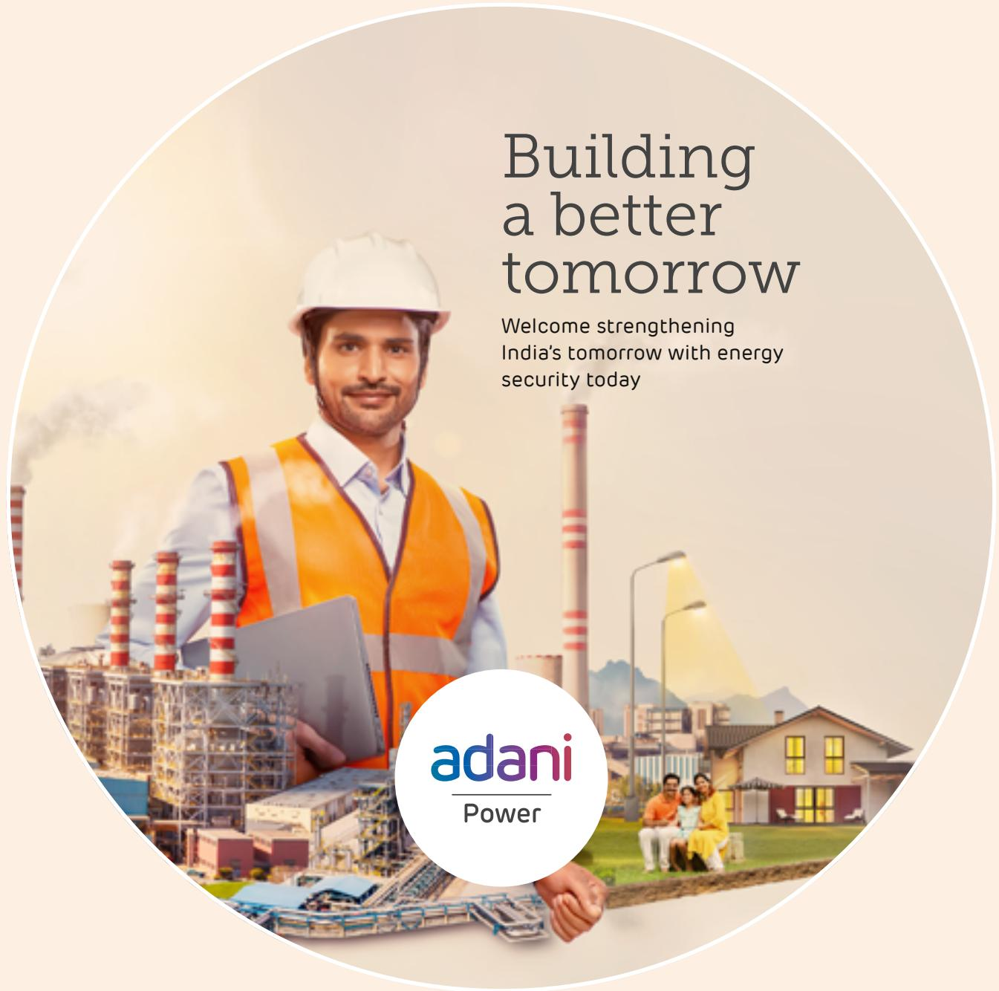

text_image

Building
a better
tomorrow
Welcome strengthening
India's tomorrow with energy
security today
adani
Power   

# Forward-looking statement

Certain statements in this communication may be ‘forward-looking statements’ within the meaning of applicable laws and regulations. These forward-looking statements involve a number of risks, uncertainties and other factors that could cause actual results to differ materially from those suggested by the forward-looking statements. Important developments that could affect the Company’s operations include changes in the industry structure, significant changes in political and economic environments in India and overseas, tax laws, import duties, litigation and labour relations. Adani Power Limited will not be in any way responsible for any action taken based on such statements and undertakes no obligation to publicly update these forward-looking statements to reflect subsequent events or circumstances.

# Building a Better Tomorrow

The Adani Group’s Annual Report for the year 2022-23 presents a growth narrative powered by sustainable infrastructure and building a better future for the world around sustainable practices.

This positioning reflects our Chairman’s vision of long-term growth. From humble origins, the Adani Group has evolved into India’s largest infrastructure platform (outside of the government) with a focus on

renewable energy and sustainable development.

The Group’s efforts have also contributed to the formulation of policies that offer renewable power options to consumers across India, making it available, affordable and accessible.

This Annual Report emphasises the overarching theme of sustainability, adaptability, and climate resilience, which underpins the Adani Group’s narrative of long-term growth. The report highlights specific

achievements, showcasing the overall portfolio growth and the progress of individual companies within the Group.

This Annual Report 2022-23 presents a compelling ‘Building a better tomorrow’ theme through sustainability, adaptability, climate resilience, and community development.

Through these attributes, the Group has positioned itself as a leader in driving positive change and creating a better tomorrow for all its stakeholders.

# Contents

# Part 1: What we are and what we do

4 Corporate Snapshot   
8 Adani Power at a glance

# Part 2: Adani Power. Positioned to build a better tomorrow

15 APL. Building a Better tomorrow by catalysing the Indian economy

# Part 3: Perspectives of our management

22 The Adani profile   
32 Chairman’s Message   
36 Managing Director’s Communique   
40 CEO’S Communique

# Part-4: How APL has built a culture of excellence

48 Adani Power. A sectorial benchmark in terms of asset sophistication and operating efficiency

54 APL. Building robust value drivers, enhancing stakeholder value   
57 How we are building a better tomorrow through the acquisition and turnaround of financially stressed power plants   
59 Adani Power’s culture of operation and maintenance excellence   
76 Our fuel management and logistics excellence   
78 How we have deepened a culture of technological excellence at Adani Power   
81 How APL strengthened data privacy and cyber risk management   
84 How we are building a great team at Adani Power

# Part-5: Seeding responsibility in profitability

92 How we deepened our environment responsiveness at Adani Power

98 Adani Power: Committed to the complete safety of its people, plants and communities   
102 Empowering communities: Adani Power’s commitment to corporate social responsibility

# Statutory section

113 Management discussion and analysis   
121 Company Information   
122 Director’s report and annexures   
144 Corporate Governance Report   
178 Business Responsibility and Sustainability Report

# Financial statements

221 Standalone Financial Statements   
324 Consolidated Financial Statements   
424 AGM Notice

# Building a better tomorrow

At Adani Power Limited, we are engaged in a business that empowers lives.

We facilitate national growth – individual, commercial and industrial – through the ability to generate power reliably and affordably.

We are engaged in building a better tomorrow through strategically-targeted capacity addition, technology adoption and environmental consciousness.

The company’s operations are marked by a reliable, always-available power supply to some of India’s largest power markets and growth centres.

By reconciling the needs of the consumer, environment, country and other stakeholders, the company is building a better tomorrow.

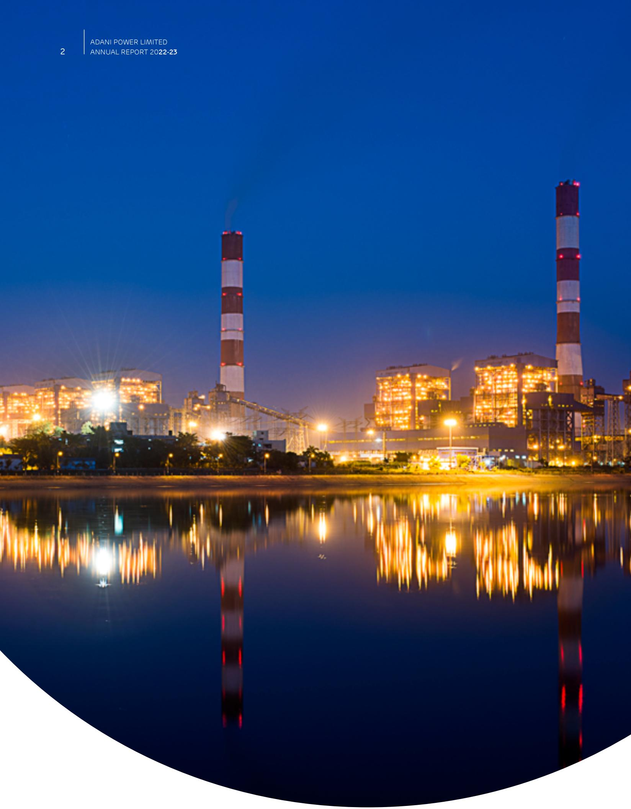

text_image

ADANI POWER LIMITED
ANNUAL REPORT 2022-23

PART 1

# What we are and what we do

C O R P O R AT E S N A P S H O T

Adani Power Limited.

The company is ensuring reliable power supply across the areas of its presence in India.

It is making proactive investments in advanced technologies, sustainability, and safety.

By underlining its commitment to reliability and sustainability, the company is building a better tomorrow.

# Our ethos

text_image

Values

Courage: We shall embrace new ideas and business

Trust: We shall believe in our employees and other stakeholders

Commitment: We shall stand by our promises and adhere to high standards of business

text_image

Culture

Passion: Performing with enthusiasm and energy, demonstrating a deep sense of dedication and commitment.

Results: Consistently achieving goals and delivering on targets, focusing on driving performance and excellence.

Integration: Working collaboratively across functions and businesses to create synergies, fostering a culture of teamwork and cooperation.

Dedication: Working with unwavering commitment in the pursuit of company objectives, displaying loyalty and perseverance.

Entrepreneurship: Embracing a proactive mindset, seizing new opportunities and taking ownership of initiatives to drive innovation and growth.

# Background

Adani Power Limited is the largest private sector thermal power producer in India. Its inception dates back to 2006 when it embarked on the ambitious endeavor of establishing its first power plant in Mundra, Gujarat. Currently, the company accounts for a substantial power generation capacity of 15250 MW.

# The Adani Group

The Adani Group is a prominent Indian industrial conglomerate, encompassing multiple businesses across seven publicly traded companies. Headquartered in Ahmedabad, Gujarat, the Adani Group is recognised for its robust transport and utilities infrastructure, contributing significantly to the regions where it operates. The Adani Group holds a 74.97% equity stake in Adani Power Limited.

The Group’s leadership position in transport, logistics, and energy utilities is a testament to its operations and services in line with global standards. The Adani Group is the sole Infrastructure Investment Grade issuer in India (across four companies). It is committed to the principles of ‘Nation building’ and ‘Growth with Goodness,’ which encompass sustainable

growth, value creation, credible ESG (Environmental, Social, and Governance) footprint and responsible community engagement.

# Presence

Adani Power Limited operates its thermal power plants across multiple states in India, including Gujarat, Maharashtra, Karnataka, Rajasthan, Chhattisgarh, Jharkhand and Madhya Pradesh. The company’s solar power unit is situated in Gujarat.

# Responsible

The Company received carbon credits as the world’s first coalbased thermal power project recognised by the United Nations Framework Convention on Climate Change (UNFCCC). It pioneered the construction of a coal-based supercritical thermal power project under the Clean Development Mechanism of the Kyoto Protocol. The company was the first to deploy the cuttingedge supercritical technology in India and among the first to use state-of-the-art technology in the recently constructed 1,600- MW ultra-supercritical thermal power project (USTCPP) in Godda, Jharkhand.

# The visibility

The Adani Group, comprises 10 publicly traded companies.

# The positioning

The Adani Group has established itself as a prominent leader in India’s transport logistics and energy utility sectors. With a focus on substantial infrastructure development, the Group maintains operations and maintenance practices that adhere to global standards. This commitment highlights the Group’s dedication to delivering quality services and national contribution.

# Capacity expansion

As of 31st March, 2023, APL was engaged in setting up new thermal power generation projects, aiming to achieve a total capacity of 16.85 GW by June 2027. This involves commissioning of 1.6 GW additional capacity by June 2023 and 1.6 GW by June 2027. Of this, one 800MW unit of the Godda USTCPP was been commissioned in April 2023, and the second unit awaits commissioning; its Mahan Phase-II expansion project with a capacity of 1600 MW is expected to soon commence execution.

# Credit rating

India Ratings and CRISIL Ratings have assigned Ind A/Positive and CRISIL A/Stable credit ratings to the combined debt facilities of APL following its amalgamation with six of its operating subsidiaries.

# Awards and recognition

ƒ Mundra, Kawai and Udupi stations received Performance Excellence Award in Ramkrishna Bajaj National Quality Award (RBNQA)-2022 in the Manufacturing category under the initiative of Adani Business Excellence Model (ABEM).

Mundra station achieved the ‘Five Star Rating’ from British Safety Council.   
ƒ The Udupi station received recognition as Innovative Power Technology of the year 2022 by Asian Power Awards Committee for the project on robotic desilting of the sea water pipeline.   
Raigarh power station received 5S Certificate from Quality Circle Forum of India.   
APL received a B score for fulfilling climate change and water security commitments from CDP (Carbon Disclosure Project) for 2022, signifying that it is taking coordinated action on climate issues.   
APL achieved a score of 3.5/5.0 in FTSE ESG rating, as compared to the world utilities average score of 2.7/5.0, and a score of 54/100 in Corporate Sustainability Assessment (CSA) by S&P Global, as compared to world electric utilities average of 33/100.

Operating subsidiaries 

<table><tr><td>Name of the entity</td><td>Subsidiary / Associate / Joint Venture</td><td>% shareholding by APL</td></tr><tr><td>Mahan Energen Limited (formerly Essar Power MP Limited)</td><td>Subsidiary</td><td>100</td></tr><tr><td>Adani Power (Jharkhand) Limited started commercial operations in April 2023</td><td>Subsidiary</td><td>100</td></tr></table>

Our power generation assets: Scale and locations 

<table><tr><td>Location</td><td>Status</td><td>Category</td><td>Technology</td><td>Total capacity (MW)</td></tr><tr><td rowspan="2">Mundra, Gujarat</td><td rowspan="2">Operational</td><td rowspan="2">Coastal</td><td>Sub-critical</td><td>1,320 (4x330)</td></tr><tr><td>Super-critical</td><td>3,300 (5x660)</td></tr><tr><td>Tiroda, Maharashtra</td><td>Operational</td><td>Near pithead</td><td>Supercritical</td><td>3,300 (5x660)</td></tr><tr><td>Kawai, Rajasthan</td><td>Operational</td><td>Hinterland</td><td>Supercritical</td><td>1,320 (2x660)</td></tr><tr><td>Udupi, Karnataka</td><td>Operational</td><td>Coastal; Utility</td><td>Sub-critical</td><td>1,200 (2x600)</td></tr><tr><td>Raipur, Chhattisgarh</td><td>Operational</td><td>Near pithead</td><td>Supercritical</td><td>1,370 (2x685)</td></tr><tr><td>Raigarh, Chhattisgarh</td><td>Operational</td><td>Near pithead</td><td>Sub-critical</td><td>600 (1x600)</td></tr><tr><td>Singrauli, Madhya Pradesh</td><td>Operational</td><td>Near pithead</td><td>Sub-critical</td><td>1,200 (2x600)</td></tr><tr><td>Bitta, Gujarat</td><td>Operational</td><td>Solar</td><td>Photovoltaic</td><td>40</td></tr><tr><td>Godda, Jharkhand</td><td>Operational*</td><td>Hinterland (export)</td><td>Ultra- Supercritical</td><td>1,600 (2x800)</td></tr><tr><td>Singrauli expansion, Madhya Pradesh</td><td>Upcoming</td><td>Near pithead</td><td>Ultra-supercritical</td><td>1600 MW (2X800)</td></tr></table>

FSA: Fuel Supply Agreement   
\* One unit of 800 MW commissioned in April 2023

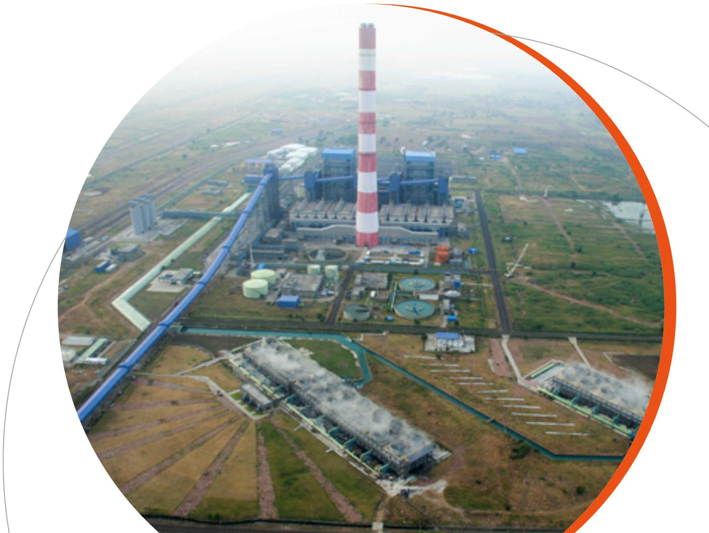

natural_image

Aerial view of a large industrial power plant with a tall red-and-white striped chimney, surrounded by green fields and water channels (no visible text or symbols)

# Adani Power at a glance

# Development

# Power generation capacity 16.85

GW, 14,450 MW operational as of April 2023 / 800 MW under commissioning / 1600 MW under development

# Largest private sector independent power producer

16 / 6

%, of India’s private/aggregate coal + lignite generation capacities

# Modern and sustainable fleet

74

%, Supercritical / Ultrasupercritical units out of the total capacity, resulting in lower GHG emissions

# Operational

# Sustainability

2.31

m3/MWh, water consumption

\~34% less water consumption for FY 2022-23 as against the statutory limit of 3.5 m3/MWh for fresh water-based thermal power plants

# Reliability

94

%, plant availability in FY 2022-23

# Fuel security

85

% of domestic fuel requirements secured through long-term / medium-term fuel supply agreements (including Mahan Phase-II)

# Value creation

# Revenue Visibility 85

% of the current and upcoming capacity secured through longterm / medium-term power purchase agreements (including Godda and Mahan Phase-II)

# Coal sourcing and logistics

54

MTPA annual coal handling capacity

# Revenues

43,041

H Crore, FY 2022- 2

# EBITDA margin

33

%, FY 2022-23

# Environment

# Ash utilisation

100

%, utilisation of ash generated by power plants at the aggregate level

# Team

3155

Employees

# Our performance snapshot, FY 2022-23

# Operations

APL achieved an average Plant Load Factor (PLF) of 47.9% compared to 51.5% in the previous year.   
Aggregate sales volume was 53.39 Billion units (BU) with an installed capacity of 13,650 MW, compared to 52.27 BU with an installed capacity of 12,450 MW in the previous year.

# Strategy

ƒ Consequent to the approval of the Scheme of Amalgamation by Honourable NCLT and fulfilment of the conditions precedent thereto, six operating subsidiaries of APL, viz. Adani Power Maharashtra Limited (APML), Adani Power Rajasthan Limited (APRL), Adani Power (Mundra) Limited (APMuL), Udupi Power Corporation Limited (UPCL), Raipur Energen Limited (REL), and Raigarh Energy Generation Limited (REGL) have been amalgamated with the

Holding Company, i.e. APL, with effect from 1st October, 2021.

Achieved satisfactory closure of virtually all outstanding regulatory issues, and recovered substantial amounts of regulatory receivables from DISCOMs, along with carrying costs and late payment surcharges. The resultant cash surplus was utilised to improve the Company’s financial health and partfinance growth initiatives.   
Achieved the operational and financial turnaround of MEL in the first year of its operation post-acquisition.

# Finance

Reported consolidated revenues that were 35.8% higher at H43,041 Crore compared to H31,686 Crore in the previous year.   
Reported consolidated earnings before interest, taxes, depreciation, and

amortisation (EBITDA) grew by 3.8% to H14,312 Crore compared to H13,789 Crore in the previous year, due to higher tariff realisation and one-time revenue recognition.

Reported profit after tax of H10,727 Crore compared to H4,912 Crore in the previous year, owing to certain reversals consequent to the Scheme of Amalgamation becoming effective.   
Prepaid the entire outstanding term debt of the erstwhile subsidiary APRL (since amalgamated with APL) by utilising cash flows received from regulatory recovery.   
Following the amalgamation, receipt of regulatory cash flows and their utilisation for the reduction of debt, CRISIL Ratings Limited and India Ratings Limited affirmed their credit rating of ‘CRISIL A/Stable’ and ‘Ind A/Positive’ respectively assigned to APL.

Financial highlights 

<table><tr><td>Particulars</td><td>FY18</td><td>FY19</td><td>FY20</td><td>FY21</td><td>FY22</td><td>FY23</td></tr><tr><td>Consolidated revenue (₹ Crore)</td><td>21,093</td><td>26,362</td><td>27,842</td><td>28,150</td><td>31,686</td><td>43,041</td></tr><tr><td>Consolidated EBITDA (₹ Crore)</td><td>6,190</td><td>7,431</td><td>7,059</td><td>10,597</td><td>13,789</td><td>14,312</td></tr><tr><td>EBITDA margin (%)</td><td>29</td><td>28</td><td>25</td><td>38</td><td>44</td><td>33</td></tr><tr><td>Gross block (₹ Crore)</td><td>60,751</td><td>62,005</td><td>72,336</td><td>76,611</td><td>83,995</td><td>87,264</td></tr></table>

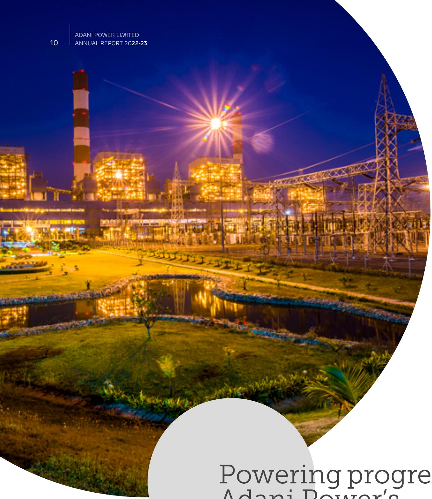

text_image

10
ADANI POWER LIMITED
ANNUAL REPORT 2022-23
Powering progre
Adani Power's

# Powering progress:

# Adani Power’s

# remarkable

# performance in

# FY 2022-23

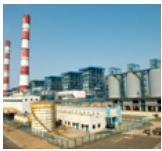

natural_image

Exterior view of an industrial plant with red-and-white striped smokestacks and storage tanks under a clear blue sky (no visible text or signage)

Coastal(4,620 MW)

Mundra, Gujarat

23%

Annual PLF

9.48

Billion units, Generation

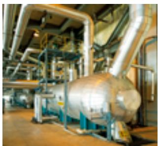

natural_image

Interior view of an industrial facility with large pipes and machinery (no visible text or symbols)

Coastal regulated utility (1,200 MW)

Udupi, Karnataka

13%

Annual PLF

1.41

Billion units, Generation

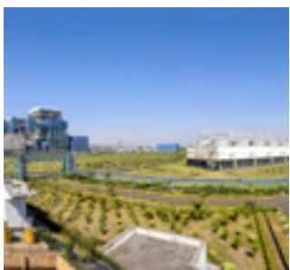

natural_image

Aerial view of a green agricultural field with modern buildings and distant industrial structures under a clear blue sky (no visible text or symbols)

Near pit head (3,300 MW)

Tiroda, Maharashtra

78%

Annual PLF

22.60

Billion units, Generation

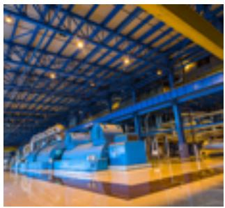

natural_image

Interior view of a large industrial factory with blue machinery and steel truss ceiling (no visible text or symbols)

Hinterland(1,320 MW)

Kawai, Rajasthan

77%

Annual PLF

8.92

Billion units, Generation

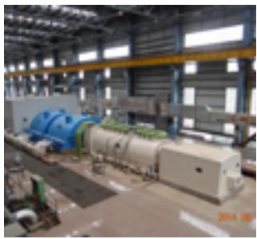

natural_image

Interior view of a large industrial facility with machinery and structural beams (no visible text or symbols)

Near-pit head (1,370 MW)

Raipur, Chhattisgarh

59%

Annual PLF

7.09

Billion units, Generation

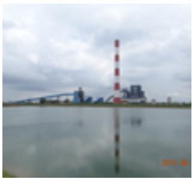

natural_image

Exterior view of a modern industrial complex with a red-and-white chimney and blue buildings reflected in water under cloudy sky (no signage or text visible)

Near-pit head (600 MW)

Raigarh, Chhattisgarh

76%

Annual PLF

3.97

Billion units, Generation

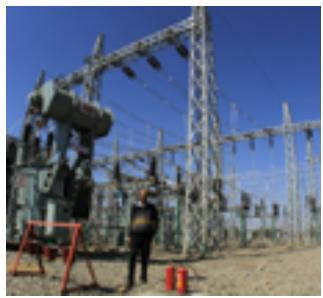

natural_image

Exterior view of a high-voltage substation with transmission towers and a person standing nearby (no signage or text visible)

Solar(40 MW)

Bitta Solar Power Plant (Kutch), Gujarat

17%

Annual PLF

0.06

Billion units, Generation

text_image

12
ADANI POWER LIMITED
ANNUAL REPORT 2022-23

PART 2

# Adani Power. Positioned to build a better tomorrow

F I R S T W O R D

# At Adani Power, our journey to a better tomorrow starts with two promises. power. Clean processes.

There cannot be a bigger customer orientation today than being in a business that enhances life quality in an environmentally responsible manner

# Overview

At Adani Power, we are engaged in a business that is expected to provide a building block for national prosperity.

We are in business to supply reliable power.

We are engaged in doing so in an environmentally responsible manner.

# Capacity

At Adani Power, we went into business to provide abundant power with the objective to eliminate power shortages and ensure that enhanced supply increased demand. We believed that this would provide the foundation for improved power infrastructure and adequate power availability to meet demand that helped catalyse India’s per capita power consumption towards the global average.

The result of this commitment is that Adani Power has emerged as India’s largest and efficient private thermal power producer in a short period.

# Environment responsibility

At Adani Power, we went into the business of conventional power generation with a commitment to invest in the most advanced technologies that improved resource efficiency, minimised wastage or emissions, and maximised reliability.

The result of this commitment is that Adani Power is deploying state-of-art and the cleanest technologies within the coal-based power generation sector.

Building a better tomorrow for all.

# APL. Building a Better tomorrow to catalyse the Indian economy

India is one of the most exciting global economies.

The country is building its infrastructure across sectors with unprecedented capital outlays.

At the Adani Group, we have built our various businesses around this national priority.

At Adani Power Limited, we are investing in India’s growth story through a structured approach.

One, we have built considerable thermal power capacity to address critical base load requirements necessary to address the large and continuous power needs of society.

Two, we have invested in the most advanced global technologies to reduce wastage, emissions, and discharges.

Three, we are acquiring strategically identified assets and turning them around with the objective to service the growing power needs of consumers.

Four, we have invested in forwardlooking initiatives to moderate the carbon footprint of our business through the projected use of clean resources that could make our company a sectorial benchmark.

In doing so, we are attractively placed to build a better tomorrow – for India and the world.

# Positioned for a Better Tomorrow

Responding to national policies to reduce emissions and carbon footprint

Building on its position as the largest private sector thermal power generator in India

Investing in the most sophisticated technologies with efficient operational outcomes

Leveraging the value of large power generating assets with low logistical costs

# APL. This is what we mean by ‘Building a better tomorrow’

# Building

We are confident of thermal power’s continuing importance in the years to come

We are making responsible investments today to address the needs of tomorrow

We are widening horizons by responding with speed to emerging opportunities

We are doing so with a complete ecological respect for sites and their hinterlands

We are investing in the most advanced digital and automation technologies

We are committed to moderate the gestation between investment and returns

We are continuously rethinking strategies to stay ahead of our industry curve

We are building national infrastructure lifelines that take India ahead

# Better

Emergence of an economically vibrant India

Emergence and use of superior generating technologies

Emergence of a competitive India

Emergence of an accelerating India

Emergence of universal access to power

# Tomorrow

We are building our business to deepen our positioning as a responsible global citizen

We are building our business to enhance India’s competitiveness in a modern world

We are building to moderate cost per unit of power delivered, enhancing affordability

We are building so that our net outcome enriches livelihoods and enhances prosperity

We are building so that the net outcome of our business enhances safety for all our stakeholders

We are building with the objective to deliver positive financial outcomes at scale, strengthening reinvestments and business sustainability

# How Adani Group businesses are building for a better tomorrow for India

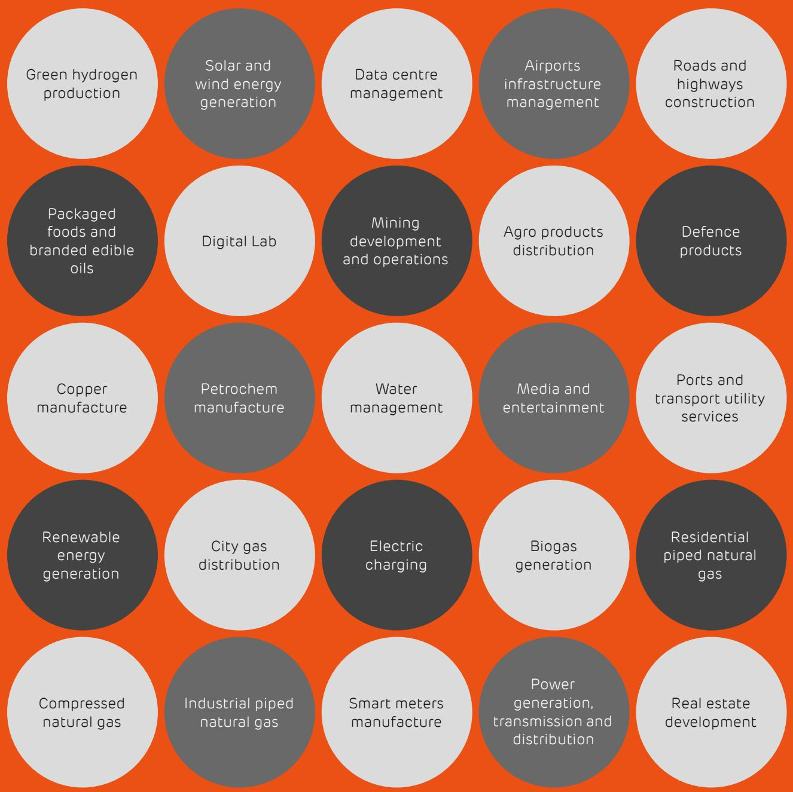

bubble

| Sector | Category |
| --- | --- |
| Green hydrogen production | 100 |
| Solar and wind energy generation | 100 |
| Data centre management | 100 |
| Airports infrastructure management | 100 |
| Roads and highways construction | 100 |
| Packaged foods and branded edible oils | 100 |
| Digital Lab | 100 |
| Mining development and operations | 100 |
| Agro products distribution | 100 |
| Defence products | 100 |
| Copper manufacture | 100 |
| Petrochem manufacture | 100 |
| Water management | 100 |
| Media and entertainment | 100 |
| Ports and transport utility services | 100 |
| Renewable energy generation | 100 |
| City gas distribution | 100 |
| Electric charging | 100 |
| Biogas generation | 100 |
| Residential piped natural gas | 100 |
| Compressed natural gas | 100 |
| Industrial piped natural gas | 100 |
| Smart meters manufacture | 100 |
| Power generation, transmission and distribution | 100 |
| Real estate development | 100 |

# This is a picture of tomorrow’s India

India is projected to emerge as a USD 26 trillion economy by 2047

India’s retail industry (USD 2 trn, 2032) is likely to become the top three in demand growth

India is likely to emerge as the third-largest economy by 2030

Indian households are likely to grow from 289 million in 2020 to 354 million by 2030

Indian household income is expected to rise 40% by 2030

India is likely to continue to be the youngest country.

# India’s projected population is 1.51 Billion by 2030

India’s bilateral trade agreements are expected to increase with developed countries

India’s working-age population like to reach 1 Billion by 2030

India is likely to attract total FDI of USD 475 Billion by 2027

text_image

ADANI POWER LIMITED
ANNUAL REPORT 2022-23
20
ADANI POWER LIMITED
ANNUAL REPORT 2022-23

PART 3

# Perspectives of our management

T H E A D A N I P O R T F O L I O O F C O M PA N I E S

# The multi-business Adani portfolio of companies is one of the most dynamic industrial conglomerates in India.

Vision: To be a world-class leader in businesses that enrich lives and contribute to nations in building infrastructure through sustainable value creation.

Values

Courage: We shall embrace new ideas and businesses

Trust: We shall believe in our employees and other stakeholders

Commitment: We shall stand by our promises and adhere to high standards of business

Engaged in nation building

Enhancing stakeholder value

Enriching communities of its presence

# Culture

# Passion

Performing with enthusiasm and energy

# Results

Consistently achieving goals

# Integration

Working across functions and businesses to create synergies

# Dedication

Working with commitment in the pursuit of our aims

# Entrepreneurship

Seizing new opportunities with initiatives and ownership

# The promoter

The Adani portfolio of companies has been promoted by the visionary industrialist Mr. Gautam Adani. The Adani portfolio of companies was founded by Mr. Gautam Adani in 1988 with a commodity trading business under the flagship company Adani Enterprises Limited (previously Adani Exports Limited).

# The Adani portfolio of companies

Headquartered in Ahmedabad, India, the Adani portfolio of companies comprises the largest and fastest-growing portfolio of diversified businesses in India with interests in Logistics (seaports, airports, logistics, shipping and rail), Resources, Power Generation, Transmission & Distribution, Renewable Energy, Gas & Infrastructure, Agro (commodities, edible oil, food products, cold storage and grain silos), Real Estate, Public Transport Infrastructure, Cement, Media, Defence & Aerospace, Mining Services, Copper, Petrochemicals, Data Centre and other sectors.

# The scale

Most Adani portfolio businesses are among the

largest in India, marked by attractive economies of scale.

Adani Ports and Special Economic Zone Limited is the largest private sector port operator in India.

Adani Green Energy Limited is among the largest renewable energy businesses in the world.

Adani Transmission Limited is the largest private sector transmission and distribution company in India.

Adani Total Gas Limited is the largest city gas distribution business in India.

Ambuja Cement (with subsidiary ACC Limited) is the second largest cement manufacturer of India and an iconic cement brand.

Adani Enterprise Limited is India’s largest business incubation company.

Adani Power Limited is the largest private sector thermal power producer in India.

Adani Wilmar Limited holds the position of being India’s largest edible oil brand.

NDTV Limited is among India’s most trusted media companies.

# The visibility

The Adani portfolio comprises ten publicly traded companies.

# The positioning

The Adani portfolio of companies has positioned itself as a leader in the transport logistics and energy utility portfolio businesses in India. This portfolio of companies has focused on sizable infrastructure development in India with operations and maintenance (O&M) practices benchmarked to global standards.

# The core philosophy

The core philosophy of the Adani portfolio of companies is ‘Growth with Goodness’, its beacon for sustainable growth. The Adani portfolio of companies is committed to widening its ESG footprint with an emphasis on climate protection and increasing community outreach through CSR programmes woven around sustainability, diversity and shared values.

# The credibility

The Adani portfolio of companies comprises four IG-rated businesses and is the only Infrastructure Investment Grade bond issuer from India.

# Adani: A world-class infrastructure & utility portfolio

# adani

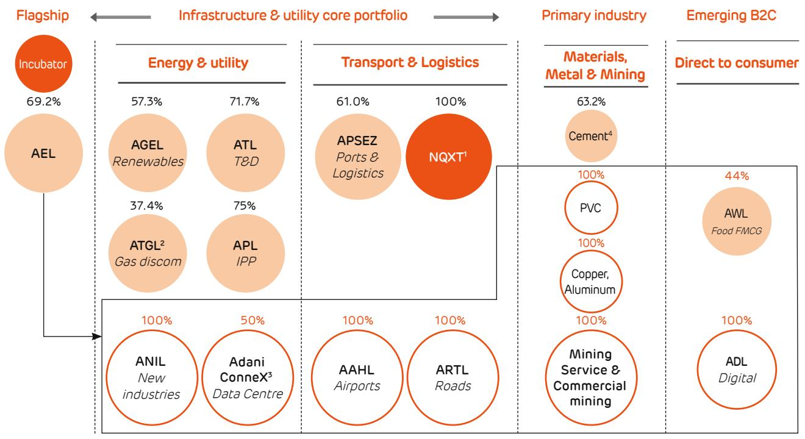

other

| Category | Sub-category | Value |
| -------- | ----------- | ----- |
| Flagship | Incubator | 69.2% |
| Flagship | AEL | - |
| Infrastructure & utility core portfolio | Energy & utility | 57.3% |
| Infrastructure & utility core portfolio | APSEZ | 61.0% |
| Infrastructure & utility core portfolio | NQXT¹ | 100% |
| Infrastructure & utility core portfolio | Energy & utility | 71.7% |
| Infrastructure & utility core portfolio | Energy & utility | 37.4% |
| Infrastructure & utility core portfolio | Energy & utility | 75% |
| Infrastructure & utility core portfolio | Energy & utility | - |
| Infrastructure & utility core portfolio | Transport & Logistics | - |
| Infrastructure & utility core portfolio | Transport & Logistics | 61.0% |
| Infrastructure & utility core portfolio | Transport & Logistics | 100% |
| Infrastructure & utility core portfolio | Transport & Logistics | - |
| Infrastructure & utility core portfolio | Transport & Logistics | - |
| Infrastructure & utility core portfolio | Transport & Logistics | - |
| Infrastructure & utility core portfolio | Transport & Logistics | - |
| Infrastructure & utility core portfolio | Transport & Logistics | - |
| Infrastructure & utility core portfolio | Transport & Logistics | - |
| Infrastructure & utility core portfolio | Transport & Logistics | - |
| Infrastructure & utility core portfolio | Transport & Logistics | - |
| Infrastructure & utility core portfolio | Transportation & Logistics | - |
| Infrastructure & utility core portfolio | Transportation & Logistics | - |
| Infrastructure & utility core portfolio | Transportation & Logistics | - |
| Infrastructure & utility core portfolio | Transportation & Logistics | - |
| Infrastructure & utility core portfolio | Transportation & Logistics | - |
| Infrastructure & utility core portfolio | Transportation & Logistics | - |
| Infrastructure & utility core portfolio | Transportation & Logistics | - |
| Infrastructure & utility core portfolio | Transportation & Logistics | - |
| Infrastructure & Utility Core Portfolio | Energy & utility | - |
| Infrastructure & Utility Core Portfolio | Energy & utility | - |
| Infrastructure & Utility Core Portfolio | Energy & utility | - |
| Infrastructure & Utility Core Portfolio | Energy & utility | - |
| Infrastructure & Utility Core Portfolio | Energy & utility | - |
| Infrastructure & Utility Core Portfolio | Energy & utility | - |
| Infrastructure & Utility Core Portfolio | Energy & utility | - |
| Infrastructure & Utility Core Portfolio | Energy & utility | - |
| Infrastructure & Utility Core Portionary Core Portfolio / Primary Industry / Direct to consumer / Emerging B2C / Emerging B2C / Emerging B2C / Emerging B2C / Emerging B2C / Emerging B2C / Emerging B2C / Emerging B2C / Emerging B2C / Emerging B2C / Emerging B2C / Emerging B2C / Emerging B2C / Emerging B2C / Emerging B2C / Emerging B2C / Emerging B2C / Emerging B2C / Emerging B2C / Emerging B2C / Emerging B2 C / Emerging B2C / Emerging B2C / Emerging B2C / Emerging B2C / Emerging B2C / Emerging B2C / Emerging B2C / Emerging B2C / Emerging B2C / Emerging B2C / Emerging B2C / Emerging B2C / Emerging B2C / Emerging B2C / Emerging B2C / Emerging B2C / Emerging B2C / Emerging B2C / Emerging B2C / Emerging B2B / Emerging B2C / Emerging B2C / Emerging B2C / Emerging B2C / Emerging B2C / Emerging B2C / Emerging B2C / Emerging B2C / Emerging B2C / Emerging B2C / Emerging B2C / Emerging B2C / Emerging B2C / Emerging B2C / Emerging B2C / Emerging B2C / Emerging B2C / Emerging B2C / Emerging B2C / Emerging B2(1) / Emerging B2C / Emerging B2C / Emerging B2C / Emerging B2C / Emerging B2C / Emerging B2C / Emerging B2C / Emerging B2C / Emerging B2C / Emerging B2C / Emerging B2C / Emerging B2C / Emerging B2C / Emerging B2C / Emerging B2C / Emerging B2C / Emerging B2C / Emerging B2C / Emerging B2C / Emerging B2A/B Digital
| Transportation & Logistics | Power Generation (AGEL Renewables) | 57.3% |
| Transportation & Logistics | Power Generation (ATGL² Gas discom) | 37.4% |
| Transportation & Logistics | Power Generation (APL IPP) | 75% |
| Transportation & Logistics | Power Generation (NQXT¹) | 100% |
| Transportation & Logistics | Power Generation (APSEZ Ports & Logistics) | 61.0% |
| Transportation & Logistics | Power Generation (NQXT¹) | 100% |
| Transportation & Logistics | Power Generation (NQXT¹) | 100% |
| Transportation & Logistics | Power Generation (ANIL New industries) | 100% |
| Transportation & Logistics | Power Generation (Adani ConneX³ Data Centre) | 50% |
| Transportation & Logistics | Power Generation (AAHL Airports) | 100% |
| Transportation & Logistics | Power Generation (ARTL Roads) | 100% |
| Transportation & Logistics | Power Generation (MAH Road) | 100% |
| Transportation & Logistics | Power Generation (Minesq Service & Commercial mining) | 100% |
| Transportation & Logistics | Power Generation (PVC Aluminum) | 100% |
| Transportation & Logistics | Power Generation (Mining Service & Commercial mining) | 100% |
| Transportation & Logistics | Power Generation (AWL Food FMCG) | 100% |
| Transportation & Logistics | Power Generation (ADL Digital) | 100% |
| Materials, Metal & Mining (Cement⁴) | Materials, Metal & Mining (63.2%) | 63.2% |
| Materials, Metal & Mining (PVC Aluminum) | Materials, Metal & Mining (100%) | 100% |
| Materials, Metal & Mining (Copper, Aluminum) | Materials, Metal & Mining (100%) | 100% |
| Materials, Metal & Mining (Mining Service, Commercial mining) | Materials, Metal & Mining (100%) | 100% |
| Materials, Metal & Mining (Direct to consumer) (AWL Food FMCG) | Materials, Metal & Mining (44%) | - |
| Materials, Metal & Mining (Direct to consumer) (ADL Digital) | Materials, Metal & Mining (100%) | - |
| Materials, Metal & Mining (Direct to consumer) (AWL Food FMCG) | Materials, Metal & Mining (100%) | - |
| Materials, Metal & Mining (Direct to consumer) (ADL Digital) | Materials, Metal & Mining (100%) | - |
| Materials, Metal & Mining (Direct to consumer) (AWL Food FMCG) | Materials, Metal & Mining (100%) | - |
| Materials, Metal & Mining (Direct to consumer) (ADL Digital) | Materials, Metal & Mining (100%) | - |
| Materials, Metals, Mining (Cement⁴) | Materials, Metals, Mining (63.2%) | - |
| Materials, Metals, Mining (PVC Aluminum) | Materials, Metals, Mining (100%) | - |
| Materials, Metals, Mining (Copper, Aluminum) | Materials, Metals, Mining (100%) | - |
| Materials, Metals, Mining (Mining Service, Commercial mining) | Materials, Metals, Mining (100%) | - |
| Materials, Metals, Mining (Direct to consumer) (AWL Food FMCG) | Materials, Metals, Mining (44%) | - |
| Materials, Metals, Mining (Direct to consumer) (ADL Digital) | Materials, Metals, Mining (100%) | - |
| Materials, Metals, Mining (Direct to consumer) (AWL Food FMCG) | Materials, Metals, Mining (100%) | - |
| Materials, Metals, Mining (Direct to consumer) (ADL Digital) | Materials, Metals, Mining (100%) | - |
| Materials, Metals, Mining (Direct to consumer) (AWL Food FMCG) | Materials, Metals, Mining (100%) | - |
| Materials, Metals, Mining (Direct to consumer) (ADL Digital) | Materials, Metals, Mining (100%) | - |
| Materials, Coal Products and Energy Production Core Portfolio / Primary Industry / Direct to Consumer Industrial Consumption of Energy and Utility Industry Core Portfolio / Primary Industry / Direct to Consumer Industrial Consumption of Energy and Utility Industry Core Portfolio / Primary Industry / Direct to Consumer Industrial Consumption of Energy and Utility Industry Core Portfolio / Primary Industry / Direct to Consumer Industrial Consumption of Energy and Utility Industry Core Portfolio / Primary Industry / Direct to Consumer Industrial Consumption of Energy and Utility Industry Core Portfolio / Primary Industry / Direct to Consumer Industrial Consumption of Energy and Utility Industry Core Portfolio / Primary Industry / Direct to Consumer Industrial Consumption of Energy and Utility Industry Core Portfolio / Natural Gas Production and Energy Production Core Portfolio / Natural Gas Production and Energy Production Core Portfolio / Natural Gas Production and Energy Production Core Portfolio / Natural Gas Production and Energy Production Core Portfolio / Natural Gas Production and Energy Production Core Portfolio / Natural Gas Production and Energy Production Core Portfolio / Natural Gas Production and Energy Production Core Portfolio / Natural Gas Production and Energy Production Core Portfolio / Natural Gas Production and Energy Production Core Portfolio / Natural Gas Production and Energy Production Core Portfolio / Natural Gas Production and Energy Production Core Portfolio / Natural Gas Production and Energy ProductionCore Portfolio / Natural Gas Production and Energy ProductionCore Portfolio / Natural Gas Production and Energy ProductionCore Portfolio / Natural Gas Production and Energy ProductionCore Portfolio / Natural Gas Production and Energy ProductionCore Portfolio / Natural Gas Production and Energy ProductionCore Portfolio / Natural Gas Production and Energy ProductionCore Portfolio / Natural Gas Production and Energy ProductionCore Portfolio / Natural Gas Production and Energy ProductionCore Portfolio / Natural Gas Production and Energy ProductionCore Portfolio / Natural Gas Production and Energy ProductionCore Portfolio / Natural Gas Production and Energy ProductionCorePortfolio / Natural Gas Production and Energy ProductionCore Portfolio / Natural Gas Production and Energy ProductionCore Portfolio / Natural Gas Production and Energy ProductionCore Portfolio / Natural Gas Production and Energy ProductionCore Portfolio / Natural Gas Production and Energy ProductionCore Portfolio / Natural Gas Production and Energy ProductionCore Portfolio / Natural Gas Production and Energy ProductionCore Portfolio / Natural Gas Production and Energy ProductionCore Portfolio / Natural Gas Production and Energy ProductionCore Portfolio / Natural Gas Production and Energy ProductionCore Portfolio / Natural Gas Production and Energy ProductionCore Portfolio/ Natural Gas Production and Energy ProductionCore Portfolio/ Natural Gas Production and Energy ProductionCore Portfolio/ Natural Gas Production and Energy ProductionCore Portfolio/ Natural Gas Production and Energy ProductionCore Portfolio/ Natural Gas Production and Energy ProductionCore Portfolio/ Natural Gas Production and Energy ProductionCore Portfolio/ Natural Gas Production and Energy ProductionCore Portfolio/ Natural Gas Production and Energy ProductionCore Portfolio/ Natural Gas Production and Energy ProductionCore Portfolio/ Natural Gas Production and Energy ProductionCore Portfolio/ Natural Gas Production and Energy ProductionCore Portfolio/ National Gas Production and Energy ProductionCore Portfolio/ National Gas Production and Energy ProductionCore Portfolio/ National Gas Production and Energy ProductionCore Portfolio/ National Gas Production and Energy ProductionCore Portfolio/ National Gas Production and Energy ProductionCore Portfolio/ National Gas Production and Energy ProductionCore Portfolio/ National Gas Production and Energy ProductionCore Portfolio/ National Gas Production and Energy ProductionCore Portfolio/ National Gas Production and Energy ProductionCore Portfolio/ National Gas Production and Energy ProductionCore Portfolio/ National Gas Production and Energy ProductionCore Portfolio/ National GAS production and energy production; Agricultural Resources Development Project; Agricultural Resources Development Project; Agricultural Resources Development Project; Agricultural Resources Development Project; Agricultural Resources Development Project; Agricultural Resources Development Project; Agricultural Resources Development Project; Agricultural Resources Development Project; Agricultural Resources Development Project; Agricultural Resources Development Project; Agricultural Resources Development Project; Agricultural Resources Development Project; Agricultural Resources Development Project; Agricultural Resources Development Project; Agricultural Resources Development Project; Agricultural Resources Development Project; Agricultural Resources Development Project; Agricultural Resources Development Project; Agricultural Resources Development Project; Agricultural Resources Development Project; Agricultural Resources Development Projects; Agricultural Resources Development Projects; Agricultural Resources Development Projects; Agricultural Resources Development Projects; Agricultural Resources Development Projects; Agricultural Resources Development Projects; Agricultural Resources Development Projects; Agricultural Resources Development Projects; Agricultural Resources Development Projects; Agricultural Resources Development Projects; Agricultural Resources Development Projects; Agricultural Resources Development Projects; Agricultural Resources Development Projects; Agricultural Resources Development Projects; Agricultural Resources Development Projects; Agricultural Resources Development Projects; Agricultural Resources Development Projects; Agricultural Resources Development Projects; Agricultural Resources Development Projects; Agricultural Resources Development Projects; Agricultural Resources Development Project; Agricultural Resources Development Projects; Agricultural Resources Development Projects; Agricultural Resources Development Projects; Agricultural Resources Development Projects; Agricultural Resources Development Projects; Agricultural Resources Development Projects; Agricultural Resources Development Projects; Agricultural Resources Development Projects; Agricultural Resources Development Projects; Agricultural Resources Development Projects; Agricultural Resources Development Projects; Agricultural Resources Development Projects; Agricultural Resources Development Projects; Agricultural Resources Development Projects; Agricultural Resources Development Projects; Agricultural Resources Development Projects; Agricultural Resources Development Projects; Agricultural Resources Development Projects; Agricultural Resources Development Project; Agricultural Resources Development Project; Agricultural Resources Development Projects; Agricultural Resources Development Projects; Agricultural Resources Development Projects; Agricultural Resources Development Projects; Agricultural Resources Development Projects; Agricultural Resources Development Projects; Agricultural Resources Development Projects; Agricultural Resources Development Projects; Agricultural Resources Development Projects; Agricultural Resources Development Projects; Agricultural Resources Development Projects; Agricultural Resources Development Projects; Agricultural Resources Development Projects; Agricultural Resources Development Projects; Agricultural Resources Development Projects; Agricultural Resources Development Projects; Agricultural Resources Development Projects; Agricultural Resources Development Project; Agricultural Resources Development Projects; Agricultural Resources Development Project; Agricultural Resources Development Projects; Agricultural Resources Development Projects; Agricultural Resources Development Projects; Agricultural Resources Development Projects; Agricultural Resources Development Projects; Agricultural Resources Development Projects; Agricultural Resources Development Projects; Agricultural Resources Development Projects; Agricultural Resources Development Projects; Agricultural Resources Development Projects; Agricultural Resources Development Projects; Agricultural Resources Development Projects; Agricultural Resources Development Projects; Agricultural Resources Development Projects; Agricultural Resources Development Projects; Agricultural Resources Development Projects; Agricultural Resources Development Projects; Agricultural Resources DevelopmentProjects: AEL from AEL in the flagship category.
Transporting, Transportation, Manufacturing, etc., Primary Industry or Alternative Industry or Alternative Industry or Alternative Industry or Alternative Industry or Alternative Industry or Alternative Industry or Alternative Industry or Alternative Industry or Alternative Industry or Alternative Industry or Alternative Industry or Alternative Industry or Alternative Industry or Alternative Industry or Alternative Industry or Alternative Industry or Alternative Industry or Alternative Industry or Alternative Industry or Alternative Industry or Alternative Industry or Alternative Industry or Alternative Industry or Alternative Industry or Alternative Industry or Alternative Industry or Alternative Industry or Alternative Industry or Alternative Industry or Alternative Industry or Alternative Industry or Alternative Industry or Alternative Industry or AlternativeIndustry or Alternative Industry or Alternative Industry or Alternative Industry or Alternative Industry or Alternative Industry or Alternative Industry or Alternative Industry or Alternative Industry or Alternative Industry or Alternative Industry or Alternative Industry or Alternative Industry or Alternative Industry or Alternative Industry or Alternative Industry or Alternative Industry or Alternative Industry or Alternative Industry or Alternative Industry or Alternative Industry or Alternative Industry or Alternative Industry or Alternative Industry or Alternative Industry or Alternative Industry or Alternative Industry or Alternative Industry or Alternative Industry or Alternative Industry or Alternative Industry or Alternative Industry or Alternative Industry or Alternative Industry of America's Food FMCGs: AEL from AEL in the flagship category.
Transporting, Transportation, Manufacturing, etc., Primary Industry or Alternative Industry or Alternative Industry or Alternative Industry or Alternative Industry or Alternative Industry or Alternative Industry or Alternative Industry or Alternative Industry or Alternative Industry or Alternative Industry or Alternative Industry or Alternative Industry or Alternative Industry or Alternative Industry or Alternative Industry or Alternative Industry or Alternative Industry or Alternative Industry or Alternative Industry or Alternative Industry or Alternative Industry or Alternative Industry or Alternative Industry or Alternative Industry or Alternative Industry or Traditional Agriculture Sector: AEL from AEL in the flagship category.
Transporting, Transportation, Manufacturing, etc., Primary Industry or Alternative Industry: AEL from AEL in the flagship category.
Transporting, Transportation, Manufacturing, etc., Primary Industry: AEL from AEL in the flagship category.
Transporting, Transportation, Manufacturing, etc., Primary Industry: AEL from AEL in the flagship category.
Transporting, Transportation, Manufacturing, etc., Primary Industry: AEL from AEL in the flagship category.
Transporting, Transportation, Manufacturing, etc., Primary Industry: AEL from AEL in the flagship category.
Transporting, Transportation, Manufacturing, etc., Primary Industry: AEL from AEL

# A multi-decade story of high growth centered around infrastructure and utility core

(%): Promoter equity stake in Adani Portfolio companies   
(%): AEL equity stake in its subsidiaries

Listed entities

1 NQXT: North Queensland Export Terminal | 2 ATGL: Adani Total Gas Limited, JV with TotalEnergies |   
3 Data center, JV with EdgeConnex | 4 Cement business includes 63.15% stake in Ambuja Cements Limited which in turn owns 50.05% in ACC Limited. Adani directly owns 6.64% stake in ACC Limited   
AEL: Adani Enterprises Limited; APSEZ: Adani Ports and Special Economic Zone Limited; ATL: Adani Transmission Limited; T&D: Transmission & Distribution; APL: Adani Power Limited; AGEL: Adani Green Energy Limited; AAHL: Adani Airport Holdings Limited; ARTL: Adani Roads Transport Limited; ANIL: Adani New Industries Limited; AWL: Adani Wilmar Limited; ADL: Adani Digital Limited; IPP: Independent Power Producer

# Adani portfolio of companies:

# Marked shift from B2B to B2C businesses

# ATGL

City gas distribution network to serve key geographies across India

# AEML

Electricity distribution network that powers Mumbai, India’s financial capital

# Adani Airports

Operates, manages and develops eight airports in India

# Ambuja Cements and ACC

India’s most trusted cement brands with a capacity of 67.5 million tonnes

# Adani Wilmar

Among India’s largest packaged foods companies comprising Fortune, India’s edible oil brand leader

Adani portfolio of companies: Locked-in infrastructure growth 

<table><tr><td>Transport &amp; logisticsAirports and Roads</td><td>Energy &amp; UtilityRenewables/Transmission&amp; Distribution/City Gas/ Power Generation</td><td>APSEZAdani Ports and Special Economic Zone Limited</td><td>NQXTNorth Queensland Export Terminal</td><td>ATMSPLAdani Tracks Management Services Pvt. Ltd.(formerly Sarguja Rail Corridor Pvt. Ltd.)</td></tr><tr><td>AAHLAdani Airports Holdings Ltd.</td><td>ATL/APL/AGEL/ATGLAdani Transmission / Adani Power / Adani Green Energy / Adani Total Gas</td><td>ANILAdani New Industries Limited (a green hydrogen ecosystem)</td><td>ARTL / AWLAdani Road Transport Limited / Adani Wilmar Ltd.</td><td>T&amp;D / IPPTransmission and Distribution / Independent Power Producer</td></tr></table>

# Adani portfolio of companies: Repeatable & proven transformation investment model

<table><tr><td></td><td>Phase</td><td colspan="2">Development</td><td>Operations</td><td>Post operations</td></tr><tr><td rowspan="2">Activity</td><td>Origination</td><td>Site development</td><td>Construction</td><td>Operation</td><td>Capital management</td></tr><tr><td>Analysis &amp; market intelligenceViability analysisStrategic value</td><td>Site acquisitionConcessions and regulatory agreementsInvestment case development</td><td>Engineering &amp; designSourcing &amp; quality levelsEquity &amp; debt funding at project level</td><td>Life cycle O&amp;M planningTechnology-enabled O&amp;M</td><td>Redesigning the capital structure of assetsOperational phase funding consistent with asset life</td></tr><tr><td rowspan="3">Performance</td><td>India&#x27;s largest commercial port (at Mundra)</td><td>Completed one of the longest private HVDC line (Mundra – Mahendragarh)</td><td>2,140 MW hybrid cluster operationalised in Rajasthan in FY 2022-23</td><td>Energy Network Operation CenterCentralised continuous plants monitoring across India on a cloud based platform</td><td>First GMTN of USD 2 Billion by an energy utility player in India and sustainability-linked bondAGEL tied up &#x27;Diversified Growth Capital&#x27; with a revolving facility of USD 1.64 Billion for fully funding its project pipelineIssuance of 20 and 10-year dual tranche bond of USD 750 millionGreen bond issuance of USD 750 million</td></tr><tr><td>Highest margin among peers</td><td>Highest line availability</td><td>India&#x27;s first and world&#x27;s largest solar-wind hybrid cluster</td><td>Centralised continuous monitoring of solar and wind plants across India on a cloud-based platform</td><td rowspan="2">Debt structure moving from PSU banks to bonds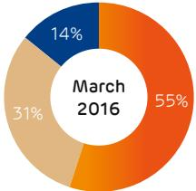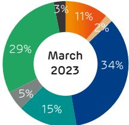PSU banksPrivate banksBondsNBFCs&amp; FIsDIIGlobal International BanksPSU-capex LC</td></tr><tr><td>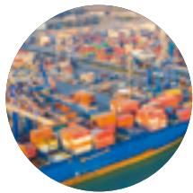</td><td>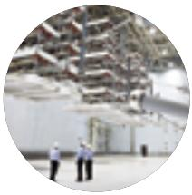</td><td>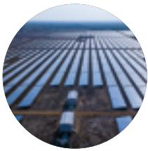</td><td></td></tr></table>

PSU banks Private banks Bonds NBFCs & FIs DII Global International Banks PSU-capex LC

# How Adani portfolio of companies performed in FY 2022-23

# EBIDTA (growth %)

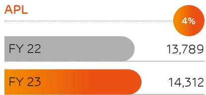

bar

APL
| Period | Value |
| :--- | :--- |
| FY 22 | 13,789 |
| FY 23 | 14,312 |
4%

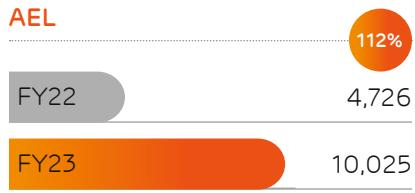

bar

AEL
| Period | Value |
| :--- | :--- |
| FY22 | 4,726 |
| FY23 | 10,025 |
| Percentage (%) | 112% |

Ambuja Cement, consolidating ACC 

<table><tr><td>FY22</td><td>NA</td></tr><tr><td>FY23</td><td>4,173</td></tr></table>

AWL 

<table><tr><td>FY22</td><td>1,736</td></tr><tr><td>FY23</td><td>1,661</td></tr></table>

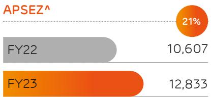

bar

APSEZ^
| Period | Value |
| :--- | :--- |
| FY22 | 10,607 |
| FY23 | 12,833 |
21%

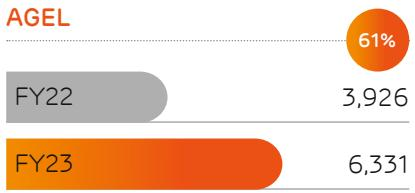

bar

AGEL
| Period | Value |
| :--- | :--- |
| FY22 | 3,926 |
| FY23 | 6,331 |
61%

# EBITDA

ƒ AEL EBITDA grew on the back of growth in the incubating businesses (Airports, Roads) and Integrated Resource Management   
ƒ APL EBITDA improved due to improved tariff realisations and higher prior period income recognition   
ƒ APSEZ EBITDA growth was on account of an increase in cargo volume, operational efficiency and cost restructuring   
ƒ ^APSEZ EBITDA excludes forex; APSEZ FY 2021-22 EBITDA excluded H210 Crore of SRCPL and GPL acquisition cost   
ƒ Ambuja Cement (consolidating ACC) changed its financial year end from December to March (figure for the current year is for 15 months and not

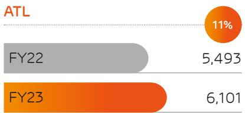

bar

ATL
| Period | Value |
| :--- | :--- |
| FY22 | 5,493 |
| FY23 | 6,101 |
11%

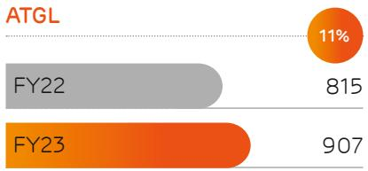

bar

ATGL
| Period | Value |
| :--- | :--- |
| FY22 | 815 |
| FY23 | 907 |
11%

comparable with the previous 12 months, ended 31st December, 2021   
ƒ Ambuja Cement (consolidating ACC) became a part of Adani portfolio following acquisition in September 2022   
ƒ ATGL EBITDA grew due to increased sales volume, coupled with an improvement in the operating margin and cost optimisation   
ƒ ATL EBIDTA grew on account of higher revenues in the transmission and distribution businesses   
ƒ AGEL's growth in EBITDA was supported by increased revenues and cost efficiencies brought in through analyticsdriven O&M

# PAT (growth %)

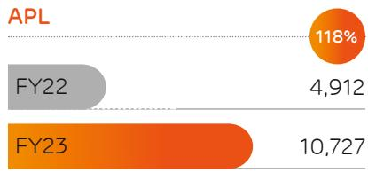

bar

APL
| Period | Value |
| :--- | :--- |
| FY22 | 4,912 |
| FY23 | 10,727 |
118%

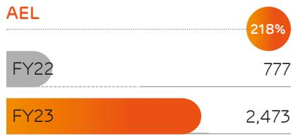

bar

| Period | Value |
| :--- | :--- |
| AEL | 218% |
| FY22 | 777 |
| FY23 | 2,473 |

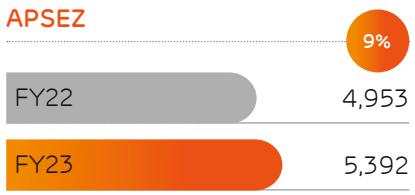

bar

APSEZ
| Period | Value |
| :--- | :--- |
| FY22 | 4,953 |
| FY23 | 5,392 |
9%

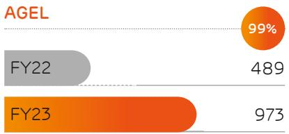

bar

AGEL
| Period | Value |
| :--- | :--- |
| FY22 | 489 |
| FY23 | 973 |
99%

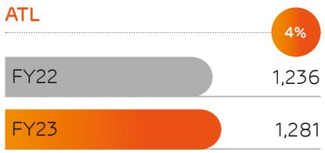

bar

ATL
| Period | Value |
| :--- | :--- |
| FY22 | 1,236 |
| FY23 | 1,281 |
4%

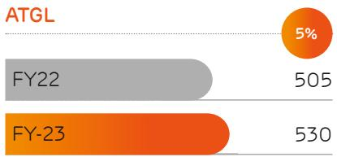

bar

ATGL
| Period | Value |
| :--- | :--- |
| FY22 | 505 |
| FY-23 | 530 |
5%

The Adani portfolio of companies’ platform comprises foresight, operational excellence, outperformance and leadership

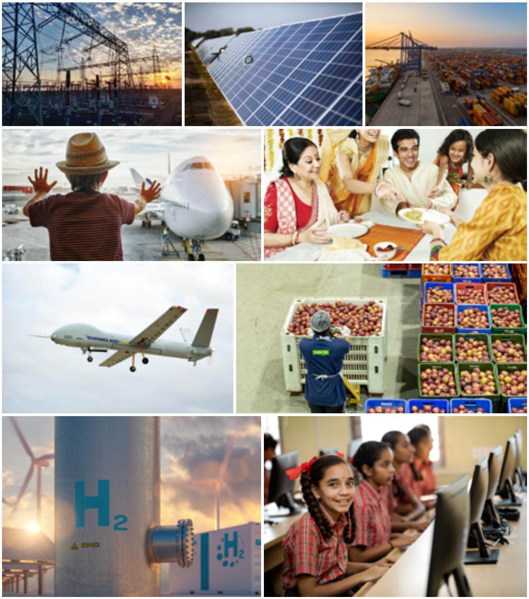

# The Adani portfolio of companies’ businesses

Incubation

Energy & utility

Transport & logistics

Materials, metals and mining

Direct-toconsumer

# The Adani portfolio of companies’ growth platform

Betting on India

Strategic big picture

Making outsized investments in futuristic infrastructure

Investing at a competitive capital cost in a relatively low commissioning time

Creating long- term revenue visibility

Ensuring attractive margins

# The Adani portfolio of companies

India overview: We, at Adani, believe in and bet on India. In the last three decades, India has not just grown faster; but has also compressed the GDP growth of the earlier decades into fewer years. India is expected to transition from a USD 3.75 trillion economy to a USD 5 trillion economy in the next few years.

At Adani portfolio of companies, we proactively invested in businesses that are expected to ride India’s middle-income consumption engine. The Adani portfolio of companies invested not on the basis of what is, but on what can be. By making disproportionate investments, it intends to shift the needle not just for its investee Company but for the country as a whole - with the objective of extending access, reducing costs, widening the market and, in doing so, helping strengthen India.

Competitive advantage: At the Adani portfolio of companies, we believe that the ability to make a significant national

contribution can only be derived from a broadbased competitive advantage that is not dependent on any one factor but is the result of an overarching culture of excellence – the coming together of adjacent businesses, deep sectorial experience, ability to commission projects faster than the sectorial curve, competence to do so at a cost lower than the industry average, foresight to not merely service the market but to grow it, establish decisive sustainable leadership and evolve the Company’s position into a generic name within the sector.

# Relatively non-mature spaces:

The Adani portfolio of companies has entered businesses that may be considered ‘maturely nonmature’. Some of the businesses can be classified as mature, based on the enduring industry presence and the conventional interpretation of their market potential; these businesses can be considered non-mature by the virtue of their vast addressable market potential and the superior Adani portfolio of companies value proposition. The result is that the Adani portfolio of companies addresses sectorial spaces not on the basis of existing market demand but on the basis of prospective market growth following the superior Adani sectorial value proposition.

Outsized: The Adani portfolio of companies established a respect for taking outsized bets in select sectors and businesses without compromising Balance Sheet safety. The portfolio of companies establishes a large capacity aspiration that sends out a strong message of its longterm direction. Its outsized initial capacity establishes economies of scale within a relatively short time horizon that deters prospective competition and generates cost leadership (fixed and variable).

Technology: The Adani portfolio of companies invests in the best technology standards that could generate precious additional basis points in profitability and help more than recover the additional cost (if at all) paid within a short tenure. This superior technology standard evolves into the Company’s sustainable competitive advantage, respect, talent traction and profitability.

Execution excellence: The Adani portfolio of companies has built a distinctive specialisation in project execution, one of the most challenging segments in India. The portfolio of companies has established benchmark credentials in executing projects faster than the sectorial average by drawing from the multidecade Adani pool of managerial excellence across a range of competencies. This capability has resulted in quicker revenue inflow, increased surplus and competitive project cost per unit of delivered output.

Flexible capital structure: The Adani portfolio of companies has created a robust financial foundation of owned and borrowed funds. This enhanced credibility makes it possible for the Adani portfolio of companies to mobilise resources from some of the largest global lenders at around the lowest costs. This approach helps transform these marquee institutions from mere lenders to stable resource (fund or growth) providers for the longterm.

# Ownership

The Adani portfolio of companies comprises a high promoter ownership, validating a commitment and ownership in projects.

# The Adani portfolio of companies’ businesses

Cargo volume   
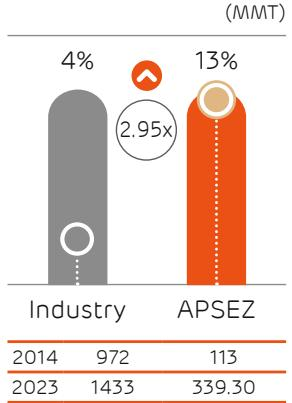

bar

| Category | 2014 | 2023 |
| :--- | :--- | :--- |
| Industry | 4% (MMT) | 2.95x (MMT) |
| APSEZ | 13% (MMT) | 113 (MMT) |
| Total | 972 | 1433 |
| ***(MMT)** | 113 | 339.30 |

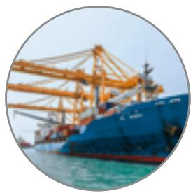

natural_image

Circular cropped photo of a cargo ship docked at a port with orange cranes in the background (no visible text or symbols)

Renewable capacity growth   
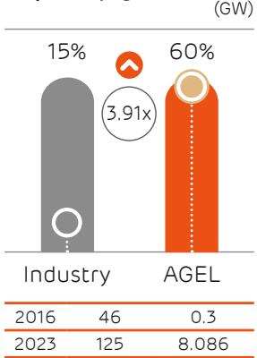

bar

| Category | 2016 (GW) | 2023 (GW) |
| :--- | :--- | :--- |
| Industry | 15% | 3.91x |
| AGEL | 60% | 8.086 |
| Total (GW) | 46 | 125 |
| Value Label | 0.3 | 8.086 |
The label '3.91x' appears in the gray bar between 'Industry' and 'AGEL'. The grey circle with a dot indicates a value of 3.91x.

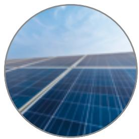

natural_image

Circular cropped photo of solar panels under a blue sky (no text or symbols visible)

Transmission network growth   
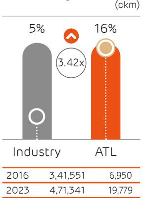

bar

| Category | 2016 (ckm) | 2023 (ckm) |
| :--- | :--- | :--- |
| Industry | 5% | 4,713,341 |
| ATL | 16% | 19,779 |
3.42x is annotated with a red circle.

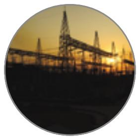

natural_image

Silhouette of a steel transmission tower at sunset, no visible text or symbols

City gas distribution growth   
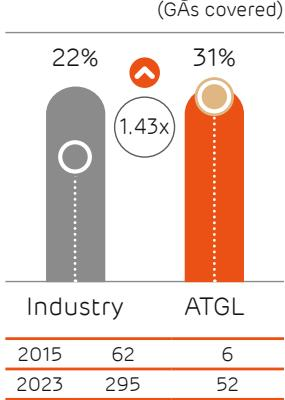

bar

(GAs covered)
| Category | 2015 | 2023 |
| :--- | :--- | :--- |
| Industry | 22% | 295 |
| ATGL | 31% | 52 |
1.43x (indicated by circle) between the bars.

natural_image

Man in green uniform working on car engine under a charging station (no visible text or symbols)

# Transformative model driving scale, growth and free cash flows

# The Adani portfolio: Establishing benchmarks

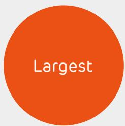

text_image

Largest

India’s largest commercial port (Mundra)

India’s largest single location private thermal IPP (Mundra)

India’s largest private sector ports company

World’s largest wind-solar hybrid operational power project - 2,140 Mw in Rajasthan

text_image

Biggest

Port company enjoying the highest margin among peers

Among the highest transmission

line availability benchmarks in India

Largest airport infrastructure company in India

One of India’s largest portbased edible oil refinery with a capacity of 5,000 MT per day

Leading edible oil player (number two in Wheat Flour and number three in Basmati Rice)

text_image

Quickest

# 648

MW solar power plant

The Kamuthi plant was commissioned in only nine months

text_image

Longest

# 897 ckm

The length of one of the India’s longest intra-state transmission lines that was completed (Ghatampur Transmission Limited)

# C H A I R M A N ’ S M E S S A G E

# Your group will continue to consolidate what it has built while looking at expanding its horizons.

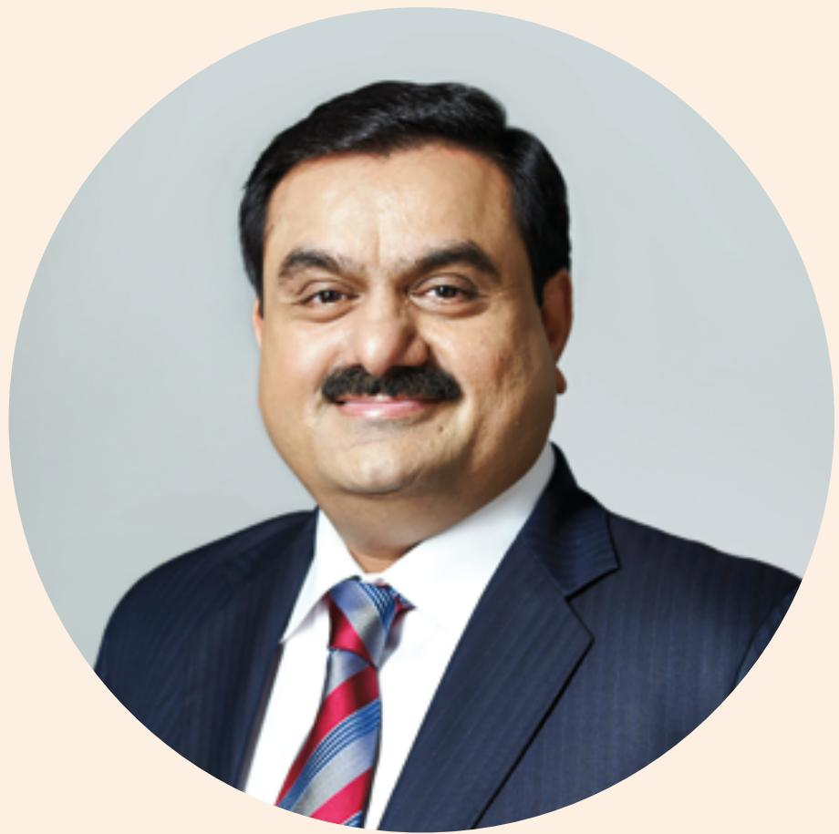

natural_image

Portrait of a man in a business suit and tie, smiling (no text or symbols visible)

# Dear Shareholders,

A few months ago, I heard a new term called Permacrisis. I learnt that the Collins dictionary had defined it as ‘An extended period of instability and insecurity’. It also chose it as the Word for the Year 2022. Interestingly, I also learnt that two other words that were in the running for the top spot were ‘quiet quitting’, which meant doing the bare minimum duties at work (in rejection of competitive careerism) and ‘vibe shift’, which meant a significant change in the prevailing culture. What I find fascinating is that in the post-Covid world, these words accurately summarise changes that we see happening around us.

# A Global Reset is Underway

There can be no denying that the world is continuing to be hit by multiple shocks, be it the climate emergency, geopolitical disequilibrium, supply chain and energy volatility, or persistent inflation. What does make the situation a permacrisis is the fact that we have never had a time wherein all these events happened simultaneously and without a clear solution in sight. Add to this the opportunities and challenges because of the technological revolution, especially the breathtaking advances in artificial intelligence, and what we have is a massive potential reset in the existing global operating models. The future of work, the future of learning, the future of

medicine, and in some ways, the future of economic growth itself will need to be reset. Therefore, as we end one financial cycle and begin another, it is important to step back and assess the global economic situation and India’s position as a part of this landscape.

# India – The Beacon of Hope

While economic cycles are getting increasingly hard to forecast, there is little doubt that India, already the world’s fifth largest economy, will become the world’s third largest economy well before 2030 and, thereafter, the world’s second largest economy by 2050.

It is well understood that for any economy to lay the foundation of growth, a stable Government is critical. We have seen this impact with the implementation of several structural reforms that are critical for strong, sustainable, and balanced growth. This stability, coupled with India’s young demographics and continued expansion of internal demand, is a potent combination.

Our nation’s demographic dividend is expected to drive consumption and accelerate the growth of a tax paying society at a record pace over the next three decades. The United Nations Population Fund (UNFPA) projects that India’s median age will be just 38 years even in 2050. Over this period, India’s population is expected to grow by approximately 15% to 1.6 Billion, but the per capita income could accelerate by over 700% to about US dollars 16,000. On a purchasing power parity basis, this per capita metric could be three to four times higher. The growth of this consuming middle-class is expected to insulate us to some extent from global recessions as our growth is primarily driven by domestic demand. This, in turn, should drive a surge in private and government expenditures, as well as attract increasing foreign direct investments.

We have the statistics to prove it. Following independence in 1947, it took us 58 years to get to our first trillion dollars in GDP, 12 years to get to the next trillion and just five years to the third trillion. I anticipate that within the next decade, India will start adding a trillion dollars to its GDP every 18 months, putting us on track to emerge as a 25 to 30 trillion dollar economy by 2050. This could potentially drive India’s total market capitalisation to over USD 40 trillion, an approximate 10x expansion from the current levels.

I urge you to reflect on these incredible possibilities. India’s success story of balancing economic growth and a vibrant democratic society has no parallel and a result, my belief in the India growth story has never been higher.

Our nation’s demographic dividend is expected to drive consumption and accelerate the growth of a tax paying society at a record pace over the next three decades.

# The Short selling Incident

Let me now address the shortselling issue that impacted us early this year. On the eve of our Republic Day, a US-based shortseller published a report just as we were planning to launch the largest Follow-on Public Offering (FPO) in India’s history. The report was a combination of targeted misinformation and outdated, discredited allegations aimed at damaging our reputation and generating profits through a deliberate drive-down of our stock prices.

Subsequently, despite a fully subscribed FPO, we selected to withdraw and return the money to our investors to protect their interests. The short-selling incident resulted in several adverse consequences that we had to confront. Even though we promptly issued a comprehensive rebuttal, various vested interests tried to opportunistically exploit the claims made by the short seller. These entities engaged and encouraged false narratives across various news and social media platforms. Consequently, the Hon’ble Supreme Court of India constituted an Expert Committee to look into this matter. It comprised individuals known for their independence and integrity. The report of the Expert Committee was made public in May 2023.

The Expert Committee did not find any regulatory failure. The Committee’s Report not only observed that the mitigating measures, undertaken by your company helped rebuild confidence but also cited that there were credible charges of concerted destabilisation of the Indian markets. It also confirmed the quality of our Group’s disclosures and found no instance of regulatory failure or any breach. While the SEBI is still to submit its report in the months ahead, we remain confident of our governance and disclosure standards.

82%

PAT growth, 2022-23

# Adani Group

# Resilient, Stronger and Record Results for FY 2022-23

Over the past three decades, I have learnt that growth comes with its set of challenges. Every challenge we have faced has made us more resilient. This resilience is vindicated by the outcomes we deliver.

Our FY 2022-23 operational and financial results are as much a testimony to our success as a testimony to the continued expansion of our customer base – be it on the B2B side or the B2C side. Our Balance Sheet, our assets, and our operating cashflows continue to get stronger and are now healthier than ever before. The pace at which we have made acquisitions and turned them around is unmatched across the national landscape and has fuelled a significant part of our expansion. Our national and international partnerships are proof of our governance standards. The scale of our international expansions has been validated by our successes in Australia, Israel, Bangladesh, and Sri Lanka.

# Some Group Highlights

Our Group is now constituted of 10 publicly traded entities, each with its own set of successes. I have listed below some key highlights across the various businesses.

1 The Adani Group of companies set new financial performance records with:

a. Total EBITDA grew by 36% to H57,219 Crore,   
b. Total income grew by 85% to H2,62,499 Crore, and   
c. Total PAT grew by 82% to H23,509 Crore.

The Group’s deleveraging program of USD 2.65 Billion for the Adani portfolio companies was completed successfully and further improved our Net Debt to run rate EBIDTA ratio from 3.2x to 2.8x in FY 2022-23.

Our flagship company, Adani Enterprise Limited (AEL) continued to successfully demonstrate its incubation capabilities with new businesses accounting for 50% of its EBITDA in FY 2022-23.

a. Of the several projects underway, two key ones include the Navi Mumbai Airport and the Copper Smelter, which are on schedule.

b. The Integrated Resource Management (IRM) volume increased by 37% to 88.2 MMT versus 64.4 MMT in FY 2021-22 c. In the area of the media business, AEL acquired New Delhi Television Ltd (NDTV) and a 49% stake in Quintillion Business Media Limited.

We are set to play a critical role in India’s Net Zero carbon footprint journey. The renewable energy business, Adani Green Energy Limited, commissioned the world’s largest hybrid solar-wind project of 2.14 GW in Rajasthan; the operational renewable energy portfolio grew 49% to over 8 GW, the largest operational renewable portfolio in India.

5 The backward integration plans in the renewable energy value chain progressed as planned.

a. A new solar module line plant of 2 GW was operationalised and   
b. The existing 1.5 GW module line was upgraded to 2.0 GW using the TOPCON Cell Technology.

6 The ports business continued to be the pillar of strength on all fronts. APSEZ continues to be amongst the most profitable

port operators globally with a port EBITDA margin of 70%.

Adani Power Ltd. successfully commissioned the 1.6 GW ultrasuper critical Godda power plant and is now supplying power to Bangladesh, which marks our entry into transnational power projects.

8 The transmission and distribution businesses set new benchmarks. The Mumbai distribution business achieved a reliability of 99.99% and was ranked the number one discom by the Union Ministry of Power.

Adani Total Gas Ltd, expanded access to clean cooking fuel to 124,000 households last year with a 46% increase in revenue to H4,683 Crore and is transforming into a full spectrum sustainable energy provider following its foray into the e-mobility and biofuel businesses.

10 Lastly, on the partnership front, we continue to attract global investment partners aligned with our long-term approach of building and operating world-class assets. In March 2023, we successfully executed a secondary transaction with GQG partners of USD1.87 Billion despite volatile market conditions.

# Its all about a Better Tomorrow

The India in which we live today is the most exciting land of opportunities with blossoming entrepreneurial spirit. Every day is a beginning of something new, innovative, and transformative. We have always believed in our ‘growth with goodness’ philosophy and our track record speaks for itself. Your Group will continue to consolidate

what it has built while looking at expanding its horizons. Our customers speak for us, our investors speak for us, our shareholders speak for us, and our results for speak for us. On behalf of your Company, I reaffirm and assure that we are committed to the highest levels of governance and regulatory compliance.

In closing, let me emphasise how grateful I am for all your support. It has been the greatest source of my strength and it is my promise to you that I will do my utmost to uphold the trust you have put in me and my team.

Thank you.

Gautam Adani

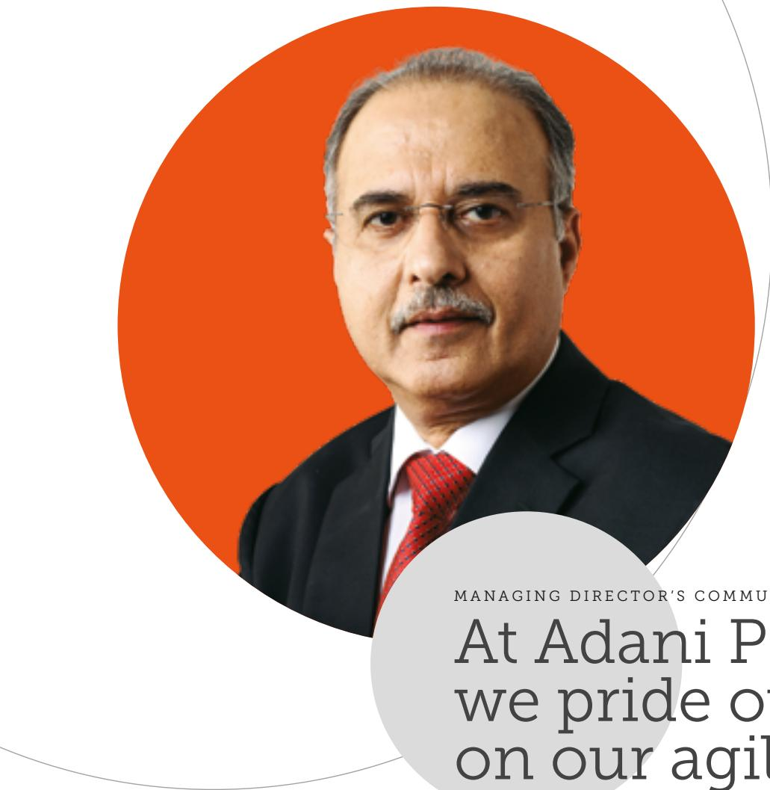

text_image

MANAGING DIRECTOR'S COMMU
At Adani P
we pride of
on our agil

M A N A G I N G D I R E C T O R ’ S C O M M U N I Q U E

At Adani Power, we pride ourselves on our agility, adaptability and a strong sense of responsibility towards our stakeholders, the society and the nation

The Indian economy performed credibly at a time of global slowdown, indicating the resilience and robustness of its intrinsic growth drivers, resulting in outperformance as compared to other major economies. During FY 2022-23, much of the world was affected by a continuing conflict in Europe, and a consequent increase in energy costs, which created a spiral of rising inflation, rate hikes by central banks, and stress on the banking system, which translated into an economic slowdown and early signs of an impending recession.

# Emerging trend

Over the coming decade, India’s energy demand is projected to grow more than 40%, while peak demand is expected to grow by nearly 70%. This increase in demand for electricity will be catalysed by a much larger economy comprising a growing population with rising incomes and fast-improving living standards, greater share of the industrial sector – especially high-value manufacturing, and an accelerating shift in the choice of transport mode towards electric vehicles, abetting quality-of-life imperatives. This anticipated increase in power appetite will need to be enabled and served through a timely expansion of power generating capacities.

As India reaffirms its global climate commitments and progresses on its ambitious plan to achieve 50% of power Bucking the global trend, the Indian economy rebounded from a low of 4.4% growth in the third quarter of FY 2022-23 to report a 6.1% growth in GDP during the fourth quarter. The result is that the Indian economy finished the year under review with a growth of 7.2%, the fastest growth among major economies.

India’s power sector duly facilitated this outperformance through the timely supply and distribution of electricity, which had a cascading effect on the economy as a whole, including industries, commercial establishments, homes, and the life quality its people.

generation capacity from non-fossil fuels by 2030, the role of reliable and affordable conventional energy sources assumes greater importance in supporting higher renewable energy penetration. The immense reserves of coal enjoyed by India, improving efficiency of modern coal-fired power generation technologies, and a highly developed industrial ecosystem is likely to ensure that coal-based power generation remains a critical component of the Indian power system for years to come.

In view of this evident reality, your Company is gearing up to address emerging scenarios of an evolving and dynamic market. As the preference of distribution companies shifts to meeting their incremental energy supply gaps through medium and short-term contracts, your

As India reaffirms its global climate commitments and progresses on its ambitious plan to achieve 50% of power generation capacity from non-fossil fuels by 2030, the role of reliable and affordable conventional energy sources assumes greater importance in supporting higher renewable energy penetration.

Company increasingly places its untied capacities gainfully through astute fuel management and skillful identification of new opportunities. We are also targeting the opportunity posed by growing renewable portfolio obligations of DISCOMs by jointly offering, with our associates, reliable conventional power supply bundled with renewable power under round-the-clock mechanisms.

The emergence of these opportunities translates into imperatives for us to undertake and enhance timely investments in capacity to capture growth and maximise asset utilisation to improve return on investment. At the time of writing this, we are at the cusp of fully commissioning an ambitious 1,600 MW ultrasupercritical power project in Jharkhand that will export power to Bangladesh. With the start of this power plant, your Company has started a new chapter in the cross-border export of electricity and geopolitical co-operation, which will empower Bangladesh with reliable and competitive electricity, helping it achieve its long-term economic goals.

We are about to embark on the development of a similar 1,600 MW project in Madhya Pradesh, that will supply a majority of its capacity to the State DISCOM under a long term power purchase agreement.

Your Company has undertaken several initiatives targeted at improving business efficiencies as well as operating efficiency and uptime of power plants. One such initiative, Project Beacon, leverages data analytics in the Company’s core operations and fosters a culture of continuous improvement and innovation. Through Project Beacon, your Company aims to transform into a value-led, tech-first organisation, setting industry standards for analytical integration.

In addition to the above, the Adani Group has also set in motion a program for institutionalising a culture of business excellence covering various processes and functions under the Adani Business Excellence Model, based on the famed Malcolm Baldrige Business Excellence Framework.

Together, these initiatives will provide the most effective solutions to create a strong foundation on which the enterprise can continue to achieve superior performance and stakeholder value in a sustainable way.

# Supply chain

The Government has taken commendable steps to address the critical challenge of fuel availability for coal-based power plants that were suffering from shortages due to several reasons. The auction of long- and mediumterm coal linkages under the GoI-SHAKTI policy helped address the growing need of electricity and support stranded power plants.

Recent reforms in commercial coal mining also enable Mine Developers & Operators to augment fuel availability without end-use restrictions and promise to attract more investments and better technology in this crucial area.

Global prices of coal are expected to trend down and revert to their long term mean, subject to real price adjustments once the geopolitical stress in Europe eases and the region returns to peace and stability.

# APL’s performance, FY 2022-23

Your Company reported a commendable performance in FY 2022-23 with stable volumes despite high import coal prices and a shortage of domestic coal in the light of growing power demand. This speaks volumes about the operating excellence and deep expertise built by the organisation in various spheres.

The Company also registered a sterling financial performance with strong revenue growth, robust EBITDA margin, and its highest ever post-tax profitability, which helped strengthen its Balance Sheet. Your Company has been actively pursuing a

deleveraging strategy with the help of liquidity released by the recovery of regulatory receivables after long-standing petitions reached their logical end in the highest judiciary of the country.

I am happy to note that as a result of the developments as highlighted above and conclusion of the amalgamation exercise of six subsidiaries with APL, the credit profile of your Company has improved significantly as validated by its credit ratings from leading Indian rating agencies.

Your Company continued to maintain its leadership in matters related to Environment, Social, and Governance (ESG) related aspects, and achieved higher scores than the average for its global peer group in a number of evaluations. We will continue to work on our ESG performance with a single-minded focus to mitigate the impact of our activities on the environment by implementing innovative solutions in addition to investing in more efficient generation and emission control technologies.

Your Company supports social projects and community initiatives in consonance with the United Nations’ Sustainable Development Goals in partnership with Adani Foundation to support the local communities in which it operates.

Your Company’s consistently strong performance, credit healthiness, and leadership on

multiple fronts is attributable to the dedication of team members and visionary direction of the Adani Group. The indefatigable spirit that drives the Group was aptly demonstrated by your Company surmounting challenges through perseverance, dedication, and strong belief in fundamental values. At Adani Power, we pride ourselves on our agility, adaptability and a strong sense of responsibility towards our stakeholders, the society and the nation.

I am sure that these ideals will continue to motivate the teams to achieve higher performance landmarks in the years to come and sustain higher value creation for all stakeholders.

I again thank all stakeholders for their support and assure you all of our continued delivery of services during these uncertain times. We remain committed to the Indian infrastructure sector and are determined to successfully address any opportunity that presents itself by adapting to the changing times.

# Anil Sardana,

Managing Director

The Adani Group has also set in motion a program for institutionalising a culture of business excellence covering various processes and functions

The credit profile of your Company has improved significantly as validated by its credit ratings from leading Indian rating agencies

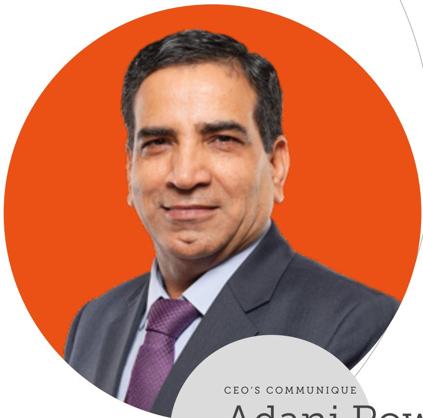

text_image

CEO'S COMMUNIQUE
Adani Row

C E O ’ S C OM M U N I Q U E

Adani Power stands committed to serve the evergrowing needs of society and economy in building a better tomorrow.

The Indian power sector staged a smart recovery after the pandemic-induced slowdown over the last two years and reached ever higher levels of peak power demand as well as energy demand, which was to the pleasant surprise of many. This

# Sectoral outlook

Investments in renewable energy in India have started outstripping those in conventional power over the last few years owing to the Government’s emphasis on increasing the penetration of non-fossil fuel sources in the power generation mix. However, coal-based power is expected to continue playing an important role, given the ready availability of fuel and its propensity to support the grid at times of low renewable energy generation.

It is observed that power distribution companies have been increasingly preferring long-term power purchase agreements

# Fuel availability

A power producer like your Company has to ensure the timely availability of fuel at all plants, so that emerging demand can be met without disruptions, and contractual obligations can be addressed. Fuel management and logistics are complex activities requiring the handson management of multiple touchpoints with a myriad of

# Performance for FY 2022-23

During the year under review, APL’s operating performance was constrained by high import coal prices in the case of coastal plants and domestic coal related demand growth is a direct result of the commendable GDP growth, a concrete evidence of strong economic fundamentals, neversay-die attitude of the people, and foresight of government policies in times of global uncertainty.

for renewable energy and medium-term arrangements for conventional power. This creates an opportunity for growthdriven companies to judiciously blend renewable energy with conventional generation, reconciling the need for sustainable energy with reliability and scalability.

At the same time, the reemergence of peak deficits and energy deficits due to strong demand growth is driving volumes and rates in the short-term market, creating opportunities for gainful placement of untied conventional power capacities.

agencies. Our capable team of professionals carried out this responsibility well and ensured that the fuel never runs out even during times of high demand or supply disruptions. We have been able to negotiate mediumterm coal linkages under SHAKTI policy for supplying power under medium- term PPAs.

constraints at plants with open capacities. APL achieved a consolidated PLF of 47.9% and sales of 53.39 BU in FY 2022-23, as compared to PLF of 51.5% and

The Company was able to achieve a quick turnaround of MEL, which was a financially distressed asset before acquisition, by leveraging APL’s considerable skills and operational excellence.

sales volume of 52.27 BU in the previous financial year.

This was achieved through vigorous efforts on all fronts, from maintaining high plant uptimes to ensuring timely fuel supply to gainfully placing untied capacities in the medium and short-term markets.

Your company reported strong 36% revenue growth to H43,041 Crore for FY 2022-23. This improvement was the outcome of a number of reasons: improved tariffs intended to cover a high import coal price, higher one-time revenue recognition of pending regulatory claims that are now settled, as well as the addition of 1200 MW capacity of the Mahan Energen Ltd. (MEL) plant, which was acquired in March 2022.

Despite the high input costs, your company posted a strong EBITDA at H14,312 Crore for FY 2022-23 as compared to H13,789 Crore for FY 2021-22. The Company was able to achieve a quick turnaround of MEL, which was a financially distressed asset before acquisition, by leveraging APL’s considerable skills and operational excellence.

Profit after tax registered in FY 2022-23 was higher by 118% at H10,727 Crore, compared to H4,912 Crore for FY 2021-22, following an adjustment in provisions in the wake of corporate restructuring. Improved profitability resulted in an increase in net worth, and better liquidity on account of a release of regulatory receivables allowed the Company to prepay some term debt, leading to a significantly stronger Balance Sheet.

# Major developments in FY 2022-23

Over the last few years, your Company has been undertaking wide-ranging initiatives and rigorous follow throughs for a holistic and organisationwide transformation exercise to achieve excellence across five key areas: operational performance, financial excellence, fuel management excellence, regulatory and commercial excellence, and gainful placement of open capacities. It has been able to make significant progress in these areas during FY 2022-23.

We also undertook an exercise of corporate restructuring to improve operating efficiencies, ease the flow of liquidity between plants generating surpluses and projects requiring fund infusion, and to improve scale benefits. As a part of this exercise, six operating subsidiaries of your Company were amalgamated with it, resulting in a single entity with 12,450 MW of strategically located and efficient power generating capacity.

This initiative will empower it to benefit from various economies of scale coupled with improved operating efficiency.

Over the last two years, the Company reached a satisfactory closure of virtually all outstanding regulatory issues, and recovered substantial regulatory receivables from DISCOMs, along with carrying costs and late payment surcharges. The cash surplus was utilised to improve the Company’s financial health and part-finance growth initiatives.

The company prepaid the entire term debt in the erstwhile Adani Power Rajasthan Limited (APRL) from the proceeds of regulatory receivables, making it debt-free. At the consolidated level, there was a reduction in debt levels in FY 2022-23, translating into an improvement in leverage ratios.

Strong financial performance during FY 2022-23, improvement in outlook following regulatory claim recovery and deleveraging, as well as the synergistic benefits

flowing from the corporate amalgamation, translated into a healthier Balance Sheet and creditworthiness, with credit rating improving from ‘BBB-’ to ‘A’ during the year under review.

The 1,600 MW Godda Ultrasupercritical Power Project (USTCPP), which is being set up by your Company’s wholly owned subsidiary Adani Power (Jharkhand) Ltd., achieved commissioning of its first unit of 800 MW in early April 2023, while the second unit of 800 MW is expected to be commissioned soon. The project’s full capacity will be utilised towards the export of electricity to Bangladesh.

Similarly, the execution of the 1600 MW Mahan Phase-II USTCPP of Mahan Energen Ltd., a wholly owned subsidiary of the Company at Singrauli in Madhya Pradesh, is expected to be commenced through its project activities during the current financial year.

Your Company also commenced the development exercise for capital expenditure in terms of installation of a flue gas desulphuriser (FGD) at all operating plants for compliance with emission control norms. The FGDs are targeted to be installed by the deadline of December 2026, deepening the company’s commitment to work in complete compliance with regulatory requirements for benign operations.

On the Environment, Social, and Governance (ESG) front, your Company has implemented the ethos of the Adani Group and maintained its leadership among peers on various counts.

For example, APL received a B score for fulfilling climate change and water security commitments from CDP (Carbon Disclosure Project) for 2022, signifying that it is taking coordinated action on climate issues. This score is higher than the global and Asia regional average of C and is at par with global thermal power generation average. It highlights APL’s stewardship in setting competitive benchmarks and fulfilling commitment to reducing the impact of climate change.

APL also achieved higher scores than global peer group averages in various leading ESG assessments, such as:

ƒ 3.5/5.0 in FTSE ESG rating, as compared to world utilities average score of 2.7/5.0.   
54/100 in Corporate Sustainability Assessment (CSA) by S&P Global, as compared to world electric utilities’ average of 33/100.   
87% in CSR Hub ESG rating, which is better than the global industry average.

Your Company has been active in the Corporate Social Responsibility sphere in association with the Adani Foundation in the core areas of Education, Health, Sustainable Livelihoods, Skill Development and Community Infrastructure. Your Company’s activities for the betterment of society are being pursued rigorously around all its plant and project site locations in thousands of villages, touching the lives of millions across all ages.

Your Company reported its ESG performance through an externally assured annual Sustainability Performance and Value Creation Report, which followed the Integrated Reporting framework. APL is also a constituent company in the FTSE4Good Index Series.

Your company expects to report a stronger operating performance due to improved power demand and resource linkages.

guided by the visionary leadership of the Adani Group, gets deserved credit for its strong operating and financial performance. Our core organisational values of Trust, Courage, and Commitment drive us towards success in the ambitious path set for ourselves. Adani Power stands committed to serve the ever-growing needs of society and economy in building a better tomorrow.

# Shersingh B. Khyalia

Chief Executive Officer

# Outlook

Your company expects to report a stronger operating performance due to improved power demand and stronger resource linkages. Besides, the commissioning of the Godda power plant is expected to enhance revenues starting from the current financial year. The

recent regulatory approvals will also enable it to recover alternate fuel costs efficiently under longterm PPAs, while improving cash flows due to faster collections.

Your Company’s dedicated and energetic team of professionals,

# CORE VALUES

text_image

PART 4

PART 4

# How APL has built a culture of excellence

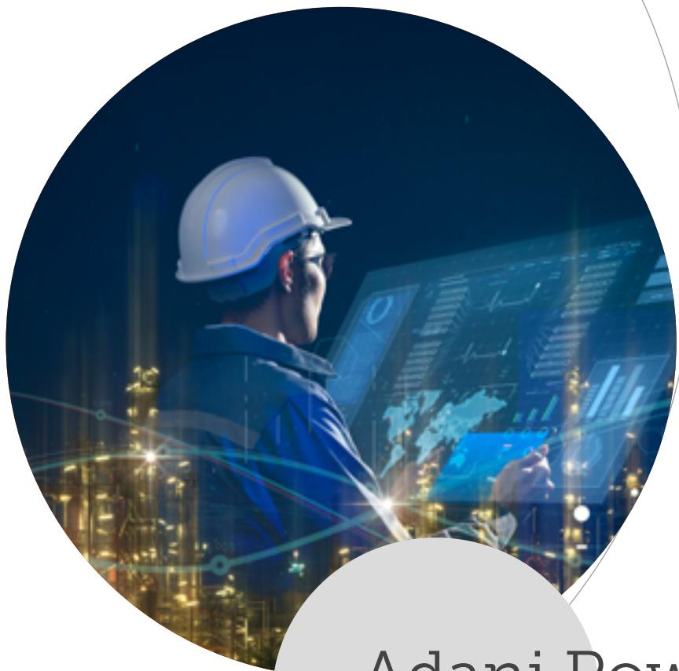

natural_image

Industrial worker in hard hat observing a futuristic digital dashboard with glowing data streams (no readable text or symbols)

# Adani Power. Where power meets passion

Where the objective is ‘Keep making it better’

Where the priority is ‘How can we create a model for India?’

Where every engineer is obsessed with continuous improvement

Where only one standard applies – the ‘world-class benchmark’

Where we recognise we are engaged in a business that makes societies prosper

Where the question we keep asking is ‘Can we make it even cleaner?’

Where we consider the community to be an extension of our company

P O L I C Y - I N S P I R E D

# Adani Power. Positioned to take India ahead

# Overview

At Adani Power, we built assets of strategic importance that take consumers, societies and India ahead.

The company invested ahead of the curve with the perspective that as the Indian economy grew, there would be an increased appetite for power.

Given the need for power to drive virtually every activity, we believed that every increase in national economic growth would create an even bigger consumption ripple.

In view of this, power consumption would grow at a rising rate on a larger base, making it imperative to plan large capacities of enduring multi-decade assets.

To future-proof these assets for the long-term, the company invested in the best technologies that could be upgraded in line with new breakthroughs and improvements.

These technologies were built for scale larger than the prevailing standard, resource consumption lower than conventional standards, high plant uptime and a higher capacity utilisation within that uptime.

The cumulative outcome was that APL achieved one of the most competitive capital costs among Indian conventional power generation companies.

In turn, this competitiveness empowered the company to reinvest its surplus, deepening its competitiveness and building a platform long-term sustainability.

The result is that in a little more than a decade, Adani Power has come to account for around 6% of all the capacity created in India’s multidecade thermal power generation sector. Besides, Adani Power’s capacity was approximately 16% of all of India’s private sector thermal power generation capacity as on 31st March, 2023.

# Big numbers

1,34,815

MW, thermal power capacity commissioned by India from FY 2009- 10 to FY 2022-23

9,240

MW, thermal power capacity commissioned by Adani Group from FY 2010 to FY 2022-23

6.8

% of national conventional power capacity accretion by Adani Group, FY 2009- 10 to FY 2022-23

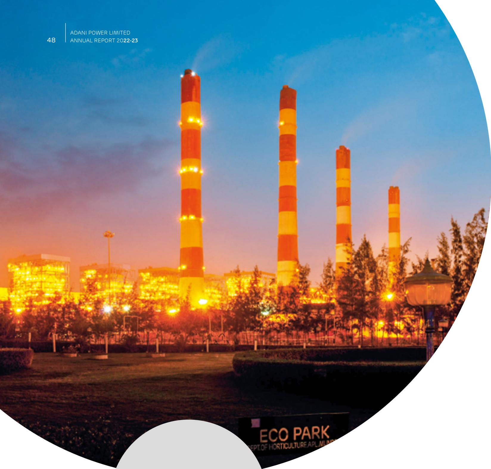

text_image

48
ADANI POWER LIMITED
ANNUAL REPORT 2022-23
ECO PARK
DEPT.OF HORTICULTURE APL.MUND

B U I L D I N G A B E T T E R T O M O R R O W

Adani Power. A sectorial benchmark in terms of asset sophistication and operating efficiency

# Overview

Adani Power went into business less than two decades ago with a singular perspective: enhance India’s energy security with speed, scale and sophistication, emerging as a national benchmark.

We have been consistent in our focus to build showpiece generation assets that generate more, consume less and waste less. In doing so, we have positioned our assets as capable, dependable and responsible.

The Company invested in scale, scope and synergies, creating the next generation of national assets, strengthening the Company’s performance, emerging as a sectorial benchmark and enhancing national respect.

Adani Power resolved to graduate India to the next technology

level in a conventional space. The company introduced India’s first supercritical power generation unit (660 MW), when it commissioned Unit 5 in Mundra in December 2010. This power generation showpiece represented a convergence of scale (the world’s largest singlelocation thermal power plant at that time) and efficiency, moderating the cost of power generation to one of the lowest in the country for modern power generation units.

The success of this plant inspired a technology revolution in India’s power generation sector. In the next 13 years, the Company commissioned a significant portion of supercritical units in India.

The sizable critical mass of nextgeneration power generation assets has shifted the technology needle in India towards the cutting-edge and modern.

Adani Power invested in India’s largest seawater-based flue gas desulphurisation plant at its Mundra power generation facility. The company’s Unit 4 (330MW sub-critical technology in the Mundra power plant) operated without downtime for a record 686 days; its Unit 7 (660MW supercritical technology at the Mundra power plant) delivered 444 days of uptime until 13th September, 2020, record in India. Its Mundra power station was the world’s first coal-based thermal power station to be registered with UNFCCC under CDM.

The Adani Power complement of more than a dozen modern power generation plants has enhanced respect for India’s commitment to fight climate change with a complement of correspondingly complex technologies.

# Adani Power’s supercritical and ultra-supercritical capacities: Transforming India

Efficiency: Supercritical and ultra- supercritical power plants (operate at temperatures and pressures above the temperature and pressure at which the liquid and gas phases of water coexist in equilibrium) have an efficiency of more than 45%, 1300 bps higher than conventional power plants

Cost-effective: The steam bottoming cycle is state-ofthe-art and requiring minimum development. The super-critical plants provide a superior costvalue proposition.

Productivity: The load variation in supercritical boilers can be faster due to the absence of the drum. Higher temperature and pressure enhance efficiency, i.e. more electricity per ton of fired coal and correspondingly lower fuel used with moderated greenhouse gas emissions.

Cleaner: They require less coal per megawatt-hour with lower emissions (including carbon dioxide and mercury), higher efficiency and lower fuel costs per megawatt.

Footprint: They provide a 10-15% reduction in carbon dioxide emissions compared to a subcritical technology.

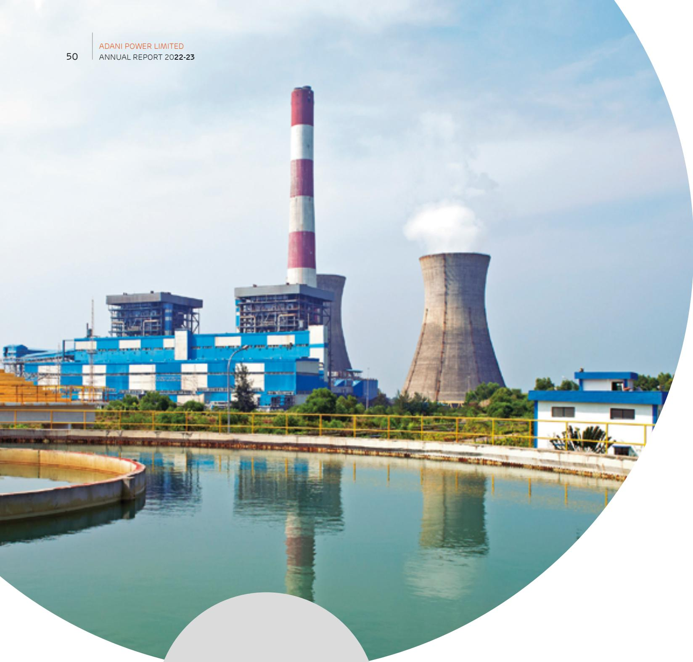

text_image

50
ADANI POWER LIMITED
ANNUAL REPORT 2022-23

B U I L D I N G A B E T T E R T O M O R R O W

# Adani Power.

# Building larger and quicker, creating

# a new sectorial

# paradigm

# Overview

At Adani Power, we introduced a completely new dimension in building large conventional power plants in India.

Before Adani Power had commissioned its first power plant, there was a conventional belief that such plants normally consumed the better part of a decade from concept to commissioning. During this period, such a project would be exposed to periodic cost escalations based on commodity price increases or changes in currency or interest rates. The result is that most conventional power plants in India reported cost mismatches between budgeted and eventual outcomes.

Adani Power introduced a game-changing proposition: it commissioned the world’s largest generation of thermal generation units around the shortest tenures (ground breaking to revenue accretion) in the country. In doing so, the company – new to power generation – graduated to a national benchmark.

Adani Power emerged as a national benchmark in other ways as well.

Pioneering: The Company’s Udupi plant was the first independent power project in India to utilise 100% imported coal. The Company’s ultra-supercritical power project of 1,600 MW (2 x 800 MW) is supplying power to Bangladesh through a dedicated transmission line (secured by a 25-year power purchase agreement with Bangladesh Power Development Board). The Company invested in sonic soot blowers in its boilers to reduce ash accumulation in the gooseneck furnace areas. It installed fast cooling turbine devices to reduce turbine downtime in plants. Its thermography of coal stockpiles identifies hot spots in coal stockpiles to prevent coal fires in yards across all plants and eliminate energy loss. A comparative study between UAV Ninja/Drone and 3D scanner was carried out at Mundra port for volumetric measurement to establish technology suitability.

Sophistication: The company’s 1,600 MW Godda thermal power project invested in the next generation ultra-supercritical technology. The Company’s Energy Network Operations Centre (ENOC) utilised realtime data flows and artificial intelligence to course-correct and enhance performance. The use of drones enhanced inspection effectiveness across natural draft cooling tower and chimneys.

Speed: The Mundra super critical units 6 and 9 achieved synchronisation following boiler commissioning in less than 3.5 months, quicker than the national standard. The super critical segment of Unit 5 of the Mundra thermal power plant (660MW) was synchronised within 36 months, the fastest such implementation anywhere in the world. Two super-critical units (Unit 8 and Unit 9 of the Mundra thermal power plant) completed steam blowing within two days of boiler commissioning, among the quickest standards. The Mundra Units 3, 5 and 9 achieved full load operation following synchronisation in less than four days.

Scale: The Mundra thermal power plant is India’s largest to function off a seawater-based closed-cycle induced draft circulating cooling water system. The system draws on sea water that is recycled up to four times, conserving water and requiring a smaller discharge pipeline into the sea than an open circuit cooling system. The Company’s Tiroda plant is equipped with the largest denomination of the latest high efficiency electrostatic precipitators (pollution control equipment) in Asia.

Integration: The Company invested in power generation facilities that represent a synergistic complement of scale, cost economy, feedstock integration, port support and power back-up. Besides, a complement of identical power generation units across locations helped optimise investment in spares and vendors. A phased indigenisation of critical equipment and broadbased domestic vendor eco-system enhanced supply chain security and national reliance.

Scope: The Company built the rail under rail on the congested Mumbai-Howrah rail link, removing bottlenecks in coal supply logistics.

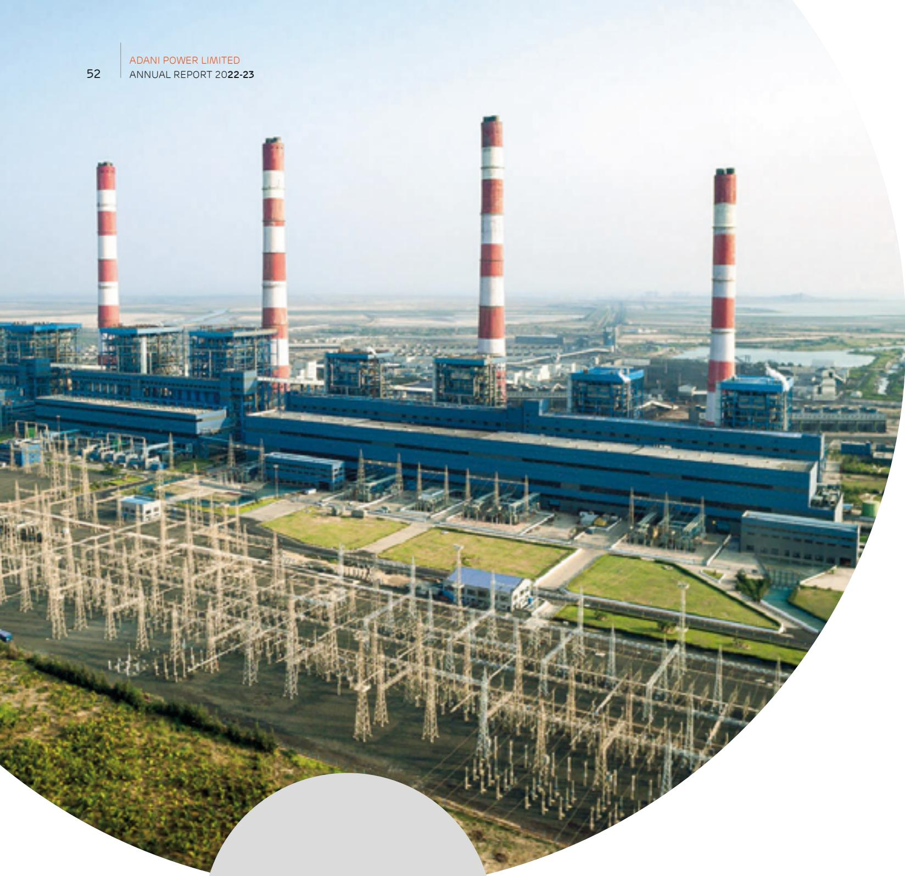

text_image

52
ADANI POWER LIMITED
ANNUAL REPORT 2022-23

B U I L D I N G A B E T T E R T O M O R R O W

APL. Astute and timely capacity addition through the inorganic route

# Overview

At Adani Power, we have demonstrated the capacity to not only build power generation assets from scratch but also turn stressed assets acquired by us around with speed.

During FY 2022-23, the company generated H12,410 Crore revenues – 29% of its consolidated revenues – from assets acquired across the years.; 34% of the company’s consolidated EBITDA was derived from these acquired assets during the year under review.

Udupi Power Corporation Limited (UPCL): The Company acquired UPCL from Lanco Infratech Limited. The acquired company operates a 1,200 MW (2x600 MW) imported coalbased power project in Udupi district, Karnataka. The Company entered into a power purchase agreement with Power Company of Karnataka Ltd. UPCL was India’s first independent power project to consume 100% imported coal; the Company was awarded the prestigious Golden Peacock Environment Management Award in FY 2014-15.

Raipur Energen Limited: The Company completed the acquisition of GMR Chhattisgarh Energy Ltd. (GCEL) in FY 2019-20 following an approval of the Company’s resolution plan (after which the name of GCEL was changed to Raipur Energen Ltd.). REL owns and operates a 1,370 MW (2 x 685 MW) supercritical power plant at Raikheda (Raipur district, Chhattisgarh).

# Raigarh Energy Generation Limited:

The Company completed the acquisition of Korba West Power Company Ltd. (KWPCL) through the NCLT process under IBC in FY 2019-20. Following the acquisition, KWPCL was renamed Raigarh Energy Generation Ltd. The acquired company owns and operates a 600 MW thermal power plant in Raigarh district, Chhattisgarh. The Company enjoys a 2.499 MTPA fuel supply arrangement with the subsidiaries of Coal India Ltd.

Mahan Energen Limited: The Company completed the acquisition of Essar Power M.P. Ltd. through the NCLT process under IBC in FY 2021-22. Following the acquisition, the Company was renamed Mahan Energen Ltd. The acquired company owns and operates a 1200 MW thermal power plant in Singrauli district, Madhya Pradesh.

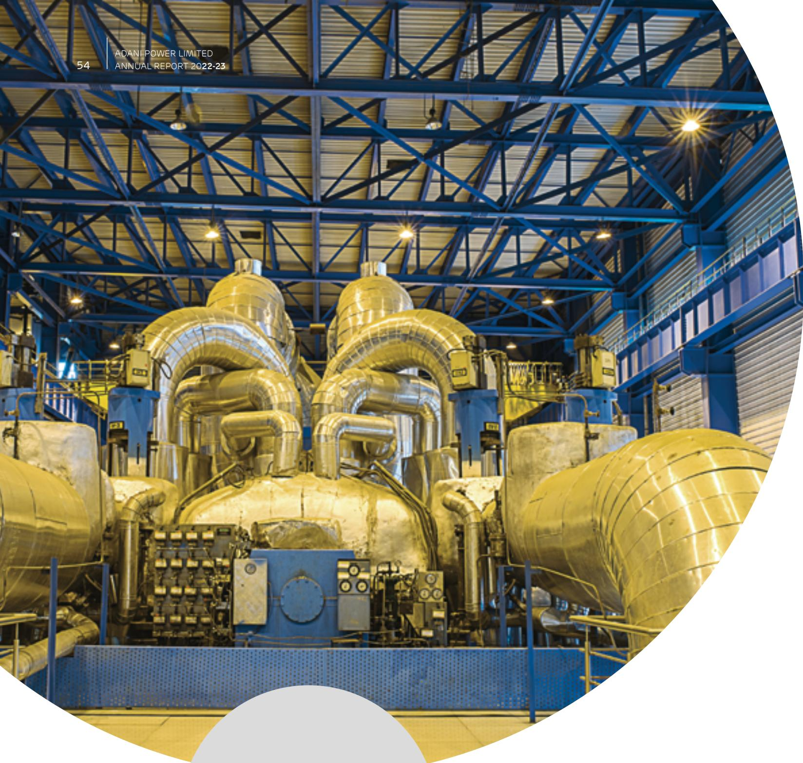

text_image

54
ADANI POWER LIMITED
ANNUAL REPORT 2022-23

B U I L D I N G A B E T T E R T O M O R R O W

APL. Building robust value drivers, enhancing stakeholder value

# Overview

At Adani Power, we possess a robust portfolio of large and profitable conventional power generation assets designed to generate large surpluses, reinvested to create a virtuous cycle of growth and value-creation.

Prudent portfolio: APL possesses a portfolio of near-pithead and coastal plants, accounting for \~89% of its total generation capacity (FY 2022- 23). This empowers its plants to capitalise on low logistic costs and large volume resource transfers, a sustainable advantage translating into a competitive production cost and enhanced consumer value.

Post-operational excellence: APL has built on a deep Adani Group competence in strategic origination, timely infrastructure commissioning, sourcing and logistics, operations & maintenance, structured capital management, liquidity management, and acquisitions.

Structured approach: APL’s project management comprises institutionalised capabilities in project origination (market analysis, strategic value identification and investment case development), site development (land acquisition, permits and clearances) and construction (engineering and design, sourcing, contracting and funding).

Fuel management: APL (only Indian private power producer to possess a mine-to-plant logistics capability of this scale) can handle 54 MTPA coal (equivalent to 13,000 rakes per annum) and 12 MTPA fly ash, a decisive advantage related to business continuity in a sector warranting uninterrupted uptime.

Operational excellence: APL’s operational excellence comprises a competence in operations and maintenance (lifecycle operations and maintenance planning, technology use, training and development) and feedstock management (diversification and logistics management). The Company invested in cuttingedge technologies to moderate resource consumption and increase capacity utilisation.

Controls: APL is driven by Key Performance Indicators for power plant performance, continuous improvements, and technology integration for process efficiency, and risk identification and management.

De-risking: APL secures revenues through long-term power purchase agreements, fuel supplies through long term Fuel Supply Agreements, wide markets and low financial leverage.

A H E A D O F T H E C U R V E

# APL: Building a Better Tomorrow by complementing renewable energy

Thermal power will continue to be an enabler for a greener tomorrow

# Overview

Access to cost-effective and reliable power supply is the biggest catalyst for inclusive growth. It is critical for industrial growth as well as for ensuring social growth of citizens and a high human development index.

Demand for electricity in India is expected to grow at a sustained pace given the Indian government’s push towards the Make In India programme, increasing industrialisation, improving incomes, enhanced living standards, and increasing penetration of electric vehicles in the transportation sector.

The 20th Electric Power Survey of India, published in November 2022 by the Ministry of Power, projects total electric energy consumption at 1,610 BU in 2026-27 and 2,133 BU in 2031-32. The corresponding peak demand is projected at 277 GW and 366 GW for the two years respectively (total electricity demand in 2022- 23 was 1,511 BU and peak demand was 216 GW).

Over the longer term, power demand is projected to reach 3,423 BU by 2041-42 while peak demand is projected at 575 GW. The Central Electricity Authority (CEA) projects that India’s projected installed capacity by the end of FY30 would be around 817 GW, up by around 450 GW over the present installed capacity.

The Government of India set a target of achieving 50% of the total installed capacity by the year 2030 from non-fossil fuels. The Optimal Generation Mix report published by CEA in April 2022 projects installed capacity of 777 GW by 2030. In comparison, installed capacity as of 31st March, 2023 is 416 GW, of which 237 GW (57%) is from thermal power sources. Of this, coal and lignite-based power plants contribute 212 GW.

The report estimates that by 2029-30, installed capacity of coal and lignite-based power plants (net of retirements) would reach 252 GW. The likely share of thermal installed capacity is projected to reduce to 32% of the total installed capacity in 2029- 30 as compared to 57% as of March 2023. However, in terms of energy generation, thermal power will continue to contribute the largest share at 57%, compared to more than 70% at present.

The reason for thermal power contributing a high share of

power generation in the total energy mix is its inherent advantage of high levels of capacity utilisation, stemming from ready fuel availability from domestic sources. In contrast, renewable energy sources like solar and wind power suffer from intermittency and lower capacity utilisation. This makes thermal power ideal to supply base load power and support renewable power generation at times when solar and wind power generation is low.

In view of the realities, coal-based power will continue to play a significant role in addressing India’s electricity demand across the long-term.

APL’s current and upcoming capacities will increasingly play the twin roles of supplying base load power and enabling higher renewable energy penetration by serving peak power needs that cannot be addressed by intermittent power sources.

S T R AT E G I C A C Q U I S I T I O N

# How we are building a better tomorrow through the acquisition and turnaround of financially stressed power plants

# Overview

APL acquired Essar Power MP Limited (EPMPL) on 16th March, 2022, following the acceptance of its resolution plan under a Corporate Insolvency Resolution Process conducted by the National Company Law Tribunal (NCLT). EPMPL’s name was changed to Mahan Energen Limited (MEL) following the acquisition.

MEL owns and operates a 1,200 MW (2x600 MW) thermal power plant (Phase-I project) in the villages of Bandhaura, Khairahi, Karsualal and Nagwa in Tehsil Mada, Singrauli district, Madhya Pradesh. The power station comprises two units of 600 MW each.

The plant is proximate to prominent coal-bearing regions, a competitive advantage in terms of logistics costs.

# Business process transformation

Following acquisition, we integrated MEL into our systems and processes with speed. This helped scale PLF substantially in the first year of acquisition, which is a testimony to our rich knowledge, coupled with a

culture of operational excellence, achieved through the DISHA process. DISHA is a proven Adani Business Operational Excellence model, designed to achieve operational transformation. DISHA was implemented in Mahan with in-house manpower. In addition to this, we inculcated Adani Safety Culture through implementation of Project Chetna, a model developed in association with renowned safety consultants for safety culture Transformation.

Your Company invested in building the organisation and in infrastructure development, which yields in-process efficiency and productivity improvement. For example, in one of the two units, capital overhauling was carried out for more reliable and efficient power generation and an improved PLF.

We identified employee capabilities in various fields and offered targeted training programs to build the knowledge base and foster a culture of innovation and agility. We empowered employees to adapt quickly to changing technologies through digitalisation, and to generate maximum value out of the assets through the

implementation of the Asset Performance Management program.

# Operational transformation

Immediately after acquisition, we leveraged our considerable skills in fuel management and logistics to gain reliable access to fuel at a reasonable cost and improve competitiveness. Your Company’s deep experience in power sales was leveraged to enable MEL to employ its generation capacity gainfully.

MEL entered into a 23-month PPA to supply 200 MW of power starting September 2022. It secured 1.15 MMT of fuel under Shakti B (iii) Round-3 auctions, which is being used to supply power under the 200 MW medium term PPA.

Through these efforts, MEL was able to sell 2.41 Billion units of power in FY 2022-23 despite initial technical challenges, capital overhaul and a shortage of domestic coal experienced by the power sector.

# Financial transformation

MEL reported total revenues of H2,752 Crore for FY 2022-23. It was able to achieve an EBITDA of H771 Crore and Profit After Tax of H245 Crore for the year.

It was able to prepay H650 Crore of its sustainable debt out of its cash surplus generated as a result of operations, resulting in an even lower debt burden and improved competitiveness.

# Phase-II expansion plans

MEL proposes to expand its generating capacity by setting up two pulverised coal-based ultrasupercritical units of 800 MW each, totaling 1600 MW, as its Phase-II Expansion Project at the existing site of the operational 1200 MW Phase-I power plant.

The expanded capacity will be utilised to supply power under a 1,230 MW (net) long-term Power Supply Agreement (PSA) to the MP Power Management Company Limited (MPPMCL). The balance gross capacity (280 MW) of the expansion project will supply power to short-term markets or other medium or long-term arrangements.

MEL will source coal for the MPPMCL PSA under a proposed long-term fuel supply agreement with Western Coalfields Ltd. (WCL), a subsidiary of Coal India Ltd., earmarked under Clause B (iv) of the Scheme for Harnessing and Allocating Koyala (Coal) Transparently in India (SHAKTI). Apart from this, coal sourcing from proximate commercial mines is also proposed as an additional measure to address any potential shortfall in FSA coal availability and meeting the balance fuel requirements of the plant.

Existing facilities of the Phase I (1200 MW) plant, such as intake water pump house, coal handling system, and other infrastructure facilities, will be modified / updated to accommodate Phase II, which will generate cost savings for expansion. MEL is in possession of adequate land at the Bandhaura site to carry out an expansion by setting up facilities for the combined capacity of 2,800 MW.

# Environmental protection

MEL is in the process of development of a capital expenditure plan to install flue gas desulphurisers (FGD) to meet the prevalent emission norms notified by the MOEF&CC. The expansion project will also incorporate necessary emission control equipment to address emission norms.

# Rationale for the Phase-II expansion project

The expansion project represents a sound investment for several reasons:

The project will supply power to Madhya Pradesh, a populous state with a fast-growing economy, and support its economic growth.

Major requirements for the expanded capacity, such as water linkage, land acquisition with a developed site, etc. are already in place, reducing the execution risk.

ƒ A major part of the net capacity of the expansion project was tied up under a long-term PSA with the state government entity, thus mitigating market risk.

Under the PSA, coal is arranged by the offtaker (MPPMCL) under SHAKTI B(iv) provisions. Alternate coal usage in case of shortfall will get a pass through under the terms of the PSA, thus addressing fuel price risk.

ƒ The project is located in the vicinity of major coal bearing areas, marked by the development of commercial coal mines under the liberalised Coal Mining Policy. The project will minimise logistics of alternative fuel supplies by sourcing coal from proximate mines.

# Building a Better Tomorrow

In this way, not only has your Company achieved a rapid turnaround of a previously financially stressed and operationally under-utilised power generation asset, but also improved its value to the economy by making it an important component of Madhya Pradesh’s long-term power selfsuffiency.

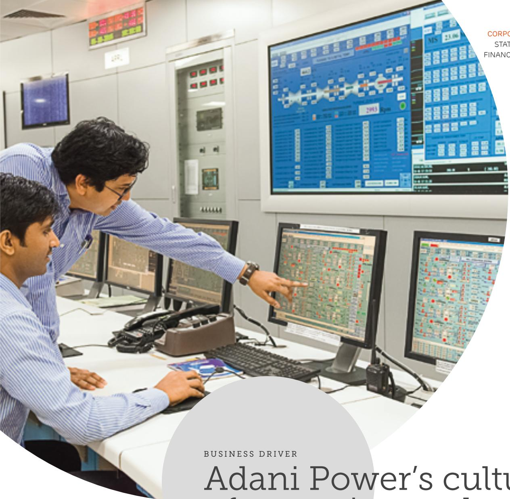

text_image

CORPO
STAT
FINANC
BUSINESS DRIVER
Adani Power's cultu

B U S I N E S S D R I V E R

# Adani Power’s culture of operation and maintenance excellence

# Overview

Reliable, efficient, and safe operation of power plants is the primary aim of APL’s Operation and Maintenance (O&M) strategy. At Adani Power, we focus on these three core areas for building an organisation-wide culture of operational excellence.

Ensuring reliability allows us to serve the ever-growing aspirations of consumers in a fast-expanding economy.

Ensuring efficiency in fuel consumption, costs, and processes enhances our competitiveness, helps meet environmental goals, and improves our agility in a dynamic market.

Ensuring the safety for our employees and vendors is our foremost consideration, in furtherance of which we constantly review and re-engineer our processes aimed towards cultural transformation.

APL’s team of experienced and qualified professionals and contractors works in close coordination with our central teams, utilising a state-of-theart Energy Network Operations Centre (ENOC), leveraging data analytics and knowledge sharing, to ensure benchmarksetting O&M of power plants and pursuing excellence on multiple parameters built around the three core areas.

Key O&M initiatives at APL include a Zero Forced Outage program to drive reliability, focus on Unit Cycle Efficiency and continuous Key Performance Indicator (KPI) benchmarking to drive efficiency. The data analytics program is carried out under Project Beacon, process and safety improvements through increasing automation and mechanisation, safety culture transformation through Project Chetna, and skill-building and capacity improvement of human resources through the Adani Power Training and Research Institute (APTRI).

# Our technological vision

The Company embarked on the initiative to implement state-of-the-art digital solutions that increased datadriven insights. This strengthened a culture of proactive decision making.

# Key standing pillars

# Nurturing an environment

Invested in a Centre of Excellence to increase innovation   
Developed strategic relationships with global innovation hubs   
Developed a knowledge-enhancing environment

# Recognising larger shifts

Recognised shifts and disruptions along with timely innovation   
Commissioned foundational infrastructure and management practices   
Commissioned Energy Network Operations Centre, Asset Performance Management and Data Lake adoption.

# Continuous improvement

Invested in a dedicated technology and analytics team   
ƒ Increased collaborations; command and control network   
Periodic review discipline; assesses the value pipeline

# Sustainability

Committed resource allocation to prioritise action and adoption   
Defined systems to increase scalability and integration   
Deepened the culture around responsibility and sustainability

# A culture of excellence

Experience: The Company possesses \~47,000 person-years of professional experience.

Training: The Company creates capabilities through an

institutionalised approach; its knowledge building culture is reinforced through best practices

Safety: The Company’s safety culture is driven through Project

Chetna led by Du Pont; safety protocols cover equipment, employees and contractors

natural_image

Exterior view of an industrial complex with power transmission towers and green landscaping (no visible text or signage)

Reliability: The Company invests in reliability-centred maintenance to achieve zero forced outages.

Automation: The Company invests in automation and mechanisation to increase operational dependability.

Eco-system: The Company’s OEM and vendor development cum indigenisation enhances the

availability of spares and costeffectiveness.

Monitoring: The Company continuously monitors key operating parameters across all plants centrally.

Benchmarking: The Company’s operations and maintenance standards are benchmarked with

leading global standards focusing on unit cycle efficiency.

Delegation: The Company’s comprehensive goal is cascaded to individual responsibilities and KPIs.

Technologies: The Company invests in future-ready technologies that increase output and productivity.

# Transformed to robotic interventions

The Company invested in the robotic desilting of seawater intake pipeline in Udupi. This robotic remotely operated vehicle allows completely safe and costeffective operations compared

to using divers and barges. The automation empowered a deeper reach to 1,000 m, more than twice of a diver. The sonar profiling to ensure desilting quantity replaced third party

certifications. This technologydriven intervention is free from seasonal desilting challenges, resulting in a perennial clog-free intake.

# Analytics Centre of Excellence

The Company commenced a centralised Analytics Centre of Excellence in Ahmedabad, facilitating digital and analytics intervention. The intervention

and process improvements will increase safety, security and productivity. Asset Performance Management increases asset reliability, availability,

performance, reliability-centered maintenance, optimised operations, maintenance costs, predictive analytics and early warning systems.

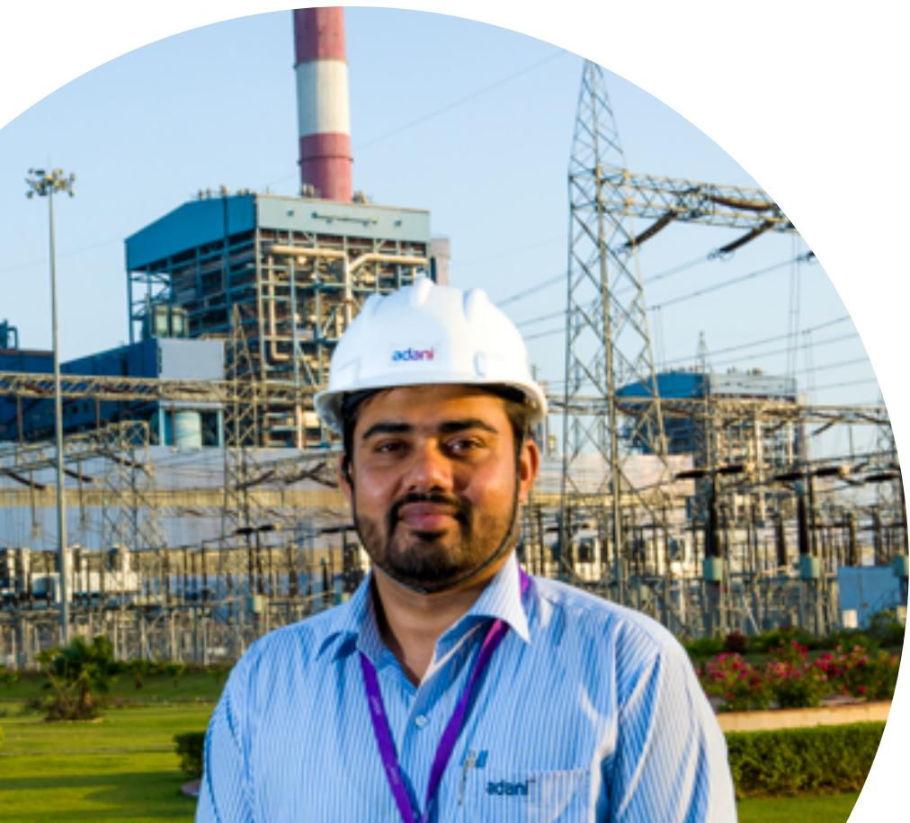

natural_image

Portrait of a man in a blue shirt and white hard hat standing in front of an industrial power plant with visible transmission towers and smokestacks (no text or symbols)

# Fuel logistics expertise

Fuel availability is critical to meeting contractual obligations and viability. By the virtue of being India’s largest private sector thermal power producer, the company possesses classleading capabilities in fuel management and logistics. The Company possesses a capability in handling 54 MTPA of coal from overseas and domestic sources, equivalent to 13,000 annual railway rakes, as well as 12MTPA of fly ash. The complex activities of domestic fuel management include interfacing with multiple agencies across numerous touch points, comprising a management of around 25 railway rakes a day. The Company coordinates the movement of 36-40 rakes a day, ensuring timely and adequate fuel availability.

# Our 0&M approach

Energy Network Operations Centre (ENOC): The Company has invested in a cloud-based centralised monitoring facility in Ahmedabad that draws real time data from the Company’s nationally dispersed power generation plants (eight thermal power stations comprising 25 units). This centralised monitoring empowers qualified personnel to detect real time deviations, leading to timely remedial actions.

Remote monitoring: The Company engages in the realtime monitoring of plant process parameters (more than 80,000 tags across 23 units). ENOC monitors all critical parameters; generates deviations and performance reports.

Reporting: The Company moderated effective person-hours and increased reporting quality through the following initiatives:

Automated thermal energy operational management information systems with various intelligent dashboards that provide insights to all key performance indicators.

ƒ Developed a single platformbased event intimation tool inhouse for triggering e-mails and SMS in the form of notification with regards to critical events related to all the generation fleets (unit outage, start-up and synchronisation) and simultaneously maintaining the master database for future reference.

ƒ Implemented asset performance management to enhance equipment reliability, reduce generation loss arising out of unforeseen shutdowns. Three units went live and positive

results became visible during the first phase. More units will be onboarded in 2023.

Analytics: An in-house tool was developed by ENOC to analyse critical parameters better. The dashboard conducted comparative studies to derive insights into parameters affecting plant performance.

Technologies: The Company invested in robotic marine inspection, crawler (facilitates automated remote silt inspection end cleaning in pipelines) and drones to inspect high-rise structures without manual engagement.

Coordination: The Company engaged in scientific power scheduling to enhance revenues; the Company’s subject matter experts help moderate plant downtime.

# Awards and accolades

The Company participated in the 8th National Conclave on 5S organised by QCFI on 25th June, 2022 in Goa. Some APL 16 teams participated; 12 received the ‘par excellence’ award.   
22 teams from six power stations participated in the Ahmedabad Chapter Convention on Quality Concepts; teams won 21 gold awards and one silver award for case studies.

The Company is proud that its ‘Head - Safety and Four Pillars of Operational Excellence’ received the prestigious International SUDOMO Quality Leadership Award, 2022.   
The 36th National Convention on Quality Concepts was organised by the Quality Circle Forum of India in Aurangabad around the ‘Integrated Quality Concepts’ theme. Some 24

teams from APL headquarters and various plants presented case studies on Quality Control, LQC, Kaizen and 5S concepts. The Company’s 11 teams won across the highest categories - ‘par excellence’ and ‘excellent’.

The Raipur plant achieved national 5S accreditation from Quality Circle Forum of India (QCFI)

# Key O&M highlights, FY 2022-23

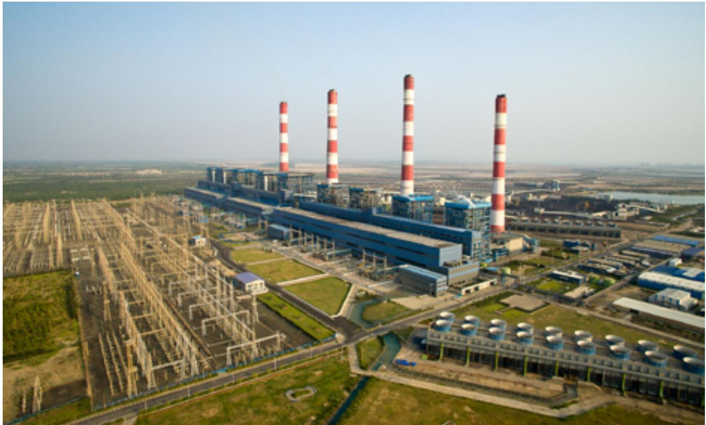

natural_image

Aerial view of a large industrial power plant with multiple red-and-white striped smokestacks and blue buildings, surrounded by green infrastructure and water channels (no visible text or signage).

# Mundra

The Company’s 4,260 MW coastal power plant at Mundra in the Kutch district of Gujarat is India’s largest private sector owned thermal power plant. The plant consists of four phases: Phase I of 660 MW (2x330MW), Phase II of 660 MW (2x330 MW), Phase III of 1320 MW (2x660 MW), and Phase IV of 1980 MW (3x660 MW) were commissioned between 2009 and 2012. Phases I and II are based on the subcritical technology while Phases III and IV are based on the supercritical technology. The power plant supplies power under long-term PPAs to Gujarat (2434 MW net) and Haryana (1200 MW net) DISCOMs, and the Distribution Licensee for Mundra Port and SEZ (400 MW net). The plant utilises coal imported through the Mundra port to generate power.

# Key features of the plant

ƒ Largest private thermal power station in India at a single location   
ƒ First super critical unit in India   
100% usage of sea water for the entire station   
ƒ Possesses high-speed conveyor from port to plant for uninterrupted coal logistics operations.   
ƒ Dedicated 500kV bipolar HVDC transmission system from Mundra thermal project to Mohindergarh in Haryana.   
ƒ First HVDC power transmission system in the world registered under the Clean Development Mechanism of the UNFCCC (United Nations Framework Convention on Climate Change)

# Highlights, FY 2022-23

ƒ Commissioned the nitrogen generator facility for phase-4.   
ƒ Completed the capital overhaul of Unit-1 and Unit-3 within the planned schedule   
The Company started five units in the Mundra station and synchronised them within six hours to meet grid requirements.   
ƒ The Company completed HFO to LDO conversion to reduce start-up fuel costs   
The Mundra station received Performance Excellence Award in Ramkrishna Bajaj National Quality Award (RBNQA), 2022 in the manufacturing category under the initiative of Adani Business Excellence Model (ABEM).

ƒ The Mundra station achieved the ‘Five star rating’ from British Safety Council.   
ƒ Four teams participated in the 8th National Conclave on 5S awarded with ‘Par Excellence’ (highest category awards) for respective best ‘5S implementation’ and ‘5S models’. The Mundra station achieved ‘Par Excellence’ award in the ‘Organization Performance Award’ category.   
ƒ Six teams participated in AHCCQC’22 (Chapter Convention

on Quality Concepts) hosted by QCFI. All the six teams have been awarded ‘Gold Awards’.

The Mundra station was rated ‘A+’ with a Gold trophy and certificates during the first cycle of ‘Adani Workplace Management System’ accreditation.   
Two APL teams bagged the Par Excellence award (5S Category) in NCQC Aurangabad and Mundra stations.   
ƒ Completed stage-1 certification audit for Information security

management system (ISO 27001:2013) standard.

Successfully completed annual surveillance audit for all eight standards by TUV NORD.   
ƒ Conducted wellbeing gap assessment audit from 21st -25th Nov-22 by BSC auditors.   
Recorded 679 accident-free days without lost time injury.   
Achieved 1398 zero harm days in the coal handling plant.

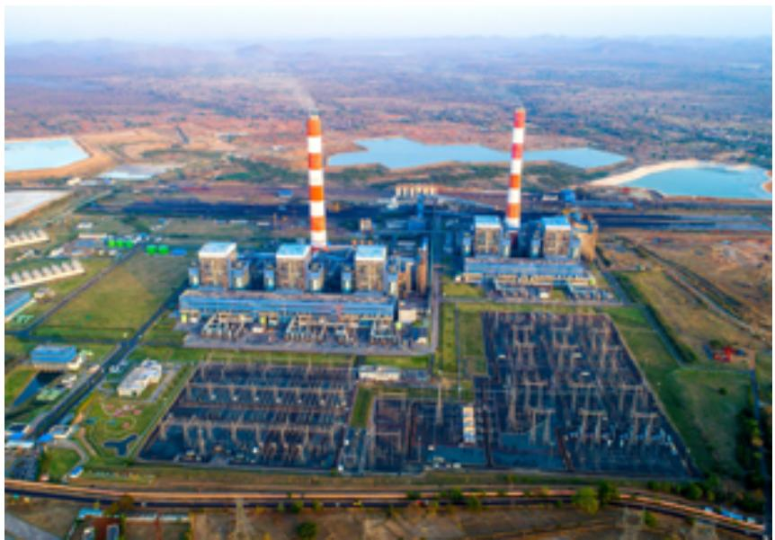

natural_image

Aerial view of a large industrial power plant with two tall smokestacks and surrounding infrastructure (no visible text or symbols)

# Tiroda

APL operates a 3300 MW (5x660MW) domestic coal-based power plant built in three phases at Tiroda in the Chandrapur district of Maharashtra. This fully supercritical power plant had net generating capacity tied up in four long-term power purchase agreements with Maharashtra distribution companies of 1320 MW, 1200 MW, 125 MW and 440 MW. The plant was fully commissioned in 2014. The plant is located 125 kms from Nagpur with the major nearest railhead Gondia on the Mumbai-Howrah rail route 30 kms distance from the plant. The plant has a reservoir with buffer capacity of 45 days of water intake. The plant has fuel supply agreements with Coal India Limited subsidiaries for 11.30 MTPA. These agreements along with the inter-plant transfer of coal from Mundra results in a full domestic coal tie-up for the plant. Besides, the company successfully bid for a commercial mine at Gondkhari in Maharashtra with a projected annual production capacity of 2 MTPA, which should be operational by the end of FY 2025-26.

# Highlights, FY 2022-23

ƒ The Company’s Tiroda plant conducted biomass co-firing with coal on trial basis.   
ƒ Undertook various initiatives to improve performance and reduce bottlenecks in coal handling plant through the installation of wagon tippler-4, suspended magnet and coal handling plant (programmable logic controllers) for AB and CD paths IO expansion and segregation of coal feeding stream ‘A’ and ‘B’.   
ƒ The Tiroda station was awarded the second position in Best Boiler Use-2022 organised by Directorate of Steam Boiler, Government of Maharashtra.   
ƒ The Tiroda station was accredited ‘A+’ rating in the first cycle result of Adani Workplace Management System (AWMS) accreditation FY 2021-22.   
ƒ Three teams of Tiroda station participated in 8th

National Conclave held at Goa. One team was awarded in the Par Excellence category and two teams were awarded in Excellence categories in June 2022.

Achieved certification audit for ISO 55001:2014 Asset Management Systems, ISO 46001:2019 Water Efficiency Management System, ISO 22301:2019. The Company’s Business Continuity Management System and ISO 27031:2011 IRBC Management System has been completed in the month of April 2022.

The Tiroda station was recertified by Confederation of Indian Industry as single-use plastic-free.   
ƒ The unit completed stage-1 certification for the Information Security Management System (ISO 27001:2013) standard.   
- The Company’s asset performance management project by Black & Veatch is under implementation.

The Analytics Centre of Excellence team set up was completed. The various teams are working on the projects along with plant team members such as combustion optimisation and auxiliary power consumption reduction.

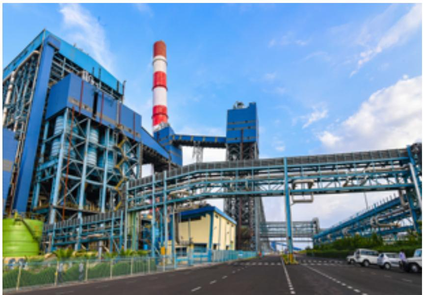

natural_image

Exterior view of a large industrial power plant with blue steel frameworks, a red-and-white striped chimney, and adjacent road (no visible text or signage)

# Kawai

The Company owns and operates a 1320 MW (2x660MW) supercritical power plant in Kawai, Rajasthan, which has tied up with 1200 MW net capacity with Rajasthan distribution companies under long-term power purchase agreements. Moreover, the Company has tied up 40 MW net capacity with Rajasthan distribution companies for an initial period of one year, which can be extended till the end of the tenure of existing power purchase agreements at the discretion of the distribution companies. The plant was successfully commissioned in 2013. The plant is located 300 Kms from Jaipur. The nearest railway station Salpura is 3 kms from the plant. The plant entered into fuel supply agreements with Coal India Limited subsidiaries for 4.12 MTPA.

# Highlights, FY 2022-23

The Kawai power station achieved the highest ever generation of 8920.28 MU and highest plant load factor of 77.14%   
ƒ The Kawai power station achieved the highest quarterly power generation of 2574 MU and a plant load factor of 88.33% during the third quarter.   
ƒ The Kawai power station achieved the highest day plant load factor of 99.63% on 9th September, 2022.   
The plant’s unit-1 achieved the highest day plant load factor of 101.53% on 18th February, 2023.   
ƒ The coal handling plant achieved its highest belt loading factor of 70.18% in February 2023.   
The unit handled the highest number of rakes (1366)   
The Company’s Unit-1 achieved its highest continuous running campaign life of 190 days.   
The Kawai station won IMC RBNQ (Ramkrishna Bajaj National Quality) Performance Award 2022 for exemplary performance in the assessment by external assessors

based on the business excellence framework.

The Kawai station achieved AWMA accreditation in A+ category with a gold trophy and certificate.   
ƒ The unit conducted IMS Surveillance audit by TUV Nord for four standards (ISO

9001:2015, ISO 14001:2015, ISO 45001:2018 & ISO 50001:2018) and was recommended for a continuation of the certification.

The Kawai station was recognised by the Government of Rajasthan on Republic Day for outstanding work in the field of corporate social responsibility.

The Company set up an Analytics Centre of Excellence. Various teams worked on projects with plant team members (combustion optimisation, auxiliary power consumption reduction and belt utilisation factor improvement) in the coal handling plant.

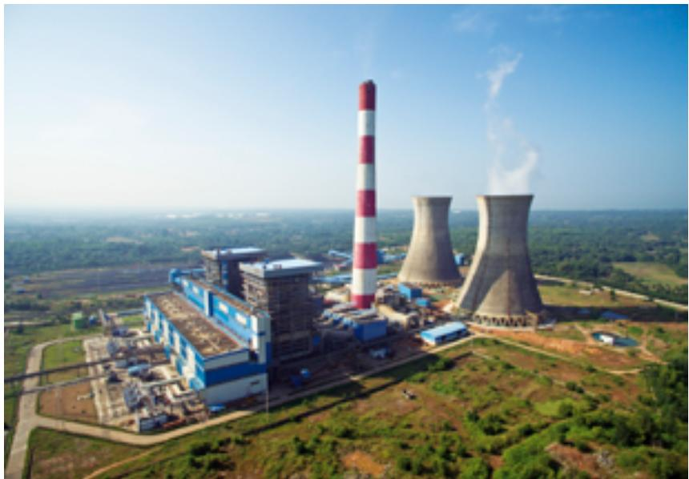

natural_image

Aerial view of a large industrial power plant with cooling towers and a red-and-white striped chimney, surrounded by greenery and distant land (no visible text or symbols).

# Udupi

The Company acquired the Udupi plant from Lanco Infratech Limited in 2015. This 1200 MW (2x600 MW) imported coal-based power project in Udupi district, Karnataka, entered into power purchase agreements with the Power Company of Karnataka Ltd. (PCKL) for 1080 MW gross capacity under Section 62 of the Electricity Act, 2003. UPCL was the first independent power project using 100% imported coal as fuel. The plant was fully commissioned in 2012. The plant is located 35 Kms north of Mangalore, flanked by Konkan Railway on the west and Padubidri-Karkala state highway on the south.

# Highlights FY 2022-23

ƒ The Udupi station secured the first rank among all Adani plants in OHS ranking for its performance in January 2023.   
ƒ The Udupi station secured first rank among all Adani plants in APSEM scoring for January 2023 and achieved an overall scoring of 100%.

ƒ The Udupi station won IMC Ramkrishna Bajaj National Quality Performance Award 2022 for exemplary performance based on the business excellence framework.   
ƒ The Udupi station was recognised as Innovative Power Technology of 2022 by Asian Power Awards Committee for robotic desilting of a sea water pipeline.   
The Udupi station plant is certified with ISO 46001:2019 for Water Efficiency Management Systems, ISO 22301:2019, Business Continuity Management Systems (BCMS) and ISO 55001:2014 Asset Management Systems (AMS).   
Two teams received Par Excellence Award (5S Category) in the National Convention on Quality Concepts (NCQC), Aurangabad.   
ƒ The Udupi station team participated in the coastal clean-up campaign organised at Panambur beach, Mangalore, by the Department of Earth Sciences and District Administration.

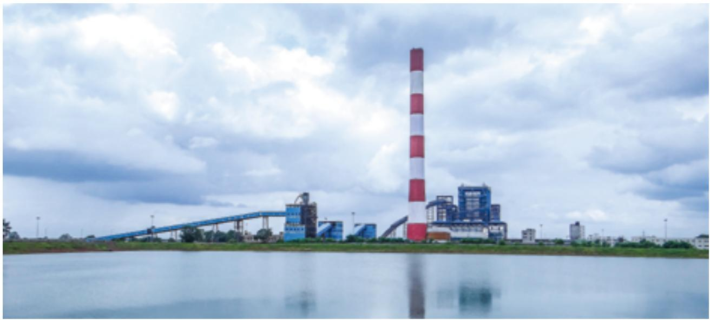

natural_image

Industrial facility with a tall red-and-white striped chimney and blue conveyor belts beside a calm water body under a cloudy sky (no visible text or symbols)

# Raipur

APL completed the acquisition of GMR Chhattisgarh Energy Ltd. (GCEL) in FY 2019-20 following the approval of the company’s resolution plan for corporate debt resolution of GCEL. The Company owns and operates a 1370 MW (2 X 685 MW) supercritical power plant at Raikheda village, in the Raipur district of Chhattisgarh. The Company enjoys a power purchase agreement with the distribution companies in Chhattisgarh to supply 5% of its net generation at a variable cost. The plant also signed a mediumterm power purchase agreement to sell 300 MW of power for 23 months. The supply started with effect from 1st September, 2022. The plant was fully commissioned in 2016. The Raipur plant secured 3.705 MMT, which corresponds to \~786 MW. Around 1.475 MMT of coal is being used for power supply under the 300 MW of power purchase agreement.

# Highlights, FY 2022-23

ƒ Achieved operations and maintenance availability of 95.51%.

ƒ Conducted biomass co-firing with coal trial.   
ƒ Received 5S certification from Quality Circle Forum of India.   
ƒ Scored highest in the thermal business for 5S implementation by QCFI.   
ƒ Deployed artificial intelligencebased video analytics system in the ash handling plant is designed to identify the person and disseminate a safety alert message to wear a harness.   
ƒ Implemented vehicle speed monitoring through the CCTV, artificial intelligence video-based and radar-based speed violation detection systems.   
Developed an in-house toolkit for engineering/ operations workstation, hardware and software testing and training.   
ƒ Received IMS certification for additional four standards of Asset management system (ISO 55001:2014), Water Efficiency Management System (ISO 46001:2019), Business Continuity Management System (ISO

22301:2019) and Information and Communication System Readiness for Business Continuity (ISO 27031:2011)

Two teams from Raipur participated in the 8th National Conventional Quality Conclave organised by QCFI in Goa; both teams achieved the Par-Excellence Award.   
ƒ Commissioned an online oxygen monitoring device for the coal handling plant tunnel area.   
ƒ The plant’s photocell provided all wagon tippler 1/2/3 traverser and took into protection to avoid wagon derailment.   
Installed a camera at Samoda Pump house. Remote viewing facility through the mobile phone was also provided.   
ƒ Provided self-employment to 50 underprivileged women under the CSR production centre program.   
Constructed a school building at Government Primary School, Gourkheda.

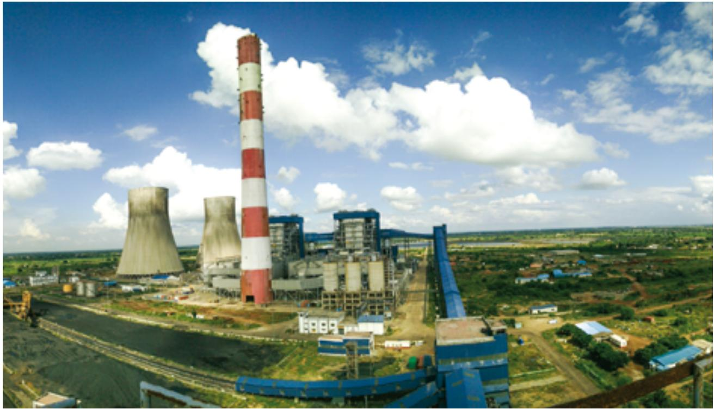

natural_image

Aerial view of a large industrial power plant with cooling towers and a red-and-white striped chimney under a blue sky with scattered clouds.

# Raigarh

APL completed the acquisition of Korba West Power Company Ltd. (KWPCL) through National Company Law Tribunal process under Insolvency and Bankruptcy Code in FY 2019-20. The Company owns and operates a 600 MW thermal power plant in Raigarh district, Chhattisgarh. The Company supplies 500 MW to Gujarat Urja Vikas Nigam Limited under medium-term power purchase agreements. The Company signed a power purchase agreement with the Chhattisgarh distribution company to supply 5% of its net generation at a variable cost. The plant was fully commissioned in 2014. The plant has a 2.499 MMTPA fuel supply agreement with Coal India Ltd.’s subsidiaries, which is being used to supply power under a medium-term power purchase agreement. The plant is located close to the pithead, which provides a competitive advantage in terms of fuel logistic costs.

# Highlights, FY 2022-23

ƒ Recorded the highest ever plant load factor in a financial year, with a plant load factor of 75.25%.   
ƒ Conducted trials of flexible load operation from 11th to 18th October, 2023.   
Installed a low-capacity pump to optimise auxilary power consumption.   
Raigarh power station received 5S Certificate by the Quality Circle Forum of India.   
ƒ Two teams from the plant participated in AHCCQC-2022 organised by QCFI Ahmedabad; both teams received the Gold category award.

ƒ Received par excellence award (5S Category) in the National Convention on Quality Concepts (NCQC), Aurangabad.   
ƒ Asset performance management project by Black & Veatch is under implementation.   
Installed motion sensor with switchgear specific safety instruction installed in the switch gear room   
ƒ Completed its new plant office and completed the construction of a new occupational health centre building.

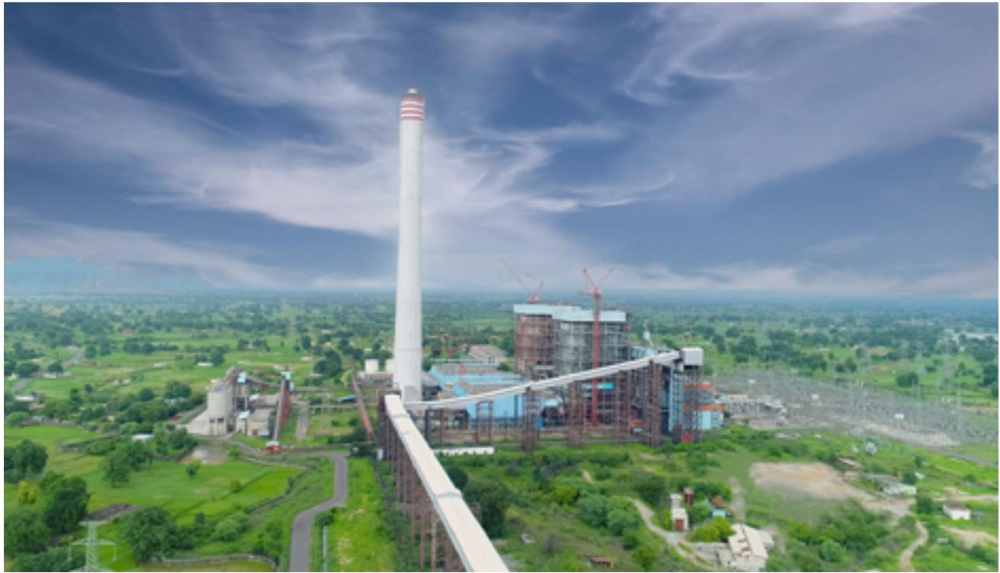

natural_image

Aerial view of an industrial facility with a tall chimney under construction, surrounded by green fields and distant mountains (no visible text or symbols)

# Mahan Energen Ltd. (Phase-I)

APL completed the acquisition of Essar Power M.P. Ltd. (EPMPL) through the National Company Law Tribunal process under the Indian Bankruptcy code in FY 2021-22. EPMPL was renamed Mahan Energen Ltd. (MEL) after acquisition. The Company owns and operates a 1200 MW coalbased thermal power station in Singrauli District in Madhya Pradesh. The power station comprises two units of 600 MW capacity each. The company has a power purchase agreement with Madhya Pradesh distribution companies to supply 5% of its net generation at a variable cost. At present, MEL is selling power under 200 MW medium term power purchase agreement for 23 months under the alternate power supply arrangement. The supply was started from 1st September, 2022. The balance capacity of around 920 MW is used for selling power under the short-term / merchant market. The plant is close to pithead, a competitive advantage related to fuel logistics cost.

# Highlights, FY 2022-23

ƒ The DISHA process implementation at MEL started on 11th July and was completed in 78 days.   
ƒ The Company’s IT integration was completed on 20th October.   
The Company formed sub committees and appointed a project information coordinator to start the Chetna project   
ƒ The Company completed the implementation of gensuite in October, 2022.

The Company completed the compilation of master data in January 2023.   
ƒ The Company conducted document segregation of all projects and completed placement in roof folders.   
The Company initiated Adani Workplace Management System.   
The Company implemented technology interventions of KRONOS, SAP mobility services and ARIBA.

# Under-construction plant

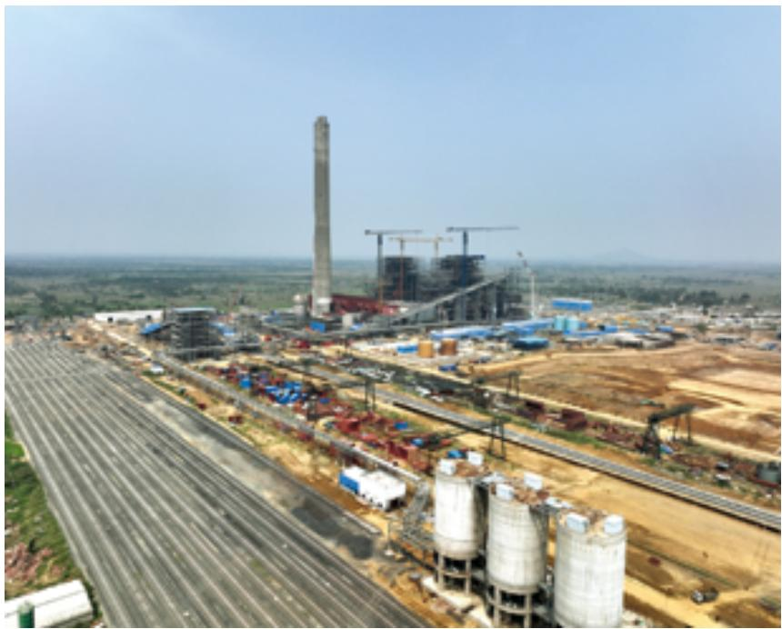

natural_image

Aerial view of a large industrial construction site with multiple storage tanks, cranes, and a tall chimney under development (no visible text or signage)

# Adani Power Jharkhand Limited, Godda

APJL is a special purpose vehicle project of APL in advanced stages of implementing a 1600 MW (2 x 800 MW) ultra-super-critical coal-fired thermal power plant in Godda, Jharkhand. The entire net output of the plant will be sold to a Bangladesh government entity through a cross-border transmission system under a longterm power purchase agreement executed in November 2017. Around 98% cumulative progress in project construction was achieved by 31st March, 2023. Unit 1 of the plant achieved COD on 6th April, 2023 while Unit-II was synchronised with the Bangladesh grid in May 2023.

# Under-development project

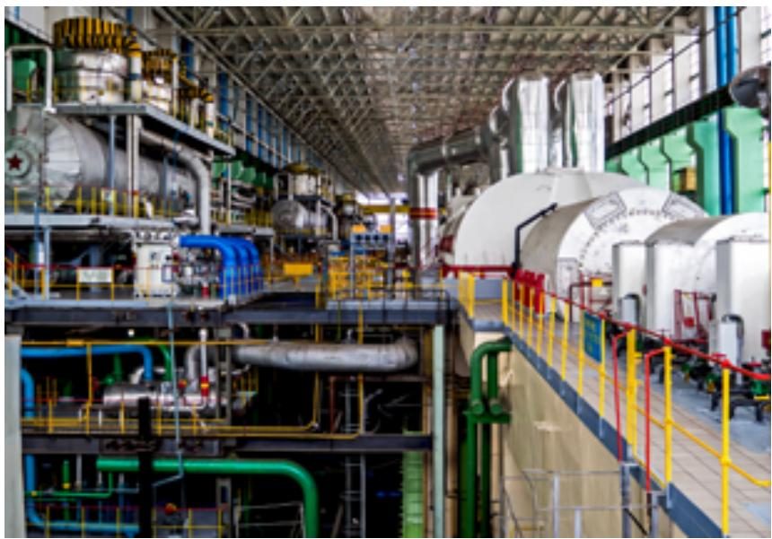

natural_image

Interior view of a large industrial plant with complex piping, valves, and machinery (no visible text or symbols)

# Mahan Energen Limited (Phase-II)

MEL is developing a 1600 MW plant with two ultra-supercritical units of 800 MW each under

Phase-II at the existing MEL site. The expanded capacity will be utilised to supply power under

1,230 MW long-term. The balance capacity of the expansion project will be utilised to supply power to short-term markets or to any long term power purchase agreements available in the future.

The Phase-II expansion project will source coal under the long term fuel supply agreements with Coal India Limited. Apart from this, sourcing of coal from commercial coal mines in the vicinity of the plant is also being planned as an additional fuel security measure to meet any shortfall in the agreed coal availability and meeting the balance fuel requirements of the Phase-II plant.

The Company’s expected commercial operation date for the first unit is December 2026 and for the second unit is June 2027.

APL IMS certifications status, FY 2022-23 

<table><tr><td>Sl. No.</td><td>Certification</td><td>Certification Name</td><td>Conferred by</td></tr><tr><td colspan="4">Mundra</td></tr><tr><td>1</td><td>ISO 9001:2015</td><td>Quality Management System (QMS)</td><td>TuV Nord</td></tr><tr><td>2</td><td>ISO 14001:2015</td><td>Environment Management System (EMS)</td><td>TuV Nord</td></tr><tr><td>3</td><td>ISO 45001:2018</td><td>Occupational Health &amp; Safety Management System (OHSMS)</td><td>TuV Nord</td></tr><tr><td>4</td><td>ISO 50001:2018</td><td>Energy Management System (EnMS)</td><td>TuV Nord</td></tr><tr><td>5</td><td>ISO 55001:2014</td><td>Asset Management System (AMS)</td><td>TuV Nord</td></tr><tr><td>6</td><td>ISO 46001-2019</td><td>Water Efficiency Management System (WEMS)</td><td>TuV Nord</td></tr><tr><td>7</td><td>ISO 27031:2011</td><td>Guidelines for information and communications technology readiness for business continuity (IRBC)</td><td>TuV Nord</td></tr><tr><td>8</td><td>ISO 22301:2019</td><td>Business Continuity Management System (BCMS)</td><td>TuV Nord</td></tr><tr><td>9</td><td>ISO 27001:2019</td><td>Information Security Management System (ISMS)</td><td>TuV Nord</td></tr><tr><td>10</td><td>SA 8000</td><td>Social Accountability International (SA)</td><td>TuV Nord</td></tr><tr><td>11</td><td>ISO 26001-2010</td><td>Social Responsibility (SR)</td><td>TuV Nord</td></tr><tr><td colspan="4">Tiroda</td></tr><tr><td>1</td><td>ISO 9001:2015</td><td>Quality Management System (QMS)</td><td>TuV Nord</td></tr><tr><td>2</td><td>ISO 14001:2015</td><td>Environment Management System (EMS)</td><td>TuV Nord</td></tr><tr><td>3</td><td>ISO 45001:2018</td><td>Occupational Health &amp; Safety Management System (OHSMS)</td><td>TuV Nord</td></tr><tr><td>4</td><td>ISO50001:2018</td><td>Energy Management System (EnMS)</td><td>TuV Nord</td></tr><tr><td>5</td><td>ISO 55001:2014</td><td>Asset Management System (AMS)</td><td>TuV Nord</td></tr><tr><td>6</td><td>ISO 46001-2019</td><td>Water Efficiency Management System (WEMS)</td><td>TuV Nord</td></tr><tr><td>7</td><td>ISO 27031:2011</td><td>Guidlines for information and communications technology readiness for business continuity (IRBC)</td><td>TuV Nord</td></tr><tr><td>8</td><td>ISO 22301:2019</td><td>Business Continuity Management System (BCMS)</td><td>TuV Nord</td></tr><tr><td>9</td><td>ISO 27001:2019*</td><td>Information Security Management System (ISMS)</td><td>TuV Nord</td></tr><tr><td>10</td><td>SA 8000*</td><td>Social Accountability International (SA)</td><td>TuV Nord</td></tr><tr><td>11</td><td>ISO 26001-2010*</td><td>Social Responsibility (SR)</td><td>TuV Nord</td></tr><tr><td colspan="4">Kawai</td></tr><tr><td>1</td><td>ISO 9001:2015</td><td>Quality Management System (QMS)</td><td>TuV Nord</td></tr><tr><td>2</td><td>ISO 14001:2015</td><td>Environment Management System (EMS)</td><td>TuV Nord</td></tr><tr><td>3</td><td>ISO 45001:2018</td><td>Occupational Health &amp; Safety Management System (OHSMS)</td><td>TuV Nord</td></tr><tr><td>4</td><td>ISO  $5000$ :2018</td><td>Energy Management System (EnMS)</td><td>TuV Nord</td></tr><tr><td>5</td><td>ISO 55001:2014</td><td>Asset Management System (AMS)</td><td>TuV Nord</td></tr><tr><td>6</td><td>ISO 46001-2019</td><td>Water Efficiency Management System (WEMS)</td><td>TuV Nord</td></tr><tr><td>7</td><td>ISO 27031:2011</td><td>Guidelines for information and communications technology readiness for business continuity (IRBC)</td><td>TuV Nord</td></tr><tr><td>8</td><td>ISO 22301:2019</td><td>Business Continuity Management System (BCMS)</td><td>TuV Nord</td></tr><tr><td>9</td><td>ISO 27001:2019*</td><td>Information Security Management System (ISMS)</td><td>TuV Nord</td></tr><tr><td>10</td><td>SA 8000*</td><td>Social Accountability International (SA)</td><td>TuV Nord</td></tr></table>

\* Being implemented

<table><tr><td>Sl. No.</td><td>Certification</td><td>Certification Name</td><td>Conferred by</td></tr><tr><td>11</td><td>ISO 26001-2010*</td><td>Social Responsibility (SR)</td><td>TuV Nord</td></tr><tr><td colspan="4">Udupi</td></tr><tr><td>1</td><td>ISO 9001:2015</td><td>Quality Management System (QMS)</td><td>BVI</td></tr><tr><td>2</td><td>ISO 14001:2015</td><td>Environment Management System (EMS)</td><td>BVI</td></tr><tr><td>3</td><td>ISO 45001:2018</td><td>Occupational Health &amp; Safety Management System (OHSMS)</td><td>BVI</td></tr><tr><td>4</td><td>ISO 5000:2018</td><td>Energy Management System (EnMS)</td><td>BVI</td></tr><tr><td>5</td><td>ISO 55001:2014</td><td>Asset Management System (AMS)</td><td>BVI</td></tr><tr><td>6</td><td>ISO 46001-2019</td><td>Water Efficiency Management System (WEMS)</td><td>BVI</td></tr><tr><td>7</td><td>ISO 27031:2011</td><td>Guidelines for information and communications technology readiness for business continuity (IRBC)</td><td>BVI</td></tr><tr><td>8</td><td>ISO 22301:2019</td><td>Business Continuity Management System (BCMS)</td><td>BVI</td></tr><tr><td>9</td><td>ISO 27001:2019</td><td>Information Security Management System (ISMS)</td><td>BVI</td></tr><tr><td>10</td><td>SA 8000</td><td>Social Accountability International (SA)</td><td>BVI</td></tr><tr><td>11</td><td>ISO 26001-2010*</td><td>Social Responsibility (SR)</td><td>BVI</td></tr><tr><td colspan="4">Raipur Energen Ltd.</td></tr><tr><td>1</td><td>ISO 9001:2015</td><td>Quality Management System (QMS)</td><td>TuV Nord</td></tr><tr><td>2</td><td>ISO 14001:2015</td><td>Environment Management System (EMS)</td><td>TuV Nord</td></tr><tr><td>3</td><td>ISO 45001:2018</td><td>Occupational Health &amp; Safety Management System (OHSMS)</td><td>TuV Nord</td></tr><tr><td>4</td><td>ISO 5000:2018</td><td>Energy Management System (EnMS)</td><td>TuV Nord</td></tr><tr><td>5</td><td>ISO 55001:2014</td><td>Asset Management System (AMS)</td><td>TuV Nord</td></tr><tr><td>6</td><td>ISO 46001-2019</td><td>Water Efficiency Management System (WEMS)</td><td>TuV Nord</td></tr><tr><td>7</td><td>ISO 27031:2011</td><td>Guidelines for information and communications technology readiness for business continuity (IRBC)</td><td>TuV Nord</td></tr><tr><td>8</td><td>ISO 22301:2019</td><td>Business Continuity Management System (BCMS)</td><td>TuV Nord</td></tr><tr><td>9</td><td>ISO 27001:2019*</td><td>Information Security Management System (ISMS)</td><td>TuV Nord</td></tr><tr><td>10</td><td>SA 8000*</td><td>Social Accountability International (SA)</td><td>TuV Nord</td></tr><tr><td>11</td><td>ISO 26001-2010*</td><td>Social Responsibility (SR)</td><td>TuV Nord</td></tr><tr><td colspan="4">Raigarh Energy Generation Ltd.</td></tr><tr><td>1</td><td>ISO 9001:2015^</td><td>Quality Management System (QMS)</td><td>TuV Nord</td></tr><tr><td>2</td><td>ISO 14001:2015^</td><td>Environment Management System (EMS)</td><td>TuV Nord</td></tr><tr><td>3</td><td>ISO 45001:2018^</td><td>Occupational Health &amp; Safety Management System (OHSMS)</td><td>TuV Nord</td></tr><tr><td>4</td><td>ISO 5000:2018^</td><td>Energy Management System (EnMS)</td><td>TuV Nord</td></tr><tr><td>5</td><td>ISO 55001:2014^</td><td>Asset Management System (AMS)</td><td>TuV Nord</td></tr><tr><td>6</td><td>ISO 46001-2019^</td><td>Water Efficiency Management System (WEMS)</td><td>TuV Nord</td></tr><tr><td colspan="4">Mahan Energen Ltd.</td></tr><tr><td>1</td><td>ISO 9001:2015*</td><td>Quality Management System (QMS)</td><td>TuV Nord</td></tr><tr><td>2</td><td>ISO 14001:2015*</td><td>Environment Management System (EMS)</td><td>TuV Nord</td></tr><tr><td>3</td><td>ISO 45001:2018*</td><td>Occupational Health &amp; Safety Management System (OHSMS)</td><td>TuV Nord</td></tr></table>

\* Being implemented   
^ Certification audit completed, certificate awaited

# How Project Beacon is strengthening our performance by leveraging advanced data analytics

# Overview

Project Beacon represents Adani’s dedication to integrating data and analytics into its core operations, fostering a culture of continuous improvement and innovation. With a focus on capability building, the initiative aims to establish the Analytics Centre of Excellence (ACoE) as a driving force behind performance uplift across the organisation. By harnessing the power of data analytics and associated tools, Adani seeks to optimise the performance of the Tiroda and Kawai plants initially and eventually replicate successful initiatives across its power plants and energy verticals.

Through Project Beacon, Adani aims to transform into a value-led, tech-first organisation, setting industry standards for analytical integration. By emphasising longterm capacity and skill building, the company strives to unlock the full potential of the massive data it collects. The establishment

of the ACoE is a pivotal step towards achieving this goal, enabling Adani to pioneer bestin-class analytical practices and drive sustained transformation and innovation throughout its operations.

Project Beacon is in the process of unlocking different levers of analytics, data modelling, AI/ML integration, etc. to increase the productivity and efficiency of Adani Power.

# Big numbers

# 44

Number of employees chosen for setting up the ACoE

# 200+

Number of analytics enthusiasts involved

# 1500+

Hours of training conducted (online / offline)

# 3

Number of bootcamps and hackathons events conducted for new ideas

# 12

Number of members in the Analytics Centre of excellence department at the Tiroda and Kawai plants

# 32

Number of members in the expert network for deepening analytics

# 8

Session of ‘Harnessing the Power of Analytics’, group wide showcase of actual analytics use cases

# Data analytics

Data analytics involves capturing and consolidating data before converting it into a structured format suitable for analysis. This clean data is then used to train algorithms, and the resulting models are rigorously tested using unseen test samples to ensure their robustness. Once the model is trained and validated,

it is applied to real-time data to evaluate its performance and generate actionable insights. These insights can then be integrated into the system to drive continuous improvements and meaningful outcomes.

# ACoE - Vision

To be a value-led, tech-first organisation pioneering best-in-class analytical integration

# Translating to strategic objectives

# 1

Enhance asset reliability

# 2

Create efficiency benchmarks

# 3

Promote best-in-class health and safety

# 4

Build capabilities to champion continued innovation

# Capability building and sustenance

Project Beacon has an important element of capability building of existing employees and sustenance. It aims at the capability building of Adani teams to enhance data-driven decision making and leverage the technology to take proactive actions. The project-built a crossfunctional team that supports various departments on advance analytics solutions.

The Analytics Center of Excellence (ACoE) has been conceptualised as a group of high-performing individuals responsible for driving analyticsled performance improvement across our operations. The establishment of a fully

functioning ACoE will support long-term capability building for sustained transformation and innovation.

To ensure a strong start, we have already assembled a 12-member ACoE Department team comprising individuals from Tiroda and Kawai. Additionally, a group of 36 ACoE expert network team members has undergone a comprehensive 4-month experiential camp focused on advanced analytics. Furthermore, we have a dedicated group of over 200 ACoE enthusiasts who have completed beginner-level analytics training and are eager to progress in their analytics journeys.

Our improvement scope

Value initiatives to be undertaken across all plant functions

# IGNITE INITIATIVES

Drive tangible performance improvement across 8 program KPIs

Station heat rate

Auxiliary power consumption

Availability

Fuel cost

O&M spend

Specific oil consumption

Water consumption

# SPARK INITIATIVES

Enabler initiatives that cuts across all aspects of life @APL

R&M, coal, ash

General & Admin functions

Canteen

Insurance

Support functions

Housing

Sustainability

\* These are only some of the areas covered

# Our fuel management and logistics excellence

# Overview

Adequate and timely availability of fuel is one of the most critical success factors determining the long-term viability of a power plant. In the Indian context, a power generator needs to manage a complex array of external interfaces to get access to adequate quantities of the fuel at reasonable cost, ensure its dispatch from mines in a timely manner, and manage its efficient delivery at the plant.

The Company’s fuel management function comprises a professionally skilled team with coal procurement specialists, logistics professionals, storage and quality control experts, and environmental compliance officers. The dedicated team works with all stakeholders, including coal suppliers, transportation agencies and regulatory bodies to ensure a smooth coal supply chain. Over the years, Adani Power developed expertise in a reliable fuel supply chain management to all thermal power plants.

Linkages: The Company’s longterm / medium-term coal linkages are tied up with Coal India Limited. Quarterly coal linkages are being secured under Shakti B (VIII) to address short-term demand requirements.

Investments: The Adani Group invested in coal blocks to strengthen its fuel supply chain and reduce dependence on external suppliers. The Company also invested in a coal block and is evaluating commercial coal blocks proximate to its power plants to reduce procurement costs.

Investment in railway wagons: Adani Group invested in railway schemes like the purchase of rail wagons under GPWIS Policy to transport coal by rail to its power plants. Fifteen rakes were inducted across railway routes. By implementing innovative transportation strategies, including rail logistics optimisation, APL minimised the transit time and logistics cost, enhancing supply chain efficiency.

# Infrastructure development:

Adani Power possesses superior plant infrastructure for the timely unloading of coal rakes. The Tiroda plant developed rail under rail facility (RUR) for a faster turnaround of coal rakes.

Railway siding: Adani Power’s Raigarh plant initiated the development of a captive rail siding by laying a railway line of \~ 40 Kms, connected to the Indian Railways network.

Captive trucks: The Adani Group invested in the deployment of a dedicated fleet to move coal by road from the mines to its plant under a long-term strategy.

Quality control: Adani Power implemented stringent quality control measures to ensure that the procured fuel addressed declared specifications. This included monitoring fuel quality at various stages, conducting regular testing and collaborating with suppliers to maintain consistent coal quality across receipts. Dedicated teams at dispatch points ensured the supply of quality coal to the power plants under improved supervision.

Storage management: The Company’s advanced coal storage management system

enhanced inventory accuracy, reduced losses and ensured coal availability during peak demand periods.

Collaborative partnerships: The Company collaborates with coal suppliers, transportation agencies and regulatory bodies, improving the efficiency of the coal supply chain.

Risk management: The Company possesses vast experience in managing risks associated with fuel supply chains. This includes anticipating and mitigating potential disruptions in fuel availability, price fluctuations and other market uncertainties that could impact the supply chain.

Continuous improvement: The company focuses on continuous fuel supply chain improvement by adopting advanced technologies, data analytics and optimisation techniques to enhance efficiency, reduce costs and minimise environmental impact through a smart fuel supply chain.

# How we have deepened a culture of technological excellence at Adani Power

# Overview

At Adani Power, we recognise that most businesses are transforming from the analog to the digital. The extent of digitalisation influences competitiveness and future orientation.

In line with this, digital transformation has emerged as a key Adani Group objective. At APL, we believe that ‘The best way to predict the future is to create it.’ The Company

has embarked on the journey of digital transformation by embracing new technologies and changing the ways of doing business.

The integration of digital technologies across business functions has transformed the way the company is structured to enhance stakeholder value. As a result, digitalisation has transformed from a technology catalyst into a culture driver.

# Our technology initiatives

Cloud transformation: The Company embarked on a journey of cloud transformation. Over the last two years, the company developed a digital technology stack that enables leaner and agile operations serving a scalable foundation. The company migrated its enterprise resource planning platform to cloud (migrated to SOH (Suite on HANA)) and SAP instance separation among business units). The platform was upgraded to an efficient database layer that provides scalable and analyticsempowered solutions.

# Automated control systems:

The Company’s automated measurement and control systems enhanced systemic reliability leading to informed decision-making. A standardisation in business practices across locations led to consistent, efficient and uniform IT practices across power generating units. The DISHA processes emerged as a standardised model for mergers and acquisitions. These practices and processes generated realtime online data on a stateof-the-art IT platform. DISHA processes were rolled out during the initial implementation phase at Mundra, Tiroda, Kawai and Udupi in 2016-17. These processes were rolled out in the acquired entities of Raipur Energen Limited and Raigarh Energy Generation Limited in 2018-19. The Company extended these practices to Mahan Energen Ltd. following its acquisition in FY 2022-23.

Decision support systems: The Company’s business decisions were supported by IT platforms. Real time plant information management system facilitated the collection of operational data and offered deep insights to operational managers. The result is that inventory management, logistics, procurement and financial management are supported by an industry standard enterprise resource planning framework, enhancing resource and capital efficiency.

Continuous: At APL, human resource management is critical to organisation success. All new IT projects are supported with adequate familiarisation and training programs for users. The organisation rolled out e-learning platform (e-vidyalaya) where users absorbed the latest technical and non-technical domains.

# Work from anywhere: The

Company unlocked the potential of remote working following the migration of business applications to cloud, providing ubiquitous access. Stakeholders are provided cloud-based options that empower them to access data from multiple devices. Online meeting applications enabled instantaneous multimedia communication across locations, obviating the need for travel. This helped mitigate the business impact on time, costs and the environment.

# Technology inclusion and

proliferation: The Company’s digital projects identified (as a part of the stakeholder lifecycle grid) the digital and analytical roadmap; problem solving exercises were tracked in incubation labs. The project commissioning process comprised a sequence of steps from the standard procedure of obtaining a project commencement certificate followed by an architecture review by a centralised expert group, proofof-concept/ pilot – a concept-tocommissioning approach. These projects were rolled out as a valuation multiplier.

Automation: The Company implemented artificial intelligence and machine learning to address business use cases. It executed projects based on these technologies to address real-world problems in powerplant operations and supporting processes. Robots (physical and virtual) were utilised; robotic process automation was adopted to reduce human effort in repeatable tasks, which enhanced human resource productivity.

International best practices: The organisation followed Information technology infrastructure library best practices for IT processes like change management, asset management and service management. As IT platforms emerged as the backbone of business processes, continuity of business required an uninterrupted access to IT systems and applications. The Company implemented a business continuity management system conforming to international standards pertaining to ISO 22301:2019.

# C A S E S T U D I E S

# Fire and smoke detection at APL, Tiroda

# Challenge

The Company’s safety department monitored fire and other incidents manually, based on the sensor readings and human observations. There was a chance of missing event reporting as the sensor had coverage limitations, making human interventions necessary.

# Solution

The Company’s IT department suggested an artificial intelligence/ machine learningbased solution, where manual

monitoring could be eliminated. The system monitored safety parameters with alerts. The Company introduced artificial intelligence/ machine learningbased fire and smoke detection system using the existing CCTV network (using video/image analytics technology).

# Uniqueness

All locations possess established fire control rooms to monitor fire incidents. However, these solutions can track heat and smoke, helping in the identification of hidden fires.

# Functionality

The solution receives video feeds through the CCTV system.   
The solution scans for the occurrence of fire/smoke in the video feed.   
ƒ An audio alert pops in the fire control room with the video alert sent to stakeholders in the event of a mishap.   
The solution captures the incident as an audit log; video (pre and post-incident) is available for investigation

# Truck emptiness detection at APL, Udupi

# Challenge

There was room for weighment malpractice when an empty truck picked material from the plant. There was a possibility of dispatching material without authorisation when an empty truck left the plant following unloading.

# Our solution

The Company developed artificial intelligence/ machine learning-based image analytics solution to detect truck emptiness.

# Uniqueness of the solution

The solution analyses the aerial truck view through a special graphics processing unit and confirms whether the truck is indeed empty.   
The status of whether the truck is empty or not is displayed on the operator’s console.   
The operator retains the option to cross-verify the system generated result with the actual photo of the aerial truck view. Once the operator confirms, the weight is printed in case

if the truck is not empty; the operator asks the truck driver to remove the suspected material from the truck and ask for a reweighment.

The solution uses a machine learning algorithm; its accuracy improves with time.

# Functionality

Artificial learning/ machine learning solution provides artificial vision sense supported by the high-grade graphics processing unit with parallel processing capability.

text_image

CORPORAT
STATUTO
FINANCIAL
How APL strengthe

# How APL strengthened data privacy and cyber risk management

# Overview

At Adani Power Limited, we recognise that in the business of generating power in a continuous way for consumer benefit, there is a premium on uptime. The company needs to engage in a range of initiatives that protect plant availability. One of the most critical initiatives is the capacity to protect the company’s digital architecture so that all digital systems and processes can

remain operative and enhance overall plant productivity.

Most business processes depend on computers, computer networks and systems coupled with information storage. This warrants complete information confidentiality, availability and integrity; there is a need to ascertain that information is not stolen, corrupted by malware,

altered / accessed inappropriately or illegally used for fraudulent ends.

According to the World Economic Forum, growing cyber threat is among the greatest global risks for companies and governments. Cyber-attacks have become increasingly aggressive; cyber security breaches cost the company in financial and competitive ways.

In case of the power sector, while the installation of information and communication technology devices improved automation and control of the smart power system equipment, it made the system vulnerable to cyber threats. Recurring incidences of cyber security threats in India and other countries enhanced the importance of a robust cyber security system. The government and regulatory agencies introduced compliance requirements for power sector entities.

# APL and cyber security

APL’s business processes and day-to-day functions are automated and interconnected through information technology. The company’s core business operations are dependent on information and communications technology. This makes it imperative to develop a robust cyber security system.

APL’s formal cyber security program is structured around international standards including ISO 27001. The organisation endeavours to extend beyond the power industry’s cyber security best practices. This strategy prioritises the detection, analysis and response to known, anticipated and unexpected cyber threats, the effective management of cyber risks and resilience against cyber incidents.

The Company deepened its cyber security governance with direct Board oversight to prevent breaches. The information technology and data security sub-committee at Board level is the highest governing body responsible for the review of the cyber security function. APL created a dedicated team to address cyber security governance.

APL developed a formal cyber security policy to ensure that all information and cyber assets - including data, intellectual property, computer systems and information technology equipment - are adequately and consistently protected from damage, inappropriate alteration, loss and unauthorised use. The cyber security risk identification, prioritisation and management are effectively integrated within the organisation’s risk management framework. APL implemented the Information

Security Management System (ISMS) under the process of certification for ISO-27001 standard.

APL is engaged in the improvement of cyber security across three dimensions - people, process and technology. Multiple institutional arrangements and implementation mechanisms have helped minimise cyber security breaches. Several organisational actions ensure that cyber security of systems and processes include the implementation of extensive technical controls across the information technology and operational technology infrastructure. This includes a complement of network firewalls, anti-virus software, data loss prevention, endpoint encryption, active directory, multi-factor authentication, web proxy and virtual private network, among others.

# Dimensions of our cyber security strategy

People dimension: The Company developed e-learning modules as a part of the onboarding process to enhance employee awareness. The cyber security policy aims to provide relevant education and training. The users are made aware of the ongoing cyberattacks and frauds by e-mailers and other digital communication mechanisms. Periodic phishing simulations determine employees at risk and necessary training.

# Process dimension: The

Company performs detailed analysis of CIA (confidentiality/ integrity/ availability) rating for all enterprise level applications. The Company will continuously assess and monitor the resilience of information technology infrastructure to proactively identify potential cyber risks; periodical vulnerability analysis is performed for IT infrastructure along with its associated applications.

Technology leadership: APL implemented detective and preventive controls across the technology landscape to safeguard against cyber threats like malware and

ransomware. All interfaces with external networks are protected using network firewalls. A multi factor authentication for all users accessing the company’s infrastructure has enhanced safety. Remote access for users has been provided using secure means. The use of removable media devices has been controlled and all sensitive information transfers are monitored. Data backup and restoration has enhanced the availability and integrity of business information.

# Cybersecurity projects review:

APL’s digital projects undergo architecture review, which addresses cyber security in the project phase by ensuring that cyber security objectives are included in project objectives or

charter, and cyber security risks assessment is conducted at an early project stage to identify required controls.

# Constant monitoring and

vigilance: The Company implemented continuous control monitoring to assess the adoption and performance of security controls. A dedicated cyber defense center was established for performing continuous monitoring of the cyber security posture to detect and respond to security incidents. APL suffered no impact on its operations during the reporting period on account of cyber incidents or security breaches.

natural_image

Digital illustration of a hand interacting with a futuristic digital interface featuring cloud, network, and lock icons (no text or symbols)

K N O W L E D G E C A P I TA L

# How we are building a great team at Adani Power

# Overview

The company’s business is driven by the quality of its talent., catalysed by skill renewal and benchmarking with the best standards. The objective of the company is to be respected as one of the best workplaces in its sector.

At Adani Power, the company’s focus is to enhance competitiveness. In a business marked by the need to make timely investments, enhance capacity and maximise operational efficiency, there

is a consistent premium in strengthening the operating culture around meritocracy, diversity and all around efficiency.

The Company expects to enhance the role of knowledge cum experience over the conventional perspective of people retention. In doing so, the company intends to strengthen team effectiveness, deepen learning orientation and enhance productivity.

# Our human resource goal

The Company’s human resource goal is to create a workforce that is aligned with the organisation’s mission, vision and values. The Company aims to attract, develop and retain top talent to create a work environment that promotes employee engagement, growth and productivity. The Company aspires to develop a positive and productive work environment that supports the organisation’s success.

# Our overarching policy

# Recruitment and selection:

Recruitment is a crucial aspect of talent effectiveness as it directly impacts the quality, diversity and productivity of the organisation’s workforce. APL uses recruitment strategies that can attract a diverse pool of candidates; it has employed a rigorous selection process to ensure that it hires the right talent. With a focus to build a strong talent pipeline and improve diversity, Adani Power hires graduate engineer (trainees) from top NIRF-ranked colleges. The Company implemented bestin- class recruitment platforms for enhanced experience to the prospective hires and to improve turn around time. The Company’s initiatives like Adani Summer Internship Programme (ASIP) and Accelerated Leadership Programme (ALP) are gaining momentum in the creation of a strong talent network.

# Learning and development:

Adani Power invests in employee learning and development. The employees are provided opportunities to learn skills, attend workshops and conferences. The Company runs Fulcrum, a flagship senior leadership development programme conducted round the year. The Company runs learning and development programmes like Takshila (sixmonth certification programme in collaboration with ISB, Hyderabad) and Northstar, which collaborates with prestigious universities. The Company launched Adani Functional Leadership Programme (AFLP) in 2022-23 where young talents are mentored by top leaders for a year. The Company conducts the First Time Manager programme for employees promoted to managerial roles. The Company increased the training duration for graduate engineer trainees to nine months, resulting in holistic development.

# Performance management:

The Company’s performance management system helps employees understand their roles and responsibilities, set goals and receive feedback. A focus on performance conversation helps set expectations from both sides (subordinates and managers). The robust process of third-party behavioural assessment helps identify high potential employees. The Company ensures a fair job evaluation to ensure the right fitment in appropriate grades.

# Succession planning: The

Company’s succession planning framework identifies capable leaders ready to assume critical roles. The process begins with the identification of critical roles and appropriate functional and behavioural competencies to identify potential successors for roles. Based on the identified gaps, Individual Development Plans are prepared and successors groomed. The Company constituted a two-tier talent council at the corporate and plant levels to review talent development.

# Diversity and inclusion: The

Company promotes workplace diversity and inclusion. The Company created a culture that values differences and provides equal employee opportunities. There has been a conscious effort to improve diversity by improving the gender mix at the entry level.

# Human resource initiatives, FY 2022-23

Talent acquisition: Adani Power focused on talent acquisition, collaborating with the Adani Group to hire around 300 graduate engineer trainees from the top 100 NIRF-ranked colleges.

# Employee engagement:

The Company implemented initiatives to improve employee engagement. It conducted employee engagement surveys, internal customer satisfaction

surveys, employees connect programs, wellbeing programs and employee recognition programs.

Integration of newly acquired entity at Mahan: The Company harmonised the integration of the recently acquired Mahan plant through role-based titles. The Company’s policies were seamlessly implemented.

Learning and development: The Company implemented learning initiatives such as Fulcrum, Takshila, Northstar and First time

Managers. It adopted e-learning modules under e-vidyalaya.

# How we have enhanced skilled through improved training intensity

# Assessment of the current skill

level: The Company conducted skill assessments by several globally reputed consultants with performance evaluation and employee feedback.

# Development of a training

plan: The Company’s training team developed training plans based on skill assessment,

aligned with business goals and employee needs.

# On-the-job training: The

Company conducted on-thejob training, provided practical experience and guidance through shadowing, coaching, and mentoring.

Workshops and seminars: The Company conducted workshops

and seminars to provide employees with specific skills. The employees participated in external workshops and seminars.

# Using e-learning modules:

The Company’s employees were provided access to online courses to learn at their own pace.

# Outcomes of our human resource initiatives

# Improved employee engagement:

The Company’s human resource initiatives improved employee morale, motivation and job satisfaction to increased productivity and performance.

# Enhanced skills and

competencies: Training and development helped employees

acquire skills leading to improved performance, efficiency and decision-making.

# Improved efficiency:

Process automation helped improve efficiency, reducing administrative burden, improving data accuracy and accelerating decisions.

# Improved risk management:

The Company’s compliance and risk management programs are helping mitigate human resource-related risks. This leads to improved legal compliance, reduced legal liability and improved reputational management.

# How we have emerged as a learning organisation

# Promotion of continuous

learning: The Company provided employees with training and development programs coupled with job shadowing. This helped employees acquire skills, recognised through reward and recognition programmes.

Fostering a learning culture: The Company encouraged employees to assume risks, experiment, and

learn, creating an environment where employees are comfortable sharing ideas and learnings.

# Measuring learning outcomes:

The Company measures learning outcomes by tracking employee performance, collecting feedback and conducting surveys (annual performance assessment and Gallup Engagement

Survey) that indicate gaps and programme effectiveness.

# Using technology to support

learning: The Company provides employees with access to e-learning platforms, mobile learning apps and other digital resources. The recording of online training sessions is available on online collaboration platforms, making learning accessible.

# How we have created a balanced lifestyle for employees

# Health and wellness programs

Adani Power offers health and wellness programs like annual health screenings, tele-consultation with specialist doctors and consultation under stress.

# Employee Assistance Programs

The Company offers Employee Assistance Programme (EAP) that counsels and supports services for employees and their families.

# Time off and leave policies

The Company offers generous time off and leave policies (relocation, maternity and paternity).

# Recognition and rewards programs

The Company offers recognition and reward programs that celebrate employee achievements.

# Challenges and responses

The advent of remote working turned the talent market into a competitive arena. This started affecting attrition rates. The pandemic enhanced the importance of employee wellbeing and retention.

The Company reviewed and benchmarked its compensation and benefits for GETs with peer companies. with peer companies. This helped reduce dropout rates from the fresh batch of GETs. The Company created a supportive culture of wellness by providing

employees opportunities while taking care of their health. The Company’s employee wellness programs helped employees feel valued.

# Highlights, FY 2022-23

Employee well-being: The Company’s people management function prioritised employee well-being by offering wellness awareness sessions, mental health support and teleconsultation to support worklife balance.

Increased diversity, equity and inclusion: The Company’s human resource function prioritised diversity, equity and inclusion initiatives.

# Increased use of technology:

The Company’s human resource functions leveraged technology to streamline processes (recruitment, onboarding and performance management) and the use of data analytics and automation tools.

Upskilling and reskilling: The Company’s human resource functions prioritised upskilling and reskilling to prepare

employees for new roles and emerging technologies.

Increased emphasis on employee engagement: The Company’s human resource function prioritised engagement initiatives to improve satisfaction, retention and productivity. These included surveys, outcome sharing and action plans that promotes employee recognition, career development opportunities and care of employees.

# We are an equal opportunity employer

Job postings are inclusive and free of bias   
Diverse recruitment sources such as job boards, collages and internal references are used

Blind resume screening eliminates unconscious bias   
Interview questions are fair and objective

Awareness programmes cover diversity and inclusion   
Fresher recruitment from colleges covers different States

# Way forward, 2023-24

Implement job architecture and role-based titles   
Expand Analytics Centre of Excellence to different plant locations   
Implement rewards and recognition for analytics enthusiasts, analytics experts and core Analytics Centre of Excellence members

Enlarge the number of enthusiasts, experts and core members by imparting analytics training   
ƒ Strengthen a succession planning framework and institutionalise the same.   
ƒ Embrace technology and reconfiguration of Picasso

ƒ Invest in human resource talent for critical roles   
Optimise manpower productivity through technology

Employees   
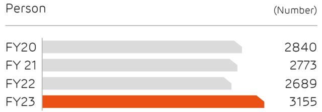

bar

| Person | Number |
| :--- | :--- |
| FY20 | 2840 |
| FY 21 | 2773 |
| FY22 | 2689 |
| FY23 | 3155 |

Average age   
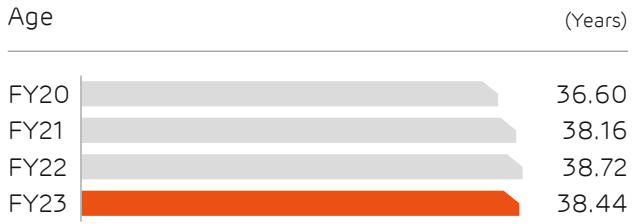

bar

| Age | Value (Years) |
|---|---|
| FY20 | 36.60 |
| FY21 | 38.16 |
| FY22 | 38.72 |
| FY23 | 38.44 |

Employees by age group   
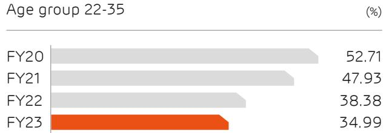

bar

Age group 22-35
| Year | Value (%) |
| :--- | :--- |
| FY20 | 52.71 |
| FY21 | 47.93 |
| FY22 | 38.38 |
| FY23 | 34.99 |

Employees by age group   
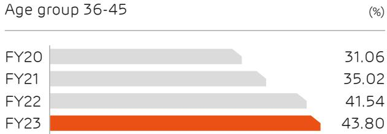

bar

Age group 36-45
| Year | Value (%) |
| :--- | :--- |
| FY20 | 31.06 |
| FY21 | 35.02 |
| FY22 | 41.54 |
| FY23 | 43.80 |

Employees by age group   
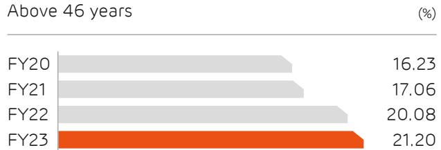

bar

Above 46 years
| Period | Value (%) |
|---|---|
| FY20 | 16.23 |
| FY21 | 17.06 |
| FY22 | 20.08 |
| FY23 | 21.20 |

Person-hours spent towards training   
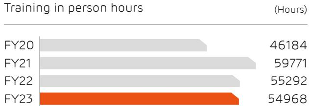

bar

Training in person hours (Hours)
| Year | Training hours |
| :--- | :--- |
| FY20 | 46184 |
| FY21 | 59771 |
| FY22 | 55292 |
| FY23 | 54968 |

Profile of employees as per education 

<table><tr><td>Year</td><td>FY20</td><td>FY21</td><td>FY22</td><td>FY23</td></tr><tr><td>Total employees</td><td>2840</td><td>2773</td><td>2689</td><td>3155</td></tr><tr><td colspan="5">By qualification</td></tr><tr><td>Graduates</td><td>48%</td><td>49%</td><td>49%</td><td>54%</td></tr><tr><td>Post-graduates</td><td>23%</td><td>22%</td><td>22%</td><td>22%</td></tr><tr><td>Others</td><td>29%</td><td>29%</td><td>28%</td><td>24%</td></tr><tr><td colspan="5">By professional qualification</td></tr><tr><td>Engineers</td><td>60%</td><td>61%</td><td>61%</td><td>63%</td></tr><tr><td>Chartered Accountants</td><td>2%</td><td>2%</td><td>1%</td><td>1%</td></tr><tr><td>MBAs</td><td>5%</td><td>5%</td><td>5%</td><td>5%</td></tr></table>

Attrition rate   
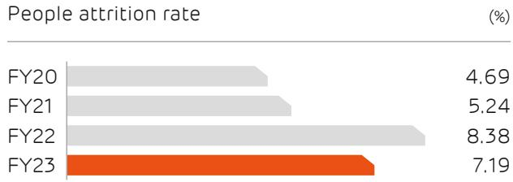

bar

| Year | People attrition rate (%) |
| :--- | :--- |
| FY20 | 4.69 |
| FY21 | 5.24 |
| FY22 | 8.38 |
| FY23 | 7.19 |

Average remuneration   
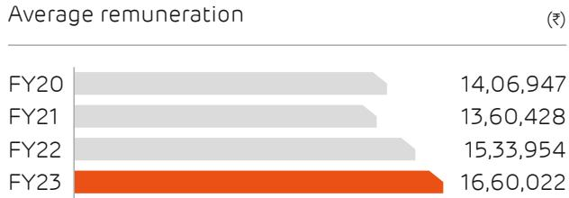

bar

Average remuneration (₹)
| Year | Average remuneration (₹) |
| :--- | :--- |
| FY20 | 14,06,947 |
| FY21 | 13,60,428 |
| FY22 | 15,33,954 |
| FY23 | 16,60,022 |

Person-years of organisational experience   
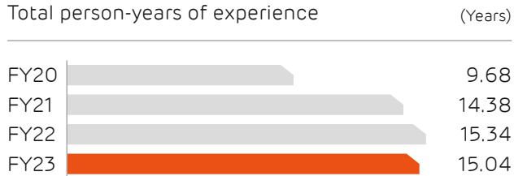

bar

Total person-years of experience (Years)
| Year | Total person-years of experience (Years) |
| :--- | :--- |
| FY20 | 9.68 |
| FY21 | 14.38 |
| FY22 | 15.34 |
| FY23 | 15.04 |

Employees by tenure   
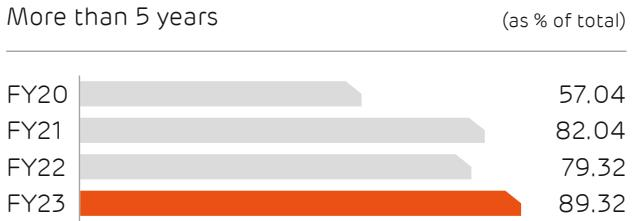

bar

More than 5 years (as % of total)
| Period | Value (%) |
|---|---|
| FY20 | 57.04 |
| FY21 | 82.04 |
| FY22 | 79.32 |
| FY23 | 89.32 |

Training coverage of the organisation   
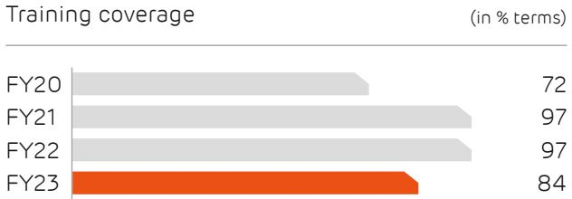

bar

Training coverage (in % terms)
| Year | Training coverage (%) |
| :--- | :--- |
| FY20 | 72 |
| FY21 | 97 |
| FY22 | 97 |
| FY23 | 84 |

Person-years of organisational experience   
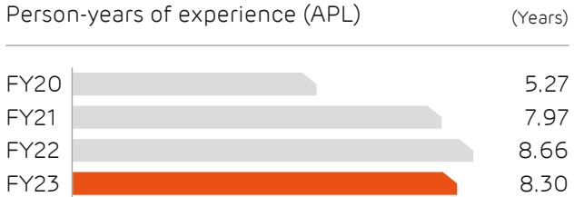

bar

Person-years of experience (APL) (Years)
| Year | Person-years of experience (APL) |
| :--- | :--- |
| FY20 | 5.27 |
| FY21 | 7.97 |
| FY22 | 8.66 |
| FY23 | 8.30 |

text_image

90
ADANI POWER LIMITED
ANNUAL REPORT 2022-23

PART 5

# Seeding responsibility in profitability

R E S P O N S I B I L I T Y

# How we deepened our environment responsiveness at Adani Power

# Overview

At Adani Power, we are a thermal power electric utilities company that has a significant environment impact. The sector enhances air pollution through sulphur oxides, nitrogen oxides, particulate matter emissions as well as greenhouse gas emissions. Besides, the sector also causes mercury, arsenic, lead and other emissions. The coal power plants require huge quantities of water for cooling. Moreover, the dust from coal-cleaned water contaminates groundwater if disposed without treatment and causes water

pollution. The usage of boilers, turbines and crushers create noise pollution.

In view of this, it is critical for the company to ensure relevant measures to limit the environmental impact. The Company adheres to requirements pertaining to local, state and central environmental regulations. Besides, the company strives to explore and use the best technologies to improve operational efficiency and reduce the environmental footprint.

# Our operational pollutants

Solid: Coal burning generates large quantities of fly ash. Besides, hazardous waste includes used/spent oil, discarded containers, oil-soaked waste, spent ion exchange, effluent treatment plant sludge and nonhazardous waste includes used reverse osmosis membrane, fly ash, plastic waste, wooden waste, paper waste, organic waste and other types of waste like biomedical waste and e-waste.

Liquid: Wastewater generated and discharged are included as operational pollutants.

Air: Major air pollutants from thermal power generation comprises of greenhouse gases, stack emissions (sulphur oxide, nitrogen oxide and particulate matter), mercury and arsenic.

# Our pollution control initiatives

At Adani Power, we are growing more conscious of the impact we have on our surroundings, water, air and the larger ecosystem. The Company had set specific limits on the total permissible stack and other emissions from the operations in accordance with the State and Central Pollution Control Board regulations. Waste generated from operations both hazardous and non-hazardous are either treated and then sent to disposal facility or directly sent to the recycling facility depending on the type of waste. The wastewater from operations undergoes treatment in the sewage treatment plants and effluent treatment plants to remove chemical and biological matter before being discharged.

Adani Power has been responsive to new technological innovations by adopting them in its operations. The Company has adopted new technologies in various instances such as the first supercritical power plant in India and 800 MW unit for power generation and various other energy, efficiency and equipment. The adoption of new technologies and promotion of research and development in the electric utilities sector have helped in enhancing environment sustainability. The Company established a fly ash utilisation promotion and research at Tiroda and invested in ultracritical technologies aimed to minimise the consumption of starter fuel for generating sparks. The Company engaged with the Advanced Materials and Processes Research Institute (AMPRI), Bhopal for research on fly ash utilisation for soil conditioning.

Adani Power Training and Research Institute (APTRI) is the research and performance consulting centre of Adani Power that endeavours to contribute to the global sustainability and Indian skill development initiatives through its scientifically designed and organisational need-based customised program. The programs and activities are aimed at performance and efficiency improvement as well as enhancement in the delivery of electricity. The Company’s

research and performance consulting programs and activities cover the entire electric power value chain including coal mining, logistics, thermal and solar power generation, transmission, distribution and end use of electricity. The institute shares its expertise in niche areas of port operations, water management and cement manufacturing. The world-class infrastructure and capability in terms of program design, delivery, faculty and content quality of APTRI at Mundra has been well recognised and the centre is accredited as grade ‘A’ and Category–I institute by the Central Electricity Authority, Ministry of Power, Government of India.

The Company aims to lead India’s initiatives in achieving greenhouse gas reduction targets by evaluating the possibility of the potential implementation of ammonia as a fuel in thermal power generation that could utilise green hydrogen-derived ammonia in existing thermal power generation.

# APL’s commitment and targets

\- To be among the five leading companies in India for ESG benchmarking of the electric utility sector by FY 2023-24

ƒ Specific GHG emissions stood at around 0.84 tCO2e/MWh by 2025

ƒ Explore net carbon neutral possibilities and public disclosures by 2023-24

ƒ 7.85 million tree plantation target till 2030 as a part of 100 million tree plantation pledge   
Single-use-plastic-free certified company for 100% of operating locations by 2023-24   
ƒ Integrate with management systems in the company to conduct business with no net loss to biodiversity and 100%

alignment with India Business Biodiversity Initiative (IBBI) and public disclosures

Building a green supply chain through the integration of associates for 100% of critical supplies by FY 2023-24   
ƒ Systematic materiality assessment and integration with

management systems in the company

Inclusive growth including communities by undertaking corporate social responsibility initiatives aligned with business impacts to leave a positive footprint and enhances ocietal happiness

# Performance highlights, FY 2022-23

ƒ Specific GHG emissions was around 0.85 tCO2e/MWh   
ƒ The water intensity performance was 2.31 m3/MWh for FY 2022-23 which was 34 %

lower than the statutory limit for hinterland plants (3.50 m3/ MWh) and 7.6 % lower than the stretched internal target of 2.50 m3/MWh

APL achieved ash utilisation of 100%   
ƒ Seven of nine locations were certified with the single-use plastic-free certification

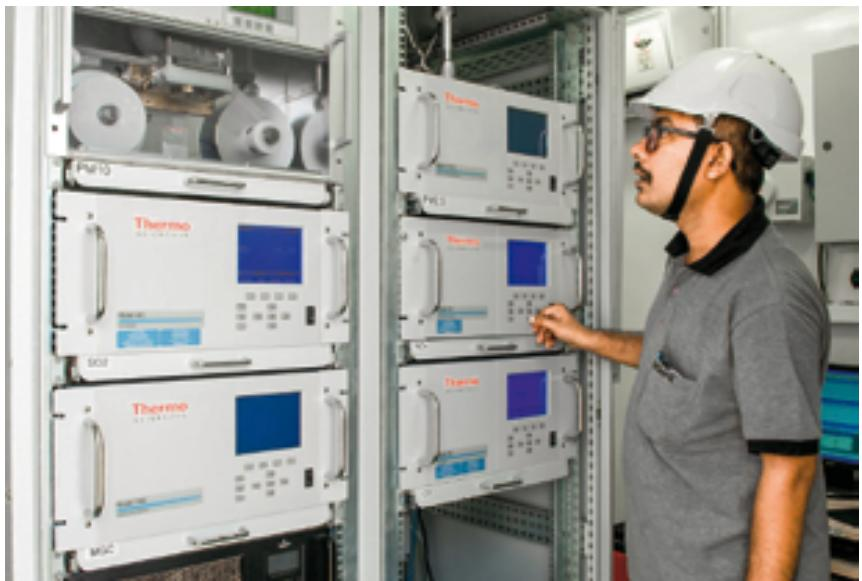

natural_image

Technician in hard hat inspecting industrial control panel with Thermo devices (no visible text or symbols)

# Air emissions management

The Government of India set up specific limits on water and stack emissions from thermal power plants for sulphur oxides, nitrogen

oxides, particulate matter and mercury in 2015. The Central Electricity Authority mandated all operating power plants to install suitable devices to achieve new emission standards. With the aim

of improving combustion control and reducing emissions, the company is expected to invest in advanced technologies that will monitor impacts on account of air emissions, aiming to control air pollution at source through efficient technologies, controllers and tall stacks. The Company ensured that air emissions and mercury content were within the permissible limits of State and Central Pollution Control Board regulations. The Company’s operations did not produce ozone depleting substances in processes, products and services. While all existing operational units were already compliant with the new emission standards for mercury and particulate matter, some units were in the process of installing new devices to address sulphur oxide emission norms.

<table><tr><td>Air emissions (MT)</td><td>FY23</td><td>FY22</td><td>FY21</td></tr><tr><td>Nitrogen oxides</td><td>83,483.38</td><td>87,279.83</td><td>91,232</td></tr><tr><td>Sulphur oxides</td><td>219307.70</td><td>232,278.78</td><td>224,861</td></tr><tr><td>Particulate matter</td><td>10,718.59</td><td>9,824.37</td><td>10,695</td></tr></table>

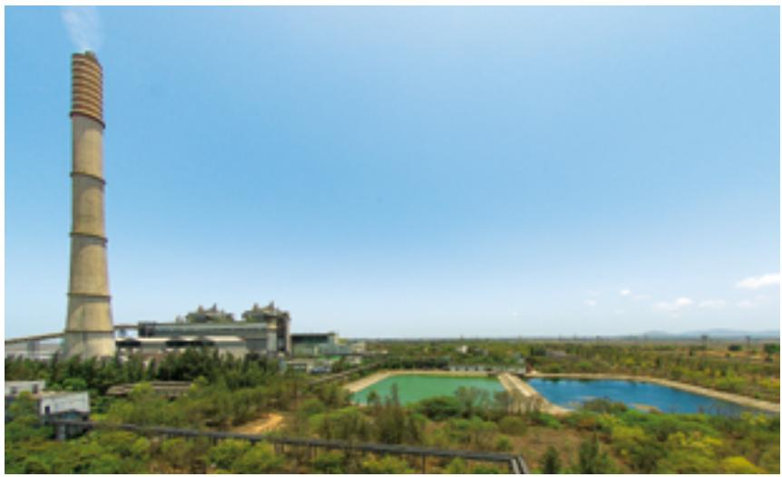

natural_image

Exterior view of an industrial plant with a tall chimney and water features under a clear blue sky (no signage or text visible)

# Carbon footprint reduction

The Indian government aims to achieve 50% of India’s installed power generation capacity from non-fossil fuel sources by 2030.

Adani Power Limited (APL), a leading private thermal power producer, is actively addressing its carbon footprint through Environmental, Social, and Governance (ESG) initiatives.

A novel solution proposed by APL was co-firing liquid green ammonia, a non-carbonaceous non-fossil fuel, with coal in thermal power plants. This reduces CO2 emissions and overall carbon intensity by utilising green hydrogen for ammonia synthesis. APL partnered Kowa Company Limited and IHI Corporation of Japan, known for their successful ammonia co-firing technology, to study the feasibility of implementing 20% co-firing in an existing power generation unit in Mundra. The results will guide the potential implementation in other power generating units.

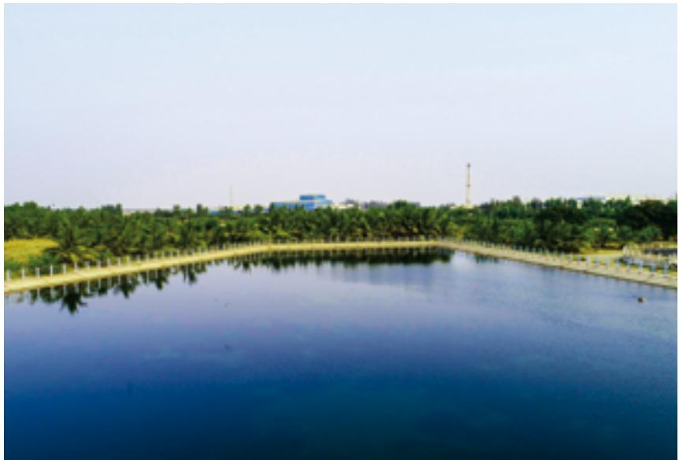

natural_image

Aerial view of a calm lake surrounded by green trees and a wooden walkway, with distant industrial buildings under a clear sky.

# Water management

Water is a crucial resource required in plant operations. The Company established strict measures for water conservation at each of the power plants and

optimised the systems to reduce water consumption. At present, the company reused 100% of the treated wastewater in hinterland plants. The Company ensured compliance with applicable

statutory conditions laid by the Ministry of Environment / Central and State Pollution Control Board for locations, where zero discharge is mandated. The Company treated the sewage/ effluents in the sea-based power plants as per the statutory limits before discharge.

The Company accomplished its water conservation objectives by participating in multi-stakeholder partnerships, working with the civil society. The Company ensured zero liquid discharge at the plant level and restricted specific water consumption to 2.31 m3/MWh of surface water consumption at the hinterland plants.

The Company set an integral of 9.5 m3/ MWh at Mundra with seawater-based flue gas desulphurisation (FGD) and 6 m3/ MWh at Udupi without seawaterbased flue gas desulphurisation.

The Company strives to lessen the impact on the surroundings by adopting an inside-out approach. Water conservation is considered to be a priority area for the company. The Company will continuously innovate and make technological advancements to ensure business efficiency. The Company recognises worsening environmental impacts due to the improper disposal of wastewater. The company considers ecotoxicology, nitrogen content, phosphorus content and impact on public health while dealing with the disposal of wastewater. To address these challenges,

the company installed effluent treatment plant and sewage treatment plant at all plant locations to treat wastewater before discharge.

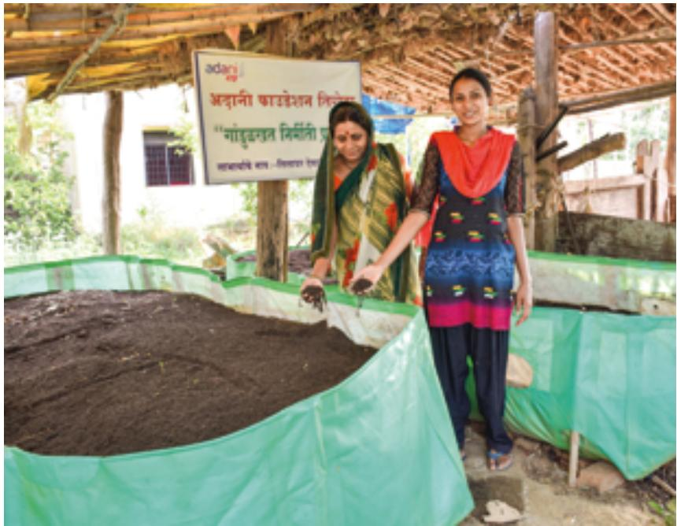

text_image

adani
अन्दानी फारत्रेशन लितेन
"नांपुरुदनृन लिर्मीली प्र
समावर्षों का निकारण ग्राप्ति

# Waste management

Adani Power achieved ash utilisation of 100% in FY 2022- 23. The Company ensures that its waste management plan emphasises technologies that are efficient and cost-effective. These are composed of collective activities including collection, segregation, transportation, reprocessing, recycling and disposal of various types of waste. Fly ash (from the combustion of coal) is the single largest form of solid waste generated from the thermal power plants apart from other types of wastes such as municipal or domestic wastes, hazardous wastes, biomedical wastes and e-wastes. The Company disposed waste responsibly, based on the type and quality of generation.

The Company’s Tiroda plant installed high concentration

slurry disposal for ash disposal (solidifies the ash). The Company developed the infrastructure to make fly ash a valuable and in-demand material for cement, ready-mix concrete and other downstream industries. This helped us increase fly ash utilisation and supply for the benefit of specialised agencies.

The Company’s operating locations are certified with single use plastic-free (SUP) certification with the Confederation of Indian Industries with a target of 100% single-use plastic-free by 2023-24. The Company’s Tiroda site installed a waste-paper recycling unit in June 2016 and recycled more than 5000 Kg of paper in FY 2022-23. The hazardous waste generated is lesser in quantity and is stored in identified locations. The Company sends hazardous waste in lesser quantities to the State Pollution Control Board approved common treatment storage and disposable facilities.

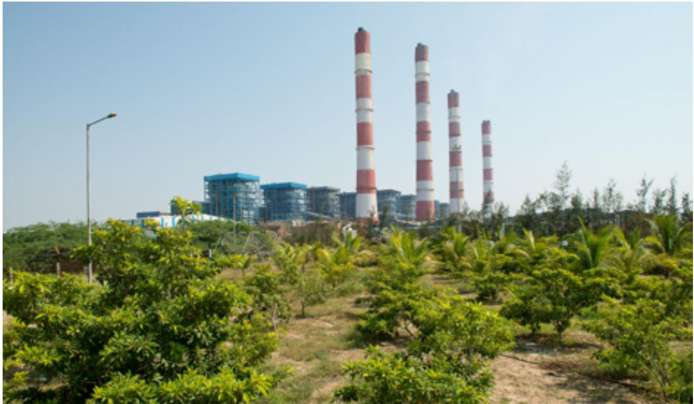

natural_image

Industrial plant with three tall red-and-white striped chimneys and green trees in the foreground under a clear sky (no visible text or symbols)

# Enhancing the green cover

APL has a policy to conserve biodiversity and enhance green cover around its operational plants. Adani Power pledged to grow around 7.85 million trees by 2030, including 1.46 million trees already planted. The Company pledges to conserve and grow 6.39 million trees. This pledge will support towards addressing climate change and transition to a low-carbon business. The Company’s policy is to comply with and exceed local, regional and national requirements on land management and biodiversity conservation.

The Company is committed to the objectives of the Convention on Biological Diversity (CBD) by being a signatory of the Indian Business and Biodiversity Initiative (IBBI). The Company has set an ambitious target to create net positive biodiversity impact across all operations and projects. The Company mapped biodiversity across the business operations and increased awareness on biodiversity for the stakeholders supported by Integrated Management System.

The biodiversity policy entails a determination to engage in business with no net loss of biodiversity by 2025. The biodiversity approach is based on three principles outlined in the Biodiversity Policy as embedded in the Biodiversity Assessment process:

ƒ Risk and impact assessment through an analysis of the activities, their potential impacts and necessary control measures. Activities based on the principles include the aspects and impact assessment process.

Mitigation and control through the implementation of monitoring programs and plans, engineering

and other controls, habitat restoration and protection

ƒ Communication and awareness through collaboration with local scientific communities and other stakeholders, internal and external, training and education.   
The Company operates in ecosystems consisting of forests, grasslands and mangroves. The company is committed to reduce impact on surrounding ecosystems and maintain biodiversity. The Company ensured that existing green cover with biodiversity significance and protected regions within a 10km radius of the plant locations are not affected by plant operations.

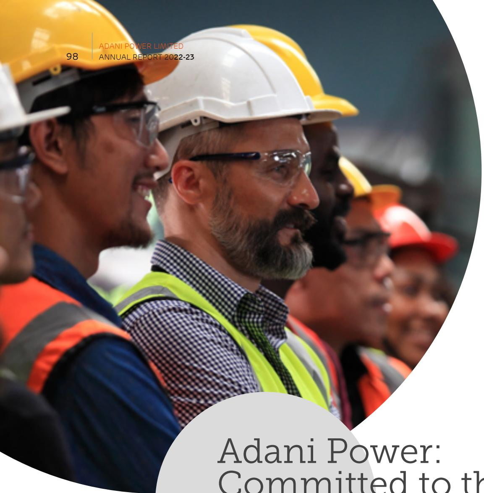

text_image

98
ADANI POWER LIMITED
ANNUAL REPORT 2022-23
Adani Power:
Committed to th

# Adani Power: Committed to the complete safety of its people, plants and communities

# Overview

Power generation involves a range of processes and activities during project execution and plant operation that are considered to be hazardous – there is a premium on safety of people, plants and the periphery.

Adani Power developed an occupational health and safety policy with a set of safety management and technical standards. This includes lifesaving safety rules that form

the basis of the company’s safety management system. These standards are periodically evaluated and updated in line with global best practices. This proactive approach ensures that Adani’s Safety Management System remains global best-inclass.

A dedicated safety function at the business level defines the company’s occupational health and safety strategy, ecosystems, processes and capabilities. The Company’s units are protected by an overarching safety function under the guidance of the respective unit heads.

At APL, safety practices have been transformed using Project

Chetna. Occupational health and safety practices are driven by a collective effort. The company developed safety measures adhering to standards like ISO 45001, resulting in the desired ‘zero harm’ goal at the workplace.

# Safety risk identification

At APL, a safety initiative has been undertaken in the form of fatality and serious incident prevention by identifying probable causes, evaluating control barriers (preventive and mitigating controls) and setting accountability for managing prominent risks by identifying barriers to their effective mitigation.

The Company mitigates dynamic risks as per the hierarchy of controls to protect stakeholders

and achieve the objective of zero harm. These interventions reconcile an understanding of upsides and downsides with the objective to prevent injury, protect assets and maximise value across activities and processes.

As a result of this priority, Adani Power has identified 14 safety critical operations that were addressed with adequate protection.

# Leveraging the safety pedigree of Adani Group

The Company leverages the Adani Group’s established incident management and investigation system for fair and transparent reporting of work-related hazards and risks (unsafe acts/ unsafe conditions, near misses, injuries, illness and serious incidents). This is followed by comprehensive root cause failure analysis (investigation), formulation of corrective actions as per the hierarchy of controls, tracking and monitoring followed by subsequent closure of the issue concerned.

At APL, the learnings from these events are deployed horizontally across the Group through a systemic ‘critical vulnerable factor’ process as a part of the group safety governance process. The progress on safety initiatives is reviewed during Adani Apex Group Safety Steering Council meetings as well as during Business Safety Council meetings. The Adani Group deployed an advanced digital platform on occupational health and safety reporting.

# Our safety partnerships

Adani Power, in consultation with DuPont (safety management pioneer), aligned globally recognised safety interventions and risk assessment programmes

(safety interaction, vulnerability safety risks, site risk field audits, process hazard analysis and prestart up safety review process).

# Safety awareness promotion

# Safety rally

Safety slogan competition

# Safety quiz competition

Safety essay writing compet

# Safety poem competition

Safety poster competition

# Safety competition (job safety analysis)

Safety drama / nukkad nataks

# Safety exhibition

Safety talk in school by children

# Safety talk in township

Screening of safety films

# Safety accolades

Mundra plant was conferred Five Star Rating by British Safety Council in April 2022.

Kawai plant was conferred the Shreshtha Suraksha Puraskar by the National Safety Council of India in June 2022.

The Godda project was conferred Greentech International Environment, Health and Safety Award by Greentech Foundation.

# Visible safety leadership

At Adani Power, visible leadership involves respect for a dynamic approach towards safety through personal behaviour. When safety leadership is visible, employees not only feel responsible for personal safety, but also for their peers. The following comprise behavioural patterns for establishing an effective safety culture through visible leadership:

Walk the talk: The lowest standard you walk past is the highest standard you accept.

Integrate safety: Integrate safety considerations in all decisions, activities and actions.

Facilitate: Facilitate risk management by integrating safety in design and operations to address vulnerabilities

Lead the change: Participate and facilitate others in health and safety initiatives

Interact: Interact with others to engage in safety discussions leading to a wider subject matter understanding.

Report and encourage: Report and encourage others; resolve safety and vulnerability issues, learning from lead and lag parameters.

Reward and recognise: Reward and recognise safe behaviour and felt leadership.

Support and hold safety high:

Reinforce positive behavior; correct at-risk behavior.

Mentor: Support and guide new stakeholders in safety guidelines and standards.

Reprimand: Reprimand others for willful safety infringement

# Safety initiatives

All employees and contractors were provided appropriate PPE kits.   
ƒ Job-related training is provided to employees to perform tasks safely along with a display of do’s and don’ts at prominent site locations.

- Stringent work permit system is coupled with toolbox talks, task briefing, job specific training, job hazard analysis and mock drills   
Emotional wellness program was launched, offering professional and confidential counselling to employees;

employee family members can avail of these services as well

ƒ Reward and recognition programs help identify safety champions   
National Safety Day celebrated annually to mark the founding of National Safety Council.

# Safety governance structure

At APL, our governing structure maximises employee participation and ownership in safety improvement coupled with decision-making involvement. The Company

established an appropriate safety governance structure, including safety taskforces, site implementation committee and plant implementation committee. Subject-specific technical adhoc

taskforce or cross-functional groups enhanced improvements in critical areas. These taskforces were interlinked to facilitate a two-way communication.

# Safety mechanisms and audits

APL has reported significant improvements in safety statistics. The Company’s safety taskforce on technological intervention to identify suitable technology is used within the business across sites. Safety systems with a wider array of safety technologies have reinforced safety programmes. Some implemented initiatives were accessed zone wise in the plant that enhanced authorised entry, security camera use to ascertain deviations, and mobile application to monitor road safety.

The Company deployed first, second and third party audit programs to review the occupational health and safety management system. Audit findings and recommendations were managed and evaluated following completion, using a formal action management system. The audit provided feedback to assist in developing, maintaining and improving occupational health and safety management standards. A first party audit was conducted by resources from the respective location. A second party audit was conducted by the resources from cross-location sites /sister location / unit safety team. A third party audit was conducted by resources from group / business safety team and recognised institutes.

Health and safety incidents 

<table><tr><td>Incidents</td><td>FY23</td><td>FY22</td><td>FY21</td><td>FY20</td></tr><tr><td>Total Incidents</td><td>2</td><td>1</td><td>2</td><td>4</td></tr><tr><td>Lost time due to injuries</td><td>1</td><td>1</td><td>1</td><td>3</td></tr><tr><td>Fatal</td><td>1</td><td>0</td><td>1</td><td>1</td></tr></table>

natural_image

Industrial worker in orange safety gear and white helmet inspecting equipment at an industrial site (no visible text or symbols)

# Empowering communities: Adani Power’s commitment to corporate social responsibility

# Overview

Since 1996, Adani Foundation, the community engagement arm of the Adani Group, has remained committed to strategic social investments for sustainable outcomes. The Foundation has been active in the areas of Education, Health, Sustainable Livelihoods, Skill Development and Community Infrastructure. Its strategies are rooted in national priorities and United Nations’ Sustainable Development Goals (SDGs).

The Foundation is known for its innovative approach to problemsolving. It challenges the status quo and seeks innovative solutions leading to sustainable impacts. By building institutions of people and focusing on sustainability, the Foundation contributes to the dignity, well-being and wealth of communities. The Foundation is positioned to address the emerging needs of a new and emerging India. It operates in 5,753 villages across 19 States, touching 7.3 million lives.

natural_image

Close-up of a smiling young girl in a classroom setting, with another child visible in the background (no text or symbols)

# Education

The Adani Foundation is committed to making quality education available and affordable. It runs cost-free and subsidised schools. A bouquet of projects has been implemented to improve the soft and hard educational infrastructure. The Foundation is reaching out to progressive learners in government schools, providing digital tools and classrooms, supporting young minds through coaching, scholarships for the deserving and learning through evening classes to those left behind.

Utthan - Coaching for Jawahar Navodaya Vidyalaya (JNV) entrance exam, Kawai, Rajasthan: Under Utthan, one of the flagship programs of Adani Foundation, a JNV entrance examination coaching has been running since 2016-17. In the two pandemic years, the learning level of students declined. Utthan supports students to cover lost ground. Basic learning tests were conducted for students seeking to join Jawahar Nehru Vidyalaya (JNV). Some 80 students passed and qualified to join the JNV entrance examination coaching classes. The special JNV coaching runs for six days a week; teachers encourage students to solve previous model papers. In FY 2022-23, six students were selected from three JNV coaching centers. JNV, Atru, was supported with an automatic roti-making machine ad 560 students will benefit.

# Bare minimum infrastructure support (Kawai): Nine

government senior secondary schools were provided library furniture, benefiting 4166 students.

Support for sport in government schools (Kawai): The Foundation provides support to government schools to conduct district and state level tournaments. The following tournaments were supported:

Rajiv Gandhi Rural Olympics: Eight teams (128 players) participated in gram panchayatlevel games; 108 teams (1200 players) participated in block level games.

District / State level sports tournament (17-19 years group): Some 17 teams (190 players) participated in a volleyball tournament. The Foundation provided sports uniforms to 25 players of Barla school to participate in district level tournaments. Some 76 teams (900 girls) participated.

Support to selected state players: The Foundation provided support to players for state-level games. Some 30 players (12 boys + 18 girls) were selected for volleyball, kho-kho and kabaddi from four schools.

Support to village-level Kawai Some 18 teams (270 players) participated.

Project Udaan, Kawai: Project Udaan motivates students around entrepreneurship. Exposure tours are organised wherein students visit Adani Port, Adani Power and Adani Wilmar facilities. These trips provide students insights into large business operations and inspires them to dream big.

During FY 2022-23, 1581 students (53% female) from 30 institutes gained a practical knowledge about power business operations at Kawai. Till date, 12966 participants from 213 institutions/ schools visited the Kawai power plant.

Free education programme for R&R family (Nagwa, Singraulli, MP): Adani Foundation provides free education to R&R families in Nagwa. The children are encouraged to pursue higher education. Children, especially girls, being raised by single mothers and women-headed families, are preferred. Some 1203 students benefited; the Foundation facilitates sponsorships for deserving students to pursue higher education, motivational workshops, training and IT skill courses for teachers.

Pre-training of youths for army and police services’ selection: The local youth in Gondia (Maharashtra) aspire to join the police or army but are not familiar with the necessary process, syllabus, fitness, coaching and training. Adani Foundation launched a three-month program with the State police department and Security separtment of APML to assist applicants. Since 2019, 1250 youth were trained for the selection process. During the year under review, 13 students (33 since 2019) were selected for the Army, MSF, BSF, CISF, and Railways and 300 benefited on the overall.

# Archery coaching academy for tribal students in Gondia: An

Archery Coaching Academy was set up in collaboration with Tribal Development Department (A&TDD) to promote sport. In FY 2022-23, 38 students learned archery. A trainee girl won the silver medal in the Under-14 age category; eight students won in the District Level Junior Archery Competition and qualified for the state-level competition organised by Maharashtra Archery Organisation and Amyuchar Archery Association, Gondia. Some 26 students participated in the school-level district tournament at Tiroda; 23 qualified for the Nagpur Division-level Archery tournament and 14 played at state level tournament; three students from the Academy participated in the 19th senior state-level Archery competition 2023.

# Aamchi Shala Interschool Competition, Tiroda,

Maharashtra: This inter-school competition among government schools was initiated in collaboration with Government Education Department. The competition started in 2016-17 in 19 schools of Tiroda zila parishad. Subsequently, 267 schools of 8 blocks of Gondia district were added. In FY 2022-23, 422 upper primary schools of Gondia comprising 57,447 students participated in the Aamchi Shala competition. A committee evaluated the participating schools based on the program parameters. The top three district level winners (two from each block) were felicitated.

# Support to strengthen Anganwadi Centre, Godda,

Jharkhand: Adani Foundation is committed to combat malnutrition and is working in more than 25 villages, covering railway lines and pipeline areas. It aims to enable a sustainable anganwadi model with the objective to ensure holistic development (health, wellness, and cognitive) of the mother and child through improved infrastructure and access to resources. It addresses the health and nutritive requirements of

rural children (0-5 years) and spreads awareness among adolescent girls, pregnant women and lactating mothers. During 2022-23, basic anganwadi materials (kitchen items, chairs, stationary materials and almirah) were provided in six anganwadi centres benefitting around 500 children (3-6 years). It provided uniforms to ICDS functionaries in 22 anganwadi centres.

Gyanodaya project: Gyanodaya, ‘Mera Mobile, Mera Vidyalaya’, a step towards enlightening the human lives’, was launched by Adani Foundation in partnership with the district administration in August 2018 to promote e-learning in government schools for students of 6th-12th standard of Godda district. The Gyanodaya project improved digital learning in 316 government schools with an outreach across more than 230 remote villages of 9 blocks in Godda district, Jharkhand. In less than five years, the program facilitated over 1872 skilled teachers and benefited more than 90,000 students. The model addresses teacher shortage by empowering students to access smart classes through a TV remote pad. The program influenced 167 middle schools, 109 high schools, 10 + 2 schools, 17 KGBVs, seven welfare association schools, and six JEE/ NEET centres, respectively.

natural_image

Group of schoolchildren in uniforms, one girl with flower pin, seated outdoors (no visible text or symbols)

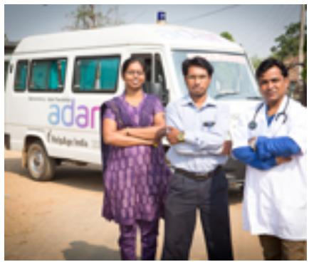

text_image

adar
Enuguayan India

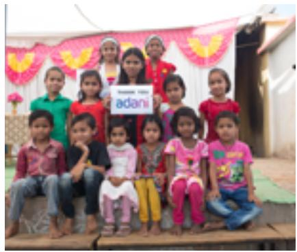

text_image

adani

<table><tr><td>Block</td><td>Middle schools</td><td>High schools</td><td>Plus-2 schools</td><td>KGBVs</td><td>Welfares</td><td>JEE/NEET Centres</td><td>Aggregate</td></tr><tr><td>Godda</td><td>52</td><td>26</td><td>3</td><td>2</td><td>0</td><td>3</td><td>86</td></tr><tr><td>Sunderpahari</td><td>3</td><td>5</td><td>0</td><td>2</td><td>3</td><td>NA</td><td>13</td></tr><tr><td>Podaiyahat</td><td>30</td><td>16</td><td>3</td><td>2</td><td>0</td><td>NA</td><td>51</td></tr><tr><td>Pathargama</td><td>32</td><td>7</td><td>1</td><td>2</td><td>0</td><td>1</td><td>43</td></tr><tr><td>Basantrai</td><td>14</td><td>5</td><td>0</td><td>1</td><td>0</td><td>NA</td><td>20</td></tr><tr><td>Mahagama</td><td>13</td><td>17</td><td>2</td><td>2</td><td>0</td><td>1</td><td>35</td></tr><tr><td>Boarijore</td><td>5</td><td>10</td><td>0</td><td>2</td><td>4</td><td>1</td><td>22</td></tr><tr><td>Mehrama</td><td>10</td><td>12</td><td>0</td><td>2</td><td>0</td><td>NA</td><td>24</td></tr><tr><td>Thakurgangti</td><td>8</td><td>11</td><td>1</td><td>2</td><td>0</td><td>NA</td><td>22</td></tr><tr><td>Total</td><td>167</td><td>109</td><td>10</td><td>17</td><td>7</td><td>6</td><td>316</td></tr></table>

# Programme outcomes

# Improvement in school ranking:

The Gyanodaya program has enhanced the education standard of Godda district and created an education eco-system by tapping government schools and strengthening institutions as model schools through the digital learning program, enhancing

outcomes over baseline statistics of 2018. The program has resulted in a significant increase in 2022 school rankings at the district level compared to 2018.

# Increase in student attendance:

The visually appealing, easy-tograsp and retainable concepts

covered in study materials increased class-wise attendance from July 2018 - from 20% to 54% in March 2020 to 59.6% in February 2022 to 70% in February 2023.

Improvement in attendance after the implementation of Gyanodaya 

<table><tr><td>July-18 (Before Gyanodaya)</td><td>March 2020 (1.8 years after Gyanodaya)</td><td>February 2022 (3.8 years After Gyanodaya)</td><td>February 2023 (4.8 years after Gyanodaya)</td></tr><tr><td>20-30%</td><td>54%</td><td>59.61%</td><td>70%</td></tr></table>

Improvement in the marks of students: Prior to Gyanodaya, students fell under the 30-40% marks bracket, which has now increased to 70-75% marks on average.

Meritorious scholarships, Udupi: Some 755 meritorious students, residing around the UPCL plant (within 12 gram panchayats) were honoured with Adani scholarships. Students who had secured more marks in 2021-22 were considered for scholarship.

Education kits, Udupi: Kits were distributed to 6,283 students. Some 74 government schools located in 37 villages in Udupi district were covered.

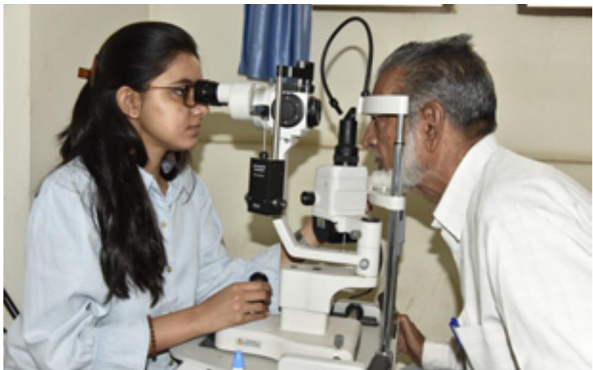

natural_image

Two people examining a medical or educational microscope; one is looking at the subject while the other observes (no visible text or symbols)

# Community health

The Adani Foundation is investing in community health through the deployment of resources and services. The interventions are designed to provide mobile health care units deliver doorstep healthcare, wellness centres, rural clinics, health camps and building and multi-speciality hospitals.

# Mobile Health Care Unit

(MHCU): This provides medical service in 28 villages near the Adani Power site in Rajasthan. Through this initiative, the Foundation provides free medical consultation, home visits to the bedridden or the elderly coupled with free medicine. It also spreads awareness on preventive measures related to seasonal diseases. In the reporting year, a total of 29,733 medical treatments (including 35% female, 24% children) were provided.

The Adani Foundation is running four MHCUs in the remote villages of Godda (Jharkhand) and a MHCU in Udupi (Karnataka) covering villages in the interior. These MHCUs cater to the elderly and women. The program identifies and prevents medical conditions at an early stage. The MHCUs provide free medical consultation and medicines; critical patients are referred to different hospitals for diagnosis and treatment.

# Mobile Health Care Unit (MHCU):

Two MHCUs provide free basic medical assistance in 50 Tiroda villages. Some 77,366 people received treatment (57% female) in FY 2022-23. ECG checks of patients and regular blood pressure and sugar monitoring comprised key activities. Some 38 awareness sessions were conducted with 972 women and adolescent girls to help identify symptoms of serious diseases before they became critical.

# Health camp in government

schools: The Foundation facilitated 115 quarterly health camps in schools. A total of 9407 students benefited in FY 2022- 23. These camps conduct student health screening and provide basic medical attention. It conducts sanitation activity in nearby government schools.

Through MHCU, it distributes iron, folic acid and calcium tablets to girls (as prescribed).

Coverage of MHCUs: []

(including 47% female and 19% children

Kawai: 28 villages |

Treatments: 29,733

Tiroda: 50 villages |

Treatments: 77,366

Godda: 121 villages |

Treatments: 58,955

Udupi: 13 villages |

Treatments: 18,878

# Naya Savera, holistic development of Sahariya

community: The District Collector of Baran showed interest to partner Adani Foundation to implement this program in the Kishanganj and Shahbad block along the lines of the Fortune SuPoshan project. Activities were conducted as follows: Identified and distributed iron pots (2000 pregnant women); will continue supporting them with nutrition-related knowledge and counselling till the lactating period. Identification of LBW children (1st week of every month), creating anganwadi wise database of LBW babies and sharing with ASHA workers (second week of every month), and regular counseling to families by ASHA (upto six months).

SaHAJ project: It creates awareness about safe menstruation and hygiene practices among adolescent girls and women through women trained with ICDS Department. These women are engaged in producing sanitary pads at a nominal cost. Last year, 1227 women bought sanitary pads.

# Hospital facility in R&R

colony: The hospital is serving beneficiaries from plant-affected areas and covers patients of surrounding six villages. A total of 14,300 patients were benefited (35% female and 31% children) through OPDs. The free ambulance service benefitted 322 patients in Nagwa, Singraulli.

Specialised health camps: Some 50 specialised health camps were organised in plant-affected areas. Specialist doctors provided services related to gynecological, pediatric, orthopedic and dental health. Some 3044 patients (52% female and 20% children) were benefited in Nagwa.

# Theme-based health awareness

activities: Some 22 awareness programs were organised on various days (Wash Day, TB Day, Cancer Day); some 2819 people (85% female) participated in Nagwa.

# Multi-specialty health check

camps: These Nagwa camps provide access to medical specialists like gynecologists, pediatricians, ophthalmologists, orthopedics, dental, etc. Some 990 patients (56% female) benefitted and saved an average of H400 in consultation fees per patient.

Cancer awareness and screening camps: Awareness sessions and screening camps for cancer were conducted in 50 villages with the support of government health officials. Some 155 patients visited the camps (screening for oral cancer, breast cancer, cervical cancer, and pap smear). Three suspected patients were referred for diagnostics at Regional Cancer Hospital, Nagpur.

Specialised medical camps: These specialised medical camps in Nagwa (ophthalmic, pediatrics, gynecological, cardiology and osteopathy) were organised with the objective of working on prevention and cure, screening at the doorstep and catering to the children, elderly and pregnant women.

# Medical camp, Raigarh,

Chhattisgarh: A significant religious fair takes place annually at Maa Chandrahasini Temple in Raigarh, coinciding with Navratri. The temple attracts 1000 visitors a day. During this period, Adani Foundation organised a medical camp, offering first aid, medical consultations, checks, and free medication for cough and fever.

Nutrition garden: Poshan Vatika is a sustainable model that ensures year-round availability

and access to a range of green leafy vegetables and fruit rich in micronutrients, vitamins, minerals, iron, proteins, and other nutrients. Women and adolescents are sensitised about a nutritious diet, helping reduce child malnutrition and anemia in adolescents. By addressing food resource challenges, the program promotes equitable food availability. Implemented in 16 villages of Godda, Poshan Vatika supported over 500 families.

Health insurance: Adani Aarogya Card will help villagers of all age groups to access free medical treatment up to a sum insured of H50,000 per family (size-7). The insurance cards were distributed to family members through Gram Panchayats (Mudarangadi and Yellur). Some 9,502 villagers benefited.

# Safe drinking water facility,

Udupi: To provide villagers potable drinking water, safe drinking water plants with RO technology were installed at five locations in the plant vicinity in Yellur, Mudarangadi, Belapu, Bada and Tenka. Some 6,213 beneficiaries were registered.

# Location – Godda

15 Villages | 89 Specialised Camps and 14 General Health Camps

2639 patients treated (including 47% female and 20% children

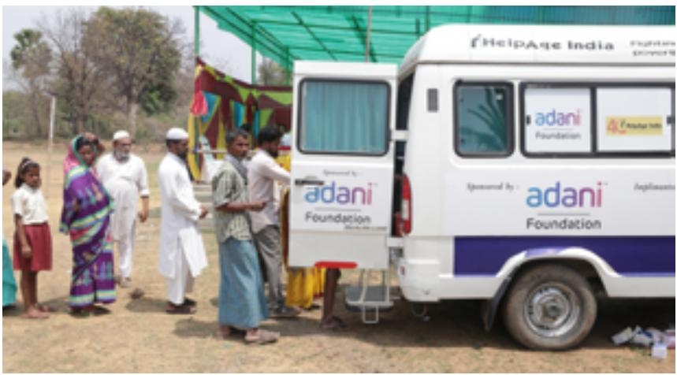

text_image

HelpAge India
adani Foundation
adani Foundation
adani Foundation
adani Foundation
adani Foundation

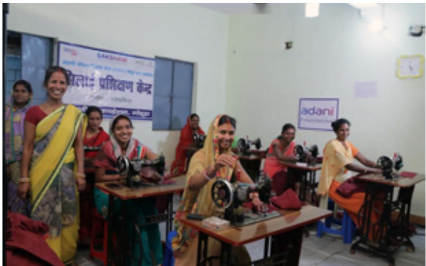

text_image

Group photo of women in traditional Indian attire operating sewing machines in a workshop, with visible signage including 'adani' and Japanese text.

# Sustainable livelihood development

The Adani Foundation is committed to facilitate the creation of wealth by the people for their prosperity. It is building a self-sustainable ecosystem to leverage both human potential and community resources for socio-economic growth. The initiatives are designed for onfarm, off-farm, and non-farm domains with objectives to increase, diversify, and sustain incomes. Through SLD, the Foundation offers a banquet of initiatives like water conservation, organic farming, dairy development through strategic animal husbandry projects, and augmentation of women’s enterprises by supporting them with knowledge, skills, and market linkages. Details of initiatives in this theme is as follows:

PASHUDHAN - Integrated livestock development centre (Kawai): Livestock continues to be an important source of livelihood for small and marginal farmers in rural areas. With the growing demand of milk and dairy products, animal husbandry becomes the primary sector for developing small and marginal farmers with a major focus

on the improvement of cattle breeds (more female calves) for milk production.

Considering the scope to strengthen this sector, two Integrated Livestock Development Centre (ILDCs) are running successfully by the Adani Foundation at Nimoda and Bamori villages to provide breed improvement and cattle management services.

The main objective of livestock development activities is to upgrade the local indigenous low milk-yielding cows and buffaloes by breeding them through Artificial Insemination with the use of high-pedigree frozen semen of indigenous/exotic breeds. The process results in the birth of upgraded progeny with an improved genetic ensuring better milk-yielding capacity.

The Foundation has deployed ‘Pashu-Mitra’, an educated and local rural youth, after training him to facilitate animal breeding and ensure delivery of health and nutrition-related services like – veterinary first aid, castration of scrub bulls, deworming, preventive vaccination against

various diseases, infertility treatment etc.

These ILDCs are providing the following services:

# Artificial insemination (AI):

ILDCs are undertaking AI. The genetically superior progeny born out of this program will be better milk yielders. AI service is providing at the doorstep of the farmers with the use of highquality frozen semen. A total of 910 AIs were done during the year. ILDC in charge visits the cattle owner after 3 months of AI and does the cattle pregnancy test. After confirmation of pregnancy, Pashu Mitra guides the cattle owner on the required supplementary nutrition for the animal.

Vaccination: Over 1000 animals were given the required vaccination to safeguard them from common diseases (H.S.and B.Q).

Deworming: Deworming medicines are given regularly to the newborn crossbred calves along with their mother. Dairy farmers are encouraged to treat their present non-descript cattle also with deworming medicines.

Fodder development: The significance of nutritious fodder lies in the fact that it can enhance the milk production capability of the farmer’s livestock, thereby enabling an enhancement in his income levels. The eating capacity of enhanced animals also increases. Hence, good quality fodder needs to be supplemented. The Foundation supports farmers with the technical know-how of scientifically proven methods through fodder demonstration; 480 fodder demonstrations were done.

Cattle feed supplement: The Foundation is supporting farmers with cattle feed supplements like calcium and mineral mixture for pregnant and dairy cattle. This is benefiting in more milk production and growth of calves. Total 450 cattle owners received supplementary feed.

45 families were supported to adopt biogas, vermi compost and azolla cultivation.

Krishi-Kaushal - Fruit plantation for development of Wadi (Kawai):This is one of the flagship projects of Adani Power Rajasthan Ltd. The Wadi Project – an integrated tribal development project is getting implemented in Kawai, Baran district. The main objective of this comprehensive project is to create opportunities for gainful self-employment for tribal families. The major challenges that tribal families face in the region are low land holding, soil degradation, high agriculture input costs, problems of pests and diseases, limited credit availability and unfavourable market situations. All these factors put together made the farming here less profitable. Wadi in local language means ‘small orchard’.

Two or more fruit crops are selected towards minimising climate-related, biological, and marketing risks. Small farmers having less than 5-acre land are given 0.5-acre wadi each for raising 60 fruit plants suitable to local conditions. Further assistance towards enhancing the livelihood of farmers provided vegetable seeds to 20 farmers. These concerted efforts have resulted in an increase in income of approximately H12000 to H15000 for each family. In addition to this, farmers’ families are having doorstep access to fresh and healthy organic vegetables.

In these 22 villages where the project is implemented, over 50 families are covered for developing ‘wadis’ of mango, orange, ber and guava plants. Fruiting has started in guava, ber and mango.

The Wadi Project is also adding another dimension of benefit that is institution building. It is carried out in the form of facilitation in promotion of local women groups, promoting income generation activities, and reducing drudgery. It is creating awareness on dairybased livelihoods, reproductive health, and other developmental aspects. The income generating activities included livestock management, develop wadis, vegetable cultivation, vermicomposting etc.

As a process, the project starts implementation through the formation of a village-level group with 25 women in each village. Total of 14 village and 350 women members are part of these groups. To further strengthen the process, the formation of a Farmers Producers Organisation (FPO) was facilitated. An FPO named Hadoti Pragatisheel Producer Company Limited was formed. This FPO has 305 women shareholders and runs a dairy development program. The FPO is collecting more than 400 liters of milk from 5 villages. The Foundation is facilitating capacity building through regular village-level meetings to orient farmers and cattle owners about agriculture and animal rearing best practices. It also provides exposure to dairy development and its marketing.

Skill development of youth (Singraulli): Under Employment Development Programme, the Adani Foundation in collaboration with Union Bank’s RSETI (Rural self-employment and Training

Institute) trained 52 youths in motor repairing, and selfemployed tailor (SET). Another 71 candidates received training in jute bag making, mushroom production, dhoop batti and artificial jewelry making.

Sports activity for youth (Singraulli): Football, cricket, volleyball, kabaddi tournament, and athletic tournaments were organised for overall development of youths and towards maintaining positive relationship with community.

# Animal husbandryrelated initiatives

In Tiroda, dairy business has favorable geographical condition, and many farmers are engaged in dairy business. But they are lacking in professional approach and technical enhancements to gain good profit margin. Hence, they are not able to sustain the income. Considering these challenges, the Adani Foundation has started livestock development center program in 26 villages in Tiroda block with the support of BAIF Institute of Sustainable Livelihood Development (BISLD). In this financial year, methods like Sorted Sex Semen (SSS) for Artificial Insemination (AI) was used to increase the occurrences of the birth of female calves. It ensures more than 90% possibility of female calves, which means more milking cattle and hence more income for the dairy farmers. Also, regular vaccination, health checkup camps, deworming drive, and fodder cultivation workshops are benefitting dairy farmers. Awareness is also created on the latest scientific animal management practices.

# LDC AI and calving

ƒ Completed a total 1,604 AI (included 791 SSS AI and 813 normal AI).   
ƒ Resulted in birth of total 906 calves included 413 SSS calves and 493 normal calves.

Cattle vaccination and cattle health check camp: This year infectious and fatal disease like Lumpy Skin Disease (LSD) spread rapidly in the Tiroda block. This caused nodules on the cattle’s skin and other parts of the body. Towards saving the lives of livestock of the farmers, with the support of district animal husbandry department, the Foundation facilitated vaccination of 6910 animals in 22 villages. 1989 cattle were checked in health camps and services like deworming, ticks, parasites demolition, infertility checkups, weakness treatments, and general treatments were provided. Some 481 cattle owners benefitted from these health check camps conducted in 10 villages.

So far, 475 vermi-compost beds were installed, attributing to crop yield and productivity increase by 15%.

Surplus compost is sold to needy farmers | Income from vermi compost added H5000 in the annual incomes.

8721 cattle were treated in these camps, helping 1510 families.

351 cattle were vaccinated for protection from Lumpy disease.

Fodder demonstration and cultivation support: LDCs are promoting scientific fodder cultivation practices to develop healthy fodder feed management practices of livestock. 440 framers cultivated Hybrid Napier Fodder and 15 farmers cultivated Azolla Fodder. The availability of good quality of adequate fodder round the year improves milk productivity as well as animal health. 50 farmers trained to cultivate maise in one acre each and prepare silage to use and supply to cattle owners. This will help in the availability of green fodder for cattle owners and additional income to these farmers.

# Agriculture initiatives

Drip irrigation programme: This programme supports widow women farmers in the droughtprone Amravati region who lost their husbands as they committed suicide because of losses incurred in farming. The Foundation is supporting such women who are affected by severe crop damage of orange and cotton because of drought and lack of irrigation facilities. Under this program, drip irrigation facilities are installed on the farms. In FY-2022-23, 43 women of the Amravati region were supported – 171 women farmers benefitted. They are now able to safeguard their crops and maximise their harvests of cotton and oranges.

# System Rice Intensification (SRI) through organic ways:

The organic SRI is a cultivation technique proven to yield more with less investment. It is based on scientific principles of paddy cultivation, mainly focused on water management, youngaged seeding, careful single seedling transplantation, and rotary weeding for soil aeration. 50 farmers were trained and encouraged to cultivate their farms using this technique. These farmers were also encouraged to produce and use organic fertiliser and pesticide to use in paddy fields.

SRI is effective in increasing rice yields while reducing input costs. There was an average increase in yield by 21.30% and average net profit H11,189/- per farmer.

# Capacity building and support for income generation activity

Agarbatti production: 20 Agarbatti machines were provided in 6 villages (Garada, Ramatola, Tikaramtola, Mendipur, Gumadhawada, and Koddebarra) in Gondia. A total of 60 SHG women are involved in the Agarbatti production business. The Foundation also supports in market linkages. In this FY-2022-23, 68,572 Kg Agarbatti was produced and sold for H39.48 Lakhs.

Lac bangles making: Lac is cultivated on a large scale by farmers in Gondia District. Seeing the potential in bangles making, the Foundation initiated lac bangle making activity with women’s SHG. Last year 45 women received advanced training. They achieved a turnover of H57,310 and earned H3000- 4000 per member.

Mushroom cultivation: The initiative is gaining momentum and expanding. The Foundation has facilitated training to women in Tiroda block on the various techniques with a practical demonstration of oyster mushroom cultivation. As a result, in the reporting year, mushrooms were cultivated on 5342 beds with a total harvest of 13,355 kg that fetched a net profit of H17.42 Lakhs

Veterinary camps in Godda: 26 village-level veterinary camps were organised in collaboration with the district Animal Husbandry Department. The most common diseases included Endoparasites, Osteoporosis, Ectoparasites, Enterotoxaemia, and Unknown Fever/ Pyrexia of Unknown Origin (PUO), Wounds, Pregnancy Diagnosis, Repeat Breeding (RB), Dermatitis, and Lymphadenitis. Farmers were recommended routine deworming and vaccination with the feeding of supplementary mineral-vitamin mixture to improve cattle’s overall health.

Vermi compost production, Godda: The aim of the program is to enable farmers to become Vermi-entrepreneurs to boost their income. During the year, 2022-23, 17 farmers were trained and supported with 22 Vermi compost beds.

Exposure visit, Raipur: 100 farmers including SHG women gained knowledge of modern farming techniques through exposure visits at KVK, Raipur. Exposure to the SRI technique and Wadi development have created awareness of ways to gain more cultivation and income from their limited farmland.

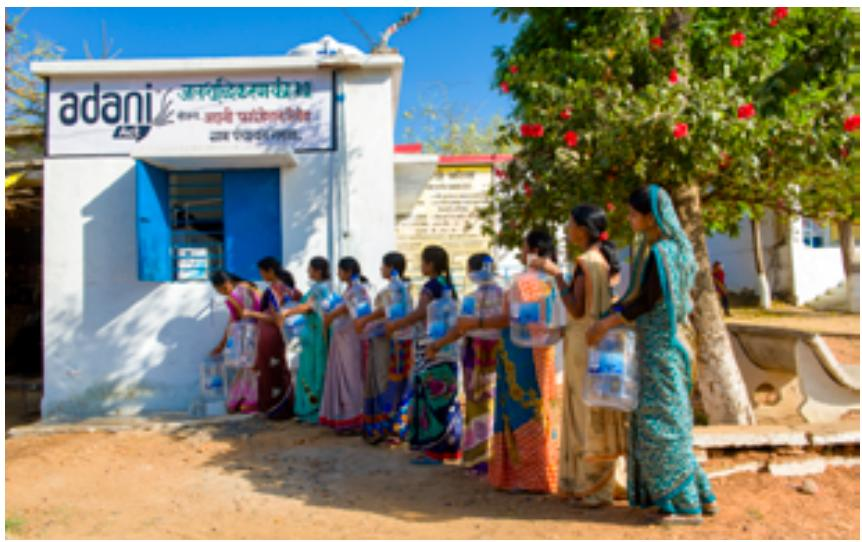

text_image

adani
रागल्लिकारण विति अनुप्रधानी जोग्या जाप्ति प्रत्तिकारण विति जोग्या जाप्ति प्रत्तिकारण विति जोग्या जाप्ति प्रत्तिकारण विति जोग्या जाप्ति प्रत्तिकारण विति जोग्या जाप्थि प्रत्तिकारण विति जोग्या जाप्थि प्रत्तिकारण विति जोग्या जाप्थि प्रत्तिकारण विति जोग्या जाप्थि प्रत्तिकारण ऴिकारण विति जोग्या जाप्थि प्रत्तिकारण विति जोग्या जाप्थि प्रत्तिकारण विति जोग्या जाप्थि प्रत्तिकारण विति जेशकर्षा विति जेशकर्षा विति जेशकर्षा विति जेशकर्षा विति जेशकर्षा विति जेशकर्षा विति जेशकर्षा विति जेशकर्षा दिकारण विति जेशकर्षा विति जेशकर्षा विति जेशकर्षा विति जेशकर्षा विति जेशकर्षा विति जेशकर्षा विति जेशक कर्षा विति जेशक कर्षा विति जेशक कर्षा विति जेशक कर्षा विति जेशक कर्षा विति जेशक कर्षा विति जेशक कर्षा विति कर्षा समूलीये समूलीये समूलीये समूलीये समूलीये समूलीये समूलीये समूलीये समूलीये समूलीये समूलीये समूलीये समूलीये समृलीये समृलीये समृलीये समृलीये समृलीये समृलीये समृलीये समृलीये समृलीये समृलीये समृलीये समृलीये समृलीयों समृलीयों समृलीयों समृलीयों समृलीयों समृलीयों समृलीयों समृलीयों समृलीयों समृलीयों समृलीयों समृलीयोंसमृलीयोंसमृलीयोंसमृलीयोंसमृलीयोंसमृलीयोंसमृलीयोंसमृलीयोंसमृलीयोंसमृलीयोंसमृलीयोंसमृलीयोंससमृलीयोंससमृलीयोंससमृलीयोंससमृलीयोंससमृलीयोंससमृलीयोंससमृलीयोंससमृलीयोंससमृलीयोंससमृलीयोंSMSM30000000000000000000000000000000000000000000000000000000000000000000000000000000000000000000000000000<nl>

# Community infrastructure development

The Adani Foundation is building and strengthening public infrastructures. It is dedicated to assessing community needs and aspirations for designing and providing suitable infrastructure solutions. The approach is to supplement the government’s efforts in schools, primary health care centres, large water conservation structures, public ponds, roads etc.

The organisation has been instrumental in constructing water conservation structures in water-scarce regions of the country. It is also facilitating rooftop rainwater structures in rural households with the objective to reduce the drudgery of women who are mostly responsible to fetch water for the house. Similarly, hundreds of borewells have been dug and ponds have been deepened to ensure water availability round the year, for domestic use, animals and agriculture.

# Kawai

Construction of CC Road in Salpura village: CC road has been constructed in Salpura village. The community shall own the responsibility of taking care of the road. 770 people will be benefitted.

# Need-based infrastructure development in school:

Constructed boundary wall, a stage and facilitated ground leveling work at Government Senior Secondary School, Dhara. 278 students of this school will benefit from these interventions. Innovative theme-based painting work is also done to provide a good learning ambience for students.

Water conservation: This year, the Foundation deepened a pond (12,078 CUM water holding capacity) in Ghoti village that comes under the Zilla Parishad of Gondia. The project aims to ensure sufficient water supply for irrigating approximately 100 acres of agricultural land, benefitting 54 farmers. It will provide ample drinking water for village cattle and nearby wildlife during the dry summer months. The project also aims to improve the groundwater table and protect natural water bodies.

Drinking water facilities: Installed 4 handpumps in 4 villages (Ekodi - Ramatola, Bhivapur, Belati Kd,

Khairbodi) of APML vicinity, benefitting 200 families.

Installed solar power-based 1HP submersible pump in Khairbodi village, benefitting 60 families.   
ƒ RCC water storage tank with pipeline work - drinking water is available for 91 households.

Construction of CC road: In FY-2022-23, the Foundation constructed 615\*3 - meter CC road, benefitting more than 3000 villagers and other commuters.

Benches for seating: People were facing difficulties while waiting at public places like bus stops, public gathering places, and government offices. The Foundation installed 130 seating benches across 20 villages for public convenience.

Village road, Udupi: UPCL is committed to execute infrastructure development works in the villages coming under the panchayats of Yellur, Mudarangadi, Tenka, Bada, Belapu, Palimar and Padubidri.

Adani Skill Development Centre (ASDC): It aims to play a significant role in improving the socio-economic status of marginalised youth and women

by offering skill development training programmes that enhance their employability and enable them to become selfsufficient. These initiatives are designed to uplift individuals from the lower strata of society and empower them to secure sustainable livelihoods. The highlights from ASDC Centres:

Godda: This centre currently offers training courses in seven different trades: welder, fitter, mason and bar bender, general duty assistant, hospitality, electrical, and digital literacy. These courses are actively running, providing valuable skills to participants. In the current year, a total of 716 young candidates have been trained, adding to the cumulative count of 4,600 candidates trained over the past five years. Notably, out of these 716 candidates, 122 youths secured job offers from reputed organisations. These job offers came with an attractive average annual package of H1.74 Lakh, along with benefits such as accommodation and other facilities.

Tiroda: At this centre, a total of 245 candidates received training in various trades, including welder, fitter, assistant

electrician, domestic data entry operator, digital literacy, and beauty therapist. The placement rate for these candidates was exceptionally high, with 90% of them successfully securing employment.

Particularly, all the students who completed the welding technician and assistant electrician programs were placed in Pune, Mumbai, and other nearby cities. These individuals obtained lucrative positions with salaries amounting to H12,000 per month, reflecting the positive outcome of their training and the demand for their skills in the job market.

Raipur: In the year 2021, 15 trained women and adolescent girls formed a common interest group to run garment production center. The group was supported with an investment to buy raw material and open a bank account. During the year, the group generated revenue of H4.20 Lakhs.

# Management discussion and analysis

# Global economy overview

Fiscal policy measures taken by Central Banks to combat the downturn caused by COVID-19 lockdowns during 2020 had the downside of sparking spiraling inflation globally, which got exacerbated due to energy price shocks triggered by the conflagration in Europe in early 2022. The strong monetary policy response adopted by Central Banks as a countermeasure, in the form of successive interest rate increases and absorbing liquidity, in turn led to tightening of financial conditions. Ultimately, the combined impact of all these measures was a slowdown in global growth from 6.2% in 2021 to 3.4% in 2022, according to the International Monetary Fund. Emerging economies were also not immune from economic contagion, having to face currency depreciation and capital flight as investors expectedly turned to riskoff positions, causing portfolio outflows.

However, concerns of global recession were alleviated after resilience in labour markets and consumer spending were noted across advanced and emerging economies, reviving investor sentiment in the second half of FY 2022-23. Measures taken by Governments to mitigate the impact of high energy prices have borne fruit to some extent, helped by a milder winter in Europe, which helped avert a crisis in millions of homes that need heating during periods of extreme cold. Global inflation seems to have peaked, while labour markets have remained resilient, thereby creating policy room for governments to stave recession off. Despite the arrival of good news, high inflation and a slowdown in global trade in face of continuing hostilities in Europe remain major worries for governments and policy makers.

# Indian economy overview

The Indian economy has once again demonstrated its deeply rooted growth fundamentals and resilience in face of a global slowdown, by posting a Real GDP growth of 7.2% in FY 2022-23, according to provisional estimates of the National Statistical Office (NSO), following a solid growth of 9.1% in FY 2021-22 in the post-pandemic period. This strong growth is a testament to the depth of India’s economy, resilience and productivity of its people, entrepreneurial spirit of its businessmen, and last but not the least, prudent polices and bold decision-making of its government.

The growth in national output is a result of a recovery in discretionary spending indicating restoration of consumer confidence and the government’s thrust on CAPEX and infrastructure build-out, which powered economic growth despite the impact of inflation and a slowdown in exports in view of the global economic situation.

On the positive side, inflation has moderated following successive increases in policy rates by the Reserve Bank, prudent measures taken by the government for supply-side management, initiatives like Digital Transformation, augmentation of capital in the banking system and successful efforts to improve asset quality, in addition to easing of strain on global supply chains, and softening of global commodity prices.

# Outlook

The IMF’s World Economic Outlook expects a slowdown in global growth to 2.8% in 2023, with only marginal improvement to 3% over the medium term. Global efforts to contain and reduce inflation may have limited success in view of stickiness of core inflationary pressures. The heightened uncertainty caused by the current geopolitical situation and aftereffects of the pandemic will create a challenging trade-off for policymakers between restoring price stability and addressing growth slowdown. Further, the global banking system has recently shown signs of fragility with high-profile failures, while elevated levels of debt for many governments create a more structural risk that can threaten the global financial system if not contained prudentially and in a timely manner.

The insipid global conditions also pose a challenge for India, given strong global linkages especially concerning fuel imports and exports of finished products. However, the repetitively demonstrated resilience and depth of the domestic economy, deftly managed macroeconomic factors and improved health of the financial system, in combination with the long-term payoffs of various reforms and growthboosting programs place India in an advantageous position to find opportunities in and benefit from global geo-economic shifts. The Reserve Bank projects real GDP growth for FY 2023-24 at 6.5%, taking into account softer global commodity prices, the government’s continued thrust on CAPEX, higher capacity utilisation in manufacturing, robust credit growth, containment of high inflation and rising optimism among businesses and consumers.

# Indian power sector review

Economic development of a nation cannot progress significantly without a strong and self-reliant power sector. Universal access to affordable power in a sustainable manner has been the guiding principle for the Indian power sector. The Government has taken various initiatives to transform India from a power deficit to power surplus nation which includes increasing overall capacity, connecting the whole nation into one grid, strengthening the distribution system and achieving universal household electrification.

On the generation side, Government policies have borne fruit and India is today the third largest producer of electricity in the world, with installed generation capacity of over 4,16,059 MW as on March 31, 2023, with a highly diversified basket of generation.

There is vast headroom for India to achieve economic progress and growth in electricity consumption comparable to key developed economies. India’s installed power capacity has grown substantially over the last thirteen years, at a compounded annual growth rate (CAGR) of 7.7%. The nation’s electricity demand has registered strong growth over the past three years on the back of robust economic growth, spurred by the Government’s drive to provide Power To All. Aggregate electricity demand attained 9.6% growth in FY 2022-23 at 1,512 BU over the demand in FY 2021-22. Similarly, peak power demand registered a growth of 6.4% to scale a new peak of 215.9 GW in FY 2022-23, as compared to a peak of 203 GW in FY 2021-22.

India reported a slight increase in energy deficit to 0.5% in FY2022-23 as compared to 0.4% in FY2021- 22. However, the peak deficit for FY 2022-23 increased to 4.0% as compared to 1.2% in FY 2021- 22, on account of growing power demand. As India’s economy continues to grow, electricity demand is set to rise further.

# India’s installed power generation capacity growth

India’s Installed Power Generation Capacity (MW)   
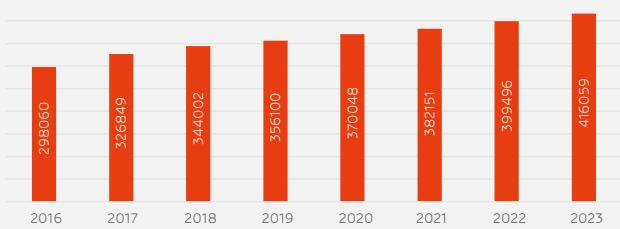

bar

| Year | Value |
|---|---|
| 2016 | 298060 |
| 2017 | 326849 |
| 2018 | 344002 |
| 2019 | 356100 |
| 2020 | 370048 |
| 2021 | 382151 |
| 2022 | 399496 |
| 2023 | 416059 |

(Source: CEA, Power Ministry)

Thermal power continues to be the biggest source of power generated in India, given large coal reserves domestically, lack of natural gas reserves, and limited expansion in other conventional sources. Coal-fired power plants act as base-load power generators and are increasingly supporting operations of renewable energy plants by providing grid-stabilizing power generation. The increase in coal-fired power generation has resulted in the availability of reliable and affordable electricity across the country. Electricity demand in the country has increased rapidly and is expected to rise in the foreseeable future.

# Installed Capacity as of 31st March 2023

Installed Capacity (MW) as on 31st March 2023   
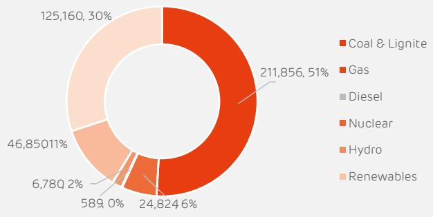

pie

| Category | Value | Percentage (%) |
|---|---|---|
| Coal & Lignite | 211,856 | 51 |
| Gas | 24,824 | 46 |
| Diesel | 589 | 0 |
| Nuclear | 6,780 | 2 |
| Hydro | 46,850 | 11 |
| Renewables | 125,160 | 30 |

# Indian power sector outlook

The Government of India’s focus to attain ‘Power for all’ has accelerated capacity addition in the country along with expansion and strengthening of power transmission and distribution networks. The nation still has a long way to go, as per capita annual consumption in the country was 1,255 kWh in FY22, which is significantly lower than world average and that of other developing countries like South Africa and Brazil. However, as India’s GDP is expected to grow significantly over next two decades on the back of demographic strength, per capita consumption of electricity is expected to rise to approximately 3000 kWh by 2040. Demand for electricity in India is expected to grow at a sustained pace given the government’s massive push towards ‘Make-In-India’, PLI (Production Linked Incentive) Scheme, increasing industrialization, improving incomes and standards of living, and push for increasing the penetration of electric vehicles in the transportation sector, among others.

The 20th Electric Power Survey of India, published in November 2022 by the Ministry of Power projects total electric energy consumption at 1,610 BU in 2026-27 and 2,133 BU in 2031-32. The corresponding peak demand is projected at 277 GW and 366 GW by the two years respectively. For comparison, the total electricity demand in 2022-23 was 1,511 BU and peak demand was 216 GW.

Over the longer term, power demand is projected to reach 3,423 BU by 2041-42 while peak demand is projected at 575 GW. The Central Electricity Authority (CEA) also projects that India’s likely Installed Capacity by the end of FY 30 will be around 817 GW, up by around 400 GW as compared to the present Installed Capacity.

The Government of India has set a target of achieving 50% of the total installed capacity by the year 2030 from non-fossil fuels. The Optimal Generation Mix report published by CEA in April 2022 estimates that by 2029-30, installed capacity of coal and lignitebased power plants (net of retirements) will reach 252 GW. The likely share of thermal installed capacity will reduce to nearly 32% of the total installed capacity in 2029-30 as compared to 57% as of March 2023. However, in terms of energy generation, thermal power will continue to contribute the largest share at 57%, as compared to more than 70% at present.

# Coal demand and supply

Coal continues to be the most important source of fuel for power plants in India. It represents 51% of the installed capacity and nearly 72% of power generation as of FY 2022-23. Total coal consumption has witnessed consistent growth over the years as coal-based generation capacity continues to rise. According to the Indian Ministry of Coal, India’s coal demand will rise from 1,029 million tonnes (MT) in FY 2022-23 to 1,448 MT by 2029-30. Of this, the demand of the power sector for coal will increase from 735 MT to 1,034 MT during the same period.

In FY 2022-23, India’s coal production registered a formidable growth of 14.7% to 893 MT compared to 778 MT in FY 2021-22. Coal dispatch to the power sector by domestic producers increased by 9.1% to 738 MT from 676 MT in this period. On the other hand, imports of non-coking coal increased to 166 MT in FY 2022-23 (Upto Feb’23) from 152 MT in FY 2021- 22, mainly due to high surge in power demand.

However, even as the Government targets increasing domestic coal production to 1,304 MT in FY 2024-25, coal imports are set to rise due to a surge in power demand.

# Adani Power Limited (APL): Delivering growth responsibly

APL is India’s largest private thermal power producer with a power generation capacity of 15,250 MW, consisting of 15,210 MW thermal power capacity and 40 MW solar power capacity. Of this, 1600 MW capacity (of which 800 MW is already commissioned) caters to power supply to Bangladesh, while the balance 13,650 MW is being supplied within India. Out of the current and under-construction capacity, 10,840 MW of thermal power capacity, comprising a 4,620 MW plant at Mundra, Kutch in Gujarat, a 3,300 MW plant at Tiroda, Gondia in Maharashtra, a 1,320 MW plant at Kawai, Baran in Rajasthan, and 1,600 MW (under its subsidiary Adani Power (Jharkhand) Limited, at Godda in Jharkhand, have been established by the Company.

APL has also acquired four thermal power plants with a combined capacity of 4,370 MW, including a 1,370 MW plant at Raipur in Chhattisgarh, a 600 MW plant at Raigarh in Chhattisgarh, a 1,200 MW plant at Udupi in Karnataka, and a 1,200 MW plant (under subsidiary Mahan Energen Limited) at Bandhaura, Singrauli in Madhya Pradesh.

The Company is also developing a 2x800 MW Ultrasupercritical power plant in Madhya Pradesh, which will supply power to the State under a 1,230 MW (net), 25-year Power Supply Agreement (PSA) with the Madhya Pradesh Power Management Company Ltd. The power plants of APL and its subsidiaries have specific locational advantages and strengths, which allow them easy access to fuel and connectivity to key markets.

The Company enjoys a substantial competitive advantage due to its ability to conduct sourcing and logistics of 54 million tonnes per annum (MPTA) coal within India and from abroad along with 12 MTPA fly ash, which is a complex, multi-point operation involving co-ordination of complete movement of up to 13,000 railway rakes a year.

APL has overcome numerous challenges to emerge as a financially stronger and profitable company. Various regulatory / judicial orders have vindicated its stand in terms of adequate recovery of alternate coal costs on account of domestic coal shortfall.

# SWOT analysis

# Strengths

• Proven capability to execute large and complex projects within cost and time budgets   
• Proven capabilities of turning around stressed power plant acquisitions   
• Dedicated teams with domain expertise in O&M, fuel management, power sector regulation, project management and business development   
• Deep backward integration experience with mineto-plant logistics capability   
• Combination of coastal, pithead and hinterland projects proximate to fuel sources and demand centres   
• Competitive tariffs permitting a secured Merit Order Dispatch position and increased offtake along with regulatory approvals for recovery of alternate coal cost in case of shortfall in domestic fuel availability   
• 85% of installed and upcoming greenfield capacities tied up through long-term / mediumterm PPAs, enabling revenue visibility   
• Fuel cost pass-through included in imported coalbased PPAs, enhancing cash flow stability   
• Around 85% domestic coal requirements tied up in long-term / medium-term Fuel Supply Agreements (FSAs)   
• Regulatory approvals for carrying cost as well as a late payment surcharge mechanism, protecting against delays in the award of regulatory claims and payment from power procurers

# Weakness

• Reliance on monopolistic state-owned coal suppliers for domestic coal could lead to disruptions in fuel availability   
• Non-availability of escalation in tariffs for coal price growth in some domestic coal-based PPAs and partial tariff escalation in other cases   
• Complex and time-consuming regulatory processes for claiming compensation for events of change in law; interim cash flow mismatch   
• 15% capacity exposed to short-term market risks without firm domestic fuel supplies

# Opportunities

• Stressed power assets with locational advantage available in superior valuations, an opportunity to enhance capacity while avoiding execution risks   
• Better price recovery due to increase in demand through Implementation of government reforms like Ujwal DISCOM Assurance Yojana (UDAY), Pradhan Mantri Sahaj Bijli Har Ghar Yojana (SAUBHAGYA) and Deen Dayal Upadhyaya Gram Jyoti Yojana (DDUGJY)   
• Sale of power to Commercial and Industrial (C&I) customers due to Increased industrial tariffs borne by big industrial consumers dependent on State DISCOMs, impacting their profitability and competitiveness.   
• Limited new thermal power capacity installations, even as baseload demand is expected to grow, creating opportunities for merchant power and long-term / medium-term tie-ups.   
• Greater availability of domestic fuel and softening of import coal prices could result in higher PLFs   
• Auctions of coal linkages under SHAKTI policy for plants without PPAs   
• Coal availability from commercial coal mine licensees under liberalized regime   
• Capacity tie-ups under Medium-term PPAs and Round-the-clock (RTC) arrangements   
• Growing preference for renewable power could limit thermal power demand   
• Hesitation of state DISCOMs to tie power demand through long-term PPAs   
• Volatile international coal prices could hamper the Merit Order Position of PPAs with coal price passthrough   
• Inability of domestic coal miners to enhance production   
• Funding constraints for coal-based new projects

# Threats

# Performance update

# Operating performance

During FY 2022-23, APL’s operating performance was affected by shortage of domestic coal and high prices of imported coal. The PLF of Kawai and Tiroda plants were higher due to improved grid demand and better domestic coal availability under Fuel Supply Agreements. On the other hand, the PLF at Mundra was impacted due to continuing high imported coal prices, which affected the merit order position of power supplied by it. The PLF of Udupi was affected due to merit order position deterioration owing to high imported coal price and high penetration of renewable energy in Karnataka. The PLF of Raipur and Mahan was affected mainly due to less availability of domestic coal from open market for merchant sale.

The aggregate Plant Load Factor (PLF) during FY 2022-23 was 47.9%, down from 51.5% in FY 2021- 22. In FY 2022-23, units sold were 53.4 Billion Units (BUs) with installed capacity of 13,650 MW compared to 52.3 BUs in FY 2021-22 with installed capacity of 12,450 MW. The figures for FY 2022-23 include the performance of Mahan Energen Ltd. (erstwhile Essar Power M.P. Ltd.), which was acquired on 16th March 2022 under an insolvency resolution process under the aegis of the Insolvency and Bankruptcy Code.

Plant-wise PLF and power sales trend in FY 2022-23   
Consolidated PLF (%)   
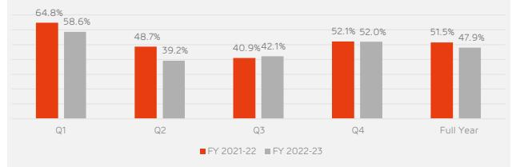

bar

| Period | FY 2021-22 (%) | FY 2022-23 (%) |
| :--- | :--- | :--- |
| Q1 | 64.8 | 58.6 |
| Q2 | 48.7 | 39.2 |
| Q3 | 40.9 | 42.1 |
| Q4 | 52.1 | 52.0 |
| Full Year | 51.5 | 47.9 |

Plant wise PLF (%)   
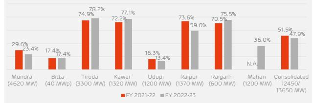

bar

| Company | FY 2021-22 (%) | FY 2022-23 (%) |
| :--- | :--- | :--- |
| Mundra (4620 MW) | 29.6 | 23.4 |
| Bitta (40 MWp) | 17.4 | 17.4 |
| Tiroda (3300 MW) | 74.9 | 78.2 |
| Kawai (1320 MW) | 72.2 | 77.1 |
| Udupi (1200 MW) | 16.3 | 13.4 |
| Raipur (1370 MW) | 73.6 | 59.0 |
| Raigarh (600 MW) | 70.5 | 75.5 |
| Mahan (1200 MW) | N.A. | 36.0 |
| Consolidated 12450/13650 MW | 51.5 | 47.9 |

Power Sales Volume (MU)   
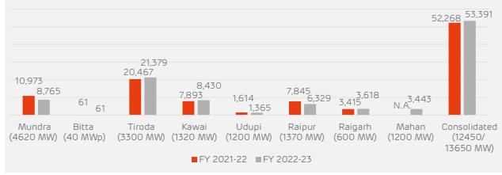

bar

| Company | FY 2021-22 (MW) | FY 2022-23 (MW) |
| :--- | :--- | :--- |
| Mundra (4620 MW) | 10,973 | 8,765 |
| Bitta (40 MWp) | 61 | 61 |
| Tiroda (3300 MW) | 20,467 | 21,379 |
| Kawai (1320 MW) | 7,893 | 8,430 |
| Udupi (1200 MW) | 1,614 | 1,365 |
| Raipur (1370 MW) | 7,845 | 6,329 |
| Raigarh (600 MW) | 3,415 | 3,618 |
| Mahan (1200 MW) | N.A. | 3,443 |
| Consolidated (12450/13650 MW) | 52,268 | 53,391 |

# Financial performance

Consolidated Total Income for FY 2022-23 grew by 36% at H 43,041 crore, as compared to the revenue of H 31,686 crore in FY 2021-22. This growth was the result of improved tariff realization, high import coal price, and higher one-time revenue recognition on account of regulatory claims. The revenue for FY 2022-23 includes recognition of prior period revenue from operations of H 2,377 crore as well as H 695 crore on account of gain on sale of investment, and prior period Other Income of H 3,395 crore, mainly on account of regulatory orders for change in law, carrying costs, and Late Payment Surcharge [“LPS”]. In comparison, revenue for FY 2021-22 includes prior period revenue of H 2,970 crore and prior period other income of H 2,830 crore.

Revenue Progression (H crore)   
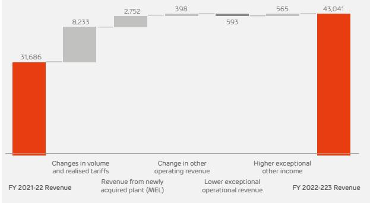

waterfall

| Category | Value |
|---|---|
| FY 2021-22 Revenue | 31,686 |
| Changes in volume and realised tariffs | 8,233 |
| Revenue from newly acquired plant (MEL) | 2,752 |
| Change in other operating revenue | 398 |
| Lower exceptional operational revenue | 593 |
| Higher exceptional other income | 565 |
| FY 2022-223 Revenue | 43,041 |

• In FY 2022-23, the Near-Pithead segment revenue grew because of higher grid demand and higher one-time regulatory income recognition in case of Tiroda, as well as higher merchant / short-term tariffs in case of Raipur and Raigarh. Also, FY 2022- 23 includes revenue from newly acquired 1200 MW plant of Mahan Energen Ltd..   
• Within the Hinterland segment, Kawai registered higher recurring revenues because of higher tariff realization and higher volumes in FY 2022-23. However, the total revenues of Kawai decreased because of lower recognition of prior period revenue compared to FY 2021-22. The Godda power plant, which commissioned its first 800 MW Unit in early April 2023, has not reported operating revenues in FY 2022-23.   
• The operating revenues of the Coastal segment increased in FY2022-23 due to higher import coal prices. However, the increase was partially offset by lower volumes on account of grid backdowns.

Revenue Mix (H crore)   
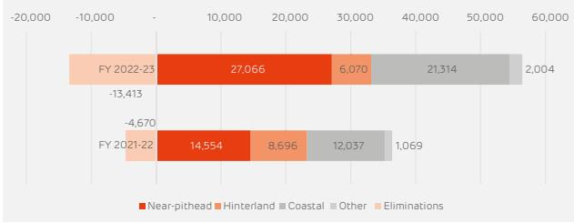

bar_stacked

| Period | Near-pithead | Hinterland | Coastal | Other | Eliminations |
|---|---|---|---|---|---|
| FY 2022-23 | 27,066 | 6,070 | 21,314 | 2,004 | -13,413 |
| FY 2021-22 | 14,554 | 8,696 | 12,037 | 1,069 | -4,670 |

Consolidated EBITDA for FY 2022-23 stood higher by 4% at H 14,312 crore compared to H 13,789 crore for FY

2021-22. This increase in EBITDA was due to higher prior period revenue and better tariff realization, including higher merchant tariffs. The Company’s strategically located open capacity near major coal mining regions was able to benefit from the growth in demand and increase in merchant tariffs in the shortterm market due to its proximity to the fuel source, which creates a competitive advantage in terms of logistics cost of fuel.

The largest contribution to EBITDA growth was from the near-pithead segment, due to higher prior period revenue recognition on account of regulatory orders and payments from customers in Tiroda. EBITDA from hinterland plant reduced due to lower prior period revenue recognition in Kawai, partially offset by revenue inclusion of newly acquired Mahan plant. Coastal segment EBITDA increased mainly due to prior period revenue recognition in Udupi and higher coal trading margin in Mundra, partially offset by lower volumes and margins in Mundra on account of high imported coal prices.

EBITDA Mix (H crore)   
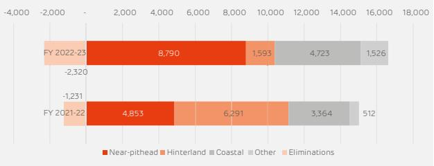

bar_stacked

| Period | Near-pithead | Hinterland | Coastal | Other | Eliminations |
|---|---|---|---|---|---|
| FY 2022-23 | 8,790 | 1,593 | 4,723 | 1,526 | -2,320 |
| FY 2021-22 | 4,853 | 6,291 | 3,364 | 512 | -1,231 |

For FY 2022-23, the Profit Before Tax and exceptional items was H 7,675 crore, as compared to H 6,577 crore in FY 2021-22. The Total Comprehensive Income for FY 2022-23 was H 10,760 crore, as compared to the Total Comprehensive Income of H 4,955 crore for FY 2021-22.

The total external borrowings as of 31st March 2023 were H 35,462 crore compared to H 42,294 crore as of 31st March 2022. The total equity at the consolidated level, including Unsecured Perpetual Securities [UPS], stood at H 29,876 crore as of 31st March 2023 compared to H 18,703 crore as of 31st March 2022.

Key Ratios 

<table><tr><td>APL Consolidated Ratios</td><td>FY 2022-23</td><td>FY 2021-22</td></tr><tr><td>Debtor Turnover (Days)</td><td>96</td><td>109</td></tr><tr><td>Total Trade Receivables to Total Revenue (360 days)</td><td></td><td></td></tr><tr><td>Inventory Turnover (Days)</td><td>36</td><td>43</td></tr><tr><td>Fuel Inventory to Fuel Cost (360 days)</td><td></td><td></td></tr><tr><td>Senior Debt Interest Coverage Ratio (x)</td><td>4.13</td><td>3.38</td></tr><tr><td>EBIT to Interest on Term Debt and Working Capital Borrowings</td><td></td><td></td></tr><tr><td>Current Ratio (x)</td><td>1.10</td><td>0.95</td></tr><tr><td>Current Assets to Current Liabilities</td><td></td><td></td></tr><tr><td>External Debt to Net Worth (x)</td><td>1.19</td><td>2.26</td></tr><tr><td>Senior external debt (Total Borrowings less Loans from related parties) to Total Equity</td><td></td><td></td></tr><tr><td>External Debt to EBITDA (x)</td><td>2.48</td><td>3.07</td></tr><tr><td>Senior external debt (Total Borrowings less Loans from related parties) to EBITDA (PBT + Finance Cost + Depreciation)</td><td></td><td></td></tr><tr><td>EBITDA margin (%)</td><td>33%</td><td>44%</td></tr><tr><td>EBITDA to Total Revenue</td><td></td><td></td></tr><tr><td>PAT Margin (%)</td><td>25%</td><td>16%</td></tr><tr><td>PAT to Total Revenue</td><td></td><td></td></tr><tr><td>Return on Net Worth (%)</td><td>36%</td><td>26%</td></tr><tr><td>PAT to Total Equity</td><td></td><td></td></tr></table>

APL’s PAT Margin and Return on Net Worth improved to 25% and 36% respectively in FY 2022-23 from 16% and 26% respectively in FY 2021-22 because of improvement in profitability of the Company on account of improved tariff realization, higher prior period revenue recognition and cost reversals consequent to the implementation of the scheme for amalgamation of six operating subsidiaries of APL

with APL with effect from 1st October 2021 following the order of Hon’ble National Company Law Tribunal, Ahmedabad (“NCLT”). Consolidated Profit After Tax improved from H 4,912 crore for FY 2021-22 to H 10,727 crore for FY 2022-23. Moreover, APL’s External Debt to Net Worth ratio also improved due to prepayment of external term debt and improved profitability as mentioned above.

APL’s consolidated total equity increased from H 18,703 crore as of 31st March 2022 to H 29,876 crore as of 31st March 2023 mainly due to increase in profit after tax.

# Key Developments during FY 2022-23 SCHEME OF AMALGAMATION

Consequent to approval of the Scheme of Amalgamation by Hon’ble NCLT and fulfilment of the conditions precedent thereto, six operating subsidiaries of APL, viz. Adani Power Maharashtra Limited [“APML”], Adani Power Rajasthan Limited [“APRL”], Adani Power (Mundra) Limited [“APMuL”], Udupi Power Corporation Limited [“UPCL”], Raipur Energen Limited [“REL”], and Raigarh Energy Generation Limited [“REGL”] have been amalgamated with the Holding Company, i.e. APL with effect from 1st October 2021. Following this, CRISIL Ratings Limited and India Ratings Limited have affirmed credit rating of “CRISIL A/Stable” and “Ind A/Positive” respectively assigned to APL.

The amalgamation is intended to achieve size, scalability, integration, greater financial strength and flexibility thereby building a more resilient and robust organization that can address dynamic business situations and volatility in various economic factors in a focused manner, in order to achieve improved long term financial returns.

# OTHER DEVELOPMENTS

# Mundra:

In February 2023, APL entered into Supplemental PPAs (SPPAs) with Haryana DISCOMs, wherein the net contracted capacity under the original PPAs has been reduced from 1424 MW to 1200 MW. This will allow efficient recovery of alternate fuel costs in case power demand from Haryana DISCOMs exceeds domestic coal availability under the FSA.

Further, subsequent to the financial year closing date, in April 2023, the Company has entered into long term PPA of 360 MW (Net) with MPSEZ Utilities Limited (“MUL”) for supplying power from third unit of Mundra Phase-IV plant which got freed-up due to amendment in Haryana PPA capacity. This will ultimately help in maximum utilization of Mundra’s Phase-IV units.

# Tiroda:

Hon’ble Supreme Court passed orders in March 2023 and April 2023 in the matters related to domestic coal shortfall suffered by erstwhile APML under the periods governed by New Coal Distribution Policy (NCDP) and SHAKTI policies. The Hon’ble Court’s orders confirm earlier orders of the Hon’ble Maharashtra Electricity Regulatory Commission (MERC) and the Hon’ble Appellate Tribunal of Electricity (APTEL).

Similar to the above, the Hon’ble Supreme Court also passed another order related to de-allocation of Lohara coal block as part of change-in-law, confirming earlier orders of MERC and APTEL.

These orders will allow the Tiroda plant to recover alternate coal costs, along with carrying cost and late payment surcharge, arising due to shortfall in domestic coal, under change-in-law clauses of the respective PPAs.

# Human Resource Practices

At APL, we consider employees as our biggest asset. It is our constant endeavour to upgrade knowledge and skills, enhancing productivity of our employees. The average employee age of the company stood at 37 years, a complement of positive energy, enthusiasm and experience. We offer significant importance to employee safety and wellbeing through various safety initiatives like Chetna that sharpen our employees’ skills to create a safe workplace.

The Company has created a valuable workplace revolving around the principles of capability building, employee engagement, governance and digitalisation. To ensure employee life cycle management, the company implemented Oracle Fusion Digital HR Tool. Learning modules and performance appraisal helped standardise systems on a real-time basis. Competence evaluation and development were focused on all major functions and services.

Focused action plans were emphasized on increased engagement based on the outcome of a Gallup employee engagement survey.

The company invested in young talents (GETs & MTs) and sharpened the skills of talented professionals to prepare them for bigger responsibilities rather hiring laterals. APL undertook focused approach to develop and train successors for all critical positions through high potential professionals and young managers.

The Company had launched capability building initiatives under Transition Leadership Programs like Fulcrum, Takshashila and North Star in alliance with leading management institutes.

# Internal control system

The Company has robust internal control procedures in place that are commensurate with its size and operations. The Board of Directors, responsible for the internal control system, sets the guidelines and verifies its adequacy, effectiveness and application. The Company’s internal control system is designed to ensure management efficiency, measurability and verifiability, reliability of accounting and management information, compliance with all applicable laws and regulations, and the protection of the Company’s assets. This is to timely identify and manage the Company’s risks (operational, compliance-related, economic and financial).

# Cautionary statement

This statement made in this section describes the Company’s objectives, projections, expectations and estimations which may be ‘forward-looking statements within the meaning of applicable securities laws and regulations.

Our risk mitigation matrix 

<table><tr><td>Scenario</td><td>Risks</td><td>Mitigation Measures</td></tr><tr><td>Mergers and acquisitions</td><td>Incorrect target selectionInadequate due diligenceIncorrect assessment of future synergies, potential benefits from the transaction, or fund infusion requirements.</td><td>Creation of established criteria for target co. selection based on key parameters such as project status, PPA tie-up, technologyFormation of inter-departmental teams, with each team to focus on its core area for due diligence.Ensuring that all information that is sought is promptly provided by counterparties.Ensuring that necessary safeguards are built into the resolution plans and final transaction documents to protect from risks / liabilities that could not be identified during due diligence stage.Every assumption having impact on valuation to be vetted by the responsible department.Conservative approach in financial projections for valuation.Periodic post-acquisition analysis of assumptions and deviations, and incorporation of learnings into procedures for future acquisitions.</td></tr><tr><td>Regulatory</td><td>Favourable regulatory orders being overturned upon appealCustomers reneging on contractual terms due to unfavourable situationsNon-compliance of regulatory / judicial orders by customers</td><td>Building strong case with effective arguments, using facts, precedence, and already decided legal principles.Enforcement of contractual terms through representation and regulatory/judicial intervention.Contempt proceedings seeking early redressal of claim/appeal.</td></tr><tr><td>Commodity price risk</td><td>Sharp increases in imported coal priceDomestic coal shortageHigh prices of alternate coal</td><td>Representations to CEA/regulators for precise matching of escalation indices with actual coal price increase.Recovery of increase in coal price though revision in tariffs and escalation indices.Ramping up pre-monsoon domestic coal procurement to stock the coal during lean production periods.</td></tr><tr><td>Reputation risk</td><td>Risk of reputation loss from operational issues such as safety, environment or litigation</td><td>Strengthening of communication with Stakeholders in case of any such event</td></tr></table>

# Company Information

# Board of Directors

Mr. Gautam S. Adani, Chairman (Non-Executive)

Mr. Rajesh S. Adani, Director (Non-Executive)

Mr. Anil Sardana, Managing Director

Mr. Raminder Singh Gujral, Independent Director (upto 11.11.2022)

Ms. Gauri Trivedi,

Independent Director (upto 11.11.2022)

Mr. Sushil Kumar Roongta, Independent Director (w.e.f. 11.11.2022)

Ms. Chandra Iyengar, Independent Director (w.e.f. 11.11.2022)

Mr. Mukesh Shah, Independent Director

# Chief Executive Officer

Mr. Shersingh B. Khyalia

# Chief Financial Officer

Mr. Shailesh Sawa

# Company Secretary

Mr. Deepak S Pandya

# Statutory Auditors

M/s. S R B C & Co LLP

Chartered Accountants, Ahmedabad

# Secretarial Auditors

M/s Chirag Shah & Associates, Ahmedabad

# Cost Auditors

M/s Kiran J Mehta & Co., Ahmedabad

# Registered Office

Adani Corporate House, Shantigram, Near Vaishno Devi Circle,

S. G. Highway, Khodiyar, Ahmedabad - 382 421, Gujarat, India.

Website:www.adani.com

# Corporate Identification Number

L40100GJ1996PLC030533

# Registrar and Transfer Agent

# KFin Technologies Ltd,

Karvy Selenium, Tower- B, Plot No. 31 & 32,

Financial district, Nanakramguda, Serilingampally Mandal,

Hyderabad,Telangana,500032

Tel No.: 040 - 67161500 / 18003454001

einward.ris@karvy.com

# Bankers / Financial Institutions

Aditya Birla Finance Limited

Axis Bank Limited

Bank of Baroda

Bank of India

Bank of Maharashtra

Canara Bank

Central Bank of India

DCB Bank Limited

Edelweiss Asset Reconstruction

Company Limited

HDFC Limited

ICICI Bank Limited

IDBI Bank Limited

India Infrastructure Finance Company (UK) Limited

India Infrastructure Finance Company Limited

Indian Bank

Indian Overseas Bank

Life Insurance Corporation of India

Phoenix ARC Private Limited

Power Finance Corporation Limited

Punjab & Sindh Bank

Punjab National Bank

State Bank of India

The Jammu & Kashmir Bank Limited UCO Bank

Union Bank of India

Yes Bank Limited

# Committees

# (as on 31st March, 2023)

# Audit Committee

Mr. Mukesh Shah, Chairman

Mrs. Chandra lyengar, Member

Mr. Sushil K. Roongta, Member

# Nomination & Remuneration

# Committee

Mr. Sushil K. Roongta, Chairman

Mr. Mukesh Shah, Member

Mrs. Chandra lyengar, Member

# Stakeholders’ Relationship Committee

Mr. Sushil K. Roongta, Chairman

Mr. Mukesh Shah, Member

Mr. Rajesh S. Adani, Member

# Corporate Social Responsibility Committee

Mr. Mukesh Shah, Chairman

Mr. Sushil K. Roongta, Member

Mrs. Chandra lyengar, Member

Mr. Anil Sardana, Member

# Risk Management Committee

Mr. Mukesh Shah, Chairman

Mr. Sushil K. Roongta, Member

Mrs. Chandra lyengar, Member

Mr. Anil Sardana, Member

# Corporate Responsibility Committee

Mrs. Chandra lyengar, Chairperson

Mr. Sushil K. Roongta, Member

Mr. Mukesh Shah, Member

# Information Technology & Data Security Committee

Mr. Anil Sardana, Chairman

Mr. Mukesh Shah, Member

Mr. Sushil K. Roongta, Member

# Mergers & Acquisitions Committee

Mr. Anil Sardana, Chairman

Mr. Mukesh Shah, Member

Mr. Sushil K. Roongta, Member

Mrs. Chandra lyengar, Member

# Legal. Regulatory & Tax Committee

Mr. Anil Sardana, Chairman

Mr. Mukesh Shah, Member

Mr. Sushil K. Roongta, Member

Mrs. Chandra lyengar, Member

# Reputation Risk Committee

Mr. Anil Sardana, Chairman

Mr. Mukesh Shah, Member

Mr. Sushil K. Roongta, Member

Mrs. Chandra lyengar, Member

# Commodity Price Risk Committee

Mr. Anil Sardana, Chairman

Mr. Mukesh Shah, Member

Mr. Sushil K. Roongta, Member

Mrs. Chandra lyengar, Member

# IMPORTANT COMMUNICATION TO MEMBERS

The Ministry of Corporate Affairs has taken a “Green Initiative in the Corporate Governance” by allowing paperless compliances by the companies and has issued circulars stating that service of notice / documents including Annual Report can be sent by e-mail to its Members. To support this green initiative of the Government in full measure, Members who have not registered their e-mail addresses, so far, are requested to register their e-mail addresses, in respect of electronic holding with the Depository through concerned Depository Participants.

# Directors’ report

#

Your Directors are pleased to present the 27th Annual Report along with the Audited Financial Statements of your Company for the financial year ended 31st March, 2023 (FY 2022-23).

# Financial Performance

The Audited Financial Statements of your Company as on 31st March, 2023, are prepared in accordance with the relevant applicable Ind AS and Regulation 33 of the Securities and Exchange Board of India (Listing Obligations and Disclosure Requirements) Regulations, 2015 (“SEBI Listing Regulations”) and the provisions of the Companies Act, 2013 (“Act”).

The summarized financial highlight is depicted below:

(H In crore) 

<table><tr><td rowspan="2">Particulars</td><td colspan="2">Consolidated</td><td colspan="2">Standalone</td></tr><tr><td>2022-23</td><td>2021-22</td><td>2022-23</td><td>2021-22</td></tr><tr><td>Revenue from operations</td><td>38,773.30</td><td>27,711.18</td><td>36,681.21</td><td>27,711.18</td></tr><tr><td>Other Income</td><td>4,267.22</td><td>3,975.29</td><td>4,519.98</td><td>4,068.32</td></tr><tr><td>Total Income</td><td>43,040.52</td><td>31,686.47</td><td>41,201.19</td><td>31,779.50</td></tr><tr><td>Expenditure other than Depreciation, Finance cost and Net Foreign Exchange (Gain) / Loss</td><td>28,613.97</td><td>17,852.90</td><td>27,337.43</td><td>17,850.00</td></tr><tr><td>Depreciation and Amortisation Expenses</td><td>3,303.68</td><td>3,117.54</td><td>3,142.79</td><td>3,116.21</td></tr><tr><td>Foreign Exchange (Gain) / Loss (net)</td><td>114.67</td><td>44.12</td><td>24.79</td><td>24.49</td></tr><tr><td>Finance Cost</td><td>3,333.50</td><td>4,094.78</td><td>3,306.80</td><td>4,086.92</td></tr><tr><td>- Interest and Bank Charges</td><td>3,475.53</td><td>4,100.95</td><td>3,448.83</td><td>4,093.09</td></tr><tr><td>- Derivative (Gain)/Loss (net)</td><td>(142.03)</td><td>(6.17)</td><td>(142.03)</td><td>(6.17)</td></tr><tr><td>Total Expenditure</td><td>35,365.82</td><td>25,109.34</td><td>33,811.81</td><td>25,077.62</td></tr><tr><td>Profit Before Tax</td><td>7,674.70</td><td>6,577.13</td><td>7,389.38</td><td>6,701.88</td></tr><tr><td>Total Tax Expense</td><td>(3,482.80)</td><td>1,824.05</td><td>(3,287.63)</td><td>1,824.04</td></tr><tr><td>Profit for the year</td><td>10,726.64</td><td>4,911.58</td><td>10,246.15</td><td>5,036.34</td></tr><tr><td>Other Comprehensive income (net of tax)</td><td>33.74</td><td>43.63</td><td>(4.17)</td><td>17.00</td></tr><tr><td>Total Comprehensive Income for the year (net of tax)</td><td>10,760.38</td><td>4,955.21</td><td>10,241.98</td><td>5,053.34</td></tr><tr><td>Attributable to:</td><td></td><td></td><td></td><td></td></tr><tr><td>Equity holders of the parent</td><td>10,760.38</td><td>4,955.21</td><td>-</td><td>-</td></tr><tr><td>Non-controlling interests</td><td>*</td><td>*</td><td>-</td><td>-</td></tr></table>

(Figures below H 50,000 are denominated as \*)   
1. There are no material changes and commitments affecting the financial position of your Company, which have occurred between the end of the financial year and the date of this report.   
2. Further, there has been no change in nature of business of your Company.

# Performance Highlights

# Consolidated:

The key aspects of your Company’s consolidated performance during the FY 2022-23 are as follows:

# a) Revenue

The consolidated total revenue of your Company for FY 2022-23 stood at H 43,040.52 crore as against H 31,686.47 crore for FY 2021-22 showing an increase of 35.83%. The consolidated revenue for FY 2022-23 comprised revenue from operations of H 38,773.30 crore and other income of H 4,267.22 crore as compared to H 27,711.18 crore and H 3,975.29 crore respectively for FY 2021-22. Revenue from operations for FY 2022-23 registered a growth of 39.92% over the previous year due to revival of the Mundra plant’s 1,234 MW Bid-2 Power Purchase Agreement [“PPA”] with Gujarat Urja Vikas Nigam Limited [“GUVNL”] in March 2022, recognition of prior period revenue from operations of H 2,580 crore in Tiroda TPP due to favourable regulatory orders in respect of Shortfall in domestic coal, improved tariff realisation due to greater merchant / shortterm demand and higher import coal price, and inclusion of operating results of your Company’s wholly owned subsidiary Mahan Energen Limited [“MEL”], which was acquired on 16th March, 2022. Other income for FY 2022-23 registered a growth of 7.34% over the previous year due to higher recognition of prior period other income primarily on account of regulatory orders for carrying costs and collection of late payment surcharges from customers.

Your Company sold 53.39 Billion units of electricity during FY 2022-23 as against 52.27 Billion units in FY 2021-22 from all the plants with Plant Load Factor (PLF) decreasing from 51.5% in the previous year to 47.9% in FY 2022-23. Capacity under operation increased from 12,450 MW in FY 2021-22 to 13,650 MW in FY 2022-23 following the acquisition of MEL, which owns and operates a 1,200 MW thermal power plant in Singrauli District of Madhya Pradesh.

# b) Operating and Administrative Expenses

Consolidated Operating and Administrative Expenses during FY 2022-23 were H 28,728.64 crore, which have increased by 60.52% from H 17,897.02 crore in FY 2021-22. The increase is mainly due to higher fuel cost owing to high prices of import coal, and higher other operating expenses including employee benefits expenses. The percentage of Operating and Administrative

Expenses to Total Revenue has increased to 66.75% in FY 2022-23 from 56.48% in FY 2021-22.

# c) Depreciation and Amortization Expenses

Consolidated Depreciation and Amortization Expenses during FY 2022-23 were H 3,303.68 crore, which have increased by 5.97% from H 3,117.54 crore in FY 2021-22 primarily due to the acquisition of MEL.

# d) Finance Costs

Consolidated Finance Costs during FY 2022-23 were H 3,333.50 crore, which have decreased by 18.59% from H 4,094.78 crore in FY 2021- 22, mainly due to reduction in outstanding loans through prepayment as well as scheduled repayments.

# e) Tax

Consolidated Tax (Credit) of H 3,267.37 Crore during FY 2022-23 was mainly due to reversal of deferred tax liability and current tax provision as compared to Tax Expense of H 1,744.80 Crore during FY 2021-22.

# f) Total Comprehensive Income for the year

Consolidated Total Comprehensive Income for FY 2022-23 was higher by 117.15% at H 10,760.38 crore as compared to Total Comprehensive Income of H 4,955.21 crore in FY 2021-22.

The detailed operational performance of your Company has been comprehensively discussed in the Management Discussion and Analysis Section which forms part of this Annual Report.

# Credit Rating

The Companies financial discipline and prudence is reflected in the strong credit ratings ascribed by rating agencies. The details of credit rating are disclosed in Corporate Governance Report, which forms part of the Annual Report.

# Dividend

The Board of Directors of your Company (“Board”), after considering the relevant circumstances holistically and keeping in view the Company’s Dividend Distribution Policy, has decided that it would be prudent not to recommend any dividend for the year under review.

During the year under review, the scheme of amalgamation of Raipur Energen Limited (“REL”) and five other wholly owned subsidiaries of the Company (“APL”) with APL became effective with effect from 7th March, 2023. In consequence, the preference shareholders of REL, holding 4,15,86,207 0.01% compulsorily redeemable preference shares of H 100/- each fully paid-up, have been allotted preference shares by APL. These preference shares bear dividend at the rate of 0.01% per annum for each financial year. In view of this, the agenda in respect of declaration of the dividend to the said preference shareholders has been moved in the Notice of the 27th Annual General Meeting of the Company.

# Transfer to Reserves

There is no amount proposed to be transferred to the Reserves. The closing balance of the retained earnings of your Company for FY2022-23, after all appropriations and adjustments was H 477.08 crore.

# Scheme of Amalgamation

During the year, Scheme of Amalgamation of Six Wholly Owned Subsidiary Companies of Adani Power Limited (“APL”), viz. (i) Adani Power Maharashtra Limited (“APML”); (ii) Adani Power Rajasthan Limited (“APRL”); (iii) Udupi Power Corporation Limited (“UPCL”); (iv) Raipur Energen Limited (“REL”); (v) Raigarh Energy Generation Limited (“REGL”); and (vi) Adani Power (Mundra) Limited (“APMuL”) with APL was sanctioned by the Hon’ble National Company Law Tribunal’s Bench at Ahmedabad on February 8, 2023 (the “Scheme”).

All the conditions stated under the Scheme for making it effective have been satisfied, and hence the Scheme was made effective from the Appointed Date i.e. October 1. 2021.

Consequently, the six aforementioned companies, i.e. APML, APRL, UPCL. REL, REGL, and APMuL now stand amalgamated with APL. Accordingly, the financial statements for FY 2022-23 have been published based on amalgamation and the comparative period numbers have been recasted in standalone Financial Statements in compliance with applicable accounting standards.

The amalgamation envisaged under this scheme is intended to achieve size, scalability, integration, greater financial strength and flexibility thereby building a more resilient and robust organization that can address dynamic business situations and volatility in various economic factors in a focused manner, in order to achieve improved long-term financial returns.

# Key Developments

# A. Mundra TPP

• Subsequent to signing of Settlement Deed on 03.01.2022 and Supplementary Power Purchase Agreement (SPPA) dated 30th March 2022 between Gujarat Urja Vikas Nigam Ltd. (“GUVNL”) and Adani Power (Mundra) Limited

(“APMuL”) (Now Adani Power Ltd), Hon’ble Central Electricity Regulatory Commission (CERC) vide order dated 13.06.2022 has determined Base Rates as on 15.10.2018 in the Petition filed by GUVNL, same is pending for approval from Government of Gujarat.

• Adani Power Ltd. (APL) and Haryana Discoms (i.e UHBVNL and DHBVNL) have entered into Supplemental PPAs on 28.02.2023 by reducing the Contracted Capacity from 1424 MW to 1200 MW at Haryana Periphery from Units 7 & 8 instead of Units-7, 8 & 9 of Mundra Thermal Power Plant. In April 2023, the Company has also entered into long term PPA of 360 MW (Net) with MPSEZ Utilities Limited (“MUL”) for supplying power from third unit of Mundra Phase-IV plant which got freed-up due to amendment in Haryana PPA capacity. This will ultimately help in maximum utilization of Mundra’s Phase-IV units.

Under the Supplemental PPAs dated 28.02.2023, quoted energy tariff including change in law towards taxes & duties shall be payable in accordance with the PPA for the scheduled energy to the extent of domestic coal availability.

• For the units supplied using alternate/imported coal, pass through of cost shall be allowed with reference to the tariff worked out based on the HBA index of the month of recommencement of supply i.e. March 2023 as base and thereafter every month based on CERC monthly indexation. The ocean freight shall be as per CGPL PPA, and the Port Handling charges shall be as applicable for Mundra Power Plant.   
• Hon’ble Supreme Court vide its order dated 20.04.2023 dismissed the Civil Appeal no. 4143 of 2020 filed by Haryana Discoms against the APTEL judgment in Appeal no. 168 of 2019 upholding the CERC order dated 31st May 2018 in Petition No. 97/MP/2017 with regards to change in law towards domestic coal shortfall for the NCDP period.   
• Hon’ble Supreme Court vide its order dated 20.04.2023 dismissed the Civil Appeal no. 5684 of 2021 filed by Haryana Discoms against the APTEL judgment in Appeal no. 358 of 2019 upholding the CERC order dated 13th June 2019 in Petition No. 251/MP/2018 with regards to change in law towards domestic coal shortfall for the SHAKTI period.

• Hon’ble Supreme Court vide its order dated 20.04.2023 allowed the Civil Appeal no. 2908 of 2022 filed by Haryana Discoms and held that Inter Plant Transfer (IPT) is a ‘Change in Law’ and accordingly, savings in the cost of transportation has to be passed on to the DISCOMs and directed CERC to decide the said issue and calculate the benefits that would be accruable to any of the parties within a period of six months from the date of order.

# B. Maharashtra TPP

# • NCDP case corresponding to PPAs of 2500 MW capacity:

Hon’ble Supreme Court vide its order dated 03.03.2023, dismissed the Civil Appeal No. 684 of 2021 filed by Maharashtra State Electricity Distribution Company Ltd. (“MSEDCL”) against the APTEL judgment in Appeal no. 182 of 2019 and upheld the decision of APTEL, allowing the compensation for the entire quantum of coal shortfall, Station Heat Rate (SHR) and Auxiliary consumption to be considered as per the Tariff Regulations or actuals, whichever is lower and Gross Calorific Value (GCV) of coal on ‘as received’ basis.

# • SHAKTI case corresponding to PPAs of 2500 MW capacity:

Hon’ble Supreme Court vide its order dated 20.04.2023, dismissed the Civil Appeal no. 677-678 of 2021 filed by MSEDCL against the judgment of APTEL in appeal no. 155 of 2019 & 116 of 2019 and upheld the decision of APTEL, allowing the compensation for the entire quantum of coal shortfall and the Station Heat Rate (SHR) and Gross Calorific Value (GCV) of coal shall be considered at actual values.

# • Lohara Case corresponding to PPAs of 800 MW capacity:

Hon’ble Supreme Court vide its order dated 20.04.2023, dismissed the Civil Appeal no. 687-688 of 2021 filed by MSEDCL against the judgement of APTEL in appeal no. 340 of 2019 and 354 of 2019 and upheld the decision of APTEL, allowing that the de-allocation of the Lohara Coal Blocks by the Ministry of Coal allocated to APML for 800 MW capacity is an event of Change in Law and further allowing the compensation for such shortfall considering the Lohara coal cost as a base.

MSEDCL has made payment of H 8379 Cr, on account of shortfall claim related to NCDP, SHAKTI and Lohara case matter as reported above, subsequent to interim order dated 31st January 2022 passed by the Hon’ble Supreme Court, directing payment of 50% of the outstanding claim amount to APML.

# • Evacuation Facility Surcharge:

APTEL vide its judgment dated 22.03.2022 in Appeal no. 40 of 2022 filed by APML, has allowed Evacuation Facility Surcharge as Change in Law event and remanded back the matter to MERC for passing consequential order. MERC passed consequential order on 08.07.2022. Further, the Civil Appeal no. 5005 of 2022 filed by MSEDCL against the APTEL order has been dismissed by Hon’ble Supreme Court on 20.04.2023 upholding the APTEL judgement. According to MERC order and interim order of Hon’ble Supreme Court dated 29.07.2022, MSEDCL has made a payment of H 302 Cr against the claim raised till April 2022.

# • Fly Ash Transportation Cost:

APTEL vide its order dated 21.10.2022 in Appeal no. 148 of 2019 filed by APML, has allowed Fly Ash Transportation cost to be incurred by APML pursuant to MOEF&CC notification dated 25.01.2016 as Change in law event and remanded the matter back to MERC for passing consequential order. APML has filed an application with MERC for issuance of consequential order. Meanwhile, MSEDCL has filed Civil Appeal no. 127 of 2023 against the APTEL order before Hon’ble Supreme Court, which is under adjudication.

# C. Rajasthan TPP

Adani Power Rajasthan Limited (“APRL”) and RUVNL / Rajasthan Discoms (Discoms) have entered into an Additional PPA on 06.04.2022 for a period of 1 year for supply/purchase of balance surplus capacity of 40 MW on the same terms and conditions of existing Long Term PPA dated 28.01.2010 of 1200 MW.

Accordingly, Adani Power has commenced the power supply under the Additional PPA for 40 MW w.e.f 11.06.2022.

# D. Jharkhand TPP (APJL)

APJL has made substantial progress in the implementation of 2x800 MW Ultra-supercritical Thermal Power Project (USCTPP) at Godda, Jharkhand for supply of 1496 MW power to Bangladesh Development Power Board (“BPDB”) as per PPA dated 05th November 2017 and achieved several milestones during FY 2022-23. Commercial Operation Tests for Unit-01 have commenced w.e.f. 29.03.2023.

By the end of Q1 of FY2023-24, APJL is expected to achieve the Commercial Operation of Unit-1 and Unit-2.

# E. Udupi TPP

# • Late Payment Surcharge:

Supreme Court (SC) vide its order dated 10.08.2022 has dismissed the Review Petitions filed by PCKL in Civil Appeal No. 838 & 842 considering that there were no grounds warranting review of order dated 08.02.2022. Consequently, Udupi TPP has received H 1348 crore towards Late Payment Surcharge from DISCOMs of Karnataka State

# • Petition no. 155/MP/2019 filed by UPCL before with the Hon’ble CERC

Hon’ble CERC vide its order dated 13.01.2023 has directed the Karnataka Discoms to (i) pay deemed capacity charges on account of nonavailability of 400kV transmission line for the period 10.03.2011 to 06.09.2012, (ii) calculate the Energy Charges as per provisions of relevant Tariff Regulations after considering the CIF price of coal, as determined based on the CERC Formula specified in the order for the period Apr-16 to Mar-19 and (iii) pay carrying cost on arrears of differential Capacity Charges and differential Energy Charges till date of CERC order dated 13.01.2023.

# F. Mahan TPP (MEL)

APTEL vide Interim Order dated 24.01.2023, in the Appeal filed by MEL, granted interim stay for payment of transmission charges for the assets of Essar Power Transmission Company Limited (‘EPTCL’) under Stage-II (400 kV D/C Mahan-Sipat transmission line along with associated bays) for the period from Sep-2018 to Oct-2021 and directed to pay the same from the date of NCLT order i.e. 01.11.2021 onwards subject to decision in the main appeal.

# G. Raigarh TPP

Hon’ble Chhattisgarh State Electricity Regulatory Commission (CSERC) vide its order dated 08.08.2022 in the tariff petition filed by REGL, has determined the energy charge rate for supply of 5% power to Chhattisgarh State Power Distribution Company Limited (CSPDCL) for the FY2019-20.

# Changes in Share Capital

Consequent to Scheme of Amalgamation referred hereinabove, the Authorized Share Capital of the six Wholly Owned Subsidiaries have been merged into the Company.

The outstanding Preference Shares of Raipur Energen Limited and Adani Power (Mundra) Limited as on 7th March, 2023 have been issued and allotted by Adani Power Limited pursuant to the Scheme of Amalgamation and the respective Preference Shares of the aforementioned Companies have been automatically cancelled.

The changes in Share Capital described hereinabove has been given effect to in the Financial Statements for the Financial Year ending on 31st March, 2023.

# Fixed Deposits

There were no outstanding deposits within the meaning of Section 73 and 74 of the Act read with rules made thereunder at the end of the FY 2022-23 or the previous financial years. Your Company did not accept any deposit during the year under review.

# Particulars of loans, guarantees or investments

The provisions of Section 186 of the Act, with respect to a loan, guarantee, investment or security is not applicable to your Company, as your Company is engaged in providing infrastructural facilities which is exempted under Section 186 of the Act. The particulars of loans, guarantee and investments made during the year under review are disclosed in the financial statements.

# Subsidiaries, Joint Ventures and Associate Companies

A list of bodies corporate which are subsidiaries / associates / joint ventures of your Company is provided as part of the notes to consolidated financial statements.

During the year under review, following subsidiaries have been formed/acquired:

• Aviceda Infra Park Limited   
• Innovant Buildwell Private Limited (Earlier known as Eternus Real Estate Private Limited)   
• Resurgent Fuel Management Limited   
• Support Properties Private Limited (“SPPL”) (During the year under review, 100% equity stake of the Company in SPPL has been sold)

As on 31st March 2023, your Company had 13 Subsidiaries and step-down subsidiaries. Pursuant to the provisions of Section 129, 134 and 136 of the Act read with rules made thereunder and Regulation 33 of the SEBI Listing Regulations, your Company has prepared consolidated financial statements and a separate statement containing the salient features of financial statement of subsidiaries, joint ventures and associates in Form AOC-1, which forms part of Annual Report.

The Annual Financial Statements and related detailed information of the subsidiary companies shall be made available to the shareholders of the holding and subsidiary companies seeking such information on all working days during business hours. The financial statements of the subsidiary companies shall also be kept for inspection by any shareholders during working hours at your Company’s registered office and that of the respective subsidiary companies concerned. In accordance with Section 136 of the Act, the audited financial statements, including consolidated financial statements and related information of your Company and audited accounts of each of its subsidiaries, are available on website of your Company (www. adanipower.com).

Your Company has formulated a policy for determining Material Subsidiaries. The policy is available on your Company’s website and link for the same is given in Annexure A of this report.

Pursuant to Section 134 of the Act read with rules made thereunder, the details of developments of subsidiaries and joint ventures of your Company are covered in the Management Discussion and Analysis Report, which forms part of this Annual Report.

# Subsidiary Companies and its Financial Performance

A list of bodies corporate which are subsidiaries of your Company is provided as part of the notes to consolidated financial statements.

Pursuant to the provisions of Section 129, 134 and 136 of the Act read with rules made thereunder and Regulation 33 of the SEBI Listing Regulations, the Company has prepared consolidated financial statements and a separate statement containing the salient features of financial statement of subsidiaries in Form AOC-1, which forms part of this Annual Report.

The Annual Financial Statements and related detailed information of the subsidiary companies shall be made available to the shareholders of the holding and subsidiary companies seeking such information on all working days during business hours. The financial statements of the subsidiary companies shall also be kept for inspection by any shareholders during working hours at the Company’s registered office and that of the respective subsidiary companies concerned. In accordance with Section 136 of the Act, the Audited Financial Statements, including Consolidated Financial Statements and related information of the Company and audited accounts of each of its subsidiaries, are available on website of the Company (www.adanipower.com).

Pursuant to Section 134 of the Act read with rules made thereunder, the details of developments of subsidiaries of the Company are covered in the Management Discussion and Analysis Report, which forms part of this Annual Report.

# Financial Performance of Key Subsidiaries Mahan Energen Limited [MEL]:

MEL’s Mahan Power Plant has a total installed capacity of 1,200 MW. PLF for the year was 35.9%. The Mahan Power Plant had H 2,752 crore towards the total revenue and H 771 crore towards the EBIDTA. MEL had H 244 crore Total Comprehensive Income during the year.

# Adani Power (Jharkhand) Limited [APJL]:

APJL’s Godda Power Plant has a total installed capacity of 1,600 MW coal powered thermal power plant based on ultra super critical technology in the State of Jharkhand during the year out of which one unit of 800 MW has been commissioned in April 2023.

# Management Discussion and Analysis

The Management Discussion and Analysis Report for the year under review, as stipulated under the SEBI Listing Regulations, is presented in a section forming part of this Annual Report.

# Directors and Key Managerial Personnel

As of 31st March, 2023, your Company’s Board had six members comprising of one Executive Director, two Non-Executive and Non-Independent Directors and three Independent Directors. The Board has one Woman Director. The details of Board and Committee composition, tenure of Directors, areas of expertise and other details are available in the Corporate Governance Report, which forms part of this Annual Report.

# Changes in Directors:

Mr. Sushil Kumar Roongta (DIN: 00309302) and Ms. Chandra Iyengar (DIN 02821294), were appointed as Independent Directors of your Company w.e.f. 11th November, 2022. Their appointments were approved by the shareholders by passing a resolution through Postal Ballot on 31st December, 2022.

Mr. Raminder Singh Gujral (DIN: 07175393) and Ms. Gauri Trivedi (DIN: 06502788) resigned as Independent Directors w.e.f. 11th November, 2022. Both these Independent Directors have resigned as a matter of good governance policy and decided not to continue holding position as an Independent Director in more than one listed entity within the same group. The Board placed on its record the deep appreciation for valuable services and guidance provided by them during the tenure of their Directorship.

In accordance with the provisions of Section 152 of the Act, read with rules made thereunder and Articles of Association of your Company, Mr. Rajesh Adani (DIN: 00006322) is liable to retire by rotation at the ensuing Annual General Meeting (AGM) and being eligible, offers himself for re-appointment.

Your Company has received declarations from all the Independent Directors confirming that they meet with the criteria of independence as prescribed both under sub-section (6) of Section 149 of the Act and Regulation 16(1)(b) of the SEBI Listing Regulations and there has been no change in the circumstances which may affect their status as an Independent Director.

# Change in Key Managerial Personnel:

During the year under review, there is no change in the Key Managerial Personnel of your Company.

Pursuant to the provisions of Section 203 of the Companies Act, 2013, Mr. Anil Sardana - Managing Director, Mr. S. B. Khyalia – Chief Executive Officer, Mr. Shailesh Sawa - Chief Financial Officer and Mr. Deepak S. Pandya - Company Secretary are the Key Managerial Personnel of your Company as on 31st March, 2023.

# Committees of Board

Details of various committees constituted by the Board, including the committees mandated pursuant to the applicable provisions of the Act and SEBI Listing Regulations, are given in the Corporate Governance Report, which forms part of this Annual Report.

# Number of meetings of the Board

The Board met 4 (four) times during the year under review. The details of board meetings and the attendance of the Directors are provided in the Corporate Governance Report, which forms part of this Annual Report.

# Independent Directors’ Meeting

The Independent Directors met on 24th March, 2023, without the attendance of Non-Independent Directors and members of the management. The Independent Directors reviewed the performance of Non-Independent Directors, the Committees and the Board as a whole along with the performance of the Chairman of your Company, taking into account the views of Executive Directors and Non-Executive Directors and assessed the quality, quantity and timeliness of flow of information between the management and the Board that is necessary for the Board to effectively and reasonably perform their duties.

# Board Evaluation and Familiarization Programme

The Board carried out an annual performance evaluation of its own performance and that of its Committees and Individual Directors as per the formal mechanism for such evaluation adopted by the Board. The performance evaluation of all the Directors was carried out by the Nomination and Remuneration Committee.

The performance evaluation of the Chairman, the Non-Independent Directors, the Committees and the Board as a whole was carried out by the Independent Directors. The exercise of performance evaluation was carried out through a structured evaluation process covering various aspects of the Board functioning such as composition of the Board & Committees, experience & competencies, performance of specific duties & obligations, contribution at the meetings and otherwise, independent judgment, governance issues etc.

# Policy on Directors’ appointment and remuneration

Your Company’s policy on Directors’ appointment and remuneration and other matters (“Remuneration Policy”) pursuant to Section 178(3) of the Act is available on the website of your Company at https://www.adanipower.com/investors/corporategovernance.

The Remuneration Policy for selection of Directors and determining Directors’ independence sets out the guiding principles for the Nomination and Remuneration Committee for identifying the persons who are qualified to become the Directors. Your Company’s Remuneration Policy is directed towards rewarding performance based on review of achievements. The Remuneration Policy is in consonance with existing industry practice.

We affirm that the remuneration paid to the Directors is as per the terms laid out in the Remuneration Policy.

# Directors’ Responsibility Statement

Pursuant to Section 134(5) of the Act, the Board, to the best of their knowledge and based on the information and explanations received from your Company, confirm that:

a. in the preparation of the Annual Financial Statements, the applicable accounting standards have been followed and there are no material departures;   
b. they have selected such accounting policies and applied them consistently and judgements and estimates that are reasonable and prudent so as to give a true and fair view of the state of affairs of the Company at the end of the financial year 2022-23 and of the profit of the Company for that period;   
c. they have taken proper and sufficient care for the maintenance of adequate accounting records in accordance with the provisions of the Act for safeguarding the assets of the Company and for preventing and detecting fraud and other irregularities;   
d. they have prepared the Annual Financial Statements on a going concern basis;   
e. they have laid down internal financial controls to be followed by the Company and such internal financial control are adequate and operating effectively;   
f. they have devised proper systems to ensure compliance with the provisions of all applicable laws and that such systems are adequate and operating effectively.

# Internal Financial Control System and their adequacy

The details in respect of internal financial control and their adequacy are included in Management Discussion and Analysis Report, which forms part of this Annual Report.

# Risk Management

The Company has a structured Risk Management Framework, designed to identify, assess and mitigate risks appropriately. The Board has formed a Risk Management Committee (RMC) to frame, implement and monitor the risk management plan for the Company. The RMC is responsible for reviewing the risk management plan and ensuring its effectiveness. The Audit Committee has additional oversight in the area of financial risks and controls. The major risks identified by the businesses are systematically addressed through mitigation actions on a continual basis. Further details on the Risk Management activities, including the implementation of risk management policy, key risks identified and their mitigations, are covered in Management Discussion and Analysis section, which forms part of this Annual Report.

# Board policies

The details of various policies approved and adopted by the Board as required under the Act and SEBI Listing Regulations are provided in Annexure – A to this report.

# Corporate Social Responsibility (CSR)

The brief details of the CSR Committee are provided in the Corporate Governance Report, which forms part of this Annual Report. The CSR policy is available on the website of your Company at https://www. adanipower.com/investors/corporate-governance. The Annual Report on CSR activities is annexed and forms part of this report.

Further, the Chief Financial Officer of your Company has certified that CSR spends of your Company for the FY 2022-23 have been utilized for the purpose and in the manner approved by the Board of Directors of the Company.

# Corporate Governance Report

Your Company is committed to maintain highest standards of corporate governance practices. The Corporate Governance Report, as stipulated by SEBI Listing Regulations, forms part of this Annual Report along with the required certificate from a Practicing Company Secretary, regarding compliance of the conditions of Corporate Governance, as stipulated.

In compliance with Corporate Governance requirements as per the SEBI Listing Regulations, your Company has formulated and implemented a Code of Conduct for all Board members and senior management personnel of your Company (“Code of Conduct”), who have affirmed the compliance thereto. The Code of Conduct is available on the website of your Company at https://www.adanipower.com/ investors/corporate-governance.

# Business Responsibility & Sustainability Report

The BRSR enables the Members to have an insight into Environmental, Social and Governance initiatives of the Company. The BRSR disclosures form a part of this Annual Report.

# Annual Return

Pursuant to Section 134(3) (a) of the Act, the draft annual return as on 31st March, 2023 prepared in accordance with Section 92(3) of the Act is made available on the website of your Company and can be assessed using the link https://www.adanipower. com/investors/Disclosure-under-Regulation-62-of-SEBI-LODR-Regulations.

# Transactions with Related Parties

All transactions with related parties are placed before the Audit Committee for its approval. An omnibus approval from Audit Committee is obtained for the related party transactions which are repetitive in nature.

All transactions with related parties entered into during the financial year were at arm’s length basis and in the ordinary course of business and in accordance with the provisions of the Act and the rules made thereunder, the SEBI Listing Regulations and your Company’s Policy on Related Party Transactions.

Your Company has not entered into any transactions with related parties requiring approval of the Board of Directors in terms of Section 188 of the Act. Accordingly, the disclosure of related party transactions as required under Section 134(3)(h) of the Act, in Form AOC 2, is not applicable.

Your Company did not enter into any related party transactions during the year which could be prejudicial to the interest of minority shareholders.

No loans / investments to / in the related party have been written off or classified as doubtful during the year under review.

The Policy on Related Party Transactions is available on your Company’s website and can be assessed using the link https://www.adanipower.com/investors/ corporate-governance.

# General Disclosures

Neither the Chairman nor the Managing Director of your Company received any remuneration or commission from any of the subsidiary of your Company.

Your Directors state that no disclosure or reporting is required in respect of the following items, as there were no transactions/events of these nature during the year under review:

1. Issue of equity shares with differential rights as to dividend, voting or otherwise.   
2. Issue of Shares (Including Sweat Equity Shares) to employees of your Company under any scheme.   
3. Signifi cant or material orders passed by the Regulators or Courts or Tribunals which impact

the going concern status and your Company’s operation in future.

4. Voting rights which are not directly exercised by the employees in respect of shares for the subscription/ purchase of which loan was given by your Company (as there is no scheme pursuant to which such persons can benefi cially hold shares as envisaged under section 67(3)(c) of the Act).   
5. Application made or any proceeding pending under the Insolvency and Bankruptcy Code, 2016.   
6. One time settlement of loan obtained from the Banks or Financial Institutions.   
7. Revision of financial statements and Directors’ Report of your Company.

# Insurance

Your Company has taken appropriate insurance for all assets against foreseeable perils.

# Statutory Auditors & Auditors’ Report

Pursuant to Section 139 of the Act read with rules made thereunder, as amended, M/s. SRBC & Co. LLP, Chartered Accountants (ICAI Firm Registration Number: 324982E/E300003) were appointed as the Statutory Auditors of your Company at the 26th AGM held on 27th July, 2022, for the second term of five years till the conclusion of 31st Annual General Meeting (AGM) of your Company to be held in the year 2027. In accordance with the provisions of the Act, the appointment of Statutory Auditors is not required to be ratified at every AGM.

The Statutory Auditors have confirmed that they are not disqualified to continue as Statutory Auditors and are eligible to hold office as Statutory Auditors of your Company.

Representative of the Statutory Auditors of your Company attended the previous AGM of your Company held on 27th July, 2022.

The Notes to the financial statements referred in the Auditors’ Report are self-explanatory. The Auditors’ Report is enclosed with the financial statements in this Annual Report.

# Explanation to Auditors comment:

The Auditors’ qualification has been appropriately dealt with in Note No. 64 and 71 of the Notes to the Standalone Audited Financial Statements and Consolidated Audited Financial Statements, respectively.

# Secretarial Audit Report

Pursuant to the provisions of Section 204 of the

Act, read with the rules made thereunder, the Board had re-appointed Mr. Chirag Shah & Associates, Practicing Company Secretary, to undertake the Secretarial Audit of your Company for the FY 2022- 23. The Secretarial Audit Report for the year under review is provided as Annexure-B of this report. There are no qualifications, reservations or adverse remarks or disclaimers in the said Secretarial Audit Report.

# Secretarial Audit of Material Unlisted Indian Subsidiary

As on 31st March, 2023 your Company had 1 (one) material subsidiaries.

As per the requirements of SEBI Listing Regulations, the Practicing Company Secretaries appointed by material subsidiary of the Company undertook secretarial audit of these subsidiaries for FY 2022- 23. Each secretarial audit report confirms that the relevant material subsidiary has complied with the provisions of the Act, rules, regulations and guidelines and that there were no deviations or noncompliances.

# Cost Auditors

Your Company has appointed M/s Kiran J. Mehta & Co., Cost Accountants (Firm Reg. No. 000025) to conduct audit of cost records of the Company for the year ended 31st March 2024. The Cost Audit Report for the year 2021-22 was filed before the due date with the Ministry of Corporate Affairs. The Company has maintained the cost accounts and records in accordance with Section 148 of the Companies Act, 2013 and Rules framed thereunder Secretarial Standards

# Secretarial Standards

During the year under review, your Company has complied with all the applicable provisions of Secretarial Standard-1 and Secretarial Standard-2 issued by the Institute of Company Secretaries of India.

# Investor Education and Protection Fund (IEPF)

The Company has not paid dividend in past. Hence, there is no requirement of transfer of unpaid dividend as per the requirements of the IEPF Rules.

# Reporting of frauds by auditors

During the year under review, the Statutory Auditor, Cost Auditor and Secretarial Auditor of your Company have not reported any instances of fraud committed in your Company by its officers or employees, to the Audit Committee under section 143(12) of the Companies Act, 2013.

# Awards, Certifications and Accreditations Awards

• This year ‘8th National Conclave on 5S’ was organised by QCFI on 25th June 2022 at Goa with a theme of “5S A Continual Journey for Business Excellence”. As a part of this conclave, case study presentations and papers were invited on various categories like 5S Implementation, 5S Kaizens, 5S Models, 5S Home etc. It’s a matter of great pride for all of us that out of 16 teams participated, 12 teams received highest category ‘Par Excellence’ award.   
• 22 teams from its 6 Power Stations of APL participated in the ‘Ahmedabad Chapter Convention on Quality Concepts (AHCCQC 2022)’. The teams won 21 Gold Awards and 1 Silver Award for their case studies. The convention was organised on 10th September ‘22 at Ahmedabad Management Association. Teams presented their case studies on the various quality concepts like Kaizen, 5S, Six Sigma and QC. It’s a shining achievement for the team.   
• IQMA (Indonesian Quality Management Association) organized the 47th International Convention in Quality Control Circles 2022 (ICQCC 2022) in Jakarta, Indonesia, from 15th to 18th November 2022 with a theme of ‘Build Back Better Through Quality Efforts’. We are proud that Mr. Rituraz Mehta (Head – Safety) and 4POE (Four Pillars of Operational Excellence) received a prestigious International SUDOMO Quality Leadership Award (SQLA) 2022. SQLA is presented to the Quality Practitioners who applied the special and unique quality leadership model based on the assessment by the SQLA sub-committee.   
• 36th National Convention on Quality Concepts (NCQC-2022) was organized by Quality Circle Forum of India at MGM University, Aurangabad during 27- 30 December 2022 with a theme of ‘Integrated Quality Concepts – The Gateway to Global Leadership’. 10000+ participants from across the 566 organizations participated in the convention and 2031 case studies were presented on various quality concepts like, 5S, Kaizen, Quality Circle, TPM etc. 12 teams from APL; two teams form APMuL, two teams from APML, three teams from APRL, two teams from UPCL, two teams from REL, one team from REGL presented its case studies on QC, LQC, Kaizen and allied 5S concepts. It’s a pride moment for all of us as 11 teams clinch highest categories: ‘Par Excellence’ and ‘Excellent’ awards.   
• REL achieved national level 5S Accreditation: Sh. D K Srivastava, Executive Director - Quality Circle Forum of India (QCFI), Hyderabad conducted

Certification Audit on 27th February in presence of Sh. Rituraz Mehta Head-4POE (BEx) and Sh. Kaushik Purohit, Lead-4POE (BEx). He appreciated the team for bringing out major workplace transformation at the station.

• REGL achieved national level 5S Accreditation: Sh. D K Srivastava, Executive Director - Quality Circle Forum of India (QCFI), Hyderabad conducted Certification Audit on 27th February in presence of Sh. Rituraz Mehta Head-4POE (BEx) and Sh. Kaushik Purohit, Lead-4POE (BEx). He appreciated the team for bringing out major workplace transformation at the station.

# Safety

Your Company has an established Occupational Health & Safety Policy and set of management and technical standards on Safety including Visible Leadership 10 Commandments & Life Saving Safety Rules that form the basis of our Safety management system. These standards are developed and are periodically evaluated and updated with consideration for national and other global requirements to ensure that Adani’s Safety Management system remains globally oriented and best in class. A dedicated Safety Function at Business level defines the Adani Power OH&S strategy, develops necessary ecosystems, processes & enhances capability building to drive it and monitors safety performance. Each individual Unit / site has their own Safety Function under the guidance of respective Unit Head for internalizing and deploying the Safety strategies & programs.

At APL, the safety practices introduced at the organizational level have been transformed with the help of ‘Project Chetna’ (Chetna is a Hindi word for Consciousness). Collective and conscious efforts such as these and others are required to drive occupational health and safety practices in the organization. In addition to this, your Company has in place several safety measures adhering to internally known standards such as the ISO 45001 which together help achieve our strategic goal of ‘Zero Harm’ in our workplaces.

Your Company in consultation with M/s DuPont, a pioneer organisation in the field of safety management have stablished and aligned globally recognized high level Safety Intervention and Risk Assessment programs such as Safety Interaction (SI), Vulnerability Safety Risks (VSR), Site Risk Field Audits (SRFA), Process Hazard Analysis (PHA), and Pre-Startup Safety Review (PSSR) with Business specific Integrated Management System based Hazard Identification and Risk Assessment Process, e.g., HIRA and JSA. Your Company has adopted this framework and the reporting businesses have developed an ecosystem of participative and consultative approach for engaging concerned stakeholders, including, employees, associates, and contract workmen.

Your Company recognizes that the dynamic risks need to be managed and mitigated as per Hierarchy of Control to protect its stakeholders and achieve objective of Zero Harm with enablement of Sustainable Growth.

These interventions bring together an understanding of the potential upside and downside of all job and personal factors which can impact the organization with an objective to prevent injury, protect assets and add maximum sustainable value to all the activities and processes of the organization.

Creditable Achievements 

<table><tr><td>Sr. No.</td><td>Certification / Award</td><td>Given as per/For</td><td>Conferred by</td><td>Year</td></tr><tr><td colspan="5">Mundra TPP</td></tr><tr><td>1</td><td>“Five Star rating” from British Safety Council</td><td>Excellent safety standards</td><td>British Safety Council (BSC)</td><td>April 2022</td></tr><tr><td colspan="5">Kawai TPP</td></tr><tr><td>1</td><td>Shreshtha Suraksha Puraskar (Silver Trophy)</td><td>Outstanding Performance for Occupational Health &amp; Safety (OHS)</td><td>National Safety Council of India (NSCI)</td><td>June 2022</td></tr><tr><td colspan="5">Adani Power Jharkhand Limited, Godda</td></tr><tr><td>1</td><td>Greentech International Environment, Health &amp; Safety Award</td><td>Outstanding Achievements in Construction Safety</td><td>Greentech Foundation</td><td>January 2023</td></tr></table>

# Particulars of Employees

Your Company had 2805 employees (on consolidated basis) as of 31st March, 2023.

The percentage increase in remuneration, ratio of remuneration of each Director and Key Managerial Personnel (KMP) (as required under the Act) to the median of employees’ remuneration, as required under Section 197 of the Act, read with rule 5(1) of the Companies (Appointment and Remuneration of Managerial Personnel) Rules, 2014, are provided in Annexure-C of this report.

The statement containing particulars of employees, as required under Section 197 of the Act, read with rule 5(2) of the Companies (Appointment and Remuneration of Managerial Personnel) Rules, 2014, is provided in a separate annexure forming part of this report. In terms of Section 136 of the Act, the Annual Report is being sent to the shareholders and others entitled thereto, excluding the said annexure, which is available for inspection by the shareholders at the Registered Office of your Company during business hours on working days of your Company. If any shareholder is interested in obtaining a copy thereof, such shareholder may write to the Company Secretary in this regard.

# Prevention of Sexual Harassment at Workplace

As per the requirement of The Sexual Harassment of Women at Workplace (Prevention, Prohibition & Redressal) Act, 2013 and rules made thereunder, your Company has constituted Internal Complaints Committees ICCs, at all relevant locations across India to consider and resolve the complaints related to sexual harassment. The ICCs includes external members with relevant experience. The ICCs, presided by senior women, conduct the investigations and make decisions at the respective locations. The ICCs also work extensively on creating awareness on relevance of sexual harassment issues, including while working remotely.

During the year under review, your Company has not received any complaint pertaining to sexual harassment.

All new employees go through a detailed personal orientation on anti-sexual harassment policy adopted by your Company.

# Vigil Mechanism

Your Company has adopted a whistle blower policy and has established the necessary vigil mechanism for directors and employees in confirmation with Section 177 of the Act and Regulation 22 of SEBI Listing Regulations, to facilitate reporting of the genuine concerns about unethical or improper activity, without fear of retaliation.

The vigil mechanism of your Company provides for adequate safeguards against victimization of directors and employees who avail of the mechanism and also provides for direct access to the Chairman of the Audit Committee in exceptional cases.

No person has been denied access to the Chairman of the Audit Committee. The said policy is uploaded on the website of your Company at https://www. adanipower.com/investors/corporate-governance.

During the year under review, no complaint has been registered under this mechanism.

# Conservation of Energy, Technology Absorption, Foreign Exchange Earnings and Outgo

The information on conservation of energy, technology absorption and foreign exchange earnings and outgo stipulated under Section 134(3)(m) of the Act read with rule 8 of the Companies (Accounts) Rules, 2014, as amended is provided as Annexure-D of this report.

# Acknowledgement

Your Directors are highly grateful for all the guidance, support and assistance received from the Government of India, Governments of various states in India, concerned Government departments, Financial Institutions and Banks. Your Directors thank all the esteemed shareholders, customers, suppliers and business associates for their faith, trust and confidence reposed in your Company.

Your Directors wish to place on record their sincere appreciation for the dedicated efforts and consistent contribution made by the employees at all levels, to ensure that your Company continues to grow and excel.

For and on behalf of the Board of Directors

Gautam S. Adani

Chairman

Date: 5th May, 2023

(DIN: 00006273)

Annexure-A to the Directors’ Report Board Policies 

<table><tr><td>Sr. No.</td><td>Policy Name</td><td>Web-link</td></tr><tr><td>1</td><td>Vigil Mechanism / Whistle Blower Policy [Regulation 22 of SEBI Listing Regulations and as defined under Section 177 of the Act]</td><td>https://www.adanipower.com/investors/corporate-governance</td></tr><tr><td>2</td><td>Policy for procedure of inquiry in case of leak or suspected leak of unpublished price sensitive information [Regulation 9A of SEBI (Prohibition of Insider Trading) Regulations]</td><td>https://www.adanipower.com/investors/corporate-governance</td></tr><tr><td>3</td><td>Code of Practices and Procedures for Fair disclosure of unpublished price sensitive information [Regulation 8 of SEBI (Prohibition of Insider Trading) Regulations]</td><td>https://www.adanipower.com/investors/corporate-governance</td></tr><tr><td>4</td><td>Terms of Appointment of Independent Directors [Regulation 46 of SEBI Listing Regulations and Section 149 read with Schedule IV to the Act]</td><td>https://www.adanipower.com/investors/corporate-governance</td></tr><tr><td>5</td><td>Familiarization Program [Regulations 25(7) and 46 of SEBI Listing Regulations]</td><td>https://www.adanipower.com/investors/corporate-governance</td></tr><tr><td>6</td><td>Related party transactions [Regulation 23 of SEBI Listing Regulations and as defined under the Act]</td><td>https://www.adanipower.com/investors/corporate-governance</td></tr><tr><td>7</td><td>Policy on Material Subsidiary [Regulation 24 of the SEBI Listing Regulations]</td><td>https://www.adanipower.com/investors/corporate-governance</td></tr><tr><td>8</td><td>Material Events Policy [Regulation 30 of SEBI Listing Regulations]</td><td>https://www.adanipower.com/investors/corporate-governance</td></tr><tr><td>9</td><td>Website content Archival Policy [SEBI Listing Regulations]</td><td>https://www.adanipower.com/investors/corporate-governance</td></tr><tr><td>10</td><td>Policy on Preservation of Documents [Regulation 9 of SEBI Listing Regulations]</td><td>https://www.adanipower.com/investors/corporate-governance</td></tr><tr><td>11</td><td>Nomination and Remuneration Policy of Directors, KMP and other Employees [Regulation 19 of the SEBI Listing Regulations and as defined under Section 178 of the Act]</td><td>https://www.adanipower.com/investors/corporate-governance</td></tr><tr><td>12</td><td>CSR Policy [Section 135 of the Companies Act]</td><td>https://www.adanipower.com/investors/corporate-governance</td></tr><tr><td>13</td><td>Dividend Distribution and Shareholder Return Policy [Regulation 43A of the SEBI Listing Regulations]</td><td>https://www.adanipower.com/investors/corporate-governance</td></tr><tr><td>14</td><td>Code of Conduct [Regulation 17 of the SEBI Listing Regulations]</td><td>https://www.adanipower.com/investors/corporate-governance</td></tr><tr><td>15</td><td>Policy on Board Diversity [Regulation 19 of the SEBI Listing Regulations]</td><td>https://www.adanipower.com/investors/corporate-governance</td></tr></table>

# Annexure-B to the Directors’ Report

# Form No. MR-3

# SECRETARIAL AUDIT REPORT

FOR THE FINANCIAL YEAR ENDED 31.03.2023

[Pursuant to section 204(1) of the Companies Act, 2013 and rule No. 9 of the Companies

(Appointment and Remuneration of Managerial Personnel) Rules, 2014]

To,

The Members,

# ADANI POWER LIMITED

Adani Corporate House, Shantigram,

Near Vaishno Devi Circle, S. G. Highway,

Khodiyar, Ahmedabad-382421

We have conducted the secretarial audit of the compliance of applicable statutory provisions and the adherence to good corporate practices by Adani Power Limited (hereinafter called the Company). Secretarial Audit was conducted in a manner that provided us a reasonable basis for evaluating the corporate conducts/statutory compliances and expressing our opinion thereon.

Based on our verification of the Company’s books, papers, minute books, forms and returns filed and other records maintained by the Company and also the information provided by the Company, its officers, agents and authorized representatives during the conduct of secretarial audit by using appropriate Information technology tools like virtual data sharing by way of data room and remote desktop access tools, we hereby report that in our opinion, the Company has, during the audit period covering the financial year ended on March 31, 2023, complied with the statutory provisions listed hereunder and also that the Company has proper Board-processes and compliance-mechanism in place to the extent, in the manner and subject to the reporting made hereinafter. The physical Inspection or Verification of documents and records were taken to the extent possible:

We have examined the books, papers, minute books, forms and returns filed and other records maintained by the Company for the financial year ended on 31st March, 2023 according to the provisions of:

(i). The Companies Act, 2013 (the Act) and the rules made thereunder;   
(ii). The Securities Contracts (Regulation) Act, 1956 (‘SCRA’) and the rules made thereunder;   
(iii). The Depositories Act, 1996 and the Regulations

and Bye-laws framed thereunder;

(iv). Foreign Exchange Management Act, 1999 and the rules and regulations made thereunder to the extent of Foreign Direct Investment, Overseas Direct Investment and External Commercial Borrowings;   
(v). The following Regulations and Guidelines prescribed under the Securities and Exchange Board of India Act, 1992 (‘SEBI Act’):-

a. The Securities and Exchange Board of India (Substantial Acquisition of Shares and Takeovers) Regulations, 2011;   
b. The Securities and Exchange Board of India (Prohibition of Insider Trading) Regulations, 2015;   
c. The Securities and Exchange Board of India (Issue of Capital and Disclosure Requirements) Regulations, 2018;   
d. The Securities and Exchange Board of India (Share Based Employee Benefits and Sweat Equity) Regulations, 2021; (Not Applicable to the Company during the audit period);   
e. The Securities and Exchange Board of India (Issue and Listing of Non-Convertible Securities) Regulations, 2021 (Not Applicable to the Company during the audit period);   
f. The Securities and Exchange Board of India (Registrars to an Issue and Share Transfer Agents) Regulations, 1993 regarding the Companies Act and dealing with client;   
g. The Securities and Exchange Board of India (Delisting of Equity Shares) Regulations, 2021 (Not Applicable to the Company during the audit period);   
h. The Securities and Exchange Board of India

(Buyback of Securities) Regulations, 1998 (Not Applicable to the Company during the audit period);

i. SEBI (Listing Obligations and Disclosure Requirements) Regulations 2015:-

(vi). Laws specifically applicable to the industry to which the company belongs, as Identified by the management, that is to say:

a. The Electricity Act, 2003

b. Explosives Act, 1884

We have also examined compliance with the applicable clauses of the following:

a. Secretarial Standards issued by The Institute of Company Secretaries of India;

b. The Listing Agreements entered into by the Company with Stock Exchange(s):-

During the period under review the Company has complied with the provisions of the Act, Rules, Regulations, Guidelines, Standards, etc. mentioned above.

We further report that, the Board of Directors of the Company is duly constituted with proper balance of Executive Directors, Non-Executive Directors and Independent Directors. The changes in the composition of the Board of Directors that took place during the period under review were carried out in compliance with the provisions of the Act.

Adequate notice is given to all directors to schedule the Board Meetings, agenda and detailed notes on agenda were sent at least seven days in advance, and a system exists for seeking and obtaining further information and clarifications on the agenda items before the meeting and for meaningful participation at the meeting.

Majority decision is carried through while the dissenting members’ views are captured and recorded as part of the minutes.

We further report that, there are adequate systems and processes in the company commensurate with the size and operations of the company to monitor and ensure compliance with applicable laws, rules, regulations and guidelines.

We further report that, the Scheme of Amalgamation of Six Wholly Owned Subsidiary Companies of Adani Power Limited (“APL”), viz. (i) Adani Power Maharashtra Limited; (ii) Adani Power Rajasthan Limited; (iii) Udupi Power Corporation Limited; (iv) Raipur Energen Limited; (v) Raigarh Energy Generation Limited; and (vi) Adani Power (Mundra) Limited with APL was sanctioned by the Hon’ble National Company Law Tribunal, Bench at Ahmedabad [“NCLT”] vide its Order dated February 8, 2023.

We further report that, during the year, Company has passed following special resolutions;

1. In Annual General Meeting held on 27th July, 2022:

a) To reappoint Mr. Mukesh Shah (DIN: 00084402) as an Independent Director of the Company for a second term of one year with effect from 31st March, 2023.

2. In NCLT convened meeting dated 1st November, 2022:

a) To approve the Scheme of Amalgamation of Adani Power Maharashtra Limited and Adani Power Rajasthan Limited and Udupi Power Corporation Limited and Raipur Energen Limited and Raigarh Energy Generation Limited and Adani Power (Mundra) Limited with Adani Power Limited and their respective shareholders and creditors under sections 230 to 232 of the Companies Act, 2013 and other applicable provisions of the Companies Act, 2013.

3. By way of Postal ballot dated 30th December, 2022:

a) To approve the appointment of Mrs. Chandra Iyengar (DIN: 02821294) as an Independent Director of the Company for a period of three years with effect from 11th November 2022.

b) To approve the appointment of Mr. Sushil Kumar Roongta (DIN: 00309302) as an Independent Director of the Company for a period of three years with effect from 11th November 2022.

Place: Ahmedabad Date: 05/05/2023

CS Chirag Shah Partner

Chirag Shah and Associates

FCS No. 5545

C P No.: 3498

UDIN: F005545E000260833

Peer Review Cert. No. 704/2020

This report is to be read with our letter of even date which is annexed as Annexure A and forms an integral part of this report.

# ‘Annexure A’

To,

The Members,

# ADANI POWER LIMITED

Adani Corporate House, Shantigram,

Near Vaishno Devi Circle, S. G. Highway,

Khodiyar, Ahmedabad-382421

Our Secretarial Audit Report of even date is to be read along with this letter.

# Management’s Responsibility

1. It is the responsibility of the management of the Company to maintain secretarial records, devise proper systems to ensure compliance with the provisions of all applicable laws and regulations and to ensure that the systems are adequate and operate effectively.   
2. Our responsibility is to express an opinion on these secretarial records, standards and procedures followed by the Company with respect to secretarial compliances.   
3. We believe that audit evidence and information obtain from the Company’s management is adequate and appropriate for us to provide a basis for our opinion.   
4. Wherever required, we have obtained the management representation about the compliance of laws, rules and regulations and happening of events etc.

# Auditor’s Responsibility

# Disclaimer

5. The Secretarial Audit Report is neither an assurance as to the future viability of the company nor of the efficacy or effectiveness with which the management has conducted the affairs of the Company.

CS Chirag Shah

Partner

Chirag Shah and Associates

FCS No. 5545

C P No.: 3498

UDIN: F005545E000260833

Place: Ahmedabad

Date: 05/05/2023

Peer Review Cert. No. 704/2020

# Annexure-C to the Directors’ Report

Information pursuant to section 197 of the Companies Act, 2013 read with rule 5(1) of the Companies

(Appointment and Remuneration of Managerial Personnel) Rules, 2014

I) The ratio of the remuneration of each Director to the median remuneration of the employees of the Company for the FY 2022-23 and the percentage increase in remuneration of each Director, Chief Financial Officer, Chief Executive Officer, Company Secretary in the financial year 2022-23:

<table><tr><td>Sr. No.</td><td>Name of Director and KMP</td><td>Ratio of remuneration to median remuneration of Employees</td><td>% increase in remuneration in the financial year</td></tr><tr><td rowspan="2">1</td><td>Executive Directors</td><td></td><td></td></tr><tr><td>Mr. Anil Sardana (Managing Director)</td><td>N.A.</td><td>N.A.</td></tr><tr><td rowspan="8">2</td><td>Non-Executive Directors</td><td></td><td></td></tr><tr><td>Mr. Rajesh Adani (Director)</td><td>N.A.</td><td>N.A.</td></tr><tr><td>Mr. Gautam Adani (Chairman)</td><td>N.A.</td><td>N.A.</td></tr><tr><td>Mr. Raminder Singh Gujral $^{1,2}$  (Non-Executive Independent Director)</td><td>0.58</td><td>N.A.</td></tr><tr><td>Mr. Mukesh Shah $^{1}$  (Non-Executive Independent Director)</td><td>1.14</td><td>N.A.</td></tr><tr><td>Ms. Gauri Trivedi  $^{1,3}$  (Non-Executive Independent Director)</td><td>0.71</td><td>N.A.</td></tr><tr><td>Mr. Sushil Roongta  $^{1,4}$  (Non-Executive Independent Director)</td><td>0.41</td><td>N.A.</td></tr><tr><td>Ms. Chandra Iyengar $^{1,5}$  (Non-Executive Independent Director)</td><td>0.41</td><td>N.A.</td></tr><tr><td rowspan="4">3</td><td>Key Managerial Personnel</td><td></td><td></td></tr><tr><td>Mr. Shersingh Khyalia (Chief Executive Officer)</td><td>44.59 : 1</td><td>N.A.</td></tr><tr><td>Mr. Shailesh Sawa (Chief Financial Officer)</td><td>42.55 : 1</td><td>9.00</td></tr><tr><td>Mr. Deepak Pandya (Company Secretary)</td><td>4.82:1</td><td>7.50</td></tr></table>

1 Reflects sitting fees   
2 Ceased w.e.f. 11th November 2022   
3 Ceased w.e.f. 11th November 2022   
4 Appointed w.e.f. 11th November 2022   
5 Appointed w.e.f. 11th November 2022

ii) The percentage increase in the median remuneration of employees in the financial year: 14.33%   
iii) The number of permanent employees on the rolls of Company: 2805 employees as on 31st March, 2023.   
iv) Average percentile increase already made in the salaries of employees other than the managerial personnel in the last financial year and its comparison with the percentile increase in the managerial remuneration and justification thereof and point out if there are any exceptional circumstances for increase in the managerial remuneration:

\- Average increase in remuneration of employees excluding KMPs: 14.17%

\- Average increase in remuneration of KMPs: 6.11%

v) Affirmation that the remuneration is as per the Remuneration Policy of the Company:

The Company affirms remuneration is as per the Remuneration Policy of the Company.

# Annexure-D to the Directors’ Report

# Conservation of Energy, Technology Absorption and Foreign Exchange Earnings and Outgo

Information as required under Section 134(3) (m) of the Companies Act, 2013 read with Rule 8(3) of the Companies (Accounts) Rules, 2014 are set out as under:

# A. Conservation of Energy:

a) The steps taken or impact on conservation of energy:

# Mundra TPP

Switching off one CW Pump in 330 MW Units during winter season (Unit-1 to 4) saving around 2.61 MU’s per year.   
APC saving by annual overhauling of Unit 1 \~0.2 MU’s.   
APC saving by annual overhauling of Unit 3 \~2.59 MU’s.   
Installation of additional economizer in Unit 7 & 8, which is reduced the flue gas temperature of boiler led to saving of around 4788 and 4702 Ton of coal respectively.   
6 nos of old Paharpur CT fills replaced with new energy efficient fills in Phase-3 (Bid-2) leading to saving of around 1744 Ton of coal.   
18 nos of old Paharpur CT fills replaced with new energy efficient fills in Phase-4 (Bid-3) leading to saving of around 5092 Ton of coal.

# Tiroda TPP

Condenser tube cleaning done for Unit 2 during COH resulting in saving of 1.94 Kcal/kwh and improvement in condenser effectiveness by 2.3%.   
Chemical cleaning & JET cleaning of condenser tubes, water box, flash box and hot well, in Unit 5 resulted in 3.81 Kcal/kw savings.   
Unit 2 HPT ventilation valve replacement done, 0.8 kcal/kwh savings achieved with this implementation.   
Replacement of existing HPSV light with LED light at boiler area, CHP area, U#123 TG area, & ESP area saved -3782700 kWh.

# Kawai TPP

4 to 6nos of CT Fans stopped in both the units

in winter season (from Nov to Feb) resulted in annual energy saving of 1.38MU’s for FY ’22-23.

ACW Pump stopped in both the units in winter season to optimise Plant APC resulting in annual energy saving of 1.05MU’s for FY ’22-23.   
In Unit-2, total 24 nos. coal burner nozzle replacement done during COH resulted in improved combustion, improvement in MS & RH temperature and reduction in RH spray. Heat rate improvement of approx. 9.44 kcal/ kwh for Unit-2.   
In Unit-2, HPH damaged parting plate rectification carried out during COH resulted in heat rate improvement of approx. 4.39 kcal/ kwh for Unit-2.   
In Unit-2, Condenser jet cleaning, debris filter cleaning and installation of new coro-coated impeller in CW Pump-2B resulted in heat rate improvement of approx. 4.45 kcal/kwh for Unit-2.   
In Unit-2, APH basket water washing, and seal rectification work carried out during COH and also duct and bellows leakages arrested resulted in reduction in draft power consumption by 0.05% (6.10MWh @ 90% PLF). Annual energy saving estimated of 26.64MU’s for FY: 2022-23 as on 20th Mar-2023.   
In Unit-2, Replacement of TDBFP R/C valve during COH resulted into a saving of 0.02% (2.1 MWh) in APC @ 97% PLF and Heat Rate saving of 0.3 kcal/kwh. Annual energy saving estimated of 9.17 MU’s for FY: 2022-23 as on 20th Mar-2023.   
Installation of intelligent flow controller in main plant compressor for reduction in power consumption of compressor resulted into savings of approximately 0.20 MU’s on yearly basis. (540 kwh savings realized).   
Installation of LED lights at different location of Plant by replacing conventional lights under project Lakshaya, total 5108 nos. of light were replaced in various locations such as boiler, Hi-mast, streetlights, office lamps, etc. which

resulted into savings of approximately 1.23 Mu’s on yearly basis.

CT blades replacement with new modified blades was undertaken under which 07 sets of Haman blades have been replaced in FY:22- 23, which are able to give the designed air flow of 573 m3/sec and resulted into a significant reduction in cold basin temperature by 0.15 deg C, thereby improving the overall heat rate by approximately 1.13 kcal/kwh.   
Stopping of Grab samples of SWAS as an initiative to reduce the loss due to DM makeup, DM make-up reduced from 0.37% to 0.34%, savings of 0.03% in make-up was observed resulted in savings of 0.1 kcal/kwh.   
Replacement of drift eliminators in 05 CT cells as an initiative to reduce the drift losses, resulted into the savings of 1.46 m3/day/cell savings in drift losses was observed.

# Raigarh TPP

Installation of Low-Capacity CW Pump - 14.58 mus savings p.a.   
Installation of LEDs in place of conventional lights - 1.15 mus savings p.a.   
CW Inlet valve to NDCT throttled to 50% during winters – 0.49 Mus savings p.a.   
One ACW & One Vacuum pump stopped during winters – 0.55 Mus savings p.a.   
Primary air hdr pressure optimization from 800 to 780 MMWC – 0.56 Mus savings p.a.   
Seal Air Fan Suction Valve Throttling from 100 to 30% - 0.01 Mus savings p.a.

# Raipur TPP

Replacement of conventional lights with LED lights phase II (3570 Nos).   
VFD installation done in Service water pump.   
Intelligent Flow controller (IFC) installed in Ash handling plant transport air compressor.   
CT Forebay make up started taking through gravity, thus stopping CT make up pump.   
CW interconnection valve installation & commissioning done.   
BFP RC valve replacement done.

# Udupi TPP

Replacing the chocked Unit-1 APH baskets

with new and subsequent reduction in fan power consumption. (Saving of around 0.263 MU per year).

Stopping of clarifier feed pump and taken feed water to clarifier through by-pass line. (0.061 MU per year power saved)   
80 no’s 70W HPSV lights replaced with 30W LED lights fittings in ICHP Stacker-1&2 and 22 no’s 150W HPSV lights with 70W LED lights in ICHP track hopper area. Total energy saving per month – 1707kWh   
66 no’s 56W Old fluorescent light fittings replaced with 38 no’s 40W LED light fittings in main plant control room. Total energy saving per month – 1480kWh   
52 no’s 56W Old fluorescent light fittings replaced with 20W LED in workshop. Total energy saving per month – 674kWh   
Switchyard office and Lab 2x5.5TR DAC replaced with 2x2Ton split AC. Total energy saving per day -37.2kWh.   
Replacement of Motorized actuator with Pneumatic actuator in Central air damper. Replaced with Indigenized pneumatic actuator thereby leading to conservation of energy, cost reduction, ease of maintenance and reliability improvement.   
Cooling water temperature at condenser inlet and outlet is made accurate by routing the temperature through temperature scanner communication to DCS. This will help in better calculation of performance parameters.

# b) The steps taken by the Company for utilizing alternate sources of energy

# Mundra TPP:

Generated 39439 kWh (till 31st March, 2023) power through solar panels installed inside APMuL plant.

# Tiroda TPP:

Continuing admin building loads from installed 10kW solar panels. Total 7248.5 kwh was generated for this FY.

# Kawai TPP

15.449 MWh Solar power generated from solar panels installed inside APRL plant (Roof top solar panels).

# Raipur TPP

Biomass cofiring trial taken at 5% and 10% blending.

# c) The capital investment on energy conservation equipment:

# Mundra TPP

Installation of Brentwood fills (high efficient) in Cooling tower\~ H 1435.2 Lakhs   
Additional ECO Installation in Unit#7 \~ H 1473 Lakhs   
Additional ECO Installation in Unit#8 \~ H 1179 Lakhs

# Tiroda TPP

Cost of LED Lights – H 207.31 Lakhs   
HPT ventilation valve. - H 82 Lakhs

# Kawai TPP

Installation of modified Haman blades (07 Nos) in Unit-1 & 2 Cooling tower: H 56 Lakhs   
CW Pump-2B Coro-coating: H 6.00 Lakhs   
In Unit-2, TDBFP – A & B Recirculation valve replacement: H 31 Lakhs   
VFD for Vibro feeder of stacker reclaimer: H 2 Lakhs   
Cost of Intelligent Flow Controller (IFC) in Main Plant Compressor: H 20 Lakhs

# Raipur TPP

Cost of LED Lights – H 82 Lakhs   
VFD in Service water Pump: H 2.69 Lakhs   
CT make up through gravity: H 22.11 Lakhs   
IFC in AHP Compressor house: H 27.6 Lakhs   
CEP VFD: H 469 Lakhs (Project under implementation stage)   
BFP RC valve replacement: H 132 Lakhs

# B. Technology Absorption:

# i) The efforts made towards technology absorption:

# Mundra TPP

Installation of additional Economizer in Unit no 7 and 8 to reduce the boiler flue gas temperature.   
Commissioning of Dehumidifiers for Turbine & Aux. preservations in all 330 Units.   
Procurement of Wireless Vibration and balancing of rotating equipment. Under Implementation.

HFO to LDO Conversion Project 100% completed to reduce start-up fuel cost.   
First time successful slow speed balancing carried out during Unit-3 COH for IP & LP rotors.   
Auto operation of feed water system during start-up successfully implemented in U#5/6/9   
Modified (KSB make) power efficient cartridge installed in BFP -1B and 3C.   
N2 Generator commissioning done successfully for PH#4.

# Tiroda TPP

CW pump impeller modification to increase flow and improve condenser performance.   
Existing CT fills of M/s Paharpur make were replaced with low clogging fills of M/s Aero Solutions for improvement in condenser vacuum.   
HPT ventilation valve replacement for turbine cycle efficiency.

# Kawai TPP

Project “BEACON” launched for Analytics led plant performance improvement.   
Replacement of Old Siemens relay (7SJ) with new SEL Numerical relay in 33KV Aton Incomer-2 (Plant End) for improving reliability and fault analysis.   
Loco-1 control system cards software upgradation and 02 nos. TFT display unit software upgradation work carried out,   
One EOL Bullet Camera & one Hikvision PTZ camera have been replaced with new Hanwha Cameras for improvised surveillance at RWR Back Side and Airstrip, respectively. The capex project related with replacement of cameras successfully completed.   
In Unit-1, 2 nos. FCP 270 DCS controllers CP100K & CP100O and in Unit-2, 1 no FCP 270 DCS controller CP200C were replaced.   
Remote Operation of Aton Pump 1, 2 & 3 done from main control room (CCR)   
Stacker-1 slew angle encoder installed for exact angle identification of slew.   
VFD installation for Vibro feeder of stacker reclaimer has been carried out for smooth start-stop operation of drive.

Light Control Photocell Sensor” Installation in High mast Lighting panel to eliminate energy waste.   
Turbine fast cooling device parameters for Unit 2 hooked up in DCS for better monitoring.   
To address the issue and perfect bulker parking in single go, an automated “Bulker Parking Assistance System” is designed and implemented.   
H2 plant Logic and SCADA software license migrated to new server grade PC for enhancing system reliability.   
Smart temperature controller configured in DCS for improvement in Main Steam temperature and in turn Heat Rate.   
U#1, ROR logic was prepared, and real time values were displayed to monitor rate of rise (1 minute) of boiler metal temperatures, MS pressure and MS temperature during unit start-up.   
RFID based system was introduced for Boiler at APRL Kawai. Unique RFID tag is put on Helmet of each worker. Worker’s details are mapped on the RFID tags. All the data is transferred to Cloud and is fetched online from Cloud to Adani net.   
Motorized V-Plough water wiper was installed at BC-10-yard conveyor in carrying side of conveyor to eliminate the stagnant water on the belt.   
In house development of Flame detector testing Kit. The flame detector system which includes amplifier and fiber optics cable can be checked through its entire calibrating range.   
Oxygen probe calibration kit is developed inhouse. We can check the zero and span calibration of probe prior to install at our C&I Laboratory.   
O2 Dosing operation was converted from manual to Auto by installing advanced technology Thermal mass Flow Meter along with inbuilt flow Controller. This system has been hooked up with PLC and takes desired dosing set point from PLC as Analog I/P.   
Provision of Wireless transfer of Trip signal for Electrical / Non-Electrical Protection of Transformer at ash water recovery pump house.

Replacement of Conventional lights with LED lights for illumination.

Installation of Intelligent flow controller in compressor for APC reduction.

New modified CT Fan blade of M/s Hamon installed in total 07No’s cell of cooling tower – 1 and 2, giving the designed air flow of 573m3/s.

Intelligent Remote Rack-in device (IRRD) for Improving workplace safety & reliability of HT breaker.

Boiler quick erect scaffolding procured for O&M availability improvement.

# Raigarh TPP

Installed Low Capacity CW Pump to optimize aux power consumption, 14.58 mus savings p.a.   
LED lights installed in place of conventional lights, 1.15 mus savings p.a.

# Raipur TPP

Artificial Intelligence Based Safety Surveillance AI based video analytics-based system has been deployed, which will identify the person and disseminate safety alert message to wear harness.   
Virtual Safety Assistance System

AI based CHATBOT system has been deployed, which provide information related to safety management system.

Speed Monitoring of Vehicle through CCTV

Artificial Intelligence video-based and radarbased speed violation detection system

# Udupi TPP

Mill reject gate pneumatic actuator -To eliminate feedback loss due to wear & tear of mechanical moving links & plates. Magnetic strip introduced inside pneumatic cylinder & contactless feedback switching device installed. Ensured continuous availability of system and safe operation.   
Bunker level measurement upgradation – Float based measurement with Radar based. Frequent defects observed in the existing electromechanical bunker level transmitter due to the movable parts like rope, float etc. Radar type level transmitters procured and installed thereby leading to improvement in

accuracy, No moving parts, easy to install and maintain, continuous measurement.

Turbine fast cooling temperature control shifted to DCS which was previously controlled from local panel.   
ACW self-cleaning debris filter control made available from DCS.   
Main plant control room LVS upgraded with new technology of Barco make from old lamp based system of Mitsubishi make

# ii) Benefits derived like product improvement, cost reduction, product development or import substitution:

# Mundra TPP

Reduction in Auxiliary Power Consumption   
Improvement in Heat-rate   
System reliability improvement

# Tiroda TPP

Reduction of specific oil consumption   
Monitoring & Reduction of Auxiliary Power Consumption   
Improvement in Heat-rate   
System reliability improvement

# Kawai TPP

Monitoring & Reduction of Auxiliary Power Consumption   
Improvement in Heat-rate   
System reliability improvement

# Raigarh TPP

Reduction in Auxiliary Power Consumption   
Improvement in Net SHR   
O&M Cost optimization

# Raipur TPP

Reduction of specific oil consumption   
Monitoring & Reduction of Auxiliary Power Consumption   
Improvement in Heat-rate   
System reliability improvement

# Udupi TPP

In Unit-1, Burner replacement done with indigenized burners for improvement in

combustion efficiency and boiler reliable operation.

PA fan discharge damper Actuator replacement with M/s Sukino make actuators, Alternate actuator with gearbox explored which could open/close damper as per requirement. In addition high cost actuator (3.5 Lakh) replaced with much lower cost budget actuator (1.5 Lakh).   
Reconditioning of pneumatic Piston rods - Pitting on pneumatic cylinder piston rods leading to seal damage. Cylinder piston coating with hard chrome material done. Ensured extended life of piston rods thereby eliminating procurement of new cylinder in the event of failure.   
Coal feeder VFD replacement – Alternate developed. Alternate vendor identified with sustained reliability. Installation, commissioning & testing of new VFD done (Yaskawa, GA 700). Reliability improvement, cost saving. (0.45 Lakh to 0.35 Lakh)   
Speed sensor of MDBFP of Chinese origin substituted with alternate make sensor available in India.   
SIPOS make actuators replaced with Auma make in HP Heaters inlet and outlet.

# iii) In case of imported technology (imported during the last three years reckoned from the beginning of the financial year):

NIL

# iv) The expenditure incurred on Research and Development:

NIL

# C. Details of Foreign Exchange Earning & Outgo During the year:

The particulars relating to foreign exchange earnings and outgo during the year under review are as under:

(H in Lakhs) 

<table><tr><td>Particulars</td><td>2022-23</td><td>2021-22</td></tr><tr><td>Foreign exchange earned</td><td>0.00</td><td>0.00</td></tr><tr><td>Foreign exchange outgo</td><td>10,512.91</td><td>5.13</td></tr></table>

# Corporate Governance Report

# 1. Company’s philosophy on code of governance

Corporate Governance is about meeting our strategic goals responsibly and transparently, while being accountable to our stakeholders. The Company is equipped with a robust framework of corporate governance that considers the long-term interest of every stakeholder as we operate with a commitment to integrity, fairness, equity, transparency, accountability and commitment to values. The framework lays down procedures and mechanisms for enhancing leadership for smooth administration and productive collaboration among employees, value chain, community, investors and the Government.

Courage, Trust and Commitment are the main tenets of our Corporate Governance Philosophy:

Courage: we shall embrace new ideas and businesses.

Trust: we shall believe in our employees and other stakeholders.

Commitment: we shall stand by our promises and adhere to high standard of business.

The Company believes that sustainable and longterm growth of every stakeholder depends upon the judicious and effective use of available resources and consistent endeavour to achieve excellence in business along with active participation in the growth of society, building of environmental balances and significant contribution in economic growth.

The Company is in compliance with the conditions of corporate governance as required under the SEBI (Listing Obligations and Disclosure Requirements) Regulations, 2015 (“SEBI Listing Regulations”), as applicable.

# 2. Board of Directors (the “Board”)

The Board, being the trustee of the Company, is responsible for the establishment of cultural, ethical, sustainable and accountable growth of the Company and, is constituted with a high level of integrated, knowledgeable and committed professionals. The Board is at the helm of the Company’s Corporate Governance practice. It provides strategic guidance and independent views to the Company’s senior management while discharging its fiduciary responsibilities.

# Composition of the Board

The Company has a balanced Board with optimum combination of Executive, Non-Executive Directors and Non-Executive Independent Directors, which plays a crucial role in Board processes and provides independent judgment on issues of strategy and performance.

The Board currently comprises of 6 (six) Directors out of which 1 (one) Director is Executive Director, 2 (two) are Non-Executive, Non-Independent Directors and remaining 3 (three) are Independent Directors. The Independent Directors are Non-Executive Directors as defined under Regulation 16(1)(b) of the SEBI Listing Regulations. The maximum tenure of the Independent Directors is in compliance with the Companies Act, 2013 (“Act”). All the Independent Directors have confirmed that they meet the criteria as mentioned under regulation 16(1)(b) of the SEBI Listing Regulations and Section 149 of the Act.

The present strength of the Board reflects judicious mix of professionalism, competence and sound knowledge which enables the Board to provide effective leadership to the Company.

The Independent Directors have included their names in the data bank of Independent Directors maintained with the Indian Institute of Corporate Affairs in terms of Section 150 of the Act read with Rule 6 of the Companies (Appointment & Qualification of Directors) Rules, 2014.

None of the Directors of the Company is related to each other except Mr. Gautam S. Adani and Mr. Rajesh S. Adani, who are related to each other as brothers.

In compliance with Regulation 17A and 26 of the SEBI Listing Regulations, none of Company’s Director is a member of more than 10 (ten) committees or acts as an Independent Director in more than 7 (seven) listed companies or chairperson of more than 5 (five) committees (committees being, audit committee and stakeholders’ relationship committee) across all the companies in which he/she is a Director. All the Directors have made necessary disclosures regarding Committee positions held by them in other companies and do not hold the office of Director in more than 10 (ten) public companies as on 31st March 2023.

The composition of the Board is in conformity with Regulation 17 of the SEBI Listing Regulations, which requires that (a) for a Company with a Chairman, who is a Promoter, at least half of the Board shall consist of Independent Directors and (b) the Board of Directors of the top 1,000 Listed Companies, effective 1st April 2020, shall have at least one Independent Woman Director.

The composition of Board as on 31st March 2023.

Board Composition   
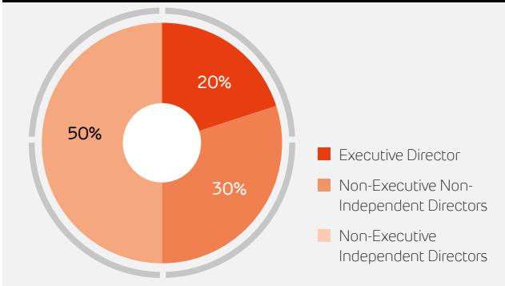

pie

| Category | Percentage (%) |
| :--- | :--- |
| Executive Director | 20 |
| Non-Executive Non-Independent Directors | 30 |
| Non-Executive Independent Directors | 50 |

The details of the Board and the number of Directorships and Committee positions held by the Directors as on 31st March 2023 are as under:

<table><tr><td rowspan="2">Name, Designation, and DIN of Director</td><td rowspan="2">Age and Date of Appointment</td><td rowspan="2">Category of Directorship</td><td rowspan="2">No. of other Directorship held1(other than Adani Power Limited)</td><td colspan="2">Details of  $Committee^2$ (other than Adani Power Limited)</td></tr><tr><td>Chairman</td><td>Member</td></tr><tr><td>Mr. Gautam S. Adani(Chairman and Director)(DIN 00006273)</td><td>61 Years, 26.12.2005</td><td>Promoter &amp; Non-Executive</td><td>6</td><td>-</td><td>-</td></tr><tr><td>Mr. Rajesh S. Adani(Director)(DIN 00006322)</td><td>59 Years, 12.06.2007</td><td>Promoter &amp; Non-Executive</td><td>5</td><td>-</td><td>2</td></tr><tr><td>Mr. Anil Sardana(Managing Director)(DIN 00006867)</td><td>64 Years, 11.07.2020</td><td>Executive</td><td>6</td><td>-</td><td>1</td></tr><tr><td>Mr. Sushil Kumar Roongta(Independent Director)(DIN 00309302)</td><td>73 Years, 11.11.2022</td><td>Independent &amp; Non-Executive</td><td>8</td><td>2</td><td>8</td></tr><tr><td>Mr. Mukesh ShahDirector(DIN:00084402)</td><td>71 Years, 31.03.2018</td><td>Independent &amp; Non-Executive</td><td>9</td><td>0</td><td>0</td></tr><tr><td>Ms. Chandra Iyengar(Independent Director)(DIN: 02821294)</td><td>72 Years, 11.11.2022,</td><td>Independent &amp; Non-Executive</td><td>9</td><td>0</td><td>5</td></tr></table>

1 Excluding Private Limited Companies, which are not the subsidiaries of Public Limited Companies, Foreign Companies, Section 8 Companies and Alternate Directorships.   
2 Includes only Audit Committee and Stakeholders’ Relationship Committee, as per Regulation 26 of the SEBI Listing Regulations.

Board Age profile and Board Experience is as under   
Board Age profile (in years)   
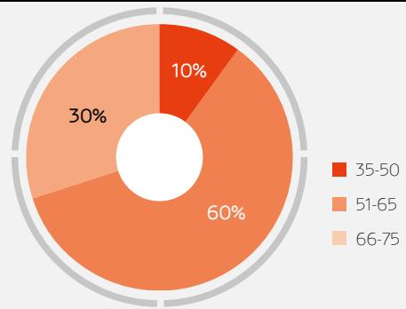

pie

| Category | Percentage (%) |
| :--- | :--- |
| 35-50 | 10 |
| 51-65 | 60 |
| 66-75 | 30 |

Board Experience profile (in years)   
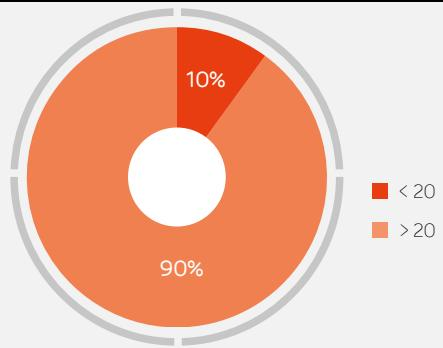

pie

| Category | Value (%) |
|---|---|
| < 20 | 10 |
| > 20 | 90 |

Profile of the Directors is available on the website of the Company at https://www.adanipower.com/about-us/ board-of-directors.

Details of name of other listed entities where Directors of the Company are Directors and the category of Directorship, as on 31st March 2023, are as under:

<table><tr><td>Name of Director</td><td>Name of other Listed entities in which the concerned Director is a Director</td><td>Category of Directorship</td></tr><tr><td rowspan="6">Mr. Gautam S. Adani (DIN: 00006273)</td><td>Adani Ports and Special Economic Zone Limited</td><td>Promoter &amp; Executive</td></tr><tr><td>Adani Transmission Limited</td><td>Promoter &amp; Executive</td></tr><tr><td>Adani Enterprises Limited</td><td>Promoter &amp; Executive</td></tr><tr><td>Adani Green Energy Limited</td><td>Promoter, Non-Executive</td></tr><tr><td>Adani Total Gas Limited</td><td>Promoter, Non-Executive</td></tr><tr><td>Ambuja Cements Limited</td><td>Promoter, Non-Executive</td></tr><tr><td rowspan="4">Mr. Rajesh S. Adani (DIN: 00006322)</td><td>Adani Enterprises Limited</td><td>Promoter &amp; Executive</td></tr><tr><td>Adani Transmission Limited</td><td>Promoter &amp; Executive</td></tr><tr><td>Adani Green Energy Limited</td><td>Promoter, Non-Executive</td></tr><tr><td>Adani Ports and Special Economic Zone Limited</td><td>Promoter, Non-Executive</td></tr><tr><td>Mr. Anil Sardana (DIN 00006867)</td><td>Adani Transmission Limited</td><td>Executive Director</td></tr><tr><td rowspan="5">Mr. Sushil Kumar Roongta (DIN 00309302)</td><td>JK Paper Limited</td><td>Non-Executive &amp; Independent</td></tr><tr><td>Jubilant Pharmova Limited</td><td>Non-Executive &amp; Independent</td></tr><tr><td>Jubilant Ingrevia Limited</td><td>Non-Executive &amp; Independent</td></tr><tr><td>Zuari Industries Limited</td><td>Non-Executive &amp; Independent</td></tr><tr><td>Titagarh Wagons Limited</td><td>Non-Executive &amp; Independent</td></tr><tr><td>Mr. Mukesh Shah (DIN:00084402)</td><td>Asian Granito India Limited</td><td>Non-Executive &amp; Independent</td></tr><tr><td rowspan="3">Ms. Chandra Iyengar (DIN: 02821294)</td><td>Arihant Superstructures Limited</td><td>Non-Executive &amp; Independent</td></tr><tr><td>The Bombay Dyeing and Manufacturing Company Limited</td><td>Non-Executive &amp; Independent</td></tr><tr><td>The Bombay Burmah Trading Corporation Limited</td><td>Non-Executive &amp; Independent</td></tr><tr><td></td><td>Adani Total Gas Limited</td><td>Non-Executive &amp; Independent</td></tr></table>

# Board Meetings and Procedure

The internal guidelines for Board / Committee meetings facilitate the decision making process at the meetings of the Board/Committees in an informed and efficient manner.

The Board Meetings are governed by structured agenda. All major agenda items are backed by comprehensive background information to enable the Board to take informed decisions. The Company Secretary, in consultation with the Senior Management, prepares the detailed agenda for the meetings.

Agenda papers and Notes on Agenda are circulated to the Directors, in advance, in the defined agenda format. All material information is being circulated along with agenda papers for facilitating meaningful and focused discussions at the meeting. Where it is not practicable to attach any document to the agenda, the same is tabled before the meeting with specific reference to this effect in the agenda. In special and exceptional circumstances, additional or supplementary item(s) on the Agenda are permitted. In order to transact some urgent business, which may come up after circulation of agenda papers, the same is placed before the Board by way of table agenda or Chairman’s agenda. Frequent and detailed deliberation on the agenda provides the strategic roadmap for the future growth of the Company.

Minimum 4 (four) pre-scheduled Board meetings are held every year.

Detailed presentations are made at the Board / Committee meetings covering finance and operations of the Company, terms of reference of the Committees, global business environment, key business areas of the Company including business opportunities, business strategy and the risk management practices before taking on record the quarterly / half yearly / annual financial results of the Company.

The required information as enumerated in Part A of Schedule II to SEBI Listing Regulations is made available to the Board for discussions and consideration at every Board Meeting. The Board periodically reviews compliance reports of all laws applicable to the Company, as required under Regulation 17(3) of the SEBI Listing Regulations.

The important decisions taken at the Board / Committee meetings are communicated to departments concerned promptly. Action taken report on the decisions taken at the meeting(s) is placed at the immediately succeeding meeting of the Board / Committee for noting by the Board/Committee.

During the year under review, Board met 4 (four) times i.e. on 05th May 2022, 03rd August 2022, 11th November 2022, and 08th February 2023,

The Board meets at least once in every quarter to review the Company’s operations and financial performance. The maximum time gap between any two meetings is not more than 120 days. The necessary quorum was present in all the meetings.

The details of attendance of Directors at the Board Meetings and at the Annual General Meeting held on 27th July 2022, are as under:

<table><tr><td rowspan="2">Name of Directors (s)</td><td colspan="2">No. of Meetings</td><td rowspan="2">Attendance at last AGM</td><td rowspan="2">% of attendance</td></tr><tr><td>Held during the tenure</td><td>Attended</td></tr><tr><td>Mr. Gautam S. Adani</td><td>4</td><td>4</td><td>Yes</td><td>100</td></tr><tr><td>Mr. Rajesh S. Adani</td><td>4</td><td>4</td><td>Yes</td><td>100</td></tr><tr><td>Mr. Anil Sardana</td><td>4</td><td>4</td><td>Yes</td><td>100</td></tr><tr><td>Mr. Raminder Singh Gujral $^{1}$ </td><td>2</td><td>2</td><td>Yes</td><td>100</td></tr><tr><td>Mr. Mukesh Shah</td><td>4</td><td>4</td><td>Yes</td><td>100</td></tr><tr><td>Ms. Gauri Trivedi $^{2}$ </td><td>2</td><td>2</td><td>Yes</td><td>100</td></tr><tr><td>Ms. Chandra Iyengar $^{3}$ </td><td>2</td><td>2</td><td>NA</td><td>100</td></tr><tr><td>Mr. Sushil Kumar Roongta $^{4}$ </td><td>2</td><td>2</td><td>NA</td><td>100</td></tr></table>

1 Ceased w.e.f. 11th November 2022   
2 Ceased w.e.f. 11th November 2022   
3 Appointed w.e.f. 11th November 2022   
4 Appointed w.e.f. 11th November 2022

During the year, the Board accepted all recommendations of the Committees of the Board, which were statutory in nature and required to be recommended by the Committee and approved by the Board. Hence, the Company is in compliance of condition of clause 10(j) of Schedule V of the SEBI Listing Regulations.

# Skills / expertise competencies of the Board of Directors:

The following is the list of core skills / competencies identified by the Board of Directors as required in the context of the Company’s business and that the said skills are available within the Board Members:

<table><tr><td>Business Leadership</td><td>Leadership experience including in areas of business development, strategic planning, succession planning, driving change and long-term growth and guiding the Company and its senior management towards its vision and values.</td></tr><tr><td>Financial Expertise</td><td>Knowledge and skills in accounting, finance, treasury management, tax and financial management of large corporations with understanding of capital allocation, funding and financial reporting processes.</td></tr><tr><td>Risk Management</td><td>Ability to understand and assess the key risks to the organization, legal compliances and ensure that appropriate policies and procedures are in place to effectively manage risk.</td></tr><tr><td>Global Experience</td><td>Global mindset and staying updated on global market opportunities, competition experience in driving business success around the world with an understanding of diverse business environments, economic conditions and regulatory frameworks.</td></tr><tr><td>Merger &amp; Acquisition</td><td>Ability to assess ‘build or buy’ &amp; timing of decisions, analyze the fit of a target with the company’s strategy and evaluate operational integration plans.</td></tr><tr><td>Corporate Governance &amp; ESG</td><td>Experience in implementing good corporate governance practices, reviewing compliance and governance practices for a sustainable growth of the company and protecting stakeholder’s interest.</td></tr><tr><td>Technology &amp; Innovations</td><td>Experience or knowledge of emerging areas of technology such as digital, artificial intelligence, cyber security, data centre, data security etc.</td></tr></table>

In the table below, the specific areas of focus or expertise of individual Board members have been highlighted.

<table><tr><td rowspan="2">Name of Director</td><td colspan="7">Areas of Skills/ Expertise</td></tr><tr><td>Business Leadership</td><td>Financial Expertise</td><td>Risk Management</td><td>Global Experience</td><td>Corporate Governance &amp; ESG</td><td>Merger &amp; Acquisition</td><td>Technology &amp; Innovation</td></tr><tr><td>Mr. Gautam Adani</td><td>√</td><td>√</td><td>√</td><td>√</td><td>√</td><td>√</td><td>√</td></tr><tr><td>Mr. Rajesh Adani</td><td>√</td><td>√</td><td>√</td><td>√</td><td>√</td><td>√</td><td>√</td></tr><tr><td>Mr. Anil Sardana</td><td>√</td><td>√</td><td>√</td><td>√</td><td>√</td><td>√</td><td>√</td></tr><tr><td>Mr. Raminder Singh Gujral $^{1}$ </td><td>√</td><td>√</td><td>√</td><td>√</td><td>√</td><td>√</td><td>√</td></tr><tr><td>Mr. Mukesh Shah</td><td>√</td><td>√</td><td>√</td><td>-</td><td>√</td><td>-</td><td>-</td></tr><tr><td>Ms. Gauri Trivedi $^{2}$ </td><td>√</td><td>√</td><td>√</td><td>-</td><td>√</td><td>-</td><td>-</td></tr><tr><td>Ms. Chandra Iyengar $^{3}$ </td><td>√</td><td>√</td><td>√</td><td>-</td><td>√</td><td>√</td><td>-</td></tr><tr><td>Mr. Sushil Kumar Roongta $^{4}$ </td><td>√</td><td>√</td><td>√</td><td>√</td><td>√</td><td>-</td><td>-</td></tr></table>

1 Ceased as a member w.e.f. 11th November 2022

2 Ceased as a member w.e.f. 11th November 2022

3 Appointed as a member w.e.f. 11th November 2022

4 Appointed as member w.e.f. 11th November 2022

Note - Each Director may possess varied combinations of skills/ expertise within the described set of parameters and it is not necessary that all Directors possess all skills/ expertise listed therein.

# Directors’ selection, appointment, induction and familiarization:

As per the delegation given by the Board to the Nomination and Remuneration Committee (NRC) of the Company, consisting exclusively of Independent Directors, the NRC screens and selects the suitable candidates, based on the defined criteria and makes recommendations to the Board on the induction of new Directors. The Board appoints the Director, subject to the shareholders’ approval.

All new Directors are taken through a detailed induction and familiarization program when they join the Board of the Company. The induction program is an exhaustive one that covers the history and culture of Adani Group, background of the Company and its growth, various milestones in the Company’s existence since its incorporation, the present structure and an overview of the businesses and functions.

Deep dives and immersion sessions are conducted by senior executives on their units/functions. Key aspects that are covered in these sessions include:

# Industry / market trends

Company’s operations including those of major subsidiaries

# Growth Strategy

ESG Strategy and performance

# Meeting of Independent Directors:

The Independent Directors met on 24th March 2023, without the attendance of Non- Independent Directors and members of the management. The Independent Directors reviewed the performance of Non-Independent Directors and the Board as a whole, the performance of the Chairman of the Company, taking into account the views of Executive Directors and Non-Executive Directors and assessed the quality, quantity and timeliness of flow of information between the Management and the Board that is necessary for the Board to effectively and reasonably perform their duties.

# Confirmation as regards independence of Independent Directors:

In the opinion of the Board, all the existing Independent Directors and the one who are proposed to be appointed/ re-appointed at the ensuing Annual General Meeting (“AGM”), fulfil the conditions specified in the SEBI Listing Regulations and are independent of the management.

# Remuneration Policy:

The Remuneration Policy of the Company is directed towards rewarding performance, based on review of achievements on a periodic basis. The Company endeavors to attract, retain, develop and motivate the high-caliber executives and to incentivize them to develop and implement the Group’s strategy, thereby enhancing the business value and maintain a highperformance workforce. The said Policy ensures that the level and composition of remuneration of the Directors is optimum.

# Remuneration to Non-Executive Directors:

The Members at the AGM held on 21st August 2010 approved the payment of remuneration by way of commission to the Non-Executive Directors of the Company, of a sum not exceeding 1% per annum of the net profits of the Company, calculated in accordance with the provisions of the Act. The remuneration by way of commission to the Non-Executive and Independent Directors is decided by the Board. In addition to commission, the Non-Executive Directors are paid sitting fees of H 50,000 for attending each Board and Audit Committee meetings and H 25,000 for attending each Committee meetings along with actual reimbursement of expenses, incurred for attending each meeting of the Board and Committees.

The Company has taken a Directors’ & Officers’ Liability Insurance Policy.

# ii. Performance Evaluation Criteria for Independent Directors:

The performance evaluation criteria for Independent Directors are determined by the Nomination and Remuneration Committee. An indicative list of factors that may be evaluated include participation and contribution by a Director, commitment, effective deployment of knowledge and expertise, effective management of relationship with stakeholders, integrity and maintenance of confidentiality and independence of behavior and judgement.

# iii. Remuneration to Executive Directors:

The remuneration of the Executive Directors is recommended by the Nomination and Remuneration Committee to the Board based on criteria such as industry benchmarks, the Company’s performance vis-à-vis the industry, responsibilities shouldered, performance/track record, macro-economic review on remuneration packages of heads of other organizations. The pay structure of Executive Directors has appropriate success and sustainability metrices built in. On the recommendation of the Nomination and Remuneration Committee, the remuneration paid/payable by way of salary, perquisites and allowances (fixed component), incentive and/ or commission (variable components), to its Executive Directors within the limits prescribed under the Act is approved by the Board and by the Members in the General Meeting. However, during the year under review, the Company has not paid any remuneration to its Executive Directors.

The Executive Directors are not being paid sitting fees for attending meetings of the Board and its Committees.

# Details of Remuneration:

# i. Non-Executive Directors:

The details of sitting fees and commission paid to Non-Executive and Independent Directors during the FY 2022-23 are as under:

(H in Lakhs) 

<table><tr><td>Name</td><td>Commission</td><td>Sitting Fees</td><td>Total</td></tr><tr><td>Mr. Raminder Singh Gujral $^{1}$ </td><td>0.00</td><td>6.75</td><td>6.75</td></tr><tr><td>Mr. Mukesh Shah</td><td>0.00</td><td>13.25</td><td>13.25</td></tr><tr><td>Ms. Gauri Trivedi $^{2}$ </td><td>0.00</td><td>8.25</td><td>8.25</td></tr><tr><td>Ms. Chandra Iyengar $^{3}$ </td><td>0.00</td><td>4.25</td><td>4.25</td></tr><tr><td>Mr. Sushil Kumar Roongta $^{4}$ </td><td>0.00</td><td>4.75</td><td>4.75</td></tr></table>

1 Ceased w.e.f. 11th November 2022

2 Ceased w.e.f. 11th November 2022

3 Appointed w.e.f. 11th November 2022

4 Appointed w.e.f. 11th November 2022

Other than sitting fees paid to Non-Executive Directors, there were no pecuniary relationships or transactions by the Company with any of the Non-Executive Directors of the Company. The Company has not granted stock options to the Non-Executive and Independent Directors.

# i. Executive Directors:

No remuneration was paid to Executive Directors during the FY 2022-23.

# ii. Details of shares of the Company held by Directors as on 31st March 2023 are as under:

<table><tr><td>Name</td><td>No. of shares</td></tr><tr><td>Mr. Gautam S. Adani $^{1}$ </td><td>1</td></tr><tr><td>Mr. Rajesh S. Adani $^{1}$ </td><td>1</td></tr><tr><td>Mr. Mukesh Shah</td><td>6,895</td></tr></table>

1 Mr. Gautam S. Adani and Mr. Rajesh S. Adani (on behalf of S.B. Adani Family Trust) held 1,42,16,12,453 Equity Shares of the Company, respectively. Both, Mr. Gautam S. Adani and Mr. Rajesh S. Adani hold 1 (one) Equity Share of the Company in their individual capacity.

Except above, none of Directors of the Company holds equity shares of the Company in their individual capacity. The Company does not have any Employees’ Stock Option Scheme and there is no separate provision for payment of severance fees.

# Note on appointment/re-appointment of Directors:

Mr. Rajesh S. Adani, Director is retiring at the ensuing AGM, and being eligible, has offered himself for reappointment.

Upon recommendation of Nomination and Remuneration Committee, and Board of Directors, the Shareholders has reappointed Mr. Mukesh Shah as Director of the Company for a further period of 1 (one) year w.e.f 31st March 2023, with the approval of shareholders at the AGM held on 27th July, 2022.

# Code of Conduct:

The Board has laid down a Code of Business Conduct and Ethics (the “Code”) for all the Board Members and Senior Management of the Company. The Code is available on the website of the Company www. adanipower.com. All Board Members and Senior Management Personnel have affirmed compliance of the Code. A declaration signed by the Managing Director & CEO to this effect, is attached to this report.

The Board has also adopted separate code of conduct with respect to duties of Independent Directors as per the provisions of the Act.

# 3. Committees of the Board

The Board Committees play a vital role in ensuring sound corporate governance practices. The Committees are constituted to handle specific activities and ensure speedy resolution of the diverse matters. The Board Committees are set up under the formal approval of the Board to carry out clearly defined roles which are considered to be performed by members of the Board, as a part of good governance practice. The Board supervises the execution of its responsibilities by the Committees and is responsible for their action. The minutes of the meetings of all the Committees are placed before the Board for review.

As on 31st March 2023, the Board has following Committees:

# I. Statutory Committees

A. Audit Committee   
B. Nomination and Remuneration Committee   
C. Stakeholders’ Relationship Committee   
D. Corporate Social Responsibility Committee   
E. Risk Management Committee

# II. Non-Statutory Committees

With an objective to further strengthen the governance standards so as to match with internationally accepted better practices, the Board has during the year under review constituted following additional Committees / Sub-Committees -

F. Information Technology & Data Security   
G. Mergers & Acquisitions Committee (Subcommittee of RMC)   
H. Legal, Regulatory & Tax Committee (Subcommittee of RMC)   
I. Reputation Risk Committee (Sub-committee of RMC)   
J. Corporate Responsibility Committee   
K. Commodity Price Risk Committee

# A) Audit Committee:

The Audit Committee acts as a link among the Management, the Statutory Auditors, Internal Auditors and the Board to oversee the financial reporting process of the Company. The Committee’s purpose is to oversee the quality and integrity of accounting, auditing and financial reporting process including review of the internal audit reports and action taken report. A detailed charter of the Audit Committee is available on the website of the Company at https://www.adanipower.com/investors/boardand-committee-charters.

As on 31st March 2023, the Audit Committee comprises solely of Independent Directors to enable independent and transparent review of financial reporting process and internal control mechanism with an objective to further strengthen the confidence of all stakeholders.

# Terms of reference:

The powers, role and terms of reference of the Audit Committee covers the areas as contemplated under SEBI Listing Regulations and Section 177 of the Act. The brief terms of reference of Audit Committee are as under:

Frequency A Annually Q Quarterly H Half yearly P Periodically 

<table><tr><td>Terms of Reference</td><td>Frequency</td></tr><tr><td>To oversee the Company's financial reporting process and the disclosure of its financial information to ensure that the financial statement is correct, sufficient and credible</td><td>Q</td></tr><tr><td>To recommend for appointment, remuneration and terms of appointment of statutory and internal auditors of the company</td><td>P</td></tr><tr><td>To approve availing of the permitted non-audit services rendered by the Statutory Auditors and payment of fees thereof</td><td>A</td></tr><tr><td>To review, with the management, the quarterly financial statements before submission to the Board for approval</td><td>Q</td></tr><tr><td colspan="2">To review, with the management, the annual financial statements and auditor's report thereon before submission to the Board for approval, with particular reference to:</td></tr><tr><td>- Matters required to be included in the Director's Responsibility Statement to be included in the Board's report in terms of Section 134(3)(c) of the Companies Act, 2013</td><td>A</td></tr><tr><td>- Changes, if any, in accounting policies and practices and reasons for the same</td><td>Q</td></tr><tr><td>- Major accounting entries involving estimates based on the exercise of judgment by the management</td><td>Q</td></tr><tr><td>- Significant adjustments made in the financial statements arising out of audit findings</td><td>Q</td></tr><tr><td>- Compliance with listing and other legal requirements relating to financial statements</td><td>Q</td></tr><tr><td>- Disclosure of any related party transactions</td><td>Q</td></tr><tr><td>- Modified opinion(s) in the draft audit report</td><td>A</td></tr><tr><td>To review, with the management, the quarterly financial statements before submission to the Board for approval</td><td>Q</td></tr><tr><td>To review, with the management, the statement of uses/ application of funds raised through an issue (public issue, rights issue, preferential issue, etc.), the statement of funds utilized for purposes other than those stated in the offer document / prospectus/ notice and the report submitted by the monitoring agency, monitoring the utilisation of proceeds of a public or rights issue, and making appropriate recommendations to the Board to take up steps in this matter</td><td>P</td></tr><tr><td>To review and monitor the Auditor's independence and performance, and effectiveness of audit process</td><td>Q</td></tr><tr><td>To approve or any subsequent modification of transactions of the company with related parties</td><td>P</td></tr><tr><td>To scrutinise inter-corporate loans and investments</td><td>Q</td></tr><tr><td>To undertake valuation of undertakings or assets of the company, wherever it is necessary</td><td>P</td></tr><tr><td>To evaluate internal financial controls and risk management systems</td><td>Q</td></tr><tr><td>To review, with the management, the performance of statutory and internal auditors, adequacy of the internal control systems</td><td>Q</td></tr><tr><td>To review the adequacy of internal audit function, if any, including the structure of the internal audit department, staffing and seniority of the official heading the department, reporting structure coverage and frequency of internal audit</td><td>A</td></tr><tr><td>To discuss with internal auditors of any significant findings and follow up there on</td><td>Q</td></tr><tr><td>To review the findings of any internal investigations by the internal auditors into matters where there is suspected fraud or irregularity or a failure of internal control systems of a material nature and reporting the matter to the board</td><td>Q</td></tr><tr><td>To discuss with statutory auditors before the audit commences, about the nature and scope of audit as well as post-audit discussion to ascertain any area of concern</td><td>Q</td></tr><tr><td>To look into the reasons for substantial defaults, if any, in the payment to the depositors, debenture holders, shareholders (in case of non-payment of declared dividends) and creditors</td><td>Q</td></tr><tr><td>To review the functioning of the Whistle Blower mechanism</td><td>Q</td></tr><tr><td>To approve appointment of Chief Financial Officer after assessing the qualifications, experience and background, etc. of the candidate</td><td>P</td></tr><tr><td>To review financial statements, in particular the investments made by the Company's unlisted subsidiaries</td><td>Q</td></tr><tr><td>To review compliance with the provisions of SEBI Insider Trading Regulations and verify that the systems for internal control are adequate and are operation effectively</td><td>Q</td></tr><tr><td>To review the utilization of loans and/ or advances from/investment by the holding company in the subsidiary exceeding rupees 100 crore or 10% of the asset size of the subsidiary, whichever is lower including existing loans / advances / investments</td><td>Q</td></tr><tr><td>To oversee the company's disclosures and compliance risks, including those related to climate</td><td>Q</td></tr><tr><td>To consider and comment on rationale, cost benefits and impact of schemes involving merger, demerger, amalgamation etc., on the listed entity and its shareholders</td><td>P</td></tr><tr><td>To review key significant issues, tax and regulatory / legal report which is likely to have significant impact on financial statements and management's report on actions taken thereon</td><td>P</td></tr><tr><td>To discuss with the management regarding pending technical and regulatory matters that could affect the financial statements and updates on management's plans to implement new technical or regulatory guidelines</td><td>Q</td></tr><tr><td>To review and recommend to the Board for approval - Business plan, Budget for the year and revised estimates</td><td>A</td></tr><tr><td>To review Company's financial policies, strategies and capital structure, working capital and cash flow management</td><td>H</td></tr><tr><td>To ensure the Internal Auditor has direct access to the Committee chair, providing independence from the executive and accountability to the committee</td><td>-</td></tr><tr><td>To review the treasury policy &amp; performance of the Company, including investment of surplus funds and foreign currency operations</td><td>A</td></tr><tr><td>To review management discussion and analysis of financial condition and results of operations</td><td>A</td></tr><tr><td>To review, examine and deliberate on all the concerns raised by an out-going auditors and to provide views to the Management and Auditors</td><td>P</td></tr><tr><td>To carry out any other function mandated by the Board from time to time and/or enforced by any statutory notification, amendment or modification, as may be applicable</td><td>P</td></tr></table>

# Meetings, Attendance & Composition of the Audit Committee:

During the year under review, Audit Committee met 9 (Nine) times i.e. on 04th May 2022, 05th May 2022, 02nd August 2022, 03rd August 2022, 10th November 2022, 11th November 2022, 07th February 2023, 08th February 2023 and 24th March 2023. The intervening gap between two meetings did not exceed 120 days.

The details of the Audit Committee meetings attended by its members during FY 2022-23, are given below:

<table><tr><td rowspan="2">Name and designation</td><td rowspan="2">Category</td><td colspan="2">No. of Meetings</td><td rowspan="2">% of attendance</td></tr><tr><td>Held during the tenure</td><td>Attended</td></tr><tr><td>Mr. Anil Sardana, Member</td><td>Executive Director</td><td>9</td><td>9</td><td>100</td></tr><tr><td>Mr. Mukesh Shah, Chairman</td><td>Non-Executive &amp; Independent Director</td><td>9</td><td>9</td><td>100</td></tr><tr><td>Mr. Raminder Singh Gujral,  $Member^1$ </td><td>Non-Executive &amp; Independent Director</td><td>6</td><td>6</td><td>100</td></tr><tr><td>Ms. Gauri Trivedi  $Member^2$ </td><td>Non-Executive &amp; Independent Director</td><td>6</td><td>6</td><td>100</td></tr><tr><td>Ms. Chandra Iyengar,  $Member^3$ </td><td>Non-Executive &amp; Independent Director</td><td>3</td><td>3</td><td>100</td></tr><tr><td>Mr. Sushil Kumar Roongta,  $Member^4$ </td><td>Non-Executive &amp; Independent Director</td><td>3</td><td>3</td><td>100</td></tr></table>

1 Ceased as a member w.e.f. 11th November 2022   
2 Ceased as a member w.e.f. 11th November 2022   
3 Appointed as a member w.e.f. 11th November 2022   
4 Appointed as a member w.e.f. 11th November 2022

All members of the Audit Committee have accounting and financial management knowledge and expertise / exposure. The Chief Financial Officer, representatives of Statutory Auditors, Internal Audit and Finance & Accounts department are invited to the meetings of the Audit Committee.

The Board reviews the minutes of the Audit Committee Meetings at its subsequent meetings.

Mr. Deepak S Pandya, Company Secretary and Compliance Officer, acts as the Secretary of the Audit Committee.

Mr. Mukesh Shah, the Chairman of the Audit Committee was present at the last AGM held on 27th July 2022 to answer shareholders’ queries.

# B) Nomination & Remuneration Committee:

As on 31st March 2023, all the members of the Nomination and Remuneration Committee (“NRC”) were Independent Directors. A detailed charter of the NRC is available on the website of the Company at https:// www.adanipower.com/investors/board-and-committee-charters.

# Terms of reference:

The powers, role and terms of reference of NRC covers the areas as contemplated under the SEBI Listing Regulations and Section 178 of the Act. The brief terms of reference of NRC are as under:

<table><tr><td>Terms of Reference</td><td>Frequency</td></tr><tr><td>To formulate the criteria for determining qualifications, positive attributes and independence of a director and recommend to the Board a policy, relating to the remuneration of the directors, key managerial personnel and other employees</td><td>A</td></tr><tr><td>To formulate criteria for &amp; mechanism of evaluation of Independent Directors and the Board of directors</td><td>A</td></tr><tr><td>To specify the manner for effective evaluation of performance of Board, its committees and individual directors to be carried out either by the Board, by the Nomination and Remuneration Committee or by an independent external agency and review its implementation and compliance</td><td>A</td></tr><tr><td>To devise a policy on diversity of Board of Directors</td><td>P</td></tr><tr><td>To Identify persons who are qualified to become directors and who may be appointed in senior management in accordance with the criteria laid down, and recommend to the Board their appointment and removal</td><td>P</td></tr><tr><td>To extend or continue the term of appointment of the independent director, on the basis of the report of performance evaluation of independent directors</td><td>A</td></tr><tr><td>To review and recommend remuneration of the Managing Director(s) / Whole-time Director(s) based on their performance</td><td>A</td></tr><tr><td>To recommend to the Board, all remuneration, in whatever form, payable to senior management</td><td>A</td></tr><tr><td>To review, amend and approve all Human Resources related policies</td><td>P</td></tr><tr><td>To ensure that the management has in place appropriate programs to achieve maximum leverage from leadership, employee engagement, change management, training &amp; development, performance management and supporting system</td><td>A</td></tr><tr><td>To oversee workplace safety goals, risks related to workforce and compensation practices</td><td>A</td></tr><tr><td>To oversee employee diversity programs</td><td>A</td></tr><tr><td>To oversee HR philosophy, people strategy and efficacy of HR practices including those for leadership development, rewards and recognition, talent management and succession planning (specifically for the Board, KMP and Senior Management)</td><td>A</td></tr><tr><td>To oversee familiarization programme for Directors</td><td>A</td></tr><tr><td>To recommend the appointment of one of the Independent Directors of the Company on the Board of its Material Subsidiary</td><td>P</td></tr><tr><td>To carry out any other function as is mandated by the Board from time to time and / or enforced by any statutory notification, amendment or modification, as may be applicable</td><td>P</td></tr></table>

Frequency

A Annually

P Periodically

# Meeting, Attendance & Composition of the NRC:

During the year under review, NRC met 3 (two) times i.e. on 04th May 2022, 10th November 2022 and 24th March 2023.

The details of the NRC meetings attended by its members during FY 2022-23, are given below:

<table><tr><td rowspan="2">Name and designation</td><td rowspan="2">Category</td><td colspan="2">No. of Meetings</td><td rowspan="2">% of attendance</td></tr><tr><td>Held during the tenure</td><td>Attended</td></tr><tr><td>Mr. Sushil K. Roongta Chairman1</td><td>(Independent &amp; Non-Executive Director)</td><td>1</td><td>1</td><td>100</td></tr><tr><td>Ms. Gauri Trivedi2, Chairperson</td><td>Non-Executive &amp; Independent Director</td><td>2</td><td>2</td><td>100</td></tr><tr><td>Mr. Raminder Singh Gujral, Member3</td><td>Non-Executive &amp; Independent Director</td><td>2</td><td>2</td><td>100</td></tr><tr><td>Mrs. Chandra Iyengar, Member4</td><td>Non-Executive &amp; Independent Director</td><td>1</td><td>1</td><td>100</td></tr><tr><td>Mr. Mukesh Shah, Member</td><td>Non-Executive &amp; Independent Director</td><td>3</td><td>3</td><td>100</td></tr></table>

1 Appointed as member w.e.f. 11th November 2022   
2 Ceased as a member w.e.f. 11th November 2022   
3 Ceased as a member w.e.f. 11th November 2022   
4 Appointed as member w.e.f. 11th November 2022

The Board reviews the minutes of the NRC Meetings at its subsequent meetings.

Mr. Deepak S Pandya, Company Secretary and Compliance Officer acts as the Secretary of the NRC.

# C) Stakeholders’ Relationship Committee:

The Stakeholders Relationship Committee (“SRC”) comprises of three members, with a majority of Independent Directors. A detailed charter of the SRC is available on the website of the Company at https:// www.adanipower.com/investors/board-and-committee-charters.

# Terms of reference:

The powers, role and terms of reference of SRC covers the areas as contemplated under the SEBI Listing Regulations and Section 178 of the Act. The brief terms of reference of SRC are as under:

<table><tr><td>Terms of Reference</td><td>Frequency</td></tr><tr><td>To look into various aspects of interest of shareholders, debenture holders and other security holders including complaints related to transfer/ transmission of shares, non-receipt of annual report, non-receipt of declared dividends, issue of new/duplicate certificates, general meetings etc.</td><td>Q</td></tr><tr><td>To review the measures taken for effective exercise of voting rights by shareholders</td><td>A</td></tr><tr><td>To review adherence to the service standards adopted in respect of various services being rendered by the Registrar &amp; Share Transfer Agent</td><td>A</td></tr><tr><td>To review various measures and initiatives taken for reducing the quantum of unclaimed dividends and ensuring timely receipt of dividend warrants/ annual reports/ statutory notices by the shareholders of the Company</td><td>Q</td></tr><tr><td>To review engagement programs with investors, proxy advisors, etc. and to oversee investors movement (share register)</td><td>Q</td></tr><tr><td>To review engagement with rating agencies (Financial, ESG etc.)</td><td>H</td></tr><tr><td>To oversee statutory compliance relating to all the securities issued, including but not limited to dividend payments, transfer of unclaimed dividend amounts / unclaimed shares to the IEPF</td><td>A</td></tr><tr><td>To suggest and drive implementation of various investor-friendly initiatives</td><td>H</td></tr><tr><td>To approve and register transfer and / or transmission of securities, issuance of duplicate security certificates, issuance of certificate on rematerialization and to carry out other related activities</td><td>P</td></tr><tr><td>To carry out any other function as is referred by the Board from time to time or enforced by any statutory notification / amendment or modification as may be applicable</td><td>P</td></tr></table>

Frequency A Annually Q Quarterly H Half yearly P Periodically

# Meeting, Attendance & Composition of the SRC:

During the year under review, the SRC met 4 (four) times i.e. on 05th May 2022, 27th July 2022, 10th November 2022 and 07th February 2023.

The details of SRC Meetings attended by its members during FY 2022-23 are given below:

<table><tr><td rowspan="2">Name and designation</td><td rowspan="2">Category</td><td colspan="2">No. of Meetings</td><td rowspan="2">% of attendance</td></tr><tr><td>Held during the tenure</td><td>Attended</td></tr><tr><td>Mr. Rajesh S. Adani, Member</td><td>Non-Executive &amp; Non-Independent Director</td><td>4</td><td>4</td><td>100</td></tr><tr><td>Mr. Mukesh Shah, Member</td><td>Independent &amp; Non-Executive Director</td><td>4</td><td>4</td><td>100</td></tr><tr><td>Mr. Sushil K. Roongta $^{1}$ Chairperson</td><td>Independent &amp; Non-Executive Director</td><td>1</td><td>1</td><td>100</td></tr><tr><td>Ms. Gauri Trivedi, Chairperson $^{2}$ </td><td>Independent &amp; Non-Executive Director</td><td>3</td><td>3</td><td>100</td></tr></table>

1 Appointed as Chairperson w.e.f. 11th November 2022   
2 Ceased as a Chairperson w.e.f. 11th November 2022

The Company Secretary is the Compliance Officer of the Company as per the requirements of the SEBI Listing Regulations.

The Board reviews the minutes of the SRC Meetings at its subsequent meetings.

Mr. Deepak S Pandya, Company Secretary and Compliance Officer acts as the Secretary of the SRC.

# Redressal of Investor Grievances

The Company and its Registrar and Share Transfer Agent address all complaints, suggestions and grievances expeditiously and replies are sent usually within 7-10 days except in case of dispute over facts or other legal impediments and procedural issues. The Company endeavours to implement suggestions as and when received from the investors.

During the year under review, no complaints were received. There was no unattended or pending investor grievances as on 31st March 2023.

# D) Corporate Social Responsibility Committee (CSR Committee):

As on 31st March 2023, the CSR Committee comprises of four members, with a majority of Independent Directors. A detailed charter of the CSR Committee is available on the website of the Company at https:// www.adanipower.com/investors/board-and-committee-charters.

# Terms of reference:

The powers, role and terms of reference of CSR Committee covers the areas as contemplated under Section 135 of the Act. The brief terms of reference of CSR Committee are as under:

Frequency A Annually Q Quarterly H Half yearly P Periodically 

<table><tr><td>Terms of Reference</td><td>Frequency</td></tr><tr><td>To formulate and recommend to the Board, a Corporate Social Responsibility (“CSR”) Policy which shall indicate the activities to be undertaken by the company as specified in Schedule VII of the Companies Act, 2013 and rules made there under and review thereof</td><td>A</td></tr><tr><td>To formulate and recommend to the Board, an annual action plan in pursuance to CSR Policy</td><td>A</td></tr><tr><td>To recommend to the Board the amount of expenditure to be incurred on the CSR activities</td><td>A</td></tr><tr><td>To monitor the implementation of framework of CSR Policy</td><td>A</td></tr><tr><td>To review the performance of the Company in the areas of CSR</td><td>H</td></tr><tr><td>To institute a transparent monitoring mechanism for implementation of CSR projects/activities undertaken by the company</td><td>H</td></tr><tr><td>To recommend extension of duration of existing project and classify it as on-going project or other than on-going project</td><td>A</td></tr><tr><td>To submit annual report of CSR activities to the Board</td><td>A</td></tr><tr><td>To consider and recommend appointment of agency / consultant for carrying out impact assessment for CSR projects, as applicable, to the Board</td><td>A</td></tr><tr><td>To review and monitor all CSR projects and impact assessment report</td><td>A</td></tr><tr><td>To carry out any other function as is mandated by the Board from time to time and/or enforced by any statutory notification, amendment or modification as may be applicable or as may be necessary or appropriate for performance of its duties</td><td>P</td></tr></table>

# Meeting, Attendance & Composition of the CSR Committee:

During the year under review, the CSR Committee met 2 (two) times i.e. on 4th May 2022 and 7th February, 2023.

The details of CSR Committee meetings attended by its members during FY 2022-23 are given below:

<table><tr><td rowspan="2">Name and designation</td><td rowspan="2">Category</td><td colspan="2">No. of Meetings</td><td rowspan="2">% of attendance</td></tr><tr><td>Held during the tenure</td><td>Attended</td></tr><tr><td>Mr. Mukesh Shah, Chairman</td><td>Independent &amp; Non-Executive Director</td><td>2</td><td>2</td><td>100</td></tr><tr><td>Mr. Anil Sardana, Member</td><td>Executive Director</td><td>2</td><td>2</td><td>100</td></tr><tr><td>Ms. Gauri Trivedi $^{1}$ , Member</td><td>Independent &amp; Non-Executive Director</td><td>1</td><td>1</td><td>100</td></tr><tr><td>Mr. Raminder Singh Gujral $^{2}$ , Member</td><td>Independent &amp; Non-Executive Director</td><td>1</td><td>1</td><td>100</td></tr><tr><td>Mr. Sushil K. Roongta $^{3}$ , Member</td><td>Independent &amp; Non-Executive Director</td><td>1</td><td>1</td><td>100</td></tr><tr><td>Mrs. Chandra Iyengar $^{4}$  Member</td><td>Independent &amp; Non-Executive Director</td><td>1</td><td>1</td><td>100</td></tr></table>

1 Ceased as a member w.e.f. 11th November 2022

2 Ceased as a member w.e.f. 11th November 2022

3 Appointed as a member w.e.f. 11th November 2022

4 Appointed as a member w.e.f. 11th November 2022

The Board reviews the minutes of the CSR Committee Meetings at its subsequent meetings.

Mr. Deepak S Pandya, Company Secretary and Compliance Officer act as the Secretary of the CSR Committee.

# E) Risk Management Committee:

As on 31st March 2023, the Risk Management Committee (“RMC”) comprises of four members, with a majority of Independent Directors. A detailed charter of the RMC is available on the website of the Company at https://www.adanipower.com/investors/board-and-committee-charters.

The Board of the Company at its meeting held on 29th October 2021 constituted the following committees as Sub-committees of RMC as a part of good corporate governance practice:

Mergers & Acquisitions Committee   
• Legal, Regulatory & Tax Committee   
Reputation Risk Committee   
• Commodity Price Risk Committee

Constitution, meetings and terms of reference and other details of above Sub-committees, are separately included as a part of this report.

# Terms of reference:

The powers, role and terms of reference of RMC covers the areas as contemplated under Regulation 21 of the SEBI Listing Regulations. The brief terms of reference of RMC are as under:

<table><tr><td>Terms of Reference</td><td>Frequency</td></tr><tr><td>To review the Company's risk governance structure, risk assessment and risk management policies, practices and guidelines and procedures, including the risk management plan</td><td>A</td></tr><tr><td>To review and approve the Enterprise Risk Management ('ERM') framework</td><td>A</td></tr><tr><td>To formulate a detailed risk management policy which shall include:</td><td></td></tr><tr><td>a. A framework for identification of internal and external risks specifically faced by the listed entity, in particular including financial, operational, sectoral, sustainability (particularly, ESG related risks), information technology, cyber security risks or any other risk as may be determined by the Committee</td><td>A</td></tr><tr><td>b. Measures for risk mitigation including systems and processes for internal control of identified risks</td><td></td></tr><tr><td>c. Business continuity plan Oversee of risks, such as strategic, financial, credit, market, liquidity, technology, security, property, IT, legal, regulatory, reputational, and other risks</td><td></td></tr><tr><td>d. Oversee regulatory and policy risks related to climate change, including review of state and Central policies</td><td></td></tr><tr><td>To ensure that appropriate methodology, processes and systems are in place to identify, monitor, evaluate and mitigate risks associated with the business of the Company</td><td>Q</td></tr><tr><td>To monitor and oversee implementation of the risk management policy, including evaluating the adequacy of risk management systems</td><td>Q</td></tr><tr><td>To review compliance with enterprise risk management policy, monitor breaches / trigger trips of risk tolerance limits and direct action</td><td>H</td></tr><tr><td>To periodically review the risk management policy, at least once in a year, including by considering the changing industry dynamics and evolving complexity</td><td>A</td></tr><tr><td>To consider appointment and removal of the Chief Risk Officer, if any, and review his terms of remuneration</td><td>P</td></tr><tr><td>To review and approve Company's risk appetite and tolerance with respect to line of business</td><td>H</td></tr><tr><td>To review and monitor the effectiveness and application of credit risk management policies, related standards and procedures to control the environment with respect to business decisions</td><td>A</td></tr><tr><td>To review and recommend to the Board various business proposals for their corresponding risks and opportunities</td><td>P</td></tr><tr><td>To obtain reasonable assurance from management that all known and emerging risks has been identified and mitigated and managed</td><td>Q</td></tr><tr><td>To form and delegate authority to subcommittee(s), when appropriate, such as:- Mergers &amp; Acquisition Committee;- Legal, Regulatory &amp; Tax Committee;- Reputation Risk Committee;- Commodity Price Risk Committee and- Other Committee(s) as the Committee may think appropriate</td><td>P</td></tr><tr><td>To oversee suppliers’ diversity</td><td>A</td></tr><tr><td>To carry out any other function as is referred by the Board from time to time or enforced by any statutory notification/ amendment or modification as may be applicable</td><td>P</td></tr></table>

Frequency A Annually Q Quarterly H Half yearly P Periodically

# Meeting, Attendance & Composition of the RMC:

During the year under review, the RMC met 3 (three) times i.e on 27th July 2022, 10th November 2022 and 7th February, 2023.

The details of RMC meetings attended by its members during FY 2022-23 are given below:

<table><tr><td rowspan="2">Name and designation</td><td rowspan="2">Category</td><td colspan="2">No. of Meetings</td><td rowspan="2">% of attendance</td></tr><tr><td>Held during the tenure</td><td>Attended</td></tr><tr><td>Mr. Mukesh Shah, Chairman</td><td>Non-Executive &amp; Independent Director</td><td>3</td><td>3</td><td>100</td></tr><tr><td>Mr. Anil Sardana, Member</td><td>Executive Director</td><td>3</td><td>3</td><td>100</td></tr><tr><td>Mr. Raminder Singh Gujral $^{1}$ , Member</td><td>Non-Executive &amp; Independent Director</td><td>2</td><td>2</td><td>100</td></tr><tr><td>Ms. Gauri Trivedi $^{2}$ , Member</td><td>Non-Executive &amp; Independent Director</td><td>2</td><td>2</td><td>100</td></tr><tr><td>Mrs. Chandra Iyengar $^{3}$  Member</td><td>Non-Executive &amp; Independent Director</td><td>1</td><td>1</td><td>100</td></tr><tr><td>Mr. Sushil K. Roongta $^{4}$  Member</td><td>Non-Executive &amp; Independent Director</td><td>1</td><td>1</td><td>100</td></tr></table>

1 Ceased as Member w.e.f. 11thNovember 2022   
2 Ceased as Member w.e.f. 11thNovember 2022   
3 Appointed as Member w.e.f. 11thNovember 2022   
4 Appointed as Member w.e.f. 11thNovember 2022

The Company has a risk management framework to identify, monitor and minimize risks.

The Board reviews the minutes of the RMC Meetings at its subsequent meetings.

Mr. Deepak S Pandya, Company Secretary and Compliance Officer act as the Secretary of the RMC.

# Non-Statutory Committees

# F) Information Technology & Data Security Committee

As on 31st March 2023, the Information Technology & Data Security Committee (IT & DS Committee) comprise of three members, with a majority of Independent Directors. A detailed charter of the IT & DC Committee is available on the website of the Company at https://www.adanipower.com/investors/boardand-committee-charters.

Terms of reference: 

<table><tr><td>Terms of Reference</td><td>Frequency</td></tr><tr><td>To review and oversee the function of the Information Technology (IT) within the Company in establishing and implementing various latest IT tools and technologies by which various key functions and processes across various divisions within the group can be automated to the extent possible and thereby to add the value</td><td>H</td></tr><tr><td>To review and oversee the necessary actions being taken by IT and Cyber team with respect to protection of various important data across the Company and what the policy for data protection and its sustainability</td><td>A</td></tr><tr><td>To oversee the current cyber risk exposure of the Company and future cyber risk strategy</td><td>H</td></tr><tr><td>To review at least annually the Company&#x27;s cyber security breach response and crisis management plan</td><td>A</td></tr><tr><td>To review reports on any cyber security incidents and the adequacy of proposed action</td><td>H</td></tr><tr><td>To assess the adequacy of resources and suggest additional measures to be undertaken by the Company</td><td>A</td></tr><tr><td>To regularly review the cyber risk posed by third parties including outsourced IT and other partners</td><td>A</td></tr><tr><td>To annually assess the adequacy of the Group&#x27;s cyber insurance cover</td><td>A</td></tr></table>

Frequency A Annually H Half yearly

# Meeting, Attendance & Composition of the IT & DS Committee:

During the year under review, IT & DS Committee met two times i.e. on. 27th July 2022 and 7th February 2023

The details of IT & DS Committee meeting attended by its members during FY 2022-23 are given below: 

<table><tr><td rowspan="2">Name and designation</td><td rowspan="2">Category</td><td colspan="2">No. of Meetings</td><td rowspan="2">% of attendance</td></tr><tr><td>Held during the tenure</td><td>Attended</td></tr><tr><td>Mr. Anil Sardana, Chairman</td><td>Executive Director</td><td>2</td><td>2</td><td>100</td></tr><tr><td>Mr. Mukesh Shah, Member</td><td>Non-Executive &amp; Independent Director</td><td>2</td><td>2</td><td>100</td></tr><tr><td>Ms. Gauri Trivedi,  $Member^1$ </td><td>Non-Executive &amp; Independent Director</td><td>1</td><td>1</td><td>100</td></tr><tr><td>Mr. Sushil K. Roongta,  $Member^2$ </td><td>Non-Executive &amp; Independent Director</td><td>1</td><td>1</td><td>100</td></tr></table>

1 Ceased as a Member w.e.f. 11thNovember 2022   
2 Appointed as a Member w.e.f. 11thNovember 2022

The Board reviews the minutes of the IT & DS Committee Meetings at its subsequent meetings.

Mr. Deepak S Pandya, Company Secretary and Compliance Officer acts as the Secretary of the IT & DS Committee.

# G.) Merger & Acquisition Committee

As on 31st March 2023, the Merger & Acquisition Committee (M&A Committee) comprises of four members, with a majority of Independent Directors. A detailed charter of the M&A Committee is available on the website of the Company at https://www.adanipower.com/investors/board-and-committee-charters.

Terms of reference: 

<table><tr><td>Terms of Reference</td><td>Frequency</td></tr><tr><td>To review acquisition strategies with the management</td><td>P</td></tr><tr><td>To review proposals relating to merger, acquisition, investment or divestment (&quot;Transaction/s&quot;) that are presented to the Committee (including how such transaction fits with the Company&#x27;s strategic plans and acquisition strategy, Transaction timing, important Transaction milestones, financing, key risks (including cyber security) and opportunities, risk appetite, tolerance and the integration plan) and if thought fit, to recommend relevant opportunities to the Audit Committee / Board as appropriate</td><td>P</td></tr><tr><td>To oversee due diligence process with respect to proposed Transaction(s) and review the reports prepared by internal teams or independent external advisors, if appointed</td><td>P</td></tr><tr><td>To evaluate execution / completion, integration of Transaction(s) consummated, including information presented by management in correlation with the Transaction approval parameters and the Company&#x27;s strategic objectives</td><td>P</td></tr><tr><td>To periodically review the performance of completed Transaction(s)</td><td>A</td></tr><tr><td>To review the highlights good practices and learnings from Transaction and utilize them for future Transactions</td><td>P</td></tr><tr><td>To review the tax treatment of Transactions and ascertain their effects upon the financial statements of the Company and seek external advice on the tax treatment of these items, where appropriate</td><td>P</td></tr></table>

Frequency A Annually P Periodically

# Meeting, Attendance & Composition of the M&A Committee:

During the year under review, M&A Committee met 2 (two) times i.e. on 27th July, 2022 and 7th February, 2023.

The details of M&A Committee meeting attended by its members during FY 2022-23 are given below: 

<table><tr><td rowspan="2">Name and designation</td><td rowspan="2">Category</td><td colspan="2">No. of Meetings</td><td rowspan="2">% of attendance</td></tr><tr><td>Held during the tenure</td><td>Attended</td></tr><tr><td>Mr. Anil Sardana, Chairman</td><td>Executive Director</td><td>2</td><td>2</td><td>100</td></tr><tr><td>Mr. Mukesh Shah, Member</td><td>Non-Executive &amp; Independent Director</td><td>2</td><td>2</td><td>100</td></tr><tr><td>Ms. Raminder Singh Gujral, $^{1}$  Member</td><td>Non-Executive &amp; Independent Director</td><td>1</td><td>1</td><td>100</td></tr><tr><td>Mr. Sushil K. Roongta $^{2}$  Member</td><td>Non-Executive &amp; Independent Director</td><td>1</td><td>1</td><td>100</td></tr><tr><td>Ms. Chandra Iyengar $^{3}$  Member</td><td>Non-Executive &amp; Independent Director</td><td>1</td><td>1</td><td>100</td></tr></table>

1 Ceased as a Member w.e.f. 11thNovember 2022   
2 Appointed as Member w.e.f. 11thNovember 2022   
3 Appointed as Member w.e.f. 11thNovember 2022

The Board reviews the minutes of the M&A Committee Meetings at its subsequent meetings.

Mr. Deepak S Pandya, Company Secretary and Compliance Officer acts as the Secretary of the M&A Committee.

# H) Legal, Regulatory & Tax Committee

As on 31st March, 2023, the Legal, Regulatory & Tax Committee (LRT Committee) comprise of four members, with a majority of Independent Directors. A detailed charter of the LRT Committee is available on the website of the Company at https://www.adanipower.com/investors/board-and-committee-charters.

Terms of reference: 

<table><tr><td>Terms of Reference</td><td>Frequency</td></tr><tr><td>To exercise oversight with respect to the structure, operation and efficacy of the Company&#x27;s compliance program</td><td>A</td></tr><tr><td>To review legal, tax and regulatory matters that may have a material impact on the Company&#x27;s financial statements and disclosures, reputational risk or business continuity risk</td><td>H</td></tr><tr><td>To review compliance with applicable laws and regulations</td><td>H</td></tr><tr><td>To approve the compliance audit plan for the year and review of such audits to be performed by the internal audit department of the Company</td><td>A</td></tr><tr><td>To review significant inquiries received from, and reviews by, regulators or government agencies, including, without limitation, issues pertaining to compliance with various laws or regulations or enforcement or other actions brought or threatened to be brought against the Company by regulators or government authorities / bodies / agencies</td><td>P</td></tr><tr><td>To review, oversee and approve the tax strategy and tax governance framework and consider and action tax risk management issues that are brought to the attention of the Committee</td><td>A</td></tr></table>

Frequency A Annually Q Quarterly H Half yearly P Periodically

# Meeting, Attendance & Composition of the LRT Committee:

During the year under review, LRT Committee met two times i.e. on 27th July, 2022 and 7th February, 2023.

The details of LRT Committee meeting attended by its members during FY 2022-23 are given below: 

<table><tr><td rowspan="2">Name and designation</td><td rowspan="2">Category</td><td colspan="2">No. of Meetings</td><td rowspan="2">% of attendance</td></tr><tr><td>Held during the tenure</td><td>Attended</td></tr><tr><td>Mr. Anil Sardana, Chairman</td><td>Executive Director</td><td>2</td><td>2</td><td>100</td></tr><tr><td>Mr. Mukesh Shah, Member</td><td>Non-Executive &amp; Independent Director</td><td>2</td><td>2</td><td>100</td></tr><tr><td>Ms. Gauri Trivedi $^{1}$ , Member</td><td>Non-Executive &amp; Independent Director</td><td>1</td><td>1</td><td>100</td></tr><tr><td>Mr. Sushil K. Roongta $^{2}$  Member</td><td>Non-Executive &amp; Independent Director</td><td>1</td><td>1</td><td>100</td></tr><tr><td>Ms. Chandra Iyengar $^{3}$  Member</td><td>Non-Executive &amp; Independent Director</td><td>1</td><td>1</td><td>100</td></tr></table>

1 Ceased as Member w.e.f. 11th November, 2022

2 Appointed as Member w.e.f. 11th November, 2022

3 Appointed as Member w.e.f. 11th November, 2022

The Board reviews the minutes of the LRT Committee Meetings at its subsequent meetings.

Mr. Deepak S Pandya, Company Secretary and Compliance Officer acts as the Secretary of the LRT Committee.

# I) Reputation Risk Committee

As on 31st March 2023, the Reputation Risk Committee (RR Committee) comprises of four members, with a majority of Independent Directors. A detailed charter of the RR Committee is available on the website of the Company at https://www.adanipower.com/investors/board-and-committee-charters.

Terms of reference: 

<table><tr><td>Terms of Reference</td><td>Frequency</td></tr><tr><td>To review reports from management regarding reputation risk, including reporting on the Reputation Risk Management Framework and Reputation Risk Appetite</td><td>H</td></tr><tr><td>To provide ongoing oversight of the reputational risk posed by global business scenario, functions, geographies, material legal changes, climate change or high-risk relationships / programs</td><td>H</td></tr><tr><td>To assess and resolve specific issues, potential conflicts of interest and other reputation risk issues that are reported to the Committee</td><td>P</td></tr><tr><td>To recommend good practices and measures that would avoid reputational loss</td><td>A</td></tr><tr><td>To review specific cases of non-compliances, violations of codes of conduct which may cause loss to reputation the Company</td><td>P</td></tr></table>

Frequency A Annually H Half yearly P Periodically

# Meeting, Attendance & Composition of the RR Committee:

During the year under review, the RR Committee met two times i.e. on 27th July, 2022 and 7th February, 2023.

The details of RR Committee meeting attended by its members during FY 2022-23 are given below:

<table><tr><td rowspan="2">Name and designation</td><td rowspan="2">Category</td><td colspan="2">No. of Meetings</td><td rowspan="2">% of attendance</td></tr><tr><td>Held during the tenure</td><td>Attended</td></tr><tr><td>Mr. Anil Sardana, Chairman</td><td>Executive Director</td><td>2</td><td>2</td><td>100</td></tr><tr><td>Mr. Mukesh Shah, Member</td><td>Non-Executive &amp; Independent Director</td><td>2</td><td>2</td><td>100</td></tr><tr><td>Ms. Gauri Trivedi $^{1}$ , Member</td><td>Non-Executive &amp; Independent Director</td><td>1</td><td>1</td><td>100</td></tr><tr><td>Mr. Sushil K. Roongta $^{2}$  Member</td><td>Non-Executive &amp; Independent Director</td><td>1</td><td>1</td><td>100</td></tr><tr><td>Ms. Chandra Iyengar $^{3}$  Member</td><td>Non-Executive &amp; Independent Director</td><td>1</td><td>1</td><td>100</td></tr></table>

1 Ceased as Member w.e.f. 11thNovember 2022

2 Appointed as Member w.e.f. 11thNovember 2022

3 Appointed as Member w.e.f. 11thNovember 2022

The Board reviews the minutes of the RR Committee Meetings at its subsequent meetings.

Mr. Deepak S Pandya, Company Secretary and Compliance Officer acts as the Secretary of the RR Committee.

# J) Corporate Responsibility Committee

As on 31st March 2023, the Corporate Responsibility Committee (CR Committee) comprise of majority Independent Directors. A detailed charter of the CR Committee is available on the website of the Company at https://www.adanipower.com/investors/board-and-committee-charters.

Terms of reference:   
Frequency A Annually Q Quarterly H Half yearly P Periodically 

<table><tr><td>Terms of Reference</td><td>Frequency</td></tr><tr><td>To define the Company's corporate and social obligations as a responsible citizen and oversee its conduct in the context of those obligations</td><td>A</td></tr><tr><td>To approve a strategy for discharging the Company's corporate and social responsibilities in such a way as to provide an assurance to the Board and stakeholders</td><td>Q</td></tr><tr><td>To oversee the creation of appropriate policies and supporting measures (including Public disclosure policy, Anti-money Laundering policy, Anti Bribery, Fraud &amp; Corruption policies etc.) and map them to UNSDG and GRI disclosure standards</td><td>A</td></tr><tr><td>To identify and monitor those external developments which are likely to have a significant influence on Company's reputation and/or its ability to conduct its business appropriately as a good citizen and review how best to protect that reputation or that ability</td><td>Q</td></tr><tr><td>To review the Company's stakeholder engagement plan (including vendors / supply chain)</td><td>A</td></tr><tr><td>To ensure that appropriate communications policies are in place and working effectively to build and protect the Company's reputation both internally and externally</td><td>A</td></tr><tr><td>To review the Annual Report of the Company</td><td>A</td></tr><tr><td>To review and direct for alignment of actions / initiatives of the Company with United Nations Sustainable Development Goals 2030 (UNSDG):1. No poverty2. Zero hunger3. Good health &amp; well being4. Quality education5. Gender equality6. Clean water and sanitation7. Affordance and clean energy8. Decent work and economic growth9. Industry, Innovation and Infrastructure10. Reduced inequalities11. Sustainable cities and communities12. Responsible consumption and production13. Climate action14. Life below water15. Life on land16. Peace and justice strong intuitions17. Partnerships for goals</td><td>A</td></tr><tr><td>To review sustainability and / or ESG and / or Climate reports or other disclosures such as ethical governance, environmental stewardship, safety performance, water and energy use etc. and similar communications to stakeholders on ESG initiatives and activities by the Company and ensure mapping of the same to GRI disclosure standards</td><td>A</td></tr><tr><td>To oversee strategies, activities and policies regarding sustainable organisation including environment, social, governance, health and safety, human talent management and related material issue and indicators in the global context and evolving statutory framework</td><td>A</td></tr><tr><td>To oversee ethical leadership, compliance with the Company's sustainability policy, sustainability actions and proposals and their tie-in with the Strategic Plan, interaction with different stakeholders and compliance with the ethics code</td><td>H</td></tr><tr><td>To oversee Company's initiatives to support innovation, technology, and sustainability</td><td>A</td></tr><tr><td>To oversee sustainability risks related to supply chain, climate disruption and public policy</td><td>H</td></tr><tr><td>To monitor Company's ESG ratings / scores from ESG rating agencies and improvement plan</td><td>H</td></tr><tr><td>To approve appointment of Chief Sustainability Officer after assessing the qualification, experience and background etc. of the candidate</td><td>P</td></tr><tr><td>To oversee the Company's:</td><td>Q</td></tr><tr><td>a. Vendor development and engagement programs;</td><td></td></tr><tr><td>b. program for ESG guidance (including Climate) to stakeholders and to seek feedback on the same and make further improvement programs</td><td></td></tr><tr><td>To provide assurance to Board in relation to various responsibilities being discharged by the Committee</td><td>H</td></tr></table>

# Meeting, Attendance & Composition of the CR Committee:

During the year under review, the CR Committee met four times i.e. on 04th May, 2022; 27th July, 2022; 10th November, 2022 and 7th February, 2023.

The details of CR Committee meeting attended by its members during FY 2022-23 are given below:

<table><tr><td rowspan="2">Name and designation</td><td rowspan="2">Category</td><td colspan="2">No. of Meetings</td><td rowspan="2">% of attendance</td></tr><tr><td>Held during the tenure</td><td>Attended</td></tr><tr><td>Mr. Raminder Singh Gujral1, Chairman</td><td>Non-Executive &amp; Independent Director</td><td>3</td><td>3</td><td>100</td></tr><tr><td>Mr. Mukesh Shah, Member</td><td>Non-Executive &amp; Independent Director</td><td>4</td><td>4</td><td>100</td></tr><tr><td>Ms. Gauri Trivedi2, Member</td><td>Non-Executive &amp; Independent Director</td><td>3</td><td>3</td><td>100</td></tr><tr><td>Ms. Chandra Iyengar3, Chairman</td><td>Non-Executive &amp; Independent Director</td><td>1</td><td>1</td><td>100</td></tr></table>

1 Ceased as Chairman and Member w.e.f. 11th November 2022

2 Ceased as Member w.e.f. 11th November 2022

3 Appointed as Chairman and Member w.e.f. 11th November 2022

The Board reviews the minutes of the CR Committee Meetings at its subsequent meetings.

Mr. Deepak S Pandya, Company Secretary and Compliance Officer acts as the Secretary of the CR Committee.

# K) Commodity Price Risk Committee

As on 31st March 2023, the Commodity Price Risk Committee (“CPR Committee”) comprised of four members, with a majority of Independent Directors. A detailed charter of the CPR Committee is available on the website of the Company at https://www.adanipower.com/investors/board-and-committee-charters.

<table><tr><td>Terms of Reference</td><td>Frequency</td></tr><tr><td>To monitor commodity price exposures of the Company</td><td>H</td></tr><tr><td>To oversee procedures for identifying, assessing, monitoring and mitigating commodity price risks</td><td>A</td></tr><tr><td>To devise Commodity Price Risk Management (CPRM) Policy and to monitor implementation of the same</td><td>A</td></tr><tr><td>To review strategy for hedging in relation to volume, tenure and choice of the hedging instruments and to approve /ratify of any deviations in transactions vis-a-vis the CPRM Policy</td><td>A</td></tr><tr><td>To review MIS, documentation, outstanding positions including MTM of transactions and internal control mechanisms</td><td>H</td></tr><tr><td>To review internal audit reports in relation to the CPRM Policy</td><td>A</td></tr><tr><td>To review and amend the CPRM Policy, if market conditions dictate from time to time</td><td>A</td></tr></table>

Frequency A Annually H Half yearly

# Meeting, Attendance & Composition of the CPR Committee:

During the year under review, the CPR Committee met two times i.e. on. 27th July, 2022 and 7th February, 2023.

The details of CPR Committee meeting attended by its members during FY 2022-23 are given below:

<table><tr><td rowspan="2">Name and designation</td><td rowspan="2">Category</td><td colspan="2">No. of Meetings</td><td rowspan="2">% of attendance</td></tr><tr><td>Held during the tenure</td><td>Attended</td></tr><tr><td>Mr. Anil Sardana, Chairman</td><td>Executive Director</td><td>2</td><td>2</td><td>100</td></tr><tr><td>Mr. Mukesh Shah, Member</td><td>Non-Executive &amp; Independent Director</td><td>2</td><td>2</td><td>100</td></tr><tr><td>Ms. Gauri Trivedi $^{1}$ , Member</td><td>Non-Executive &amp; Independent Director</td><td>1</td><td>1</td><td>100</td></tr><tr><td>Mr. Sushil K. Roongta $^{2}$ , Member</td><td>Non-Executive &amp; Independent Director</td><td>1</td><td>1</td><td>100</td></tr><tr><td>Mrs. Chandra Iyengar $^{3}$ , Member</td><td>Non-Executive &amp; Independent Director</td><td>1</td><td>1</td><td>100</td></tr></table>

1 Ceased as Member w.e.f. 11th November 2022

2 Appointed as Member w.e.f. 11th November 2022

3 Appointed as Member w.e.f. 11th November 2022

The Board reviews the minutes of the CPR Committee Meetings at its subsequent meetings.

Mr. Deepak S Pandya, Company Secretary and Compliance Officer acts as the Secretary of the CPR Committee.

# 4. Subsidiary Companies:

None of the subsidiaries of the Company other than Adani Power (Jharkhand) Limited comes under the purview of “Material Subsidiary”. However, pursuant to Explanation to Regulation 24(1) of the SEBI Listing Regulations, none of the subsidiaries of the Company comes under the purview of the unlisted material subsidiary as per criteria given thereunder.

The Company is not required to nominate an Independent Director on the Board of any of it’s subsidiary companies. The Audit Committee of the Company reviews the financial statements and investments made by unlisted subsidiary companies and the minutes of the unlisted subsidiary companies are placed periodically at the Board Meetings of the Company.

For more effective governance, the Company monitors performance of subsidiary companies, inter alia, by following means:

1. Financial statements, in particular, the investments made by unlisted subsidiary companies, are reviewed quarterly by the Company’s Audit Committee.   
2. Minutes of unlisted subsidiary companies are placed before the Board of the Company regularly.   
3. A statement, wherever applicable, of all significant transactions and arrangements entered into by the Company’s subsidiaries is presented to the Board of the Company at its meetings.   
4. Presentations are made to the Company’s Board on business performance of subsidiaries of the Company by the senior management.

The Company has a policy for determining ‘material subsidiaries’ which is uploaded on the website of the Company at https://www.adanipower.com/investors/ corporate-governance.

# 5. Whistle Blower Policy:

The Company has adopted a Whistle Blower Policy and has established the necessary vigil mechanism for its employees and Directors to report concerns about unethical improper activity and financial irregularities. No person has been denied access to the Chairman of the Audit Committee. The said policy is uploaded on the website of the Company at https://www.adanipower.com/investors/corporategovernance. The Audit Committee monitors and reviews the investigations of the whistle blower complaints. During the year no complaints were reported.

# 6. General Body Meetings:

# a) Annual General Meetings:

The date, time and location of the Annual General Meetings held during the preceding 3 (three) years and special resolutions passed thereat are as follows:

<table><tr><td>Financial Year</td><td>Date</td><td>Location of Meeting</td><td>Time</td><td>No. of special resolutions passed</td></tr><tr><td>2021-22</td><td>27th July, 2022</td><td>Through Video Conferencing / Other Audio Visual Means</td><td>12:00 p.m</td><td>1</td></tr><tr><td>2020-21</td><td>13th July, 2021</td><td>Through Video Conferencing / Other Audio Visual Means</td><td>12:00 p.m.</td><td>1</td></tr><tr><td>2019-20</td><td>25th June, 2020</td><td>Through Video Conferencing / Other Audio Visual Means</td><td>11:30 a.m.</td><td>2</td></tr></table>

All the resolutions proposed by the Directors to shareholders in last three years are approved by shareholders with requisite majority.

Voting results of the last AGM is available on the website of the Company.

# b) Whether special resolutions were put through postal ballot last year, details of voting pattern: Yes

During FY 2022-23 pursuant to the provisions of Section 110 of the Companies Act, 2013, read with the Companies (Management and Administration) Rules, 2014, as amended from time to time, the Company conducted the Postal Ballot as set out in the notice of Postal Ballot dated 3rd August, 2022 seeking approval of members of the Company for material related party transactions. Further, on November 11, 2022 another postal ballot was conducted seeking approval of the

members of the Company for appointment of two Independent Directors on the Board of the Company. The necessary special resolutions were passed in accordance with regulation 25(2A) and other applicable regulations / provisions of the Securities and Exchange Board of India (Listing Obligations and Disclosure Requirements) Regulations, 2015, as amended.

The voting results and the Scrutinizer’s Report are being uploaded on the Company’s website: www. adanipower.com and CDSL’s e-voting website: www.evotingindia.com.

# c) Whether any resolutions are proposed to be conducted through postal ballot:

There is no immediate proposal for passing any resolution through Postal Ballot. None of the businesses proposed to be transacted at the ensuing Annual General Meeting of the Company require passing a resolution through Postal Ballot.

# d) Procedure for postal ballot:

Prescribed procedure for postal ballot as per the provisions contained in this behalf in the Act read with rules made there under as amended from time to time shall be complied with, whenever necessary.

# 7. Means of Communication:

# a) Financial Results:

The quarterly / half-yearly and annual results of the Company are normally published in the Indian Express (English) and Financial Express (a regional daily published from Gujarat).

The Company’s financial results, press release, official news and presentations to investors are displayed on the Company’s website shortly after its submission to the Stock Exchanges.

# b) Intimation to Stock Exchanges:

The Company also regularly intimates to the Stock Exchanges all price sensitive and other information which are material and relevant to the investors.

# c) Earnings Call and Presentation to Analysts:

Whenever the Company organizes meetings / conference calls with analysts and investors and whenever the presentations are made to analysts, the transcripts of earnings calls are uploaded on the website thereafter.

The Company has maintained consistent communication with investors at various forums organized by investment bankers.

# 8. General Shareholders Information:

# a) Company Registration details:

The Company is registered in the State of Gujarat, India. The Corporate Identity Number allotted to the Company by the Ministry of Corporate Affairs is L40100GJ1996PLC030533.

# b) Annual General Meeting:

<table><tr><td>Day and Date</td><td>Time</td><td>Venue</td></tr><tr><td>19th July 2023</td><td>12.00 Noon</td><td>Through Video Conferencing (VC) / Other Audio-Visual Means (OAVM)</td></tr></table>

# c) Registered Office:

Adani Corporate House, Shantigram, Near Vaishno Devi Circle, S.G. Highway, Khodiyar, Ahmedabad - 382421, Gujarat, India.

# d) Financial Calendar for 2023-24:

Financial year is 1st April to 31st March and

financial results will be declared as per the following schedule.

<table><tr><td>Particulars</td><td>Tentative Schedule</td></tr><tr><td>For the first quarter ending 30th June, 2023</td><td>Before 14th August, 2023</td></tr><tr><td>For the second quarter ending 30th September, 2023</td><td>Before 14th November, 2023</td></tr><tr><td>For the third quarter ending on 31st December, 2023</td><td>Before 14th February, 2024</td></tr><tr><td>Annual Accounts for financial year 2023-24</td><td>Before 30th May, 2024</td></tr></table>

# e) Book closure date:

The Register of Members and Share Transfer Books of the Company will be closed from Wednesday, 12th July 2023 to Wednesday, 19th July, 2023 (both days inclusive) for the purpose of 27th AGM.

# f) Dividend Distribution Policy:

The Dividend Distribution Policy of the Company is available on the website of the Company at https://www.adanipower.com/investors/ corporate-governance.

# g) Listing on Stock Exchanges:

# (a) The Equity Shares of the Company are listed with the following stock exchanges:

<table><tr><td>Name of Stock Exchange</td><td>Address</td><td>Code</td></tr><tr><td>BSE Limited (BSE)</td><td>Floor 25, P. J Towers, Dalal Street, Mumbai - 400001</td><td>533096</td></tr><tr><td>National Stock Exchange of India Limited (NSE)</td><td>Exchange Plaza, Bandra Kurla Complex, Bandra (E), Mumbai - 400051</td><td>ADANIPOWER</td></tr></table>

# (b) Depositories:

1. National Securities Depository Limited (NSDL) Trade World, 4th Floor, Kamala Mills Compound, Senapati Bapat Marg, Lower Parel, Mumbai - 400 013.

2. Central Depository Services (India) Limited (CDSL) Phiroze Jeejeebhoy Towers, 28thFloor, Dalal Street, Mumbai - 400 023.

Annual Listing fees to BSE & NSE and Annual Custody / Issuer fee to NSDL & CDSL for FY 2023-24 shall be paid on receipt of the invoices from respective agencies.

h) Market Price Data: 

<table><tr><td rowspan="2">Month</td><td colspan="3">BSE</td><td colspan="3">NSE</td><td rowspan="2">Total Volume of BSE &amp; NSE (No. of Shares)</td></tr><tr><td>High (H)</td><td>Low (H)</td><td>Volume (No. of shares)</td><td>High (H)</td><td>Low (H)</td><td>Volume (No. of shares)</td></tr><tr><td>April, 2022</td><td>312.3</td><td>187.6</td><td>39532775</td><td>312</td><td>187.7</td><td>39,18,42,219</td><td>44,19,48,239</td></tr><tr><td>May, 2022</td><td>344.75</td><td>242.05</td><td>22091242</td><td>344.5</td><td>242.55</td><td>32,16,65,163</td><td>36,72,59,653</td></tr><tr><td>June, 2022</td><td>316.4</td><td>238.25</td><td>11647182</td><td>316.7</td><td>238.3</td><td>85,56,35,884</td><td>97,37,77,855</td></tr><tr><td>July, 2022</td><td>327</td><td>255.2</td><td>10054438</td><td>326.9</td><td>255.1</td><td>7,40,66,782</td><td>8,88,79,727</td></tr><tr><td>August, 2022</td><td>432.8</td><td>305.65</td><td>17547578</td><td>432.5</td><td>305.55</td><td>9,14,58,437</td><td>11,04,91,654</td></tr><tr><td>September, 2022</td><td>420</td><td>361.25</td><td>8493684</td><td>418.85</td><td>362.00</td><td>10,03,12,748</td><td>11,85,95,004</td></tr><tr><td>October, 2022</td><td>382.95</td><td>316.05</td><td>6556297</td><td>377.80</td><td>315.25</td><td>22,33,76,532</td><td>26,78,36,318</td></tr><tr><td>November, 2022</td><td>378</td><td>319.05</td><td>6392422</td><td>378.00</td><td>318.50</td><td>8,56,14,034</td><td>10,43,56,626</td></tr><tr><td>December, 2022</td><td>340</td><td>249.15</td><td>7482787</td><td>339.9</td><td>262.2</td><td>7,79,06,843</td><td>9,27,11,250</td></tr><tr><td>January, 2023</td><td>304.9</td><td>223.9</td><td>4417808</td><td>304.9</td><td>223.8</td><td>26,27,17,406</td><td>30,78,44,240</td></tr><tr><td>February, 2023</td><td>223</td><td>132.55</td><td>26368648</td><td>223</td><td>132.4</td><td>1,20,14,01,558</td><td>1,31,86,52,870</td></tr><tr><td>March, 2023</td><td>187.6</td><td>115.5</td><td>10,79,09,148</td><td>217.35</td><td>152.15</td><td>1,11,70,06,956</td><td>1,22,49,16,104</td></tr></table>

Source: This information is compiled from the data available on the websites of BSE and NSE

i) Performance in comparison to broad-based indices such as BSE Sensex:   
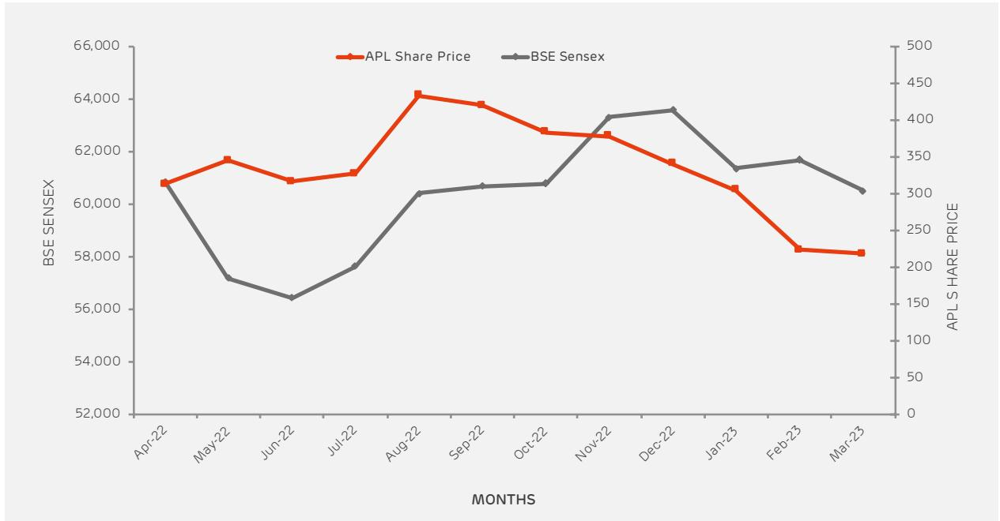

line

| MONTHS   | APL Share Price | BSE Sensex |
| -------- | --------------- | ---------- |
| Apr-22   | 60800           | 60800      |
| May-22   | 61700           | 57200      |
| Jun-22   | 60900           | 56400      |
| Jul-22   | 61100           | 57600      |
| Aug-22   | 64100           | 60400      |
| Sep-22   | 63800           | 60700      |
| Oct-22   | 62800           | 60800      |
| Nov-22   | 62700           | 41000      |
| Dec-22   | 61600           | 41200      |
| Jan-23   | 60500           | 33500      |
| Feb-23   | 58300           | 34500      |
| Mar-23   | 58100           | 31000      |

# j) Registrar & Transfer Agent:

M/s. KFin Technologies Limited is appointed as Registrar and Transfer (R&T) Agent of the Company for both Physical and Demat Shares. The registered office address is given below:

Selenium Tower B, Plot 31-32,

Financial District, Nanakramguda,

Serilingampally, Rangareddi,

Hyderabad, Telangana India - 500 032

Tel.: +91-40-67161526

Fax: +91-40-23001153

E-mail: einward.ris@kfintech.com

Website: www.kfintech.com

The Shareholders are requested to correspond directly with the R&T Agent for transfer/ transmission of shares, change of address, queries pertaining to their shares, dividend etc.

# k) Unclaimed Shares lying in the Escrow Account:

The Company entered the Capital Market with Initial Public Offer of 30,16,52,031 equity shares of H 10/- each at a premium of H 90/- per share through 100% Book Building process in August, 2009. In light of SEBI’s notification no. SEBI/ CFD/DIL/LA/2009/24/04 on 24th April 2009, the Company has opened a separate demat account in order to credit the unclaimed shares which

could not be allotted to the rightful shareholder due to insufficient / incorrect information or any other reason. The voting rights in respect of the said shares will be frozen till the time rightful owner claims such shares. The details of Unclaimed Shares as on 31st March 2023 issued pursuant to Initial Public offer (IPO) are as under:

<table><tr><td>Sr. No.</td><td>Particulars</td><td>Cases</td><td>No. of Shares</td></tr><tr><td>1</td><td>Aggregate number of shareholders and the outstanding shares in the suspense account (i.e. Adani Power Limited unclaimed shares demat suspense account) lying at the beginning of the year, i.e. 1st April 2022</td><td>158</td><td>24582</td></tr><tr><td>2</td><td>Number of shareholders who approached issuer for transfer of shares from suspense account during the year</td><td>0</td><td>0</td></tr><tr><td>3</td><td>Number of shareholders to whom shares were transferred from the suspense account during the year</td><td>0</td><td>0</td></tr><tr><td>4</td><td>Aggregate number of shareholders and the outstanding shares in the suspense account lying at the end of the year, i.e. 31st March 2023</td><td>158</td><td>24582</td></tr></table>

# l) Share Transfer System:

The Company’s shares are compulsorily traded in the demat segment on stock exchanges, bulk of the transfers take place in the electronic form. The share transfers received in physical form are processed through R & T Agent, within seven days from the date of receipt, subject to the documents being valid and complete in all respects. The Board has delegated the authority for approving transfer, transmission, issue of duplicate share certificate, dematerialization etc. to the Stakeholders’ Relationship Committee. All the physical transfers received are processed by the R & T Agent and are approved by the Stakeholders’ Committee well within the statutory period. The Stakeholders’ Relationship Committee meets for approval of the transfer, transmission, issue of duplicate share certificate, dematerialization / rematerialization of shares etc. and all valid share transfers received during the year ended 31st March 2023 have been acted

upon. The share certificates duly endorsed are returned immediately to the shareholders by the R & T Agent.

During the year under review, the Company obtained following certificate(s) from a Practicing Company Secretary and submitted the same to the stock exchanges within stipulated time:

1. Certificate confirming due compliance of share transfer formalities by the Company pursuant to Regulation 40(9) of the Listing Regulations for the year ended 31st March, 2023 with the Stock Exchanges; and   
2. Certificate regarding reconciliation of the share capital audit of the Company on quarterly basis. All share transfer and other communication regarding share certificates, change of address, etc. should be addressed to R & T Agents of the Company at the address given above.

# m) Shareholding as on 31st March, 2023:

(a) Distribution of Shareholding as on 31st March, 2023:

<table><tr><td rowspan="2">No. of shares</td><td colspan="2">Equity Shares in each category</td><td colspan="2">Number of shareholders</td></tr><tr><td>Total Shares</td><td>% of total</td><td>Holders</td><td>% of total</td></tr><tr><td>1-500</td><td>16,93,492</td><td>94.57</td><td>11,73,26,942</td><td>3.04</td></tr><tr><td>501-1000</td><td>53,439</td><td>2.98</td><td>4,03,76,367</td><td>1.05</td></tr><tr><td>1001-2000</td><td>24,346</td><td>1.36</td><td>3,53,82,511</td><td>0.92</td></tr><tr><td>2001-3000</td><td>7,426</td><td>0.41</td><td>1,86,67,847</td><td>0.48</td></tr><tr><td>3001-4000</td><td>3,384</td><td>0.19</td><td>1,20,35,772</td><td>0.31</td></tr><tr><td>4001-5000</td><td>2,413</td><td>0.13</td><td>1,12,33,636</td><td>0.29</td></tr><tr><td>5001-10000</td><td>3,595</td><td>0.20</td><td>2,56,83,862</td><td>0.67</td></tr><tr><td>10001 &amp; above</td><td>2,581</td><td>0.14</td><td>3,59,62,32,004</td><td>93.24</td></tr><tr><td>Total</td><td>17,90,676</td><td>100.00</td><td>3,85,69,38,941</td><td>100.00</td></tr></table>

(b) Category wise Shareholding Pattern as on 31st March, 2023: 

<table><tr><td>Category</td><td>Total No. of Shares</td><td>% of holding</td></tr><tr><td>Promoter and Promoter Group</td><td>2,89,16,12,567</td><td>74.97</td></tr><tr><td>Foreign Institutional Investors / Portfolio Investor</td><td>45,10,94,158</td><td>11.70</td></tr><tr><td>Mutual Funds/Banks/Financial Institutions</td><td>5,15,391</td><td>0.01</td></tr><tr><td>NRI/Foreign Nationals/Foreign Companies</td><td>18,87,65,713</td><td>4.89</td></tr><tr><td>Clearing Member</td><td>13,52,341</td><td>0.04</td></tr><tr><td>Bodies Corporate</td><td>1,01,86,692</td><td>0.26</td></tr><tr><td>Directors</td><td>6,895</td><td>0.00</td></tr><tr><td>Indian Public and others</td><td>31,34,05,184</td><td>8.13</td></tr><tr><td>Total</td><td>3,85,69,38,941</td><td>100.00</td></tr></table>

# n) Dematerialization of Shares and Liquidity:

The Equity Shares of the Company are tradable in compulsory dematerialized segment of the Stock Exchanges and are available in depository system of National Securities Depository Limited (NSDL) and Central Depository Services (India) Limited (CDSL). The demat security (ISIN) code for the equity share is INE814H01011.

As on 31st March, 2023 the equity shares of the Company representing 99.99% of the Company’s share capital are in dematerialized form.

The Company’s equity shares are regularly traded on the BSE Limited and National Stock Exchange of India Limited.

# o) Debenture Trustees (for privately placed debentures):

As on 31st March, 2023, the Company has no outstanding Debentures, which were issued earlier on private placement basis.

# p) Outstanding GDRs/ADRs/Warrants or any convertible instrument, conversion and likely impact on equity: Nil

# q) Commodity Price Risk/Foreign Exchange Risk and Hedging:

In the ordinary course of business, the Company is exposed to risks resulting from exchange rate fluctuation and interest rate movements. It manages its exposure to these risks through derivative financial instruments. The Company’s risk management activities are subject to the management, direction and control of Treasury

Team of the Company under the framework of Risk Management Policy for Currency and Interest rate risk as approved by the Board of Directors of the Company. The Company’s Treasury Team ensures appropriate financial risk governance framework for the Company through appropriate policies and procedures and that financial risks are identified, measured and managed in accordance with the Company’s policies and risk objectives. It is the Company’s policy that no trading in derivatives for speculative purposes may be undertaken. The decision of whether and when to execute derivative financial instruments along with its tenure can vary from period to period depending on market conditions and the relative costs of the instruments. The tenure is linked to the timing of the underlying exposure, with the connection between the two being regularly monitored.

# r) Site Location:

1. Solar Project - Village Bitta-Naliya, District - Kutchh, Gujarat   
2. Mundra TPP - Kutchh District in Taluka Mundra of Gujarat   
3. Tiroda TPP - MIDC Growth Centre, Tiroda in District - Gondia   
4. Kawai TPP - Village Kawai in Atru Tehsil in Baran District in the State of Rajasthan   
5. Udupi TPP - Udupi District of Karnataka   
6. Raigarh TPP - Chhattisgarh   
7. Raipur TPP - Chhattisgarh

# s) Address for Correspondence:

Mr. Deepak S Pandya,

Company Secretary & Compliance Officer

Adani Corporate House, Shantigram,

Near Vaishno Devi Circle, S. G. Highway,

Khodiyar, Ahmedabad - 382421.

Tel.: +91-79-2656 5555

Fax: +91-79-2656 5500

E-mail: investor.apl@adani.com

For transfer/dematerialization of shares, change of address of members and other queries.

# M/s. KFin Technologies Limited

Selenium Tower B, Plot 31-32, Financial District,

Nanakramguda, Serilingampally,

Hyderabad - 500 032

Tel.: +91-40-67161526

Fax: +91-40-23001153

E-mail: einward.ris@kfintech.com

# t) Credit Rating:

<table><tr><td>Rating Agency</td><td>Facility</td><td>Rating/Outlook</td></tr><tr><td>India Ratings and CRISIL</td><td>Bank Facilities of Adani Power Limited</td><td>A/Positive from India RatingsA/Stable from CRISIL</td></tr></table>

# u) Non-Mandatory Requirements:

The non-mandatory requirements have been adopted to the extent and in the manner as stated under the appropriate headings detailed below:

# 1. The Board:

The Non-Executive Chairman was not reimbursed any expenses during the FY 2022-23 for maintenance of the Chairmans office or permanence of his duties.

# 2. Shareholders’ Right:

The quarterly, half-yearly and annual financial results of the Company are published in newspapers and posted on Company’s website www.adanipower.com. The same are also available on the websites of stock exchanges, where the shares of the Company are listed i.e. www.bseindia.com and www. nseindia.com.

# 3. Modified opinion(s) audit report:

The Modified opinion has been appropriately dealt with in Note No. 64 and 71 of the Notes to the Standalone Audited Financial Statements and Consolidated Audited Financial Statements, respectively.

# 4. Separate posts of Chairman, Managing Director and Chief Executive Officer:

Mr. Gautam S. Adani is the Chairman, Mr. Anil Sardana is the Managing Director and Mr. Shersingh B. Khyalia is the CEO of the Company. All these positions have distinct and well-articulated roles and responsibilities.

# 5. Reporting of Internal Auditor

The Internal Auditor of the Company is a permanent invitee to the Audit Committee Meeting and regularly attends the Meeting to report their findings of the internal audit to the Audit Committee Members.

# 9. Other Disclosures:

# a) Disclosure on materially significant related party transactions:

All related party transactions entered into during the financial year were at arm’s length basis and in the ordinary course of business. The details of Related Party Transactions are disclosed in financial section of this Annual Report. The Company has developed a policy on materiality of Related Party Transactions and also on dealing with Related Party Transactions.

The Related Party Transaction Policy is uploaded on the website of the Company at https:// www.adanipower.com/investors/corporategovernance.

b) In the preparation of the financial statements, the Company has followed the accounting policies and practices as prescribed in the Accounting Standards.

# c) Details of compliances

The Company has complied with all the requirements of the Stock Exchanges as well as the regulations and guidelines prescribed by the Securities and Exchange Board of India (SEBI). There were no penalties or strictures imposed on the Company by Stock Exchanges or SEBI or any statutory authority on any matter related to capital markets during the last three years.

# d) MD, CEO and CFO Certificate

In compliance with Regulation 17(8) of SEBI Listing Regulations, the MD, CEO & CFO of the Company have furnished a Certificate to the Board, for the year ended on 31st March, 2023 and the same is attached to this Report. They have also provided quarterly certificates on financial results while placing the same before the Board pursuant to Regulation 33 of SEBI Listing Regulations.

# e) Proceeds from public issues, rights issues, preferential issues etc.

The Company discloses to the Audit Committee, the uses / application of proceeds / funds raised from Rights Issue, preferential issue as part of the quarterly review of financial results, whenever applicable.

f) The designated Senior Management Personnel of the Company have disclosed to the Board that no material, financial and commercial transactions have been made during the year under review in which they have personal interest, which may have a potential conflict with the interest of the Company at large.   
g) The Material Events Policy, Website Content Archival Policy and Policy on Preservation of Documents are uploaded on the website of the Company at https://www.adanipower.com/ investors/corporate-governance.   
h) The Company has in place an Information Security Policy that ensure proper utilization of IT resources.   
i) Details of the familiarization programmes imparted to the Independent Directors are available on the website of the Company at https:// www.adanipower.com/investors/corporategovernance.   
j) With a view to regulate trading in securities by the Directors and Designated Employees, the Company has adopted a Code of Conduct for Prohibition of Insider Trading (Code). The Code also covers the policy and procedures for inquiry in case of leak of Unpublished Price Sensitive Information (UPSI) or suspected leak of UPSI. The Code is available on the website of the Company at https:// www.adanipower.com/investors/corporategovernance.

k) The Company has put in place succession plan for appointment to the Board and to Senior Management.   
l) The Company complies with all applicable secretarial standards.   
m) The Company has complied with all the mandatory requirements specified in Regulations 17 to 27 and clauses (b) to (i) of Regulation 46(2) of the SEBI Listing Regulations. It has obtained a certificate affirming the compliances from M/s Chirag Shah and Associates, Practicing Company Secretaries and the same is attached to this Annual Report.   
n) As required under Regulation 36(3) of the SEBI Listing Regulations, the particulars of Director(s) seeking re-appointment at the ensuing Annual General Meeting are given in the Annexure to the Notice of the 27th Annual General Meeting to be held on, 19th July 2023.   
o) The Company has obtained a certificate from M/s Chirag Shah and Associates, Practicing Company Secretaries confirming that none of the Directors of the Company is debarred or disqualified by the Securities and Exchange Board of India / Ministry of Corporate Affairs or any such authority from being appointed or continuing as Director of the Company and the same is also attached to this Report.   
p) Total fees for all services paid by the Company and its subsidiaries, on a consolidated basis, to the Statutory Auditor and all entities in the network firm / network entity of which the Statutory Auditor is a part, is given below:

M/s. S R B C & CO. LLP (H in crore) 

<table><tr><td>Payment to Statutory Auditor</td><td>2022-23</td></tr><tr><td>Audit Fees</td><td>2.37</td></tr><tr><td>Limited Review</td><td>0.93</td></tr><tr><td>Certification Fees</td><td>0.53</td></tr><tr><td>Reimbursement of Expenses</td><td>0.08</td></tr><tr><td>Total</td><td>3.91</td></tr></table>

q) As per the requirement of the Sexual Harassment of Women at Workplace (Prevention, Prohibition & Redressal) Act, 2013 and rules made thereunder, the Company has constituted Internal Complaints Committee(s) which are responsible for redressal of complaints related to sexual harassment. During the year under review, there were no complaints pertaining to sexual harassment.

r) The Company has not made any contributions to / spending for political campaigns, political organizations, lobbyists or lobbying organizations, trade associations and other tax-exempt groups.   
s) A qualified Practicing Company Secretary carried out a reconciliation of Share Capital Audit to reconcile the total admitted capital with National Securities Depository Limited (NSDL) and Central Depository Services (India) Limited (CDSL) and the total issued and listed capital. The Secretarial Audit confirms that the total issued / paid-up capital of the Company is in agreement with the total number of shares in physical form and the total number of dematerialized shares held with NSDL and CDSL.   
t) As a part of good governance practice, the Company has also constituted several policies from ESG perspective and the same are available on Company’s website at https://www. adanipower.com/investors/corporate-governance   
u) During FY 2022-23, neither the Company nor any of its subsidiaries have provided ‘Loans and Advances in the nature of loans’ to firms / companies in which the Directors are interested.   
v) During the year under review, the Company did not

raise any funds through preferential allotment or qualified institutional placement as specified under Regulation 32(7A) of the SEBI Listing Regulations.

# w) Details of the Company’s material subsidiary:

Name: Adani Power (Jharkhand) Limited Date of Incorporation: 18th December, 2015 Name of the Statutory Auditor: M/s Dharmesh Parikh & Co., LLP Date of appointment of Statutory Auditor: 30th June, 2021

# Declaration

We, Anil Sardana, Managing Director and Shersingh B. Khyalia, Chief Executive Officer of Adani Power Limited hereby declare that as of 31st March, 2023, all the Board Members and Senior Management Personnel have affirmed compliance with the Code of Conduct and Ethics for Directors and Senior Management Personnel laid down by the Company.

# For Adani Power Limited

# Anil Sardana

Managing Director

Place: Ahmedabad Date: 5th May 2023

# Shersingh B. Khyalia

Chief Executive Officer

# Declaration

We, Anil Sardana, Managing Director and Shersingh B. Khyalia, Chief Executive Officer of Adani Power Limited hereby declare that as of 31st March, 2023, all the Board Members and Senior Management Personnel have affirmed compliance with the Code of Conduct and Ethics for Directors and Senior Management Personnel laid down by the Company.

# For Adani Power Limited

Place: Ahmedabad

Date: 5th May, 2023

Anil Sardana

Managing Director

Shersingh Khyalia

Chief Executive Officer

# Compliance Certificate on Corporate Governance

To,

The Members of

ADANI POWER LIMITED

We have examined the compliance of conditions of Corporate Governance by Adani Power Limited (“the Company”) for the year ended on 31st March, 2023 as stipulated in the applicable regulations of SEBI (Listing Obligations and Disclosure Requirements) Regulations, 2015, as amended, pursuant to the Listing Agreement of the Company with the Stock Exchanges.

The compliance of conditions of Corporate Governance is the responsibility of the Management. Our examination was limited to a review of procedures and implementations thereof adopted by the Company for ensuring the compliance of the conditions of Corporate Governance. It is neither an audit nor an expression of opinion on the financial statement of the Company.

In our opinion and to the best of our information and according to the explanations given to us, we certify that the Company has complied with the conditions of Corporate Governance as stipulated in the applicable regulations of SEBI (Listing Obligations and Disclosure Requirements) Regulations, 2015, as amended.

We further state that such compliance is neither an assurance as to the future viability of the Company nor the efficiency or effectiveness with which the management has conducted the affairs of the Company.

CS Chirag Shah

Partner

Chirag Shah and Associates

FCS No.: 5545

C. P. No. 3498

Place: Ahmedabad

Date: 5th May 2023

Peer Review Cert. No.: 704/2020

UDIN : F005545E000260888

# Certificate of Non-Disqualification of Directors

(Pursuant to Regulation 34(3) and Schedule V Para C clause (10)(i) of the SEBI

(Listing Obligations and Disclosure Requirements) Regulations, 2015)

To,

The Members of

# ADANI POWER LIMITED

Adani Corporate House, Shantigram

Near Vaishno Devi Circle,

S. G. Highway, Khodiyar

Ahmedabad -382421

We have examined the relevant registers, records, forms, returns and disclosures received from the Directors of Adani Power Limited having CIN L40100GJ1996PLC030533 and having registered office at Adani Corporate House, Shantigram, Near Vaishno Devi Circle, S. G. Highway, Khodiyar Ahmedabad -382421. (hereinafter referred to as ‘the Company’), produced before us by the Company for the purpose of issuing this Certificate, in accordance with Regulation 34(3) read with Schedule V Para-C Sub clause 10(i) of the Securities Exchange Board of India (Listing Obligations and Disclosure Requirements) Regulations, 2015.

In our opinion and to the best of our information and according to the verifications (including Directors Identification Number (DIN) status at the portal www.mca.gov.in) as considered necessary and explanations furnished to us by the Company & its officers, we hereby certify that none of the Directors on the Board of the Company as stated below for the Financial Year ending on March 31, 2023 have been debarred or disqualified from being appointed or continuing as Directors of companies by the Securities and Exchange Board of India, Ministry of Corporate Affairs or any such other Statutory Authority.

<table><tr><td>Sr. No.</td><td>Name of Director</td><td>DIN</td><td>Date of appointment in Company</td></tr><tr><td>1.</td><td>Mr. Gautam Shantilal Adani</td><td>00006273</td><td>26/12/2005</td></tr><tr><td>2.</td><td>Mr. Rajesh Shantilal Adani</td><td>00006322</td><td>12/06/2007</td></tr><tr><td>3.</td><td>Mr. Anil Kumar Sardana</td><td>00006867</td><td>11/07/2020</td></tr><tr><td>4.</td><td>Mr. Mukesh Mahendrabhai Shah</td><td>00084402</td><td>31/03/2018</td></tr><tr><td>5.</td><td>Mr. Sushil Kumar Roongta</td><td>00309302</td><td>11/11/2022</td></tr><tr><td>6.</td><td>Mr. Chandra Iyengar</td><td>02821294</td><td>11/11/2022</td></tr></table>

Ensuring the eligibility of for the appointment / continuity of every Director on the Board is the responsibility of the management of the Company. Our responsibility is to express an opinion on these based on our verification. This certificate is neither an assurance as to the future viability of the Company nor of the efficiency or effectiveness with which the management has conducted the affairs of the Company.

CS Chirag Shah

Partner

Chirag Shah and Associates

FCS No.: 5545

C. P. No. 3498

Place: Ahmedabad

Date: 5th May 2023

Peer Review Cert. No.: 704/2020

UDIN : F005545E000260866

# Certificate of Managing Director, Chief Executive Officer and Chief Financial Officer

To,

The Board of Directors

Adani Power Limited

We, Anil Sardana, Managing Director; Shersingh B. Khyalia, Chief Executive Officer; and Shailesh Sawa, Chief Financial Officer of Adani Power Limited certify that:

1. These statements do not contain any materially untrue statement or omit any material fact or contain statements that might be misleading.   
2. These statements together present a true and fair view of the Company’s affairs and are in compliance with existing accounting standards, applicable laws and regulations.

A) We have reviewed the financial statements and the cash flow statements of the Company for the year ended 31st March 2023 and:   
B) To the best of our knowledge and belief, no transactions entered into by the Company during the year ended 31st March 2023 which are fraudulent, illegal or violation of the Company’s Code of Conduct.   
C) We accept responsibility for establishing and maintaining internal control system and that we have evaluated the effectiveness of the internal control system of the Company and we have disclosed to the auditors and the Audit Committee, deficiencies in the design or operation of internal control system, if any, of which we are aware and the steps we have taken or propose to take to rectify these deficiencies.   
D) We further certify that we have indicated to the Auditors and the Audit Committee, that:

a) there have been no significant changes in internal control over financial reporting system during the year;

b) there have been no significant changes in accounting policies during the year except for the changes disclosed in the notes to the financial statements, if any; and

c) there have been no instances of significant fraud, of which we have become aware, involving management or an employee having a significant role in the Company’s internal control system over financial reporting.

# For Adani Power Limited

Place: Ahmedabad

Date: 5th May, 2023

Anil Sardana

Managing Director

Shersingh B. Khyalia

Chief Executive Officer

Shailesh Sawa

Chief Financial Officer

# Business Responsibility and Sustainability Report 2022-23

# SECTION A: GENERAL DISLOSURE

I. Details of the listed Entity 

<table><tr><td>1</td><td>Corporate Identity Number (CIN) of the Listed Entity</td><td>L40100GJ1996PLC030533</td></tr><tr><td>2</td><td>Name of the Listed Entity</td><td>Adani Power Limited (&quot;Company/ APL&quot;)</td></tr><tr><td>3</td><td>Year of incorporation</td><td>1996</td></tr><tr><td>4</td><td>Registered office address</td><td>&quot;Adani Corporate House&quot;, Shantigram, Near Vaishno Devi Circle, S. G. Highway, Khodiyar, Ahmedabad - 382421, Gujarat, India.</td></tr><tr><td>5</td><td>Corporate address</td><td>&quot;Adani Corporate House&quot;, Shantigram, Near Vaishno Devi Circle, S. G. Highway, Khodiyar, Ahmedabad - 382421, Gujarat, India.</td></tr><tr><td>6</td><td>E-mail</td><td>investor.apl@adani.com</td></tr><tr><td>7</td><td>Telephone</td><td>+91 79 - 26565555</td></tr><tr><td>8</td><td>Website</td><td>www.adanipower.com</td></tr><tr><td>9</td><td>Financial year for which reporting is being done</td><td>01.04.2022 to 31.03.2023</td></tr><tr><td>10</td><td>Name of the Stock Exchange(s) where shares are listed</td><td>BSE Limited (BSE) and National Stock Exchange of India Limited (NSE)</td></tr><tr><td>11</td><td>Paid-up Capital</td><td>₹ 3856.94 crore</td></tr><tr><td>12</td><td>Name and contact details (telephone, email address) of the person who may be contacted in case of any queries on the BRSR report</td><td>Name: Mr. Santosh Kumar SinghDesignation: Chief Sustainability OfficerTelephone Number: (079) 2555 57289Email Id: cso.power@adani.com</td></tr><tr><td>13</td><td>Reporting boundary - Are the disclosures under this report made on a standalone basis (i.e. only for the entity) or on a consolidated basis (i.e. for the entity and all the entities which form a part of its consolidated financial statements, taken together).</td><td>Disclosures under this report are made on a consolidated basis. The following Power generation stations of energy businesses are included in the reporting boundary.(i) Adani Power Limited, (Solar Plant), Bitta, Kutch, Gujarat.(ii) Adani Power Limited, Mundra, Gujarat.(iii) Adani Power Limited, Tiroda, Maharashtra.(iv) Adani Power Limited, Kawai, Rajasthan.(v) Adani Power Limited, Udupi, Karnataka.(vi) Adani Power Limited, Raipur, Chhattisgarh.(vii) Adani Power Limited, Raigarh, Chhattisgarh.(viii) Adani Power Jharkhand Limited, Godda, Jharkhand and (ix) Mahan Energen Limited.</td></tr></table>

# II. Products and Services

14. Details of business activities (accounting for 90% of the turnover):

<table><tr><td>Sr. No.</td><td>Description of Main Activity</td><td>Description of Business Activity</td><td>% of Turnover of the entity</td></tr><tr><td>1</td><td>Power Generation and related activities</td><td>Power Generation by Coal Based Thermal Power Plant</td><td>98%</td></tr></table>

15. Products/Services sold by the entity (accounting for 90% of the entity’s Turnover):

<table><tr><td>Sr. No.</td><td>Product/Service</td><td>NIC Code</td><td>% of total Turnover contributed</td></tr><tr><td>1</td><td>Electric power generation by coal based thermal power plants</td><td>35102</td><td>98%</td></tr></table>

# III. Operations

16. Number of locations where plants and/or operations/offices of the entity are situated

<table><tr><td>Location</td><td>Number of plants</td><td>Number of offices</td><td>Total</td></tr><tr><td>National</td><td>09</td><td>01</td><td>10</td></tr><tr><td>International</td><td>00</td><td>00</td><td>00</td></tr></table>

17. Markets served by the entity:

a. Locations

<table><tr><td>Location</td><td>Number</td></tr><tr><td>National (No. of States)</td><td>17</td></tr><tr><td>International (No. of Countries)</td><td>01</td></tr></table>

b. What is the contribution of exports as a percentage of the total turnover of the entity?

APL installed 1600 MW Thermal Power Plant to export electricity to fulfill the requirement of electricity demand in Bangladesh under Indo-Bangla Maitry Treaty signed between Government of India (GoI) and Government of Bangladesh (GoB), about 0.33% of total generation contribute toward export during current financial year.

c. A brief on types of customers:

The Company primarily serves B2B customers (comprising of State utilities & DISCOMS).

# IV. Employees

18. Details as at the end of Financial Year

1. Employees (including differently abled):

<table><tr><td rowspan="2">Particulars</td><td rowspan="2">Total (A)</td><td colspan="2">Male</td><td colspan="2">Female</td></tr><tr><td>No. (B)</td><td>% (B/A)</td><td>No. (C)</td><td>% (C/A)</td></tr><tr><td colspan="6">EMPLOYEES</td></tr><tr><td>Permanent (D)</td><td>3295</td><td>3276</td><td>99.4%</td><td>19</td><td>0.6%</td></tr><tr><td>Other than Permanent (E)</td><td>18</td><td>18</td><td>100%</td><td>-</td><td>-</td></tr><tr><td>Total Employees (D+E)</td><td>3313</td><td>3294</td><td>99.4%</td><td>19</td><td>0.6%</td></tr><tr><td colspan="6">WORKERS</td></tr><tr><td>Permanent (F)</td><td>246</td><td>246</td><td>100%</td><td>-</td><td>-</td></tr><tr><td>Other than Permanent (G)</td><td>-</td><td>-</td><td>-</td><td>-</td><td>-</td></tr><tr><td>Total Workers (F+G)</td><td>246</td><td>246</td><td>100%</td><td>-</td><td>-</td></tr></table>

2. Differently abled Employees and workers: 

<table><tr><td rowspan="2">Particulars</td><td rowspan="2">Total (A)</td><td colspan="2">Male</td><td colspan="2">Female</td></tr><tr><td>No. (B)</td><td>% (B/A)</td><td>No. (C)</td><td>% (C/A)</td></tr><tr><td colspan="6">DIFFERENTLY ABLED EMPLOYEES</td></tr><tr><td>Permanent (D)</td><td>0</td><td>0</td><td>0</td><td>0</td><td>0</td></tr><tr><td>Other than Permanent (E)</td><td>0</td><td>0</td><td>0</td><td>0</td><td>0</td></tr><tr><td>Total Differently abled employees (D+E)</td><td>0</td><td>0</td><td>0</td><td>0</td><td>0</td></tr><tr><td colspan="6">DIFFERENTLY ABLED WORKERS</td></tr><tr><td>Permanent (F)</td><td>0</td><td>0</td><td>0</td><td>0</td><td>0</td></tr><tr><td>Other than Permanent (G)</td><td>0</td><td>0</td><td>0</td><td>0</td><td>0</td></tr><tr><td>Total differently abled Workers (F+G)</td><td>0</td><td>0</td><td>0</td><td>0</td><td>0</td></tr></table>

19. Participation/Inclusion/Representation of women 

<table><tr><td></td><td>Total (A)</td><td>Number (B)</td><td>Percentage of Females % (B/A)</td></tr><tr><td>Board of Directors</td><td>6</td><td>1</td><td>16.7</td></tr><tr><td>Key Managerial Personnel*</td><td>4</td><td>0</td><td>0</td></tr></table>

\* Managing Director, Chief Executive Officer, Chief Financial Officer and Company Secretary.

20. Turnover rate for permanent employees and workers: (Disclose trends for the past 3 years) 

<table><tr><td rowspan="2"></td><td colspan="3">FY 2022-23</td><td colspan="3">FY 2021-22</td><td colspan="3">FY 2020-21</td></tr><tr><td>Male</td><td>Female</td><td>Total</td><td>Male</td><td>Female</td><td>Total</td><td>Male</td><td>Female</td><td>Total</td></tr><tr><td>Permanent Employees</td><td>7.02%</td><td>5.26%</td><td>7.01%</td><td>8.38%</td><td>0%</td><td>8.38%</td><td>5.24%</td><td>0</td><td>5.24%</td></tr><tr><td>Permanent Workers</td><td>8.54%</td><td>0</td><td>8.54%</td><td>10%</td><td>0</td><td>10%</td><td>5.49%</td><td>0</td><td>5.49%</td></tr></table>

# V. Holding, Subsidiary and Associate Companies (including joint ventures)

21. Names of holding / subsidiary / associate companies / joint ventures 

<table><tr><td>Sr. No.</td><td>Name of the holding / subsidiary / associate companies / joint ventures (A)</td><td>Indicate whether holding/ Subsidiary/ Associate/ Joint Venture</td><td>% of shares held by listed entity</td><td>Does the entity indicated at column A, participate in the Business Responsibility initiatives of the listed entity? (Yes/No)</td></tr><tr><td>1</td><td>Adani Power (Jharkhand) Limited</td><td>Subsidiary</td><td>100.00</td><td>Yes</td></tr><tr><td>2</td><td>Mahan Energen Limited (Formerly known as Essar Power MP Limited)</td><td>Subsidiary</td><td>100.00</td><td>Yes</td></tr><tr><td>3</td><td>Adani Power Dahej Limited</td><td>Subsidiary</td><td>100.00</td><td>No</td></tr><tr><td>4</td><td>Pench Thermal Energy (MP) Limited</td><td>Subsidiary</td><td>100.00</td><td>No</td></tr><tr><td>5</td><td>Kutchh Power Generation Limited</td><td>Step Down Subsidiary</td><td>100.00</td><td>No</td></tr><tr><td>6</td><td>Mahan Fuel Management Limited</td><td>Subsidiary</td><td>100.00</td><td>No</td></tr><tr><td>7</td><td>Adani Power Resources Limited</td><td>Subsidiary</td><td>51.00</td><td>No</td></tr><tr><td>8</td><td>Alcedo Infra Park Limited</td><td>Subsidiary</td><td>100.00</td><td>No</td></tr><tr><td>9</td><td>Chandenvalle Infra Park Limited</td><td>Subsidiary</td><td>100.00</td><td>No</td></tr><tr><td>10</td><td>Emberiza Infra Park Limited</td><td>Subsidiary</td><td>100.00</td><td>No</td></tr><tr><td>11</td><td>Resurgent Fuel Management Limited</td><td>Subsidiary</td><td>100.00</td><td>No</td></tr><tr><td>12</td><td>Innovant Buildwell Private Limited (Formerly known as Eternus Real Estate Private Limited)</td><td>Subsidiary</td><td>100.00</td><td>No</td></tr><tr><td>13</td><td>Aviceda Infra Park Limited</td><td>Subsidiary</td><td>100.00</td><td>No</td></tr><tr><td>14</td><td>Support Properties Private Limited</td><td>Subsidiary</td><td>100.00</td><td>No</td></tr></table>

<table><tr><td>VI.</td><td>CSR Details</td><td>Response</td></tr><tr><td rowspan="3">22.</td><td>(i) Whether CSR is applicable as per section 135 of Companies Act, 2013: (Yes/No)</td><td>Yes</td></tr><tr><td>(ii) Turnover (₹ in crore)</td><td>43,040.52</td></tr><tr><td>(iii) Net worth (₹ in crore)</td><td>29,875.66</td></tr></table>

# VII. Transparency and Disclosures Compliances

23. Complaints/Grievances on any of the principles (Principles 1 to 9) under the National Guidelines on Responsible Business Conduct.

<table><tr><td rowspan="2">Stakeholder group from whom complaint is received</td><td rowspan="2">Grievance Redressal Mechanism in Place (Yes/No) (If Yes, then provide web-link for grievance redress policy)</td><td colspan="3">Current Financial Year FY 2022-23</td><td colspan="3">Previous Financial Year FY 2021-22</td></tr><tr><td>Number of complaints filed during the year</td><td>Number of complaints pending resolution at close of the year</td><td>Remarks</td><td>Number of complaints filed during the year</td><td>Number of complaints pending resolution at close of the year</td><td>Remarks</td></tr><tr><td>Communities</td><td>Yes</td><td>0</td><td>0</td><td>0</td><td>0</td><td>0</td><td>0</td></tr><tr><td>Investors (other than shareholders)</td><td>Yes</td><td>0</td><td>0</td><td>0</td><td>0</td><td>0</td><td>0</td></tr><tr><td>Shareholders</td><td>Yes</td><td>0</td><td>0</td><td>0</td><td>5</td><td>0</td><td>0</td></tr><tr><td>Employees and workers</td><td>Yes</td><td>0</td><td>0</td><td>0</td><td>0</td><td>0</td><td>0</td></tr><tr><td>Customers</td><td>Yes</td><td>0</td><td>0</td><td>0</td><td>0</td><td>0</td><td>0</td></tr><tr><td>Value Chain Partners</td><td>Yes</td><td>0</td><td>0</td><td>0</td><td>0</td><td>0</td><td>0</td></tr><tr><td>Other (please specify)</td><td>NIL</td><td>0</td><td>0</td><td>0</td><td>0</td><td>0</td><td>0</td></tr></table>

# Principle Wise Policies:

Weblink: https://www.adanipower.com/-/media/Project/Power/Investors/Corporate-Governance/Policies/ Employee-Grievance-Management-Policy.pdf

24. Overview of the entity’s material responsible business conduct issues 

<table><tr><td>Sr. No.</td><td>Material issue identified</td><td>Indicate whether risk or opportunity (R/O)</td><td>Rationale for identifying the risk / opportunity</td><td>In case of risk, approach to adapt or mitigate</td><td>Financial implications of the risk or opportunity (Indicate the positive/negative implications)</td></tr><tr><td>1</td><td>Occupational health and safety</td><td>Risk</td><td>Employee and worker well-being and safety is integral to APL. Jeopardizing the health and safety can not only impact the productivity, as well as profitability, but also affect the employee and worker morale.</td><td>Foster a safe working environment and ensure zero harm. Hazards and risks are identified on a periodic basis, and mitigation as well as prevention plans are implemented. Further, for employee and worker well-being, regular trainings on health and safety are provided.</td><td rowspan="3">We have performed a qualitative assessment and identified that this material topic has negative implications on our operations and business activities. However, we at Adani have built Integrated management systems (IMS) that support in mitigating any risk. We have also designed controls that support in converting risks to opportunities through continuous collaborations and learnings.</td></tr><tr><td></td><td>Biodiversity</td><td>Risk</td><td>Reducing the impact of business operation on biodiversity and focus on optimization of natural resources to avoid negatively impacting the environment and the biodiversity.</td><td>The biodiversity policy drives the Company to do business with no net loss to biodiversity by 2025. The approach in managing biodiversity impacts at the operation and construction sites is built upon three major principles outlined in the Biodiversity Policy and embedded in the Biodiversity Assessment process</td></tr><tr><td>3</td><td>Regulatory Compliance</td><td>Risk</td><td>Failure to comply with regulatory requirements can result in financial and reputational consequences and erode stakeholder trust.</td><td>Legal and functional teams monitor the regulatory compliances applicable for respective business functions at defined frequencies. Disciplinary measures and reinforcement mechanisms are also defined.</td></tr><tr><td>4</td><td>Anti-Bribery &amp; Anti-Corruption</td><td>Risk</td><td>Failing to uphold ethical practices and behaviour can lead to severe financial and reputations damages. It also puts stakeholder trust and the Company&#x27;s leadership position at risk</td><td>Anti-Bribery and Anti-Corruption Policy, Code of Conduct, Whistleblower Policy, and other ESG policies provide detailed guidance on ethical conduct and mitigate the risk of non-compliance.</td><td></td></tr></table>

<table><tr><td>Sr. No.</td><td>Material issue identified</td><td>Indicate whether risk or opportunity (R/O)</td><td>Rationale for identifying the risk / opportunity</td><td>In case of risk, approach to adapt or mitigate</td><td>Financial implications of the risk or opportunity (Indicate the positive/negative implications)</td></tr><tr><td>5</td><td>Human Rights</td><td>Risk</td><td>Upholding human rights in accordance with all applicable national and international regulations is essential to protect employees, communities, and other stakeholders.</td><td>The Human Rights Policy provides guidance on adherence to national and international Human Rights standards and principles. From a management perspective, a body has been instituted to support in adoption of human rights. There is mechanism within each entity to address an issue raised or reported pertaining to human rights, as well as a stipulated timeline within which it should be resolved.</td><td></td></tr><tr><td>6</td><td>Water Management</td><td>Risk</td><td>Water is a shared resource, and hence ensuring responsible consumption is key to the business's social license to operate</td><td>The Company has instituted a Resource Conservation Policy, which serves as a guiding principle to reduce consumption of water and other resources.</td><td></td></tr><tr><td>7</td><td>Waste Management</td><td>Risk</td><td>Noncompliance with regulation and inefficient modus operandi can firstly have direct financial and reputational implications, and secondly impact the environment. Hence, effectively managing and reducing the waste generated and complying with environmental rules and regulations ensure environmental sustainability.</td><td>The resource conservation policy provides guidance to incorporate the principles of circularity in processes and production. Complies with all applicable environmental laws and regulations and takes initiatives to manage and reduce quantities of waste generated.</td><td></td></tr><tr><td>8</td><td>Energy and Emissions Management</td><td>Risk</td><td>Adopting low carbon technologies also helps an organization prepare for a future, which could bring more stringent legislation and taxation related to energy and emissions.</td><td>Energy and Emission Policy provides guidance to reduce energy consumption and conserve greenhouse gas emissions. Complies with all applicable environmental laws and regulations and take initiatives to manage energy and emissions</td><td></td></tr><tr><td>9</td><td>Modernization, Innovation and Resource Optimization</td><td>Opportunity</td><td>The world is changing constantly and to remain relevant and profitable, it is an essential need to adapt and develop new advancements for meeting new realities.</td><td>The company has invested in technologies and made changes to its processes to reduce resource consumption and enhance machine safety</td><td></td></tr><tr><td>10</td><td>Community Development</td><td>Opportunity</td><td>Community development activities helps a company to create a positive impact on society by undertaking meaningful interventions to bring significant benefits to large sections of the society.</td><td>The Adani Foundation has been striving to create sustainable opportunities for the marginalized communities by facilitating quality education, sustainable livelihood development, promoting a healthy society and supporting rural infrastructure development.</td><td></td></tr><tr><td>11</td><td>Climate Change Adaption and Mitigation</td><td>Risk</td><td>The severe implications of climate change make it pertinent to control and reduce the energy consumption and emissions footprint</td><td>The Company's Climate Change Policy defines the process for measuring, monitoring and reducing the Company's environmental impact.</td><td></td></tr><tr><td>12</td><td>Economic Performance</td><td>Opportunity</td><td>Ensuring business profitability and strong economic performance helps deliver value to investors and reinvest in the growth of the business, employees, communities and other stakeholders</td><td>The Company thrive to deliver strong economic performance through our operational practices and risk mitigation strategies that supports the nation building and create a value for all the stakeholders</td><td></td></tr><tr><td>13</td><td>Plant Efficiency</td><td>Risk</td><td>Efficiency is an important attribute as all inputs are scarce. It is important to conserve them while maintaining an acceptable level of output.</td><td>Undertaking initiatives to aid resource conservation and investing in research and development efforts to explore more efficient alternatives to the existing practices supports in improving the plant efficiency.</td><td></td></tr></table>

<table><tr><td>Sr. No.</td><td>Material issue identified</td><td>Indicate whether risk or opportunity (R/O)</td><td>Rationale for identifying the risk / opportunity</td><td>In case of risk, approach to adapt or mitigate</td><td>Financial implications of the risk or opportunity (Indicate the positive/negative implications)</td></tr><tr><td>14</td><td>Business Continuity</td><td>Risk</td><td>Business continuity actions need to organization for survive from serious disruption.</td><td>We have a strategic risk management process in place that supports to identify the short, medium and long-term risks. Within these processes, we have incorporated systems that help our operations to become durable to unforeseen issues.</td><td rowspan="2"></td></tr><tr><td>15</td><td>Cultural Heritage</td><td>Opportunity</td><td>The influence of cultural factors on business is extensive. Culture impacts how employees are best managed based on their values and priorities.</td><td>Understanding the importance that cultural heritage holds for current and future generations, we have identified unique cultural heritage sites at our locations and worked towards restoring the local art and culture in these locations. One such example is the Namda craft at Kutch, Gujarat. Lastly, through the Adani Foundation, we have ensured that this art survives.</td></tr></table>

SECTION B: MANAGEMENT AND PROCESS DISCLOSURES 

<table><tr><td>Sr. No.</td><td>Disclosure Questions</td><td>P1</td><td>P2</td><td>P3</td><td>P4</td><td>P5</td><td>P6</td><td>P7</td><td>P8</td><td>P9</td></tr><tr><td colspan="11">Policy and management processes</td></tr><tr><td rowspan="3">1</td><td>a. Whether your entity's policy/policies cover each principle and its core elements of the NGRBCs.(Yes/No)</td><td>Yes</td><td>Yes</td><td>Yes</td><td>Yes</td><td>Yes</td><td>Yes</td><td>Yes</td><td>Yes</td><td>Yes</td></tr><tr><td>b. Has the policy been approved by the Board? (Yes/No)</td><td>Yes</td><td>Yes</td><td>Yes</td><td>Yes</td><td>Yes</td><td>Yes</td><td>Yes</td><td>Yes</td><td>Yes</td></tr><tr><td>c. Web Link of the Policies, if available</td><td colspan="9">https://www.adanipower.com/investors/corporate-governance</td></tr><tr><td>2</td><td>Whether the entity has translated the policy into procedures. (Yes / No)</td><td>Yes</td><td>Yes</td><td>Yes</td><td>Yes</td><td>Yes</td><td>Yes</td><td>Yes</td><td>Yes</td><td>Yes</td></tr><tr><td>3</td><td>Do the enlisted policies extend to your value chain partners? (Yes/No)</td><td colspan="9">Yes. The suppliers are required to comply with all the Company's policies including ESG.</td></tr><tr><td>4</td><td>Name of the national and international codes/certifications/ labels/ standards (e.g. Forest Stewardship Council, Fairtrade, Rainforest Alliance, Trustea) standards (e.g. SA 8000, OHSAS, ISO, BIS) adopted by your entity and mapped to each principle.</td><td colspan="9">Adani Group has adopted US based Malcolm Baldrige Business Excellence framework (MBNQA) as Adani Business Excellence Model (ABEM). Four of APL stations have participated in RBNQ BE Assessments and received Performance Excellence Awards, also APL implemented management system likeISO 9001:2015ISO 14001:2015ISO 45001:2018ISO 50001:2018ISO 55001:2014ISO 46001-2019ISO 27031:2011ISO 22301:2019ISO 27001:2019SA 8000ISO 26001-2010.</td></tr><tr><td>5</td><td>Specific commitments, goals and targets set by the entity with defined timelines, if any.</td><td colspan="9">The Company's commitment to contribute to sustainable development is well aligned with Adani Group's purpose of Nation Building that provides a guiding framework for investment in businesses that accelerate India's economic growth and enhance citizen wellbeing.We have worked to embed this sustainability commitment into our strategy, our business processes and decision-making. Some of our key ESG goals and ambitions include:Board Governance as per world best practicesTo be in top-5 companies in India for ESG benchmarking of Electric Utility Sector by FY 2023-24Explore Net carbon Neutral possibilities and public disclosures by 2023-24Committed to Health and Safety of workforce with Zero Harm and Zero Leak objective by bringing Leadership commitment, Uniform deployment of safety standards and procedures, Capacity building, Systems and Processes</td></tr><tr><td></td><td></td><td colspan="9">Contribution towards tree plantation pledge of 100 million tree plantation till 2030.Single-use-Plastic-Free (SuPF) Certified Company for 100% of operating locations by 2023-24Integrate with Management Systems in the company to conduct business with no net loss to biodiversity and 100% alignment with India Business Biodiversity Initiative (IBBI) and public disclosures by 2023-24Building green supply chain by integration of Associates for 100% of critical supplies by 2023-24Systematic Materiality Assessment and integration with Management Systems in the companyInclusive growth including communities by undertaking CSR initiatives aligned with business impacts to leave positive footprints and societal happiness</td></tr><tr><td>6</td><td>Performance of the entity against the specific commitments, goals and targets along-with reasons in case the same are not met.</td><td colspan="9">Key Performance targets across EGS parameters are set internally and monitored and acted upon continuously.</td></tr><tr><td colspan="11">Governance, leadership and oversight</td></tr><tr><td>7</td><td>Statement by director responsible for the business responsibility report, highlighting ESG related challenges, targets and achievements</td><td colspan="9">Adani Power Limited strives to systematically identify opportunities, manage risks with resilience, and secure the interest of all its stakeholders. The Company strives to be a sector leader in reducing direct emissions, in sourcing renewable energy for operations, and will work with value chain partners to reduce indirect emissions.To achieve this target, the company has undertaken a rigorous mapping of their emission footprint and will adhere to transparent disclosure and validation through internationally reputed platforms. Additionally, the Company is deeply committed to achieving the sustainability objectives not only covering environment, but also society and communities, health and safety, through responsible and robust governance.As the Company is deeply committed to help marginalized and underprivileged communities wherever it operates, their commitment goes beyond job creation and embraces a wide range of initiatives in partnership with the Adani Foundation that have touched millions of lives across thousands of villages, driving beneficial change in education, health, infrastructure, and sustainable livelihood development.Furthermore, in order to serve the customers with an uninterrupted supply of safe, affordable, and reliable power, the Company is determined to improve the operational efficiency by using innovative technology.The Company aims to serve the larger mission of enriching lives and attain long term sustainable growth, by responsible value creation.</td></tr><tr><td rowspan="5">8</td><td rowspan="5">Details of the highest authority responsible for implementation and oversight of the Business Responsibility policy (ies).</td><td colspan="9">The Board of the Company has constituted a Corporate Responsibility Committee comprising of Independent Directors and chaired by an Independent Director to oversee strategies, activities and policies including environment, social, governance, health and safety, human talent management and related material issue and indicators in the global context and evolving statutory framework.</td></tr><tr><td colspan="4">Name of Member</td><td colspan="5">Position in Committee</td></tr><tr><td colspan="4">Mrs. Chandra Iyengar</td><td colspan="5">Chairman (Independent &amp; Non-Executive Director)</td></tr><tr><td colspan="4">Mr. Sushil K. Roongta</td><td colspan="5">Member (Independent &amp; Non-Executive Director)</td></tr><tr><td colspan="4">Mr. Mukesh Shah</td><td colspan="5">Member (Independent &amp; Non-Executive Director)</td></tr><tr><td>9</td><td>Does the entity have a specified Committee of the Board/ Director responsible for decision making on sustainability related issues? (Yes / No). If yes, provide details.</td><td colspan="9">Yes, The Board of the Company has constituted a Corporate Responsibility Committee comprising solely of the Independent Directors, which meets on a quarterly basis.The objective of the Committee is to assist the Board of Directors in fulfilling its responsibilities to oversee the Company's significant strategies, policies, and programs on social and public responsibility matters and for sustainability aspects with respect to the Company.https://www.adanipower.com/-/media/Project/Power/Investors/Board-And-Committee-Charters/Corporate-Responsibility-Committee_Charter.pdf?la=en&amp;hash=55C59010BA96BE288FD2608B87D09F0C</td></tr></table>

Principle Wise Policies available of Company. 

<table><tr><td>P1</td><td>Code of conduct for board of directors and seniorRemuneration policyDividend distribution policyWhistle blower policyRelated party transaction policyCode of practices and procedures for fair disclosure of upsiMaterial events policyDirectors familiarisation programsBusiness continuity policyPolicy on preservation of documents</td></tr><tr><td>P2</td><td>Environment policySupplier code of conductEnergy and emission policyResource conservation policyWater stewardship policyResponsible sourcing supply chainIntegrated management policyESG policyEnvironment health safety policy</td></tr><tr><td>P3</td><td>Working hours guidelinesBoard diversity policyEmployee grievance management policyFreedom of associationEnvironment health safety policy</td></tr><tr><td>P4</td><td>Business responsibility policiesEmployee grievance management policyStakeholders engagement policy</td></tr><tr><td>P5</td><td>Affirmative action policyDiversity equity and inclusion policyPrevention of sexual harassmentAnti slavery policy</td></tr><tr><td>P6</td><td>Environment policyEnergy and emission policyResource conservation policyWater stewardship policyResponsible sourcing supply chainIntegrated management policyESG policyEnvironment Health Safety policyEnvironment policy</td></tr><tr><td>P7</td><td>Business responsibility policies</td></tr><tr><td>P8</td><td>Diversity equity and inclusion policy</td></tr><tr><td>P9</td><td>Quality policyCyber security and data privacy policyWebsite content archival policy</td></tr></table>

10. Details of Review of each NGRBCs by the Company 

<table><tr><td rowspan="2">Subject for Review</td><td colspan="9">Indicate whether review was undertaken by Director / Committee of the Board/ Any other Committee</td><td colspan="9">Frequency (Annually/ Half yearly/ Quarterly/ Any other - pls specify)</td></tr><tr><td>P1</td><td>P2</td><td>P3</td><td>P4</td><td>P5</td><td>P6</td><td>P7</td><td>P8</td><td>P9</td><td>P1</td><td>P2</td><td>P3</td><td>P4</td><td>P5</td><td>P6</td><td>P7</td><td>P8</td><td>P9</td></tr><tr><td>Performance against above policies and follow up action</td><td>Y</td><td>Y</td><td>Y</td><td>Y</td><td>Y</td><td>Y</td><td>Y</td><td>Y</td><td>Y</td><td colspan="9">Quarterly</td></tr><tr><td rowspan="2">Compliance with statutory requirements of relevance to the principles and, rectification of any non-compliances.</td><td colspan="2">P1</td><td colspan="2">P2</td><td colspan="2">P3</td><td colspan="2">P4</td><td colspan="2">P5</td><td colspan="2">P6</td><td colspan="2">P7</td><td colspan="2">P8</td><td colspan="2">P9</td></tr><tr><td colspan="2">Yes</td><td colspan="2">Yes</td><td colspan="2">Yes</td><td colspan="2">Yes</td><td colspan="2">Yes</td><td colspan="2">Yes</td><td colspan="2">Yes</td><td colspan="2">Yes</td><td colspan="2">Yes</td></tr><tr><td rowspan="2" colspan="10">Has the entity carried out independent assessment / evaluation of the working of its policies by an external agency? (yes/no). If yes, provide name of the agency.</td><td>P1</td><td>P2</td><td>P3</td><td>P4</td><td>P5</td><td>P6</td><td>P7</td><td>P8</td><td>P9</td></tr><tr><td>No</td><td>Yes</td><td>Yes</td><td>No</td><td>No</td><td>Yes</td><td>No</td><td>No</td><td>Yes</td></tr></table>

# SECTION C: PRINCIPLE WISE PERFORMANCE

Principle 1: Businesses should conduct and govern themselves with integrity, and in a manner that is Ethical, Transparent and Accountable.

# Essential Indicators

1. Percentage coverage by training and awareness programs on any of the Principles during the financial year:

<table><tr><td>Segment</td><td>Total number of training and awareness programs held</td><td>Topics / principles covered under the training and its impact</td><td>Percentage of persons in respective category covered by the awareness programs</td></tr><tr><td>Board of Directors</td><td rowspan="2">02</td><td rowspan="2">ESG, Leadership programme, Prevention of sexual harassment (POSH), Sustainability and inclusive growth</td><td rowspan="2">100%</td></tr><tr><td>Key Managerial Personnel</td></tr><tr><td>Employees other than BoD and KMPs</td><td>85 programmes 2664 Sessions</td><td>Prevention of sexual harassment (POSH)Mental Health AwarenessAdani Behavioral Competency FrameworkPercipio TrainingComplianceInsider TradingSustainability and inclusive growth</td><td>84.92%</td></tr><tr><td>Workers</td><td>100%</td><td>Prevention of sexual harassment (POSH)Health and SafetyMental Health Awareness</td><td>100%</td></tr></table>

2. Details of fines / penalties /punishment/ award/ compounding fees/ settlement amount paid in proceedings (by the entity or by directors / KMPs) with regulators/ law enforcement agencies/ judicial institutions, in the financial year, in the following format:

Monetary 

<table><tr><td></td><td>NGRBC Principle</td><td>Name of the regulatory/ enforcement agencies/ judicial Institutions</td><td>Amount (In INR)</td><td>Brief of the Case</td><td>Has an appeal been preferred? (Yes / No)</td></tr><tr><td>Penalty / Fine</td><td>P2</td><td>MPPCB</td><td>₹ 25 Lac</td><td>Fly ash notificationExceeding of emissions on 02 instances</td><td>No</td></tr><tr><td>Settlement</td><td>NIL</td><td>NIL</td><td>NIL</td><td>NIL</td><td>NIL</td></tr><tr><td>Compounding Fees</td><td>NIL</td><td>NIL</td><td>NIL</td><td>NIL</td><td>NIL</td></tr></table>

Non-Monetary 

<table><tr><td></td><td>NGRBC Principle</td><td>Name of the regulatory/ enforcement agencies/ judicial Institutions</td><td>Amount (In INR)</td><td>Brief of the Case</td><td>Has an appeal been preferred? (Yes / No)</td></tr><tr><td>Imprisonment</td><td>NIL</td><td>NIL</td><td>NIL</td><td>NIL</td><td>NIL</td></tr><tr><td>Punishment</td><td>NIL</td><td>NIL</td><td>NIL</td><td>NIL</td><td>NIL</td></tr></table>

3. Of the instances disclosed in Question 2 above, details of the Appeal/ Revision preferred in cases where monetary or non-monetary action has been appealed.

<table><tr><td>Case Details</td><td>Name of the regulatory/ enforcement agencies/ judicial institutions</td></tr><tr><td>Not Applicable</td><td>Not Applicable</td></tr></table>

4. Does the entity have an anti-corruption or anti-bribery policy? If yes, provide details in brief and if available, provide a web-link to the policy.

Yes, an Anti-Corruption and Anti-Bribery policy is available on the website. The link to the policy is Anti-Corruption and Anti-Bribery policy.

The policy covers employees, consultants, contractors, trainees, or any other person associated such as the subsidiaries, their employees, suppliers, and business partners, with the objective of providing guidance on ethical conduct in accordance with all applicable regulations. The policy sets out responsibilities and forbids any form of bribery, embezzlement, corruption at Adani Power. Moreover, in case there is any suspicion around any malpractice, or a person is unsure whether the particular act constitutes bribery or corruption, then the person can raise their query with the respective manager or vigilance and ethics officer via the whistleblower facility.

Weblink: https://www.adanipower.com/-/media/Project/Power/Investors/Corporate Governance/Policies/ Anti-Corruption-and-Anti-Bribery-Policy.pdf

Number of Directors/KMPs/employees/workers against whom disciplinary action was taken by any law enforcement agency for the charges of bribery/ corruption:

<table><tr><td></td><td>FY 2022-23 (Current Financial Year)</td><td>FY 2021-22 (Previous Financial Year)</td></tr><tr><td>Directors</td><td>NIL</td><td>NIL</td></tr><tr><td>KMPs</td><td>NIL</td><td>NIL</td></tr><tr><td>Employees</td><td>NIL</td><td>NIL</td></tr><tr><td>Workers</td><td>NIL</td><td>NIL</td></tr></table>

5. Details of complaints with regard to conflict of interest:

<table><tr><td rowspan="2"></td><td colspan="2">FY 2022-23(Current Financial Year)</td><td colspan="2">FY 2021-22(Previous Financial Year)</td></tr><tr><td>Number</td><td>Remarks</td><td>Number</td><td>Remarks</td></tr><tr><td>Number of complaints received in relation to issues of Conflict of Interest of the Directors</td><td>NIL</td><td>Not Applicable</td><td>NIL</td><td>Not Applicable</td></tr><tr><td>Number of complaints received in relation to issues of Conflict of Interest of the KMPs</td><td>NIL</td><td>Not Applicable</td><td>NIL</td><td>Not Applicable</td></tr></table>

6. Provide details of any corrective action taken or underway on issues related to fines / penalties / action taken by regulators/ law enforcement agencies/ judicial institutions, on cases of corruption and conflicts of interest.

Not Applicable.

# Leadership Indicators

1. Awareness programmes conducted for value chain partners on any of the Principles during the financial year:

<table><tr><td>Total number of awareness programmes</td><td>Topics/principles covered under the training</td><td>%age of vale chain partners covered (by value of business done with such partners) under the awareness programmes</td></tr><tr><td>Nil</td><td>Nil</td><td>Nil</td></tr></table>

2. Does the entity have processes in place to avoid/ manage conflict of interests involving members of the Board? (Yes/No) If Yes, provide details of the same.

Yes, APL has the policy on code of conduct applicable for All the members of the Board of Directors & All the members of the Senior Management of the Company

The objective of the Code is to maintain standards of business conduct of the Company and ensure compliance with Applicable Laws. Towards this end, the Code lays down standards and values which can enhance the image of the Company and set the standards for business transactions and also deter wrong doing in all business related activities.

All the members of the Board of Directors and Senior Management of the Company are expected to dedicate their best efforts to advance the Company’s interests and to make decisions that affect the Company based on the Company’s best interests and independent of outside influences.

A conflict of interest occurs when a director’s/member’s of Senior Management private interest interferes in any way, or even appears to interfere, with the interest of the Company as a whole. Directors and members of Senior Management of the Company should avoid conflicts of interests with the Company. Any situation that involves, or may reasonably be expected to involve, a conflict of interest with the Company shall be disclosed promptly to the Company Secretary of the Company.

Principle 2: Businesses should provide goods and services in a manner that is sustainable and safe.

1. Percentage of R&D and capital expenditure (capex) investments in specific technologies to improve the environmental and social impacts of product and processes to total R&D and capex investments made by the entity, respectively.

<table><tr><td></td><td>CurrentFY 2022-23</td><td>PreviousFY 2021-22</td><td>Details of improvements in environmental and social impacts</td></tr><tr><td>R&amp;D</td><td>₹ 99.3 Cr</td><td>₹ 150 Cr</td><td>Invested in specific technologies for saving heat rate and energy consumption at operational plants.</td></tr><tr><td>Capex</td><td>-</td><td>-</td><td>-</td></tr></table>

2. Does the entity have procedures in place for sustainable sourcing? (Yes/No) If yes, what percentage of inputs were sourced sustainably?

Yes.

Suppliers are guided by the Company’s Supplier Code of Conduct which promotes adherence to fair business practices by integrating human rights, business ethics, and environmental sustainability. The company encourages suppliers to be compliant with social and environmental standards such as SA8000, ISO 14001, and ISO 45001. Further, the suppliers are screened on ESG criteria and ensure that the vendor onboarded meets all sustainability criteria defined by the system. The Company sources its supplies and services from local sources as much as possible as well as organizes various capacity building programs for the Mpartners.

However, at present, percentage of inputs sourced sustainably is not currently mapped for APL.

3. Describe the processes in place to safely reclaim your products for reusing, recycling and disposing at the end of life, for (a) Plastics (including packaging) (b) E-waste (c) Hazardous waste and (d) other waste.

All our site/ locations are working towards achieving Zero waste to landfill certification wherever feasible. The hazardous wastes are handled, segregated, stored, and transported in accordance with applicable regulatory requirements and best industry practices. The hazardous waste is disposed of in an environmentally sound manner through authorized vendors for recycling as required by regulation.

Apart from hazardous waste, the most significant types of non-hazardous waste streams include scrap metal, wood waste, glass, tires, e-waste, cardboard, and paper. Our strategic intent is to eliminate or reduce the generation of waste to divert waste from disposal through reuse and recycling wherever possible.

# 4. Whether Extended Producer Responsibility (EPR) is applicable to the entity’s activities (Yes / No). If yes, whether the waste collection plan is in line with the Extended Producer Responsibility (EPR) plan submitted to Pollution Control Boards? If not, provide steps taken to address the same.

Owing to the nature of the Company’s product/service offerings, EPR is not applicable to the Company.

# Leadership Indicators

1. Has the entity conducted Life Cycle Perspective / Assessments (LCA) for any of its products (for manufacturing industry) or for its services (for service industry)? If yes, provide details in the following format?

<table><tr><td>NIC Code</td><td>Name of Product service</td><td>%of total Turnover</td><td>Boundary for which the life cycle Perspective / Assessments conducted</td><td>Whether conducted by independent external agency (Yes</td><td>Results communicated in public domain (Yes/ No)If yes provide web -link</td></tr></table>

The entity has not conducted Life Cycle Perspective / Assessments (LCA)

2. If there are any significant social or environmental concerns and/or risks arising from production or disposal of your products / services, as identified in the Life Cycle Perspective / Assessments (LCA) or through any other means, briefly describe the same along-with action taken to mitigate the same.

<table><tr><td>Name of product</td><td>Description of the risk / concern</td><td>Action Taken</td></tr><tr><td colspan="3">Not applicable</td></tr></table>

3. Percentage of recycled or reused input material to total material (by value) used in production (for manufacturing industry) or providing services (for service industry).

<table><tr><td rowspan="2">Name of product</td><td colspan="2">Recycled or re-use input material to total material</td></tr><tr><td>FY 2022 – 23(Current Financial Year)</td><td>FY 2021 – 22(Previous Financial Year)</td></tr><tr><td colspan="3">Not applicable</td></tr></table>

4. Of the products and packaging reclaimed at end of life of products, amount (in metric tonnes) reused, recycled, and safely disposed, as per the following format:

<table><tr><td rowspan="2"></td><td colspan="3">Current Financial YearFY 2022 -23</td><td colspan="3">Previous Financial YearFY 2021 -22</td></tr><tr><td>Re-Used</td><td>Re-Cycled</td><td>Safely Disposed</td><td>Re-Used</td><td>Re-Cycled</td><td>Safely Disposed</td></tr><tr><td>Plastics (including packaging)</td><td rowspan="4" colspan="6">Not Applicable</td></tr><tr><td>E-waste</td></tr><tr><td>Hazardous waste</td></tr><tr><td>Other waste</td></tr></table>

5. Reclaimed products and their packaging materials (as percentage of products sold) for each product category

<table><tr><td>Indicate product category</td><td>Reclaimed product and their packaging material as % of total products sold in respective category</td></tr><tr><td colspan="2">Not applicable</td></tr></table>

# Principle 3: Businesses should respect and promote the well-being of all employees, including those in their value chains

# 1. a. Details of measures for the well-being of employees:

Our people form an integral part of our journey towards transformational, responsible and sustainable change. Our people policies are designed to provide an excellent work environment which is safe, conducive, harmonious and support all round development of our employees. Our efforts to nurture our Human Capital are in alignment with our ESG commitment.

<table><tr><td rowspan="3">Category</td><td colspan="11">% of employees covered by</td></tr><tr><td rowspan="2">Total (A)</td><td colspan="2">Health insurance</td><td colspan="2">Accident insurance</td><td colspan="2">Maternity benefits</td><td colspan="2">Paternity Benefits</td><td colspan="2">Day Care facilities</td></tr><tr><td>No. (B)</td><td>% (B/A)</td><td>No. (C)</td><td>% (C/A)</td><td>No.(D)</td><td>% (D/A)</td><td>No.(E)</td><td>% (E/A)</td><td>No. (F)</td><td>% (F/A)</td></tr><tr><td colspan="12">Permanent employees</td></tr><tr><td>Male</td><td>3276</td><td>3276</td><td>100%</td><td>3276</td><td>100%</td><td>0</td><td>0</td><td>3276</td><td>100%</td><td>NA</td><td>NA</td></tr><tr><td>Female</td><td>19</td><td>19</td><td>100%</td><td>19</td><td>100%</td><td>19</td><td>100%</td><td>0</td><td>0</td><td>NA</td><td>NA</td></tr><tr><td>Total</td><td>3295</td><td>3295</td><td>100%</td><td>3312</td><td>100%</td><td>19</td><td>0.57%</td><td>3276</td><td>99.42%</td><td>NA</td><td>NA</td></tr><tr><td colspan="12">Other than Permanent employees</td></tr><tr><td>Male</td><td rowspan="3" colspan="11">NA</td></tr><tr><td>Female</td></tr><tr><td>Total</td></tr></table>

# b. Details of measures for the well-being of workers:

In order to ensure safety and well-being at workplace, we conduct various trainings for all our employees as well as contractual workers. We focus on making the trainings relevant and practical by engaging our workforce in different modules. We also conduct various awareness and health promotion activities for our employees and contractual workers.

All our operating sites carry out periodical medical examination for employees as well as contractual workers, in compliance to the applicable regulations.

We also have specific health standards and undertake first aid and health emergency management and have employed qualified medical practitioner at each of Site/location. To protect our employees and contractual workers, appropriate personal protective equipment (PPEs) are also provided.

<table><tr><td rowspan="3">Category</td><td colspan="11">% of Workers covered by</td></tr><tr><td rowspan="2">Total (A)</td><td colspan="2">Health insurance</td><td colspan="2">Accident insurance</td><td colspan="2">Maternity benefits</td><td colspan="2">Paternity Benefits</td><td colspan="2">Day Care facilities</td></tr><tr><td>No. (B)</td><td>% (B/A)</td><td>No. (C)</td><td>% (C/A)</td><td>No.(D)</td><td>% (D/A)</td><td>No.(E)</td><td>% (E/A)</td><td>No. (F)</td><td>% (F/A)</td></tr><tr><td colspan="12">Permanent Workers</td></tr><tr><td>Male</td><td>246</td><td>246</td><td>100%</td><td>0</td><td>0</td><td>0</td><td>0</td><td>0</td><td>0</td><td>0</td><td>0</td></tr><tr><td>Female</td><td>0</td><td>0</td><td>0</td><td>0</td><td>0</td><td>0</td><td>0</td><td>0</td><td>0</td><td>0</td><td>0</td></tr><tr><td>Total</td><td>246</td><td>246</td><td>100%</td><td>0</td><td>0</td><td>0</td><td>0</td><td>0</td><td>0</td><td>0</td><td>0</td></tr><tr><td colspan="12">Other than Permanent Workers</td></tr><tr><td>Male</td><td>0</td><td>0</td><td>0</td><td>0</td><td>0</td><td>0</td><td>0</td><td>0</td><td>0</td><td>0</td><td>0</td></tr><tr><td>Female</td><td>0</td><td>0</td><td>0</td><td>0</td><td>0</td><td>0</td><td>0</td><td>0</td><td>0</td><td>0</td><td>0</td></tr><tr><td>Total</td><td>0</td><td>0</td><td>0</td><td>0</td><td>0</td><td>0</td><td>0</td><td>0</td><td>0</td><td>0</td><td>0</td></tr></table>

2. Details of retirement benefits, for Current FY and Previous Financial Year. 

<table><tr><td rowspan="2">Benefits</td><td colspan="3">FY 2022-23Current Financial Year</td><td colspan="3">FY 2021-22Previous Financial Year</td></tr><tr><td>No. of employees covered as a % of total employees</td><td>No. of workers covered as a % of total workers</td><td>Deducted &amp; deposited with the authority (Y/N/N.A.)</td><td>No. of employees covered as a % of total employees</td><td>No. of workers covered as a % of total workers</td><td>Deducted &amp; deposited with the authority (Y/N/N.A.)</td></tr><tr><td>PF</td><td>100%</td><td>100%</td><td>Yes</td><td>100%</td><td>100%</td><td>Yes</td></tr><tr><td>Gratuity</td><td>100%</td><td>100%</td><td>NA</td><td>100%</td><td>100%</td><td>NA</td></tr><tr><td>ESI</td><td>NA</td><td>NA</td><td>NA</td><td>NA</td><td>NA</td><td>NA</td></tr><tr><td>Others - PIs specify</td><td>GPA 100%</td><td>WC 100%</td><td>Yes</td><td>GPA 100%</td><td>WC 100%</td><td>Yes</td></tr></table>

(GPA: Group Personal Accident WC: Workmen’s Compensation)

# 3. Accessibility of workplaces

Yes, the Company conforms with the requirements of the Rights of Persons with Disabilities Act, 2016, and is committed to provide the employees and workers a diverse and equitable work environment. The Company’s infrastructure plan is designed and constructed to address the accessibility to workplace for differently abled employees and workers. The corporate offices have a ramp at the entry across office locations, the elevators have braille signs and are designed for visually impaired, and there are dedicated toilets for differently abled employees and workers.

# 4. Does the entity have an equal opportunity policy as per the Rights of Persons with Disabilities Act, 2016? If so, provide a web-link to the policy.

Yes. The Company has a Diversity, Equality, and Inclusion Policy which promotes an inclusive work culture, as well as the values of empathy and mutual respect. The Company strives to foster a diverse and equitable environment.

Weblink: chrome https://www.adanipower.com/-/media/Project/Power/Investors/Corporate-Governance/ Policies/APL-Diversity-Equity--Inclusion-Poicy.pdf

5. Return to work and Retention rates of permanent employees and workers that took parental leave. 

<table><tr><td rowspan="2">Gender</td><td colspan="2">Permanent employees</td><td colspan="2">Permanent workers</td></tr><tr><td>Return to work rate</td><td>Retention rate</td><td>Return to work rate</td><td>Retention rate</td></tr><tr><td>Male</td><td>100%</td><td>100%</td><td>NA</td><td>NA</td></tr><tr><td>Female</td><td>100%</td><td>100%</td><td>NA</td><td>NA</td></tr><tr><td>Total</td><td>100%</td><td>100%</td><td>NA</td><td>NA</td></tr></table>

# 6. Is there a mechanism available to receive and redress grievances for the following categories of employees and worker? If yes, give details of the mechanism in brief.

(If Yes, then give details of the mechanism in brief 

<table><tr><td>Permanent Workers</td><td>Yes.An grievance redressal mechanism is available for permanent employees and workers. The system is designed to redress the grievance within a defined timeline of 14 working days. The grievances are resolved in fair and time bound manner maintaining utmost confidentiality.</td></tr><tr><td>Other than Permanent Workers</td><td>Yes.Workers that are engaged on contractual basis can report their grievances to their respective contractor representative or the company supervisor. The contractor is expected to take the required action to address the worker grievances, and if required, can raise the grievance to HR and respective functional heads.</td></tr><tr><td>Permanent Employees</td><td>Yes.Apart from the on-line grievance redressal platform, the Company also has a policy on prevention, prohibition and redressal of sexual harassment of women at the workplace and has Internal Complaints Committees (ICCs) in compliance with the Sexual Harassment of Women at Workplace (Prevention, Prohibition and Redressal) Act, 2013. Members of the ICCs are responsible for conducting inquiries pertaining to such complaints.The Company, on a regular basis, sensitizes its employees on the prevention of sexual harassment at the workplace through workshops, group meetings, online training modules and awareness programs.</td></tr><tr><td>Other than Permanent Employees</td><td>Yes.Suppliers, Consultants, Retainers, Clients or any other parties that are engaged on a project / periodic basis are governed by the terms &amp; conditions of the contract. Grievances if any, can be raised with concerned HR Business Partners and respective functional heads.</td></tr></table>

# 7. Membership of employees and worker in association(s) or Unions recognized by the listed entity:

The Company does not have any employee associations. However, we recognize the right to freedom of association and does not discourage collective bargaining.

<table><tr><td rowspan="2">Category</td><td colspan="3">FY 2022-23Current Financial Year</td><td colspan="3">FY 2021-22Previous Financial Year</td></tr><tr><td>Total employees / workers in respective category (A)</td><td>No. of employees / workers in respective category, who are part of association(s) or Union (B)</td><td>% (B/A)</td><td>Total employees / workers in respective category (A)</td><td>No. of employees / workers in respective category, who are part of association(s) or Union (B)</td><td>% (B/A)</td></tr><tr><td>Total Employees</td><td>3313</td><td>0</td><td>0%</td><td>2746</td><td>0</td><td>0%</td></tr><tr><td>- Male</td><td>3294</td><td>0</td><td>0%</td><td>2733</td><td>0</td><td>0%</td></tr><tr><td>- Female</td><td>19</td><td>0</td><td>0%</td><td>13</td><td>0</td><td>0%</td></tr></table>

# 8. Details of training given to employees and workers:

<table><tr><td rowspan="3">Category</td><td colspan="5">FY 2022-23Current Financial Year</td><td colspan="5">FY 2021-22Previous Financial Year</td></tr><tr><td rowspan="2">Total (A)</td><td colspan="2">On Health &amp; safety measures</td><td colspan="2">On Skill Upgradation</td><td rowspan="2">Total (D)</td><td colspan="2">On Health and safety measures</td><td colspan="2">On Skill upgradation</td></tr><tr><td>No. (B)</td><td>% (B/A)</td><td>No. (C)</td><td>% (C/A)</td><td>No. (E)</td><td>% (E/D)</td><td>No. (F)</td><td>% (F/D)</td></tr><tr><td colspan="11">Employees</td></tr><tr><td>Male</td><td>3294</td><td>2702</td><td>82.02%</td><td>2756</td><td>83%</td><td>2733</td><td>2382</td><td>87.2%</td><td>2474</td><td>91%</td></tr><tr><td>Female</td><td>19</td><td>19</td><td>100%</td><td>14</td><td>73%</td><td>13</td><td>13</td><td>100%</td><td>11</td><td>85%</td></tr><tr><td>Total</td><td>3313</td><td>2721</td><td>82.13%</td><td>2770</td><td>83%</td><td>2746</td><td>2395</td><td>87.3%</td><td>2485</td><td>91%</td></tr><tr><td colspan="11">Workers</td></tr><tr><td>Male</td><td>246</td><td>246</td><td>100%</td><td>Nil</td><td>Nil</td><td>230</td><td>230</td><td>100%</td><td>Nil</td><td>Nil</td></tr><tr><td>Female</td><td>0</td><td>0</td><td>0</td><td>Nil</td><td>Nil</td><td>0</td><td>0</td><td>0</td><td>Nil</td><td>Nil</td></tr><tr><td>Total</td><td>246</td><td>246</td><td>100%</td><td>Nil</td><td>Nil</td><td>230</td><td>230</td><td>100%</td><td>Nil</td><td>Nil</td></tr></table>