TCS/SE/41/2025-26

May 27, 2025

National Stock Exchange of India Limited

Exchange Plaza, C-1, Block G,

Bandra Kurla Complex, Bandra (East)

Mumbai - 400051

Symbol - TCS

BSE Limited

P. J. Towers,

Dalal Street,

Mumbai - 400001

Scrip Code No. - 532540

Dear Sirs,

# Sub: Notice convening the 30th Annual General Meeting (“AGM”) and Integrated Annual Report 2024-25

The 30th AGM of the Company will be held on Thursday, June 19, 2025 at 3.00 p.m. IST through Video Conferencing (“VC”)/ Other Audio Visual Means (“OAVM”).

Pursuant to Regulation 34(1) of Securities and Exchange Board of India (Listing Obligations and Disclosure Requirements) Regulations, 2015 (“SEBI Listing Regulations”), we are submitting herewith the Integrated Annual Report 2024-25 containing the Notice convening the 30th AGM for the financial year 2024-25 which is being sent through electronic mode to the Members, who have registered their e-mail addresses with the Company/Depositories.

The Integrated Annual Report 2024-25 containing the Notice is also uploaded on the Company’s website www.tcs.com.

This is for your information and records.

Thanking you,

For Tata Consultancy Services Limited

Yashaswin Sheth

Company Secretary

ACS 15388

cc:

1. National Securities Depository Limited

2. Central Depository Services (India) Limited

3. MUFG Intime India Private Limited (formerly Link Intime India Private Limited)

TATA CONSULTANCY SERVICES

Tata Consultancy Services Limited

9th Floor Nirmal Building Nariman Point Mumbai 400 021

Tel 91 22 6778 9595 Fax 91 22 6630 3672 e-mail corporate.office@tcs.com website www.tcs.com

Registered Office 9th Floor Nirmal Building Nariman Point Mumbai 400 021

Corporate Identity No. (CIN): L22210MH1995PLC084781

# The Perpetually

# ADAPTIVE

# Enterprise

natural_image

Futuristic digital illustration of a humanoid robot holding a globe with digital icons (no text or symbols)

# Our Founder

natural_image

Portrait painting of an elderly man with a white beard wearing a colorful turban (no text or symbols visible)

# Jamsetji Nusserwanji Tata

03 March 1839 – 19 May 1904

In a free enterprise, the community is not just another stakeholder in business, but is in fact the very purpose of its existence

# Remembering Mr. Tata

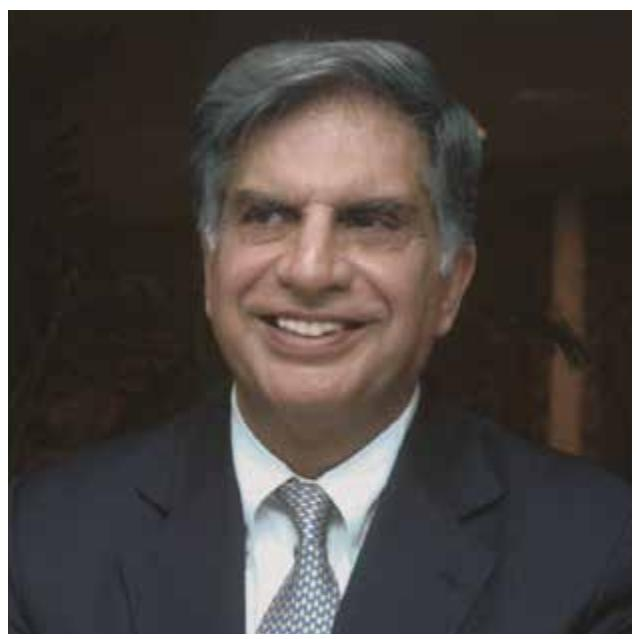

natural_image

Portrait of a smiling man in a suit and tie (no visible text or symbols)

# Padma Vibhushan Ratan N Tata

28 December 1937 – 9 October 2024

It is with a profound sense of loss that we bid farewell to Mr. Ratan Naval Tata, a truly uncommon leader whose immeasurable contributions have shaped not only the Tata Group but also the very fabric of our nation.

For the Tata Group, Mr. Tata was more than a chairperson. He inspired by example. With an unwavering commitment to excellence, integrity and innovation, the Tata Group under his stewardship expanded its global footprint while always remaining true to its moral compass.

Mr. Tata’s dedication to philanthropy and the development of society has touched the lives of millions. From education to healthcare, his initiatives have left a deep-rooted mark that will benefit generations to come. Reinforcing all of this work was Mr. Tata's genuine humility in every individual interaction.

His legacy will continue to inspire us as we strive to uphold the principles he so passionately championed.

# Content

# Introduction

04 About TCS   
06 Board of Directors   
07 Management Team

natural_image

Exterior view of a historic brick building at dusk with illuminated windows and tree branches framing the facade (no signage or text visible)

# Performance Review

08 Letter from the Chairman   
10 Letter from the CEO   
12 The Year Gone by   
16 Awards and Accolades

natural_image

Group of people in business attire stacking hands together (no text or symbols visible)

# Integrated Reporting Framework

18 TCS Integrated Business Model   
20 Financial Capital   
22 Human Capital   
24 Intellectual Capital   
26 Social Capital   
28 Natural Capital

natural_image

Digital concept image showing a hand interacting with a futuristic digital interface featuring charts, gears, and network symbols (no readable text or labels)

# Statutory Section

39 Shareholder Connect

41 Notice

67 Board's Report

79 Management Discussion and Analysis

95 Corporate Governance Report

115 Corporate Social Responsibility

127 Business Responsibility and Sustainability Report

# Consolidated Financial Statements

169 Independent Auditor’s Report

178 Consolidated Balance Sheet

179 Consolidated Statement of Profit and Loss

180 Consolidated Statement of Changes in Equity

182 Consolidated Statement of Cash Flows

184 Notes forming part of the Consolidated Financial Statements

# Standalone Financial Statements

239 Independent Auditor’s Report

250 Standalone Balance Sheet

251 Standalone Statement of Profit and Loss

252 Standalone Statement of Changes in Equity

254 Standalone Statement of Cash Flows

256 Notes forming part of the Standalone Financial Statements

306 Statement under section 129 of the Companies Act, 2013 relating to Subsidiary Companies

# Glossary

309 Glossary

# Sustainability Disclosures

319 Stakeholder Engagement and Identification of Material Topics

322 Scope 3 Baseline Restatement (FY 2020)

323 GRI Content Index

# Customer

# Stories

30

TCS’ AI Powered Drug Design Enables Pharma’s Fight Against Cancer

31

Revolutionizing Employee Experience with GenAl

Transforming Telecommunications with GenAI

32

Digital Transformation of Electoral Roll Management in India

33

A Journey Towards Becoming the Most Trusted Advisor

34

AI - The Game Changer for Logistics and Supply Chain

Transforming Airline Operations with an AI-equipped, Unified Data Platform

35

One step closer to a Net-Zero Grid

36

GenAI Revolutionizing Media Content Analysis

Re-imagining Banking with AI

37

Empowering Education: The British Council Business Transformation

38

Centralizing Custodial Operations with TCS BaNCSTM

# About TCS

Tata Consultancy Services (TCS) is a digital transformation and technology partner of choice for industry-leading organizations worldwide. Since its inception in 1968, TCS has upheld the highest standards of innovation, engineering excellence and customer service.

Rooted in the heritage of the Tata Group, TCS is focused on creating long term value for its clients, its investors, its associates, and the community at large. With a highly skilled workforce of over 607,000 associates in 55 countries and over 200 service delivery centres across the world, the company has been recognized as a top employer in six continents. With the ability to rapidly apply and scale new technologies, the company has built long term partnerships with its clients – helping them emerge as perpetually adaptive enterprises. Many of these relationships have endured into decades and navigated every technology cycle, from mainframes in the 1970s to Artificial Intelligence today.

TCS sponsors 14 of the world’s most prestigious marathons and endurance events, including the TCS New York City Marathon, TCS London Marathon and TCS Sydney Marathon with a focus on promoting health, sustainability, and community empowerment. TCS generated consolidated revenues of US \$30 billion in the fiscal year ended March 31, 2025. For more information, visit www.tcs.com

# Our global presence

# 6 continents. 152 nationalities. 607,000+ associates

North America Latin America Europe UK & Ireland India Asia Pacific Australia & New Zealand Middle East & Africa Japan

<table><tr><td>Argentina</td><td>Luxembourg</td></tr><tr><td>Australia</td><td>Malaysia</td></tr><tr><td>Austria</td><td>Mexico</td></tr><tr><td>Bahrain</td><td>Netherlands</td></tr><tr><td>Belgium</td><td>New Zealand</td></tr><tr><td>Brazil</td><td>Norway</td></tr><tr><td>Bulgaria</td><td>Oman</td></tr><tr><td>Canada</td><td>Peru</td></tr><tr><td>Chile</td><td>Philippines</td></tr><tr><td>China</td><td>Poland</td></tr><tr><td>Colombia</td><td>Portugal</td></tr><tr><td>Czech Republic</td><td>Qatar</td></tr><tr><td>Denmark</td><td>Romania</td></tr><tr><td>Ecuador</td><td>Saudi Arabia</td></tr><tr><td>Estonia</td><td>Singapore</td></tr><tr><td>Finland</td><td>Slovakia</td></tr><tr><td>France</td><td>South Africa</td></tr><tr><td>Germany</td><td>South Korea</td></tr><tr><td>Guatemala</td><td>Spain</td></tr><tr><td>Hong Kong</td><td>Sweden</td></tr><tr><td>Hungary</td><td>Switzerland</td></tr><tr><td>India</td><td>Taiwan</td></tr><tr><td>Indonesia</td><td>Thailand</td></tr><tr><td>Israel</td><td>United Arab Emirates</td></tr><tr><td>Italy</td><td>United Kingdom</td></tr><tr><td>Japan</td><td>Uruguay</td></tr><tr><td>Kuwait</td><td>USA</td></tr></table>

Note: The above map is not to scale and is for illustrative purposes only.

# Perpetually Adaptive Enterprise

The TCS’ FY 2024-25 (FY 2025) Integrated Annual Report highlights the rapidly changing world and role of technology in addressing business problems. Recent years have seen unabating transformation, driven by emerging technologies, geopolitical dynamics, and shifting consumer expectations. Businesses must adapt quickly, anticipate change and turn potential disruptions into strategic advantages. This ongoing evolution requires perpetual adaptation across all business facets.

The ‘Perpetually Adaptive Enterprise’ thrives in uncertainty through rapid innovation, new ways of working, purpose-led sustainable growth, a continuously learning workforce, and seamless ecosystem collaboration. Technology is crucial in achieving these goals, helping organizations anticipate risks and seize opportunities. As AI, data, cloud and digital technologies transform industries, TCS is well prepared to help its clients to perpetually adapt and thrive in an ever-changing world.

Recent Annual Report Themes   
FY 2023   
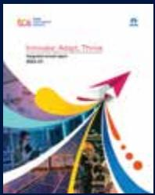

text_image

SCI
Innovative Adapt, Thesis
ISSN 010-0004/2017
ISSN 010-0004/2017

FY 2021

Building on Belief   

natural_image

Exterior view of a modern building with yellow walls and a curved roof, under warm lighting (no signage or text visible)

FY 2024   
Transforming Industries   
Innovate, Adapt, Thrive

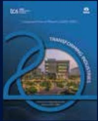

text_image

TRANSFORMING INDUSTRIES

FY 2022

Innovating for Greater Futures   
  
FY 2020

Purpose-driven. Resilient. Adaptable   
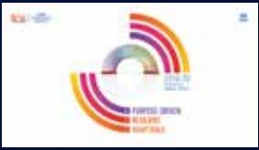

pie

| Category | Value (%) |
|---|---|
| F domestic (10%) | 10 |
| Reserve | 25 |
| Shareful | 30 |
| Unlabeled Segment | 10 |

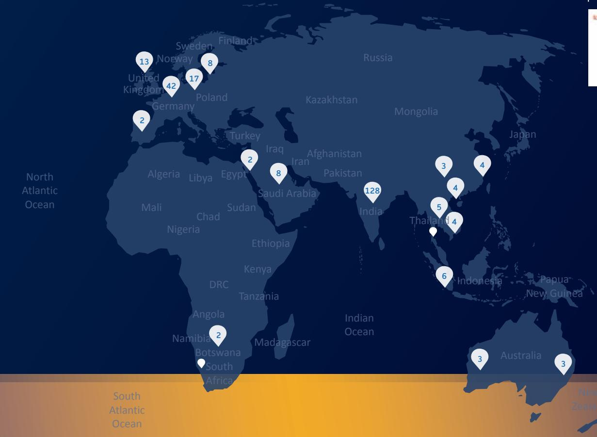

geo

| Country | Value |
|---|---|
| Norway | 13 |
| United Kingdom | 42 |
| Germany | 2 |
| Sweden | 8 |
| Finland | 17 |
| Poland | 17 |
| Turkey | 2 |
| Egypt | 2 |
| Saudi Arabia | 8 |
| India | 128 |
| Russia | 100 |
| Kazakhstan | 100 |
| Mongolia | 100 |
| Japan | 100 |
| Afghanistan | 100 |
| Pakistan | 100 |
| Thailand | 5 |
| Indonesia | 6 |
| Papua New Guinea | 6 |
| Australia | 3 |
| South Africa | 3 |
| Namibia | 2 |
| Botswana | 2 |
| Djibouti | 2 |
| Tanzania | 2 |
| Kenya | 2 |
| Ethiopia | 2 |
| Chad | 2 |
| Sudan | 2 |
| Libya | 2 |
| Algeria | 2 |
| Mali | 2 |
| Nigeria | 2 |
| Angola | 2 |
| Madagascar | 2 |
| South Africa | 2 |
| North Atlantic Ocean | 2 |
| South Atlantic Ocean | 2 |
Indian Ocean | 2 |
| Indian Ocean | 2 |
| South Atlantic Ocean | 2 |
| North Atlantic Ocean | 2 |
| North Atlantic Ocean | 2 |
| North Atlantic Ocean | 2 |
| North Atlantic Ocean | 2 |
| North Atlantic Ocean | 2 |
| North Atlantic Ocean | 2 |
| North Atlantic Ocean | 2 |
| North Atlantic Ocean | 2 |
| North Atlantic Ocean | 2 |
| North Atlantic Ocean | 2 |
| North Atlantic Ocean | 2 |
| North Atlantic Ocean | 2 |
| North Atlantic Ocean | -1 |
| North Atlantic Ocean | -1 |
| North Atlantic Ocean | -1 |
| North Atlantic Ocean | -1 |
| North Atlantic Ocean | -1 |
| North Atlantic Ocean | -1 |
| North Atlantic Ocean | -1 |
| North Atlantic Ocean | -1 |
| North Atlantic Ocean | -1 |
| North Atlantic Ocean | -1 |
| North Atlantic Ocean | -1 |
| North Atlantic Ocean | -1 |
| North Atlantic Ocean | -1 |
| North Pacific Ocean (North Atlantic) | -1 |
| North Pacific Ocean (South Pacific) | -1 |
| North Pacific Ocean (South Pacific) | -1 |
| North Pacific Ocean (South Pacific) | -1 |
| North Pacific Ocean (South Pacific) | -1 |
| North Pacific Ocean (South Pacific) | -1 |
| North Pacific Ocean (South Pacific) | -1 |
| North Pacific Ocean (South Pacific) | -1 |
| North Pacific Ocean (South Pacific) | -1 |
| North Pacific Ocean (South Pacific) | -3 |
| North Pacific Ocean (South Pacific) | -3 |
| North Pacific Ocean (South Pacific) | -3 |
| North Pacific Ocean (South Pacific) | -3 |
| North Pacific Ocean (South Pacific) | -3 |
| North Pacific Ocean (South Pacific) | -3 |
| North Pacific Ocean (South Pacific) | -3 |
| North Pacific Ocean (South Pacific) | -3 |
| North Pacific Ocean (South Pacific) | -3 |
| North Atlantic Ocean (North Atlantic) | -3 |
| North Atlantic Ocean (South Atlantic) | -3 |
| North Atlantic Ocean (South Atlantic) | -3 |
| North Atlantic Ocean (South Atlantic) | -3 |
| North Atlantic Ocean (South Atlantic) | -3 |
| North Atlantic Ocean (South Atlantic) | -3 |
| North Atlantic Ocean (South Atlantic) | -3 |
| North Atlantic Ocean (South Atlantic) | -3 |
| North Atlantic Ocean (South Atlantic) | -3 |
| North Atlantic Ocean (South Atlantic) | 3 |
| North Atlantic Ocean (South Atlantic) | 3 |
| North Atlantic Ocean (South Atlantic) | 3 |
| North Atlantic Ocean (South Atlantic) | 3 |
| North Atlantic Ocean (South Atlantic) | 3 |
| North Atlantic Ocean (South Atlantic) | 3 |
| North Atlantic Ocean (South Atlantic) | 3 |
| North Atlantic Ocean (South Atlantic) | 3 |
| North Atlantic Ocean (South Atlantic) | 3 |
| South Atlantic Ocean (South Africa) | -3 |
| South Atlantic Ocean (South Africa) | -3 |
| South Atlantic Ocean (South Africa) | -3 |
| South Atlantic Ocean (South Africa) | -3 |
| South Atlantic Ocean (South Africa) | -3 |
| South Atlantic Ocean (South Africa) | -3 |
| South Atlantic Ocean (South Africa) | -3 |
| South Atlantic Ocean (South Africa) | -3 |
| South Atlantic Ocean (South Africa) | -3 |
| Southern Canada (North Canada) | -3 |
| Southern Canada (North Canada) | -3 |
| Southern Canada (North Canada) | -3 |
| Southern Canada (North Canada) | -3 |
| Southern Canada (North Canada) | -3 |
| Southern Canada (North Canada) | -3 |
| Southern Canada (North Canada) | -3 |
| Southern Canada (North Canada) | -3 |
| Southern Canada (North Canada) | -3 |
| Southern Canada (North Canada)(North Canada) | -3 |
| Southern Canada (North Canada)(North Canada) | -3 |
| Southern Canada (North Canada)(North Canada) | -3 |
| Southern Canada (North Canada)(North Canada)(North Canada) | -3 |
| Southern Canada (North Canada)(North Canada)(North Canada)(North Canada)(North Canada)(North Canada)(North Canada)(North Canada)(North Canada)(North Canada)(North Canada)(North Canada)(North Canada)(North Canada)(North Canada)(North Canada)(North Canada)(North Canada)(North Canada)(North Canada)(North Canada)(North Canada)(North Canada)(North Canada)(North Canada)(North Canada)(North Canada)(North Canada)(North Canada)(North Canada)(North Canada)(North Canada)(North Canada)(North Canada)(Nigeria, Nigeria, Chad, Egypt, Sudan, Ethiopia, Kenya, Tanzania, Angola, Namibia, Botswana, South Africa, Madagascar, India, Thailand, Pakistan, Afghanistan, Pakistan, Iran, Iraq, Turkey, Germany, Norway, Sweden).

# Board of Directors

Non-Independent, Non-Executive   
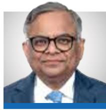

natural_image

Portrait of a man wearing glasses and a suit (no text or symbols visible)

N Chandrasekaran Chairman   

Non-Independent, Executive   
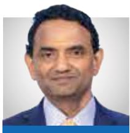

natural_image

Portrait of a man in formal attire (no visible text or symbols)

K Krithivasan

CEO & MD   

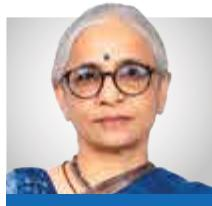

natural_image

Portrait of an elderly woman wearing glasses and a blue top (no visible text or symbols)

Aarthi   
Subramanian   
ED - President   
& COO

Independent, Non-Executive   

natural_image

Portrait of a man in formal attire with a mustache (no visible text or symbols)

Dr Pradeep Kumar Khosla   

natural_image

Portrait photo of a woman with short hair and glasses, wearing a dark top (no text or symbols visible)

Hanne Sorensen   

natural_image

Portrait of a man in formal attire (no visible text or symbols)

Keki Mistry   

natural_image

Portrait of an older man wearing glasses and a suit (no text or symbols visible)

Al-Noor

Ramji   

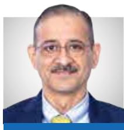

natural_image

Portrait of a man wearing glasses and a suit (no text or symbols visible)

Sanjay V

Bhandarkar   

Average Age (years)   
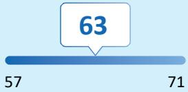

bar

| Value |
|---|
| 63 |
| 57 |
| 71 |

Average Tenure on the Board (years)   
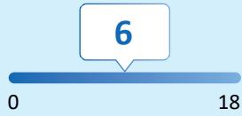

text_image

6
0 18

Average Tenure of Independent Directors on the Board (years)   

text_image

4
0
7

Board Independence   
Independent   
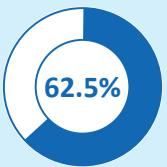

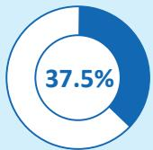  
Non-Independent   
Board Committees   
C Chairman   
M Member

Audit Committee   
Risk Management Committee\*

Nomination and Remuneration Committee   
Corporate Social Responsibility Committee

Stakeholders’ Relationship Committee   
Executive Committee

# Management Team

Corporate 

<table><tr><td>K KrithivasanChief Executive Officer and Managing Director</td><td>Mangesh SatheChief Strategy Officer</td></tr><tr><td>Aarthi SubramanianExecutive Director - President and Chief Operating Officer</td><td>Dr. Harrick VinChief Technology Officer</td></tr><tr><td>Samir SeksariaChief Financial Officer</td><td>Abhinav KumarChief Marketing Officer</td></tr><tr><td>Milind LakkadChief Human Resources Officer</td><td>Madhav AnchanGeneral Counsel Legal</td></tr><tr><td>Sudeep KunnumalChief Human Resources Officer Designate</td><td>Yashaswin ShethCompany Secretary</td></tr></table>

Business Heads 

<table><tr><td colspan="2">Industries</td></tr><tr><td>Susheel VasudevanBanking Financial Services and Insurance</td><td>Anupam SinghalManufacturing</td></tr><tr><td>Shankar NarayananBanking Financial Services and Insurance</td><td>V RajannaTechnology, Software and Services</td></tr><tr><td>Debashis GhoshLife Sciences, Healthcare, Energy, Resources and Utilities</td><td>Akhilesh TiwariCommunications, Media and Information Services</td></tr><tr><td>Krishnan RamanujamConsumer Business Group</td><td></td></tr></table>

Markets 

<table><tr><td>Amit BajajNorth America</td><td>Sapthagiri ChapalapalliEurope</td></tr><tr><td>Amit KapurUK &amp; Ireland</td><td>Girish RamachandranGrowth Markets</td></tr></table>

Services 

<table><tr><td>Siva GanesanAI &amp; Data</td><td>Ashok PaiCognitive Business Operations</td></tr><tr><td>Krishna MohanHybrid Cloud Unit</td><td>Regu AyyaswamyIOT &amp; Digital Engineering</td></tr><tr><td>Vikram KarakotiEnterprise Solutions</td><td>Kamal BhadadaTCS Interactive</td></tr></table>

Ganesa Subramanian Vaikuntam   
Cyber Security

# Letter from the Chairman

The single most transformative force in 2024 was Generative AI. GenAI is not just another tech cycle—it is a civilizational shift. I believe every industry stands to benefit from GenAI.

TCS is proactively leading this change. We have systematically infused AI across our offerings and built intelligent agent solutions throughout the value chain. Looking ahead, we will deliver solutions through a human+AI model, invest in AI infrastructure and forge industry-best partnerships.

# Dear Shareholders,

The financial year 2025 was a year of profound global disruption. Widespread geopolitical conflicts, military escalations, and uncertain trade dynamics severely impacted global supply chains. Over 60 nations went to the polls, stalling policy continuity and reform agendas across several key markets. As a result, businesses worldwide faced significant shocks— ranging from falling production volumes and rising costs to suboptimal asset utilization, impacting profitability and cash flows.

In the face of this turbulence, your company demonstrated exceptional resilience. We partnered closely with our clients to help them perform under pressure while accelerating their transformation agendas. By harnessing the power of

Generative AI and other emerging technologies, we enabled our clients to prepare for the future. The range of transformation is multifaceted and truly profound.

For example, we worked with a client to develop a GenAI–based drug discovery solution that created over 1,300 molecules for a concept target, then assessed synthesizability and shortlisted 12 molecules undergoing in-vitro testing. For another client, we implemented a direct-to-consumer digital solution for the automotive industry, allowing a seamless omnichannel presence and customized vehicle ownership experience. In another case, we modernized 50 million lines of legacy code into a modern AI-powered architecture.

These efforts, alongside many others, contributed to a robust financial performance, with FY 2025 revenue of US \$30 billion and an industry-leading operating margin of 24.3%. Your company was once again recognized as a Global Top Employer for the tenth successive year.

The evolving geopolitical landscape and the emergence of a multipolar world are now reshaping how global businesses operate. We are witnessing the rise of new paradigms, demanding a thorough reimagination of systems, processes, and technologies to improve visibility, reduce costs, and enhance operational throughput. This reimagination includes designing end-to-end traceability across supply chains; diversification of sourcing strategies to build resilience, and region-specific ecosystems to serve decentralized markets.

Simultaneously, we are in the midst of an irreversible transition towards green energy. While jurisdictions vary in pace and regulation, businesses must adapt by developing market-appropriate solutions. Nowhere is this more evident than in the automotive sector. Investments in wind, solar, and small modular reactors (SMRs) are surging, leading to the development of new factories, supply chains, and digital tools that optimize both generation and consumption of energy. Your company has developed an AI-powered clever energy platform that has been helping clients optimize energy consumption, reducing emissions and energy costs.

Yet, the single most transformative force in 2024 was Generative AI. Achieving near-human reasoning capabilities, GenAI is not just another tech cycle, it is a civilizational shift. Its widespread adoption is accelerating, powered by parallel advances in semiconductors, cloud computing, quantum technologies, robotics, and energy innovation. GenAI is already redefining analytics, customer experience, and marketing. The rise of autonomous robots and AI agents promises a future of ‘dark factories’ and AI-assisted enterprise functions.

I believe every industry stands to benefit from GenAI—and the IT industry is no exception. TCS is uniquely positioned to lead this transition. With our domain expertise, deep client relationships, and contextual knowledge, we are the ideal partner for enterprises seeking to build AI-first cultures, transform supply chains, navigate energy transitions, and build resilient and adaptive operations.

However, to lead in this new world, we too must continuously evolve. The path is clear: IT and business services are moving toward autonomous operations. Software development is being redefined by AI-led modernization, as legacy code is being transformed rapidly. Finally, agentic AI is being embedded deeply into enterprise systems.

TCS is proactively leading this change. We have systematically infused AI across our offerings and built intelligent agent solutions throughout the value chain. In 2025, we will have the largest AI-trained workforce in the industry and have launched our enterprise-grade GenAI platform: TCS WisdomNextTM.

Looking ahead, we plan four distinct progressions. First, we establish a large pool of AI agents working alongside our human workforce. Second, we deliver solutions through a human+AI model. Third, we will consciously invest in AI data centers and cloud infrastructure. Fourth, we forge industry-best partnerships with hardware providers, solution innovators, and startups.

This integrated approach will help us bring the best capabilities to every customer, ensuring they are future-ready, resilient, and competitive. We remain steadfastly committed to leading the industry with purpose, innovation, and responsibility.

Thank you for your continued trust and support as we shape the future, together.

Warm regards, N Chandrasekaran Chairman

# Letter from the CEO 1

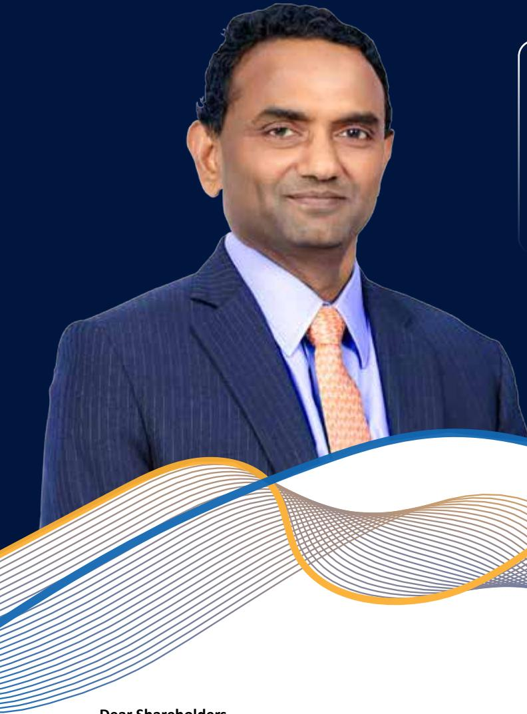

natural_image

Portrait of a man in a suit and tie against a blue background, with abstract wave-like graphics at the bottom (no readable text or symbols)

Significant innovation is happening in the AI ecosystem across infrastructure, data platforms, models and AI native business applications. These innovations are forcing companies to invest in technology modernization and rapidly adopt AI to meet evolving customer expectations.

Our focus on innovation and growth drives us to continuously explore new technologies and business models, ensuring we stay ahead in an ever-evolving landscape.

# Dear Shareholders,

I am pleased to share that in FY 2025, we achieved two extraordinary milestones crossing the US\$30 billion mark in revenues and the US\$20 billion mark in brand value. This success is a testament to the early investments we have made in strengthening client relationships, building intellectual property, deepening employee capabilities and expanding technology ecosystem. I am grateful to every stakeholder for contributing to our growth and success.

In a very challenging geopolitical and macro-economic environment, the company reported an annual revenue of ₹255,324 crore in FY 2025, growing 6.0% year-on-year (4.2% in constant currency). Growth Markets experienced strong demand across key industries, fueled by accelerated digital adoption and

new client acquisitions. Governments invested significantly in digital public services, creating opportunities for TCS to drive large-scale transformation.

Our disciplined execution and operational rigor stood out again, as we delivered industry-leading margins of 24.3%, even as we accelerated investments in talent and expanded capabilities. Our net margin was at 19.0%. Earnings per share were at ₹134.19, a growth of 5.1%2 over the prior year.

Our customer-centric focus and commitment to long-term value creation is well recognized by our clients. We were ranked #1 for customer satisfaction in Europe for the 12th year in a row. The number of clients spending over US\$100 Mn annually, increased to 64 in FY 2025.

The core values of Leading Change, Integrity, Respect for Individual, Excellence and Learning & Sharing strongly bind and unify our 607,979 associates globally. TCS continues to strengthen its brand and has received over 100 awards for its HR practices. Our AI-First approach significantly advanced talent management, learning, and employee engagement. This has led to industry leading retention rates with LTM attrition in IT services at 13.3%.

Our capital allocation policy of returning substantial free cashflow to shareholders has been very consistent. The Board has recommended a final dividend of ₹30 per share, bringing the total dividend for the year to ₹126 per share. For the full year, the company’s shareholder payout was ₹45,588 crore, with a payout ratio of 94%.

We reported a robust Total Contract Value (TCV) of US\$ 39.4 billion. This TCV included a balanced mix of large, medium and small deals, which augurs well for the future. We saw TCV improvement across markets as clients prioritized initiatives around technology modernization, cost optimization, vendor consolidation, operating model transformation, and risk and compliance. We remain closely connected to our customers to help them navigate the challenges impacting their business.

For example, we were selected by Primark, a leading international fashion retailer across 17 countries in Europe and the US, to transform their technology operations to support the retailer’s ambitious plans for global growth over the next five years.

We are also partnering with Xerox in its re-invention strategy, accelerating its transition to a streamlined, services-led, and software-enabled organization. TCS will consolidate Xerox’s technology services to enhance business outcomes, migrate complex legacy data centers to the Azure public cloud, implement a cloud-based Digital ERP platform to revolutionize business processes, and integrate GenAI into operations to foster sustainable growth.

Significant innovation is happening in the AI ecosystem across infrastructure, data platforms, models and AI native business applications. These innovations are forcing companies to invest in technology modernization and rapidly adopt AI to meet evolving customer expectations.

Across industries, clients are increasingly shifting their focus from use case based approach to ROI led scaling of AI. We support them by:

Establishing AI Centers of Excellence for scalable Enterprise AI strategies   
Creating AI Labs for technology experimentation with clients   
Building safe, secure, scalable GenAI as a Service Platforms   
Providing domain AI solutions for business operations with over 150 AI agents   
Delivering GenAI-infused services for Software Engineering, IT operations, Technology Modernization, and Cyber Security   
Setting up sovereign secure Cloud with integrated AI

Given the industry shifts led by AI and the opportunity to drive significant long-term growth, we have announced two key organizational changes effective 1st May 2025. Aarthi Subramanian has joined as President and Chief Operating Officer, working closely with me to help chart the future of our company. We are also pleased to welcome Mangesh Sathe as our new Chief Strategy Officer. Both Aarthi and Mangesh are seasoned, respected leaders whose expertise and vision will play a pivotal role in strengthening our growth journey, refining our organizational structure, and enhancing our operational excellence.

We remain steadfast in our commitment to delivering value to all stakeholders and setting new benchmarks in the IT services industry. Our focus on innovation and growth drives us to continuously explore new technologies and business models, ensuring we stay ahead in an ever-evolving landscape.

We thank you for your continued support and trust in our journey.

Best regards,

K Krithivasan

Chief Executive Officer and Managing Director

# The Year Gone By

# Q4

# Final dividend of ₹30 per share

Announced a final dividend of ₹30 per share, taking the total dividend for the year to ₹126 per share. The company also rewarded its shareholders with a special dividend of ₹66 per share. The total shareholder payout for the year was ₹45,588 crore.

Tata Group Chairman N Chandrasekaran was awarded the UK Knighthood ‘Most Excellent Order of the British Empire’, announced by the UK government, for his services to build UK and India business relations.

Expanded strategic relationship with Northern Trust, to enhance its global securities settlements platform across 99 markets. This collaboration will leverage the TCS BaNCSTM Global Securities Platform for improved trade processing, settlement standardization, and enhanced AI capabilities. This initiative aims to address the increasing liquidity demands and shorten settlement cycles while ensuring compliance with regional practices.

# Partnered with DNB to support its strategic transformation

Aimed to enhance IT operations’ stability and efficiency, helping them adapt to technological changes and meet regulatory requirements in the financial services sector. With this partnership, TCS is expected to help DNB become Europe’s most efficient digital bank by providing application maintenance and development across various IT domains.

Collaborated with MassRobotics, the world’s largest independent robotics hub, to promote robotics innovation across various sectors including retail and transportation. TCS will provide technical expertise and mentorship at their Boston facility, leveraging AI and automation to develop advanced robotics solutions.

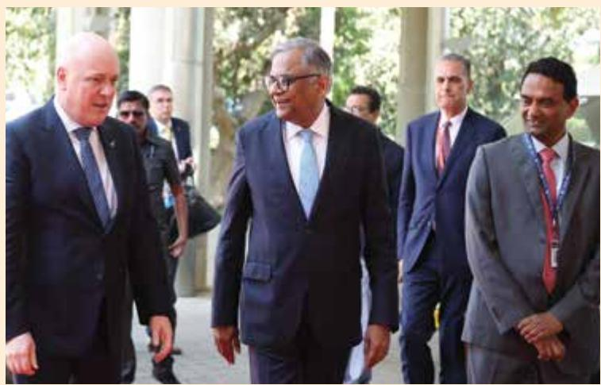

natural_image

Group of men in business suits walking outdoors under classical architecture (no visible text or symbols)

Signed a five-year partnership with Air New Zealand to modernize the airline’s digital infrastructure and position it at the forefront of AI-driven innovation. This collaboration aims to enhance Air New Zealand’s digital capabilities, improve customer experience, and drive operational efficiencies across various aspects of its business, including fleet management, crew scheduling, and ground services.

text_image

FORTUNE
WORLD'S
MOST ADMIRED
COMPANIES
2005

TCS named in the FORTUNE® Magazine 2025 list of the World's Most Admired CompaniesTM

From Fortune. ©2025 Fortune Media IP Limited. All rights reserved. Used under license.

Partnered with Vantage Towers, Europe’s second-largest telecom tower operator, to launch a digital service platform. This platform aims to improve the experience of property owners leasing land for telecom towers, streamline service processes, and enhance retention. TCS will also deploy TCS CrystallusTM for Telecom to accelerate digital transformation.

# TCS has become the second global IT services brand to surpass US\$20 billion

in value, reaching a brand value of US \$21.3 billion, according to Brand Finance. Since 2010, its brand value has grown by 826%, solidifying its leadership in the IT services industry.

# Extended partnership with Coop Danmark

to support the core business system of Denmark’s leading consumer goods retailer. By managing Coop’s enterprise resource planning (ERP) platform on SAP S/4HANA, TCS will enable efficient operations for the retailer and consistent shopping experiences for customers across 900-plus stores.

# TCS now partners with 14

global endurance races, including five World Marathon Major races in New York, London, Chicago, Boston, and Sydney, alongside marathons in Amsterdam, Mumbai, Singapore and Toronto, with participation from over 600,000 runners. These partnerships highlight TCS’ dedication to revolutionizing endurance sports through technology and creating meaningful societal impact beyond the finish line. In 2024 alone, TCS-supported races raised nearly US \$280 million for various charities.

natural_image

Three-panel image showing a race start with runners on podiums, including a finish line and a TCS (TATA CONSULTAN SERVICES) banner (no readable text in panels)

In October 2024, the Tata group, and the entire nation mourned the loss of an extraordinary leader, Padma Vibhushan Mr. Ratan N Tata. His unparalleled wisdom, deep compassion, and unwavering commitment to uplifting lives earned him reverence worldwide. Mr. Tata’s remarkable leadership and genuine care for people have left an indelible mark on everyone at TCS, inspiring the company to carry forward his vision with renewed dedication and passion.

Jaguar TCS Racing became the 2024 ABB FIA Formula E Teams’ World Champions

As the official technology partner, TCS and Jaguar TCS Racing harnessed technology to drive championship performances, striving for a sustainable world on and off the track.

text_image

JAGUAR'S RACING

Extended contract with SPARSH, to continue to streamline and enhance pension services for over 30 lakh defence pensioners in India. TCS has achieved significant reductions in pension processing times and implementing the One Rank One Pension (OROP) scheme, benefiting 1.8 million pensioners.

# Q3

Secured a 15-year contract with Ireland’s Department of Social Protection (DSP) to implement and support the country’s new Auto Enrolment Retirement Savings Scheme, known as “My Future Fund.” This initiative will provide a comprehensive, end-to-end digital solution for automatic enrolment of nearly 800,000 workers in Ireland.

# Signed a multi-year deal to help

Air France-KLM, to become the most data-centric airline group in the world. TCS will modernize the airline group’s data by moving it to cloud and promoting the next generation of data-driven aviation. Air France KLM CEO visited TCS Siruseri premises to celebrate three decades of their partnership with TCS.

natural_image

Two professionals in business attire exchanging a model airplane model, one pointing at it (no visible text or symbols)

# Q2

# Collaborated with NVIDIA

to launch industry-specific solutions and offerings that will help customers adopt AI faster and at scale.

Signed strategic deal to digitally transform

Mansfield Building Society’s Services in the UK.

This transformation will see TCS migrating the Building Society’s digital banking solutions to the cloud and integrating with best-in-class ecosystem partners to enhance accessibility and efficiency across digital and intermediary channels.

# Partnered with Google Cloud to launch AI-Powered cybersecurity solutions

to deal with advanced threats. It leverages capabilities from Google Cloud’s security solutions to strengthen cloud security posture and governance across single, multi, and hybrid cloud environments by embedding security and compliance guardrails throughout the DevSecOps lifecycle.

# Expanded partnership with Rolls-Royce

to advance hydrogen fuel system technology for aviation, with an aim to establish hydrogen as a viable zero-carbon fuel and support them in overcoming challenges in fuel combustion, delivery, and engine integration.

Launched a new delivery centre in Warsaw, Poland, to showcase TCS’ capabilities across industries and technologies. TCS expects to double its workforce to 1,200-plus in a year to support its further growth in the region.

# 20th

Anniversary of TCS’ landmark listing on Indian stock exchanges

In August 2024, TCS celebrated the 20th anniversary of its landmark listing on Indian stock exchanges. The Initial Public Offer, the largest by a private sector company at the time, raised over US \$1 billion, and was oversubscribed 7.7 times, opening at a 41% premium to the issue price of ₹850.

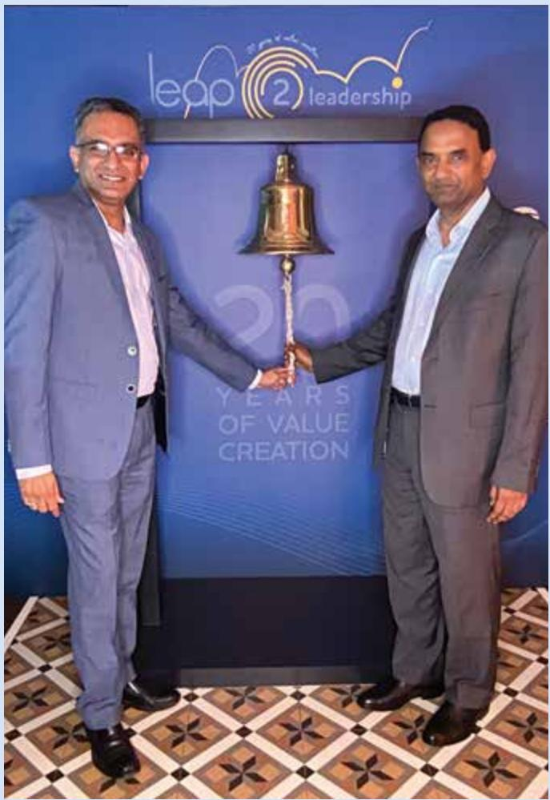

text_image

leap 2 leadership
20
YEARS
OF VALUE
CREATION

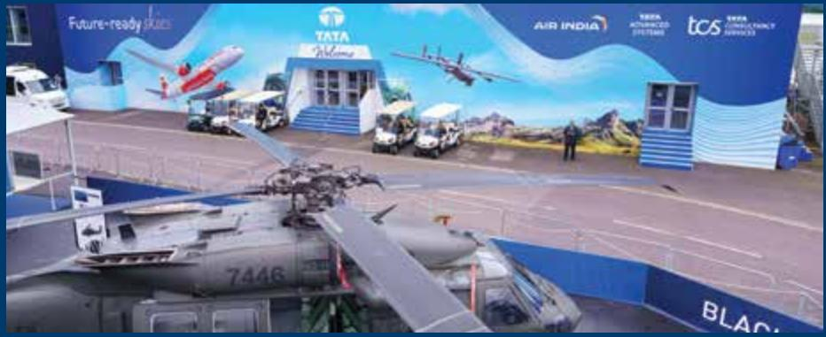

text_image

Future-ready SIZES
TATA
Welcome
AIR INDIA
TCS
BLAD

Showcased commitment to sustainable aerospace transformation at Farnborough International Air show through TCS' strategic partnerships, cutting-edge innovation, and educational initiatives. In discussions with industry experts, TCS highlighted its vision for a greener, more efficient industry powered by AI and alternative fuels.

# Expanded partnership with Xerox

to develop a new agile, cloud-first operating model in an end-to-end transformation program designed to fast track the evolution of the company to a simplified, services-led, software-enabled organization. TCS will consolidate Xerox’s technology services to improve business outcomes, migrate complex legacy data centers to the Azure public cloud and deploy a cloud-based Digital ERP platform to transform business processes and incorporate GenAI into operations to help drive sustainable growth.

# Collaborated with IIT-Bombay to develop India’s first Quantum Diamond Microchip

Imager. This advanced sensing tool will hold the potential to unlock new levels of precision in the examination of semiconductor chips, reduce chip failures and improve the energy efficiency of electronic devices.

# The project is aligned with the

# Government of India’s National Quantum

Mission – an initiative to position the nation as a global quantum technology leader.

# Q1

Launched TCS AI WisdomNextTM - a GenAI aggregation platform that provides unique capabilities to compare GenAI models and tools across cloud services in a single unified interface allowing clients for real-time experimentation across vendor, internal, & open-source LLM models and to accelerate AI adoption at scale.

Opened its doors to pioneering innovation in the fields of IoT, AI, and GenAI with TCS Bringing Life to ThingsTM Lab in Cincinnati, Ohio. The lab enables TCS to assist clients in bringing innovative solutions to life faster and more efficiently.

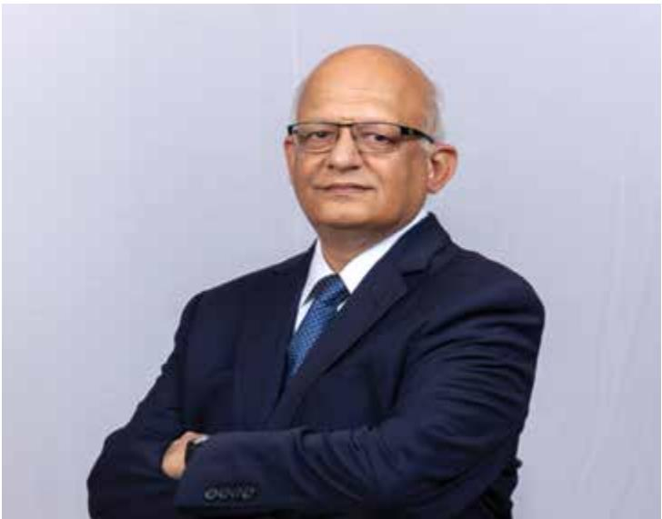

natural_image

Portrait of a bald man in a dark suit and glasses, arms crossed, against a plain light background (no text or symbols visible)

N Ganapathy Subramaniam (NGS) was the COO and Executive Director of TCS since February 2017 and retired in May 2024. With 38 years of experience, he has held many key leadership roles across client delivery, business development, integration of businesses and product development. He has also been highly regarded for his in-depth knowledge of technology trends and contribution to landmark projects.

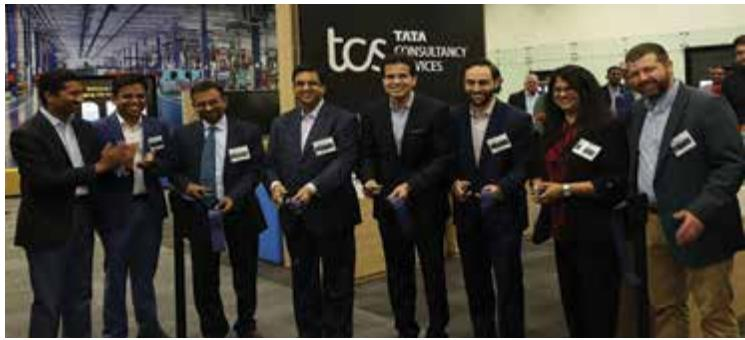

text_image

tcs TATA
CONSULTANCY
VICES

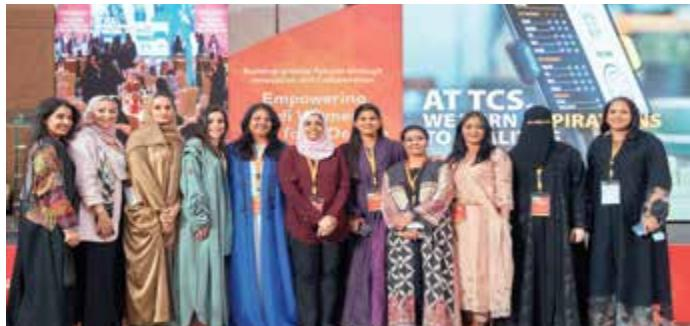

text_image

Empower into
At TCS
WERN
TO
SPIRATIONS

Celebrated a decade of empowering women through our dedicated All-women Digital Services Center in Riyadh. The center’s journey began with a modest team of 20 full-time associates and a single customer. Fast forward to today – the center has trained over 2,300 women over the years and currently serves more than 18 customers over 26 lines of business, including banking, energy, and government.

TCS inaugurated a new TCS Pace Port™ in Paris, with an AI Center of Excellence, which will leverage TCS’ global ecosystem of startups, academia, and research organizations to bring the best of global capabilities to French companies. This was followed by Pace Studio launches in Stockholm (Sweden) and Manila (Philippines).

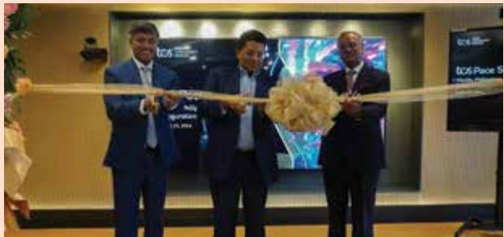

text_image

Photo of a ribbon-cutting ceremony with three men in suits, one holding a ribbon and another string, in front of a backdrop showing 'DCS' logo and text.

# Awards and Accolades

  
Corporate

  
Partner

# Fortune Magazine

One of the World’s Most

Admired Companies, 2025

# Whitelane Research

#1 IT Services Provider for

Customer Satisfaction, Europe

# Oracle

Global Award in

Business Impact, 2024

# Forbes

Leading Management

Consulting firm, North America

# NVIDIA

Rising Star Partner of the

Year Award at GTC 2025

# Oracle

Global Partner

of the Year Award, 2024

# Forbes

One of the World’s Best

Management Consulting Companies

# Amazon Web Services

Data and Analytics Partner of the

Year Award in Global Consulting

# Oracle

Customer Excellence Award, 2024

# SSON Impact Awards –

# North America

Finance Transformation

Impact Award, 2025

# Microsoft

Partner of the Year Award, 2024 for

Global System Integration in Canada

# FICO

Global System

Integrator Award, 2024

# SSON Impact Awards –

# North America

Service Provider of the

Year Award, 2025

# Microsoft

Azure Partner of the Year Award,

2024 in Sweden

# Google Cloud

2024 Partner of the Year Award

for Global Expansion

# CRN Magazine

#2 in Annual Solution

Provider 500 List, North America

# Salesforce

Partner Innovation Award, 2024

# Google Cloud

2024 Data Management and

Talent Development Award for APAC

  
Employee

  
Brand

  
Research & Innovation

# Top Employers Institute

Global Top Employer, 2025

# Brand Finance

#2 global IT services brand, 2025

# Brandon Hall Awards

10 Awards recognizing leadership in Services and Products

# Top Employers Institute

Enterprise- Wide Top Employer Certification

# Kantar BrandZ

Among Top 50 brands in Most Valuable Global Brands

# CIO 100 Symposium & Awards

#1 in IT Innovation for Mitigating Cyber Threats

# LinkedIn

Best Employer Brand at LinkedIn Talent Awards, 2024

# Stevie International Business Awards

15 Awards, including 5 Gold, 5 Silver and 5 Bronze medals across sectors

# TCS Integrated Business Model

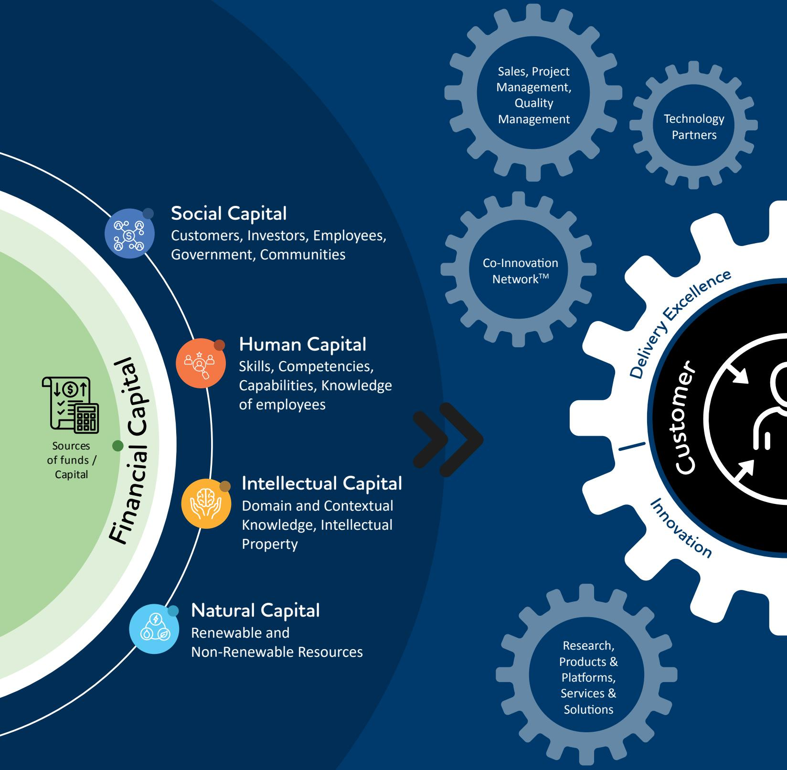

flowchart

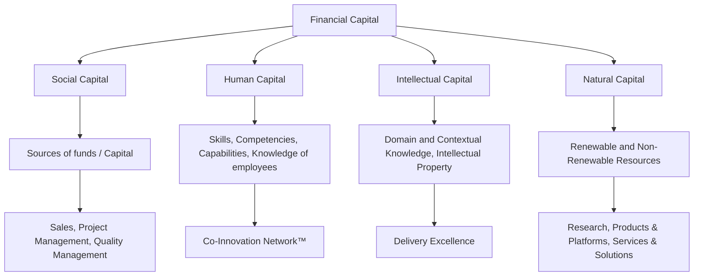
```mermaid
graph TD
    A["Financial Capital"] --> B["Social Capital"]
    A --> C["Human Capital"]
    A --> D["Intellectual Capital"]
    A --> E["Natural Capital"]
    B --> F["Sources of funds / Capital"]
    C --> G["Skills, Competencies, Capabilities, Knowledge of employees"]
    D --> H["Domain and Contextual Knowledge, Intellectual Property"]
    E --> I["Renewable and Non-Renewable Resources"]
    F --> J["Sales, Project Management, Quality Management"]
    G --> K["Co-Innovation Network™"]
    H --> L["Delivery Excellence"]
    I --> M["Research, Products & Platforms, Services & Solutions"]
```

# Value Creation using the Five Capitals

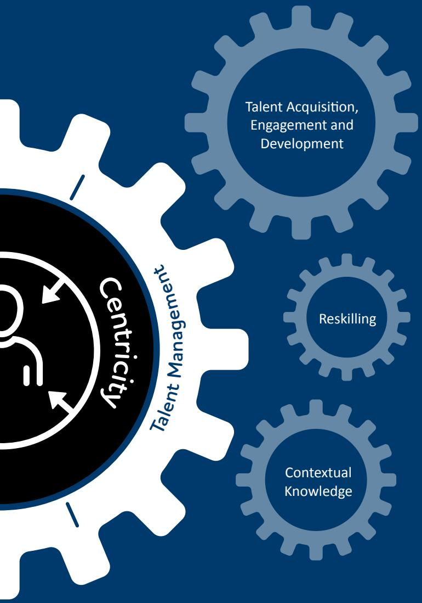

text_image

Talent Acquisition,
Engagement and
Development
Centricity
Talent Management
Reskilling
Contextual
Knowledge

# Foundation of Value Creation Framework

• Strategy for Sustainable Growth | Pg 80   
• Enterprise Risk Management | Pg 88   
• Corporate Governance | Pg 95

Revenue Growth

EPS Growth

Cash Flow

Shareholder Payout

Return on Equity

Customer Engagement

Leadership Ratings

Community Investments

Employment

Skills & Competencies

Health & Wellbeing

Patents

Innovation Ecosystem

Publications

Carbon Footprint Mitigation

Water Conservation & Recycling

Waste Reduction & Recycling

Preserving Biodiversity

# Financial Capital

TCS' success is a testament to its robust business model and its ability to perpetually adapt in a constantly changing technology environment, ensuring it remains relevant to customers while delivering value to all stakeholders.

# Key outcomes include:

Focus on operational excellence and cost optimization, resulting in strong operating margins

Superior profitability, providing the financial strength to invest in new capabilities, Research & Innovation, navigating economic downturns and changing technology waves   
Prudent use of working capital and cash flow management, resulting in robust cash conversion and increased invested funds   
A strong balance sheet with zero debt, further strengthening return ratios   
• Consistently high shareholder returns

# TCS Value Creation and Distribution (FY 2021 - 25)1

Revenue Trend   
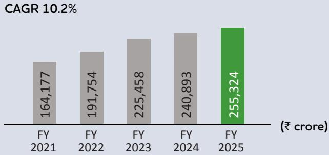

bar

| Year | Value (₹ crore) |
| :--- | :--- |
| FY 2021 | 164,177 |
| FY 2022 | 191,754 |
| FY 2023 | 225,458 |
| FY 2024 | 240,893 |
| FY 2025 | 255,324 |
CAGR 10.2%

In FY 2025, TCS achieved a year-over-year revenue growth of 6.0%, demonstrating a resilient business performance in this uncertain environment.

On a constant currency basis, revenue grew by 4.2%, outpacing the growth in FY 2024.

Over the past five financial years, the company recorded a compound annual growth rate (CAGR) of 10.2%, highlighting the resilience and scalability of its business model.

Operating Profit Trend   
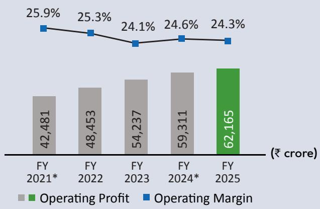

bar_line

| Year | Operating Profit (₹ crore) | Operating Margin (%) |
| :--- | :--- | :--- |
| FY 2021* | 42,481 | 25.9 |
| FY 2022 | 48,453 | 25.3 |
| FY 2023 | 54,237 | 24.1 |
| FY 2024* | 59,311 | 24.6 |
| FY 2025 | 62,165 | 24.3 |

In FY 2025, TCS reported an operating margin of 24.3%, a 30 marginal decline of 30 basis points compared to FY 2024.

This moderation was primarily attributable to the impact of annual wage hikes, associates promotions, and strategic investments in infrastructure and capability development. 20

These cost pressures were partially offset by improvements in workforce utilization, productivity, and realization, along with favourable currency movements.

Earnings Per Share   
CAGR 9.3%   
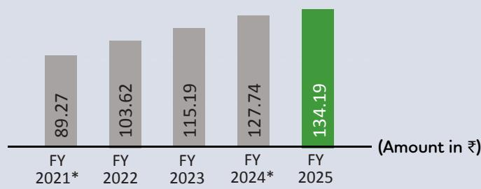

bar

| Fiscal Year | Amount (₹) |
| :--- | :--- |
| FY 2021* | 89.27 |
| FY 2022 | 103.62 |
| FY 2023 | 115.19 |
| FY 2024* | 127.74 |
| FY 2025 | 134.19 |
(Amount in ₹)

TCS has consistently grown its Earnings Per Share (EPS), achieving a CAGR of 9.3% over the past five financial years. This steady increase highlights the company’s growing earnings and its commitment to delivering long-term value to shareholders.

Operating Cash Flow and Cash Conversion   
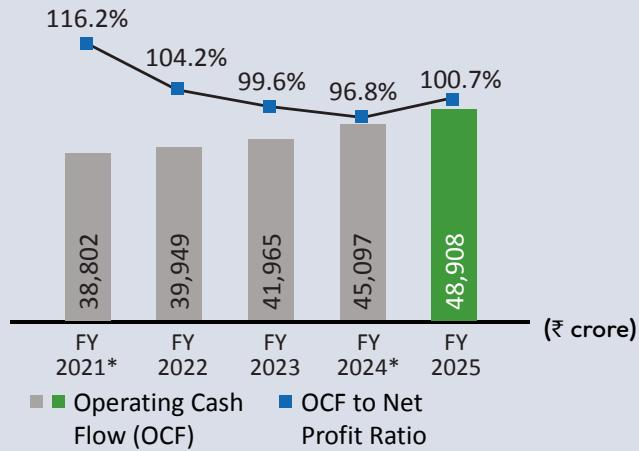

bar_line

| Fiscal Year | Operating Cash Flow (OCF) (₹ crore) | OCF to Net Profit Ratio (%) |
| :--- | :--- | :--- |
| FY 2021* | 38,802 | 116.2 |
| FY 2022 | 39,949 | 104.2 |
| FY 2023 | 41,965 | 99.6 |
| FY 2024* | 45,097 | 96.8 |
| FY 2025 | 48,908 | 100.7 |

TCS maintained an excellent cash conversion ratio exceeding 100%, highlighting its robust financial health and strong ability to generate cash from operations. This efficiency in translating profits to cash flows, enables TCS to meet financial obligations and fund growth initiatives without relying on external financing.

Shareholder Payouts   
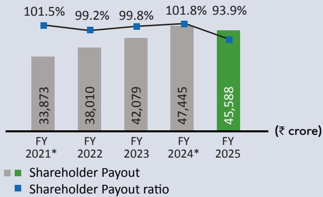

bar_line

| Fiscal Year | Shareholder Payout (₹ crore) | Shareholder Payout ratio (%) |
| :--- | :--- | :--- |
| FY 2021* | 33,873 | 101.5 |
| FY 2022 | 38,010 | 99.2 |
| FY 2023 | 42,079 | 99.8 |
| FY 2024* | 47,445 | 101.8 |
| FY 2025 | 45,588 | 93.9 |

TCS has a practice of returning substantial free cash flow to shareholders and based on the company's performance, the Board of Directors have declared three interim dividends of ₹10 each, a special dividend of ₹66, and recommended a final dividend of ₹30 (pending shareholders' approval at this AGM), for a total dividend of ₹126 per share for FY 2025. TCS has consistently declared dividend every quarter since its listing, complemented by three bonus issues and five buyback offers.

Return on Equity   
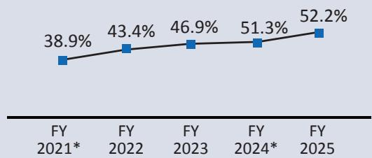

line

| Year | Value (%) |
|---|---|
| FY 2021* | 38.9 |
| FY 2022 | 43.4 |
| FY 2023 | 46.9 |
| FY 2024* | 51.3 |
| FY 2025 | 52.2 |

TCS’ high and improving Return on Equity, reflects the company’s ability to generate strong profitability and manage resources efficiently. This highlights the company’s financial discipline and operational rigor, as well as its judicious use of shareholder capital.

flowchart

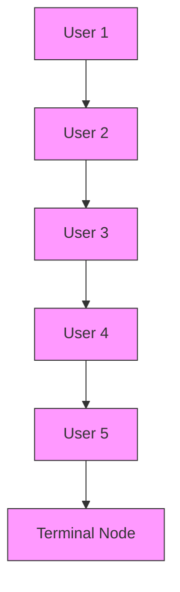
```mermaid
graph TD
    A["User 1"] --> B["User 2"]
    B --> C["User 3"]
    C --> D["User 4"]
    D --> E["User 5"]
    E --> F["Terminal Node"]
    style A fill:#f9f,stroke:#333
    style B fill:#f9f,stroke:#333
    style C fill:#f9f,stroke:#333
    style D fill:#f9f,stroke:#333
    style E fill:#f9f,stroke:#333
    style F fill:#f9f,stroke:#333
```

# Human Capital1

Best in Class Talent Management

607,979

Employees

152

Nationalities

13.3%

LTM attrition in IT services

Workforce

Globally distributed, highly localized

# Talent Acquisition

# Fresher Hiring

42,000

freshers

# Strategic Leadership Program

Focused hiring

from top B-schools

# Gamified Hiring - TCS CodeVita™M

537,000+

registrations

Participation from

100 countries

Academic

Alliances

60+

Leadership visits

46,000+

Students engaged

1,300+

Academicians

# Engagement with Purpose

# Build My Career

12,200

certified mentors

# Know My TCS

400,000+

employees who participated

in Leader Connect Events

# Life long learning

56 Million+

learning hours

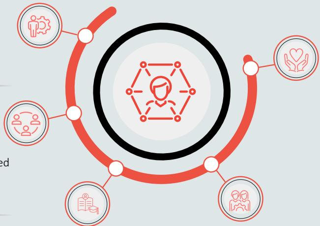

flowchart

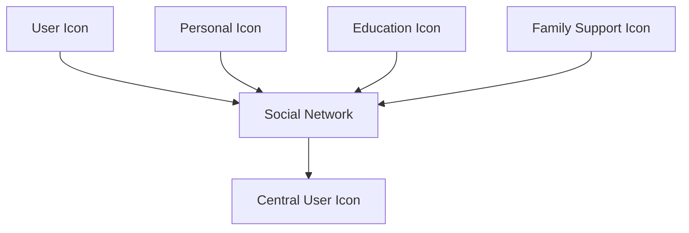
```mermaid
graph TD
    A["User Icon"] --> B["Social Network"]
    C["Personal Icon"] --> B
    D["Education Icon"] --> B
    E["Family Support Icon"] --> B
    B --> F["Central User Icon"]
```

# Living My Values

410,000+

Employee participation in Values sessions and Values Integrated Events

# Health and Wellbeing

116 Million+

distance clocked by 303,000

active associates

150,000+

hours clocked by 125,000

employees practicing Yoga

25,000+

employees benefited from

TCS Cares sessions

# Talent Development

In FY 2025, Talent Development embarked on a transformative journey, launching several key initiatives that revolutionized learning in TCS. This year marked a significant milestone as the company embraced AI/GenAI-first methodologies and fostered competency building in disruptive technologies.

Substantial investments were made to empower associates to experiment with AI, driving unparalleled value for customers and positioning TCS at the forefront of innovation.

# 5.2 million

Competencies acquired

# 100,000+

External certifications acquired

  
Average Learning Hours   
per employee2 96.4

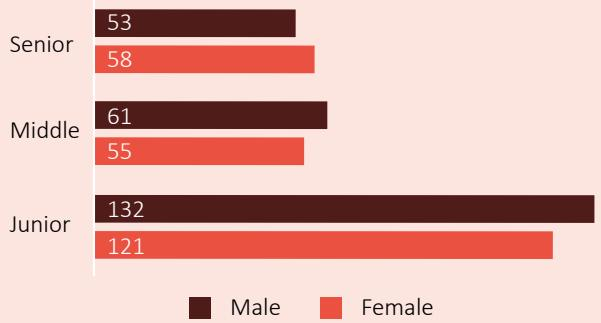

bar

| Category | Male | Female |
|---|---|---|
| Senior | 53 | 58 |
| Middle | 61 | 55 |
| Junior | 132 | 121 |

# Skilling for Al

100,000+

acquired higher order skills in AI/ML and GenAI

natural_image

Abstract circular icon with a stylized human head silhouette containing a chip, surrounded by concentric rings (no text or symbols)

# TCS Elevate

402,000+

pursued learning linked to career growth

# Certifications

Recognized as

#1 in AI & Data certification

across AWS, Google cloud, Microsoft, and GitHub

# Skilling with Al

• AI Interview Coach   
GenAI content creation of course modules and assessment questions   
Simulation-based training, employees practicing on realistic business scenarios   
• AI Communications Coach   
Fresco Play AI Labs for hands-on exploration

natural_image

Illustration of a light bulb with surrounding icons including a pencil, gears, pie chart, and document (no text or symbols)

# Intellectual Capital

# Highlights

6,000+

Researchers and Innovators

4,820 / 8,816

Patents Granted / Filed (cumulative)

239

Top Tier Publications

40+

Research and Innovation centers

51

Academic Partners

7 Pace PortsCo-Innovation Hubs

New York, Amsterdam, Toronto, Pittsburgh, Tokyo, London, Paris

5 Pace Studios

Riyadh, Letterkenny, Sydney, Stockholm, Manila

3,000+

Start-up Partners

# Innovation at Speed and Scale

TCS Innovation ecosystem leverages its capabilities to create significant impacts for organizations, businesses, and society. By harnessing collective intelligence, TCS brings together a diverse ecosystem of partners, including start-ups, developers, design thinkers, and academia, to help enterprises’ refine their innovation strategies.

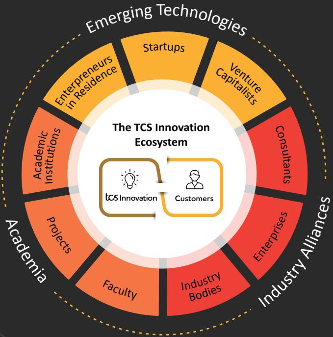

flowchart

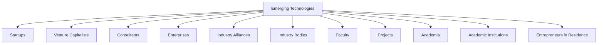
```mermaid
graph TD
    A["Emerging Technologies"] --> B["Startups"]
    A --> C["Venture Capitalists"]
    A --> D["Consultants"]
    A --> E["Enterprises"]
    A --> F["Industry Alliances"]
    A --> G["Industry Bodies"]
    A --> H["Faculty"]
    A --> I["Projects"]
    A --> J["Academia"]
    A --> K["Academic Institutions"]
    A --> L["Entrepreneurs in Residence"]
```

# Inventing for Impact

TCS’ researchers apply scientific rigor and a collaborative mindset to solve pressing problems faced by industry and society. TCS aspires to transform the world by powering innovation and building greater futures.

# Purposeful AI

Today’s AI models can be made purposeful by infusing human ingenuity and contextual knowledge. TCS' inventions systematically integrate predictive intelligence, contextualized decision-making, and humanized semantic interactions in enterprise AI applications.

# Computing Futures

Efficient computing systems will be the backbone for businesses in the future. TCS invents high performance, fault-tolerant, and energy-efficient computing systems to meet the growing demands of AI and physics-based systems.

# Digital Sciences

Digital sciences will transform materials, manufacturing, biology, and human behavior. TCS invents at the intersections of computing and sciences to explore newer approaches to science.

# Sustainable Futures

Sustainable futures will be built by inventing for people and the planet. TCS applies computing to advance energy transition, circularity, environment, social and corporate governance, and sustainable development.

# 40+ years of research and innovation

1981   

Tata Research Development and Design Centre (TRDDC), the nation’s first software research center, established in Pune, India

1990   

Advancing enterprise software development through Model Driven Engineering (MDE). TCS QuartzTM launched

1999   

Enabling forward and reverse engineering of software – TCS MasterCraftTM

2001   

Making millions functionally literate in 50 hours - Launch of Computer based functional literacy

2008   

Transforming IT Infrastructure with AI - TCS eTransform

2006   

Pioneering Data Privacy Research

2006   
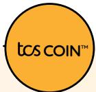

Laying the seeds for Open Innovation - TCS COINTM

2004   

Creating the most cost -effective water purification solution in the world - TCS Sujal

2009   

Digitizing the agriculture sector - TCS mKrishi

2011   

Reimagining Caregiving in Singapore - The Shine Seniors project

2011   
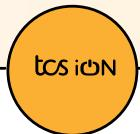

Transforming learning ecosystems - TCS iON launched

2012   
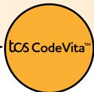

Guinness World Record-winning Global Programming Contest - TCS CodeVitaTM

2016   

Powering Retail with AI - TCS OptumeraTM and TCS OmniStoreTM launched

2016   

Advancing Microbiome Research for Pre-term birth and Colorectal cancer

2015   
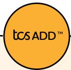

Digitalizing clinical trials - TCS ADDTM launched

2015   
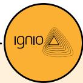

Reimagining IT operations with ignioTM

2018   
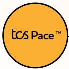

Accelerating Innovation globally with the Launch of TCS PaceTM

2019   

Revolutionizing Sustainability with TCS Clever EnergyTM

2021   

Launching TCS TwinXTM and TCS InTwinTM for a simulable enterprise

2024   

Elevating Excellence in IP Creation. 23 IP creation awards in 5 years

# Social Capital

# Building trust across stakeholders

TCS aims to build stronger bonds with stakeholders, creating value and fostering sustainable relationships with customers, suppliers, communities, partners, analysts, and investors through meaningful change.

# Customers

Customer-centricity is at the core of TCS’ business strategy, driving the company to deliver exceptional outcomes and build strong, lasting relationships. TCS has consistently demonstrated its reliability as a trusted partner for global corporations, providing advanced technology solutions that address complex challenges.

The company's commitment to innovation is further reinforced by its leadership in ever-evolving technology cycles, including AI, data, and cloud. TCS has been ranked #1 in Europe for customer satisfaction, by Whitelane Research for the 12th consecutive year.

Large Client Metrics   
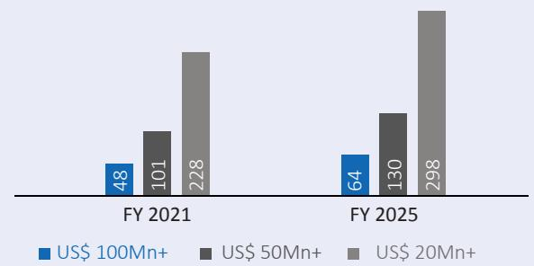

bar

| Year | US$ 100Mn+ | US$ 50Mn+ | US$ 20Mn+ |
| :--- | :--- | :--- | :--- |
| FY 2021 | 48 | 101 | 228 |
| FY 2025 | 64 | 130 | 298 |

TCS engages with customers globally through summits, trade shows, and vendor partner events.

# tos Summit Europe a

TCS' global innovation network includes 11 Pace Ports and Studios, fostering collaboration on cutting-edge solutions through CXO discussions, design thinking, and agile building.

natural_image

Group of people seated at a table in a modern café or bookstore setting, engaged in conversation (no visible text or signage)

# Suppliers

TCS emphasizes responsible sourcing with transparency, sustainability and ethical practices. All suppliers must adhere to TCS’ Supplier Code of Conduct (SCoC), Health, Safety and Environment (HSE) requirements and relevant policies, guiding the company’s procurement practices. The responsible sourcing program covers 100% of TCS’ suppliers.

# Analyst

TCS enhances its analyst relations program through proactive engagement, briefings, and industry evaluations, leveraging insights to strengthen strategic positioning, influence buyer decisions by showcasing capabilities in independent analyst reports. TCS has been ranked as a Leader in analyst competitive surveys across multiple firms covering areas such as AI, GenAI, Analytics, Data and Automation.

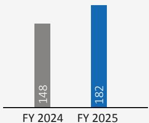

bar

| Year | Value |
|---|---|
| FY 2024 | 148 |
| FY 2025 | 182 |

Assessment in which TCS was ranked a Leader by Research Firms

# Investors

TCS excels in investor outreach with transparency and comprehensive disclosures, effectively communicating strategy, risks, and opportunities.

other

| Metric | Value |
|--------|-------|
| Meetings¹ | 850 |
| Hours | 300 |

# Ecosystem Partners and Alliances

TCS builds deep relationships with hyperscalers, ERP vendors, and niche tech specialists, creating a robust network for customer business transformation.

# Community2

TCS' Corporate Social Responsibility initiatives towards Education, Livelihood, Employment, and Entrepreneurship have driven social transformation by championing the inclusion of marginalized talent

# Education

Ignite My Future - Bringing computational thinking to 266K students and 5.8K educators.

goIT - Creating future innovators benefiting 81K students and 4.2K educators.

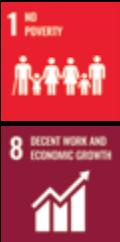

text_image

onal
ucators.
fiting

# Literacy

Literacy as a Service (LaaS)

412K+ adults enabled with functional, financial & digital literacy and access to government entitlements.

# Entrepreneurship

BridgeIT - 1,712 active entrepreneurs in FY 2025 serving digital services to 744K villagers.

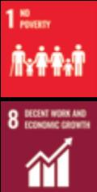

natural_image

Woman in green polka-dot dress holding a notebook outdoors at night (no visible text or symbols)

# Employment

Youth Employment Program (YEP)

Enabling college to career transition for 1,156 beneficiaries.

# Health & Wellness

Tata Medical Center, Kolkata and Cancer Institute, Chennai. Over 282K new patient consultations.

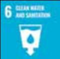

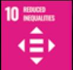

text_image

11. LISH ISLELLIES
AND WORKS
17. PARTNERSHIPS
FOR THE GOALS

# Business with Purpose

Engaged over 130 customers resulting in 10 Purpose Partnerships.

  
₹1,038 crore Global CSR spend

  
14.8 million beneficiaries

146K+ volunteers 8.9 million hours   

natural_image

Group photo collage of people in formal attire, no visible text or symbols

# Natural Capital

The company’s environmental stewardship rests on four pillars: carbon footprint mitigation, water conservation and recycling, waste reduction and recycling, and preserving biodiversity.

# Energy Management and GHG Emissions Reduction

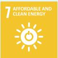

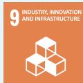

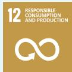

SBTi Near-Term Targets: TCS commits to reduce absolute scope 1 and 2 GHG emissions 90% by FY 2030 from a FY 2016 base year; TCS also commits to reduce absolute scope 3 emissions 35% by FY 2034 from a FY 2020 base year.

# Achievements

Reduced absolute carbon footprint across Scope 1 and Scope 2 by 84% in FY 2025 over a baseline of FY 2016 and 32% reduction in Scope 3 from FY 2020.

# 71%

% total office space (for India) as per Indian Green Building Council standards

# 1.59 PUE

weighted average PUE at TCS data centers

# 79%

Renewable energy as % of total energy consumed

# 10.2 MWp

Rooftop solar generation capacity across TCS campuses

# Initiatives for reduction of Scope 1 and Scope 2 emissions:

# • Energy Efficiency and Optimization

◦ New campuses designed as per green building standard and innovative technology used.   
◦ Optimize operational energy efficiency with real-time monitoring and controls.   
◦ Upgrade legacy equipment/utilities.

# • Green IT

◦ Procurement of energy efficient IT equipment.   
◦ Data center and distributed IT power management.

# • Greater use of Renewable Energy

◦ Maximize roof top solar capacities and RE procurement.

# Planned initiatives for reduction of Scope 3 emissions:

# • Employee Commute

◦ Transition to transport fleet of cabs and buses with EV.   
◦ Employee engagement for use of public transport.

# • Business Travel

◦ Reduce business travel through use of collaborative tools and technology.   
◦ Invest in sustainable aviation fuel (SAF) as and when these are commercially available.

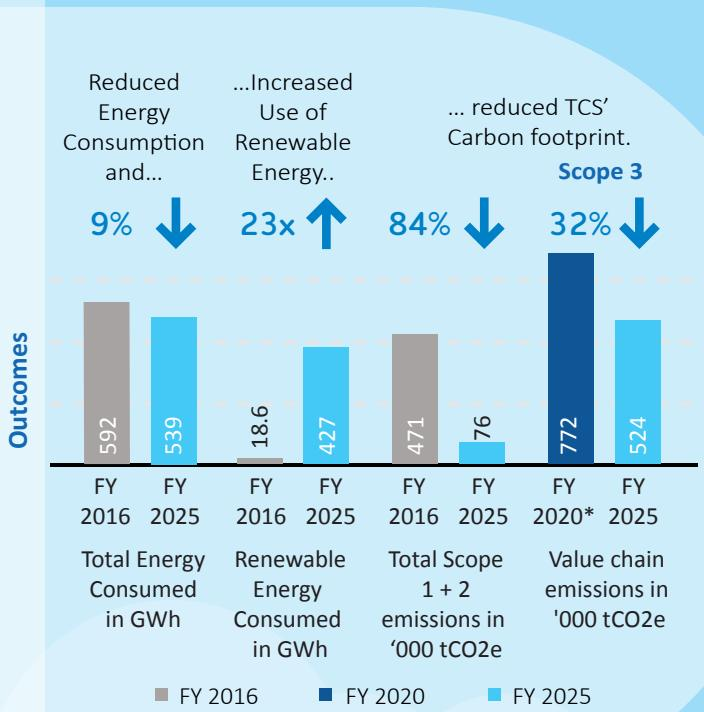

bar

| Year | Category | FY 2016 (GWh) | FY 2025 (GWh) | Total Energy Consumed (GWh) | Renewable Energy Consumed (GWh) | Total Scope 1 + 2 emissions (‘000 tCO2e) | Value chain emissions (‘000 tCO2e) |
| :--- | :--- | :--- | :--- | :--- | :--- | :--- | :--- |
| FY 2016 | Outcomes | 592 | 539 | - | - | - | - |
| FY 2020 | Outcomes | - | - | - | - | - | 772 |
| FY 2025 | Outcomes | - | - | - | - | - | 524 |
Reduction Energy Consumption and...: 9% → ...Increased Use of Renewable Energy: 23x ↑; ... reduced TCS' Carbon footprint: 84% ↓; Scope 3: 32% ↓
Total Energy Consumed in GWh: - Renewable Energy Consumed in GWh: - Renewable Energy Consumed in GWh: - Total Scope 1 + 2 emissions in '000 tCO2e: - Value chain emissions in '000 tCO2e: -

Water Conservation   
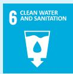

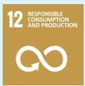

# Target:

100% recycling of treated water in TCS' owned campuses.

# Initiatives:

Initiatives include conservation, sewage treatment and reuse, rainwater harvesting (RWH) and employee awareness. All new campuses have been designed for higher water efficiency, treatment and recycling of sewage, and rainwater harvesting.

# 94%

of treated water reused in owned campus

# 3%

of water sourced from rainwater harvesting

  
Waste Management

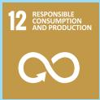

# Target:

To achieve Zero Waste to Landfill (ZWL) for all TCS campuses by 2030.

Initiatives: In FY 2025, 8 TCS campuses have achieved ZWL Certification in addition to 1 campus certified in FY 2024.

# 94%

Food waste treated in biodigesters and organic waste converters in owned campuses.

  
Biodiversity

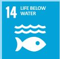

# Target:

Conservation and enhancement initiatives within TCS campuses.

Initiatives: TCS believes in preserving and enriching the biodiversity within its campuses, various initiatives have helped support

• 590+ species of flora   
• 180+ species of fauna

# Customer Stories

# TCS’ AI powered drug design enables pharma’s fight against cancer

A renowned pharmaceutical and biotechnology company, has long been at the forefront of developing prescription products for women's health, cardiology, oncology, hematology and ophthalmology.

Pancreatic cancer is the third-leading cause of death in the age groups of 50 - 79 and projected to become the second highest leading cause of cancer deaths by 2030. For novel drug targets, which involves designing new molecules, the availability of target-specific ligand dataset often remains a challenge. The customer partnered with TCS to identify and optimize the lead candidate.

# Innovative AI Solutions for Drug Design

TCS has leveraged its expertise in artificial intelligence to develop a de novo drug design pipeline. This innovative solution utilizes multiple proprietary GenAI models, including ligand-based, structure-based, and gene expression profile-based models, to explore the vast chemical space. In addition, TCS developed predictive AI models that can predict and optimize drug-like properties such as ADMET, binding affinity, and various toxicities.

# Cutting-Edge Technology for Novel Molecule Design

TCS used proprietary structure-based GenAI and predictive AI tools for novel synthesizable molecules through multi-property optimization, where no prior drug information was available. The model was deployed in customer’s AWS environment and trained using NVIDIA T100.

TCS designed over 1,300 novel molecules with multi-property optimization. Through in-silico screening, over 290 molecules out of this set were shortlisted, and after passing several proprietary filters and synthesizability assessments, 12 molecules were selected for in-vitro assessment by the pharma major.

# Accelerating Drug Design and Reducing Costs

The TCS-built solution has significantly accelerated the drug design process, generating over 290 novel molecules that satisfy drug-like properties in just two months . The molecules were designed against novel target with no prior data on drugs. This automation has reduced the usual 12-month cycle time by more than 80% and was completed in just eight weeks, optimizing costs and saving valuable expert resources for the customer.

# Customer Stories

A leading services company collaborated with TCS to revolutionize their employee experience by leveraging AI, setting a new benchmark in innovation and excellence with a first-of-its-kind people strategy.

TCS engineered a transformative platform, GenAI-powered digital concierge, that delivers personalized self-service while functioning as a technology-enabled talent marketplace. This enhances employee experience and connections to maximize employee potential and opportunities within the organization.

This platform, serving over 100,000 global users, seamlessly integrates essential business functions across more than 35 applications, enabling efficient workflows for over 850 scenarios in diverse domains including learning & development, human capital management, finance, procurement, partner affairs, marketing & sales, hoteling, risk management, legal, and IT services. Leveraging data-driven insights, the platform has significantly improved employee engagement, resulting in a 2% increase in employee productivity and generating substantial savings for the organization.

# Revolutionizing Employee Experience with GenAl

natural_image

Illustration of a pink and white humanoid robot with glowing eyes, surrounded by colorful abstract wave patterns and red gift boxes (no text or symbols)

text_image

Transforming
Telecommunications
with GenAI

Proximus is a leading provider of future-proof connectivity and digital services, operating in both the Benelux region and global markets. TCS partnered with Proximus on their transformation journey of key business and IT functions, delivering tangible outcomes through numerous AI, GenAI interventions.

On business functions, some of the key initiatives include streamlining sales processes from chaotic to a more self-healing one, made possible through identifying key friction points across the customer journey through behavioral analysis. Also, AI was at the core of transforming sales processes, including optimizing sales order process, and driving insights across the order cycle through proactive monitoring.

While transforming the IT side, the focus was to drive efficiency and optimization across software development and operations. TCS helped Proximus embrace GenAI-powered software development, delivering enhanced productivity. Through proactive monitoring of IT operations move more towards predictive maintenance, resulting in enhanced savings across IT operational costs.

These AI-driven initiatives have resulted in real-time personalized promotions, improved customer experience (CX), accelerated product launches, and enhanced developer productivity.

# Customer Stories

# Digital Transformation of Electoral Roll Management in India

For the Election Commission of India – the nation’s poll conducting body – elections start with the preparation of electoral rolls.

Electoral rolls are the backbone of the election process. They are comprehensive lists maintained with stringent guidelines to ensure up-to-date information of electors. The Elector registration and form processing has been the core work of election officials across the nation for maximizing the citizen participation in the elections.  Preparing electoral rolls is a meticulous process that involves identifying eligible electors, collecting data, verifying and making necessary corrections, and continuously updating the roll—and this must be done for hundreds of thousands of citizens, spread across remote villages, dense urban centers, and everything in between.

The election body collaborated with TCS and developed a flagship web-based application ERO Net 2.0, that revolutionized electoral roll management in India. The application managed end-to-end life cycle of electors, and was available nationwide.

ERO Net 2.0 application has a centralized database that serves as the single source of truth for the election body. A standout feature is the executive dashboard, which is updated daily and offers a 360-degree view of the life cycle of electors.

The application is pivotal for providing electoral information quickly to citizens. Electors can update and search their details using their Electoral Photo Identity Card (EPIC) or personal information. In addition, the voter information slip is generated from the application and handed to the electors by booth-level officers, providing all the necessary details about the elector and their polling station.  TCS developed printing tool, has reduced the time to distribute electoral rolls and enhanced security of the electoral rolls data.

The ERO Net 2.0 Suit of applications includes BLO mobile application which plays a critical role for all elections in the country. The application has been used to print over 25 crore EPICs and nearly 125 Crore voter information slips. Over 78 crore electors have been verified through house-to-house surveys. The application is making voting more accessible, more secure, and more inclusive for everyone.

As the primary technology partner, TCS helped the election body give a digital makeover to electoral roll management. The application that TCS developed was rolled-out nationwide within 7 months of launch, with complete functionalities and data migration. It allows over 1.05 million nationwide officials to handle elector registrations, updates, and deletions efficiently.

# Customer Stories

# A journey towards becoming the most trusted advisor

Commonwealth Bank of Australia (CBA), the nation’s largest bank, announced the separation of its wealth business, selling off its majority stake to a private equity firm, Kohlberg, Kravis and Roberts (KKR). This marked the beginning of a new era for Colonial First State (CFS), which emerged as a fully independent entity.

CFS had to transition its entire IT estate, including the member-facing FirstChoice platform, to a CFS-controlled environment within an ambitious timeline. Compounding the complexity, many critical applications were owned by CBA, requiring CFS to build systems from scratch. Additionally, seamless management of over 30 vendors was essential to ensure uninterrupted service delivery and uphold the trust built over 30 years. To meet the evolving needs of its almost 1 million customers and advisors, CFS prioritized building a digital-powered, cloud-ready enterprise.

For over a decade, TCS has been a strategic partner to CFS, supporting numerous initiatives. To aid CFS in this transformative journey, TCS leveraged its innovation ecosystem, partnerships, thought leadership and proprietary solutions to craft a comprehensive transition roadmap.

With expertise from its AI.Cloud business unit, TCS built an enterprise-wide AWS Cloud Foundation from the ground-up to host all FirstChoice applications, enabling enhanced digital experiences for its members. TCS also reimagined CFS’s Customer Correspondence Management and Document Management System using its IP solutions, ensuring security, reliability, and speed.

# ,,

When we needed to select a partner for our transformation program, we wanted to make sure obviously that we found the right capability. We selected TCS as a strategic partner for its almost perfect alignment to our culture - a culture of owning it, making a difference and being client obsessed.

# Jeroen Buwalda

Chief Operating Officer

Colonial First State

Through its global innovation ecosystem, the TCS Co-Innovation NetworkTM (COINTM), TCS brought together fintech startups, researchers, academics, and corporate experts to collaborate on rapid prototyping and solution development. This collaborative approach delivered significant value to CFS. Additionally, TCS supported CFS in rebranding its website, boosting customer recall and brand equity.

The result is a highly scalable, reliable, and efficient cloud-first platform that is empowering CFS to deliver exceptional advisor and member experiences while accelerating time-to-market. This accelerated transformation has positioned CFS as a leader in the Australian superannuation industry, setting the stage for sustained growth and innovation.

# Customer Stories

A global transportation and logistics leader, serving customers in over 200 countries with services like express delivery, freight forwarding, and logistics solutions, has been facing increasing issues with porch piracy and fraud, leading to customer dissatisfaction. In 2023, the Chamber of Commerce reported approximately 44 million packages lost or stolen, amounting to US\$5 billion worth of goods lost.

The logistics provider sought a solution to assess risks and enhance the security of parcel delivery. It leveraged its partnership with TCS to implement an AI-powered solution that used advanced analytics and petabytes of existing data to provide actionable insights i.e. a ‘Confidence score’ that predicts shipping risks at an address-level and allows shippers to reroute high-risk packages to the logistics provider's stores or access points, preventing loss and theft.

This solution enabled merchants and businesses to make smarter, safer shipping decisions even before labels are printed. Additionally, it opened up a new revenue stream for the logistics provider. The solution has a potential to save US\$ 500 million annually in the industry.

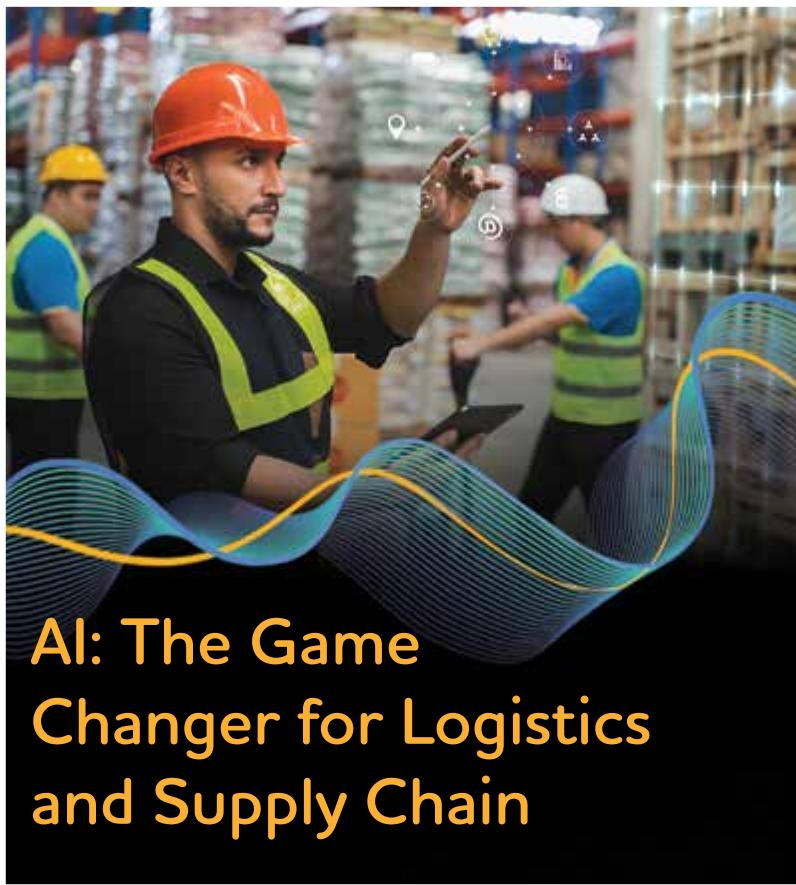

text_image

AI: The Game
Changer for Logistics
and Supply Chain

# Transforming Airline Operations with an AI-equipped, Unified Data Platform

A leading Global Airline had an AI vision – to enable their business users to make intelligent decisions by self-servicing their data needs. However, it’s IT landscape had multiple data platforms, impacting the speed of decision making and the time-to-market, not to mention the high maintenance and licensing costs.

The airline turned to its partner of three decades, TCS, to bring all functions under a unified architecture that is easy-to-manage and capable of enabling self-service analytics features. The modernization provided a business glossary for AI to understand and make meaning out of the data, enabling the business users to “talk-to-data” in natural language to derive insights at a faster pace – driving significantly faster decision making with self-service analytics. TCS delivered a highly customized No-Code data platform that replaced proprietary data tools without losing the extensive features, making information readily available and easy to use even by non-technical business users across Marketing, Customer Loyalty, Operations, Engineering, Revenue Management, and other business divisions.

# Customer Stories

# One step closer to a net-zero grid

National Energy System Operator (NESO) is responsible for ensuring the safe operation of Britain’s electricity network by balancing electricity generation and demand in real time.

To enable accelerated connections of the Distributed Energy Resources (DERs) and to fulfil UK’s Net-Zero goal, NESO is collaborating with various Distributed Network/System Operators (DNO/DSOs) and Transmission Owners (TOs) for the Regional Development Programme (RDP).

RDPs are delivering economic operational solutions, as an alternative to costly transmission network reinforcement, improving the visibility and control of DERs - thereby allowing DERs to connect quicker and lowering cost to end consumers.

TCS as a long-standing partner of NESO, supported to deliver an innovative commercial service and operational model for RDP MW Dispatch to enhance collaboration among NESO, DNO/DSOs and DERs to improve network constraint management.

By leveraging strong domain expertise and contextual understanding of the customer’s priorities, TCS played a significant role to ensure smooth end-to-end delivery of the RDP MW Dispatch - from carrying out feasibility analysis, requirements elicitation, designing, testing, and implementing the solution.

The RDP MW Dispatch service leverages multiple solution platforms for DER registration, contract management, constraints monitoring, scheduling and dispatching of instructions to final settlement.

TCS team collaborated with NESO’s business stakeholders, various platform teams, and wider industry stakeholders to implement the service.

The solution enabled NESO to: Drive toward zero-carbon grid; improve network operability and regulatory adherence; improve whole system outcomes; enhance situational awareness and reduce operating and staffing costs. Introduction of the MW Dispatch service is expected to accelerate the connection of over 1.5GW of generation and battery projects by 10-15 years in the South-East England.

#

This is an amazing achievement and a first-of-its-kind, delivering the type of solution that will shape the future network in finding solutions across the transmission and distribution interface. This also comes at a time when we are working hard to facilitate an increase in connections of renewable energy to our networks, activities such as this directly contribute to that aim. Kudos to all those who were involved.

# Steven Wallace

ESO Network Access Planning Senior Manager

# Customer Stories

A leading global technology company partnered with TCS to transform media content analysis using a GenAI-based solution. This innovative approach generates insights from scripts and video content, enabling personalized recommendations and targeted marketing for viewers. TCS helped the customer with an intelligent, scalable content rating system that analyzes sentiment and context, enabling precise content classification to ensure accurate age ratings and regulatory compliance. This resulted into accelerated and seamless content delivery while enriching the digital viewing experience.

The solution reimagined content indexing and searchability through comprehensive scene-level analysis, boosting viewer engagement and interaction. This transformative approach ensured viewer safety and regulatory compliance by detecting violence, substance use, thus facilitating accurate content warnings and age classifications. By leveraging advanced deep learning models, the solution accelerated content approval turnaround times by 40%, improved the consistency and accuracy of script reviews by 60%, reduced legal risks, and optimized operational costs.

text_image

GenAI
Revolutionizing
Media Content
Analysis

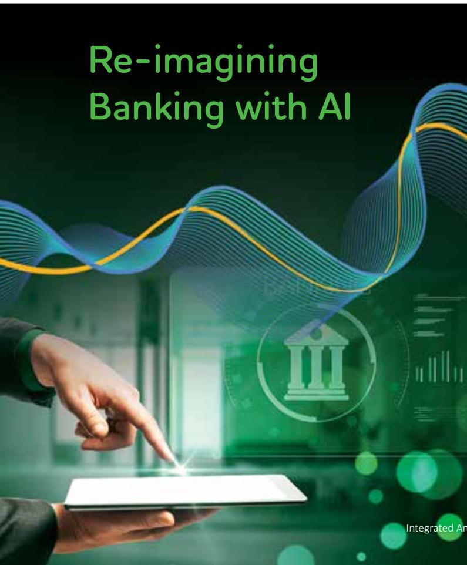

text_image

Re-imagining
Banking with AI
Integrated An

One of the largest UK banks, has taken a significant step to scale its AI capabilities to revolutionize financial services with an aim to provide more personalized, efficient and secure banking experience for its customers. The bank has expanded its strategic partnership with TCS to accelerate the adoption of AI in its journey towards a future, where AI is seamlessly integrated into every aspect of the business.

With its extensive AI & Data expertise and its deep contextual knowledge of customer landscape, TCS is partnering with the bank in establishing a GenAI office to drive enterprise-wide AI adoption, following a thorough assessment of bank’s business and technology stack to define the architecture and roadmap for GenAI implementation.

This provides an environment for colleagues to self-serve GenAI products and models, enabling development from concept to production, supported by frameworks and guardrails to ensure scalable, safe and cost-efficient development of GenAI products. This would significantly help the bank in scaling GenAI implementation, and also in decentralisation & democratisation of AI across the enterprise. With this strategic move, the bank is expected to realise significant cost savings from operational efficiencies and drive revenue growth through product innovation and customer engagement.

# Customer Stories

# Empowering Education: The British Council Business Transformation

The British Council is the UK’s international organisation for cultural relations and educational opportunities, with a presence in more than 100 countries, and reaching 600 million people worldwide for building global connections through education, arts, and the English language.

In September 2023, the British Council set out on an ambitious program to transform its Professional Services function by adopting best-in-class processes, harnessing technology, and creating advantage for long term financial sustainability and growth.

The British Council selected TCS as their preferred partner to support Professional Services Transformation. The engagement included back-office transformation, including people, processes, and technology for Finance, Procurement, Human Resources, Service Desk and Digital & Technology domains.

TCS created a strategic and balanced transformation solution to bring efficiency and strengthen operations across 100+ countries. TCS also enhanced customer experience and standardized processes within a few quarters, which was appreciated by the British Council leadership. TCS reduced time for employee onboarding, reduced ageing debts, improved security posture, and optimized costs.

TCS is also enabling the British Council to seamlessly adapt to the changing regulatory and compliance environment for its business operations globally.

#

Partnering with TCS has accelerated our transformation, driving efficiency, delivering cost savings and service enhancements, and strengthening our global operations. It is a vital step in driving our strategy forward and building a more agile and sustainable British Council.

# Eleanor Hampson

Director of Global Business Services British Council

# Customer Stories

# Centralizing Custodial Operations with TCS BaNCS™

UniCredit Global Securities Services is recognized as the best regional sub-custodian in Central and Eastern Europe (CEE) for over two decades. UniCredit has driven this leadership by constantly refining its business model and client experience through technological evolution.

Unicredit’s customers avail the full range of post trade services, including custody and clearing of remote members’ businesses, FX and cash payments. They selected the TCS BaNCS Global Securities Platform to consolidate their local country IT applications and operations onto a single, integrated platform to standardize securities services across eight countries. The initial objective was to set a strong and sustainable foundation for future growth and expansion while also improving business contingency, risk management, and provide a consistent customer experience.

TCS BaNCS Global Securities Platform’s comprehensive, componentized ISO 20022 and T2S ready solution covering settlements, safekeeping, corporate actions and clearing and its multi-entity and multi-market capabilities made it the ideal solution for UniCredit’s direct access and hub requirement. UniCredit has integrated local, regional and global custody operations onto the common TCS BaNCS platform whose scalable and modern architecture is handling increased transaction volumes while propelling growth in new markets.

The solution has integrated multiple data sources and standardizes outcome distribution across multiple processing environments through standard ISO messages. The alignment to a single integrated platform has transformed the interaction for global clients, with centralized relationship oversight.

# Shareholder Connect

The Company is committed to offer shareholder-centric solutions which addresses specific requirements through fostering technologydriven solutions, strengthening shareholder engagement and creating awareness. The dedicated investor services team addresses queries and cultivates a sense of community, ensuring shareholders feel valued and integral to our success. Some of the initiatives towards shareholder connect are enumerated below:

# Technology-driven solutions

natural_image

Blue line icon of a lightbulb inside a gear shape, symbolizing ideas or innovation (no text or symbols)

The Company has developed eTDS portal to download TDS certificates in a seamless manner. Link to the portal https://on.tcs.com/eTDS-portal   
• Web-based query resolution system developed by Registrar and Transfer Agent (RTA):

 Swayam - A portal to view records, download documents, raise queries, etc. Link to the portal - https://swayam.in.mpms.mufg.com/   
 iDIA - This chatbot provides quick guidance on queries raised or directs shareholders to appropriate channel to resolve their queries. Link to the portal https://in.mpms.mufg.com/

# Strengthening shareholder engagement

Voluntary reminder letters providing details of unclaimed dividends are sent. Details are made available under FAQs on the Company's website at https://on.tcs.com/Investor-FAQs   
For unclaimed dividends, a special cycle of remittance is initiated annually resulting in shareholders receiving their dividend(s) to their updated bank account before they are transfered to Investor Education and Protection Fund (IEPF).   
Annual reminder letters are sent for encouraging shareholders to update their KYC details.   
Integrated Annual Report containing key business updates, financial and non-financial information and other updates for the year is made available on the website of the Company.   
Quarterly financial results are sent to the shareholders whose e-mail IDs are registered.   
Periodic updates through Earnings call, Stock Exchange notifications, Press conferences, Press releases etc. are provided under 'Investors' section on the Company’s website.

natural_image

Abstract geometric pattern of interlocking puzzle pieces in orange outline (no text or symbols)

# Creating awareness

natural_image

Illustration of a hand pointing at a lightbulb with a glowing light source, symbolizing ideas or innovation (no text present)

Personalised tax calculations on dividends paid during the year were provided while sending dividend credit intimations to shareholders whose e-mail IDs are registered.   
A note containing process to claim exemption from tax on dividend and relevant provisions is available at https://on.tcs.com/TDS-Calculations   
A chart explaining procedure to claim dividends and shares transferred to the IEPF is available at https://on.tcs.com/IEPF-procedure-for-claiming

# IEPF related process:

Dividends remaining unclaimed for seven consecutive years are transferred to IEPF along with the shares. Brief procedure for claiming such dividends and shares from IEPF Authority is as under:

# Step-1

Submit self-attested copy of required documents to the Company/RTA to obtain Entitlement Letter

# Step-2

Submit web form IEPF 5 on MCA portal www.mca.gov.in

Send self attested copy of web form IEPF 5 along with attachments to the Company/RTA

# Step-3

The Company to submit e-verification report to IEPF Authority

# Step-4

IEPF Authority to approve the claim or seek clarifications

Detailed procedure is available at https://on.tcs.com/IEPF-procedure-for-claiming

Details of unclaimed dividend(s) due for transfer to IEPF during FY 2026:

<table><tr><td>Dividend declaration date</td><td>Rate of dividend ₹ per share</td><td>Last date to claim unpaid dividend</td></tr><tr><td>June 15, 2018</td><td>29</td><td>July 15, 2025</td></tr><tr><td>July 10, 2018</td><td>4</td><td>August 9, 2025</td></tr><tr><td>October 11, 2018</td><td>4</td><td>November 10, 2025</td></tr><tr><td>Janurary 10, 2019</td><td>4</td><td>February 9, 2026</td></tr></table>

# Online Dispute Resolution (ODR) Portal:

A common ODR Portal (https://smartodr.in/login) has been established by SEBI to raise disputes arising in the Indian Securities Market. Post exhausting the option to resolve their grievances through RTA or the Company or SCORES platform, the investors can initiate dispute resolution through the ODR Portal. For more details visit: https://on.tcs.com/ODRPortal

# KYC update:

Shareholders holding shares in physical mode can update their KYC details i.e. (i) PAN (ii) Contact details (address, mobile no. & e-mail ID) (iii) Specimen Signature (iv) Bank details (Bank & Branch name, account no., MICR and IFSC) with the RTA/ Company.

The relevant forms for registering/updating KYC details are available at https://in.mpms.mufg.com/ (under - Resources > Downloads > KYC)

Key information related to AGM: 

<table><tr><td>S/N</td><td>Particulars</td><td>Details</td></tr><tr><td>1</td><td>Date and time of AGM</td><td>Thursday, June 19, 2025, at 3:00 p.m. (IST)</td></tr><tr><td>2</td><td>Record date for Final Dividend</td><td>Wednesday, June 4, 2025</td></tr><tr><td>3</td><td>Date of payment of Final Dividend (if approved at the AGM)</td><td>Tuesday, June 24, 2025</td></tr><tr><td>4</td><td>E-voting start date and time</td><td>Sunday, June 15, 2025 from 9:00 a.m. (IST)</td></tr><tr><td>5</td><td>E-voting end date and time</td><td>Wednesday, June 18, 2025 till 5:00 p.m. (IST)</td></tr></table>

text_image

Notice

Notice is hereby given that the thirtieth Annual General Meeting (“AGM”) of Tata Consultancy Services Limited (“the Company” or “TCS”) will be held on Thursday, June 19, 2025, at 3:00 p.m. (IST) through Video Conferencing (“VC”)/Other Audio Visual Means (“OAVM”) to transact the following business:

# Ordinary Business

1. To receive, consider and adopt:

a. the Audited Standalone Financial Statements of the Company for the financial year ended March 31, 2025, together with the Reports of the Board of Directors and the Auditors thereon; and   
b. the Audited Consolidated Financial Statements of the Company for the financial year ended March 31, 2025, together with the Report of the Auditors thereon.

2. To confirm the payment of Interim Dividends (including a special dividend) on Equity Shares and to declare a Final Dividend on Equity Shares for the financial year ended March 31, 2025.   
3. To appoint a Director in place of Aarthi Subramanian (DIN 07121802), who retires by rotation and being eligible, offers herself for re-appointment.

# Special Business

# 4. To appoint Aarthi Subramanian as a Whole-time Director designated as “Executive Director - President and Chief Operating Officer”

To consider and, if thought fit, to pass the following resolution as an Ordinary Resolution:

“RESOLVED THAT pursuant to Sections 196, 197, 203 and other applicable provisions, if any, of the Companies Act, 2013 (“Act”) (including any statutory modification(s) or amendment(s) or re-enactment(s) thereof) read with Schedule V of the Act, and the Companies (Appointment and Remuneration of Managerial Personnel) Rules, 2014, as amended from time to time, the consent of the Company be and is hereby accorded for appointment and terms of remuneration of Aarthi Subramanian (DIN 07121802) as a Whole-time Director designated as “Executive Director - President and Chief Operating Officer” of the Company for a period of five years commencing from May 1, 2025 to April 30, 2030, as recommended by Nomination and Remuneration Committee and approved by the Board of Directors, upon the terms and conditions set out in the Explanatory Statement annexed to the Notice convening this Annual General Meeting (including the remuneration to be paid in the event of loss or inadequacy of profits in any financial year during the tenure of her appointment), with authority to the Board of Directors to alter and vary the terms and conditions of the said appointment in such manner as may be agreed to between the Board of Directors and Aarthi Subramanian.”

“RESOLVED FURTHER THAT the Board of Directors of the Company (which term shall be deemed to herein after include any Committee of the Board constituted to exercise its powers, including the powers conferred by this Resolution), be and is hereby authorised to take all such steps as may be necessary, proper and expedient to give effect to this Resolution.”

# 5. To appoint Secretarial Auditors of the Company

To consider and, if thought fit, to pass the following resolution as an Ordinary Resolution:

“RESOLVED THAT pursuant to Section 204 and other applicable provisions, if any, of the Companies Act, 2013, Rule 9 of the Companies (Appointment and Remuneration of Managerial Personnel) Rules, 2014 and Regulation 24A of the Securities and Exchange Board of India (Listing Obligations and Disclosure Requirements) Regulations, 2015 (“SEBI Listing Regulations”), other applicable laws/statutory provisions, if any, as amended from time to time, Parikh & Associates, Practising Company Secretaries (Firm Registration Number P1988MH009800) be and are hereby appointed as Secretarial Auditors of the Company for term of five consecutive years commencing from financial year 2025-26 till financial year 2029-30, at such fees, plus applicable taxes and other out-of-pocket expenses as may be mutually agreed upon between the Board of Directors of the Company and the Secretarial Auditors.”

# 6. To approve material related party transactions with Tata Capital Limited

To consider and, if thought fit, to pass the following resolution as an Ordinary Resolution:

“RESOLVED THAT pursuant to the Regulations 2(1)(zc), 23(4) and other applicable Regulations of the Securities and Exchange Board of India (Listing Obligations and Disclosure Requirements) Regulations, 2015 (“SEBI Listing Regulations”), as amended from time to time, the applicable provisions of the Companies Act, 2013 (“Act”) read with Rules made thereunder, other applicable laws/statutory provisions, if any [including any statutory modification(s) or amendment(s) or re-enactment(s) thereof, for the time being in force], the Company’s Policy on Related Party Transactions and subject to such approval(s), consent(s), permission(s) as may be necessary from time to time and basis the approval and recommendation of the Audit Committee and the Board of Directors of the Company, approval of the Members of the Company be and is hereby accorded to the Board of Directors of the Company to enter/continue to enter into Material Related Party Transaction(s)/Contract(s)/ Arrangement(s)/Agreement(s) (whether by way of an individual transaction or transaction taken together or series of transactions or otherwise) with Tata Capital Limited, a related party pursuant to Section 2(76) of the Act and Regulation 2(1)(zb) of the SEBI Listing Regulations, during financial year 2025-26, for an aggregate value not exceeding \`5,300 crore, on such material terms and conditions as detailed in the explanatory statement to this Resolution and as may be mutually agreed between the related party and the Company, provided that the said Transaction(s)/ Contract(s)/Arrangement(s)/Agreement(s) shall be carried out in the ordinary course of business and at arm’s length basis.”

“RESOLVED FURTHER THAT the Board of Directors of the Company (hereinafter referred to as ‘Board’ which term shall be deemed to include the Audit Committee of the Company and any duly constituted/to be constituted Committee of Directors thereof to exercise its powers including powers conferred under this resolution) be and is hereby authorized to do all such acts, deeds, matters and things as it may deem fit at its absolute discretion and to take all such steps as may be required in this connection including finalizing and executing necessary contract(s), scheme(s), agreement(s) and such other documents as may be required, seeking all necessary approvals to give effect to this resolution, for and on behalf of the Company and settling all such issues, questions, difficulties or doubts whatsoever that may arise and to take all such decisions from powers herein conferred to, without being required to seek further consent or approval of the Members and that the Members shall be deemed to have given their approval thereto expressly by the authority of this resolution.”

“RESOLVED FURTHER THAT the Board be and is hereby authorised to delegate all or any of the powers herein conferred to any Director(s) or Chief Financial Officer or Company Secretary or any other Officer(s)/Authorised

Representative(s) of the Company, to do all such acts and take such steps, as may be considered necessary or expedient, to give effect to the aforesaid resolution(s).”

“RESOLVED FURTHER THAT all actions taken by the Board in connection with any matter referred to or contemplated in this resolution, be and are hereby approved, ratified and confirmed in all respects.”

# 7. To approve material related party transactions with Tata Capital Housing Finance Limited

To consider and, if thought fit, to pass the following resolution as an Ordinary Resolution:

“RESOLVED THAT pursuant to the Regulations 2(1)(zc), 23(4) and other applicable Regulations of the Securities and Exchange Board of India (Listing Obligations and Disclosure Requirements) Regulations, 2015 (“SEBI Listing Regulations”), as amended from time to time, the applicable provisions of the Companies Act, 2013 (“Act”) read with Rules made thereunder, other applicable laws/statutory provisions, if any [including any statutory modification(s) or amendment(s) or re-enactment(s) thereof, for the time being in force], the Company’s Policy on Related Party Transactions and subject to such approval(s), consent(s), permission(s) as may be necessary from time to time and basis the approval and recommendation of the Audit Committee and the Board of Directors of the Company, approval of the Members of the Company be and is hereby accorded to the Board of Directors of the Company to enter/continue to enter into Material Related Party Transaction(s)/Contract(s)/ Arrangement(s)/Agreement(s) (whether by way of an individual transaction or transaction taken together or series of transactions or otherwise) with Tata Capital Housing Finance Limited, a related party pursuant to Section 2(76) of the Act and Regulation 2(1)(zb) of the SEBI Listing Regulations, during financial year 2025-26, for an aggregate value not exceeding \`5,000 crore, on such material terms and conditions as detailed in the explanatory statement to this Resolution and as may be mutually agreed between the related party and the Company, provided that the said Transaction(s)/Contract(s)/Arrangement(s)/Agreement(s) shall be carried out in the ordinary course of business and at arm’s length basis.”

“RESOLVED FURTHER THAT the Board of Directors of the Company (hereinafter referred to as ‘Board’ which term shall be deemed to include the Audit Committee of the Company and any duly constituted/to be constituted Committee of Directors thereof to exercise its powers including powers conferred under this resolution) be and is hereby authorized to do all such acts, deeds, matters and things as it may deem fit at its absolute discretion and to take all such steps as may be required in this connection including finalizing and executing necessary contract(s), scheme(s), agreement(s) and such other documents as may be required, seeking all necessary approvals to give effect to this resolution, for and on behalf of the Company and settling all such issues, questions, difficulties or doubts whatsoever that may arise and to take all such decisions from powers herein conferred to, without being required to seek further consent or approval of the Members and that the Members shall be deemed to have given their approval thereto expressly by the authority of this Resolution.”

“RESOLVED FURTHER THAT the Board be and is hereby authorised to delegate all or any of the powers herein conferred to any Director(s) or Chief Financial Officer or Company Secretary or any other Officer(s)/Authorised Representative(s) of the Company, to do all such acts and take such steps, as may be considered necessary or expedient, to give effect to this Resolution.”

“RESOLVED FURTHER THAT all actions taken by the Board in connection with any matter referred to or contemplated in this Resolution, be and are hereby approved, ratified and confirmed in all respects.”

# 8. To approve material related party transactions with Tejas Networks Limited

To consider and, if thought fit, to pass the following resolution as an Ordinary Resolution:

“RESOLVED THAT pursuant to the Regulations 2(1)(zc), 23(4) and other applicable Regulations of the Securities and Exchange Board of India (Listing Obligations and Disclosure Requirements) Regulations, 2015 (“SEBI Listing Regulations”), as amended from time to time, the applicable provisions of the Companies Act, 2013 (“Act”) read with Rules made thereunder, other applicable laws/statutory provisions, if any [including any statutory modification(s) or amendment(s) or re-enactment(s) thereof, for the time being in force], the Company’s Policy on Related Party Transactions and subject to such approval(s), consent(s), permission(s) as may be necessary from time to time and basis the approval and recommendation of the Audit Committee and the Board of Directors of the Company, approval of the Members of the Company be and is hereby accorded to the Board of Directors of the Company to enter/continue to enter into Material Related Party Transaction(s)/Contract(s)/ Arrangement(s)/Agreement(s) (whether by way of an individual transaction or transaction taken together or series of transactions or otherwise) with Tejas Networks Limited, a related party pursuant to Section 2(76) of the Act and Regulation 2(1)(zb) of the SEBI Listing Regulations during financial year 2025-26, for an aggregate value not exceeding \`5,000 crore, on such material terms and conditions as detailed in the explanatory statement to this Resolution and as may be mutually agreed between the related party and the Company, provided that the said Transaction(s)/ Contract(s)/Arrangement(s)/Agreement(s) shall be carried out in the ordinary course of business and at arm’s length basis.”

“RESOLVED FURTHER THAT the Board of Directors of the Company (hereinafter referred to as ‘Board’ which term shall be deemed to include the Audit Committee of the Company and any duly constituted/to be constituted Committee of Directors thereof to exercise its powers including powers conferred under this resolution) be and is hereby authorized to do all such acts, deeds, matters and things as it may deem

fit at its absolute discretion and to take all such steps as may be required in this connection including finalizing and executing necessary contract(s), scheme(s), agreement(s) and such other documents as may be required, seeking all necessary approvals to give effect to this resolution, for and on behalf of the Company and settling all such issues, questions, difficulties or doubts whatsoever that may arise and to take all such decisions from powers herein conferred to, without being required to seek further consent or approval of the Members and that the Members shall be deemed to have given their approval thereto expressly by the authority of this Resolution.”

“RESOLVED FURTHER THAT the Board be and is hereby authorised to delegate all or any of the powers herein conferred to any Director(s) or Chief Financial Officer or Company Secretary or any other Officer(s)/Authorised Representative(s) of the Company, to do all such acts and take such steps, as may be considered necessary or expedient, to give effect to this Resolution.”

“RESOLVED FURTHER THAT all actions taken by the Board in connection with any matter referred to or contemplated in this Resolution, be and are hereby approved, ratified and confirmed in all respects.”

# 9. To approve material related party transactions with Jaguar Land Rover Limited

To consider and, if thought fit, to pass the following resolution as an Ordinary Resolution:

“RESOLVED THAT pursuant to the Regulations 2(1)(zc), 23(4) and other applicable Regulations of the Securities and Exchange Board of India (Listing Obligations and Disclosure Requirements) Regulations, 2015 (“SEBI Listing Regulations”), as amended from time to time, the applicable provisions of the Companies Act, 2013 (“Act”) read with Rules made thereunder, other applicable laws/statutory provisions, if any [including any statutory modification(s) or amendment(s) or re-enactment(s) thereof, for the time being in force], the Company’s Policy on Related Party Transactions and subject to such approval(s), consent(s), permission(s) as may be necessary from time to time and basis the approval and recommendation of the Audit Committee and the Board of Directors of the Company, approval of the Members of the Company be and is hereby accorded to the Board of Directors of the Company to enter/continue to enter into Material Related Party Transaction(s)/Contract(s)/ Arrangement(s)/Agreement(s) (whether by way of an individual transaction or transaction taken together or series of transactions or otherwise) with Jaguar Land Rover Limited, a related party pursuant to Regulation 2(1)(zb) of the SEBI Listing Regulations, during financial year 2025-26, for an aggregate value not exceeding \`4,400 crore, on such material terms and conditions as detailed in the explanatory statement to this Resolution and as may be mutually agreed between the related party and the Company, provided that the said Transaction(s)/Contract(s)/Arrangement(s)/ Agreement(s) shall be carried out in the ordinary course of business and at arm’s length basis.”

“RESOLVED FURTHER THAT the Board of Directors of the Company (hereinafter referred to as ‘Board’ which term shall be deemed to include the Audit Committee of the Company and any duly constituted/to be constituted Committee of Directors thereof to exercise its powers including powers conferred under this resolution) be and is hereby authorized to do all such acts, deeds, matters and things as it may deem fit at its absolute discretion and to take all such steps as may be required in this connection including finalizing and executing necessary contract(s), scheme(s), agreement(s) and such other documents as may be required, seeking all necessary approvals to give effect to this resolution, for and on behalf of the Company and settling all such issues, questions, difficulties or doubts whatsoever that may arise and to take all such decisions from powers herein conferred to, without being required to seek further consent or approval of the Members and that the Members shall be deemed to have given their approval thereto expressly by the authority of this Resolution.”

“RESOLVED FURTHER THAT the Board be and is hereby authorised to delegate all or any of the powers herein conferred to any Director(s) or Chief Financial Officer or Company Secretary or any other Officer(s)/Authorised Representative(s) of the Company, to do all such acts and take such steps, as may be considered necessary or expedient, to give effect to this Resolution.”

“RESOLVED FURTHER THAT all actions taken by the Board in connection with any matter referred to or contemplated in this Resolution, be and are hereby approved, ratified and confirmed in all respects.”

# 10. To approve material related party transactions with Tata Consultancy Services Japan, Ltd. (a non-wholly owned subsidiary)

To consider and, if thought fit, to pass the following resolution as an Ordinary Resolution:

“RESOLVED THAT pursuant to the Regulations 2(1)(zc), 23(4) and other applicable Regulations of the Securities and Exchange Board of India (Listing Obligations and Disclosure Requirements) Regulations, 2015 (“SEBI Listing Regulations”), as amended from time to time, the applicable provisions of the Companies Act, 2013 (“Act”) read with Rules made thereunder, other applicable laws/statutory provisions, if any [including any statutory modification(s) or amendment(s) or re-enactment(s) thereof, for the time being in force], the Company’s Policy on Related Party Transactions and subject to such approval(s), consent(s), permission(s) as may be necessary from time to time and basis the approval and recommendation of the Audit Committee and the Board of Directors of the Company, approval of the Members of the Company be and is hereby accorded to the Board of Directors of the Company to enter/continue to enter into Material Related Party Transaction(s)/Contract(s)/ Arrangement(s)/Agreement(s) (whether by way of an individual transaction or transaction taken together or series of transactions or otherwise) with Tata Consultancy

Services Japan, Ltd., a related party pursuant to Section 2(76) of the Act and Regulation 2(1)(zb) of the SEBI Listing Regulations, during financial year 2025-26 for an aggregate value not exceeding \`2,500 crore, on such material terms and conditions as detailed in the explanatory statement to this Resolution and as may be mutually agreed between the related party and the Company, provided that the said Transaction(s)/Contract(s)/Arrangement(s)/Agreement(s) shall be carried out in the ordinary course of business and at arm’s length basis.”

“RESOLVED FURTHER THAT the Board of Directors of the Company (hereinafter referred to as ‘Board’ which term shall be deemed to include the Audit Committee of the Company and any duly constituted/to be constituted Committee of Directors thereof to exercise its powers including powers conferred under this resolution) be and is hereby authorized to do all such acts, deeds, matters and things as it may deem fit at its absolute discretion and to take all such steps as may be required in this connection including finalizing and executing necessary contract(s), scheme(s), agreement(s) and such other documents as may be required, seeking all necessary approvals to give effect to this resolution, for and on behalf of the Company and settling all such issues, questions, difficulties or doubts whatsoever that may arise and to take all such decisions from powers herein conferred to, without being required to seek further consent or approval of the Members and that the Members shall be deemed to have given their approval thereto expressly by the authority of this Resolution.”

“RESOLVED FURTHER THAT the Board be and is hereby authorised to delegate all or any of the powers herein conferred to any Director(s) or Chief Financial Officer or Company Secretary or any other Officer(s)/Authorised Representative(s) of the Company, to do all such acts and take such steps, as may be considered necessary or expedient, to give effect to this Resolution.”

“RESOLVED FURTHER THAT all actions taken by the Board in connection with any matter referred to or contemplated in this Resolution, be and are hereby approved, ratified and confirmed in all respects.”

# Notes:

1. The Ministry of Corporate Affairs (“MCA”) permitted holding of the AGM through VC/OAVM, without physical presence of the Members at a common venue. In compliance with the MCA Circulars, AGM of the Company is being held through VC/OAVM. The Registered Office of the Company shall be deemed to be the venue for the AGM. [General Circular Nos. 14/2020 dated April 8, 2020 and 17/2020 dated April 13, 2020, in relation to “Clarification on passing of ordinary and special resolutions by companies under the Companies Act, 2013”, General Circular Nos. 20/2020 dated May 5, 2020 and subsequent circulars issued in this regard, the latest being 09/2024 dated September 19, 2024 in relation to “Clarification on holding of AGM through VC/ OAVM, collectively referred to as “MCA Circulars”]

2. The Explanatory Statement setting out material facts concerning the business under Item Nos. 4 to 10 of the Notice is annexed hereto. [Section 102 of the Companies Act, 2013 (“Act”)]

Further, the relevant details with respect to “Director seeking appointment and re-appointment at this AGM” are also provided as Annexure A. [Regulation 36(3) of the SEBI Listing Regulations and Secretarial Standard-2 on General Meetings issued by the Institute of Company Secretaries of India]

3. Notice of the AGM along with the Integrated Annual Report for financial year (“FY”) 2024-25 is being sent by electronic mode to those Members whose e-mail IDs are registered with the Company or National Securities Depository Limited (“NSDL”)/Central Depository Services (India) Limited (“CDSL”), collectively (“Depositories”). [SEBI Circulars dated May 12, 2020, January 15, 2021, May 13, 2022, January 5, 2023, October 7, 2023 and October 3, 2024, collectively referred as “SEBI Circulars”]

The Notice and Integrated Annual Report FY 2024-25 is available on the following websites (a) Company - https://on.tcs.com/TCS-30th-AGM (b) BSE Limited - www.bseindia.com (c) National Stock Exchange of India Limited - www.nseindia.com and (d) NSDL - https://www.evoting.nsdl. com

# 4. Registration for receiving Notice of the AGM and Integrated Annual Report:

Members whose e-mail IDs are not registered with the Company or Depositories may register the same on or before 5.00 p.m. (IST) on Thursday, June 12, 2025, to receive Notice of this AGM and Integrated Annual Report for FY 2024-25:

a) Click on the URL: https://web.in.mpms.mufg. com/EmailReg/Email\_Register.html and select ‘Tata Consultancy Services Limited’ from the drop down.   
b) Enter DP ID and Client ID (for shares held in electronic form) / Folio No. and Certificate No. (for shares held in physical form), Shareholder name, PAN, Mobile No. and e-mail ID. Then click on ‘Continue’ button.   
c) Enter the system generated One Time Password (“OTP”) received on Mobile No. and e-mail ID, then click on “Submit” button. The request ID will be generated.

E-mail ID registered is for limited purpose of sending the Notice and the Integrated Annual Report FY 2024-25.

5. Institutional shareholders/Corporate shareholders (i.e. other than individuals, HUFs, NRIs, etc.) are required to send a scanned copy (PDF/JPG Format) of their respective Board or Governing Body Resolution/Authorization etc., authorizing their representative to attend the AGM through VC/OAVM on their behalf and to vote through remote e-voting. The said Resolution/Authorization shall be sent to the Scrutinizer by e-mail on its registered e-mail ID to tcs.scrutinizer@gmail. com with a copy marked to evoting@nsdl.com. Institutional shareholders/Corporate shareholders can also upload their Board Resolution/Power of Attorney/Authority Letter, etc.

by clicking on “Upload Board Resolution/Authority Letter” displayed under “e-voting” tab in their login.

6. Members attending the AGM through VC/OAVM shall be counted for the purpose of determining the quorum. [Section 103 of the Act]

7. Pursuant to the provisions of the Act, a Member entitled to attend and vote at the AGM is entitled to appoint a proxy to attend and vote on his/her behalf and the proxy need not be a Member of the Company. Since this AGM is being held pursuant to the MCA Circulars through VC/OAVM, physical attendance of Members has been dispensed with. Accordingly, the facility for appointment of proxy(ies) by the Members will not be available for this AGM and hence the Proxy Form, Attendance Slip and route map of AGM are not annexed to this Notice.

8. In case of joint holders, the Member whose name appears as the first holder in the order of names as per the Register of Members of the Company as on Thursday, June 12, 2025 (cut-off date) will be entitled to vote during the AGM.

# 9. Registrar and Transfer Agent (“RTA”):

The name of the RTA changed from “Link Intime India Private Limited” to “MUFG Intime India Private Limited” (MUFG Intime/RTA) with effect from December 31, 2024 upon acquisition of Link group by Mitsubishi UFJ Trust & Banking Corporation.

# 10. Final Dividend for FY 2024-25:

The Board of Directors at its meeting held on April 10, 2025, has recommended a Final Dividend of \`30 per equity share. The Record Date fixed for determining entitlement of Members to final dividend for the financial year ended March 31, 2025, if approved at the AGM, is Wednesday, June 4, 2025.

If the final dividend is approved at the AGM, payment of such dividend subject to deduction of tax at source will be made on Tuesday, June 24, 2025, as under:

i. To all Beneficial Owners in respect of shares held in dematerialized form as per the data as may be made available by the Depositories, as of close of business hours on Wednesday, June 4, 2025.   
ii. To all Members in respect of shares held in physical form after giving effect to valid transmission or transposition requests lodged with the Company as of the close of business hours on Wednesday, June 4, 2025.

11. With effect from April 1, 2024, dividend to security holders (holding securities in physical form), shall be paid only through electronic mode. Such payment shall be made upon folio being KYC compliant i.e. the PAN, contact details including mobile no., bank account details and specimen signature are registered with the RTA/Company. [SEBI Master Circular No. SEBI/HO/MIRSD/POD-1/P/CIR/2024/37 dated May 7, 2024, read with SEBI Circular No. SEBI/HO/MIRSD/ POD-1/P/CIR/2024/81 dated June 10, 2024]

# 12. Tax Deducted at Source (“TDS”) on dividend:

For the prescribed rates for various categories, please refer to the Income Tax Act, 1961 and the Finance Acts of the respective years. The shareholders are requested to update their PAN with the Depository Participants (DPs) (if shares held in dematerialized form) and the Company/ RTA (if shares are held in physical mode).

To avail exemption of TDS, shareholders are requested to submit required documents/declaration by e-mail to TCSexemptforms2526@in.mpms.mufg.com or upload the documents on https://web.in.mpms.mufg.com/formsreg/ submission-of-form-15g-15h.html by 11.59 p.m. (IST) on Thursday, May 29, 2025. Members may also refer the e-mail sent to their registered e-mail ID for more details on submission of exemption documents.

<table><tr><td>Category of Shareholder</td><td>Document(s) to be submitted/uploaded</td></tr><tr><td>Resident individual shareholders with PAN* and whose income does not exceed maximum amount not chargeable to tax or who is not liable to pay income tax</td><td>i. Form No. 15G orii. Form No. 15H</td></tr><tr><td>Non-resident shareholders [including Foreign Portfolio Investors (FPIs)] who can avail beneficial rates under tax treaty between India and their country of tax residence</td><td>i. No Permanent Establishment Declarationii. Beneficial Ownership Declarationiii. Tax Residency Certificateiv. Copy of electronically filed Form 10Fv. Any other document which may be required</td></tr></table>

\*If PAN is not correct/invalid/inoperative then tax will be deducted at higher rates and credit of TDS will not be available. [Section 206AA of the Income Tax Act, 1961]

# 13. eTDS Portal:

The Company has introduced eTDS Portal for Members to download their TDS certificates. Members may visit https:// on.tcs.com/eTDS-portal to avail this facility.

Members may also refer to Frequently Asked Questions (“FAQs”) on Taxation of Dividend Distribution at https://on.tcs.com/Investor-FAQs.

# 14. Unclaimed Dividends and IEPF:

Dividends, if not encashed for a period of 7 years from the date of transfer to Unpaid Dividend Account of the Company, are liable to be transferred to the Investor Education and Protection Fund (“IEPF”). Further, the shares in respect of which dividend has remained unclaimed for 7 consecutive years or more from the date of transfer to unpaid dividend account shall also be transferred to IEPF. In view of this,

Members are requested to claim their dividends from the Company, within the stipulated timeline.

The Members whose unclaimed dividends and/or shares have been transferred to IEPF, may contact the Company or RTA and submit the required documents for issue of Entitlement Letter. The Members can attach the Entitlement Letter and other required documents and file web Form IEPF-5 for claiming the dividend and/or shares available on www.mca.gov.in. For further details, please refer to Corporate Governance Report which forms part of this Integrated Annual Report and FAQs of investor page on Company’s website https://on.tcs. com/Investor-FAQs. The procedure for claiming the shares from IEPF Authority is available on https://on.tcs.com/IEPFprocedure-for-claiming.

# 15. Members to intimate change in their details:

Members are requested to intimate changes, if any, pertaining to their name, postal address, e-mail ID, telephone/mobile no., PAN, mandates, choice of nominations, power of attorney, bank details viz., name of the bank and branch details, bank account, MICR code, IFSC code, etc.

a. For shares held in electronic mode: to their DPs

b. For shares held in physical mode: to the Company/RTA in prescribed Form ISR-1 and other forms. [SEBI Master Circular No. SEBI/HO/MIRSD/SECFATF/P/CIR/2023/169 dated October 12, 2023]

The facility for making nomination is available for the Members in respect of the shares held by them. Members who have not yet registered their nomination are requested to register the same by submitting Form No. SH-13. [Section 72 of the Act]

If a Member desires to opt out or cancel the earlier nomination and record a fresh nomination, he/she may submit the same in Form ISR-3 or SH-14 as the case may be. The said forms can be downloaded from the Company’s website https://on.tcs.com/Investor-FAQs. Members are requested to submit the said details to their DP in case the shares are held by them in dematerialized form and to RTA in case the shares are held in physical form.

# 16. Dematerialization of shares:

SEBI has mandated the Listed Companies to process service requests# for issue of securities in dematerialized form only, subject to folio being KYC compliant. Accordingly, Members are requested to submit duly filled and signed Form ISR-4. The Form is available on website of Company at https://on.tcs.com/Investor-FAQs and RTA at https://in.mpms.mufg.com/. [SEBI Master Circular No. SEBI/ HO/MIRSD/POD-1/P/CIR/2024/37 dated May 7, 2024]

\# Request for issue of duplicate securities certificate; claim from unclaimed suspense account; renewal/exchange of securities certificate; endorsement; sub-division/splitting of securities certificate; consolidation of securities certificates/ folios; transmission and transposition.

Transfer, transmission and transposition of securities shall be effected only in dematerialized form. In view of the same and to eliminate all risks associated with physical shares and avail various benefits of dematerialization, Members are advised to dematerialize the shares held by them in physical form. Members can contact the Company/RTA for assistance in this regard. [Regulation 40(1) of the SEBI Listing Regulations]

17. Members holding more than one physical folios in identical order of names are requested to submit Form ISR-4 along with requisite KYC documents and share certificates to the Company/RTA for consolidation of holdings in one folio. The consolidated share certificate will be issued in dematerialized form only.

18. Members seeking any information with regard to the financial statements or any other matters to be placed at the AGM are requested to write to the Company on investor.relations@tcs.com latest by Wednesday, June 18, 2025, from their registered e-mail ID, mentioning their name, DP ID and Client ID/Folio No. The same will be replied by the Company suitably.

19. The Register of Directors and Key Managerial Personnel and their Shareholding maintained under Section 170 of the Act, and the Register of Contracts or Arrangements in which the Directors are interested, maintained under Section 189 of the Act, and relevant documents referred to in this Notice or Explanatory Statement will be available electronically for inspection by the Members before as well as during the AGM. Members seeking to inspect such documents can send an e-mail to investor.relations@tcs.com

# 20. Dispute Resolution:

SEBI has established a common Online Dispute Resolution Portal (“ODR Portal - https://smartodr.in/login”) to raise disputes arising in the Indian Securities Market. Post exhausting the option to resolve their grievances with the RTA/Company directly and through SCORES platform, the investors can initiate dispute resolution through the ODR Portal. Link to access ODR portal is available on Company’s website https://on.tcs.com/ODRPortal [SEBI Master Circular No. SEBI/HO/OIAE/OIAE\_IAD-3/P/CIR/2023/195 dated July 31, 2023]

# 21. Instructions for e-voting and joining the AGM are as follows:

# (A) VOTING THROUGH ELECTRONIC MEANS

i. The Members are provided with the facility to cast their vote electronically, through the e-voting services provided by NSDL, on all the resolutions set forth in this Notice. [Section 108 of the Act, read with Rule 20 of the Companies (Management and Administration) Rules, 2014, as amended from time to time, Regulation 44 of the SEBI Listing Regulations and SEBI Circular no. SEBI/HO/CFD/CMD/ CIR/P/2020/242 dated December 9, 2020 in relation to “e-voting Facility Provided by Listed Entities”]

ii. The remote e-voting period commences on Sunday, June 15, 2025 from 9.00 a.m. (IST) and ends on Wednesday, June 18, 2025 till 5.00 p.m. (IST). During this period, Members holding shares either in physical form or in dematerialized form, as on Thursday, June 12, 2025, i.e. cut-off date, may cast their vote electronically.

The e-voting module shall be disabled by NSDL for voting thereafter. Members have the option to cast their vote on any of the resolutions using the remote e-voting facility, either during the period commencing from Sunday, June 15, 2025 to Wednesday, June 18, 2025 or e-voting during the AGM. Members who have voted on some of the resolutions during the said voting period are also eligible to vote on the remaining resolutions during the AGM.

iii. Members who have cast their vote by remote e-voting prior to the AGM may also attend/ participate in the AGM through VC/OAVM but shall not be entitled to cast their vote on such resolution again.

iv. The voting rights of Members shall be in proportion to their shares in the paid-up equity share capital of the Company as on the cut-off date.

v. The Board of Directors has appointed P N Parikh (Membership No. FCS 327) and failing him, Jigyasa Ved (Membership No. FCS 6488) of Parikh & Associates, Practising Company Secretaries as the Scrutinizer to scrutinize the e-voting process in a fair and transparent manner.

vi. Any person holding shares in physical form and non-individual shareholders, who acquires shares of the Company and becomes a Member of the Company after sending of the Notice and holding shares as of the cut-off date, may obtain the User ID and Password by sending a request at evoting@nsdl.com However, if he/she is already registered with NSDL for remote e-voting then he/ she can use his/her existing User ID and Password for casting the vote.

In case of individual shareholders holding securities in dematerialized mode and who acquires shares of the Company and becomes a Member of the Company after sending of the Notice and holding shares as of the cut-off date may follow steps mentioned under “Login method for remote e-voting and joining virtual meeting for individual shareholders holding securities in dematerialized mode.”

vii. The way to vote electronically on NSDL e-voting system consists of “Two Steps” as mentioned below:

Step 1: Login for e-voting system

Step 2: Casting of votes for Resolutions.

For ease of understanding, the Members may refer the chart for e-voting and joining the virtual AGM as provided in Annexure B which forms part of this Notice. The below QR code can also be scanned to view the chart along with detailed procedure:

# Details on Step 1 are mentioned below :

# I) Login method for remote e-voting and joining the virtual meeting for individual shareholders holding securities in dematerialized mode

Pursuant to SEBI Circular no. SEBI/HO/CFD/CMD/CIR/P/ 2020/242 dated December 9, 2020, on “e-voting facility provided by Listed Entities”, e-voting process has been enabled to all the individual demat account holders, by way of single login credential, through their demat accounts/ websites of Depositories/DPs to increase the efficiency of the voting process. Individual demat account holders would be able to cast their vote without having to register again with the e-voting service provider (“ESP”) thereby not only facilitating seamless authentication but also ease and convenience of participating in e-voting process. Shareholders are advised to update their mobile number and e-mail ID with their DPs to access e-voting facility.

Login method for Individual Shareholders holding securities in dematerialized mode is given below:

# Login Method

For Individual Shareholders holding securities in dematerialized mode with NSDL

# A. OTP based login

1. For OTP based login click on https://eservices.nsdl.com/SecureWeb/evoting/evotinglogin.jsp   
2. Enter your 8 - character DP ID, 8 - digit Client Id, PAN, Verification code and generate OTP.   
3. Enter the OTP received on your registered email ID/mobile number and click on login.   
4. After successful authentication, you will be redirected to NSDL Depository site wherein you can see e-voting page.   
5. Click on Company name or e-voting service provider i.e. NSDL and you will be redirected to e-voting website of NSDL for casting your vote during the remote e-voting period or joining virtual meeting and voting during the meeting.

# B. NSDL IDeAS facility

If you are already registered, follow the below steps

1. Visit the e-Services website of NSDL. Open web browser by typing the following URL: https://eservices.nsdl.com/ either on a Personal Computer or on a mobile.   
2. Once the home page of e-Services is launched, click on the “Beneficial Owner” icon under “Login” which is available under “IDeAS” section.   
3. A new screen will open. You will need to enter your User ID and Password. After successful authentication, you will be able to see e-voting services.   
4. Click on “Access to e-voting” appearing on the left-hand side under e-voting services and you will be able to see e-voting page.   
5. Click on options available against Company name or e-Voting service provider - NSDL and you will be re-directed to NSDL e-voting website for casting your vote during the remote e-voting period or joining virtual meeting and e-voting during the meeting.

# If you are not registered, follow the below steps

a. Option to register is available at https://eservices.nsdl.com.   
b. Select “Register Online for IDeAS” Portal or click at https://on.tcs.com/NSDLRegn.   
c. Please follow steps given above in points 1-5.

# Login Method

# C. e-voting website of NSDL

1. Open web browser and type the following URL: https://www.evoting.nsdl.com/ either on a personal computer or on a mobile phone.   
2. Once the home page of e-voting system is launched, click on the icon “Login” which is available under ‘Shareholder/ Member’ section.   
3. A new screen will open. You will need to enter your User ID (i.e. your sixteen digit demat account number held with NSDL), Password/OTP and a Verification Code as shown on the screen.   
4. After successful authentication, you will be redirected to NSDL website wherein you can see e-voting page. Click on options available against Company name or e-voting service provider - NSDL and you will be redirected to e-voting website of NSDL for casting your vote during the remote e-voting period or joining virtual meeting and e-voting during the meeting.

D. Shareholders/Members can also download NSDL Mobile App “NSDL Speede” facility by scanning the QR code mentioned below for seamless voting experience.

text_image

App Store
Google Play

# For Individual Shareholders holding securities in dematerialized mode with CDSL

1. Users who have opted for CDSL Easi/Easiest facility, can login through their existing User ID and Password. Option will be made available to reach e-voting page without any further authentication. The users who login to Easi/Easiest are requested to visit CDSL website www.cdslindia.com and click on login icon & New System Myeasi Tab and then use the existing my easi username & password.   
2. After successful login the Easi/Easiest user will be able to see the e-voting option for eligible companies where the e-voting is in progress as per the information provided by the Company. On clicking the e-voting option, the user will be able to see e-voting page of the e-voting service provider for casting your vote during the remote e-voting period or joining virtual meeting & voting during the meeting. Additionally, there is also links provided to access the system of all e-voting service providers, so that the user can visit the e-voting service providers’ website directly.   
3. If the user is not registered for Easi/Easiest, option to register is available at www.cdslindia.com and click on login & New System Myeasi Tab and then click on registration option.   
4. Alternatively, the user can directly access e-voting page by providing Demat Account Number and PAN from the e-voting link available on www.cdslindia.com home page. The system will authenticate the user by sending OTP on registered Mobile & e-mail as recorded in the Demat Account. After successful authentication, user will be able to see the e-voting option where the e-voting is in progress and also able to directly access the system of all e-voting service providers.

# For Individual Shareholders (holding securities in demat mode) login through their DPs

1. You can also login using the login credentials of your demat account through your DP registered with NSDL/CDSL for e-voting facility.   
2. Once logged-in, you will be able to see the e-voting option. Once you click on e-voting option, you will be redirected to NSDL/ CDSL Depository site after successful authentication, wherein you can see e-voting feature.   
3. Click on options available against Company name or e-voting service provider - NSDL and you will be redirected to e-voting website of NSDL for casting your vote during the remote e-voting period or joining virtual meeting and e-voting during the meeting.

Important note: Members who are unable to retrieve User ID/Password are advised to use Forgot User ID and Forgot Password option available at respective websites.

Helpdesk for Individual Shareholders holding securities in demat mode for any issues related to login through Depository i.e. NSDL and CDSL.

<table><tr><td>Login type</td><td>Helpdesk details</td></tr><tr><td>Securities held with NSDL</td><td>Members facing any issue in login can contact NSDL helpdesk by sending a request atevoting@nsdl.comor call at +91 22 48867000</td></tr><tr><td>Securities held with CDSL</td><td>Please contact CDSL helpdesk by sending a request athelpdesk.evoting@cdslindia.comor contact at toll free no. 1800 21 09911</td></tr></table>

# II) Login method for e-voting and joining virtual meeting for shareholders other than Individual Shareholders holding securities in demat mode and Shareholders holding securities in physical mode.

How to Log-in to NSDL e-Voting website?

1. Visit the e-voting website of NSDL. Open web browser by clicking the URL: https://www.evoting.nsdl.com/ either on a Personal Computer or on a mobile.   
2. Once the home page of e-voting system is launched, click on the icon “Login” which is available under “Shareholder/Member” section.   
3. A new screen will open. You will have to enter your User ID, Password/OTP and a verification code as shown on the screen.   
4. Alternatively, if you are registered for NSDL e-services i.e. IDeAS, you can log-in at https://eservices.nsdl.com/ with your existing IDeAS login. Once you login to NSDL e-services after using your login credentials, click on e-voting and you can proceed to Step 2 i.e. Cast your vote electronically.

5. Your User ID details are given below:

<table><tr><td>Manner of holding shares i.e. Demat (NSDL or CDSL) or Physical</td><td>Your User ID is:</td></tr><tr><td>a) For Members who hold shares in demat account with NSDL</td><td>8 Character DP ID followed by 8 Digit Client IDFor example if your DP ID is IN300*** and Client ID is 12***** then your User ID is IN300***12*****</td></tr><tr><td>b) For Members who hold shares in demat account with CDSL</td><td>16 Digit Beneficiary IDFor example if your Beneficiary ID is 12********** then your User ID is 12**********</td></tr><tr><td>c) For Members holding shares in Physical Form</td><td>EVEN Number followed by Folio Number registered with the CompanyFor example if EVEN is 123456 and folio number is 001*** then User ID is 123456001***</td></tr></table>

6. Password details for shareholders other than Individual shareholders are given below:

a) If you are already registered for e-voting, then you can use your existing password to login and cast your vote.   
b) If you are using NSDL e-voting system for the first time, you will need to retrieve the ‘initial password’ which was communicated to you by NSDL. Once you retrieve your ‘initial password’, you need to enter the ‘initial password’ and the system will force you to change your password.   
c) How to retrieve your ‘initial password’?

(i) If your e-mail ID is registered in your demat account or with the Company, your ‘initial password’ is communicated to you on your e-mail ID. Trace the e-mail sent to you from NSDL in your mailbox from evoting@nsdl.com. Open the e-mail and open the attachment i.e. a .pdf file. Open the .pdf file.

The password to open the .pdf file is your 8 digit client ID for NSDL account, last 8 digits of client ID for CDSL account or folio number for shares held in physical form. The .pdf file contains your ‘User ID’ and your ‘initial password’.

(ii) In case you have not registered your e-mail address with the Company/Depository, please follow instructions mentioned below in this Notice.

7. If you are unable to retrieve or have not received the “Initial password” or have forgotten your password:

a) Click on “Forgot User Details/Password?”

(If you are holding shares in your demat account with NSDL or CDSL) option available on www.evoting.nsdl.com.

b) “Physical User Reset Password?” (If you are holding shares in physical mode) option available on www.evoting.nsdl.com.   
c) If you are still unable to get the password by aforesaid two options, you can send a request at evoting@nsdl.com mentioning your demat account number/folio number, PAN, name and registered address.   
d) Members can also use the OTP based login for casting the votes on the e-voting system of NSDL.

8. After entering your password, tick on Agree to “Terms and Conditions” by selecting on the check box.   
9. Now, you will have to click on “Login” button.   
10. After you click on the “Login” button, home page of e-voting will open.

# Details on Step 2 are given below:

How to cast your vote electronically on NSDL e-voting system?

1. After successful login at Step 1, you will be able to see all the companies’ “EVEN” in which you are holding shares and whose voting cycle and general meeting is in active status.   
2. Select “EVEN” of Company, which is 133724 for which you wish to cast your vote during the remote e-voting period and casting your vote during the General Meeting. For joining virtual meeting, you need to click on “VC/OAVM” link placed under “Join Meeting”.   
3. Now you are ready for e-voting as the voting page opens.   
4. Cast your vote by selecting appropriate options i.e. assent or dissent, verify or modify the number of shares for which you wish to cast your vote and click on “Submit” and also “Confirm” when prompted.   
5. Upon confirmation, the message “Vote cast successfully” will be displayed and you will receive a confirmation by way of a SMS on your registered mobile number.   
6. You can also take the printout of the votes cast by you by clicking on the print option on the confirmation page.   
7. Once you confirm your vote on the resolution, you will not be allowed to modify your vote.

# General Guidelines for shareholders

1. It is strongly recommended not to share your password with any other person and take utmost care to keep your password confidential. Login to the e-voting website will be disabled upon five unsuccessful attempts to key in the correct password. In such an event, you will need to go through the “Forgot User Details/Password?” or “Physical User Reset Password?” option available on https://www.evoting.nsdl.com to reset the password.   
2. In case of any queries related to e-voting, you may refer the FAQs for Shareholders and e-voting user manual for Shareholders available at the download section of https://www.evoting.nsdl.com or call on +91 22 48867000 or send the request to Pallavi Mhatre, Senior Manager, NSDL at evoting@nsdl.com   
3. Members may send a request to evoting@nsdl.com for procuring User ID and password for e-voting by providing demat account number/Folio number, client master or copy of Consolidated Account statement, PAN (self-attested scanned copy of PAN card), Aadhaar (self-attested scanned copy of Aadhaar Card). If you are an Individual shareholder holding securities in demat mode, you are requested to refer to the login method explained above.   
4. The instructions for Members for e-voting on the day of the AGM are mentioned in point number 21(A).

# (B) INSTRUCTIONS FOR MEMBERS FOR ATTENDING THE AGM THROUGH VC/OAVM ARE AS UNDER

1. Members will be able to attend the AGM through VC/OAVM or view the live webcast of AGM provided by NSDL at https://www.evoting.nsdl. com following the steps mentioned above for login to NSDL e-voting system. After successful login, you can see VC/OAVM link placed under Join meeting menu against the Company name. You are requested to click on VC/OAVM link placed under “Join Meeting” menu.

Members who do not have the User ID and Password for e-voting or have forgotten the User ID and Password may retrieve the same by following the remote e-voting instructions mentioned in this Notice. Further Members can also use the OTP based login for logging into the e-voting system of NSDL.

2. Facility of joining the AGM through VC/OAVM shall open 30 minutes before the time scheduled for the AGM.   
3. Members who need assistance before or during the meeting, can contact NSDL on evoting@nsdl.com or +91 22 48867000 or contact Amit Vishal, Deputy Vice President - NSDL at evoting@nsdl.com or Sanjeev Yadav, Assistant Manager - NSDL at sanjeevy@nsdl.com

# 4. Registration as speaker shareholder:

Members who would like to express their views or ask questions during the AGM may register themselves as a speaker by sending their request from their registered e-mail ID mentioning their name, DP ID and Client ID/Folio number, PAN, mobile number at tcsagm.speakers@tcs.com from Thursday, June 12, 2025 (9:00 a.m. IST) to Saturday, June 14, 2025 (5:00 p.m. IST). Those Members who have registered themselves as a speaker will only be allowed to express their views/ask questions during the AGM. The Company reserves the right to restrict the number of speakers depending on the availability of time for the AGM.

# Other Instructions

1. The Scrutinizer shall, immediately after the conclusion of voting at the AGM, unblock the votes cast through remote e-voting (votes cast during the AGM and votes cast through remote e-voting) and will submit a consolidated Scrutinizer’s Report of the total votes cast in favour or against, if any, to the Chairman or a person authorised by him in writing. The results will be announced within the time stipulated under the applicable laws.

2. The result declared along with the Scrutinizer’s Report shall be placed on the Company’s website www.tcs.com and on the website of NSDL https://www.evoting.nsdl. com immediately. The Company shall simultaneously forward the results to National Stock Exchange of India Limited and BSE Limited, where the shares of the Company are listed.

By order of the Board of Directors

Yashaswin Sheth

Company Secretary Membership No. ACS 15388

Mumbai, May 7, 2025

# Registered Office:

9th Floor, Nirmal Building, Nariman Point, Mumbai 400 021

CIN: L22210MH1995PLC084781

Tel: +91 22 6778 9595

Email: investor.relations@tcs.com

Website: www.tcs.com

# Explanatory Statement

As required under Section 102 of the Companies Act, 2013 (“Act”), the following explanatory statement sets out all material facts relating to the business mentioned under Item Nos. 4 to 10 of the accompanying Notice:

# Item No. 4:

# To appoint Aarthi Subramanian as a Whole-time Director designated as “Executive Director - President and Chief Operating Officer”

The Board of Directors, at its meeting held on April 10, 2025, based on the recommendation of the Nomination and Remuneration Committee (“NRC”), appointed Aarthi Subramanian as a Whole-time Director designated as “Executive Director - President and Chief Operating Officer” (hereinafter referred to as “Executive Director”) of the Company, for a period of five years commencing from May 1, 2025 to April 30, 2030, subject to approval of the Members.

Upon her appointment, Aarthi Subramanian would be considered as a Key Managerial Personnel (“KMP”) pursuant to Section 203 of the Act and will be liable to retire by rotation pursuant to Section 152(6) of the Act.

Aarthi Subramanian has confirmed that she is not disqualified from being appointed as Director in terms of the provisions of Section 164(1) and (2) of the Act. Aarthi Subramanian has provided her consent for such appointment and has also confirmed that she is not debarred from holding the office of Director by virtue of any SEBI order or any such authority, pursuant to circulars dated June 20, 2018 issued by the BSE Limited and the National Stock Exchange of India Limited, pertaining to the enforcement of SEBI orders regarding the appointment of Directors by the listed companies.

Relevant details of her appointment is given in Annexure A to this Notice. The main terms and conditions of the appointment of Aarthi Subramanian, forming part of the Agreement to be executed, are given below:

# A. Tenure of Appointment

The appointment as an Executive Director is for a period of five years commencing from May 1, 2025 to April 30, 2030.

# B. Nature of Duties

Aarthi Subramanian shall devote her whole time and attention to the business of the Company and perform such duties as may be entrusted to her by the Chief Executive Officer and Managing Director of the Company and/or the Board from time to time and separately communicated to her and exercise such powers as may be assigned to her, subject to the superintendence, control and directions of the Board in connection with and in the best interests of the business of the Company and the business of one or more of its associated companies and/or subsidiaries, including performing duties as assigned to the Executive Director from

time to time by serving on the boards of such associated companies and/or subsidiaries or any other executive body or any committee of such a company.

# C. Remuneration

# a) Basic Salary

Basic Salary of \`10,80,000 per month with effect from May 1, 2025; up to a maximum of \`15,00,000 per month.

The annual increments which will be effective 1st April each year, will be decided by the Board based on the recommendations of the NRC and will be performancebased and take into account the Company’s performance as well, within the said maximum amount.

# b) Benefits, Perquisites and Allowances

Details of Benefits, Perquisites and Allowances are as follows:

(i) Rent-free residential accommodation (partly furnished or otherwise) with the Company bearing the cost of repairs, maintenance, society charges and utilities (e.g. gas, electricity and water charges) for the said accommodation OR house rent, house maintenance and utility allowances aggregating 85% of the basic salary (in case residential accommodation is not provided by the Company).   
(ii) Hospitalisation and major medical expenses, Car facility, Telecommunication facility and Housing loan facility as per Rules of the Company.   
(iii) Other perquisites and allowances given below subject to a maximum of 55% of the Basic Salary; this shall include medical allowance, leave travel concession/allowance and other allowances/ personal accident insurance/club membership fees.   
(iv) Contribution to Provident Fund, Superannuation Fund or Annuity Fund and Gratuity Fund as per Rules of the Company.   
(v) Leave encashment of unavailed leave as per Rules of the Company.

# D. Commission

In addition to Salary, Benefits, Perquisites and Allowances, Aarthi Subramanian would be paid such remuneration by way of Commission, calculated with reference to the net profits of the Company in a particular financial year, as may be determined by the Board of the Company, subject to the overall ceilings stipulated in Section 197 of the Act. The specific amount payable to Aarthi Subramanian will be based on her performance as evaluated by the Board or the NRC and approved by the Board and will be payable annually after the annual accounts have been approved by the Board and adopted by the Members.

(In the past five years, the Commission paid to each Executive Director did not exceed 0.1% of the consolidated net profits of the respective financial years)

# E. Minimum Remuneration

Notwithstanding anything to the contrary herein contained, where in any financial year during the tenure of Aarthi Subramanian, the Company has no profits or its profits are inadequate, the Company will pay remuneration by way of Salary, Benefits, Perquisites and Allowances, Commission, subject to further approvals as may be required.

# F. Insurance

The Company will take an appropriate Directors’ and Officers’ Liability Insurance policy and pay the premiums for the same. It is intended to maintain such insurance cover for the entire term, subject to the terms of such policy in force from time to time.

# G. Other terms of Appointment

The other terms and conditions of appointment shall inter alia, include the following:

i) The terms and conditions of the appointment of Aarthi Subramanian may be altered and varied from time to time by the Board as it may, in its discretion deem fit, irrespective of the limits stipulated under Schedule V to the Act or any amendments made hereafter in this regard in such manner as may be agreed to between the Board and Aarthi Subramanian, subject to such approvals as may be required.   
ii) The Agreement may be terminated by either party by giving to the other party six months’ notice of such termination or the Company paying six months’ remuneration in lieu thereof.   
iii) The employment of Aarthi Subramanian may be terminated by the Company without notice or payment in lieu of notice:

if Aarthi Subramanian is found guilty of any gross negligence, default or misconduct in connection with or affecting the business of the Company or any subsidiary or associated company to which she is required by the Agreement to render services; or   
in the event of any serious or repeated or continuing breach (after prior warning) or

non-observance by Aarthi Subramanian of any of the stipulations contained in the Agreement.

iv) Upon the termination by whatever means of Aarthi Subramanian’s employment:

Aarthi Subramanian shall immediately cease to hold offices held by her in any holding company, subsidiaries or associated companies without claim for compensation for loss of office by virtue of Section 167(1)(h) of the Act and unless the Board of Directors of the Company decide otherwise, shall resign as trustee of any trusts connected with the Company. Aarthi Subramanian shall not without the consent of the Company at any time thereafter represent herself as connected with the Company or any of its subsidiaries and associated companies.

v) All Personnel Policies of the Company and the related Rules which are applicable to other employees of the Company shall also be applicable to Aarthi Subramanian, unless specifically provided otherwise.   
vi) The terms and conditions of appointment of Aarthi Subramanian also include clauses pertaining to adherence with the Tata Code of Conduct and maintenance of confidentiality.   
vii) If at any time, Aarthi Subramanian ceases to be a Director of the Company for any reason whatsoever, she shall cease to be the Executive Director and employee of the Company. In case of termination for any reason whatsoever, Aarthi Subramanian will cease to be the Director and employee of the Company.

Notwithstanding the above, the Board, may at its absolute discretion decide to continue her as a Director or an employee of the Company.

In compliance with the provisions of Sections 196, 197, 203 and other applicable provisions, if any, read with Schedule V of the Act, as amended from time to time, the terms of appointment and remuneration of Aarthi Subramanian as specified above are now being placed before the Members for their approval.

The Board recommends the Ordinary Resolution as set out in Item No. 4 of this Notice for approval of the Members.

Except Aarthi Subramanian and her relatives, none of the other Directors and Key Managerial Personnel of the Company and their respective relatives is concerned or interested, in the Resolution as set out in Item No. 4 of this Notice.

# Item No. 5:

# To appoint Secretarial Auditors of the Company

The Board at its meeting held on April 10, 2025, based on recommendation of the Audit Committee, after evaluating and considering various factors such as industry experience, competency of the audit team, efficiency in conduct of audit, independence, etc., has approved the appointment of Parikh & Associates, Practising Company Secretaries, a peer reviewed firm (Firm Registration Number: P1988MH009800) as Secretarial Auditors of the Company for a term of five consecutive years commencing from FY 2025-26 till FY 2029-30, subject to approval of the Members.

The appointment of Secretarial Auditors shall be in terms of the amended Regulation 24A of the SEBI Listing Regulations vide SEBI Notification dated December 12, 2024 and provisions of Section 204 of the Act and Rule 9 of the Companies (Appointment and Remuneration of Managerial Personnel) Rules, 2014.

Parikh & Associates is a well-known firm of Practising Company Secretaries founded in 1987 and based in Mumbai. Renowned for its commitment to quality and precision, the firm has been Peer Reviewed and Quality Reviewed by the Institute of Company Secretaries of India (ICSI), ensuring the highest standards in professional practices.

Parikh & Associates has a team of 35 members including 10 partners and focussed on providing comprehensive professional services in corporate law, SEBI regulations, FEMA compliance, and allied fields, delivering strategic solutions to ensure regulatory adherence and operational efficiency.

The firm provides its services to various prominent companies and their expertise has earned the trust of industry leaders across sectors like banking, manufacturing, pharmaceuticals, and public utilities.

Parikh & Associates has confirmed that the firm is not disqualified and is eligible to be appointed as Secretarial Auditors in terms of Regulation 24A of the SEBI Listing Regulations. The services to be rendered by Parikh & Associates as Secretarial Auditors is within the purview of the said regulation read with SEBI circular no. SEBI/ HO/CFD/CFD-PoD-2/CIR/P/2024/185 dated December 31, 2024.

The proposed fees in connection with the secretarial audit shall be \`4,00,000/- (Rupees Four Lakhs only) plus applicable taxes and other out-of-pocket expenses for FY 2026, and for subsequent year(s) of their term, such fees as may be mutually agreed between the Board of Directors and Parikh & Associates. In addition to the secretarial audit, Parikh & Associates shall provide such other services in the nature of certifications and other professional work, as approved by the Board of Directors. The relevant fees will be determined by the Board, as recommended by the Audit Committee in consultation with the Secretarial Auditors.

The Board recommends the Ordinary Resolution as set out in Item No. 5 of this Notice for approval of the Members.

None of the Directors and/or Key Managerial Personnel of the Company and/or their relatives are concerned or interested, in the Resolution set out in Item No. 5 of this Notice.

# Item Nos. 6 to 10:

# To approve material related party transactions with Tata Capital Limited, Tata Capital Housing Finance Limited, Tejas Networks Limited, Jaguar Land Rover Limited and Tata Consultancy Services Japan, Ltd.

Pursuant to Regulation 23 of SEBI Listing Regulations, the threshold limit for determination of material related party transactions is the lower of \`1,000 crore (Rupees One thousand crore) or 10% (ten percent) of the annual consolidated turnover of the listed entity as per the last audited financial statements of the listed entity and such material related party transactions exceeding the limits, would require prior approval of Members by means of an Ordinary Resolution.

The Company being a globally recognized provider of IT services, participates in the digitization initiatives of entities within Tata group and partners in respective entities’ growth and transformation journeys. During the course of rendering such services, the Company also leverages niche skills, capabilities and resources of entities within the Tata group.

(A) The transactions that the Company has had with its related parties for the last three years are given below:

(\` Crore) 

<table><tr><td>Type of Transactions</td><td>During Financial Year</td><td>Promoter Company</td><td>Subsidiaries of Promoter Company</td><td>Associates/ Joint Ventures of Promoter company</td><td>Non-wholly owned subsidiaries of the Company</td><td>Total</td></tr><tr><td rowspan="3">IT/ITE services rendered</td><td>2025</td><td>69</td><td>1,184</td><td>5,076</td><td>1,506</td><td>7,835</td></tr><tr><td>2024</td><td>50</td><td>1,006</td><td>3,875</td><td>1,155</td><td>6,086</td></tr><tr><td>2023</td><td>38</td><td>1,152</td><td>2,506</td><td>1,063</td><td>4,759</td></tr><tr><td colspan="7"></td></tr><tr><td rowspan="3">Procurement of goods and services*</td><td>2025</td><td>2</td><td>8,639</td><td>299</td><td>101</td><td>9,041</td></tr><tr><td>2024</td><td>2</td><td>1,470</td><td>419</td><td>63</td><td>1,954</td></tr><tr><td>2023</td><td>1</td><td>600</td><td>422</td><td>59</td><td>1,082</td></tr><tr><td colspan="7"></td></tr><tr><td rowspan="3">Brand equity contribution</td><td>2025</td><td>200</td><td>-</td><td>-</td><td>-</td><td>200</td></tr><tr><td>2024</td><td>200</td><td>-</td><td>-</td><td>-</td><td>200</td></tr><tr><td>2023</td><td>99</td><td>-</td><td>-</td><td>-</td><td>99</td></tr><tr><td colspan="7"></td></tr><tr><td rowspan="3">Lease rental</td><td>2025</td><td>-</td><td>49</td><td>60</td><td>-</td><td>109</td></tr><tr><td>2024</td><td>-</td><td>49</td><td>46</td><td>-</td><td>95</td></tr><tr><td>2023</td><td>-</td><td>56</td><td>47</td><td>-</td><td>103</td></tr><tr><td colspan="7"></td></tr><tr><td rowspan="3">Investment in financial instruments &amp; properties</td><td>2025</td><td>-</td><td>2,091</td><td>-</td><td>-</td><td>2,091</td></tr><tr><td>2024</td><td>-</td><td>-</td><td>-</td><td>-</td><td>-</td></tr><tr><td>2023</td><td>-</td><td>-</td><td>-</td><td>-</td><td>-</td></tr><tr><td colspan="7"></td></tr><tr><td rowspan="3">Interest income/Other income</td><td>2025</td><td>-</td><td>19</td><td>-</td><td>1</td><td>20</td></tr><tr><td>2024</td><td>-</td><td>-</td><td>-</td><td>1</td><td>1</td></tr><tr><td>2023</td><td>-</td><td>-</td><td>-</td><td>-</td><td>-</td></tr></table>

\*Procurement of goods and services contains purchase of goods and services (including reimbursements), purchase of property, plant and equipment & facility expenses.

The aforesaid contracts/arrangements and transactions are reviewed and approved by the Independent Directors on the Audit Committee and Members of the Company, as applicable.

(B) Details of the existing as well as new material related party transactions with Tata Capital Limited, Tata Capital Housing Finance Limited, Tejas Networks Limited, Jaguar Land Rover Limited and Tata Consultancy Services Japan, Ltd., including the information required to be disclosed in the Explanatory Statement pursuant to the SEBI Master Circular No. SEBI/HO/CFD/PoD2/CIR/P/0155 dated November 11, 2024, are as follows:

<table><tr><td>S/N</td><td>Description</td><td colspan="2">Particulars</td></tr><tr><td></td><td>Name of related party</td><td>Tata Capital Limited (TCL)</td><td>Tata Capital Housing Finance Limited (TCHFL)</td></tr><tr><td>1.</td><td>Nature of relationship [including nature of its interest (financial or otherwise)]</td><td>TCL is a subsidiary of Tata Sons Private Limited (Promoter Company). Accordingly, TCL is a related party of TCS pursuant to Section 2(76) of the Act and Regulation 2(1)(zb) of the SEBI Listing Regulations.</td><td>TCHFL is a step-down subsidiary of Promoter Company and wholly-owned subsidiary of TCL. Accordingly, TCHFL is a related party of TCS pursuant to Section 2(76) of the Act and Regulation 2(1)(zb) of the SEBI Listing Regulations.</td></tr><tr><td>2.</td><td>Type and particulars of proposed transactions</td><td colspan="2">a) Rendering of IT/ITE Services including IT, Infrastructure, Cloud, IoT and Digital Engineering, Digital Transformation, Analytics, Cyber Security, and such related areasb) Supply of hardware and softwarec) Reimbursement of expensesd) Procurement of goods, services, etc.e) Leasing of propertyf) Investment through Inter Corporate Deposits/Non-convertible Debentures/Term Loans or any other financial instrument offeredg) Any transfer of resources, services, or obligations to meet its objectives/requirements</td></tr><tr><td>3.</td><td>Material terms of the proposed transactions</td><td colspan="2">Transactions in the ordinary course of business with terms and conditions that are generally prevalent in the industry segments that the Company operates in.For tenure, value and applicable terms, refer S/N 4, 5 and 11C respectively.</td></tr><tr><td>4.</td><td>Tenure of the proposed transactions</td><td>Contracts and instruments for a tenure up to 5 years</td><td>Contracts and instruments for a tenure up to 5 years</td></tr><tr><td>5.</td><td>Value of the proposed transactions during FY 2025-26</td><td>Not exceeding ₹5,300 crore</td><td>Not exceeding ₹5,000 crore</td></tr><tr><td>6.</td><td>Total transactions for past three years</td><td>FY 25: ₹661 croreFY 24: ₹96 croreFY 23: ₹79 crore</td><td>FY 25: ₹28 croreFY 24: ₹14 croreFY 23: ₹9 crore</td></tr><tr><td>7.</td><td>Percentage of TCS's annual consolidated turnover, for the immediately preceding financial year, that is represented by the value of the proposed transaction</td><td>2.08</td><td>1.96</td></tr><tr><td>8.</td><td>Justification of the proposed transactions</td><td colspan="2">The Company, being a globally recognized provider of IT services, participates in the digitization initiatives of entities within Tata group and partners in respective entities' growth and transformation journeys. During the course of rendering such services, the Company also leverages niche skills, capabilities and resources of entities within the group. These transactions aim at providing enhanced level of user experience to the end-consumers of Tata group and provide the entities within the group cutting edge technologies to sustain and grow their business.The Company conducts its business operations from delivery centers and offices situated in multiple regions to effectively serve its customers. Towards this, the Company utilizes both owned as well as leased premises as part of its normal business activities.The Company has a robust policy of investing in highly liquid and high quality instruments (Government of India and AAA rated corporate bonds) with an aim of efficiently managing the cash flow requirements and maximize the yield on a risk adjusted basis. In its endeavor to diversify the investments, the Company is exploring other instruments with better yield within the risk framework approved by the Risk Management Committee. The investments in the instruments of TCL and TCHFL are within the framework approved.Considering the above, the proposed value of transactions has been approved by Independent Directors on the Audit Committee.</td></tr><tr><td>9.</td><td>A statement that the valuation or other external report, if any, relied upon by the listed entity in relation to the proposed transaction will be made available through the registered email address of the shareholders</td><td colspan="2">The Company conducts transactions with related parties in its ordinary course of business at prices which are at arm's length. The Company uses methodologies as per Organisation for Economic Co-operation and Development (OECD) guidelines for establishing arm's length pricing. The pricing for such transactions are established generally considering market price for comparable transactions with unrelated parties where available or on cost plus reasonable margin basis. The reimbursements/recoveries are basis actual cost incurred.</td></tr><tr><td>10.</td><td>Name of the Director or KMP who is related, if any, and the nature of their relationship</td><td colspan="2">None</td></tr><tr><td>11.</td><td colspan="3">Following additional disclosures to be made in case of loans, inter-corporate deposits, advances or investments made or given</td></tr><tr><td>A.</td><td>Source of funds</td><td colspan="2">Internal accruals</td></tr><tr><td>B.</td><td>In case any financial indebtedness is incurred to make or give loans, intercorporate deposits, advances or investment:Nature of indebtedness.Cost of funds; andTenure of the indebtedness</td><td colspan="2">Not Applicable</td></tr><tr><td>C.</td><td>Applicable terms, including covenants, tenure, interest rate and repayment schedule, whether secured or unsecured; if secured, the nature of security</td><td colspan="2">The subscription to Non-Convertible Debentures on private placement basis would be through Electronic Bidding Platform of Stock Exchanges as per the prescribed SEBI norms and the rates are market determined by competitive bidding. Further, the interest rates for investment by way of Term Loans and Inter-corporate Deposits will be in compliance with Section 186 of the Act.</td></tr><tr><td>D.</td><td>Purpose for which the funds will be utilized by the ultimate beneficiary of such funds pursuant to the RPT</td><td colspan="2">The funds collected will be deployed in furtherance of their business and operational activities.</td></tr><tr><td>12.</td><td>Any other relevant information</td><td colspan="2">All important information forms part of the statement setting out material facts, pursuant to Section 102(1) of the Act, forming part of this Notice.</td></tr></table>

<table><tr><td>S/N</td><td>Description</td><td>Particulars</td><td></td><td></td></tr><tr><td></td><td>Name of related party</td><td>Tejas Networks Limited (TNL)</td><td>Jaguar Land Rover Limited(JLRL)</td><td>Tata Consultancy ServicesJapan, Ltd. (TCS Japan)</td></tr><tr><td>1.</td><td>Nature of relationship [including nature of its interest (financial or otherwise)]</td><td>TNL is a subsidiary of Promoter Company.Accordingly, TNL is a related party of TCS pursuant to Section 2(76) of the Act and Regulation 2(1)(zb) of the SEBI Listing Regulations.</td><td>JLRL is a step-down subsidiary of Tata Motors Limited (TML) and TML is an associate of Promoter Company.Accordingly, JLRL is a related party of TCS as per Regulation 2(1)(zb) of the SEBI Listing Regulations.</td><td>TCS Japan is a non-wholly owned subsidiary of TCS.Accordingly, TCS Japan is a related party of TCS pursuant to Section 2(76) of the Act and Regulation 2(1)(zb) of the SEBI Listing Regulations.</td></tr><tr><td>2.</td><td>Type and particulars of the proposed transactions</td><td>(a) Rendering of IT/ITE Services including IT, Infrastructure, Cloud, IoT and Digital Engineering, Digital Transformation, Analytics, Cyber Security, and such related areas(b) Supply of hardware and software(c) Reimbursement of expenses(d) Procurement of goods, services, etc.(e) Assignment of the technology or license or Intellectual Property(f) Any transfer of resources, services or obligations to meet its objectives/requirements</td><td colspan="2">(a) Rendering of IT/ITE Services including IT, Infrastructure, Cloud, IoT and Digital Engineering, Digital Transformation, Analytics, Cyber Security, and such related areas(b) Supply of hardware and software(c) Reimbursement of expenses(d) Procurement of goods, services, etc.(e) Any transfer of resources, services or obligations to meet its objectives/requirements</td></tr><tr><td>3.</td><td>Material terms of the proposed transactions</td><td colspan="3">Transactions in the ordinary course of business with terms and conditions that are generally prevalent in the industry segments and the market that the Company operates in.For tenure and value, refer S/N 4 and 5 respectively.</td></tr><tr><td>4.</td><td>Tenure of the proposed transactions</td><td>Contractual commitments expected for a tenure up to 12 years</td><td>Contracts/arrangements for a tenure up to 5 years, extendable by another 5 years.</td><td>Contracts/instruments for a tenure up to 5 years.</td></tr><tr><td>5.</td><td>Value of the proposed transactions during FY 2025-26</td><td>Not exceeding ₹5,000 crore</td><td>Not exceeding ₹4,400 crore</td><td>Not exceeding ₹2,500 crore</td></tr><tr><td>6.</td><td>Total transactions for past three years</td><td>FY 25: ₹7,517 croreFY 24: ₹762 croreFY 23: ₹2 crore</td><td>FY 25: ₹3,722 croreFY 24: ₹2,965 croreFY 23: ₹1,768 crore</td><td>FY 25: ₹1,145 croreFY 24: ₹999 croreFY 23: ₹961 crore</td></tr><tr><td>7.</td><td>Percentage of TCS's annual consolidated turnover for the immediately preceding financial year is represented by the value of the proposed transaction.Additionally, for RPT involving subsidiary, percentage of the subsidiary's annual turnover on a standalone basis is also provided.</td><td>1.96</td><td>1.72</td><td>0.98 of the consolidated turnover of TCS and 42.71 of the standalone turnover of TCS Japan.</td></tr><tr><td>8.</td><td>Justification of the proposed transaction</td><td>The domain expertise and competencies available within the group and the collaboration with the Company will help in delivering world class technology to one of the high-priority and prestigious projects of the Government of India and further establish Tata group's commitment to attain Atmanirbhar Bharat.</td><td>The Company, being a globally recognized provider of IT services participates in the digitization initiatives of entities within Tata group and partners in respective entities' growth and transformation journeys. During the course of rendering such services, the Company also leverages niche skills, capabilities and resources of entities within the group. These transactions aim at providing enhanced level of user experience to the end-consumers of Tata group and provide the entities within the group cutting edge technologies to sustain and grow their business.</td><td>As per global network delivery model of TCS, the subsidiaries operating in respective countries enters into the contracts with customers and outsource the service delivery to TCS. Solutions framework along with trained domain experts of TCS ensure delivery of high quality and certainty to end-customers at respective countries.</td></tr><tr><td>9.</td><td>A statement that the valuation or other external report, if any, relied upon by the listed entity in relation to the proposed transaction will be made available through the registered email address of the shareholders</td><td colspan="3">The Company conducts transactions with related parties in its ordinary course of business at prices which are at arm's length. The Company uses methodologies as per OECD guidelines for establishing arm's length pricing. The pricing for such transactions are established generally considering market price for comparable transactions with unrelated parties where available or on cost plus reasonable margin basis. The reimbursements/recoveries are basis actual cost incurred.</td></tr><tr><td>10.</td><td>Name of the Director or KMP who is related, if any, and the nature of their relationship</td><td>None</td><td>Hanne Sorensen is a Director on the Board of JLRL.</td><td>K Krithivasan is the Chairman and Director of TCS Japan.</td></tr><tr><td>11.</td><td colspan="4">Following additional disclosures to be made in case of loans, inter-corporate deposits, advances or investments made or given</td></tr><tr><td>A.</td><td>Source of funds</td><td>Internal accruals</td><td>Not Applicable</td><td>Not Applicable</td></tr><tr><td>B.</td><td>In case any financial indebtedness is incurred to make or give loans, intercorporate deposits, advances or investment:• Nature of indebtedness.• Cost of funds; and• Tenure of the indebtedness</td><td>Not Applicable</td><td>Not Applicable</td><td>Not Applicable</td></tr><tr><td>C.</td><td>Applicable terms, including covenants, tenure, interest rate and repayment schedule, whether secured or unsecured; if secured, the nature of security</td><td>Unsecured Interest-free mobilization advance to be given to facilitate execution of contract. Adjustment of advance/s against progressive delivery of milestones.</td><td>Not Applicable</td><td>Not Applicable</td></tr><tr><td>D.</td><td>Purpose for which the funds will be utilized by the ultimate beneficiary of such funds pursuant to the RPT</td><td>Same as S/N 11 C</td><td>Not Applicable</td><td>Not Applicable</td></tr><tr><td>12.</td><td>Any other relevant information</td><td colspan="3">All important information forms part of the statement setting out material facts, pursuant to Section 102(1) of the Act, forming part of this Notice.</td></tr></table>

The material related party transactions as set out in Item Nos. 6 to 10 of this Notice have been unanimously approved by the Independent Directors on the Audit Committee.

Approval of Members sought for the material related party transactions as given in Item Nos. 6 to 10, shall be valid up to the date of next AGM.

Basis the consideration and approval of the Audit Committee, the Board recommends the Ordinary Resolutions as set out in Item Nos. 6 to 10 of this Notice for approval of the Members.

None of the Directors or Key Managerial Personnel of the Company or their respective relatives, other than as mentioned above, are concerned or interested in the respective resolutions.

The Members may note that as per the provisions of the SEBI Listing Regulations, all related parties (whether such related party is a party to the above-mentioned transactions or not), shall not vote to approve the Resolutions as set out in Item Nos. 6 to 10.

By order of the Board of Directors

Yashaswin Sheth

Company Secretary

Membership No. ACS 15388

Mumbai, May 7, 2025

# Registered Office:

9th Floor, Nirmal Building, Nariman Point,

Mumbai 400 021

CIN: L22210MH1995PLC084781

Tel: +91 22 6778 9595

Email: investor.relations@tcs.com

Website: www.tcs.com

# Details of Director seeking appointment and re-appointment at this AGM

(In pursuance of Regulation 36(3) of the SEBI Listing Regulations and Secretarial Standard - 2 on General Meetings)

<table><tr><td>Name of the Director</td><td>Aarthi Subramanian</td></tr><tr><td>Director Identification Number (DIN)</td><td>07121802</td></tr><tr><td>Designation and Category of Director</td><td>Executive Director - President and Chief Operating Officer</td></tr><tr><td>Date of birth and age</td><td>June 26, 1967 (57 years)</td></tr><tr><td>Date of first appointment</td><td>March 12, 2015(Aarthi Subramanian was appointed as an Executive Director on March 12, 2015 and later as a Non-Executive Director on August 17, 2017)</td></tr><tr><td>Qualifications</td><td>Bachelor of Technology in Computer ScienceMaster's Degree in Engineering Management</td></tr><tr><td>Brief profile</td><td>Aarthi Subramanian is the Executive Director – President and Chief Operating Officer of the Company.Prior to the above role, Aarthi Subramanian was the Group Chief Digital Officer at Tata Sons Private Limited (Tata Sons), the principal investment holding company and promoter of Tata enterprises. In this pivotal role, she led the conglomerate's digital, technology and innovation agenda across a diverse portfolio of industries.Aarthi Subramanian has extensive experience in technology and operations. At Tata Sons, she was instrumental in ensuring that Tata group companies harness digital technologies to enhance operational efficiency, customer engagement, and competitive advantage.Aarthi Subramanian had held several key Board positions within the Tata group:Tata Capital Limited and Tata AIA Life Insurance Company Limited: Contributing to the financial services arm of the Tata group, she offered her insights into digital financial solutions and governance.Infiniti Retail Limited: Overseeing operations of the retail arm known for the Croma brand, she aided in integrating digital technologies to enhance customer experiences.Tata Digital Private Limited, Supermarket Grocery Supplies Private Limited, Tata UniStore Limited: Guiding the digital initiatives of the group, focusing on building consumer-centric digital businesses.Aarthi Subramanian's association with the Tata group spans over three decades, marked by progressive leadership roles. As Executive Director and Global Head of Delivery Excellence, Governance &amp; Compliance at TCS, she was responsible for ensuring service delivery excellence, governance of large transformation programs, and overseeing risk and compliance across global operations. As Head of Delivery for Retail &amp; CPG Business Unit at TCS, she led strategic accounts and major client relationships, driving customer satisfaction through rigorous service delivery and value addition.Aarthi Subramanian holds a Bachelor of Technology in Computer Science from the National Institute of Technology, Warangal, India, and a Master's degree in Engineering Management from the University of Kansas, USA.Her exemplary contributions have been acknowledged through various accolades such as “Technology Leader of the Year” at ETPrime Women Leadership Awards (2019) where she was honoured for her pioneering efforts in driving technological innovation and digital transformation within the Tata group, “Most Powerful Women in Business” by Business Today (2016) where she was recognized for her significant impact and leadership in the corporate sector.</td></tr><tr><td>Expertise in specific functional areas</td><td>Rich experience in various areas of technology, operations, compliance and governance matters</td></tr><tr><td>Terms and conditions of appointment/re-appointment</td><td>Re-appointment in terms of Section 152(6) of the Companies Act, 2013 and appointment as Executive Director- President and Chief Operating Officer.The other terms and conditions of appointment are set out in the Explanatory Statement for Item No. 4</td></tr><tr><td>Directorships held in other companies (excluding Foreign Companies)</td><td>Tata Electronics Private Limited</td></tr><tr><td>Listed Entities from which she has resigned as Director in past 3 years</td><td>Ceased to be a Non-Executive Non-Independent Director of Tata Capital Limited (a Debt Listed Company) on April 30, 2025</td></tr><tr><td>Memberships/Chairpersonships of committees of other companies</td><td>None</td></tr><tr><td>Details of remuneration sought to be paid</td><td>Set out in Explanatory Statement for Item No. 4</td></tr><tr><td>Number of Equity Shares held in the Company</td><td>5,600</td></tr><tr><td>Relationship with other Directors and KMP of the Company</td><td>None</td></tr></table>

For other details such as number of meetings of the Board attended during FY 2024-25, remuneration last drawn, please refer the Corporate Governance Report which forms part of this Integrated Annual Report.

Annexure B   
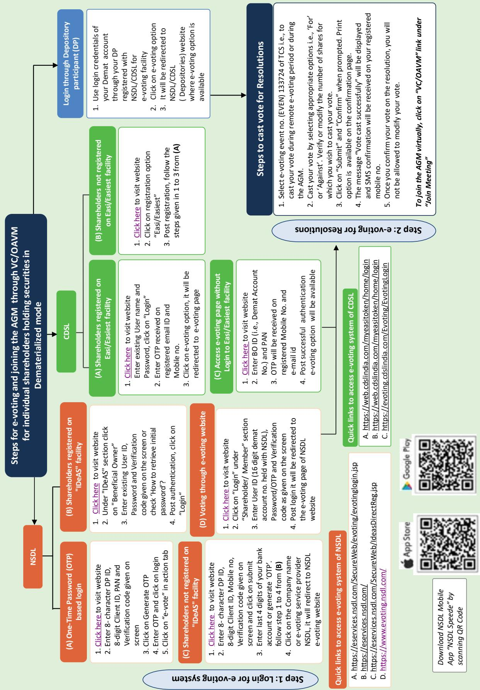

flowchart

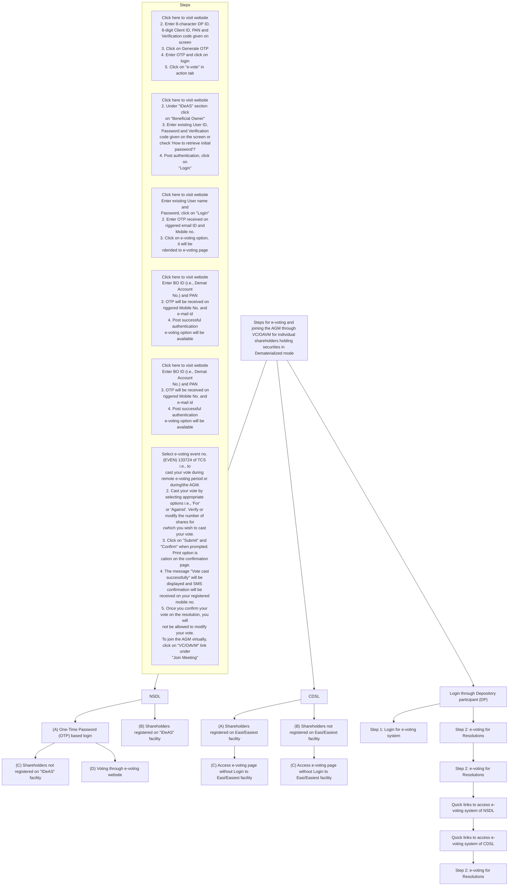
```mermaid
graph TD
    A["Steps for e-voting and joining the AGM through VC/OAVM for individual shareholders holding securities in Dematerialized mode"] --> B["NSDL"]
    A --> C["CDSL"]
    A --> D["Login through Depository participant (DP)"]
    B --> E["(A) One-Time Password (OTP) based login"]
    B --> F["(B) Shareholders registered on &quot;IDeAS&quot; facility"]
    C --> G["(A) Shareholders registered on Easi/Easiest facility"]
    C --> H["(B) Shareholders not registered on Easi/Easiest facility"]
    D --> I["Step 1: Login for e-voting system"]
    D --> J["Step 2: e-voting for Resolutions"]
    E --> K["(C) Shareholders not registered on &quot;IDeAS&quot; facility"]
    E --> L["(D) Voting through e-voting website"]
    G --> M["(C) Access e-voting page without Login to Easi/Easiest facility"]
    H --> N["(C) Access e-voting page without Login to Easi/Easiest facility"]
    J --> O["Step 2: e-voting for Resolutions"]
    O --> P["Quick links to access e-voting system of NSDL"]
    P --> Q["Quick links to access e-voting system of CDSL"]
    Q --> R["Step 2: e-voting for Resolutions"]

    subgraph Steps
        S1["Click here to visit website\n2. Enter 8-character DP ID,\n8-digit Client ID, PAN and\nVerification code given on\nscreen\n3. Click on Generate OTP\n4. Enter OTP and click on login\n5. Click on &quot;e-vote&quot; in action tab"]
        S2["Click here to visit website\n2. Under &quot;IDeAS&quot; section click\non &quot;Beneficial Owner&quot;\n3. Enter existing User ID,\nPassword and Verification\ncode given on the screen or\ncheck 'How to retrieve initial\npassword'?\n4. Post authentication, click on\n&quot;Login&quot;"]
        S3["Click here to visit website\nEnter existing User name and\nPassword, click on &quot;Login&quot;\n2. Enter OTP received on\nriggered email ID and\nMobile no.\n3. Click on e-voting option, it will be\nrderided to e-voting page"]
        S4["Click here to visit website\nEnter BO ID (i.e., Demat Account\nNo.) and PAN\n3. OTP will be received on\nriggered Mobile No. and\ne-mail id\n4. Post successful authentication\ne-voting option will be available"]
        S5["Click here to visit website\nEnter BO ID (i.e., Demat Account\nNo.) and PAN\n3. OTP will be received on\nriggered Mobile No. and\ne-mail id\n4. Post successful authentication\ne-voting option will be available"]
        S6["Select e-voting event no. (EVEN) 133724 of TCS i.e., to\ncast your vote during remote e-voting period or during\the AGM.\n2. Cast your vote by selecting appropriate options i.e., 'For'\nor 'Against'. Verify or modify the number of shares for\ncwhich you wish to cast your vote.\n3. Click on &quot;Submit&quot; and &quot;Confirm&quot; when prompted. Print option is\ncation on the confirmation page.\n4. The message &quot;Vote cast successfully&quot; will be displayed and SMS confirmation will be received on your registered mobile no.\n5. Once you confirm your vote on the resolution, you will\nnot be allowed to modify your vote.<br>To join the AGM virtually, click on &quot;VC/OAVM&quot; link under\n&quot;Join Meeting&quot;"]
    end
```

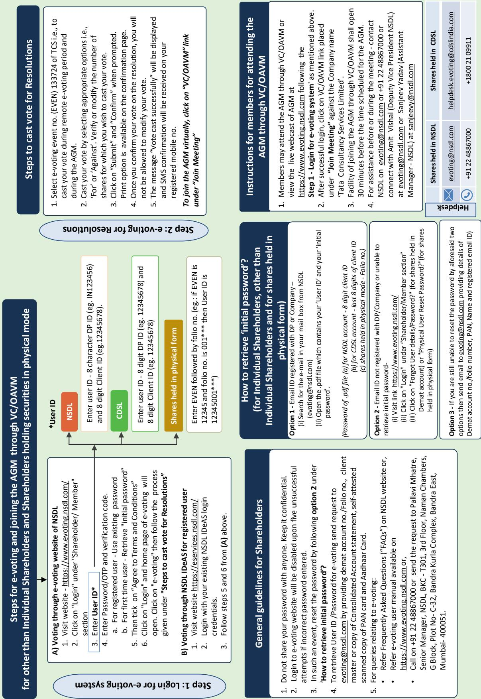

other

| Step | User ID | NSDL | Enter ID - 8 character DP ID (eg. IN123456) and 8 digit Client ID (eg.12345678). | CDSL | Enter ID - 8 digit DP ID (eg. 12345678) and 8 digit Client ID (eg. 12345678) | Shares held in physical form | Enter EVEN followed by folio no. (eg.: if EVEN is 12345 and folio no. is 001*** then User ID is 12345001***) |
|---|---|---|---|---|---|---|---|
| A) Voting through e-voting website of NSDL
1. Visit website - https://www.evoting.nsdl.com/
2. Click on "Login" under "Shareholder/ Member" section
3. Enter User ID*
4. Enter Password/OTP and verification code.
a. For registered user - Use existing password
b. For first time user - Retrieve "initial password"
5. Then tick on "Agree to Terms and Conditions"
6. Click on "Login" and home page of e-voting will open. Click on "e-voting" then follow the process given under "Steps to cast vote for Resolutions"
B) Voting through NSDL IDeAS for registered user
1. Visit website https://eservices.nsdl.com/
2. Login with your existing NSDL IDeAS login credentials.
3. Follow steps 5 and 6 from (A) above.

Step 2: e-voting for Resolutions

Step 3: If you are still unable to reset the password by aforesaid two options then send email to evoting@nsdl.com providing details of Demat account no./folio number, PAN, Name and registered email ID

Step 4: General guidelines for Shareholders

1. Do not share your password with anyone. Keep it confidential.
2. Login to e-voting website will be disabled upon five unsuccessful attempts if incorrect password entered.
3. In such an event, reset the password by following option 2 under 'How to retrieve initial password'?
4. To retrieve User ID /Password for e-voting send request to evoting@nsdl.com by providing demat account no./Folio no., client master or copy of Consolidated Account statement, self-attested scanned copy of PAN card and Aadhaar Card.
5. For queries relating to e-voting:
• Refer Frequently Asked Questions ("FAQs") on NSDL website or,
• Refer e-voting user manual available on
https://www.evoting.nsdl.com or,
• Call on +91 22 48867000 or send the request to Pallavi Mhatre,
Senior Manager, NSDL, BKC - T301, 3rd Floor, Naman Chambers,
G Block, Plot No- C-32, Bandra Kurla Complex, Bandra East,
Mumbai- 400051.

Step 4: How to retrieve 'initial password'? (for Individual Shareholders, other than Individual Shareholders and for shares held in physical form)
Option 1 - Email ID registered with DP or Company-
(i) Search for the e-mail in your mail box from NSDL
(evoting@nsdl.com)
(ii) Open the .pdf file which contains your 'User ID' and your 'initial password'.
(Password of .pdf file (a) for NSDL account - 8 digit client ID
(b) for CDSL account - last 8 digits of client ID
(c) shares held in physical mode - Folio no.)
Option 2 - Email ID not registered with DP/Company or unable to retrieve initial password-
(i) Visit link https://www.evoting.nsdl.com/
(ii) Click on "Login" under "Shareholder/Member section"
(iii) Click on "Forgot User details/Password?" (for shares held in Demat account) or "Physical User Reset Password?" (for shares held in physical form)

Option 3 - If you are still unable to reset the password by aforesaid two options then send email to evoting@nsdl.com providing details of Demat account no./folio number, PAN, Name and registered email ID

Step 5: E-mail followed by folio no. (eg.: if EVEN is 12345 and folio no. is 001*** then User ID is 12345001***).

Step 6: Instructions for members for attending the AGM through VC/OAVM

1. Members may attend the AGM through VC/OAVM or view the live webcast of AGM at https://www.evoting.nsdl.com following the Step 1 - Login for e-voting system' as mentioned above.
2. After successful login, click on VC/OAVM link placed under "Join Meeting" against the Company name 'Tata Consultancy Services Limited'.
3. Facility of joining the AGM through VC/OAVM shall open 30 minutes before the time scheduled for the AGM.
4. For assistance before or during the meeting - contact NSDL on evoting@nsdl.com or +91 22 48867000 or connect with Amit Vishal (Deputy Vice President NSDL) at evoting@nsdl.com or Sanjeev Yadav (Assistant Manager - NSDL) at sanjeevy@nsdl.com

Helpdesk
Shares held in NSDL
Shares held in CDSL
evoting@nsdl.com
helpdesk.evoting@cdslindia.com
+91 22 48867000
+1800 21 09911

Information at a glance: 

<table><tr><td>S/N</td><td>Particulars</td><td>Details</td></tr><tr><td>1</td><td>Date and Time of AGM</td><td>Thursday, June 19, 2025, at 3:00 p.m. (IST)</td></tr><tr><td>2</td><td>Mode of conduct</td><td>Video Conferencing (&quot;VC&quot;)/Other Audio Visual Means (&quot;OAVM&quot;)</td></tr><tr><td>3</td><td>Link to participate in the AGM through VC/OAVM</td><td>https://www.evoting.nsdl.com[For details please refer Note No. 21 of the Notice]</td></tr><tr><td>4</td><td>Contact details of NSDL for assistance before or during the AGM</td><td>E-mail:evoting@nsdl.comContact No.: +91 22 48867000Members may connect with:Amit Vishal (Deputy Vice President – NSDL) atevoting@nsdl.comorSanjeev Yadav (Assistant Manager – NSDL) atsanjeevy@nsdl.com</td></tr><tr><td>5</td><td>Record date for Final Dividend</td><td>Wednesday, June 4, 2025</td></tr><tr><td>6</td><td>Payment date for Final Dividend</td><td>Tuesday, June 24, 2025</td></tr><tr><td>7</td><td>Cut-off date to determine entitlement for e-voting</td><td>Thursday, June 12, 2025</td></tr><tr><td>8</td><td>E-voting start date and time</td><td>Sunday, June 15, 2025 from 9:00 a.m. (IST)</td></tr><tr><td>9</td><td>E-voting end date and time</td><td>Wednesday, June 18, 2025 till 5:00 p.m. (IST)</td></tr><tr><td>10</td><td>E-voting event number (EVEN)</td><td>133724</td></tr><tr><td>11</td><td>Chart along with detailed procedure for e-voting and joining virtual AGM</td><td>https://on.tcs.com/Procedure-of-Evoting</td></tr><tr><td>12</td><td>Registration of e-mail ID for receiving Notice of the AGM and Integrated Annual Report</td><td>Last date to register: Thursday, June 12, 2025 on or before 5:00 p.m. (IST)Link:https://web.in.mpms.mufg.com/EmailReg/Email_Register.html</td></tr><tr><td>13</td><td>Email ID and link to submit the form for TDS exemption</td><td>Last date to submit: Thursday, May 29, 2025 by 11:59 p.m. (IST)Email id:TCSexemptforms2526@in.mpms.mufg.comLink:https://web.in.mpms.mufg.com/formsreg/submission-of-form-15g-15h.html</td></tr><tr><td>14</td><td>Registration as speaker shareholder</td><td>Commences from Thursday, June 12, 2025 (9:00 a.m. IST) to Saturday, June 14, 2025 (5:00 p.m. IST).Send email totcsagm.speakers@tcs.com(Please send the request from your registered e-mail ID and mention name, DP ID and Client ID/Folio No., PAN, Mobile No. in the e-mail sent for registration)</td></tr><tr><td>15</td><td>Link to eTDS Portal for obtaining TDS certificate</td><td>https://on.tcs.com/eTDS-portal</td></tr><tr><td>16</td><td>Name, address and contact details of Registrar and Transfer Agent</td><td>MUFG Intime India Private LimitedC-101, Embassy 247, L. B. S. Marg,Vikhroli (West), Mumbai - 400083.Tel No: +91 810 811 8484Link to register queries:https://web.in.mpms.mufg.com/helpdesk/Service_Request.htmlWebsite:http://www.in.mpms.mufg.com/</td></tr><tr><td>17</td><td>Live webcast of AGM</td><td>https://www.evoting.nsdl.com</td></tr></table>

# Board’s Report

To the Members,

The Directors present this Integrated Annual Report of Tata Consultancy Services Limited (“the Company” or “TCS”) along with the audited financial statements for the financial year (“FY”) ended March 31, 2025.

The consolidated performance of the Company and its subsidiaries has been referred to wherever required.

natural_image

Three business professionals in business attire gathered around a laptop, one pointing at it (no visible text or symbols)

1. Financial results   
(\` crore) 

<table><tr><td></td><td colspan="2">Standalone</td><td colspan="2">Consolidated</td></tr><tr><td></td><td>Financial Year 2024-25 (FY 2025)</td><td>Financial Year 2023-24 (FY 2024)</td><td>Financial Year 2024-25 (FY 2025)</td><td>Financial Year 2023-24 (FY 2024)</td></tr><tr><td>Revenue from operations</td><td>2,14,853</td><td>2,02,359</td><td>2,55,324</td><td>2,40,893</td></tr><tr><td>Other income</td><td>9,642</td><td>7,273</td><td>3,962</td><td>4,422</td></tr><tr><td>Total income</td><td>2,24,495</td><td>2,09,632</td><td>2,59,286</td><td>2,45,315</td></tr><tr><td>Expenses</td><td></td><td></td><td></td><td></td></tr><tr><td>Operating expenditure</td><td>1,56,924</td><td>1,46,512</td><td>1,87,917</td><td>1,76,597</td></tr><tr><td>Depreciation and amortisation expense</td><td>4,220</td><td>3,887</td><td>5,242</td><td>4,985</td></tr><tr><td>Total expenses</td><td>1,61,144</td><td>1,50,399</td><td>1,93,159</td><td>1,81,582</td></tr><tr><td>Profit before finance costs, exceptional item and tax</td><td>63,351</td><td>59,233</td><td>66,127</td><td>63,733</td></tr><tr><td>Finance costs</td><td>703</td><td>673</td><td>796</td><td>778</td></tr><tr><td>Profit before exceptional item and tax</td><td>62,648</td><td>58,560</td><td>65,331</td><td>62,955</td></tr><tr><td>Exceptional item</td><td></td><td></td><td></td><td></td></tr><tr><td>Settlement of legal claim</td><td>-</td><td>958</td><td>-</td><td>958</td></tr><tr><td>Profit before tax</td><td>62,648</td><td>57,602</td><td>65,331</td><td>61,997</td></tr><tr><td>Tax expense</td><td>14,591</td><td>14,043</td><td>16,534</td><td>15,898</td></tr><tr><td>Profit for the year</td><td>48,057</td><td>43,559</td><td>48,797</td><td>46,099</td></tr><tr><td>Attributable to:</td><td></td><td></td><td></td><td></td></tr><tr><td>Shareholders of the Company</td><td>48,057</td><td>43,559</td><td>48,553</td><td>45,908</td></tr><tr><td>Non-controlling interests</td><td>NA</td><td>NA</td><td>244</td><td>191</td></tr><tr><td>Opening balance of retained earnings</td><td>55,173</td><td>62,228</td><td>70,033</td><td>74,722</td></tr><tr><td>Closing balance of retained earnings</td><td>73,380</td><td>55,173</td><td>88,777</td><td>70,033</td></tr></table>

# 2. Return of surplus funds to Shareholders

In line with the practice of returning substantial free cash flow to shareholders and based on the Company’s performance, the dividends for FY 2025 would amount to \`126 per equity share, which includes payment of three interim dividends of \`10 each, a special dividend of \`66 per equity share, and recommended a final dividend of \`30 per equity share. The shareholders’ payout for FY 2025 would involve a total cash outflow of \`45,588 crore.

For FY 2024, the Company paid a total dividend of \`73 per equity share which included three interim dividends of \`9 each, a special dividend of \`18 per equity share and a final dividend of \`28 per equity share. In addition to the above, the Company bought back 4,09,63,855 equity shares at a price of \`4,150 per equity share for an aggregate consideration of \`17,000 crore. The Shareholders’ payout with respect to dividend and buyback including tax on buyback (excluding transaction costs, other incidental and related expenses) aggregated to \`47,445 crore.

The Dividend Distribution Policy, in terms of Regulation 43A of the Securities and Exchange Board of India (Listing Obligations and Disclosure Requirements) Regulations, 2015 (“SEBI Listing Regulations”), is available on the Company’s website at https://on.tcs.com/Dividend.

# 3. Transfer to reserves

The closing balance of the retained earnings of the Company for FY 2025 after all appropriation and adjustments was \`73,380 crore.

# 4. Company’s performance

On a consolidated basis, the revenue from operations for FY 2025 was \`2,55,324 crore, higher by 6.0% over the previous year’s revenue from operations of \`2,40,893 crore. The profit for the year attributable to shareholders for FY 2025 was \`48,553 crore registering a growth of 5.8% over the profit for the year attributable to shareholders of \`45,908 crore in FY 2024.

On a standalone basis, the revenue from operations for FY 2025 was \`2,14,853 crore, higher by 6.2% over the previous year’s revenue from operations of \`2,02,359 crore. The profit for the year attributable to shareholders in FY 2025 was \`48,057 crore registering a growth of 10.3% over the profit for the year attributable to shareholders of \`43,559 crore in FY 2024.

# 5. Subsidiary companies

On March 31, 2025, the Company has 52 subsidiaries and there has been no material change in the nature of the business of the subsidiaries. There are no associates or joint venture companies within the meaning of Section 2(6) of the Companies Act, 2013 (“the Act”).

TCS Financial Solutions (Beijing) Co., Ltd. was merged with Tata Consultancy Services (China) Co., Ltd. a step-down wholly owned subsidiary of the Company w.e.f. July 1, 2024.

On December 20, 2024, Tata Consultancy Services (Africa) (Proprietary) Limited (“TCS Africa”), a wholly owned subsidiary of the Company disposed off 30% of its equity stake in Tata Consultancy Services (South Africa) (Proprietary) Limited (“TCS SA”), a step-down wholly owned subsidiary of the Company at a consideration of ZAR 61 million (equivalent to \`28 crore) to Isisekelo Sethu Trust, to comply with the Broad-Based Black Economic Empowerment (“B-BBEE”) guidelines in South Africa. Consequently, TCS SA ceased to be a step-down wholly owned subsidiary of the Company.

On January 29, 2025, the Company executed a Share Purchase and Securities Purchase Agreement (“SSPA”) with Tata Realty and Infrastructure Limited (“TRIL”), TRIL Bengaluru Real Estate Five Limited (“TBRF”) and TRIL Bengaluru Real Estate Six Limited (“TBRS”) for acquisition of 100% of equity shares and optionally redeemable convertible debentures of TBRF and TBRS held by TRIL, in two tranches, at a consideration of \`1,593 crore. Upon the execution

of SSPA, 65% of equity shares and optionally redeemable convertible debentures have been transferred to the Company at a consideration of \`1,036 crore and recognised a financial liability of \`557 crore towards consideration payable at a future date for 35% stake.

Pursuant to the provisions of Section 129(3) of the Act, a statement containing the salient features of financial statements of the Company’s subsidiaries in Form No. AOC-1 is attached to the financial statements of the Company.

Further, pursuant to the provisions of Section 136 of the Act, the financial statements of the Company, consolidated financial statements along with relevant documents and separate audited financial statements in respect of subsidiaries, are available on the Company’s website at https://www.tcs.com/investor-relations.

# 6. Directors’ Responsibility Statement

Pursuant to Section 134(5) of the Act, the Board of Directors, to the best of its knowledge and ability, confirm that:

In the preparation of the annual accounts, the applicable accounting standards have been followed and there are no material departures;   
ii. They have selected such accounting policies and applied them consistently and made judgments and estimates that are reasonable and prudent so as to give a true and fair view of the state of affairs of the Company at the end of the financial year and of the profit of the Company for that period;   
iii. They have taken proper and sufficient care for the maintenance of adequate accounting records in accordance with the provisions of the Act for safeguarding the assets of the Company and for preventing and detecting fraud and other irregularities;   
iv. They have prepared the annual accounts on a going concern basis;   
v. They have laid down internal financial controls to be followed by the Company and such internal financial controls are adequate and operating effectively;   
vi. They have devised proper systems to ensure compliance with the provisions of all applicable laws and that such systems are adequate and operating effectively.

Based on the framework of internal financial controls and compliance systems established and maintained by the Company, the work performed by the internal, statutory and secretarial auditors and external consultants, including the audit of internal financial controls over financial reporting by the statutory auditors and the reviews performed by management and the relevant board committees, including the Audit Committee, the Board is of the opinion that the Company’s internal financial controls were adequate and effective during FY 2025.

# 7. Directors and Key Managerial Personnel (“KMP”)

As on March 31, 2025, the Company has eight Directors of which seven are Non-Executive Directors (including two women Directors). The Company has five Independent Directors (including one woman Independent Director).

Based on the recommendation of Nomination and Remuneration Committee (“NRC”), and in terms of the provisions of the Act, the Board of Directors appointed Sanjay V Bhandarkar (DIN 01260274) as an Additional Director of the Company effective March 4, 2025. Further, in accordance with the provisions of Section 149 read with Schedule IV to the Act and applicable SEBI Listing Regulations, Sanjay V Bhandarkar was appointed as Non-Executive, Independent Director of the Company, not liable to retire by rotation, for a term of five years commencing from March 4, 2025 to March 3, 2030. A Special Resolution seeking Member’s approval for his appointment is being sought through Postal Ballot, for which the remote e-voting period commenced on March 26, 2025 and will end on April 24, 2025. In the opinion of the Board, Sanjay V Bhandarkar is a person of integrity and fulfils requisite conditions as per applicable laws and is independent of the management of the Company.

The Board of Directors at its meeting held on April 10, 2025 appointed Aarthi Subramanian (DIN 07121802) as the Whole-time Director designated as “Executive Director – President and Chief Operating Officer” for a term of five years commencing from May 1, 2025 to April 30, 2030, subject to approval of the Members at the ensuing Annual General Meeting (“AGM”). A resolution seeking Member’s approval for her appointment forms part of the Notice for the ensuing AGM.

During the year under review, N G Subramaniam (DIN 07006215) ceased to be the Chief Operating Officer and Executive Director (“COO & ED”) of the Company w.e.f. May 20, 2024, as per the retirement age policy of the Company and O P Bhatt (DIN 00548091) ceased to be Director of the Company w.e.f. June 27, 2024 upon completion of his term as an Independent Director. The Board places on record its appreciation for their invaluable contribution and guidance provided to the Company.

Aarthi Subramanian retires by rotation and being eligible, offers herself for reappointment as per Section 152(6) of the Act.

Pursuant to the provisions of Section 149 of the Act, the Independent Directors have submitted declarations that each of them meets the criteria of independence as provided in Section 149(6) of the Act along with Rules framed thereunder and Regulation 16(1)(b) of the SEBI Listing Regulations. There has been no change in the circumstances affecting their status as independent directors of the Company.

During the year under review, the Non-Executive Directors of the Company had no pecuniary relationship or transactions

with the Company, other than sitting fees, commission and reimbursement of expenses, if any.

Yashaswin Sheth was appointed as the Company Secretary and Compliance Officer w.e.f. November 1, 2024, upon the superannuation of Pradeep Manohar Gaitonde w.e.f. October 31, 2024.

The Board places on record its appreciation for Pradeep Manohar Gaitonde for the valuable contribution provided to the Company.

Pursuant to the provisions of Section 203 of the Act, K Krithivasan, Chief Executive Officer and Managing Director (CEO & MD), Samir Seksaria, Chief Financial Officer and Yashaswin Sheth, Company Secretary, are the KMPs of the Company as on March 31, 2025.

# 8. Number of meetings of the Board

Five meetings of the Board were held during the year under review. For details of meetings of the Board, please refer to the Corporate Governance Report, which forms part of this report.

# 9. Board evaluation1

The Board of Directors has carried out an annual evaluation of its own performance, board committees, and individual directors pursuant to the provisions of the Act and SEBI Listing Regulations.

The performance of the Board was evaluated by the Board after seeking inputs from all the directors on the basis of criteria such as the board composition and structure, effectiveness of board processes, information and functioning, etc.

The performance of the Committees was evaluated by the Board after seeking inputs from the Committee members on the basis of criteria such as the composition of committees, effectiveness of committee meetings, etc.

The above criteria are broadly based on the Guidance Note on Board Evaluation issued by the Securities and Exchange Board of India. In a separate meeting of Independent Directors, performance of Non Independent Directors, the Board as a whole and Chairman of the Company was evaluated, taking into account the views of Executive and Non-Executive Directors.

The Board and the NRC reviewed the performance of individual directors on the basis of criteria such as contribution of the individual director to the Board and Committee meetings like preparedness on the issues to be discussed, meaningful and constructive contribution and inputs in meetings, etc.

At the Board meeting that followed the meeting of the Independent Directors and meeting of NRC, the performance of the Board, its Committees, and individual directors was also discussed. Performance evaluation of Independent Directors was done by the entire Board.

10. Policy on directors’ appointment and remuneration and her details

The Company’s policy on appointment of Directors is available on the Company’s website at https://on.tcs.com/ApptDirectors.

The policy on remuneration and other matters provided in Section 178(3) of the Act has been disclosed in the Corporate Governance Report, which forms part of this report and is also available on the Company’s website at https://on.tcs.com/remuneration-policy.

11. Corporate Social Responsibility (“CSR”)

The Company’s CSR initiatives and activities are aligned to the requirements of Section 135 of the Act.

A brief outline of the CSR policy and the initiatives undertaken by the Company on CSR activities during the year under review are set out in Annexure I of this report in the format prescribed in the Companies (Corporate Social Responsibility Policy) Rules, 2014. This Policy is available on the Company’s website at https://on.tcs.com/Global-CSR-Policy.

For other details regarding the CSR Committee, please refer to the Corporate Governance Report, which forms part of this report.

12. Internal financial control systems and their adequacy

The details in respect of internal financial controls and their adequacy are included in the Management Discussion and Analysis, which forms part of this report.

13. Audit Committee

The details pertaining to the composition of the Audit Committee are included in the Corporate Governance Report, which is a part of this report.

14. Auditors

At the twenty-seventh AGM held on June 9, 2022, the Members approved the re-appointment of B S R & Co. LLP, Chartered Accountants (Firm Registration No. 101248W/W-100022) as Statutory Auditors of the Company to hold office for a period of five years from the conclusion of that AGM till the conclusion of the thirty-second AGM to be held in the year 2027.

In compliance with Regulation 24A of the SEBI Listing Regulations and Section 204 of the Act, the Board at its meeting held on April 10, 2025, based on recommendation of the Audit Committee, has approved the appointment of Parikh & Associates, Practising Company Secretaries, a peer reviewed firm (Firm Registration No. P1988MH009800) as Secretarial Auditors of the Company for a term of five consecutive years commencing from FY 2025-26 till FY 2029- 30, subject to approval of the Members at the ensuing AGM.

15. Auditor’s report and Secretarial audit report

The Statutory Auditor’s report and the Secretarial Auditor’s report do not contain any qualifications, reservations, or

adverse remarks or disclaimer. Secretarial audit report is attached to this report as Annexure II.

16. Risk management

The Board of Directors of the Company has a Risk Management Committee to frame, implement and monitor the risk management plan for the Company.

The Committee is responsible for monitoring and reviewing the risk management plan and ensuring its effectiveness. The Audit Committee has additional oversight in the area of financial risks and controls. The major risks identified by the businesses and functions are systematically addressed through mitigating actions on a continuing basis.

The development and implementation of risk management policy has been covered in the Management Discussion and Analysis, which forms part of this report.

17. Vigil Mechanism

The Company has a Whistle Blower Policy and has established the necessary vigil mechanism for employees, Directors and stakeholders in conformation with the provisions of Section 177(9) of the Act and Regulation 22 of SEBI Listing Regulations, to report concerns about unethical behaviour. This Policy is available on the Company’s website at https://on.tcs.com/WhistleBP.

18. Particulars of loans, guarantees and investments

The particulars of loans, guarantees and investments as per Section 186 of the Act by the Company have been disclosed in the financial statements.

19. Transactions with related parties

None of the transactions with related parties fall under the scope of Section 188(1) of the Act. Accordingly, the disclosure of related party transactions as required under Section 134(3)(h) of the Act in Form AOC-2 is not applicable to the Company for FY 2025 and hence, does not form part of this report.

Pursuant to the SEBI Listing Regulations, the resolutions seeking approval of the Members on material related party transactions forms part of the Notice of the ensuing AGM.

20. Annual Return

Pursuant to Section 92(3) read with Section 134(3)(a) of the Act, the Annual Return as on March 31, 2025 is available on the Company’s website at https://on.tcs.com/annualreturn-24-25.

21. Particulars of employees

The information under Section 197 of the Act read with Rule 5 of the Companies (Appointment and Remuneration of Managerial Personnel) Rules, 2014:

a. The ratio of the remuneration of each director to the median remuneration of the employees of the Company and percentage increase in remuneration of each Director, Chief Executive Officer, Chief Financial Officer and Company Secretary in the financial year:

<table><tr><td>Name</td><td>Ratio to median remuneration</td><td>% increase in remuneration in the financial year</td></tr><tr><td>Non-Executive Directors:</td><td></td><td></td></tr><tr><td>N Chandrasekaran@</td><td>-</td><td>-</td></tr><tr><td>Aarthi Subramanian@</td><td>-</td><td>-</td></tr><tr><td>Dr Pradeep Kumar Khosla</td><td>34.0</td><td>3.8</td></tr><tr><td>Hanne Sorensen</td><td>34.1</td><td>3.8</td></tr><tr><td>Keki Mistry</td><td>38.0</td><td>5.5</td></tr><tr><td>Al-Noor Ramji</td><td>34.1</td><td>^</td></tr><tr><td>Sanjay V Bhandarkar*</td><td>$</td><td>$</td></tr><tr><td>O P Bhatt**</td><td>$</td><td>$</td></tr><tr><td>Executive Directors:</td><td></td><td></td></tr><tr><td>K Krithivasan</td><td>329.8</td><td>4.6</td></tr><tr><td>N G Subramaniam&amp;</td><td>$</td><td>$</td></tr><tr><td>Chief Financial Officer:</td><td></td><td></td></tr><tr><td>Samir Seksaria</td><td>96.7</td><td>7.8</td></tr><tr><td>Company Secretary:</td><td></td><td></td></tr><tr><td>Yashaswin Sheth#</td><td>$</td><td>$</td></tr><tr><td>Pradeep Manohar Gaitonde##</td><td>$</td><td>$</td></tr></table>

@ As a policy, N Chandrasekaran, Chairman, has abstained from receiving commission from the Company and hence not stated.   
@@ In line with the internal guidelines of the Company, no payment is made towards commission to the Non-Executive Directors of the Company, who are in full time employment with any other Tata Company and hence not stated.   
Remuneration received in FY 2025 is not comparable with remuneration received in FY 2024 which was for part of the year and hence, not stated.   
Appointed as Independent Director w.e.f. March 4, 2025.   
\*‡ Ceased to be Director w.e.f. June 27, 2024 upon completion of his term as Independent Director.   
& Ceased to be Chief Operating Officer and Executive Director w.e.f. May 20, 2024, as per the retirement age policy of the Company.   
# Appointed as the Company Secretary and Compliance Officer w.e.f. November 1, 2024.   
## Ceased to be Company Secretary and Compliance Officer w.e.f. October 31, 2024.   
\$ Remuneration received in FY 2025 (for part of the year) is not comparable with remuneration for FY 2024 and hence not stated.

b. The percentage increase in the median remuneration of employees in the financial year is 6.3%.   
c. The number of permanent employees on the rolls of Company are 6,07,979.   
d. The average annual increase was in the range of 4.5-7%, with top performers receiving double digit increment in India. However, during the course of the year, the total increase is in the range of 5.5-7.5%, after accounting for promotions and other event based compensation revisions. Employees outside India received a wage increase varying from 1.5-6%.

The increase in remuneration is in line with the market trends in the respective countries. In order to ensure that remuneration reflects the Company’s performance, the performance pay is also linked to organization performance and individual utilization in addition to individual performance.

Increase in the managerial remuneration for the year was 4.6% for CEO & MD. Remuneration for erstwhile COO & ED is for part of the year and hence not considered.

e. The Company affirms that the remuneration is as per the remuneration policy of the Company.   
f. The statement containing names of top ten employees in terms of remuneration drawn and the particulars of employees as required under Section 197(12) of the Act read with Rule 5(2) and 5(3) of the Companies (Appointment and Remuneration of Managerial Personnel) Rules, 2014, is provided in a separate annexure forming part of this report.

Further, the report and the accounts are being sent to the Members excluding the aforesaid annexure. In terms of Section 136 of the Act, the said annexure is open for inspection and any Member interested in obtaining a copy of the same may write to the Company Secretary.

# 22. Integrated Report

The Company has voluntarily provided Integrated Report, which encompasses both financial and non-financial information to enable the Members to take well-informed decisions and have a better understanding of the Company’s long-term perspective. The Report also touches upon aspects such as organization’s strategy, governance framework, performance and prospects of value creation based on the five forms of capital viz. financial capital, human capital, intellectual capital, social capital and natural capital.

# 23. Disclosure requirements

As per SEBI Listing Regulations, the integrated Management Discussion and Analysis, the Corporate Governance Report with the Auditors’ Certificate thereon, and the Business Responsibility and Sustainability Report (“BRSR”) forms part of the Board’s Report.

The BRSR indicates the Company’s performance against the principles of the ‘National Guidelines on Responsible Business Conduct’. This would enable the Members to have an insight into Environmental, Social and Governance initiatives of the Company.

The Company has devised proper systems to ensure compliance with the provisions of all applicable Secretarial Standards issued by the Institute of Company Secretaries of India and that such systems are adequate and operating effectively.

# 24. Deposits from public

The Company has not accepted any deposits from public and as such, no amount on account of principal or interest on deposits from public was outstanding as on the date of the balance sheet.

# 25. Quality initiatives

The Company reinforces its steadfast commitment to excellence through the continuous pursuit of the highest quality standards, exceptional customer experience, industryleading service management, robust information security and privacy frameworks, and a resilient business continuity strategy.

The TCS Integrated Quality Management System (“iQMSTM”) serves as a structured and strategic framework designed to ensure the consistent delivery of products and services that meet or exceed customer expectations while driving operational efficiency. It is continuously assessed and enhanced to align with evolving market dynamics and emerging technologies, including AI and Cloud, enabling the organization to deliver certainty and create exceptional value and experiences for its customers.

The Company continues to maintain enterprise-wide certification to the following globally recognized standards:

• Quality Management (ISO 9001:2015)   
• IT Service Management (ISO 20000-1:2018)   
• Business Continuity Management (ISO 22301:2019)   
• Information Security Management (ISO 27001:2022)   
Privacy Information Management Systems (ISO 27701:2019)   
Information Security Controls for Cloud Services (ISO 27017:2015)   
Protection of PII in Public Clouds as PII Processors (ISO 27018:2019)

The Company also continues to maintain certification to Health, Safety, Environment (HSE) and Energy Management Systems Standards such as:

• ISO 14001:2015 (Environment management)   
• ISO 45001:2018 (Health and Safety)   
• ISO 50001:2018 (Energy management)

Certification in Industry domain specific standards such as AS9100 (Aerospace), TL9000 (Telecom) and ISO 13485 (Medical devices) are also maintained.

The Company is also at Maturity level 5 of ISACA’s Capability Maturity Model Integration – Development (CMMI® DEV) and Services (CMMI® SVC), a worldwide recognized industry benchmark and performance improvement model.

The Company has received multiple external awards this year in the American Society for Quality (“ASQ”) South Asia Team Excellence Awards, the Lean Six Sigma event from National Institution for Quality & Reliability (“NIQR”) and in CII Lean National Awards 2024 as well as the CII Six Sigma National competition.

# 26. Conservation of energy, technology absorption, foreign exchange earnings and outgo

# Conservation of energy

The Company is committed towards conservation of energy and climate action which is reaffirmed in its Environmental Sustainability policy [Environmental-Sustainability-Policy.pdf (tcs.com)].

During the year under review, several initiatives were aligned to achieve the carbon targets which included those in building and IT infrastructure. Initiatives in building infrastructure included higher energy efficiencies in heating, ventilation, and air conditioning (“HVAC”) systems, uninterruptible power supply (“UPS”), green buildings and energy monitoring & analytics (Clever Energy & Resource Optimisation Centre) which have resulted in energy savings of 12,470 MWh, equivalent to 9,066 tCO2e reduction.

Initiatives in green IT focused on data center and IT device consolidation and optimization to reduce the carbon footprint. The Company’s data centers have achieved a weighted average PUE of 1.59 in FY 2025 compared to 1.7 in FY 2024. The data centers use 100% renewable electricity. In addition to this, the Company will continue to ensure energy efficiency of the procured equipment.

TCS’ IoT-based Real-time Energy Management System (TCS Clever EnergyTM) involves real-time energy monitoring, continues to yield benefits in terms of optimization of operational energy efficiency across the Company’s offices.

The roof top solar photo voltaic installations this year remained at 10.2 MWp contributing to 2.7% of total electricity use in the reporting year. The Company continued its procurement of renewable energy through power purchase agreements (“PPA’s”), availing green tariffs in India and procurement of Energy Attribute Certificates (“EACs”). Renewable energy procurement has resulted in an increase in renewable energy use to 79% of total energy use during the year.

As a commitment to energy conservation and management, the Company has continued to implement initiatives, monitor and measure energy performance at 22 large campuses in India, which are certified to ISO 50001:2018.

The above energy efficiency and renewable energy procurement efforts helped achieve a year-on-year reduction in absolute carbon footprint (across Scope 1 and Scope 2) of TCS’ global operations by 20%. The Company has achieved 84% reduction in absolute emissions (Scope 1 and Scope 2) when compared to the base year of FY 2016. The electricity consumption across the Company’s operations increased by 11% in the current year compared to FY 2024. This is considering increased operations due to return to office, and inclusion of additional locations.

Continued focus on the above initiatives will enable the Company’s aspiration of achieving its SBTi-approved near term targets.

# Technology absorption, adoption and innovation:

# Research & Development (“R&D”): Specific areas in which R&D was carried out by the Company

TCS Research and Innovation (“R&I”) continues to develop novel methods, technologies, and platforms that can transform the art of becoming perpetually adaptable into systematic engineering. TCS R&I pursues two types of initiative:

Future of Technology (“FoT”) initiatives: These are aimed at tracking and developing novel technologies and platforms that accelerate technology adoption. They focus on areas including sensing, communication, computing, data and knowledge engineering, digital and physical AI, as well as experiential technologies.   
Future of Work (“FoW”) initiatives: These are aimed at infusing emerging technologies to invent the next practices, focusing on a various work domains such as IT (e.g., technology operations and modernization), business (e.g., continuous talent transformation, drug discovery and illness management in healthcare), and societal (e.g., bioremediation of pollutants for sustainability).

During FY 2025, the Company undertook several R&I projects, which include:

A platform to expedite the transition of enterprises’ cryptographic systems to post-quantum cryptography (“PQC”) protocols.   
An intelligent hybrid workspace platform to design, build, and orchestrate the integration of physical robots and human workers in areas such as warehouse operations.   
An AI-powered platform to provide personalized, real-time expertise and wisdom, transforming the nature of knowledge work.

An Internet-like platform to facilitate the discovery and exchange of energy assets among various energy prosumers across administrative boundaries.   
A platform for designing microbial consortia that can be used for the bioremediation of pollutants and waste, contributing to sustainable futures.

# Strengthening IP Base

As of March 31, 2025, the Company has filed 8,816 patents cumulatively, and 4,820 have been granted.

# Co-innovation with customers and partners

The Company’s flagship co-innovation program, TCS Innovation Ecosystem continues to serve as the go-to platform for coinnovation and business transformation. The Company expanded the Pace footprint by launching three innovation hubs this year – a Pace Port in Paris and two Pace Studios in Stockholm (Sweden) and Manila (Philippines). The Company’s ecosystem development program, TCS COINTM (co-innovation network), expanded its global footprint this year. The Company today boasts partnerships with more than 3,000 startups and 50+ academic institutes. The Company partnered with IIT Kharagpur and launched an advanced research centre for innovation in digital health, robotics and intelligent systems.

# Creating a culture of innovation

The Company continues to focus on building a culture of innovation across its talent value chain, through programs like:

TCS Techvantage Program: Launched for fostering engineering talent within the Company. The program recognizes technology talent within the Company by encouraging them to submit technical papers that are adjudged and awarded by a jury of peers. Through this program, over 22,000 technologists were engaged across the Company.   
The 12th season of TCS CodeVita™, a global programming contest saw huge global participation.

# External recognitions

TCS and IIT Delhi won the CII Award for Excellence in Industry-Academia Partnership 2024 for their collaboration on continuous biopharma technology.   
TCS’ Intelligent Speech Assistant won an award under ‘Design for Social Impact’ category at 14th CII Design Excellence Awards 2024.   
TCS was awarded with ISGF Innovation Award 2024 Certificate of Merit for qualifying in the Top Five amongst Adoption of Artificial Intelligence, Machine Learning and Robotic Solutions – Industry (including Smart Business Models).

Recognized with the Asia IP Elite Award 2024 for being an exemplar of IP value creation.   
Recognized with Special Appreciation Award by CII acknowledging very special and distinctive features of some inspiring IP initiatives of the organization.   
The TCS Research brand won at The Global Digital Excellence Awards 2024 for ‘Organic Social Media Campaign of the Year’. This award celebrates company’s commitment to simplifying complex research and presenting it in ways that resonate with people.

# Future course of action

The Company will continue to invest in foundational technologies through its FoT initiatives, especially in the areas of AI, quantum computing, sensing, communications and experience, and thereby stay ahead of the curve in technologies of relevance to its customers. Through FoW initiatives, the Company will continue to invent and adopt next practices in new areas of work through technology infusion.

# Expenditure on R&D

The Company’s R&I centers are in India and other parts of the world. The research centers in India function from Pune, Chennai, Bengaluru, Delhi-NCR, Hyderabad, Kolkata and Mumbai. The Company’s Pace Port and Pace Studio innovation hubs operate in Amsterdam, Toronto, Pittsburgh, Tokyo, New York, London, Paris, Riyadh, Letterkenny, Sydney, Stockholm and Manila.

Expenditure incurred in the R&D centers and innovation centers of the Company during FY 2025 and FY 2024 is given below:

(\` crore) 

<table><tr><td colspan="2">Expenditure on R&amp;D and innovation</td><td colspan="2">Standalone</td><td colspan="2">Consolidated</td></tr><tr><td colspan="2"></td><td>FY 2025</td><td>FY 2024</td><td>FY 2025</td><td>FY 2024</td></tr><tr><td>a.</td><td>Capital</td><td>4</td><td>8</td><td>4</td><td>8</td></tr><tr><td>b.</td><td>Recurring</td><td>411</td><td>419</td><td>416</td><td>426</td></tr><tr><td>c.</td><td>Total R&amp;D expenditure (a+b)</td><td>415</td><td>427</td><td>420</td><td>434</td></tr><tr><td>d.</td><td>Innovation center expenditure</td><td>2,131</td><td>2,228</td><td>2,210</td><td>2,317</td></tr><tr><td>e.</td><td>Total R&amp;D and innovation expenditure (c+d)</td><td>2,546</td><td>2,655</td><td>2,630</td><td>2,751</td></tr><tr><td>f.</td><td>R&amp;D and innovation expenditure as a percentage of total turnover</td><td>1.2%</td><td>1.3%</td><td>1.0%</td><td>1.1%</td></tr></table>

# Foreign exchange earnings and outgo

Export revenue constituted 90.0% of the total standalone revenue in FY 2025 (93.5% in FY 2024).

(\` crore) 

<table><tr><td colspan="2">Foreign exchange earnings and outgo</td><td>FY 2025</td><td>FY 2024</td></tr><tr><td>a.</td><td>Foreign exchange earnings</td><td>2,00,801</td><td>1,93,252</td></tr><tr><td>b.</td><td>CIF Value of imports</td><td>117</td><td>174</td></tr><tr><td>c.</td><td>Expenditure in foreign currency</td><td>79,991</td><td>81,726</td></tr></table>

# 27. Acknowledgements

The Directors thank the Company’s employees, customers, vendors, investors and academic partners for their continuous support. The Directors also thank the Government of India, Governments of various states in India, Governments of various countries and concerned Government departments and agencies for their co-operation.

The Directors appreciate and value the contribution made by every member of the TCS family.

On behalf of the Board of Directors

N Chandrasekaran

Chairman

DIN 00121863

Mumbai, April 10, 2025

# Annexure I

# Annual Report on CSR Activities

# 1. Brief outline on CSR Policy of the Company

The Company is committed to building equitable and inclusive pathways for women, youth, and marginalized groups on a meaningful scale through breakthrough innovation.

The organization serves key stakeholders in remote parts of the world, particularly in areas where the need is high, and resources are the least. The Corporate Social Responsibility flagship programs and initiatives of the Company under the TCS Empowers umbrella aims at empowering people and communities leapfrog to opportunities in the digital economy. This is realized through programs that address the needs of stakeholders in the areas of K-12 education, literacy to livelihood, employment through skilling, digital inclusion & entrepreneurship, healthcare, water, climate and sustainability.

The Company fosters strategic partnerships, conducts research, and offers insights and pro bono technology consulting to strengthen grassroots organizations. To drive transformational social impact, the Company leverages its intellectual, technological, human, and financial capital, applying its contextual knowledge and the expertise of a diverse leadership network to develop innovative, sustainable solutions to societal challenges.

The Company executes and scales programs through its extensive technological capabilities, a vast employee base committed to volunteering their time and skills, and impact investments in large-scale, multi-year initiatives that empower communities. By directing resources towards those most in need, the Company ensures equitable access to opportunities.

Every CSR initiative aligns with the United Nations Sustainable Development Goals (“UN SDGs”), while its CSR strategy integrates inclusion by aligning with the Government of India’s policies and the Tata Group’s Affirmative Action framework.

# 2. Composition of the CSR committee:

<table><tr><td>Sr. No.</td><td>Name of Director</td><td>Designation/Nature of Directorship</td></tr><tr><td>1.</td><td>N Chandrasekaran</td><td>Chairman, Non-Independent Non-Executive Director</td></tr><tr><td>2.</td><td>K Krithivasan</td><td>Member, Non-Independent Executive Director</td></tr><tr><td>3.</td><td>Sanjay V Bhandarkar</td><td>Member, Independent Non-Executive Director</td></tr></table>

During the year under review, one meeting of the CSR Committee was held, which was attended by K Krithivasan and Sanjay V Bhandarkar.

# 3. Provide the web-link where Composition of CSR committee, CSR Policy and CSR Projects approved by the board are disclosed on the website of the Company

Composition of the CSR Committee - https://on.tcs.com/Corporate-Governance.

CSR policy - https://on.tcs.com/Global-CSR-Policy

CSR projects - https://www.tcs.com/corporate-social-responsibility

# 4. Provide the executive summary along with web-link(s) of Impact Assessment of CSR Projects carried out in pursuance of sub-rule (3) of rule 8, if applicable

Not Applicable

5. (a) Average net profit of the Company as per sub-section (5) of Section 135: \`47,677 crore   
(b) Two percent of average net profit of the Company as per sub-section (5) of section 135: \`954 crore   
(c) Surplus arising out of the CSR Projects or programmes or activities of the previous financial years : NIL   
(d) Amount required to be set off for the financial year, if an   
(e) Total CSR obligation for the financial year [5(b)+5(c)-5(d)]: \`954 crore   
6. (a) Amount spent on CSR Projects (both Ongoing Project and other than Ongoing Project): \`949 crore   
(b) Amount spent in Administrative Overheads: \`11 crore   
(c) Amount spent on Impact Assessment, if applicable:   
(d) Total amount spent for the Financial Year [6(a)+6(b)+6(c)]: \`960 crore   
(e) CSR amount spent or unspent for the financial year:

(\` crore) 

<table><tr><td>Total Amount Spent for the Financial Year</td><td colspan="5">Amount Unspent</td></tr><tr><td rowspan="2"></td><td colspan="2">Total Amount transferred to Unspent CSR Account as per Section 135(6) of the Act</td><td colspan="3">Amount transferred to any fund specified under Schedule VII as per second proviso to Section 135(5) of the Act</td></tr><tr><td>Amount</td><td>Date of transfer</td><td>Name of the Fund</td><td>Amount</td><td>Date of transfer</td></tr><tr><td>960</td><td>NIL</td><td>-</td><td>-</td><td>NIL</td><td>-</td></tr></table>

# (f) Excess amount for set off, if any:

(\` crore) 

<table><tr><td>Sr. No.</td><td>Particular</td><td>Amount</td></tr><tr><td>(i)</td><td>Two percent of average net profit of the Company as per Section 135(5)</td><td>954</td></tr><tr><td>(ii)</td><td>Total amount spent for the financial year</td><td>960</td></tr><tr><td>(iii)</td><td>Excess amount spent for the financial year [(ii)-(i)]</td><td>6</td></tr><tr><td>(iv)</td><td>Surplus arising out of the CSR projects or programmes or activities of the previous financial years, if any</td><td>NIL</td></tr><tr><td>(v)</td><td>Amount available for set off in succeeding financial years [(iii)-(iv)]</td><td>6</td></tr></table>

# 7. Details of Unspent CSR amount for the preceding three financial years:

(\` crore) 

<table><tr><td rowspan="2">Sr. No.</td><td rowspan="2">Preceding Financial Year</td><td rowspan="2">Amount transferred to Unspent CSR Account under Section 135(6)</td><td rowspan="2">Balance Amount in Unspent CSR Account under Section 135(6)</td><td rowspan="2">Amount spent in the reporting Financial Year</td><td colspan="2">Amount transferred to a Fund as specified under Schedule VII as per second proviso Section 135(5), if any</td><td rowspan="2">Amount remaining to be spent in succeeding financial years</td><td rowspan="2">Deficiency, if any</td></tr><tr><td>Amount</td><td>Date of transfer</td></tr><tr><td colspan="9">NIL</td></tr></table>

# 8. Whether any capital assets have been created or acquired through Corporate Social Responsibility amount spent in the Financial Year:

Yes

If Yes, enter the number of Capital assets created/acquired : Not Applicable

Furnish the details relating to such asset(s) so created or acquired through Corporate Social Responsibility amount spent in the Financial Year:

(\` crore) 

<table><tr><td rowspan="2">Sr. No.</td><td rowspan="2">Short particulars of the property or asset(s) [including complete address and location of the property]</td><td rowspan="2">Pincode of the property or asset(s)</td><td rowspan="2">Date of creation</td><td rowspan="2">Amount of CSR amount spent</td><td colspan="3">Details of entity/Authority/Beneficiary of the registered owner</td></tr><tr><td>CSR Registration Number, if applicable</td><td>Name</td><td>Registered address</td></tr><tr><td colspan="8">NIL</td></tr></table>

# 9. Specify the reason(s), if the Company has failed to spend two per cent of the average net profit as per section 135(5) - Not Applicable

# K Krithivasan

Chief Executive Officer and Managing Director

DIN: 10106739

Mumbai, April 10, 2025

# N Chandrasekaran

Chairman, Corporate Social Responsibility Committee

DIN: 00121863

# Annexure II

# Form No. MR-3

# SECRETARIAL AUDIT REPORT

# FOR THE FINANCIAL YEAR ENDED MARCH 31, 2025

[Pursuant to Section 204 (1) of the Companies Act, 2013 and Rule No. 9 of the Companies (Appointment and Remuneration of Managerial Personnel) Rules, 2014]

The Members,

Tata Consultancy Services Limited

We have conducted the secretarial audit of the compliance of applicable statutory provisions and the adherence to good corporate practices by Tata Consultancy Services Limited (hereinafter called “the Company”). Secretarial Audit was conducted in a manner that provided us a reasonable basis for evaluating the corporate conducts/statutory compliances and expressing our opinion thereon.

Based on our verification of the Company’s books, papers, minute books, forms and returns filed and other records maintained by the Company, to the extent the information provided by the Company, its officers, agents and authorised representatives during the conduct of secretarial audit, the explanations and clarifications given to us and the representations made by the Management and considering the relaxations granted by the Ministry of Corporate Affairs and Securities and Exchange Board of India, we hereby report that in our opinion, the Company has during the audit period covering the financial year ended on March 31, 2025, generally complied with the statutory provisions listed hereunder and also that the Company has proper Board processes and compliance mechanism in place to the extent, in the manner and subject to the reporting made hereinafter:

We have examined the books, papers, minute books, forms and returns filed and other records made available to us and maintained by the Company for the financial year ended on March 31, 2025 according to the applicable provisions of:

(i) The Companies Act, 2013 (the Act) and the rules made thereunder;   
(ii) The Securities Contract (Regulation) Act, 1956 (‘SCRA’) and the rules made thereunder;   
(iii) The Depositories Act, 1996 and the Regulations and Bye-laws framed thereunder;   
(iv) Foreign Exchange Management Act, 1999 and the rules and regulations made thereunder to the extent of Foreign Direct Investment, Overseas Direct Investment and External Commercial Borrowings;   
(v) The following Regulations and Guidelines prescribed under the Securities and Exchange Board of India Act, 1992 (‘SEBI Act’):

(a) The Securities and Exchange Board of India (Substantial Acquisition of Shares and Takeovers) Regulations, 2011;   
(b) The Securities and Exchange Board of India (Prohibition of Insider Trading) Regulations, 2015;   
(c) The Securities and Exchange Board of India (Issue of Capital and Disclosure Requirements) Regulations, 2018; (Not applicable to the Company during the audit period)   
(d) The Securities and Exchange Board of India (Share Based Employee Benefits and Sweat Equity) Regulations, 2021; (Not applicable to the Company during the audit period)   
(e) The Securities and Exchange Board of India (Issue and Listing of Non-Convertible Securities) Regulations, 2021; (Not applicable to the Company during the audit period)   
(f) The Securities and Exchange Board of India (Registrars to an Issue and Share Transfer Agents) Regulations, 1993 regarding the Companies Act and dealing with client; (Not applicable to the Company during the audit period)   
(g) The Securities and Exchange Board of India (Delisting of Equity Shares) Regulations, 2021; (Not applicable to the Company during the audit period) and   
(h) The Securities and Exchange Board of India (Buy-back of Securities) Regulations, 2018; (Not applicable to the Company during the audit period)

(vi) Other laws applicable specifically to the Company namely:-

a) Information Technology Act, 2000 and the rules made thereunder;   
b) Special Economic Zones Act, 2005 and the rules made thereunder;   
c) Software Technology Parks of India rules and regulations   
d) The Indian Copyright Act, 1957   
e) The Patents Act, 1970   
f) The Trade Marks Act, 1999

We have also examined compliance with the applicable clauses of the following:

(i) Secretarial Standards issued by The Institute of Company Secretaries of India with respect to board and general meetings.   
(ii) The Listing Agreements entered into by the Company with National Stock Exchange of India Limited and BSE Limited read with the SEBI (Listing Obligations and Disclosure Requirements) Regulations, 2015.

During the period under review, the Company has complied with the provisions of the Act, Rules, Regulations, Guidelines, standards etc. mentioned above.

We further report that:

The Board of Directors of the Company is duly constituted with proper balance of Executive Directors, Non-Executive Directors and Independent Directors. The changes in the composition of the Board of Directors that took place during the period under review were carried out in compliance with the provisions of the Act.

Adequate notice was given to all directors to schedule the Board Meetings, agenda and detailed notes on agenda were sent at least seven days in advance for meetings other than those held at shorter notice, and a system exists for seeking and obtaining further information and clarifications on the agenda items before the meeting and for meaningful participation at the meeting.

As per the minutes, decisions at the Board Meetings were taken unanimously.

We further report that there are adequate systems and processes in the Company commensurate with the size and operations of the Company to monitor and ensure compliance with applicable laws, rules, regulations, guidelines, etc.

We further report that during the audit period the following events occurred which had bearing on the Company’s affairs in pursuance of the above referred laws, rules, regulations, guidelines, standards, etc.:

The Board of Directors at its meeting held on January 9, 2025, had approved the acquisition of two entities - TRIL Bengaluru Real Estate Five Limited and TRIL Bengaluru Real Estate Six Limited.   
The Board of Directors at its meeting held on March 11, 2025, approved acquisition of 100% stake in the equity shares of Darshita Southern India Happy Homes Private Limited.

For Parikh & Associates

Company Secretaries

P. N. Parikh

Partner

FCS No: 327 CP No: 1228

UDIN: F000327G000072828

PR No.: 6556/2025

Place: Mumbai

Date: 10.04.2025

This Report is to be read with our letter of even date which is annexed as Annexure A and Forms an integral part of this report.

‘Annexure A’

To,

The Members,

Tata Consultancy Services Limited

Our report of even date is to be read along with this letter.

1. Maintenance of secretarial record is the responsibility of the management of the Company. Our responsibility is to express an opinion on these secretarial records based on our audit.

2. We have followed the audit practices and process as were appropriate to obtain reasonable assurance about the correctness of the contents of the secretarial records. The verification was done on test basis to ensure that correct facts are reflected in secretarial records. We believe that the process and practices, we followed provide a reasonable basis for our opinion.

3. We have not verified the correctness and appropriateness of financial records and Books of Accounts of the Company.

4. Where ever required, we have obtained the Management Representation about the Compliance of laws, rules and regulations and happening of events etc.

5. The Compliance of the provisions of Corporate and other applicable laws, rules, regulations, standards is the responsibility of management. Our examination was limited to the verification of procedure on test basis.   
6. The Secretarial Audit report is neither an assurance as to the future viability of the Company nor of the efficacy or effectiveness with which the management has conducted the affairs of the Company.

For Parikh & Associates

Company Secretaries

P. N. Parikh

Partner

FCS No: 327 CP No: 1228

UDIN: F000327G000072828

PR No.: 6556/2025

Place: Mumbai

Date: 10.04.2025

# Management Discussion and Analysis

# Overview of the Industry

The year 2024 began with signs of improved economic activity across major regions. The world GDP grew at a steady rate of 3.3%1 . Despite divergent growth patterns across regions and sectors, the global technology landscape demonstrated unexpected stability.

However, in recent weeks, the global outlook has turned negative, as governments worldwide adjust their policy priorities, leading to unprecedented levels of uncertainty. The rapid escalation of trade tensions and extremely high policy uncertainty are anticipated to significantly impact global economic activity. Projections indicate that global growth will decline to 2.8% in 2025 and 3% in 20261 . Amid these ongoing macroeconomic challenges, new discretionary projects requiring technology investments will face increased scrutiny and require stronger justifications for return on investment.

In 2025, enterprises will be accelerating adoption of AI into their digital core, to address technical debt and modernize legacy systems. This will require efforts in cloud migration, updating infrastructure frameworks and developing a strong data foundation. Enterprises also face a complex risk landscape with cybersecurity threats and geopolitical tensions, making them prime targets for cybercriminals due to their valuable intellectual property and customer data. Enterprises will continue to strengthen their cybersecurity management processes, leading to continued investments in security consulting services2 .

# TCS’ Business

# An Overview

TCS is an IT services, consulting and business solutions organization partnering with many of the world’s largest businesses in their transformational journeys for the last 57 years. With a global presence and deep domain expertise across multiple industry verticals, TCS offers a comprehensive portfolio of services and offerings – grouped under application development and management, digital transformation, AI, data and cloud services, engineering services, cognitive business operations, cyber security, and products & platforms – targeting every C-suite stakeholder.

text_image

c activity
rate of
ins and
d

The Company leverages all these capabilities and deep contextual knowledge of its customers’ businesses to create bespoke, high quality, and impactful solutions designed to achieve differentiated business outcomes. These solutions are delivered through its operating model which enables a highly distributed, Location Independent Agile™ delivery.

TCS geographic footprint covers North America, Latin America, the United Kingdom, Continental Europe, Asia Pacific, India and Middle East Africa.

TCS considers industry verticals as its primary go-to-market business segments. The five key vertical clusters are: Banking, Financial Services and Insurance (BFSI), Communication, Media and Technology (CMT), Consumer Business, Life Sciences and Healthcare, Manufacturing and Others such as Energy, Resources and Utilities, Public Services and Products.

# Strategy for Sustainable Growth3

TCS has successfully navigated through multiple technology cycles since its inception, transforming and adapting each time to build relevant new capabilities and helping its clients realize the benefits of that innovative technology. TCS’ responsiveness, agility and adaptability to change have been core to its longevity.

Customer-centricity is at the heart of TCS’ strategy, organization structure and investment decisions. TCS’ customer centric world-view helps spot trends early, embrace business opportunities by making the right investments and mitigating risks while discharging its social and environmental responsibilities. TCS has been broadening and deepening customer relationships by continuously looking for new opportunities and newer areas in their businesses to add value, proactively investing in building capabilities, reskilling its workforce, and launching innovative services, solutions, products, and platforms to address those opportunities.

In the last few years, the Company has been using its investments in research and innovation, emerging technologies, its intellectual property and deep contextual knowledge of the customers’ business and technology landscape to proactively pitch ideas and solutions designed to improve the clients’ topline and help drive competitive differentiation.

TCS’ Strategic Responses to Opportunities and Threats 

<table><tr><td>Opportunity / Threat</td><td>Factors causing disruption</td><td>TCS Approach</td><td>Outcomes</td></tr><tr><td>Technology-led disruption</td><td>Cost-effective new and emerging AI models with their innovative capabilities that reduce the amount of programming and related services.New quantum chips, enabling incredibly fast problem-solving that surpasses classical computing limits, solving complex problems in seconds, effectively "breaking time" and promises advancements in areas like drug discovery, materials science, and AI.Physical AI signals a future where automation and mobility will converge, opening new opportunities in logistics and urban transport.AI is transitioning from single-purpose solutions to Agentic AI to solve complex business problems.Traditional 'Software-as-a-Service' applications evolve into more AI-native solutions, necessitating a re-evaluation of the role of system integrators to transition to a 'Service-as-a-Software' model.</td><td>Enabling growth opportunities through faster creation of new products, services, business models.Invest in AI/GenAI by establishing Centres of Excellence, developing industry-specific solutions, and pioneering Service-as-a-Software offerings.Venture into and explore new segments and products such as Digital Public Goods, Autonomous Vehicles, Mobility as a Service, Health and Wellness.Diversification into emerging technologies like Space Tech, Quantum Computing, Robotics, Physical AI and Biotechnology.Focus on growth in emerging geographies.Foster a culture of innovation and build new capabilities on a scale.</td><td>Net new opportunity, driving above industry-average growth rates.Resilient and future-ready portfolio; less vulnerable to slowdowns.Early mover advantage can strengthen the TCS brand.Higher quality revenue, lending margin resilience.Engagement with a broader set of buyers in the client organization.Higher visibility within C-Suites.</td></tr><tr><td>Macro Factors</td><td>Strategic shifts towards reshoring, evolving semiconductor and electronics manufacturing ecosystems, and heightened sensitivity to currency fluctuations.Growing momentum behind sovereign digital stacks and sustained public sector investments in both physical and digital infrastructure.Accelerated focus on energy transition and circular economy, with the technology sector expected to play a pivotal role in advancing sustainability goals.Evolving work permit regulations influencing workforce strategy and cross-border talent deployment.Increasingly stringent data privacy laws are driving the adoption of sovereign cloud solutions, ensuring localized, compliant, and secure data storage.</td><td>Capitalize regional manufacturing growth to strengthen supply chains.Stronger partnerships with emerging industrial sectors, ensuring business continuity and competitive advantage.Enhanced role in the digital transformation of nations.Open new green revenue streams and contribute to global sustainability.Remain a trusted partner for clients in highly regulated industries.</td><td>Strong deal flow resulting in a robust order book that augurs well for visibility in medium to long-term growth.Market share gains in vendor consolidation led deals.Efficiency gains help to fund clients' transformation programs in some instances.</td></tr><tr><td>Customers</td><td>Business stakeholders driving more spend on technology compared to traditional CIO-led spend.</td><td>Aligning strategies to support evolving customer needs and accelerate value creation.Deepen understanding of sector-specific needs to remain pivotal in delivering tailored solutions and drive differentiated growth.Strengthening partnerships with hyperscalers to co-create solutions and deliver unique value to clients.Harness AI holistically across advising, selling, solutioning, and skilling, to foster innovation and deliver transformative outcomes to clients.</td><td>Higher visibility within C-Suites.More deeply embedded in the clients' business.Long-term value creation and stronger win-win partnerships.</td></tr><tr><td>Talent</td><td>Need for frequent reskilling and upskillingAddressing aspirations of GenZ</td><td>Focus on enhancing productivity by empowering talent to drive growth and innovation.Foster a purpose-driven workforce by aligning the aspirations of younger talent with the organization's vision.Expand the talent ecosystem by tapping into alternate sources such as gig-based marketplaces and non-IT service sectors to ensure agility and future readiness.Invest in building a strong pipeline of future-ready leaders to harness various opportunity areas.Build mixed talent models to unlock multiple growth opportunities and drive sustained success.</td><td>Efficiency gains help to fund clients' transformation programs in some instances.Helps with talent retention.Improved employee satisfaction and overall morale.Agile workforce to deal with sudden changes in demand.Equipped with a workforce to meet emerging client needs and industry trends.</td></tr><tr><td>Competition</td><td>New players emerging with innovative solutions</td><td>Rapidly refine the portfolio by optimizing offerings.Focus on scalable and impactful solutions.Transition to outcome and value-based engagement models, offering quantified value delivery and risk-adjusted commercial structures to create greater business impact.Modernize and integrate legacy infrastructure to simplify operations and enable faster turnaround times to enhance agility and operational excellence.Expand delivery models through AI-led platforms, productized SaaS offerings, and co-innovation partnerships with enterprises.</td><td>Outperformance and differentiated growth compared to peers.Improved margins due to better pricing models.Strong growth in SaaS sales.Platforms drive stickier relationships, with long term revenue visibility.</td></tr></table>

Technology disruption is blurring traditional industry lines, making cross-industry expertise an imperative. Adaptation is the key to survival. TCS has been perpetually adaptive, staying relevant to its customers through various economic and technological cycles. TCS has scaled its capabilities by reskilling talent. The Company’s research and innovation team apply scientific rigor and a collaborative mindset to solve pressing problems faced by industries and society.

An ever evolving and changing landscape leads to identifying key growth opportunities. Over time, TCS’ strategy has resulted in deep and enduring customer relationships, a vibrant and engaged workforce, industry-leading profitability, a steady expansion of the addressable market, and a proven record of accomplishment in delivering longer term stakeholder value.

# Enabling Investments

# Talent Management

TCS enjoys a distinct competitive advantage and continued success because of its best-in-class talent practices. TCS fosters a vibrant workplace by promoting passion, lifelong learning, and collaboration. The core values of Leading Change, Integrity, Respect for Individual, Excellence and Learning & Sharing strongly bind and unify the 607,979 associates representing 152 nationalities globally.

TCS continues to drive a high-performance culture, recognizing and rewarding potential talent with over 110,000 promotions in FY 2025. The Company has been acknowledged as a Global Top Employer for the 10th consecutive year and has received over 100 awards for its HR practices, further strengthening its brand.

# Talent Acquisition

TCS follows an analytics-driven, agile hiring ecosystem which enables global scaling, while maintaining local nuances in building a heterogeneous workforce. TCS is one of the largest job creators in IT services in several major markets and is the preferred employer for both entry-level and lateral hires. In FY 2025, TCS was one of the first IT Services companies to visit campuses for freshers’ recruitment, hiring 42,000 freshers as planned.

# Talent Development

TCS is dedicated to fostering growth by creating a future-ready workforce and promoting lifelong learning. Every TCS associate is encouraged to take charge of their learning and career growth. TCS has increased its fulfillment through internal talent pools by re-skilling and ready-to-deploy trainee availability.

GenAI-powered tools like Interview Coach, Coding Tutors, Simulators, Content Creators, and AI communications coach have been rolled out to improve experience and efficiency in Talent Development. Initiatives like Internal Internship and Account Talent Grid driven skilling build talent readiness for critical skills. Multiple new programs were launched to develop specialized capabilities in Large Program management, Consulting, Sales, and GenAI for Design. TCS has been ranked #1 in AI and Data certification across major hyperscalers and GitHub.

# Competitive Compensation

Compensation levels are merit-based, determined by qualification, experience levels, special skills (if any), and individual performance. Compensation structures are driven by prevailing practices in each country that TCS operates in. Across the enterprise, remuneration is the same for men and women working full-time, in the same grade, in the same role, and at the same location.

# Talent Engagement

The talent engagement strategy of TCS is anchored in

Engagement with Purpose (EWP) – a model that places the associate at the center of the integrated approach. The focus on associates’ health and wellbeing is a key priority, and includes comprehensive physical, financial, emotional, and social support programs, emphasizing hyper-engagement and reinforcing the sense of #OneTCS.

# Employee Retention

TCS’ values-driven culture, progressive HR policies, and investment in people have fostered a strong sense of belonging. By nurturing leaders from within, TCS has developed a deeply acculturated mid-layer with long tenures, ensuring seamless

succession into senior leadership roles. This mid-layer integrates new talent and adds significant value through their contributions and contextual knowledge.

All these efforts have helped the Company to remain a benchmark in talent retention, with IT services’ attrition at 13.3% for FY 2025. At TCS, three months’ notice is required from either side for termination.4

# Equal Opportunity5

TCS is dedicated to promoting an inclusive culture within its workforce. As an Equal Opportunity Employer, TCS actively supports the Social Sustainability Pillar of the ESG framework through various initiatives aimed at cultivating a culture of inclusion. This inclusive environment is crucial for driving innovation, fostering creativity, and shaping business strategies. The employee demographics in different regions are shown in the image below:

India   
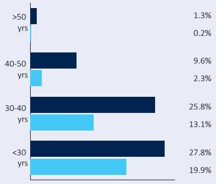

bar

| Age Group | Value (%) |
|---|---|
| >50 yrs | 1.3 |
| 40-50 yrs | 9.6 |
| 30-40 yrs | 25.8 |
| <30 yrs | 27.8 |
| >50 yrs | 0.2 |
| 40-50 yrs | 2.3 |
| 30-40 yrs | 13.1 |
| <30 yrs | 19.9 |

North America   
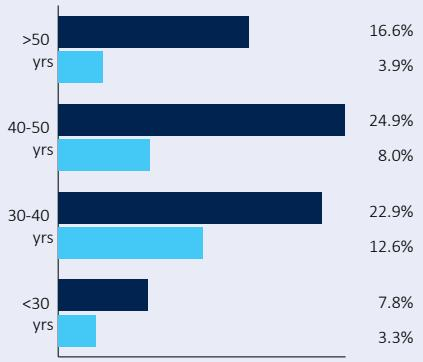

bar

| Category | Series 1 (%) | Series 2 (%) |
|---|---|---|
| >50 yrs | 16.6 | 3.9 |
| 40-50 yrs | 24.9 | 8.0 |
| 30-40 yrs | 22.9 | 12.6 |
| <30 yrs | 7.8 | 3.3 |

United Kingdom   
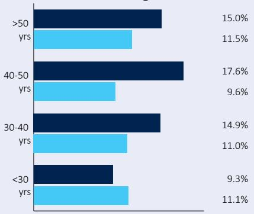

bar

| Category | Series 1 (%) | Series 2 (%) |
|---|---|---|
| >50 yrs | 15.0 | 11.5 |
| 40-50 yrs | 17.6 | 9.6 |
| 30-40 yrs | 14.9 | 11.0 |
| <30 yrs | 9.3 | 11.1 |

Europe   
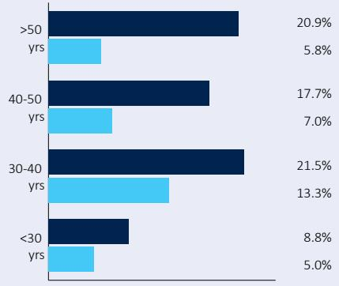

bar

| Category | Series 1 (%) | Series 2 (%) |
|---|---|---|
| >50 yrs | 20.9 | 5.8 |
| 40-50 yrs | 17.7 | 7.0 |
| 30-40 yrs | 21.5 | 13.3 |
| <30 yrs | 8.8 | 5.0 |

Emerging Markets   
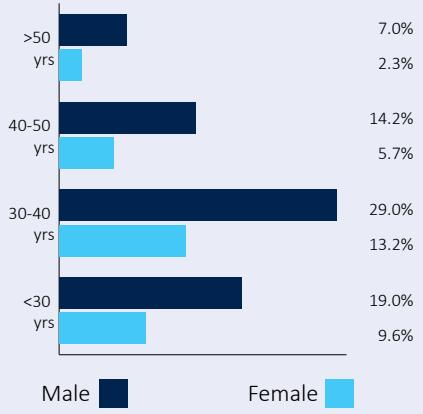

bar

| Category | Male (%) | Female (%) |
|---|---|---|
| >50 yrs | 7.0 | 2.3 |
| 40-50 yrs | 14.2 | 5.7 |
| 30-40 yrs | 29.0 | 13.2 |
| <30 yrs | 19.0 | 9.6 |

APAC   
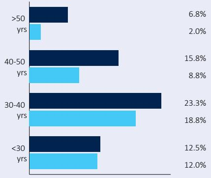

bar

| Category | Series 1 (%) | Series 2 (%) |
|---|---|---|
| >50 yrs | 6.8 | 2.0 |
| 40-50 yrs | 15.8 | 8.8 |
| 30-40 yrs | 23.3 | 18.8 |
| <30 yrs | 12.5 | 12.0 |

# Research and Innovation

TCS Research and Innovation has been investing into two types of initiatives:

Future of Technology Initiatives, aimed at tracking and developing novel technologies and platforms to accelerate technology adoption. They cover several core IT areas, including sensing, communication, computing, data and knowledge engineering, digital and physical AI, and experiential technologies.   
Future of Work Initiatives, aimed at infusing emerging technologies to create new practices for work, focusing on various IT, business, and societal work domains.

Anticipating the rise of quantum sensing, TCS entered a partnership with IIT Bombay to develop India’s first Quantum Diamond Microchip Imager, set to revolutionize semiconductor manufacturing. TCS helps clients tackle complex problems with quantum tech and prepare for challenges like quantum-safe cryptography.

More details on TCS R&I investments during the year are available on Page 73 of Board‘s Report in the section on ‘Technology absorption, adoption and innovation’.

# Artificial Intelligence and Cloud

TCS is investing extensively in AI to redefine many knowledge work domains, such as software engineering, technology modernization, marketing, energy management, drug discovery, accelerated diagnosis and personalized cure, among others. For physical work domains, such as logistics and warehouse management, TCS is developing versatile, intelligent robots and platforms to orchestrate an ensemble of robots and people.

As AI crosses the enterprise adoption chasm, TCS expects data, models, and agents to become increasingly industry or functionspecific. To support this, TCS is making focused investments in several areas:

AI-first Software Development, Maintenance and Operations: A differentiated TCS PoV on enterprise-grade AI-infused SDLC, IT & Business Process Operations, integrated with responsible AI tooling and TCS & partner IP.   
AI-native Application Modernization: Combining deep TCS contextual knowledge of legacy application estates and pairing GenAI with TCS MasterCraft™, TCS Crystallus™ and agentic modernization capability in WisdomNextTM to help customers transform their technology estate with AI.   
AI Reimagined Value Chains powered by Data, Models and Agents: Numerous packaged use-cases and autonomous agents are already catalogued in TCS’ AI platform, WisdomNextTM.   
Partner-led AI Co-innovation: TCS has set up dedicated geo-spread partner teams to deepen co-innovation with major hyperscalers and other important ecosystem players.   
Strategic Advisory: TCS’ AI Advisory and Consulting capability blends strategy and scaled execution to help CXOs navigate

technology fit, value realization, talent impact and emerging regulation (for example, the EU AI Act).

In recent years, market adoption of Cloud has matured to hybrid multi-cloud configurations, requiring seamless integration with private/on-premise systems, future cloud native architectures, AI thought leadership and synergies across many services to deliver the outcomes for the customers. To capitalize on this growth potential in overall Cloud space, TCS has formed full-stack teams in offerings, engineering, sales, solutions, and platform-based operations.

TCS is also doubling down on its world-class advisory team within the central cloud unit to help customers navigate the complexity and cost dynamics of the ever-changing cloud environment.

To bolster cloud partnerships across hyperscalers and other major cloud players, TCS has established a well-networked geo-spread alliance team to closely nurture partner relationships, foster coengineering, and develop joint go-to-market strategies with an aim to hold the elite partner positions.

TCS continues to invest in training, certifications, credentials and in building solutions and intellectual property around hybrid multi-cloud services. The Company has also invested in content partnerships and GenAI playgrounds to enable AI literacy and deep skilling of employees.

In view of the increasing number of large enterprise data transformation programs, TCS is strengthening teams across areas such as streaming data, observability, MLOps, and compliance tooling.

# Products and Platforms

TCS offers a robust suite of products and platforms that drive digital transformation across industries. Its flagship solutions such as ignio™, TCS BaNCS™ and TCS iON™ are designed to enhance agility, efficiency, and customer experience. These solutions leverage cutting-edge technologies including AI, cloud, and analytics to deliver scalable, secure, and future-ready enterprise solutions.

TCS ignio™ introduced Code Accelerator, an advanced GenAI powered tool designed to automate code generation, significantly reducing time to value for customers. It has been deployed across 80% of SaaS customers, boosting productivity by 150%.

TCS BFSI Products and Platforms offers comprehensive solutions for the entire financial services value chain, focusing on Insurance and Capital Markets. As a pioneer in the BPaaS model, TCS delivers end-to-end operations using its software for the Insurance industry. This product is now enhanced with AI and is globally available across TCS’ solutions under the ‘Serviced by Software’ paradigm.

At the heart of this business is TCS BaNCS™, designed to help financial institutions accelerate time-to-market, quickly launch products and improve operational efficiency. The TCS BaNCS Digital Core is complemented by ‘Intelligent Experience’ solutions, which enhances end-customer experience using innovative technologies for digital engagement; and by TCS QuartzTM, which provides the innovation edge to the Digital Core. TCS Quartz™ launched four new solutions in FY 2025, including Intelligent Insights (GenAI-based reporting), and solutions for emerging trends like Digital Identity, ESG Compliance, and Land Registration.

TCS iON™ assessed more than 64 million candidates and launched 270 Learning programs and 48 assessment products.

TCS ADD™ platform went live for Tata Medical Center ISCALL study for fighting Childhood Acute Lymphoblastic Leukemia in India. The study will be run for 10,000 patients covering over 30 sites.

TCS MasterCraft™ is a suite of GenAI-driven intelligent automation products for development and enterprise modernization of applications and data made significant achievements in FY 2025. The product processed 16 million lines of legacy code for modernization, delivering a productivity improvement of 20-30%; generated 125.5 million lines of new code through Low-Code No-Code, with over 50% productivity gains; processed 2.2 billion records for data privacy and 2.98 billion records for data quality.

# Scaling Presence in Growth Markets

Growth markets are characterized by rapidly evolving regulatory landscapes, a burgeoning digital economy, and a pace of technology adoption that often surpasses that of mature markets. TCS stands out in these markets due to its early investments and strong board & C-level relationships, enabling strategic customer engagement, anticipation of industry shifts, and large-scale digital transformation. TCS’ capability in delivering large system integration and transformational projects of national importance in India like BSNL, Passport Seva, Election Commission etc. further differentiates the Company.

Growth Markets require agile, cost-effective solutions, tailored for first-time digital adopters. TCS’ strategy in these markets is anchored in four key pillars: deepening client relationships, expanding the services portfolio to include new-generation services, leveraging TCS IPs and partnerships, and investing in areas such as energy transition, smart cities, and public services. The Company’s unique differentiation lies in its deep client connections, contextual knowledge, domain expertise, and ability to co-innovate with customers through dedicated innovation hubs and research partnerships like TCS GoZero Hub.

Navigating macroeconomic and geopolitical shifts is integral to TCS’ Growth Markets strategy. The Company’s localized presence, strong client relationships, and diversified industry exposure allow it to mitigate risks while capturing new opportunities. This strategic diversity enhances resilience, ensuring that the

Company continues to deliver value to its clients, even amid global uncertai ties.

# Branding

TCS continues to strengthen its brand through strategic investments and global partnerships, anchored by its enduring promise, ‘With you for the long run’. To compliment this, the Company recently introduced the ‘Perpetually Adaptive Enterprise’ narrative, highlighting its long-term vision and commitment to helping clients stay resilient, agile and adaptive in a constantly evolving world.

TCS significantly expanded its brand presence through its premier sports sponsorship portfolio. Last year, TCS partnered with the Sydney Marathon, the first city in the Southern Hemisphere to join the majors circuit and became the official AI and technology partner of the Schneider Electric Marathon de Paris. With 14 major running events worldwide, TCS’ running sponsorships collectively generated US\$2.25 billion in economic impact for host cities and helped raise over US\$279 million for charities. TCS is also the principal partner of Jaguar TCS Racing, leveraging advanced technology to promote sustainable innovation and help accelerate the electrification journey in motorsport. In 2024, Jaguar TCS Racing won the ABB FIA Formula E Teams’ World Championship.

These high-impact partnerships boost TCS’ global visibility and reinforce the Company’s commitment to endurance, progress and shared purpose. In recognition of its sustained investment, TCS was named among the Top 50 global brands across all industries in 2024 by Kantar BrandZ, retained its position as India’s #1 brand, and was valued by Brand Finance at US\$21.3 billion, making it the second most valuable brand in the global IT services sector. TCS’s brand awareness among business executives has reached 95%, reflecting the continued growth and recognition as a global brand.

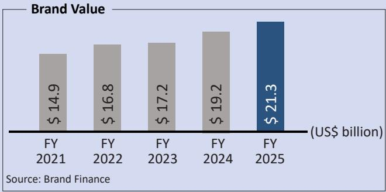

bar

Brand Value
| Fiscal Year | Brand Value (US$ billion) |
| :--- | :--- |
| FY 2021 | 14.9 |
| FY 2022 | 16.8 |
| FY 2023 | 17.2 |
| FY 2024 | 19.2 |
| FY 2025 | 21.3 |
Source: Brand Finance

Together, these brand-building efforts demonstrate TCS’ vision and commitment to creating an adaptive, inclusive, and resilient future with clients, communities, and employees.

# Financial Performance Overview

The discussions in this section relate to the consolidated, Rupee-denominated financial results pertaining to the year that ended March 31, 2025. The financial statements of Tata Consultancy Services Limited and its subsidiaries (collectively referred to as ‘TCS’ or ‘the Company’) are prepared in accordance with the Indian Accounting Standards (referred to as ‘Ind AS’) prescribed under section 133 of the Companies Act, 2013, read with the Companies (Indian Accounting Standards) Rules, as amended from time to time. Significant accounting policies used in the preparation of the financial statements are disclosed in the notes to the consolidated financial statements.

The following table gives an overview of the consolidated financial results of the Company:

(₹ crore) 

<table><tr><td></td><td colspan="3">FY 2025</td><td colspan="2">FY 2024*</td></tr><tr><td></td><td>Amount</td><td>% of Revenue</td><td>% Growth</td><td>Amount</td><td>% of Revenue</td></tr><tr><td>Revenue from operations</td><td>255,324</td><td>100.0</td><td>6.0</td><td>240,893</td><td>100.0</td></tr><tr><td>Earnings before interest and tax (EBIT) (Before other income)</td><td>62,165</td><td>24.3</td><td>4.8</td><td>59,311</td><td>24.6</td></tr><tr><td>Profit after tax attributable to shareholders of the Company</td><td>48,553</td><td>19.0</td><td>4.2</td><td>46,585</td><td>19.3</td></tr><tr><td>Earnings per share (in ₹)</td><td>134.19</td><td></td><td>5.1</td><td>127.74</td><td></td></tr></table>

\* Excludes settlement of legal claim

# Analysis of revenue growth and margin performance

On a reported basis, TCS’ revenue grew 6.0% in FY 2025, compared to 6.8% in the previous year. Despite increased macroeconomic uncertainty, the Company closed the year with a strong and resilient order book. During the year, clients prioritized initiatives around Technology modernization, Cost optimization, Vendor consolidation, Operating model transformation, Risk and Compliance. Ongoing delays and deferrals led to muted revenue growth in FY 2025.

EBIT margins were 24.3% in FY 2025, compared to 24.6%6 in the previous year. The 30-basis point decline was influenced by headwinds from merit-based interventions, including annual hikes, promotions, and investments in infrastructure and capability building. However, tailwinds such as improved utilization, productivity, and realization, along with favorable currency movements, contributed positively to the margins.

Average currency exchange rates during FY 2025 for the three major currencies are given below:

<table><tr><td>Currency</td><td>Weightage (%)</td><td>FY 2025 (₹)</td><td>FY 2024 (₹)</td><td>% Change YoY</td></tr><tr><td>USD</td><td>50.0</td><td>84.59</td><td>82.83</td><td>2.1</td></tr><tr><td>GBP</td><td>14.7</td><td>108.26</td><td>104.07</td><td>4.0</td></tr><tr><td>EUR</td><td>10.9</td><td>90.81</td><td>89.80</td><td>1.1</td></tr></table>

Movements in currency exchange rates through the year resulted in a positive impact of 1.8% on the reported revenue. The constant currency revenue growth for the year, which is the reported revenue growth stripped of the currency impact, was 4.2%.

<table><tr><td>Growth attributable to</td><td>FY 2025 (%)</td><td>FY 2024 (%)</td></tr><tr><td>Business growth</td><td>4.2</td><td>3.4</td></tr><tr><td>Impact of exchange rate</td><td>1.8</td><td>3.4</td></tr><tr><td>Total Growth</td><td>6.0</td><td>6.8</td></tr></table>

# Segmental Performance

TCS has identified business segments('Industry vertical') as reportable segments. The revenue break-up by Industry Vertical and Geography provided below:

Revenue by Industry Vertical   
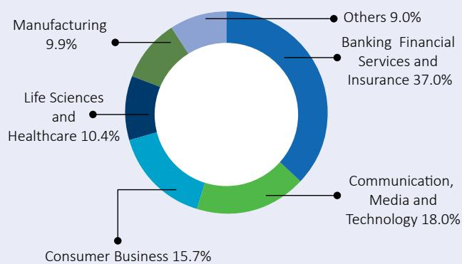

pie

| Category | Percentage (%) |
| :--- | :--- |
| Others | 9.0 |
| Banking Financial Services and Insurance | 37.0 |
| Communication, Media and Technology | 18.0 |
| Consumer Business | 15.7 |
| Life Sciences and Healthcare | 10.4 |
| Manufacturing | 9.9 |

Revenue by Geography   
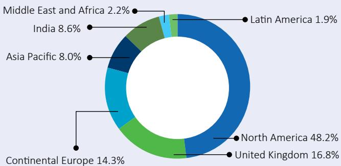

pie

| Region | Percentage (%) |
| :--- | :--- |
| Latin America | 1.9 |
| North America | 48.2 |
| United Kingdom | 16.8 |
| Continental Europe | 14.3 |
| Asia Pacific | 8.0 |
| Middle East and Africa | 2.2 |
| India | 8.6 |

<table><tr><td>Industry Vertical</td><td colspan="2">Segment Revenue (₹ crore)</td><td rowspan="2">YoY Revenue Growth %</td><td colspan="2">Segment Margin (%)</td></tr><tr><td></td><td>FY 2025</td><td>FY 2024</td><td>FY 2025</td><td>FY 2024</td></tr><tr><td>Banking, Financial Services and Insurance</td><td>94,597</td><td>90,928</td><td>4.0</td><td>26.6</td><td>25.9</td></tr><tr><td>Communication, Media and Technology</td><td>45,893</td><td>39,391</td><td>16.5</td><td>20.9</td><td>27.7</td></tr><tr><td>Consumer Business</td><td>40,197</td><td>39,357</td><td>2.1</td><td>27.9</td><td>26.0</td></tr><tr><td>Life Sciences and Healthcare</td><td>26,456</td><td>26,745</td><td>(1.1)</td><td>28.2</td><td>28.5</td></tr><tr><td>Manufacturing</td><td>25,170</td><td>23,491</td><td>7.1</td><td>32.7</td><td>30.9</td></tr><tr><td>Others</td><td>23,011</td><td>20,981</td><td>9.7</td><td>25.2</td><td>22.3</td></tr></table>

# Overview of Funds Invested

TCS’ investment strategy focuses on selecting a balanced mix of long-term and short-term instruments to seize market opportunities and achieve higher yields. By optimizing working capital, TCS enhances efficiency, resulting in improved overall returns.

(\` crore)

<table><tr><td></td><td>FY 2025</td><td>FY 2024</td></tr><tr><td></td><td colspan="2">Total funds invested</td></tr><tr><td>Investments in mutual funds, Government securities and others</td><td>30,956</td><td>31,730</td></tr><tr><td>Deposits with banks</td><td>12,831</td><td>12,259</td></tr><tr><td>Inter-corporate deposits</td><td>-</td><td>170</td></tr><tr><td>Cash and bank balances</td><td>3,435</td><td>2,804</td></tr><tr><td>Total</td><td>47,222</td><td>46,963</td></tr></table>

# Business Outlook

Global growth is projected to be 2.8% in 2025 and 3.0% in 20267 , significantly below the 3.7% average growth rate seen from 2000 to 2019. While global economic activity faces headwinds from geopolitical and policy uncertainties, there are opportunities for resilience and recovery. Clearer trade agreements and improved global cooperation could help regain momentum. However, risks like financial market volatility, demographic shifts, and fiscal constraints persist. Proactive policy responses and innovation-driven growth can help mitigate these pressures.

In this challenging environment, enterprises are expected to go through longer decision cycles and experience increased scrutiny on discretionary spending. Staying close to changing customer needs is essential to understanding both direct and indirect impacts. Businesses must embrace continuous transformation to stay resilient and shifting market dynamics call for the ability to anticipate change, adapt rapidly, and turn potential disruptions into strategic advantages.

Key demand drivers expected to power the Company’s growth in FY 2026 include:

Technology Modernization and Transformation – Cloud migration and transformation, data estate modernization, efficiency and resilience through technology upgrades, modernizing legacy systems, ERP/ the digital core, scaling intelligent operations by leveraging IoT, computer vision, robotics to enhance efficiency, and establishing Data & Cybersecurity foundations and Centres of Excellence for evaluating AI & GenAI use cases.   
Business Transformation – Customer experience transformation using AI-driven commerce, hyper-personalization, omnichannel strategies, supply chain modernization, data analytics, and hyper-automation to drive business outcomes. Robust data foundations, AI trust frameworks, and AI-enabled cybersecurity will strengthen resilience, while data-driven insights will power innovation across industries.   
Operating Model Transformation - Cost optimization, vendor consolidation, AI/GenAI led transformation of IT/business operations for greater resilience and leaner operating models, managed services models and real time operation visibility, risk and compliance initiatives.   
Tech-enabled Sustainability – Rising demand for tech-enabled sustainability solutions with emphasis on grid modernization, renewable energy integration, decarbonization, real-time insights driven maintenance & operations, and energy management.

# Enterprise Risk Management

TCS understands the importance of effectively managing and mitigating risks to protect the Company’s business and its clients and to add value for all its stakeholders. Based on the Risk Management Policy approved by the Board, the Company follows a comprehensive enterprise risk management framework (based on best practices from COSO 2017 and ISO 31000:2018) that encompasses risk identification, risk assessment, risk response planning and actions, risk monitoring and overall risk governance. TCS fosters a risk-aware culture, empowering leaders to take intelligent risks to maximize value. Regular risk reviews, assessments, and scenario planning help anticipate challenges and develop mitigation plans. Key risk indicators and control indicators are used to assess risks, provide early warnings, and consider effectiveness of the mitigation actions, respectively. TCS engages with all stakeholders, including customers, employees, suppliers, partners and regulatory authorities, to ensure transparent and collaborative risk management practices. The focus remains on driving sustainable growth, fostering innovation, delivering value to its clients, employees, and shareholders, being resilient and enhancing its reputation.

TCS takes a holistic view of its enterprise risk profile, covering strategic, operational, compliance, financial and catastrophic risks, thus enabling informed decision-making. Risks are assessed and managed at various levels with a top-down and bottom-up approach across the enterprise, business units, geographies, corporate functions, customer relationships and individual projects.

By proactively managing and mitigating these risks, TCS aims to ensure the long-term sustainability and success of the Company. TCS is confident that its robust risk management initiatives, coupled with its commitment to innovation and excellence, will enable the Company to navigate the challenges of the IT industry and global environment, and capitalize on the opportunities that lie ahead.

While the Company tracks various risks to the business, listed below are some of the key risks (R) and opportunities (O), anticipated impact on the Company8 and mitigation strategies.9

# Volatile global, political and economic environment (R)

Impact On

Financial implications of R/O

# Risk:

The volatility of geo-political events and macroeconomic changes, like wars, adverse trade policies and continuing high inflation in major economies can impact client spending and also squeeze liquidity. TCS’ clients’ business outlook could be affected and in turn result in demand uncertainty for TCS’ services, and an increase in TCS’ cost of doing business. Risks to service delivery, business continuity, cybersecurity, sanctions compliance and human rights in geo-politically sensitive zones may increase costs and impact revenue growth.

# Mitigation:

Broad-based business mix with diversified focus across geographies and industry verticals and targeting CXO business in addition to CIOs aid in balancing the risk impact. Active monitoring of the changing geo-political landscape, ensuring business continuity plans and strengthening internal controls against secondary risks continue.

# Restrictions on global mobility, location strategies (R)

Impact On

Financial implications of R/O

# Risk:

The global delivery model requires the mobility of the Company’s skilled professionals across the globe, and any regulatory restrictions in key markets can pose a threat. This may also have an impact on the cost of doing business and client project delays.

# Mitigation:

Promoting usage of Location Independent AgileTM model with increased collaboration, material reduction in dependency on work visas through increased hiring of local talent and promoting local talent building in STEM areas helps to minimize this risk.

# Ability to attract and retain top talent; short supply of emerging technical skills (R)

Impact On

Financial implications of R/O

# Risk:

In a knowledge industry, growth is dependent on the ability to attract, develop, inspire, and retain talent. New emerging technology areas also require niche skill sets, and talent scarcity in the industry may result in attrition in these areas.

# Mitigation:

Huge investments in talent development with the focus of re-skilling programs to adapt to new and emerging technologies have been made and which will continue at a rapid pace. Expanding business delivery centres to tier-2/tier-3 cities in India to enable leveraging local talent supply and diversification also aids in addressing the talent risk. Investments are also made in branding, STEM/goIT programs and campus engagements in global markets, to improve local hiring and retention.

# Business model changes in customer environment (R & O)

Impact On

Financial implications of R/O

# Risk:

With new consumer patterns/behaviour unfolding, industries are evolving their business models. Some customers and segments may see restructuring initiatives, to adapt to newer markets, competition, mergers/acquisition, regulatory drivers and enhance efficiencies to create new business opportunities. This may result in an impact on the current services being provided.

# Mitigation:

Scanning future industry outlook for both business & technology for trends, capabilities & solutions, and providing pro-active, agile responses to drive transformation for the customer using differentiated offerings.

# Opportunity:

Technology enabled business model innovation for clients, driving value for clients in their business transformation journey.

# Currency volatility (R)

Impact On

Financial implications of R/O

# Risk:

Volatility in TCS’ functional currency (INR) against major currencies may cause fluctuation in the reported revenue, profitability/margins, which may impact stakeholder perceptions of the underlying business momentum and profitability.

# Mitigation:

To limit the impact of short-term exchange volatility, the currency hedging policy aligned with best practices is in place. Hedging strategies are guided and monitored by the Risk Management Committee of the Board. Management commentary is based on constant currency for better stakeholder understanding of business performance.

# Cyber Attacks (R & O)

Impact On

Financial implications of R/O

# Risk:

Risks of cyber-attacks are on a constant rise and evolving quickly with far-reaching consequences. Attacks may emerge due to geo-political events, pandemic themed cyber threats etc. Security breaches could result in reputational damage, penalties, and legal and financial liabilities along with impact on business operations.

# Mitigation:

Investments in state-of-the-art security operations centre with automated playbooks; continued reinforcement of stringent security policies, procedures and controls (ISO 27001 certified), enterprise-wide training/awareness programs and communication with internal and external audits. Use of advanced AI/ML based tools to detect and prevent incursions with advanced quarantine capabilities, including perimeter security controls with enhanced internal vulnerability detection, data leak prevention tools, incident management and recovery process, red/purple teaming, “breach and attack” simulations in compliance with industry best practices are implemented. Close collaboration with Computer Emergency Response Team (CERT) and other private cyber intelligence agencies help to stay ahead of the curve.

# Opportunity:

It is imperative for all enterprises to create robust and proactive cyber resilience strategies to address increasing threats. This presents opportunities for TCS to modernize security operations, transform and uplift cyber defense & cyber offense, invest in GenAI and Cloud security offerings and de-risk future quantum computer-based attacks for its customers.

# Data protection and privacy compliance (R & O)

Impact On

Financial implications of R/O

# Risk:

TCS’ global nature of operations requires it to be compliant with various privacy legislations like GDPR, DPDPA etc. carrying severe consequences for violations and data breaches. Privacy risks have increased with AI adoption getting democratized with the latest tools. Any violations or data breaches can have an impact on the Company’s business operations and its brand with material liabilities.

# Mitigation:

The global privacy policy supported by the Privacy governance framework PriVACE, organization structure with a Global Privacy Office and Geography level DPOs, embedding ‘Privacy by design’ in TCS’ solution/service delivery, risk based due diligence on third parties, data protection controls and audits across all its areas of operation ensure the risk is minimized.

Keeping up to date with regulatory changes, training and awareness for all stakeholders and strong governance at regional and enterprise level has continuous focus.

# Opportunity:

Enterprises, increasing their investments in enhancing Data Privacy, opens a fast-growing business opportunity for TCS.

# Non-compliance with complex and changing global regulations (R & O)

Impact On

Financial implications of R/O

# Risk:

TCS’ global nature of operations requires it to comply with ever-evolving, complex regulatory requirements across multiple jurisdictions & compliance areas. Failure to comply can result in penalties, reputational damage, and criminal prosecution.

# Mitigation:

A centralised program for horizon scanning of all regulatory changes, combined with an enterprise-wide regulatory compliance framework for adoption into policies, processes and controls ensure compliance with all regulatory obligations. Continued focus on fostering an ethical and compliance culture, with governance at board, executive and management levels through quarterly declarations, risk assessments and audits enable the Company to stay compliant in an ever-changing environment.

# Opportunity:

Enterprises need to invest in compliance programs to keep up with evolving regulations in their sector or geography. TCS provides Governance, Risk and Compliance (GRC) services and offerings to enterprises in various industry compliance domains, especially regulated industries.

# Intellectual Property (IP) infringement and leakage (R)

# Impact On

# Financial implications of R/O

# Risk:

Risk of infringement of IP of customers, suppliers, partners and alliance organizations by TCS associates may lead to potential liabilities, increased litigation and reputation impact.

Also, inadequate protection of TCS’ IP may lead to potential loss of ownership rights, revenue and value.

# Mitigation:

An industry leading IP Management Framework with processes, contractual and operational controls and tools to prevent and detect risks of IP infringement has been established, with a well-defined (software) asset lifecycle governance framework ensuring that TCS products are safe to create, safe to protect and safe to use. Employee level key controls include employee confidentiality agreement, training and awareness for IP protection and prevention of IP contamination and infringement.

# Sustainability Risks – Climate change and Environmental aspects (R & O)

# Impact On

# Financial implications of R/O

# Risk:

With globally distributed operations, the Company faces physical risks to life and property due to extreme weather events; transition risks resulting from disruptions in the market and emerging regulations; disruptions to operations due to water scarcity; risks of inadvertent non-compliance to emerging regulatory requirements, impacting health and safety in local communities and business disruption. All of these could affect TCS’ growth, profitability and reputation.

# Mitigation:

TCS’ Delivery centers are designed to withstand extreme weather events, with Business continuity plans tested periodically to ensure effectiveness. Investments in Green office buildings, green IT, use of renewable energy, reduction in carbon footprint & focus on waste management with circular economy principles are being done.

Water management through upgradation of water infrastructure, controls to minimize freshwater consumption, sewage treatment, recycling of treated water, and rainwater harvesting.

Focus on Supply chain sustainability with responsible sourcing, sustainability assessments, training and awareness for all stakeholders.

Associate engagement on environmental awareness including initiatives like TCS Circle4Life™ are done round the year.

# Opportunity:

Growing commitment by enterprises to reduce carbon footprint and regulatory requirements open new opportunities for TCS to provide business led technology solutions. TCS products and solutions such as TCS Clever Energy™, Envirozone™, ESG integration solution help accelerate customers’ sustainability journeys.

# Litigation risks (R)

# Impact On

# Financial implications of R/O

# Risk:

Litigation risks might arise from commercial disputes, alleged violation of IPR, personal data/information breach incidents/ claims   and employment related matters. The Company’s rising profile and scale also makes it an attractive target for meritless lawsuits. These lead to reputation risk, legal expenses and adverse rulings can result in substantive damage.

# Mitigation:

Strong processes, controls and governance for compliance to contractual obligations, information security, IP policy and immigration. Strengthened the team of in-house counsels in all major geographies and a network of reputed global law firms in countries TCS operates. Arbitration has been included as a dispute resolution mechanism as against court trials and waivers of jury trial, particularly in the US Geography.

# Disruptive Technologies (R & O)

# Impact On

# Financial implications of R/O

# Risk:

Technology disruption is happening at an unprecedented pace. Inadequate guardrails and governance to address inherent risks of use of emerging technology can cause significant quality, security, IP and ethical concerns. GenAI technologies could disrupt existing software development methods, causing unrealistic market expectations in the short term, impacting TCS’ value proposition.

# Mitigation:

Investments in large-scale re-skilling of TCS associates on AI and other new technologies are progressing well. Innovation in frameworks, methods, guardrails to address risks, investments in the required infrastructure and safe environments are being made. Investments in research and capabilities to devise new software development methods leveraging AI are being made. TCS is working with standards and regulatory bodies for safe use of new technology.

# Opportunity:

Leveraging new & emerging technology to design technology and industry specific offerings, to reimagine customer experience, improve productivity and bring significant transformation in TCS’ customer organizations.

# Internal Financial Control Systems and their Adequacy

TCS has aligned its systems of internal financial control in line with the globally accepted risk-based framework issued by the Committee of Sponsoring Organizations (COSO) of the Treadway Commission. This framework of internal financial controls meets the requirement of the Companies Act, 2013. The Internal Control – Integrated Framework (the 2013 framework) is intended to increase transparency and accountability in an organization’s process of designing and implementing a system of internal control. The framework requires a company to identify and analyze risks and manage appropriate responses. The Company has successfully laid down the framework and ensured its effectiveness.

TCS’ internal controls are commensurate with its size and the nature of its operations. These have been designed to provide reasonable assurance with regard to recording and providing reliable financial and operational information, complying with applicable statutes, safeguarding assets from unauthorized use, executing transactions with proper authorization and ensuring compliance with corporate policies. TCS has a welldefined delegation of power with authority limits commensurate with the responsibilities for approving engagements with all stakeholders that commit organizational resources and results in creation of assets and liabilities, income and expenditure. TCS employs an advanced Enterprise Resource Planning (ERP) system that connects all parts of the organization, to record data for accounting, consolidation and management information purposes. It has continued its efforts to align all its processes and controls with global best practices.

TCS management assessed the effectiveness of the Company’s internal control over financial reporting [as defined in Regulation 17 of Securities and Exchange Board of India (Listing Obligations and Disclosure Requirements) Regulations, 2015] as of March 31, 2025.

B S R & Co. LLP, the statutory auditors of TCS, have audited the financial statements included in this Integrated Annual Report and have issued an attestation report on the Company’s internal control over financial reporting (as defined in Section 143 of the Companies Act, 2013).

TCS has appointed PricewaterhouseCoopers Services LLP to oversee and carry out an internal audit of its activities. Design and operating effectiveness of process controls on financial transactions is also audited by an independent in-house internal audit team. The audit is based on an internal audit plan, which is reviewed each year in consultation with the statutory auditors and approved by the Audit Committee. In line with international practice, the conduct of internal audit is oriented towards the review of internal controls and risks in the Company’s operations such as software delivery, accounting and finance, procurement, employee engagement, travel, insurance, IT processes, including the subsidiaries and foreign branches.

TCS also undergoes periodic audit by specialized third party consultants and professionals for business specific compliances such as quality management, service management, information security, etc. The Audit Committee reviews reports submitted by the management and audit reports submitted by internal auditors and statutory auditors. Suggestions for improvement are considered, and the Audit Committee follows corrective action. The Audit Committee also meets TCS’ statutory auditors to ascertain, inter alia, their views on the adequacy of internal control systems and keeps the Board of Directors informed of its major observations periodically.

Based on its evaluation [as defined in Section 177 of the Companies Act, 2013 and Regulation 18 of Securities and Exchange Board of India (Listing Obligations and Disclosure Requirements) Regulations, 2015], TCS’ Audit Committee noted that, as of March 31, 2025, the Company’s internal financial controls were adequate and operating effectively.

Performance Trend – 10 years   
(\` crore) 

<table><tr><td></td><td>FY 2025</td><td>FY 2024*</td><td>FY 2024</td><td>FY 2023</td><td>FY 2022</td><td>FY 2021*</td><td>FY 2021</td><td>FY 2020</td><td>FY 2019</td><td>FY 2018</td><td>FY 2017</td><td>FY 2016</td></tr><tr><td>Revenue from operations</td><td></td><td></td><td></td><td></td><td></td><td></td><td></td><td></td><td></td><td></td><td></td><td></td></tr><tr><td>Total revenue from operations</td><td>255,324</td><td>240,893</td><td>240,893</td><td>225,458</td><td>191,754</td><td>164,177</td><td>164,177</td><td>156,949</td><td>146,463</td><td>123,104</td><td>117,966</td><td>108,646</td></tr><tr><td>Revenue by geographic segments</td><td></td><td></td><td></td><td></td><td></td><td></td><td></td><td></td><td></td><td></td><td></td><td></td></tr><tr><td>Americas</td><td>127,870</td><td>127,939</td><td>127,939</td><td>124,336</td><td>100,072</td><td>84,278</td><td>84,278</td><td>82,000</td><td>77,562</td><td>66,145</td><td>66,091</td><td>60,011</td></tr><tr><td>Europe</td><td>79,487</td><td>75,624</td><td>75,624</td><td>67,436</td><td>61,142</td><td>52,346</td><td>52,346</td><td>48,037</td><td>43,456</td><td>34,155</td><td>30,038</td><td>29,092</td></tr><tr><td>India</td><td>22,060</td><td>13,562</td><td>13,562</td><td>11,271</td><td>9,805</td><td>8,449</td><td>8,449</td><td>8,964</td><td>8,393</td><td>7,921</td><td>7,415</td><td>6,729</td></tr><tr><td>Others</td><td>25,907</td><td>23,768</td><td>23,768</td><td>22,415</td><td>20,735</td><td>19,104</td><td>19,104</td><td>17,948</td><td>17,052</td><td>14,883</td><td>14,422</td><td>12,814</td></tr><tr><td>Cost</td><td></td><td></td><td></td><td></td><td></td><td></td><td></td><td></td><td></td><td></td><td></td><td></td></tr><tr><td>Employee cost</td><td>145,788</td><td>140,131</td><td>140,131</td><td>127,522</td><td>107,554</td><td>91,814</td><td>91,814</td><td>85,952</td><td>78,246</td><td>66,396</td><td>61,621</td><td>55,348</td></tr><tr><td>Other operating cost</td><td>42,129</td><td>36,466</td><td>37,424</td><td>38,677</td><td>31,143</td><td>25,817</td><td>27,035</td><td>28,888</td><td>28,711</td><td>24,192</td><td>24,034</td><td>22,621</td></tr><tr><td>Total cost (excluding interest &amp; depreciation)</td><td>187,917</td><td>176,597</td><td>177,555</td><td>166,199</td><td>138,697</td><td>117,631</td><td>118,849</td><td>114,840</td><td>106,957</td><td>90,588</td><td>85,655</td><td>77,969</td></tr><tr><td>Profitability</td><td></td><td></td><td></td><td></td><td></td><td></td><td></td><td></td><td></td><td></td><td></td><td></td></tr><tr><td>EBIT</td><td>62,165</td><td>59,311</td><td>58,353</td><td>54,237</td><td>48,453</td><td>42,481</td><td>41,263</td><td>38,580</td><td>37,450</td><td>30,502</td><td>30,324</td><td>28,789</td></tr><tr><td>Profit before tax</td><td>65,331</td><td>63,038</td><td>61,997</td><td>56,907</td><td>51,687</td><td>44,978</td><td>43,760</td><td>42,248</td><td>41,563</td><td>34,092</td><td>34,513</td><td>31,840</td></tr><tr><td>Profit after tax attributable to shareholders of the Company</td><td>48,553</td><td>46,585</td><td>45,908</td><td>42,147</td><td>38,327</td><td>33,388</td><td>32,430</td><td>32,340</td><td>31,472</td><td>25,826</td><td>26,289</td><td>24,270</td></tr><tr><td>Financial Position</td><td></td><td></td><td></td><td></td><td></td><td></td><td></td><td></td><td></td><td></td><td></td><td></td></tr><tr><td>Equity share capital</td><td>362</td><td>362</td><td>362</td><td>366</td><td>366</td><td>370</td><td>370</td><td>375</td><td>375</td><td>191</td><td>197</td><td>197</td></tr><tr><td>Reserves and surplus</td><td>94,394</td><td>90,805</td><td>90,127</td><td>90,058</td><td>88,773</td><td>87,014</td><td>86,063</td><td>83,751</td><td>89,071</td><td>84,937</td><td>86,017</td><td>70,875</td></tr><tr><td>Gross block of property, plant and equipment</td><td>37,277</td><td>33,853</td><td>33,853</td><td>32,344</td><td>30,300</td><td>28,658</td><td>28,658</td><td>26,444</td><td>24,522</td><td>22,720</td><td>20,891</td><td>19,308</td></tr><tr><td>Total investments</td><td>30,964</td><td>31,762</td><td>31,762</td><td>37,163</td><td>30,485</td><td>29,373</td><td>29,373</td><td>26,356</td><td>29,330</td><td>36,008</td><td>41,980</td><td>22,822</td></tr><tr><td>Net current assets</td><td>70,010</td><td>67,558</td><td>66,880</td><td>66,712</td><td>65,959</td><td>66,076</td><td>65,125</td><td>63,177</td><td>70,047</td><td>63,396</td><td>65,804</td><td>47,644</td></tr><tr><td>Earnings per share in ₹</td><td></td><td></td><td></td><td></td><td></td><td></td><td></td><td></td><td></td><td></td><td></td><td></td></tr><tr><td>EPS- as reported</td><td>134.19</td><td>127.74</td><td>125.88</td><td>115.19</td><td>103.62</td><td>89.27</td><td>86.71</td><td>86.19</td><td>83.05</td><td>134.19</td><td>133.41</td><td>123.18</td></tr><tr><td>EPS- adjusted for Bonus Issue</td><td>134.19</td><td>127.74</td><td>125.88</td><td>115.19</td><td>103.62</td><td>89.27</td><td>86.71</td><td>86.19</td><td>83.05</td><td>67.10</td><td>66.71</td><td>61.59</td></tr><tr><td>Headcount (number)</td><td></td><td></td><td></td><td></td><td></td><td></td><td></td><td></td><td></td><td></td><td></td><td></td></tr><tr><td>Headcount (including subsidiaries) as on March 31st</td><td>607,979</td><td>601,546</td><td>601,546</td><td>614,795</td><td>592,195</td><td>488,649</td><td>488,649</td><td>448,464</td><td>424,285</td><td>394,998</td><td>387,223</td><td>353,843</td></tr></table>

\*Excludes provision (FY 2021) and settlement (FY 2024) of legal claim.

Ratio Analysis – 10 years 

<table><tr><td></td><td>Units</td><td>FY 2025</td><td>FY 2024*</td><td>FY 2024</td><td>FY 2023</td><td>FY 2022</td><td>FY 2021*</td><td>FY 2021</td><td>FY 2020</td><td>FY 2019</td><td>FY 2018</td><td>FY 2017</td><td>FY 2016</td></tr><tr><td>Ratios - Financial Performance</td><td></td><td></td><td></td><td></td><td></td><td></td><td></td><td></td><td></td><td></td><td></td><td></td><td></td></tr><tr><td>Employee Cost / Total Revenue</td><td>%</td><td>57.1</td><td>58.2</td><td>58.2</td><td>56.6</td><td>56.1</td><td>55.9</td><td>55.9</td><td>54.8</td><td>53.4</td><td>53.9</td><td>52.2</td><td>50.9</td></tr><tr><td>Other Operating Cost / Total Revenue</td><td>%</td><td>16.5</td><td>15.1</td><td>15.5</td><td>17.1</td><td>16.2</td><td>15.7</td><td>16.5</td><td>18.4</td><td>19.6</td><td>19.7</td><td>20.4</td><td>20.9</td></tr><tr><td>Total cost (excluding interest &amp; depreciation) / Total Revenue</td><td>%</td><td>73.6</td><td>73.3</td><td>73.7</td><td>73.7</td><td>72.3</td><td>71.6</td><td>72.4</td><td>73.2</td><td>73.0</td><td>73.6</td><td>72.6</td><td>71.8</td></tr><tr><td>EBIT / Total Revenue</td><td>%</td><td>24.3</td><td>24.6</td><td>24.2</td><td>24.1</td><td>25.3</td><td>25.9</td><td>25.1</td><td>24.6</td><td>25.6</td><td>24.8</td><td>25.7</td><td>26.5</td></tr><tr><td>Profit Before Tax / Total Revenue</td><td>%</td><td>25.6</td><td>26.2</td><td>25.7</td><td>25.2</td><td>27.0</td><td>27.4</td><td>26.7</td><td>26.9</td><td>28.4</td><td>27.7</td><td>29.3</td><td>29.3</td></tr><tr><td>Tax / Total Revenue</td><td>%</td><td>6.5</td><td>6.8</td><td>6.6</td><td>6.5</td><td>6.9</td><td>7.0</td><td>6.8</td><td>6.2</td><td>6.8</td><td>6.7</td><td>6.9</td><td>6.9</td></tr><tr><td>Effective Tax Rate- Tax / PBT</td><td>%</td><td>25.3</td><td>25.8</td><td>25.6</td><td>25.7</td><td>25.6</td><td>25.5</td><td>25.6</td><td>23.2</td><td>24.1</td><td>24.1</td><td>23.6</td><td>23.6</td></tr><tr><td>Profit After Tax / Total Revenue</td><td>%</td><td>19.0</td><td>19.3</td><td>19.1</td><td>18.7</td><td>20.0</td><td>20.3</td><td>19.8</td><td>20.6</td><td>21.5</td><td>21.0</td><td>22.3</td><td>22.3</td></tr><tr><td>Ratios - Growth</td><td></td><td></td><td></td><td></td><td></td><td></td><td></td><td></td><td></td><td></td><td></td><td></td><td></td></tr><tr><td>Total Revenue</td><td>%</td><td>6.0</td><td>6.8</td><td>6.8</td><td>17.6</td><td>16.8</td><td>4.6</td><td>4.6</td><td>7.2</td><td>19.0</td><td>4.4</td><td>8.6</td><td>14.8</td></tr><tr><td>EBIT</td><td>%</td><td>4.8</td><td>9.4</td><td>7.6</td><td>11.9</td><td>14.1</td><td>10.1</td><td>7.0</td><td>3.0</td><td>22.8</td><td>0.6</td><td>5.3</td><td>13.7</td></tr><tr><td>Profit After Tax</td><td>%</td><td>4.2</td><td>10.5</td><td>8.9</td><td>10.0</td><td>14.8</td><td>3.2</td><td>0.3</td><td>2.8</td><td>21.9</td><td>(1.8)</td><td>8.3</td><td>22.3</td></tr><tr><td>Ratios - Balance Sheet</td><td></td><td></td><td></td><td></td><td></td><td></td><td></td><td></td><td></td><td></td><td></td><td></td><td></td></tr><tr><td>Debt (excluding lease liabilities)- Equity Ratio</td><td>Times</td><td>-</td><td>-</td><td>-</td><td>-</td><td>-</td><td>-</td><td>-</td><td>-</td><td>-</td><td>0.0</td><td>0.0</td><td>0.0</td></tr><tr><td>Current Ratio</td><td>Times</td><td>2.3</td><td>2.5</td><td>2.5</td><td>2.5</td><td>2.6</td><td>3.0</td><td>2.9</td><td>3.3</td><td>4.2</td><td>4.6</td><td>5.5</td><td>4.1</td></tr><tr><td>Days Sales Outstanding (DSO) in ₹ terms</td><td>Days</td><td>72</td><td>68</td><td>68</td><td>67</td><td>65</td><td>67</td><td>67</td><td>71</td><td>68</td><td>74</td><td>70</td><td>81</td></tr><tr><td>Days Sales Outstanding (DSO) in US$ terms</td><td>Days</td><td>71</td><td>67</td><td>67</td><td>65</td><td>64</td><td>68</td><td>68</td><td>67</td><td>69</td><td>74</td><td>73</td><td>80</td></tr><tr><td>Invested Funds / Capital Employed</td><td>%</td><td>44.9</td><td>47.7</td><td>47.3</td><td>50.4</td><td>57.4</td><td>52.6</td><td>53.1</td><td>47.7</td><td>55.2</td><td>55.6</td><td>55.8</td><td>45.8</td></tr><tr><td>Capital Expenditure / Total Revenue</td><td>%</td><td>1.9</td><td>1.1</td><td>1.1</td><td>1.4</td><td>1.5</td><td>1.9</td><td>1.9</td><td>2.0</td><td>1.5</td><td>1.5</td><td>1.7</td><td>1.8</td></tr><tr><td>Operating Cash Flows / Total Revenue</td><td>%</td><td>19.2</td><td>18.7</td><td>18.4</td><td>18.6</td><td>20.8</td><td>23.6</td><td>23.6</td><td>20.6</td><td>19.5</td><td>20.4</td><td>21.4</td><td>17.6</td></tr><tr><td>Free Cash Flow / Operating Cash Flow Ratio</td><td>%</td><td>89.8</td><td>94.1</td><td>94.0</td><td>92.7</td><td>92.6</td><td>91.9</td><td>91.9</td><td>90.5</td><td>92.5</td><td>92.8</td><td>92.3</td><td>89.7</td></tr><tr><td>Depreciation of Property, Plant and Equipment / Average Gross Block of Property, Plant and Equipment</td><td>%</td><td>7.6</td><td>8.4</td><td>8.4</td><td>9.2</td><td>9.1</td><td>8.7</td><td>8.7</td><td>8.6</td><td>8.5</td><td>9.1</td><td>9.5</td><td>10.0</td></tr><tr><td>Ratios - Per Share</td><td></td><td></td><td></td><td></td><td></td><td></td><td></td><td></td><td></td><td></td><td></td><td></td><td></td></tr><tr><td>EPS- adjusted for Bonus</td><td>₹</td><td>134.19</td><td>127.74</td><td>125.88</td><td>115.19</td><td>103.62</td><td>89.27</td><td>86.71</td><td>86.19</td><td>83.05</td><td>67.10</td><td>66.71</td><td>61.59</td></tr><tr><td>Price Earnings Ratio, end of year</td><td>Times</td><td>26.9</td><td>30.3</td><td>30.8</td><td>27.8</td><td>36.1</td><td>35.6</td><td>36.6</td><td>21.2</td><td>24.1</td><td>21.2</td><td>18.2</td><td>20.4</td></tr><tr><td>Dividend Per Share</td><td>₹</td><td>126.00</td><td>73.00</td><td>73.00</td><td>115.00</td><td>43.00</td><td>38.00</td><td>38.00</td><td>73.00</td><td>30.00</td><td>50.00</td><td>47.00</td><td>43.50</td></tr><tr><td>Dividend Per Share- adjusted for Bonus</td><td>₹</td><td>126.00</td><td>73.00</td><td>73.00</td><td>115.00</td><td>43.00</td><td>38.00</td><td>38.00</td><td>73.00</td><td>30.00</td><td>25.00</td><td>23.50</td><td>21.75</td></tr><tr><td>Market Capitalization / Total Revenue</td><td>Times</td><td>5.1</td><td>5.8</td><td>5.8</td><td>5.2</td><td>7.1</td><td>7.2</td><td>7.2</td><td>4.4</td><td>5.1</td><td>4.4</td><td>4.1</td><td>4.6</td></tr></table>

\* Excludes provision (FY 2021) and settlement (FY 2024) of legal claim.

# Corporate

# Governance Report

Company’s Philosophy on Corporate Governance Effective corporate governance practices constitute the cornerstone of enduring and successful businesses. The Company’s commitment to corporate governance guides its business decisions while ensuring financial responsibility, ethical conduct, and fairness to all stakeholders including employees, customers, investors, regulators, suppliers and the society at large.

Strong leadership and effective corporate governance practices have been integral to the Company, aligned with the Tata culture and ethos. The Company adheres to the Tata group philosophy of building sustainable, communityfocused businesses that demonstrate deep respect for the environment. As part of the Tata group, known for its commitment to sustainability, the Company has inherited a strong tradition of ethical and transparent governance, in accordance with the Tata Code of Conduct (“TCoC”).

The Company has adopted the TCoC for its employees including the Chief Executive Officer and Managing Director and the Executive Directors. In addition, the Company has

adopted a Code of Conduct for its non-executive directors which includes Code of Conduct for Independent Directors which aligns with the responsibilities outlined in the Companies Act, 2013 (“the Act”).

The Company’s corporate governance framework is further supported by the Tata Business Excellence Model, the TCS Code of Conduct for Prevention of Insider Trading and the Code of Corporate Disclosure Practices (“Insider Trading Code”). Further, an Information Security Policy is also in place to ensure responsible use of IT resources.

The Company fully complies with the corporate governance requirements stipulated under Regulations 17 to 27 read with Schedule V and clauses (b) to (i) and (t) of sub-regulation (2) of Regulation 46 of Securities and Exchange Board of India (Listing Obligations and Disclosure Requirements) Regulations, 2015 (“SEBI Listing Regulations”), as applicable.

The Board structure and the various committees that constitute the governance structure1 of the organization are covered in detail in this report.

text_image

Business professionals reviewing printed reports with a line chart and bar chart graphics, overlaid with abstract graphic elements.

The various material aspects of corporate governance and TCS’ approach to them are discussed in the table below:

<table><tr><td>Material Topic</td><td colspan="2">TCS' Approach</td></tr><tr><td>Board effectiveness, independence and protection of minority shareholders' interests</td><td colspan="2">Board effectiveness is enhanced by setting a high bar in selecting the right mix of individuals to serve on the Board, with the right qualifications, expertise and experience, who can collectively serve the best interests of all stakeholders, maintain Board and management accountability and drive corporate ethics, values and sustainability. Profiles of Board of Directors are available athttps://www.tcs.com/who-we-are/leadership.For greater diversity of opinions and perspectives within the Board, the Nomination and Remuneration  $Committee^2$  has fostered diversity in terms of backgrounds, areas of expertise and:Gender: Two out of the eight Directors (25%) are women;Nationality: Four nationalities represented – Indian, American, Danish and British;Industry: Technology, Banking, Energy, Transportation, Academia and Investment Banking.TCS' policy on Appointment of Directors and Board Diversity can be found athttps://on.tcs.com/ApptDirectors.Board independence is ensured by having an independent majority, with 5 Independent Directors out of 8 i.e., 62.5%. None of the Independent Directors is related to each other, or to the Non-Independent Directors. Average tenure of Independent Directors is 4 years.Board effectiveness is further enhanced by ensuring that none of the Directors hold directorships in more than seven listed entities, and the Chief Executive Officer and Managing Director ("CEO &amp; MD") does not serve as an Independent Director in any listed company.TCS' governance philosophy around minority shareholders' interests is guided by the TCoC which emphasizes fairness and transparency to all stakeholders. Further, a qualified, diverse and independent Board ensures that minority shareholders' interests are protected.TCS strives to reduce information asymmetry through transparency, extensive disclosures and detailed commentary of the demand environment and the state of the business, and material developments. The Company provides a variety of channels including a structured global investor outreach program, through which minority shareholders can interact with the management or the Board.Shareholders can communicate concerns and grievances to the Company Secretary's office through a well-publicized channel, where complaints are tracked till closure. The Stakeholders' Relationship Committee oversees the redressal of these complaints.</td></tr><tr><td> $Avoidance\ of\ conflict\ of\ interest^3$ </td><td colspan="2">Chairmanship $^4$ of the Board is a non-executive position, and separate from that of the CEO &amp; MD.TCoC $^5$ for non-executive directors and for independent directors carries explicit clauses covering avoidance of conflict of interest. Likewise, it explicitly prohibits any employee, including the executive directors, from accepting any position of responsibility, with or without remuneration, with any other organization without TCS' prior approval. For the executive directors, such approval must be obtained from the Board.</td></tr><tr><td> $Values, ethics and compliance^6$ </td><td colspan="2">Over the last five decades, TCS has consistently demonstrated very principled conduct and has earned its reputation for trust and integrity while building a highly successful global business. The Company's core values are: Leading change; Integrity; Respect for Individual; Excellence; Learning and Sharing.The TCoC serves as a moral guide and a governing framework for responsible corporate citizenship. It sets out guidelines on various topics including respect for human rights, prohibition of bribery and corruption, recognition of employees' freedom of association and avoidance of conflicts of interest.Every employee of the Company is required to sign the TCoC at the time of joining. Web-based annual refresher courses are mandated to ensure continued awareness of the Code. Further, frequent communications from the leadership reiterate the importance of the Company values and the TCoC.Customers are made aware of the TCoC principles in contract discussions and through inclusion of specific clauses in proposals and contracts.</td></tr><tr><td>Material Topic</td><td colspan="2">TCS' Approach</td></tr><tr><td></td><td colspan="2">Employees also undergo web-based mandatory training every year on Anti-bribery and ethical behaviour. They can raise ethics concerns on Ultimatix – the intranet portal of the Company, which are investigated and tracked to closure by the HR department. Employees and other stakeholders can also report any non-compliance to the TCoC or to the laws of the land by senior executives directly to the Chairman of the Audit Committee under the Whistle blower Policy without fear of retaliation. Information about these channels is communicated to employees as part of the mandatory training modules.Compliance to laws of the countries in which the Company operates, as well as global legislation such as Foreign Corrupt Practices Act, Bribery Act, 2010, etc. are monitored through formal compliance procedures led by the Corporate compliance office. Changes to legislation are closely monitored, risks are evaluated and effectively managed across the business operations.Governance, Risk and Compliance are overseen by the Compliance Officer, Chief Risk Officer and the Chief Human Resources Officer. The Audit Committee chaired by an Independent Director, also oversees compliance to the TCoC, Anti-Bribery and Anti-Corruption Policy, Gift and Hospitality Policy and to the external regulations.</td></tr><tr><td>Tax Strategy7</td><td colspan="2">TCS is committed to complying with statutory tax obligations in all jurisdictions in which it operates in a responsible manner, and believes in reporting to the respective tax authorities, the relevant information that is complete and accurate, in a timely manner.TCS does not engage in aggressive and contrived tax planning or tax structuring for the purpose of gaining tax advantages. TCS' tax policy is to optimize the tax cost, avail tax incentives where available, while achieving 100% compliance with the letter as well as the spirit of the tax laws and regulations in all countries in which it operates. Compliance is achieved through a robust compliance reporting and monitoring process, with a strong governance on minimizing the tax risk. TCS has zero tolerance towards tax evasion, or the facilitation of tax evasion, by itself or by its employees or vendors.TCS maintains open and collaborative relationships with governments and tax authorities worldwide. Where appropriate, TCS seeks advance clearance from tax authorities on the proposed tax treatment of transactions, helping pre-empt future disputes.</td></tr><tr><td>Building sustainable and responsible supply chain</td><td colspan="2">TCS requires its suppliers to sign the TCoC upon empanelment, that includes principles on protecting and safeguarding human rights, treating all persons with respect and dignity while safeguarding their rights, the abolition of forced and compulsory labour, child labour in the supply chain and strong corporate governance practices including anti-corruption and bribery and promoting fair business practices across the supply chain. TCoC also requires its suppliers to protect the environment and make conscious use of scarce natural resources in their business processes and at the same time highlighting the importance of health and safety in its workplace and expects the supplier to comply with sustainable business practices in letter and spirit in turn for its employees.The Company supports the principles contained in the Universal Declaration of Human Rights, the ILO Declaration on Fundamental Principles and Rights at Work, and the United Nations Guiding Principles on Business and Human Rights. It works with its suppliers to ensure that they too are fully aligned with these principles.</td></tr><tr><td>Succession planning</td><td colspan="2">TCS' philosophy of empowering employees, its industry-leading talent retention, and a decentralized organization structure that devolves executive decision-making across all business units have resulted in a large and deep bench of leadership talent that enables robust succession planning and continuity and consistency in strategy. Succession planning for the top two leadership positions in each business unit is reviewed by senior management. Additionally, heads of business units carry out succession planning for key functions within their units.Succession planning at senior management levels is reviewed by the Board. Business or unit heads are invited to present on specific topics at Board meetings from time to time, offering an opportunity to the directors to assess their values, competencies, and capabilities.</td></tr><tr><td>Material Topic</td><td colspan="2">TCS' Approach</td></tr><tr><td rowspan="7">Board oversight of sustainability matters8</td><td colspan="2">TCS' approach to sustainable growth is built on the belief that it can expand its business by creating longer term value for all its stakeholders, including employees, customers, suppliers and local communities, while also valuing the environment. The various sustainability topics material to TCS are overseen by the relevant Board committees, as outlined below:</td></tr><tr><td>Board Committee</td><td>Material Sustainability Topics</td></tr><tr><td>Audit Committee</td><td>Financial reporting, robustness of internal controls and risk management systems, auditor remuneration, compliance to policies around insider trading, whistle blower, ethics and TCoC.</td></tr><tr><td>Risk Management Committee</td><td>Risk management policy and plan, management of foreign exchange risks, cyber security risks, data privacy risks and intellectual property infringement risks.</td></tr><tr><td>Nomination and Remuneration Committee</td><td>Recommend composition of the Board and its committees, appointment/re-appointment of directors and Key Managerial Personnel ("KMP"), design executive directors' remuneration, recommend remuneration policy for directors, executive team and KMP, evaluation of the performance of the Board, Committees and Directors.</td></tr><tr><td>Stakeholders' Relationship Committee</td><td>Health and safety at the workplace, shareholder grievances and other sustainability initiatives.</td></tr><tr><td>Corporate Social Responsibility Committee</td><td>Community initiatives and Corporate Social Responsibility, including its compliances.</td></tr></table>

# II. Board of Directors

i. As on March 31, 2025, the Company has eight Directors of which seven (i.e. 87.5%) are Non-Executive Directors (including two women directors). The Company has five (i.e. 62.5%) Independent Directors (including one woman Independent Director).

The composition of the Board is in conformity with Regulation 17 of the SEBI Listing Regulations read with Sections 149 and 152 of the Act.

ii. None of the Director(s) on the Board:

holds directorships in more than ten public companies;   
serves as Director or as Independent Director in more than seven listed entities; and

The CEO & MD does not serve as an Independent Director in any listed entity.

Further, none of the Directors is a member of more than ten committees or chairman of more than five committees across all the public limited companies.

Necessary disclosures regarding Committee positions in other public companies as on March 31, 2025 have been made by the Directors. None of the Directors are related to other Directors and the KMP of the Company.

iii. Independent Directors are Non-Executive Directors as defined under Regulation 16(1)(b) of the SEBI Listing Regulations and Section 149(6) of the Act along with

rules framed thereunder. In terms of Regulation 25(8) of the SEBI Listing Regulations, they have confirmed that they are not aware of any circumstance or situation which exists or may be reasonably anticipated that could impair or impact their ability to discharge their duties. Based on the declarations received from the Independent Directors, the Board of Directors has confirmed that they meet the criteria of independence as mentioned under Section 149(6) of the Act and Regulation 16(1)(b) of the SEBI Listing Regulations and that they are independent of the management. Further, the Independent Directors have included their names in the data bank of Independent Directors maintained with the Indian Institute of Corporate Affairs in terms of Section 150 of the Act read with Rule 6 of the Companies (Appointment and Qualification of Directors) Rules, 2014. Further, none of the Independent Directors serve as Non-Independent Director of any company on the Board of which any of the Non-Independent Director is an Independent Director.

iv. Five Board Meetings were held during the year under review and the gap between the two meetings did not exceed one hundred and twenty days. The said meetings were held on: April 12, 2024, July 11, 2024, October 10, 2024, January 9, 2025 and March 11, 2025. The necessary quorum was present for all the meetings. Further, video-conferencing facilities were also provided to facilitate Directors travelling/residing abroad or at other locations to participate in the meetings.

Details of Board of Directors, their attendance at Board Meetings during the year, at the last Annual General Meeting (“AGM”) and Directorships & Committee Chairmanships/Memberships in other companies as on March 31, 2025 are given below:

<table><tr><td rowspan="2">Name of the Director and DIN</td><td rowspan="2">Category</td><td rowspan="2">No. of Board Meetings attended (5 meetings held)</td><td rowspan="2">Whether attended last AGM held on May 31, 2024</td><td colspan="2">No. of Directorships in other Public Companies*</td><td colspan="2">No. of Committee positions held in other Public Companies#</td><td rowspan="2">Directorship in other listed entity (Category of Directorship)</td></tr><tr><td>Chairman</td><td>Member</td><td>Chairman</td><td>Member</td></tr><tr><td>N Chandrasekaran (C) DIN 00121863</td><td>NED</td><td>4</td><td>Yes</td><td>7</td><td>-</td><td>-</td><td>-</td><td>1. Tata Steel Limited (C) (NED)2. Tata Motors Limited (C) (NED)3. Tata Consumer Products Limited (C) (NED)4. The Tata Power Company Limited (C) (NED)5. The Indian Hotels Company Limited (C) (NED)6. Tata Chemicals Limited (C) (NED)</td></tr><tr><td>K Krithivasan (CEO &amp; MD) DIN 10106739</td><td>ED</td><td>5</td><td>Yes</td><td>-</td><td>-</td><td>-</td><td>-</td><td>-</td></tr><tr><td>Aarthi Subramanian DIN 07121802</td><td>NED</td><td>5</td><td>Yes</td><td>-</td><td>6</td><td>1</td><td>4</td><td>Tata Capital Limited^ (NED)</td></tr><tr><td>Dr Pradeep Kumar Khosla DIN 03611983</td><td>ID</td><td>5</td><td>Yes</td><td>-</td><td>-</td><td>-</td><td>-</td><td>-</td></tr><tr><td>Hanne Sorensen DIN 08035439</td><td>ID</td><td>5</td><td>Yes</td><td>-</td><td>1</td><td>-</td><td>1</td><td>Tata Motors Limited (ID)</td></tr><tr><td>Keki Mistry DIN 00008886</td><td>ID</td><td>5</td><td>Yes</td><td>2</td><td>3</td><td>3</td><td>4</td><td>1. HDFC Life Insurance Company Limited (C) (NED)2. HDFC ERGO General Insurance Company Limited^ (C) (NED)3. HDFC Bank Limited (NED)4. The Great Eastern Shipping Company Limited (ID)</td></tr><tr><td>Al-Noor Ramji DIN 00230865</td><td>ID</td><td>5</td><td>Yes</td><td>-</td><td>1</td><td>-</td><td>1</td><td>Tata Motors Limited (ID)</td></tr><tr><td>Sanjay V Bhandarkar® DIN 01260274</td><td>ID</td><td>1</td><td>Not Applicable</td><td>-</td><td>5</td><td>4</td><td>7</td><td>1. The Tata Power Company Limited (ID)2. HDFC Asset Management Company Limited (ID)3. Chemplast Sanmar Limited (ID)4. Tata Projects Limited^ (ID)</td></tr></table>

(C) Chairman, (NED) Non-Independent, Non-Executive Director, (ED) Non-Independent, Executive Director, (ID) Independent, Non-Executive Director   
\*Directorships in private limited companies, foreign companies and Section 8 companies are not considered.   
# Chairmanship and membership of the Audit Committee and Stakeholders’ Relationship Committee has been considered as per Regulation 26(1)(b) of the SEBI Listing Regulations.   
@Appointed as Additional Director and ID w.e.f. March 4, 2025.   
^ Debt listed entity.

At the Board Meeting held on April 10, 2025, Aarthi Subramanian was appointed as the Whole-time Director designated as Executive Director – President and Chief Operating Officer w.e.f May 1, 2025. Consequent to her said appointment, she will cease as a member of Audit Committee.

N G Subramaniam ceased to be the Chief Operating Officer and Executive Director w.e.f. May 20, 2024. Consequently, he ceased to be a member of Corporate Social Responsibility Committee and Risk Management Committee. He attended the Board Meeting held on April 12, 2024.

O P Bhatt ceased to be the ID w.e.f. June 27, 2024 upon completion of his term as ID. Consequently, he ceased to be the Chairman of Nomination and Remuneration Committee and member of Audit and Corporate Social Responsibility Committee. He attended the Board Meeting held on April 12, 2024 and the previous AGM held on May 31, 2024.

v. During FY 2025, information as mentioned in Part A of Schedule II of the SEBI Listing Regulations has been placed before the Board for its consideration.   
vi. During FY 2025, meeting of the IDs was held on March 11, 2025. The IDs, inter alia, reviewed the performance of Non-Independent Directors, Board as a whole and Chairman of the Company, taking into account the views of Executive and Non-Executive Directors.   
vii. The Board periodically reviews the compliance reports of all laws applicable to the Company.

viii. Details of equity shares of the Company held by the Directors as on March 31, 2025 are given below:

<table><tr><td>Name</td><td>Category</td><td>Number of equity shares</td></tr><tr><td>N Chandrasekaran</td><td>NED</td><td>1,77,056</td></tr><tr><td>K Krithivasan</td><td>ED</td><td>11,232</td></tr><tr><td>Aarthi Subramanian</td><td>NED</td><td>5,600</td></tr><tr><td>Keki Mistry*</td><td>ID</td><td>4,150</td></tr></table>

\*includes shares held jointly with relative.

The Company has not issued any convertible instruments.

ix. The Board has identified the following skills/expertise/competencies fundamental for the effective functioning of the Company which are currently available with the Board:

<table><tr><td>Global Business</td><td>Understanding of global business dynamics across various geographical markets, industry verticals and regulatory jurisdictions.</td></tr><tr><td>Strategy and Planning</td><td>Appreciation of long-term trends, strategic choices and experience in guiding and leading management teams to make decisions in uncertain environments.</td></tr><tr><td>Governance</td><td>Experience in developing governance practices, serving the best interests of all stakeholders, maintaining Board and management accountability, building long-term effective stakeholder engagements and driving corporate ethics and values.</td></tr></table>

The eligibility of a person to be appointed as a Director of the Company is dependent on whether the person possesses the requisite skill sets identified by the Board as above and whether the person is a proven leader in running a business that is relevant to the Company’s business or is a proven academician in the field relevant to the Company’s business. Being an IT service provider, the Company’s business runs across different industry verticals, geographical markets and is global in nature. The Directors so appointed are drawn from diverse backgrounds and possess special skills with regard to the industries/fields from where they come.

# III. Committees of the Board

i. There are six Board Committees as on March 31, 2025, details of which are as follows:

A. Audit Committee 

<table><tr><td>Extract of terms of reference</td><td colspan="2">Category, composition and attendance</td><td>Other details</td></tr><tr><td rowspan="8">Committee is constituted in line with the provisions of Regulation 18 of the SEBI Listing Regulations and Section 177 of the Act.The terms of reference of the Committee, inter alia, include:Oversight of financial reporting process.Reviewing with the management, the annual financial statements and auditor&#x27;s report thereon before submission to the Board for approval.Approval or any subsequent modification of transactions of the Company with related parties.Evaluation of internal financial controls and risk management systems.Recommendation for appointment, remuneration and terms of appointment of auditors of the Company.Approve policies in relation to the implementation of the Insider Trading Code and to supervise implementation of the same.To consider matters with respect to the TCoC, Anti-Bribery and Anti-Corruption Policy and Gift and Hospitality Policy.</td><td>Name &amp; Category</td><td>Attendance</td><td rowspan="8">Four meetings of the Audit Committee were held during the year under review and the gap between two meetings did not exceed one hundred and twenty days. The said meetings were held on April 12, 2024, July 11, 2024, October 10, 2024 and January 9, 2025. The necessary quorum was present for aforesaid meetings.O P Bhatt, who ceased to be a member during the year, attended the meeting held on April 12, 2024.Committee invites such of the executives as it considers appropriate, representatives of the statutory auditors and internal auditors, to be present at its meetings.The Company Secretary acts as the Secretary to the Audit Committee.The Company Secretary is the Compliance Officer to ensure compliance and effective implementation of the Insider Trading Code.The previous AGM of the Company was attended by Chairman of the Audit Committee.</td></tr><tr><td>Keki Mistry (C) (ID)</td><td>4</td></tr><tr><td>Aarthi Subramanian (NED)</td><td>4</td></tr><tr><td>Dr Pradeep Kumar Khosla (ID)</td><td>4</td></tr><tr><td>Hanne Sorensen (ID)</td><td>4</td></tr><tr><td>Al-Noor Ramji (ID)</td><td>4</td></tr><tr><td>Sanjay V Bhandarkar* (ID)</td><td>Not applicable</td></tr><tr><td colspan="2">*Appointed as member w.e.f. March 11, 2025</td></tr></table>

(C) Chairman, (NED) Non-Independent, Non-Executive Director, (ED) Non-Independent, Executive Director, (ID) Independent, Non-Executive Director

B. Nomination and Remuneration Committee (“NRC”)9 

<table><tr><td>Extract of terms of reference</td><td colspan="2">Category, composition and attendance</td><td>Other details</td></tr><tr><td rowspan="6">Committee is constituted in line with the provisions of Regulation 19 of the SEBI Listing Regulations and Section 178 of the Act.The terms of reference,inter alia,include:Recommend to the Board the setup and composition of the Board and its Committees.Recommend to the Board the appointment/re-appointment of Directors and Key Managerial Personnel.Support the Board and Independent Directors in evaluation of the performance of the Board,its Committees and individual Directors.Recommend to the Board the Remuneration Policy for Directors, executive team or Key Managerial Personnel as well as the rest of employees.Oversee familiarization programs for Directors.</td><td>Name &amp; Category</td><td>Attendance</td><td rowspan="6">Three NRC meetings were held during the year under review. The said meetings were held on April 12, 2024, January 9, 2025 and March 11, 2025. The necessary quorum was present for aforesaid meetings.O P Bhatt, who ceased to be the Chairman during the year, attended the meeting held on April 12, 2024.The Company does not have any Employee Stock Option Scheme.Details of Performance Evaluation Criteria and Remuneration Policy are provided at serial no. III (iii) below.The previous AGM of the Company was attended by Chairman of the NRC.</td></tr><tr><td>Keki Mistry* (C) (ID)</td><td>2</td></tr><tr><td>N Chandrasekaran (NED)</td><td>3</td></tr><tr><td>Hanne Sorensen (ID)</td><td>3</td></tr><tr><td>Sanjay V Bhandarkar# (ID)</td><td>Not applicable</td></tr><tr><td colspan="2">*Appointed as Chairman and member w.e.f. July 30, 2024#Appointed as member w.e.f. March 11, 2025</td></tr></table>

C. Stakeholders’ Relationship Committee (“SRC”) 

<table><tr><td>Extract of terms of reference</td><td colspan="2">Category, composition and attendance</td><td>Other details</td></tr><tr><td rowspan="5">Committee is constituted in line with the provisions of Regulation 20 of the SEBI Listing Regulations and Section 178 of the Act.The terms of reference, inter alia, include:Consider and resolve the grievances of security holders.Consider and approve issue of share certificates, transfer and transmission of securities, etc.Review activities with regard to the Health Safety and Sustainability initiatives of the Company.</td><td>Name &amp; Category</td><td>Attendance</td><td rowspan="5">Two meetings of the SRC were held during the year under review. The said meetings were held on July 19, 2024 and January 13, 2025. The necessary quorum was present for aforesaid meetings.Details of investor complaints and Compliance Officer are provided at serial no. III (ii) below.The previous AGM of the Company was attended by Chairman of the SRC.</td></tr><tr><td>Dr Pradeep Kumar Khosla (C) (ID)</td><td>2</td></tr><tr><td>K Krithivasan (ED)</td><td>2</td></tr><tr><td>Keki Mistry (ID)</td><td>2</td></tr><tr><td colspan="2"></td></tr></table>

D. Risk Management Committee (“RMC”) 

<table><tr><td>Extract of terms of reference</td><td colspan="2">Category, composition and attendance</td><td>Other details</td></tr><tr><td rowspan="6">Committee is constituted in line with the provisions of Regulation 21 of the SEBI Listing Regulations.The terms of reference, inter alia, include:Formulate, monitor and review risk management policy and plan, inter alia, covering investment of surplus funds, management of foreign exchange risks, cyber security risks, data privacy risks and intellectual property infringements risks.Approve addition/deletion of banks from time to time for carrying out Treasury transactions and delegate the said power to such person as may deem fit.</td><td>Name &amp; Category</td><td>Attendance</td><td rowspan="6">Five meetings of the RMC were held during the year under review. The said meetings were held on April 19, 2024, July 19, 2024, August 29, 2024, October 23, 2024 and January 13, 2025. The necessary quorum was present for aforesaid meetings.N G Subramaniam, who ceased to be a member during the year, attended the meeting held on April 19, 2024.</td></tr><tr><td>Keki Mistry (C) (ID)</td><td>5</td></tr><tr><td>K Krithivasan (ED)</td><td>5</td></tr><tr><td>Al-Noor Ramji (ID)</td><td>5</td></tr><tr><td>Samir Seksaria (CFO)</td><td>5</td></tr><tr><td colspan="2"></td></tr></table>

(C) Chairman, (NED) Non-Independent, Non-Executive Director, (ED) Non-Independent, Executive Director, (ID) Independent, Non-Executive Director, (CFO) Chief Financial Officer

E. Corporate Social Responsibility (“CSR”) Committee 

<table><tr><td>Extract of terms of reference</td><td>Category and composition</td><td>Other details</td></tr><tr><td rowspan="2">Committee is constituted in line with the provisions of Section 135 of the Act.The terms of reference,inter alia,include:Formulate and recommend to the Board, a CSR Policy indicating the activities to be undertaken by the Company as specified in Schedule VII to the Act.Recommend the amount of expenditure to be incurred on the activities mentioned in the CSR Policy.Monitor the CSR Policy.Institute a transparent monitoring mechanism for implementation of the CSR projects or programs or activities.</td><td rowspan="2">Name &amp; CategoryN Chandrasekaran (C) (NED)K Krithivasan* (ED)Sanjay V Bhandarkar# (ID)*Appointed as a member w.e.f. May 20, 2024#Appointed as a member w.e.f. March 11, 2025</td><td rowspan="2">During the year under review, meeting of the CSR Committee was held on March 21, 2025, which was attended by K Krithivasan and Sanjay V Bhandarkar. The necessary quorum was present for aforesaid meeting.Four Board meetings of TCS Foundation, a Section 8 company which was incorporated with sole objective of carrying on CSR activities of the Company were held during the year.</td></tr><tr></tr></table>

F. Executive Committee10 

<table><tr><td>Extract of terms of reference</td><td>Category and composition</td><td>Other details</td></tr><tr><td rowspan="2">Detailed review of the following matters which forms part of terms of reference, were presented to the Board:Business and strategy review;Long-term financial projections and cash flows;Capital and revenue budgets and capital expenditure programmes;Acquisitions, divestments and business restructuring proposals;Senior management succession planning;Any other item as may be decided by the Board.</td><td>Name &amp; Category</td><td rowspan="2">The said matters were discussed in various Board meetings held during the year under review in the presence of the Executive Committee members with the intent to avail expertise of all Board members.</td></tr><tr><td>N Chandrasekaran (C) (NED)K Krithivasan (ED)</td></tr></table>

(C) Chairman, (NED) Non-Independent, Non-Executive Director, (ED) Non-Independent, Executive Director, (ID) Independent, Non-Executive Director

The terms of reference of all the above committees are available on the website (https://on.tcs.com/Terms-Reference-Committees)

# ii. Stakeholders’ Relationship Committee-other details

# a. Name, designation and address of Compliance Officer:

Yashaswin Sheth, Company Secretary

Tata Consultancy Services Limited, 9th Floor, Nirmal Building, Nariman Point, Mumbai 400 021, India

Telephone: +91 22 6778 9595

# b. Details of investor complaints received and redressed during FY 2025 are as follows:

<table><tr><td>Opening as on April 1, 2024</td><td>Received during the year</td><td>Resolved during the year</td><td>Closing as on March 31, 2025</td></tr><tr><td>4</td><td>92</td><td>88</td><td>8*</td></tr></table>

\*Subsequent to the year end, 7 complaints have been resolved.

# iii. Nomination and Remuneration Committee-other details

# Performance Evaluation Criteria for Independent Directors:

The performance evaluation criteria for Independent Directors is determined by the NRC. An indicative list of factors on which evaluation was carried out includes participation and contribution by a director, commitment, effective deployment of knowledge and expertise, integrity and maintenance of confidentiality, and independence of behaviour and judgement.

# Remuneration Policy11:

Remuneration policy of the Company is designed to create a high-performance culture. It enables the Company to attract, retain and motivate employees to achieve results. The business model promotes customer centricity and requires employee mobility to address project needs.

The remuneration policy supports such mobility through pay models that are compliant to local regulations. In each country where the Company operates, the remuneration structure is tailored to the regulations, practices and benchmarks prevalent in the IT industry.

The Company pays remuneration by way of salary, benefits, perquisites and allowances (fixed component) and commission (variable component) to its Managing Director and the Executive Director(s). Annual increments are recommended by the NRC within the salary scale approved by the Board and Members and are effective April 1, each year.

The Board of Directors, on the recommendation of the NRC, decides the commission payable to the Managing Director and the Executive Director(s) out of the profits for the financial year and within the ceilings prescribed under the Act, based on the Board evaluation process considering the criteria such as the performance of the Company as well as that of the Managing Director and each Executive Director.

The Company pays sitting fees of ₹30,000 per meeting to its Non-Executive Directors for attending meetings of the Board and meetings of committees of the Board. The Company also pays commission to the Non-Executive Directors within the ceiling of 1% of the net profits of the Company as computed under the applicable provisions of the Act, with the approval of the Members. The said commission is decided each year by the Board of Directors, on the recommendation of the NRC and distributed amongst the Non-Executive Directors based on the Board evaluation process, considering criteria such as their attendance and contribution at the Board and Committee meetings, as well as the time spent on operational matters other than at meetings. The Company also reimburses the out-of-pocket expenses incurred by the Directors for attending the meetings. The Remuneration policy is available on https://on.tcs.com/remuneration-policy.

# iv. Details of the Remuneration for the year ended March 31, 2025

# a) Non-Executive Directors

(₹ lakh) 

<table><tr><td>Name</td><td>Commission</td><td>Sitting Fees</td></tr><tr><td>N Chandrasekaran, Chairman@</td><td>-</td><td>2.1</td></tr><tr><td>Aarthi Subramanian@@</td><td>-</td><td>2.7</td></tr><tr><td>Dr Pradeep Kumar Khosla</td><td>270.0</td><td>3.6</td></tr><tr><td>Hanne Sorensen</td><td>270.0</td><td>3.9</td></tr><tr><td>Keki Mistry</td><td>300.0</td><td>5.7</td></tr><tr><td>Al-Noor Ramji</td><td>270.0</td><td>4.5</td></tr><tr><td>Sanjay V Bhandarkar*</td><td>25.0</td><td>0.9</td></tr><tr><td>O P Bhatt^</td><td>50.0</td><td>0.9</td></tr><tr><td>Total</td><td>1,185.0</td><td>24.3</td></tr></table>

@As a policy, N Chandrasekaran, Chairman, has abstained from receiving commission from the Company.

@@In line with the internal guidelines of the Company, no payment is made towards commission to the Non-Executive Directors of the Company, who are in full time employment with any other Tata company.

\*Appointed as Additional Director and ID w.e.f. March 4, 2025.

^Ceased to be Director upon completion of his term as ID w.e.f. June 27, 2024.

# b) Managing Director and Executive Director

(₹ lakh) 

<table><tr><td>Name of Director</td><td>Salary</td><td>Benefits, Perquisites and Allowances</td><td>Commission</td><td>Employee Stock Purchase Scheme</td></tr><tr><td>K Krithivasan (CEO &amp; MD)</td><td>139.5</td><td>212.8</td><td>2,300.0</td><td>-</td></tr><tr><td>N G Subramaniam (ceased to be COO &amp; ED w.e.f. May 20, 2024)</td><td>30.7</td><td>724.7#</td><td>400.0</td><td>-</td></tr></table>

# includes retiral benefits paid on superannuation.

Services of the Executive Directors may be terminated by either party, giving the other party six months’ notice or the Company paying six months’ remuneration in lieu thereof. There is no separate provision for payment of severance pay.

v. Particulars of Senior Management Personnel (“SMP”) 

<table><tr><td>Name of SMP</td><td>Designation</td></tr><tr><td>Shankar Narayanan</td><td>Business Head - Banking Financial Services and Insurance (BFSI)</td></tr><tr><td>Krishnan Ramanujam</td><td>Business Head - Consumer Business Group</td></tr><tr><td>V Rajanna</td><td>Business Head - Technology, Software and Services</td></tr><tr><td>Samir Seksaria</td><td>Chief Financial Officer</td></tr><tr><td>Milind Lakkad</td><td>Chief Human Resources Officer</td></tr><tr><td>Madhav Anchan</td><td>General Counsel Legal</td></tr><tr><td>Dr Harrick Vin</td><td>Chief Technology Officer</td></tr><tr><td>Girish Ramachandran*</td><td>Business Head - Growth Markets</td></tr><tr><td>R Vivekanand*</td><td>Head - BFSI Products &amp; Platforms</td></tr><tr><td>Venkateshwaran Srinivasan*</td><td>Head - TCS Financial Solutions</td></tr><tr><td>Venguswamy Ramaswamy*</td><td>Head - TCS iON and Education Business</td></tr><tr><td>Yashaswin Sheth#</td><td>Company Secretary</td></tr></table>

\*Designated as SMP w.e.f. January 9, 2025.   
# Appointed as Company Secretary w.e.f. November 1, 2024.   
Pradeep Manohar Gaitonde ceased to be Company Secretary on October 31, 2024 upon superannuation.

# IV. General Body Meetings

# i. General Meeting

a. Annual General Meeting: 

<table><tr><td>Financial Year</td><td>Date</td><td>Time</td><td>Venue</td></tr><tr><td>2022</td><td>June 9, 2022</td><td rowspan="2">3.30 p.m.</td><td rowspan="3">Meeting conducted through Video Conferencing (“VC”)/Other Audio Visual Means (“OAVM”) pursuant to the Ministry of Corporate Affairs (“MCA”) Circular</td></tr><tr><td>2023</td><td>June 29, 2023</td></tr><tr><td>2024</td><td>May 31, 2024</td><td>3.00 p.m.</td></tr></table>

# b. Extraordinary General Meeting:

No extraordinary general meeting of the Members was held during FY 2025.

# c. Special resolution:

Special resolution for change of place of keeping and inspection of the registers and Annual Returns of the Company was passed at the AGM held in 2022. No special resolution was passed in the AGMs held in 2023 and 2024.

ii. Details of special resolution passed through postal ballot, the persons who conducted the postal ballot exercise, details of the voting pattern and procedure of postal ballot:

No special resolution was passed through postal ballot during the year.

iii. Details of special resolution proposed to be conducted through postal ballot:

Based on the recommendation of NRC, and in terms of the provisions of the Act, the Board of Directors appointed Sanjay V Bhandarkar (DIN 01260274) as an Additional Director of the Company effective March 4, 2025. Further, in accordance with the provisions of Section 149 read with Schedule IV to the Act and applicable SEBI Listing Regulations, Sanjay V Bhandarkar was appointed as Non-Executive Independent Director of the Company, not liable to retire by rotation, for a term of five years commencing from March 4, 2025 to March 3, 2030. A Special Resolution seeking member’s approval for his appointment is being sought through Postal Ballot, for which the remote e-voting period commenced on March 26, 2025 and will end on April 24, 2025.

V. A certificate has been received from Parikh & Associates, Practising Company Secretaries, that none of the Directors on the Board of the Company have been debarred or disqualified from being appointed or continuing as directors of companies by the Securities and Exchange Board of India, Ministry of Corporate Affairs or any such statutory authority.   
VI. B S R & Co. LLP, Chartered Accountants (Firm Registration No. 101248W/W–100022) has been appointed as the Statutory Auditors of the Company. The particulars of payment of Statutory Auditors’ fees, on consolidated basis for FY 2025, are given below:

(\` lakh) 

<table><tr><td>Particulars</td><td>Amount</td></tr><tr><td>Services as statutory auditors (including quarterly audits)</td><td>1,222.4</td></tr><tr><td>Tax audit</td><td>70.0</td></tr><tr><td>Services for tax matters</td><td>3.8</td></tr><tr><td>Other matters</td><td>381.3</td></tr><tr><td>Reimbursement of out-of-pocket expenses</td><td>92.1</td></tr><tr><td>Total</td><td>1,769.6</td></tr></table>

VII. Other Disclosures 

<table><tr><td>Particulars</td><td>Statutes</td><td>Details</td><td>Website link for details/policy</td></tr><tr><td>Related Party Transactions ("RPT")</td><td>Regulation 23 of the SEBI Listing Regulations and as defined under the Act</td><td>During the year under review, all RPTs entered by the Company were in the ordinary course of business and in respect of transactions with related parties under Section 2(76) of the Act, are at arm's length basis and were approved by the members of the Audit Committee including Independent Directors. The Company had sought the approval of shareholders at the 29th AGM held on May 31, 2024 for material RPT as per Regulation 23 of the SEBI Listing Regulations. Similarly, the Company intends seeking approval of its Members for material related party transactions for FY 2026 at its ensuing AGM to be held on June 19, 2025.The Board's approved policy for related party transactions is uploaded on the website of the Company.</td><td>https://on.tcs.com/policy-on-related-party-transactions</td></tr><tr><td>Details of non-compliance by the Company, penalty, strictures imposed on the Company by the stock exchange, or Securities and Exchange Board of India or any statutory authority on any matter related to capital markets during the last three financial years</td><td>Schedule V(C) 10(b) to the SEBI Listing Regulations</td><td>NIL</td><td>-</td></tr><tr><td>Whistle Blower Policy and Vigil Mechanism</td><td>Regulation 22 of the SEBI Listing Regulations</td><td>The Company has this policy and has established the necessary vigil mechanism for employees, Directors and stakeholders to report concerns about unethical behaviour. No person has been denied access to the Chairman of the Audit Committee. The said policy has been uploaded on the website of the Company.</td><td>https://on.tcs.com/WhistleBP</td></tr><tr><td>Discretionary requirements</td><td>Schedule II Part E of the SEBI Listing Regulations</td><td>The auditor's report on financial statements of the Company is unmodified.</td><td>-</td></tr><tr><td>Subsidiaries</td><td>Regulation 24 of the SEBI Listing Regulations</td><td>The Audit Committee reviews the consolidated financial statements of the Company and the investments made by its unlisted subsidiaries.The minutes of the Board meetings along with a report on significant developments of the unlisted subsidiaries are periodically placed before the Board of Directors of the Company.The Company does not have any material unlisted subsidiary company.The Company has a policy for determining ‘material subsidiaries’ which is disclosed on its website.</td><td>https://on.tcs.com/Subsidiary</td></tr><tr><td>Policy on Determination of Materiality for Disclosures</td><td>Regulation 30 of the SEBI Listing Regulations</td><td>The Company has adopted this policy.</td><td>https://on.tcs.com/Material</td></tr><tr><td>Policy on Archival and Preservation of Documents</td><td>Regulations 30 and 9 of the SEBI Listing Regulations</td><td>The Company has adopted this policy.</td><td>https://on.tcs.com/policy-on-archival-of-documents</td></tr><tr><td>Reconciliation of Share Capital Audit Report</td><td>Regulation 76 of the SEBI (Depositories and Participants) Regulations, 2018 and SEBI Circular No. D&amp;CC/FITTC/Cir-16/2002 dated December 31, 2002</td><td>A Practising Company Secretary carried out a share capital audit to reconcile the total admitted equity share capital with the National Securities Depository Limited (“NSDL”) and the Central Depository Services (India) Limited (“CDSL”) and the total issued and listed equity share capital. The audit report confirms that the total issued/paid-up capital is in agreement with the total number of shares in physical form and the total number of dematerialized shares held with NSDL and CDSL.</td><td>https://on.tcs.com/Reports-Policies</td></tr><tr><td>Code of Conduct</td><td>Regulation 17 of the SEBI Listing Regulations</td><td>The members of the Board and SMP have affirmed compliance with the Code of Conduct applicable to them during the year ended March 31, 2025. A certificate by the CEO &amp; MD, on the compliance declarations received from the members of the Board and Senior Management which forms part of this report.</td><td>https://www.tcs.com/tata-code-of-conduct</td></tr><tr><td>Dividend Distribution Policy</td><td>Regulation 43A of the SEBI Listing Regulations</td><td>A regular annual dividend generally consists of three interim dividends after each of the first three quarters of the fiscal year, topped up with a final dividend after the fourth quarter. In addition, the accumulated surplus cash has been returned to shareholders through a special dividend.</td><td>https://on.tcs.com/Dividend</td></tr><tr><td>Terms of Appointment of Independent Directors</td><td>Regulation 46 of the SEBI Listing Regulations and Section 149 read with Schedule IV to the Act</td><td>Terms and conditions of appointment/re-appointment of Independent Directors are available on the Company’s website.</td><td>https://on.tcs.com/ApptID</td></tr><tr><td>Familiarization Program</td><td>Regulation 25(7) and 46 of the SEBI Listing Regulations</td><td>Details of familiarization program imparted to Independent Directors are available on the Company’s website.</td><td>https://on.tcs.com/directors-familiarization-program</td></tr><tr><td>Disclosure under the Sexual Harassment of Women at Workplace (Prevention, Prohibition and Redressal) Act, 2018</td><td>Section 134 of the Act, read with Rule 8 of the Companies (Accounts) Rules, 2014</td><td>The details have been disclosed in the Business Responsibility and Sustainability Report which forms part of this Integrated Annual Report.</td><td>-</td></tr></table>

# VIII. Means of Communication

1. Quarterly, half-yearly and annual financial results are published in leading national and regional newspapers including The Hindu Business Line, The Indian Express, Financial Express, Business Standard, Hindustan Times, Loksatta and Sandesh.   
2. The Company also issues press releases from time to time communicating various updates.   
3. Financial Results, Statutory Notices, Press Releases and Presentations made to the institutional investors/analysts after the declaration of the quarterly, half-yearly and annual results are submitted to the Stock Exchanges.   
4. The Management Discussion and Analysis, which forms part of this Integrated Annual Report is circulated to all the Members.

The above documents are available on the Company’s website www.tcs.com. Further, the Company’s website also contains information on businesses, governance, important policies and Frequently Asked Questions (“FAQs”).

# IX. General shareholder information

# i. Annual General Meeting for FY 2025

Date and Time

Venue

: Thursday, June 19, 2025, at 3:00 p.m. (IST)

Meeting is being conducted through VC/OAVM pursuant to the relevant MCA General Circulars. The Registered Office of the Company shall be deemed to be the venue for the AGM. For details, please refer to the Notice of this AGM.

As required under Regulation 36(3) of the SEBI Listing Regulations and Secretarial Standard - 2 on General Meetings, particulars of Director seeking appointment/re-appointment at this AGM are given in the Annexure A to the Notice of this AGM.

# ii. Financial Calendar

Financial year

Financial Results

# April 1 to March 31

For the Quarter ending

June 30, 2025

September 30, 2025

December 31, 2025

March 31, 2026

Tentatively on or before

July 15, 2025

October 15, 2025

January 15, 2026

April 15, 2026

# iii. Dividend Payment

: The final dividend, if approved, shall be paid/credited on Tuesday, June 24, 2025

TDS Certificate can be downloaded from the Company’s eTDS portal : https://on.tcs.com/eTDS-portal

# iv. Date of Book Closure/ Record Date

# v. Listing on Stock Exchanges

: As mentioned in the Notice of this AGM

: National Stock Exchange of India Limited (NSE)

Exchange Plaza, C-1, Block G, Bandra Kurla Complex, Bandra (East), Mumbai 400 051

BSE Limited (BSE)

P. J. Towers, Dalal Street, Mumbai 400 001

Listing fees as applicable have been paid.

vi. Corporate Identity Number (“CIN”) : L22210MH1995PLC084781

# vii. Registrar and Transfer Agent (“RTA”)

Name and Address

MUFG Intime India Private Limited (Formerly Link Intime India Private Limited) C-101, Embassy 247, L.B.S. Marg, Vikhroli (West), Mumbai- 400 083 Telephone: +91 8108118484 Website: https://in.mpms.mufg.com/

The shareholders can raise a query or service request by visiting MUFG website > Investor Services > Service Request (https://web.in.mpms.mufg.com/helpdesk/Service\_Request.html).

For the convenience of shareholders, documents will be accepted from 10.00 a.m. to 5.00 p.m., Monday to Friday (except Bank holidays) at the above address and the following collection centres:

# MUFG Intime India Private Limited - Collection Centres

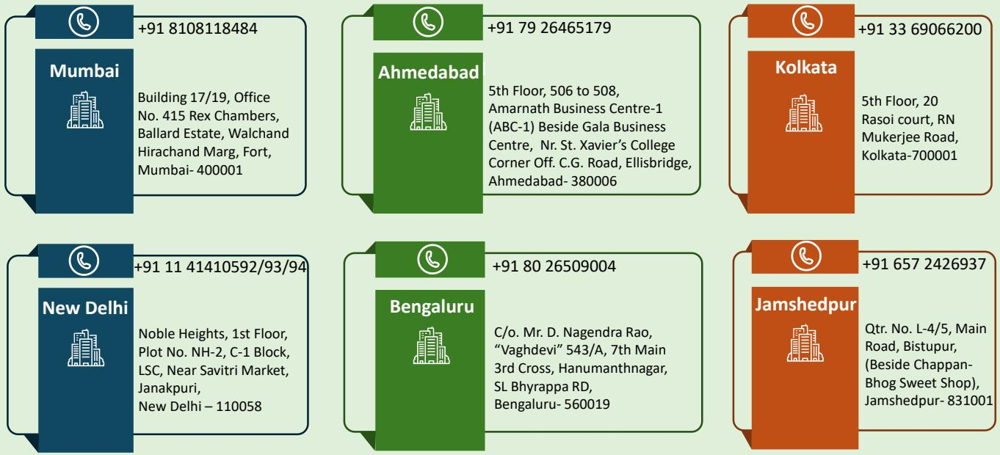

other

| City           | Value       |
| -------------- | ----------- |
| Mumbai         | +91 8108118484 |
| Mumbai         | Building 17/19, Office No. 415 Rex Chambers, Ballard Estate, Walchand Hirachand Marg, Fort, Mumbai- 400001 |
| Mumbai         | +91 79 26465179 |
| Mumbai         | 5th Floor, 506 to 508, Amarnath Business Centre-1 (ABC-1) Beside Gala Business Centre, Nr. St. Xavier's College Corner Off. C.G. Road, Ellisbridge, Ahmedabad- 380006 |
| Mumbai         | +91 33 69066200 |
| Mumbai         | 5th Floor, 20 Rasoi court, RN Mukerjee Road, Kolkata-700001 |
| Mumbai         | +91 11 41410592/93/94 |
| Mumbai         | Noble Heights, 1st Floor, Plot No. NH-2, C-1 Block, LSC, Near Savitri Market, Janakpuri, New Delhi – 110058 |
| New Delhi      | +91 11 41410592/93/94 |
| New Delhi      | +91 80 26509004 |
| New Delhi      | C/o. Mr. D. Nagendra Rao, "Vaghdevi" 543/A, 7th Main 3rd Cross, Hanumanthnagar, SL Bhyrappa RD, Bengaluru- 560019 |
| New Delhi      | +91 657 2426937 |
| New Delhi      | Qtr. No. L-4/5, Main Road, Bistupur, (Beside Chappan-Bhog Sweet Shop), Jamshedpur- 831001 |
| New Delhi      | +91 11 41410592/93/94 |
| Kolkata        | +91 33 69066200 |
| Kolkata        | 5th Floor, 20 Rasoi court, RN Mukerjee Road, Kolkata-700001 |
| Bengaluru      | +91 80 26509004 |
| Bengaluru      | C/o. Mr. D. Nagendra Rao, "Vaghdevi" 543/A, 7th Main 3rd Cross, Hanumanthnagar, SL Bhyrappa RD, Bengaluru- 560019 |
| Jamshedpur     | +91 657 2426937 |
The data is already in CSV format but contains the actual values from the table above or below each cell.

# viii. Share Transfer System

In terms of Regulation 40(1) of the SEBI Listing Regulations, as amended from time to time, transfer, transmission and transposition of securities shall be effected only in dematerialized form.

Pursuant to SEBI Circular dated January 25, 2022, the listed companies shall issue the securities in dematerialized form only, for processing any service requests from shareholders viz., issue of duplicate share certificates, endorsement, transmission, transposition, etc.

After processing the service request, a letter of confirmation will be issued which shall be valid for a period of 120 days, within which the shareholder shall make a request to the Depository Participant for dematerializing those shares. In case of failure to make such request, those shares shall be credited in the Suspense Escrow Demat account held by the Company, for which shareholders can submit necessary documents to claim.

The Directors and certain Company officials (including Chief Financial Officer and Company Secretary) are authorized by the Board severally to approve transactions, which are noted at subsequent Board Meetings.

# ix. Shareholding as on March 31, 2025

# a) Distribution of equity shareholding

<table><tr><td>Number of shares</td><td>Holding</td><td>Percentage to capital</td><td>Number of accounts</td><td>Percentage to total accounts</td></tr><tr><td>1-100</td><td>3,76,83,045</td><td>1.04</td><td>19,50,273</td><td>88.06</td></tr><tr><td>101-500</td><td>4,50,26,425</td><td>1.24</td><td>2,20,805</td><td>9.97</td></tr><tr><td>501-1000</td><td>1,68,38,076</td><td>0.47</td><td>23,630</td><td>1.07</td></tr><tr><td>1001-5000</td><td>3,05,61,636</td><td>0.85</td><td>15,899</td><td>0.72</td></tr><tr><td>5001-10000</td><td>1,02,16,004</td><td>0.28</td><td>1,451</td><td>0.06</td></tr><tr><td>10001-20000</td><td>1,02,66,006</td><td>0.28</td><td>727</td><td>0.03</td></tr><tr><td>20001-30000</td><td>79,67,012</td><td>0.22</td><td>323</td><td>0.01</td></tr><tr><td>30001-40000</td><td>73,51,140</td><td>0.20</td><td>209</td><td>0.01</td></tr><tr><td>40001- 50000</td><td>55,82,071</td><td>0.15</td><td>124</td><td>0.01</td></tr><tr><td>50001-100000</td><td>2,69,38,407</td><td>0.75</td><td>376</td><td>0.02</td></tr><tr><td>100001-above</td><td>3,41,96,57,696</td><td>94.52</td><td>885</td><td>0.04</td></tr><tr><td>Total</td><td>3,61,80,87,518</td><td>100.00</td><td>22,14,702</td><td>100.00</td></tr></table>

# b) Categories of equity shareholding

<table><tr><td>Category</td><td>Number of equity shares held</td><td>Percentage of Holding</td></tr><tr><td>Promoters and promoter Group</td><td>2,59,65,58,628</td><td>71.77</td></tr><tr><td>Foreign Portfolio Investors</td><td>43,55,39,425</td><td>12.04</td></tr><tr><td>Insurance Companies</td><td>20,80,60,106</td><td>5.75</td></tr><tr><td>Mutual Fund</td><td>18,09,58,598</td><td>5.00</td></tr><tr><td>Resident Individuals</td><td>14,65,21,498</td><td>4.05</td></tr><tr><td>Others</td><td>5,04,49,263</td><td>1.39</td></tr><tr><td>Total</td><td>3,61,80,87,518</td><td>100.00</td></tr></table>

# c) Top ten equity shareholders of the Company

<table><tr><td>S/N</td><td>Name of the shareholders*</td><td>Number of equity shares held</td><td>Percentage of holding</td></tr><tr><td>1</td><td>Tata Sons Private Limited</td><td>2,59,54,99,419</td><td>71.74</td></tr><tr><td>2</td><td>Life Insurance Corporation of India</td><td>16,76,58,326</td><td>4.63</td></tr><tr><td>3</td><td>SBI Mutual Fund</td><td>4,94,86,227</td><td>1.37</td></tr><tr><td>4</td><td>National Pension Scheme (NPS) Trust Account</td><td>2,16,76,094</td><td>0.60</td></tr><tr><td>5</td><td>ICICI Prudential Mutual Fund</td><td>2,15,92,593</td><td>0.60</td></tr><tr><td>6</td><td>HDFC Mutual Fund</td><td>1,77,68,901</td><td>0.49</td></tr><tr><td>7</td><td>UTI Mutual Fund</td><td>1,47,03,072</td><td>0.41</td></tr><tr><td>8</td><td>Vanguard total International Stock Index Fund</td><td>1,46,36,297</td><td>0.40</td></tr><tr><td>9</td><td>Vanguard Emerging Markets Stock Index Fund</td><td>1,32,09,155</td><td>0.37</td></tr><tr><td>10</td><td>Nippon Life India Trustee Ltd Mutual Fund</td><td>1,27,02,850</td><td>0.35</td></tr></table>

\*Shareholding is consolidated based on Permanent Account Number of the shareholder.

# x. Dematerialization of shares and liquidity

The Company’s shares are compulsorily traded in dematerialized form on NSE and BSE. Equity shares of the Company representing 99.98 percent of the Company’s equity share capital are dematerialized as on March 31, 2025.

Under the Depository System, the International Securities Identification Number (ISIN) allotted to the Company’s shares is INE467B01029.

# xi. Outstanding GDRs/ADRs/Warrants or any convertible instruments, conversion date and likely impact on equity

The Company has not issued any GDRs/ADRs/Warrants or any convertible instruments in the past and hence, as on March 31, 2025, the Company does not have any outstanding GDRs/ADRs/Warrants or any convertible instruments.

# xii. Commodity price risk or foreign exchange risk and hedging activities

The Company does not deal in commodities and hence the disclosure pursuant to SEBI Master Circular dated November 11, 2024 is not applicable.

For details on foreign exchange risk and hedging activities, please refer to Management Discussion and Analysis, which forms part of this Integrated Annual Report.

# xiii. Loans and advances

The Company has not given any loans and advances to firms/Companies in which directors are interested.

# xiv. Equity shares in the suspense account

In accordance with the requirement of Regulation 34(3) and Part F of Schedule V to the SEBI Listing Regulations, details of equity shares in the suspense account are as follows:

<table><tr><td>Particulars</td><td>Number of shareholders</td><td>Number of equity shares</td></tr><tr><td>Aggregate number of shareholders and the outstanding shares in the suspense account lying as on April 1, 2024</td><td>26</td><td>820</td></tr><tr><td>Shareholders who approached the Company for transfer of shares from suspense account during the year</td><td>-</td><td>-</td></tr><tr><td>Shareholders to whom shares were transferred from the suspense account during the year</td><td>-</td><td>-</td></tr><tr><td>Shareholders whose shares are transferred to the demat account of the IEPF Authority as per Section 124 of the Act</td><td>-</td><td>-</td></tr><tr><td>Aggregate number of shareholders and the outstanding shares in the suspense account lying as on March 31, 2025</td><td>26</td><td>820</td></tr></table>

The voting rights on the shares outstanding in the suspense account as on March 31, 2025, shall remain frozen till the rightful owner of such shares claims the shares.

# xv. Transfer of unclaimed/unpaid amounts to the Investor Education and Protection Fund (“IEPF”)

Pursuant to Sections 124 and 125 of the Act read with the Investor Education and Protection Fund Authority (Accounting, Audit, Transfer and Refund) Rules, 2016 (“IEPF Rules”), dividends, if not claimed for a period of seven years from the date of transfer to Unpaid Dividend Account of the Company, are liable to be transferred to IEPF.

Further, all the shares in respect of which dividend has remained unclaimed for seven consecutive years or more from the date of transfer to unpaid dividend account shall also be transferred to IEPF Authority. The said requirement does not apply to shares in respect of which there is a specific order of Court, Tribunal or Statutory Authority, restraining any transfer of the shares.

In the interest of the Members, the Company sends periodical reminders to the Members to claim their dividends in order to avoid transfer of dividends/shares to IEPF Authority. Notices in this regard are also published in the newspapers and the details of unclaimed dividends and Members whose shares are liable to be transferred to the IEPF Authority, are uploaded on the Company’s website https://iepfinvestorinfo.tcsapps.com/#/home.

The details of unclaimed dividends and shares transferred to IEPF during FY 2025 are as follows:

<table><tr><td>Financial year</td><td>Amount of unclaimed dividend transferred</td><td>Number of shares transferred</td></tr><tr><td>2016-17</td><td>2,42,68,695</td><td>9,629</td></tr><tr><td>2017-18</td><td>2,04,00,905</td><td>30,057</td></tr><tr><td>Total</td><td>4,46,69,600</td><td>39,686</td></tr></table>

Any Members who have claim on the above dividend and/or shares, can claim the same by following procedure available on the website of the Company (https://on.tcs.com/IEPF-procedure-for-claiming).

For further queries, if any, please visit RTA’s website (https://web.in.mpms.mufg.com/faq.html).

Members are requested to note that no claims shall lie against the Company in respect of the dividends and/or shares transferred to IEPF.

The following table gives information relating to various outstanding dividends and the dates by which they can be claimed by the Members from the Company’s RTA:

<table><tr><td colspan="2">Financial Year</td><td>Date of declaration</td><td>Last date for claiming unpaid dividend</td></tr><tr><td>2017-18</td><td>←</td><td>June 15, 2018</td><td>July 15, 2025</td></tr><tr><td rowspan="4">2018-19</td><td></td><td>July 10, 2018</td><td>August 9, 2025</td></tr><tr><td></td><td>October 11, 2018</td><td>November 10, 2025</td></tr><tr><td></td><td>January 10, 2019</td><td>February 9, 2026</td></tr><tr><td></td><td>June 13, 2019</td><td>July 13, 2026</td></tr><tr><td rowspan="5">2019-20</td><td></td><td>July 9, 2019</td><td>August 8, 2026</td></tr><tr><td></td><td>October 10, 2019</td><td>November 9, 2026</td></tr><tr><td></td><td>January 17, 2020</td><td>February 16, 2027</td></tr><tr><td></td><td>March 10, 2020</td><td>April 9, 2027</td></tr><tr><td></td><td>June 11, 2020</td><td>July 11, 2027</td></tr><tr><td rowspan="4">2020-21</td><td></td><td>July 9, 2020</td><td>August 8, 2027</td></tr><tr><td></td><td>October 7, 2020</td><td>November 6, 2027</td></tr><tr><td></td><td>January 8, 2021</td><td>February 7, 2028</td></tr><tr><td></td><td>June 10, 2021</td><td>July 10, 2028</td></tr></table>

<table><tr><td>Financial Year</td><td>Date of declaration</td><td>Last date for claiming unpaid dividend</td></tr><tr><td rowspan="4">2021-22</td><td>July 8, 2021</td><td>August 7, 2028</td></tr><tr><td>October 8, 2021</td><td>November 7, 2028</td></tr><tr><td>January 12, 2022</td><td>February 11, 2029</td></tr><tr><td>June 9, 2022</td><td>July 9, 2029</td></tr><tr><td rowspan="4">2022-23</td><td>July 8, 2022</td><td>August 7, 2029</td></tr><tr><td>October 10, 2022</td><td>November 9, 2029</td></tr><tr><td>January 9, 2023</td><td>February 8, 2030</td></tr><tr><td>June 29, 2023</td><td>July 29, 2030</td></tr><tr><td rowspan="4">2023-24</td><td>July 12, 2023</td><td>August 11, 2030</td></tr><tr><td>October 11, 2023</td><td>November 10, 2030</td></tr><tr><td>January 11, 2024</td><td>February 10, 2031</td></tr><tr><td>May 31, 2024</td><td>June 30, 2031</td></tr><tr><td rowspan="3">2024-25</td><td>July 11, 2024</td><td>August 10, 2031</td></tr><tr><td>October 10, 2024</td><td>November 9, 2031</td></tr><tr><td>January 9, 2025</td><td>February 8, 2032</td></tr></table>

To claim the above outstanding dividend(s), please submit the below documents to RTA:

# For Shares held in Demat mode

Copy of the updated Demat Account Statement (Client Master List) showing registered name, address, demat and bank account details (Bank name, branch, account number, IFSC code and MICR)

# For Shares held in Physical mode

• Original cancelled cheque leaf bearing the name of the first shareholder   
• Investor Service Request Forms (ISR-1, ISR -2)

# xvi. Plant locations

In view of the nature of the Company’s business viz. Information Technology (IT) Services and IT Enabled Services, the Company operates from various offices in India and abroad. The Company has a manufacturing facility at 17-B, Tivim Industrial Estate, Karaswada, Mapusa– Bardez, Goa.

# xvii. Address for correspondence

# Tata Consultancy Services Limited

9th Floor, Nirmal Building, Nariman Point, Mumbai 400 021, India

Telephone: +91 22 6778 9595

Designated e-mail address for Investor Services: investor.relations@tcs.com

Website: www.tcs.com

# DECLARATION REGARDING COMPLIANCE BY BOARD MEMBERS AND SENIOR MANAGEMENT PERSONNEL WITH THE COMPANY’S CODE OF CONDUCT

This is to confirm that the Company has adopted a Code of Conduct for its employees, including Managing Director and Executive Directors. In addition, the Company has adopted a Code of Conduct for its Non-Executive Directors and Independent Directors. These Codes are available on the Company’s website.

I confirm that the Company has, in respect of the year ended March 31, 2025, received from the Senior Management Team of the Company and the Members of the Board a declaration of compliance with the Code of Conduct as applicable to them.

K Krithivasan

Chief Executive Officer and

Managing Director

DIN: 10106739

Mumbai, April 10, 2025

# PRACTISING COMPANY SECRETARIES’ CERTIFICATE ON CORPORATE GOVERNANCE

To the Members of

Tata Consultancy Services Limited

We have examined the compliance of the conditions of Corporate Governance by Tata Consultancy Services Limited (‘the Company’) for the year ended on March 31, 2025, as stipulated under Regulations 17 to 27, clauses (b) to (i) and (t) of sub-regulation (2) of Regulation 46 and para C, D & E of Schedule V of the Securities and Exchange Board of India (Listing Obligations and Disclosure Requirements) Regulations, 2015 (“SEBI Listing Regulations”).

The compliance of the conditions of Corporate Governance is the responsibility of the management. Our examination was limited to the review of procedures and implementation thereof, as adopted by the Company for ensuring compliance with conditions of Corporate Governance. It is neither an audit nor an expression of opinion on the financial statements of the Company.

In our opinion and to the best of our information and according to the explanations given to us, and the representations made by the Directors and the management and considering the relaxations granted by the Ministry of Corporate Affairs and Securities and Exchange Board of India , we certify that the Company has complied with the conditions of Corporate Governance as stipulated in the SEBI Listing Regulations for the year ended on March 31, 2025.

We further state that such compliance is neither an assurance as to the future viability of the Company nor of the efficiency or effectiveness with which the management has conducted the affairs of the Company.

For Parikh & Associates

Practising Company Secretaries

P. N. Parikh

FCS: 327 CP: 1228

UDIN: F000327G000072951

PR No.: 6556/2025

Mumbai,

Date: 10.04.2025

# CERTIFICATE OF NON-DISQUALIFICATION OF DIRECTORS

(Pursuant to Regulation 34(3) and Schedule V Para C clause (10)(i) of the SEBI (Listing Obligations and Disclosure Requirements) Regulations, 2015)

To,

The Members

# Tata Consultancy Services Limited

9th Floor, Nirmal Building,

Nariman Point, Mumbai 400 021

We have examined the relevant registers, records, forms, returns and disclosures received from the Directors of Tata Consultancy Services Limited having CIN L22210MH1995PLC084781 and having registered office at 9th Floor, Nirmal Building, Nariman Point, Mumbai 400 021 (hereinafter referred to as ‘the Company’), produced before me/us by the Company for the purpose of issuing this Certificate, in accordance with Regulation 34(3) read with Schedule V Para-C Sub clause 10(i) of the Securities Exchange Board of India (Listing Obligations and Disclosure Requirements) Regulations, 2015.

In our opinion and to the best of our information and according to the verifications (including Directors Identification Number (DIN) status at the portal www.mca.gov.in) as considered necessary and explanations furnished to us by the Company & its officers, we hereby certify that none of the Directors on the Board of the Company as stated below for the Financial Year ending on March 31, 2025 have been debarred or disqualified from being appointed or continuing as Directors of companies by the Securities and Exchange Board of India, Ministry of Corporate Affairs, or any such other Statutory Authority.

<table><tr><td>Sr. No.</td><td>Name of Director</td><td>DIN</td><td>Date of Appointment in Company*</td></tr><tr><td>1.</td><td>N Chandrasekaran</td><td>00121863</td><td>September 6, 2007</td></tr><tr><td>2.</td><td>K Krithivasan</td><td>10106739</td><td>June 1, 2023</td></tr><tr><td>3.</td><td>Aarthi Subramanian</td><td>07121802</td><td>March 12, 2015</td></tr><tr><td>4.</td><td>Dr Pradeep Kumar Khosla</td><td>03611983</td><td>January 11, 2018</td></tr><tr><td>5.</td><td>Hanne Sorensen</td><td>08035439</td><td>December 18, 2018</td></tr><tr><td>6.</td><td>Keki Mistry</td><td>00008886</td><td>December 18, 2018</td></tr><tr><td>7.</td><td>Al-Noor Ramji</td><td>00230865</td><td>October 12, 2023</td></tr><tr><td>8.</td><td>Sanjay V Bhandarkar</td><td>01260274</td><td>March 4, 2025</td></tr></table>

\*the date of appointment is as per the MCA Portal.

Ensuring the eligibility for the appointment/continuity of every Director on the Board is the responsibility of the management of the Company. Our responsibility is to express an opinion on these based on our verification. This certificate is neither an assurance as to the future viability of the Company nor of the efficiency or effectiveness with which the Management has conducted the affairs of the Company.

# For Parikh & Associates

Practising Company Secretaries

# P. N. Parikh

FCS: 327 CP: 1228

UDIN: F000327G000073037

PR No.: 6556/2025

Mumbai, 10.04.2025

text_image

प्रधानी दिकार्य करना १७४५३५

# Corporate

# Social

# Responsibility

Empowering people and communities

Building equitable & inclusive pathways for women, youth & marginalized groups

The world is witnessing unprecedented advancements in technology, transforming the way we live, work, and contribute to society. Breakthroughs in AI, big data, blockchain, and digital connectivity have not only revolutionized industries but also redefined how organizations approach their responsibilities toward society and the environment. These technological breakthroughs are fostering a new paradigm, one where innovation and accountability go hand in hand.

The post-pandemic era has fundamentally reshaped the work environment, ushering in a new age of flexibility, innovation, and employee-centric practices. There is a requisite for businesses to adapt to change with the evident shift being towards more empathetic, responsive, and community-oriented initiatives.

The role of businesses is no longer confined solely to economic value creation. There is a growing expectation for organizations to act as conscientious contributors to the greater social good. The transferal is towards fostering deeper engagement with communities, advocating for environmental stewardship, and promoting digital inclusion.

In this evolving landscape, organizations that thrive will be those that demonstrate resilience, foresight, and a commitment to responsible innovation. Organizations must not only navigate complexity with agility but also champion values that reflect the broader aspirations of society. In doing so, they contribute not just to industry leadership, but to a more sustainable, inclusive, and equitable future.

Tata Consultancy Services (TCS) recognizes that meaningful transformation lies at the intersection of innovation, human ingenuity, and responsible leadership. Guided by this philosophy, the organization actively harnesses emerging

technologies and forward-thinking solutions to build a more equitable and inclusive world. TCS’ efforts extend beyond business outcomes, encompassing long-term societal impact through scalable, sustainable, and people-centric initiatives.

This commitment is firmly embedded in TCS’ vision of empowering individuals and communities to become self-reliant, resilient, and future-ready. By integrating digital innovation with community engagement, TCS facilitates access to opportunities, knowledge, and tools that enhance socio-economic mobility, particularly among women, youth and marginalized groups.

TCS continues to lead with purpose, leveraging technology as a force for good and reinforcing its role as a trusted partner to stakeholders and communities alike.

TCS is playing a key role in empowering people and communities, by connecting them to economic opportunities. Over the past year, TCS’ programs and initiatives have created a lasting generational impact by empowering over 14.75 million people globally, particularly in areas where the need is high, and resources are the least.

This ensued upward socio-economic mobility for 1.52 million people, building equitable and inclusive pathways for 1.27 million women, 3,90,690 youth and 1.08 million people from marginalized groups. The achievement was made possible by scaling TCS’ high-impact programs across India and 50 countries worldwide, aligning them against four strategic themes (and 8 focus areas): provide a 21st century education for all (K-12 Education Literacy to Livelihood), help citizens equitably access job opportunities (Employment through Skilling, Digital Entrepreneurship), enable delivery of world class front-line services in poorest districts (Healthcare, Digital

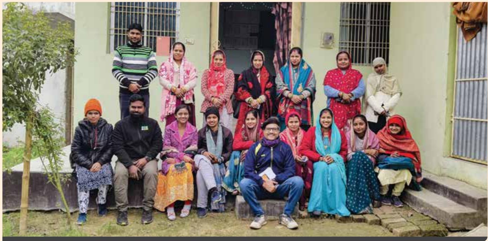

natural_image

Group photo of people posing in front of a building with barred windows (no visible text or symbols)

Inclusion), and accelerate the just transition to a green economy (Water, Climate and Sustainability). Through its purpose-driven ecosystem, TCS collaborates with key stakeholders to address the needs of the local communities effectively.

The long-term evolution of responsible AI is dependent on those who shape its future -the next generation of innovators. In FY 2025, TCS’ Ignite My Future (IMF) program empowered 5,857 teachers to inculcate computational thinking while equipping 2,66,966 students across 6 continents with foundational skills for the AI era. TCS go Innovate Together (goIT) program now in its 16th year, has inspired 81,374 students across 50 countries to apply 21st Century Skills and latest technologies like AI, IoT, and App Design to solve real-world problems in their community with 51% of these students being girls and 79% from underrepresented minorities.

One of the biggest challenges in India is ensuring access to quality jobs for youth from socio-economically and geographically disadvantaged communities. TCS Youth Employment Program (YEP), now in its 15th year, addresses this challenge by equipping undergraduate students and unemployed graduates from disadvantaged rural communities with marketable skills, industry-relevant credentials, and valuable certifications. In FY 2025, 1,156 students have gained employment in the information technology sector and other domains through YEP.

Rural communities in India endure innumerable socio-economic challenges and have limited economic opportunities to operate in the digital economy. Launched over a decade ago, TCS BridgeIT program has empowered 1,712 active digital entrepreneurs of which 1,508 are women entrepreneurs, gearing up to be catalysts to strengthen the rural economy.

The program bridges the socio-economic divide in marginalized communities of India, focusing on women and youth by creating a network of rural digital entrepreneurs. Across 4,457 villages in rural India, these ‘digipreneurs’ are earning their livelihood while providing much needed last-mile services to 7,44,697 beneficiaries annually, such as access to citizen entitlements, banking, financial services, insurance, telehealth, telelaw, logistics, e-commerce and more. In FY 2025, BridgeIT’s latest project across Bihar, Jharkhand and Rajasthan onboarded 1,400 women and transformed 1,364 of them as digital entrepreneurs serving their villages.

For 25 years TCS Literacy as a Service (LaaS) program has addressed the challenge of illiteracy prevalent in India. The program has evolved to adapt to the emerging needs especially for marginalized communities. From functional literacy that included learning basic skills like reading, writing, arithmetic, the program now also offers digital and financial literacy, key citizen entitlement awareness and Disaster Risk Reduction (DRR). In FY 2025, the program served 4,12,121 marginalized women individuals leading to dignity and social inclusion.

TCS Hours of Purpose by Employees (HOPE) embodies a collective movement, by the people, for the people, fueled by the Tata group's enduring commitment to community service. The year saw 1,46,958 volunteers contribute over 8.93 million hours to support the poor with basic necessities, to create

better health outcomes for those who need help, to preserve and protect the environment, to empower better education, employment, entrepreneurship, and livelihoods for the marginalized communities. TCS employees also built capacity and capability for over 100 social sector organizations through skill-based volunteering, providing in-kind digital, advisory, and technology consulting services.

Globally, TCS has jointly served communities in need through 10 purpose partnerships in collaboration with other Tata group companies, its customers, and like-minded organizations through its Business with Purpose program. TCS leveraged the insights of over 4,000 cross-sector leaders through 24 Digital Empowers thought-leadership forums, using their collective expertise to drive global advocacy and policy advancements.

Ignite My Future (IMF)   

text_image

Ignite My Future
Engineering Communities
with Computational Thinking

Students: 2,66,966 | Educators: 5,857 Vulnerable & marginalized: 81%

The world is advancing at an unprecedented pace, making it imminent for young people to develop 21st century skills to stay informed, create opportunities for new employment, and promote economic equity. Emerging technologies, including AI, underscore the growing need for skills beyond traditional academic subjects, highlighting the importance of a more comprehensive and future-oriented education.

TCS’ IMF program is committed to empowering teachers with the tools they need to prepare young people to thrive in careers of the future.

This pioneering STEM (Science, Technology, Engineering and Mathematics) education program aims at empowering educators to integrate Computational Thinking (CT), a foundational 21st century skill, into all core subjects. CT is a higher order approach to problem solving that uses strategic methods to solve problems, just like computer scientists. Knowing that primary students will end up with jobs that do not exist yet, CT skills prepare them for future careers across industries.

Through TCS volunteers and customer engagements involving program partners, IMF creates awareness on probable job opportunities for students by bringing career pathways to life. IMF consistently engages with educators and students through the Learning Leaders network, family STEM nights, and special student projects.

In North America, IMF expanded its program offerings and worked to engage more schools that receive federal funding in FY 2025. Designing activities to help students, especially those from low-income families and underserved communities, IMF’s goals were to open innovative pathways to education and aligning careers with the new and fast-changing digital economy and immediately support improved educational outcomes. Since its inception in 2017, IMF has enhanced the lives of over 2.59 million teachers and students around the world.

In FY 2025, IMF reached 5,857 educators, 1,950 families and 2,66,966 students.

# Case study

# Shaping young minds through STEM

In Latin America, IMF partnered with Clubes de Ciencia México, an NGO committed to encouraging young minds to pursue STEM careers through hands-on science workshops led by graduate and doctoral students.

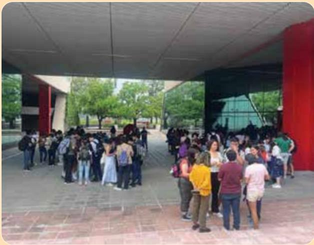

natural_image

Group of people gathered under a modern building entrance, no visible text or signage

Clubes de Ciencia México

As part of this collaboration, IMF provided specialized training to all 87 instructors, equipping them with computational thinking strategies to enhance curriculum design of their workshops. This approach ensured that students not only gained scientific knowledge but also developed critical analytical skills.

Additionally, IMF facilitated meaningful connections between students and TCS volunteers, who guided them through complex STEM challenges designed to promote teamwork and problem-solving. In total, 708 students benefited during FY 2025 by this partnership.

By fostering curiosity, innovation, and collaboration, IMF continues to shape the next generation of STEM leaders, proving that knowledge and mentorship can transform lives.

go Innovate Together (goIT)   
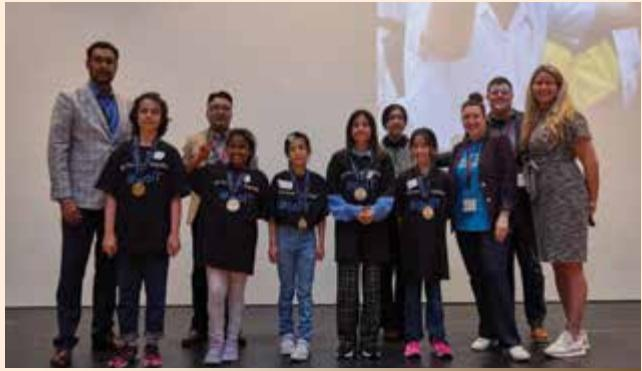

natural_image

Group photo of people posing for a medal ceremony, no visible text or symbols

Students: 81,374 | Educators: 4,294 Vulnerable & marginalized: 79%

Globally, the gap between the skills required by employers and those possessed by job seekers is widening. The demand for professionals in STEM and computer science fields surpasses the number of qualified candidates available to fill these positions. TCS’ goIT is a digital innovation program and career readiness program that inspires students to pursue careers of the future by developing core skills.

To develop these future leaders, goIT uses a four-pronged model, layered with school district partnerships, which includes:

• In-person or virtual volunteer-driven engagements around the year   
• goIT online connects, goIT monthly challenges centered around the United Nations Sustainable Development Goals (UN SDGs)   
• Mentorship by industry experts

To increase accessibility for students worldwide, goIT’s base curriculum was translated into 24 languages. Additionally, a revamped goIT monthly challenge, which offers year-round accessibility, an expanded selection of SDGs, and a redesigned challenge page enhancing engagement for students and facilitators were introduced.

To improve digital access, the goIT online platform is now available in Portuguese, in addition to English and Spanish. The platform was also launched in India to increase its scope.

goIT continued expanding its technology offerings, introducing new pathways in Cybersecurity and Data Science. Additionally, an AI Suite, featuring Machine Learning and Generative AI, was launched to equip students with emerging tech skills. goIT's Microprocessor Suite now includes Arduino boards and Raspberry Pi, complementing the program’s existing Micro:bit tools for hands-on prototyping.

Since its launch in 2009, goIT has positively impacted 3,51,078 students in its growing presence acro countries. In FY 2025, goIT, empowered 85,668 students and educators around the world.

# Case study

# Inspiring young minds:

# Innovation through technology

In Japan, elementary and junior high school education is mandatory, ensuring that all children aged 6 to 15 attend school. While the national curriculum provides a strong foundation, students often have interests that extend beyond standard subjects. To bridge this gap, TCS has leveraged its IT expertise to develop engaging educational initiatives like the TCS’ goIT program, designed to spark curiosity and enthusiasm for technology among upper elementary students.

natural_image

Group photo of children posing indoors in a large indoor arena (no visible text or signage)

As part of this program, students participated in design thinking modules, tackling the pressing issue of global warming. They explored its severe consequences and brainstormed innovative IT-driven solutions to mitigate its impact. Each group then presented their ideas to peers and teachers, often making their first formal presentations. Through multiple practice sessions, they refined their delivery, building confidence and communication skills.

Beyond deepening their understanding of global warming, this hands-on experience fostered critical thinking, teamwork, and creative problem-solving, empowering students to envision how technology can drive real-world change.

# "

This year, we had the opportunity to hold a design thinking class for the first time. Our class included a wide range of students-those who tended to be disruptive, those who were distracted by tablets, and those who struggled to fully understand Japanese. Despite these challenges, all 90 students stood proudly to deliver their presentations, leaving both myself and the homeroom teachers deeply moved.

The classes provided by TCS Japan allowed us to witness the growth of our students firsthand. Thank you for giving our children this valuable experience.

# Mariko Seki

Principal, Izumo Elementary School, Ota Ward, Tokyo

Youth Employment Program (YEP)   
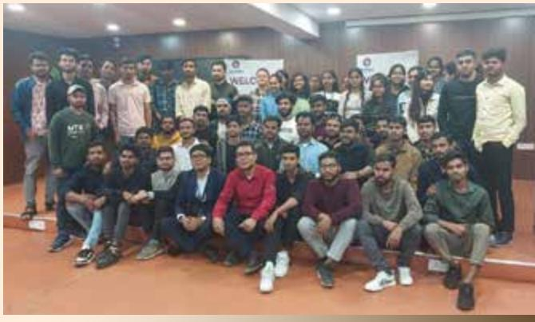

natural_image

Group photo of people posing indoors, no visible text or symbols

Youth unemployment, particularly among marginalized communities, is a pressing challenge in modern India. Limited opportunities, inadequate communication skills, and a lack of technical expertise hinder youth employment prospects and their ability to thrive in the digital economy.

TCS’ YEP addresses this challenge through its transformative “Teach, Coach, Mentor, and Place” model. The program aims at upskilling youth from marginalized communities across the country, making them industry-ready and supporting them with placement opportunities. In collaboration with industry leaders and subject matter experts, YEP delivers comprehensive training in business communication, aptitude, computer programming, and domain-specific skills.

YEP, bridges the gap between academic and professional world, enabling youth to elevate their socio-economic standing. Through career guidance, mentoring, access to market-relevant certifications, and real-time project exposure, the program equips graduates with the skills to excel in the competitive Indian job market.

# Prime Minister Internship Scheme (PMIS)

TCS is proud to have partnered with the Government of India, towards the larger nation building exercise, through the PMIS. The program aims to equip the youth with hands-on experience, industry exposure, and in-demand skills, contributing to employment generation across sectors.

The interns experience a structured 12-month internship program, comprising four months of intensive Soft Skills training, followed by eight months of on-the-job learning. For the Soft Skills phase, a specially curated program by name SAFAL (Sashaktikaran, Aatmanirbharta, Falta, Avsar, Lakshya), an extension of YEP, has been implemented to train the PMIS interns. This initiative is jointly executed by the TCS CSR – YEP team and the Academic Alliances Group (AAG), with mentorship from business unit experts and senior leaders across TCS.

Since inception, the program has:

• Through upskilling, enhanced the socio-economic status of more than 1,85,139 youth and families.   
• Provided youth access to opportunities in 35 states and union territories.   
• Empowered more than 41,846 young women and 12,540 Dalits and Tribals.   
• Placed more than 43,838 students in sectors like IT, Hospitality, Banking, and Retail.   
• Facilitated anytime-anywhere learning through the one-stop YEP portal.   
• Advanced the reputation of, and provided visibility to, YEP partner institutions.   
• Enabled continuous availability of a highly skilled talent pool for the industry.   
• Onboarded more than 160 trainees for internship through YEP SAFAL initiative under PMIS.

In FY 2025, YEP facilitated gainful employment of 1,156 students in the information technology and other domains.

# Case study

# Breaking barriers: Jeba Malar’s journey to success

Jeba Malar, hailing from the small town Sattur, comes from a humble family of six, where her father is the breadwinner and her mother supports the household with tireless effort and unwavering dedication.

As the eldest of four siblings, Jeba always dreamed of improving her family’s financial situation and ensuring a brighter and more secure future for her younger siblings. She pursued her graduation in Physics Honors from Sri S. Ramasamy Naidu Memorial College, but the challenges of securing a stable job in an increasingly competitive world seemed both overwhelming and daunting.

This all changed when Jeba participated in TCS YEP, an opportunity that would transform her life. Through YEP, she received comprehensive training in business communication, interview skills, aptitude, problem-solving, and teamwork. Beyond enhancing her technical and professional abilities, the program instilled in her the confidence to take on real-world challenges. Equipped with these skills, Jeba was shortlisted for an

natural_image

Portrait of a young woman with long dark hair wearing a white scarf and patterned shirt, outdoors near greenery (no visible text or symbols)

# Jeba Malar

Ameerpalayam Village, Virudhunagar District, Tamil Nadu

interview at Tata Power, where she excelled, attributing her success to the rigorous preparation she received through YEP. Today, she proudly contributes to her family’s income and ensures her siblings have access to quality education. Grateful for the empowerment YEP provided, Jeba stands as a testament to how knowledge, determination, and the right opportunities can change lives.

BridgeIT   
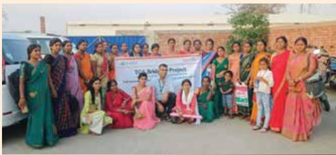

text_image

2014 Beijing Project

Entrepreneurs: 1712

Beneficiaries served by entrepreneurs: 7,44,697

Vulnerable & marginalized: 88%

Rural communities in India face numerous socio-economic challenges, including limited job access and lack of awareness of Government, financial, and online services thus restricting economic opportunities for generations. Poor infrastructure, limited resources, and technological gaps further hinder their participation in the digital economy.

TCS BridgeIT program addresses the socio-economic divide in marginalized communities of India, especially among women and the youth, by creating rural digital entrepreneurs. The program bridges the digital divide, builds a rural entrepreneurship ecosystem and enables social integration.

BridgeIT equips citizens from marginalized communities with the skills, technology, mentorship, and resources required to set up a Digital Service Centre and provide essential services. These ‘digipreneurs’, use information technology to help others in the local community avail Government entitlements by providing financial and digital services in education, employment, and adult literacy.

BridgeIT capitalizes on VLC (Village Livelihood Committee), a social safety net which helps to identify and support budding entrepreneurs; and DEEco (Digital Entrepreneur Ecosystem) which fosters sustainable entrepreneurial ecosystems, facilitates diverse business ventures and promotes economic growth.

Personalized learning was delivered using the TCS DELI (Digital Entrepreneur Learning Intervention) framework that indirectly assesses deeper learning needs while mentorship from experienced entrepreneurs was leveraged using the “Didi ka Darbar” platform. TEN (TCS Entrepreneurs Networks) platform helped entrepreneurs connect,

collaborate and celebrate their ‘Learning for Earning’ successes.

Since inception BridgeIT has created 1,866 entrepreneurs of which 1,712 are active comprising of 88% women and 52% from marginalized communities; serving 7,44,697 villagers in 4,457 villages across 42 districts offering essential services like document generation, government scheme enrollment, online form filling, and banking transactions, among others. In FY 2025, BridgeIT's latest project onboarded 1,400 women from 14 districts across the states of Bihar, Jharkhand and Rajasthan with 1,364 of them successfully launching their enterprises serving the last mile needs.

# Case study

# Priyanka Devi:

# From struggles to success

Priyanka Devi, a resident of Dumra village in Dhanbad district, faced financial struggles before discovering TCS BridgeIT. With limited income and no access to credit, her family struggled to make ends meet. When Priyanka enrolled in the program, she saw a chance to change her future and seized it with determination.

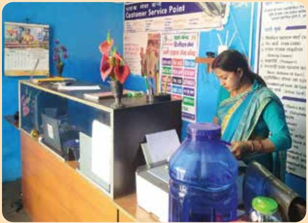

text_image

Street photo of a customer service point with visible signage and product displays, showing a woman in traditional attire handling water containers.

Equipped with training and resources from BridgeIT, Priyanka started her entrepreneurial journey. She used the laptop given and invested in a printer to start serving her community. She started by offering essential digital services such as Aadhaar updates, resume creation, and digital photography. With continuous support from online training sessions, mentoring, and the digital handbook, she gradually expanded her services to include cash withdrawals, a high demand service in her village.

Beyond supporting her community with easy access to digital solutions, Priyanka saw a significant increase in her income, strengthening her family’s financial stability.

With resilience and dedication, she continues to grow her business, proving that the right opportunities can transform lives.

I am happy to be part of the BridgeIT project and live a better life now.

# Priyanka Devi

Dumra village, Dhanbad, Jharkhand

Literacy as a Service (LaaS)   

natural_image

Group photo of people in colorful traditional and off Bharan attire standing outdoors near a building (no visible text or symbols)

Learners : 3,72,076 | Preraks: 40,140   
Vulnerable & marginalized: 100%

Inadequate adult literacy remains a significant challenge, hindering India’s ability to achieve its full economic potential. A substantial portion of the non-literate population consists of women and marginalized communities. TCS’ LaaS promotes social inclusion and transforms lives through literacy. It leverages algorithmic learning paths, cloud-based personalized vernacular content, and AI technology to address the significant adult literacy gap in India. LaaS aims to empower non-literates, such as women who form much of the non-literate population, in their native languages.

LaaS was launched in 2000 and helps adults integrate into mainstream society, teaching them how to read, write and perform basic arithmetic using graphics, sound patterns, and language structure. The program also delivers financial literacy, digital literacy, awareness of key citizen entitlements, and Disaster Risk Reduction (DRR) in nine Indian languages and three foreign languages. The program has since reached 21 Indian states and union territories, as well as in Africa and has transformed the lives of over 2.85 million people.

TCS partners with NGOs, state literacy departments, and rural livelihood missions to reach those in need. Since its inception, LaaS has empowered over 2.61 million beneficiaries and 2,41,740 facilitators. In FY 2025, LaaS empowered 4,12,216 learners. LaaS also consists of the “Each One Empowers One”

initiative that gives the employees of TCS and other Tata group companies the opportunity to volunteer and empower those in their community. This digital literacy platform offers training, videos, assessments and digital certificates and has over 460 volunteers.

TCS partnered with Andhra Pradesh Government to impart Literacy as a Service program to empower around 4,00,000 women learners with functional, financial and digital literacy across 26 districts of the state.

TCS continues to innovate and expand LaaS, demonstrating a strong commitment to empowerment through literacy.

# Case study

Prabhasini Baral's journey to financial independence: Turning dreams into reality

Prabhasini Baral, from Palli village, had always dreamed of earning her own living but lacked formal education. When she heard about LaaS classes at the village community center from a friend, she seized the opportunity.

Starting with the basics, learning the alphabet and arithmetic, Prabhasini, gained confidence. She also discovered the power of knowledge beyond literacy, learning about disaster preparedness and the importance of essential documents like a bank passbook, Aadhaar card, and PAN card.

natural_image

Woman in orange and red traditional attire holding a document, seated indoors (no visible text or symbols)

Prabhasini

Palli Village, Puri District, Odish

With her newfound skills, Prabhasini applied for the Subhadra Yojana scheme using her mobile phone and secured financial assistance. Investing wisely, she purchased a cow, and today, she earns a steady income by selling milk in her village, turning a simple resource into a sustainable livelihood.

Her success was further fueled by LaaS’ collaboration with Tata Sustainability Group (TSG) and the Youth Council for Development Alternatives (YCDA). This initiative, dedicated to uplifting those affected by Cyclone Fani in Puri, Odisha, empowered Prabhasini and many others with LaaS’ five literacy offerings. Several women beneficiaries, part of Self-Help Groups (SHG), have enrolled under the Mission Shakti scheme which helps them achieve socio-economic independence. Today Prabhasini, stands as a beacon of hope, proving that with knowledge and determination, dreams can turn into reality.

HOPE: A global movement for purpose-driven volunteering   

natural_image

Group of four people planting a young plant in a garden, holding shovels and gloves (no visible text or symbols)

HOPE (Hours of Purpose by Employees) is a movement committed to meaningful community engagement, transforming employee volunteering from an occasional activity into a global force for social good.

Guided by the 17 UN SDGs, HOPE provides skill-based and interest-based opportunities, empowering TCS’ diverse workforce to make a real impact. Over 380 volunteering events have been unified under a single platform, allowing employees to choose how, where, and with whom they volunteer, making TCS a leading company for employee volunteering.

HOPE projects are overseen and driven by ‘Purpose Councils’ comprising leaders who believe in the Tata Ethos of caring for the community. HOPE fosters a purpose-driven ecosystem designed for long-term, sustainable change.

HOPE with its dynamic and flexible format, enables several levels of employee volunteering engagements across different TCS Business Units (BU). Project teams from BUs are mobilized to participate in varied volunteering programs, to collaborate with like-minded customer organizations, NGOs, and Government bodies and embrace community projects where the need is high.

In FY 2025, HOPE witnessed 1,46,958 volunteers contributing 8.93 million volunteer hours, reaching 14.75 PCVH (Per Capita Volunteering Hours) and impacting 12.20 million lives.

# Volunteer Testimonials

I am always grateful for the volunteer opportunities TCS curates for us so we can make our busy days more meaningful. Recently, my team participated in a holiday toy drive with a leading community care organization in Montreal. It was, indeed, a special moment for all of us and, with so many awesome people around, we had such a lovely day that we really didn’t even know how

many gifts we packed. When we finished packing, all were tired, but the satisfaction and feeling of making a child happy during the holidays left all of us feeling really happy. Every single person who came there promised to come back next year.

natural_image

Group photo of people in a decorated indoor space, some standing and one holding a large black bag (no visible text or symbols)

# Juliet Peters

Project Manager, Canada.

#

My social wellbeing journey started early in life during my travels to one of the premiere spiritual organizations in West Bengal. We had close ties with this institute, and growing up, I participated in many events organized by their monks. When I joined TCS, my social venture continued. From fund raising for education to supporting a needy mother for her dialysis, I could always count on my colleagues to rise to the occasion.

During the pandemic, I worked with a non-profit engaging in the wellbeing of HIV positive children and was touched by their passion, honesty and humility. Since then, I’ve been supporting them and would like to help them expand a set-up that employs HIV positive young adults, post institutional care.

During a recent visit, one of TCS’ customers visited them and was greatly impressed. I promote the volunteerism spirit within the unit. Recently, the entire unit contributed whole-heartedly towards Wayanad relief work. I admire my team for their active volunteering towards causes that matter.

# Debraj Kundu

Sub ISU Head, Kolkata, India

Tech4HOPE: Driving sustainable change for non-profit   
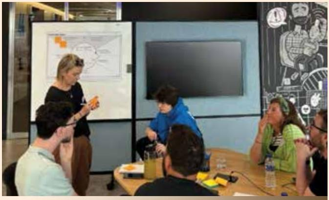

natural_image

Group of people in a classroom or meeting setting with a whiteboard and chalkboard in the background (no visible text or symbols)

TCS Tech4HOPE is a skill-based employee volunteering program that harnesses technology to redefine how non-profits serve their communities. Through this initiative, TCS collaborates with non-profit organizations to deliver pro bono advisory and technology consulting services that generate sustainable impact. By providing the tools to adopt technology, Tech4HOPE empowers organizations to broaden their reach and achieve lasting self-sufficiency.

Working closely with key stakeholders, non-profits are provided with custom software tools to help them establish a digital presence, build operational transparency, streamline fundraising, and boost overall efficiency. Since its inception, Tech4HOPE has created US \$15.66 million in ‘social value’.

In FY 2025, Tech4HOPE enabled pro bono digital services to 61 non-profits with 29 completed projects and 32 projects in progress with 38,000 skill-based volunteering hours generating US \$7.43 million in social value.

In the United States, TCS offered long-term pro bono support to Sports Integrity Global Alliance (SIGA), a multi-stakeholder coalition working to bring the global sports industry together around its set of Universal Standards on Sport Integrity. TCS volunteers dedicated more than 850 hours towards building a tailored Customer Relationship Management (CRM) platform from scratch, ensuring SIGA’s capacity to combat corruption and strengthen sport integrity. With its new CRM tool, SIGA is now better equipped to improve efficiency, nurture relationships, and expand both its membership and its number of committed supporters.

In United Kingdom & Ireland (UK & I), the team led on the provision of a digital strategy consultation to the National Youth Agency (NYA), an educational charity operating in England and Wales. NYA is committed to enabling high quality youth work across a range of settings, to support better outcomes for young people and strengthen local communities. A design thinking workshop led by the London TCS Paceport team set the stage with context setting, empathy mapping, and ideation exercises, sparking meaningful discussions on the future of digital youth work.

The UK & I Data Protection Officer (DPO) and Head of Corporate/Government Affairs also shared their knowledge of good practice and current policy. One of the outcomes of the workshop was the creation of a clear framework for youth workers to navigate advances in digital youth work, whilst maintaining safe and effective practices. Additionally, participants were guided on how to develop a gold standard Data Protection Impact Assessment (DPIA) process. This allowed them to gain a greater understanding of DPIAs and their application to youth work.

#

Thank you to our colleagues at TCS. We are fortunate to have your support and insight. Your team's efforts have made us feel equipped and valued, and we are excited about what we can achieve together for the benefit of young people across England.

# NYA team

In India, TCS volunteers created a Management Information System (MIS) to enable seamless operations at Head Held High Foundation (HHHF) improving efficiency, reducing errors and saving the time of trainers across locations who would otherwise spend hours daily recording every piece of student data manually. HHHF leaders spoke highly about the benefits of the new platform as automating processes have significantly brought down manual errors.

TCS volunteers also upgraded Lake Gardens Women & Children Development Centre’s (LGWCDC) website to improve the user experience of the website. According to LGWCDC representatives, the updated website has been a boon, accelerating operations significantly.

# Leaders with Purpose (LwP)

Leaders with Purpose (LwP) is a nine-month immersive community leadership learning and practice journey. It is designed to nurture the skills of TCS employees to lead societal change. The program equips participants with leadership, communication, and project management skills required for sustained commitment to social impact. Through interactive classes and capstone projects, LwP cultivates a sense of social responsibility among participants. Upon graduating, participants are empowered to conduct their professional lives focusing on generating positive social change.

In FY 2025, 53 TCS leaders from Canada and the US and 24 from UK & I graduated after intense in-classroom and online learning, followed by 5 months of hands-on work on real-world social impact projects.

# Business with Purpose (BwP)

TCS Business with Purpose (BwP) is a unique framework developed by TCS which creates ‘Purpose Partnerships’ with customers, Tata group companies, and other like-minded organizations to improve access, equity, and inclusion around the world.

These partnerships are formed to accelerate social good and address societal needs including education, skill development, and employment. BwP collaborates with organizations that become mentors for technology, thought-leadership forum contributors, and campus visit organizers.

TCS leverages its expertise to develop contextual solutions for pressing societal issues in its partnerships with customer leaders to generate wide-reaching and long-term impact. The initiative provides collaborating organizations positive social opportunities combined with their community goals to help them meet their purpose commitments and give back to society.

Bringing the Company’s strategic programs, like goIT, IMF, and YEP, into Purpose Partnerships enables TCS to further support underserved communities.

In FY 2025, more than 130 customer leaders, including 41 senior executives, participated in different Corporate Social Responsibility initiatives globally.

Digital Empowers   

natural_image

Group of business professionals seated around a long conference table in a modern meeting room (no visible text or signage)

TCS Digital Empowers is a global initiative which drives digital inclusion and empowers communities through technology, collaboration, and impactful partnerships. By uniting leaders across business, Government, academia, and the non-profit sector, Digital Empowers develops scalable solutions that promote digital literacy, skill development, and bridge the digital divide.

In FY 2025, Digital Empowers and its collaborators advanced efforts to accelerate digital inclusion and foster upward financial mobility for all.

In North America, Digital Empowers hosted the “Together Toward Inclusion” digital equity summit, co-designed with 10 corporate and social sector partners. This momentum

continued with the TCS Digital Empowers Sustainathon, developed with a client partner, to support the non-profit organization Human-I-T. Additionally, the initiative embarked on two deep research projects, generating insights and recommendations for long-term, system level improvements.

Working toward the Digital Opportunity Playbook, a research initiative to be published in early FY 2026, Digital Empowers conducted nearly 70 interviews about digital equity with business, Government and non-profit leaders in Chicago, Dallas, Detroit, New York, and beyond. In Canada, the “Digital Skills Imperative" report, developed with a partner, was published in December 2024.

In India, Digital Empowers facilitated collaboration between Tata group companies, key social development organizations, and Government agencies. These efforts aligned with CSR programs through the event series:

• Pathways to Prosperity: Strengthening Digital and Financial Skills in India   
• Driving Women’s Economic Participation in STEM   
• Bridging the Digital Divide for People with Disabilities   
• Future Forward: Digital Entrepreneurship for Rural Wom

This culminated in the pan-India celebration, Empowering Women, Inspiring India, marking International Women’s Day with a series of events across ten TCS offices. The initiative brought together nearly 2,500 employees, business leaders, and beneficiaries from TCS CSR programs. Women from CSR initiatives—including TCS support staff and young professionals from LaaS and YEP—spoke about how gaining education, digital skills, and employment shaped their journeys. Partners and participants from goIT, IMF, and BridgeIT also shared their perspectives. Senior business leaders and Delivery Center Heads joined, reflecting strong collaboration. Empowering Women, Inspiring India was a meaningful reminder that investing in women’s empowerment strengthens communities and TCS.

In FY 2025, Digital Empowers established 9 cross-sector partnerships, engaged 4,065 participants across 24 events and 22 client engagements.

# Case study

# Collaborating to drive digital inclusion in Canada

Recognizing that many are poised to be left behind in the current and future Canadian economy, TCS’ Digital Empowers, along with a partner, held the roundtable, Digital Skills Imperative, focused on ways to advance digital inclusion. Participants included a board of trade, a communications and entertainment company, and TCS’ influential CSR partners.

Some of the trends identified by the group include the slow pace of Government and higher education as they try to keep up with technology’s evolution, immigration, deglobalization and the movement toward micro-credentialing. Proposed solutions, published by Digital Empowers and its partner in December 2024, included recommendations for big businesses to lead digital skilling efforts, for more collaboration between institutions offering micro-credentials and employers posting actual jobs, for shifting Government regulation and assessment from its oversight of individual courses to regulation of the digital skilling organizations themselves, and more.

# Social Innovation

TCS’ Social Innovation acknowledges the criticality of social change and inclusion around the world. The Company capitalises on its intellectual and technological capital while leveraging it contextual knowledge, as well as the collective knowledge of a diverse network of subject matter experts, to provide pro bono digital services to social sector organisations. Through this, TCS delivers innovative solutions for specific problems unique to the community in question.

# Digital Impact Square (DISQ)

TCS’ Digital Impact Square (DISQ) is an incubation program for early-stage startups which is oriented towards community inclusion. This social innovation platform encourages the youth to harness the power of digital technology and develop solutions for lasting change in society, including assistive technology for persons with disabilities. The young innovators are offered skill-building, mentorship, and seed funds for their solutions.

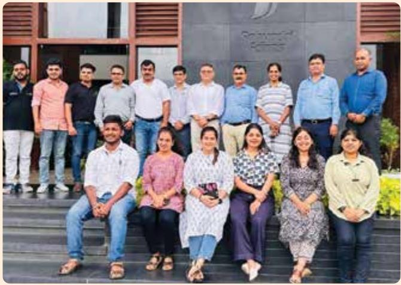

natural_image

Group photo of people posing on steps in front of a modern building (no visible text or signage)

This year, DISQ startup teams had the opportunity to present their work at a startup demonstration event during the Chairman's visit to one of India's Farmer Producer Company. During the event, emerging entrepreneurs shared their achievements and received insightful feedback from him.

DISQ organized the two-day Buildathon 1.0 event with a partner which focused on decentralized AI. The event hosted a diverse group of around 300 innovators, mentors, Government officials, delegates and renowned speakers who shared insights. The event reinforced the commitment to driving innovation through decentralized AI and collaboration.

At the two-day Zero Conference India, at Delhi in September 2024, DISQ was selected from fifteen solutions globally as a Global Scaling Solution Fellow. Along with the core team, innovators from two DISQ startup teams had the opportunity to present their offerings.

In addition, DISQ was privileged to share the stage with changemakers as a panel speaker during the Bengaluru Tech Conference hosted by EnAble India and Zero Project which brought innovators together, such as a DISQ incubated startup. The session provided a platform for DISQ to share its aspirations, articulate what makes it unique in the incubation ecosystem and explore how the DISQ model can be scaled beyond India.

In FY 2025, DISQ has nurtured and supported multiple startups, positively impacting the lives of over 102,011 beneficiaries.

# Health and wellness

TCS recognizes the importance of health and wellness and promotes it among its employees as well as in local communities across the world. Its CSR initiatives seek to create

new, systemic solutions that address society’s biggest health challenges.

TCS has provided an integrated Hospital Management System (HMS) and IT infrastructure, which includes a comprehensive and fully integrated web-based solution, to The Cancer Institute (CI), Chennai. TCS has implemented a HMS at Tata Medical Center (TMC), Kolkata. CI and TMC are the largest and one of the first Cancer Care institutes in Southern and Eastern India.

TCS’ digital transformation initiatives at the TMC, Kolkata and CI, Chennai facilitated 2,82,450 new patient consultations in FY 2025.

# Contributions to Disaster Relief Efforts

Disaster relief efforts help alleviate the adverse impact of natural and human-made catastrophes on local communities.

The recent landslides in Wayanad triggered by relentless monsoon led to widespread soil erosion and landslides, destroying homes, farmland and critical infrastructure. Among the most affected were the tribal communities, where families faced the loss of shelter and security as their homes were either partially or fully destroyed.

The ONE Tata response to this calamity united Tata group companies to deliver essential support and address the long-term needs of those affected.

TCS is contributing to the financial support required to meet the project course, over the next three years.

text_image

Integrated Annual Report 2024-25

# Business Responsibility & Sustainability Report

natural_image

Business meeting scene with three professionals collaborating around a laptop and documents (no visible text or symbols)

TCS combines its strong sense of purpose with digital expertise and innovation to drive not only its own sustainability journey, but also that of its customers, business partners and stakeholders. The Company’s environmental stewardship rests on four pillars: carbon footprint mitigation, water conservation and recycling, waste reduction and recycling, and preserving biodiversity. The Business Responsibility and Sustainability Report (BRSR) framework is based on the National Guidelines for Responsible Business Conduct (NGRBC) and consists of three sections:

Section A provides a broad overview of the business, its offerings, business and operations footprint, employees, related parties, Corporate Social Responsibility (CSR) and transparency.

Section B covers management and process disclosures related to the businesses aimed at demonstrating the structures, policies and processes put in place towards adopting the NGRBC Principles and Core Elements.

Section C provides indicator-wise disclosures mapped to the nine principles of NGRBC which are listed at the start of Section B.

# SECTION A: GENERAL DISCLOSURES

# I. Details of the listed entity1

1. Corporate Identity Number (CIN) of the Listed Entity: L22210MH1995PLC084781   
2. Name of the Listed Entity: Tata Consultancy Services Limited (TCS)   
3. Year of incorporation: 1995   
4. Registered office address: 9th Floor, Nirmal Building, Nariman Point, Mumbai 400 021, Maharashtra, India   
5. Corporate address: TCS House, Raveline Street, Fort, Mumbai 400 001, Maharashtra, India   
6. E-mail: investor.relations@tcs.com   
7. Telephone: +91 22 6778 9595   
8. Website: www.tcs.com   
9. Financial year for which reporting is being done: 2024-25   
10. Name of the Stock Exchange(s) where shares are listed: National Stock Exchange of India Limited and BSE Limited

11. Paid-up Capital: \`361.8 crore   
12. Name and contact details (telephone, email address) of the person who may be contacted in case of any queries on the BRSR report:

1. Milind Lakkad, Chief Human Resources Officer (CHRO)   
2. Sudeep Kunnumal, CHRO Designate

Telephone number: +91 22 6778 9999

E-mail id: corporate.sustainability@tcs.com

13. Reporting boundary2 : This BRSR Report is prepared on a consolidated basis. The information/data measurement techniques used, and the basis of calculations and estimates have been mentioned in the relevant sections of this report. There are certain restatements as per the guidance provided under Industry Standards Note on BRSR Core. The effects and reasons have been included under the respective Principles of this report. These restatements would enable consistency and comparability of information for the current year and previous year.3   
14. Name of assurance provider : KPMG Assurance and Consulting Services LLP (KPMG).   
15. Type of assurance obtained4 : BRSR Core Indicators-Reasonable assurance; Select BRSR Indicators-Limited assurance.

# II. Products/services5

16. Details of business activities (accounting for 90% of the Turnover):

TCS provides IT services, consulting and business solutions to many of the world’s largest businesses in their transformational journeys. Further details are provided in the Management Discussion and Analysis section of this Integrated Annual Report.

17. Products/Services sold by the entity (accounting for 90% of the entity’s Turnover):

Application Development and Maintenance, Consulting and Service Integration, Digital Transformation Services, Cognitive Business Operations & Products and Platforms.

Some of the services broadly map to the National Industrial Classification (NIC) codes 6201, 6202, 6209 and 6311.

# III. Operations5

18. Number of locations where plants and/or operations/offices of the entity are situated:

<table><tr><td>Location</td><td>Number of plants</td><td>Number of offices*</td><td>Total</td></tr><tr><td>National</td><td>1</td><td>127</td><td>128</td></tr><tr><td>International</td><td>Not Applicable (NA)</td><td>183</td><td>183</td></tr></table>

\*Includes Delivery centres

19. Markets served by the entity:

a. Number of locations

<table><tr><td>Locations</td><td>Number</td></tr><tr><td>National (No. of States)</td><td>28 States and 8 Union Territories</td></tr><tr><td>International (No. of Countries)</td><td>54</td></tr></table>

b. What is the contribution of exports as a percentage of the total turnover of the entity?

91.4%

c. A brief on types of customers

TCS works with leading corporations across the world - typically Fortune 1000, Global 2000 corporations and the public sector. In India, TCS works with departments of the Government of India and various State Governments, systemically important entities and the private sector.

# IV. Employees

# 20. Details as at the end of Financial Year:

a. Employees (including differently abled)6 : 

<table><tr><td>S/N</td><td>Particulars</td><td></td><td colspan="2">Male</td><td colspan="2">Female</td></tr><tr><td></td><td></td><td>Total (A)</td><td>No. (B)</td><td>% (B/A)</td><td>No. (C)</td><td>% (C/A)</td></tr><tr><td>1.</td><td>Permanent (D)</td><td>6,07,979</td><td>3,93,940</td><td>64.8</td><td>2,14,039</td><td>35.2</td></tr><tr><td>2.</td><td>Other than Permanent (E)</td><td>28,854</td><td>17,788</td><td>61.6</td><td>11,066</td><td>38.4</td></tr><tr><td>3.</td><td>Total employees (D + E)</td><td>6,36,833</td><td>4,11,728</td><td>64.7</td><td>2,25,105</td><td>35.3</td></tr></table>

• All of TCS’ workforce is categorized as ‘Employees’ and none as ‘Workers’.   
• ‘Other than Permanent’ category includes individuals on direct TCS contracts or through third party.

b. Differently abled Employees: 

<table><tr><td>S/N</td><td>Particulars</td><td></td><td colspan="2">Male</td><td colspan="2">Female</td></tr><tr><td></td><td></td><td>Total (A)</td><td>No. (B)</td><td>% (B/A)</td><td>No. (C)</td><td>% (C/A)</td></tr><tr><td>1.</td><td>Permanent (D)</td><td>1,015</td><td>748</td><td>73.7</td><td>267</td><td>26.3</td></tr><tr><td>2.</td><td>Other than Permanent (E)</td><td>18</td><td>15</td><td>83.3</td><td>3</td><td>16.7</td></tr><tr><td>3.</td><td>Total differently abled employees (D + E)</td><td>1,033</td><td>763</td><td>73.9</td><td>270</td><td>26.1</td></tr></table>

• Numbers mentioned above are based on voluntary disclosures by employees.   
• Differently abled includes hearing, visual, locomotor, orthopedic and others.

21. Participation/Inclusion/Representation of women7 

<table><tr><td></td><td></td><td colspan="2">No. and percentage of Females</td></tr><tr><td></td><td>Total (A)</td><td>No. (B)</td><td>% (B/A)</td></tr><tr><td>Board of Directors</td><td>8</td><td>2</td><td>25</td></tr><tr><td>Key Management Personnel</td><td>3</td><td>0</td><td>0</td></tr></table>

Key Management Personnel (KMP) includes Chief Executive Officer and Managing Director (CEO & MD), Chief Financial Officer (CFO) and Company Secretary (CS).

22. Turnover rate for permanent employees8 

<table><tr><td></td><td colspan="3">FY 2025</td><td colspan="3">FY 2024</td><td colspan="3">FY 2023</td></tr><tr><td></td><td>Male%</td><td>Female%</td><td>Total%</td><td>Male%</td><td>Female%</td><td>Total%</td><td>Male%</td><td>Female%</td><td>Total%</td></tr><tr><td>Permanent Employees</td><td>13.2</td><td>13.6</td><td>13.3</td><td>12.5</td><td>12.5</td><td>12.5</td><td>20.2</td><td>20.1</td><td>20.2</td></tr></table>

• Turnover rates are last twelve months IT services for all above-mentioned financial years.

# V. Holding, Subsidiary and Associate Companies (including joint ventures)

# 23. Names of holding/subsidiary9

Tata Sons Private Limited is a holding company.

Refer Form AOC-1 provided in this Integrated Annual Report for the list of subsidiaries. All subsidiaries participate in the Business Responsibility initiatives of the Company.

# VI. CSR Details

24. (i) Whether CSR is applicable as per section 135 of Companies Act, 2013: Yes

(ii) Turnover (in \`) : 2,55,324 crore

(iii) Net worth (in \`) : 94,756 crore

# VII. Transparency and Disclosures Compliances

# 25. Complaints/Grievances on any of the principles (Principles 1 to 9) under the National Guidelines on Responsible Business Conduct:

<table><tr><td>Stakeholder group from whom complaint is received</td><td>Grievance Redressal Mechanism in Place (Yes/No)</td><td colspan="3">FY 2025</td><td colspan="3">FY 2024</td></tr><tr><td></td><td>(If Yes, then provide web-link for grievance redress policy) $^{10}$ </td><td>Number of complaints filed during the year</td><td>Number of complaints pending resolution at close of the year</td><td>Remarks</td><td>Number of complaints filed during the year</td><td>Number of complaints pending resolution at close of the year</td><td>Remarks</td></tr><tr><td>Communities</td><td>Yeshttps://on.tcs.com/Global-CSR-Policy</td><td>0</td><td>0</td><td>-</td><td>0</td><td>0</td><td>-</td></tr><tr><td>Investors (other than shareholders)</td><td>Yes#</td><td>0</td><td>0</td><td>-</td><td>0</td><td>0</td><td>-</td></tr><tr><td>Shareholders</td><td>Yes#</td><td>92</td><td>8</td><td>Subsequent to the year end, 7 complaints have been resolved.</td><td>128</td><td>4</td><td>All addressed and closed</td></tr><tr><td>Employees</td><td>Yes#</td><td>1,329</td><td>43</td><td>-</td><td>1,171</td><td>31</td><td>All addressed and closed</td></tr><tr><td>Customers</td><td>Yes#</td><td>31</td><td>4</td><td>Pending cases are under review</td><td>64</td><td>13</td><td>All addressed and closed</td></tr><tr><td>Value Chain Partners</td><td>Yes#</td><td>0</td><td>0</td><td>-</td><td>3</td><td>0</td><td>-</td></tr></table>

# https://on.tcs.com/WhistleBP

# 26. Overview of the entity’s material responsible business conduct issues11

Please indicate material responsible business conduct and sustainability issues pertaining to environmental and social matters that present a risk or an opportunity to your business, rationale for identifying the same, approach to adapt or mitigate the risk along-with its financial implications, as per the following format

<table><tr><td>S/N</td><td>Material issue identified</td><td>Indicate whether risk or opportunity (R/O)</td><td>Rationale for identifying the risk/opportunity</td><td>In case of risk, approach to adapt or mitigate12</td><td>Financial implications of the risk or opportunity (Indicate positive or negative implications)13</td></tr><tr><td colspan="6">Kindly refer the “Enterprise Risk Management section” in Management Discussion and Analysis, which forms part of this Integrated Annual Report.</td></tr></table>

# SECTION B: MANAGEMENT AND PROCESS DISCLOSURES

This section describes the structures, policies and processes aligned to nine principles of business responsibility. These briefly are as follows:

P1: Businesses should conduct and govern themselves with Ethics, Transparency and Accountability   
P2: Businesses should provide goods and services that are safe and contribute to sustainability throughout their life cycle   
P3: Businesses should promote the wellbeing of all employees   
P4: Businesses should respect the interests of, and be responsive towards all stakeholders, especially those who are disadvantaged, vulnerable and marginalized   
P5: Businesses should respect and promote human rights   
P6: Businesses should respect, protect, and make efforts to restore the environment   
P7: Businesses, when engaged in influencing public and regulatory policy, should do so in a manner that is responsible and transparent   
P8: Businesses should support inclusive growth and equitable development   
P9: Businesses should engage with and provide value to their customers and consumers in a responsible manner

<table><tr><td colspan="2">Disclosure Questions</td><td>P1</td><td>P2</td><td>P3</td><td>P4</td><td>P5</td><td>P6</td><td>P7</td><td>P8</td><td>P9</td></tr><tr><td colspan="11">Policy and management processes</td></tr><tr><td colspan="2">1. a. Whether your entity&#x27;s policy/policies cover each principle and its core elements of the NGRBCs. (Yes/No) $^{14}$ </td><td>Y</td><td>Y</td><td>Y</td><td>Y</td><td>Y</td><td>Y</td><td>Y</td><td>Y</td><td>Y</td></tr><tr><td colspan="2">b. Has the policy been approved by the Board? (Yes/No)</td><td>Y</td><td>Y</td><td>Y</td><td>Y</td><td>Y</td><td>Y</td><td>Y</td><td>Y</td><td>Y</td></tr><tr><td colspan="2">c. Web Link of the Policies, if available</td><td colspan="9">P1 to P9: Tata Code of Conduct $^{15}$ (TCoC)P1: Whistleblower Policy $^{16}$ P2: Green Procurement Policy, Sustainable Supply chain Policy $^{17}$ P3 and P5: Occupational Health &amp; Safety Policy $^{17}$ , Employees related Policies $^{18}$ P4 and P8: CSR Policy $^{19}$ P6: Environmental Sustainability Policy $^{20}$ </td></tr><tr><td colspan="2">2. Whether the entity has translated the policy into procedures. (Yes/No) $^{21}$ </td><td>Y</td><td>Y</td><td>Y</td><td>Y</td><td>Y</td><td>Y</td><td>Y</td><td>Y</td><td>Y</td></tr><tr><td colspan="2">3. Do the enlisted policies extend to your value chain partners? (Yes/No) $^{22}$ </td><td>Y</td><td>Y</td><td>Y</td><td>Y</td><td>Y</td><td>Y</td><td>Y</td><td>Y</td><td>Y</td></tr><tr><td colspan="2">4. Name of the national and international codes/certifications/labels/standards (e.g. Forest Stewardship Council, Fairtrade, Rainforest Alliance, Trustea) standards (e.g. SA 8000, OHSAS, ISO, BIS) adopted by your entity and mapped to each principle.</td><td>Y $^{23}$ </td><td>Y $^{24}$ </td><td>Y $^{25}$ </td><td>NA</td><td>Y $^{26}$ </td><td>Y $^{27}$ </td><td>NA</td><td>NA</td><td>NA</td></tr><tr><td colspan="2">5. Specific commitments, goals and targets set by the entity with defined timelines, if any $^{28}$ .</td><td>N</td><td>N</td><td>Y $^{29}$ </td><td>N</td><td>N</td><td>Y $^{30}$ </td><td>N</td><td>N</td><td>N</td></tr><tr><td colspan="2">6. Performance of the entity against the specific commitments, goals and targets along-with reasons in case the same are not met.</td><td>NA</td><td>NA</td><td>Y $^{29}$ </td><td>NA</td><td>NA</td><td>Y $^{31}$ </td><td>NA</td><td>NA</td><td>NA</td></tr></table>

14 GRI 2-23   
15 https://on.tcs.com/Tata-Code-Of-Conduct   
16 https://on.tcs.com/WhistleBP   
17 https://www.tcs.com/investor-relations/corporate-sustainability-investor-relations   
18 HR policies available to employees on Ultimatix, TCS Intranet   
19 https://on.tcs.com/Global-CSR-Policy   
20 https://on.tcs.com/Environmental-Sustainability   
21 GRI 2-24   
22 GRI 2-23   
23 Tata Code of Conduct   
24 iQMSTM, TCS’ Integrated Quality Management System, comprehensively integrates the requirements and best practices of the latest industry models, frameworks and standards such as ISO 9001:2015, ISO 20000:2018, ISO 27001:2013, ISO 22301:2019, ISO 27701:2019, ISO 20017:2015, ISO 27018:2019, CMMI® DEV v2.0 and CMMI® SVC v2.0; Health Safety and Environment Standards ISO 14001:2015, ISO 45001:2018; as well as industry domain specific standards such as AS9100 (Aerospace), TL9000 (Telecom) and ISO 13485 (Medical Devices)   
25 ISO 45001:2018   
26 TCS is aligned with international laws, principles, and norms, including those contained in the Universal Declaration of Human Rights, ILO Declaration on Fundamental Principles and Rights at Work, United Nations Guiding Principles on Business and Human Rights and are a signatory to the UN Global Compact (UNGC) since 2006.   
27 Certified to ISO 14001:2015 at 129 locations globally, representing 82% of TCS office footprint and 87% of people footprint, ISO 50001:2018 at 22 campuses and large offices in India   
28 GRI 3-3   
29 TCS’ Occupational Health Safety (OHS) targets and performance are detailed in Section 10(a) of Principle 3   
30 Science Based Targets initiative (SBTi) Near-term target: to reduce absolute Scope 1 and 2 GHG emissions 90% by FY 2030 from FY 2016 base year and reduce absolute Scope 3 emissions 35% by FY 2034 from FY 2020 base year   
31 84% reduction from FY 2016 for Scope 1 and 2 emissions, 32% reduction from FY 2020 for Scope 3 emissions and renewable energy use at 79% in FY 2025

# Governance, leadership and oversight

# 7. Statement by director responsible for the business responsibility report, highlighting ESG related challenges, targets and achievements32

“At TCS, ESG principles are deeply embedded in our core business values, enabling us to build a resilient, future-ready enterprise. We believe in giving back to the communities we serve, with impactful initiatives in education, healthcare, and skill development. Our commitment to transparency, ethical conduct, and strong corporate governance remains unwavering. Our ESG roadmap is an ongoing journey, rooted in purpose and driven by a vision to create lasting, positive change for society and the environment.”

# K. Krithivasan, Chief Executive Officer and Managing Director (CEO & MD)

To read more about TCS’ ESG Principles, Material Topics and Initiatives, kindly refer to the Sustainability Disclosures section, which forms part of this Integrated Annual Report.

<table><tr><td>8.</td><td>Details of the highest authority responsible for implementation and oversight of the Business Responsibility policy (ies) $^{33}$ .</td><td>1. Milind Lakkad, Chief Human Resources Officer (CHRO)2. Sudeep Kunnumal, CHRO Designate</td></tr><tr><td>9.</td><td>Does the entity have a specified Committee of the Board/Director responsible for decision making on sustainability related issues? (Yes/No). If yes, provide details $^{34}$ .</td><td>The Stakeholders’ Relationship Committee (SRC) and Corporate Social Responsibility (CSR) Committee of the Board is responsible for decision making on sustainability related issues.Refer to Corporate Governance Report which forms part of this Integrated Annual Report for additional information on SRC and CSR Committee.</td></tr></table>

# 10. Details of Review of NGRBCs by the Company:

<table><tr><td rowspan="2">Subject for Review</td><td colspan="9">Indicate whether review was undertaken by Director (D) Committee of the Board (C)/Any Other Committee (O)/Board of Directors (B)</td><td colspan="9">Frequency: Annually (A)/Half yearly (H)/Quarterly (Q)/Any other – please specify</td></tr><tr><td>P1</td><td>P2</td><td>P3</td><td>P4</td><td>P5</td><td>P6</td><td>P7</td><td>P8</td><td>P9</td><td>P1</td><td>P2</td><td>P3</td><td>P4</td><td>P5</td><td>P6</td><td>P7</td><td>P8</td><td>P9</td></tr><tr><td>Performance against above policies and follow up action</td><td>C</td><td>C</td><td>B</td><td>C</td><td>B</td><td>C</td><td>C</td><td>C</td><td>B</td><td>Q</td><td>H</td><td>Q</td><td>H</td><td>Q</td><td>H</td><td>A</td><td>A</td><td>Q</td></tr><tr><td>Compliance with statutory requirements of relevance to the principles, and rectification of any non-compliances</td><td colspan="9">Statutory Compliance Certificate on applicable laws is provided by the CEO &amp; MD to the Board of Directors.</td><td colspan="9">Quarterly</td></tr><tr><td></td><td>P1</td><td>P2</td><td>P3</td><td>P4</td><td>P5</td><td>P6</td><td>P7</td><td>P8</td><td>P9</td><td rowspan="2" colspan="9">Annual where applicable</td></tr><tr><td>11.Has the entity carried out independent assessment/evaluation of the working of its policies by an external agency? (Yes/No). If yes, provide name of the agency. $^{35}$ </td><td>N</td><td>Y</td><td> $Y^{36}$ </td><td>N</td><td>N</td><td> $Y^{37}$ </td><td>N</td><td>N</td><td>N</td></tr></table>

# 12. If answer to question (1) above is “No” i.e. not all Principles are covered by a policy, reasons to be stated: NA

# SECTION C: PRINCIPLE WISE PERFORMANCE DISCLOSURE

PRINCIPLE 1: Businesses should conduct and govern themselves with integrity, and in a manner that is Ethical, Transparent and Accountable.

# Essential Indicators

1. Percentage coverage by training and awareness programs on any of the Principles during the financial year38:

<table><tr><td>Segment</td><td>Total number of training and awareness programs held</td><td>Topics/principles covered under the training and its impact</td><td>%age of persons in respective category covered by the awareness programs</td></tr><tr><td>Board of Directors (BoD)</td><td>21</td><td>All</td><td>100</td></tr><tr><td>Key Managerial Personnel (KMP)</td><td>20</td><td>All</td><td>100</td></tr><tr><td>Employees other than BoD and KMP</td><td>26,881</td><td>All</td><td>98</td></tr></table>

All nine principles laid down in BRSR are covered by TCS mandatory trainings and Tata Code of Conduct (TCoC), which are adhered to by all employees.

32 GRI 2-22   
33 GRI 2-13   
34 GRI 2-9   
35 GRI 2-5   
38 GRI 2-17

36 TUV India Pvt Ltd. conducted the ISO 45001:2018 certification audit

37 TUV India Pvt Ltd. conducted the ISO 14001:2015 and ISO 50001:2018 certification audits

• Awareness programs covering the applicable principles were held and attended by the Board of Directors.   
The count is based on the total number of relevant offering of virtual/instructor led training programs in the learning management system, conducted in FY 2025, covering any of the nine principles tailor-made based on roles.

2. Details of fines/penalties/punishment/award/compounding fees/settlement amount paid in proceedings (by the entity or by directors/KMPs) with regulators/law enforcement agencies/judicial institutions, in the financial year, in the following format (Note: the entity shall make disclosures on the basis of materiality as specified in Regulation 30 of SEBI (Listing Obligations and Disclosure Requirements) Regulations, 2015 and as disclosed on the entity’s website)39:

NIL

3. Of the instances disclosed in Question 2 above, details of the Appeal/Revision preferred in cases where monetary or non-monetary action has been appealed.

NA

4. Does the entity have an anti-corruption or anti-bribery policy? If yes, provide details in brief and if available, provide a web-link to the policy40.

Yes. The TCoC contains guidelines on anti-bribery and anti-corruption. TCS is committed to upholding the highest moral and ethical standards, and does not tolerate bribery or corruption in any form. The policy is available on the Company’s website at: https://on.tcs.com/Tata-Code-Of-Conduct

Additionally, there is an Anti-Bribery and Anti-Corruption Policy, governing TCS’ global operations available to employees on the Company’s local intranet.

5. Number of Directors/KMPs/employees/workers against whom disciplinary action was taken by any law enforcement agency for the charges of bribery/corruption41:

<table><tr><td></td><td>FY 2025</td><td>FY 2024</td></tr><tr><td>Directors</td><td>NIL</td><td>NIL</td></tr><tr><td>KMP</td><td>NIL</td><td>NIL</td></tr><tr><td>Employees*</td><td>NIL</td><td>NIL</td></tr></table>

\*Cases which are not directly connected to the conduct of the Company’s business or if connected, are not charged or convicted yet, are excluded.

6. Details of complaints with regard to conflict of interest:

<table><tr><td></td><td colspan="2">FY 2025</td><td colspan="2">FY 2024</td></tr><tr><td></td><td>Number</td><td>Remarks</td><td>Number</td><td>Remarks</td></tr><tr><td>Number of complaints received in relation to issues of Conflict of Interest of the Directors</td><td rowspan="2">NIL</td><td rowspan="2">NA</td><td rowspan="2">NIL</td><td rowspan="2">NA</td></tr><tr><td>Number of complaints received in relation to issues of Conflict of Interest of the KMPs</td></tr></table>

7. Provide details of any corrective action taken or underway on issues related to fines/penalties/action taken by regulators/law enforcement agencies/judicial institutions, on cases of corruption and conflicts of interest.

NA

8. Number of days of accounts payables [(Accounts payable \*365)/Cost of goods/services procured] in the following format:

<table><tr><td></td><td>FY 2025</td><td>FY 2024</td></tr><tr><td>Number of days of accounts payables</td><td>69</td><td>42*</td></tr></table>

\*Number of days of accounts payables for financial year ended March 31, 2024 has been restated following the guidelines set forth in SEBI's circular dated December 20, 2024, which outlines Industry Standards Forum guidance for BRSR Core. The number of days of accounts payables as disclosed in the BRSR for the year ended March 31, 2024 was 32.

Number of days of accounts payables as stated above does not take into consideration the accrued expenses of \`6,252 crore and \`6,745 crore for FY 2025 and FY 2024, respectively.

# 9. Open-ness of business

Provide details of concentration of purchases and sales with trading houses, dealers, and related parties along-with loans and advances & investments, with related parties, in the following format:

<table><tr><td>Parameter</td><td>Metrics</td><td>FY 2025 (%)</td><td>FY 2024 (%)</td></tr><tr><td rowspan="3">Concentration of Purchases</td><td>a. Purchases from trading houses as % of total purchases</td><td>NIL</td><td>NIL</td></tr><tr><td>b. Number of trading houses where purchases are made from</td><td>NIL</td><td>NIL</td></tr><tr><td>c. Purchases from top 10 trading houses as % of total purchases from trading houses</td><td>NIL</td><td>NIL</td></tr><tr><td rowspan="3">Concentration of Sales</td><td>a. Sales to dealers/distributors as % of total sales</td><td>NIL</td><td>NIL</td></tr><tr><td>b. Number of dealers/distributors to whom sales are made</td><td>NIL</td><td>NIL</td></tr><tr><td>c. Sales to top 10 dealers/distributors as % of total sales to dealers/distributors</td><td>NIL</td><td>NIL</td></tr><tr><td rowspan="4">Share of RPTs in</td><td>a. Purchases (Purchases with related parties/Total Purchases)</td><td>19.5</td><td>5.2*</td></tr><tr><td>b. Sales (Sales to related parties/Total Sales)</td><td>2.9</td><td>2.5*</td></tr><tr><td>c. Loans &amp; advances (Loans &amp; advances given to related parties/ Total loans &amp; advances)</td><td>56.1</td><td>45.3</td></tr><tr><td>d. Investments (Investments in related parties/Total Investments made)</td><td>1.6</td><td>NIL</td></tr></table>

\*The concentration of purchases and sales with related parties for the financial year ended March 31, 2024 has been restated to improve accuracy and clarity in reporting following the guidelines set forth in SEBI's circular dated December 20, 2024, which outlines Industry Standards Forum guidance for BRSR Core. The values as disclosed in the BRSR for the year ended March 31, 2024 were 5.1% for purchases and 2.3% for sales.

# Leadership Indicators

1. Awareness programs conducted for value chain partners on any of the Principles during the financial year:

<table><tr><td>Total number of Awareness programs held</td><td>Topics/Principles covered under the training</td><td>% age of value chain programs partners covered (by value of business done with such partners) under the awareness programs</td></tr><tr><td>2,108</td><td>Principle 3: Awareness on safe work at height, use of personal protective equipment, first-aid and medical emergency, incident reporting, housekeeping awareness, slip, trip, falls, health awareness, electrical safety, ergonomics and manual material handling, chemical safety, food safety, noise and indoor air quality monitoring, HSE legal requirement, lock-out and tag-out, permit to work, road safety, etc.,Principle 6: Environmental Awareness – Overview- noise pollution, energy conservation, waste disposal and air pollution.</td><td>All value chain partners (suppliers) working within TCS premises were provided with training on various OHS &amp; Environmental topics based on the nature of their work.</td></tr></table>

2. Does the entity have processes in place to avoid/manage conflict of interests involving members of the Board? (Yes/No) If Yes, provide details of the same.

Yes. Kindly refer to the section titled “Material aspects of Corporate Governance and TCS’ approach to them” in the Corporate Governance Report, which forms part of this Integrated Annual Report.

# PRINCIPLE 2 : Businesses should provide goods and services in a manner that is sustainable and safe

# Essential Indicators

1. Percentage of R&D and capital expenditure (capex) investments in specific technologies to improve the environmental and social impacts of product and processes to total R&D and capex investments made by the entity, respectively.

<table><tr><td></td><td>FY 2025(₹ crore)</td><td>FY 2024(₹ crore)</td><td>Details of improvements in environmental and social impacts</td></tr><tr><td>Total R&amp;D Expenditure</td><td>2,630(1.0% of Turnover)</td><td>2,751(1.1% of Turnover)</td><td>TCS Software Carbon Foot printing Framework and Green Performance Dashboard estimate/predict energy consumption of software applications and provide a ‘Green Rating’ for the applications. TCS Clever Energy is used to monitor and help reduce energy consumption in operations. TCS DigiFleet solution provides real time actionable insights to monitor, optimize and transform fleet operations. TCS Circle4Life mobile app captures TCS associates’ consumption footprints and offsets with details of carbon, water, plastic usage, and trees planted. TCS Sustainathon is a Web application to host sustainability ideathons, to promote sustainability awareness, participation and innovation from associates.</td></tr><tr><td>Total Capex</td><td>4,977(1.9% of turnover)</td><td>2,650(1.1% of Turnover)</td><td>Capital investments in infrastructure, including energy efficiency and other environmental initiatives.</td></tr></table>

2. a. Does the entity have procedures in place for sustainable sourcing42? (Yes/No)

Yes. TCS Global Policy on Responsible Sourcing was released internally, during FY 2025 which combines the two existing policies a) TCS Green Procurement and b) TCS Sustainable Supply Chain Policy. This policy details out the topics under Labour, Human rights, Ethics, Environment and Sustainable Procurement. Additionally, this policy aligns with various ESG frameworks and regulatory requirements.

b. If yes, what percentage of inputs were sourced sustainably?

All suppliers having a contract agreement with TCS are required to abide by the TCS’ Supplier Code of Conduct (SCoC), Health, Safety and Environment (HSE) requirements for contractors and the applicable policies. In addition to this about 23.8% of suppliers have been assessed in FY 2025 on sustainability pillars including Labour, Human rights, Ethics, Environment and Sustainable Procurement through a Sustainable Supply Chain Assessment Platform.

3. Describe the processes in place to safely reclaim your products for reusing, recycling and disposing at the end of life, for (a) Plastics (including packaging) (b) E-waste (c) Hazardous waste and (d) other waste43.

This is not relevant to TCS global operations as the Company is primarily an IT services organization providing software services.

As the Company provides software services through its office-based operations, it procures off-the-shelf items or products, which after their end of life are disposed of as per sustainable waste management practices. This is in line with the concept of circularity through waste minimization, segregation, reuse, recycling, and eco-friendly disposal according to regulatory requirements and industry best practices.

4. Whether Extended Producer Responsibility (EPR) is applicable to the entity’s activities (Yes/No). If yes, whether the waste collection plan is in line with the Extended Producer Responsibility (EPR) plan submitted to Pollution Control Boards? If not, provide steps taken to address the same.

No. This is not applicable to TCS as the Company primarily provides software services.

# Leadership Indicators

1. Has the entity conducted Life Cycle Perspective/Assessments (LCA) for any of its products (for manufacturing industry) or for its services (for service industry)? If yes, provide details in the following format?

No. TCS is primarily an IT services organization and products, if any, are typically software products. Hence the applicability of life-cycle approach to TCS’ core operations is rather limited. Application of a life cycle approach is hence restricted to the services and products procured by TCS for its own operations. Most of the product categories procured are off-the-shelf items. Hence, the life cycle philosophy as extended to these include green procurement considerations as a part of the technical specifications for purchase and end-of-life management to maximize recycling.

2. If there are any significant social or environmental concerns and/or risks arising from production or disposal of your products/ services, as identified in the Life Cycle Perspective/Assessments (LCA) or through any other means, briefly describe the same along-with action taken to mitigate the same44.

TCS is a provider of IT consulting services and business solutions. No social or environmental concerns are associated with the use of its offerings. Details of the environmental footprint of TCS’ operations and mitigation steps are provided as part of disclosures under Principle 6.

3. Percentage of recycled or reused input material to total material (by value) used in production (for manufacturing industry) or providing services (for service industry).

<table><tr><td>Indicate Input material</td><td colspan="2">Recycled or re-used input material to total material</td></tr><tr><td></td><td>FY 2025(%)</td><td>FY 2024(%)</td></tr><tr><td>Materials* used in brownfield projects</td><td>20-25</td><td>20-25</td></tr><tr><td>Materials** used in greenfield projects</td><td>30-35</td><td>30-35</td></tr></table>

\*Brownfield projects- Gypsum, Ceiling Tiles, Glass, Kota Flooring, Vitrified Tiles, Carpet, MS Railing, Workstations, Marine Plywood, Common Plywood, Chairs, Laminate, MDF, Doors   
\*\*Greenfield Projects- Cement, Steel, RCC, Structural Steel, Paver blocks, AAC Block, Solid Blocks, Gypsum, Ceiling Tiles, Glass, Kota Flooring, Vitrified Tiles, Carpet, MS Railing, Workstations, Marine Plywood, Common Plywood, Chairs, Laminate, MDF, Doors   
At TCS, 79% of its energy requirements are sourced from renewable energy. 94% of treated water is recycled for reuse at its owned campuses. Also, 56% of Company’s waste generated is recovered through recycling and reuse.

4. Of the products and packaging reclaimed at end of life of products, amount (in metric tonnes) reused, recycled, and safely disposed, as per the following format:

NA, as TCS primarily provides IT consulting and software solutions.

5. Reclaimed products and their packaging materials (as percentage of products sold) for each product category.

NA, as TCS primarily provides IT consulting and software solutions.

# PRINCIPLE 3: Businesses should respect and promote the well-being of all employees, including those in their value chains Essential Indicators

# 1. a. Details of measures for the well-being of employees45:

<table><tr><td>Category</td><td colspan="11">% of employees covered by</td></tr><tr><td rowspan="2"></td><td rowspan="2">Total (A)</td><td colspan="2">Health Insurance</td><td colspan="2">Accident Insurance</td><td colspan="2">Maternity benefits</td><td colspan="2">Paternity benefits</td><td colspan="2">Day care facilities</td></tr><tr><td>Number (B)</td><td>% (B/A)</td><td>Number (C)</td><td>% (C/A)</td><td>Number (D)</td><td>% (D/A)</td><td>Number (E)</td><td>% (E/A)</td><td>Number (F)</td><td>% (F/A)</td></tr><tr><td colspan="12">Permanent Employees</td></tr><tr><td>Male</td><td>3,93,940</td><td>3,87,215</td><td>98.3</td><td>3,92,721</td><td>99.7</td><td>0</td><td>0.0</td><td>91,342</td><td>23.2</td><td>0</td><td>0.0</td></tr><tr><td>Female</td><td>2,14,039</td><td>2,09,112</td><td>97.7</td><td>2,13,513</td><td>99.8</td><td>2,13,676</td><td>99.8</td><td>0</td><td>0.0</td><td>0</td><td>0.0</td></tr><tr><td>Total</td><td>6,07,979</td><td>5,96,327</td><td>98.1</td><td>6,06,234</td><td>99.7</td><td>2,13,676</td><td>35.1</td><td>91,342</td><td>15.0</td><td>0</td><td>0.0</td></tr><tr><td colspan="12">Other than Permanent Employees</td></tr><tr><td>Male</td><td rowspan="3" colspan="11">All the value chain partners adhere to the required statutory compliance in the countries in which TCS operates. TCS monitors and tracks the compliance of value chain partners, as per applicable local laws.</td></tr><tr><td>Female</td></tr><tr><td>Total</td></tr></table>

Each geography complies with the social security measures as prescribed by the respective countries in which TCS operates.   
• In India, Paternity Leave benefit is applicable only to employees of the erstwhile TCS e-Serve Limited.   
In Overseas geographies, for certain countries, employees irrespective of gender can avail either Maternal or Paternal benefits and thus have the option to be covered under both Maternal and Paternal benefits.   
In Overseas geographies, employees have an option to voluntarily opt out of insurance benefits, as per the country in which TCS operates.   
TCS does not offer day care facilities on its premises. TCS has location-wise tie-ups with third-party run day care centers, which employees can avail.

# b. Spending on measures towards well-being of employees and workers (including permanent and other than permanent) in the following format –

<table><tr><td></td><td>FY 2025 (%)</td><td>FY 2024 (%)</td></tr><tr><td>Cost incurred on well- being measures as a % of total revenue of the Company</td><td>1.7</td><td>1.7</td></tr></table>

• Employee salary/wages during Parental benefits are included as part of well-being cost   
All expenditures related to staff welfare including Employee Insurance, Benefits, Rewards, Reimbursement and other staff related expenditures excluding salary/wages.

# 2. Details of retirement benefits, for Current Financial Year and Previous Financial Year46.

<table><tr><td>Benefits</td><td colspan="2">FY 2025</td><td colspan="2">FY 2024</td></tr><tr><td></td><td>No. of employees covered as a % of total employees</td><td>Deducted and deposited with the authority (Y/N/N.A.)</td><td>No. of employees covered as a % of total employees</td><td>Deducted and deposited with the authority (Y/N/N.A.)</td></tr><tr><td>India retirement benefits</td><td></td><td></td><td></td><td></td></tr><tr><td>Provident Fund (PF)</td><td>100.0</td><td>Y</td><td>100.0</td><td>Y</td></tr><tr><td>Gratuity</td><td>100.0</td><td>Y</td><td>100.0</td><td>Y</td></tr><tr><td>Employee State Insurance (ESI)</td><td>6.0</td><td>Y</td><td>6.0</td><td>Y</td></tr><tr><td>Superannuation (SA)</td><td>6.0</td><td>Y</td><td>6.0</td><td>Y</td></tr><tr><td>National Pension Scheme (NPS)</td><td>3.0</td><td>Y</td><td>2.0</td><td>Y</td></tr><tr><td>Overseas retirement benefits</td><td>100.0</td><td>Y</td><td>99.0</td><td>Y</td></tr></table>

Each geography has its own retiral benefits/social security measures extended to the employees in compliance with the local governing laws in which TCS operates.

# 3. Accessibility of workplaces

Are the premises/offices of the entity accessible to differently abled employees and workers, as per the requirements of the Rights of Persons with Disabilities Act, 2016 (RPWD 2016 Act)? If not, whether any steps are being taken by the entity in this regard.

Yes. All TCS-owned premises have accessibility provided as per the RPWD 2016 Act.

# 4. Does the entity have an equal opportunity policy as per the Rights of Persons with Disabilities Act, 2016? If so, provide a web- link to the policy.

Yes. The Tata Code of Conduct can be accessed at: https://on.tcs.com/Tata-Code-Of-Conduct. Additionally, there is a Disability Inclusion Policy, governing TCS’ India operations mapped to the RPWD 2016 Act, available to employees on the Company’s local intranet.

# 5. Return to work and Retention rates of permanent employees that took parental leave47:

<table><tr><td>Gender</td><td colspan="2">Permanent employees</td></tr><tr><td></td><td>Return to work rate (%)</td><td>Retention rate (%)</td></tr><tr><td>Male</td><td>100.0</td><td>93.9</td></tr><tr><td>Female</td><td>99.8</td><td>93.7</td></tr><tr><td>Total</td><td>99.8</td><td>93.8</td></tr></table>

• Return to work: Rate of employees who joined back from their parental leave in FY 2025.   
Retention Rate: Of the employees “Returned to Work”, % of employees those who are employed with TCS at the end of FY 2025.   
• Parental leave includes maternity, paternity and adoption leave.

# 6. Is there a mechanism available to receive and redress grievances48 for the following categories of employees and workers? If yes, give details of the mechanism in brief.

<table><tr><td></td><td>Yes/No (If Yes, then give details of the mechanism in brief)</td></tr><tr><td>Permanent Employees</td><td>Yes, employees can use the “Employee Concerns” application to log their grievances in TCS internal portal, which is addressed by the respective stakeholders within the stipulated timelines.</td></tr><tr><td>Other than Permanent Employees</td><td>Yes, non-permanent employees can raise the grievances through e-mail to the concerned stakeholders.</td></tr></table>

# 7. Membership of employees in association(s) or Unions recognised by the listed entity49:

<table><tr><td>Category</td><td colspan="3">FY 2025</td><td colspan="3">FY 2024</td></tr><tr><td></td><td>Total employees in respective category (A)</td><td>No. of employees in respective category, who are part of association(s) or Union (B)</td><td>% (B/A)</td><td>Total employees in respective category (C)</td><td>No. of employees in respective category, who are part of association(s) or Union (D)</td><td>% (D/C)</td></tr><tr><td>Total Permanent Employees</td><td>6,07,979</td><td>6,783</td><td>1.1</td><td>6,01,546</td><td>6,997</td><td>1.2</td></tr><tr><td>Male</td><td>3,93,940</td><td>4,414</td><td>1.1</td><td>3,87,448</td><td>4,698</td><td>1.2</td></tr><tr><td>Female</td><td>2,14,039</td><td>2,369</td><td>1.1</td><td>2,14,098</td><td>2,299</td><td>1.1</td></tr></table>

• Numbers mentioned above are based on voluntary disclosures by employees.

8. Details of training given to employees50: 

<table><tr><td>Category</td><td colspan="5">FY 2025</td><td colspan="5">FY 2024</td></tr><tr><td rowspan="2"></td><td rowspan="2">Total (A)</td><td colspan="2">On Health and Safety Measures</td><td colspan="2">On Skill Upgradation</td><td rowspan="2">Total (D)</td><td colspan="2">On Health and Safety Measures</td><td colspan="2">On Skill Upgradation</td></tr><tr><td>No. (B)</td><td>% (B/A)</td><td>No. (C)</td><td>% (C/A)</td><td>No. (E)</td><td>% (E/D)</td><td>No. (F)</td><td>% (F/D)</td></tr><tr><td>Employees</td><td></td><td></td><td></td><td></td><td></td><td></td><td></td><td></td><td></td><td></td></tr><tr><td>Male</td><td>3,93,940</td><td>3,79,877</td><td>96.4</td><td>3,63,134</td><td>92.2</td><td>3,87,448</td><td>3,74,988</td><td>96.8</td><td>3,25,397</td><td>84.0</td></tr><tr><td>Female</td><td>2,14,039</td><td>2,02,791</td><td>94.7</td><td>1,92,395</td><td>89.9</td><td>2,14,098</td><td>2,06,519</td><td>96.5</td><td>1,76,807</td><td>82.6</td></tr><tr><td>Total</td><td>6,07,979</td><td>5,82,668</td><td>95.8</td><td>5,55,529</td><td>91.4</td><td>6,01,546</td><td>5,81,507</td><td>96.7</td><td>5,02,204</td><td>83.5</td></tr></table>

9. Details of performance and career development reviews of employees51:

<table><tr><td>Category</td><td colspan="3">FY 2025</td><td colspan="3">FY 2024</td></tr><tr><td></td><td>Total (A)</td><td>No. (B)</td><td>% (B/A)</td><td>Total (C)</td><td>No. (D)</td><td>% (D/C)</td></tr><tr><td>Employees</td><td></td><td></td><td></td><td></td><td></td><td></td></tr><tr><td>Male</td><td>3,38,005</td><td>3,31,413</td><td>98.0</td><td>3,42,187</td><td>3,26,639</td><td>95.5</td></tr><tr><td>Female</td><td>1,84,397</td><td>1,75,186</td><td>95.0</td><td>1,86,739</td><td>1,72,919</td><td>92.6</td></tr><tr><td>Total</td><td>5,22,402</td><td>5,06,599</td><td>97.0</td><td>5,28,926</td><td>4,99,558</td><td>94.4</td></tr></table>

For respective financial years, column A and C represents employees eligible for the annual performance review.

# 10. Health and safety management system:

a. Whether an occupational health and safety management system has been implemented by the entity? (Yes/No). If yes, the coverage of such system52?

Yes. TCS is certified to ISO 45001:2018 OHS Management System standard across 129 of its facilities worldwide in FY 2025. These certified locations constitute 82% of office footprint and 87% of people footprint operating from these locations\*.

TCS has a well-defined OHS policy and supporting processes to ensure the safety and well-being of its employees. Safety lead and lag indicators are measured across the organization and reported (refer table below for targets and performance). The Stakeholders’ Relationship Committee reviews the Company’s health and safety performance on a half yearly basis. Over 87% of the workforce is represented in joint management-employee health and safety committees that monitor, advise and drive occupational, health and safety initiatives.

OHS targets and performance: 

<table><tr><td>Objectives</td><td>Goals</td><td>Indicator</td><td>Target</td><td>Performance in FY 2025(Target achieved Yes/No)</td></tr><tr><td>Incident reporting and implementation of remedial measures</td><td>Reporting of workplace safety observations and near miss cases</td><td>Number of cases</td><td>Increase in number of reporting</td><td>Yes. 7% increase in reporting of near misses and safety observations compared to previous year.</td></tr><tr><td rowspan="4">Building a safety culture and inculcating safe work practices among associates and facility management contractors</td><td rowspan="2">Providing training for associates and contractors</td><td>Hours of training for associates</td><td>1 hour per associate per year</td><td>Yes. 1 hour per associate per year (mandatory OHS web-based training)</td></tr><tr><td>Hours of training for contract staff</td><td>2 hours per contract staff per year</td><td>Yes. 4.1 hours of training per contract staff achieved in the year</td></tr><tr><td rowspan="2">Creating general OHS awareness</td><td>Number of awareness communication</td><td>1 awareness communication per quarter</td><td>Yes. Communication on OHS campaigns is done once a quarter</td></tr><tr><td>Number of awareness campaigns</td><td>1 awareness campaign per quarter</td><td>Yes. One campaign per quarter</td></tr><tr><td>Providing safe workplaces</td><td>H&amp;S inspections for all the sites</td><td>Number of inspections</td><td>Annual inspection per site</td><td>Yes. 1 inspection at each site</td></tr></table>

# b. What are the processes used to identify work-related hazards and assess risks on a routine and non-routine basis by the entity53?

As a part of its ISO 45001:2018 compliant OHS Management System, TCS has a documented procedure to carry out assessment of work-related hazards and risks for all routine and non-routine activities carried out at any location. Hazard and risk identification is carried out by the process owners in consultation with the safety experts. The process owners are responsible to ensure adequate controls are identified and implemented to control the identified OHS risks. Mitigation plan and controls are provided to manage the identified hazards and risks based on hierarchy of controls which includes elimination, substitution, engineering controls, training and personal protective equipment.

# c. Whether you have processes for workers to report the work related hazards and to remove themselves from such risks. (Y/N)53

TCS has an online safety incident reporting tool to ensure that all work related incidents (which include accidents, nearmisses, unsafe conditions and unsafe acts) are reported, investigated and closed after taking necessary corrective actions. The awareness to employees on incident reporting is created through induction sessions, web-based trainings, etc. TCSers can also report their health and safety related issues or concerns through an internal Admin Helpdesk. They can also e-mail their concerns to the dedicated e-mail ID and communicate with local health and safety teams.

# d. Do the employees of the entity have access to non-occupational medical and healthcare services? (Yes/No)54

Yes. Occupational Health Centers (OHC) are provided at TCS offices which are managed by reputed Health Care service providers facilitating primary medical care and manage medical emergencies at the workplace. These OHCs are equipped with 24\*7 paramedics along with Doctor’s assistance at PAN India TCS locations. TCS OHC enables associates across India to pre-book virtual appointments with specialists, such as physiotherapists, gynecologists, nutritionists, and gastroenterologists etc. Beyond the OHCs, the Company provides comprehensive medical and healthcare services to employees through the Company-funded medical insurance to employees and their dependents. In overseas geographies, non-occupational medical and healthcare services are provided as per country regulations.

The Company ensures holistic physical and mental wellbeing of its employees through TCS Yoga, Fit4life, Safety first and TCS Cares. For more information, kindly refer to the Human Capital section which forms part of this Integrated Annual Report.

# 11. Details of safety related incidents55, in the following format:

Typical to any service sector company operating out of office-based premises, most common injuries occur due to slips, trips and falls or being struck by stationary objects, road accidents in Company provided transport. TCS ensures capturing all types of incidents including accidents, near-misses and safety observations and ensuring 100% closure of the reported incidents with appropriate corrective and preventive actions.

The safety incident statistics is given below – 

<table><tr><td>Safety Incident/Number</td><td>Category</td><td>FY 2025</td><td>FY 2024</td></tr><tr><td>Lost Time Injury Frequency Rate (LTIFR) (per one million-person hours worked)</td><td>Employees</td><td>0.025</td><td>0.009</td></tr><tr><td>Total recordable work-related injuries (Fatalities, Lost Time Injuries, Medical Treatment Injuries)</td><td>Employees</td><td>53</td><td>23</td></tr><tr><td>No. of fatalities</td><td>Employees</td><td>0</td><td>1</td></tr><tr><td>High consequence work-related injury or ill-health (excluding fatalities)</td><td>Employees</td><td>0</td><td>0</td></tr></table>

# 12. Describe the measures taken by the entity to ensure a safe and healthy work place56.

TCS recognizes that OHS and overall physical and mental wellbeing of its employees is integral to its success and growth aspirations as spelled out in its OHS Policy. TCS is committed to providing safe workplaces focusing on preventing injuries, illnesses and continuously strives to eliminate hazards and reduce OHS risks.

There are no major H&S risks associated with TCS’ operations as software solutions and IT services provider which operates from offices. Key workplace safety risks include fire safety in buildings, office safety risks such as slips/trips/falls and electrical safety (e.g. electric shock) from use of office equipment and road safety risks during commutes in Company-provided vehicles. Key occupational health related risks are associated with workplace ergonomics, indoor air quality and workplace illumination. Hazard identification and risk assessment processes are conducted to identify each such risks and ensure that proper mitigation measures are put in place to create a healthy and safe work environment.

Some of the mitigation measures to prevent or mitigate significant occupational H&S impacts include:

• Provision and maintenance of fire detection, alarm and suppression systems.   
• Regular site review, inspections and audits to assess safety preparedness.   
• Regular mock drills for fire, earthquake, bomb threat as well as medical emergencies.   
• Provision of ergonomically designed chairs and workstations to prevent musculoskeletal disorders (MSDs).   
• Digital monitoring of indoor air quality and periodic cleaning of the HVAC ducts to avoid sick building syndrome.   
Regular training and webinars on occupational health & safety to sensitize employees on OHS aspects to inculcate a culture of safety.   
Employee engagement campaigns on H&S topics such as fire safety, road safety, emergency evacuation, and ergonomics, among others.   
Mandatory OHS web based training (WBT) covering road safety, electrical safety, fire safety, office safety, ergonomics, emergency evacuation, incident reporting among others along with assessment and annual refresher.

13. Number of Complaints on the following made by employees57: 

<table><tr><td></td><td colspan="3">FY 2025</td><td colspan="3">FY 2024</td></tr><tr><td></td><td>Filed during the year</td><td>Pending resolution at the end of year</td><td>Remarks</td><td>Filed during the year</td><td>Pending resolution at the end of year</td><td>Remarks</td></tr><tr><td>Working Conditions</td><td rowspan="2">672</td><td rowspan="2">0</td><td rowspan="2">-</td><td rowspan="2">652</td><td rowspan="2">0</td><td rowspan="2">-</td></tr><tr><td>Health &amp; Safety</td></tr></table>

# 14. Assessments for the year58:

<table><tr><td></td><td>% of your plants and offices that were assessed (by entity or statutory authorities or third parties)</td></tr><tr><td>Health and safety practices</td><td>129 locations at TCS are certified to ISO 45001:2018, OHS Management Systems Standards.100% of TCS offices have been audited during FY 2025 by qualified internal auditors at TCS.In FY 2025, 33% of ISO 45001:2018 certified TCS locations underwent external/third party audits.During the year, 43 offices have undergone ISO 45001:2018 audits by an external agency for occupational health and safety.</td></tr><tr><td>Working Conditions</td><td>93 statutory audits/inspections were conducted on H&amp;S (lift, fire, electrical, food safety and municipal corporation).</td></tr></table>

# 15. Provide details of any corrective action taken or underway to address safety-related incidents (if any) and on significant risks/ concerns arising from assessments of health & safety practices and working conditions59.

The road transport, slip, trip and fall, cut injury related incidents have been investigated and closed with necessary corrective actions. The corrective actions included training on defensive driving, behaviour based safety practices etc.

# Leadership Indicators

1. Does the entity extend any life insurance or any compensatory package in the event of death of Employees (Y/N) – Yes.   
2. Provide the measures undertaken by the entity to ensure that statutory dues have been deducted and deposited by the value chain partners.

TCS monitors and tracks the compliance of value chain partners locally and centrally. The Company ensures that statutory dues are remitted to respective PF/ESI/Labour Welfare Fund (LWF) etc. authority by the contractors and proof of the same is produced on a periodic basis.

3. Provide the number of employees having suffered high consequence work - related injury/ill-health/fatalities (as reported in Q11 of Essential Indicators above), who have been are rehabilitated and placed in suitable employment or whose family members have been placed in suitable employment60:

NIL

4. Does the entity provide transition assistance programs to facilitate continued employability and the management of career endings resulting from retirement or termination of employment? (Yes/No) –

No, however TCS provides counselling sessions for retiring employees briefing the benefits available, post-retirement.

5. Details on assessment of value chain partners 61:

<table><tr><td></td><td>% of value chain partners (by value of business done with such partners) that were assessed</td></tr><tr><td>Health and safety practices</td><td rowspan="2">TCS&#x27; supply chain sustainability requirements are integrated with online procurement platform with the ‘Sourcing module’ and ‘Risk module’. TCS&#x27; HSE policies, procedures, guidelines, and Supplier Code of Conduct (SCoC) are included in sourcing module in RFP template for digital acceptance by all suppliers/vendors who are considered for evaluation.Some critical suppliers such as regulated waste disposal services (e-waste, hazardous waste, battery wastes), bottled water suppliers, food suppliers for cafeteria and similar suppliers undergo legal compliance due diligence and site inspection before initiating the negotiation process. The procurement team ensures that SCoC acceptance is done by vendors and all compliances are in place for which a tracking system is maintained.TCS also conducts periodic audits/review of processes/documents of on-boarded vendors who have contractual agreement.During FY 2025, 23.8% of suppliers have been assessed on sustainability pillars including health &amp; safety through a Sustainable Supply Chain Assessment Platform.</td></tr><tr><td>Working Conditions</td></tr></table>

# 6. Provide details of any corrective actions taken or underway to address significant risks/concerns arising from assessments of health and safety practices and working conditions of value chain partners61.

TCS conducts regular H&S audits for high-risk vendors such as cafeteria/canteen vendors, transport vendors, bottled water vendors and regulated waste vendors. Any findings during these audits are tracked to closure. Also, TCS’ Supplier Sustainability Assessment Platform helps to identify H&S improvements and corrective actions during the assessment and engage with the suppliers on timely actions and close-out.

# PRINCIPLE 4: Businesses should respect the interests of and be responsive to all its stakeholders

# Essential Indicators

# 1. Describe the processes for identifying key stakeholder groups of the entity 62.

TCS engages with a broad spectrum of stakeholders, to deepen its insights into their needs and expectations, and to develop sustainable strategies for the short, medium and long term. Stakeholder engagement also helps to manage risks and opportunities in business operations. The key stakeholders identified in consultation with the Company’s management are: customers, employees, shareholders, academic institutions, staffing firms, other suppliers, technology partners and collaborators, industry bodies, governments, NGOs, local communities, regulators and society at large.

Some other stakeholders that TCS closely engages with – such as industry analysts, equity analysts, and the news media are proxies for other named stakeholders i.e. customers, shareholders, and society at large, respectively.

Stakeholder interactions might be structured (e.g. surveys, account statements) or unstructured (town halls, 1x1 or group meetings). Based on mutual convenience and need, the engagement may be scheduled as needed, or pre-scheduled on a periodic basis, or ongoing (e.g. website, social media).

# 2. List stakeholder groups identified as key for your entity and the frequency of engagement with each stakeholder group63

<table><tr><td>Stakeholder Group</td><td>Whether identified as Vulnerable &amp; Marginalized Group (Yes/No)</td><td>Channels of Communication (Email, SMS, Newspaper, Pamphlets, Advertisement, Community Meetings, Notice Board, Website), Other</td><td>Frequency of Engagement (Annually/Half yearly/Quarterly/others – please specify)</td><td>Purpose and scope of engagement including key topics and concerns raised during such engagement</td></tr><tr><td>Customers</td><td>No</td><td>As needed: Project-related calls and meetings; project management reviews; relationship meetings and reviews; executive meetings and briefings; customer visits; responses to Request for Information (RFIs) and Request for Proposal (RFPs); sponsored events; mailers; newsletters; brochures</td><td>Continuous: TCS website; social mediaHalf-yearly: Customer satisfaction surveysAnnual: Customer summits; Innovation days; Executive customer surveys; Sponsored Community events</td><td>Understanding client, industry and business challengesIdentifying opportunities to improve TCS’ service and products for cross-sellingDeciding on investments and capabilities required to fulfil demandUnderstanding client’s data privacy and security requirements</td></tr><tr><td>Investors and Shareholders</td><td>No</td><td>As needed: Press releases and press conferences; email advisories; in-person meetings; investor conferences; non-deal roadshows; conference calls</td><td>Quarterly: Financial statements in IndAS and IFRS; Earnings call; Exchange notifications; Press conferencesContinuous: Investors page on the TCS websiteAnnual: Annual General Meeting; Annual Report</td><td>Educating the investor community about TCS integrated value creation model and business strategy for long termHelping investors voice their concerns regarding Company policies, reporting, strategy, etc.Understanding shareholder expectations</td></tr><tr><td>Employees</td><td>No</td><td>As needed: Town halls; roadshows; project or operations reviews; video conferences; audio conference calls; one-on-one counselling</td><td>Monthly: @TCS (in-house magazine)Continuous:TCS website; Communication via TCS intranet; dipstick surveys; grievance redressal system; OneTCS NewsroomAnnual:PULSE (employee feedback survey); long-service awards; sales meets; Blitz (business planning meet)</td><td>Career management and growth prospectsLearning opportunitiesCompensation structureBuilding a safety culture and inculcating safe work practices among employees</td></tr><tr><td>Partners and Collaborators</td><td>No</td><td>As needed: Meetings/calls; COINTM meetings; visits; partner events</td><td>Monthly: Conference callsQuarterly: Business reviewsAnnual: Partner events</td><td>Stronger partnershipsDemand sustainabilityCredit worthinessEthical behaviorFair business practicesGovernance</td></tr><tr><td>Academic Institutions</td><td>No</td><td>As needed: Academic Interface Program; Co-Innovation Network (COINTM) meetings</td><td>Continuous: TCS website; academic portalAnnual:Sangam (high-level academic conference); campus recruitment</td><td>Knowledge-exchange collaborationAdvancing the academic's research program/curriculum enhancementJob creationInternship opportunitiesFaculty development</td></tr><tr><td>Recruiters; staffing firms, other suppliers</td><td>No</td><td>One-time: RFIs/RFPs; empanelment process</td><td>As needed: Transactional meetings; periodic reviews; surveysContinuous:Tata Code of Conduct; Supplier evaluations</td><td>Equal opportunity hiring initiatives and what are the biggest challengesEngage with suppliers to strengthen awareness through trainingAdaptation of procurement processes to environmental, economic and ethical requirements</td></tr><tr><td>Industry bodies, Regulators</td><td>No</td><td>As needed (need basis/usually 1-2 meetings in 3 months' basis):Conferences and seminars, working committee meetings, surveys, other meetings</td><td>Annual: Conferences; summits</td><td>Ensure 100% compliance to all local lawsCross-industry sustainability initiatives and knowledge transfer to promote sustainability</td></tr><tr><td>Media, industry analysts, society at large</td><td>No</td><td>As needed:Governance RFIs/RFPs; presentations; project meetings; reviews; calls and meetings; surveys; consultative sessions; field visits; due diligence; calls and meetings; conferences and seminars; surveys; press releases; press conferences; media interviews and quotes; sponsored events, Analyst days</td><td>Continuous:Annual General Meeting; Quarterly reports and Annual report; Earnings conference call; Media interaction; Press releases, TCS website</td><td>Understand areas for sustainable developmentCommunicate TCS' performance and strategyManage TCS' brand and reputationShare and contribute to thought leadership and insight into public and business concernsDiscuss TCS' response to responsible business issuesWork in partnership to develop solutions to global challenges</td></tr><tr><td>NGOs, local communities, women, youth and other marginalized groups</td><td>Yes</td><td>As needed:Project meetings; reviews; calls and meetings; surveys; consultative sessions; field visits; due diligence; conferences and seminars</td><td>Continuous:Quarterly Reports and Annual Report; TCS website</td><td>Understand community needsPlan and implement CSR projectsShare and contribute to thought leadershipWork in partnership to serve underserved communities</td></tr></table>

# Leadership Indicators

1. Provide the processes for consultation between stakeholders and the Board on economic, environmental, and social topics or if consultation is delegated, how is feedback from such consultations provided to the Board.

TCS consults stakeholders on material topics and also conducts periodic materiality assessments to update the list on an ongoing basis. Stakeholder interactions result in the identification of a broad funnel of issues important to each of the constituencies. The Company uses discussions with internal and external stakeholders, as well as its own judgment, to prioritize and arrive at a list of material topics with significant economic, environmental, or social impacts on TCS’ business, reputation, and operations. The TCS management shares feedback with the Board on these issues.

2. Whether stakeholder consultation is used to support the identification and management of environmental, and social topics (Yes/No). If so, provide details of instances as to how the inputs received from stakeholders on these topics were incorporated into policies and activities of the entity.

Yes, TCS’ ESG strategy on material topics uses inputs gathered during stakeholder consultations. Material topics are shortlisted and prioritized based on their impact on stakeholders and business and are included in the section titled ‘Sustainability Disclosures’, which forms part of this Integrated Annual Report.

3. Provide details of instances of engagement with, and actions taken to, address the concerns of vulnerable/marginalized stakeholder groups.

TCS' Corporate Social Responsibility (CSR) is committed to build equitable and inclusive pathways for women, youth, and marginalized groups on a meaningful scale and with breakthrough innovations. The organization serves stakeholders in remote parts of the world, in areas where the need is high, and resources are the least. This is realized through programs that address the needs of stakeholders in the areas of K-12 education, literacy to livelihood, employment through skilling, digital inclusion and entrepreneurship.

For more details of TCS CSR initiatives, refer link: https://www.tcs.com/corporate-social-responsibility

# PRINCIPLE 5: Businesses should respect and promote human rights

# Essential Indicators

1. Employees who have been provided training on human rights issues and policy(ies) of the entity, in the following format 64: 

<table><tr><td>Category</td><td colspan="3">FY 2025</td><td colspan="3">FY 2024</td></tr><tr><td></td><td>Total (A)</td><td>No. of employees/ workers covered (B)</td><td>% (B/A)</td><td>Total (C)</td><td>No. of employees/ workers covered (D)</td><td>% (D/C)</td></tr><tr><td>Permanent</td><td>6,07,979</td><td>5,87,667</td><td>96.7</td><td>6,01,546</td><td>5,88,699</td><td>97.9</td></tr><tr><td>Other than permanent</td><td>28,854</td><td>25,548</td><td>88.5</td><td>30,312</td><td>24,543</td><td>81.0</td></tr><tr><td>Total Employees</td><td>6,36,833</td><td>6,13,215</td><td>96.3</td><td>6,31,858</td><td>6,13,242</td><td>97.1</td></tr></table>

2. Details of minimum wages paid to employees, in the following format65: 

<table><tr><td>Category</td><td colspan="5">FY 2025</td><td colspan="5">FY 2024</td></tr><tr><td rowspan="2"></td><td rowspan="2">Total (A)</td><td colspan="2">Equal to Minimum Wage</td><td colspan="2">More than Minimum Wage</td><td rowspan="2">Total (D)</td><td colspan="2">Equal to Minimum Wage</td><td colspan="2">More than Minimum Wage</td></tr><tr><td>No.(B)</td><td>% (B/A)</td><td>No.(C)</td><td>% (C/A)</td><td>No.(E)</td><td>% (E/D)</td><td>No.(F)</td><td>% (F/D)</td></tr><tr><td>Permanent</td><td></td><td></td><td></td><td></td><td></td><td></td><td></td><td></td><td></td><td></td></tr><tr><td>Male</td><td>3,93,940</td><td>409</td><td>0.1</td><td>3,93,531</td><td>99.9</td><td>3,87,448</td><td>415</td><td>0.1</td><td>3,87,033</td><td>99.9</td></tr><tr><td>Female</td><td>2,14,039</td><td>471</td><td>0.2</td><td>2,13,568</td><td>99.8</td><td>2,14,098</td><td>518</td><td>0.2</td><td>2,13,580</td><td>99.8</td></tr><tr><td>Other than Permanent</td><td></td><td></td><td></td><td></td><td></td><td></td><td></td><td></td><td></td><td></td></tr><tr><td>Male</td><td rowspan="2" colspan="10">All the value chain partners adhere to the required statutory compliance in the countries in which TCS operates. TCS monitors and tracks the compliance of the value chain partners, as per applicable local laws.</td></tr><tr><td>Female</td></tr></table>

3. a) Details of remuneration/salary/wages, in the following format66: 

<table><tr><td></td><td colspan="2">Male</td><td colspan="2">Female</td></tr><tr><td></td><td>Number</td><td>Median remuneration/salary/wages of respective category(₹ Lakh per annum)</td><td>Number</td><td>Median remuneration/salary/wages of respective category(₹ Lakh per annum)</td></tr><tr><td>Board of Directors (BoD)</td><td>8</td><td>274.1</td><td>2</td><td>138.3</td></tr><tr><td>Key Managerial Personnel (KMP)</td><td>5</td><td>777.3</td><td>-</td><td>NA</td></tr><tr><td>Employees other than BoD and KMP</td><td>3,93,937</td><td>16.7</td><td>2,14,039</td><td>10.6</td></tr></table>

At TCS, remuneration is same for men and women working full-time, in the same grade, in the same role, and at the same location, and with the same level of experience67. Where relevant, the Company publishes the raw mean and median pay differences between genders (not normalized for part-timers or grade and role differences) on its own website as well as on public sites. Gaps in median salary between genders is due to different proportion of men and women across experience levels and grades. TCS’ focused equal-opportunity employment programs are expected to narrow this gap over time.   
KMP includes CEO & MD, CFO, CS, erstwhile Chief Operating Officer & ED and erstwhile CS.

b) Gross wages paid to females as % of total wages paid by the entity, in the following format: 

<table><tr><td></td><td>FY 2025 (%)</td><td>FY 2024 (%)</td></tr><tr><td>Gross wages paid to female as % of total wages*</td><td>24.8</td><td>24.9</td></tr></table>

\*Gross wages paid to female as % of total wages for the financial year ended March 31, 2024 has been restated to improve accuracy and clarity in reporting following the guidelines set forth in SEBI's circular dated December 20, 2024, which outlines Industry Standards Forum guidance for BRSR Core. The values as disclosed in the BRSR for the year ended March 31, 2024 was 26.1%

# 4. Do you have a focal point (Individual/Committee) responsible for addressing human rights impacts or issues caused or contributed to by the business68? (Yes/No)

Yes

64 GRI 2-24   
65 GRI 405-2   
66 GRI 2-19, GRI 2-21   
67 GRI 202-1, GRI 405-2   
68 GRI 2-13

# 5. Describe the internal mechanisms in place to redress grievances related to human rights issues69.

Reporting avenues have been provided to employees, customers, suppliers and other stakeholders to raise concerns or make disclosures when they become aware of any actual or potential violation of the company Code, policies or laws including human rights violations. Non-permanent employees can raise the grievances via email to the stakeholders concerned. Additionally, anybody can make protected disclosures under the Company’s Whistle Blower policy. Representations made on the reporting avenues are reviewed and appropriate action is taken on substantiated violations.

# 6. Number of Complaints on the following made by employees70:

<table><tr><td></td><td colspan="3">FY 2025</td><td colspan="3">FY 2024</td></tr><tr><td></td><td>Filed during the year</td><td>Pending resolution at the end of year</td><td>Remarks</td><td>Filed during the year</td><td>Pending resolution at the end of year</td><td>Remarks</td></tr><tr><td>Sexual Harassment</td><td>125</td><td>23</td><td>-</td><td>110</td><td>17</td><td>-</td></tr><tr><td>Discrimination at workplace</td><td>3</td><td>0</td><td>-</td><td>4</td><td>0</td><td>-</td></tr><tr><td>Child Labour</td><td>0</td><td>0</td><td>-</td><td>0</td><td>0</td><td>-</td></tr><tr><td>Forced Labour/ Involuntary Labour</td><td>0</td><td>0</td><td>-</td><td>0</td><td>0</td><td>-</td></tr><tr><td>Wages</td><td>0</td><td>0</td><td>-</td><td>0</td><td>0</td><td>-</td></tr><tr><td>Other human rights related issues</td><td>0</td><td>0</td><td>-</td><td>0</td><td>0</td><td>-</td></tr></table>

# 7. Complaints filed under the Sexual Harassment of Women at Workplace (Prevention, Prohibition and Redressal) Act, 2013, in the following format:

<table><tr><td></td><td>FY 2025</td><td>FY 2024</td></tr><tr><td>Total Complaints reported under Sexual Harassment of Women at Workplace (Prevention, Prohibition and Redressal) Act, 2013 (POSH)</td><td>125</td><td>110</td></tr><tr><td>Complaints on POSH as a % of female employees/workers</td><td>0.06%</td><td>0.05%</td></tr><tr><td>Complaints on POSH upheld</td><td>78</td><td>66</td></tr></table>

# 8. Mechanisms to prevent adverse consequences to the complainant in discrimination and harassment cases71.

Concerns on discrimination and harassment are dealt confidentially. TCS does not tolerate any form of retaliation against anyone reporting good faith concerns. Anyone involved in targeting such a person raising such complaints will be subject to disciplinary action.

# 9. Do human rights requirements form part of your business agreements and contracts? (Yes/No)72

Yes

# 10. Assessments for the year:

<table><tr><td></td><td>% of your plants and offices that were assessed (by entity or statutory authorities or third parties)</td></tr><tr><td>Child labour</td><td rowspan="6">TCS internally monitors compliance with all relevant laws and policies pertaining to these issues at 100% of its offices. There have been no observations by local statutory authority/third parties in India in FY 2025.</td></tr><tr><td>Forced/involuntary labour</td></tr><tr><td>Sexual harassment</td></tr><tr><td>Discrimination at workplace</td></tr><tr><td>Wages</td></tr><tr><td>Others – please specify</td></tr></table>

# 11. Provide details of any corrective actions taken or underway to address significant risks/concerns arising from the assessments at Question 10 above.

NA

# Leadership Indicators

# 1. Details of a business process being modified/introduced as a result of addressing human rights grievances/complaints.

Human rights are protected and upheld in TCS’ core value of ‘Respect for the individual’ and enshrined in the TCoC that guides how TCS conducts itself in every community that it operates in. TCS has relevant in-house policies and procedures to reinforce human rights, resulting in a good track record regarding human rights grievances or complaints. TCS continually gathers feedback and keeps track of developments in the regulatory area to further strengthen existing processes.

# 2. Details of the scope and coverage of any human rights due-diligence conducted.

TCS adopts a zero-tolerance approach to issues related to human rights. It follows all government regulations and regulatory policies in the countries where it operates and complies with all applicable global and local laws including collective bargaining agreements through its policies and standards. TCS executes the TCoC which takes care of Human Rights aspects. In vendor management, the Company ensures due diligence for human rights under the ESG framework.

# 3. Is the premise/office of the entity accessible to differently abled visitors, as per the requirements of the Rights of Persons with Disabilities Act, 2016?

Yes. All TCS-owned premises have accessibility provided as per the RPWD 2016 Act.

# 4. Details on assessment of value chain partners:

<table><tr><td></td><td>% of value chain partners (by value of business done with such partners) that were assessed</td></tr><tr><td>Sexual Harassment</td><td>All value chain partners are expected to adhere to the applicable laws, TCoC and Supplier Code of Conduct which does not tolerate any form of harassment, whether sexual, physical, verbal, or psychological. However, TCS does not conduct any formal assessment for the same.</td></tr><tr><td>Discrimination at workplace</td><td rowspan="4">23.8% of value chain partners were assessed.</td></tr><tr><td>Child Labour</td></tr><tr><td>Forced Labour/Involuntary Labour</td></tr><tr><td>Wages</td></tr></table>

# 5. Provide details of any corrective actions taken or underway to address significant risks/concerns arising from the assessments at Question 4 above.

There were no significant risks/concerns arising from the assessments.

# PRINCIPLE 6: Businesses should respect and make efforts to protect and restore the environment

# Environmental Sustainability at TCS:

TCS has embraced the precautionary principle and recognized carbon footprint mitigation and environmental protection along with resource optimization as a key priority area. It is driven by the belief that sustainability-driven decisions are essential to business success. TCS’ Environmental Sustainability Policy articulates this vision and mission. The Stakeholder Relationship Committee oversees the carbon and environmental strategy and performance, demonstrating strong commitment at senior-most levels of the organization.

TCS is certified to ISO 14001:2015 Environmental Management System (EMS) standard across 129 of its facilities worldwide in FY 2025. These certified locations constitute 82% of office footprint and 87% of people footprint operating from these locations# . In FY 2025, 33% of ISO 14001 certified TCS locations underwent external/third party audits. TCS has induction training for all new employees on Environmental Sustainability. In addition to this, an Environmental Sustainability Web Based Training (WBT) program is mandatory for all employees which includes topics such as Sustainability Development Goals (SDGs), energy and climate change, water conservation, waste management, biodiversity, responsible consumerism, design thinking for sustainability and what TCS is doing in the field of environmental sustainability. This training is followed by bi-annual refresher training and assessment. In FY 2025, 98% employees were compliant with the mandatory training requirement.

# Essential Indicators

# 1. Details of total energy consumption (in Joules or multiples) and energy intensity, in the following format73:

Electricity from the grid is the most significant form of energy for TCS. Over the years, TCS has increased the share of Renewable Electricity (RE) through “green-tariff ” schemes offered by the state electricity providers, onsite rooftop solar generation and procurement from third party producers in India and procurement of Energy Attribute Certificates (EAC). The renewable energy consumption as a percentage of total energy consumption has increased from 74% in FY 2024 to 79% in FY 2025. The renewable electricity attributed to 85% of total electricity consumption during the year (refer to table below). Electricity consumption across TCS operations increased by 11% YoY on account of increased operations due to return to office and inclusion of additional locations in the reporting boundary. There is a 4.3% increase in overall electricity consumption due to inclusion of additional locations in the reporting boundary. Other sources of energy include natural gas (mainly used for space heating/cooling, district heating and cooling, mostly in overseas geographies), fuel used in company owned vehicles, cooking gas used in cafeteria and diesel used in diesel generators (mainly used as a back-up source during power shortages).

Details of total energy consumption [in Mega Joules (MJ)] and energy intensity are provided below:

<table><tr><td>Parameter</td><td>FY 2025</td><td>FY 2024</td></tr><tr><td colspan="3">From renewable sources</td></tr><tr><td>Total electricity consumption (A)</td><td>1,53,74,95,415</td><td>1,26,61,08,110</td></tr><tr><td>Total fuel consumption (B)</td><td>NIL</td><td>NIL</td></tr><tr><td>Energy consumption through other sources (C)</td><td>1,42,333</td><td>1,80,187</td></tr><tr><td>Total energy consumed from renewable sources (A+B+C)</td><td>1,53,76,37,748</td><td>1,26,62,88,297</td></tr><tr><td colspan="3">From non-renewable sources</td></tr><tr><td>Total electricity consumption (D)</td><td>27,75,27,478</td><td>37,58,00,721</td></tr><tr><td>Total fuel consumption (E) $^{72}$ </td><td>12,57,61,506</td><td>6,70,93,957</td></tr><tr><td>Energy consumption through other sources (F)</td><td>NIL</td><td>NIL</td></tr><tr><td>Total energy consumed from non-renewable sources (D+E+F)</td><td>40,32,88,984</td><td>44,28,94,678</td></tr><tr><td>Total energy consumed (A+B+C+D+E+F)</td><td>1,94,09,26,732</td><td>1,70,91,82,976</td></tr><tr><td>Energy intensity per rupee of turnover(Total energy consumed (MJ)/Revenue from operations)</td><td>0.000760</td><td>0.000710</td></tr><tr><td>Energy intensity per rupee turnover adjusted for Purchasing Power Parity (PPP)(Total energy consumed (MJ)/Revenue from operations adjusted for PPP)*</td><td>0.015705</td><td>0.014495</td></tr><tr><td>Energy intensity in terms of physical output [(MJ)/Full Time Employee (FTE)**]</td><td>3,047.8</td><td>2,715.2</td></tr></table>

\*The intensity adjusted for PPP has been restated following the guidelines set forth in SEBI's circular dated December 20, 2024, which outlines Industry Standards Forum guidance for BRSR Core. The PPP factor has been sourced from IMF database. The restatement has led to a revision of prior reported value of 0.016234 for the year ended March 31, 2024   
\*\*The year end headcount data (as on March 31, 2025) has been used for the intensity calculations.

Note: Indicate if any independent assessment/evaluation/assurance has been carried out by an external agency? (Y/N) If yes, name of the external agency.

Yes. Independent assurance has been carried out by KPMG.

2. Does the entity have any sites/facilities identified as designated consumers (DCs) under the Performance, Achieve and Trade (PAT) Scheme of the Government of India? (Y/N) If yes, disclose whether targets set under the PAT scheme have been achieved. In case targets have not been achieved, provide the remedial action taken, if any: NA   
3. Provide details of the following disclosures related to water74, in the following format:

The sources of freshwater at TCS include third party water (89%), groundwater (8%) and rainwater harvested (3%).

TCS optimizes water consumption through conservation, sewage treatment and reuse, and utilization of harvested rainwater.

All newer campuses have been designed for higher water efficiencies, treatment and recycling of sewage, and rainwater harvesting. The detailed break up is given below:

<table><tr><td>Parameter</td><td>FY 2025</td><td>FY 2024</td></tr><tr><td>Water withdrawal by source [in kilolitres (KL)]</td><td></td><td></td></tr><tr><td>(i) Surface water</td><td>NIL</td><td>NIL</td></tr><tr><td>(ii) Groundwater</td><td>2,79,629</td><td>2,56,802</td></tr><tr><td>(iii) Third party water</td><td>31,17,394</td><td>26,06,339</td></tr><tr><td>(iv) Seawater/desalinated water</td><td>NIL</td><td>NIL</td></tr><tr><td>(v) Others – Rainwater utilized</td><td>91,246</td><td>83,437</td></tr><tr><td>Total volume of water withdrawal (i + ii + iii + iv + v)</td><td>34,88,269</td><td>29,46,578</td></tr><tr><td>Total volume of water consumption (KL)</td><td>28,71,784</td><td>24,67,342</td></tr><tr><td>Water intensity Per Rupee of turnover(Total water consumption (KL)/Revenue from operations)</td><td>0.000001</td><td>0.000001</td></tr><tr><td>Water intensity Per Rupee of turnover adjusted for Purchasing Power Parity (PPP)*(Total water consumption (KL)/Revenue from operations adjusted for PPP)</td><td>0.000023</td><td>0.000021</td></tr><tr><td>Water intensity in terms of physical output (Water Consumed in KL/FTE)**</td><td>4.5</td><td>3.9</td></tr></table>

\*The intensity adjusted for PPP has been restated following the guidelines set forth in SEBI's circular dated December 20, 2024, which outlines Industry Standards Forum guidance for BRSR Core. The PPP factor has been sourced from IMF database.   
The restatement has led to a revision of prior reported value of 0.000023 for the year ended March 31, 2024   
\*\*The year end headcount data (as on March 31, 2025) has been used for the intensity calculations.

Note: Indicate if any independent assessment/evaluation/assurance has been carried out by an external agency? (Y/N) If yes, name of the external agency.

Yes. Independent assurance has been carried out by KPMG.

4. Provide the following details related to water discharged75:

<table><tr><td colspan="2">Parameter</td><td>FY 2025</td><td>FY 2024</td></tr><tr><td colspan="4">Water discharge by destination and level of treatment [in kilolitres (KL)]</td></tr><tr><td>(i)</td><td>To Surface Water</td><td>-</td><td>-</td></tr><tr><td>-</td><td>No treatment</td><td>-</td><td>-</td></tr><tr><td>-</td><td>With treatment – please specify level of treatment</td><td></td><td></td></tr><tr><td>(ii)</td><td>To Groundwater</td><td>-</td><td>-</td></tr><tr><td>-</td><td>No treatment</td><td>-</td><td>-</td></tr><tr><td>-</td><td>With treatment – Please specify level of treatment</td><td></td><td></td></tr><tr><td>(iii)</td><td>To Seawater</td><td>-</td><td>-</td></tr><tr><td>-</td><td>No treatment</td><td>-</td><td>-</td></tr><tr><td>-</td><td>With treatment – Please specify level of treatment</td><td></td><td></td></tr><tr><td>(iv)</td><td>Sent to third parties</td><td></td><td></td></tr><tr><td>-</td><td>No treatment</td><td>4,12,036</td><td>2,88,621</td></tr><tr><td>-</td><td>With treatment – Please specify level of treatment</td><td>2,04,449</td><td>1,90,615</td></tr><tr><td colspan="4">Note- tertiary treatment</td></tr><tr><td>(v)</td><td>Others</td><td></td><td></td></tr><tr><td>-</td><td>No treatment</td><td>-</td><td>-</td></tr><tr><td>-</td><td>With treatment – Please specify level of treatment</td><td>-</td><td>-</td></tr><tr><td colspan="2">Total water discharged (KL)</td><td>6,16,485</td><td>4,79,236</td></tr></table>

Note: Indicate if any independent assessment/evaluation/assurance has been carried out by an external agency? (Y/N) If yes, name of the external agency.

Yes. Independent assurance has been carried out by KPMG.

# 5. Has the entity implemented a mechanism for Zero Liquid Discharge? If yes, provide details of its coverage and implementation76.

Yes. TCS has implemented state of the art infrastructure for treatment of wastewater and recycling the treated water. All TCS campuses are zero liquid discharge facilities and have installed secondary and tertiary treatment systems for achieving optimal quality of treated water to be reused within the campus. TCS’ efforts on water conservation, rainwater harvesting, recycling and reusing treated water has helped TCS manage its water resources optimally.

# 6. Please provide details of air emissions (other than GHG emissions) by the entity:

<table><tr><td>Parameter</td><td>Please specify unit</td><td>FY 2025</td><td>FY 2024</td></tr><tr><td>NOx</td><td>NA</td><td>-</td><td>-</td></tr><tr><td>SOx</td><td>NA</td><td>-</td><td>-</td></tr><tr><td>Particulate matter (PM)</td><td>NA</td><td>-</td><td>-</td></tr><tr><td>Persistent organic pollutants (POP)</td><td>NA</td><td>-</td><td>-</td></tr><tr><td>Volatile organic compounds (VOC)</td><td>NA</td><td>-</td><td>-</td></tr><tr><td>Hazardous air pollutants (HAP)</td><td>NA</td><td>-</td><td>-</td></tr><tr><td>Others – please specify</td><td>NA</td><td>-</td><td>-</td></tr></table>

There are no continuous sources of air emissions in the Company’s operations. The DG sets are operated only during power outages and hence the air emissions of pollutants (other than GHGs) are not material.

Note: Indicate if any independent assessment/evaluation/assurance has been carried out by an external agency? (Y/N) If yes, name of the external agency.

The DG stack emissions are sampled and analyzed by government approved laboratories and the reports are reviewed by the internal team to ensure compliance with the Consent to Operate (CTO) conditions. These stack emission reports are submitted to government authorities (State Pollution Control Boards) as per consent conditions. These reports are also verified during internal and external audits to verify compliance.

# 7. Provide details of greenhouse gas emissions (Scope 1 and Scope 2 emissions) & its intensity, in the following format77:

The Scope 1 emissions are from direct GHG sources like fuel used in Company owned vehicles, diesel generators and cafeteria, fugitive emissions of refrigerants and fuel used for space heating. Scope 1 accounts for about 27% of the Scope 1 + Scope 2 carbon footprint in FY 2025. The balance 73% is Scope 2 emissions. The breakup is provided as required in the table below.

<table><tr><td>Parameter</td><td>Unit</td><td>FY 2025</td><td>FY 2024</td></tr><tr><td>Total Scope 1 emissions (Break-up of the GHG into CO2, CH4, N2O, HFCs, PFCs, SF6, NF3, if available)</td><td>Metric tonnes of CO2 equivalent</td><td>20,494.8</td><td>21,949.0</td></tr><tr><td>- CO2</td><td>tCO2e</td><td>8,072.0</td><td>6,600.0</td></tr><tr><td>- CH4</td><td>tCO2e</td><td>5.6</td><td>5.4</td></tr><tr><td>- N2O</td><td>tCO2e</td><td>52.2</td><td>34.5</td></tr><tr><td>- HFC</td><td>tCO2e</td><td>12,365.0</td><td>15,309.0</td></tr><tr><td>Total Scope 2 emissions (Break-up of the GHG into CO2, CH4, N2O, HFCs, PFCs, SF6, NF3, if available)</td><td>Metric tonnes of CO2 equivalent</td><td>55,599.0</td><td>73,722.0</td></tr><tr><td>Total Scope 1 and Scope 2 emission intensity per rupee of turnover(Total Scope 1 and Scope 2 GHG emissions (tCO2e)/Revenue from operations)</td><td>tCO2e/rupee turnover</td><td>0.00000003</td><td>0.00000004</td></tr><tr><td>Total Scope 1 and Scope 2 emission intensity per rupee of turnover adjusted for Purchasing Power Parity (PPP)*(Total Scope 1 and Scope 2 GHG emissions (tCO2e)/Revenue from operations adjusted for PPP)</td><td>tCO2e/rupee turnover adjusted for PPP</td><td>0.00000062</td><td>0.00000082</td></tr><tr><td>Total Scope 1 and Scope 2 emission intensity in terms of physical output</td><td>tCO2e/FTE**</td><td>0.12</td><td>0.15</td></tr></table>

76 GRI 303-1, GRI 303-2   
77 GRI 305-1; GRI 305-2, GRI 305-4. Scope 1 emissions have been calculated using the emissions factors published by the DEFRA GHG conversion factors 2024. For Scope 2 emissions – for India, the source of the emission factor is the CO Baseline Database for the Indian Power Sector, User Guide, Version 20.0, December 2024, published by the Central Electricity Authority of India. As TCS, India procures electricity from the India grid, (which is a mix of conventional and renewable energy), the emission factor which has been considered is 0.727 tCO2/MWh, as per CEA. For Australia, Canada, North America, and UK, emission factors specific to the region published by local authorities are used. For other countries IEA v7 emission factors (12/2024) and GHG protocol v20 (07/2024) – eGRID 2022 have been used as appropriate to the source of electricity procured.

\*The intensity adjusted for PPP has been restated following the guidelines set forth in SEBI's circular dated December 20, 2024, which outlines Industry Standards Forum guidance for BRSR Core. The PPP factor has been sourced from IMF database. The restatement has led to a revision of prior reported value of 0.00000091 for the year ended March 31, 2024   
\*\*The year end headcount data (as on March 31, 2025) has been used for the intensity calculations.

Note: Indicate if any independent assessment/evaluation/assurance has been carried out by an external agency? (Y/N) If yes, name of the external agency.

Yes. Independent assurance has been carried out by KPMG.

8. Does the entity have any project related to reducing Green House Gas emission? If Yes, then provide details78.

Yes. TCS is executing projects related to reducing GHG emissions to meet the carbon targets.

# Commitment to Science Based Targets initiative (SBTi)

TCS has committed to SBTi and the Near-Term Targets are given below. SBTi has classified TCS’s scope 1 and 2 target, in line with a 1.5°C trajectory.

• TCS commits to reduce absolute scope 1 and 2 GHG emissions 90% by FY 2030 from a FY 2016 base year.   
• TCS also commits to reduce absolute scope 3 emissions 35% by FY 2034 from a FY 2020 base year.

To achieve these targets, the green-house gas management approach has four key levers – green infrastructure, green IT, IT-enabled operational efficiencies, and renewable energy.

# Green Infrastructure and IT enabled operational efficiency:

All new campuses owned by TCS are designed according to green building standards for energy and resource efficiency. They have roof-top solar photovoltaic installations to reduce the carbon footprint. The total built-up area occupied by TCS has increased YoY from 38.2 million sq.ft. to 40.6 million sq.ft. in FY 2025. With the increasing footprint, TCS is committed to expand consciously its green footprint, to align with its sustainability goals. In FY 2025, TCS got Platinum IGBC certification for 2 additional buildings and Gold certification for 3 additional buildings. The green certified area in India has increased from 67.3% to 71% over the total built-up area. This accounts for 45 TCS offices and campuses with over 28.8 million sq.ft. of area under certified green building by Indian Green Building Council.

During the year, several initiatives were aligned to achieve the carbon targets which included those in building and IT infrastructure. Initiatives in building infrastructure included energy efficiencies in HVAC systems, Uninterrupted Power Supply (UPS) and chillers. The specific initiatives are as below:

• HVAC system upgradation by installation of latest technology VRF systems which works on inverter technology.   
• Use of High Efficiency VFD based chillers.   
• Replacement of R-22 based and fixed compressor-based HVAC equipment with inverter technology-based equipment.   
• Modular UPS which can modulate its capacity based on load and helps provide 90-95% efficiency, even at lower loads.   
Life cycle-based replacement of HVAC equipment like chillers, pumps and cooling towers has helped reduce TCS’ energy consumption.   
Energy optimization in the Company’s operations through iOT based solutions, remote monitoring, analytics and automated feedback mechanism.   
As a commitment to energy conservation and management, the Company has continued to implement initiatives, monitor and measure energy performance at 22 of TCS’ ISO 50001:2018 certified campuses in India, conducted internal audits at 100% of the certified campuses and have undertaken external audits by TUV Nord for continuing TCS’ certification to Energy Management Systems (EnMS).

# Green IT:

Initiatives in Green Information Technology (Green IT) focused on data center and IT device consolidation and optimization to reduce the carbon footprint. The areas covered under green IT initiatives include IT energy optimization in data centers and equipment rooms. TCS’ data centers have a weighted average PUE of 1.59 (FY 2025) compared to PUE of 1.7 (FY 2024). Apart from the two main data centers, TCS also has 54 equipment rooms for business as usual (BAU) activities, wherein the weighted average PUE was 1.79 in FY 2025. TCS data centres use 100% RE. The total power consumed by TCS data centers was 6.6 GWh during the reporting year

FY 2025. In addition to the above, green attributes are considered in every IT asset procurement.

TCS’ IoT-based Real-time Energy Management System (TCS Clever Energy™) initiative involves real time monitoring to optimize the operational energy efficiency across all offices. The smart, scalable, analytics driven IoT solution uses TCS Connected Universe Platform (TCUP) IoT platform, which forms the backbone, enabling visualization of data acquired from various locations and facilities’ energy meters and sensors. Other energy optimization initiatives include:

• IT Equipment optimization (rack consolidation, server consolidation and procurement of energy efficient devices)   
• UPS optimization (right sizing of UPS, replacement of old technology UPS with modular UPS)   
Cooling optimization (switching off excess capacity cooling units, maintaining return set temperature at 24 +/- 1° C, replacing old with new technology cooling units)   
Leakage reduction (proper alignment of racks and perforated tiles, partitioning to reduce cooling area, cold aisle containment, blanking panel, active tiles and soft partitioning)

# Renewable Energy:

The roof top solar photovoltaic installations this year remained at 10.2 MWp contributing to 2.7% of total electricity use in FY 2025. The Company continued its procurement of renewable energy through Power Purchase Agreements (PPAs), switching over to green tariffs and procurement of Energy Attribute Certificates (EACs). The onsite solar generation and renewable energy procurement have resulted in an increase in renewable energy use to 79% of total energy use.

# 9. Provide details related to waste management by the entity, in the following format79:

TCS is primarily an IT services and consulting organization, and therefore does not use any hazardous or toxic chemicals in its core processes. The Company has office or facility operations, and the waste is generated from the auxiliary processes used to run these facilities. Based on the nature of its services, TCS’ facilities mostly generate electronic, electrical, and municipal solid waste. Potentially hazardous and regulated wastes such as lead-acid batteries and waste lube oil are generated in relatively smaller proportions which are disposed through government-approved recyclers as per regulations. E-waste is disposed to government approved e-waste recyclers.

TCS is committed to sustain the best practices that have already been institutionalized like segregation of all recyclable wastes, 100% compliance to management practices for regulated wastes like hazardous and e-waste and maximizing recycling of office papers, packaging paper and plastics. TCS focuses on elimination of single-use plastics to ensure that the impact on environment and ecosystems is minimal. E-waste is one of key wastes generated from Company’s facilities and the Company has a process to manage and handle e-wastes at TCS. TCS follows a stringent process for conducting due diligence prior to finalizing an authorized e-waste disposal/recycling vendor. TCS facilities ensure safe disposal of the e-waste to the authorized recycler as per regulatory requirement in respective geographies.

All TCS campuses, owned offices and leased offices that have available space are provided with on-site food waste management facilities such as biodigesters and organic waste converters (OWCs) and garden waste is treated by vermicomposting at TCS campuses where feasible. TCS targets to achieve Zero Waste to Landfill (ZWL) for all TCS’ campuses by 2030 and plans to maximize the recycling and reuse of all waste categories to divert waste away from landfill.

In FY 2025, TCS has obtained ZWL certification for 8 additional campuses taking the ZWL certified campuses to 9.

TCS has operational control procedures (OCPs) for waste management and handling of different categories of wastes and has set procedures for waste segregation, handling, storage, and disposal of different waste categories.

\*The intensity adjusted for PPP has been restated following the guidelines set forth in SEBI's circular dated December 20, 2024, which outlines Industry Standards Forum guidance for BRSR Core. The PPP factor has been sourced from IMF database. The restatement has led to a revision of prior reported value of 0.0000000638 for the year ended March 31, 2024. 

<table><tr><td>Parameter</td><td>FY 2025</td><td>FY 2024</td></tr><tr><td colspan="3">Total Waste generated [in metric tonnes (MT)]</td></tr><tr><td>Plastic waste (A)</td><td>262.0</td><td>137.3</td></tr><tr><td>E-waste (B)</td><td>740.9</td><td>297.5</td></tr><tr><td>Bio-medical waste (C)</td><td>0.3</td><td>0.8</td></tr><tr><td>Construction and demolition waste (D)</td><td>1,589.6</td><td>1,070.8</td></tr><tr><td>Battery waste (E)</td><td>343.0</td><td>261.0</td></tr><tr><td>Radioactive waste (F)</td><td>NA</td><td>NA</td></tr><tr><td>Other Hazardous waste. Please specify, if any. (G)(Used oil in DG sets, oil soaked cotton waste and oil filters)</td><td>48.1</td><td>33.2</td></tr><tr><td>Other Non-hazardous waste generated (H). Please specify, if any.(Break-up by composition i.e. by materials relevant to the sector)</td><td>6,999.1</td><td>4,915.6</td></tr><tr><td>Quantity of office paper waste</td><td>225.1</td><td>308.0</td></tr><tr><td>Quantity of packaging paper waste (cardboards etc.)</td><td>180.0</td><td>136.0</td></tr><tr><td>Quantity of other paper waste generated (tissue paper rolls, food packaging)</td><td>446.2</td><td>338.0</td></tr><tr><td>Quantity of other packaging material (thermocol etc.)</td><td>12.9</td><td>10.5</td></tr><tr><td>Quantity of Miscellaneous waste (floor waste, toilet rolls, C-fold, cafeteria dry waste etc.)</td><td>2,176.4</td><td>867.0</td></tr><tr><td>Quantity of other office scrap waste generated</td><td>376.5</td><td>197.0</td></tr><tr><td>Quantity of garden waste generated</td><td>1,244.4</td><td>1,167.0</td></tr><tr><td>Quantity of food waste</td><td>2,230.9</td><td>1,756.0</td></tr><tr><td>Quantity of sanitary waste</td><td>62.0</td><td>69.3</td></tr><tr><td>Quantity of coolant</td><td>1.3</td><td>0.2</td></tr><tr><td>Quantity of other dry waste generated</td><td>43.4</td><td>66.6</td></tr><tr><td>Total (A+B + C + D + E + F + G + H)</td><td>9,983.0</td><td>6,716.2</td></tr><tr><td>Waste intensity per rupee of turnover(Total waste generated (MT)/Revenue from operations)</td><td>0.0000000039</td><td>0.0000000028</td></tr><tr><td>Waste intensity per rupee of turnover adjusted for Purchasing Power Parity (PPP)*(Total waste generated (MT)/Revenue from operations adjusted for PPP)</td><td>0.0000000808</td><td>0.0000000570</td></tr><tr><td>Waste intensity in terms of physical output (waste in tonnes/FTE)**</td><td>0.016</td><td>0.011</td></tr><tr><td colspan="3">For each category of waste generated, total waste recovered through recycling, re-using or other recovery operations(in metric tonnes)</td></tr><tr><td>Category of waste</td><td></td><td></td></tr><tr><td>(i) Recycled***</td><td></td><td></td></tr><tr><td>- Battery</td><td>346.9</td><td>274.0</td></tr><tr><td>- E-waste</td><td>705.0</td><td>246.0</td></tr><tr><td>- Hazardous waste</td><td>24.1</td><td>24.1</td></tr><tr><td>- Non-Hazardous waste</td><td>3,703.2</td><td>3,038.0</td></tr><tr><td>- Plastic Waste</td><td>179.2</td><td>65.2</td></tr><tr><td>- Construction &amp; Demolition waste</td><td>450.3</td><td>63.0</td></tr><tr><td>(ii) Re-used</td><td></td><td></td></tr><tr><td>- Construction &amp; Demolition waste</td><td>0.0</td><td>1.0</td></tr><tr><td>- Non-Hazardous waste</td><td>466.0</td><td>288.0</td></tr><tr><td>(iii) Other recovery operations</td><td>-</td><td>-</td></tr><tr><td>Total</td><td>5,874.7</td><td>3,999.3</td></tr><tr><td colspan="3">For each category of waste generated, total waste disposed by nature of disposal method (in metric tonnes)</td></tr><tr><td>Category of waste</td><td></td><td></td></tr><tr><td>(i) Incineration</td><td></td><td></td></tr><tr><td>- Biomedical waste</td><td>0.3</td><td>0.8</td></tr><tr><td>- Non-hazardous waste</td><td>158.7</td><td>128.0</td></tr><tr><td>- Hazardous waste</td><td>2.7</td><td>2.4</td></tr><tr><td>(ii) Landfilling</td><td></td><td></td></tr><tr><td>- Non-hazardous waste</td><td>1,397.7</td><td>1,318.0</td></tr><tr><td>- Construction &amp; demolition waste</td><td>1,084.4</td><td>936.0</td></tr><tr><td>(iii) Other disposal operations</td><td>-</td><td>-</td></tr><tr><td>Total</td><td>2,643.8</td><td>2,385.2</td></tr></table>

\*\*The year end headcount data (as on March 31, 2025) has been used for the intensity calculations.

\*\*\*100% of the regulated waste (e-waste, battery waste) is disposed through recycling. The generated quantities, if remaining at the end of the financial year for disposal, are stored at the facilities and recycled through approved/authorized vendors.

Note: Indicate if any independent assessment/evaluation/assurance has been carried out by an external agency? (Y/N) If yes, name of the external agency.

Yes. Independent assurance has been carried out by KPMG.

10. Briefly describe the waste management practices adopted in your establishments. Describe the strategy adopted by your company to reduce usage of hazardous and toxic chemicals in your products and processes and the practices adopted to manage such wastes.80

NA

11. If the entity has operations/offices in/around ecologically sensitive areas (such as national parks, wildlife sanctuaries, biosphere reserves, wetlands, biodiversity hotspots, forests, coastal regulation zones etc.) where environmental approvals/clearances are required, please specify details in the following format81:

TCS has its campus- Kalinga Park, Bhubaneswar, Odisha which is located near Chandaka Wildlife Sanctuary. This is located in the Special Economic Zone (SEZ) developed by the Odisha Industrial Infrastructure Development Corporation (IDCO). All necessary environmental clearances have been obtained for the campus.

<table><tr><td>S/N</td><td>Location of operations/offices</td><td>Type of operations</td><td>Whether the conditions of environmental approval/ clearance are being complied with? (Y/N) If no, the reasons thereof and corrective action taken, if any.</td></tr><tr><td>1</td><td>TCS Kalinga Park, Chandaka Industrial Estate, Bhubanewar, Odisha</td><td>Software Consultancy Services</td><td>Yes, the conditions of Environmental Clearance have been complied with.</td></tr></table>

12. Details of environmental impact assessments of projects undertaken by the entity based on applicable laws, in the current financial year82:

<table><tr><td>Name and brief details of project</td><td>EIA Notification No.</td><td>Date</td><td>Whether conducted by independent external agency (Yes/No)</td><td>Results communicated in public domain (Yes/No)</td><td>Relevant Web link</td></tr><tr><td>Expansion ( Phase 2) of TCS Noida IT SEZ Campus, Uttar Pradesh.</td><td>EC24B3813UP5882017N</td><td>September 6, 2024</td><td>Yes</td><td>Yes</td><td>https://www.tcs.com/investor-relations/environmental-impact-assessments-details</td></tr></table>

13. Is the entity compliant with the applicable environmental law/regulations/guidelines in India; such as the Water (Prevention and Control of Pollution) Act, Air (Prevention and Control of Pollution) Act, Environment protection act and rules thereunder (Y/N). If not, provide details of all such non-compliances, in the following format83:

Yes. TCS has complied with applicable environmental law/regulations/guidelines applicable in India. No fine/penalty/action was initiated against the entity under any of the applicable environmental laws/regulation/guidelines.

<table><tr><td>S/N</td><td>Specify the law/regulation/guidelines which was not complied with</td><td>Provide details of the non-compliance</td><td>Any fines/penalties/action taken by regulatory agencies such as pollution control boards or by courts</td><td>Corrective action taken, if any</td></tr><tr><td colspan="5">NA</td></tr></table>

# Leadership Indicators

# 1. Water withdrawal, consumption and discharge in areas of water stress (in kiloliters)84:

For each facility/plant located in areas of water stress, provide the following information:

# (i) Name of the area:

In FY 2025, there are 23 stress zones\* identified as per the classification by the Central Ground Water Board for India locations and the World Resources Institute (WRI) Aqueduct Tool for non- India geographies, 49 TCS offices are located under water stressed zones. List of the 23 stress zones is as below:

<table><tr><td>1</td><td>Ambattur (1 TCS location)</td><td>13</td><td>Vadodara (1 TCS location)</td></tr><tr><td>2</td><td>Bengaluru (North) (1 TCS location)</td><td>14</td><td>Velachery (1 TCS Location)</td></tr><tr><td>3</td><td>Bisrakh (4 TCS locations)</td><td>15</td><td>Japan (2 TCS locations)</td></tr><tr><td>4</td><td>Gurugram (4 TCS locations)</td><td>16</td><td>US (2 TCS locations)</td></tr><tr><td>5</td><td>Karol Bagh (1 TCS location)</td><td>17</td><td>China (1 TCS Location)</td></tr><tr><td>6</td><td>Serilingampally (5 TCS locations)</td><td>18</td><td>Philippines (3 TCS locations)</td></tr><tr><td>7</td><td>Varanasi (1 TCS location)</td><td>19</td><td>UK (1 TCS location)</td></tr><tr><td>8</td><td>Anekal (1 TCS location)</td><td>20</td><td>Chile (2 TCS locations)</td></tr><tr><td>9</td><td>Bengaluru (East) (8 TCS locations)</td><td>21</td><td>Mexico (4 TCS locations)</td></tr><tr><td>10</td><td>Gandhinagar (2 TCS locations)</td><td>22</td><td>Uruguay (1 TCS location)</td></tr><tr><td>11</td><td>Indore (1 TCS location)</td><td>23</td><td>Saudi Arabia (1 TCS Location)</td></tr><tr><td>12</td><td>Lucknow (1 TCS location)</td><td></td><td></td></tr></table>

(ii) Nature of operations: Software and IT operations   
(iii) Water withdrawal, consumption and discharge in the following format:

<table><tr><td colspan="2">Parameter</td><td>FY 2025*</td><td>FY 2024</td></tr><tr><td colspan="4">Water withdrawal by source (in kilolitres)</td></tr><tr><td>(i)</td><td>Surface water</td><td>-</td><td>-</td></tr><tr><td>(ii)</td><td>Groundwater</td><td>74,465</td><td>69,057</td></tr><tr><td>(iii)</td><td>Third party water</td><td>11,26,779</td><td>6,83,525</td></tr><tr><td>(iv)</td><td>Seawater/desalinated water</td><td>-</td><td>-</td></tr><tr><td>(v)</td><td>Others (rainwater utilized)</td><td>585</td><td>1,013</td></tr><tr><td colspan="2">Total volume of water withdrawal (in kilolitres)</td><td>12,01,829</td><td>7,53,595</td></tr><tr><td colspan="2">Total volume of water consumption (in kilolitres)</td><td>8,78,270</td><td>6,33,900</td></tr><tr><td colspan="2">Water intensity per rupee of turnover (Water consumed in KL/turnover in INR)</td><td>0.00000034</td><td>0.00000026</td></tr><tr><td colspan="4">Water discharge by destination and level of treatment (in kiloliters)</td></tr><tr><td>(i)</td><td>Into Surface water</td><td></td><td></td></tr><tr><td></td><td>- No treatment</td><td>-</td><td>-</td></tr><tr><td></td><td>- With treatment – please specify level of treatment</td><td>-</td><td>-</td></tr><tr><td>(ii)</td><td>Into Groundwater</td><td></td><td></td></tr><tr><td></td><td>- No treatment</td><td>-</td><td>-</td></tr><tr><td></td><td>- With treatment – please specify level of treatment</td><td>-</td><td>-</td></tr><tr><td>(iii)</td><td>Into Seawater</td><td></td><td></td></tr><tr><td></td><td>- No treatment</td><td>-</td><td>-</td></tr><tr><td></td><td>- With treatment – please specify level of treatment</td><td>-</td><td>-</td></tr><tr><td>(iv)</td><td>Sent to third-parties</td><td></td><td></td></tr><tr><td></td><td>- No treatment</td><td>1,79,866</td><td>27,118</td></tr><tr><td colspan="4">Note: Wastewater sent to municipal treatment &amp; common sewage treatment plant (STP)</td></tr><tr><td></td><td>- With treatment – please specify level of treatment</td><td>1,43,693</td><td>92,577</td></tr><tr><td colspan="4">Note: Tertiary treatment</td></tr><tr><td>(v)</td><td>Others</td><td></td><td></td></tr><tr><td></td><td>- No treatment</td><td>-</td><td>-</td></tr><tr><td></td><td>- With treatment – please specify level of treatment</td><td>-</td><td>-</td></tr><tr><td colspan="2">Total water discharged (in kilolitres)</td><td>3,23,559</td><td>1,19,695</td></tr></table>

\*The data for water stressed locations across TCS global (including top 20 non - India locations which attributes to 50% of overseas water consumption) has been included in FY 2025 as against coverage of only India locations in FY 2024. For TCS India operations the Central Ground Water Authority (CGWA), India and for other geographies the WRI Aqueduct have been used to identify water stressed locations respectively.

Indicate if any independent assessment/evaluation/assurance has been carried out by an external agency? (Y/N) If yes, name of the external agency.

Yes. Independent assurance has been carried out by KPMG.

2. Please provide details of total Scope 3 emissions & its intensity, in the following format85: 

<table><tr><td>Parameter</td><td>Unit</td><td>FY 2025</td><td>FY 2024</td></tr><tr><td>Total Scope 3 emissions (Break-up of the GHG into CO2, CH4, N2O, HFCs, PFCs, SF6, NF3, if available)</td><td>Metric tonnes of CO2 Equivalent</td><td>5,23,810</td><td>4,94,721</td></tr><tr><td>Category 1 – Purchased goods &amp; services</td><td>tCO2e</td><td>76,719</td><td>70,649</td></tr><tr><td>Category 2 – Capital goods</td><td>tCO2e</td><td>36,796</td><td>20,299</td></tr><tr><td>Category 3 – Fuel and energy related activities (not included in Scope 1 or 2)</td><td>tCO2e</td><td>30,056</td><td>35,495</td></tr><tr><td>Category 4 – Upstream transportation and distribution</td><td>tCO2e</td><td>4,276</td><td>3,144</td></tr><tr><td>Category 5 – Waste generated in operations</td><td>tCO2e</td><td>1,303</td><td>1,179</td></tr><tr><td>Category 6 – Business travel</td><td>tCO2e</td><td>1,10,405</td><td>1,20,629</td></tr><tr><td>Category 7 – Employee commuting</td><td>tCO2e</td><td>2,64,255</td><td>2,43,326</td></tr><tr><td>Total Scope 3 emissions per rupee of turnover</td><td>tCO2e/rupee turnover</td><td>0.00000021</td><td>0.00000021</td></tr><tr><td>Total Scope 3 emission intensity (Optional) – the relevant metric may be selected by the entity</td><td>(tCO2e/FTE)*</td><td>0.82</td><td>0.78</td></tr></table>

\*The year end headcount data (as on March 31, 2025) has been used for the intensity calculations.

Note: Indicate if any independent assessment/evaluation/assurance has been carried out by an external agency? (Y/N) If yes, name of the external agency.

Yes. Independent assurance has been carried out by KPMG.

3. With respect to the ecologically sensitive areas reported at Question 11 of Essential Indicators above, provide details of significant direct & indirect impact of the entity on biodiversity in such areas along-with prevention and remediation activities86. 

<table><tr><td>S/N</td><td>Initiative undertaken</td><td>Details of the initiative (Web-link, if any, may be provided along-with summary)</td><td>Outcome of the initiative</td></tr><tr><td></td><td>Chandaka Wildlife sanctuary authority has developed the trench followed by 5 feet wall with fencing along the border of the sanctuary so that the possibility of elephants crossing the trench is eliminated hence, any impact of TCS operations on wildlife is not expected. However, TCS has undertaken following initiatives:Minimizing light pollution around the wildlife sanctuaryInternal initiatives within its campus towards biodiversity conservation and enhancementInternal initiatives towards water and waste management</td><td>Installation of inward facing low intensity peripheral lightsPlantation of native/indigenous plants, medicinal and spice garden, butterfly gardenProvision of organic waste technologies- Vermicomposting and organic waste converterProvision of rainwater harvesting structure and sewage treatment plant (STP)</td><td>Inward direction peripheral lights of low intensity to avoid any impact on wildlife movement. High mast lights in TCS parking area are switched off after 11 pm.Protection of native/medicinal, plant species as well as butterfly species.Garden and food waste vermicomposting and organic waste composting technology has been installed to generate organic manure and it is reused for landscaping.100% treatment and recycling of wastewater inside the premises.Groundwater recharging pits for enriching the water table.</td></tr></table>

As a proactive initiative, TCS has included ‘Urban Biodiversity’ conservation as an integral part of TCS Environmental Sustainability Policy and its long-term plan for sustainable development. Biodiversity action plan is implemented across 18 TCS campuses in India to conserve and enhance urban biodiversity. Biodiversity mapping for various flora and fauna species is conducted on an annual basis. TCS campuses across India are home to over 590+ flora species and 180+ fauna species.

4. If the entity has undertaken any specific initiatives or used innovative technology or solutions to improve resource efficiency, or reduce impact due to emissions/effluent discharge/waste generated, please provide details of the same as well as outcome of such initiatives, as per the following format:

<table><tr><td>S/N</td><td>Initiative undertaken</td><td>Details of the initiative (Web-link, if any, may be provided along-with summary)</td><td>Outcome of the initiative</td></tr><tr><td>1</td><td>HVAC energy efficiency projects</td><td>Energy efficient AHU’sVRF systems for 24X7/systems on variable load</td><td>3.23 Mn kWh energy savings</td></tr><tr><td>2</td><td>UPS based energy efficiency projects</td><td>UPS consolidation and Modular UPS</td><td>1.02 Mn kWh energy savings</td></tr><tr><td>3</td><td>Energy efficiency due to green buildings</td><td>Roof Underdeck InsulationRoof tiling to increase Solar Reflective Index (SRI)CTI Certified Cooling TowersRenewable Energy useLED luminairesNote : the above list is indicative only</td><td>5.10 Mn kWh energy savings</td></tr><tr><td>4</td><td>Energy Monitoring and Analytics (Clever Energy + Resource Optimization Center)</td><td>Set Point modulationEquipment Schedule ChangeOperational OptimizationAlert based Monitoring</td><td>3.12 Mn kWh avoided energy consumption</td></tr></table>

5. Does the entity have a business continuity and disaster management plan? Give details in 100 words/web link.

The business continuity and disaster management (BCM) function supports the strategic objective of the organization, protects business interest, and proactively strengthens the organization’s ability to effectively respond to internal and external threats and enable seamless, continued delivery of critical business operations, in the event of any disruption. The end-to-end framework is effectively managed through defined Policy, Procedures, Guidelines and through in-house developed tools that support planning and communication with all stakeholders. The framework is fully compliant and certified to ISO 22301:2019, CMMI-SVC and is integrated with TCS quality management system for consistent deployment across the organization.

6. Disclose any significant adverse impact to the environment, arising from the value chain of the entity. What mitigation or adaptation measures have been taken by the entity in this regard87.

No significant adverse impact reported from TCS’ value chain.

7. Percentage of value chain partners (by value of business done with such partners) that were assessed for environmental impacts88.

TCS launched its Supplier Sustainability Assessment Platform during FY 2023. During FY 2025, 23.8% of value chain partners (by spend) were successfully assessed for sustainability criteria. Through this platform, TCS will continue to engage its suppliers on sustainability assessments, training and awareness to help them improve their sustainability performance.

8. How many Green Credits have been generated or procured by the listed entity:

Nil

PRINCIPLE 7 : Businesses, when engaging in influencing public and regulatory policy, should do so in a manner that is responsible and transparent

# Essential Indicators

1. a. Number of affiliations with trade and industry chambers/associations89

TCS is associated with various leading trade bodies/industry chambers/associations in India. All these associations have a PAN- India presence and work in close collaboration with governments- central and state. In addition, TCS collaborates with bilateral/multilateral international chambers, based out of India, on multiple technology and trade related matters.

b. List the top 10 trade and industry chambers/associations (determined based on the total members of such body) the entity is a member of/affiliated to89

<table><tr><td>S/N</td><td>Name of the trade and industry chambers/associations</td><td>Reach of trade and industry chambers/associations (State/National)</td></tr><tr><td>1</td><td>National Association of Software and Service Companies (NASSCOM)</td><td>National</td></tr><tr><td>2</td><td>Confederation of Indian Industry (CII)</td><td>National</td></tr><tr><td>3</td><td>Federation of Indian Chambers of Commerce &amp; Industry (FICCI)</td><td>National</td></tr><tr><td>4</td><td>Associated Chambers of Commerce &amp; Industry of India (ASSOCHAM)</td><td>National</td></tr><tr><td>5</td><td>Public Affairs Forum of India (PAFI)</td><td>National</td></tr><tr><td>6</td><td>The Institute of Management Consultants of India (IMCI)</td><td>National</td></tr><tr><td>7</td><td>Telecom Equipment and Services Export Promotion Council (TEPC)</td><td>National</td></tr><tr><td>8</td><td>Indo American Chamber of Commerce (IACC)</td><td>National</td></tr><tr><td>9</td><td>Bombay Chamber of Commerce and Industry (BCCI)</td><td>National</td></tr><tr><td>10</td><td>IMC Chamber of Commerce and Industry</td><td>National</td></tr></table>

2 Provide details of corrective action taken or underway on any issues related to anti-competitive conduct by the entity, based on adverse orders from regulatory authorities

<table><tr><td>Name of authority</td><td>Brief of the case</td><td>Corrective action taken</td></tr><tr><td colspan="3">NA</td></tr></table>

# Leadership Indicators

1. Details of public policy positions advocated by the entity:

<table><tr><td>S/N</td><td>Public policy advocated</td><td>Method resorted for such advocacy</td><td>Whether information available in public domain? (Yes/No)</td><td>Frequency of Review by Board (Annually/ Half yearly/ Quarterly/Others - please specify)</td><td>Web Link, if available</td></tr><tr><td>1</td><td>SEZ notification regarding Rule 43A.</td><td>Industry meetings with Ministry of Electronics and Information &amp; Technology (MeitY), Department of Commerce, Ministry of Finance (MoF)Participation in round tables discussions and consultations organized by CII, FICCI, NASSCOMRecommendations submitted to relevant government departments and trade associations on request</td><td>Yes</td><td>As and when required</td><td rowspan="2">https://www.tcs.com/investor-relations/public-policy-positions-details</td></tr><tr><td>2</td><td>MeitY, GOI, launched the NPIT 2012 with a vision to strengthen India's position as the Global IT hub. As the technology sector evolves rapidly, the GOI is planning to come up with a new IT policy to address the present challenges and accelerate the growth of the Indian IT industry. Recommendations for the same has been submitted to the Government.</td><td>Industry meetings with MeitYParticipation in round tables discussions and consultations organized by industry associations such as FICCI, NASSCOM, etc</td><td>Yes</td><td>As and when required</td></tr><tr><td>3</td><td>EFFO Concerns: Discussion on Concerns related to PF transfer policies and EPFO portal.</td><td>Participation in round tables discussions and consultations organized by NASSCOMMeeting with Government officials Commissioner</td><td>Yes</td><td>As and when required</td><td rowspan="4">https://www.tcs.com/investor-relations/public-policy-positions-details</td></tr><tr><td>4</td><td>To strengthen India's global momentum in Digital Public Infrastructure (DPI), TCS is actively collaborating with the Government. The Company's discussion centre around critical DPI aspects, aligning with national priorities to deliver scalable, innovative and inclusive solutions.</td><td>Meeting with relevant government departments-G20 Division, Ministry of External Affairs, Ministry of Electronics and IT</td><td>Partially</td><td>As and when required</td></tr><tr><td>5</td><td>PM Internship Scheme Union Budget 2024-25 has proposed a scheme for providing internship opportunities to 1 crore youths in 500 top companies in a span of 5 years.</td><td>Industry meetings with Ministry of Corporate AffairsParticipation in round tables discussions and consultations organized by NASSCOM and CII</td><td>Yes</td><td>As and when required</td></tr><tr><td>6</td><td>MeitY has drafted the Digital Personal Data Protection (DPDP) Rules, 2025 to facilitate the implementation of the DPDP Act, 2023. It aims to strengthen the legal framework for the protection of digital personal data by providing necessary details and an actionable framework. Stakeholders are invited to share feedback/comments on the draft rules.</td><td>Meeting with Ministry of Communications and Information TechnologyMeeting with National Informatics Centre Services Inc</td><td>No</td><td>As and when required</td></tr></table>

# PRINCIPLE 8: Businesses should promote inclusive growth and equitable development

# Essential Indicators

1. Details of Social Impact Assessments (SIA) of projects undertaken by the entity based on applicable laws, in the current financial year90.

<table><tr><td>Name and brief details of project</td><td>SIA Notification No.</td><td>Date of notification</td><td>Whether conducted by independent external agency (Yes/No)</td><td>Results communicated in public domain (Yes/No)</td><td>Relevant web link</td></tr><tr><td colspan="6">NA</td></tr></table>

2 Provide information on project(s) for which ongoing Rehabilitation and Resettlement (R&R) is being undertaken by your entity, in the following format:

<table><tr><td>S/N</td><td>Name of Project for which R&amp;R is ongoing</td><td>State</td><td>District</td><td>No. of Project Affected Families (PAFs)</td><td>% of PAFs covered by R&amp;R</td><td>Amounts paid to PAFs in the FY (In INR)</td></tr><tr><td colspan="7">NA</td></tr></table>

3. Describe the mechanisms to receive and redress grievances of the community91.

TCS fosters a culture that empowers communities and promotes open communication of concerns and grievances through multiple channels. Regional leaders maintain strong ground-level connections and provide regular feedback. Detailed information on how the Company document, evaluate, and address stakeholder feedback, concerns, and grievances is outlined in TCS’ sustainability policies available on TCS website. TCS evaluates its programs using a professionally designed ROI framework:1) ‘R’ - Reach: Represents the number of direct beneficiaries impacted by a program or initiative. 2) ‘O’ - Outcome: Reflects the intended results linked to the program. 3) ‘I’ - Impact: Indicates transformative changes in the mental, socio-cultural, physical, economic, or political aspects of beneficiaries’ lives. Post-program implementation, feedback is collected through surveys and questionnaires and is systematically incorporated into future initiatives.

4. Percentage of input material (inputs to total inputs by value) sourced from suppliers92:

<table><tr><td></td><td>FY 2025 (%)</td><td>FY 2024 (%)</td></tr><tr><td>Directly sourced from MSMEs/small producers</td><td>7.8</td><td>6.0</td></tr><tr><td>Sourced directly from within India</td><td>46.6</td><td>33.5</td></tr></table>

5. Job creation in smaller towns – Disclose wages paid to persons employed (including employees or workers employed on a permanent or non-permanent/on contract basis) in the following locations, as % of total wage cost

<table><tr><td>Location</td><td>FY 2025 (%)</td><td>FY 2024 (%)</td></tr><tr><td>Rural</td><td>0.0</td><td>0.0</td></tr><tr><td>Semi-Urban</td><td>0.0</td><td>0.0</td></tr><tr><td>Urban</td><td>4.9</td><td>4.7</td></tr><tr><td>Metropolitan</td><td>95.1</td><td>95.3</td></tr></table>

(Places are categorized as per RBI Classification System - rural/semi-urban/urban/metropolitan)

• Numbers mentioned above are specific to India geography.   
Classification is based on the RBI Guidelines and Census 2011. As per the latest census all urban would be classified as Metropolitan based on the population index.

# Leadership Indicators

1. Provide details of actions taken to mitigate any negative social impacts identified in the Social Impact Assessments (Reference: Question 1 of Essential Indicators above):

<table><tr><td>Details of negative social impact identified</td><td>Corrective action plan</td></tr><tr><td colspan="2">NA</td></tr></table>

2. Provide the following information on CSR projects undertaken by your entity in designated aspirational districts as identified by government bodies:

<table><tr><td>S/N</td><td>Program</td><td>State</td><td>Aspirational District</td><td>Amount spent (in ₹ crore)</td></tr><tr><td>1</td><td>Go Innovate Together (goIT)</td><td>Uttar Pradesh, Andhra Pradesh</td><td>Bahraich, Balrampur, Chandauli, Chitrakoot, Fatehpur, Siddharth Nagar, Sonbhadra, Visakhapatanam, Vizianagaram, Y.S.R.</td><td>0.9</td></tr><tr><td>2</td><td>Ignite My Future (IMF)</td><td>Telangana, Uttar Pradesh, Gujarat, Rajasthan, Uttarakhand, Andhra Pradesh</td><td>Adilabad, Bahraich, Balrampur, Bhadradri Kothagudem, Chandauli, Chitrakoot, Fatehpur, Khammam, Narmada, Shravasti, Siddharth Nagar, Sirohi,Sonbhadra, Udham Singh Nagar, Visakhapatanam, Vizianagaram, Warangal, Y.S.R.</td><td>0.9</td></tr><tr><td>3</td><td>Literacy as a Service (LaaS)</td><td>Andra Pradesh, Jharkhand, Odisha</td><td>East Singhbum, Rayagada, Visakhapatanam, Vizianagaram, Y.S.R.</td><td>0.8</td></tr><tr><td>4</td><td>BridgeIT</td><td>Rajasthan, Jharkhand, Madhya Pradesh, Odisha, Bihar, Karnataka</td><td>Baran, Bokaro, Chhatarpur, Dholpur, Gajapati, Gaya, Hazaribagh, Khunti, Latehar, Lohardaga, Muzaffarpur, Nawada, Raichur, Ramgarh, Ranchi, Rayagada, West Singhbhum, Yadgir.</td><td>2.3</td></tr></table>

The amount mentioned above is for the entire program across all districts (not only the aspirational ones).

3. a) Do you have a preferential procurement policy where you give preference to purchase from suppliers comprising marginalized/vulnerable groups? (Yes/No)

While procuring goods/services from MSME vendors, TCS treats MSME vendors at par with non MSME vendors. However, TCS follows preferential payment norms for MSME vendors.

b) From which marginalized/vulnerable groups do you procure?

Vendors qualified as MSME by Government agency.

c) What percentage of total procurement (by value) does it constitute?

Please refer to answer for Q.4 in Principle 8, Essential indicators.

4. Details of the benefits derived and shared from the intellectual properties owned or acquired by your entity (in the current financial year), based on traditional knowledge:

<table><tr><td>S/N</td><td>Intellectual Property based on traditional knowledge</td><td>Owned/Acquired (Yes/No)</td><td>Benefit shared (Yes/No)</td><td>Basis of calculating Benefit share</td></tr><tr><td colspan="5">NA</td></tr></table>

5. Details of corrective actions taken or underway, based on any adverse order in intellectual property related disputes wherein usage of traditional knowledge is involved.

NA

6. Details of beneficiaries of CSR Projects:

<table><tr><td>S/N</td><td>CSR Project</td><td>No. of persons benefited from CSR projects</td><td>% of beneficiaries from vulnerable and marginalized groups</td></tr><tr><td>1</td><td>goIT</td><td>85,668</td><td>79.0</td></tr><tr><td>2</td><td>IMF</td><td>2,72,823</td><td>81.0</td></tr><tr><td>3</td><td>LaaS</td><td>4,12,216</td><td>100.0</td></tr><tr><td>4</td><td>BridgeIT</td><td>7,46,409</td><td>88.0</td></tr></table>

# PRINCIPLE 9: Businesses should engage with and provide value to their consumers in a responsible manner

# Essential Indicators

1. Describe the mechanisms in place to receive and respond to consumer complaints and feedback93.

TCS’ customers are large enterprises, typically those within the Fortune 1000 or Global 2000 rankings. It offers various channels for customers to report complaints or provide feedback.

Each customer concern is addressed with the utmost care at all levels. TCS teams acknowledge and analyze incidents, developing an action plan to resolve them. The team collaborates with the customer to evaluate the action plan and keeps them regularly informed about the progress of the actions taken, ensuring the highest level of customer satisfaction.

For specific complaints related to privacy, customers can report incidents to TCS’ Data Protection or Privacy Officers. The contact details for these officers are available on the website (https://www.tcs.com/who-we-are/legal/tcs-privacy-notice) or as otherwise notify the customers from time to time.

2. Turnover of products and/services as a percentage of turnover from all products/service that carry information about:

<table><tr><td></td><td>As a percentage to total turnover</td></tr><tr><td>Environmental and social parameters relevant to the product</td><td rowspan="3">NA</td></tr><tr><td>Safe and responsible usage</td></tr><tr><td>Recycling and/or safe disposal</td></tr></table>

3. Number of consumer\* complaints in respect of the following:

<table><tr><td></td><td colspan="2">FY 2025</td><td>Remarks</td><td colspan="2">FY 2024</td><td>Remarks</td></tr><tr><td></td><td>Received during the year</td><td>Pending resolution at end of year</td><td></td><td>Received during the year</td><td>Pending resolution at end of year</td><td></td></tr><tr><td>Data privacy**</td><td>34</td><td>0</td><td>-</td><td>24</td><td>0</td><td>-</td></tr><tr><td>Advertising</td><td colspan="6">NA</td></tr><tr><td>Cyber-security</td><td>1</td><td>0</td><td>-</td><td colspan="3">NIL</td></tr><tr><td>Delivery of essential services</td><td colspan="6">NIL</td></tr><tr><td>Restrictive Trade Practices</td><td colspan="6">NIL</td></tr><tr><td>Unfair Trade Practices</td><td colspan="6">NIL</td></tr></table>

\*TCS treats customers as consumers   
\*\*These complaints pertain to accidental data sharing with unintended recipients

4. Details of instances of product recalls on account of safety issues:

NA

5. Does the entity have a framework/policy on cyber security and risks related to data privacy? (Yes/No) If available, provide a web-link of the policy94.

TCS has Information Security policy covering cybersecurity. Policy is available at TCS website. https://www.tcs.com/who-we-are/legal/ security-policy

TCS has deployed cybersecurity framework which is aligned with NIST Cybersecurity Framework95

The Company’s commitment to privacy is espoused in TCS Global Privacy Policy (https://www.tcs.com/who-we-are/legal/privacypolicy-commitment).

TCS has defined and implemented a Global Privacy policy that is applicable to all its subsidiaries, branches, lines of businesses, and functions.

The Global Privacy policy covers all stakeholders across the value chain including – employees (full-time and contracted), job applicants, customers, partners, vendors/suppliers, and any other stakeholder whose Personal Data is processed. All third parties (vendors/suppliers) are engaged/contracted with adequate due diligence, and commitment towards privacy obligations.

6. Provide details of any corrective actions taken or underway on issues relating to advertising, and delivery of essential services; cyber security and data privacy of customers; re-occurrence of instances of product recalls; penalty/action taken by regulatory authorities on safety of products/services.

One ransomware incident was experienced by one of the Company’s subsidiary, C-Edge Technologies Limited, which has been reported to Indian Computer Emergency Response Team (CERT-In). The correction carried out includes a detailed breach assessment covering entire network, rebuilding major part of the infrastructure and enhanced monitoring with state of art tools.

7. Provide the following information relating to data breaches:

a. Number of instances of data breaches

1

b. Percentage of data breaches involving personally identifiable information of customers

NIL

c. Impact, if any, of the data breaches

No impact as the systems were immediately quarantined and remedial steps were taken.

# Leadership Indicators

1. Channels/platforms where information on products and services of the entity can be accessed (provide web link, if available). www.tcs.com   
2. Steps taken to inform and educate consumers about safe and responsible usage of products and/or services.

NA

3. Mechanisms in place to inform consumers of any risk of disruption/discontinuation of essential services.

Each customer relationship in TCS has a business continuity mechanism to handle any disruption of services/products and a suitable communication plan.

4. Does the entity display product information on the product over and above what is mandated as per local laws? (Yes/No/ Not Applicable) If yes, provide details in brief. Did your entity carry out any survey with regard to consumer satisfaction relating to the major products/services of the entity, significant locations of operation of the entity or the entity as a whole? (Yes/No)

94 GRI 2-23   
95 National Institute of Standards and Technology (NIST) Cybersecurity Framework (CSF) is published by NIST (Standards Institute in USA) which enables organization to improve Cybersecurity for its critical infrastructure.

# Independent Practitioners’ Reasonable Assurance Report

To the Board of Directors of Tata Consultancy Services Limited

Reasonable Assurance report on the sustainability disclosures in the Business Responsibility and Sustainability Reporting (BRSR) Core Format

Assurance report on the sustainability disclosures in the Business Responsibility and Sustainability Reporting (BRSR) Core Format1 (called ‘Identified Sustainability Information’ (ISI) of Tata Consultancy Services Limited (the ‘Company’). The ISI is included in the Business Responsibility and Sustainability Reporting of the Company for the period from 1 April 2024 to 31 March 2025.

# Opinion

We have performed a reasonable assurance engagement on whether the Company’s sustainability disclosures in the BRSR Core Format (refer to Annexure 1) for the period from 1 April 2024 to 31 March 2025 have been prepared in accordance with the reporting criteria (refer table below).

<table><tr><td>Identified Sustainability Information (ISI) subject to assurance</td><td>Period subject to assurance</td><td>Page number in the Integrated Annual Report</td><td>Reporting criteria</td></tr><tr><td>BRSR Core (refer Annexure – I)</td><td>From 1 April 2024 to 31 March 2025</td><td>127 to 164</td><td>- Regulation 34(2)(f) of the Securities and Exchange Board of India (SEBI) Listing Obligations and Disclosure Requirements (SEBI LODR)- Guidance notes for BRSR format issued by SEBI- World Resource Institute (WRI) / World Business Council for Sustainable Development (WBCSD) Greenhouse Gas (GHG) Protocol (A Corporate Accounting and Reporting Standards)</td></tr></table>

This engagement was conducted by a multidisciplinary team including assurance practitioners, engineers and environmental and social professionals.

In our opinion, the Company’s Identified Sustainability Information on pages 127 to 164 of the Integrated Annual Report for the period 1 April 2024 to 31 March 2025, is prepared, in all material respects, in accordance with the Regulation 34(2)(f) of the Securities and Exchange Board of India (SEBI) Listing Obligations and Disclosure Requirements (SEBI LODR) and as per the Reporting boundary set out in page: 128 of BRSR section of Integrated Annual Report.

# Basis for opinion

We conducted our engagement in accordance with International Standard on Assurance Engagements (ISAE) 3000 (Revised), Assurance Engagements Other Than Audits or Reviews of Historical Financial Information issued by the International Auditing and Assurance Standards Board (IAASB). Our responsibilities under those standards are further described in the “Our responsibilities” section of our report.

We have complied with the independence and other ethical requirements of the International Code of Ethics for Professional Accountants (including International Independence Standards) issued by the International Ethics Standards Board for Accountants (IESBA).

KPMG Assurance and Consulting Services LLP (the Firm) applies International Standard on Quality Management (ISQM) 1, Quality Management for Firms that Perform Audits or Reviews of Financial Statements, or Other Assurance or Related Services Engagements, issued by the IAASB. This standard requires the firm to design, implement and operate a system of quality management, including policies or procedures regarding compliance with ethical requirements, professional standards and applicable legal and regulatory requirements.

We believe that the evidence we have obtained is sufficient and appropriate to provide a basis for our opinion.

# Other information

The Company’s management and the Board of Directors are responsible for the other information. The other information comprises the information included in the Company’s Integrated Annual Report (but does not include the BRSR Core attributes and assurance report thereon).

Additionally, we have performed a limited assurance engagement on select BRSR and GRI indicators and issued an independent assurance report on 27 May 2025. Our report thereon is included with the other information.

Our reasonable assurance opinion on the BRSR Core attributes does not cover the other information and we do not express any form of assurance conclusion thereon.

In connection with our assurance report of the BRSR Core attributes, our responsibility is to read the other information and, in doing so, consider whether the other information is materially inconsistent with the BRSR Core attributes, our knowledge obtained in the assurance, or otherwise appears to be materially misstated. If, based on the work we have performed on the other information that we obtained prior to the date of this reasonable assurance report, we conclude that there is a material misstatement of this other information, we are required to report that fact. We have nothing to report in this regard.

# Intended use or purpose

The ISI and our reasonable assurance report are intended for users who have reasonable knowledge of the BRSR Core attributes, the reporting criteria and ISI and who have read the information in the ISI with reasonable diligence and understand that the ISI is prepared and assured at appropriate levels of materiality.

Our opinion is not modified in respect of this matter.

# Management’s responsibilities for the identified Sustainability Information (ISI)

The management of the Company acknowledges for:

designing, implementing and maintaining internal controls relevant to the preparation of the ISI that is free from material misstatement, whether due to fraud or error;   
selecting or establishing suitable criteria for preparing the ISI, taking into account applicable laws and regulations, if any, related to reporting on the ISI, identification of key aspects, engagement with stakeholders, content, preparation and presentation of the ISI in accordance with the reporting criteria; disclosure of the applicable criteria used for preparation of the ISI in the relevant report;   
• preparing, fairly stating and properly calculating the ISI in accordance with the reporting criteria;   
ensuring the reporting criteria is available for the intended users with relevant explanations;   
establishing targets, goals and other performance measures, and implementing actions to achieve such targets, goals and performance measures;   
• providing the details of the management personnel who takes ownership of the ISI disclosed in the report;   
• ensuring compliance with law, regulation or applicable contracts;   
• making judgements and estimates that are reasonable in the circumstances;   
identifying and describing any inherent limitations in the measurement or evaluation of ISI covered by assurance in accordance with the reporting criteria;   
• preventing and detecting fraud;   
• selecting the content of the ISI, including identifying and engaging with intended users to understand their information needs;   
• informing us of other information that will be included with the ISI;   
• supervision of other staff involved in the preparation of the ISI.

Those charged with governance are responsible for overseeing the reporting process for the Company’s ISI.

# Inherent limitations

The preparation of the Company’s BRSR information requires the management to establish or interpret the criteria, make determinations about the relevance of information to be included, and make estimates and assumptions that affect the reported information.

Measurement of certain amounts with respect to the BRSR Core metrics, some of which are estimates, is subject to substantial inherent measurement uncertainty, for example, GHG Footprint, Water Footprint, Energy Footprint. Obtaining sufficient appropriate evidence to support our opinion does not reduce the uncertainty in the amounts and metrics.

# Our responsibilities

We are responsible for:

Planning and performing the engagement to obtain reasonable assurance on the sustainability disclosures in the BRSR Core are free from material misstatement, whether due to fraud or error, in accordance with the Reporting Criteria in line with the section above;   
• Forming an independent opinion, based on the procedures we have performed and the evidence we have obtained; and   
• Reporting our reasonable assurance opinion to the Board of Directors of the Company

Summary of the work we performed as the basis for our opinion

We exercised professional judgment and maintained professional skepticism throughout the engagement. We designed and performed our procedures to obtain evidence that is sufficient and appropriate to provide a basis for our reasonable assurance opinion.

The nature, timing, and extent of the procedures selected depended on our judgement, including an assessment of the risks of material misstatement of the ISI covered by reasonable assurance, whether due to fraud or error. We identified and assessed the risks of material misstatement through understanding the ISI covered by reasonable assurance and the engagement circumstances. We also obtained an understanding of the internal control relevant to the ISI covered by reasonable assurance in order to design procedures that are appropriate in the circumstances but not for the purpose of expressing an opinion on the effectiveness of internal controls. In carrying out our engagement, we:

• assessed the suitability of the criteria used by the Company in preparing the ISI covered by reasonable assurance;   
evaluated the appropriateness of reporting policies, quantification methods and models used in the preparation of the ISI covered by reasonable assurance and the reasonableness of estimates made by the Company; and   
• evaluated the overall presentation of the ISI covered by reasonable assurance.

# Exclusions

Our assurance scope excludes the following and therefore we do not express an opinion on the same:

Any form of review of the commercial merits, technical feasibility, accuracy, compliance with applicable legislation for the project. We are not required to verify any of the judgements and commercial risks associated with the project, nor comment upon the possibility of the financial projections being achieved.   
The Company’s statements that describe the strategy, progress on goals (other than those listed under the scope of assurance), expression of opinion, claims, belief, aspiration, expectation, aim to future intention provided by the Company, and assertions related to Intellectual Property Rights and other competitive issues.   
• Operations of the Company other than those mentioned in the “Scope of Assurance”.   
• Aspects of the BRSR and the data/information (qualitative or quantitative) other than the ISI.   
• Data and information outside the defined reporting period i.e., from 1 April 2024 to 31 March 2025.

For KPMG Assurance and Consulting Services LLP

# Shivananda Shetty

Partner

Date: 27 May 2025

Place: Gurugram

# Annexure – I

BRSR Core attributes 

<table><tr><td>Principle</td><td>Attribute/Area</td><td>Parameter/Metric</td><td>Type of Assurance</td></tr><tr><td>Principle 1- E8</td><td>Fairness in Engaging with Customers and Suppliers</td><td>Number of days of accounts payable</td><td>Reasonable</td></tr><tr><td>Principle 1- E9</td><td>Open-ness of business</td><td>Concentration of purchases &amp; sales done with trading houses, dealers, and related parties Loans and advances &amp; investments with related parties</td><td>Reasonable</td></tr><tr><td>Principle 3- E1 c</td><td rowspan="2">Enhancing Employee Wellbeing and Safety</td><td>Spending on measures towards well-being of employees and workers</td><td>Reasonable</td></tr><tr><td>Principle 3- E11</td><td>Details of safety related incidents (LTIFR, Recordable Injuries, Fatalities, High Consequence Injuries)</td><td>Reasonable</td></tr><tr><td>Principle 5- E3 b</td><td rowspan="2">Enabling Gender Diversity in Business</td><td>Gross wages paid to females as % of total wages paid by the entity</td><td>Reasonable</td></tr><tr><td>Principle 5- E7</td><td>Complaints filed under the Sexual Harassment of Women at Workplace (Prevention, Prohibition and Redressal) Act, 2013</td><td>Reasonable</td></tr><tr><td rowspan="2">Principle 6- E1</td><td rowspan="2">Energy Footprint</td><td>Total energy consumption</td><td>Reasonable</td></tr><tr><td>Energy intensity (per rupee of turnover, per rupee of turnover adjusted for PPP, per physical output)</td><td>Reasonable</td></tr><tr><td rowspan="3">Principle 6- E3</td><td rowspan="3">Water Footprint</td><td>Provide details of water withdrawal by source</td><td>Reasonable</td></tr><tr><td>Total water consumption</td><td>Reasonable</td></tr><tr><td>Water consumption intensity (per rupee of turnover, per rupee of turnover adjusted for PPP, per physical output)</td><td>Reasonable</td></tr><tr><td>Principle 6- E4</td><td>Water Footprint</td><td>Water Discharge by destination and levels of Treatment</td><td>Reasonable</td></tr><tr><td rowspan="3">Principle 6- E7</td><td rowspan="3">GHG Footprint</td><td>Total Scope 1 emissions (Break-up of the GHG into CO2, CH4, N2O, HFCs, PFCs, SF6, NF3, if available)</td><td>Reasonable</td></tr><tr><td>Total Scope 2 emissions (Break-up of the GHG into CO2, CH4, N2O, HFCs, PFCs, SF6, NF3, if available)</td><td>Reasonable</td></tr><tr><td>GHG Emission Intensity (Scope 1+2) (per rupee of turnover, per rupee of turnover adjusted for PPP, per physical output)</td><td>Reasonable</td></tr><tr><td rowspan="4">Principle 6- E9</td><td rowspan="4">Embracing circularity-waste details</td><td>Provide details related to waste generated by category of waste</td><td>Reasonable</td></tr><tr><td>Waste intensity (per rupee of turnover, per rupee of turnover adjusted for PPP, per physical output)</td><td>Reasonable</td></tr><tr><td>Each category of waste generated, total waste recovered through recycling, re-using or other recovery operations</td><td>Reasonable</td></tr><tr><td>For each category of waste generated, total waste disposed by nature of disposal method</td><td>Reasonable</td></tr><tr><td>Principle 8- E4</td><td rowspan="2">Enabling Inclusive Development</td><td>Percentage of input material (inputs to total inputs by value) sourced from suppliers (MSMEs/small suppliers and directly within India)</td><td>Reasonable</td></tr><tr><td>Principle 8- E5</td><td>Wages paid to persons employed in smaller towns as % of total wage cost</td><td>Reasonable</td></tr><tr><td>Principle 9- E7</td><td>Fairness in Engaging with Customers and Suppliers</td><td>Instances involving loss / breach of data of customers as a percentage of total data breaches or cyber security events</td><td>Reasonable</td></tr></table>

# Consolidated Financial Statements

Independent Auditor’s Report

To the Members of

Tata Consultancy Services Limited

Report on the Audit of the Consolidated Financial Statements

# Opinion

We have audited the consolidated financial statements of Tata Consultancy Services Limited (hereinafter referred to as the “Holding Company”) and its subsidiaries (Holding Company and its subsidiaries referred to as “the Group”), which comprise the consolidated balance sheet as at 31 March 2025, and the consolidated statement of profit and loss (including other comprehensive income), consolidated statement of changes in equity and consolidated statement of cash flows for the year then ended, and notes to the consolidated financial statements, including material accounting policies and other explanatory information (hereinafter referred to as “the consolidated financial statements”).

In our opinion and to the best of our information and according to the explanations given to us, the aforesaid consolidated financial statements give the information required by the Companies Act, 2013 (“Act”) in the manner so required and give a true and fair view in conformity with the accounting principles generally accepted in India, of the consolidated state of affairs of the Group as at 31 March 2025, of its consolidated profit and other comprehensive income, consolidated changes in equity and consolidated cash flows for the year then ended.

# Basis for Opinion

We conducted our audit in accordance with the Standards on Auditing (SAs) specified under Section 143(10) of the Act. Our responsibilities under those SAs are further described in the Auditor’s Responsibilities for the Audit of the Consolidated Financial Statements section of our report. We are independent of the Group in accordance with the ethical requirements that are relevant to our audit of the consolidated financial statements in terms of the Code of Ethics issued by the Institute of Chartered Accountants of India and the relevant provisions of the Act, and we have fulfilled our other ethical responsibilities in accordance with these requirements. We believe that the audit evidence obtained by us is sufficient and appropriate to provide a basis for our opinion on the consolidated financial statements.

# Key Audit Matters

Key audit matters are those matters that, in our professional judgment, were of most significance in our audit of the consolidated financial statements of the current period. These matters were addressed in the context of our audit of the consolidated financial statements as a whole, and in forming our opinion thereon, and we do not provide a separate opinion on these matters.

Revenue recognition– Fixed price contracts where revenue is recognised using percentage of completion method   
See Note 5(a) and Note 12 to consolidated financial statements 

<table><tr><td>The key audit matter</td><td>How the matter was addressed in our audit</td></tr><tr><td>The Group inter alia engages in Fixed-price contracts, wherein, revenue is recognised using the percentage of completion computed as per the input method based on the Group&#x27;s estimate of contract costs.We identified revenue recognition of fixed price contracts where the percentage of completion is used as a key audit matter since-there is an inherent risk and presumed fraud risk around the accuracy and existence of revenues recognised considering the customised and complex nature of these contracts and significant inputs of IT systems;application of revenue recognition using percentage of completion under accounting standard (Ind AS 115, Revenue from Contracts with customers) is complex and involves estimating the future cost-to-completion of these contracts, which is used to measure the stage of completion of the relevant performance obligation;these contracts may involve onerous obligations which requires critical assessment of foreseeable losses to be made by the Group; andat year-end, significant amount of contract assets, unearned and deferred revenue balances related to these contracts are recognised on the balance sheet.</td><td>Our audit procedures included the following:Obtained an understanding of the systems, processes and controls implemented by the Group for recording and computing revenue and the associated contract assets, unearned and deferred revenue balances.Involved our Information technology (&#x27;IT&#x27;) specialists, as required and assessed the IT environment in which the business systems operate.Evaluated the design and implementation and tested operating effectiveness of Group&#x27;s key manual and automated internal financial controls over.Computation of revenue recognition;Cost and revenue reports generated by the systemAllocation of resources and budgeting systems which prevent the unauthorised recording/changes to costs incurred; andEstimation of contract costs required to complete the respective projects.On specific and statistically selected samples of contracts, we tested that the revenue recognised is in accordance with the revenue recognition accounting standard. This includes testing the Group&#x27;s computation of the estimation of contract costs and onerous obligations, if any, where we:assessed that the estimates of costs to complete were reviewed and approved by appropriate designated management personnel;performed a retrospective analysis of costs incurred with estimated costs to identify significant variations and challenged whether those variations are required to be considered in estimating the remaining costs to complete the contract;assessed the appropriateness of contract assets, unearned and deferred revenue on balance sheet date by evaluating the progress of underlying contracts, milestones achieved to identify possible changes in estimated costs to complete the remaining performance obligations; and;inspected underlying documents and performed substantive procedures over cost budget changes to determine reasonableness of contract costs.Tested details of a sample of journal entries related to revenue recognised from percentage of completion method throughout the reporting period, using risk- based criteria, with the relevant underlying documentation.Assessed the appropriateness of the related disclosures in the consolidated financial statements.</td></tr></table>

# Other Information

The Holding Company’s Management and Board of Directors are responsible for the other information. The other information comprises the information included in the Holding Company’s Annual report, but does not include the financial statements and auditor’s reports thereon. The Holding Company’s Annual report is expected to be made available to us after the date of this auditor’s report.

Our opinion on the consolidated financial statements does not cover the other information and we will not express any form of assurance conclusion thereon.

In connection with our audit of the consolidated financial statements, our responsibility is to read the other information identified above when it becomes available and, in doing so, consider whether the other information is materially inconsistent with the consolidated financial statements or our knowledge obtained in the audit, or otherwise appears to be materially misstated.

When we read the Holding Company’s annual report, if we conclude that there is a material misstatement therein, we are required to communicate the matter to those charged with governance and take necessary actions, as applicable under the relevant laws and regulations.

# Management’s and Board of Directors’/Trustees Responsibilities for the Consolidated Financial Statements

The Holding Company’s Management and Board of Directors are responsible for the preparation and presentation of these consolidated financial statements in term of the requirements of the Act that give a true and fair view of the consolidated state of affairs, consolidated profit/ loss and other comprehensive income, consolidated statement of changes in equity and consolidated cash flows of the Group in accordance with the accounting principles generally accepted in India, including the Indian Accounting Standards (Ind AS) specified under Section 133 of the Act. The respective Management and Board of Directors /Trustees of the companies/entities included in the Group are responsible for maintenance of adequate accounting records in accordance with the provisions of the Act for safeguarding the assets of each company/entity and for preventing and detecting frauds and other irregularities; the selection and application of appropriate accounting policies; making judgments and estimates that are reasonable and prudent; and the design, implementation and maintenance of adequate internal financial controls, that were operating effectively for ensuring the accuracy and completeness of the accounting records, relevant to the preparation and presentation of the consolidated financial statements that give a true and fair view and are free from material misstatement, whether due to fraud or error, which have been used for the purpose of preparation of the consolidated financial statements by the Management and Board of Directors of the Holding Company, as aforesaid.

In preparing the consolidated financial statements, the respective Management and Board of Directors of the companies/Trustees of the entities are responsible for assessing the ability of each company/entity to continue as a going concern, disclosing, as

applicable, matters related to going concern and using the going concern basis of accounting unless the respective Board of Directors/Trustees either intends to liquidate the Company/entity or to cease operations, or has no realistic alternative but to do so.

The respective Board of Directors of the companies/Trustees of the entities are responsible for overseeing the financial reporting process of each company/entity.

# Auditor’s Responsibilities for the Audit of the Consolidated Financial Statements

Our objectives are to obtain reasonable assurance about whether the consolidated financial statements as a whole are free from material misstatement, whether due to fraud or error, and to issue an auditor’s report that includes our opinion. Reasonable assurance is a high level of assurance, but is not a guarantee that an audit conducted in accordance with SAs will always detect a material misstatement when it exists. Misstatements can arise from fraud or error and are considered material if, individually or in the aggregate, they could reasonably be expected to influence the economic decisions of users taken on the basis of these consolidated financial statements.

As part of an audit in accordance with SAs, we exercise professional judgment and maintain professional skepticism throughout the audit. We also:

Identify and assess the risks of material misstatement of the consolidated financial statements, whether due to fraud or error, design and perform audit procedures responsive to those risks, and obtain audit evidence that is sufficient and appropriate to provide a basis for our opinion. The risk of not detecting a material misstatement resulting from fraud is higher than for one resulting from error, as fraud may involve collusion, forgery, intentional omissions, misrepresentations, or the override of internal control.   
Obtain an understanding of internal control relevant to the audit in order to design audit procedures that are appropriate in the circumstances. Under Section 143(3)(i) of the Act, we are also responsible for expressing our opinion on whether the company has adequate internal financial controls with reference to financial statements in place and the operating effectiveness of such controls.   
Evaluate the appropriateness of accounting policies used and the reasonableness of accounting estimates and related disclosures made by the Management and Board of Directors.   
Conclude on the appropriateness of the Management and Board of Directors use of the going concern basis of accounting in preparation of consolidated financial statements and, based on the audit evidence obtained, whether a material uncertainty exists related to events or conditions that may cast significant doubt on the appropriateness of this assumption. If we conclude that a material uncertainty exists, we are required to draw attention in our auditor’s report to the related disclosures in the consolidated financial statements or, if such disclosures are inadequate, to modify our opinion. Our conclusions are

based on the audit evidence obtained up to the date of our auditor’s report. However, future events or conditions may cause the Group to cease to continue as a going concern.

Evaluate the overall presentation, structure and content of the consolidated financial statements, including the disclosures, and whether the consolidated financial statements represent the underlying transactions and events in a manner that achieves fair presentation.

We communicate with those charged with governance of the Holding Company and such other entities included in the consolidated financial statements of which we are the independent auditors regarding, among other matters, the planned scope and timing of the audit and significant audit findings, including any significant deficiencies in internal control that we identify during our audit.

We also provide those charged with governance with a statement that we have complied with relevant ethical requirements regarding independence, and to communicate with them all relationships and other matters that may reasonably be thought to bear on our independence, and where applicable, related safeguards.

From the matters communicated with those charged with governance, we determine those matters that were of most significance in the audit of the consolidated financial statements of the current period and are therefore the key audit matters. We describe these matters in our auditor’s report unless law or regulation precludes public disclosure about the matter or when, in extremely rare circumstances, we determine that a matter should not be communicated in our report because the adverse consequences of doing so would reasonably be expected to outweigh the public interest benefits of such communication.

# Report on Other Legal and Regulatory Requirements

1. As required by the Companies (Auditor’s Report) Order, 2020 (“the Order”) issued by the Central Government of India in terms of Section 143(11) of the Act, we give in the “Annexure A” a statement on the matters specified in paragraphs 3 and 4 of the Order, to the extent applicable.

2. A. As required by Section 143(3) of the Act, we report, to the extent applicable, that:

a. We have sought and obtained all the information and explanations which to the best of our knowledge and belief were necessary for the purposes of our audit of the aforesaid consolidated financial statements.   
b. In our opinion, proper books of account as required by law relating to preparation of the aforesaid consolidated financial statements have been kept so far as it appears from our examination of those books except for the matters stated in the paragraph 2B(f) below on reporting under Rule 11(g) of the Companies (Audit and Auditors) Rules, 2014.

c The consolidated balance sheet, the consolidated statement of profit and loss (including other comprehensive income), the consolidated statement of changes in equity and the consolidated statement of cash flows dealt with by this Report are in agreement with the relevant books of account maintained for the purpose of preparation of the consolidated financial statements.   
d. In our opinion, the aforesaid consolidated financial statements comply with the Ind AS specified under Section 133 of the Act.   
e. On the basis of the written representations received from the directors of the Holding Company as on 01 April 2025 to 08 April 2025 taken on record by the Board of Directors of the Holding Company and on the basis of written representations received by the management from directors of its subsidiaries which are incorporated in India, as on 01 April 2025 to 10 April 2025, none of the directors of the Group companies incorporated in India is disqualified as on 31 March 2025 from being appointed as a director in terms of Section 164(2) of the Act.   
f. The modifications relating to the maintenance of accounts and other matters connected therewith are as stated in the paragraph 2(A)(b) above on reporting under Section 143(3)(b) of the Act and paragraph 2(B)(f) below on reporting under Rule 11(g) of the Companies (Audit and Auditors) Rules, 2014.   
g. With respect to the adequacy of the internal financial controls with reference to financial statements of the Holding Company and its subsidiary companies incorporated in India and the operating effectiveness of such controls, refer to our separate Report in “Annexure B”.

B. With respect to the other matters to be included in the Auditor’s Report in accordance with Rule 11 of the Companies (Audit and Auditors) Rules, 2014, in our opinion and to the best of our information and according to the explanations given to us:

a. The consolidated financial statements disclose the impact of pending litigations as at 31 March 2025 on the consolidated financial position of the Group. Refer income tax liabilities disclosed in the balance sheet along with Note 20 to the consolidated financial statements.   
b. The Group did not have any material foreseeable losses on long-term contracts including derivative contracts during the year ended 31 March 2025.   
c. There has been no delay in transferring amounts to the Investor Education and Protection Fund

by the Holding Company during the year ended 31 March 2025. There are no amounts which are required to be transferred to the Investor Education and Protection Fund by the subsidiary companies incorporated in India during the year ended 31 March 2025.

d. (i) The management of the Holding Company represented that, to the best of their knowledge and belief, as disclosed in the Note 23 to the consolidated financial statements, no funds have been advanced or loaned or invested (either from borrowed funds or share premium or any other sources or kind of funds) by the Holding Company or any of its subsidiary companies incorporated in India to or in any other person(s) or entity(ies), including foreign entities (“Intermediaries”), with the understanding, whether recorded in writing or otherwise, that the Intermediary shall directly or indirectly lend or invest in other persons or entities identified in any manner whatsoever by or on behalf of the Holding Company or any of its subsidiary companies incorporated in India (“Ultimate Beneficiaries”) or provide any guarantee, security or the like on behalf of the Ultimate Beneficiaries.

(ii) The management of the Holding Company represented that, to the best of their knowledge and belief, as disclosed in the Note 23 to the consolidated financial statements, no funds have been received by the Holding Company or any of its subsidiary companies incorporated in India from any person(s) or entity(ies), including foreign entities (“Funding Parties”), with the understanding, whether recorded in writing or otherwise, that the Holding Company or any of its subsidiary companies incorporated in India shall directly or indirectly, lend or invest in other persons or entities identified in any manner whatsoever by or on behalf of the Funding Parties (“Ultimate Beneficiaries”) or provide any guarantee, security or the like on behalf of the Ultimate Beneficiaries.

(iii) Based on the audit procedures that have been considered reasonable and appropriate in the circumstances, nothing has come to our notice that has caused us to believe that the representations under sub-clause (i) and (ii) of Rule 11(e), as provided under (i) and (ii) above, contain any material misstatement.

e. The interim dividend declared and paid by the Holding Company during the year and until the date of this audit report is in accordance with Section 123 of the Act.

The final dividend paid by the Holding Company and its subsidiary companies incorporated in India during the year in respect of the same declared for the previous year is in accordance with Section 123 of the Act to the extent it applies to payment of dividend.

As stated in Note 27 to the consolidated financial statements, the Board of Directors of the Holding Company have proposed final dividend for the year which is subject to the approval of the members at the ensuing Annual General Meeting. The dividend declared is in accordance with Section 123 of the Act to the extent it applies to declaration of dividend.

f. Based on our examination which included test checks, except for the instances mentioned below, the Holding Company and its subsidiary companies incorporated in India have used accounting softwares for maintaining its books of account, which have a feature of recording audit trail (edit log) facility and the same has operated throughout the year for all relevant transactions recorded in the respective softwares.

i. In case of accounting software used for maintaining general ledger by the Holding Company and its three subsidiary companies incorporated in India, the feature of recording audit trail (edit log) facility was not enabled for a part of the year for certain fields/tables at the application layer since it was enabled in a phased manner from 17 April 2024 to 17 July 2024.

ii. In case of accounting software used for consolidation by the Holding Company, the feature of recording audit trail (edit log) facility was not enabled at the database layer for the period from 1 April 2024 to 21 May 2024.

iii. In case of an accounting software used for maintaining books of account relating to payroll by the Holding Company and one subsidiary company incorporated in India, the feature of recording audit trail (edit log) facility was not enabled for a part of the year for certain master data since it was enabled in a phased manner from 21 May 2024 to 29 March 2025 and was not enabled for direct changes to data using certain privilege access.

Further, for the periods where audit trail (edit log) facility was enabled and operated for the respective accounting softwares, we did not come across any instance of the audit trail feature being tampered with and the audit trail has been preserved by the Holding

Company and its subsidiary companies incorporated in India as per the statutory requirements for record retention.

C. With respect to the matter to be included in the Auditor’s Report under Section 197(16) of the Act:

In our opinion and according to the information and explanations given to us, the remuneration paid during the current year by the Holding Company to its directors is in accordance with the provisions of Section 197 of the Act. The remuneration paid to any director by the Holding Company is not in excess of the limit laid down under Section 197 of the Act. The subsidiary companies incorporated in India have not paid any remuneration to its directors during the year. The Ministry of Corporate Affairs has not prescribed other details under Section 197(16) of the Act which are required to be commented upon by us.

For B S R & Co. LLP

Chartered Accountants

Firm’s Registration No.:101248W/W-100022

Aniruddha Godbole

Partner

Place: Mumbai

Membership No.: 105149

Date: 10 April 2025

ICAI UDIN:25105149BMLWYM7865

# Annexure A to the Independent Auditor’s Report on the Consolidated Financial Statements of Tata Consultancy Services Limited for the year ended 31 March 2025

# (Referred to in paragraph 1 under ‘Report on Other Legal and Regulatory Requirements’ section of our report of even date)

(xxi) In our opinion and according to the information and explanations given to us, the Companies (Auditor’s Report) Order, 2020 of the Holding Company did not include any unfavourable answers or qualifications or adverse remarks. In respect of the following entities the CARO report relating to them has not been issued by its auditor till the date of principal auditor’s report:

<table><tr><td>Name of the Subsidiaries</td><td>CIN</td></tr><tr><td>MP Online Limited</td><td>U72400MP2006PLC018777</td></tr><tr><td>APT Online Limited</td><td>U75142TG2002PLC039671</td></tr><tr><td>C-Edge Technologies Limited</td><td>U72900MH2006PLC159038</td></tr><tr><td>Mahaonline Limited</td><td>U72900MH2010PLC206026</td></tr><tr><td>TCS e-Serve International Limited</td><td>U72300MH2007PLC240002</td></tr><tr><td>TRIL Bengaluru Real Estate Five Limited</td><td>U68200KA2023PLC175417</td></tr><tr><td>TRIL Bengaluru Real Estate Six Limited</td><td>U68200KA2023PLC175510</td></tr></table>

For B S R & Co. LLP

Chartered Accountants

Firm’s Registration No.:101248W/W-100022

Aniruddha Godbole

Partner

Membership No.: 105149

ICAI UDIN:25105149BMLWYM7865

# Annexure B to the Independent Auditor’s Report on the consolidated financial statements of Tata Consultancy Services Limited for the year ended 31 March 2025

Report on the internal financial controls with reference to the aforesaid consolidated financial statements under Clause (i) of Sub-section 3 of Section 143 of the Act

(Referred to in paragraph 2A(g) under ‘Report on Other Legal and Regulatory Requirements’ section of our report of even date)

# Opinion

In conjunction with our audit of the consolidated financial statements of Tata Consultancy Services Limited (hereinafter referred to as “the Holding Company”) as of and for the year ended 31 March 2025, we have audited the internal financial controls with reference to financial statements of the Holding Company and such companies incorporated in India under the Companies Act, 2013, which are its subsidiary companies, as of that date.

In our opinion, the Holding Company and such companies incorporated in India which are its subsidiary companies, have, in all material respects, adequate internal financial controls with reference to financial statements and such internal financial controls were operating effectively as at 31 March 2025, based on the internal financial controls with reference to financial statements criteria established by such companies considering the essential components of such internal controls stated in the Guidance Note on Audit of Internal Financial Controls Over Financial Reporting issued by the Institute of Chartered Accountants of India (the “Guidance Note”).

# Management’s and Board of Directors’ Responsibilities for Internal Financial Controls

The respective company’s Management and the Board of Directors are responsible for establishing and maintaining internal financial controls based on the internal financial controls with reference to financial statements criteria established by the respective company considering the essential components of internal control stated in the Guidance Note. These responsibilities include the design, implementation and maintenance of adequate internal financial controls that were operating effectively for ensuring the orderly and efficient conduct of its business, including adherence to the respective company’s policies, the safeguarding of its assets, the prevention and detection of frauds and errors, the accuracy and completeness of the accounting records, and the timely preparation of reliable financial information, as required under the Act.

# Auditor’s Responsibility

Our responsibility is to express an opinion on the internal financial controls with reference to financial statements based on our audit. We conducted our audit in accordance with the Guidance Note and the Standards on Auditing, prescribed under Section 143(10) of the Act, to the extent applicable to an audit of internal financial controls with reference to financial statements. Those Standards and the Guidance Note require that we comply with ethical requirements and plan and perform the audit to obtain reasonable assurance about whether adequate internal financial controls with reference to financial statements were established and maintained and if such controls operated effectively in all material respects.

Our audit involves performing procedures to obtain audit evidence about the adequacy of the internal financial controls with reference to financial statements and their operating effectiveness. Our audit of internal financial controls with reference to financial statements included obtaining an understanding of internal financial controls with reference to financial statements, assessing the risk that a material weakness exists, and testing and evaluating the design and operating effectiveness of internal control based on the assessed risk. The procedures selected depend on the auditor’s judgement, including the assessment of the risks of material misstatement of the consolidated financial statements, whether due to fraud or error.

We believe that the audit evidence we have obtained is sufficient and appropriate to provide a basis for our audit opinion on the internal financial controls with reference to financial statements.

# Meaning of Internal Financial Controls with Reference to Financial Statements

A company’s internal financial controls with reference to financial statements is a process designed to provide reasonable assurance regarding the reliability of financial reporting and the preparation of financial statements for external purposes in accordance with generally accepted accounting principles. A company’s internal financial controls with reference to financial statements include those policies and procedures that (1) pertain to the maintenance of records that, in reasonable detail, accurately and fairly reflect the transactions and dispositions of the assets of the company; (2) provide reasonable assurance that transactions are recorded as necessary to permit preparation of financial statements in accordance with generally accepted accounting principles, and

that receipts and expenditures of the company are being made only in accordance with authorisations of management and directors of the company; and (3) provide reasonable assurance regarding prevention or timely detection of unauthorised acquisition, use, or disposition of the company’s assets that could have a material effect on the financial statements.

# Inherent Limitations of Internal Financial Controls with Reference to Financial Statements

Because of the inherent limitations of internal financial controls with reference to financial statements, including the possibility of collusion or improper management override of controls, material misstatements due to error or fraud may occur and not be detected. Also, projections of any evaluation of the internal

financial controls with reference to financial statements to future periods are subject to the risk that the internal financial controls with reference to financial statements may become inadequate because of changes in conditions, or that the degree of compliance with the policies or procedures may deteriorate.

For B S R & Co. LLP

Chartered Accountants

Firm’s Registration No.:101248W/W-100022

# Aniruddha Godbole

Partner

Place: Mumbai

Membership No.: 105149

Date: 10 April 2025

ICAI UDIN:25105149BMLWYM7865

Consolidated Balance Sheet   
(\` crore) 

<table><tr><td></td><td>Note</td><td>As atMarch 31, 2025</td><td>As atMarch 31, 2024</td></tr><tr><td colspan="4">ASSETS</td></tr><tr><td colspan="4">Non-current assets</td></tr><tr><td>Property, plant and equipment</td><td>10(a)</td><td>10,978</td><td>9,376</td></tr><tr><td>Capital work-in-progress</td><td>10(a)</td><td>1,546</td><td>1,564</td></tr><tr><td>Right-of-use assets</td><td>9</td><td>9,275</td><td>7,886</td></tr><tr><td>Goodwill</td><td>10(b)</td><td>1,860</td><td>1,832</td></tr><tr><td>Other intangible assets</td><td>10(c)</td><td>940</td><td>510</td></tr><tr><td colspan="4">Financial assets</td></tr><tr><td>Investments</td><td>8(a)</td><td>275</td><td>281</td></tr><tr><td colspan="4">Trade receivables</td></tr><tr><td>Billed</td><td>8(b)</td><td>91</td><td>127</td></tr><tr><td>Unbilled</td><td></td><td>38</td><td>16</td></tr><tr><td>Loans</td><td>8(e)</td><td>25</td><td>2</td></tr><tr><td>Other financial assets</td><td>8(f)</td><td>2,731</td><td>3,272</td></tr><tr><td>Deferred tax assets (net)</td><td>17</td><td>3,578</td><td>3,403</td></tr><tr><td>Income tax assets (net)</td><td></td><td>1,569</td><td>1,600</td></tr><tr><td>Other assets</td><td>10(d)</td><td>3,712</td><td>3,596</td></tr><tr><td>Total non-current assets</td><td></td><td>36,618</td><td>33,465</td></tr><tr><td colspan="4">Current assets</td></tr><tr><td>Inventories</td><td>10(e)</td><td>21</td><td>28</td></tr><tr><td colspan="4">Financial assets</td></tr><tr><td>Investments</td><td>8(a)</td><td>30,689</td><td>31,481</td></tr><tr><td colspan="4">Trade receivables</td></tr><tr><td>Billed</td><td>8(b)</td><td>50,142</td><td>44,434</td></tr><tr><td>Unbilled</td><td></td><td>8,904</td><td>9,143</td></tr><tr><td>Cash and cash equivalents</td><td>8(c)</td><td>8,342</td><td>9,016</td></tr><tr><td>Other balances with banks</td><td>8(d)</td><td>7,121</td><td>4,270</td></tr><tr><td>Loans</td><td>8(e)</td><td>9</td><td>491</td></tr><tr><td>Other financial assets</td><td>8(f)</td><td>2,742</td><td>1,703</td></tr><tr><td>Income tax assets (net)</td><td></td><td>257</td><td>151</td></tr><tr><td>Other assets</td><td>10(d)</td><td>14,784</td><td>12,267</td></tr><tr><td>Total current assets</td><td></td><td>1,23,011</td><td>1,12,984</td></tr><tr><td>TOTAL ASSETS</td><td></td><td>1,59,629</td><td>1,46,449</td></tr><tr><td colspan="4">EQUITY AND LIABILITIES</td></tr><tr><td colspan="4">Equity</td></tr><tr><td>Share capital</td><td>8(m)</td><td>362</td><td>362</td></tr><tr><td>Other equity</td><td>11</td><td>94,394</td><td>90,127</td></tr><tr><td>Equity attributable to shareholders of the Company</td><td></td><td>94,756</td><td>90,489</td></tr><tr><td>Non-controlling interests</td><td></td><td>1,015</td><td>830</td></tr><tr><td>Total equity</td><td></td><td>95,771</td><td>91,319</td></tr><tr><td colspan="4">Liabilities</td></tr><tr><td colspan="4">Non-current liabilities</td></tr><tr><td colspan="4">Financial liabilities</td></tr><tr><td>Lease liabilities</td><td></td><td>7,838</td><td>6,516</td></tr><tr><td>Other financial liabilities</td><td>8(h)</td><td>680</td><td>365</td></tr><tr><td>Employee benefit obligations</td><td>14</td><td>841</td><td>686</td></tr><tr><td>Deferred tax liabilities (net)</td><td>17</td><td>980</td><td>977</td></tr><tr><td>Unearned and deferred revenue</td><td></td><td>518</td><td>482</td></tr><tr><td>Total non-current liabilities</td><td></td><td>10,857</td><td>9,026</td></tr><tr><td colspan="4">Current liabilities</td></tr><tr><td colspan="4">Financial liabilities</td></tr><tr><td>Lease liabilities</td><td></td><td>1,554</td><td>1,505</td></tr><tr><td>Trade payables</td><td>8(g)</td><td>13,909</td><td>9,981</td></tr><tr><td>Other financial liabilities</td><td>8(h)</td><td>8,542</td><td>8,362</td></tr><tr><td>Unearned and deferred revenue</td><td></td><td>4,028</td><td>3,640</td></tr><tr><td>Other liabilities</td><td>10(f)</td><td>7,188</td><td>6,524</td></tr><tr><td>Provisions</td><td>10(g)</td><td>180</td><td>140</td></tr><tr><td>Employee benefit obligations</td><td>14</td><td>4,885</td><td>4,519</td></tr><tr><td>Income tax liabilities (net)</td><td></td><td>12,715</td><td>11,433</td></tr><tr><td>Total current liabilities</td><td></td><td>53,001</td><td>46,104</td></tr><tr><td>TOTAL EQUITY AND LIABILITIES</td><td></td><td>1,59,629</td><td>1,46,449</td></tr></table>

NOTES FORMING PART OF CONSOLIDATED FINANCIAL STATEMENTS

<table><tr><td colspan="2">As per our report of even date attached</td><td colspan="2">For and on behalf of the Board</td></tr><tr><td colspan="2">For B S R &amp; Co. LLPChartered AccountantsFirm’s registration no: 101248W/W-100022</td><td>K KrithivasanCEO and Managing DirectorDIN: 10106739</td><td>Aarthi SubramanianDirectorDIN: 07121802</td></tr><tr><td colspan="2">Aniruddha GodbolePartnerMembership No: 105149</td><td>Samir SeksariaCFO</td><td>Yashaswin ShethCompany Secretary</td></tr><tr><td colspan="2">Mumbai, April 10, 2025</td><td>Mumbai, April 10, 2025</td><td></td></tr></table>

Consolidated Statement of Profit and Loss   
(\` crore) 

<table><tr><td></td><td>Note</td><td>Year ended March 31, 2025</td><td>Year ended March 31, 2024</td></tr><tr><td>Revenue from operations</td><td>12</td><td>2,55,324</td><td>2,40,893</td></tr><tr><td>Other income</td><td>13</td><td>3,962</td><td>4,422</td></tr><tr><td>TOTAL INCOME</td><td></td><td>2,59,286</td><td>2,45,315</td></tr><tr><td>Expenses</td><td></td><td></td><td></td></tr><tr><td>Employee benefit expenses</td><td>14</td><td>1,45,788</td><td>1,40,131</td></tr><tr><td>Cost of equipment and software licences</td><td>15(a)</td><td>11,648</td><td>3,702</td></tr><tr><td>Finance costs</td><td>16</td><td>796</td><td>778</td></tr><tr><td>Depreciation and amortisation expense</td><td></td><td>5,242</td><td>4,985</td></tr><tr><td>Other expenses</td><td>15(b)</td><td>30,481</td><td>32,764</td></tr><tr><td>TOTAL EXPENSES</td><td></td><td>1,93,955</td><td>1,82,360</td></tr><tr><td>PROFIT BEFORE EXCEPTIONAL ITEM AND TAX</td><td></td><td>65,331</td><td>62,955</td></tr><tr><td>Exceptional item</td><td></td><td></td><td></td></tr><tr><td>Settlement of legal claim</td><td>20</td><td>-</td><td>958</td></tr><tr><td>PROFIT BEFORE TAX</td><td></td><td>65,331</td><td>61,997</td></tr><tr><td>Tax expense</td><td></td><td></td><td></td></tr><tr><td>Current tax</td><td>17</td><td>16,910</td><td>15,864</td></tr><tr><td>Deferred tax</td><td>17</td><td>(376)</td><td>34</td></tr><tr><td>TOTAL TAX EXPENSE</td><td></td><td>16,534</td><td>15,898</td></tr><tr><td>PROFIT FOR THE YEAR</td><td></td><td>48,797</td><td>46,099</td></tr><tr><td>OTHER COMPREHENSIVE INCOME (OCI)</td><td></td><td></td><td></td></tr><tr><td>Items that will not be reclassified subsequently to profit or loss</td><td></td><td></td><td></td></tr><tr><td>Remeasurement of defined employee benefit plans</td><td></td><td>(106)</td><td>(2)</td></tr><tr><td>Net change in fair values of investments in equity shares carried at fair value through OCI</td><td></td><td>(24)</td><td>(6)</td></tr><tr><td>Income tax on items that will not be reclassified subsequently to profit or loss</td><td></td><td>18</td><td>(11)</td></tr><tr><td>Items that will be reclassified subsequently to profit or loss</td><td></td><td></td><td></td></tr><tr><td>Net change in fair values of investments other than equity shares carried at fair value through OCI</td><td></td><td>593</td><td>237</td></tr><tr><td>Net change in intrinsic value of derivatives designated as cash flow hedges</td><td></td><td>1</td><td>1</td></tr><tr><td>Net change in time value of derivatives designated as cash flow hedges</td><td></td><td>(9)</td><td>13</td></tr><tr><td>Exchange differences on translation of financial statements of foreign operations</td><td></td><td>262</td><td>44</td></tr><tr><td>Income tax on items that will be reclassified subsequently to profit or loss</td><td></td><td>(146)</td><td>(39)</td></tr><tr><td>TOTAL OTHER COMPREHENSIVE INCOME / (LOSSES)</td><td></td><td>589</td><td>237</td></tr><tr><td>TOTAL COMPREHENSIVE INCOME FOR THE YEAR</td><td></td><td>49,386</td><td>46,336</td></tr><tr><td>Profit for the year attributable to:</td><td></td><td></td><td></td></tr><tr><td>Shareholders of the Company</td><td></td><td>48,553</td><td>45,908</td></tr><tr><td>Non-controlling interests</td><td></td><td>244</td><td>191</td></tr><tr><td></td><td></td><td>48,797</td><td>46,099</td></tr><tr><td>Other comprehensive income for the year attributable to:</td><td></td><td></td><td></td></tr><tr><td>Shareholders of the Company</td><td></td><td>571</td><td>299</td></tr><tr><td>Non-controlling interests</td><td></td><td>18</td><td>(62)</td></tr><tr><td></td><td></td><td>589</td><td>237</td></tr><tr><td>Total comprehensive income for the year attributable to:</td><td></td><td></td><td></td></tr><tr><td>Shareholders of the Company</td><td></td><td>49,124</td><td>46,207</td></tr><tr><td>Non-controlling interests</td><td></td><td>262</td><td>129</td></tr><tr><td></td><td></td><td>49,386</td><td>46,336</td></tr><tr><td>Earnings per equity share:- Basic and diluted (₹)</td><td>18</td><td>134.19</td><td>125.88</td></tr><tr><td>Weighted average number of equity shares</td><td></td><td>361,80,87,518</td><td>364,68,51,755</td></tr></table>

NOTES FORMING PART OF CONSOLIDATED FINANCIAL STATEMENTS

<table><tr><td colspan="2">As per our report of even date attached</td><td colspan="2">For and on behalf of the Board</td></tr><tr><td colspan="2">For B S R &amp; Co. LLPChartered AccountantsFirm’s registration no: 101248W/W-100022</td><td>K KrithivasanCEO and Managing DirectorDIN: 10106739</td><td>Aarthi SubramanianDirectorDIN: 07121802</td></tr><tr><td colspan="2">Aniruddha GodbolePartnerMembership No: 105149</td><td>Samir SeksariaCFO</td><td>Yashaswin ShethCompany Secretary</td></tr><tr><td colspan="2">Mumbai, April 10, 2025</td><td>Mumbai, April 10, 2025</td><td></td></tr></table>

Consolidated Statement of Changes in Equity   
crore 

<table><tr><td>Balance as at April 1, 2024</td><td>Changes in equity share capital due to prior period errors</td><td>Restated balance as at April 1, 2024</td><td>Changes in equity share capital during the year</td><td>Balance as at March 31, 2025</td></tr><tr><td>362</td><td>-</td><td>362</td><td>-</td><td>362</td></tr></table>

\` crore 

<table><tr><td>Balance as at April 1, 2023</td><td>Changes in equity share capital due to prior period errors</td><td>Restated balance as at April 1, 2023</td><td>Changes in equity share capital during the year*</td><td>Balance as at March 31, 2024</td></tr><tr><td>366</td><td>-</td><td>366</td><td>(4)</td><td>362</td></tr></table>

efer note 8(m

OTHER EQUI   
\` crore 

<table><tr><td rowspan="3"></td><td colspan="5">Reserves and surplus</td><td colspan="4">Items of other comprehensive income</td><td></td><td></td><td></td></tr><tr><td rowspan="2">Capital reserve</td><td rowspan="2">Capital redemption reserve</td><td rowspan="2">Special Economic Zone re-investment reserve</td><td rowspan="2">Retained earnings</td><td rowspan="2">Statutory reserve</td><td rowspan="2">Investment revaluation reserve</td><td colspan="2">Cash flow hedging reserve</td><td rowspan="2">Foreign currency translation reserve</td><td rowspan="2">Equity attributable to shareholders of the Company</td><td rowspan="2">Non-controlling interests</td><td rowspan="2">Total equity</td></tr><tr><td>Intrinsic value</td><td>Time value</td></tr><tr><td>Balance as at April 1, 2024</td><td>75</td><td>444</td><td>16,234</td><td>70,033</td><td>160</td><td>235</td><td>9</td><td>(18)</td><td>2,955</td><td>90,127</td><td>830</td><td>90,957</td></tr><tr><td>Profit for the year</td><td>-</td><td>-</td><td>-</td><td>48,553</td><td>-</td><td>-</td><td>-</td><td>-</td><td>-</td><td>48,553</td><td>244</td><td>48,797</td></tr><tr><td>Other comprehensive income / (losses)</td><td>-</td><td>-</td><td>-</td><td>(88)</td><td>-</td><td>420</td><td>-</td><td>(6)</td><td>245</td><td>571</td><td>18</td><td>589</td></tr><tr><td>Total comprehensive income</td><td>-</td><td>-</td><td>-</td><td>48,465</td><td>-</td><td>420</td><td>-</td><td>(6)</td><td>245</td><td>49,124</td><td>262</td><td>49,386</td></tr><tr><td>Dividend</td><td>-</td><td>-</td><td>-</td><td>(44,864)</td><td>-</td><td>-</td><td>-</td><td>-</td><td>-</td><td>(44,864)</td><td>(98)</td><td>(44,962)</td></tr><tr><td>Transfer from Special Economic Zone re-investment reserve</td><td>-</td><td>-</td><td>(15,149)</td><td>15,149</td><td>-</td><td>-</td><td>-</td><td>-</td><td>-</td><td>-</td><td>-</td><td>-</td></tr><tr><td>Transfer to reserves</td><td>-</td><td>-</td><td>-</td><td>(13)</td><td>13</td><td>-</td><td>-</td><td>-</td><td>-</td><td>-</td><td>-</td><td>-</td></tr><tr><td>Sale of shares to non-controlling interests</td><td>-</td><td>-</td><td>-</td><td>7</td><td>-</td><td>-</td><td>-</td><td>-</td><td>-</td><td>7</td><td>21</td><td>28</td></tr><tr><td>Balance as at March 31, 2025</td><td>75</td><td>444</td><td>1,085</td><td>88,777</td><td>173</td><td>655</td><td>9</td><td>(24)</td><td>3,200</td><td>94,394</td><td>1,015</td><td>95,409</td></tr><tr><td>Balance as at April 1, 2023</td><td>75</td><td>440</td><td>11,809</td><td>74,722</td><td>143</td><td>41</td><td>8</td><td>(28)</td><td>2,848</td><td>90,058</td><td>782</td><td>90,840</td></tr><tr><td>Profit for the year</td><td>-</td><td>-</td><td>-</td><td>45,908</td><td>-</td><td>-</td><td>-</td><td>-</td><td>-</td><td>45,908</td><td>191</td><td>46,099</td></tr><tr><td>Other comprehensive income / (losses)</td><td>-</td><td>-</td><td>-</td><td>(13)</td><td>-</td><td>194</td><td>1</td><td>10</td><td>107</td><td>299</td><td>(62)</td><td>237</td></tr><tr><td>Total comprehensive income</td><td>-</td><td>-</td><td>-</td><td>45,895</td><td>-</td><td>194</td><td>1</td><td>10</td><td>107</td><td>46,207</td><td>129</td><td>46,336</td></tr><tr><td>Dividend</td><td>-</td><td>-</td><td>-</td><td>(25,137)</td><td>-</td><td>-</td><td>-</td><td>-</td><td>-</td><td>(25,137)</td><td>(81)</td><td>(25,218)</td></tr><tr><td>Expenses for buy-back of equity shares</td><td></td><td></td><td></td><td>(46)</td><td></td><td></td><td></td><td></td><td></td><td>(46)</td><td></td><td>(46)</td></tr><tr><td>Tax on buy-back of equity shares</td><td></td><td></td><td></td><td>(3,959)</td><td></td><td></td><td></td><td></td><td></td><td>(3,959)</td><td></td><td>(3,959)</td></tr><tr><td>Buy-back of equity shares</td><td>-</td><td>4</td><td>-</td><td>(17,000)</td><td>-</td><td>-</td><td>-</td><td>-</td><td>-</td><td>(16,996)</td><td>-</td><td>(16,996)</td></tr><tr><td>Transfer to Special Economic Zone re-investment reserve</td><td>-</td><td>-</td><td>9,875</td><td>(9,875)</td><td>-</td><td>-</td><td>-</td><td>-</td><td>-</td><td>-</td><td>-</td><td>-</td></tr><tr><td>Transfer from Special Economic Zone re-investment reserve</td><td>-</td><td>-</td><td>(5,450)</td><td>5,450</td><td>-</td><td>-</td><td>-</td><td>-</td><td>-</td><td>-</td><td>-</td><td>-</td></tr><tr><td>Transfer to reserves</td><td>-</td><td>-</td><td>-</td><td>(17)</td><td>17</td><td>-</td><td>-</td><td>-</td><td>-</td><td>-</td><td>-</td><td>-</td></tr><tr><td>Balance as at March 31, 2024</td><td>75</td><td>444</td><td>16,234</td><td>70,033</td><td>160</td><td>235</td><td>9</td><td>(18)</td><td>2,955</td><td>90,127</td><td>830</td><td>90,957</td></tr></table>

spectively Loss of ₹88 crore and ₹13 crore on remeasurement of defined employee benefit plans (net of tax) is recognised as a part of retained earnings for the years ended March 31, 2025 and 2024,   
₹1,61

# Nature and purpose of reserves

# (a) Capital reserve

The Group recognises profit and loss on purchase, sale, issue or cancellation of the Group’s own equity instruments to capital reserve.

# (b) Capital redemption reserve

As per Companies Act, 2013, capital redemption reserve is created when Company purchases its own shares out of free reserves or securities premium. A sum equal to the nominal value of the shares so purchased is transferred to capital redemption reserve. The reserve is utilised in accordance with the provisions of section 69 of the Companies Act, 2013.

# (c) Special Economic Zone re-investment reserve

The Special Economic Zone (SEZ) re-investment reserve is created out of the profit of eligible SEZ units in terms of the provisions of section 10AA(1)(ii) of the Income-tax Act, 1961. The reserve will be utilised by the Group for acquiring new assets for the purpose of its business as per the terms of section 10AA(2) of Income-tax Act, 1961.

# (d) Retained earnings

This reserve represents undistributed accumulated earnings of the Group as on the balance sheet date.

# (e) Statutory reserve

Statutory reserves are created to adhere to requirements of applicable laws and will be utilised in accordance with the said laws.

# (f) Investment revaluation reserve

This reserve represents the cumulative gains and losses arising on the revaluation of equity and debt instruments on the balance sheet date measured at fair value through other comprehensive income. The reserves accumulated will be reclassified to retained earnings and statement of profit and loss respectively, when such instruments are disposed.

# (g) Cash flow hedging reserve

The cash flow hedging reserve represents the cumulative effective portion of gains or losses arising on changes in fair value of designated portion of hedging instruments entered into for cash flow hedges. Such gains or losses will be reclassified to statement of profit and loss in the period in which the underlying hedged transaction occurs.

# (h) Foreign currency translation reserve

The exchange differences arising from the translation of financial statements of foreign operations with functional currency other than Indian Rupee is recognised in other comprehensive income and is presented within equity in the foreign currency translation reserve.

NOTES FORMING PART OF CONSOLIDATED FINANCIAL STATEMENTS 

<table><tr><td>As per our report of even date attached</td><td colspan="2">For and on behalf of the Board</td></tr><tr><td>For B S R &amp; Co. LLP</td><td>K Krithivasan</td><td>Aarthi Subramanian</td></tr><tr><td>Chartered Accountants</td><td>CEO and Managing Director</td><td>Director</td></tr><tr><td>Firm&#x27;s registration no: 101248W/W-100022</td><td>DIN: 10106739</td><td>DIN: 07121802</td></tr><tr><td>Aniruddha Godbole</td><td></td><td></td></tr><tr><td>Partner</td><td>Samir Seksaria</td><td>Yashaswin Sheth</td></tr><tr><td>Membership No: 105149</td><td>CFO</td><td>Company Secretary</td></tr><tr><td>Mumbai, April 10, 2025</td><td>Mumbai, April 10, 2025</td><td></td></tr></table>

Consolidated Statement of Cash Flows   
(\` crore) 

<table><tr><td></td><td>Year ended March 31, 2025</td><td>Year ended March 31, 2024</td></tr><tr><td colspan="3">CASH FLOWS FROM OPERATING ACTIVITIES</td></tr><tr><td>Profit for the year</td><td>48,797</td><td>46,099</td></tr><tr><td>Adjustments for:</td><td></td><td></td></tr><tr><td>Depreciation and amortisation expense</td><td>5,242</td><td>4,985</td></tr><tr><td>Bad debts and advances written off, allowance for expected credit losses and doubtful advances (net)</td><td>128</td><td>114</td></tr><tr><td>Tax expense</td><td>16,534</td><td>15,898</td></tr><tr><td>Net gain on lease modification</td><td>(15)</td><td>(7)</td></tr><tr><td>Unrealised foreign exchange (gain) / loss</td><td>(1)</td><td>(17)</td></tr><tr><td>Net gain on disposal of property, plant and equipment</td><td>(20)</td><td>(7)</td></tr><tr><td>Net gain on disposal / fair valuation of investments</td><td>(269)</td><td>(312)</td></tr><tr><td>Interest income</td><td>(3,296)</td><td>(3,781)</td></tr><tr><td>Dividend income</td><td>(43)</td><td>(41)</td></tr><tr><td>Finance costs</td><td>796</td><td>778</td></tr><tr><td>Operating profit before working capital changes</td><td>67,853</td><td>63,709</td></tr><tr><td>Net change in</td><td></td><td></td></tr><tr><td>Inventories</td><td>7</td><td>-</td></tr><tr><td>Trade receivables</td><td></td><td></td></tr><tr><td>Billed</td><td>(5,519)</td><td>(3,327)</td></tr><tr><td>Unbilled</td><td>291</td><td>(5)</td></tr><tr><td>Loans and other financial assets</td><td>(738)</td><td>(301)</td></tr><tr><td>Other assets</td><td>(2,552)</td><td>(3,160)</td></tr><tr><td>Trade payables</td><td>3,718</td><td>(632)</td></tr><tr><td>Unearned and deferred revenue</td><td>395</td><td>(740)</td></tr><tr><td>Other financial liabilities</td><td>(119)</td><td>(695)</td></tr><tr><td>Other liabilities and provisions</td><td>1,158</td><td>1,978</td></tr><tr><td>Cash flows generated from operations</td><td>64,494</td><td>56,827</td></tr><tr><td>Taxes paid (net of refunds)</td><td>(15,586)</td><td>(12,489)</td></tr><tr><td>Net cash flows generated from operating activities</td><td>48,908</td><td>44,338</td></tr><tr><td colspan="3">CASH FLOWS FROM INVESTING ACTIVITIES</td></tr><tr><td>Bank deposits placed</td><td>(10,496)</td><td>(9,471)</td></tr><tr><td>Purchase of investments#</td><td>(1,45,962)</td><td>(1,41,011)</td></tr><tr><td>Payment for purchase of property, plant and equipment</td><td>(2,917)</td><td>(2,202)</td></tr><tr><td>Payment including advances for acquiring right-of-use assets</td><td>(76)</td><td>(30)</td></tr><tr><td>Payment for purchase of intangible assets</td><td>(944)</td><td>(442)</td></tr><tr><td>Loan given</td><td>(29)</td><td>-</td></tr><tr><td>Acquisition of assets (Refer note 21)</td><td>(1,063)</td><td>-</td></tr><tr><td>Proceeds from bank deposits</td><td>8,177</td><td>8,089</td></tr><tr><td>Proceeds from inter-corporate deposits</td><td>170</td><td>846</td></tr><tr><td>Proceeds from disposal / redemption of investments#</td><td>1,47,695</td><td>1,47,204</td></tr><tr><td>Proceeds from sub-lease receivable</td><td>5</td><td>3</td></tr><tr><td>Proceeds from disposal of property, plant and equipment</td><td>23</td><td>17</td></tr><tr><td>Proceeds from disposal of intangible assets</td><td>-</td><td>7</td></tr></table>

Consolidated Statement of Cash Flows   
(\` crore) 

<table><tr><td></td><td>Year ended March 31, 2025</td><td>Year ended March 31, 2024</td></tr><tr><td>Interest received</td><td>3,056</td><td>2,990</td></tr><tr><td>Dividend received</td><td>40</td><td>26</td></tr><tr><td>Loan recovered</td><td>3</td><td>-</td></tr><tr><td>Net cash flows generated from / (used in) investing activities</td><td>(2,318)</td><td>6,026</td></tr><tr><td colspan="3">CASH FLOWS FROM FINANCING ACTIVITIES</td></tr><tr><td> $Repayment\ of\ lease\ liabilities^1$ </td><td>(1,664)</td><td>(1,614)</td></tr><tr><td>Interest paid</td><td>(840)</td><td>(699)</td></tr><tr><td>Dividend paid</td><td>(44,864)</td><td>(25,137)</td></tr><tr><td>Dividend paid to non-controlling interests</td><td>(98)</td><td>(81)</td></tr><tr><td>Transfer of funds to buy-back escrow account</td><td>-</td><td>(425)</td></tr><tr><td>Transfer of funds from buy-back escrow account</td><td>-</td><td>425</td></tr><tr><td>Expenses for buy-back of equity shares</td><td>-</td><td>(46)</td></tr><tr><td>Tax on buy-back of equity shares</td><td>-</td><td>(3,959)</td></tr><tr><td>Buy-back of equity shares</td><td>-</td><td>(17,000)</td></tr><tr><td>Sale of shares to non-controlling interests</td><td>28</td><td>-</td></tr><tr><td>Net cash flows used in financing activities</td><td>(47,438)</td><td>(48,536)</td></tr><tr><td>Net change in cash and cash equivalents</td><td>(848)</td><td>1,828</td></tr><tr><td>Cash and cash equivalents at the beginning of the year</td><td>9,016</td><td>7,123</td></tr><tr><td>Exchange difference on translation of foreign currency cash and cash equivalents</td><td>174</td><td>65</td></tr><tr><td>Cash and cash equivalents at the end of the year</td><td>8,342</td><td>9,016</td></tr><tr><td colspan="3">Components of cash and cash equivalents</td></tr><tr><td colspan="3">Balances with banks</td></tr><tr><td>In current accounts</td><td>3,421</td><td>2,804</td></tr><tr><td>In deposit accounts</td><td>4,907</td><td>6,212</td></tr><tr><td>Cheques on hand</td><td>-*</td><td>-*</td></tr><tr><td>Cash on hand</td><td>-*</td><td>-*</td></tr><tr><td>Remittances in transit</td><td>14</td><td>-*</td></tr><tr><td></td><td>8,342</td><td>9,016</td></tr></table>

\*Represents values less than \`0.50 crore.

\# Purchase of investments include ₹175 crore and ₹297 crore for the years ended March 31, 2025 and 2024, respectively, and proceeds from disposal / redemption of investments include ₹169 crore and ₹163 crore for the years ended March 31, 2025 and 2024, respectively, held by trusts and TCS Foundation held for specified purposes.

1 Changes in lease liabilities including both changes arising from cash flows and non-cash changes are given in note 9.

NOTES FORMING PART OF CONSOLIDATED FINANCIAL STATEMENTS 

<table><tr><td colspan="2">As per our report of even date attached</td><td colspan="2">For and on behalf of the Board</td></tr><tr><td colspan="2">For B S R &amp; Co. LLPChartered AccountantsFirm’s registration no: 101248W/W-100022</td><td>K KrithivasanCEO and Managing DirectorDIN: 10106739</td><td>Aarthi SubramanianDirectorDIN: 07121802</td></tr><tr><td colspan="2">Aniruddha GodbolePartnerMembership No: 105149</td><td>Samir SeksariaCFO</td><td>Yashaswin ShethCompany Secretary</td></tr><tr><td colspan="2">Mumbai, April 10, 2025</td><td>Mumbai, April 10, 2025</td><td></td></tr></table>

# Notes forming part of Consolidated Financial StatementsNotes forming part of Consolidated Financial Statements

# 1) Corporate information

Tata Consultancy Services Limited (“the Company”) and its subsidiaries (collectively together with employee welfare trusts referred to as “the Group”) provide IT services, consulting and business solutions and have been partnering with many of the world’s largest businesses in their transformation journeys. The Group offers a consultingled, cognitive powered, integrated portfolio of IT, business and engineering services and solutions. This is delivered through its unique Location-Independent Agile delivery model recognised as a benchmark of excellence in software development.

The Company is a public limited company incorporated and domiciled in India. The address of its corporate office is TCS House, Raveline Street, Fort, Mumbai - 400001. As at March 31, 2025, Tata Sons Private Limited, the holding company owned 71.74% of the Company’s equity share capital.

The Board of Directors approved the consolidated financial statements for the year ended March 31, 2025 and authorised for issue on April 10, 2025.

# 2) Statement of compliance

These consolidated financial statements have been prepared in accordance with the Indian Accounting Standards (referred to as “Ind AS”) prescribed under section 133 of the Companies Act, 2013 read with the Companies (Indian Accounting Standards) Rules as amended from time to time.

# 3) Basis of preparation

These consolidated financial statements have been prepared on historical cost basis except for certain financial instruments and defined benefit plans which are measured at fair value or amortised cost at the end of each reporting period. Historical cost is generally based on the fair value of the consideration given in exchange for goods and services. Fair value is the price that would be received to sell an asset or paid to transfer a liability in an orderly transaction between market participants at the measurement date. All assets and liabilities have been classified as current and non-current as per the Group’s normal operating cycle. Based on the nature of services rendered to customers and time elapsed between deployment of resources and the realisation in cash and cash equivalents of the consideration for such services rendered, the Group has considered an operating cycle of 12 months.

The statement of cash flows has been prepared under indirect method, whereby profit or loss is adjusted for the effects of transactions of a non-cash nature, any deferrals or accruals of past or future operating cash receipts or payments and items of income or expense associated with investing or financing cash flows. The cash flows from operating, investing and financing activities of the Group are segregated. The Group considers all highly liquid investments that are readily convertible to known amounts of cash and which are subject to an insignificant risk of changes in value to be cash equivalents.

The functional currency of the Company and its Indian subsidiaries is the Indian Rupee (\`). The functional currency of foreign subsidiaries is the currency of the primary economic environment in which the entity operates. Foreign currency transactions are recorded at exchange rates prevailing on the date of the transaction. Foreign currency denominated monetary assets and liabilities are retranslated at the exchange rate prevailing on the balance sheet dates and exchange gains and losses arising on settlement and restatement are recognised in the statement of profit and loss. Non-monetary assets and liabilities that are measured in terms of historical cost in foreign currencies are not retranslated.

The material accounting policy information related to preparation of the consolidated financial statements have been discussed in the respective notes.

# 4) Basis of consolidation

The Company consolidates all entities which are controlled by

The Company establishes control when; it has power over the entity, is exposed, or has rights, to variable returns from its involvement with the entity and has the ability to affect the entity’s returns by using its power over relevant activities of the entity.

Entities controlled by the Company are consolidated from the date control commences until the date control ceases.

The results of subsidiaries acquired, or sold, during the year are consolidated from the effective date of acquisition and up to the effective date of disposal, as appropriate.

The financial statements of the Group companies are consolidated on a line-by-line basis and all inter-company transactions, balances, income and expenses are eliminated in full on consolidation.

Changes in the Company’s interests in subsidiaries that do not result in a loss of control are accounted for as equity transactions. The carrying amount of the Company’s interests and the non-controlling interests are adjusted to reflect the changes in their relative interests in the subsidiaries. Any difference between the amount by which the non-controlling interests are adjusted and the fair value of the consideration paid or received is recognised directly in equity and attributed to shareholders of the Company.

Assets and liabilities of entities with functional currency other than the functional currency of the Company have been translated using exchange rates prevailing on the balance sheet date. Statement of profit and loss of such entities has been translated using weighted average exchange rates. Translation adjustments have been reported as foreign currency translation reserve in the statement of changes in equity. When a foreign operation is disposed off in its entirety or partially such that control, significant

# Notes forming part of Consolidated Financial Statements

influence or joint control is lost, the cumulative amount of exchange differences related to that foreign operation recognised in OCI is reclassified to statement of profit and loss as part of the gain or loss on disposal.

# 5) Use of estimates and judgements

The preparation of consolidated financial statements in conformity with the recognition and measurement principles of Ind AS requires management of the Group to make estimates and judgements that affect the reported balances of assets and liabilities, disclosures of contingent liabilities as at the date of consolidated financial statements and the reported amounts of income and expenses for the periods presented.

Estimates and underlying assumptions are reviewed on an ongoing basis. Revisions to accounting estimates are recognised in the period in which the estimates are revised and future periods are affected.

The Group uses the following critical accounting judgements, estimates and assumptions in preparation of its consolidated financial statements:

# (a) Revenue recognition

Revenue for fixed-price contracts is recognised using percentage-of-completion method. The Group estimates the future cost-to-completion of the contracts which is used to determine degree of completion of the performance obligation.

The Group exercises judgement for identification of performance obligations, determination of transaction price, ascribing the transaction price to each distinct performance obligation and in determining whether the performance obligation is satisfied at a point in time or over a period of time. These judgements have been explained in detail under the revenue recognition note (Refer note 12).

# (b) Useful lives of property, plant and equipment

The Group reviews the useful life of property, plant and equipment at the end of each reporting period. This reassessment may result in change in depreciation expense in future periods (Refer note 10(a)).

# (c) Impairment of goodwill

The Group estimates the value-in-use of the cash generating units (CGUs) based on the future cash flows after considering current economic conditions and trends, estimated future operating results and growth rate and anticipated future economic and regulatory conditions. The estimated cash flows are developed using internal forecasts. The discount rates used for the CGUs represent the weighted average cost of capital based on the historical market returns of comparable companies (Refer note 10(b)).

# (d) Fair value measurement of financial instruments

When the fair value of financial assets and financial liabilities recorded in the balance sheet cannot be measured based on quoted prices in active markets,

their fair value is measured using valuation techniques including the Discounted Cash Flow model. The inputs to these models are taken from observable markets where possible, but where this is not feasible, a degree of judgement is required in establishing fair values. Judgements include considerations of inputs such as liquidity risk, credit risk and volatility. Changes in assumptions about these factors could affect the reported fair value of financial instruments.

# (e) Impairment of financial assets (other than at fair value)

Measurement of impairment of financial assets require use of estimates, which have been explained in the note on financial assets, financial liabilities and equity instruments, under impairment of financial assets (other than at fair value) (Refer note 8)).

# (f) Deferred tax assets

A deferred tax asset is recognised to the extent that it is probable that future taxable profit will be available against which the deductible temporary differences and tax losses can be utilised. Accordingly, the Group exercises its judgement to reassess the carrying amount of deferred tax assets at the end of each reporting period.

# (g) Provisions and contingent liabilities

The Group estimates the provisions that have present obligations as a result of past events and it is probable that outflow of resources will be required to settle the obligations. These provisions are reviewed at the end of each reporting period and are adjusted to reflect the current best estimates.

The Group uses significant judgements to assess contingent liabilities. Contingent liabilities are disclosed when there is a possible obligation arising from past events, the existence of which will be confirmed only by the occurrence or non-occurrence of one or more uncertain future events not wholly within the control of the Group or a present obligation that arises from past events where it is either not probable that an outflow of resources will be required to settle the obligation or a reliable estimate of the amount cannot be made. Contingent assets are neither recognised nor disclosed in the consolidated financial statements.

# (h) Employee benefits

The accounting of employee benefit plans in the nature of defined benefit requires the Group to use assumptions. These assumptions have been explained under employee benefits note (Refer note 14).

# (i) Leases

The Group evaluates if an arrangement qualifies to be a lease as per the requirements of Ind AS 116. Identification of a lease requires significant judgement. The Group uses significant judgement in assessing the

# Notes forming part of Consolidated Financial Statements

lease term (including anticipated renewals) and the applicable discount rate.

The Group determines the lease term as the noncancellable period of a lease, together with both periods covered by an option to extend the lease if the Group is reasonably certain to exercise that option; and periods covered by an option to terminate the lease if the Group is reasonably certain not to exercise that option. In assessing whether the Group is reasonably certain to exercise an option to extend a lease, or not to exercise an option to terminate a lease, it considers all relevant facts and circumstances that create an economic incentive for the Group to exercise the option to extend the lease, or not to exercise the option to terminate the lease. The Group revises the lease term if there is a change in the non-cancellable period of a lease.

The discount rate is generally based on the incremental borrowing rate specific to the lease being evaluated or for a portfolio of leases with similar characteristics.

# 6) Recent pronouncements

Ministry of Corporate Affairs (“MCA”) notifies new standards or amendments to the existing standards under Companies (Indian Accounting Standards) Rules as issued from time to time. For the year ended March 31, 2025, MCA has notified Ind AS – 117 Insurance Contracts and amendments to Ind AS 116 – Leases, relating to sale and leaseback transactions, applicable to the Group w.e.f. April 1, 2024. The Group has reviewed the new pronouncements and based on its evaluation has determined that it does not have any significant impact in its financial statements.

# 7) Business combinations

The Group accounts for its business combinations under acquisition method of accounting. Acquisition related costs are recognised in the consolidated statement of profit and loss as incurred. The acquiree’s identifiable assets, liabilities and contingent liabilities that meet the condition for recognition are recognised at their fair values at the acquisition date.

Purchase consideration paid in excess of the fair value of net assets acquired is recognised as goodwill. Where the fair value of identifiable assets and liabilities exceed the cost of acquisition, after reassessing the fair values of the net assets and contingent liabilities, the excess is recognised as capital reserve.

The interest of non-controlling shareholders is initially measured either at fair value or at the non-controlling interests’ proportionate share of the acquiree’s identifiable net assets. The choice of measurement basis is made on an acquisition-by-acquisition basis. Subsequent to acquisition, the carrying amount of non-controlling interests is the amount of those interests at initial recognition plus the noncontrolling interests’ share of subsequent changes in equity of subsidiaries.

Business combinations arising from transfers of interests in entities that are under common control are accounted at historical cost. The difference between any consideration given and the aggregate historical carrying amounts of assets and liabilities of the acquired entity is recorded in shareholders’ equity.

Acquisition that does not meet the definition of ‘business’ in accordance with Ind AS - 103 Business Combinations is treated as acquisition of assets.

# 8) Financial assets, financial liabilities and equity instruments

Financial assets and liabilities are recognised when the Group becomes a party to the contractual provisions of the instrument. Financial assets and liabilities are initially measured at fair value, except for trade receivables which are initially measured at transaction price. Transaction costs that are directly attributable to the acquisition or issue of financial assets and financial liabilities (other than financial assets and financial liabilities at fair value through profit or loss) are added to or deducted from the fair value measured on initial recognition of financial asset or financial liability.

The Group derecognises a financial asset only when the contractual rights to the cash flows from the asset expire, or when it transfers the financial asset and substantially all the risks and rewards of ownership of the asset to another entity. The Group derecognises financial liabilities when, and only when, the Group’s obligations are discharged, cancelled or have expired.

# Cash and cash equivalents

The Group considers all highly liquid investments, which are readily convertible into known amounts of cash that are subject to an insignificant risk of change in value to be cash equivalents. Cash and cash equivalents consist of balances with banks and which are unrestricted for withdrawal and usage.

# Financial assets at amortised cost

Financial assets are subsequently measured at amortised cost if these financial assets are held within a business whose objective is to hold these assets in order to collect contractual cash flows and the contractual terms of the financial assets give rise on specified dates to cash flows that are solely payments of principal and interest on the principal amount outstanding.

# Financial assets at fair value through other comprehensive income

Financial assets are measured at fair value through other comprehensive income if these financial assets are held within a business whose objective is achieved by both collecting contractual cash flows on specified dates that are solely payments of principal and interest on the principal amount outstanding and selling financial assets.

The Group has made an irrevocable election to present subsequent changes in the fair value of equity investments not held for trading in other comprehensive income.

# Notes forming part of Consolidated Financial Statements

# Financial assets at fair value through profit or loss

Financial assets are measured at fair value through profit or loss unless they are measured at amortised cost or at fair value through other comprehensive income on initial recognition. The transaction costs directly attributable to the acquisition of financial assets and liabilities at fair value through profit or loss are immediately recognised in statement of profit and loss.

# Financial liabilities

Financial liabilities are measured at amortised cost using the effective interest method.

# Equity instruments

An equity instrument is a contract that evidences residual interest in the assets of the Company after deducting all of its liabilities. Equity instruments issued by the Group are recognised at the proceeds received net of direct issue cost.

# Derivative accounting

# • Instruments in hedging relationship

The Group designates certain foreign exchange forward, currency options and futures contracts as hedge instruments in respect of foreign exchange risks. These hedges are accounted for as cash flow hedges.

The Group uses hedging instruments that are governed by the financial risk management policy as approved by the Risk Management Committee. The policy provides principles on the use of such financial derivatives consistent with the risk management strategy of the Company and its subsidiaries. While determining the appropriate hedge ratio, the Group takes into consideration the prevailing macro-economic conditions, the availability and liquidity of the hedging instruments, tolerance levels for hedge ineffectiveness and the costs of hedging. The hedging activities are reviewed by the Risk Management Committee every quarter and future course of action is determined.

The hedge instruments are designated and documented as hedges at the inception of the contract. The Group determines the existence of an economic relationship between the hedging instrument and hedged item based on the currency, amount and timing of their respective cash flows. The effectiveness of hedge instruments to reduce the risk associated with the exposure being hedged is assessed and measured at inception and on an ongoing basis. If the hedged future cash flows are no longer expected to occur, then the amounts that have been accumulated in other equity are immediately reclassified in net foreign exchange gains in the statement of profit and loss.

The effective portion of change in the fair value of the designated hedging instrument is recognised in the other comprehensive income and accumulated under the heading cash flow hedging reserve.

The Group separates the intrinsic value and time value of an option and designates as hedging instruments only the change in intrinsic value of the option. The change in fair value of the intrinsic value and time value of an option is recognised in the other comprehensive income and accounted as a separate component of equity. Such amounts are reclassified into the statement of profit and loss when the related hedged items affect profit and loss.

Hedge accounting is discontinued when the hedging instrument expires or is sold, terminated or no longer qualifies for hedge accounting. Any gain or loss recognised in other comprehensive income and accumulated in equity till that time remains and is recognised in statement of profit and loss when the forecasted transaction ultimately affects profit and loss. Any gain or loss is recognised immediately in the statement of profit and loss when the hedge becomes ineffective.

# • Instruments not in hedging relationship

The Group enters into contracts that are effective as hedges from an economic perspective, but they do not qualify for hedge accounting. The change in the fair value of such instrument is recognised in the statement of profit and loss.

# Impairment of financial assets (other than at fair value)

The Group assesses at each date of balance sheet whether a financial asset or a group of financial assets is impaired. Ind AS 109 requires expected credit losses to be measured through a loss allowance. The Group recognises lifetime expected losses for all contract assets and / or all trade receivables that do not constitute a financing transaction. In determining the allowance for expected credit losses, the Group has used a practical expedient by computing the expected credit loss allowance for trade receivables based on a provision matrix. The provision matrix takes into account historical credit loss experience and is adjusted for forward looking information. The expected credit loss allowance is based on the ageing of the receivables that are due and allowance rates used in the provision matrix. For all other financial assets, expected credit losses are measured at an amount equal to the 12-months expected credit losses or at an amount equal to the life time expected credit losses if the credit risk on the financial asset has increased significantly since initial recognition.

# Notes forming part of Consolidated Financial Statements

# (a) Investments

Investments consist of the following:

Investments – Non-current   
(\` crore) 

<table><tr><td></td><td>As at March 31, 2025</td><td>As at March 31, 2024</td></tr><tr><td>Investments designated at fair value through OCI</td><td></td><td></td></tr><tr><td>Fully paid equity shares</td><td></td><td></td></tr><tr><td>Mozido LLC (unquoted)</td><td>85</td><td>83</td></tr><tr><td>FCM LLC (unquoted)</td><td>64</td><td>63</td></tr><tr><td>Taj Air Limited (unquoted)</td><td>19</td><td>19</td></tr><tr><td>Philippine Dealing System Holdings Corporation (unquoted)</td><td>8</td><td>8</td></tr><tr><td>LATAM Airlines Group S.A. (quoted)</td><td>1</td><td>1</td></tr><tr><td>Less: Impairment in value of investments</td><td>(169)</td><td>(142)</td></tr><tr><td>Investments carried at amortised cost</td><td></td><td></td></tr><tr><td>Government bonds and securities (quoted)</td><td>186</td><td>188</td></tr><tr><td>Corporate bonds and debentures (quoted)</td><td>81</td><td>61</td></tr><tr><td></td><td>275</td><td>281</td></tr></table>

Investments – Non-current includes \`267 crore and \`249 crore as at March 31, 2025 and 2024, respectively, pertaining to trusts held for specified purposes.

Investments – Current   
(\` crore) 

<table><tr><td></td><td>As at March 31, 2025</td><td>As at March 31, 2024</td></tr><tr><td>Investments carried at fair value through profit or loss</td><td></td><td></td></tr><tr><td>Mutual fund units (quoted)</td><td>2,903</td><td>2,360</td></tr><tr><td>Investments carried at fair value through OCI</td><td></td><td></td></tr><tr><td>Government bonds and securities (quoted)</td><td>23,845</td><td>24,746</td></tr><tr><td>Corporate bonds and debentures (quoted)</td><td>3,929</td><td>3,406</td></tr><tr><td>Investments carried at amortised cost</td><td></td><td></td></tr><tr><td>Corporate bonds and debentures (quoted)</td><td>12</td><td>30</td></tr><tr><td>Commercial papers (quoted)</td><td>-</td><td>939</td></tr><tr><td></td><td>30,689</td><td>31,481</td></tr></table>

Investments – Current includes \`79 crore and \`196 crore as at March 31, 2025 and 2024, respectively, pertaining to trusts and TCS Foundation held for specified purposes.

Government bonds and securities includes bonds pledged with bank for credit facility amounting to \`2,700 crore and NIL as at March 31, 2025 and 2024, respectively.

Aggregate value of quoted and unquoted investments is as follows:

(\` crore) 

<table><tr><td></td><td>As at March 31, 2025</td><td>As at March 31, 2024</td></tr><tr><td>Aggregate value of quoted investments</td><td>30,957</td><td>31,731</td></tr><tr><td>Aggregate value of unquoted investments (net of impairment)</td><td>7</td><td>31</td></tr><tr><td>Aggregate market value of quoted investments</td><td>30,957</td><td>31,729</td></tr><tr><td>Aggregate value of impairment of investments</td><td>169</td><td>142</td></tr></table>

# Notes forming part of Consolidated Financial Statements

Market value of quoted investments carried at amortised cost is as follows:

(\` crore) 

<table><tr><td></td><td>As at March 31, 2025</td><td>As at March 31, 2024</td></tr><tr><td>Government bonds and securities</td><td>186</td><td>186</td></tr><tr><td>Corporate bonds and debentures</td><td>93</td><td>91</td></tr><tr><td>Commercial papers</td><td>-</td><td>939</td></tr></table>

Equity instruments designated at fair value through OCI are as follows:

(\` crore) 

<table><tr><td>In Numbers</td><td>Currency</td><td>Face value per share</td><td>Equity instruments designated at fair value through OCI</td><td>As at March 31, 2025</td><td>As at March 31, 2024</td></tr><tr><td></td><td></td><td></td><td>Fully paid equity shares</td><td></td><td></td></tr><tr><td>1,00,00,000</td><td>USD</td><td>1</td><td>Mozido LLC (unquoted)</td><td>85</td><td>83</td></tr><tr><td>15</td><td>USD</td><td>5,00,000</td><td>FCM LLC (unquoted)</td><td>64</td><td>63</td></tr><tr><td>1,90,00,000</td><td>INR</td><td>10</td><td>Taj Air Limited (unquoted)</td><td>19</td><td>19</td></tr><tr><td>5,00,000</td><td>PHP</td><td>100</td><td>Philippine Dealing System Holdings Corporation (unquoted)</td><td>8</td><td>8</td></tr><tr><td>66,05,679</td><td>CLP</td><td>1</td><td>LATAM Airlines Group S.A. (quoted)</td><td>1</td><td>1</td></tr><tr><td></td><td></td><td></td><td>Less: Impairment in value of investments</td><td>(169)</td><td>(142)</td></tr><tr><td></td><td></td><td></td><td></td><td>8</td><td>32</td></tr></table>

The movement in fair value of investments carried / designated at fair value through OCI is as follows:

(\` crore) 

<table><tr><td></td><td>Year endedMarch 31, 2025</td><td>Year endedMarch 31, 2024</td></tr><tr><td>Balance at the beginning of the year</td><td>235</td><td>41</td></tr><tr><td>Net loss arising on revaluation of investments in equities designated at fair value through other comprehensive income</td><td>(24)</td><td>(6)</td></tr><tr><td>Net gain / (loss) arising on revaluation of investments other than equities carried at fair value through other comprehensive income</td><td>603</td><td>248</td></tr><tr><td>Deferred tax relating to net gain / (loss) arising on revaluation of investments other than equities carried at fair value through other comprehensive income</td><td>(152)</td><td>(40)</td></tr><tr><td>Net cumulative gain reclassified to statement of profit and loss on sale of investments other than equities carried at fair value through other comprehensive income</td><td>(10)</td><td>(11)</td></tr><tr><td>Deferred tax relating to net cumulative gain reclassified to statement of profit and loss on sale of investments other than equities carried at fair value through other comprehensive income</td><td>3</td><td>3</td></tr><tr><td>Balance at the end of the year</td><td>655</td><td>235</td></tr></table>

# (b) Trade receivables – Billed

Trade receivables - Billed (unsecured) consist of the following:

Trade receivables - Billed – Non-current   
(\` crore) 

<table><tr><td></td><td>As atMarch 31, 2025</td><td>As atMarch 31, 2024</td></tr><tr><td>Trade receivables- Billed</td><td>790</td><td>765</td></tr><tr><td>Less: Allowance for expected credit losses</td><td>(699)</td><td>(638)</td></tr><tr><td>Considered good</td><td>91</td><td>127</td></tr></table>

# Notes forming part of Consolidated Financial Statements

Ageing for trade receivables – non-current outstanding as at March 31, 2025 is as follows:

(\` crore) 

<table><tr><td>Particulars</td><td>Not due</td><td colspan="5">Outstanding for following periods from due date of payment</td><td>Total</td></tr><tr><td></td><td></td><td>Less than 6 months</td><td>6 months - 1 year</td><td>1 - 2 years</td><td>2 - 3 years</td><td>More than 3 years</td><td></td></tr><tr><td>Trade receivables - Billed</td><td></td><td></td><td></td><td></td><td></td><td></td><td></td></tr><tr><td>Undisputed trade receivables – considered good</td><td>-</td><td>-</td><td>-</td><td>3</td><td>145</td><td>612</td><td>760</td></tr><tr><td rowspan="2">Disputed trade receivables – considered good</td><td>-</td><td>-</td><td>-</td><td>1</td><td>2</td><td>27</td><td>30</td></tr><tr><td>-</td><td>-</td><td>-</td><td>4</td><td>147</td><td>639</td><td>790</td></tr><tr><td rowspan="2">Less: Allowance for expected credit losses</td><td></td><td></td><td></td><td></td><td></td><td></td><td>(699)</td></tr><tr><td></td><td></td><td></td><td></td><td></td><td></td><td>91</td></tr><tr><td rowspan="2">Trade receivables - Unbilled</td><td></td><td></td><td></td><td></td><td></td><td></td><td>38</td></tr><tr><td></td><td></td><td></td><td></td><td></td><td></td><td>129</td></tr></table>

Ageing for trade receivables – non-current outstanding as at March 31, 2024 is as follows:

(\` crore) 

<table><tr><td>Particulars</td><td>Not due</td><td colspan="5">Outstanding for following periods from due date of payment</td><td>Total</td></tr><tr><td></td><td></td><td>Less than 6 months</td><td>6 months - 1 year</td><td>1 - 2 years</td><td>2 - 3 years</td><td>More than 3 years</td><td></td></tr><tr><td>Trade receivables - Billed</td><td></td><td></td><td></td><td></td><td></td><td></td><td></td></tr><tr><td>Undisputed trade receivables – considered good</td><td>-</td><td>-</td><td>-</td><td>55</td><td>86</td><td>590</td><td>731</td></tr><tr><td rowspan="2">Disputed trade receivables – considered good</td><td>-</td><td>-</td><td>-</td><td>2</td><td>-</td><td>32</td><td>34</td></tr><tr><td>-</td><td>-</td><td>-</td><td>57</td><td>86</td><td>622</td><td>765</td></tr><tr><td rowspan="2">Less: Allowance for expected credit losses</td><td></td><td></td><td></td><td></td><td></td><td></td><td>(638)</td></tr><tr><td></td><td></td><td></td><td></td><td></td><td></td><td>127</td></tr><tr><td rowspan="2">Trade receivables - Unbilled</td><td></td><td></td><td></td><td></td><td></td><td></td><td>16</td></tr><tr><td></td><td></td><td></td><td></td><td></td><td></td><td>143</td></tr></table>

Trade receivables - Billed – Current

(\` crore) 

<table><tr><td></td><td>As atMarch 31, 2025</td><td>As atMarch 31, 2024</td></tr><tr><td>Trade receivables- Billed</td><td>50,383</td><td>44,722</td></tr><tr><td>Less: Allowance for expected credit losses</td><td>(344)</td><td>(365)</td></tr><tr><td>Considered good</td><td>50,039</td><td>44,357</td></tr><tr><td>Trade receivables- Billed</td><td>364</td><td>264</td></tr><tr><td>Less: Allowance for expected credit losses</td><td>(261)</td><td>(187)</td></tr><tr><td>Credit impaired</td><td>103</td><td>77</td></tr><tr><td></td><td>50,142</td><td>44,434</td></tr></table>

# Notes forming part of Consolidated Financial Statements

Ageing for trade receivables – current outstanding as at March 31, 2025 is as follows:

(\` crore) 

<table><tr><td>Particulars</td><td>Not due</td><td colspan="5">Outstanding for following periods from due date of payment</td><td>Total</td></tr><tr><td></td><td></td><td>Less than 6 months</td><td>6 months - 1 year</td><td>1 - 2 years</td><td>2 - 3 years</td><td>More than 3 years</td><td></td></tr><tr><td>Trade receivables - Billed</td><td></td><td></td><td></td><td></td><td></td><td></td><td></td></tr><tr><td>Undisputed trade receivables – considered good</td><td>39,659</td><td>6,932</td><td>2,779</td><td>714</td><td>12</td><td>198</td><td>50,294</td></tr><tr><td>Undisputed trade receivables – credit impaired</td><td>-</td><td>7</td><td>37</td><td>66</td><td>74</td><td>180</td><td>364</td></tr><tr><td>Disputed trade receivables – considered good</td><td>13</td><td>42</td><td>16</td><td>-</td><td>18</td><td>-</td><td>89</td></tr><tr><td></td><td>39,672</td><td>6,981</td><td>2,832</td><td>780</td><td>104</td><td>378</td><td>50,747</td></tr><tr><td>Less: Allowance for expected credit losses</td><td></td><td></td><td></td><td></td><td></td><td></td><td>(605)</td></tr><tr><td></td><td></td><td></td><td></td><td></td><td></td><td></td><td>50,142</td></tr><tr><td>Trade receivables - Unbilled</td><td></td><td></td><td></td><td></td><td></td><td></td><td>8,904</td></tr><tr><td></td><td></td><td></td><td></td><td></td><td></td><td></td><td>59,046</td></tr></table>

Ageing for trade receivables – current outstanding as at March 31, 2024 is as follows:

(\` crore) 

<table><tr><td>Particulars</td><td>Not due</td><td colspan="5">Outstanding for following periods from due date of payment</td><td>Total</td></tr><tr><td></td><td></td><td>Less than 6 months</td><td>6 months - 1 year</td><td>1 - 2 years</td><td>2 - 3 years</td><td>More than 3 years</td><td></td></tr><tr><td>Trade receivables - Billed</td><td></td><td></td><td></td><td></td><td></td><td></td><td></td></tr><tr><td>Undisputed trade receivables – considered good</td><td>38,188</td><td>4,952</td><td>889</td><td>383</td><td>6</td><td>279</td><td>44,697</td></tr><tr><td>Undisputed trade receivables – credit impaired</td><td>-</td><td>6</td><td>19</td><td>62</td><td>18</td><td>159</td><td>264</td></tr><tr><td>Disputed trade receivables – considered good</td><td>-</td><td>-</td><td>-</td><td>-</td><td>-</td><td>25</td><td>25</td></tr><tr><td></td><td>38,188</td><td>4,958</td><td>908</td><td>445</td><td>24</td><td>463</td><td>44,986</td></tr><tr><td>Less: Allowance for expected credit losses</td><td></td><td></td><td></td><td></td><td></td><td></td><td>(552)</td></tr><tr><td></td><td></td><td></td><td></td><td></td><td></td><td></td><td>44,434</td></tr><tr><td>Trade receivables - Unbilled</td><td></td><td></td><td></td><td></td><td></td><td></td><td>9,143</td></tr><tr><td></td><td></td><td></td><td></td><td></td><td></td><td></td><td>53,577</td></tr></table>

Above balances of trade receivables – billed include balances with related parties (Refer note 22).

# (c) Cash and cash equivalents

Cash and cash equivalents consist of the following:

(\` crore) 

<table><tr><td></td><td>As atMarch 31, 2025</td><td>As atMarch 31, 2024</td></tr><tr><td colspan="3">Balances with banks</td></tr><tr><td>In current accounts</td><td>3,421</td><td>2,804</td></tr><tr><td>In deposit accounts</td><td>4,907</td><td>6,212</td></tr><tr><td>Cheques on hand</td><td>-*</td><td>-*</td></tr><tr><td>Cash on hand</td><td>-*</td><td>-*</td></tr><tr><td>Remittances in transit</td><td>14</td><td>-*</td></tr><tr><td></td><td>8,342</td><td>9,016</td></tr></table>

\*Represents value less than \`0.50 crore.

Balances with banks in current accounts include \`11 crore and \`9 crore as at March 31, 2025 and 2024, respectively, pertaining to trusts held for specified purposes.

# Notes forming part of Consolidated Financial Statements

# (d) Other balances with banks

Other balances with banks consist of the following:

(\` crore) 

<table><tr><td></td><td>As atMarch 31, 2025</td><td>As atMarch 31, 2024</td></tr><tr><td>Earmarked balances with banks</td><td>906</td><td>471</td></tr><tr><td>Short-term bank deposits</td><td>6,215</td><td>3,799</td></tr><tr><td></td><td>7,121</td><td>4,270</td></tr></table>

Earmarked balances with banks primarily relate to margin money for purchase of investments, unclaimed dividends and liquidity backstop as a part of regulatory requirements.

Short-term bank deposits include \`1,595 crore and \`517 crore as at March 31, 2025 and 2024, respectively, pertaining to TCS Foundation held for specified purposes.

# (e) Loans

Loans (unsecured) consist of the following:

Loans – Non-current   
(\` crore) 

<table><tr><td></td><td>As atMarch 31, 2025</td><td>As atMarch 31, 2024</td></tr><tr><td colspan="3">Considered good</td></tr><tr><td>Loans to employees</td><td>2</td><td>2</td></tr><tr><td>Other loans</td><td>23</td><td>-</td></tr><tr><td></td><td>25</td><td>2</td></tr></table>

Loans – Current

(\` crore) 

<table><tr><td></td><td>As atMarch 31, 2025</td><td>As atMarch 31, 2024</td></tr><tr><td colspan="3">Considered good</td></tr><tr><td>Inter-corporate deposits</td><td>-</td><td>170</td></tr><tr><td>Loans to employees</td><td>6</td><td>321</td></tr><tr><td>Other loans</td><td>3</td><td>-</td></tr><tr><td></td><td>9</td><td>491</td></tr></table>

Inter-corporate deposits placed with financial institutions yield fixed interest rate. Inter-corporate deposits include NIL and \`110 crore as at March 31, 2025 and 2024, respectively, pertaining to TCS Foundation held for specified purposes.

# (f) Other financial assets

Other financial assets consist of the following:

Other financial assets – Non-current   
(\` crore) 

<table><tr><td></td><td>As atMarch 31, 2025</td><td>As atMarch 31, 2024</td></tr><tr><td>Security deposits</td><td>770</td><td>749</td></tr><tr><td>Earmarked balances with banks</td><td>250</td><td>213</td></tr><tr><td>Long-term bank deposits</td><td>1,709</td><td>2,248</td></tr><tr><td>Interest receivable</td><td>2</td><td>62</td></tr><tr><td></td><td>2,731</td><td>3,272</td></tr></table>

# Notes forming part of Consolidated Financial Statements

Other financial assets - Current   
(\` crore) 

<table><tr><td></td><td>As atMarch 31, 2025</td><td>As atMarch 31, 2024</td></tr><tr><td>Security deposits</td><td>343</td><td>339</td></tr><tr><td>Fair value of foreign exchange derivative assets</td><td>438</td><td>141</td></tr><tr><td>Interest receivable</td><td>888</td><td>764</td></tr><tr><td>Advances to employees</td><td>333</td><td>368</td></tr><tr><td>Less: Allowance for advances to employees</td><td>(53)</td><td>(43)</td></tr><tr><td>Others</td><td>793</td><td>134</td></tr><tr><td></td><td>2,742</td><td>1,703</td></tr></table>

Long-term bank deposits include \`1,130 crore and \`1,495 crore as at March 31, 2025 and 2024, respectively, pertaining to TCS Foundation held for specified purposes.

Interest receivable includes \`185 crore and \`111 crore as at March 31, 2025 and 2024, respectively, pertaining to trusts and TCS Foundation held for specified purposes.

# (g) Trade payables

Ageing for trade payables outstanding as at March 31, 2025 is as follows:

(\` crore) 

<table><tr><td>Particulars</td><td>Not due</td><td colspan="4">Outstanding for following periods from due date of payment</td><td>Total</td></tr><tr><td></td><td></td><td>Less than 1 year</td><td>1 - 2 years</td><td>2 - 3 years</td><td>More than 3 years</td><td></td></tr><tr><td colspan="7">Trade payables</td></tr><tr><td>MSME*</td><td>157</td><td>-</td><td>-</td><td>-</td><td>-</td><td>157</td></tr><tr><td>Others</td><td>1,404</td><td>5,597</td><td>423</td><td>8</td><td>36</td><td>7,468</td></tr><tr><td>Disputed dues- Others</td><td>2</td><td>-</td><td>-</td><td>-</td><td>30</td><td>32</td></tr><tr><td></td><td>1,563</td><td>5,597</td><td>423</td><td>8</td><td>66</td><td>7,657</td></tr><tr><td>Accrued expenses</td><td></td><td></td><td></td><td></td><td></td><td>6,252</td></tr><tr><td></td><td></td><td></td><td></td><td></td><td></td><td>13,909</td></tr></table>

\*MSME as per the Micro, Small and Medium Enterprises Development Act, 2006.

Ageing for trade payables outstanding as at March 31, 2024 is as follows:

(\` crore) 

<table><tr><td>Particulars</td><td>Not due</td><td colspan="4">Outstanding for following periods from due date of payment</td><td>Total</td></tr><tr><td></td><td></td><td>Less than 1 year</td><td>1 - 2 years</td><td>2 - 3 years</td><td>More than 3 years</td><td></td></tr><tr><td colspan="7">Trade payables</td></tr><tr><td>MSME*</td><td>82</td><td>-</td><td>-</td><td>-</td><td>-</td><td>82</td></tr><tr><td>Others</td><td>1,001</td><td>2,025</td><td>29</td><td>7</td><td>43</td><td>3,105</td></tr><tr><td>Disputed dues- Others</td><td>8</td><td>11</td><td>-</td><td>-</td><td>30</td><td>49</td></tr><tr><td></td><td>1,091</td><td>2,036</td><td>29</td><td>7</td><td>73</td><td>3,236</td></tr><tr><td>Accrued expenses</td><td></td><td></td><td></td><td></td><td></td><td>6,745</td></tr><tr><td></td><td></td><td></td><td></td><td></td><td></td><td>9,981</td></tr></table>

\*MSME as per the Micro, Small and Medium Enterprises Development Act, 2006.

# Notes forming part of Consolidated Financial Statements

# (h) Other financial liabilities

Other financial liabilities consist of the following:

Other financial liabilities – Non-current   
(\` crore) 

<table><tr><td></td><td>As atMarch 31, 2025</td><td>As atMarch 31, 2024</td></tr><tr><td>Capital creditors</td><td>60</td><td>69</td></tr><tr><td>Liabilities towards customer contracts</td><td>316</td><td>-</td></tr><tr><td>Others</td><td>304</td><td>296</td></tr><tr><td></td><td>680</td><td>365</td></tr></table>

Others include advance taxes paid of \`226 crore and \`226 crore as at March 31, 2025 and 2024, respectively, by the seller of TCS e-Serve Limited (merged with the Company) which, on refund by tax authorities, is payable to the seller.

Other financial liabilities – Current   
(\` crore) 

<table><tr><td></td><td>As atMarch 31, 2025</td><td>As atMarch 31, 2024</td></tr><tr><td>Accrued payroll</td><td>5,456</td><td>5,760</td></tr><tr><td>Unclaimed dividends</td><td>60</td><td>53</td></tr><tr><td>Fair value of foreign exchange derivative liabilities</td><td>157</td><td>114</td></tr><tr><td>Capital creditors</td><td>721</td><td>625</td></tr><tr><td>Liabilities towards customer contracts</td><td>1,314</td><td>1,509</td></tr><tr><td>Liabilities towards acquisition of assets (Refer note 21)</td><td>557</td><td>-</td></tr><tr><td>Others</td><td>277</td><td>301</td></tr><tr><td></td><td>8,542</td><td>8,362</td></tr></table>

# (i) Financial instruments by category

The carrying value of financial instruments by categories as at March 31, 2025 is as follows:

(\` crore) 

<table><tr><td></td><td>Fair value through profit or loss</td><td>Fair value through other comprehensive income</td><td>Derivative instruments in hedging relationship</td><td>Derivative instruments not in hedging relationship</td><td>Amortised cost</td><td>Total carrying value</td></tr><tr><td colspan="7">Financial assets</td></tr><tr><td>Cash and cash equivalents</td><td>-</td><td>-</td><td>-</td><td>-</td><td>8,342</td><td>8,342</td></tr><tr><td>Bank deposits</td><td>-</td><td>-</td><td>-</td><td>-</td><td>7,924</td><td>7,924</td></tr><tr><td>Earmarked balances with banks</td><td>-</td><td>-</td><td>-</td><td>-</td><td>1,156</td><td>1,156</td></tr><tr><td>Investments</td><td>2,903</td><td>27,782</td><td>-</td><td>-</td><td>279</td><td>30,964</td></tr><tr><td colspan="7">Trade receivables</td></tr><tr><td>Billed</td><td>-</td><td>-</td><td>-</td><td>-</td><td>50,233</td><td>50,233</td></tr><tr><td>Unbilled</td><td>-</td><td>-</td><td>-</td><td>-</td><td>8,942</td><td>8,942</td></tr><tr><td>Loans</td><td>-</td><td>-</td><td>-</td><td>-</td><td>34</td><td>34</td></tr><tr><td>Other financial assets</td><td>-</td><td>-</td><td>33</td><td>405</td><td>3,076</td><td>3,514</td></tr><tr><td></td><td>2,903</td><td>27,782</td><td>33</td><td>405</td><td>79,986</td><td>1,11,109</td></tr><tr><td colspan="7">Financial liabilities</td></tr><tr><td>Trade payables</td><td>-</td><td>-</td><td>-</td><td>-</td><td>13,909</td><td>13,909</td></tr><tr><td>Lease liabilities</td><td>-</td><td>-</td><td>-</td><td>-</td><td>9,392</td><td>9,392</td></tr><tr><td>Other financial liabilities</td><td>-</td><td>-</td><td>-</td><td>157</td><td>9,065</td><td>9,222</td></tr><tr><td></td><td>-</td><td>-</td><td>-</td><td>157</td><td>32,366</td><td>32,523</td></tr></table>

# Notes forming part of Consolidated Financial Statements

The carrying value of financial instruments by categories as at March 31, 2024 is as follows:

(\` crore) 

<table><tr><td></td><td>Fair value through profit or loss</td><td>Fair value through other comprehensive income</td><td>Derivative instruments in hedging relationship</td><td>Derivative instruments not in hedging relationship</td><td>Amortised cost</td><td>Total carrying value</td></tr><tr><td colspan="7">Financial assets</td></tr><tr><td>Cash and cash equivalents</td><td>-</td><td>-</td><td>-</td><td>-</td><td>9,016</td><td>9,016</td></tr><tr><td>Bank deposits</td><td>-</td><td>-</td><td>-</td><td>-</td><td>6,047</td><td>6,047</td></tr><tr><td>Earmarked balances with banks</td><td>-</td><td>-</td><td>-</td><td>-</td><td>684</td><td>684</td></tr><tr><td>Investments</td><td>2,360</td><td>28,184</td><td>-</td><td>-</td><td>1,218</td><td>31,762</td></tr><tr><td colspan="7">Trade receivables</td></tr><tr><td>Billed</td><td>-</td><td>-</td><td>-</td><td>-</td><td>44,561</td><td>44,561</td></tr><tr><td>Unbilled</td><td>-</td><td>-</td><td>-</td><td>-</td><td>9,159</td><td>9,159</td></tr><tr><td>Loans</td><td>-</td><td>-</td><td>-</td><td>-</td><td>493</td><td>493</td></tr><tr><td>Other financial assets</td><td>-</td><td>-</td><td>46</td><td>95</td><td>2,373</td><td>2,514</td></tr><tr><td></td><td>2,360</td><td>28,184</td><td>46</td><td>95</td><td>73,551</td><td>1,04,236</td></tr><tr><td colspan="7">Financial liabilities</td></tr><tr><td>Trade payables</td><td>-</td><td>-</td><td>-</td><td>-</td><td>9,981</td><td>9,981</td></tr><tr><td>Lease liabilities</td><td>-</td><td>-</td><td>-</td><td>-</td><td>8,021</td><td>8,021</td></tr><tr><td>Other financial liabilities</td><td>-</td><td>-</td><td>-</td><td>114</td><td>8,613</td><td>8,727</td></tr><tr><td></td><td>-</td><td>-</td><td>-</td><td>114</td><td>26,615</td><td>26,729</td></tr></table>

Loans include inter-corporate deposits of \`170 crore, with original maturity period within 24 months.

Carrying amounts of cash and cash equivalents, trade receivables, loans and trade payables as at March 31, 2025 and 2024, approximate the fair value due to their nature. Carrying amounts of bank deposits, earmarked balances with banks, other financial assets and other financial liabilities which are subsequently measured at amortised cost also approximate the fair value due to their nature in each of the periods presented. Fair value measurement of lease liabilities is not required. Fair value of investments carried at amortised cost is \`279 crore and \`1,215 crore as at March 31, 2025 and 2024, respectively.

# (j) Fair value hierarchy

The fair value hierarchy is based on inputs to valuation techniques that are used to measure fair value that are either observable or unobservable and consists of the following three levels:

• Level 1 — Inputs are quoted prices (unadjusted) in active markets for identical assets or liabilities.   
Level 2 — Inputs are other than quoted prices included within Level 1 that are observable for the asset or liability, either directly (i.e. as prices) or indirectly (i.e. derived from prices).   
Level 3 — Inputs are not based on observable market data (unobservable inputs). Fair values are determined in whole or in part using a valuation model based on assumptions that are neither supported by prices from observable current market transactions in the same instrument nor are they based on available market data.

The cost of unquoted investments included in Level 3 of fair value hierarchy approximate their fair value because there is a wide range of possible fair value measurements and the cost represents estimate of fair value within that range.

The following table summarises financial assets and liabilities measured at fair value on a recurring basis and financial assets that are not measured at fair value on a recurring basis (but fair value disclosures are required):

# Notes forming part of Consolidated Financial Statements

(\` crore) 

<table><tr><td>As at March 31, 2025</td><td>Level 1</td><td>Level 2</td><td>Level 3</td><td>Total</td></tr><tr><td>Financial assets</td><td></td><td></td><td></td><td></td></tr><tr><td>Mutual fund units</td><td>2,903</td><td>-</td><td>-</td><td>2,903</td></tr><tr><td>Equity shares</td><td>1</td><td>-</td><td>7</td><td>8</td></tr><tr><td>Government bonds and securities</td><td>24,031</td><td>-</td><td>-</td><td>24,031</td></tr><tr><td>Corporate bonds and debentures</td><td>4,022</td><td>-</td><td>-</td><td>4,022</td></tr><tr><td>Fair value of foreign exchange derivative assets</td><td>-</td><td>438</td><td>-</td><td>438</td></tr><tr><td></td><td>30,957</td><td>438</td><td>7</td><td>31,402</td></tr><tr><td>Financial liabilities</td><td></td><td></td><td></td><td></td></tr><tr><td>Fair value of foreign exchange derivative liabilities</td><td>-</td><td>157</td><td>-</td><td>157</td></tr><tr><td></td><td>-</td><td>157</td><td>-</td><td>157</td></tr></table>

(\` crore) 

<table><tr><td>As at March 31, 2024</td><td>Level 1</td><td>Level 2</td><td>Level 3</td><td>Total</td></tr><tr><td>Financial assets</td><td></td><td></td><td></td><td></td></tr><tr><td>Mutual fund units</td><td>2,360</td><td>-</td><td>-</td><td>2,360</td></tr><tr><td>Equity shares</td><td>1</td><td>-</td><td>31</td><td>32</td></tr><tr><td>Government bonds and securities</td><td>24,932</td><td>-</td><td>-</td><td>24,932</td></tr><tr><td>Corporate bonds and debentures</td><td>3,497</td><td>-</td><td>-</td><td>3,497</td></tr><tr><td>Commercial papers</td><td>939</td><td>-</td><td>-</td><td>939</td></tr><tr><td>Fair value of foreign exchange derivative assets</td><td>-</td><td>141</td><td>-</td><td>141</td></tr><tr><td></td><td>31,729</td><td>141</td><td>31</td><td>31,901</td></tr><tr><td>Financial liabilities</td><td></td><td></td><td></td><td></td></tr><tr><td>Fair value of foreign exchange derivative liabilities</td><td>-</td><td>114</td><td>-</td><td>114</td></tr><tr><td></td><td>-</td><td>114</td><td>-</td><td>114</td></tr></table>

Reconciliation of Level 3 fair value measurement of financial assets is as follows:

(\` crore) 

<table><tr><td></td><td>Year endedMarch 31, 2025</td><td>Year endedMarch 31, 2024</td></tr><tr><td>Balance at the beginning of the year</td><td>31</td><td>36</td></tr><tr><td>Impairment in value of investments</td><td>(24)</td><td>(6)</td></tr><tr><td>Translation exchange difference</td><td>-</td><td>1</td></tr><tr><td>Balance at the end of the year</td><td>7</td><td>31</td></tr></table>

# (k) Derivative financial instruments and hedging activity

The Group’s revenue is denominated in various foreign currencies. Given the nature of the business, a large portion of the costs are denominated in Indian Rupee. This exposes the Group to currency fluctuations.

The Board of Directors has constituted a Risk Management Committee (RMC) to frame, implement and monitor the risk management plan of the Group which inter-alia covers risks arising out of exposure to foreign currency fluctuations. Under the guidance and framework provided by the RMC, the Group uses various derivative instruments such as foreign exchange forward, currency options and futures contracts in which the counter party is generally a bank.

The following are outstanding currency options contracts, which have been designated as cash flow hedges:

<table><tr><td>Foreign currency</td><td colspan="3">As at March 31, 2025</td><td colspan="3">As at March 31, 2024</td></tr><tr><td></td><td>No. of contracts</td><td>Notional amount of contracts (In million)</td><td>Fair value (₹ crore)</td><td>No. of contracts</td><td>Notional amount of contracts (In million)</td><td>Fair value (₹ crore)</td></tr><tr><td>US Dollar</td><td>-</td><td>-</td><td>-</td><td>19</td><td>475</td><td>6</td></tr><tr><td>Great Britain Pound</td><td>23</td><td>220</td><td>18</td><td>29</td><td>230</td><td>24</td></tr><tr><td>Euro</td><td>25</td><td>235</td><td>15</td><td>28</td><td>235</td><td>16</td></tr></table>

# Notes forming part of Consolidated Financial Statements

The movement in cash flow hedging reserve for derivatives designated as cash flow hedges is as follows:

(\` crore) 

<table><tr><td></td><td colspan="2">Year ended March 31, 2025</td><td colspan="2">Year ended March 31, 2024</td></tr><tr><td></td><td>Intrinsic value</td><td>Time value</td><td>Intrinsic value</td><td>Time value</td></tr><tr><td>Balance at the beginning of the year</td><td>9</td><td>(18)</td><td>8</td><td>(28)</td></tr><tr><td>(Gain) / loss transferred to profit and loss on occurrence of forecasted hedge transactions</td><td>(193)</td><td>234</td><td>(139)</td><td>241</td></tr><tr><td>Deferred tax on (gain) / loss transferred to profit and loss on occurrence of forecasted hedge transactions</td><td>48</td><td>(60)</td><td>31</td><td>(55)</td></tr><tr><td>Change in the fair value of effective portion of cash flow hedges</td><td>194</td><td>(243)</td><td>140</td><td>(228)</td></tr><tr><td>Deferred tax on change in the fair value of effective portion of cash flow hedges</td><td>(49)</td><td>63</td><td>(31)</td><td>52</td></tr><tr><td>Balance at the end of the year</td><td>9</td><td>(24)</td><td>9</td><td>(18)</td></tr></table>

The Group has entered into derivative instruments not in hedging relationship by way of foreign exchange forward, currency options and futures contracts. As at March 31, 2025 and 2024, the notional amount of outstanding contracts aggregated to \`65,004 crore and \`50,982 crore, respectively, and the respective fair value of these contracts have a net gain of \`248 crore and net loss of \`19 crore.

Exchange Loss of \`488 crore and Gain of \`109 crore on foreign exchange forward, currency options and futures contracts that do not qualify for hedge accounting have been recognised in the consolidated statement of profit and loss for the years ended March 31, 2025 and 2024, respectively.

Net foreign exchange gain / (loss) include loss of \`41 crore and \`102 crore transferred from cash flow hedging reserve to the consolidated statement of profit and loss on occurrence of forecasted hedge transactions for the years ended March 31, 2025 and 2024, respectively.

Net loss on derivative instruments of \`15 crore recognised in cash flow hedging reserve as at March 31, 2025, is expected to be transferred to the statement of profit and loss by March 31, 2026. The maximum period over which the exposure to cash flow variability has been hedged is through calendar year 2025.

Following table summarises approximate gain / (loss) on Group’s other comprehensive income on account of appreciation / depreciation of the underlying foreign currencies:

(\` crore) 

<table><tr><td></td><td>As atMarch 31, 2025</td><td>As atMarch 31, 2024</td></tr><tr><td>10% appreciation of the underlying foreign currencies</td><td>-</td><td>-</td></tr><tr><td>10% depreciation of the underlying foreign currencies</td><td>437</td><td>910</td></tr></table>

# (l) Financial risk management

The Group is exposed primarily to fluctuations in foreign currency exchange rates, credit, liquidity and interest rate risks, which may adversely impact the fair value of its financial instruments. The Group has a risk management policy which covers risks associated with the financial assets and liabilities. The risk management policy is approved by the Board of Directors. The focus of the risk management committee is to assess the unpredictability of the financial environment and to mitigate potential adverse effects on the financial performance of the Group.

# Market risk

Market risk is the risk that the fair value or future cash flows of a financial instrument will fluctuate because of changes in market prices. Such changes in the values of financial instruments may result from changes in the foreign currency exchange rates, interest rates, credit, liquidity and other market changes. The Group’s exposure to market risk is primarily on account of foreign currency exchange rate risk.