# BSE Limited

Floor 25, P J Towers,

Dalal Street,

Mumbai – 400 001

Scrip Code : 533096

# National Stock Exchange of India Limited

Exchange Plaza,

Bandra Kurla Complex,

Bandra (E), Mumbai – 400 051

Scrip Code : ADANIPOWER

# Sub: Notice of the Annual General Meeting along with Integrated Annual Report of the Company for the financial year 2023-24.

Dear Sir,

This is to inform you that the twenty-eighth Annual General Meeting (“AGM”) of the Company will be held on Tuesday, June 25, 2024 at 2.00 p.m. IST through Video Conference / Other Audio Visual Means.

Pursuant to Regulation 34(1) of Securities and Exchange Board of India (Listing Obligations and Disclosure Requirements) Regulations, 2015, we are submitting herewith the Integrated Annual Report of the Company containing the Notice of AGM for the financial year 2023-24, which is being sent only through electronic mode to the Members, who have registered their e-mail addresses with the Company/Depositories.

We would like to further inform that the Company has fixed Tuesday, June 18, 2024 as the cut-off date for ascertaining the names of the members holding shares either in physical form or in dematerialised form, who will be entitled to cast their votes electronically in respect of the businesses to be transacted as per the Notice of the AGM and to attend the AGM.

The Integrated Annual Report containing the Notice is also uploaded on the Company’s website www.adanipower.com.

This is for your information and records.

Thanking you.

Yours faithfully,

For Adani Power Limited

# Deepak S Pandya

# Company Secretary

Membership No. F5002

Encl.: as above

Adani Power Limited

“Adani Corporate House”

Shantigram, Near Vaishno Devi Circle,

S. G. Highway, Khodiyar,

Ahmedabad-382421, Gujarat India

CIN : L40100GJ1996PLC030533

Tel +91 79 2656 7555

Fax +91 79 2555 7177

info@adani.com

www.adanipower.com

# adani

# Power

# Adani Power Limited

# Integrated Annual Report

2023-24

# STRONGER THAN EVER

  
Thermal Power

AS IN SPORTS...

# BREAKING

"There is no 'I' in team, but there is in win." Michael Jordan

ALL

# RECORDS

natural_image

Silhouette of a basketball player in mid-lying pose against a purple background (no text or symbols)

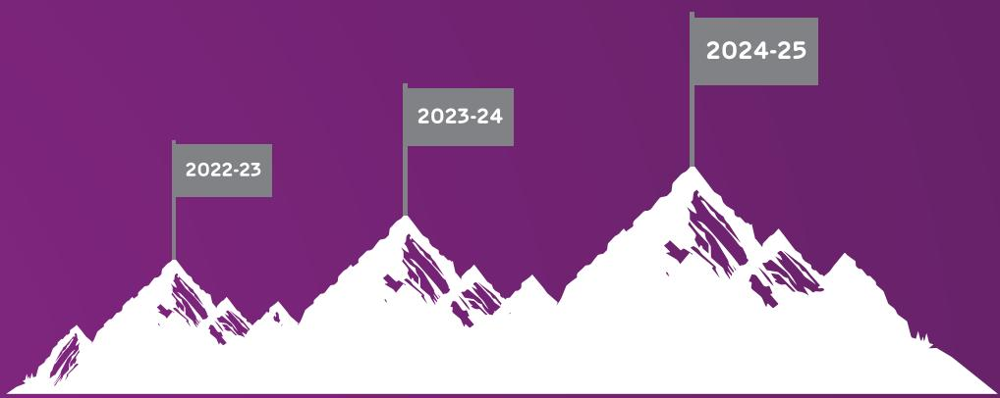

text_image

2022-23
2023-24
2024-25

Monumental success is not merely about reaching new heights but shattering previous boundaries and redefining what is possible. It embodies the epitome of human potential, where individuals or entities

transcend conventional limits to achieve extraordinary feats. Such achievements become landmarks in history, inspiring generations and setting new benchmarks for excellence.

natural_image

Snow-capped mountain peak at sunset with vibrant pink and black gradients (no text or symbols visible)

Mountains symbolise trust and truthfulness, strength and stillness, constancy and courage. In this publication, we have drawn our inspiration from the mountains, and paid our humble homage to the world's highest mountains.

While storms can flatten structures and cyclones can destroy cities, they cannot do anything to mountains.

Mountains remain unmoved and unaffected. From one peak to another, they continue to rise higher and higher.

And as they rise, they emerge stronger.

We also faced a severe man-made storm recently – one that would have destroyed most businesses.

But, under the visionary leadership of our Chairman, we remained unyielding like a mountain.

We kept building inner strength by:

Our unceasing commitment to governance and compliance

Our unwavering focus on sustainability and impact creation

Our unending endeavour to trust and transparency

With untiring learning, we made the biggest comeback in the history of corporate India with our strongest performance ever.

We continue to rise higher and higher, and emerge

# Stronger Than Ever

# Contents

We showed our unbreakable spirit and proved that challenges could not weaken us; instead they became a testament to our ability to emerge stronger than ever.

Mr Gautam S. Adani Chairman

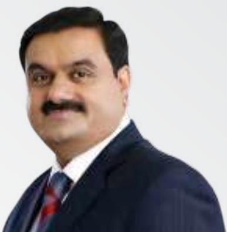

natural_image

Portrait of a man in formal business attire (no visible text or symbols)

Read more Pg.18

# Portfolio Overview

04 Portfolio of progress   
06 Committed to a stronger than ever India   
08 Stronger than ever performance

# Corporate Overview

12 Stronger Than Ever   
14 Performance and Progress   
16 Performance Highlights FY 2023-24   
18 Message from the Chairman   
26 Joint Message from Managing Director and Chief Executive officer   
30 About Adani Power   
34 Assets and Markets Served   
36 Investment Case   
42 Awards and Accolades   
44 Stronger Than Ever Opportunity Horizon   
46 Stronger Than Ever Proposition to Forge Ahead   
48 Stronger Than Ever Balance Sheet and Financial Foundation   
50 Stronger Than Ever Operations & Maintenance   
54 Stronger Than Ever Project Execution

# Strategic Review

58 Business Model   
60 Stakeholder Engagement   
66 Material Matters   
72 Risk and Opportunities   
80 Strategy   
84 Progressing on Our Sustained Growth   
86 Operational Performance

# Environment, Social and Governance

108 Environment   
122 Social: Health and Safety   
128 Social: Employees   
135 Social: Corporate Social Responsibility   
148 Social: Responsible Sourcing   
152 Governance   
163 Governance: Board of Directors

# Statutory Reports

168 Corporate Information   
169 Director’s Report   
197 Management Discussion & Analysis   
213 Corporate Governance Report   
259 Business Responsibility & Sustainability Report

# Financial Statements

311 Standalone Financials   
425 Consolidated Financials

# 531 Notice

To view this report online, please visit:

www.adanipower.com

# Our Approach to Integrated Reporting

This is the maiden integrated annual report (<IR>) of Adani Power Limited (referred to as “we”, “our”, “us”), aimed at presenting our annual performance for FY 2023-24 and oulook to stakeholders. This report offers detailed insights into our financial and operational performance, highlighting their alignment with our strategic objectives, materiality assessment, and our capacity to generate sustainable value. Going forward, the report will be further enriched by incorporating additional data, and maintaining utmost transparency for stakeholders to make well-informed decisions.

# Reporting Principles

The financial information presented in this report is in line with the requirements of:

The Companies Act, 2013 (including the rules made thereunder)   
ƒ The Companies (Accounting Standards) Rules, 2006   
The Securities and Exchange Board of India (Listing Obligations and Disclosure Requirements) Regulations, 2015   
Integrated Reporting <IR> Framework of the International Integrated Reporting Council (IIRC), now part of the IFRS Foundation

# Reporting Scope, Boundary, and Period

The scope and boundaries of this report cover all corporate operations, thermal power plants and solar plants, owned by Adani Power subsidiary companies.

The reporting period for this Integrated Report is from April 1, 2023 to March 31, 2024.

# Approach to Materiality

The context of this <IR> centres on factors that could potentially affect our ability to generate value for stakeholders over the short, medium, and long term. In determining these critical issues, Adani Power’s management evaluates internal and external factors, including the Company’s strategic objectives, business model, key stakeholders' expectations and concerns, and the broader macroeconomic landscape.

A comprehensive materiality analysis was conducted in FY 2019-20, with identified issues integrated into Adani Power's long-term planning and strategic development. Material issues are revisited every year internally. This analysis allows us to refine our strategic approach and management priorities, promoting long-term sustainable growth by addressing significant ESG (Environmental, Social, and Governance) topics.

# Forward-Looking Statement

Certain statements in this report may constitute forward-looking statements. While these statements reflect our future expectations, it is crucial to recognise that various risks, uncertainties, and other significant factors could lead to actual results differing materially from our expectations.

# Independent Assurance

DNV Business Assurance India Private Limited (‘DNV’), has undertaken an Independent Assurance of Business Responsibility and Sustainability Report (BRSR). Reasonable Level of assurance for BRSR 9 Core Indicators of SEBI circular dated July 12, 2023 and Limited Level of assurance for the rest of the non-financial disclosures of the BRSR report.

# Navigate Our Report

Financial Capital

Intellectual Capital

Social and Relationship Capital

Manufactured Capital

Human Capital

Natural Capital

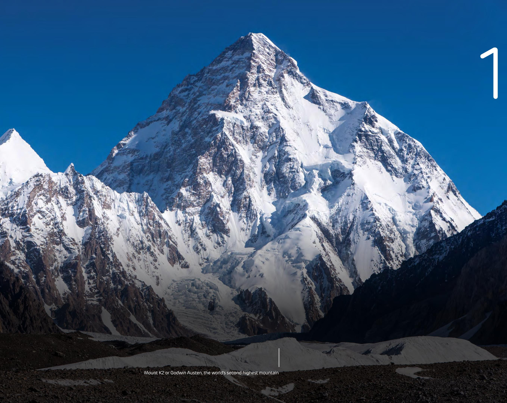

text_image

Mount K2 or Godwin Austen, the world's second highest mountain

#

04 Portfolio of progress   
06 Committed to a stronger than ever India   
08 Stronger than ever performance

# THE ADANI PORTFOLIO OF COMPANIES

# Portfolio of Progress

At the heart of this Portfolio of Progress is a journey of evolution over the years.

Like the ascending peaks of a mountain range, we have grown every year – not only on the strength of our business performance, but equally and importantly, through our steadfast commitment to environmental, social and governance practices underpinned by a culture of transparency.

The Adani portfolio of companies, headquartered in Ahmedabad, India, has been founded and promoted by the visionary industrialist Mr Gautam Adani. The operations of the portfolio commenced in 1988 with commodity trading business under the flagship company Adani Enterprises Limited (previously Adani Exports Limited).

The Adani portfolio of companies today stands amongst India’s largest and fastest-growing diversified business portfolios spanning transport, logistics, energy and utility, materials, metals, mining and various B2C sectors. The portfolio comprises eleven publicly-traded companies, including four investment grade (IG)-rated businesses, and is India's sole Infrastructure Investment Grade bond issuer.

# Vision

# Culture

# Core Philosophy

To be a world-class leader in businesses that enrich lives and contribute to nations in building infrastructure through sustainable value creation.

# Values

# Courage

We shall embrace new ideas and businesses

# Trust

We shall believe in our employees and other stakeholders

# Commitment

We shall stand by our promises and adhere to high standards of business

# Passion

Performing with enthusiasm and energy

# Results

Consistently achieving goals

# Integration

Working across functions and businesses to create synergies

# Dedication

Working with commitment in the pursuit of our aims

# Entrepreneurship

Seizing new opportunities with initiatives and ownership

The Adani portfolio of companies is guided by the philosophy of ‘Growth with Goodness’, which emphasises sustainable and responsible development aligned with national priorities. To this end, ambitious ESG targets, with a focus on decarbonisation, have been set.

In one of the largest commitments of its kind globally, a significant USD 100 billion investment has been earmarked for a green transition and transport by 2030. This includes building Integrated Green Hydrogen Ecosystem encompassing three giga factories to develop 10 GW solar panels, 5 GW wind turbines and 5 GW hydrogen electrolysers and expanding the portfolio of Adani renewables to 50 GW. Five major companies – Adani Ports, Adani Green Energy, Adani Energy Solutions, ACC and Ambuja – have committed to achieving net zero by 2050. Furthermore, a pledge has been made at WEF’s 1t.org to plant 100 million trees by 2030.

The Adani Foundation, currently touching over 9.1 million lives, is positioned to address the critical needs of New India in areas like health, nutrition, education, basic sanitation, women’s livelihood and skills development.

# Portfolio structure

Unleashing growth and nation development with a world-class infrastructure and utility portfolio

# adani

Flagship

Infrastructure & Utility Core Portfolio

Primary Industry

Emerging B2C

<table><tr><td>Incubator</td><td colspan="2">Energy &amp; Utility</td><td colspan="2">Transport &amp; Logistics</td><td>Materials, Metal &amp; Mining</td><td>Direct to Consumer</td></tr><tr><td rowspan="5">AEL(72.61%)</td><td>AGEL Renewables(56.37%)</td><td>AESL T&amp;D(73.22%)</td><td>APSEZ Ports &amp; Logistics(65.89%)</td><td>NQXT(100%)</td><td>Cement1(70.33%)</td><td></td></tr><tr><td rowspan="3">ATGL Gas Discom(37.40%)</td><td rowspan="3">APL IPP(71.75%)</td><td></td><td></td><td>Copper, Aluminium(100%)</td><td>AWL Food FMCG(43.94%)</td></tr><tr><td></td><td></td><td>PVC(100%)</td><td>NDTV(64.71%)</td></tr><tr><td></td><td></td><td>Specialist Manufacturing2(100%)</td><td>ADL Digital(100%)</td></tr><tr><td>ANIL New Industries(100%)</td><td>AdaniConneX Data Center(50%)</td><td>AAHL Airports(100%)</td><td>ARTL Roads(100%)</td><td>Mining Services &amp; Commercial Mining(100%)</td><td></td></tr></table>

(%) Adani family's equity stake in the Adani portfolio companies

(%) AEL equity stake

Holdings are as on March 31, 2024, except for cement, in which holding is as on April 30, 2024.

Data center, JV with EdgeConneX, AEL: Adani Enterprises Limited; APSEZ: Adani Ports and Special Economic Zone Limited; AESL: Adani Energy Solutions Limited; APL: Adani Power Limited; AGEL: Adani Green Energy Limited; AAHL: Adani Airport Holdings Limited; ARTL: Adani Roads Transport Limited; ANIL: Adani New Industries Limited; AWL: Adani Wilmar Limited; ADL: Adani Digital Labs Private Limited; NDTV: New Delhi Television Limited; PVC: Polyvinyl Chloride; NQXT: North Queensland Export Terminal; ATGL: Adani Total Gas Ltd, JV with TotalEnergies; T&D: Transmission & Distribution; IPP: Independent Power Producer

1 Cement business includes 70.33% stake in Ambuja Cements Limited which in turn owns 50.05% in ACC Limited, Adani directly owns 6.64% stake in ACC Limited. Ambuja also owns 60.44% stake in Sanghi Industries

2 Includes the manufacturing of Defence and Aerospace Equipment

# Committed to a stronger than ever India

The Adani portfolio of companies boldly leads the way with extensive capacities spanning critical sectors of the economy and a nationwide footprint. They are strategically positioned to capture market leadership and propel the nation forward.

# Empowering critical sectors of the Indian economy

# Transport and Logistics

Logistics (seaports, airports, logistics, shipping and rail), public transport infrastructure (roads and highways construction)

# Energy and Utility

Power generation, transmission & distribution, renewable energy (solar, wind, hybrid and pump hydro storage), green hydrogen, data center, water management

# Materials, Metals and Mining

Cement, mining development and operations, copper, petrochemicals, defence & aerospace

# B2C

Natural Gas & infrastructure (City Gas Distribution, EV Charging, Compressed Biogas Production, Smart Meters), agro (commodities, branded edible oil, packaged food products, cold storage and grain silos), media & entertainment, digital lab

# Scale and market leadership across businesses

# Adani Ports and Special Economic Zone Limited

India’s largest private-sector port operator

India’s largest port (Mundra)

Highest margin among peers

627 MMT cargo handling capacity

# Adani Green Energy Limited

Among the world’s largest renewable energy business

World’s largest wind-solar hybrid power project (2,140 MW) in Rajasthan

21,953 MW locked-in portfolio

Fully secured growth up to 50 GW by 2030

# Adani Energy Solutions Limit

# India’s

largest private-sector transmission and distribution company with over 20,500 ckm of network and 12 million consumers

# Only private player

in the country to have built and operate a HVDC line

# One of India's most efficient

transmission and distribution players in terms of line availability benchmarks and distribution losses and other operating parameters

AEML is rated as India's No.1 power utility (2nd year in a row)

# 34.35%

Renewable power in the overall energy mix of AEML by FY 2023-24

# Adani Total Gas Limited

# India’s largest

private city gas distribution business

52\* geographical areas of gas supplies

(\*including 19 IOAGPL GA's)

606 EV charging points and 1,040 under various stages of construction

# Ambuja Cements Limited

(with subsidiaries ACC Limited and Sanghi Industries Limited)

# Second largest

cement manufacturer in India

Iconic cement brand

# 78.9 MTPA cement

manufacturing capacity

# Adani Enterprises Limited

# India’s largest

business incubation company

# India’s largest

airport infrastructure company

4 GW module manufacturing

1.5 GW wind turbine generator capacity

17 MW data center capacity

500 KTPA Copper Unit at Mundra

5,000+ lane kms of road projects

9 mine service contracts (operational: 4 coal and 1 iron ore)

# Adani Power Limited

India's largest private sector thermal power producer

India's largest single location private thermal IPP (Mundra)

16.85 GW of operating and upcoming capacity

# Adani Wilmar Limited

India’s largest edible oil brand

Amongst India’s largest port-based edible oil refinery

5,000 MT per day edible oil refinery capacity

7.2 lakh retail outlets

# NDTV Limited

Among India’s most trusted media companies

# Countries

65 NDTV 24\*7 | 10 NDTV India

5 NDTV Profit

# 32.25 million

YouTube subscribers

National footprint with deep penetration   
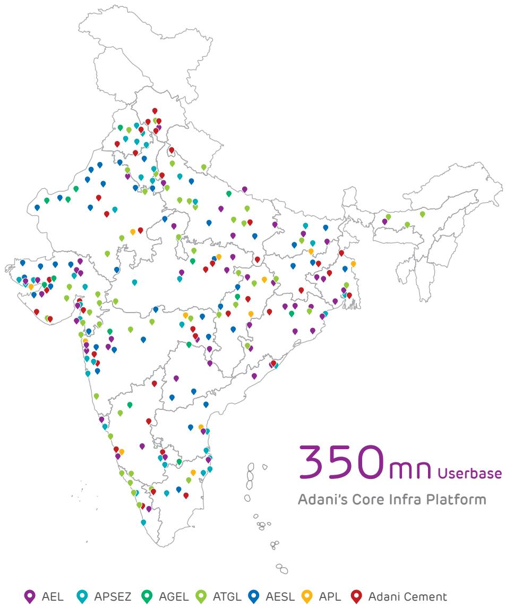

geo

| Region | Node Color | Marker Shape |
|--------|------------|--------------|
| Various Indian | AEL (Purple), APSEZ (Cyan), AGEL (Green), ATGL (Light Green), AESL (Blue), APL (Yellow), Adani Cement (Red) | Dot Markers |
| Various Indian | AEL (Purple), APSEZ (Cyan), AGEL (Green), ATGL (Light Green), AESL (Blue), APL (Yellow), Adani Cement (Red) | Dot Markers |
| Various Indian | AEL (Purple), APSEZ (Cyan), AGEL (Green), ATGL (Light Green), AESL (Blue), APL (Yellow), Adani Cement (Red) | Dot Markers |
| Various Indian or Less | AEL (Purple), APSEZ (Cyan), AGEL (Green), ATGL (Light Green), AESL (Blue), APL (Yellow), Adani Cement (Red) | Dot Markers |

AE

L

AT

GL

AES

L

A

PL

ni

ent

Map not to scale and used for representation only.

# Stronger than ever performance

Industry-leading profitability 

<table><tr><td rowspan="2">Adjusted EBITDA</td><td>₹ 28,111 crAPL96% ↗Note: Includes prior period items contributing ₹ 9,322 cr to EBITDA</td><td>₹ 17,202 crAPSEZ19% ↗</td><td>₹ 6,322 crAESL4% ↗</td><td>₹ 13,681 crAEL30% ↗</td></tr><tr><td>₹ 8,847 crAGEL38% ↗</td><td>₹ 1,166 crATGL26% ↗</td><td>₹ 7,589 crAmbuja Cements Limited (with subsidiaries ACC Limited and Sanghi Industries Limited)74% ↗</td><td>₹ 1,406 crAWL28% ↗</td></tr></table>

<table><tr><td rowspan="4">PAT</td><td>₹20,829 cr</td><td>₹8,104 cr</td><td>₹1,197 cr</td><td>₹3,334 cr</td></tr><tr><td>APL94% ↗</td><td>APSEZ50% ↗</td><td>Comparable PAT*AESL12% ↗</td><td>AEL38% ↗</td></tr><tr><td>₹1,260 cr</td><td>₹668 cr</td><td>₹4,738 cr</td><td>₹148 cr</td></tr><tr><td>AGEL30% ↗</td><td>ATGL22% ↗</td><td>Ambuja CementsLimited (with subsidiariesACC Limited and SanghiIndustries Limited)119% ↗</td><td>AWL75% ↗</td></tr></table>

\*Comparable PAT excludes all one-time items like regulatory income, provisions, bilateral charges   
Note 1: Growth pertains to growth in FY 2023-24 vs FY 2022-23   
Note 2: Adjusted EBITDA: PAT incl. Share of Profit from JV + Current Tax + Deferred Tax + Depreciation + Finance Cost + Unrealised Forex Loss / (Gain) + Exceptional Items   
Note 3: EBITDA and PAT of AWL was impacted on account of hedges dis-alignment, tariff rate quota disparity and losses in Bangladesh operations

Cargo volume growth (MMT)   
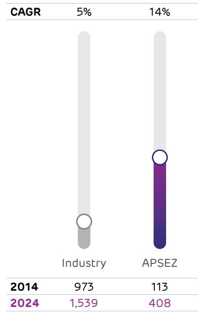

bar

| Year | Industry | APSEZ |
| ---- | -------- | ----- |
| 2014 | 973      | 113   |
| 2024 | 1,539    | 408   |

Renewable capacity growth (GW)   
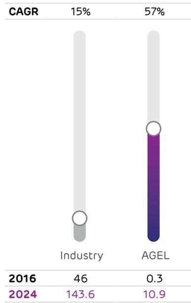

bar

| Year | Industry | AGEL |
| ---- | -------- | ---- |
| 2016 | 46       | 0.3  |
| 2024 | 143.6    | 10.9 |

Transmission network growth (ckm)   
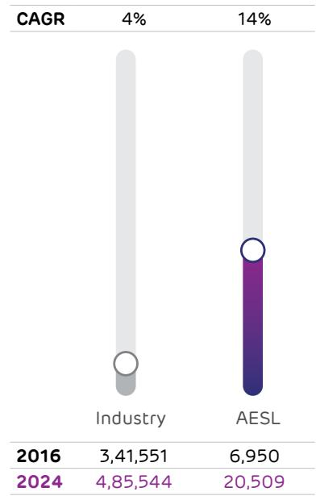

bar

| Year | Industry | AESL   |
|------|----------|--------|
| 2016 | 3,415,51 | 6,950  |
| 2024 | 4,855,44 | 20,509 |

City gas distribution Volume (MMSCM)   
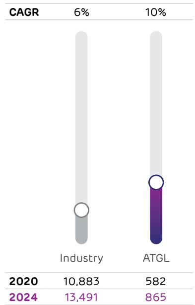

bar

| Year | Industry | ATGL |
| ---- | -------- | ---- |
| 2020 | 10,883   | 582  |
| 2024 | 13,491   | 865  |

Passenger traffic (Mn)   
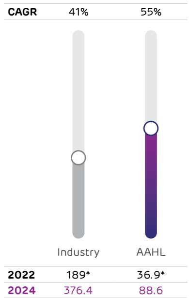

bar

| Year | Industry | AAHL |
|------|----------|------|
| 2022 | 189*     | 36.9* |
| 2024 | 376.4    | 88.6  |

Note: The start year considered for industry data is the year when the business commenced.   
\* Pax numbers were impacted due to pandemic in FY 2021-22

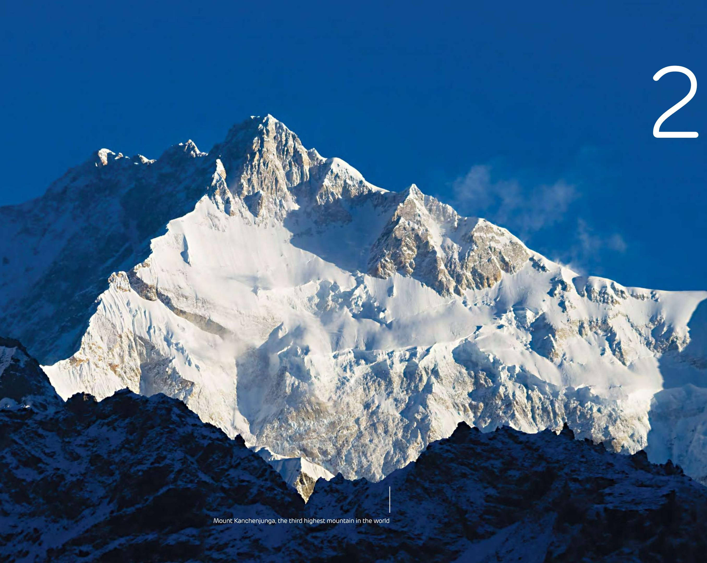

text_image

Mount Kanchenjunga, the third highest mountain in the world
2

# 2

#

12 Stronger Than Ever   
14 Performance and Progress   
16 Performance Highlights FY 2023-24   
18 Message from the Chairman   
26 Joint Message from Managing Director and Chief Executive Officer   
30 About Adani Power   
34 Assets and Markets Served   
36 Investment Case   
42 Awards and Accolades   
44 Stronger Than Ever Opportunity Horizon   
46 Stronger Than Ever Proposition to Forge Ahead   
48 Stronger Than Ever Balance Sheet and Financial Foundation   
50 Stronger Than Ever Operations & Maintenance   
54 Stronger Than Ever Project Execution

How is

Adani Power Limited

# Stronger Than Ever

Globally, concerns over climate change are driving policy change and influencing behaviour

Climate change affects everyone, and human activity is contributing to acceleration of long-term trends.

Amid increasing demand for energy transition and net zero targets

110 nations at COP28 have pledged to triple renewable capacity to 11,000 GW by 2030.

India aims to achieve 50% penetration of non-fossil fuel generation capacity.

But the challenge is addressing the growing power demand and intermittency of renewables

In India, the peak power demand touched 243 GW in September 2023 and is set to rise further.

Lack of energy storage options and intermittency challenges of renewables make grid stability and meeting base load requirements growing challenges.

The need of the hour is striking the right balance

A strategic balance between reliable and schedulable thermal power and clean renewables for grid reliability and supporting India’s economic activities while combating climate change.

This requires bold actions

As India’s largest private sector thermal power producer, Adani Power is leading the action on adding base load power capacity. We are stronger than ever in our intent to meet India’s power needs, reliably and sustainably.

# Performance and Progress

# Stronger Than Ever

# This is what being stronger than ever means to Adani Power

Being India’s largest private sector independent thermal power producer

16,850 MW

Power generation capacity (15,250 MW operational and 1,600 MW under construction)

6.3%

Share in India’s coal+lignite based generation capacity

18.1%

Share in India’s private sector coal/ lignite-based generation capacity

That operates the most efficient, sustainable and ultramodern fleet

72%

Supercritical/ultra-supercritical units out of current capacity

79%

of domestic fuel-based capacity secured through long- and medium-term (LT/MT) contracts

85%

Capacity contracted through LT/MT power purchase agreements (PPAs)

With class-leading mine-to-plant logistics capability

60 MMTPA

Coal handling capacity

13 MMTPA

Fly Ash handling capacity

And committed to ambitious and sustainable expansion plans

9,020 MW

Organic and inorganic capacity expansion planned (including 1,600 MW under construction)

# PERFORMANCE HIGHLIGHTS FY 2023-24

# Getting Stronger than Ever Results in a Stronger-Than-Ever Performance

Financial performance and value delivery to shareholders

\` 60,281 crore Revenue 40%

\` 28,111 crore EBITDA 96%

\` 20,829 crore PAT 94%

0.62x Net external debt to Equity

Robust operational performance with benchmarked productivity

90% Commercial availability under PPAs (vs 90% in FY 2022-23)

3,315 Employees engaged

82% Sales volume from contracted capacity (vs 83% in FY 2022-23)

0 / 1 Fatalities (Employees / Workers)

65% Generation performance {Plant Load Factor (PLF)} (vs 48% in FY 2022-23)

0 / 0.15 Lost Time Injury Frequency Rate (Employees / Workers)

Nurturing communities and enriching lives

8,21,125 People benefited from healthcare programmes

2,12,515 People benefited from Community Infrastructure Development

10,62,566 Students benefiting from Education initiatives

2,22,376 People benefited from Sustainable livelihood programme

Addressing India’s power needs reliably and affordably

79 billion units Power despatch

Pioneering sustainable practices

2.25 m3/MWh Water intensity

States with long-term PPA tie-ups

plants (out of 9) Having Single-Use Plastic Free (SUPF) certification

72.92 MtCO e e GHG emissions

# Message from the Chairman

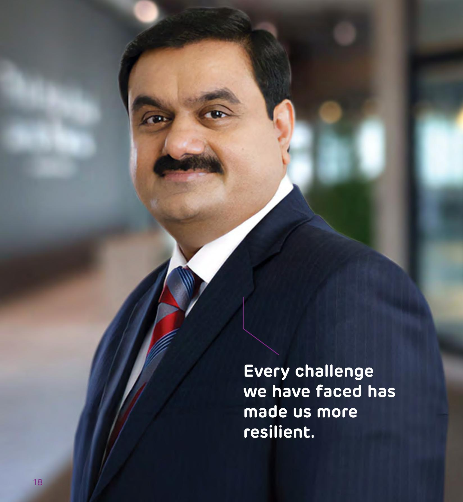

text_image

Every challenge
we have faced has
made us more
resilient.

Every challenge we have faced has made us more resilient.

# Dear Shareholder,

This year marks a monumental milestone for us. I am immensely grateful for what we have achieved together. Your unwavering support and trust have fuelled our transformation and allowed us to emerge stronger than ever with the wherewithal to overcome every obstacle that has come our way.

Our journey epitomised the essence of the - spirit that has always defined us and has allowed us to consistently turn setbacks into comebacks.

# From Trials to Triumph

For the Adani Group, 2023 was a year unlike any other. In the face of an unprecedented challenge and widespread scrutiny, our journey epitomised the essence of the spirit that has always defined us and has allowed us to consistently turn setbacks into comebacks. In 2023, we showed our unbreakable spirit and proved that challenges could not weaken us; instead they became a testament to our ability to emerge stronger than ever.

As most of you know, we faced baseless accusations made by a U.S.-based short-seller that threatened to cast a shadow on our reputation and decades of hard work.

Typical short-selling targets financial markets. This was far more insidious. It was a two-pronged attack, simultaneously targeting our financial standing and dragging us into the political arena. The onslaught was a calculated strike two days before the closing of our Follow-on Public Offer (FPO). Amplified by a segment of complicit media, it was designed to defame us, inflict maximum damage and erode our hard-earned market value.

We were, therefore, faced with a multi-dimensional crisis. Despite successfully raising \` 20,000 crore through the FPO, we made the extraordinary decision to return the proceeds. This historic move underscored our unwavering dedication to our investors and our commitment to ethical business practices.

Amidst the challenges, our liquidity became our greatest asset. Augmenting our cash reserves, we raised approximately E 40,000 crore more, comfortably covering the next two years of our debt repayment.

Amidst the challenges, our liquidity became our greatest asset. Augmenting our cash reserves, we raised approximately \` 40,000 crore more, comfortably covering the next two years of our debt repayment. This decisive action is a testament to the strength of your company. It restored market confidence, and we safeguarded our portfolio against any volatility by pre-paying \` 17,500 crore in margin-linked financing.

Despite never having faced any challenges with debt repayments while operating in the inherently leveraged infrastructure sector, we dropped our Debt to EBIDTA ratio to 2.5x in just six months from 3.3x at the end of March 2023. It is now at 2.2x. We should keep in mind that five years ago, this ratio stood at 7x. This approach not only strengthens our financial resilience but also increases our capacity for future expansion.

# 2.2x

Portfolio-level Net Debt to EBIDTA ratio in FY 2023-24

India’s trajectory is shaped by an exceptional time where opportunity and decisive action converge. This is evidenced by powerful metrics: a remarkable growth rate, declining fiscal and current account deficits, surging exports, controlled inflation, and rising income levels.

We were further vindicated when the Supreme Court of India affirmed our actions, and our commitment to operational excellence and transparent disclosures was validated not only by rating agencies and the well-informed financial community but also by respected global investors. Partners like GQG Partners (U.S.), TotalEnergies Limited (Europe), IHC and QIA (Middle East), and even the U.S. Development Finance Corporation (DFC) stood firmly by our side, signalling unwavering confidence in our integrity.

The fact is that the spirit to fight back, the courage to stand up, and the will to overcome makes us stronger than ever. The storms that tested us became the very ones that fuelled our strength.

# India’s Moment: Navigating Complexity, Seizing Opportunity

The world stands at a crossroads. Geopolitical tensions strain relationships, the fight against climate change grows more challenging, and technological change disrupts the way we live and work. Amidst this uncertainty, a powerful light shines – the undeniable rise of India.

India stands at a pivotal moment. A period where circumstances tilt in its favour, and decisive action can propel decades of growth and prosperity. Our nation is witnessing something extraordinary: a self-reinforcing cycle of progress. Growth feeds growth. India’s trajectory is shaped by an exceptional time where opportunity and decisive action converge. This is evidenced by powerful metrics: a remarkable growth rate, declining fiscal and current account deficits, surging exports, controlled inflation, and rising income levels. These forces intertwine with declining poverty and expanding consumption, feeding corporate strength and slashing bank NPAs. This self-reinforcing cycle of progress is fuelled by domestic demand and amplified by global investors seeking stability and diversification, leading to record FDI inflows further bolstering the economy at a time of global insecurity.

The foundation of much of India’s success rests in the clarity, consistency, and compassion of the government. Its focus on the welfare of the common citizen is transformative. Schemes like Direct Benefit Transfer, eliminating over 100 million fraudulent accounts and saving an astounding \` 3 lakh crore from misuse, Ayushman Bharat, saving the poor an estimated \` 1 lakh crore in healthcare expenses, the Prime Minister Ujjwala Yojana, providing clean cooking solutions to over 10 crore underserved citizens, or the Jal Jeevan Mission, which aims to supply 55 litres of water per person per day to every rural household, are more than just programmes – they are pillars of social progress that act as safeguards for the health and dignity of millions of our people. This trust in government emboldens the people and fuels their ambition.

It is this platform, established over the past decade, that has made India the world’s fastest-growing major economy, a nation of scale, vision, and heart. In addition to the domestic success, its rising geopolitical stature and principled global engagement positions India as a leading force for stability

and progress during a tumultuous time as seen through initiatives like the G20 presidency.

This is India’s moment. We are now the force for stability, cooperation, and progress in a complex world bolstered by vast domestic demand and propelled by the government’s ambitious USD 2 trillion infrastructure investment target by 2030.

We, as a company, recognise this exceptional moment and that our ambitions are not just our own; they are interwoven with India’s emergence as a true global power. India shines, and we shine with it.

# Hum Karke Dikhate Hai: The Philosophy for Our Success

India’s robust macroeconomic stability and ambitious growth plans inspire unwavering confidence in our future. The pivotal role of public-private partnerships in infrastructure development, fuelled by strong multiplier effects, reinforces our belief. The nation’s infrastructure spending has tripled in the past decade, with breakneck progress in highways, railways, and electrification. Initiatives like Gati Shakti will integrate infrastructure schemes (Bharatmala, Sagarmala, etc.) to drive logistics costs below 10%, bolstering competitiveness, and we are very well positioned to capitalise on such programmes.

This infrastructure push, combined with policies like Make in India and Production-Linked Incentive Schemes, will drive investment across vital sectors – roads, airports, ports, power, railways, and data centers, each of these are core businesses for the Adani Group. As India’s leading infrastructure player, we see a clear narrative of immense and predictable growth.

Our record-breaking achievements in 2023 underscore our alignment with national priorities and our ability to execute the most complex, largescale projects with unmatched expertise.

Picture our Khavda Renewable Energy Park, the world’s largest RE plant spanning several hundreds of square kilometres. Already generating 2,000 MW of clean energy, our aggressive timeline aims to develop 30 GW capacity in the next five years, enough to power nations like Belgium, Chile, and Switzerland. For us, this RE park is a symbol of our commitment to sustainability and a symbol of national pride.

In the spirit of sustainability, Adani Green became the proud sponsor of London Science Museum’s stunning green energy gallery that looks at the past, present and future of energy systems. It is now considered one of the foremost museums that showcases how the world can generate and use energy more sustainably. It has quickly become a one-of-its-kind platform drawing and inspiring thousands of global visitors to understand solutions for an equitable and sustainable future.

# USD 2 trillion

Government of India's infrastructure investment target by 2030

Our record-breaking achievements in 2023 underscore our alignment with national priorities and our ability to execute the most complex, largescale projects with unmatched expertise.

# 420 MMT

Cargo handled by Adani Ports in FY 2023-24

# USD 553 mn

U.S. Development Finance Institution's investment in our container terminal JV in Sri Lanka

We consistently take on projects of immense scale that others wouldn’t dream of, proving our ability to deliver complex infrastructure that will fuel the nation’s rise and most importantly continue to ensure that we do so without compromising on our growth and financial numbers.

Or envision the cutting-edge Ammunition and Missile Complex, South Asia’s largest, a testament to our commitment to India’s security. Picture the Drishti 10 Starliner UAV, a symbol of Indian innovation, soaring through the skies, protecting our nation. These aren’t just machines; they embody our unwavering dedication to India’s well-being.

Further, visualise the world’s largest slum at Dharavi in Maharashtra as we redevelop it over the next decade to provide dignity to over its 1 million residents. This is not a project of redevelopment; it’s about dignity of living.

And we did not stop there.

We were privileged to have the Honourable Prime Minister inaugurate the state-of-the-art Terminal T3 at the Chaudhary Charan Singh International Airport in Lucknow, designed to accommodate 8 million passengers annually and enhance domestic and international connectivity.

Kutch Copper Limited, a pioneering project in Mundra, commenced operations at its greenfield copper refinery. By the end of this decade, we aim to make it the world’s largest single-location copper smelter with a capacity of 1 MTPA, significantly enhancing India’s self-reliance on a crucial metal needed for several critical industries.

Adani Ports experienced an exceptional year, exceeding 400 MMT of cargo for the first time and handling a record 420 MMT as it continued to expand its position as India’s premier commercial port with significant double-digit growth across most facilities.

The U.S. Development Finance Corporation injected USD 553 million into CWIT, Adani’s joint venture in Sri Lanka, to develop a deepwater shipping container terminal at Colombo Port. This investment is a strategic step showcasing the confidence of the DFC on Adani’s capabilities as well as towards bolstering Sri Lanka’s economic recovery through private sector-led initiatives.

Following the strategic acquisition of ACC and Ambuja Cements and the successful commissioning of our Ametha Integrated Unit, the Adani Group’s combined cement capacity has risen from 67 MTPA to 78.9 MTPA. This puts us well on the path towards the 140 MTPA target we had set to achieve by 2028. Also, we are proud to state that Ambuja Cements was the lead supplier for the breathtaking Mumbai Trans Harbour Link, India’s longest sea bridge covering 21.8 km that showcases its infrastructural prowess. Our approach is clear – align with the nation, build adjacencies, and de-risk through integration. Today, we stand as a testament to India’s growth trajectory. We consistently take on projects of immense scale that others wouldn’t dream of, proving our ability to deliver complex infrastructure that will fuel the nation’s rise and most importantly continue to ensure that we do so without compromising on our growth and financial numbers. This is best manifested in the all-round growth numbers we delivered in 2023-24.

# Financial Performance: An All-Time Record

In terms of financial performance, I am delighted to state that we achieved an unprecedented milestone, recording the highest-ever EBITDA of \` 82,917 crore (roughly USD 10 billion), a remarkable surge of 45%. This exceptional financial performance drove our PAT to a record high of \` 40,129 crore, marking a substantial 70.8% growth. Our net Debt to EBITDA further fell to 2.2x from 3.3x over the past year, giving us additional headroom for future growth. All of this resulted in an all-time-high levels of liquidity for the Group with a cash balance of \` 59,791 crore.

These consistent and improved metrics demonstrate our highly stable infrastructure platform, and led to a series of rating and outlook upgrades. Three of our portfolio companies – Ambuja, ACC, and APSEZ, are now AAA rated.

# E82,917 Cr

Highest-ever portfolio-level EBITDA in FY 2023-24

# Highlighting the performance of a few of our companies:

# APL

Our operating capacity increased by 12% to 15,250 MW, with the commissioning of the 1,600 MW Godda ultra-supercritical thermal power plant.

# APSEZ

In addition to reaching 420 MMT and 10 of our ports recording lifetime high cargo volumes, we undertook successful acquisitions of Gopalpur and Karaikal ports.

# AEL

As the incubation engine for the Group, AEL had a stellar year with three of our incubating businesses, including airports, green hydrogen eco-system and roads, picking up momentum. Passenger traffic at our airports witnessed a strong double-digit growth and stands at 88.6 million passengers. The solar manufacturing division has successfully commissioned a large-sized monocrystalline ingot and wafer unit, India’s first, further enhancing control over the fully integrated green hydrogen production chain.

# AGEL

Given the RE growth potential, we revised our FY 2029-30 target from 45 GW to 50 GW. In the year, we added 2.8 GW, 15% of India’s total renewable capacity addition. This includes the commissioning of the first 2 GW at the world’s largest RE park at Khavda within 12 months of breaking ground, which highlights our execution capabilities.

# 7.5 mn people

Reach of Adani Foundation

Adani Foundation reaches millions of individuals across 5,753 villages in 19 states. This vast engagement underscores our deep commitment to uplifting lives and fostering sustainable development nationwide.

# AESL

We commissioned critical transmission infrastructure, including two 765 kV lines – Warora-Kurnool (1,756 ckm) and Khavda, Bhuj. Our transmission order book stands at  \` 17,000 crore, and our smart metering order book has expanded to 2.28 crore meters.

# ATGL

We expanded our CNG stations from 733 to 903 and PNG connections from 8.45 lakhs to 9.76 lakhs. We also commissioned 606 EV charging points and phase-1 of one of India’s largest biomass plants in Barsana.

# Ambuja Cements

Our total capacity has increased to 78.9 MTPA from 67.5 MTPA and our EBITDA per tonne has more than doubled since we acquired the business. Our target is to reach 140 MTPA by 2028.

# NDTV

Our media entity has expanded its presence regionally and scaled digitally, with a 39% increase in global digital traffic. We also invested in next-generation infrastructure, with new facilities in BKC, Mumbai, and NCR, Delhi.

Overall, our record-breaking performance and strategic achievements across diverse sectors showcase our commitment to innovation and sustainable growth. Several of these achievements will significantly reduce national reliance on imports and help secure our national value chains. We have always believed that we are not just building businesses; we are contributing to powering India’s future with infrastructure, energy solutions, and digital advancements. As we continue to invest in cutting-edge technologies and expand our reach, we are confident in our ability to deliver exceptional value and continue to contribute to our stakeholders.

# The Power of Purpose: Approach to Corporate Social Responsibility

We recognise that the most successful and enduring companies understand that integrating sustainability, ethical business practices, and community engagement into their core strategies is both a moral imperative and a smart business decision. In this context, the Adani Foundation’s reach has now extended to 9.1 million individuals across 6,769 villages in 19 states. This vast engagement underscores our deep commitment to uplifting lives and fostering sustainable development nationwide. Our commitment to ‘Growth with Goodness’ drives our actions – from addressing environmental impact to prioritising the needs of all stakeholders, we strive to create long-term value while fostering thriving communities. And as outlined here, we continue to have inspiring stories of success.

Through the Adani Saksham (skill development) initiative, we empowered 1,69,000 young individuals with essential skills, helping them secure a brighter future and potentially become entrepreneurs.

Our agricultural programmes revitalised 26,000 acres of land, introducing sustainable practices and natural farming techniques that promise a greener tomorrow.

Our health outreach programmes, including mobile health care units and camps, touched 2 million lives, ensuring that essential services reach the most remote communities.

Further, the Gujarat Adani Institute of Medical Sciences, Adani Hospitals, and our rural clinics and wellness centers provided critical healthcare to approximately 2.7 million individuals.

The SuPoshan project enhanced the nutrition delivered to 4,14,000 women and children, fortifying the foundations of future generations.

Our efforts in animal husbandry improved the livelihoods of numerous farmers, with 9,100 cattle benefiting from better care and 30,000 instances of artificial insemination boosting productivity.

Our water conservation initiatives created a staggering 13.8 million cubic meters of storage capacity, ensuring water security and supporting the ecological balance of our ecosystems.

The engagement of 16,900 women in self-help groups underlined our initiative for sustainable economic development, empowering them to become agents of change in their communities.

At the Adani Foundation, each number tells a story of change, of a life empowered, and a community revitalised. These stories fuel our mission to continue making a significant and sustainable impact, and I am proud of what we have achieved together as we strive to do our part to leave a small positive mark on this world.

# A Shared Destiny: Stronger than Ever and Building a Nation Together

The challenges we overcame last year have strengthened our resolve. We draw inspiration from the very resilience that India embodies. Our ambitions are limitless, just like India’s. We see a future where our expertise drives infrastructure revolutions, where our green energy initiatives power a sustainable tomorrow, and where our commitment to upliftment transforms communities.

The road ahead is paved with extraordinary possibilities and I can promise you that the Adani Group today is stronger than it’s ever been. Our journey is a testament to the relentless pursuit of dreams, of turning ambition into reality. This isn’t just about building businesses; it’s about building a nation.

Hum Karke Dikhayenge! The best is yet to come.

# Gautam Adani

# Joint Message from Managing Director and Chief Executive Officer

# Dear Shareholders,

We are pleased to present our FY 2023-24 integrated annual report. This has been an exceptional year for Adani Power as we have delivered outstanding operational and financial performance, soaring to newer heights and setting newer benchmarks. The team has done a great job in consolidating our position as India’s foremost thermal IPP, ensuring optimal operations of all assets and ramping up capacities to meet power demand competitively and reliably.

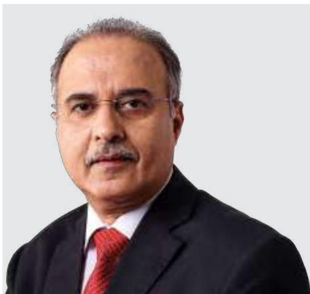

natural_image

Portrait of a man in formal suit and red tie (no text or symbols visible)

Anil Sardana   
Managing Director

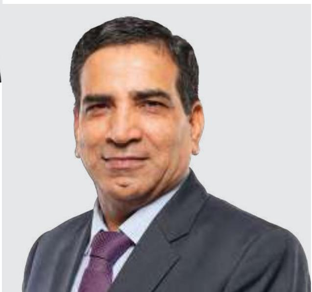

natural_image

Portrait of a man in business attire (no text or symbols visible)

S. B. Khyalia   
Chief Executive Officer

In a testament to our commitment to excellence, we proudly commissioned the 1,600 MW Godda Ultra-supercritical thermal power plant, marking a historic milestone in pioneering a transnational project.

# A Thriving Operating Context

The Indian power market and the broader economy have maintained the robust growth trajectory witnessed since the pandemic lockdowns were lifted. The Indian economy, despite facing inflationary pressures and challenges in the export market due to global headwinds, performed resiliently to emerge as one of the fastest-growing economies. Expansive infrastructure endeavours, booming industrial and manufacturing activity and robust domestic consumption, contributed to a strong GDP growth of 7.6% as against 7.0% in FY 2022-23.

Against a flourishing economy and further catalysed by population expansion and urbanisation trends, power demand in India reached unprecedented levels in FY 2023-24. The electrification of villages, railways and mobility infrastructure further contributed to this. The total electricity demand during the year increased by 7.5% to 1,626 billion units, while peak power demand reached a record high of 243.27 GW in September 2023.

The power generation sector stood up admirably to the challenge, keeping pace with the escalating power needs of the nation. Supported by transformative regulations and capacity additions, the industry stood firm to effectively meet most of the base load and peak demand.

# Powering Progress and Performance

Our team did a commendable job of seizing the favourable macro situation, as reflected in a robust operating performance and impressive developments through FY 2023-24.

In a testament to our commitment to excellence, we proudly commissioned the 1,600 MW Godda Ultra-supercritical thermal power plant, marking a historic milestone in pioneering a transnational project. The plant is now supplying much-needed electricity to Bangladesh under a long-term contract. The Mahan Energen Plant, acquired in FY 2021-22, has been successfully turned around and has started posting healthy profits, benefiting from our expertise in managing power sales, fuel sourcing, and power plant operations. Both these plants have ramped up well and are achieving high levels of availability.

We have made significant strides in enhancing our fuel management and logistics capabilities. While a substantial portion of our domestic coal requirements are secured under long- and medium-term contracts, fuel supply is being de-risked by increasingly utilising coal from commercial mines. These efforts have ensured steady fuel availability at optimised costs, facilitating uninterrupted plant operations. The average PLF in FY 2023-24 improved to 64.7% while commercial availability was maintained at optimum levels, resulting in full capacity charge collection and stable profitability.

Sales volume during the year increased by 48.5% to 79.3 billion units, supported by incremental addition from the Godda power plant, and strong performances of Mundra, Udupi, Raipur, and Mahan plants. A reduction in import fuel prices helped revive power offtake strongly from coastal Mundra and Udupi plants.

The all-round improvement in operations translated into tangible financial success, with a strong 40% growth in total revenue to \` 60,281 crore. The growth was on account of capacity expansion, one-time prior period revenue recognition on account of regulatory recoveries and higher dispatches in the merchant and short-term markets as well as under long and medium-term

\` 60,281 crore

Total Revenue

\` 20,829 crore

PAT

Adani Power remains committed to fortifying India's energy security. By leveraging our strengths and capabilities, we are diligently building a more agile, responsive and sustainable enterprise. The intent is to play an ever-increasing role in fulfilling the nation’s power demand while addressing environmental concerns and generating enduring value for our stakeholders.

contracts. During the year, Hon’ble Supreme Court pronounced judgements that upheld the Company’s claims on account of domestic coal shortfall and provided conclusive clarity on the regulatory philosophy to be followed.

Strong revenue growth, coupled with lower imported fuel prices and improved fuel cost recovery following regulatory orders contributed to a commendable growth in EBITDA by 96% to \` 28,111 crore. Strong cash flows from operations and regulatory recoveries helped the Company to reduce leverage, in turn helping improve its credit rating assigned by CRISIL and India Ratings from A to AA- during the course of the year. As a result, finance costs were firmly in control, and led to a strong growth in Profit After Tax by 94% to \` 20,829 crore.

# Building an Enterprise for the Future

The power sector presents immense potential for growth. As the Indian economy sustains its high growth trajectory, driven by infrastructure creation, manufacturing activity, and a transition to e-mobility, the electricity demand is set to surge. The Central Electricity Authority forecasts India’s energy requirement to touch 1,736 BUs in FY 2024-25 with a peak demand of 260 GW, while in the longer term the energy requirement is expected to reach 2,474 BU with a peak demand of 366 GW by 2031-32.

Amidst this landscape, the Government has rightly identified reliable and accessible electricity supply to be a key enabler to sustain a 9-10% economic growth. While renewable energy remains a focal point for climate-conscious growth, thermal power will continue to assume importance in the overall mix, given its criticality in supplying base load power and bridging the gap during periods of low renewable energy generation. This narrative is further reinforced by India's abundant coal reserves and the advancements made in coal-fired power generation technologies, which not only enhance affordability but also contribute to the sustainability of thermal power.

Adani Power remains committed to fortifying India's energy security. By leveraging our strengths and capabilities, we are diligently building a more agile, responsive and sustainable enterprise. The intent is to play an ever-increasing role in fulfilling the nation’s power demand while addressing environmental concerns and generating enduring value for our stakeholders.

We are investing in cutting-edge technologies and exploring avenues for cleaner and more efficient coal-based power generation. We plan to add 4,800 MW of brownfield capacity over the next few years in addition to proposed acquisitions, bringing our total to 24,270 MW. This includes the 1,600 MW Mahan Phase II Ultra-supercritical power project (USCTPP), which is under construction and scheduled for commissioning in FY 2027-28. We have similarly also initiated development work for a 1,600 MW USCTPP brownfield expansion of the Raigarh power plant in Chhattisgarh.

We have also undertaken several initiatives targeted at improving operating efficiencies and uptime of power plants. Project Beacon is one of our flagship endeavours through which we are integrating digitalisation and analytics into all functional aspects. The Analytics Center of Excellence, tasked to implement the project, was established at Tiroda and Kawai plants. It is currently executing more than 125 improvement projects in the areas of environment, health and safety (EHS), coal planning, advanced process control and O&M costs. It will contribute to more efficient, predictable and safe operations along with better analytical and decision-making tools.

# Sustainability

Adani Power continues to exhibit pioneering measures on the ESG front, outperforming its peers on multiple parameters. This includes a score of 48/100 in the Corporate Sustainability Assessment (CSA) by S&P Global, 3.5/5 in the FTSE ESG rating and an 88% score in the CSRHub ESG rating. We are also a constituent company in the FTSE4Good Index Series.

Adani Power remains committed to decarbonisation and environmental stewardship. All our power plants are operating admirably well under statutory limits for specific water consumption. We continue to invest in efficient generation and emission control technologies. Presently, 72% of our capacity utilises ultra-supercritical/supercritical technology which is more efficient and has lower emissions. Going forward Ultra-supercritical technology will be exclusively for new capacity additions, as we have done in the case of the Godda power plant. Equipped with the most advanced and sustainable technologies, it is set to be a showcase for generating thermal power most efficiently and sustainably. We are also setting a new precedent with a ground-breaking green ammonia combustion pilot project for our Mundra power plant, in partnership with Japan's IHI Corporation and Kowa.

Our social programmes in association with the Adani Foundation benefited more than 2.3 million lives including those of the tribal population in the vicinity of our plants. Our interventions around education, health, sustainable livelihoods, skill development and community infrastructure are bringing meaningful change in the society and have improved their living standards.

# Closing Comments

Looking ahead, the opportunities before us are abundant. We have reinforced our position as a pre-eminent player in the industry with large and efficient capacities, cutting-edge technology, operational excellence and a talented workforce. Our operations are highly resilient, supported by a balanced mix of long-term PPAs and merchant capacities, excellent fuel security and strategically located assets. Now with our expansion plans, we are poised to ascend greater heights while serving peak and base load demand.

The resolution of regulatory issues has ushered in much-needed clarity and stability within our operational landscape. Governmental interventions to encourage DISCOMs to make timely payments have yielded positive results, bolstering our cash flows, and creating a foundation for a financially sound future.

Together, these initiatives and developments coalesce to create a firm foundation on which we shall continue to achieve superior performance and create stakeholder value sustainably. We extend our gratitude to all our stakeholders for their continued support. Your continued trust and confidence in us will be crucial in our journey of growth, nation building and shared value creation.

# Anil Sardana,

Managing Director

S. B. Khyalia,

Chief Executive Officer

# 88%

CSRHub ESG Rating

Looking ahead, the opportunities before us are abundant. We have reinforced our position as a pre-eminent player in the industry with large and efficient capacities, cutting-edge technology, operational excellence and a talented workforce.

# ABOUT ADANI POWER

# Powering India Reliably, Affordably and Sustainably

Adani Power is India’s largest private-sector thermal power producer with an operating and upcoming capacity of 16.85 GW, distinguished for exceptionally efficient and sustainable operations.

We play a pivotal role in driving India’s economic growth engine by ensuring reliable, always-available power supply to industrial and residential consumers through strategic investments in large-scale capacity expansion. With our focus on advanced technologies, effective fuel management and logistics capabilities, excellence in plant operations and maintenance (O&M), and environmental consciousness, we consistently set new benchmarks of all-round excellence. This is exemplified in our industry-leading performance with impressively high availability and superior cost-effectiveness.

Taking our aspiration global, we have successfully commissioned India’s first thermal power project with a transnational power supply – the 1,600 MW ultra-supercritical Godda power plant. Supplying electricity to Bangladesh, this landmark initiative reinforces India's influence on the international stage.

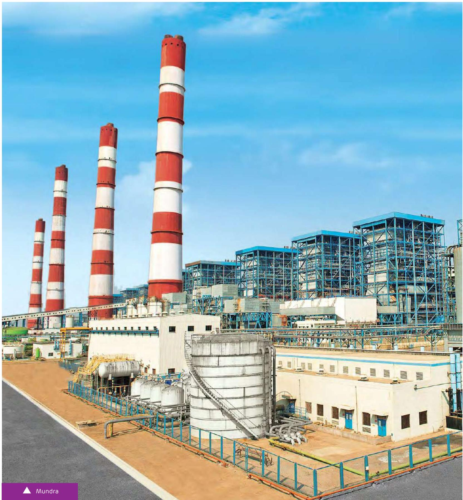

natural_image

Exterior view of a large industrial plant with red and white striped chimneys under a clear blue sky (no signage or text visible)

# Vision

Be a transformative force in power generation, empowering lives and contributing to the energy security of nations by providing sustainable, affordable and reliable power.

# Values

# Courage

We shall embrace new ideas and businesses

# Trust

We shall believe in our employees and other stakeholders

# Commitment

We shall stand by our promises and adhere to high standards of business

# Profile

Adani Power commenced operations in 2009, commissioning its first power plant in Mundra, Gujarat. Dedicated to serving the nation and seizing diverse business opportunities, we have since expanded our portfolio to nine power plants across seven states.

More than 74% of Adani Power’s current and upcoming generation portfolio utilises supercritical and ultra-supercritical units, demonstrating our commitment to utilising advanced and efficient technologies. In our pursuit of operational stability and sustainability and addressing the energy needs of various regions, we have secured long-term / medium-term (LT / MT) power purchase agreements (PPAs) for 85% of our capacity and fuel supply contracts for 79% of our domestic coal requirements.

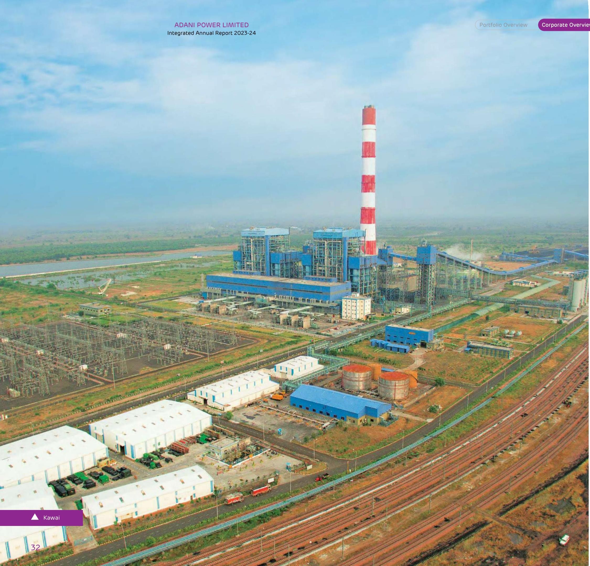

text_image

ADANI POWER LIMITED
Integrated Annual Report 2023-24
Portfolio Overview Corporate Overview
Kawai
32

Operating Subsidiaries 

<table><tr><td>Subsidiary</td><td>Stake</td><td>Operational capacity</td></tr><tr><td>Mahan Energen Limited (formerly Essar Power MP Limited)</td><td>100%</td><td>1,200 MW</td></tr><tr><td>Adani Power (Jharkhand) Limited</td><td>100%</td><td>1,600 MW</td></tr></table>

# Our Reputation of Multiple Pioneering Initiatives

World’s largest greenfield TPP portfolio installed during 2008-2013 – 9,240 MW in six years since foraying in the power sector

India’s largest private single-location coal-based power project – Mundra power plant

World’s first coal-based TPP to be granted carbon credits by the United Nations Framework Convention on Climate Change (UNFCCC) – Mundra (Phase-III)

World’s second coal-based TPP to be registered for clean development mechanism (CDM) with UNFCCC – Tiroda (Phase-I)

India’s first 800 MW Ultra-supercritical power generation unit – 800 MW Godda Unit 1

World’s Lowest footprint (on area/MW basis) for a coal-based power plant – 4,620 MW Mundra TPP spread across only 453 hectares

First in the world to develop a methodology for high voltage direct current (HVDC) power transmission lines under CDM and approved by UNFCCC

Longest HVDC system by private player in India – 989 km 500 kV HVDC bipole line with 2,500 MW transmission capacity

India’s first transnational TPP supplying all its generation to Bangladesh – 1,600-MW ultra-supercritical TPP in Godda, Jharkhand

First in India to set up a Dedicated Rail Over Rail System for Coal Transportation

India’s Largest TPP with seawater-based closed-cycle induced draft circulation cooling system - Mundra TPP

India’s First & Largest Sea Water based Flue Gas Desulphurisation Plant – Mundra TPP

# ASSETS AND MARKETS SERVED

# Energising the Nation with World-Class Assets

Adani Power has established an extensive portfolio of power generation assets in the key power markets and growth hubs of India. With large capacities, best-inclass technology and practices and mine-to-plant logistics capabilities, we play a key role in ensuring the nation’s power security.

Power Plants   
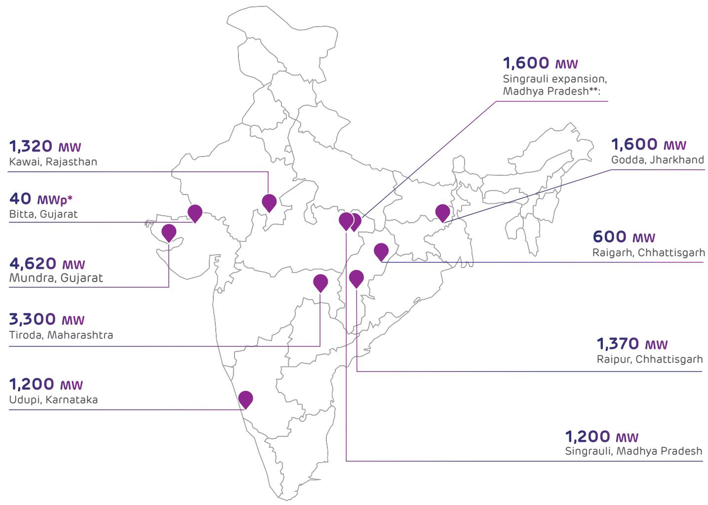

geo

| Location | Power Capacity (MW) |
| -------- | ------------------- |
| Singrauli expansion, Madhya Pradesh** | 1,600 |
| Godda, Jharkhand | 1,600 |
| Raigarh, Chhattisgarh | 600 |
| Raipur, Chhattisgarh | 1,370 |
| Singrauli, Madhya Pradesh | 1,200 |
| Udupi, Karnataka | 1,200 |
| Mundra, Gujarat | 4,620 |
| Bitta, Gujarat | 40 |
| Tiroda, Maharashtra | 3,300 |
| Kawai, Rajasthan | 1,320 |

\* Solar power plant   
\*\* Under construction

<table><tr><td>Location</td><td>Category</td><td>Technology</td><td>Total capacity (MW)</td><td>Certifications</td></tr><tr><td rowspan="2">Mundra, Gujarat</td><td rowspan="2">Coastal</td><td>Sub-critical</td><td>1,320 (4x330)</td><td rowspan="6">QMS, EMS, OHSMS, EnMS, AMS, WEMS, IRBC, BCMS, ISMS, SA#, SR, 5S, 5S-JUSE, QCFI / JUSE</td></tr><tr><td>Supercritical</td><td>3,300 (5x660)</td></tr><tr><td>Tiroda, Maharashtra</td><td>Near pithead</td><td>Supercritical</td><td>3,300 (5x660)</td></tr><tr><td>Kawai, Rajasthan</td><td>Hinterland</td><td>Supercritical</td><td>1,320 (2x660)</td></tr><tr><td>Udupi, Karnataka</td><td>Coastal; Utility</td><td>Sub-critical</td><td>1,200 (2x600)</td></tr><tr><td>Raipur, Chhattisgarh</td><td>Near pithead</td><td>Supercritical</td><td>1,370 (2x685)</td></tr><tr><td>Raigarh, Chhattisgarh</td><td>Near pithead</td><td>Sub-critical</td><td>600 (1x600)</td><td>QMS, EMS, OHSMS, EnMS, AMS, WEMS, ISMS, QCFI, JUSE</td></tr><tr><td>Godda,Jharkhand</td><td>Hinterland</td><td>Ultra-supecritical</td><td>1,600 MW (2x800)</td><td>-</td></tr><tr><td>Singrauli, Madhya Pradesh (ongoing expansion)</td><td>Near pithead</td><td>Ultra-supecritical</td><td>1,600 MW (2x800)</td><td>-</td></tr><tr><td>Singrauli, Madhya Pradesh</td><td>Near pithead</td><td>Sub-critical</td><td>1,200 MW (2x600)</td><td>QMS, EMS, OHSMS</td></tr></table>

#Udupi is the only SA certified plant

QMS: Quality Management System; EMS: Environment Management System; OHSMS: Occupational Health & Safety Management System; EnMS: Energy Management System; AMS: Asset Management System; WEMS: Water Efficiency Management System; IRBC: Guidelines for information and communications technology readiness for business continuity; BCMS: Business Continuity Management System; ISMS: Information Security Management System; SA: Social Accountability International; SR: Social Responsibility

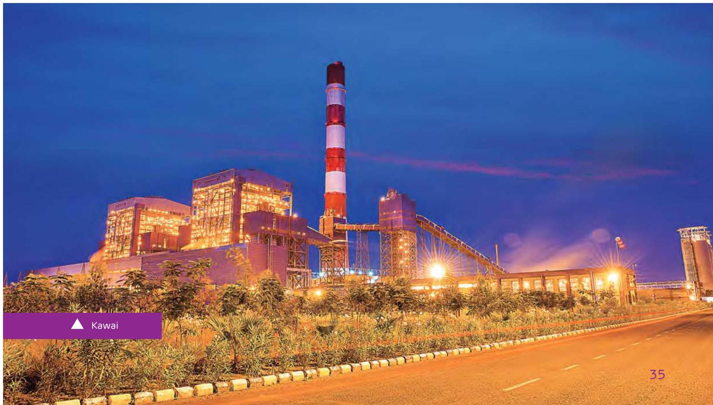

text_image

Kawai
35

Kawai

# INVESTMENT CASE

# Strong Foundation Supporting Long-Term Growth and Value-Creation

The Indian economy is growing rapidly, and electricity is a key driver to sustain and increase its growth momentum. As India’s largest private thermal power producer with an inherent competitive edge and financial prowess, Adani Power is perfectly positioned to address the nation’s growing energy needs. Uniting our capabilities and expertise, we are investing strategically to achieve value-accretive growth and contribute responsibly to nation-building.

# Positioned to build a better India and deliver sustainable value

Multifaceted power producer with a well-balanced portfolio, revenue visibility and cost leadership

Track record of superior operational performance

Fulfilling power demand and enabling greater grid penetration of renewables with reliable power supply

Robust digital infrastructure elevating efficiency and resilience

Proven ability to acquire and turn around assets for inorganic growth

Strong financial profile with a healthy balance sheet and robust returns

High degree of fuel security through domestic coal linkages and location advantage

Committed to industry-leading ESG practices

# Investment Case

Multifaceted power producer with a wellbalanced portfolio, revenue visibility and cost leadership

India’s largest private thermal power producer, operating a strategically located, diversified and ultramodern fleet with in-house logistics making us one of the most reliable, efficient and profitable players.

85% of capacities are contracted under LT/MT PPAs with financially strong DISCOMs, with a majority having fuel cost pass-through or tariff escalation clauses, yielding excellent revenue visibility and cash flow stability; the remaining 15% open capacities are in strategic locations, offering incremental revenue opportunities in high demand market.

Maintaining high availability through leveraging technologies,

digitalisation and analytics, enabling full capacity charge collection and opportunity to capitalise on growing power demand in operating regions.

Cost leadership through economies of scale, operational excellence, in-house supply chain and strategically located plants (98% of domestic coal-based open capacity is located near mine pitheads) that have low logistics cost advantage.

# 34%

4-year Recurring EBITDA CAGR driven by improved cost recovery and efficient deployment of capacities.

# \` 1.74 crore

Net Debt per MW among the lowest in India’s conventional power sector.

# Message from Chief Financial Officer

Adani Power has ended FY 2023-24 with formidable financial performance, emerging as a financially sound organisation with excellent revenue visibility, high profitability with margin stability, and low leverage. We achieved remarkable growth, recording a total revenue of \` 60,281 crore, a 40% increase, and 96% higher EBITDA at \` 28,111 crore - including one-time prior period items of \` 9,322 crore. This strong performance was made possible through all-round excellence across the business, aptly supported by prudent capital management, to deliver a Profit After Tax of \` 20,829 crore for FY 2023-24.

Adani Power now enjoys enhanced financial stability and is ideally positioned for continued profitable growth.

Dilip Kumar Jha

# Investment Case

2

Track record of superior operational performance

Three-pronged O&M strategy focused on: reliability through reliability-centred maintenance, zero forced outage programme, and asset performance management; efficiency through focusing on unit cycle efficiency and continuous monitoring; and people safety and excellence achieved via automation, safety protocols and culture and skill-building initiatives

Energy Network Operations Centre (ENOC) for centralised real-time monitoring of operations and Analytics Centre of Excellence (ACoE) for digital and analytics integration   
Excellence in fuel management and logistics, with in-house mine-to-logistics capabilities, a dedicated team and LT/MT coal linkages   
Robust material handling and logistics infrastructure (17 rakes under General Purpose Wagon Investment Scheme and 160 captive trucks) innovative transportation strategies (rail logistics optimisation) and advanced coal storage management for uninterrupted fuel availability and quick turnaround

# Investment Case

3

Fulfilling base load and peak power demand and enabling greater grid penetration with reliable power supply

Fulfilling base load and peak power demand and enabling greater grid penetration with reliable power supply. With India’s economic boom, electricity demand is projected to grow to 1,907.84 Billion Units (BU) in FY 2026-27 and 2,279.64 BU in FY 2029-30 with a peak demand of 277.2 GW and 334.8 GW respectively   
The Central Electricity Authority projects the total installed

capacity to grow to 777 GW by FY 2029-30, with thermal power accounting for 32.39% of total capacity

The Government is targeting to achieve 50% of total generation capacity from non-fossil fuels by 2029-30. Thermal power will continue to be significant due to its high-capacity utilisation advantage and challenges of intermittency and lower capacity utilisation in renewable energy sources   
Adani Power stands at the forefront of meeting India’s electricity demand, with large operational capacities and planned additions. These capacities will serve dual roles, providing baseload power and complementing renewable energy sources to overcome their intermittency challenges and facilitate greater penetration

# 65%

Plant load factor

# 90%

Commercial availability under long-term PPAs

# 15.25 GW

Installed capacity

# 6.3%

Share in India’s overall thermal generation capacity as on March 31, 2024

# 4.80 GW

Planned brownfield capacity addition

# 4.22 GW

Targeted inorganic acquisitions (including under-construction capacity)

# Investment Case

4

Robust digital infrastructure elevating efficiency and resilience

Ongoing digital transformation journey to integrate cutting-edge technologies   
Enterprise resource planning platform moved to cloud,

deployed automated measurement and control systems for enhanced reliability and implemented decision support systems for real-time plant information

DISHA as a standardised process for mergers and acquisitions   
ENOC for centralised management and analytics-led performance improvement

Undertook Project Beacon for integrating data and analytics, establishing an ACoE, assembling a 41-member team and fostering a culture of continuous improvement   
E-learning platform (e-Vidyalaya) for technical and non-technical training   
- Artificial intelligence and machine learning to address business use cases and use of robots (physical and virtual) to automate repeatable tasks

# Investment Case

5

Proven ability to acquire and turn around assets for inorganic growth

Proven model to grow capacities through inorganic route

Robust business and operational transformation process to turn around stressed assets including DISHA process, Adani Business Operational Excellence model, implementing Adani Safety Culture - Project Chetna and leveraging fuel management and logistics expertise   
Successfully turned around four acquired assets – the Udupi, Raipur, and Raigarh plants, and Mahan Energen Ltd.

# 4,370 MW

Capacity addition through inorganic route

# 22.94 BUs

Power generated by acquired units

# 29%

Share of power supplied from acquired units in total generation

# Investment Case

6

Strong financial profile with a healthy balance sheet and robust returns

Cash flows from operations of \` 14,170 crore generated in FY 2023-24   
Reduction in leverage (net external debt / equity) from 1.09x in FY 2022-23 to 0.62x in FY 2023-24 despite ongoing expansions

Improved credit rating

# CRISIL AA-/Stable

(Upgrade from CRISIL A/Stable)

# Ind AA-/Stable/A1+

(Upgraded from Ind A/Positive/A1)

Strengthened financial position through prudent capital allocation and improved operating performance:

Backed by a strong sponsor, India’s largest infrastructure and real asset platform   
Equity and reserves of \` 43,145 crore as on March 31, 2024 including unsecured perpetual securities of \` 7,315 crore

# 48%

ROE in FY 2023-24

# Investment Case

7

High degree of fuel security through domestic coal linkages and location advantage

56% of our installed and under-construction capacity is based on domestic coal, of which 79% is secured under long-term/ medium-term coal linkages with state-owned suppliers, ensuring a high degree of fuel security

77% capacity having fuel cost recovery mechanism (pass-through or escalable with change-in-law), giving protection from fuel cost surge   
Ensuring a smooth supply chain through a dedicated fuel management function (comprising coal procurement, logistics, storage and quality control and environmental compliance experts) and a captive fleet of 17 rakes under GPWIS policy and 160 captive trucks to transport coal to our plants   
Focused on de-risking fuel supply by shifting towards utilising coal from captive mines under the liberalised mining policy

# 14,500

Rake equivalent of fuel handled annually

Portfolio Overview

Corporate Overview

Strategic Review

ESG Overview

Statutory Reports

Financial Statements

# Investment Case

8

Committed to industry-leading ESG practices

Leadership in ESG matters, surpassing the global peer group average in several evaluations

Undertaking social projects and community initiatives aligned with the UN SDGs with a focus on positively impacting lives and improving livelihoods   
Prioritised climate alignment with a focus on switching to greener technologies   
72% ultra-supercritical/ supercritical capacity and Flue Gas Desulphuriser (FGD) installed in 31% capacity   
Water intensity of 2.25m3/MWh significantly lower than statutory limit for hinterland plants

# 78%

Targeted ultra-supercritical / supercritical capacity by FY 2028-29 (excluding fresh acquisitions)

# 100%

Operating and upcoming capacities to have FGD

# No Net Loss

of biodiversity by 2025

text_image

ADANI POWER LIMITED
Integrated Annual Report 2023-24
AWARDS AND ACCOLADES
Demonstrating Excellence
42

# Health and Safety

Tiroda and Raipur power plants were awarded with a “Five Star Rating” certificate from the British Safety Council, the highest recognition in the field.

Recognition at Adani Workplace Management Award (AWMA) – Mundra won the highest ‘Diamond’ category accreditation in the entire Adani portfolio of companies; Kawai won a Gold Trophy and Certificate under the A+ category and Raipur won a Gold Trophy and Certificate

Tiroda plant was recognised with 2nd Level Award "SHRESHTH SURAKSHA PURASKAR" and silver trophy in National Safety Award 2023

Tiroda plant underwent recertification for workplace management by QCFI and JUSE in June 2023

Kawai plant received an appreciation certificate from FICCI for demonstrating excellence in its Safety System

# Operational Excellence

Adani Power Raigarh received national level award as the 'Best 5S Organisation in India' by QCFI at NCQC 2023

Mundra, Kawai and Udupi plants received the IMC Ramkrishna Bajaj National Quality Award (RBNQA) Performance Excellence Award for 2023

Four teams from the Tiroda plant achieved an award in the ‘Excellent’ category and the Raigarh plant received BEST 5S Plant in Nation for 2023 at the 37th National Convention on Quality Concepts (NCQC) 2023, Nagpur

Tiroda plant secured a patent for the “Real Time Critical Bypass Alarm Alert System” from the Patent Office in November 2023

A team from the Tiroda plant was awarded with Par-excellence Category in 9th National Conclave on 5S in June 2023

Tiroda plant received multiple awards from CEE for: Sustainable performance in private sector; Operational excellence for the best energy efficient unit in the private sector 500 MW category; and National energy efficient team of the year

# Sustainable Development

Mundra plant received the 2nd CEE National Environment Excellence Award

Tiroda plant was selected for the 1st FICCI Award under the category of ‘Efficient Maintenance Systems for Sustainable Industrial Growth’ by FICCI

Kawai plant received various awards related to 5S and Quality Circle

Udupi plant received the Best Performer Award from the Minister of State for Ports, Shipping, Waterways, and Tourism for achieving the Best "Rake turnaround Time" at New Mangalore Port Authority (NMPA)

Udupi plant completed the First Surveillance Audit of the Business Continuity Management System (BCMS) and has been recommended for continuation of the certification by M/s. Bureau Veritas

Udupi plant received felicitation from Konkan Railways Corporation Ltd for its contribution to the increase in freight growth in 2023 during Customer Meet

Raipur plant, along with two teams from Zone-03 (Electrical Maintenance Department) and Zone-6 (TCD and STORE) received the JUSE (Union of Japanese Scientists & Engineers) Par Excellence Awards at the 9th NCQC 2023 by the Ahmedabad Chapter in collaboration with QCFI, Hyderabad

Raipur plant’s Raikheda Chemistry lab received a recommendation for NABL certification by Lead Assessor

Kawai plant was honoured by the Government of Rajasthan for Best CSR activities in Baran District

Udupi plant awarded with SA 8000:2014 (Social Accountability) by M/s. Bureau Veritas, the first to receive it among the entire Adani portfolio of companies

# AWARDS AND ACCOLADES

# Demonstrating Excellence

THERMAL POWER: A RESILIENT

PILLAR IN INDIA’S ENERGY MIX

# Stronger Than Ever Opportunity Horizon

Electricity demand in India is growing quickly. Fuelled by a rapidly growing economy and associated activities like infrastructure creation and industrialisation as well as increasing domestic consumption from a growing population, the need for energy has never been more pressing.

With the Indian economy headed for a sustained high growth phase, the significance of thermal power in India’s energy mix becomes even more

pronounced. It stands as the bedrock, poised to meet escalating electricity demand and bridge the intermittency gaps inherent in renewable power sources.

# 6.1%1

Projected CAGR of the Indian economy during 2022-28 to become the third-largest economy

# 1.51 billion3

India’s projected population by 2030

1 Intenational Monetary Fund 2Crisil research

# \` 143 trillion2

Projected infrastructure spending in India during FY 2023-24 to FY 2029-30

# 354 million4

Projected number of Indian households by 2030 up from 289 million in 2020

3United Nations' World Population Prospects

4Boston Consulting Group report

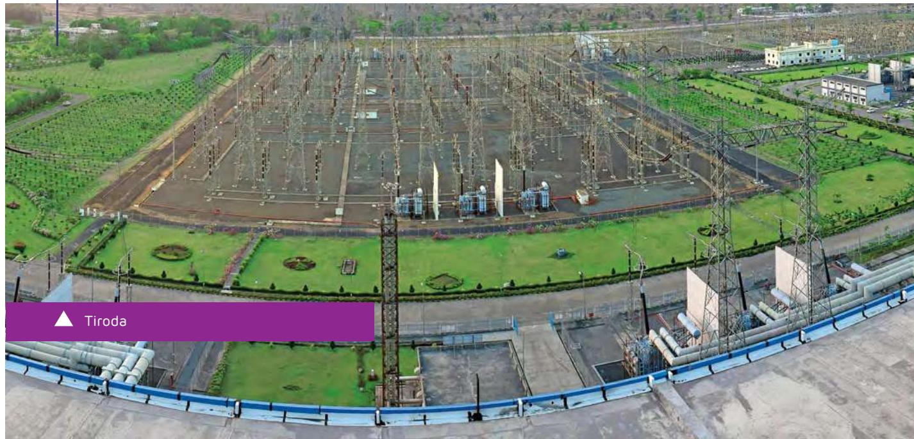

natural_image

Aerial view of a large electrical substation with transmission towers and green landscaping, labeled 'Tiroda' in the corner (no other text or symbols visible)

Electricity Demand Set to Grow Multi-fold   
Electrical energy requirement   
(in billion units)   
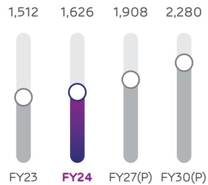

bar

| Category | Value |
|---|---|
| FY23 | 1,512 |
| FY24 | 1,626 |
| FY27(P) | 1,908 |
| FY30(P) | 2,280 |

Peak electricity demand (in GW)   
(in billion units)   
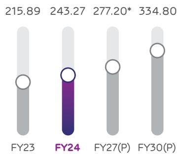

bar

| Category | Value |
|---|---|
| FY23 | 215.89 |
| FY24 | 243.27 |
| FY27(P) | 277.20* |
| FY30(P) | 334.80 |

\*20th Electric Power Survey; Draft National Electric Plan, December 2023; Report on optimal generation capacity mix for 2029-30 version 2.0, CEA

Electrical Energy Requirement in our Key States of Presence (in billion units)   
Gujarat   
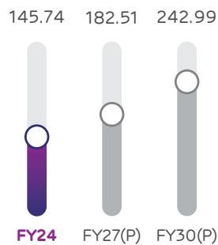

bar

| Period | Value |
|---|---|
| FY24 | 145.74 |
| FY27(P) | 182.51 |
| FY30(P) | 242.99 |

Haryana   
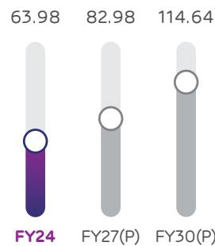

bar

| Year | Value |
| :--- | :--- |
| FY24 | 63.98 |
| FY27(P) | 82.98 |
| FY30(P) | 114.64 |

Maharashtra   
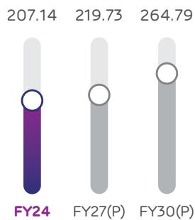

bar

| Year | Value |
| :--- | :--- |
| FY24 | 207.14 |
| FY27(P) | 219.73 |
| FY30(P) | 264.79 |

Madhya Pradesh   
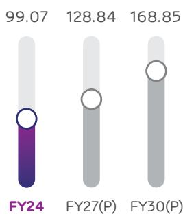

bar

| Time Point | Value |
|---|---|
| FY24 | 99.07 |
| FY27(P) | 128.84 |
| FY30(P) | 168.85 |

Rajasthan   
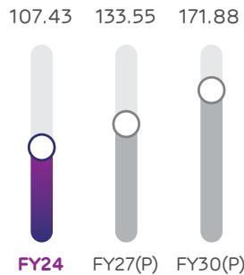

bar

| Period | Value |
|---|---|
| FY24 | 107.43 |
| FY27(P) | 133.55 |
| FY30(P) | 171.88 |

Karnataka   
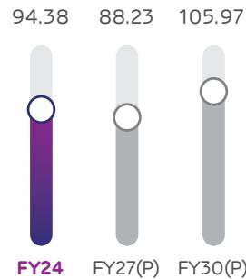

bar

| Category | Value |
|---|---|
| FY24 | 94.38 |
| FY27(P) | 88.23 |
| FY30(P) | 105.97 |

Chhattisgarh   
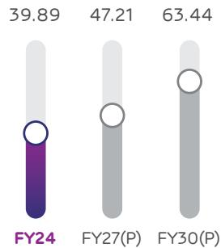

bar

| Category | Value |
|---|---|
| FY24 | 39.89 |
| FY27(P) | 47.21 |
| FY30(P) | 63.44 |

Thermal Capacity to Grow Despite Transition

Installed capacity by source (in MW)   
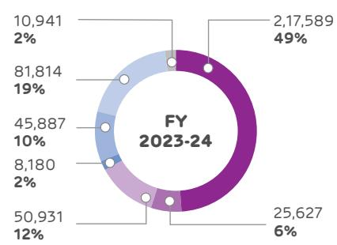

pie

FY 2023-24
| Category | Value | Percentage (%) |
|---|---|---|
| Segment 1 | 2,17,589 | 49 |
| Segment 2 | 25,627 | 6 |
| Segment 3 | 50,931 | 12 |
| Segment 4 | 8,180 | 2 |
| Segment 5 | 45,887 | 10 |
| Segment 6 | 81,814 | 19 |
| Segment 7 | 10,941 | 2 |

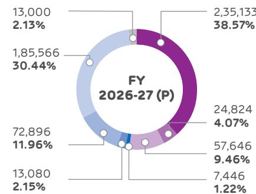

pie

FY 2026-27 (P)
| Category | Value | Percentage (%) |
|---|---|---|
| Segment 1 | 2,35,133 | 38.57 |
| Segment 2 | 24,824 | 4.07 |
| Segment 3 | 57,646 | 9.46 |
| Segment 4 | 7,446 | 1.22 |
| Segment 5 | 13,080 | 2.15 |
| Segment 6 | 72,896 | 11.96 |
| Segment 7 | 1,85,566 | 30.44 |
| Segment 8 | 13,000 | 2.13 |

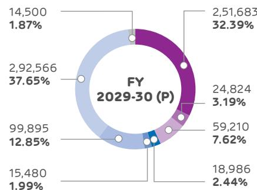

pie

FY 2029-30 (P)
| Category | Value (P) | Percentage (%) |
|---|---|---|
| Segment 1 | 14,500 | 1.87 |
| Segment 2 | 2,51,683 | 32.39 |
| Segment 3 | 24,824 | 3.19 |
| Segment 4 | 59,210 | 7.62 |
| Segment 5 | 18,986 | 2.44 |
| Segment 6 | 99,895 | 12.85 |
| Segment 7 | 15,480 | 1.99 |
The chart displays a single data point for FY 2029-30. The segments are labeled with their respective values and percentages relative to the total. The label 'FY 2029-30 (P)' appears in the top-left corner.

Coal+Lignite   
Gas+Diesel   
Hydro + small hydro   
PSP Nuclear   
Wind   
Solar   
Biomass+Others

2

ADANI POWER AT THE FOREFRONT OF INDIA’S GROWING ENERGY DEMAND

# Stronger Than Ever Proposition to Forge Ahead

Adani Power is India’s largest private thermal power producer. We have one of the largest capacities and worldclass assets, equipped with future-ready technologies and in-house fuel and logistics management excellence.

With our ongoing and planned strategic expansion plans, we are competitively positioned to address India’s growing energy needs sustainably, reliably and affordably. We are committed to taking India ahead by supporting its burgeoning economy.

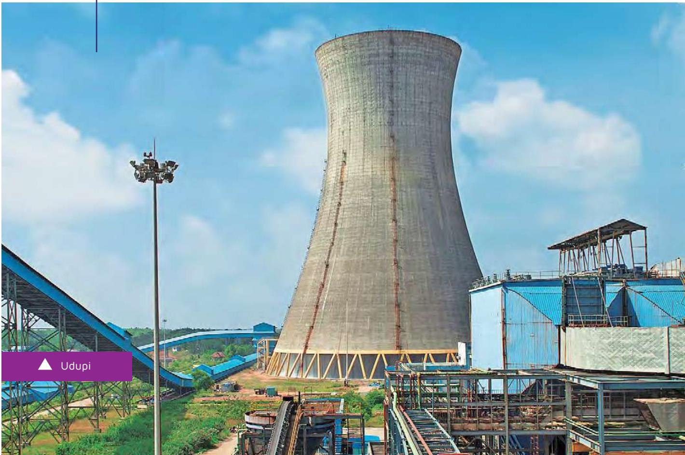

natural_image

Exterior view of a large industrial cooling tower under construction, with conveyor belts and greenery in the foreground (no signage visible)

# Adani Power Meeting India’s Electricity Needs Responsibly

Over the last five years, we have added 1,600 MW capacity through the organic route and 3,170 MW capacity through the inorganic route. Our total power generation capacity as on March 31, 2024 stands at 15,250 MW (15,210 MW thermal power capacity and 40 MW solar power capacity). Of this, 13,650 MW is dedicated to supplying electricity in India and 1,600 MW for Bangladesh

Organic capacity addition in the last five years includes the 1,600 MW Godda ultra-supercritical thermal power plant. We also acquired and turned around four thermal power assets. This includes a 1,370 MW plant at Raipur, a 600 MW plant at Raigarh, and a 1,200 MW plant

(under subsidiary Mahan Energen Limited) at Bandhaura, Singrauli in the last five years and 1,200 MW Udupi plant at Karnataka in 2015.

In FY 2023-24, power generation by our assets accounted for 5.1% of India’s total power generation and 5.9% of total thermal power generation.

# Future-Proof Assets

We have implemented the best technologies and practices throughout our assets, ensuring reduced resource consumption, higher plant uptime and better capacity utilisation. The strategic location of our assets near mines and coasts, coupled with our in-house fuel and logistics management, enhances our ability to achieve highly competitive capital costs and cost-efficient operations. This aligns with our goal

of delivering affordable and reliable power to all.

# Scaling Our Ambitions for India

Aligned with the nation’s growing power requirements, we have set an ambitious plan to add another 4,800 MW new thermal capacity by FY 2028-29 which will ensure grid reliability. Apart from this, we also plan to acquire and turn around 4,220 MW of existing thermal power capacities, some of which are under corporate debt resolution process.

Furthermore, we are committed to transitioning our entire operations to more efficient thermal technologies, aiming to minimise environmental impact and future-proof our assets. To this end, we are committed to install flue gas desulphurisers across our entire capacity by 2028-29 and reduce our emissions footprint.

Adani Power Capacity Creation Roadmap   
(Operational capacity in MW)   
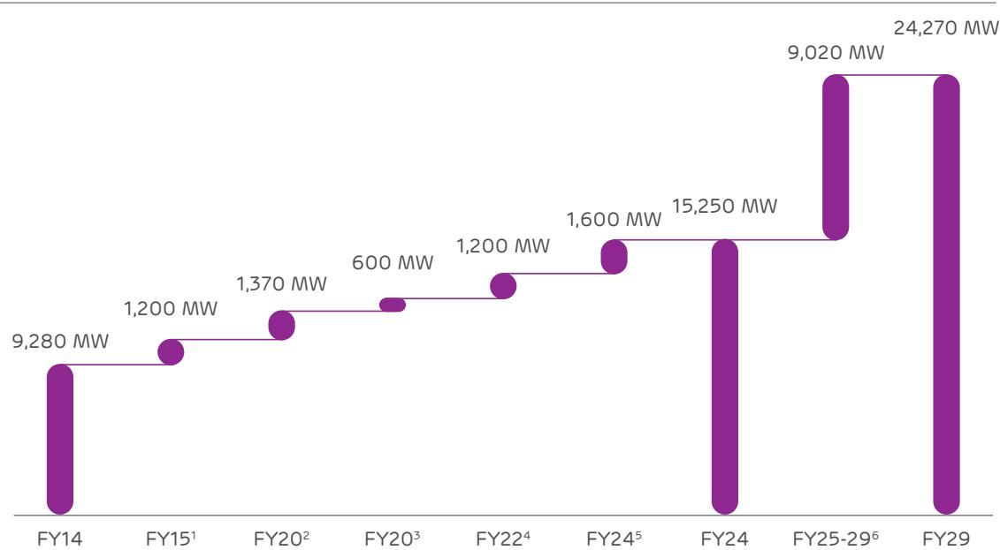

bar

| Fiscal Year | Capacity (MW) |
| :--- | :--- |
| FY14 | 9,280 |
| FY15¹ | 1,200 |
| FY20² | 1,370 |
| FY20³ | 600 |
| FY22⁴ | 1,200 |
| FY24⁵ | 1,600 |
| FY24 | 15,250 |
| FY25-29⁶ | 9,020 |
| FY29 | 24,270 |

1 Acquisition of Udupi Power Corporation Ltd. in FY 2014-15   
2Acquisition of GMR Chhattisgarh Energy (Raipur plant) in FY 2019-20   
3Acquisition of Korba West Power Company (Raigarh plant) in FY 2019-20   
4Acquisition of Essar Power M.P. Ltd. (Mahan Energen) in FY 2021-22   
5Commissioned Godda Plant in FY 2023-24   
6Planned organic and inorganic capacity additions during FY 2024-25 to FY 2028-29

REDEFINING PATHWAY FOR

ENHANCED RETURNS AND EXPANSION

# Stronger Than Ever Balance Sheet and Financial Foundation

We stand at the threshold of vast opportunity. With our sights fixed on the horizon of possibilities, we are taking a strategic pivot – a bold leap towards building a future-ready enterprise that is more agile, responsive and value-driven.

Through concerted efforts aimed at making our balance sheet lighter and more liquid, we have strengthened our financial standing. This positions us to capitalise on forthcoming opportunities with resilience amidst an evolving power landscape.

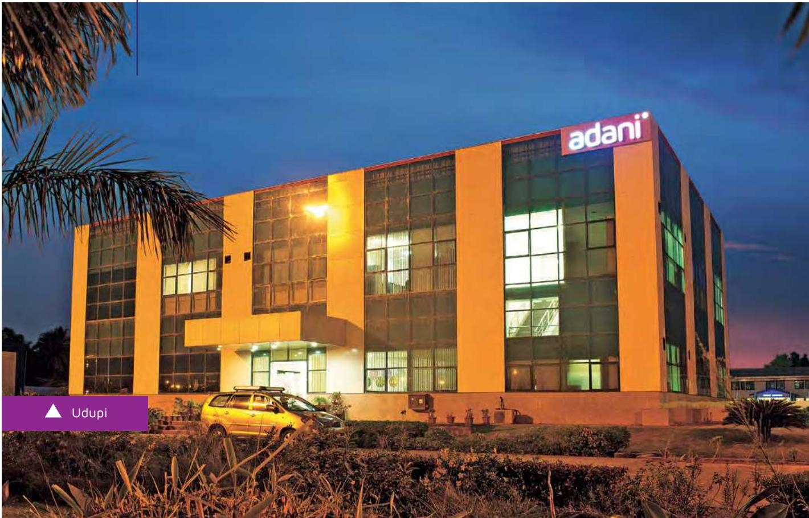

text_image

adani
▲ Udupi

# Becoming Financially Stronger

In FY 2023-24, we generated healthy cash flows from operations of \` 14,170 crore, accompanied by a significant recovery - in past dues from DISCOMs. These funds were effectively allocated towards prepaying and repaying over and above scheduled amortisation, resulting in a substantial reduction in debt and a corresponding decrease in finance cost.

Our liquidity profile has also significantly improved, driven by favourable regulatory changes which ensure timely payments from DISCOMs, the successful turnaround of Mahan Energen operations, and recovery of past dues from DISCOMs. Further, our operations have robust cash flow predictability with 85% of our capacity tied up under PPA and 74% having fuel cost recovery assurance.

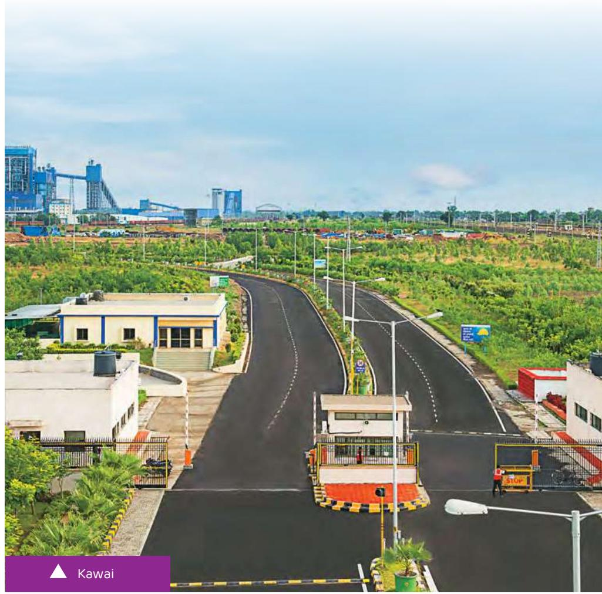

natural_image

Aerial view of a highway with a gated entrance, surrounded by greenery and industrial buildings in the background (no visible text or symbols)

# Sustained Balance Sheet Deleveraging

Senior term debt/equity ratio   
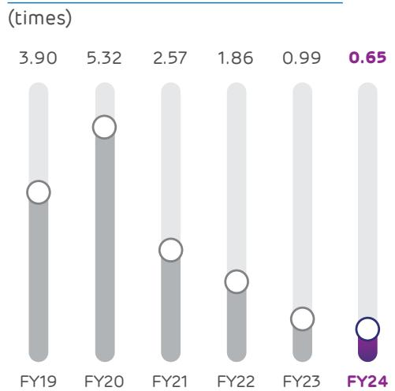

bar

| Year | Value (times) |
| :--- | :--- |
| FY19 | 3.90 |
| FY20 | 5.32 |
| FY21 | 2.57 |
| FY22 | 1.86 |
| FY23 | 0.99 |
| FY24 | 0.65 |

Fixed assets coverage ratio   
(net fixed assets/net total debt)   
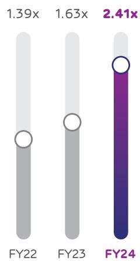

bar

| Year | Value (x) |
| :--- | :--- |
| FY22 | 1.39 |
| FY23 | 1.63 |
| FY24 | 2.41 |

Total debt   
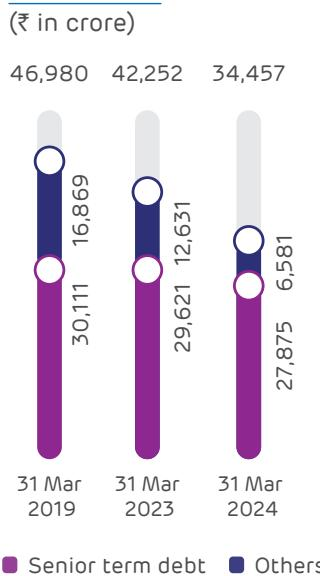

bar_stacked

(₹ in crore)
| Date | Senior term debt (in crore) | Others (in crore) |
| :--- | :--- | :--- |
| 31 Mar 2019 | 30,111 | 16,869 |
| 31 Mar 2023 | 29,621 | 12,631 |
| 31 Mar 2024 | 27,875 | 6,581 |
| Total (€ million) | 46,980 | 16,869 |
| Total (€ million) | 42,252 | 12,631 |
| Total (€ million) | 34,457 | 6,581 |

TECHNOLOGY, DIGITALISATION AND

ANALYTICS FOR OPTIMAL OPERATIONS

# Stronger Than Ever Operations & Maintenance

Long-term success and value creation in the thermal power business hinges on how efficiently we operate our assets with minimal resources and impact on the environment.

At Adani Power, we are investing in cutting-edge technology including cloud computing systems, automation and analytics to make our operations more reliable, resilient and agile. This evolves into sustainable competitive advantage, respect, talent traction, enhanced profitability and more informed decision-making and strategic planning.

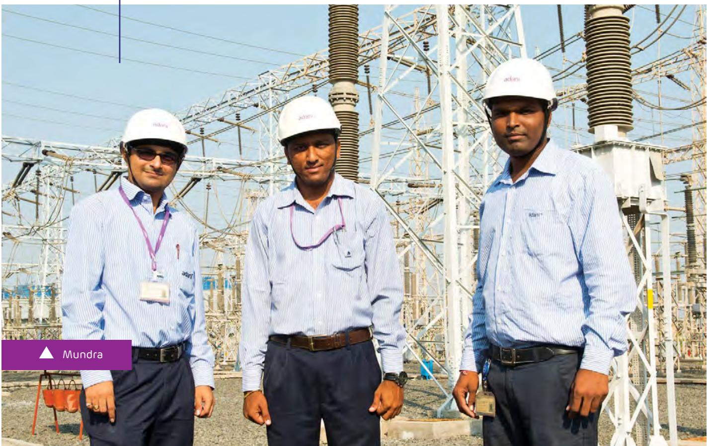

text_image

Mundra

# Deepening Our Culture of Technology Excellence

Embarking on a digital transformation journey with our flagship initiative, DigiPower, we focus on integrating new technologies and reshaping business practices. This initiative nurtures a culture of learning and innovation, driving digital excellence. Our engagement strategy encompasses workshops, training programmes, knowledge-sharing sessions, and e-Vidyalaya, an online learning platform tailored to business needs. We prioritise continuous learning to keep our workforce abreast of industry advancements. Through initiatives like the Digital Dexterity Course series and DigiByte, we educate and incentivise our employees, fostering a dynamic and skilled workforce.

# Digital Advancement for Operational Excellence

Automated measurement and control systems revolutionise operational processes, optimising operations and enhancing systemic reliability. AI/ML technology boosts task speed and accuracy, while RPA bots streamline recurring activities.

# PowerAI Initiative Under DigiPower Project

The PowerAI initiative integrates Image Analytics and Computer Vision technologies for sophisticated image data interpretation and real-time visual monitoring, critical in quality control. Adani AI Labs collaborate with Adani Power, developing AI-driven solutions like predictive engines for power sales and intelligent chatbots. These efforts yield cost optimisation and improved productivity.

#

Embracing digital transformation entails utilising technologies like the Internet of Things, cloud computing, and edge computing to connect machinery, sensors, and devices for real-time monitoring and predictive maintenance. Automation through technologies such as Robotic Process Automation (RPA) and Artificial Intelligence enhances accuracy and productivity. Promoting digital literacy and rewarding digital skills are essential for successful transformation, encouraging employees to contribute to digital initiatives and improving operational efficiency.

– S. B. Khyalia, Chief Executive Officer

# Collaboration with Startups

Our transformation journey is enriched by strategic collaborations with digital startups, keeping us at the technological vanguard. These partnerships ensure integration of innovative solutions, keeping us ahead in the digital landscape.

# Data-driven Transformation with Project Beacon

Project Beacon serves as our conduit for integrating data and analytics across the organisation, with the dual objective of building long-term analytics capabilities and driving tangible value across plants. By unlocking value from the massive organisational-wide data generated, the project strengthens our analytical capabilities for sustained transformation and innovation.

This outcome driven programme emphasises long-term capacity and skill building.

An Analytics Centre of Excellence (ACoE), comprising highly talented individuals, has been established to leverage data and analytics across our operations. This will help evolve into a value-led and tech-first organisation, pioneering best-inclass analytical integration.

During the year, we institutionalised the ACoE department at Tiroda and Kawai plants along with a central leadership team. The team is exploring multiple avenues to enhance the productivity and efficiency of our overall operations. Further, we have built a roadmap for capability building and expansion of ACoE across the organisation.

# FY 2024-25 Focus Areas

# People

Next batch of ACoE core training   
Involvement of expert network pool   
Cross-skill and upskill   
Career planning

# Governance and process

New initiative identification   
Learning partner for core training   
ACoE expansion to all sites   
• Group level collaborations

# Cultural change

Identify and initiate analytics projects in non-O&M functions.   
Build data acumen through harnessing sessions and   
enthusiast learning   
Analytics immersion – Middle Management and Senior Leadership

# Data

Integrated view of the data – analytical record

Consistency and accuracy

# Technology

Cloud infrastructure - analytics data   
warehouse   
Generative AI tools

# Case Study

# Driving Excellence with Project Beacon

In FY 2023-24, the ACoE department took up 127 initiatives to enhance efficiency, predictability and safety along with strengthening analytical and decision-making tools. Majority of these initiatives were being undertaken in the Tiroda and Kawai plants where the ACoE was fully functional. 80 of these initiatives were categorised as ‘Ignite’, aimed at driving tangible performance improvement across eight programme KPIs and 47 were categorised SPARK, enabler initiatives that cuts across all aspects of life at Adani Power.

During the project, major initiatives like combustion optimisation, smart soot blowing, APC optimisation, CHP belt utilisation factor improvement was taken up and resulted in annualised saving of over \` 25 crore.

# Digitalisation to Unlock New Opportunities

Projects like Power Sale Price Prediction help our stakeholders make informed decisions about predicting power sale price helping them to maximising revenue. This forecast can also be used by consultant/policymakers to inform their decisions regarding energy policies and regulations.

# Analytics Centre of Excellent Performance in Fy 2023-24

# 127 initiatives

Deployed (74 unique and 59 cross site deployment)

# >70

Ignite initiatives

# >45

Spark initiatives

Capability Building

18

Station

Heat Rate

13

Auxiliary Power Consumption

1

Coal

Planning

19

Safety

30

Time-Saving

13

Department

30

Expert

154

Enthusiast

5

Availability

8

Coal

\` 28

O&M Cost

1

Environment

7

Decision-making

# 74 initiatives

Completed

# \` 25 crore

Of saving achieved

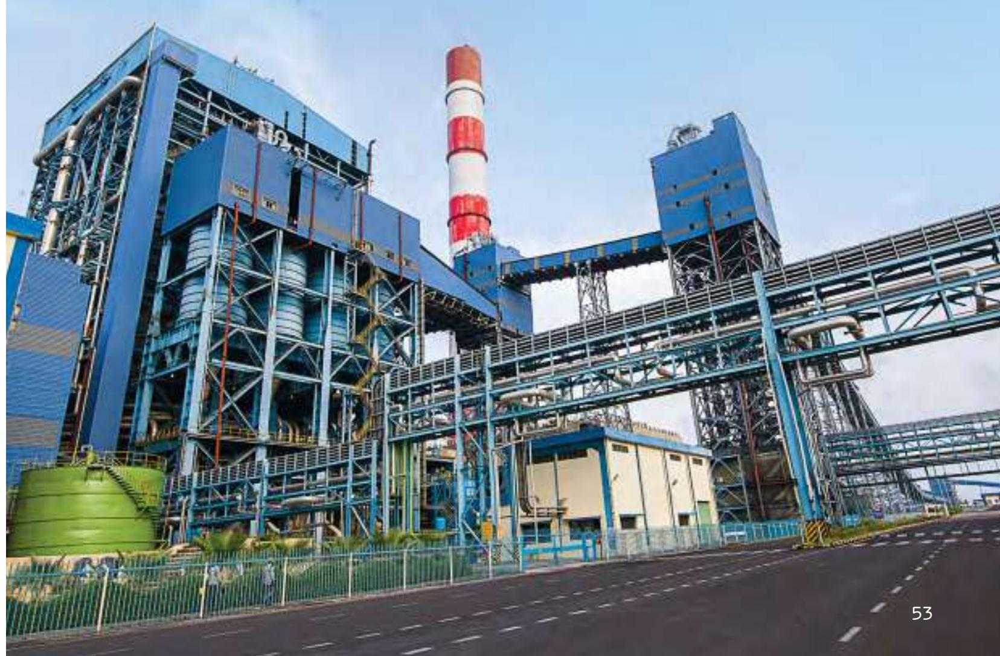

natural_image

Exterior view of a large industrial power plant with blue steel structures, a red-and-white chimney, and green storage tanks (no visible text or signage)

PIONEERING TRANSNATIONAL POWER VENTURES

# Stronger Than Ever Project Execution

Adani Power successfully commissioned the Godda Ultra Super-Critical Thermal Power Plant (USCTPP). The groundbreaking project supplies 100% of its electricity output to Bangladesh.

With this milestone, Adani Power has now become a partner in Bangladesh's economic development, offering uninterrupted and reliable electricity at competitive tariffs. This collaboration heralds a new era of growth for the industry and strengthens the economic bonds between India and Bangladesh.

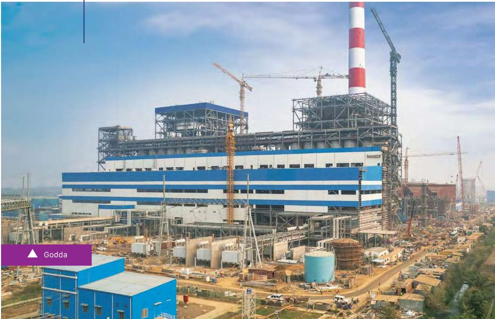

natural_image

Exterior view of a large industrial complex under construction with cranes and scaffolding (no visible text or signage)

# The Godda Power Plant

In November 2017, Adani Power entered a 25-year PPA with the Bangladesh Power Development Board to supply 1,496 MW of electricity from the Godda USCTPP. A wholly-owned subsidiary, Adani Power Jharkhand Ltd (APJL), was formed to implement the 1,600 MW (2x800 MW) ultra-super-critical coal-fired thermal power plant in Godda, Jharkhand.

APJL successfully commercialised operations of the first unit on April 6, 2023 followed by the second unit on June 26, 2023. On July 12, 2023, a dependable capacity test, as mandated under the PPA, was successfully conducted to evaluate the simultaneous functioning of both units after they began supplying electricity. The plant has since been supplying 100% of the electricity generated to Bangladesh.

# A Milestone in Execution Excellence

The commissioning of the Godda USCTPP is a testament to our unparalleled project and asset management prowess in line with the global best standards. We completed the project in a record 42 months, despite considerable logistical challenges, including the construction of a 105-km-long 400 kV Double Circuit Transmission Line, a private railway line and an extensive water pipeline from the Ganges. Notably, this feat was accomplished amidst unprecedented challenges posed by the COVID-19 pandemic, with our engineering team adapting innovatively to ensure seamless execution, including handling all testing and commissioning protocols remotely, via tele-conversations and video conferencing.

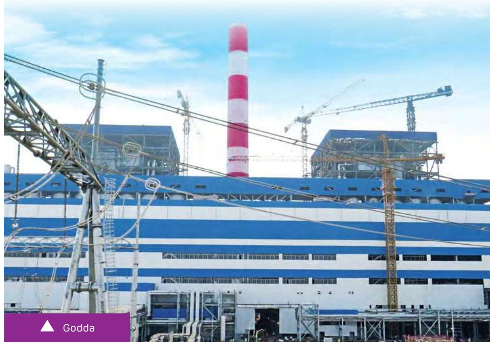

natural_image

Exterior view of a large industrial facility with blue and white facade, red-and-white striped chimney, and multiple cranes under a clear sky (no signage or text visible)

# Ushering A New Era in Cross-Border Collaboration and Socio-Economic Impact

The Godda plant will positively revolutionise Bangladesh’s power situation, fostering economic growth and prosperity. Providing uninterrupted, reliable and affordable electricity alternatives to liquid fuel-generated power, it will significantly reduce the average cost of electricity and empower the citizens.

Besides being an ultra-supercritical plant with 100% flue gas desulphurisation, selective catalytic converter and zero water

discharge technologies, it leads the way in generating electricity most efficiently with minimal impact on the environment. It is the first in India to have initiated operations, aligning with stringent environmental norms set by the Ministry of Environment, Forests, and Climate Change of the Government of India.

This collaboration not only strengthens economic ties between India and Bangladesh but also positions Adani Group as a reliable partner in Bangladesh’s economic growth and prosperity by providing uninterrupted and competitively priced electricity.

# India’s first

Transnational power project where 100% of the generated power is supplied to another nation

# 1,496 MW

PPA signed with the Bangladesh Power Development Board

# 25 years

of power purchase agreement

# 7.2 BU

power supplied in FY 2023-24

# 3

#

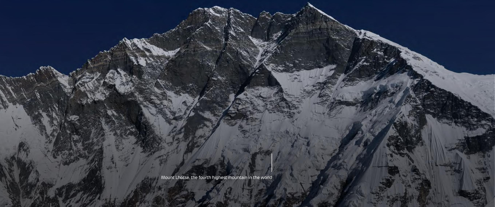

text_image

Mount Lhotse, the fourth highest mountain in the world

58 Business Model   
60 Stakeholder Engagement   
66 Material Matters   
72 Risk and Opportunities   
80 Strategy   
84 Progressing on Our Sustained Growth   
86 Operational Performance

# BUSINESS MODEL

# A Resilient, Future-ready Model to Build Tomorrow

# The pool of resources we use

# Financial Capital

\` 43,145 crore of total equity   
\` 7,912 crore in cash and cash equivalents

# Manufactured Capital

India’s largest private power producer with 15,250 MW operational capacity and 1,600 MW under-construction capacity   
74% from supercritical / ultra-supercritical units, ensuring low GHG emissions and high-efficiency 83% from near-pithead and coastal plants, ensuring low logistics costs and large volume transfers   
40 MW of solar power plant   
85% contracted capacity   
79% domestic fuel requirements secured through long-term/ medium-term agreement

# Intellectual Capital

\` 27 crore spent on various cloud, digital transformation and automation initiatives   
ƒ \` 1.1 crore spent on R&D   
— Cloud-based Energy Network Operations Centre (ENOC) for centralised monitoring   
Analytics Centre of Excellence for data-driven operations

# Human Capital

3,315 employees   
13,044 contract workforce   
1.24% female representation   
4,17,932 person-hours of training provided covering 89.45% employees   
0.22 man-megawatt ratio

# Social and Relationship Capital

Active engagement with stakeholders including customers, suppliers, regulatory bodies and communities   
Long-term relations with customers and communities   
508 suppliers on-boarded on ESG criteria

# Natural Capital

9,51,926 trees planted (12% total plantation of 7.85 million pledge by 2030)   
7 out of 9 operating locations single-useplastic-free certified   
Responsible natural resources consumption:

• \~51.27 Mn tonnes of coal   
• 192.296 Mn m3 of water   
• 818.44 Million GJ of Fuel

# Our business and operating model

# Vision

Be a transformative force in power generation, empowering lives and contributing to the energy security of nations by providing sustainable, affordable and reliable power

Business Activities

Supporting Mechanisms

Operating Context

# Business Activities

Power Generation and Sales

Other Financial Investments

Asset Creation

# Supporting Mechanisms

Governance

Read more Pg.152

Risks and Opportunities

Read more Pg.72

Performance

Read more Pg.16

Strategy

Read more Pg.80

Outlook

Read more Pg.211

# Operating Context

Refer to Management Discussion & Analysis in page 197 of this report for more details

# Outputs

# 85.5 billion units

of power generated

# 12.9 MMT

fly ash generated

# The outcomes we generate

# Financial Capital

ƒ \` 60,281 crore Revenue   
ƒ \` 28,111 crore EBITDA   
ƒ \` 20,829 crore PAT   
\` 14,170 crore cash flows from operations   
Deleveraged balance sheet and improved debt coverage resulting in improved credit rating to AA-

# Manufactured Capital

India’s largest private IPP accounting for 18.1% (private) and 6.3% (aggregate) of India’s coal + lignite generation capacities   
90% commercial availability under PPAs and 65% plant load factor   
72 billion units of power despatched within India   
7 billion units of power despatched to Bangladesh   
High revenue visibility and stability and enhanced fuel security

# Intellectual Capital

Improved decision-making with data analytics   
Business process transformation   
Improvement of management systems

# Human Capital

Higher employee productivity at \` 7.29 crore EBIT/employee   
Lower attrition rate at 9%   
0/0.15 LTIFR (Employees/ Workers)

# Social and Relationship Capital

Fulfilling energy needs of society   
Supporting local vendors with 30.48% raw material procurements   
23,33,855 people benefited through CSR activities including three aspirational districts (Baran, Godda, Singrauli)   
- Supply chain resilience: 96.49% Procurement spent on local suppliers

# Natural Capital

Responsibly limiting our impact and adhering to guidelines and regulations   
0.85 tCO e/MWh GHG emissions   
89.42% ash utilisation   
2.25 m3/MWh water intensity performance

# STAKEHOLDER ENGAGEMENT

# Addressing Needs, Building Relations of Trust

Adani Power encourages a continuous, consultative and constructive engagement approach with all stakeholders to understand their needs and expectations. Strategies and decision-making processes are based on the valuable insights gained from such open dialogue, helping us build stronger relations, meet organisational objectives and create value for all our stakeholders.

Amid our rapid expansion, acknowledging and addressing stakeholders need is important. We have instituted a structured internal process to identify, prioritise and effectively engage with both internal and external stakeholders. We have in place a Stakeholder Engagement Policy to transparently regulate the process. Oversight is managed by the Corporate Responsibility Committee (CRC), reporting interactions results to the Board of Directors. Additionally, a Board

Stakeholder Relationship Committee focuses on a specific set of stakeholders including investors, analyst agencies, shareholders, etc. We strive for continuous improvement by sharing best practices and learnings with our Board and Senior Management. We will be setting and reviewing targets and monitoring, reporting and disclosing our performance to create accountability across our communities.

natural_image

Two hands shaking in a professional setting, one white and one black, against a blurred background (no text or symbols visible)

# Approach to stakeholder engagement

# Stakeholder identification

Structured internal process to identify individual or stakeholder groups who can impact or be impacted by our business activities directly or indirectly

# Analyse and prioritisation

An internal team analyses and prioritises stakeholders based on the level of responsibility, impact dependence and influence on our business and vice-versa

# Engagement

Proactively engaging with the stakeholders through a robust engagement plan based on the nature, concerns and aspiration of the stakeholder group to build constructive relationships that promote sustainable growth and mutually beneficial outcomes

# Effective stakeholder engagement for shared objectives

We maintained continuous and proactive engagements with stakeholders during the year, striving to build lasting relationships, advance shared objectives, and create value for our stakeholders and the broader society.

# Shareholders and investors

# Significance

They provide capital for sustaining and growing operations. Meeting their expectations enhances capital access and builds trust.

# Engagement method and frequency of engagement

Email, investor meets, annual general meetings, quarterly/ annual results, earnings calls, website, press releases

# Frequency

Regular, need-based

# Key concerns

ƒ Economic and ESG performance   
ƒ Long-term growth   
ƒ Better return on investment   
ƒ Debt servicing   
ƒ Transfer of shares, issue of certificates and general meetings   
ƒ Non-receipt of annual report

# Response

ƒ Increased operating capacity with Godda plant commissioning   
ƒ Utilised cash accruals to reduce debt including pre-payment   
ƒ Utilised untied capacities gainfully in the merchant and short-term markets

# Customers

# Significance

They are essential for revenue generation and business sustainability. Customer-centricity strengthens relations and contributes to long-term success.

# Engagement method and frequency of engagement

Customer meet, business/ sales visit, direct communication, one-onone interaction, customer satisfaction survey

# Frequency

Ongoing, need-based

# Key concerns

Sustained power availability with minimal outage   
ƒ Optimum electricity tariff   
ƒ Planned maintenance   
ƒ Modernisation and upgradation

# Response

Technology, digitalisation and analytics to consistently maintain high cumulative availability   
ƒ Ensured competitive tariffs   
ƒ Met increasing power demand in key states

# Employees (full-time and contractual)

# Significance

They execute operations and strategies. An engaged and productive workforce reinforces business competitiveness and market leadership.

# Engagement method and frequency of engagement

Direct interaction, engagement/feedback surveys, performance management, open forums, exit interviews, announcements

# Frequency

Ongoing

# Key concerns

ƒ Health and safety   
ƒ Plant efficiency   
Optimal and engaging work environment   
Learning, development and career progression   
ƒ Diversity, equity and inclusion

# Response

Implemented Adani safety system with ongoing training   
ƒ Automation and analytics for secure operations   
Invested \` 4.54 crore on various training programmes covering all employees

# Suppliers and vendors

# Significance

They are a critical part of the value chain. Strong relations secure availability at competitive prices and seamless operations.

# Engagement method and frequency of engagement

On-boarding processes, engagement surveys, site visits, one-on-one interaction

# Frequency

As and when required

# Key concerns

Timely payments and query redressal   
ƒ Transparent dealing and fair opportunities   
Long-term partnership and capacity building

# Response

ƒ Responsible supply chain practices   
Transparent and methodical selection process   
ƒ Performance and feedback reviews

# Local communities

# Significance

They provide a social licence to operate. Prioritising inclusive growth fosters mutually beneficial relations.

# Engagement method and frequency of engagement

Meetings/discussions with local communities and NGOs, impact assessment

# Frequency

On-going, need-based

# Key concerns

ƒ Employment and industry relation   
ƒ Resource availability   
Support in the utilisation of ecosystem services   
ƒ Healthcare and educational support

# Response

CSR activities around education, livelihood, health and community infrastructure development   
ƒ Employment opportunities

# Regulators

# Significance

They frame policies and regulations. Meaningful partnerships support a beneficial regulatory regime for industry growth.

# Engagement method and frequency of engagement

Compliance meetings, policy advocacy, industry associations, conferences, direct interactions, regulatory audits and inspections

# Frequency

Ongoing, need-based

# Key concerns

ƒ Compliance   
Revenue   
ƒ Taxes   
ƒ Community development

# Response

ƒ Worked closely with regulators on policy advocacy   
ƒ Timely tax payment   
ƒ Aligning with national interests

# Media

# Significance

They facilitate timely and transparent communication with stakeholders, building trust and reliability.

# Engagement method and frequency of engagement

Press conferences, meetings (physical/virtual)

# Frequency

Issue-based

# Key concerns

ƒ Information sharing   
ƒ ESG focus   
Transparent and strategic communications

# Response

# Value created for stakeholders in FY 2023-24

# Shareholders and Investors

Strengthened balance sheet and growth prospects

48%

ROE

179%

1-year returns (market capitalisation)

# Customers

Positioned as a highly competitive and reliable power generator

\` 6.01/kWh

\` 6.87/kWh

Average PPA tariff (net)

Average merchant/ short-term tariff (net)

# Employees (Full-time and Contractual)

Improved employee engagement, efficiency and human resource-related risk management   
Enhanced skills and competencies

\` 644 crore

Total employee benefits

# Suppliers and Vendors

Improved relations

96.49%

Total procurement from local suppliers

# Media

Received over

19,000

media coverage, press briefings

# Regulators

Maintained cordial relations

\` 4,001 crore

Contribution to the national exchequer

# MATERIAL MATTERS

# Prioritising Issues Core to Business Sustainability

Material matters can potentially impact our ability to create value as well as our stakeholders. We qualitatively assess various topics that may have negative implications on our operations to take proactive mitigating actions, supported by our Integrated Management Systems (IMS). Our designed controls enable converting risks to opportunities through continuous collaborations and learning.

# Materiality assessment process

Adani Power conducted a detailed materiality assessment exercise in FY 2020-21 in collaboration with an external service provider. Engaging internal and external stakeholders, we identified and analysed material ESG matters which can potentially impact our business (ability to create value) and stakeholders.

We used insights from industry research, peer reviews and prominent ESG frameworks and rating agencies' requirements such as GRI Standards, UN SDGs, Sustainability Accounting Standards Board (SASB), Dow Jones Sustainability Index and

CDP to ensure a comprehensive understanding. These issues are revisited internally to reassess their significance and potential impact in the changing operating context.

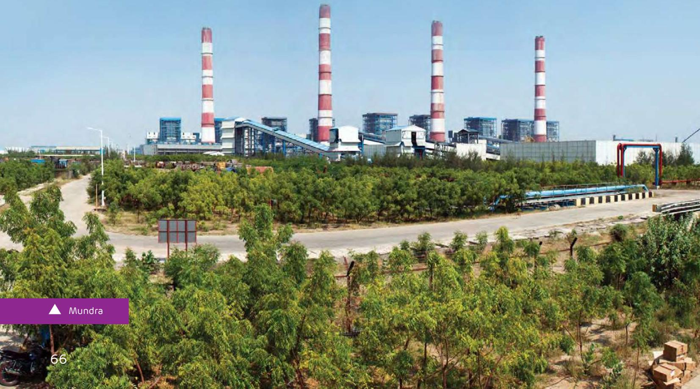

natural_image

Exterior view of a modern industrial plant with multiple red-and-white striped chimneys and greenery, labeled 'Mundra' in purple banner (no signage on main structures)

Mundra

# Materiality matrix

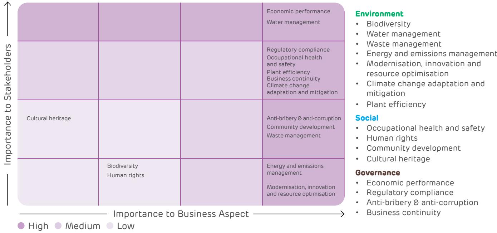

heatmap

| Environment | Environmental Attitude (High) | Environmental Attitude (Medium) | Environmental Attitude (Low) |
| :--- | :--- | :--- | :--- |
| Biodiversity | High | Medium | Low |
| Water management | High | Medium | Low |
| Waste management | High | Medium | Low |
| Energy and emissions management | High | Medium | Low |
| Modernisation, innovation and resource optimisation | High | Medium | Low |
| Climate change adaptation and mitigation | High | Medium | Low |
| Plant efficiency | High | Medium | Low |
| Social | High | Medium | Low |
| Occupational health and safety | High | Medium | Low |
| Human rights | High | Medium | Low |
| Community development | High | Medium | Low |
| Cultural heritage | High | Medium | Low |
| Biodiversity Human rights | High | Medium | Low |
| Energy and emissions management Modernisation, innovation and resource optimisation | High | Medium | Low |
Governance | High | Medium | Low |
| Economic performance Water management | High | Medium | Low |
Importance to Stakeholders: Biodiversity, Water management, Waste management, Energy and emissions management, Modernisation, innovation and resource optimisation, Climate change adaptation and mitigation, Plant efficiency
Importance to Business Aspect: Biodiversity, Human rights, Community development, Cultural heritage
Importance to Business Aspect: Energy and emissions management Modernisation, innovation and resource optimisation

# Managing Our Material Matters

# Economic

# performance

# GRI Alignment:

GRI 201   
GRI 203   
GRI 207

# SDG Linkages:

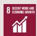

# Capital Impacted:

# Financial Impact:

Positive

# Risk or opportunity and rationale

Opportunity: Business profitability and strong economic performance help deliver value to investors and reinvest in the growth of the business and stakeholders

# Mitigating actions

Our operational excellence including capacity addition, fuel and logistics management, investment in

technologies, and robust plant O&M consistently ensures strong economic performance. Investments in organic and inorganic growth secure our long-term. We have also implemented robust risk management strategies.

# KPIs

Revenue growth   
EBITDA growth   
PAT growth

# Capital Impacted: Capital Impacted:

# Financial Impact:

Negative

# Water

# management

# GRI Alignment:

GRI 303

# SDG Linkages:

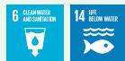

#

# Risk or opportunity and rationale

Risk: Water is a shared resource. Its irresponsible consumption can cause stress in nearby communities and impact our social licence to operate.

# Mitigating actions

Our Resource Conservation Policy assists in reducing the consumption of water and other resources. We have

conducted water risk assessments at all locations and implemented mitigation measures. Water consumption is restricted to the prescribed limit set by MoEFCC (for surface water) and internal targets (for seawater).

Read more on page 117

# KPIs

Water withdrawal source-wise   
Water consumption   
Recycling %

# Regulatory compliance

GRI Alignment:

GRI - 2- 27

SDG Linkages:

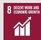

Capital Impacted:

Financial Impact:

Negative

# Risk or opportunity and rationale

Risk: Failure to comply with regulatory requirements can result in financial and reputational consequences and erode stakeholder trust.

# Mitigating actions

Our experienced legal and functional teams monitor all regulatory aspects across business functions

and undertake disciplinary measures and reinforcement mechanisms as required.

# KPIs

Annual disclosures   
Instances of breach in governance aspects

# Occupational health and safety

GRI Alignment:

GRI 403: Occupational Health and Safety

SDG Linkages:

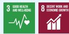

Capital Impacted:

Financial Impact:

Negative

# Risk or opportunity and rationale

Risk: The well-being and safety of employees and workers are crucial to us. Compromising these can impact productivity, profitability and people morale.

# Mitigating actions

The implementation of the Adani safety culture along with ongoing training and sensitisation

ensures a safe working environment with zero harm. We identify hazards and risks periodically and accordingly implement preventive actions.

Read more on page 122

# KPIs

TRIFR   
LTIFR   
Fatality

# Plant efficiency

GRI Alignment:

ƒ GRI 301

SDG Linkages:

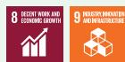

Capital Impacted:

Financial Impact:

Negative

# Risk or opportunity and rationale

Risk: Finite resources necessitate optimising operations to enhance output while conserving valuable resources.

# Mitigating actions

We aim to enhance material and resource consumption efficiency, including implementing a

circularity model. R&D investments to explore efficient alternatives, aiming to enhance plant efficiency.

# KPIs

Material consumption   
Capacity utilisation

# Business continuity

GRI Alignment:

GRI - 201

SDG Linkages:

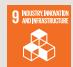

Capital Impacted:

Financial Impact:

Negative

# Risk or opportunity and rationale

Risk: Inadequate business continuity measures can impact survival in case of serious disruption.

# Mitigating actions

Our robust strategic risk management process enables the identification of short-, medium- and long-term risks. Further, systems are integrated

to ensure sustained operations during unforeseen circumstances with a focus on people's safety, thereby protecting shareholder value.

# KPIs

Business Impact Assessment   
Assessing Risk   
Business continuity plan   
Complying with all relevant laws

Portfolio Overview

Corporate Overview

Strategic Review

ESG Overview

Statutory Reports

Financial Statements

# Climate change adaptation & mitigation

GRI Alignment:

ƒ GRI 301 - 306

SDG Linkages:

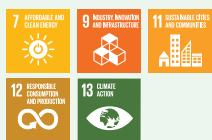

Capital Impacted:

Financial Impact:

Negative

# Risk or opportunity and rationale

Risk: Climate change poses transitional and physical risks necessitating optimising energy consumption and emissions footprint.

# Mitigating actions

Our Climate Change Policy defines the process for measuring, monitoring and reducing environmental impact. All our existing plants are assessed for

climate-related physical risks using IPCC’s

Representative Concentration Pathway.

Read more on page 111

# KPIs

GHG emissions   
RE power capacity

# Anti-bribery and anti-corruption

GRI Alignment:

GRI 205

SDG Linkages:

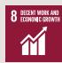

Capital Impacted:

Financial Impact:

Negative

# Risk or opportunity and rationale

Risk: Unethical practices and behaviour can cause financial and reputational damages, putting stakeholder’s trust and our leadership position at risk.

# Mitigating actions

Our Code of Conduct, coupled with various governance and ESG policies including those addressing anti-bribery

and anti-corruption provide comprehensive guidance on ethical conduct. They also serve to mitigate the risk of non-compliance.

Read more on page 154

# KPIs

Instances of breach in anti-bribery and anti-corruption code

# Community development

GRI Alignment:

GRI - 413

SDG Linkages:

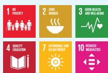

Capital Impacted:

Financial Impact:

Positive

# Risk or opportunity and rationale

Opportunity: Community development activities help in creating a positive impact on society.

# Mitigating actions

We take focused actions toward quality education, sustainable livelihood, health promotion and

community infrastructure development to empower marginalised communities.

Read more on page 135

# KPIs

CSR beneficiaries   
No. of villages covered

# Waste

# management

GRI Alignment:

ƒ GRI 306

# SDG Linkages:

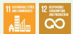

Capital Impacted:

Financial Impact:

Negative

# Risk or opportunity and rationale

Risk: Non-compliance and inefficient waste management operations can result in financial and reputational implications while also impacting the environment.

# Mitigating actions

Our resource conservation policy supports integrating circularity principles in operations, assisting compliance with regulations governing

waste collection, segregation, transportation, reprocessing, recycling and disposal. We also emphasise ash utilisation and reducing single use plastic usage.

# KPIs

Fly ash utilisation rate   
No. of sites certified as single-use plastic free   
Waste generated

# Cultural heritage

GRI Alignment:

GRI - 413

# SDG Linkages:

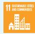

Capital Impacted:

Financial Impact:

Positive

# Risk or opportunity and rationale

Opportunity: Cultural factors have a significant influence on business, including shaping approaches to effectively manage employees based on their values and priorities.

# Mitigating actions

We undertake efforts to identify and restore unique heritage sites near our plants, including

the local art and culture. Amongst our various efforts, is Namda craft in Kutch, Gujarat, which the Adani Foundation is protecting.

# KPIs

Promoting local art & culture

# Energy and emissions managemen

GRI Alignment:

ƒ GRI 302: Energy

ƒ GRI 305: Emissions

# SDG Linkages:

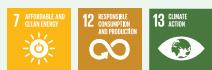

Capital Impacted:

Financial Impact:

Negative

# Risk or opportunity and rationale

Risk: Adoption of low-carbon technologies is critical to future readiness, given rising regulatory stringency around energy and emissions.

# Mitigating actions

Our Energy and Emission Policy guides our actions to reduce energy consumption and conserve greenhouse gas emissions, ensuring compliance with relevant regulations. We employ energy-efficient

technologies, invest in renewables and utilise ammonia/ biomass co-firing to optimise power consumption and reduce emissions aligned with set targets.

Read more on page 113 and 114

# KPIs

Electricity consumption   
- GHG emissions   
Air emissions (SOx, NOx, PM)

# Modernisation,

# innovation

# and resource

# optimisation

GRI Alignment:

ƒ Non GRI

# SDG Linkages:

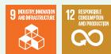

Capital Impacted:

Financial Impact:

Positive

# Risk or opportunity and rationale

Opportunity: Adoption/development of new advancements helps stay relevant, competitive and profitable in a changing world.

# Mitigating actions

We invest in modernising our plants, upgrading to new technologies and optimising processes to make them more secure, reliable and

resource-efficient. R&D efforts are ongoing to identify better alternatives.

# KPIs

R&D investments   
Capex in plant modernisation

# Biodiversity

GRI Alignment:

ƒ GRI 304

# SDG Linkages:

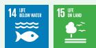

Capital Impacted:

Financial Impact:

Negative

# Risk or opportunity and rationale

Risk: Business operations can negatively impact the environment and biodiversity, resulting in financial implications and operational setbacks.

# Mitigating actions

We prioritise biodiversity management, striving for no net loss by 2025 supported by our biodiversity policy. Collaborating with accredited

institutions, we conduct biodiversity assessments, maintain data on species diversity and follow a seven-step process for biodiversity protection and enhancement.

Read more on page 120-121

# KPIs

No net loss   
Protection of native species

# Human rights

GRI Alignment:

Several disclosures under GRI 2 and GRI 400 series of GRI 2021 standards

# SDG Linkages:

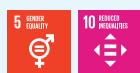

Capital Impacted:

Financial Impact:

Negative

# Risk or opportunity and rationale

Risk: Failure to uphold fundamental rights and well-being of diverse stakeholders can lead to legal risks and damage reputation, impacting the business sustainability.

# Mitigating actions

Our Human Rights Policy ensures adherence to relevant national and international regulations. Led by a dedicated team, we ensure upholding human rights with zero tolerance for child and

forced labour, harassment and discrimination.

These policies extend to suppliers. A mechanism is in place to address a reported issue in stipulated timeline.

Read more on page 134

# KPIs

Instances of human rights practice breach   
No. of human rights issues raised/reported

# RISK AND OPPORTUNITIES

# Reinforcing Resilience and Relevance

We have implemented a robust risk management system to identify, prioritise, mitigate and monitor the risks and uncertainties in our operating environment. With solid framework, policies and governance mechanism, we ensure good corporate governance, meet strategic goals and business growth and protect stakeholder value. We are committed to strengthen our risk practices through ongoing learning, improvement and encouraging employee participation.

natural_image

A man in a suit gesturing toward wooden dominoes on a blue background, symbolizing decision-making or market manipulation (no text or symbols present).

Risk Governance at Adani Power   
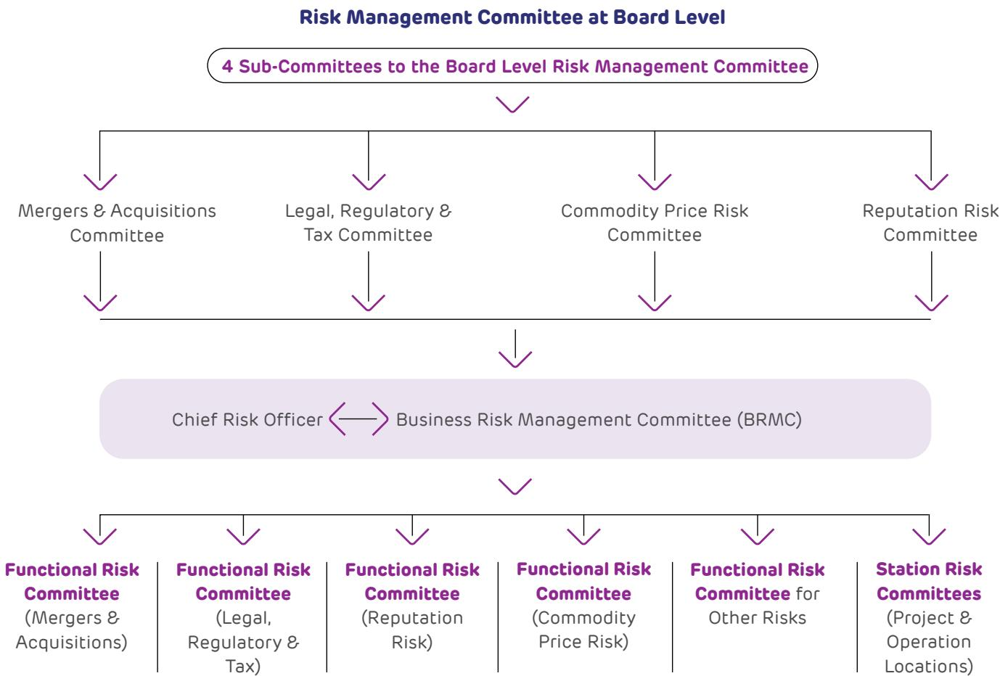

flowchart

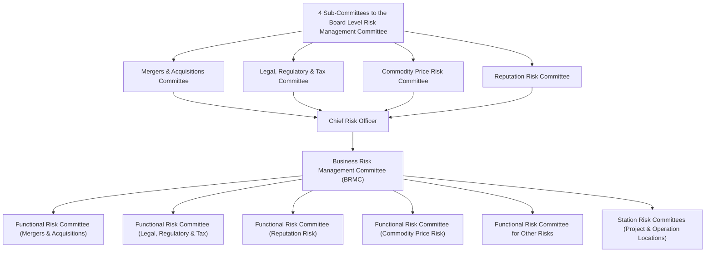
```mermaid
graph TD
    A["4 Sub-Committees to the Board Level Risk Management Committee"] --> B["Mergers & Acquisitions Committee"]
    A --> C["Legal, Regulatory & Tax Committee"]
    A --> D["Commodity Price Risk Committee"]
    A --> E["Reputation Risk Committee"]
    B --> F["Chief Risk Officer"]
    C --> F
    D --> F
    E --> F
    F --> G["Business Risk Management Committee (BRMC)"]
    G --> H["Functional Risk Committee (Mergers & Acquisitions)"]
    G --> I["Functional Risk Committee (Legal, Regulatory & Tax)"]
    G --> J["Functional Risk Committee (Reputation Risk)"]
    G --> K["Functional Risk Committee (Commodity Price Risk)"]
    G --> L["Functional Risk Committee for Other Risks"]
    G --> M["Station Risk Committees (Project & Operation Locations)"]
```

# Risk Culture

Risk at Adani Power starts from the top. Board members undergo regular familiarisation and training in new management approaches. Three non-executive board members having expertise in risk management serve on the risk management committee.

The executive management actively monitors and shares insights on various business aspects, including fluctuating raw material prices, efficiency and safety of equipment and processes, etc. to

prevent potential risks. Plant heads are responsible for recognising, notifying and mitigating any form of risk they observe or foresee at the plant level. To ensure effective identification and anticipation, employees from all departments are engaged in regular dialogue and operate under an open-door policy. We further provide performance-linked incentives to employees and leadership based on energy efficiency and climate change mitigation KRAs.

While climate change is one of the most significant risks, we

recognise that thermal power will remain important for meeting India’s growing energy needs. We remain focused on this segment and are taking the necessary measures to improve efficiency and reduce the environmental impact of our operations. We plan to introduce renewable resources such as biomass and green hydrogen in our fuel mix gradually, and are currently piloting green ammonia co-firing at one of our power plants.

# Risk Management Process

# Risk identification

# Risk analysis

# Risk assessment and prioritisation

# Risk mitigation

# Risk treatment Review and monitoring

# Risk Identification

Identifying and describing risks that might help or prevent achieving set objectives and expected targets, and compiling them in a risk register for the power business

# Risk Analysis

Evaluate risks by considering uncertainties, sources, consequences, likelihood, events, scenarios, controls and their effectiveness, and categorising them based on severity and probability. Impact value is calculated based on this to determine whether risks are catastrophic, critical, moderate or marginal. Further, lead and lag indicators are defined along with risk indicator threshold to ensure their efficacy

Each risk is associated with performance measures to gauge its impact on business processes: this includes measuring for efficiency (In-Process) with factors like risk mitigation completion index, risks overlooked and accuracy of identified risks, and for effectiveness with metrics such as risks causing losses, declining residual value, unplanned disruptions, and recovery time meeting customer expectations

After considering mitigation strategies and risk insurance

each risk is given residual risk impact and frequency score, and a dedicated risk owner and champion are assigned for effective mitigation and control

Linking identified risks with organisational strategic objectives or functional objectives and relevant business processes

# Risk Assessment and Prioritisation

Risks are assessed and prioritised based on likelihood, impact, proximity and controllability

Risks are categorised into Strategic or Reputational Risk (those impacting business decisions and reputation), Tactical Risk (those rising from changes in business conditions) and Operational Risk (those relating to daily activities)

# Risk Mitigation

Formulating comprehensive mitigation strategies involving mitigation action, costs, benefits, frequency and target completion date, and establishing risk indicators for tracking

\- A robust governance structure is in place to ensure the process efficacy, with ongoing reviews by the Functional and Station Risk Management Committees

# Risk Rreatment

4T analysis for risk treatment including:

Tolerate: Accepting risks when their potential impact is within limits or when anticipated profit outweighs the costs of potential risk

Treat: Adjusting project plan and company process to reduce risk impact as well as lowering the possibility of risk occurrence to decrease associated financial value

Transfer: Sharing or distributing risk consequences among project participants, business departments or third parties like vendors or business partner

Terminate: Eliminating risk by getting rid of its cause, often through risk avoidance strategy to prevent damaging events

# Review and Monitoring

Monitoring and reporting risks and mitigation status to identify trends and prioritise measures

Review by Functional Committee followed by BRMC committee to identify focus areas and mitigation plans to drive positive risk trends

# Key Risks and Mitigating Actions

# R1

# Mergers and acquisitions risk

# Responsibility

Head Business Development

# Capitals at Risk:

# Strategic Priority

S1

# Appetite

# Risk Description and Impact on Value

Incorrect target selection, insufficient due diligence and misjudgement of future synergies, potential benefits and fund infusion requirements relating to M&A transaction

# Impact

It can lead to financial losses, operational disruptions, or missed growth opportunities

# Mitigating Actions

We have established a rigorous M&A process to ensure M&A success including:   
Setting criteria for target company selection encompassing project status, PPA tie-up, technology   
Formation of inter-departmental teams for due diligence,

with thorough vetting of assumptions impacting valuation and adopting a conservative approach in financial projections

Ensuring prompt receipt of information from counterparties   
Building safeguards into resolution plans and final transaction documents to mitigate risks/liabilities unforeseen during due diligence   
Periodic post-acquisition analyses to assess assumptions and deviations and integrate learnings   
We have a successful track record of acquiring and turning around four power plant assets

# R2

# Regulatory risk

# Responsibility

Head Regulatory & Commercia

# Capitals at Risk:

# Strategy at Risk

S1

# Appetite

# Risk Description and Impact on Value

Threats arising from the potential overturning of favourable regulatory orders upon appeal, customers reneging on contractual terms amid unfavourable circumstances and non-compliance with regulatory/ judicial orders by customers.

# Impact

It can lead to legal disputes, financial losses from breached contracts and reputational damage, impacting investor confidence and market performance.

# Mitigating Actions

Focus on building a strong case with effective arguments supported by facts, precedence, and already-decided legal principles   
Enforcing contractual terms through legal representation and regulatory/judicial intervention   
Initiating contempt proceedings to expedite redressal of claim/ appeal

Low

Medium

High

# R3

# Commodity price risk

# Responsibility

Chief Commercial Controller

# Capitals at Risk:

Strategy at Risk S1, S4

# Appetite

# Risk Description and Impact on Value

We face potential risks from a sharp increase in imported coal prices, domestic coal shortages or high prices of alternative coal sources, affecting production levels.

# Impact

Increased production costs, reduced margins and decreased revenue, affecting overall shareholder value and market competitiveness.

# Mitigating Actions

56% of our installed capacity is based on domestic coal of which 79% is secured under contracts   
Significant recovery of increase in coal price through a revision in tariffs and escalation indices and 74% of our capacity having fuel cost recovery assurance   
We practice pre-monsoon domestic coal procurement to build stock during lean production periods   
We are focusing on de-risking fuel supply by utilising coal from captive mines under a liberalised mining policy

# R4

# Reputation risk

# Responsibility

Head Energy Strategy Group

# Capitals at Risk:

# Strategy at Risk

# Appetite

# Risk Description and Impact on Value

Risk of reputation loss due to operational issues such as safety incidents, environment or litigation.

# Impact

Decline in stakeholder trust and confidence, potentially resulting in diminished brand value, reduced market share and financial losses.

# Mitigating Actions

Ensuring sustained and effective communication with stakeholders

Low

Medium

# Emerging Risks

Our enterprise risk management (ERM) framework enables proactive management of various emerging risks through annual assessments and continual threat monitoring.

Cybersecurity and data privacy are two emerging risks posing a potential threat. We effectively manage them by strengthening systems and practices, integrating them into the ERM framework and establishing a structured cybersecurity management process to evaluate their exposure to our operations. We have prepared to mitigate external shocks arising from market fluctuation or

unforeseen disruptions, ensuring resilience and disruptions.

Climate risk is another critical risk. The executive management and the employees take responsibility for identifying and assessing climate-related risks and opportunities. We have implemented location-specific risk management systems and conducted scenario analysis to understand climate-related transitional and physical risks’ impact on our business, strategies and financial performance.

We use IPCC’s Representative Concentration Pathway (RCP) to assess the physical risks associated

with climate change (chronic and acute). It describes different climate futures most likely to occur depending on the volume of greenhouse gases emitted. We have conducted these assessments for all existing power plants and mandate them for all upcoming power plants. These assessments are carried out for various types of risks (legal, technology, market, reputation) across short (0-5 years), medium (5-10 years) and long-term (10-20 years) horizons, and influence plant modifications, including those done for Mundra Power Plant’s structural design.

The relevant and applicable climate-related transitional and physical risks identified are as follows:

# Transitional risk

# Risk and description

# Current Regulation

Our business is subject to several environmental regulations, including those focused on reducing carbon emissions volume. These regulations directly impact operational expenses upstream and financial performance downstream due to reduced tariffs.

# Mitigation actions

We have established effective mitigation strategies for risks arising from current & emerging regulations. Awareness is being built among employees and internal stakeholders to identify such risks and communicate relevant information to external stakeholders to mitigate matters that might pose a threat.

# Emerging Regulation

We anticipate greater mercantile power demand from various industries and customers. The proposed ‘Cross Border Adjustment Mechanism’ policy in the EU involving tax levies on high GHG footprint products will increase costs for the concerned producer.

# Transitional risk

<table><tr><td>Risk and description</td><td>Mitigation actions</td></tr><tr><td>TechnologyEmerging technologies like battery storage, green hydrogen and concentrated solar power might impact the demand of our business, especially the thermal portfolio.</td><td>We are frontrunners in making technology advancements to meet the market requirements, initiating ammonia co-firing and green hydrogen projects/pilots to maintain a competitive edge.</td></tr><tr><td>LegalAs a part of the Indian jurisdiction, our operations are subject to several climate regulations including clean energy cess on domestic coal purchases and coverage under the PAT mechanism.</td><td>We strictly adhere to all applicable statutory requirements and ensure zero tolerance for non-compliance, with our Compliance Officer overseeing regular reviews of compliance status.We have a robust IT-enabled compliance management system, providing real-time updates via dashboards and alerts on non-compliance. It also serves as a resource library providing a comprehensive matrix on all applicable legal, statutory and regulatory laws and its management.</td></tr><tr><td>MarketRising climate change concerns and international commitments to contain global warming are driving a major shift towards low-carbon products and renewable energy sources. While this shift is expected to decrease the share of coal-based power generation in the energy mix, the government of India is taking proactive measures to extend electricity access to the remotest areas.</td><td>We are meeting the market requirements through our investments in capacity creation and building world-class power plants with advanced technologies to meet growing electricity needs at competitive rates.</td></tr><tr><td>ReputationHonouring commitments and aligning with a shared vision embraced by both internal and external stakeholders is essential. Given the inherent nature of our business, it is prone to legal proceedings and complexities, posing reputational risks.</td><td>We have a Reputation Risk Committee under the Risk Management Committee to manage and oversee reputational risks arising from business operations.</td></tr></table>

# Physical risk

<table><tr><td>Risk and description</td><td>Mitigation actions</td></tr><tr><td>Acute PhysicalPhysical risks arising from extreme weather events like cyclones and hurricanes induced by climate change can impact our infrastructure and processes leading to operational failures and necessitating additional investments to rebuild and restore the damages. They can also adversely impact resource-procurement capabilities. These can directly impact our resource quality and quantity.</td><td>We have upgraded our infrastructure to withstand wind speeds and high tides from tropical storms. Additionally, we have invested in technology tools for continuous monitoring of weather conditions, prediction and early warning alerts. This enables taking necessary precautionary measures during extreme events supported by SOPs for preparation and maintenance checks. We have developed SOPs for proper early warning systems using advanced technology tools and applications, alongside imparting training to all asset management teams.</td></tr><tr><td>Chronic PhysicalProlonged temperature rises and changes in weather patterns can significantly impact our business and create long-term repercussions on the availability and quality of resources. This necessitates getting accurate climate projections and evaluating the risks from emerging regulations as well as physical risks to critical infrastructure like power plants and grid-connected T&amp;D lines.</td><td>We used the IPCC&#x27;s RCP 4.5 scenario (equivalent to 1.7-3.2) to study the projected changes in climate parameters. This included monthly maximum temperature and precipitation, severe drought likelihood, probability of heat/cold wave, mean drought index and land projected to be below annual flood level.The initial study encompassed all power plants, major T&amp;D lines and the supply chain, including logistics. Appropriate risk quantification and mitigation measures are being developed for these sites, such as maintaining sufficient coal stock for possible high precipitation events and increasing water reservoirs for possible water shortage events.To mitigate rising sea levels and cyclonic surge risks due to global warming, the Mundra plant&#x27;s finished floor level has been raised to 10 m above the Chart Datum (CD) – the lowest astronomical tides and mean low water. This provides a significant buffer against the highest high tide recorded of 5.4 m above the CD. To adapt to climate-related water temperature increases in future, we have equipped all thermal power plants with induced draft cooling towers with a re-circulation system. This will maintain the desired temperature difference across the condenser, ensuring sustained plant efficiency.</td></tr></table>

# STRATEGY

# Roadmap to a Stronger Than Ever Tomorrow

We are operating in a dynamic landscape with significant transitions happening in the energy sector. Despite this, the significance of thermal power remains high as the industry enters a period of substantial growth to meet growing energy demand amidst an expanding economy. We have identified strategic priorities to build business resilience and capitalise on abundant opportunities, with a focus on sustainable growth and maximising value for our stakeholders.

# Strategic priority 1

# Expand capabilities to deliver the nation’s energy needs

India’s electricity demand as projected by CEA is expected to reach 334.8 GW of peak demand and 2,279.64 BUs energy requirement by FY 2029-30. India plans to meet this by increasing its thermal capacity to 251.68 GW by FY 2029-30, while also diversifying its energy portfolio with renewable and non-fossil fuel sources.

# Way forward

We plan to increase capacity to 24,270 MW over the coming years, with 4,800 MW of new brownfield capacity and 4,220 MW of acquisitions.

# Capital deployed

# Actions taken in FY 2023-24

Increased operational capacity by 11.7% to 15,250 MW   
Focus on both organic and inorganic opportunities to expand generation capacity

# Risks

Regulatory and legal risks:

Challenges in obtaining approvals, permits and licenses for M&A and expansion and potential litigation from stakeholders

Integration and execution risks: Struggle in integrating acquired assets and delays, cost overruns

# KPIs tracked

MW capacity added   
Capacity commissioned   
Capacity acquired

Actively evaluating M&As to acquire promising assets, enhance our operational efficiency, and strengthen our market presence

or quality issues in expansion projects   
Market and competitive risks: Risks of competition offering lowering prices and innovation solutions as well as demand and supply dynamic and shifting customer preferences

# Strategic priority 2

# Sustainability to support the low carbon eco-system

Globally and in India there is an urgency to reduce greenhouse gas emissions and combat climate change while meeting rising electricity demand. Adani Power is dedicated to sustainability and supporting a low carbon eco-system that creates value for stakeholders, promotes socio-economic development and protects the environment.

# Way forward

Transitioning to efficient technologies including enhancing coverage of FGD.

# Capital deployed

# KPIs tracked

GHG emissions   
Emission intensity   
Investments in sustainable technologies

# Actions taken in FY 2023-24

Emphasis on ultra super-critical/ Emphasis on ultra super-critical/ super-critical power plants, super-critical power plants, improving efficiency and improving efficiency and installing emission control installing emission control systems and carbon capture systems and carbon capture   
Pilots for non-fossil fuel Pilots for non-fossil fuel substitutes like biomass and substitutes like biomass and green ammonia green ammonia

Leveraging advanced technologies (artificial intelligence, big data etc.) in collaboration with technology consultants to optimise performance and enhance reliability   
Engaged with regulators, suppliers and communities to promote low carbon transition

# Risks

Environmental and social risks: Risks of air pollution, water scarcity, land degradation, and health and safety issues arising from our business activities, along with pressure from stakeholders to align with the global climate goals and disclose performance   
Technological and operational risks: Challenges of high capital costs, operational complexity, and reliability issues in adopting and implementing

emerging technologies as well as risks operational from natural disasters, accidents or disruptions

Regulatory and policy risks: Changes in coal prices, taxes, subsidies, tariffs, standards, or regulations that may affect fuel cost and carbon footprint, along with uncertainty or inconsistency in the regulatory and policy framework across different jurisdictions and markets

# Strategic priority 3

Leveraging digital technology to enhance business delivery sustainability to support the low carbon eco-system

Thermal power plants are vital in meeting rising energy demands, but face challenges of high fuel cost, stringent environmental regulation and competition from renewables. We leverage digital technology to address challenges and boost operational efficiency, reliability and sustainability for better business outcomes.

# Way forward

Establishing ACoE across remaining plants and executing the projects identified to improve efficiency

# Capital deployed

# KPIs tracked

Gross Heat rate   
Auxiliary Power consumption   
O&M cost

# Actions taken in FY 2023-24

Project Beacon to integrate data and analytics for developing long-term analytics capabilities and driving tangible value across plants using AI/ML   
Project Drishti (APM) for implementing AI/ML Predictive & Performance Analytics

platform for Asset Performance Management, enabling anomaly detection, real-time monitoring, analysis, simulation and predictive maintenance using advanced pattern recognition

Established ACoE at Kawai and Tiroda plant

# Risks

Data quality and security: Data breaches, cyberattacks, human errors, or technical glitches impacting the availability and accuracy of data   
Innovation and competitiveness: Necessity to constantly innovate and adapt to market changes,

customer demands, evolving technologies and industry best practices

Integration and interoperability: Integrating AI/ML based platform with existing systems, processes and digital technologies

# Strategic priority 4

Achieve benchmark operations, attain market leadership, and outperform set objective

Our O&M strategy prioritises reliability, efficiency and safety for meeting customer needs, achieving competitive advantage and ensuring environmental and social responsibility.

# Way forward

Transitioning to digitally enabled reliable O&M with technology proliferation and fostering a culture of safety consciousness.

# Capital deployed

# KPIs tracked

MW Generation available   
Investment in digital technologies   
Fuel cost

# Actions taken in FY 2023-24

# Implementing O&M strategy through:

Zero Forced Outage programme to minimise unplanned outages and increase power plant availability   
Unit Cycle Efficiency and KPI benchmarking to optimise fuel consumption, costs and processes   
Project Beacon for data insights-driven performance and quality improvement   
Process and safety improvement through:

• automation and mechanisation

• safety culture transformation (Project Chetna) for awareness and behavioural change among employees and vendors

Skill-building and capacity improvement of people through the Adani Power Training and Research Institute (APTRI)

# Ensuring efficient fuel management through:

Secured coal linkages   
Invested in coal blocks, railway wagons, and captive trucks to reduce external dependence and procurement costs   
Implementing stringent quality control measures for consistent coal quality   
Advanced storage management systems to enhance inventory accuracy and reduce losses   
Collaborating with suppliers, transportation agencies and regulators for coal supply chain efficiency   
Anticipating and mitigating disruptions, price fluctuations and market uncertainties in the fuel supply chain   
Adopting advanced technologies for efficiency, cost reduction and minimise environmental impact through a smart fuel supply chain

# Risks

Demand and Price risk: Demand and Price risk: Fluctuations in coal and power Fluctuations in coal and power prices and power demand prices and power demand due to market dynamics or due to market dynamics or regulatory factors regulatory factors   
Operational risk: Delays, Operational risk: Delays, accidents, breakdowns, theft, accidents, breakdowns, theft, etc in coal transportation etc in coal transportation and handling may affect the and handling may affect the availability and reliability of availability and reliability of power generation power generation

Environmental and social risk:   
Negative impact on environment and society from coal usage   
Contractual risk: Legal, financial and operational obligations in power sales   
Technology risk: Technology malfunction, obsolescence or disruption due to technical, operational, or cyber issues affecting the availability and reliability of power generation.

# Progressing on Our Sustained Growth

Strong Financial Performance   
Revenue   
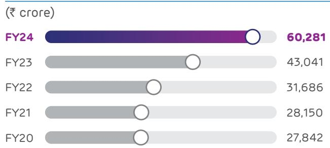

bar

(₹ crore)
| Fiscal Year | Value (₹ crore) |
| :--- | :--- |
| FY24 | 60,281 |
| FY23 | 43,041 |
| FY22 | 31,686 |
| FY21 | 28,150 |
| FY20 | 27,842 |

One-time and continuing EBITDA   
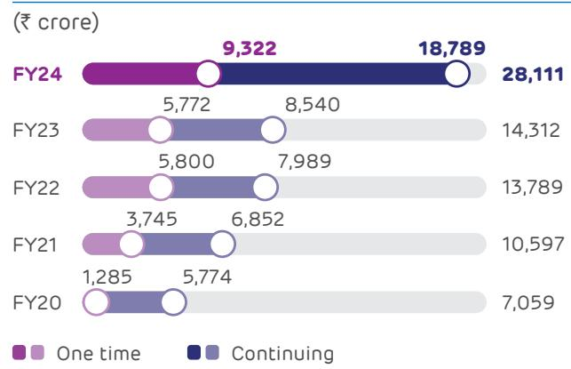

PAT   
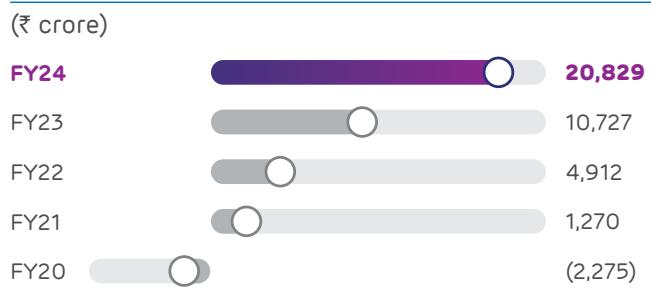

bar

(₹ crore)
| Fiscal Year | Value (₹ crore) |
| :--- | :--- |
| FY24 | 20,829 |
| FY23 | 10,727 |
| FY22 | 4,912 |
| FY21 | 1,270 |
| FY20 | (2,275) |

EBITDA margin   
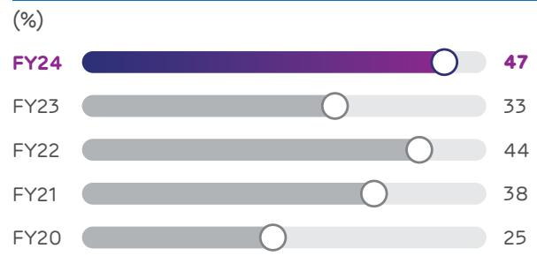

bar

| Fiscal Year | Value (%) |
| :--- | :--- |
| FY24 | 47 |
| FY23 | 33 |
| FY22 | 44 |
| FY21 | 38 |
| FY20 | 25 |

PAT margin   
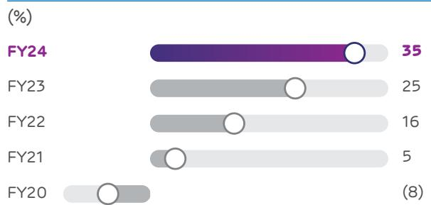

bar

| Fiscal Year | Value (%) |
| :--- | :--- |
| FY24 | 35 |
| FY23 | 25 |
| FY22 | 16 |
| FY21 | 5 |
| FY20 | (8) |

Finance cost   
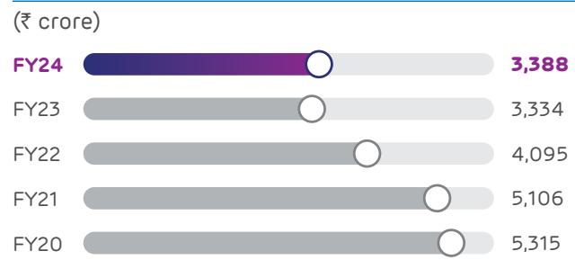

bar

(₹ crore)
| Fiscal Year | Value (₹ crore) |
| :--- | :--- |
| FY24 | 3,388 |
| FY23 | 3,334 |
| FY22 | 4,095 |
| FY21 | 5,106 |
| FY20 | 5,315 |

# Improving Balance Sheet

Total equity   
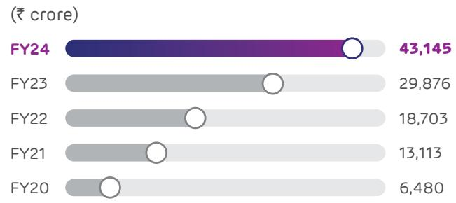

bar

(₹ crore)
| Fiscal Year | Value (₹ crore) |
| :--- | :--- |
| FY24 | 43,145 |
| FY23 | 29,876 |
| FY22 | 18,703 |
| FY21 | 13,113 |
| FY20 | 6,480 |

Net debt and debt:equity ratio   
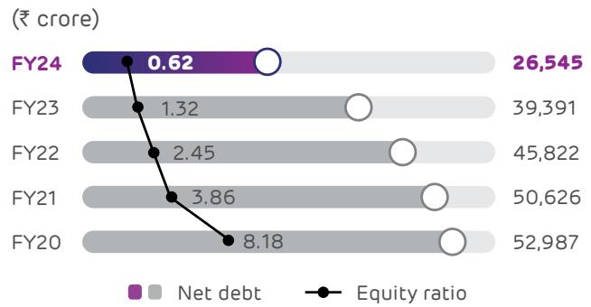

bar_line

| Fiscal Year | Net debt (₹ crore) | Equity ratio |
|-------------|--------------------|--------------|
| FY24        | 0.62               | 26,545       |
| FY23        | 1.32               | 39,391       |
| FY22        | 2.45               | 45,822       |
| FY21        | 3.86               | 50,626       |
| FY20        | 8.18               | 52,987       |

Gross debt to continuing EBITDA   
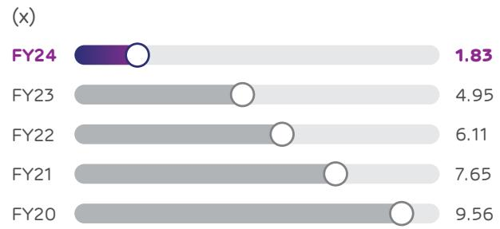

bar

(x)
| Fiscal Year | Value |
| :--- | :--- |
| FY24 | 1.83 |
| FY23 | 4.95 |
| FY22 | 6.11 |
| FY21 | 7.65 |
| FY20 | 9.56 |

Fixed asset coverage ratio   
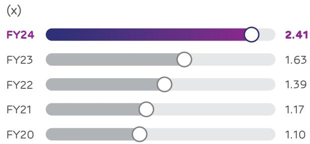

bar

(x)
| Year | Value |
| :--- | :--- |
| FY24 | 2.41 |
| FY23 | 1.63 |
| FY22 | 1.39 |
| FY21 | 1.17 |
| FY20 | 1.10 |

# Healthy Operational Parameters

Effective capacity   
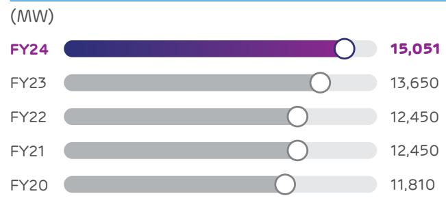

bar

| Fiscal Year | Capacity (MW) |
| :--- | :--- |
| FY24 | 15,051 |
| FY23 | 13,650 |
| FY22 | 12,450 |
| FY21 | 12,450 |
| FY20 | 11,810 |

Commercial availability under LT PPAs   
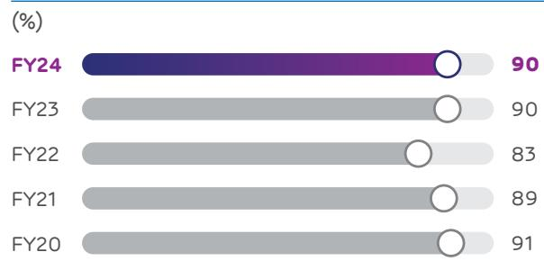

bar

| Fiscal Year | Value (%) |
| :--- | :--- |
| FY24 | 90 |
| FY23 | 90 |
| FY22 | 83 |
| FY21 | 89 |
| FY20 | 91 |

Plant load factor   
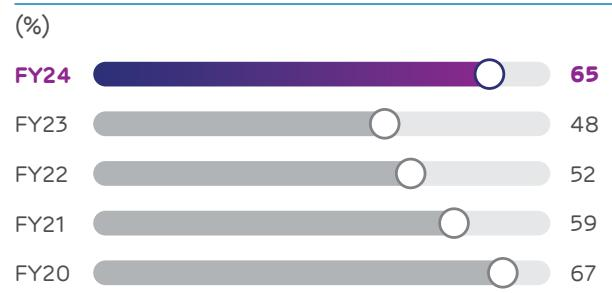

bar

| Fiscal Year | Value (%) |
| :--- | :--- |
| FY24 | 65 |
| FY23 | 48 |
| FY22 | 52 |
| FY21 | 59 |
| FY20 | 67 |

Sales volume   
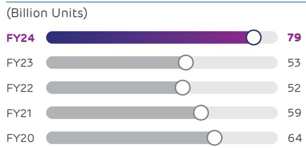

bar

(Billion Units)
| Fiscal Year | Value (Billion Units) |
| :--- | :--- |
| FY24 | 79 |
| FY23 | 53 |
| FY22 | 52 |
| FY21 | 59 |
| FY20 | 64 |

# OPERATIONAL PERFORMANCE

# Stronger Than Ever Operations

Amidst the backdrop of a steadily rising power demand within the country, our leading role in the power sector positions us to address this growing requirement. Notably, our portfolio of Power Purchase Agreement (PPA)-based capacities, encompassing import coal-based and merchant capacity, has experienced a significant uptick in Plant Load Factor (PLF) during FY 2023-24. This surge underscores our operational efficiency and agility.

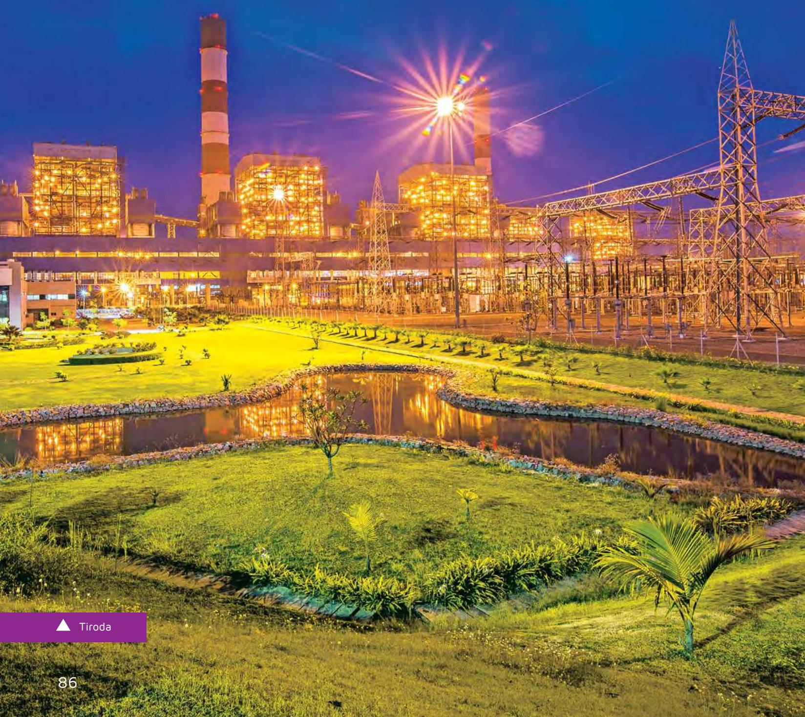

natural_image

Nighttime exterior view of a large industrial power plant with illuminated structures and a reflective water feature, labeled 'Tiroda' in the corner (no signage on main scene)

# Approach towards

# Operational Enhancements

Regular interventions are undertaken to ensure best-inclass output, nurturing the trust

of stakeholders and reinforcing our leadership in the country's power industry. Our operational enhancements primarily focus on Capacity Debottlenecking, Increasing PLF and Productivity, and

Cost Optimisation. Various activities were executed across all our plants in FY 2023-24 under each focus area fortifying our position as being 'Stronger than ever'.

# Debottlenecking

# Improving Operational Flexibility and Efficiency:

Consulted OEMs for flexible operations, fine-tuned DCS logic, and made modifications to maximise PLF and revenue, especially during low-demand periods.

# Increasing PLF and Productivity

# Capital Overhauling and Maintenance:

Executed capital overhauls and major maintenance works to ensure safe and reliable operation, improving heat rate and auxiliary power consumption.

# Cost Optimisation

# Technological and Digital Interventions:

Focused on technological and digital interventions to enhance productivity and save on manpower costs.

# Addressing Ash Handling System Issues:

Design modification and investment made in eco ash conveying system to ensure smooth and safe ash evacuation.

# Upgradation of Boiler Tube Material:

Upgraded boiler tube material in Superheater (SH) and Reheater (RH) zones to address issues and improve Station Heat Rate (SHR), resulting in higher steam parameters and availability.

# Creation of Analytical Centre of Excellence:

Established analytical centres of excellence dedicated to analysing plant data for timely decision-making and avoiding unit outages.

# Enhancing Cooling Tower Performance:

Implemented various cleaning and adjustment activities resulting in reduction in cold basin temperature and improved air flow.

# Automation and Real-time Monitoring:

Implemented automated tools for real-time data monitoring, asset performance monitoring, and process parameter deviations, enhancing accessibility and performance.

# Operational Strategies and Energy Conservation:

Implemented organisational strategies like coal blending ratio optimisation, energy conservation initiatives such as VFD installation, LED lighting, to benefit from seasonal variations and reduce costs.

# Dealing with Water Blockage:

Implemented manual desilting and introduced an in-house robot for future desilting, along with predictive analytics for silt accumulation.

# Root Cause Analysis and Best Practices:

Implemented root cause analysis (RCA) recommendations to avoid availability loss, while adopting best practices like DISHA and Adani Workplace Management System.

# Indigenisation and Spare Parts Management:

Undertook indigenisation and in-house refurbishment of spares to reduce spare costs.

# Maximising Efficiency with ENOC

The implementation of the Energy Network Operations Centre (ENOC), a cloud-based centralised monitoring facility in Ahmedabad, marks a substantial advancement in our operational efficiency. Serving as a single platform-based event notification tool, ENOC triggers alerts for critical events across all generation fleets while maintaining a comprehensive master database for future reference. ENOC facilitates real-time data access, empowering agile decision-making, and streamlining tasks across multiple power plants within a unified platform.

Our ENOC platform comes with the following distinct attributes:

# Centralised management

ENOC enables centralised power scheduling for optimum capacity utilisation, along with high plant uptime and dispatch capability, maximising revenue certainty.

# Data processing

ENOC platform enhances operational performance and efficiency through data analytics. With this capability, operators gain access to critical information across multiple devices and locations, facilitating real-time corrections by on-site operations and maintenance (O&M) teams and enabling efficient planning for predictive maintenance. Moreover, the ENOC platform empowers us to undertake special initiatives aimed at safeguarding our assets while simultaneously improving efficiency including

# Asset performance management

ENOC's comprehensive sample monitoring capabilities enable proactive maintenance and

troubleshooting, ensuring smooth and uninterrupted power generation operations. This encompasses key parameters such as air pre-heater performance, boiler metal temperature, and turbine bearing vibration. Constant monitoring of these critical aspects of power plant operations, ENOC ensures optimal efficiency and reliability.

# 7

Plants have been onboarded in ENOC in FY 2023-24 with APM implementation

Asset Health Prediction

Fuel Management Tracker

Benchmarking of critical parameters like APC, SHR etc.

# Real-time data availability:

ENOC enables seamless and agile decision-making through real-time access to critical data from all power plants, empowering operators to respond promptly to incidents and optimise performance.

# Business intelligence

Business intelligence derived from ENOC enables proactive maintenance, resource optimisation, and continuous improvement initiatives, ensuring the long-term reliability and sustainability of our power generation operations.

Our Technology Initiatives 

<table><tr><td>Technology initiatives</td><td>Brief description</td></tr><tr><td>Cloud Transformation</td><td>Adani Power transitioned to cloud technology, developing a digital stack for leaner, agile operations, migrating ERP to the cloud (SOH Suite on HANA), and upgrading the database layer for scalability and analytics</td></tr><tr><td>Automated Control Systems</td><td>Automated measurement and control systems improved systemic reliability, standardising business practices and generating real-time data across power units. DISHA processes were implemented at multiple locations, including acquisitions, extending to Mahan Energen Limited</td></tr><tr><td>Decision Support Systems</td><td>Real-time plant information management systems facilitated operational insights, supporting inventory, logistics, procurement, and financial management through an enterprise resource planning framework</td></tr><tr><td>Continuous HR Management</td><td>Adani Power ensures HR management success by providing training and familiarisation programmes for new IT projects, deploying an e-learning platform (e-vidyalaya) for continuous learning in technical and non-technical domains</td></tr><tr><td>Work from Anywhere</td><td>Remote work opportunities were unlocked with cloud migration, offering ubiquitous access to stakeholders through cloud-based options. Online meeting applications enabled instant communication, mitigating business impact on time, costs, and the environment</td></tr><tr><td>Technology Inclusion</td><td>Digital projects followed a strategic roadmap, tracked problem-solving exercises in incubation labs, and adhered to a sequence of steps from project commencement to architecture review and concept-to-commissioning approach, aimed at enhancing valuation</td></tr><tr><td>Automation</td><td>Artificial intelligence and machine learning were integrated into business processes, utilising physical and virtual robots and adopting robotic process automation to boost human resource productivity by reducing repetitive tasks</td></tr><tr><td>International Best Practices</td><td>ITIL best practices governed IT processes, while a business continuity management system aligned with ISO 22301:2019 ensured uninterrupted access to IT systems and applications, supporting business continuity according to international standards</td></tr></table>

# Mundra

Located in the Kutch district of Gujarat, the Adani Power Mundra stands as a testament to pioneering achievements across multiple fronts. The plant was the first to introduce the 660-MW supercritical power technology into India, with the commissioning of Unit 5 in December 2010. Currently boasting a capacity of 4.62 GW, it holds the distinction of being India's largest private thermal power plant and the world's first coal-based thermal power station registered with UNFCCC under CDM. The plant operates via 4x330 MW sub-critical units and 5x660 MW supercritical units. As much as 94% of its generating capacity is committed to long-term power purchase agreements, with the remainder available for sale in open markets and energy exchanges.

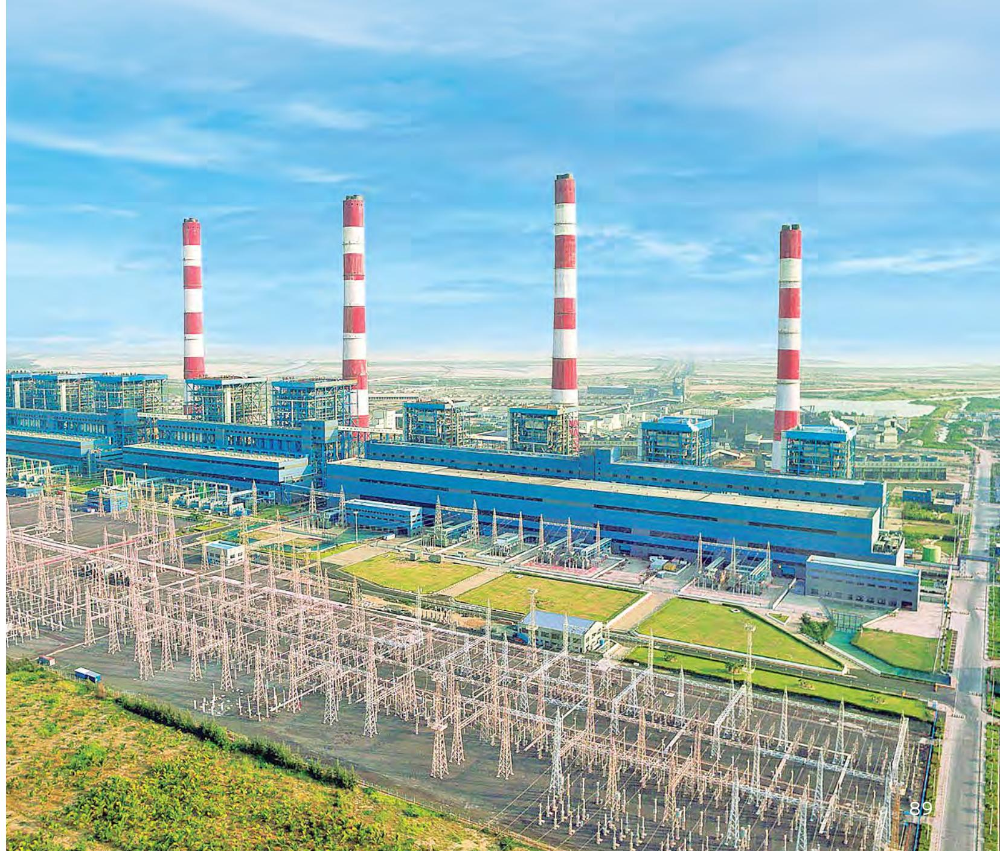

natural_image

Aerial view of a large industrial power plant with multiple red-and-white striped smokestacks and blue concrete buildings under a clear blue sky.

# Performance Highlight

# 55%

PLF as of FY 2023-24

(vs 23% in FY 2022-23)

(Improved loading factor contributed to the higher PLF which will generate efficient power towards the economic growth of the nation)

# Key Differentiating Factors

Zero dependency on groundwater owing to the huge availability of seawater   
Robust infrastructure, featuring 220KV and 400KV networks with 400/220KV ICTs for optimised power evacuation, alongside a 500KV Bipole HVDC linking Mundra to Mahendragarh, enabling the transmission of 2500 MW and serving as a pivotal link between the Western and Northern grids   
In-plant coal storage along with a nearby dedicated port for coal unloading with a direct high-speed coal conveyor   
Installed sea water-based Flue Gas Desulphurisers (FGD) in phase IV to generate environment-friendly power since inception   
Inhouse training facility including simulators for 330 MW & 660 MW units   
100% ash utilisation through positive sale while maintaining a low ash content in coal of \~5%

# National uptime record held

Till September 13, 2020

# 686 days

Uptime for Unit 4 (330 MW capacity) sub-critical technology

# 444 days

Unit 7 (660 MW capacity)

supercritical technology

# Enhancing Plant Efficiency

Undertaken measures based on TERI recommendations to mitigate risk of flood in the plant area   
ƒ Executed capital overhaul of Unit 4 to ensure safe and reliable operations   
ƒ Replaced air pre heater baskets as a major debottlenecking exercise   
ƒ Undertaken trials to transform generating unit from base load power plant to flexible operations   
Embraced a groundbreaking green ammonia combustion pilot project, collaborating with IHI and Kowa-Japan for decarbonisation efforts, aligned with Japan-India Clean Energy Partnership and NEDO's International Demonstration Project   
MoU signed for Phase-II of Joint R&D Project on Algal Bio-Energy Carbon Capture and Utilisation (ABECCU), advancing research on Carbon Capture Utilisation & Storage (CCUS) Tech projects under the Net Zero initiatives in partnership with top Scientific & Research Institutions in India

Implemented pilot project for Algae based CO capture   
Initiatives undertaken to modify MDBFP cartridge   
Improving efficiency through digital transformation and enhance productivity with cost optimisation

# \` 40 crore

Capex incurred for improvement in safety, reliability, equipment availability, operational efficiency as well as to reduce overhauling time which includes

Installation of induced current cathodic protection (ICCP)   
Quick erect scaffolding to reduce overhaul downtime   
Upgradation of eco ash conveying system   
Implementation of TERI recommendations

# 3-4 Years

Expected break-even for applicable capex activities

# Case Study

The transition from Heavy Fuel Oil (HFO) to Light Diesel Oil (LDO) involved substantial modifications in the boiler light-up process, including separate pumping and piping systems for both fuels. Implemented initially in Phase III (1320 MW) and subsequently in Phase IV (1980 MW), the project yielded significant cost savings of \` 5.5 crore in the first year, with recurring annual savings of \` 1.96 crore. Beyond financial gains, the conversion brought intangible benefits such as reduced maintenance costs due to diminished oil carryovers and carbon deposition, ensuring reliable oil gun operation and averting delays in startup. Moreover, the initiative led to lower emissions of sulphur dioxide (SOx) during oil firing, aligning with environmental sustainability objectives and regulatory compliance efforts.

# Tiroda

Adani Power Tiroda is the largest domestic coal-based power plant in Maharashtra, located in Gondia district. The first unit of the plant was commissioned on August 28, 2012, followed by subsequent unit commissions, culminating in the plant reaching full capacity with the commissioning of Unit V on October 11, 2014. The plant currently holds a capacity of 3.3 GW comprising five 660 MW supercritical technology units.

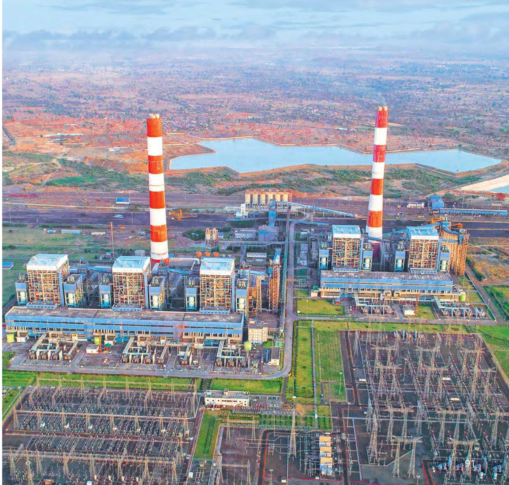

natural_image

Aerial view of a large industrial power plant with two tall red-and-white striped structures and surrounding infrastructure (no visible text or symbols)

# Performance Highlight

# 73%

PLF as of FY 2023-24

(vs 78% in FY 2022-23)

# Key Differentiating Factors

Renowned for its innovative Rail Under Rail system, setting a precedent for efficiency and technological advancement within the power sector   
Tiroda (Phase-I) has achieved global recognition as the second coal-based thermal power project to secure registration for Clean Development Mechanism (CDM) with the United Nations Framework Convention on Climate Change (UNFCCC)

Units 1 and 4 underwent annual overhaul (AOH) along with the renewal of statutory approvals   
ƒ Utilised automated tools to monitor real-time data like equipment health index, soot blowing optimiser etc.   
Asset Performance Monitoring (APM) tool monitors process parameters deviations along with triggering alerts when parameters deviate from certain bands with AI machine learning   
ƒ Undertaken major cost-saving initiative in production of demineralised (DM) water   
Installation of additional wagon tippler along with railway lines   
Upgradation of Unit-1 Distributed Control System (DCS)

APM implementation   
DCS Control Processor upgradation in one unit aimed at modernisation, technology upgradation   
Servicing of Condenser on Load Tube Cleaning System (COLTCS) for Unit 1, and replacement of outdated systems

# \` 76 crore

Capex incurred for activities including reliability, availability, as well as efficiency improvement initiatives

# 3-4 Years

Expected break-even for applicable capex activities

# Enhancing Plant Efficiency

Implementing debottlenecking strategies, notably completing the erection of a new Wagon tippler (WT-4) to enhance coal handling plant availability and optimise coal unloading efficiency   
Applying cost-saving initiatives in demineralised (DM) water production and optimisation, further contributing to overall cost reduction efforts   
Unit 3 along with other units underwent capital overhauling, including the upgrade of boiler tube material in the Superheater (SH) and Reheater (RH) zones to mitigate exfoliation issues and improve the Station Heat Rate (SHR) by aligning steam temperatures closer to design values

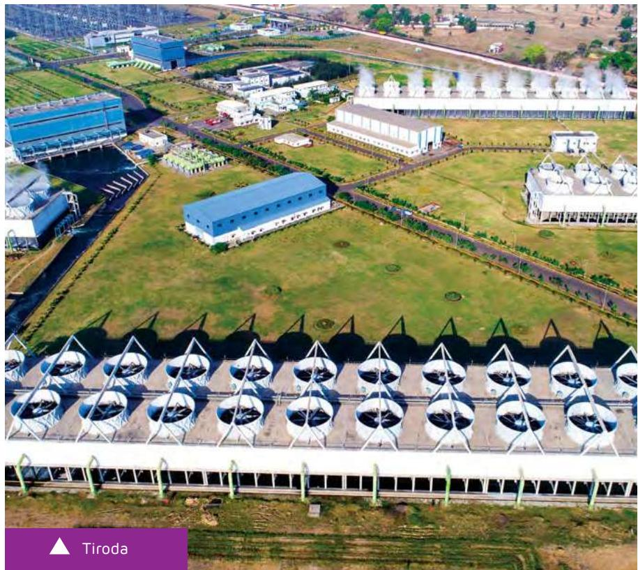

natural_image

Aerial view of a large industrial facility with multiple circular structures and surrounding greenery, labeled 'Tiroda' in the corner (no other visible text or symbols)

# Kawai

Kawai power plant stands tall with its 1.32 GW installed capacity and provisions for future expansion. Housing two cutting-edge 660 MW units employing supercritical technology, it marks Rajasthan’s inaugural Supercritical Power Plant and holds the title of the state’s largest Thermal IPP.

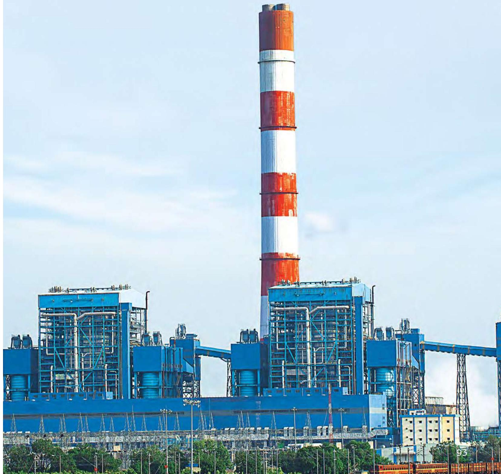

natural_image

Exterior view of a large industrial power plant with blue and red structures, featuring a tall smokestack emitting orange and white smoke (no visible text or symbols)

# Performance Highlight

# 77%

PLF as of FY 2023-24

(vs 77% in FY 2022-23)

# Key Differentiating Factors

Adani Power-Kawai operates with a commitment to stringent safety standards, boasting a Zero Lost Time Injuries (LTI) record   
Achieved 100% ash utilisation, underscoring its dedication to sustainability and environmental stewardship

# Enhancing Plant Efficiency

ƒ Addressed deteriorated Cooling Tower (CT) performance through various cleaning and adjustment measures, resulting in a notable 1.0°C reduction in cold basin temperature and improved air flow   
Revived the ICCP system in Cold Water (CW) pipes   
Executed annual overhauling at unit 1 and other units   
Unit 1 and 4 have undergone annual maintenance (AOH) with renewal of statutory approvals   
Undertook over 20 Data Analytics projects and 15 Digitisation projects to optimise costs effectively and ensure continuous improvement   
Adhered coal blending ratio strategy to optimise generating cost   
Implemented Asset-360 (M/s Black & Veatch) for online monitoring and diagnostics of equipment   
Transformed data analytics Project "Beacon" to enhance availability of Ash conveying lines, optimise Coal mill spares, and improve combustion   
Implemented Adani Business Excellence Model (ABEM) across

modules such as Leadership, Strategy, Customers, Operations, Workforce Management, and Knowledge Management

Implemented 5S and Quality Circle practices for workplace management, including adherence to detailed floor plans for Turbine COH   
Undertook various IMS to standardise plant operation and maintenance processes   
Conducting trial runs on plants to transform the generating unit from a base load power plant to a flexible operation   
Initiated the SAP mobility application for remote access in the PTW system

# Challenges Faced

Generator Transformer (GT) failure impacted the plant downtime

# \` 20 crore

Capex incurred for reliability, availability as well as efficiency improvement

# 3-4 Years

Expected break-even for applicable capex activities

# Challenges and Countermeasures

As a thermal power producer, we often face unforeseen challenges that could potentially impact our operational efficiencies. A recent incident at Kawai was met with swift action and enhanced our proactive measures to prevent future mishaps.

# Case Studies

# Remote Operation of Intake Pump Houses 1 and 2

The implementation of remote operation for Intake Pump Houses 1 and 2 streamlined operations, improving efficiency by enabling remote monitoring and control of critical pumping functions.

# Cleaning of Cooling Tower Fill Packs & Drift Eliminators

Regularly cleaning the cooling tower fill packs and drift eliminators to improve condenser vacuum and enhance heat exchange efficiency and overall plant performance.

# Institutionalising Analytics Centre of Excellence – Project Beacon

Executed Project Beacon to institutionalise an Analytics Centre of Excellence for plant performance improvement. A renowned consultant was engaged to implement analytics-based modelling, supplemented by comprehensive training on data analytics for Adani team members, facilitating data-driven decision-making and operational optimisation.

# Udupi

Udupi power plant operates as an imported coal-based utility with a robust capacity of 1.2 GW, consisting of two subcritical technology units each at 600 MW. Its strategic advantage lies in its proximity to essential transportation hubs, with the sea, rail, and air facilities situated within 15, 40, and 40 kilometres, respectively. This advantageous location facilitates efficient movement of coal, materials, and emergency spare parts.

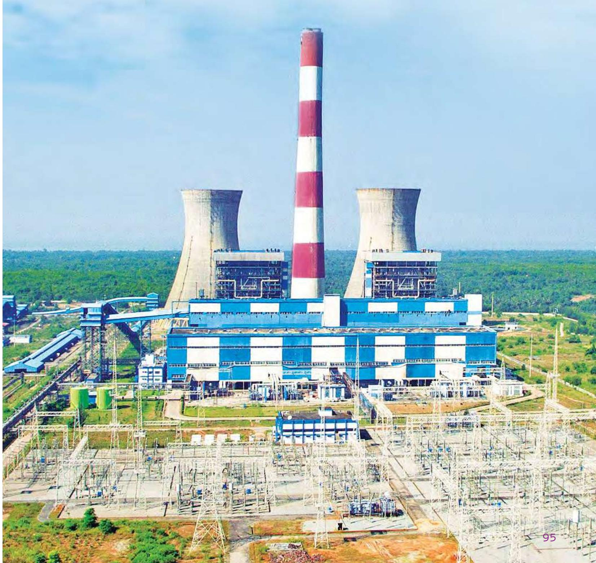

natural_image

Exterior view of a large industrial power plant with cooling towers and a tall red-and-white striped chimney, surrounded by greenery (no visible text or symbols)

# Performance Highlight

# 54%

(vs 13% in FY 2022-23)

PLF as of FY 2023-24 through strict monitoring and implementation of RCA recommendations to mitigate availability losses

# Key Differentiating Factors

Benefits from pass-through variable costs in its Power Purchase Agreements (PPAs), allowing increased revenue potential through enhanced Generation, Heat Rate, and APC factors   
Secured long-term PPAs for power sales and boasts a Low Ash Design, optimising emission parameters and promoting ash utilisation for sustainable operations.

# Enhancing Plant Efficiency

- Conducted manual desilting operations to revive station capacity, while commissioning an in-house robot for future de-silting tasks, enhancing efficiency and safety   
Implemented various Heat rate & APC improvement projects,

including U1 APH Basket Replacement, Intelligent Flow Controller in Compressors, LED Lights replacement, and U1 Coal Burner replacement, optimising plant performance and efficiency

ƒ Data analytics-based actions on prediction of silt accumulation will be done to avoid line choking   
Undertaking refurbishment and indigenisation of high-value maintenance spares   
Integrating ICCP to protect concrete structure especially cooling towers

Trials undertaken for transforming generating unit from base load power plant to flexible operation

# \` 23 crore

Capex incurred for the enhancement of operations and maintenance, availability and reliability, upgradations/ replacements due to obsolescence and the technological upgradations of the systems

# Challenges and Countermeasures

# Challenges Faced

Frequent start & stop of plant (Reserve Shut down as per power requirement from state load dispatch centre)

# Mitigation strategies

Ensure proper maintenance to keep the plant in a ready-to-run condition.   
Optimise operations to adapt to fluctuations in renewable energy penetration and thermal generation demand   
Enhance flexibility in plant operations to accommodate varying power requirements throughout the fiscal year   
Monitor demand trends and collaborate closely with state load dispatch centres to anticipate and respond to changes

# Case Studies

# Enhancing Safety with Artificial Intelligence

Detection of images on railway tracks &

Annunciation based on Artificial Intelligence for the safety of humans & animals. This innovative approach swiftly alerts personnel to potential hazards, ensuring timely intervention and preventing accidents.

# Improving Concrete Durability and Strength

Addition of microfibres in concrete/grout during patch work repairs to enhance tensile strength and prevent cracks. By incorporating microfibre reinforcement, the durability of concrete structures is significantly improved, reducing the risk of structural failures, and extending their lifespan.

# Streamlining Truck Weighing Processes

Implementation of Unmanned Weigh Bridge for Truck Emptiness Confirmation through Video Analytics. Leveraging AI/ML technology, the system efficiently determines truck load status, optimising weighing procedures and enhancing operational efficiency at weigh stations.

# Facilitating Access to Electrical Drawings

The integration of QR codes on electrical feeder panels enables swift access to critical electrical schematics, facilitating maintenance and troubleshooting tasks for technicians on-site.

# Raipur

Raipur power plant operates with two supercritical power units, each boasting a capacity of 685 MW. Benefiting from its strategic location, the plant enjoys proximity to coal mines within a 150-km radius and is situated near the state capital of Chhattisgarh. This advantageous positioning ensures a steady supply of coal, vital for uninterrupted power generation. Moreover, with additional land available, the plant holds provisions for capacity expansion, reflecting its potential for future growth and sustained contribution to the region's energy needs.

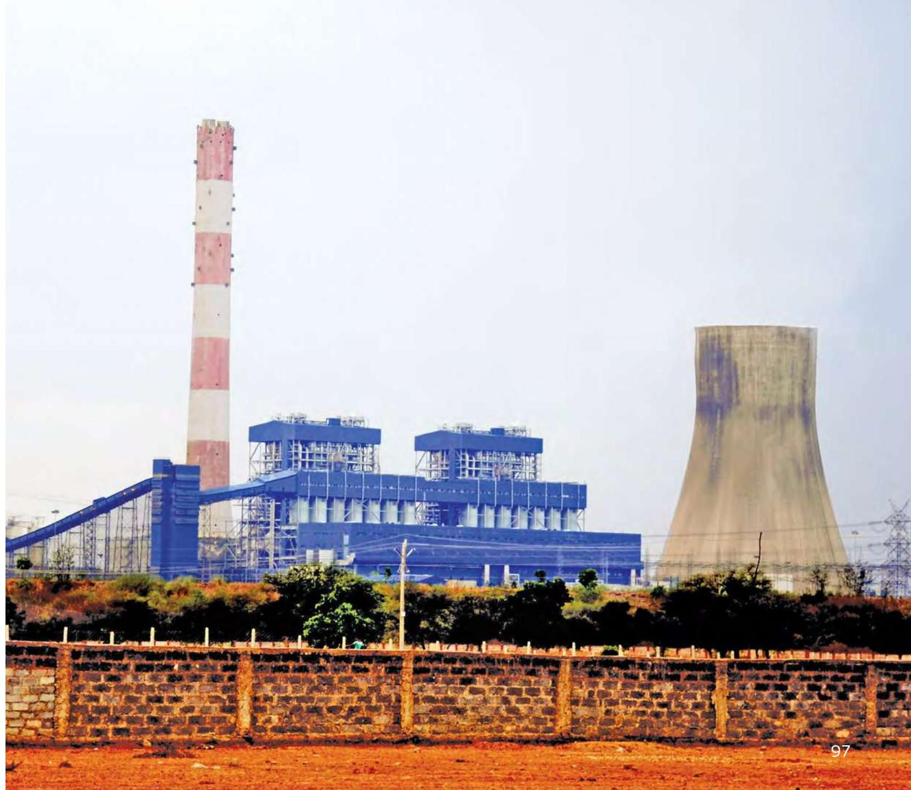

natural_image

Exterior view of an industrial power plant with a tall smokestack and cooling towers, surrounded by greenery (no signage or text visible)

# Performance Highlight

# 72%

PLF as of FY 2023-24

(vs 59% in FY 2022-23)

# Enhancing Plant Efficiency

Undertook over 20 Data Analytics projects and 15 Digitisation projects to optimise costs effectively, alongside strategies such as coal blending ratio optimisation to minimise generation costs and energy conservation initiatives like VFD installation and LED lighting implementation for seasonal variation benefits   
Executed capital overhaul at Unit 1   
Carried out major maintenance work to improve operational KPIs like heat rate, auxiliary power consumption   
Ensured safe and reliable operation with corrective and preventive maintenance

ƒ Undertaken strategy of coal blending ratio to optimise generation cost   
Implementation of Asset-360 (M/s B&V) for online monitoring and diagnostics of equipment, enhancing performance and early detection of potential critical system failures   
Data analytics Project "Beacon" for availability enhancement of Ash conveying lines, Coal mill spares optimisation, and Combustion optimisation using AI & ML, along with Fire/Smoke Alert through Advanced AI Video Analytics   
Implementation and development of the Adani Business Excellence Model (ABEM) across different modules such as leadership, strategy, customers, operation, workforce management, and knowledge management   
Implementation of 5S and quality circle practices for workplace management, including adherence to a detailed floor plan for turbine COH to optimise space and time utilisation effectively

# \` 32 crore

Capex incurred for the following activities

Speed Raise Project as per requirement of Indian Railways   
New Hostel Accommodation for employees   
Excitation 6,800 System Upgrades 1 unit, Upgradation PLC   
Schneider HMI WTP, RW SAMODA   
Rockwell HMI H2 Plant, Compressor, MRS 1,2, Fire Pump House, ESP 1,2   
Schneider PLC Hardware   
• Rockwell PLC Hardware   
APM Implementation and installation of Weighbridge with automation at Ash Silo

# 3-4 Years

Break-even tenure for applicable capex projects

# Challenges and Countermeasures

# Challenges Faced

Operational challenge of units operating at very low load due to growing renewable energy penetration and energy demand fluctuations during 24-hour operations

# Mitigation strategies

Conduct flexible operations study with renowned external consultant to prepare for safe and efficient operations during low-demand periods   
Implement necessary modifications and technology changes based on study outcomes during the opportunity period in FY 2024-25   
Enhance monitoring and forecasting capabilities to anticipate energy demand fluctuations and adjust operations accordingly   
Explore strategies for diversifying revenue streams and optimising plant utilisation during periods of low demand

# Case Studies

# Commissioning of New -33 KV Tejas Substation:

The successful commissioning of the new -33 KV Tejas Substation at the plant end facilitated seamless operations. Completing the 33 KV line charging from Tejas Substation to the River water intake pump house enabled efficient pump service from Tejas, optimising operational reliability.

# Installation of Super 304 H Boiler Tubes:

By installing Super 304 H boiler tubes in FSH Loop 1, 2, and 10, reliability was significantly improved.

Replacing T91 tubes with Super 304 H material enhanced boiler performance and longevity, reducing the risk of unplanned downtime.

# Variable Frequency Drive Installation:

The integration of Variable Frequency Drives (VFD) in Condensate Extraction Pump systems aimed to curb Auxiliary Power Consumption. By optimising pump operation, VFD installation led to notable energy efficiency gains and reduced operational expenses, promoting sustainable practices and resource optimisation.

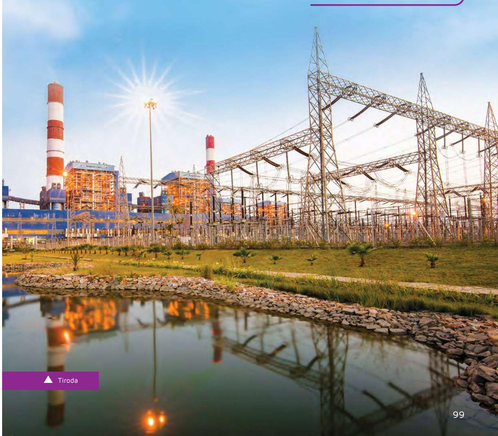

natural_image

Exterior view of a power plant with transmission towers and industrial buildings under a bright sun (no signage or text in focus)

# Raigarh

Raigarh is another plant of Adani Power in Chhattisgarh state. This plant operates with a 600 MW capacity subcritical facility. Benefiting from coal sources within 60 to 100 km, the plant ensures a steady fuel supply. Through flexible operations, stable operation up to 40% load (240 MW) is achieved. Raigarh Power Plant also attained the top rank for All India PLF in Q1 of FY 2023-24 (94.22%), with expansion provisions on additional land.

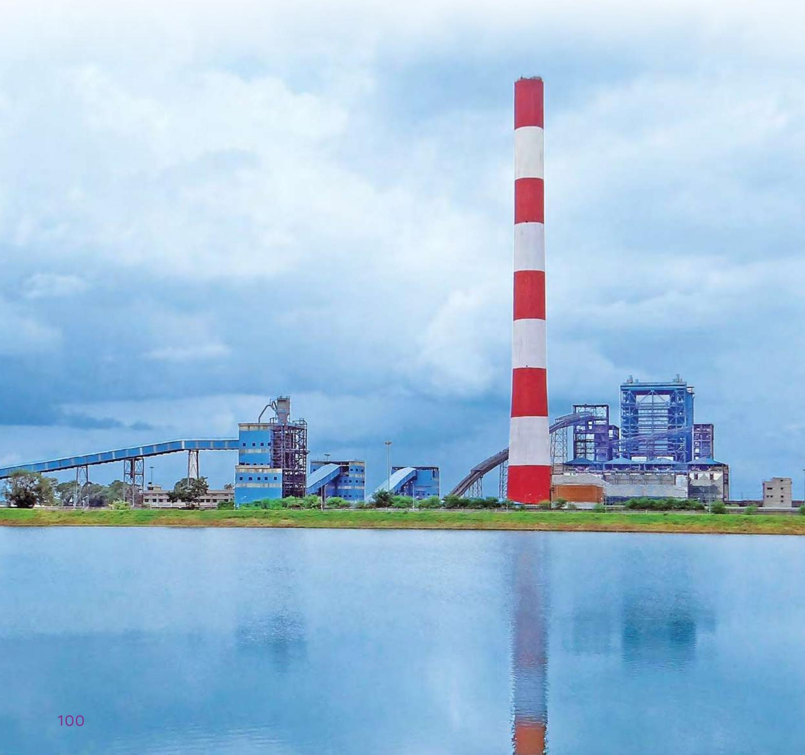

natural_image

Industrial facility with a tall red-and-white striped chimney reflected in water, surrounded by industrial buildings and conveyor belts under a cloudy sky (no visible text or symbols)

# Performance Highlight

# 75%

PLF as of FY 2023-24

(vs 76% in FY 2022-23)

# Enhancing Plant Efficiency

Achieved all India PLF Rank 01 for Q1 of FY 2023-24 (94.22%)   
Flexible operation was successfully implemented as per CEA guidelines with desire ramp up/down and stable operation up to 40% load (240 MW)   
HPH-5A replacement: HPH-5A replacement done in September 2023 due to 318 nos. of tube plugged out of 1020 (31%). Heat transfer improved by about 29 KJ/kg   
APM reliability model implemented and monitoring in practice.

MDcal performance dashboard implemented for unit performance tracking

What-if model UAT completed with Black & Veatch for quick decision-making in 14 scenarios.

Aveva PI platform implemented for data analysis and report preparation

Annual overhauling completed with improvement in SHR of 30 kcal/kWh and in APC of 0.35% (3.6 MW).   
Installation of 10 "kW" roof top solar and solar streetlights for APC reduction   
Excess air % (O2%) curve modification in APC mode of operation for O2 % optimisation.

TDBFP Recirculation valve replacement from ON-OFF type to Control type and accordingly logic modification done for specific steam consumption improvement

# Major Improvement Project of FY 2022-23: Low-capacity CW Pump Installation for APC Improvement

Installation of low-capacity CW pump, energy saving of 2.26 MWh /day with the payback of 7.38 Months

# \` 19 crore

Capex incurred for the following activities

Flexible operations, HP heater 5A replacement, and APM Implementation   
O&M Projects for system upgradation: Max DNA DCS Upgradation, Rockwell PLC Modernisation, Switchyard SCADA Upgradation, GE LT circuit breakers   
Installation of 10 KW rooftop solar and solar streetlights

# 3-4 Years

Expected break-even period for applicable capex activities

# Challenges and Countermeasures

# Challenges Faced

Operating unit at below 50% load as a merchant unit.

# Mitigation strategies

Consult OEM to conduct a study for flexible operations and fine-tuning of DCS logic to safely operate the unit near lower load with efficient combustion   
Implement modifications based on study recommendations to convert the challenge into an opportunity to operate during lower demand periods, maximising Plant Load Factor (PLF) and revenue   
Enhance monitoring and forecasting capabilities to anticipate and adjust operations in response to fluctuating demand   
Explore opportunities for diversifying revenue streams and optimising plant utilisation during periods of low demand

# Case Studies

# HPH-5A Replacement for Improved Efficiency

Replaced faulty tubes to mitigate leakage risk and enhance heat rate and overall efficiency

# Implementation of Digital Dashboards

Introduced digital dashboards to enable real-time tracking of unit performance, providing valuable insights for operational optimisation and decision-making

# Integration of Aveva PI Platform for Data Analysis

Implemented Aveva PI platform to facilitate comprehensive data analysis and operational model building, empowering our plant with advanced insights for enhanced efficiency and performance optimisation

# Mahan

Adani Power Mahan, a 1.2 GW subcritical power plant in Madhya Pradesh, features two 600 MW units. It is close to coal mines, ensuring affordable fuel, and benefits from steady water from the Rihand reservoir. Currently, Mahan is expanding with Phase-2 construction (2x800 MW) on-site.

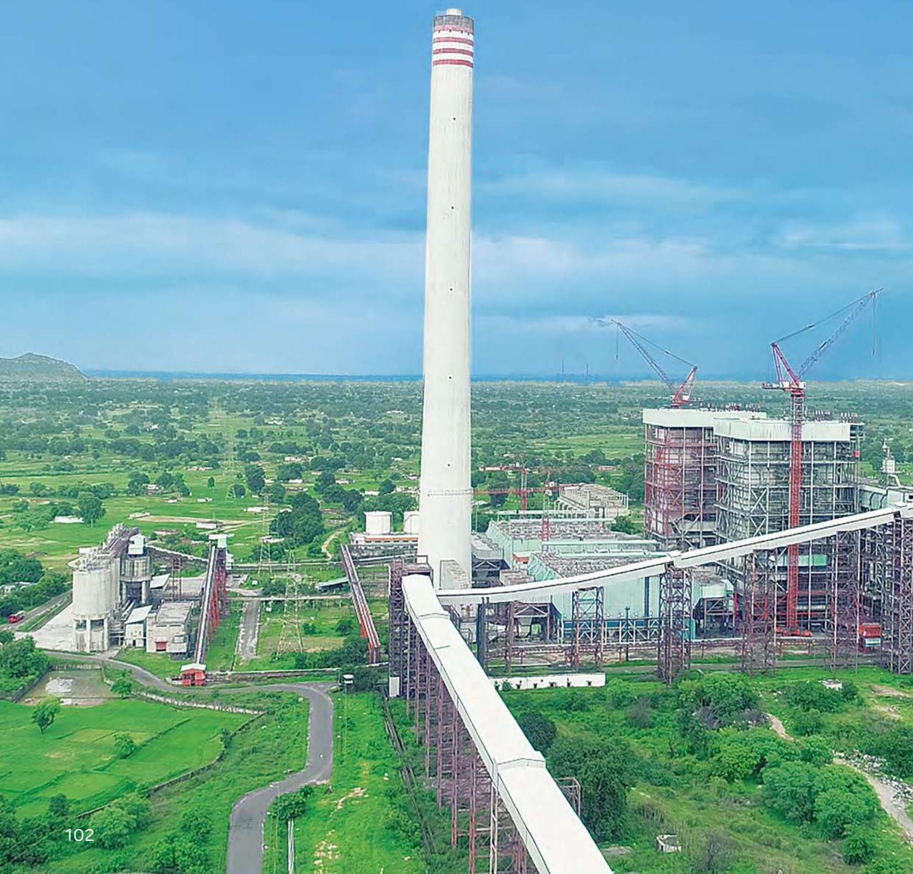

natural_image

Aerial view of an industrial plant with a tall chimney and surrounding green fields and construction cranes under a blue sky (no visible text or symbols)

# Performance Highlight

# 64%

PLF as of FY 2023-24

(vs 36% in FY 2022-23)

# Enhancing Plant Efficiency

Replaced 5km of coal conveyor belts and automated weighbridges to enhance Coal handling plant availability   
Constructed roads within the plant for improved turnaround time   
Executed capital overhaul of unit 1   
Undertook major maintenance works to ensure safe and reliable operations   
Reduced fuel oil consumption by optimising unit start-up processes   
Initiation of Asset-360 (M/s B&V) for online Monitoring & Diagnostics of equipment to improve performance and enable early detection of Potential Critical System Failures   
Data analytics Project "Beacon" for availability enhancement of ash conveying lines, coal mill spares optimisation, and combustion optimisation using AI & ML, along with fire/smoke alert through advanced AI video analytics   
Implementation and development of Adani Business Excellence Model (ABEM) across different modules such as leadership, strategy, customers, operation, workforce management, and knowledge management   
Implementation of 5S and quality circle practices for workplace management, including adherence to a detailed floor plan for Turbine COH to optimise space and time utilisation effectively   
Implementation of various IMS to standardise plant operation and maintenance processes

# \` 89 crore

Capex incurred for the following activities

Infrastructure development initiatives like field hostel building, OHC building, Canteen Building, Fire Station building, Chemical Lab building and Coal Handling Plant (CHP) O&M office, setup of C&I (Control & Instrumentation) and Electrical Lab

Upgradation of DCS and Programmable Logic Control (PLC) and Supervisory Control and Data Acquisition (SCADA)   
Upgradation of IT infrastructure   
Fire detection and alarm system upgradation

# 3-4 Years

Expected break-even period for applicable capex activities

# Challenges and Countermeasures

# Challenges Faced

Financially stressed plant before acquisition through NCLT process in FY 2021-22, resulting in frequent equipment issues and outages during operations

# Mitigation strategies

Execute Capital overhaul of unit 1 to address leakages and deteriorated performance, undertaking extensive works as per plan   
Implement planned maintenance and repair activities to restore equipment reliability and operational efficiency   
Focus on improving Heat rate and Auxiliary power consumption through targeted enhancements and optimisations   
Conduct regular inspections and monitoring to identify and address potential issues proactively, minimising downtime and optimising plant performance

# Case Study

# Deployment of Adani Standard DISHA Process:

Implementation of the DISHA process has streamlined operations at our facility, achieving standardisation and optimisation of resources, ultimately leading to operational excellence

# Safety Transformation - Project Chetna:

Project Chetna has revolutionised safety practices at our plant, ensuring strict adherence to safety processes and systems while enabling effective monitoring and continuous improvement

# Cross-Site and Subject Matter Expert Support:

Through cross-site support and access to subject matter experts from Adani's network and ENDORSE, we swiftly address maintenance challenges, leveraging a pool of expertise to optimise operations and enhance efficiency

# Godda

Adani Power Godda stands as a hallmark of our prowess in power generation and is the most efficient eco-friendly plant in our portfolio. With its two ultrasupercritical 800 MW units, it leads as the sole plant situated in the special economic zone of the country. Notably, Godda marks a significant milestone with its transnational power supply to Bangladesh under a long-term PPA. It represents the inaugural project in the country constructed and operationalised under the Cross Border Trade of Electricity (CBTE) guidelines of the Ministry of Power, Govt. of India. Featuring SCR (Selective Catalytic Reduction) in the flue gas path utilising ammonia for NOx reduction, and FGD (Flue Gas Desulfurisation) employing lime for SOx reduction, Godda epitomises our commitment to environmental sustainability and technological innovation.

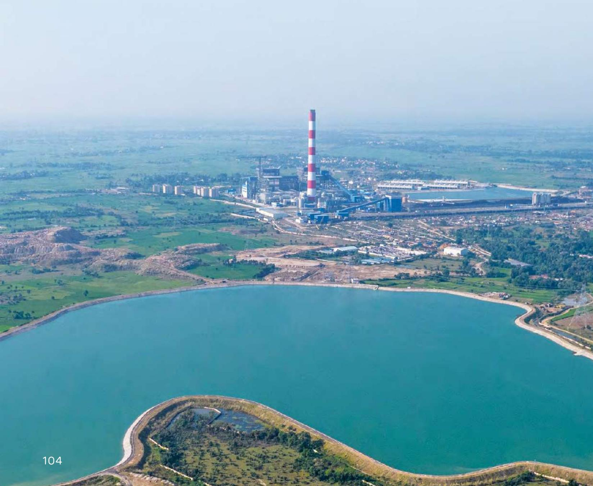

natural_image

Aerial view of a large industrial complex with a prominent red-and-white striped chimney beside a large blue reservoir, surrounded by green fields and no visible text or symbols.

# Performance Highlight

# 63%

PLF as of FY 2023-24

# \` 24 crore

Capex incurred for improving reliability and ease of operations, like HEMM, Lab facility enhancements, special tool & tackles, and safety enhancements

# 3-4 Years

Expected break-even period for applicable capex activities

# Enhancing Plant Efficiency

Introduction of permanent double transmission line arrangements bolstered power evacuation capabilities   
Manpower development through extensive training programmes for employees and workers   
Stabilisation measures implemented for critical equipment such as Mills and Fans during planned shutdowns   
Minimisation of demurrage charges through improved Turnaround Time (TAT) for coal unloading

# Case Study

# 'BEST from WASTE' Campaign

Through our 'BEST from WASTE' campaign, we repurposed over 20 MT of waste materials, demonstrating our commitment to a safe and sustainable approach to resource management.

# Oil Gun Modifications

Modifications to our oil guns resulted in significant oil savings, showcasing our dedication to resource efficiency and cost reduction measures.

# Disha Process Implementation

The implementation of the Disha process, a comprehensive O&M transformation project, streamlined our operations and fostered a culture of efficiency and accountability, driving continual improvement and performance excellence across the board.

# Way Forward for FY 2024-25

Ensuring future readiness stands as a fundamental aspect of our dedication to providing enduring value to our stakeholders. Aligned with this philosophy, we have planned the following measures for FY 2024-25.

# Establishment of Analytics Centre of Excellence (ACoE) Team:

Focus on data analysis-based approaches using AI and ML for operational optimisation and cost reduction

# Utilisation of Asset Performance Management Tools:

Implementation of tools for early fault detection and improved equipment performance

# Digital Transformation and Technology Adoption:

Deploying RPA bots, chatbots, AI/ ML-based computer vision, image/ video analytics, generative AI, Copilot, business intelligence, document management systems, and Power Automate enhances productivity and operational strategies

# Introduction of Lakshya 2.0 Projects:

Aim to optimise plant operations for efficiency and cost reduction

# Compliance with Regulations and Standards:

Adherence to new CEA regulations and implementation of IMS, ISO, 5S, and Lean Six Sigma standards for operational excellence

# Capital Overhauling and Maintenance Strategies:

Scheduled capital overhauling of units as per rolling plans to ensure safe and reliable power generation

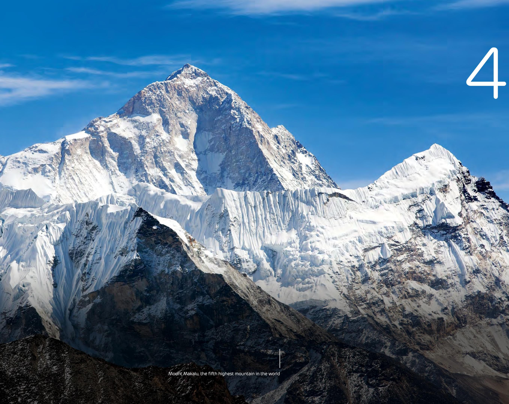

text_image

Mount Mekalu, the fifth highest mountain in the world

#

108 Environment   
122  Social: Health and Safety   
128 Social: Employees   
135 Social: Corporate Social Responsibility   
148  Social: Responsible Sourcing   
152 Governance   
163 Governance: Board of Directors

# ENVIRONMENT

# A Pledge to Environmental Stewardship

We have implemented effective measures, aligned with our sustainable goals, to mitigate the adverse impact of our core operations. Our commitment to upholding the highest standards of environmental stewardship remains a cornerstone of our responsibilities. In line with this dedication, we have proactively adopted technology upgrades and strengthened our risk management systems and governance structure.

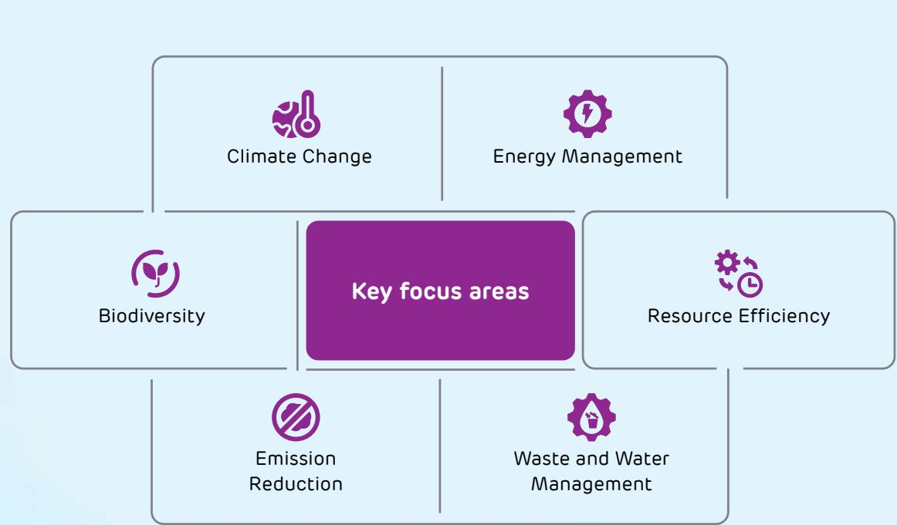

flowchart

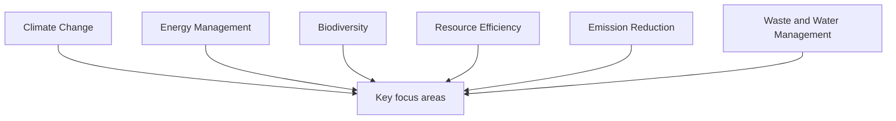
```mermaid
graph TD
    A["Climate Change"] --> B["Key focus areas"]
    C["Energy Management"] --> B
    D["Biodiversity"] --> B
    E["Resource Efficiency"] --> B
    F["Emission Reduction"] --> B
    G["Waste and Water Management"] --> B
```

# Message from Chief Sustainability Officer

As India's leading private sector thermal power company, Adani Power has been pivotal in enhancing the nation's power grid through investments in modern technologies and fuel security, ensuring power reliability, security, and affordability. In FY 2023-24, we focused on improving reliability, profitability, and Environmental, Social, and Governance (ESG) performance, embedding sustainability across all operations to minimise environmental impact and maximise stakeholder value. Our governance practices align with global standards, and our environmental initiatives include adopting ultra-supercritical technology to reduce coal consumption and carbon emissions. We also prioritise health, education, and sustainable livelihood initiatives in collaboration with the Adani Foundation, demonstrating our commitment to sustainable growth and stakeholder engagement.

Mr Santosh Kumar Singh

# Performance Highlights FY 2023-24

0.85 tCO e/MWh

GHG emission recorded in FY 2023-24

2.25 m3/MWh

35% lower than the statutory limit for hinterland plants (3.50 m3/ MWh) and 7.6% lower than the stretched internal target of 2.50 m3/MWh

Water intensity performance recorded in FY 2023-24

89.42%

Ash utilisation achieved

7 Plants (out of 9)

Power-generating units have received certification for being single-use plastic-free from the Confederation of Indian Industry (CII)

# Adani Power’s Commitment and Targets

� To be among the five leading companies in India for ESG benchmarking of the electric utility sector by FY 2024-25   
Specific GHG emissions to stood at around 0.84 tCO2e/MWh by 2025   
Explore net carbon neutral possibilities and public disclosures by 2024-25   
ƒ7.85 million tree plantation target till 2030 as a part of 100 million tree plantation pledge   
ƒSingle-use-plastic-free certified company for 100% of operating locations by 2024-25   
Integrate with management systems in the company to conduct business with no net loss to biodiversity and 100% alignment with India Business Biodiversity Initiative (IBBI) and public disclosures   
Building a green supply chain through the integration of associates for 100% of critical supplies by FY 2024-25

Systematic materiality assessment and integration with management systems in the company   
Inclusive growth including communities by undertaking corporate social responsibility initiatives aligned with business impacts to leave a positive footprint and enhance societal happiness

# UN SDG linkages

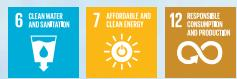

# Strategies to Mitigate Climate Change Risk

We are committed to addressing climate change risks through proactive measures. Central to our sustainability strategies is the reduction of greenhouse gas emissions to mitigate our environmental impact effectively. Our approach to climate change adaptation and mitigation is in line with the global goals outlined in the Paris Agreement, aiming to limit the global temperature rise by less than 1.5°C, as well as the Sustainable Development Goals set by the United Nations. We are committed to transitioning towards green technologies to reduce emissions, aligning with the ambitious targets set by the Adani Group to fulfil India's Climate Change NDC commitments.

# Implementing Robust Risk Management Processes

We have adopted to a comprehensive risk management framework that enables us to identify critical risks and opportunities associated with climate change. Through this framework, we have developed short and medium-term strategies aimed at mitigating these risks. Additionally, our commitment to transparency is evident through the disclosure of our climate change performance via CDP-climate change assessments, which evaluate the ESG credentials of organisations. Our score in these assessments underscores our dedication to setting competitive benchmarks and fulfilling our commitment to reducing the impact of climate change.

# Case Study

# Driving excellence with Project Beacon

In our risk management approach, we utilise the Representative Concentration Pathway (RCP) developed by the Intergovernmental Panel on Climate Change (IPCC) to assess physical risks linked with climate change. These pathways depict various potential climate futures based on projected greenhouse gas emissions. RCP scenario assessments are mandatory for existing and new power plants, influencing plant modifications like structural adjustments at the Mundra power plant. Assessments encompass legal, technical, market, and reputational risks over short-term (0-5 years), medium-term (5-10 years), and long-term (10-20 years) periods. Unit managers undertake climate-related risk identification and assessment through tailored risk management systems, employing scenario analysis to anticipate impacts on business, strategy, and financial performance due to climate-related risks.

# Enhancing Operational Efficiency for Sustainable Energy Practices

Pursuing green hydrogen-derived ammonia as an alternative fuel at Mundra plant, aiming for a 5% portfolio decarbonisation through biomass technology integration   
Signed MoU with Kowa and IHI Corporation to study the feasibility of achieving a 20% liquid ammonia co-firing ratio, with plans to extend to 100% mono-firing at Adani Power Mundra Coal Fired Power Plant   
Exploring green hydrogen feasibility for carbon neutrality aligned with the “India-Japan Clean Energy Partnership (CEP)”   
Commissioned India’s first supercritical and ultra-supercritical power plants

in Mundra, boasting 45% more efficiency and significant carbon emission reduction

Majority of operational units are supercritical or ultra-supercritical, enhancing energy efficiency   
Operational and Technical efficiency (OTS) cell oversees energy efficiency management in line with ISO 50001, setting voluntary internal targets and reviewing progress   
Implemented Integrated Management System (IMS) with a focus on energy efficiency and ISO 50001:2018 compliance   
Submitted energy efficiency proposals by plant teams are approved and assigned to project implementation teams, with progress reviewed periodically by the OTS team

# Employee Engagement for Energy Efficiency and Climate Mitigation

Our workforce actively participates in improving energy efficiency via our internal communication platform, "MAADHYAM." This channel provides an opportunity to them to share innovative ideas with our Chairman regarding organisational strategy, technology, and operations. Ideas that contribute to operational efficiency and climate change mitigation are rewarded with monetary benefits. Additionally, our senior leaders receive performance-based incentives tied to their Key Result Areas (KRAs) focusing on energy efficiency and climate change mitigation.

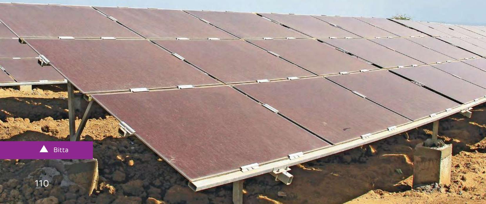

text_image

▲ Bitta
110

# Efficient Management of Energy and Resource

Guided by our energy and emission policy, our energy management approach prioritises continual measurement, monitoring, and review of our energy consumption. We are committed to reducing energy usage through the adoption of energy-efficient technologies, supported by our automated control system that enhances systemic reliability and decision-making processes. As a thermal power generation entity, we recognise the inherently energy-intensive nature of our operations. Designated as designated consumers (DCs) under the Perform Achieve and Trade (PAT) scheme by the Government of India, we have identified energy efficiency targets based on baseline assessments of our power plants. Our plant-specific roadmaps are aligned with the PAT scheme, ensuring our efforts contribute to national energy conservation goals.

# Diversified our power portfolio through

Generating 59,901.52 MWh power in our Bitta plant through installed solar panels and 73.44 MWh was generated at Mundra, Tiroda, Kawai & Raigarh TPPs Reducing coal dependency through ammonia and biomass co-firing. A biomass co-firing trial at our Raipur TPP site involved 5% and 10% blending during the reporting period

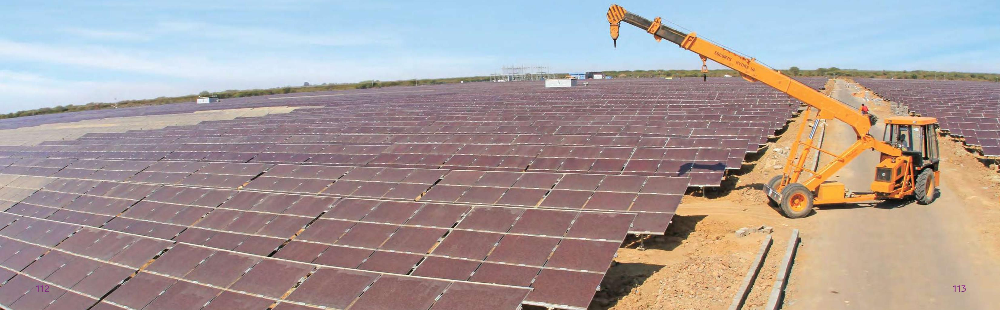

natural_image

Large-scale solar farm with rows of photovoltaic panels and a yellow forklift operating on a dirt road (no visible text or symbols)

Plant-wise energy efficiency measures 

<table><tr><td>TPP</td><td>Energy Inefficiency Reduction Initiatives</td></tr><tr><td>Mundra</td><td>Switched off one circulating water pump during winterInstalled additional economisers in two units, reducing flue gas temperature and coal consumptionConducted feasibility study for installing Ammonia co-firing system</td></tr><tr><td>Tiroda</td><td>Used chemical and jet cleaners for condenser tubesReplaced HPT ventilation valve and HPSV lights with LED lights</td></tr><tr><td>Kawai</td><td>Switched off cooling tower fans during winter, saving up to 1.38 MU for FY 2023-24Replaced equipment such as coal burner nozzle and TDBFP R/C valve</td></tr><tr><td>Udupi</td><td>Replaced HPSV lights and fluorescent light fittings with LEDsOptimised operational efficacy, including accurate temperature setting for cooling water at condenser inlet and outlet</td></tr><tr><td>Raipur and Raigarh</td><td>Replaced conventional lights with LEDsInstalled intelligent flow controllers and VFDs for improved efficiencyConducted biomass co-firing trials at Raipur TPP with 5% and 10% blendingInstalled low-capacity cooling water pumps and modified systems and processes at Raigarh TPP to save energy and optimise operations</td></tr></table>

# Emission Management

Efficiently reducing our emission intensity is among the core activities we perform to reduce our environmental footprint. We recognise the greenhouse gas (GHG) emission that comes out from our plant and have taken effective mitigation steps to curb the issue. Mitigation strategies that have been taken so far include adherence to renewable energy along with long-scale technology upgradation.

0.85 tCO e/MWh

GHG emission trend (Till FY 2023-24) (in million MTCO2e)   
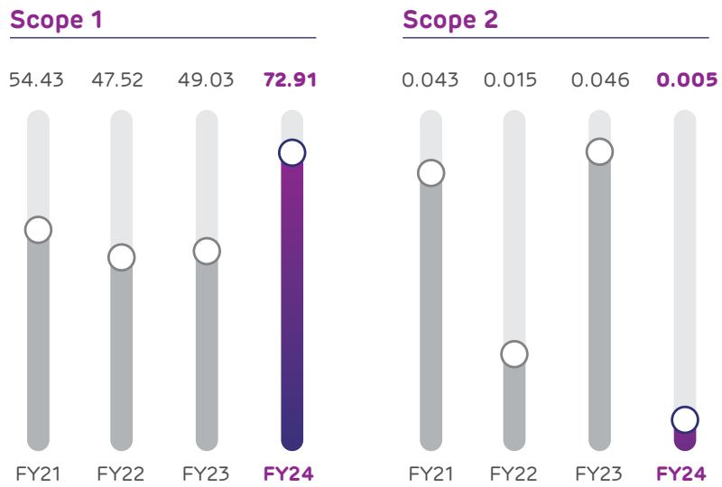

natural_image

Aerial view of a multi-lane road with palm trees lining the left, surrounded by green lawns and grassy fields (no visible text or symbols)

# Actions taken to curb emission

Investment in innovative technologies for emission reduction

Ensuring emissions and mercury content within permissible limits   
ƒZero ODS generation in processes   
Compliance with new mercury and particulate emissions standards

Installation of flue gas desulphurisers (FGD) at operating plants, targeted completion by December 2026

Air emissions (in MT)   
NOx   
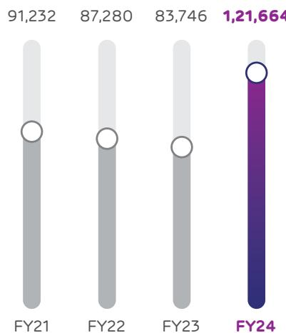

bar

| Year | Value |
| :--- | :--- |
| FY21 | 91,232 |
| FY22 | 87,280 |
| FY23 | 83,746 |
| FY24 | 1,21,664 |

SOx   
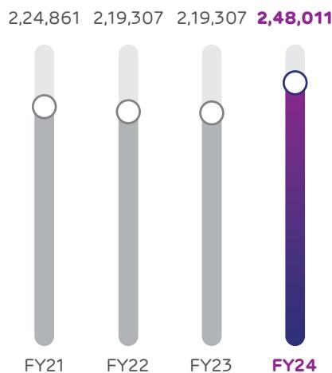

bar

| Year | Value |
| :--- | :--- |
| FY21 | 2,24,861 |
| FY22 | 2,19,307 |
| FY23 | 2,19,307 |
| FY24 | 2,48,011 |

Particulate Matter   
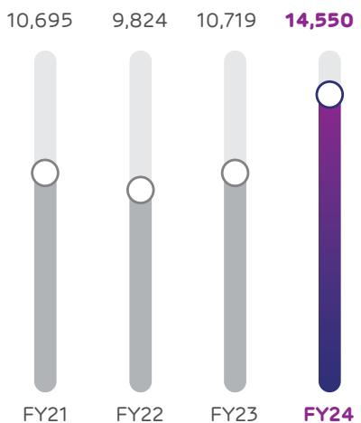

bar

| Year | Value |
| :--- | :--- |
| FY21 | 10,695 |
| FY22 | 9,824 |
| FY23 | 10,719 |
| FY24 | 14,550 |

# Transition towards Net Zero carbon footprint

We have made significant progress in our journey towards achieving a net zero carbon footprint by effectively implementing carbon capture, usage, and storage (CCUS) technology across our operational fleets. This positions us to make a substantial contribution to the nation's goal of achieving net-zero emissions by 2070. Given that the power sector is among sectors that contribute 70% of total emissions, integrating CCUS technology will facilitate the production of cleaner products and electricity, aiding

in the attainment of sustainable development objectives such as green aggregates, green ammonia, and methanol, leading to the promotion of green energy.

# Initiatives undertaken by Adani Power for CCUS

Flue Gas CO Capture & Conversion Project Advances:

• Design & Engineering Progress   
Techno-Economic Analysis (TEA) and Detailed Feasibility Report (DFR) underway

Expansion of Joint R&D Efforts:

MoU signed for Algal bio-energy carbon capture and utilisation (ABECCU)   
- Collaboration with Tata Institute of Fundamental Research (TIFR) Mumbai:   
MoU signed for joint advancement project in Carbon Capture and Utilisation (CCU) technology

# Efficient Material Management

Our material management strategies prioritise prudent resource utilisation and embrace a circularity model to maximise the value of waste, thereby positively impacting natural resources and biodiversity. Our decision support system provides real-time plant information on an IT-based platform, enabling close monitoring and tracking of operational data. Supported by an industry-standard enterprise resource management framework, our IT platform facilitates more robust management of inventory, logistics, procurement, and financial components.

Material consumption (in metric tonnes) 

<table><tr><td>Parameter</td><td>FY 2023-24</td><td>FY 2022-23</td><td>FY 2021-22</td><td>FY 2020-21</td></tr><tr><td>Coal Consumed</td><td>5,12,71,728.69</td><td>3,64,25,494.73</td><td>3,52,96,922.00</td><td>3,82,98,884.00</td></tr><tr><td>Chemical Consumed</td><td>35,250.46</td><td>3,455.13</td><td>9,130.92</td><td>10,909.00</td></tr><tr><td>Lubricating Oils</td><td>565.82</td><td>393.57</td><td>472.46</td><td>169.00</td></tr><tr><td>Grease</td><td>44.36</td><td>40.57</td><td>33.36</td><td>34.00</td></tr><tr><td>LDO/HSD Consumed</td><td>8,141.44</td><td>17,509.14</td><td>4,743.20</td><td>5,158.00</td></tr><tr><td>HFO Consumed</td><td>1,379.00</td><td>1,677.90</td><td>1,282.40</td><td>3,285.00</td></tr><tr><td>Diesel</td><td>4,039.21</td><td>3,376.39</td><td>439.52</td><td>1,688.00</td></tr><tr><td>R22 Consumed</td><td>2.02</td><td>1.06</td><td>2.11</td><td>2.80</td></tr><tr><td>Total Materials</td><td>5,13,21,151.00</td><td>3,64,51,948.49</td><td>3,53,13,025.97</td><td>3,83,20,129.80</td></tr></table>

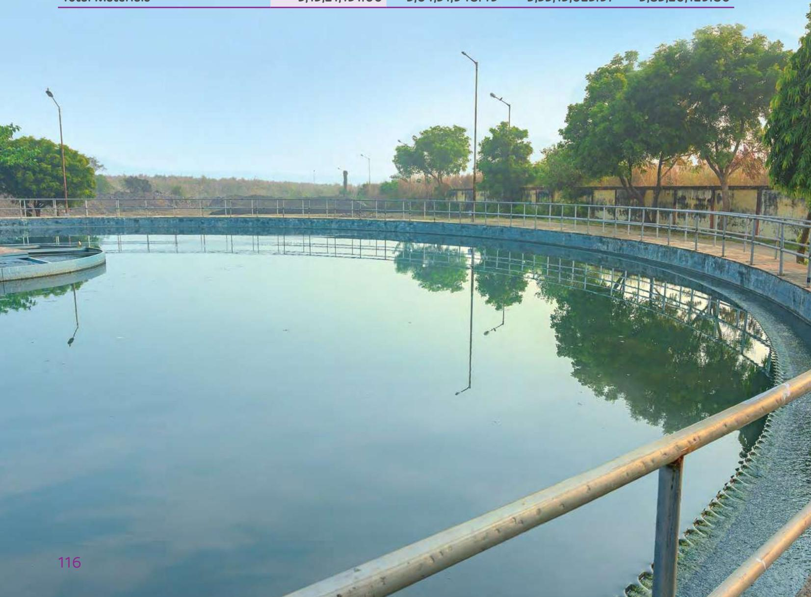

natural_image

Exterior view of a circular water treatment facility with reflective water reflecting on a walkway, surrounded by trees and streetlights (no signage or text visible)

# Water Management

Water management is fundamental to our operational philosophy, highlighting its inherent value as a vital resource. Our use of surface and seawater for cooling and steam generation in thermal facilities reflects a strategic resource allocation approach. Committed to water conservation, we employ Zero Liquid Discharge (ZLD) solutions across all units to minimise freshwater withdrawal, fostering optimal recycling and reuse. Upholding stringent water consumption standards, we advocate for sustainable practices, aiming to keep usage well below statutory limits while embracing environmental responsibility.

# Initiatives undertaken for efficient water management:

Implemented closed-loop system for steam processes to conserve and efficiently reuse water   
Ensured strict compliance with quality and quantity standards for effluent discharges set by regional regulatory agencies through thorough research, monitoring, and reporting   
Adhered to local regulatory guidelines concerning water withdrawal and actively

participating in watershed alliances and relevant programmes for sustainable water resource management

Engaged in multi-stakeholder partnerships and collaborations with civil society organisations to pursue water conservation goals   
Reduced environmental impact by enhancing groundwater recharge through the desilting and cleaning of community ponds

# Our prudence in water management

# 2.50 m3/MWh

Internal target set for surface water consumption in hinterland plants which is well below the prescribed limit of 3.5 m3/MWh set by the Ministry of Environment, Forest and Climate Change (MoEFCC)

Source-wise (in m3) 

<table><tr><td>Parameter</td><td>FY 2023-24</td><td>FY 2022-23</td><td>FY 2021-22</td><td>FY 2020-21</td></tr><tr><td>Surface Water</td><td>14,44,94,214</td><td>11,27,77,523</td><td>9,94,27,453</td><td>8,79,85,734</td></tr><tr><td>Rainwater</td><td>18,48,490</td><td>33,29,892</td><td>8,11,875</td><td>7,19,340</td></tr><tr><td>Seawater</td><td>25,17,91,455</td><td>10,56,21,410</td><td>10,71,00,359</td><td>25,39,89,549</td></tr><tr><td>Purchased Water</td><td>4,966</td><td>4,966.00</td><td>445</td><td>6,255</td></tr><tr><td>Total</td><td>39,81,40,055</td><td>22,17,29,020</td><td>20,73,40,132.43</td><td>34,27,00,878</td></tr></table>

# Water risk assessment

We have conducted a comprehensive water risk assessment across all our site locations, focusing on water-physical risks, regulatory risks, and stakeholder impacts. Utilising tools like the India Water Tool and WRI Aqueduct, we have performed scenario analyses to estimate seasonal variations in water availability, enabling us to implement mitigation measures against adverse impacts. Additionally, we have employed the EcoLab Smart Water meter tool to understand water consumption and conduct Environmental Impact Assessments (EIAs) before project commissioning, ensuring sustainability and water

quality preservation through daily monitoring and testing certified by NABL. Our site-specific Integrated Management Systems (IMS) and tailored Environmental Management Plans (EMPs) further eliminate and mitigate detrimental impacts on water ecosystems, human health, and communities.

# Wastewater treatment

Our water inventory encompasses various sources, including water used for electricity generation, evaporated water from cooling towers in closed-circuit systems, domestic sewage, rainwater, and stormwater effluents. To ensure precise monitoring and control, we employ an operational control approach to consolidate data on

water withdrawal and discharge. Before discharge, we subject the water to treatment processes through Sewage Treatment Plants (STPs) and Effluent Treatment Plants (ETPs), designed to remove chemical and biological organic matter. We strictly adhere to local regulations and standards set by the Central Pollution Control Board (CPCB) and the State Pollution Control Board (SPCB) to ensure that discharged water compositions remain within prescribed limits. Notably, our Hinterland TPP operates as zero liquid discharge plants, further underlining our commitment to wastewater management and environmental stewardship.

# ISO 46001:2019

Certification received for Water Efficiency Management Systems

Specific water consumption (m3/MWh) 

<table><tr><td></td><td>FY 2023-24</td><td>FY 2022-23</td><td>FY 2021-22</td><td>FY 2020-21</td></tr><tr><td>Adani Power</td><td>2.25</td><td>2.35</td><td>2.32</td><td>2.19</td></tr><tr><td>Bitta Solar Plant</td><td>0.11</td><td>0.01</td><td>0.01</td><td>0.1</td></tr><tr><td>Mundra TPP</td><td>1.69</td><td>1.74</td><td>1.84</td><td>1.68</td></tr><tr><td>Tiroda TPP</td><td>2.34</td><td>2.34</td><td>2.33</td><td>2.52</td></tr><tr><td>Kawai TPP</td><td>2.61</td><td>2.54</td><td>2.28</td><td>2.37</td></tr><tr><td>Udupi TPP</td><td>2.92</td><td>5.13</td><td>6.6</td><td>4.16</td></tr><tr><td>Raipur TPP</td><td>2.26</td><td>2.27</td><td>2.07</td><td>2.28</td></tr><tr><td>Raigarh TPP</td><td>2.45</td><td>2.35</td><td>2.46</td><td>2.49</td></tr><tr><td>MEL, Mahan TPP</td><td>2.68</td><td>2.74</td><td>Nil</td><td>Nil</td></tr><tr><td>APJL, Godda TPP</td><td>2.23</td><td>1.80</td><td>Nil</td><td>Nil</td></tr></table>

# Waste Management

Our waste management strategies embrace comprehensive processes aimed at creating a positive societal impact while mitigating our environmental footprint. We employ various activities, from waste collection and segregation to transportation, reprocessing, recycling, and disposal of diverse waste types. Primarily, fly ash constitutes our main solid waste output, alongside municipal, hazardous, biomedical, and e-waste. Disposal methods are tailored to the type and quality of waste generated, ensuring responsible and effective waste management practices throughout our operations.

# Initiatives undertaken for fly ash management

Adopted High Concentration Slurry Disposal (HCSD) system for fly ash at Tiroda plant   
Established infrastructure for fly ash transformation into valuable materials

# Single-use plastic reduction

07 Plants (Out of 09) of power-generating units certified single-use plastic-free by CII   
Hosted a waste-paper recycling unit at Tiroda, Kawai, Udupi TPPs

# Hazardous waste handling

Smaller quantity of hazardous waste generated, stored in designated locations   
Non-recyclable hazardous waste sent to SPCB-approved TSDF for proper management

Fly ash utilisation and fly ash generation   
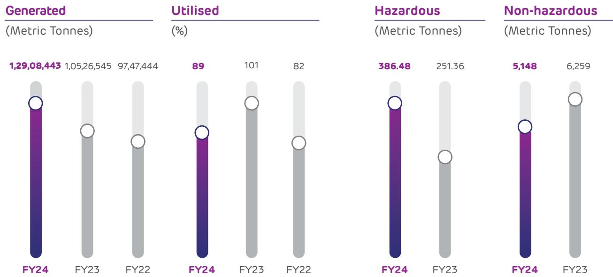

bar

| Category | FY24 (Metric Tonnes) | FY23 (Metric Tonnes) | FY22 (Metric Tonnes) |
| :--- | :--- | :--- | :--- |
| Generated | 1,2908443 | 1,0526545 | 9747444 |
| Utilised (%) | 89 | 101 | 82 |
| Hazardous (Metric Tonnes) | 386.48 | 251.36 | 5148 |
| Non-hazardous (Metric Tonnes) | 5148 | 6259 | |

# Biodiversity

We engage in extensive consultations with stakeholders, including governments, NGOs, and local communities, to develop comprehensive biodiversity plans. These plans, formulated in collaboration with NABET-accredited agencies, involve detailed studies and management strategies. We conduct EIAs for all new projects to prevent adverse impacts on ecosystems, obtaining necessary approvals from relevant departments and ministries. Our approach emphasises rehabilitation, restoration, and offsetting of impacts where prevention is not feasible. Identifying and assessing potential impacts informs decisions on-site locations, equipment selection, and operational management, ensuring responsible environmental stewardship across diverse business operations.

# Bio-diversity policy

Our comprehensive biodiversity policy aims to protect and enhance biodiversity around our plant locations, committing to achieving no net loss of biodiversity by 2025. Guided by three key principles, our biodiversity assessment process includes:

# Risk and Impact Assessment

Analysing and identifying necessary control measures through Aspects and Impacts Assessment process

# Mitigation and Control

ƒ Implement monitoring programmes and plans

Undertake habitat restoration, engineering controls, and other measures

# Communication and Awareness:

Collaborate with local scientific communities and stakeholders to conduct training and education initiatives for biodiversity conservation understanding

natural_image

Four pink flamingos standing on a sandy beach, no text or symbols visible

# Biodiversity policy and governance:

Adhered to biodiversity policy that exceeds local, regional, and national requirements   
Established a formal governance structure to ensure systematic management   
Being among the signatories of the Indian Business & Biodiversity Initiative (IBBI), aligning with the objectives of the Convention on biological diversity (CBD)

# Biodiversity assessments and collaboration:

Conduct assessments with accredited institutions and experts like NABET-accredited wildlife experts, agencies, and institutions

Include site-specific wildlife and marine impact studies conducted by National Institute of Oceanography (NIO)   
National Environmental Engineering Research Institute (NEERI) conducts environmental impact assessment (EIA) for new projects

# Integrated biodiversity management:

ƒ IMS maps biodiversity, enhances stakeholder awareness   
ƒ Aims for protection, conservation, and sustainable management

# Biodiversity protection measure

Data collected within 10km radius from nearby villages

Quadrat's method used to assess shrubs, herbs, and trees   
Data on circumference at breast height (cbh) or diameter at breast height (dbh) and basal cover recorded for each species   
Reptiles, mammals, and amphibians identified and accounted   
Shannon Diversity Index (H) used to measure species diversity and richness   
ƒIdentification of local, migratory, and resident birds   
Bird species categorised as per Wild Protection Act and IUCN guidelines

# SOCIAL: HEALTH AND SAFETY

# Commitment to Comprehensive Safety

We aspire to cultivate a 'culture of care', where our employees assume responsibility for fostering a safe environment for themselves and others. As a power generation company, prioritising precaution and prevention, we have implemented stringent governance mechanisms to achieve our 'Zero Harm' target and safeguard our workforce. Regular training sessions enhance the effectiveness of our operational health & safety (OH&S) management systems across operations. In FY 2023-24, 100% employees and workers underwent OH&S training to further strengthen our safety practices.

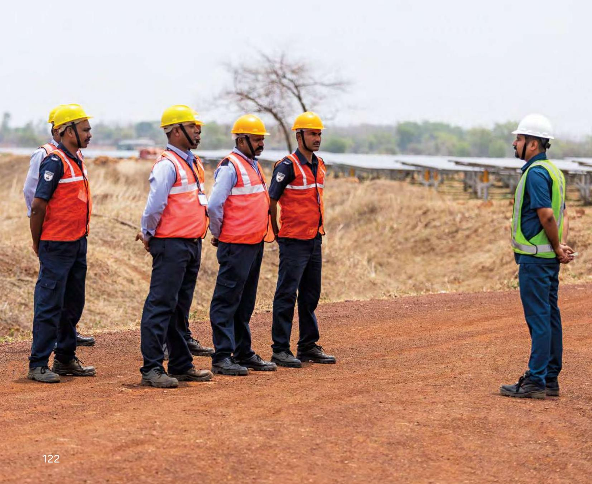

natural_image

Group of construction workers in safety vests and hard hats standing on a dirt site, engaged in discussion (no visible text or symbols)

# Approach towards Safety Leadership

We adhere to our safety protocols with clear leadership traits, ensuring a shared safety responsibility among the workforce where everyone understands safety beyond personal responsibility. To enhance the effectiveness of our safety leadership traits, we have identified 10 behavioural patterns that nurture our safety culture.

# Walk the talk

The lowest standard you walk past is the highest standard you accept.

# Interact

Interact with others to engage in safety discussions leading to a wider subject matter understanding.

# Support and hold safety high

Reinforce positive behaviour; correct at-risk behaviour.

# Integrate safety

Integrate safety considerations in all decisions, activities and actions.

# Report and encourage

Report and encourage others; resolve safety and vulnerability issues, learning from lead and lag parameters.

# Mentor

Support and guide new stakeholders in safety guidelines and standards.

# Facilitate

Facilitate risk management by integrating safety in design and operations to address vulnerabilities

# Reward and recognise

Reward and recognise safe behaviour and felt leadership.

# Reprimand

Reprimand others for wilful safety infringement

# Lead the change

Participate and facilitate others in health and safety initiatives

# Performance highlights FY 2023-24

# 0 and 0.15

LTIFR registered respectively for employees and workers

# 02

Number of incidents reported

# 00 and 01

Fatalities reported respectively among employees and workers

# UN SDG linkages

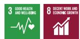

# Message from Chief Operating Officer

The remarkable evolution of our safety standards has propelled by Project Chetna. This initiative has revolutionised our safety practices, marking a pivotal moment in our commitment to Occupational Health and Safety (OH&S). Our ethos towards OH&S embodies a collaborative approach, fortified by rigorous measures aligned with esteemed standards like ISO 45001. These measures serve as the cornerstone in our relentless pursuit of achieving 'zero harm' within our workplace. We deeply understand the criticality of stringent OH&S management, pivotal for ensuring worker safety, regulatory compliance, risk mitigation, heightened productivity, and safeguarding our invaluable assets.

Jayadeb Nanda

# Comprehensive OH&S Policy and Governance Structure

Our OH&S policy and governance consist of a dual-tier mechanism, operating at both corporate and site levels. At the corporate level, a safety steering committee, supported by sub-committees across various business functions, oversees safety initiatives. Meanwhile, at the site level, an apex committee led by the station head and site safety head, along with sub-committees, manages safety interactions, incident response, high-risk activities, contractor safety, process safety, training & capability, logistic, and technological interventions. This structure ensures comprehensive oversight of daily operations and fosters continual safety improvement.

Adhering to ISO 45001:2018 standards, the policy covers employees, workers, business

associates, visitors, and local communities across all operational sites. It outlines governance, safety awareness, training, audits, incident investigation, corrective actions, performance improvement plans, and safety metrics. Demonstrating our commitment, the policy is prominently displayed in multiple vernacular languages at visible locations on plant sites.

# Safety training and risk management initiatives

Conducted regular safety training sessions for employees and contract workforce, acknowledging safety as a critical concern in the electric utilities sector

Undertaken comprehensive root cause failure (RCF) assessment, vulnerability safety risk (VSR) analysis, and safety risk field audit (SFRA) for efficient hazard and risk management

Shared insights from safety incidents through Critical Vulnerable Factors (CVF) across operational sites to prevent reoccurrence   
Held monthly incident management meetings to review safety KPIs and discuss standard requirements implementation   
Analysed monthly high-risk activity and process safety gap to address impending challenges   
Streamlined contractor safety management (CSM) efforts through an online portal for efficient onboarding and pre-qualification

# Safety awareness campaign and employee feedback

# Unchaai campaign

We have developed a safety campaign named 'Unchaai – Knowing the Heights Better' that

prioritises fall prevention, rescue planning, and structured safety inspections, following the 5C model – climb, control, competence, capacity, and check.

# Urja campaign

Electrical Safety, launched by Group Safety during FY 2023-24, aims to raise awareness of electrical safety among employees and contractors. The campaign, themed "Switch on to Safety," utilises

the 5E Model (Exposure, Enable, Educate, Equip, and Ensure) to enhance the capabilities of authorised electrical personnel and related individuals across Adani sites. Custom-developed materials including scope, content, publicity materials, and AR/VR Modules were employed. The campaign focuses on core competencies in electrical safety engineering, including maintenance and testing of allied equipment.

# Employee safety perception survey (ESPS)

ESPS was conducted to assess safety performance perceptions, informing the development of a strategic action plan (STRAP). The plan centres on leadership commitment, capacity building, incident severity reduction, technological initiatives, employee and community engagement, and enhancements to the project management system.

# Plant-wise safety measures

# Mundra

# Safety Initiatives

Installed steel guards for heavy-duty racks   
Introduced craw boards for sheeting jobs   
Implemented movable walkways near open trenches   
Installed FRP gates to prevent fall of material   
Improved detection of damaged insulation

# Tiroda

# Safety Initiatives

Implemented visitor safety induction kiosk   
Introduced on-the-job safety videos using QR codes   
Enabled fire alert notification through video analytics   
Organised “Mission Lal Vahan – A drive to upkeep fire vehicles” assuring the healthiness of fire tenders

# Kawai

# Safety Initiatives

Implemented ash bulker parking assistance in ash silo   
Introduced trade-wise radium stickers on safety helmets   
Installed fire sensors in specific equipment   
Provided stands for fire extinguishers

# Raigarh/Raipur

# Safety Initiatives

Installed wind speed alert systems   
ƒImproved traffic safety for bikes and pedestrians

# Udupi

# Safety Initiatives

Switched from two-wheeler trolleys to four-wheeler trolleys   
Introduced nozzle-mixing gas cutting torch   
Fitted an alarm to announce if the bucket wheel is going to touch the ground   
Arranged for controlled air inflation of tyres

# Employee safety innovations and engagement activities

Employees have showcased remarkable innovation within our safety framework, developing tools to enhance railway track safety and monitor the usage of personal protective equipment in switchgear rooms. Additionally, they have installed reverse cameras in fire vehicles and implemented speed monitoring cameras along plant roads. In terms of engagement, initiatives such as setting up safety photo booths at Tiroda plants and conducting events like the Electrical Safety Week at Kawai plants bolster our commitment to promoting a culture of safety and awareness among our workforce.

Safety performance data for employees 

<table><tr><td>Parameter</td><td>Unit</td><td>FY 2023-24</td><td>FY 2022-23</td><td>FY 2021-22</td><td>FY 2020-21</td></tr><tr><td>LTIFR</td><td>Number</td><td>0</td><td>0.14</td><td>0</td><td>0</td></tr><tr><td>Lost Days</td><td>Number</td><td>0</td><td>33</td><td>0</td><td>0</td></tr><tr><td>Fatalities</td><td>Number</td><td>0</td><td>0</td><td>0</td><td>0</td></tr><tr><td>Total Man-hours worked (Million Man Hours)</td><td>MMH</td><td>6.61</td><td>6.88</td><td>5.93</td><td>5.76</td></tr><tr><td>Recordable work-related injuries</td><td>Number</td><td>0</td><td>1</td><td>0</td><td>0</td></tr></table>

Safety performance data for workers 

<table><tr><td>Parameter</td><td>Unit</td><td>FY 2023-24</td><td>FY 2022-23</td><td>FY 2021-22</td><td>FY 2020-21</td></tr><tr><td>LTIFR</td><td>Number</td><td>0.15</td><td>0.02</td><td>0.03</td><td>0.03</td></tr><tr><td>Lost Days</td><td>Number</td><td>82</td><td>0</td><td>16</td><td>90</td></tr><tr><td>Fatalities</td><td>Number</td><td>1</td><td>1</td><td>0</td><td>1</td></tr><tr><td>Total Man-hours worked (Million Man Hours)</td><td>MMH</td><td>32.62</td><td>54.16</td><td>38.22</td><td>38.22</td></tr><tr><td>Recordable work-related injuries</td><td>Number</td><td>4</td><td>1</td><td>1</td><td>2</td></tr></table>

Note: Recordable work-related injuries includes fatality and Loss Time Injuries. Lost days excluding fatality.

# Project Chetna

Safety has always been of paramount importance in the operations of Adani Power. Recognising the critical need to ensure the well-being of its workforce, Adani Power initiated Project Chetna, a comprehensive Occupational Health & Safety (OH&S) initiative. With a vision of achieving safety transformation, Project Chetna aimed to instil a culture of consciousness and alertness regarding safety practices across all operational domains.

The foundation of Project Chetna lies in the firm establishment of responsibility

for health and safety issues within the line management function. It emphasised that all levels of line management must possess a profound understanding of developing and implementing high-quality safety management systems. Every manager is tasked with managing safety on a day-today basis within their area of responsibility, fostering a proactive safety culture.

# Key Objectives of Project Chetna:

] Diagnose any gaps in existing safety systems through comprehensive audits and assessments

Identify quick wins and prioritise their implementation to address immediate safety concerns   
Redesign safety processes to meet world-class safety standards, incorporating best practices from across industries   
Establish a robust governance structure to ensure sustained implementation and improvement of safety measures

# Project Chetna 2.0 - Enhancing OH&S at Adani Power

In the wake of continued efforts post the completion of the DuPont engagement, Adani Power has embarked on an evolved journey towards Occupational Health and Safety (OH&S) through Project Chetna 2.0. Launched in the fiscal year 2023-24 in collaboration with M/s. Chola Mandalam, this initiative aims to provide additional support and verification for the existing Process Safety Management (PSM) practices.

# The scope of Project Chetna 2.0 encompasses several key elements of Process Safety Management:

Mechanical Integrity & Quality Assurance (MIQA): Identification of critical systems, development of MIQA plans, and review of progress across various sites.   
PSM Audit System: Development of audit protocols, training of audit team members, and conducting mock audits at Adani Power's Mundra station.   
Process Safety Management - Critical Equipment (PSM CE): Identification and review of critical equipment status across multiple sites.

Process Hazard Analysis (PHA): Review and evaluation of Hazard and Operability Studies (HAZOPs) across different plants, focusing on the implementation of recommendations.   
PSM Dashboard: Revision and development of the PSM dashboard to monitor key performance indicators (KPIs) at departmental, station, and corporate levels.

Moreover, the initiative includes a 5-day certification programme aimed at enhancing PSM implementation skills among the workforce.

# Safety initiatives and accolades: Adani Power’s commitment to excellence

Certification and recognition in workplace management

Implementation of the '5-S – Adani Workplace Management System across Adani Power units: Mundra, Tiroda, Kawai, Udupi, Raigarh, and Raipur, certified by 'QCFI' and 'JUSE'.   
• Adani Power Raigarh awarded as the 'Best 5S Organisation in India' by 'QCFI'   
Tiroda team Fire & Safety "RAKSHAK" honoured for outstanding performance

Participation and awards in national conclaves:

Participation of 14 Adani Power teams in the '9th National Conclave on 5S' in Ahmedabad, with 13 teams receiving the 'Par Excellence' Award   
10 Adani Power teams achieved 'Par Excellence' and 'Excellent' awards at the '37th NCQC 2023' in Nagpur

Safety initiatives and training programmes   
Implementation of the 'Saksham' Half-Day Training Program for 'Last Mile Contractor Workmen' across Thermal Power Plant sites

Completion of the 'May Safe Season – 4' drive featuring online training sessions on Safety Standards

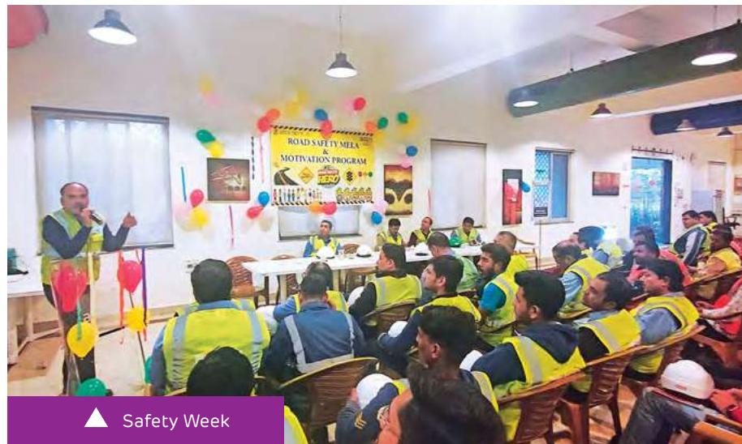

text_image

ROAD SAFETY MEALA
& MOTINATION PROGRAM
Safety Week

# SOCIAL: EMPLOYEES

# Nurturing a Thriving and Engaging Workplace

We recognise our workforce as the primary driver of sustainable growth. Their commitment, diligence, and collective expertise have shaped the organisational reputation we have cultivated over time. Therefore, fostering a robust, growth-oriented work culture is a central responsibility for us as an organisation. We ensure that our employees' motivation remains consistently high by offering ample opportunities for advancement. Furthermore, to uphold an inclusive work environment, we prioritise regular communication with both colleagues and the leadership team.

# Key Highlights

# 3,315

Total employees

# 13,044

Total workers

# 14%

New employees hired in FY 2023-24

# 118 hours/ employee

Average training time dedicated

# UN SDG Linkages

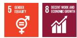

Workforce strength (Location-wise) 

<table><tr><td>Location</td><td>Workforce strength (Nos.)</td></tr><tr><td>Ahmedabad</td><td>484</td></tr><tr><td>Mundra</td><td>788</td></tr><tr><td>Tiroda</td><td>470</td></tr><tr><td>Kawai</td><td>256</td></tr><tr><td>Udupi</td><td>268</td></tr><tr><td>Raipur</td><td>233</td></tr><tr><td>Raigarh</td><td>207</td></tr><tr><td>Mahan</td><td>375</td></tr><tr><td>Godda</td><td>71</td></tr><tr><td>Other sites</td><td>163</td></tr></table>

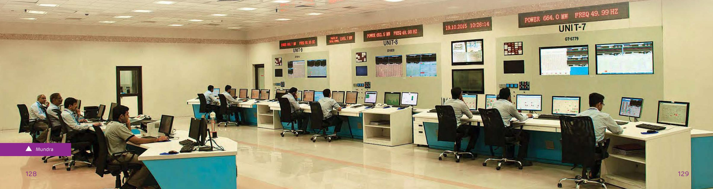

text_image

POWER 664.7 MW FREQ 50.00 HZ
UNIT-9
UNIT-8
UNIT-7
POWER 682.5 MW FREQ 49.98 HZ
19.10.2015 10:26:14
POWER 664.0 MW FREQ 49.99 HZ
UNIT-7
GT-6779
▲ Mundra
128
129

Mundra

# Human resource initiatives FY 2023-24

# Integrated Business and HR Strategy

# Alignment with Organisational Values

Our business strategy is intricately linked with our HR strategy, both reflecting the core values and principles of our organisation. We prioritise aligning our workforce with the Portfolio's vision and objectives, with business units taking direct responsibility for workforce planning, hiring, and retention initiatives. The HR team plays a pivotal role in reviewing and fine-tuning our strategic workforce plan to ensure alignment with business priorities and to address any deviations promptly.

# Holistic Employee Engagement

Central to our HR strategy is a comprehensive framework focused on engaging employees at all levels. This engagement strategy is informed by a deep understanding of employee needs across technical, functional, behavioural, and managerial domains, fostering their overall growth and development within the organisation. Our strategic approach includes rigorous talent acquisition practices and a commitment to talent retention through continuous support, performance recognition, and ample opportunities for advancement and rewards.

# Talent Management (Talent Acquisition and Retention)

Adani Power implemented a comprehensive talent acquisition strategy, attracting highly skilled professionals across various functions. Retention efforts included competitive compensation packages and career advancement opportunities, resulting in a significantly lower attrition rate.

We prioritise diligent hiring and diverse engagement strategies. We aim to increase female representation through fair hiring practices and targeted positions. Our inclusive recruitment processes include blind resume screening, objective interview questions, and integration of diversity. We have revised our approach, leveraging prominent job platforms to reduce turnaround time. We recruit from top engineering colleges, offering competitive salaries and extended training periods. Initiatives like the Adani Functional Leadership programme provide mentorship to young employees, complemented by leadership training programmes such as and Fulcrum, Takshashila and Northstar. We support new managers with dedicated programmes, ensuring a robust talent pipeline and a cohesive workforce.

# 501

Individuals hired

# 22

Individuals hired for Project Locations

# 112

Individuals hired for Operations & Maintenance

# 69

Individuals hired for Project Services

# 9%

Annual attrition rate

# 298

Hired as GETs / ETs / MTs

<table><tr><td>Trainee</td><td>298</td></tr><tr><td>Business Managers</td><td>1</td></tr><tr><td>Functional Managers</td><td>4</td></tr><tr><td>Managing Managers</td><td>34</td></tr><tr><td>Managing Others</td><td>100</td></tr><tr><td>Managing Self</td><td>62</td></tr><tr><td>Supervisors and below</td><td>2</td></tr></table>

# Employee Engagement

We foster an atmosphere promoting open engagement among employees and leadership. Operational plants, often in remote areas, receive support for township development, celebration of various festivals and month-long sports activities to enhance employee motivation and connectivity. Structured sessions, facilitated by the Company, allow employees to independently interact with senior leadership to express concerns or share solutions. These sessions occur frequently, either in person or virtually, depending on employee availability. Additionally, employees can report concerns to their appointed HR SPOC. An annual Gallup Employee Engagement Survey captures feedback, guiding focused planning to continually enhance engagement scores.

# Zero complaints

Received from the employees in FY 2023-24, reflecting our commitment to employee satisfaction and engagement

# Power Talk

Power Talk event stands as an annual highlight, offering employees a direct line of communication with our CEO. Held as the townhall, this interactive session serves as a platform for employees to voice concerns, celebrate

achievements, and offer valuable feedback. The event commences with a comprehensive overview of our business performance, providing employees with a detailed understanding of our current standing. Following insightful addresses from our COO and CEO, employees are encouraged to actively participate, asking questions, sharing perspectives, and contributing suggestions. This open exchange fosters a culture of transparency and collaboration, strengthening our bond as a unified team.

# E-Sampark

A platform designed to streamline communication between departments, enhancing productivity through collaborative learning and solution sharing. Monthly and quarterly town halls are conducted at various operational sites, enabling site managers and business heads to engage with employees, solicit feedback on business developments, and address concerns about current practices and the work environment.

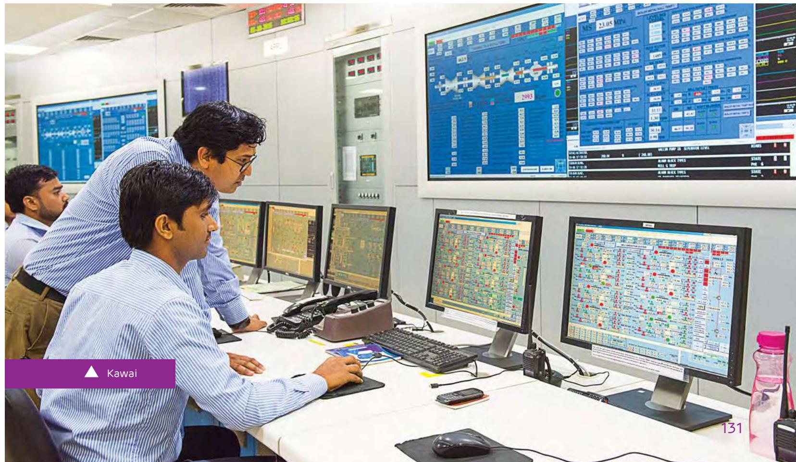

text_image

Kawai
131

# Learning and Development

Our commitment lies in creating an enriching work environment focused on individual growth for all employees and workers. Regular bi-annual and annual performance reviews form the basis of our training and development efforts, with a substantial investment of \` 4.34 crore allocated to this purpose in the reporting period.

Collaborating with reputable consultants, we conduct skill assessments and gather employee feedback to tailor personalised learning plans aligned with both individual aspirations and organisational goals.

Our training initiatives extend across digital platforms such as Percipio, e-vidyalaya, and the Adani Power Training and Research Institute (APTRI). These platforms offer flexible learning pathways and mobile accessibility, empowering

employees to pursue self-paced learning. Mandated trainings cover critical areas including prevention of sexual harassment (POSH), compliance, sustainability, and risk management, ensuring employees are well-versed in industry standards and best practices.

Moreover, we encourage experiential learning through peer shadowing and cross-functional team projects, fostering collaboration and knowledge exchange among employees of diverse backgrounds and expertise levels.

# Average of

12.07 man-days

Behavioural training provided

4.60 man-days

Technical training provided

16.67 man-days

Achieved for different activities

# Case Study

# Project Beacon

Project Beacon was initiated to integrate data analytics into our core operations at Adani Power, fostering a culture of continuous growth, innovation, and improvement. The aim was to optimise performance and unlock the potential of analytics and data modelling while enhancing productivity through AI/ML integration. The project began with a pilot implementation at Tiroda and Kawai TPP, followed by establishing an Analytics Centre of Excellence (ACoE), comprising a team of 44 individuals. The ACoEs have been established across all locations/TPPs.

The ACoE, consisting of 12 members, was tasked with driving long-term capability building in data analytics. An additional 36 ACoE experts underwent intensive 4-month training in advanced analytics, while 200 enthusiasts received basic training. From this group, 30 individuals were selected for further training, and 9 were chosen to become masters in the field, spearheading analytics proliferation across the plants. Over 1,500 hours of training were provided through online and offline mediums, complemented by bootcamps, hackathon events, and showcase sessions highlighting real-life analytics use cases.

# Performance Management

At Adani Power, we foster a performance-driven culture, emphasising employee nurturing and providing opportunities for outstanding results. We revamp our performance management system for fairness and transparency, aligning performance indicators with our Company goals. Performance conversations and feedback are central to building an environment of meritocracy and innovation.

# Succession Planning

We have implemented a robust succession planning process to identify and develop employees for key leadership positions. Successors undergo assessment and receive development interventions to ensure a ready pool of capable leaders. Adani Power prioritises talent management, utilising tools like gamification for talent

identification and enhancing process effectiveness through strengthened governance.

# Diversity, Equity, and

# Inclusion

We have made significant strides by promoting equal opportunities

for all employees and fostering an inclusive work environment. We have implemented policies to celebrate diversity and ensure fairness. Furthermore, we have identified positions specifically for women employees, reinforcing our commitment to diversity and inclusion.

Workforce strength (Age-wise) 

<table><tr><td>Age group (Years)</td><td>Workforce strength (Nos.)</td></tr><tr><td>22-25</td><td>354</td></tr><tr><td>26-30</td><td>210</td></tr><tr><td>31-35</td><td>529</td></tr><tr><td>36-40</td><td>861</td></tr><tr><td>41-45</td><td>588</td></tr><tr><td>46-50</td><td>378</td></tr><tr><td>51-55</td><td>260</td></tr><tr><td>56-60</td><td>104</td></tr><tr><td>61+</td><td>31</td></tr></table>

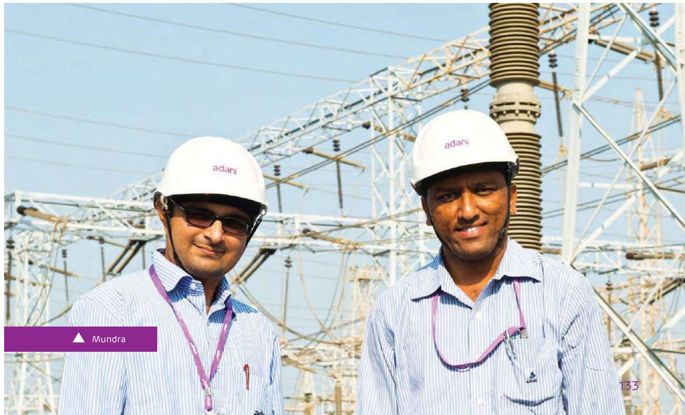

text_image

adani
Mundra
133

# Employee Well-being

Ensuring of our employees safety and well-being is not just a business obligation but our foremost priority. We equip all operational sites with necessary health standards and first-aid provisions, coupled with annual health check-ups and access to teleconsult specialists when needed. Virtual yoga sessions and wellness workshops are scheduled regularly, catering to the holistic well-being. Contractual employees receive timely health assessments and support during recovery from work-related injuries. Emphasising emotional and mental health, our Adani Care platform offers professional counselling services for employees and their families. Furthermore, we extend comprehensive health and accident insurance, retirement benefits, and parental benefits as mandated by regulations. Our dedication is evident in our 100% return-to-work and retention rate in the past year.

Parental Leave

100%

Return-to-work and retention rate achieved in FY 2023-24

<table><tr><td>Years</td><td>FY 2023-24</td><td>FY 2022-23</td><td>FY 2021-22</td><td>FY 2020-21</td></tr><tr><td>Parental Leave Entitlement</td><td>3,315</td><td>3,155</td><td>2,746</td><td>2,836</td></tr><tr><td>Employees Who Took Parental Leave</td><td>117</td><td>130</td><td>116</td><td>87</td></tr><tr><td>Employees Who Returned to Work After Parental Leave</td><td>117</td><td>130</td><td>116</td><td>87</td></tr></table>

# Human Rights

Upholding Human Rights at Adani Power is paramount. We strictly adhere to international Human Rights principles and ILO declarations, maintaining a zero-tolerance policy towards child labour, forced labour, harassment, or discrimination. Employees receive compensation above legal minimums, with a 4:1 entry-level wage ratio to local minimum wages for both genders. Dismissed employees receive a minimum two-week notice. While employees have association and bargaining rights, none are currently affiliated with unions.

We extend human rights expectations to all stakeholders, requiring ethical operation from vendors, suppliers, and partners. Suppliers must address identified concerns, with human rights criteria integral to onboarding via the 'ARIBA' portal. Child labour prevention measures are enforced, with 71% of the workforce completing human rights training, including 95% of security staff. Periodic assessments ensure compliance, with no reported breaches and disciplinary actions against violators as necessary.

# Way Forward

Our human resources department is committed to driving growth and fostering a positive work environment that aligns with Adani Power’s mission and values.

Below mentioned are some key focus areas undertaken for the future:

# Talent Acquisition and Retention

Retention of front & mid-level executives is a high priority. We will continue to attract, develop, and retain top talent in the thermal generation industry. Our recruitment strategy is data-driven, leveraging analytics to understand workforce trends. We intend to identify the competencies we need to succeed and hire the best-fit talent with learning agility to meet current and future business challenges.

# Employee Engagement and Retention

Acknowledging the flight risk of Graduate Engineer Trainees (GETs) after 2-3 years, we will implement a ringfencing strategy. This includes career development plans, mentorship programmes and competitive compensation packages to mitigate turnover.

# Role-Based Organisation and Delayering

Transitioning into a role-based organisation will ensure clear responsibilities and accountability, enhancing decision-making speed.

# Competency Assessment and Development

Regular competency assessments will identify gaps and provide targeted training. This includes roles such as Data Analyst, Data Platform Architect, Data Scientist, UI/UX Developer, and Specialist for Boiler Turbine.

# Inclusion of Young Talent

Committed to including young talent, we create opportunities for fresh graduates and young professionals to learn and grow within Adani Power organisation.

# SOCIAL: CORPORATE SOCIAL RESPONSIBILITY

# Empowering Society for Lasting Prosperity

We acknowledge the fact that empowered societies create prosperous nations. We collaborate with Adani Foundation with an aim to foster value and build bright future for the communities. In perfect alignment with The Adani Portfolio’s ‘Growth with Goodness’ philosophy, we remain steadfast in working towards equitable and sustainable development of the marginalised communities.

# Overview of Adani Foundation

Since 1996, the Adani Foundation, the community engagement arm of the Adani Group, has remained agile and deeply committed to making strategic social investments for sustainable outcomes across India. It is empowering and enriching the lives of children, women, youth, and marginalized communities in the core areas of education, health & nutrition, sustainable livelihood, community development, and climate action. The strategies of the Foundation are integrated in national priorities and global Sustainable Development Goals (SDGs). The Adani Foundation is currently operating in 6,769 villages across 19 states, positively impacting 9.1 million lives.

# Mission

To play the role of a facilitator for the benefit of the people without distinction of caste or community, sector, religion, class or creed, in the fields of education, community health, and promotion of social and economic welfare and upliftment of the people in general

# Vision

To accomplish a passionate commitment to social obligations towards communities, fostering sustainable and integrated development, thus improving quality of life

text_image

Street photo of a smiling boy holding a booklet and a sign with 'adani Foundation' and '135', surrounded by other children in the background.

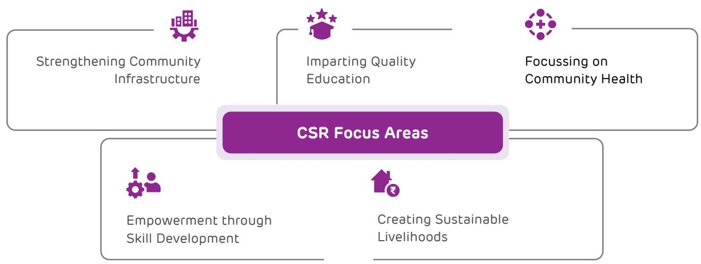

flowchart

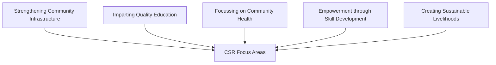
```mermaid
graph TD
    A["Strengthening Community Infrastructure"] --> B["CSR Focus Areas"]
    C["Imparting Quality Education"] --> B
    D["Focussing on Community Health"] --> B
    E["Empowerment through Skill Development"] --> B
    F["Creating Sustainable Livelihoods"] --> B
```

# CSR Highlights

# 2.3 million

Total CSR beneficiaries till March 31, 2024

# 44%

Women beneficiaries

# 19 states

Covered through CSR initiatives

# Adani Power’s CSR Commitments and Targets

# Education:

The Utthan Project aims to facilitate quality by enhancing learning outcomes, building teachers' capacity, and creating joyful spaces for sports, competitive coaching, and other activities in government schools. It benefits 28,700 students in Amchi Shala and 82,000 students in all government schools in the Gondia district of Maharashtra through the Adarsh Shala (Ideal School Competition).

# Health:

Mobile Health Care Units –

2,60,000 consultations

General and Specialty camps –

18,000 consultations

# Sustainable Livelihood:

3,000 women engaged in income

generation activities

8,200 dairy farmers in Farmers’

Producers Organisation (FPO)

# Community Development:

6,300 to benefit from government schemes

33,000 villagers to benefit from infrastructure development

# Climate Action

Pond deepening: 15 nos. at three locations; Plantation: 73,500

CSR and Growing Outreach   
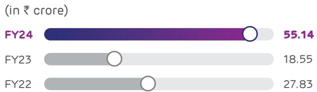

bar

(in ₹ crore)
| Year | Value (₹ crore) |
| :--- | :--- |
| FY24 | 55.14 |
| FY23 | 18.55 |
| FY22 | 27.83 |

SDGs Impacted   
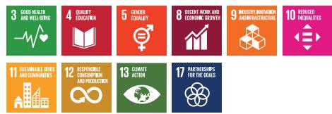

text_image

GOOD HEALTH AND WELL-LEARNING
4 QUALITY EDUCATION
5 GENDER EQUALITY
8 DEGREE WORK AND ECONOMIC GROWTH
9 INDUSTRY INNOVATION AND INFRASTRUCTURE
10 REDUCER INEQUALITIES
11 SUSTAINABLE CITIES AND COMMUNITIES
12 RESPONSIBLE CONSUMPTION AND PRODUCTION
13 CLIMATE ACTION
17 PARTNERSHIPS FOR THE GOALS

# Material Issues Impacted

Community development

# Capital Connected

# Alignment with Strategic Priorities

S2: Sustainability to support the low carbon ecosystem

# CSR Activities Undertaken by Adani Foundation in FY 2023-24

# Educational Initiatives

Adani Power through its CSR programmes aim to promote inclusive and accessible learning through the Adani Foundation. With strong focus on marginalised communities, the Adani Foundation’s education initiatives are designed to facilitate value-based inclusive and affordable learning through four free and several financially supported schools. Its ‘Utthan’ programme is designed to enhance the quality of education in government school by adopting them to convert them into model schools. The programme includes providing digital tools in classrooms for advanced & easy learning, supporting young minds to compete through coaching classes and evening classes. The Foundation also ensures exposure visits to Adani businesses through Project Udaan for experiential learnings and supporting deserving and meritorious students with scholarships to pursue higher education.

# Till date, Adani Foundation has reached

# 254 Government primary schools

# 50,000 children

# Delivered quality education through various educational activities

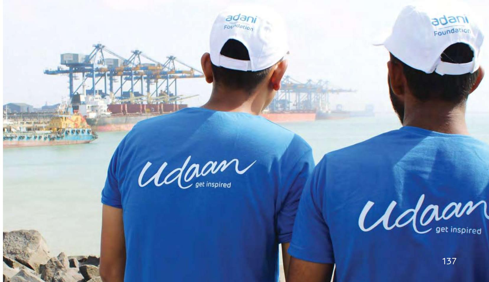

text_image

adani Foundation
udaaan
get inspired
udaaan
get inspired
137

# Three dedicated education programmes have been developed to reach these students:

# Utthan

The Adani Foundation started Utthan programme as part of its education thematic vertical in the year 2018–19. The flagship programme started with the aim to enhance learning capabilities of progressive learners in government schools. It progressively added features like providing facilities to schools to improve learning ambience through initiatives like BaLA paintings, providing digital tools in classrooms for advanced & easy learning, supporting young minds to compete through coaching classes and evening classes.

The programme is being implemented at the grassroots level and urban spaces (catering mainly to municipal schools) through Utthan Sahayaks (community volunteers). They are deployed on the ground to facilitate the day-to-day functions of the programme in schools. They are trained in identifying Priya Vidyarthis (progressive learners) and addressing their unique learning needs. Under Utthan, English has been introduced as a third language and other academic activities and extra- curriculum activities are also introduced with an aim to arrest the dropout rates. It also emphasizes the capacity building of teaching staff and Utthan Sahayaks. One of the interesting aspects of the programme is the involvement of parents (especially mothers) in the whole process of developing the academic skills of their children.

# Activities undertaken in Singrauli, Madhya Pradesh

MoU signed with District Education Officer to support

2,000+

students in

21

Government schools

# Activities undertaken in Godda, Jharkhand

Entrance exam coaching for class 6 students for the academic year 2024-25

has been initiated by Adani

Foundation with 8 Utthan Sahayaks, adequate infrastructure, and educational resources

# Capacity building of teachers

Within the Utthan project, we empower our teachers with the latest pedagogical insights and tools, ensuring they are well-equipped to inspire and guide our students toward academic excellence.

During the reporting period, we have planned

03 workshops where 100+ Government teachers

and Utthan Sahayaks were actively participated

# Adani Evening Education Centre

Under Project Utthan, we facilitate quality education through free coaching classes to students from marginalized backgrounds, help them improve their learning outcomes and prepare them for admissions into government schools like JNVs, Eklavya Model schools etc.

As part of Utthan, the Adani Foundation has introduced free Adani Evening Education Centre (AEEC) to support students from marginalized backgrounds towards helping them improve them learning outcomes. Through AEEC, the Foundation ensures that students can get supplementary classes without worrying about fee. Operating outside regular school hours, AEEC caters to pre-board level (class 9 and 10) students, ensuring that their regular school learning remains uninterrupted. The primary focus is to provide comprehensive preparation assistance to students who are preparing for their board exams.

# 75 students

Actively attended the AEEC classes at Karsuaraja School

# 700 students

Positively impacted

# 595 primary and middle schools

# 20,382 students and teachers schools

Involved in Aamchi Shala, Aadarsh Shala competition in Tiroda block during the reporting period

# Uplifting Saraswati Shishu Vidya Mandir

Our educational initiatives encompass the holistic advancement of the school and its learning fraternity. Adhering to this commitment, the Adani Foundation has been actively involved with Saraswati Sishu Vidya Mandir to enhance the quality of education delivered to its students. This involves staff development through

professional growth opportunities and oversight of both scholastic and co-scholastic activities, thereby contributing to the comprehensive development of the students

# Aamchi Shala, Aadarsh Shala

Our educational initiatives encompass the holistic advancement of the school and its learning fraternity. Adhering to this commitment, the Adani Foundation

has been actively involved with Saraswati Sishu Vidya Mandir to enhance the quality of education delivered to its students. This involves staff development through professional growth opportunities and oversight of both scholastic and co-scholastic activities, thereby contributing to the comprehensive development of the students

# Adani Competitive Coaching Centre - Kawai

Adani Competitive Coaching Centre (ACCC) aims to provide access to quality education to bright students belonging to rural areas. ACCC identifies meritorious children, strengthens their fundamentals, provides detailed guidance, and facilitates their enrolment in Government exams, leading to free quality education, focus is to provide comprehensive preparation for students preparing for their board exams.

# 2 coaching centres with

# 84 students

Attended Government schools in Kawai and Kharkhada Ramlothan during August 2023

# Sports Promotion

Recognising the importance of sports for the overall growth of an individual, the Adani Foundation actively engages in various districts and state-level sports tournaments.

# 792 beneficiaries

Support to District level Volleyball tournament (14, 17 & 19 year) at Govt. school Ratanpura Atru.

# 1,648 beneficiaries

Support to State level Girls Football tournament (17&19 year) at Mahatma Gandhi Govt. school Baran

# 7 girl players selected

Support to selected players from a Government school Mukandpura in a State level Kho-Kho tournament

# Selected 4 Girls in Kho-Kho, 1 Boy in Kabaddi

Support to selected players from Govt. school Aton in State level tournament

# 10 girl players selected

Support to selected players from Mahatma Gandhi Government school Atru in State level Kabaddi tournament

# Adani Competitive Coaching Centre - Godda

# Student Enrolment Campaign for Session 2024-25

The campaign facilitates educational support and motivates students to ensure their enrolment in coaching centres supported by the Adani Foundation. Under the student enrolment campaign for session 2024-25, core village households are visited to make the students aware of this facility and to motivate them to pursue their educational journey.

# 600+

Households visited in

# 8

Navodaya coaching centres

# 13

Core villages

# 89

Students are enrolled

# Gyan Jyoti Tuition Programme – Super 30

The Gyan Jyoti Tuition Programme-Super 30 operates at the Motia centre in the core area of the Godda power plant, providing high-quality education to children in pre-board classes. Students receive comprehensive educational support and guidance from Adani teachers, aimed at enhancing their academic performance and overall development.

# 55 students

30 students in class 9 and 25 students in class 10

Enrolled in Super 30 Coaching centre

# Gyanodaya

Adani Foundation’s educational initiative goes one step forward with the implementation of virtual classes under the programme Gyanodaya. It is an online video streaming virtual class developed for pre-board class students. The syllabus of the live class is based on the Jharkhand Board. Lectures, quiz, and analysis tests are uploaded to Gyanodaya's virtual video streaming channel.

Apart from facilitating virtual study materials, Gyanodaya engages in different activities for school development.

Equipment Delivery to New Gyanodaya Schools: A comprehensive set of Gyanodaya Smart Class devices has been distributed to 18 schools in Godda district

Handholding New Schools: The Gyanodaya team held handholding sessions at new schools in Jharkhand with the participation of block representatives, SMC members, Mukhiya, Ward Member, Headmaster, Teachers, Gyanodaya team members, guardians, and students

School Visits: Gyanodaya's team visited 215 schools in a Jharkhand district to ensure that all the equipment was safe and to monitor the smart classes

# Support to Education Institutions

# Kasturba Gandhi Balika Vidyalaya (KGBV):

KGBV is a Government-run residential secondary school for girls, aimed at addressing gender disparity among marginalised communities by providing accessible quality education. Boarding facilities are provided from the elementary level onwards, ensuring continuity in education. During the reporting period, the Adani Foundation supported students from the Godda region while enhancing the infrastructure of these schools.

# \~3,000

Students supported

# 5

KGBV schools are given infrastructure enhancements

# Gondia Education Society

Gondia Education Society was founded by great philanthropist, social worker and Gandhian Late Shri Manoharbhai Patel in the year 1958. In the ensuing six years, many more primary and secondary schools were set up one by one.

In a short span of ten years, by 1961 Gondia Education Society established 22 high schools spread across the district and in the same year, two more colleges were also established.

# Vidya Pratishthan

Vidya Pratishthan, Baramati (district Pune) offers quality education to the kith and kin of farmers, labourers, and villagers through a network of 17 Schools affiliated to various Boards that follow English or Marathi Medium of Education. The institution also includes 12 colleges offering higher education

across diverse streams, along with residential facilities in 13 hostels benefiting 4,053 students in Baramati & Indapur.

# Krushi Udyog Mool Shikshan Sanstha (KUMSS)

Established in 1951, KUMSS is an educational society which focuses on the overall development of students. The KUMSS caters to the education needs of students of different ages ranging from primary school, Secondary High school, Junior College and also imparts professional skill training through ITI.

# Community Healthcare Initiatives

Accessing healthcare remains a critical challenge for marginalised populations residing in rural areas. Adani Foundation is committed to addressing this issue by actively engaging with these communities and offering essential healthcare services. The foundation's primary objective is to reach the most vulnerable individuals at the grassroots level with accessible and affordable healthcare solutions. This involves deploying mobile healthcare units, operating wellness centres and rural clinics, organising health camps, and establishing and managing multi-specialty hospitals. These community engagement initiatives contribute significantly to fulfilling Adani Foundation’s core objective, making a positive impact on society.

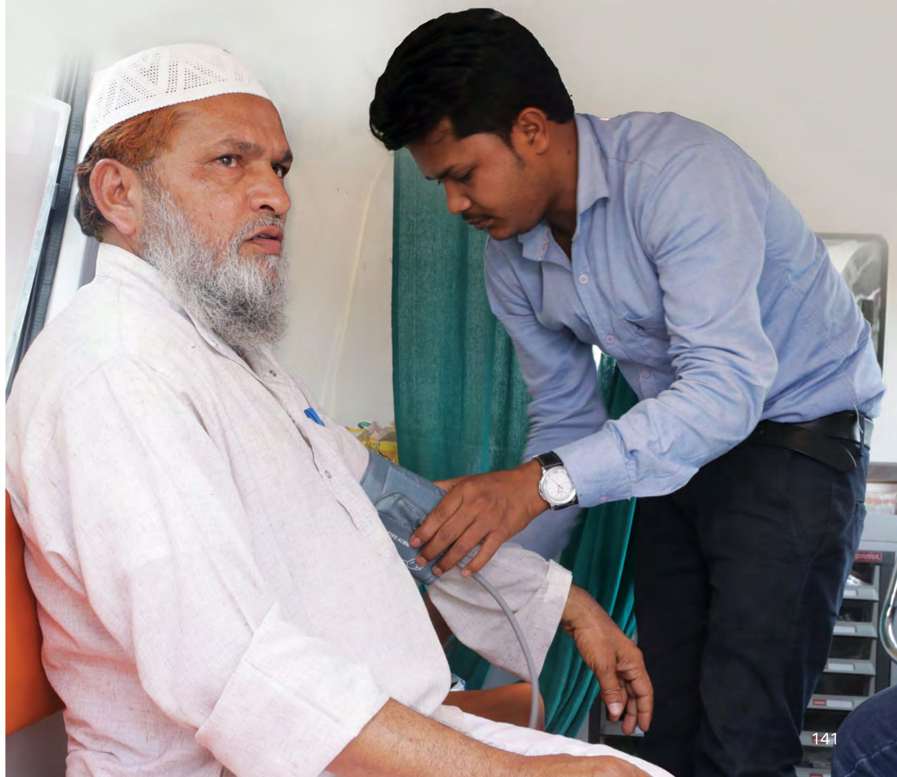

natural_image

A man measuring a patient's blood pressure in a clinical setting, with another person observing (no visible text or symbols)

# Deploying Mobile Healthcare Units (MHCU)

Reaching out to those in need is facilitated by deploying Mobile Health Care Units (MHCUs) in villages surrounding our operational sites. This initiative offers free medical consultations, medications, and home visits to bedridden or elderly patients. Additionally, it raises awareness about preventive measures for seasonal diseases. Focus is to provide comprehensive preparation for students preparing for their board exams.

# 1,52,224

Medical consultations are provided to the people in need in FY 2023-24

# 191

Villages provided MHCU services

Location-wise consultation details 

<table><tr><td>Location</td><td>Villages</td><td>Consultations</td></tr><tr><td>Kawai</td><td>28</td><td>25,492</td></tr><tr><td>Tiroda</td><td>25</td><td>27,332</td></tr><tr><td>Godda</td><td>94</td><td>45,978</td></tr><tr><td>Udupi</td><td>13</td><td>12,226</td></tr><tr><td>Raipur</td><td>16</td><td>26,466</td></tr><tr><td>Raigarh</td><td>16</td><td>14,730</td></tr></table>

# Sustainable Livelihood Development

There is no greater way to improve an individual's standard of living than by assisting them in achieving self-sustainability. Aligned with this ethos, Adani Foundation supports individuals by fostering pathways to wealth development and prosperity, building a sustainable livelihood ecosystem that harnesses both human potential and community resources for socio-economic advancement.

Initiatives undertaken during the reporting period are as follows:

# Livestock Development

Farmers rely heavily on their livestock for their livelihoods, and improved livestock production directly contributes to increased income and a better quality of life for them. The Pashudhan Vikas initiative has established four Integrated Livestock Development Centres (ILDCs) in Tiroda, Raipur, and Raigarh, focusing on breed improvement and cattle management services. The primary goal is to boost milk production through improved cattle breeds, proper feeding practices, and veterinary healthcare.

The following services are given under the livestock development initiative: 

<table><tr><td>Location</td><td>Details</td><td></td></tr><tr><td>Breed Improvement</td><td>ILDCs provide doorstep Artificial Insemination (AI) services that lead to genetically superior progeny with improved milk yield</td><td>2,562Als facilitated</td></tr><tr><td>Vaccination</td><td>Animals receive essential vaccinations to protect them from common diseases</td><td>1,600Animals given the required vaccination</td></tr></table>

# Location

# Deworming

# Details

Newborn crossbred calves and their mothers were administered deworming medicines, while non-descript cattle were encouraged to undergo deworming treatment

# 2,000

Cattle dewormed

# Fodder

# Development

Adani Foundation promotes napier grass cultivation to provide nutritious fodder, enhancing livestock's milk production capability and overall income levels

# 5-acre land

Developed for napier grass cultivation

# 786kg

Mineral mixture has been given to the farmers

natural_image

Woman in traditional red attire crouching in sandy soil, planting seedlings (no text or symbols visible)

# Benefits for the cattle farmers

Adani Foundation has developed a cooperative model of milk aggregation where a milk collection centre is established at the village level.

# 45

centres at Tiroda

# 6

centres at Kawai

1,968 at Tiroda

145 at Kawai

Farmers benefit from these centres

14,300 litres at Tiroda

540 litres at Kawai

Milk collected per day at these centres

\` 10.02 crore

\` 59 lakh

Respective earnings of cattle farmers in Tiroda and Kawai through selling milk

text_image

ADANI POWER LIMITED
Integrated Annual Report 2023-24

# Krushi Kaushal Fruit Plantation Programme

Krushi Kaushal – The Wadi Project, is one of the flagship CSR projects of Adani Power Rajasthan Limited. It is an integrated tribal development project implemented in Kawai, Baran district focused towards creating opportunities for gainful self-employment for the tribal families.

Through the project, small farmers having less than

5 acres of land are given 0.5-acre ‘wadi’ or ‘small orchard’ each for raising 60 fruit plants suitable to local conditions. As further assistance towards enhancing the livelihood of farmers, we have provided vegetable seeds to the farmers. This has increased income by approximately \` 12,000 to \` 15,000 for each family. In addition to this, farmers’ families have doorstep access to fresh and healthy organic vegetables.

The Wadi Project also fosters institution-building through the promotion of local women groups, income generation activities, and awareness of dairy-based livelihoods, reproductive health, and various developmental aspects, including livestock management, wadi development, vegetable cultivation, and vermicomposting.

# 22 villages

Covered under Wadi project

# 50+ families

Covered for developing wadis for various fruits

# Key takeaways of the project

Implementation begins with forming village-level groups comprising 25 women each across 14 villages, totalling 512 women members

Strengthening the process, a Farmers Producers Organisation (FPO) named "Hadoti Pragatisheel Producer Company Limited" was facilitated, comprising 305 women shareholders, focusing on dairy development   
The FPO collects over 540 litres of milk daily from 06 villages, enhancing local dairy production   
The Foundation conducts regular village-level meetings to educate farmers and cattle owners on best practices in agriculture and animal rearing   
- Capacity building includes providing exposure to dairy development and marketing strategies

# Skill Development of Youths

As part of the Employment Development Programme, the Adani Foundation, in partnership with Union Bank's RSETI (Rural Self-Employment & Training Institute), provided training in various self-employment activities.

# 35 women

Trained in tailoring

# 24 candidates

Trained in jute bag making, mushroom production, dhoop batti and artificial jewellery making

# Vruksh se Vikas

Deforestation contributes to climate change and is exacerbated by greenhouse gases from industrialisation and inadequate technology enforcement. This raises global temperatures and affects agriculture-dependent communities. The Conference of the Parties (COP) and World Economic Forums advocate actions like the 1 Trillion Trees Campaign, targeting a trillion trees by 2030. The Adani Portfolio has pledged to plant 100 million trees by 2030, with the Adani Foundation planning to execute Vruksh Se Vikas/Vruksh Se Samruddhi/ Vruksh For Vikas (V4V) project to support this goal. This initiative aligns with global efforts for environmental sustainability and highlights corporate responsibility in combating climate change.

# Objectives of the programme:

Increasing the green coverage by planting indigenous species, fostering environmental and economic benefits   
Encouraging cultivation of fruit-bearing trees to boost household incomes and nurture the environment

Establishing and maintaining a community leadership framework for conserving, restoring, and cultivating trees sustainably

# 42,261 plants across 6 locations

Planted in FY 2023-24

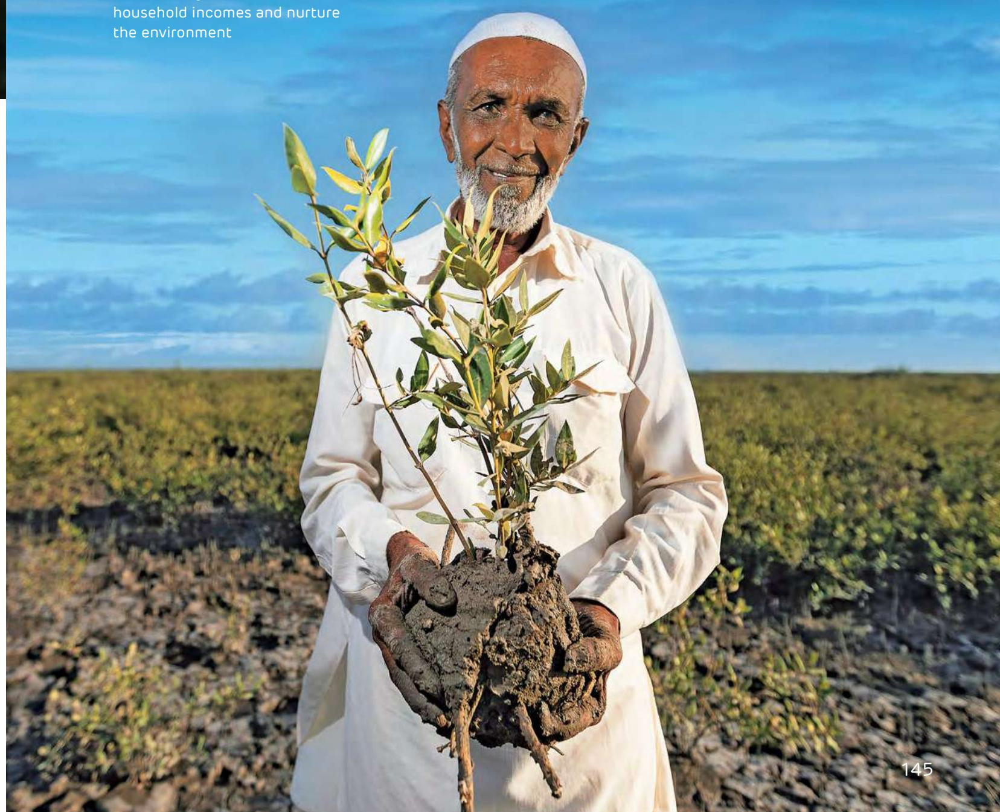

text_image

household incomes and nurture
the environment
145

# Income Generation Programme for Women Entrepreneurs

Adani Foundation fosters cottage industries to empower rural women in enhancing their annual household income. Collaborating with self-help groups across multiple locations, the Foundation actively supports women engaged in diverse entrepreneurial ventures including garment production, mushroom cultivation, crafting, canteen services, and more.

# 220 selfhelp groups

Engaged by Adani Foundation

# 2,035 women

Benefited from this programme in

4 locations viz, Tiroda, Singrauli, Raipur and Raigarh

# \` 44.24 lakhs

Revenue generated by the group

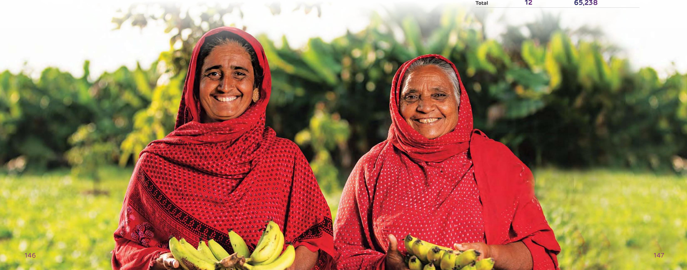

bar

| Category | Total |
|---|---|
| Bar 1 | 65,238 |
| Bar 2 | 147 |

# Community Infrastructure Development

Adani Foundation strategically invests in rural infrastructure to address immediate requirements and tackle long-term challenges such as water scarcity. Water conservation is prioritised within the Foundation's infrastructure projects. Initiatives include the construction of check dams, excavation of ponds, and installation of rooftop rainwater harvesting structures in households. The project aims to secure sufficient water supply for irrigation, drinking purposes, and cattle, with a long-term goal of enhancing the groundwater table to alleviate water scarcity issues in the region.

# 12 ponds

Excavated during FY 2023-24

# 65,238 cu.m.

Additional water-holding capacity created across 4 sites

Water Capacity across Locations 

<table><tr><td>Location</td><td>No. of structures</td><td>Additional water capacity created (cu.m.)</td></tr><tr><td>Tiroda</td><td>1</td><td>4,344</td></tr><tr><td>Singrauli</td><td>3</td><td>22,143</td></tr><tr><td>Raigarh</td><td>3</td><td>16,262</td></tr><tr><td>Raipur</td><td>5</td><td>22,489</td></tr><tr><td>Total</td><td>12</td><td>65,238</td></tr></table>

# SOCIAL: RESPONSIBLE SOURCING

# Fostering Resilience in Supply Chains

The value we generate from our endeavours extends beyond our immediate beneficiaries to include our supplier community. They are essential components of our business model, facilitating effective outreach in achieving organisational objectives. Our supply chain significantly influences our service delivery. Moreover, it extends beyond business functions, impacting our contribution to broader society, including environmental and community well-being. These factors collectively drive us to cultivate strong relationships with our supply chain partners. We are dedicated to upholding our responsibility to them, characterised by transparency, fair labour practices, environmental stewardship, and respect for human rights.

# Pillars of Our Supply Chain Management

# Supplier Code of Conduct

# Supplier Onboarding

# Responsible Sourcing

# UN SDG Linkages

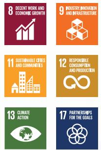

Our suppliers have played a pivotal role in our journey. Their unwavering commitment to quality, reliability and sustainability has been the cornerstone of our success. We are continuously refining vendor selection, management, and retention processes through dynamic initiatives. Embracing operational excellence, we leverage the latest digital platforms for efficient communication, enhancing supply chain agility and deployment of our goals related to sustainable sourcing. Our emphasis on long-term partnerships is rooted in transparent communication and creating a collaborative environment for mutual growth. Our mission is clear: to build lasting connections with suppliers, aligning with our overarching goal of shared value creation.

\- Kulpati Jha, Vice President - Techno Commercial

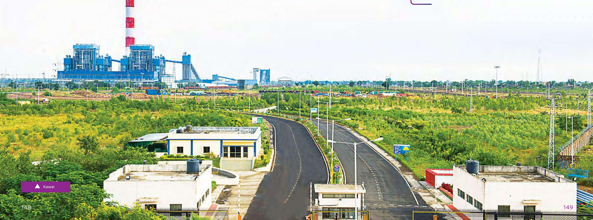

natural_image

Panoramic view of a power plant with a winding road, green fields, and industrial buildings in the background (no visible text or symbols)

Adani Power – Business Value Chain   
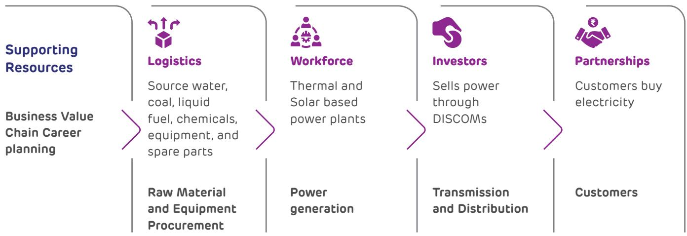

flowchart

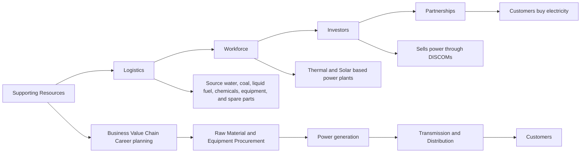
```mermaid
graph LR
    A["Supporting Resources"] --> B["Logistics"]
    B --> C["Workforce"]
    C --> D["Investors"]
    D --> E["Partnerships"]
    
    A --> F["Business Value Chain Career planning"]
    F --> G["Raw Material and Equipment Procurement"]
    
    B --> H["Source water, coal, liquid fuel, chemicals, equipment, and spare parts"]
    
    C --> I["Thermal and Solar based power plants"]
    
    D --> J["Sells power through DISCOMs"]
    
    E --> K["Customers buy electricity"]
    
    G --> L["Power generation"]
    
    L --> M["Transmission and Distribution"]
    
    M --> N["Customers"]
```

# Factors impacting the value chain

  
Environment and Climate

  
Socio-economic Factors

  
Community

  
Other Stakeholders

  
Government

# Supplier Code of Conduct

Our supplier code of conduct embodies ethical conduct and responsible business practices, addressing health and safety, environmental, and human rights considerations to prioritise equity and integrity in our supplier interactions. We advocate for

alignment with recognised

standards like SA 8000 (Social

Accountability), ISO 14001

(Environmental Management

Systems), and ISO 45001

(Occupational Health and Safety).

Upholding these standards not only protects our brand reputation but also nurtures trust among

stakeholders. Furthermore, we

integrate ESG (Environmental,

Social, and Governance)

parameters into our broader supply

chain management strategies,

underscoring our dedication to

sustainability as a fundamental

aspect of our business operations.

# Zero breaches of the Code of Conduct

Reported during the reporting period

# All the suppliers, service providers, vendors, traders, agents, consultants, contractors, and third-party members

Covered under the scope of the policy

# Supplier Onboarding

Our supplier onboarding process goes through a stringent assessment process that ensures the highest efficiency is maintained across the chain of value delivery. Vendor selection goes through knowledge sharing and regular interactions with our vendor base.

The process for onboarding a new supplier involves the following key steps:

# Identification

Potential suppliers are identified based on specific criteria and requirements tailored to our business needs.

# Pre-screening

Initial evaluation is conducted to assess basic eligibility and suitability, ensuring they align with our standards.

# Pre-qualification

Detailed assessment of pre-screened suppliers is performed to verify their capabilities, compliance with regulations, and alignment with our values and objectives.

# Approval

Suppliers who successfully pass the pre-qualification stage are then considered for approval and moved to the Master list for further evaluation and potential engagement.

Following the supplier qualification process, we proceed with vendor integration, where a unique code is generated for each approved vendor, and the Category Lead spearheads the contract drafting process. Simultaneously, we conduct comprehensive risk assessments and legal due diligence during vendor onboarding to ensure regulatory compliance and mitigate potential liabilities.

# 508 (100%)

New suppliers onboarded using environmental and social criteria in FY 2023-24

# 266

Suppliers were assessed during the reporting period to strengthen and improve our supplier relations

# Responsible Sourcing

Our concept of responsible sourcing highlights the importance of creating opportunities for local communities, thereby supporting regional economies, and mitigating environmental impacts. We go beyond mere compliance by actively organising capacity-building programmes for suppliers and service providers. Through active engagement, we aim to develop a stronger network

of suppliers capable of meeting our requirements and contributing to our sustainability goals. To achieve this, we collaborate closely with our local suppliers, providing them with the necessary competency and capability-building support. This commitment to ongoing education underscores a shared belief in collaborative growth and sustainable business practices within their value chains.

# 96.49%

Procurement spent on local suppliers

# GOVERNANCE

# Doing Business, the Ethical and Responsible Way

Our commitment to integrity and responsibility permeates decision-making processes, prioritising people, planet, and profit equally. We embed ethical practices across all levels, fostering trust, accountability, and transparency. By championing ethical governance, we fulfil obligations while paving the way for sustained growth and enduring partnerships, solidifying our commitment to responsible business practices.

# Corporate Governance Philosophy

Our corporate governance philosophy stands for three distinctive attributes – Courage, Trust, and Commitment. Together, this forms our guiding path to achieve greater excellence while positioning integrity at the core.

# Courage

We shall embrace new ideas and businesses

# Trust

We shall believe in our employees and other stakeholders

# Commitment

We shall stand by our promises and adhere to high standards of business

# Key Focus Areas

# ESG Governance

# Code of Conduct

# UN SDG Linkages

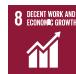

Decent Work and Economic Growth

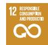

Responsible Consumption and Production

# Cyber Security and Data Privacy

# Anti-Corruption and Anti-Bribery

Peace, Justice, and Strong Institution

# Governance at Adani Power

Our robust governance model undertakes its responsibilities beyond just compliance and fostering an atmosphere that promotes collective success. Upholding such practices nurtures trust among stakeholders. Our approach encompasses research, innovation, and adherence to Environmental, Social, and Governance (ESG) principles. We prioritise best-in-class ethical standards and transparency, ensuring compliance with regulatory obligations. This framework instils stakeholder

confidence and underpins sustainable economic growth. Moreover, our business conduct aligns with social responsibilities outlined in ISO 26001, highlighting our commitment to ethical and responsible practices.

# Responsible Business Conduct and Ethical Practices

Responsible Business Conduct (RBC) and ethical practices are fundamental to Adani Power's operations. Our governance framework upholds integrity, fairness, and transparency, as

outlined in our Code of Conduct (CoC) and Anti-Corruption and Anti-Bribery policy. We ensure compliance through annual appraisals and mandatory CoC signings, fostering ethical behaviour among all stakeholders. Beyond regulatory requirements, we conduct rigorous risk assessments to address environmental, social, and regulatory risks, prioritising sustainability. Throughout the reporting period, we maintained compliance with laws and regulations, reinforcing our commitment to ethical business practices.

# Training for Board of Directors and KMPs

Our diverse Board members bring industry expertise to guide our strategies. We prioritise ongoing learning and development, providing tailored training covering ESG, leadership, POSH, sustainability, and inclusive growth, with 100% participation in two programmes during the reporting period.

# Anti-Corruption and Anti-Bribery Policy

The Anti-Corruption and Anti-Bribery Policy underscores our firm stance against unethical practices, ensuring compliance with laws refraining bribery, corruption, and fraud across all operations. Accessible via our internal portal and Company website, the policy is communicated to directors, employees, and third parties, reflecting our zero-tolerance approach. Furthermore, our

Whistleblower Policy provides oversight mechanisms for reporting unethical conduct, including fraud and violations of our Code of Conduct, ensuring transparency and accountability throughout the organisation.

Access to the audit committee chair is not restricted to anyone.

During the reporting period, we have not reported any instances of corruption, bribery, or anti-competitive behaviour.

# Our Policy Framework

Policy Name

ESG Policy

Stakeholders Groups

Employees, Business partners

Coverage

Expresses commitment to Environmental, Social, and Governance principles, leveraging portfolio companies for sustained and scalable impact.

<table><tr><td>Policy Name</td><td></td><td>Stakeholders Groups</td><td>Coverage</td></tr><tr><td>Environment Policy</td><td></td><td>Employees, Customers, Vendors, Local Communities, etc</td><td>Integrates best environmental practices across management and governance systems for minimising environmental impacts and attaining leadership in environmental stewardship.</td></tr><tr><td>Energy and Emission Policy</td><td></td><td>Employees, Customers, Vendors, Local Communities, etc</td><td>Focuses on sustainable energy consumption and resource conservation to reduce greenhouse emissions.</td></tr><tr><td>Resource Conservation Policy</td><td></td><td>Suppliers, Employees, Government, Community, Investors, Customers</td><td>Framework for demonstrating, evaluating, and improving procurement, manufacturing, and supply chain resource efficiency</td></tr><tr><td>Water Stewardship Policy</td><td></td><td>Suppliers, Employees, Government, Community, Investors, Customers</td><td>Prioritises protecting and conserving water resources through prudent water management practices and governance systems.</td></tr><tr><td>Land Policy</td><td></td><td>Employees, Customers, Vendors, Local Communities, etc</td><td>Strives to procure land with legal and social compliance, aiming for land with perfect marketable title for post-procurement security.</td></tr><tr><td>Diversity Equity and Inclusion Policy</td><td></td><td>Employees, Investors and Shareholders</td><td>Fosters diversity, equity, and inclusion, promoting diversity as a competitive advantage and equity and inclusion as essential human capital management model</td></tr><tr><td>Environment, Health &amp; Safety Policy</td><td></td><td>Employees, Suppliers, Communities</td><td>Commits to providing a safe and healthy work environment, preventing industrial injuries, occupational hazards, and environmental incidents.</td></tr><tr><td>Corporate Social Responsibility Policy</td><td></td><td>Communities</td><td>Highlights the Company&#x27;s commitment to social and environmental causes, maintaining high standards of corporate behaviour toward stakeholders.</td></tr><tr><td>Freedom of Association Policy</td><td></td><td>Employees</td><td>Respects employees&#x27; rights to freedom of association and collective bargaining without interference or discrimination.</td></tr><tr><td>Prevention of Sexual Harassment Policy</td><td></td><td>Employees</td><td>Fosters a workplace where all employees, especially women, are treated with dignity and respect, prohibiting unwelcome behaviour interpreted as sexual harassment.</td></tr></table>

<table><tr><td>Policy Name</td><td>Stakeholders Groups</td><td>Coverage</td></tr><tr><td>Stakeholder Engagement Policy</td><td></td><td>Creates value for stakeholders by aligning decision-making with their expectations and aspirations, encouraging healthy dialogue and strong relationships to deliver on objectives.</td></tr><tr><td>Supplier Code of Conduct</td><td></td><td>Promotes fair business practices, integrating respect for human rights, commercial ethics, and environmental protection into cooperation with suppliers.</td></tr><tr><td>Anti-Slavery Policy</td><td></td><td>Ensures organisation and supply chain are free from modern slavery or human trafficking, part of a larger effort for transparency, accountability, and safeguarding of human rights.</td></tr><tr><td>Employee Grievance Management</td><td></td><td>Handles employee complaints promptly and effectively, providing a platform to voice concerns and resolve them fairly.</td></tr><tr><td>Code of Conduct</td><td></td><td>Maintains commercial standards, ensures compliance with applicable standards, enhances Company&#x27;s image, and prevents wrongdoing in business activities.</td></tr><tr><td>Board Diversity</td><td></td><td>Recognises the value of directors from diverse backgrounds, promoting diverse perspectives and expertise for negotiation and operations.</td></tr><tr><td>Remuneration Policy</td><td></td><td>Attracts, retains, and motivates personnel with competitive pay, clear performance benchmarks, and balanced fixed and incentive pay.</td></tr><tr><td>Cyber Security and Data Privacy Policy</td><td></td><td>Recognises the importance of cyber security and data privacy for sustainable growth and business continuity, ensuring effective information systems and data resources management.</td></tr></table>

<table><tr><td>Policy Name</td><td>Stakeholders Groups</td><td>Coverage</td></tr><tr><td>Stakeholder Engagement Policy</td><td></td><td>Creates value for stakeholders by aligning decision-making with their expectations and aspirations, encouraging healthy dialogue and strong relationships to deliver on objectives.</td></tr><tr><td>Supplier Code of Conduct</td><td></td><td>Promotes fair business practices, integrating respect for human rights, commercial ethics, and environmental protection into cooperation with suppliers.</td></tr><tr><td>Anti-Slavery Policy</td><td></td><td>Ensures organisation and supply chain are free from modern slavery or human trafficking, part of a larger effort for transparency, accountability, and safeguarding of human rights.</td></tr><tr><td>Employee Grievance Management</td><td></td><td>Handles employee complaints promptly and effectively, providing a platform to voice concerns and resolve them fairly.</td></tr><tr><td>Code of Conduct</td><td></td><td>Maintains commercial standards, ensures compliance with applicable standards, enhances Company&#x27;s image, and prevents wrongdoing in business activities.</td></tr><tr><td>Board Diversity</td><td></td><td>Recognises the value of directors from diverse backgrounds, promoting diverse perspectives and expertise for negotiation and operations.</td></tr><tr><td>Remuneration Policy</td><td></td><td>Attracts, retains, and motivates personnel with competitive pay, clear performance benchmarks, and balanced fixed and incentive pay.</td></tr><tr><td>Cyber Security and Data Privacy Policy</td><td></td><td>Recognises the importance of cyber security and data privacy for sustainable growth and business continuity, ensuring effective information systems and data resources management.</td></tr></table>

<table><tr><td>Policy Name</td><td>Stakeholders Groups</td><td>Coverage</td></tr><tr><td>Whistleblower Policy</td><td></td><td>Provides framework for responsible and secure whistleblowing, protecting stakeholders reporting serious irregularities within the Company.</td></tr><tr><td>Anti-Corruption and Anti-Bribery Policy</td><td></td><td>Conducts business ethically and professionally, adopts a zero-tolerance approach to bribery and corruption, and implements effective systems to counter bribery.</td></tr><tr><td>Business Continuity Policy</td><td></td><td>Ensures sustained operation, protecting shareholders&#x27; value, achieving strategic goals, and ensuring business continuity during adverse situations.</td></tr><tr><td>Responsible Advocacy Policy</td><td></td><td>Engages authorities on sector matters, guided by commitment, integrity, transparency, and balanced stakeholder interests.</td></tr></table>

<table><tr><td>Policy Name</td><td>Stakeholders Groups</td><td>Coverage</td></tr><tr><td>Whistleblower Policy</td><td></td><td>Provides framework for responsible and secure whistleblowing, protecting stakeholders reporting serious irregularities within the Company.</td></tr><tr><td>Anti-Corruption and Anti-Bribery Policy</td><td></td><td>Conducts business ethically and professionally, adopts a zero-tolerance approach to bribery and corruption, and implements effective systems to counter bribery.</td></tr><tr><td>Business Continuity Policy</td><td></td><td>Ensures sustained operation, protecting shareholders&#x27; value, achieving strategic goals, and ensuring business continuity during adverse situations.</td></tr><tr><td>Responsible Advocacy Policy</td><td></td><td>Engages authorities on sector matters, guided by commitment, integrity, transparency, and balanced stakeholder interests.</td></tr></table>

We introduce numerous policies to uphold effective governance, ensuring adherence to the highest standards of ethical conduct, legal compliance, sustainability, data security, and employee well-being.

Please click the following link to review our policies in detail. https://www.adanipower.com/investors/corporate-governance

# Grievance Redressal

# Mechanism

Our grievance redressal mechanism, known as SPEAK UP, provides employees with a structured approach to address concerns transparently and systematically, covering issues such as salary errors, learning challenges, workplace treatment, and policy violations. The Grievance Redressal

Committee (GRC), led by the HR Head and composed of 20 representatives, serves as the initial point of contact for employees, aiming to resolve grievances within a 14-day timeline and reverting within 3 working days of complaint receipt. Any dissatisfied employee can appeal to the CEO or station head within 30 days of the GRC's decision, ensuring fair and

confidential resolution. Designated representatives (in most cases CSR Heads) at corporate locations are available to address community complaints, with no issues reported in the reporting period.

No harassment or discrimination cases were reported during FY 2023-24.

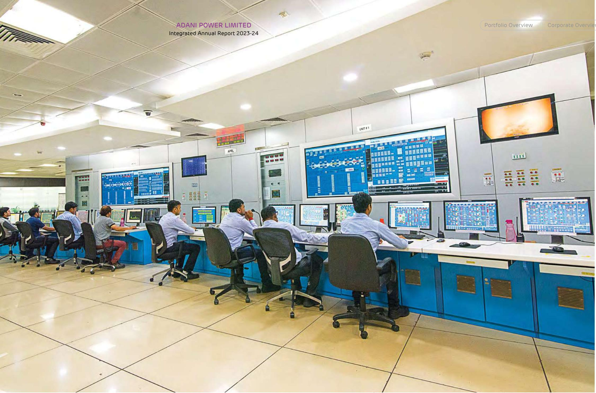

text_image

ADANI POWER LIMITED
Integrated Annual Report 2023-24
Portfolio Overview Corporate Overview

# Cyber Security and Data Privacy

In today's digital landscape, Cyber Security and Data Privacy are paramount for Adani Power to safeguard its operations and earn stakeholder trust. Maintaining high levels of data integrity, availability, and confidentiality is imperative for businesses heavily reliant on information technology. Escalating

cyber-attacks pose significant risks and incur substantial costs, underscoring the urgent need for robust security systems, especially in the Power sector. Despite the benefits of ICT devices in automation, they heighten vulnerability, necessitating stringent cyber security protocols. We diligently comply with Government and regulatory requirements

tailored for power sector entities, safeguarding stakeholders' interests. Heightening the security of the Company's digital architecture ensures uninterrupted operations and prevents data breaches, reinforcing our commitment to data security and privacy.

# Cybersecurity Framework

Adani Power adopts a risk-based approach, utilising the NIST Cyber Security framework and ISO-27001:2013 Standard to fortify its cybersecurity programme. We focus on sustaining our status as a technology leader, with an information and cyber security policy promoting a pervasive

cybersecurity culture. This policy not only covers information systems but also extends to the protection of industrial control systems, whether managed internally or by third-party operations. It is underpinned by cybersecurity rules aligned with our cybersecurity structure and is subject to annual review.

# Cybersecurity Implementation

Led by the Chief Information Security Officer (CISO), we have established a dedicated cybersecurity function reporting to senior management. The CISO directs the development and oversight of the cybersecurity programme, prioritising threat identification, analysis, and response. We continuously bolster the cyber defenses across people, processes, and technology, ensuring resilience against cyber threats and reinforcing stakeholder trust in the digital age.

# Governance Structure for Cyber Security Management

# Three Lines of Defence Model

We have implemented a "Three Lines of Defence" model to govern and oversee cyber risk management systematically. This approach ensures coordinated management with clear segregation of duties. Roles and responsibilities are well-defined within these lines of defence, enabling the Company to centralise cybersecurity governance under the Chief Information Security Officer (CISO).

# Lines of Defence Responsibilities:

First Line of Defence: Comprising functions like Control & Instrumentation (C&I),

Supervisory control and data acquisition (SCADA) operations, and Information Technology. This line identifies cyber risks within projects and operations. Line managers are accountable for managing cyber risks and adhering to security policies within their respective functions

Second Line of Defence: Managed by the Cybersecurity function, this line continuously monitors the design and operation of controls in the first line. It provides guidance, sets policies, and reports the cybersecurity programme's status to senior management

Third Line of Defence: Independent Assurance ensures oversight of both the first and second lines' efforts. This includes internal and external auditors who assure senior management regarding cybersecurity efforts

# Continuous Review and Oversight

Adani Power's "three lines of defence" model evolves continually to ensure robust protections and controls. Senior management regularly reviews cyber risks and programme performance. Additionally, the Company's focussed “Info Tech and Data Security committee” established by the Board of Directors, receives periodic reports from the CISO on the cybersecurity programme's status and performance. The committee also monitors emerging trends and incidents within the cyber domain, enhancing the Company's cyber resilience within the cyber domain.

# Dimensions of Cyber Security Strategy

# People Dimension

Adani Power integrates e-learning modules into employee onboarding to enhance awareness. Our policy includes ongoing education and training, with regular updates on cyber threats and frauds through email and digital channels.

# Process Dimension

We conduct detailed CIA ratings for enterprise-level applications, continuously assessing and monitoring IT infrastructure resilience. Periodic vulnerability analyses are conducted for infrastructure and associated applications.

# Technology Leadership

We implement detective and preventive controls, including network firewalls and multi-factor authentication. Secure remote access is provided while monitoring controls restrict removable media usage and inspect sensitive data transfers.

# Cybersecurity Projects Review

Digital projects undergo architecture reviews, embedding cybersecurity objectives and conducting early risk assessments to identify required controls.

# Constant Monitoring and Vigilance

Continuous control monitoring assesses security control adoption, supported by a dedicated cyber defence centre for ongoing security incident detection and response.

# Cultivating a Strong Cybersecurity Culture

# Training and Awareness Initiatives

At Adani Power, we embrace the ethos of "Forewarned is forearmed," driving our commitment to cultivating a robust cybersecurity culture. We ensure comprehensive training and awareness programmes across all organisational levels to mitigate cyber risks effectively.

# Mandatory Cybersecurity Awareness Course

Our mandatory cybersecurity awareness course equips employees with fundamental knowledge of information asset usage and best cybersecurity practices. The programme includes live training sessions and e-learning modules covering various aspects of cybersecurity. Specialised training is provided to employees involved in ICT infrastructure management.

# Routine Communication and Phishing Campaigns

To bolster awareness, routine emails highlighting instances of cyber-attacks and fraud are circulated to all employees. Additionally, periodic simulated phishing campaigns assess users' susceptibility to social engineering attacks. Individuals identified at risk receive targeted training to enhance their awareness and response to such threats.

# Effective Cybersecurity

# Processes at Adani Power

Aligned with industry best practices, we have established an ISO-27001:2013-compliant information security management

system. Cyber risk management integrates seamlessly into the Risk Management Framework. Top-level cybersecurity policies cascade into secondary policies addressing control domains. ISMS

policies undergo annual reviews for relevance. Regular audits verify that on-ground practices align with policy standards, ensuring robust cybersecurity protocols.

Our Technology Infrastructure 

<table><tr><td>Initiative</td><td>Details</td></tr><tr><td>Inventory and Control of Enterprise Assets</td><td>Manages enterprise information assets, including end-user devices, network devices, servers, and cloud environments</td></tr><tr><td>Inventory and Control of Software Assets</td><td>Manages operating systems and applications to ensure only authorised software is installed and executed</td></tr><tr><td>Data Protection</td><td>Identifies and protects business-sensitive data during rest and transit; utilises endpoint encryption and monitors data transfers</td></tr><tr><td>Secure Configuration of Assets &amp; Software</td><td>Maintains secure configurations of assets and software to avoid misconfigurations and reduce attack surface</td></tr><tr><td>Identity and Access Management</td><td>Manages user identity lifecycles, implements multi-factor authentication, secures privileged accounts, and follows least privilege</td></tr><tr><td>Network Segmentation</td><td>Segments enterprise networks into logical zones, enabling granular traffic control, security policy enforcement, and asset isolation</td></tr><tr><td>Continuous Technical Vulnerability Management</td><td>Implements comprehensive vulnerability management to assess and track vulnerabilities continuously</td></tr><tr><td>Audit Log Management</td><td>Collects and retains audit logs of computer systems and network devices for attack detection, understanding, and recovery</td></tr><tr><td>Email and Internet Access Protections</td><td>Deploys email security solutions for phishing and spam detection; inspects internet access traffic for anomalous or malicious activity</td></tr><tr><td>Malware Defence</td><td>Implements security controls across various levels (Endpoints, Email gateway, Secure web gateway, etc.) to prevent the installation, spread, and execution of malicious applications, code, or scripts</td></tr><tr><td>Application Software Security</td><td>Security assessments are carried out to proactively identify and address security weaknesses in applications, preventing potential impacts on the enterprise</td></tr></table>

# Monitoring and Assurance

We have implemented robust monitoring and assurance measures to strengthen our cybersecurity framework. We utilise continuous control monitoring to assess the effectiveness of security controls, supported by a dedicated Security Operations Centre (SOC) that operates around the clock to detect and respond to security incidents promptly. To bolster our defences, we conduct third-party audits of our ICT landscape through CERT-IN empanelled auditors, ensuring an independent assessment of our cybersecurity posture. Moreover, we actively engage in collaborations with major vendors, sectoral CERTs, and consultancy firms to share threat intelligence and participate in industry initiatives, enhancing our proactive cybersecurity management.

# Incident Response and Business Continuity Framework

In tandem with our incident response capabilities, we have implemented a robust business continuity framework. The SOC serves as the central reporting hub for cybersecurity incidents, with standardised playbooks and a Cyber Crisis Management Plan (CCMP) is in place to manage incidents effectively. Additionally, we have established a Business Continuity Management System (BCMS) compliant with ISO-22301:2019 standards to mitigate risks that could disrupt business operations. Notably, our diligent efforts have yielded commendable outcomes, as

Adani Power reported no business impact from cyber incidents or security breaches during the review period, underscoring our commitment to maintaining a resilient cybersecurity framework.

# Customer Data Protection

Recognising the sensitivity of our customers' personal information, we mandate consent for any collection, processing, or use of the same. We prioritise transparent education on data use to safeguard such information.

No customer privacy breaches were reported during the reporting period.

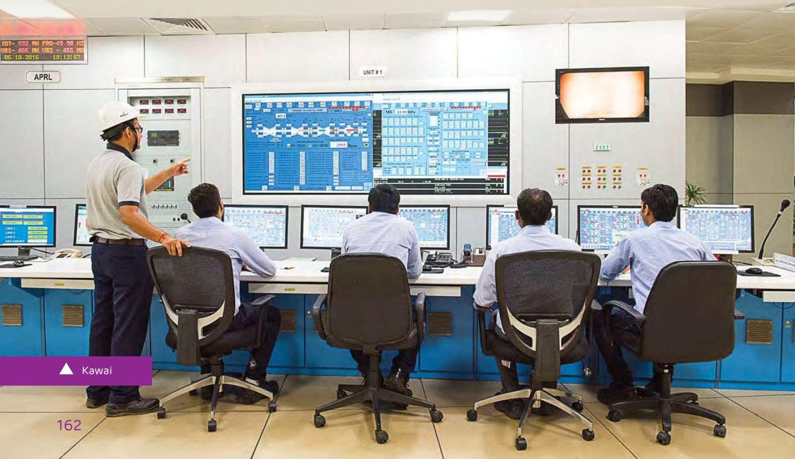

text_image

TOT- 932 KM FRO-49.99 17
06.10.2015 18:13:57
APRL
UNIT # 1
MS 23.10 MPa
▲ Kawai
162

# GOVERNANCE: BOARD OF DIRECTORS

# Leadership Anchored in Good Governance

# Board of Directors

Our Board serves as the decision-making authority of the Company, ensuring strategic alignment and organisational effectiveness. With a focus on the Company's vision, they prioritise long-term value creation and excellence across all domains. Responsible for approving industrial, financial, and strategic plans, as well as budget allocations, the directors uphold rigorous controls to ensure proper management and alignment with strategic objectives and stakeholder expectations. Under their guidance, the Board steers the Company toward its goals, fostering resilience and innovation while maintaining accountability and transparency throughout its operations.

# Board Composition

Our Board focuses on fostering trust and maintaining ethical standards. It assembles a diverse set of skills, knowledge, and experience crucial for decision-making. The Board has Executive, Non-Executive, and Independent Directors, ensuring representation of stakeholder interests, especially shareholders. The Board guides the CEO in executing organisational responsibilities and preventing conflicts of interest. Independent Directors adhere meticulously to regulatory mandates like the Companies Act, 2013, and the SEBI Listing Regulations, affirming commitment to prescribed criteria, promoting accountability and transparency. As stewards of governance, the board showcases dedication to ethical conduct and stakeholder confidence.

As on May 1, 2024, the Board consists of Six (6) Directors as follows 

<table><tr><td>S. No.</td><td>Category</td><td>Name of Director</td><td>% of Total Board size</td></tr><tr><td rowspan="2">1</td><td rowspan="2">Non-Executive Promoter Directors</td><td>Mr Gautam S. Adani, Chairman</td><td rowspan="2">33.3%</td></tr><tr><td>Mr Rajesh S. Adani</td></tr><tr><td>2</td><td>Executive Director</td><td>Mr Anil Sardana, MD</td><td>16.7%</td></tr><tr><td rowspan="3">3</td><td rowspan="3">Non-Executive Independent Directors</td><td>Mr Sushil Kumar Roongta</td><td rowspan="3">50.0%</td></tr><tr><td>Mrs Chandra Iyengar</td></tr><tr><td>Mrs Sangeeta Singh</td></tr></table>

# 83.3%

Non-executive Directors on the Board

# 50%

Board members comprising Independent Directors

# 56-75 Years

Board age profile

# >20 Years

Board experience

# Board Diversity

The distinctiveness brought by our Board helps maintain the highest level of diversity in the leadership team, fostering varied perspectives that nurture a culture of excellence within the organisation. This diversity ensures effective decision-making to achieve organisational goals, fostering a boardroom with a balanced blend of skills, experiences, and educational backgrounds across diverse demographics, irrespective of age, gender, or ethnic origin.

Our Board Diversity Policy, formulated by the Nomination and Remuneration Committee ("NRC") in line with

SEBI Listing Regulations ensures that the Board comprises executives, non-executive directors, including independent directors, from diverse backgrounds. This policy promotes diverse thinking to meet strategic goals, underscores our commitment against discrimination, and undergoes periodic review by the NRC.

The Board and its committees undergo formal performance evaluations annually, managed by the Nomination and Remuneration Committee. Independent Directors assess the Chairman, Non-Independent Directors, and the Board, focusing on aspects like composition, experience, meeting contributions,

independent judgement, and governance. The Board's average tenure is 6 years, except for promoter directors, The Board includes two women directors (Mrs Sangeeta Singh became director with effect from May 1, 2024), constituting 33.33% of the Board seats, reflecting a commitment to diversity and effective governance.

# Remuneration of the Board

Our NRC, established in alignment with SEBI Listing Regulations, comprises three independent and non-executive directors. Tasked with overseeing the compensation of Board members and key management personnel, the committee decides on their appointments and remuneration. Executive Directors' compensation is intricately tied to performance, industry standards, and level of responsibility, incorporating salary, variable, and fixed components. Unlike Non-Executive Directors, Executive Directors are not paid sitting fees for attending Board Meetings.

Since April 1, 2023, following changes have occurred in the Board:

Mr Mukesh Shah ceased to be an independent director of the Company with effect from the close of business hours on March 30, 2024.

Mrs Sangeeta Singh has been appointed as an additional director (non-executive and independent director) with effect from May 1, 2024   
Non-Executive Independent directors receive compensation in the form of sitting fees as follows:   
\` 50,000 per meeting for attending Board and Audit Committee meetings   
\` 25,000 per meeting for attending meetings of the other Board Committees

# CEO Compensation

Our CEO compensation is determined by financial and non-financial KPIs, including operational factors. As the highest-paid employee, the CEO's annual compensation ratio is 44.59:1 compared to the average employee salary.

# Growth in the Compensation for FY 2023-24 as follows:

8.04%

Employees

9.0%

KMPs

8.10%

Employees (including KMPs)

# Committees to the Board of Directors

To enhance corporate governance effectiveness, the Board has established statutory and non-statutory committees to track performance across various business functions, with formally approved roles and accessible meeting minutes for Board review.

As of March 31, 2024, the Board has the following Committees:

<table><tr><td>Name of the Committee</td><td>Description</td></tr><tr><td>Audit Committee</td><td>Comprising independent directors, it oversees financial reporting, internal controls, and compliance, ensuring transparency, accuracy, and integrity in financial statements.</td></tr><tr><td>Stakeholders Relationship Committee</td><td>Focused on building strong stakeholder relationships, it ensures effective communication, addresses concerns, and integrates stakeholder feedback into decision-making processes.</td></tr><tr><td>Nomination and Remuneration Committee</td><td>Responsible for Board composition, director selection, and governance policies, it oversees compensation alignment with Company performance and industry benchmarks.</td></tr><tr><td>Risk Management Committee</td><td>Tasked with identifying, assessing, and mitigating risks, it develops strategies, establishes policies, and monitors risk exposure to safeguard Company objectives and operations.</td></tr><tr><td>Corporate Social Responsibility Committee</td><td>Formulating and overseeing the Company&#x27;s CSR Policy, it ensures the implementation and reviews the Company&#x27;s CSR performance.</td></tr></table>

<table><tr><td>Name of the Committee</td><td>Description</td></tr><tr><td>Corporate Responsibility</td><td>Guides the Company on corporate and social obligations, aligning actions with United Nations Sustainable Development Goals, and setting climate-related goals and targets as a responsible corporate citizen.</td></tr><tr><td>Information Technology &amp; Data Security</td><td>Oversees IT infrastructure, systems, and data management practices, ensuring security, integrity, and effective utilisation of technology and data assets, while addressing emerging IT risks and opportunities for innovation and operational excellence.</td></tr><tr><td>Mergers &amp; Acquisitions (Subcommittee of RMC)</td><td>Evaluates potential mergers, acquisitions, and strategic partnerships, conducting due diligence, assessing financial and operational risks, and making recommendations regarding potential transactions.</td></tr><tr><td>Legal, Regulatory &amp; Tax (Subcommittee of RMC)</td><td>Monitors compliance with laws, regulations, and tax requirements, providing guidance on legal and regulatory matters, overseeing risk mitigation strategies, and ensuring operations align with legal and tax obligations.</td></tr><tr><td>Reputation Risk (Sub-committee of RMC)</td><td>Focuses on safeguarding and enhancing the Company&#x27;s reputation, assessing potential risks to the brand, developing strategies to manage reputation-related challenges, and monitoring external factors impacting the Company&#x27;s market standing.</td></tr><tr><td>Commodity Price Risk (Subcommittee of RMC)</td><td>Manages and mitigates risks associated with commodity price fluctuations, monitoring market trends, assessing potential price risk, and implementing strategies to hedge or manage commodity price exposure, such as fuel or raw material costs.</td></tr></table>

# Our Esteemed Board

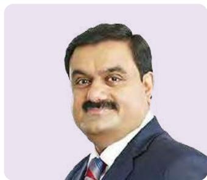

natural_image

Portrait of a man in formal attire with a mustache, against a plain background (no text or symbols visible)

# Mr Gautam S. Adani

Chairman, Non-Executive - Non-Independent Promoter Director

Mr Gautam Adani, aged 61 years, is the Chairman and Founder of the Adani Portfolio with more than 33 years of business experience. Under his leadership, Adani Portfolio has emerged as a global integrated infrastructure player with interest across Resources, Logistics and Energy verticals. Mr Adani’s success story is extraordinary in many ways. His journey has been marked by his ambitious and entrepreneurial vision, coupled with great vigour and hard work. This has not only enabled the Group to achieve

numerous milestones but also resulted in creation of a robust business model which is contributing towards building sound infrastructure in India.

# Skills and Expertise

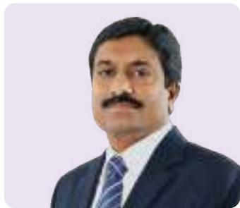

natural_image

Portrait of a man in formal attire with mustache (no text or symbols visible)

# Mr Rajesh Adani

Non-Executive - Non-Independent Director Committees

Mr Rajesh Adani, aged 59 years, has been an integral part of the Adani Group since its inception, overseeing the Group's operations and fostering key business relationships. With a proactive and personalised approach, he has infused a competitive spirit that has significantly contributed to the Group's growth across its various businesses. His steadfast dedication and strategic initiatives have

played a pivotal role in shaping the Group's trajectory and reinforcing its position in the industry.

# Skills and Expertise

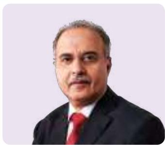

natural_image

Portrait of a man in formal suit and red tie against a plain background (no text or symbols visible)

Mr Anil Kumar Sardana Managing, Executive Director

Mr Anil Kumar Sardana, aged 64 years comes with over 3 decades of experience in the power and infrastructure sector. He started his career with NTPC and subsequently worked with BSES and Tata Group companies in the power and Infra sector, ranging from generation, power systems design, power distribution, Telecom, and project management. Before joining the Adani Group, he was the MD & CEO of Tata Power Group based out of Mumbai. Mr Sardana is an honours

graduate in Electrical Engineering from Delhi University (1980), a Cost Accountant (ICWAI) and holds a PGDM from All India Management Association. He has undergone management training from reputed institutes like IIM – A and “Specialised Residual Life Assessment course for Assets” at EPRI – USA.

# Skills and Expertise

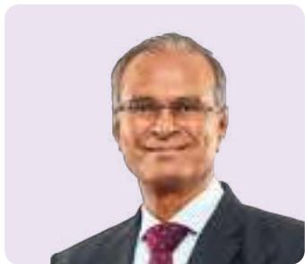

natural_image

Portrait of a man in formal attire with glasses (no visible text or symbols)

Mr Mukesh Mahendrabhai Shah\*

Non Executive-Independent Director

Mr Mukesh M. Shah, aged 71 years, Chartered Accountant, M. Com. LL.B., FCA, Founder of the firm Mukesh M. Shah & Co. and Managing Partner, with more than 30 years’ experience, under his leadership the firm has grown from proprietorship in 1978 to over 75 people operating out of 3 locations in India at present. He has commendable knowledge in diversified fields of Audit & Assurance, Tax & Regulatory matters, Transactions advisory services, Due Diligence, Corporate Restructuring including Mergers, De-mergers, Valuations, Acquisition and Sale, Project Finance, FEMA & Regulatory

matters. He is Managing Trustee of leading educational institute running 5 colleges imparting education to more than 6,500 students in the city of Ahmedabad. He had been committee member of Chartered Accountants Association, Ahmedabad and ITAT Bar Association, Ahmedabad. He is on the Board of Directors of some companies as an independent director offering valuable guidance on the company's policies and good corporate governance.

# Skills and Expertise

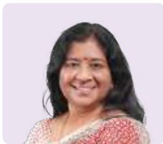

natural_image

Portrait of a smiling woman with long dark hair, wearing a patterned top (no text or symbols visible)

Mrs Chandra Iyengar Non-Executive - Independent Director

Mrs Chandra Iyengar, aged 73 years, holds a degree in MA from Miranda House, New Delhi and is an officer of the 1973 batch of the Indian Administrative Services (IAS). Over the course of her career, she has led several departments in the Government of Maharashtra and the Government of India, such as Women & Child Development, Higher & Technical Education, Rural Development, and Health. As the Secretary for Women & Child Development for the Government of Maharashtra, she was responsible for drafting and implementing

the first-ever state policy for women’s empowerment in India. She has served as Additional Chief Secretary – Home Ministry for the Government of Maharashtra and as a Director on the Board of Bharat Heavy Electricals Limited (BHEL) as a Chairperson for the Maharashtra Energy Regulatory Commission (MERC).

# Skills and Expertise

\*Mr Mukesh Mahendrabhai Shah has completed his second and final term/tenure as an Independent Director and consequently ceased to be a Director of the Company with effect from the close of business hours on March 30, 2024.

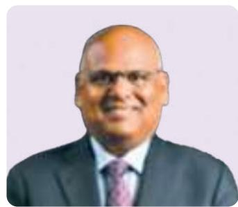

natural_image

Portrait of a bald man wearing glasses and a suit (no text or symbols visible)

Mr Sushil Kumar Roongta

Non-Executive - Independent Director

Mr Sushil Kumar Roongta, aged 73 years, is an Electrical Engineer from Birla Institute of Technology & Science (BITS), Pilani and a Post Graduate Diploma in Business Management - International Trade, from the Indian Institute of Foreign Trade (IIFT), New Delhi. He is a Fellow of All India Management Association (AIMA). Mr Roongta has a wide and varied experience in public sector undertakings.

Mr Roongta is the former Chairman of Steel Authority of India Limited (SAIL), one of India’s largest public sector company. He was also the first Chairman of International Coal Ventures Limited (ICVL) – a JV of five leading PSUs i.e. SAIL, CIL, RINL, NMDC & NTPC.

Mr Roongta has also served as a member of various Apex Chambers - Chairman of ‘Steel Committee’ of FICCI, member of National Council of CII and Advisory Council of ASSOCHAM. Mr Roongta was also President of Institute for Steel Development & Growth. He was also a member of the Executive Committee of

the World Steel Association - the Apex Body for formulation of policy for world steel. He was chairman of Board of Governors of IIT-Bhubaneswar.

He has been part of various think tanks and is widely regarded as one of the principal experts in the field of metal, power and public sector turnarounds. He was Chairman of ‘Panel of Experts on reforms in Central Public sector enterprises’ constituted by Planning Commission, widely known as ‘Roongta Committee’, its report is taken as benchmark for public sector Reforms today.

Mr Roongta is the proud recipient of several awards including [Standing conference of public enterprises | SCOPE Award for Excellence & Outstanding Contribution to the Public Sector Management] – Individual Category 2007-08 and IIM-JRD Tata award for excellence in Corporate Leadership in Metallurgical industries, 2016. Mr Roongta is also associated with educational institutions and various Non-Profit organisations.

# Skills and Expertise

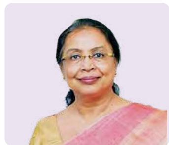

natural_image

Portrait of a woman wearing glasses and a pink patterned garment (no text or symbols visible)

Mrs Sangeeta Singh

Independent and Non-Executive Director

Mrs Sangeeta Singh holds the degree of M.Sc. (Public Economics) from University of Birmingham (UK), M. Phil. (International Relations) from Jawaharlal Nehru University (New Delhi) and M.A. (Political Science) from Jawaharlal Nehru University (New Delhi). She has worked in various capacities as Member of Central Board of Direct Taxes (CBDT), Principal Chief Commissioner of Income Tax amongst

others. As a Member of CBDT, she has led the administering and implementing of Income Tax Act and Rules both for department and taxpayers and was incharge of national level revenue collection by the Department.

# Committee

N&R Nomination & Remuneration Committee   
AU Audit Committee   
SR Stakeholders’ Relationship Committee   
CSR Corporate Social Responsibility Committee   
RM Risk Management Committee   
CR Corporate Responsibility Committee   
IT&DS Information Technology & Data Security Committee   
M&A Mergers & Acquisitions Committee   
LR&T Legal, Regulatory & Tax Committee   
RR Reputation Risk Committee   
CPR Commodity Price Risk Committee

Chairman / Chairperson Member

# Skills and Expertise

Risk Management   
  
Financial   
  
Technology & Innovation   
  
Information Security   
9

# Corporate Information

# Board of Directors

Mr. Gautam S. Adani

Chairman (Non-Executive)

Mr. Rajesh S. Adani

Director (Non-Executive)

Mr. Anil Sardana

Managing Director

Mr. Sushil Kumar Roongta

Independent Director

Ms. Chandra Iyengar

Independent Director

Mr. Mukesh Shah

Independent Director (upto March 30, 2024)

Mrs. Sangeeta Singh

Independent Director

(w.e.f. May 01, 2024)

# Chief Executive Officer

Mr. S. B. Khyalia

# Chief Financial Officer

Mr. Shailesh Sawa

(upto March 31, 2024)

Mr. Dilip Kumar Jha

(w.e.f. April 01, 2024)

# Company Secretary

Mr. Deepak S. Pandya

# Statutory Auditors

M/s. S R B C & Co LLP

Chartered Accountants,

Ahmedabad

# Secretarial Auditors

M/s. Chirag Shah & Associates

Ahmedabad

# Cost Auditors

M/s. Kiran J. Mehta &. Co.

Ahmedabad

# Registered Office

Adani Corporate House,

Shantigram, Near Vaishno Devi Circle,

S. G. Highway, Khodiyar,

Ahmedabad-382421 Gujarat

Website: www.adanipower.com

# Corporate Identification Number

L40100GJ1996PLC030533

# Committees (as on May 01, 2024)

# Audit Committee

Mrs. Sangeeta Singh, Chairperson

Mr. Sushil K. Roongta, Member

Mrs. Chandra Iyengar, Member

# Nomination and Remuneration Committee

Mr. Sushil K. Roongta, Chairman

Mrs. Sangeeta Singh, Member

Mrs. Chandra Iyengar, Member

# Stakeholders Relationship Committee

Mr. Sushil K. Roongta, Chairman

Mrs. Sangeeta Singh, Member

Mrs. Chandra Iyengar, Member

# Corporate Social Responsibility Committee

Mrs. Chandra Iyengar, Chairperson

Mr. Sushil K. Roongta, Member

Mr. Anil Sardana, Member

# Risk Management Committee

Mrs. Sangeeta Singh, Chairperson

Mr. Sushil K. Roongta, Member

Mr. Anil Sardana, Member

Mrs. Chandra Iyengar, Member

# Corporate Responsibility Committee

Mrs. Chandra Iyengar, Chairperson

Mrs. Sangeeta Singh, Member

Mr. Sushil K. Roongta, Member

# Information Technology & Data Security Committee

Mrs. Sangeeta Singh, Chairperson

Mr. Sushil K. Roongta, Member

Mr. Anil Sardana, Member

# Mergers & Acquisitions Committee

Mrs. Chandra Iyengar, Chairperson

Mr. Anil Sardana, Member

Mr. Sushil K. Roongta, Member

Mrs. Sangeeta Singh, Member

# Legal, Regulatory &

# Tax Committee

Mrs. Sangeeta Singh, Chairperson

Mr. Sushil K. Roongta, Member

Mrs. Chandra Iyengar, Member

# Reputation Risk Committee

Mr. Anil Sardana, Chairman

Mr. Sushil K. Roongta, Member

Mrs. Chandra Iyengar, Member

# Commodity Price Risk Committee

Mrs. Chandra Iyengar, Chairperson

Mr. Anil Sardana, Member

Mrs. Sangeeta Singh, Member

# Registrar and Transfer Agent

# KFin Technologies Ltd.

Address: Selenium Tower B,

Plot 31-32, Gachibowli, Financial

District Nanakramguda,

Serilingampally, Hyderabad – 500 032

Tel: +91-40-67161526

Fax: +1-40-23001153

E-mail: einward.ris@kfintech.com

Website: www.kfintech.com

# Bankers and Financial Institutions

Axis Bank Limited

Bank of Baroda

Bank of India

Canara Bank

DCB Bank Limited

ICICI Bank Limited

IDBI Bank Limited

India Infrastructure Finance

Company Limited

Indian Bank

Indian Overseas Bank

National Bank for Financing

Infrastructure and Development

Punjab & Sind Bank

Punjab National Bank

State Bank of India

UCO Bank

Union Bank of India

Yes Bank Limited

Power Finance Corporation Limited

REC Limited

# IMPORTANT COMMUNICATION TO SHAREHOLDERS

The Ministry of Corporate Affairs has taken a “Green Initiative in the Corporate Governance” by allowing paperless compliances by the Companies and has issued circulars stating that service of notice / documents including Annual Report can be sent by e-mail to its shareholders/members. To support this green initiative of the Government in full, the shareholders who have not registered their e-mail addresses, so far, are requested to register their e-mail addresses and in case of shareholders holding shares in demat, with depository through concerned Depository Participants.

# Directors’ Report

# Dear Shareholders,

Your Directors are pleased to present the 28th Annual Report along with the Audited Financial Statements of your Company for the financial year ended March 31, 2024 (“FY 2023-24/ FY24”).

# Financial Performance

The Audited Financial Statements of your Company as on March 31, 2024, are prepared in accordance with the relevant applicable Indian Accounting Standards (“Ind AS”) and the provisions of the Companies Act, 2013 (“Act”).

The summarized financial highlight is depicted below:

(\` in crore) 

<table><tr><td rowspan="2">Particulars</td><td colspan="2">Consolidated</td><td colspan="2">Standalone</td></tr><tr><td>2023-24</td><td>2022-23</td><td>2023-24</td><td>2022-23</td></tr><tr><td>Revenue from operations</td><td>50,351.25</td><td>38,773.30</td><td>39,204.57</td><td>36,681.21</td></tr><tr><td>Other Income (excluding foreign exchange gain)</td><td>9,780.86</td><td>4,267.22</td><td>10,074.49</td><td>4,519.98</td></tr><tr><td>Foreign Exchange Gain (net)</td><td>149.37</td><td>-</td><td>117.36</td><td>-</td></tr><tr><td>Total Income</td><td>60,281.48</td><td>43,040.52</td><td>49,396.42</td><td>41,201.19</td></tr><tr><td>Expenditure other than Depreciation, Finance cost and Foreign Exchange Loss (net)</td><td>32,170.55</td><td>28,613.97</td><td>25,384.21</td><td>27,337.43</td></tr><tr><td>Depreciation and Amortisation Expenses</td><td>3,931.33</td><td>3,303.68</td><td>3,175.72</td><td>3,142.79</td></tr><tr><td>Foreign Exchange Loss (net)</td><td>-</td><td>114.67</td><td>-</td><td>24.79</td></tr><tr><td>Finance Cost</td><td>3,388.09</td><td>3,333.50</td><td>2,465.90</td><td>3,306.80</td></tr><tr><td>- Interest and Bank Charges</td><td>3,426.59</td><td>3,475.53</td><td>2,461.51</td><td>3,448.83</td></tr><tr><td>- Derivative (Gain)/Loss (net)</td><td>(38.50)</td><td>(142.03)</td><td>4.39</td><td>(142.03)</td></tr><tr><td>Total Expenditure</td><td>39,489.97</td><td>35,365.82</td><td>31,025.83</td><td>33,811.81</td></tr><tr><td>Profit before tax</td><td>20,791.51</td><td>7,674.70</td><td>18,370.59</td><td>7,389.38</td></tr><tr><td>Tax Expense / (Credit)</td><td>(37.28)</td><td>(3,051.94)</td><td>(378.65)</td><td>(2,856.77)</td></tr><tr><td>Net Profit for the year</td><td>20,828.79</td><td>10,726.64</td><td>18,749.24</td><td>10,246.15</td></tr><tr><td>Other Comprehensive (loss) / income (net of tax)</td><td>(27.49)</td><td>33.74</td><td>6.87</td><td>(4.17)</td></tr><tr><td>Total Comprehensive Income for the year (net of tax)</td><td>20,801.30</td><td>10,760.38</td><td>18,756.11</td><td>10,241.98</td></tr><tr><td>Attributable to:</td><td></td><td></td><td></td><td></td></tr><tr><td>Equity holders of the parent</td><td>20,801.30</td><td>10,760.38</td><td>-</td><td>-</td></tr><tr><td>Non-controlling interests</td><td>*</td><td>*</td><td>-</td><td>-</td></tr></table>

(Figures below \` 50,000 are denominated with \*)   
1. There are no material changes and commitments affecting the financial position of your Company which have occurred between the end of the financial year and the date of this report.   
2. There has been no change in nature of business of your Company.

# Performance Highlights

# Consolidated:

The key aspects of your Company’s consolidated Performance during the FY 2023-24 are as follows:

# a) Revenue

Your Company sold 79.3 billion units of electricity during FY 2023-24 as against 53.4 billion units in FY 2022-23 from all the plants with Plant Load Factor (PLF) increasing from 47.9 % in the previous year to 64.7 % in FY 2023-24. Capacity under operation increased from 13,650 MW in FY 2022-23 to 15,250 MW in FY 2023-24 following the commissioning of 1,600 MW Ultra Super Critical Technology thermal power Plant by Company’s wholly owned subsidiary Adani Power (Jharkhand) Limited [“APJL”] in the State of Jharkhand.

The consolidated total revenue of your Company for FY 2023-24 stood at \` 60,281.48 crore as against \` 43,040.52 crore for FY 2022-23 showing an increase of 40.06%. The consolidated revenue for FY 2023-24 comprised revenue from operations of \` 50,351.25 crore and other income of \` 9,930.23 crore as compared to \` 38,773.30 crore and \` 4,267.22 crore respectively for FY 2022-23. Revenue from operations for FY 2023-24 registered a growth of 29.86% over the previous year due to revenue from APJL during the year and also due to higher volume. Other income for FY 2023-24 registered a growth of 132.71% over the previous year due to higher recognition of prior period other income primarily on account of regulatory orders for carrying costs and recognition of late payment surcharges from customers.

# b) Operating and Administrative Expenses

Consolidated Operating and Administrative Expenses during FY 2023-24 were \` 32,170.55 crore, which have increased by 11.98% from \` 28,728.64 crore in FY 2022-23. The increase is mainly due to higher fuel cost owing to higher volume and also due to commissioning of thermal power plant in APJL. The percentage of Operating and Administrative Expenses to Total Revenue has decreased to 53.37% in FY 2023-24 from 66.75% in FY 2022-23.

# c) Depreciation and Amortization Expenses

Consolidated Depreciation and Amortization Expenses during FY 2023-24 were \` 3,931.33 crore, which have increased by 19.00% from \` 3,303.68 crore in FY 2022-23 primarily due to the commissioning of thermal power plant in APJL.

# d) Finance Costs

Consolidated Finance Costs during FY 2023-24 were \` 3,388.09 crore, which have increased by 1.64% from \` 3,333.50 crore in FY 2022- 23, mainly due to control on finance cost through debt reduction and improved credit rating which is partially offset by interest expense at APJL’s term loan post commissioning of its thermal power plant.

# e) Tax

Consolidated Tax (Credit) of \` (37.28) crore during FY 2023-24 as compared to \` (3,051.94) crore during FY 2022-23 was mainly due to one time reversal of deferred tax liability and current tax provision during FY 2022-23.

# f) Total Comprehensive Income for the year

Consolidated Total Comprehensive Income for FY 2023-24 was higher by 93.31% at \` 20,801.30 crore as compared to Total Comprehensive Income of \` 10,760.38 crore in FY 2022-23.

The detailed operational performance of your Company has been comprehensively discussed in the Management Discussion and Analysis Section which forms part of this Annual Report.

# Financial Performance of Key Subsidiaries

# Mahan Energen Limited [MEL]:

MEL’s Mahan Power Plant has a total installed capacity of 1,200 MW and another 1,600 MW is under construction phase. PLF for FY 2023-24 was 63.9% as compared to 35.9% for FY 2022-23. The Mahan Power Plant had \` 3,803.62 crore towards the total revenue for FY 2023-24 as compared to \` 2,751.75 crore for FY 2022-23 and EBITDA for FY 2023-24 increased by 93.76% to \` 1,493.27 crore as compared to \` 770.70 crore for FY 2022-23. Revenue from operations and EBITDA for FY 2023-24 was higher over the previous year primarily due to higher volume. Total Comprehensive Income during FY 2023-24 increased to \` 3,056.57 crore as compared to \` 243.52 crore for FY 2022-23 mainly due to higher EBITDA and reversal of provision for impairment loss (net of tax).

# Adani Power (Jharkhand) Limited [APJL]:

APJL’s Godda Power Plant has a total installed Capacity of 1,600 MW coal powered thermal power plant based on ultra super critical technology in the State of Jharkhand which has been commissioned during FY 2023-24. The Godda Power Plant had \` 7,514.59 crore towards the total revenue for the year and EBITDA of \` 2,986.48 crore for the year. APJL has \` 880.64 crore total comprehensive income during the year.

# Credit Rating

The Company’s financial discipline and prudence is reflected in the strong credit ratings ascribed by rating agencies. The details of credit rating are disclosed in the Corporate Governance Report, which forms part of the Integrated Annual Report.

# Dividend and Reserves

# Dividend

The Board of Directors of your Company (“Board”), after considering the relevant circumstances holistically and keeping in view the Company’s Dividend Distribution Policy, has decided that it would be prudent not to recommend any dividend for the year under review.

During the year, the preference shareholders in your Company are holding 4,15,86,207 0.01% compulsorily redeemable preference shares of \` 100/- each fully paid-up. These preference shares bear dividend at the rate of 0.01% per annum for each financial year.

In view of this, the agenda in respect of declaration of the dividend to the said preference shareholders has been moved in the Notice of the 28th Annual General Meeting of the Company.

# Dividend Distribution Policy

The Company has formulated a dividend distribution policy in terms of the requirements of the provisions of Regulation 43A of the SEBI Listing Regulations, as amended. The Dividend Distribution Policy is available on your Company’s website on https://www.adanipower. com/investors/corporate-governance.

# Transfer to Reserves

There is no amount proposed to be transferred to the Reserves. The closing balance of the retained earnings of your Company for FY2023-24, after all appropriations and adjustments, was \` 19,680.90 crore.

# Share Capital

During the year under review, there was no change in the authorized and paid-up share capital of the Company.

# Strategic Acquisitions/Divestment

# Divestment:

Your Company had entered into a Share Purchase Agreement for sale of its 100% investment in Aviceda Infra Park Limited on March 30, 2024 and Innovant Buildwell Private Limited on January 30, 2024, wholly owned subsidiaries of Adani Power Limited.

# Acquisitions:

• Your Company envisages the strategic acquisitions as a part of its expansion strategy. During the year under review, the Committee of Creditors (“COC”) of Lanco Amarkantak Power Limited (“LAPL”), a Company undergoing Corporate Insolvency Resolution Process (“CIRP”) under the Insolvency and Bankruptcy Code 2016 (“IBC”) had approved the Resolution Plan submitted by the Company and in this regard, APL has received a Letter of Intent (“LOI”) from the Resolution Professional (“RP”) in March 2024.   
• Also, during the year under review, the Committee of Creditors (“COC”) of Coastal Energen Private Limited (“CEPL”), a Company undergoing Corporate Insolvency Resolution Process (“CIRP”) under the Insolvency and Bankruptcy Code 2016 (“IBC”) pursuant to order dated February 4, 2022, passed by the Hon’ble National Company Law Tribunal, Chennai Bench (“NCLT”), has approved the Resolution Plan submitted by Consortium of which the Company is a part. In this regard, the consortium of APL has received a Letter of Intent (“LOI”) from the Resolution Professional (“RP”) in December 2023.

The implementation of the aforesaid two resolution plans are subject to the terms of the respective LOI and approvals from the NCLT and / or any other regulatory authority under applicable laws.

# Public Deposits

There were no outstanding deposits within the meaning of Sections 73 and 74 of the Act read with rules made thereunder at the end of FY24 or the previous financial years. Your Company did not accept any deposit during the year under review.

# Particulars of loans, guarantees or investments

The provisions of Section 186 of the Act, with respect to a loan, guarantee, investment or security are not applicable to your Company, as your Company is engaged in providing infrastructural facilities which is exempted under Section 186 of the Act. The particulars of loans, guarantee and investments made during the year under review, are given in the notes forming part of the financial statements.

# Subsidiaries, Joint Ventures and Associate Companies

A list of subsidiaries/associates/joint ventures of your Company is provided as part of the notes to the consolidated financial statements.

During the year under review, the Company has formed one associate Company, namely:

# Associate Company:

y Moxie Power Generation Limited

The Company has the following subsidiaries as on March 31, 2024:

# Subsidiaries:

• Mahan Energen Limited   
• Adani Power Resources Limited   
Adani Power (Jharkhand) Limited   
9 Adani Power Dahej Limited   
• Pench Thermal Energy (MP) Limited (Formerly known as Adani Pench Power Limited)   
• Alcedo Infra Park Limited   
9 Chandenvalle Infra Park Limited   
Emberiza Infra Park Limited   
• Mahan Fuel Management Limited   
Resurgent Fuel Management Limited   
• Kutchh Power Generation Limited

During the year under review, the following two Companies ceased to be Subsidiaries of the Company by entering into Share Purchase Agreement with AdaniConnex Private Limited:

Innovant Buildwell Private Limited (formerly known as Eternus Real Estate Private Limited)   
• Aviceda Infra Park Limited

Pursuant to the provisions of Section 129, 134 and 136 of the Act read with rules made thereunder and Regulation 33 of the SEBI Listing Regulations, your Company has prepared consolidated financial statements and a separate statement containing the salient features of financial statement of subsidiaries, joint ventures and associates in Form AOC-1, which forms part of this Integrated Annual Report.

The annual financial statements and related detailed information of the subsidiary companies shall be made available to the shareholders of the holding and subsidiary companies seeking such information on all working days during business hours. The financial statements of the subsidiary companies shall also be kept for inspection by any shareholders during working hours at your Company’s registered office and that of the respective subsidiary companies concerned. In accordance with Section 136 of the Act, the audited financial statements, including consolidated financial statements and related information of your Company and audited accounts of each of its subsidiaries, are available on website of your Company (www.adanipower.com).

# Material Subsidiaries

As on March 31, 2024, the Company had 1 (One) unlisted material subsidiary. Your Company has formulated a policy for determining Material Subsidiaries. The policy is available on your Company’s website and link for the same is given in Annexure-A of this report.

Pursuant to Section 134 of the Act read with rules made thereunder, the details of developments at the level of subsidiaries and joint ventures of your Company are covered in the Management Discussion and Analysis Report, which forms part of this Integrated Annual Report.

# Key Developments

# Credit Rating Upgrade

CRISIL Ratings and India Ratings upgraded the credit rating assigned to the long-term bank facilities of APL from ‘CRISIL A/Stable’ to ‘CRISIL AA-/Stable’ and ‘Ind A/ Positive’ to ‘Ind AA-/Stable’ respectively.

# Consolidation of term loan facilities

APL has consolidated standalone term loan facilities of erstwhile SPVs into a single rupee term loan facility of \` 19,700 crore with an average maturity of approximately 8 years and door-to-door maturity of 14 years.

# Adani Power (Jharkhand) Limited (APJL)

APJL commissioned the first unit of 800 MW ultra super-critical power plant on April 06, 2023 and second unit of 800 MW on June 26, 2023.

# Coastal Energen Private Limited (CEPL)

The Committee of Creditors of CEPL approved the Resolution Plan submitted by APL as part of a consortium. CEPL, which operates a 2x600 MW (1,200 MW) thermal power plant in Tamil Nadu, is undergoing the Corporate Insolvency Resolution Process under the Insolvency and Bankruptcy Code under aegis of the Hon’ble National Company Law Tribunal, Chennai Bench.

# Lanco Amarkantak Power Limited (LAPL)

Resolution Professional of LAPL (600 MW operational, 1,320 MW under-construction) has issued Letter of Intent post approval of APL’s Resolution Plan by CoC under Corporate Debt Resolution process.

# Brownfield expansion

Adani Power has initiated development of a 2x800 MW (1600 MW) Ultra-Supercritical thermal power project as Phase-II expansion of its existing 600 MW capacity at Raigarh, Chhattisgarh.

# Green Ammonia Co-firing

Adani Power has undertaken a ground-breaking green ammonia combustion pilot project at its Mundra plant as part of its multipronged decarbonization initiatives by partnering with IHI and Kowa-Japan. Kowa is active in energy saving and energy creating products, while IHI is a heavy industry company which has ammonia firing technology. Combustion tests at IHl’s facility in Japan have begun with 20% ammonia blend, simulating Mundra Power Station equipment. The partners believe that the results will be encouraging enough to implement this solution at the Mundra Power Station once economic parity is achieved between both feedstocks. The Mundra plant is the first location outside of Japan to have been selected for this cutting-edge green initiative.

# New Long-term Power Purchase Agreement (PPA)

Mahan Energen Limited, a subsidiary of Adani Power entered into a 20-year long-term PPA of 500 MW with Reliance Industries Limited (RIL), under the Captive User policy as defined under the Electricity Rules, 2005.

# Directors and Key Managerial Personnel

Your Company’s Board have total 6 (Six) members comprising of one Executive Director, two Non-Executive & Non-Independent Directors and Independent Directors including two Woman Directors. The details of Board and Committee composition, tenure of directors, and other details are available in the Corporate Governance Report, which forms part of this Integrated Annual Report.

In terms of the requirement of the Listing Regulations, the Board has identified core skills, expertise, and competencies of the Directors in the context of the Company’s business for effective functioning. The key skills, expertise and core competencies of the Board of Directors are detailed in the Corporate Governance Report, which forms part of this Integrated Annual Report.

# Appointment/Cessation/Change in Designation of Directors

Since April 1, 2023, following changes have taken place in the Directorships:

# Appointment:

• Mrs. Sangeeta Singh, IRS (DIN: 10593952) was appointed as an Additional Director (Non-Executive & Independent) of your Company w.e.f. May 01, 2024 by the Board.

# Cessation:

• Mr. Mukesh Mahendrabhai Shah (DIN: 00084402, ceased to be an Independent Director of the Company with effect from the close of business hours on March 30, 2024.

The Board placed on record the deep appreciation for valuable services and guidance provided by Mr. Mukesh Mahendrabhai Shah, during his tenure of Directorship.

# Re-appointment of Director(s)retiring by rotation

In accordance with the provisions of Section 152 of the Act, read with rules made thereunder and Articles of Association of your Company, Mr. Gautam S. Adani (DIN: 00006273) is liable to retire by rotation at the ensuing AGM and being eligible, offers himself for re-appointment.

The Board recommends the re-appointment of Mr. GautamS. Adani as Director for your approval. Brief details as required under Secretarial Standard-2 and Regulation 36 of SEBI Listing Regulations, are provided in the Notice of AGM.

# Declaration from Independent Directors

Your Company has received declarations from all the Independent Directors of your Company confirming that they meet the criteria of independence as prescribed under Section 149(6) of the Act and Regulation 16(1) (b) of the SEBI Listing Regulations and there has been no change in the circumstances which may affect their status as an Independent Director. The Independent Directors have also given declaration of compliance with Rules 6(1) and 6(2) of the Companies (Appointment and Qualification of Directors) Rules, 2014, with respect to their name appearing in the data bank of Independent Directors maintained by the Indian Institute of Corporate Affairs.

# Key Managerial Personnel:

As on the date of this report, the following are Key Managerial Personnel (“KMPs”) of the Company as per Sections 2(51) and 203 of the Act:

• Mr. Anil Sardana, Managing Director   
• Mr. S. B. Khyalia, Chief Executive Officer   
y Mr. Shailesh Sawa1 , Chief Financial Officer   
y Mr. Dilip Kumar Jha2, Chief Financial Officer   
• Mr. Deepak S Pandya, Company Secretary

1 ceased w.e.f. March 31, 2024

2appointed w.e.f. April 1, 2024

# Committees of Board

As required under the Act and the SEBI Listing Regulations, the Company has constituted various Statutory Committees. Additionally, the Board has formed other governance committees and sub-committees to review specific business operations and governance matters including any specific items that the Board may decide to delegate. As on March 31, 2024, the Board has constituted the following committees / sub-committees.

# Statutory Committees:

• Audit Committee   
• Nomination and Remuneration Committee   
• Stakeholders Relationship Committee   
• Risk Management Committee   
• Corporate Social Responsibility Committee

# Governance Committees:

• Corporate Responsibility Committee   
• Information Technology & Data Security Committee   
• Legal, Regulatory & Tax Committee   
• Reputation Risk Committee   
• Mergers and Acquisition Committee   
Commodity Price Risk Committee

Details of all the committees such as terms of reference, composition, and meetings held during the year under review are disclosed in the Corporate Governance Report, which forms part of this Integrated Annual Report.

# Number of meetings of the Board

The Board met 5 (Five) times during the year under review. The intervening gap between the meetings did not exceed 120 days, as prescribed under the Act and SEBI Listing Regulations. The details of board meetings and the attendance of the Directors are provided in the Corporate Governance Report, which forms part of this Integrated Annual Report.

# Independent Directors’ Meeting

The Independent Directors met on March 22, 2024, without the attendance of Non-Independent Directors and members of the management. The Independent Directors reviewed the performance of Non-Independent Directors, the Committees and the Board as a whole along with the performance of the Chairman of your Company, taking into account the views of Executive Directors and Non-Executive Directors and assessed the quality, quantity and timeliness of flow of information between the management and the Board that is necessary for the Board to effectively and reasonably perform their duties.

# Board Evaluation

The Board carried out an annual performance evaluation of its own performance and that of its Committees and Individual Directors as per the formal mechanism for such evaluation adopted by the Board. The performance evaluation of all the Directors was carried out by the Nomination and Remuneration Committee.

The performance evaluation of the Chairman, the Non-Independent Directors, the Committees and the Board as a whole was carried out by the Independent Directors. The exercise of performance evaluation was carried out through a structured evaluation process covering various aspects of the Board functioning such as composition of the Board & Committees, experience & competencies, performance of specific duties & obligations, contribution at the meetings and otherwise, independent judgment, governance issues etc.

The results of the evaluation showed a high level of commitment and engagement of Board, its various committees and senior leadership. The recommendations arising from the evaluation process were discussed at the Independent Directors’ meeting held on March 22, 2024 and also at the meetings of Nomination and Remuneration Committee and Board of Directors of the Company, both held on March 22, 2024 and May 1, 2024. The suggestions were considered by the Board to optimize the effectiveness and functioning of the Board and its Committees.

# Board Familiarization and Training Programme

The Board is regularly updated on changes in statutory provisions, as applicable to the Company. The Board is also updated on the operations, key trends and risk universe applicable to the Company’s business. These updates help the Directors in keeping abreast of key changes and their impact on the Company. An annual strategy retreat is conducted by the Company where the Board provides its inputs on the business strategy and longterm sustainable growth for the Company. Additionally, the Directors also participate in various programmes / meetings where subject matter experts apprise the Directors on key global trends. The details of such programmes are provided in the Corporate Governance Report, which forms part of this Integrated Annual Report.

# Policy on Directors’ appointment and remuneration

Pursuant to Section 178(3) of the Act, the Company has framed a policy on Directors’ appointment and remuneration and other matters (“Remuneration Policy”) which is available on the website of your Company at https://www.adanipower.com/investors/ corporate-governance.

The Remuneration Policy for selection of Directors and determining Directors’ independence sets out the guiding principles for the NRC for identifying the persons who are qualified to become the Directors. Your Company’s Remuneration Policy is directed towards rewarding performance based on review of achievements. The Remuneration Policy is in consonance with existing industry practice.

We affirm that during the financial year 2023-24, the Company has not paid remuneration to any of its Directors.

# Board Diversity

Your Company recognizes and embraces the importance of a diverse board in its success. The Board has adopted the Board Diversity Policy which sets out the approach to the diversity of the Board of Directors. The said Policy is available on your Company’s website and link for the same is given in Annexure-A of this report.

# Succession Plan

Your Company has an effective mechanism for succession planning which focuses on orderly succession of Directors, Key Management Personnel and Senior Management. The Nomination and Remuneration Committee implements this mechanism in concurrence with the Board.

# Directors’ Responsibility Statement

Pursuant to Section 134(5) of the Act, the Board, to the best of their knowledge and based on the information and explanations received from the management of your Company, confirm that:

a. in the preparation of the Annual Financial Statements, the applicable accounting standards have been followed and there are no material departures;   
b. they have selected such accounting policies and applied them consistently and judgements and

estimates that are reasonable and prudent so as to give a true and fair view of the state of affairs of the Company at the end of the financial year and of the profit of the Company for that period;

c. proper and sufficient care has been taken for the maintenance of adequate accounting records in accordance with the provisions of the Act for safeguarding the assets of the Company and for preventing and detecting fraud and other irregularities;   
d. the annual financial statements have been prepared on a going concern basis;   
e. they have laid down internal financial controls to be followed by the Company and that such internal financial controls are adequate and operating effectively;   
f. proper systems have been devised to ensure compliance with the provisions of all applicable laws and that such systems are adequate and operating effectively.

# Internal Financial control system and their adequacy

The details in respect of internal financial controls and their adequacy are included in the Management Discussion and Analysis Report, which forms part of this Integrated Annual Report.

# Risk Management

Your Company has a structured Risk Management Framework, designed to identify, assess and mitigate risks appropriately. The Board has formed a Risk Management Committee (RMC) to frame, implement and monitor the risk management plan for the Company. The RMC is responsible for reviewing the risk management plan and ensuring its effectiveness. The Audit Committee has additional oversight in the area of financial risks and controls. The major risks identified by the businesses are systematically addressed through mitigation actions on a continual basis. Further details on the Risk Management activities, including the implementation of risk management policy, key risks identified and their mitigations are covered in Management Discussion and Analysis section, which forms part of this Integrated Annual Report.

# Board policies

The details of various policies approved and adopted by the Board as required under the Act and SEBI Listing Regulations are provided in Annexure – A to this report.

# Corporate Social Responsibility (CSR)

The details of the CSR Committee are provided in the Corporate Governance Report, which forms part of this Integrated Annual Report. The CSR policy is available on the website of your Company at https://www.adanipower. com/investors/corporate-governance. The Annual Report on CSR activities is annexed as Annexure - E.

Your Directors wish to state that the CSR Committee and the Board of your Company had approved a total budget of \` 57.67 crore towards its various CSR projects vis-avis the statutory CSR spent under the Act. The Company could spend an amount of \` 39.06 crore during the financial year 2023-24. The balance unspent amount of \` 14.98 crore (after adjustment of surplus of \` 3.63 crore pertaining to previous financial year) towards ongoing CSR projects has been transferred to the unspent CSR bank account on April 29, 2024.

# Management Discussion and Analysis

The Management Discussion and Analysis Report for the year under review, as stipulated under the SEBI Listing Regulations, is presented in a section forming part of this Integrated Annual Report.

# Corporate Governance Report

Your Company is committed to maintain highest standards of corporate governance practices. The Corporate Governance Report, as stipulated by SEBI Listing Regulations, forms part of this Integrated Annual Report along with the required certificate from a Practicing Company Secretary, regarding compliance of the conditions of corporate governance, as stipulated.

In compliance with corporate governance requirements as per the SEBI Listing Regulations, your Company has formulated and implemented a Code of Conduct for all Board members and senior management personnel of your Company (“Code of Conduct”), who have affirmed the compliance thereto. The Code of Conduct is available on the website of your Company at https:// www.adanipower.com/-/media/Project/Power/Investors/ Corporate-Governance/Policies/02CodeofConduct.pdf

# Business Responsibility & Sustainability Report (BRSR)

In accordance with the SEBI Listing Regulations, the BRSR for the FY 24, describing the initiatives taken by your Company from an environment, social and governance (ESG) perspective, forms part of this Integrated Annual Report. In addition to BRSR, the Integrated Annual Report of your Company provides an insight on various ESG initiatives adopted by your Company.

# Annual Return

Pursuant to Section 134(3)(a) of the Act, the draft annual return as on March 31, 2024 prepared in accordance with Section 92(3) of the Act is made available on the website of your Company and can be accessed using the h t t p s : / / w w w . a d a n i p o w e r . c o m / i n v e s t o r s / investor-downloads

# Investor Education and Protection Fund (IEPF)

Your Company has not paid dividend in past. Hence, there is no requirement of transfer of unpaid dividend as per the requirements of the IEPF Rules.

In terms of the Section 125 and 124 of the Act read with Investor Education and Protection Fund Authority (Accounting, Auditing, Transfer and Refund) Rules, 2016 (IEPF Rules), the unclaimed fractional entitlements amount that remains unclaimed for a period of seven years or more is required to be transferred to the IEPF administered by the Central Government, along with the corresponding shares to the demat account of IEPF Authority.

During the year under review and after completion of seven years, the amount of unpaid or unclaimed fractional entitlements belonging to total 3,100 shareholders, amounting to \` 54,225, in aggregate, lying unpaid or unclaimed till September 2023, were transferred to “Investor Education and Protection Fund” (“IEPF”), as established under the applicable provisions of the Act and your Company has also sent a statement containing the details of unpaid or unclaimed fractional entitlements in the prescribed form IEPF-1, in terms of the applicable rules framed under the Act, to the authority which administers the said fund and that authority has issued a receipt to your Company as an evidence of such transfer to IEPF.

Further, in accordance with the IEPF Rules, your Board has appointed Mr. Deepak S Pandya as Nodal Officer of your Company for the purposes of verification of claims of shareholders pertaining to shares transferred to IEPF and / or refund of dividend from IEPF Authority and for coordination with IEPF Authority. The details of the Nodal Officer are available on the website of your Company.

# Transactions with Related Parties

All transactions with related parties are placed before the Audit Committee for its approval. An omnibus approval from Audit Committee is obtained for the related party transactions which are repetitive in nature.

All transactions with related parties entered into during the year under review were at arm’s length basis and in the ordinary course of business and in accordance with the provisions of the Act and the rules made thereunder, the SEBI Listing Regulations and your Company’s Policy on Related Party Transactions.

The Audit Committee comprises solely of the Independent Directors of your Company. The members of the Audit Committee abstained from discussing and voting in the transaction(s) in which they were interested.

During FY24, your Company has not entered into any transactions with related parties which could be considered material in terms of Section 188 of the Act. Accordingly, the disclosure of related party transactions as required under Section 134(3)(h) of the Act, in Form AOC 2, is not applicable.

During the year, the materially significant related party transactions pursuant to the provisions of SEBI Listing Regulations had been duly approved by the shareholders of your Company in the Annual General Meeting held on July 19, 2023

Your Company did not enter into any related party transactions during the year under review, which could be prejudicial to the interest of minority shareholders.

The Policy on Related Party Transactions is available on your Company’s website and can be accessed using the link https://www.adanipower.com/investors/ corporate-governance

Pursuant to the provisions of Regulation 23 of the SEBI Listing Regulations, your Company has filed half yearly reports to the stock exchanges, for the related party transactions.

# Insurance

Your Company has taken appropriate insurance for all assets against foreseeable perils.

# Statutory Auditors & Auditors’ Report

M/s. SRBC & Co. LLP, Chartered Accountants (ICAI Firm Registration Number: 324982E/E300003) were appointed as the Statutory Auditors of your Company at the 26th AGM held on July 27, 2022, for the second term of five years till the conclusion of 31st Annual General Meeting (AGM) of your Company to be held in the year 2027. In accordance with the provisions of the Act, the appointment of Statutory Auditors is not required to be ratified at every AGM.

The Notes to the financial statements referred in the Auditors’ Report are self-explanatory.

# Secretarial Audit Report

Pursuant to the provisions of Section 204 of the Act, read with the rules made thereunder, the Board re-appointed Mr. Chirag Shah & Associates, Practicing Company Secretary, to undertake the Secretarial Audit of your Company for FY24. The Secretarial Audit Report for the year under review is provided as Annexure-B of this report.

# Explanation to Statutory and Secretarial Auditors’ Comment:

The Statutory Auditors’ qualification has been appropriately dealt with in Note No. 67 and 73 of the Notes to the Standalone Audited Financial Statements and Consolidated Audited Financial Statements, respectively.

The observation of Secretarial Auditor is self-explanatory in nature and does not require any comments from the Board, as the Company has already complied with the regulation 17(1) of the SEBI Listing Regulations, 2015 effective from May 1, 2024.

# Secretarial Audit of Material Unlisted Indian Subsidiary

As per the requirements of SEBI Listing Regulations, the Practicing Company Secretaries appointed by respective material subsidiaries of your Company undertook secretarial audit of these subsidiaries for FY24. Each secretarial audit report confirms that the relevant material subsidiary has complied with the provisions of the Act, rules, regulations and guidelines and that there were no deviations or non- compliances. The secretarial audit reports of each material subsidiary forms part of this Integrated Annual Report.

# Cost Auditors

Your Company has appointed M/s Kiran J. Mehta & Co., Cost Accountants (Firm Reg. No. 000025) to conduct audit of cost records of your Company for the year ended March 31, 2025. The Cost Audit Report for the year 2022-23 was filed before the due date with the Ministry of Corporate Affairs. Your Company has maintained the cost accounts and records in accordance with Section 148 of the Act and Rules framed thereunder Secretarial Standards.

# Secretarial Standards

During the year under review, your Company has complied with all the applicable provisions of Secretarial Standard-1 and Secretarial Standard-2 issued by the Institute of Company Secretaries of India.

# Reporting of frauds by Auditors

During the year under review, the Statutory Auditors and Secretarial Auditor of your Company have not reported any instances of fraud committed in your Company by Company’s officers or employees, to the Audit Committee, as required under Section 143(12) of the Act.

# Particulars of Employees

Your Company had 3,315 (consolidated basis) employees as of March 31, 2024.

The information required under Section 197 of the Act, read with rule 5(1) of the Companies (Appointment and Remuneration of Managerial Personnel) Rules, 2014, relating to percentage increase in remuneration, ratio of remuneration of each Director and Key Managerial Personnel (KMP) to the median of employees’ remuneration are provided in Annexure-C of this report.

The statement containing particulars of employees, as required under Section 197 of the Act, read with rule 5(2) of the Companies (Appointment and Remuneration of Managerial Personnel) Rules, 2014, is provided in a separate annexure forming part of this report. However, in terms of Section 136 of the Act, the Integrated Annual Report is being sent to the shareholders and others entitled thereto, excluding the said annexure, which is available for inspection by the shareholders at the Registered Office of your Company during business hours on working days of your Company. If any shareholder is interested in obtaining a copy thereof, such shareholder may write to the Company Secretary in this regard.

# Awards, Certifications and Accreditations

• Tiroda plant received multiple awards from CEE for: Sustainable performance in private sector; Operational excellence for the best energy efficient unit in the private sector >500MW category; and National energy efficient team of the year   
• Four of APL’s power stations (Kawai, Udupi, Mundra and Raipur) have won ‘Performance Excellence’ Awards in the RBNQA award program, which evaluates companies for their excellence journey   
• Tiroda plant was selected for the 1st FICCI Award under the category of ‘Efficient Maintenance Systems for Sustainable Industrial Growth’ by FICCI   
• Kawai plant was honoured by the Government of Rajasthan for Best CSR activities in Baran District   
• Mundra plant received the 2nd CEE National Environment Excellence Award   
• A team from the Tiroda plant was awarded with Par-excellence Category in 9th National Conclave on

5S in June 2023. Four teams from the Tiroda plant achieved an award in the ‘Excellent’ category

• Udupi plant received the Best Performer Award from the Minister of State for Ports, Shipping, Waterways, and Tourism for achieving the Best “Rake turnaround Time” at New Mangalore Port Authority (NMPA)   
• Udupi plant received felicitation from Konkan Railways Corporation Ltd for its contribution to the increase in freight growth in FY 2022-23   
• Two teams from the Raipur plant were awarded with Par-excellence Category Awards at the 9th NCQC 2023 by the Ahmedabad Chapter in collaboration with QCFI, Hyderabad   
• APL-Kawai has received 1st Position under Large Scale Factory category in Rajasthan under “Factory Safety Award Scheme 2024”

# Safety

C Adani Power Limited - Tiroda received Silver Trophy (Shreshtha Puraskar) in manufacturing sector, Group C in Hands of Special Chief secretary labour and director of industries Telangana from National Safety Council   
C Adani Power Limited - Kawai received first prize in safety from Factories and Boilers Inspection department Rajasthan   
C Adani Power Limited - Kawai received appreciation certificate from FICCI for excellence in the Safety System on November 02, 2023 at New Delhi   
C Adani Power Limited - Tiroda & Raipur received 5 Star Rating for Occupational Health & Safety Audit from British Safety Council -UK during FY 2023-24

# Creditable Achievements

y APL attains Emerging Industry Leader band based on CII Business Excellence Assessment under the Business Excellence Framework   
C Adani Power successfully commissioned the Godda (2 X 800 MW) Ultra Super-Critical Thermal Power Plant (USCTPP). The groundbreaking project will supply 100% of its electricity output to Bangladesh   
C APL Tiroda recognized with 2nd Level Award “SHRESHTH SURKSHA PURASKAR” and silver trophy in National Safety Award 2023 in Group C of Power Generation category by National Safety council   
C APL Raigarh has achieved highest ever national recognition as ‘Best 5S Organization in India’ from ‘QCFI (Quality Circle Forum of India)

• Udupi plant was awarded with SA 8000:2014 (Social Accountability) by M/s. Bureau Veritas, the first to receive it among the entire Adani portfolio of companies.   
y Tiroda plant secured a patent for the “Real Time Critical Bypass Alarm Alert System” from the Patent Office on November 29, 2023.   
• As a part of Multipronged decarbonization initiatives, APL has achieved a key technological milestone in simulating Mundra Plant boilers for combustion of green ammonia at IHI’s Japan plant. As part of the project, the Mundra Plant, which is India’s largest private sector power plant, will co-fire up to 20% green ammonia in the boiler of a conventional coal fired 330MW Unit.

# Prevention of Sexual Harassment at Workplace

As per the requirement of The Sexual Harassment of Women at Workplace (Prevention, Prohibition & Redressal) Act, 2013 and rules made thereunder, your Company has laid down a Prevention of Sexual Harassment (POSH) Policy and has constituted Internal Complaints Committees (ICs), at all relevant locations across India to consider and resolve the complaints related to sexual harassment. The ICs includes external members with relevant experience. The ICs, presided by senior women, conduct the investigations and make decisions at the respective locations. Company has zero tolerance on sexual harassment at the workplace. The ICs also work extensively on creating awareness on relevance of sexual harassment issues, including while working remotely. The employees are required to undergo a mandatory training/ certification on POSH to sensitize themselves and strengthen their awareness.

During the year under review, your Company has received one complaint pertaining to sexual harassment and the same was resolved.

All new employees go through a detailed personal orientation on anti-sexual harassment policy adopted by your Company.

# Vigil Mechanism

Your Company has adopted a whistle blower policy and has established the necessary vigil mechanism for directors and employees in confirmation with Section 177 of the Act and Regulation 22 of SEBI Listing Regulations, to facilitate reporting of the genuine concerns about unethical or improper activity, without fear of retaliation.

The vigil mechanism of your Company provides for adequate safeguards against victimization of whistle blowers who avail of the mechanism and also provides for direct access to the Chairman of the Audit Committee in exceptional cases.

No person has been denied access to the Chairman of the Audit Committee. The said policy is uploaded on the website of your Company at https://www.adanipower.com/-/media/Project/Power/ Investors/CorporateGovernance/Policies/APL\_Whistle\_ Blower\_Policy\_06\_02\_2019.pdf

During the year under review, your Company had received & resolved 3 (three) whistle blower complaints.

# Conservation of Energy, Technology Absorption, Foreign Exchange Earnings and Outgo

The information on conservation of energy, technology absorption and foreign exchange earnings and outgo stipulated under Section 134(3)(m) of the Act read with rule 8 of the Companies (Accounts) Rules, 2014, as amended is provided as Annexure-D of this report.

# Cyber Security

In view of increased cyberattack scenarios, the cyber security maturity is reviewed periodically and the processes, technology controls are being enhanced in-line with the threat scenarios. Your Company’s technology environment is enabled with real time security monitoring with requisite controls at various layers starting from end user machines to network, application and the data.

During the year under review, your Company did not face any incidents or breaches or loss of data breach in cyber security.

# Code for prevention of insider trading

Your Company has adopted a Code of Conduct (“Code”) to regulate, monitor and report trading in Company’s shares by Company’s designated persons and their immediate relatives as per the requirements under the Securities and Exchange Board of India (Prohibition of Insider Trading) Regulations, 2015. The Code, inter alia, lays down the procedures to be followed by designated persons while trading/ dealing in Company’s shares and sharing Unpublished Price Sensitive Information (“UPSI”). The Code covers Company’s obligation to maintain a digital database, mechanism for prevention of insider trading and handling of UPSI, and the process to familiarize with the sensitivity of UPSI. Further, it also includes code for practices and procedures for fair disclosure of unpublished price sensitive information which has been made available on the Company’s website and link for the same is given in Annexure-A of this report.

The employees are required to undergo mandatory training/ certification on this Code to sensitize themselves and strengthen their awareness.

# General Disclosures

Neither the Chairman nor the Managing Director of your Company received any remuneration or commission from any of the subsidiaries of your Company.

Your Directors state that no disclosure or reporting is required in respect of the following items, as there were no transactions/events of these nature during the year under review:

1. Issue of equity shares with differential rights as to dividend, voting or otherwise.   
2. Issue of Shares (Including Sweat Equity Shares) to employees of your Company under any scheme.   
3. Significant or material orders passed by the Regulators or Courts or Tribunals which impact the going concern status and your Company’s operation in future.   
4. Voting rights which are not directly exercised by the employees in respect of shares for the subscription/ purchase of which loan was given by your Company

(as there is no scheme pursuant to which such persons can beneficially hold shares as envisaged under Section 67(3)(c) of the Act).

5. Application made or any proceeding pending under the Insolvency and Bankruptcy Code, 2016.   
6. One time settlement of loan obtained from the Banks or Financial Institutions.   
7. Revision of financial statements and Directors’ Report of your Company.

# Acknowledgement

Your Directors are highly grateful for all the guidance, support and assistance received from the Government of India, Governments of various states in India, concerned Government departments, Financial Institutions and Banks. Your Directors thank all the esteemed shareholders, customers, suppliers and business associates for their faith, trust and confidence reposed in your Company.

Your Directors wish to place on record their sincere appreciation for the dedicated efforts and consistent contribution made by the employees at all levels, to ensure that your Company continues to grow and excel.

For and on behalf of the Board of Directors

Date: May 01, 2024

Place: Ahmedabad

Gautam S. Adani

Chairman

(DIN: 00006273)

Annexure- A to the Directors’ Report 

<table><tr><td>Sr. No.</td><td>Policy Name</td><td>Web-Link</td></tr><tr><td>1</td><td>Vigil Mechanism / Whistle Blower Policy[Regulation 22 of SEBI Listing Regulations and as defined under Section 177 of the Act]</td><td>Click Here For Policy</td></tr><tr><td>2</td><td>Policy for procedure of inquiry in case of leak or suspected leak of unpublished price sensitive information [Regulation 9A of SEBI (Prohibition of Insider Trading) Regulations]</td><td>Click Here For Policy</td></tr><tr><td>3</td><td>Code of Practices and Procedures for Fair disclosure of unpublished price sensitive information [Regulation 8 of SEBI (Prohibition of Insider Trading) Regulations]</td><td>Click Here For Policy</td></tr><tr><td>4</td><td>Terms of Appointment of Independent Directors [Regulation 46 of SEBI Listing Regulations and Section 149 read with Schedule IV to the Act]</td><td>Click Here For Policy</td></tr><tr><td>5</td><td>Familiarization Program [Regulations 25(7) and 46 of SEBI Listing Regulations]</td><td>Click Here For Policy</td></tr><tr><td>6</td><td>Related party transactions [Regulation 23 of SEBI Listing Regulations and as defined under the Act]</td><td>Click Here For Policy</td></tr><tr><td>7</td><td>Policy on Material Subsidiary [Regulation 24 of the SEBI Listing Regulations]</td><td>Click Here For Policy</td></tr><tr><td>8</td><td>Material Events Policy [Regulation 30 of SEBI Listing Regulations]</td><td>Click Here For Policy</td></tr><tr><td>9</td><td>Website content Archival Policy [SEBI Listing Regulations]</td><td>Click Here For Policy</td></tr><tr><td>10</td><td>Policy on Preservation of Documents [Regulation 9 of SEBI Listing Regulations]</td><td>Click Here For Policy</td></tr><tr><td>11</td><td>Nomination and Remuneration Policy of Directors, KMP and other Employees [Regulation 19 of the SEBI Listing Regulations and as defined under Section 178 of the Act]</td><td>Click Here For Policy</td></tr><tr><td>12</td><td>CSR Policy [Section 135 of the Act]</td><td>Click Here For Policy</td></tr><tr><td>13</td><td>Dividend Distribution and Shareholder Return Policy [Regulation 43A of the SEBI Listing Regulations]</td><td>Click Here For Policy</td></tr><tr><td>14</td><td>Code of Conduct [Regulation 17 of the SEBI Listing Regulations]</td><td>Click Here For Policy</td></tr><tr><td>15</td><td>Policy on Board Diversity [Regulation 19 of the SEBI Listing Regulations]</td><td>Click Here For Policy</td></tr><tr><td>16</td><td>Code of Internal Procedures and Conduct for Regulating, Monitoring and Reporting of Trading by Insiders [Regulation 8 of the SEBI (Prohibition of Insider Trading) Regulations]</td><td>Click Here For Policy</td></tr></table>

# Annexure- B to the Directors’ Report

Form No. MR-3

# SECRETARIAL AUDIT REPORT

# FOR THE FINANCIAL YEAR ENDED MARCH 31, 2024

[Pursuant to section 204(1) of the Companies Act, 2013 and rule No. 9 of the Companies (Appointment and Remuneration of Managerial Personnel) Rules, 2014]

To,

The Members,

# ADANI POWER LIMITED

Adani Corporate House, Shantigram, Near Vaishno Devi Circle, S. G. Highway, Khodiyar, Ahmedabad-382421

We have conducted the secretarial audit of the compliance of applicable statutory provisions and the adherence to good corporate practices by Adani Power Limited (hereinafter called the Company). Secretarial Audit was conducted in a manner that provided us a reasonable basis for evaluating the corporate conducts/statutory compliances and expressing our opinion thereon.

Based on our verification of the Company’s books, papers, minute books, forms and returns filed and other records maintained by the Company and also the information provided by the Company, its officers, agents and authorized representatives during the conduct of secretarial audit by using appropriate Information technology tools like virtual data sharing by way of data room and remote desktop access tools, we hereby report that in our opinion, the Company has, during the audit period covering the financial year ended on March 31, 2024, complied with the statutory provisions listed hereunder and also that the Company has proper Board-processes and compliance-mechanism in place to the extent, in the manner and subject to the reporting made hereinafter. The physical Inspection or Verification of documents and records were taken to the extent possible:

We have examined the books, papers, minute books, forms and returns filed and other records maintained by the Company for the financial year ended on March 31, 2023 according to the provisions of:

(i) The Companies Act, 2013 (the Act) and the rules made thereunder;

(ii) The Securities Contracts (Regulation) Act, 1956 (‘SCRA’) and the rules made thereunder;

(iii) The Depositories Act, 1996 and the Regulations and Bye-laws framed thereunder;

(iv) Foreign Exchange Management Act, 1999 and the rules and regulations made thereunder to the extent of Foreign Direct Investment, Overseas Direct Investment and External Commercial Borrowings;   
(v) The following Regulations and Guidelines prescribed under the Securities and Exchange Board of India Act, 1992 (‘SEBI Act’):-

a. The Securities and Exchange Board of India (Substantial Acquisition of Shares and Takeovers) Regulations, 2011;   
b. The Securities and Exchange Board of India (Prohibition of Insider Trading) Regulations, 2015;   
c. The Securities and Exchange Board of India (Issue of Capital and Disclosure Requirements) Regulations, 2018;   
d. The Securities and Exchange Board of India (Share Based Employee Benefits and Sweat Equity) Regulations, 2021; (Not Applicable to the Company during the audit period);   
e. The Securities and Exchange Board of India (Issue and Listing of Non-Convertible Securities) Regulations, 2021 (Not Applicable to the Company during the audit period);   
f. The Securities and Exchange Board of India (Registrars to an Issue and Share Transfer Agents) Regulations, 1993 regarding the Companies Act and dealing with client;   
g. The Securities and Exchange Board of India (Delisting of Equity Shares) Regulations, 2021 (Not Applicable to the Company during the audit period);   
h. The Securities and Exchange Board of India (Buyback of Securities) Regulations, 1998 (Not Applicable to the Company during the audit period);   
i. SEBI (Listing Obligations and Disclosure Requirements) Regulations 2015:-

(vi) Laws specifically applicable to the industry to which the company belongs, as Identified by the management, that is to say:

a. The Electricity Act, 2003   
b. Explosives Act, 1884

We have also examined compliance with the applicable clauses of the following:

a. Secretarial Standards issued by The Institute of Company Secretaries of India;   
b. The Listing Agreements entered into by the Company with Stock Exchange(s):-

During the period under review, the Company has complied with the provisions of the Act, Rules, Regulations, Guidelines, Standards, etc. mentioned above except with the provisions of Regulation 17 of SEBI (Listing Obligations and Disclosure Requirements) Regulations, 2015. (“SEBI LODR Regulations, 2015”) relating to constitution of Board of Directors of the Company for an intermittent period from March 30, 2024 to May 1, 2024. This has been regularised by the Company with effect from May 1, 2024.

We further report that, the Company has made various submissions to regulatory authorities against show cause notices received by it during the period under review. As informed by the Management, the Company is taking appropriate steps to complete and resolve the regulatory and adjudication proceedings. The Company has also obtained a legal opinion by an independent law firm confirming that the Company is in compliance with the requirement of applicable laws and regulations in this regard.

Adequate notice is given to all Directors to schedule the Board Meetings, agenda and detailed notes on agenda were sent at least seven days in advance, and a system exists for seeking and obtaining further information and clarifications on the agenda items before the meeting and for meaningful participation at the meeting.

Majority decision is carried through while the dissenting members’ views are captured and recorded as part of the minutes.

We further report that, there are adequate systems and processes in the company commensurate with the size and operations of the company to monitor and ensure compliance with applicable laws, rules, regulations and guidelines.

We further report that, during the year, Company has passed following special resolutions;

1. In Annual General Meeting held on July 19, 2023:

a) To approve the conversion of loan into equity under Section 62(3) of the Companies Act, 2013   
b) To approve the creation of mortgage/ charge on the properties/ undertakings of the Company under Section 180(1)(a) of the Companies Act, 2013   
c) To approve the increase in borrowing limits of the Company under section 180(1)(c) of the Companies Act, 2013   
d) To a p p r o v e re a p po i n t m e n t o f Mr. Anil Sardana (DIN: 00006867) as Managing Director of the Company

Place: Ahmedabad

Date: May 01, 2024

CS Chirag Shah

Partner

Chirag Shah and Associates

FCS No. 5545

C P No.: 3498

UDIN: F005545F000254684

Peer Review Cert. No. 704/2020

This report is to be read with our letter of even date which is annexed as Annexure A and forms an integral part of this report.

# ‘Annexure A’

To,

The Members

# ADANI POWER LIMITED

Adani Corporate House, Shantigram,

Near Vaishno Devi Circle,

S. G. Highway, Khodiyar,

Ahmedabad-382421

Our Secretarial Audit Report of even date is to be read along with this letter.

# Management’s Responsibility

1. It is the responsibility of the management of the Company to maintain secretarial records, devise proper systems to ensure compliance with the provisions of all applicable laws and regulations and to ensure that the systems are adequate and operate effectively.

# Auditor’s Responsibility

2. Our responsibility is to express an opinion on these secretarial records, standards and procedures

Place: Ahmedabad

Date: May 01, 2024

followed by the Company with respect to secretarial compliances.

3. We believe that audit evidence and information obtain from the Company’s management is adequate and appropriate for us to provide a basis for our opinion.   
4. Wherever required, we have obtained the management representation about the compliance of laws, rules and regulations and happening of events etc.

# Disclaimer

5. The Secretarial Audit Report is neither an assurance as to the future viability of the Company nor of the efficacy or effectiveness with which the management has conducted the affairs of the Company.

CS Chirag Shah

Partner

Chirag Shah and Associates

FCS No. 5545

C P No.: 3498

Peer Review Cert. No. 704/2020

# Form No. MR-3

# SECRETARIAL AUDIT REPORT

# FOR THE FINANCIAL YEAR ENDED MARCH 31, 2024

[Pursuant to section 204(1) of the Companies Act, 2013 and rule No.9 of the Companies (Appointment and Remuneration of Managerial Personnel) Rules, 2014]

To,

The Members,

# Adani Power (Jharkhand) Limited

We have conducted the secretarial audit of the compliance of applicable statutory provisions and the adherence to good corporate practices by Adani Power (Jharkhand) Limited (hereinafter called the Company). Secretarial Audit was conducted in a manner that provided us a reasonable basis for evaluating the corporate conducts/statutory compliances and expressing our opinion thereon.

Based on our verification of the Company’s books, papers, minute books, forms and returns filed and other records maintained by the Company and also the information provided by the Company, its officers, agents and authorized representatives during the conduct of secretarial audit by using appropriate Information technology tools like virtual data sharing by way of data room and remote desktop access tools, we hereby report that in our opinion, the Company has, during the audit period covering the financial year ended on March 31, 2024, complied with the statutory provisions listed hereunder and also that the Company has proper Board-processes and compliance-mechanism in place to the extent, in the manner and subject to the reporting made hereinafter. The physical Inspection or Verification of documents and records were taken to the extent possible:

We have examined the books, papers, minute books, forms and returns filed and other records maintained by the Company for the financial year ended on March 31, 2024 according to the provisions of:

(i) The Companies Act, 2013 (the Act) and the rules made there under;   
(ii) The Securities Contracts (Regulation) Act, 1956 (‘SCRA’) and the rules made Thereunder:- Not Applicable to the Company during the Audit period;   
(iii) The Depositories Act, 1996 and the Regulations and Bye-laws framed thereunder;   
(iv) Foreign Exchange Management Act, 1999 and the rules and regulations made Thereunder to the

extent of Foreign Direct Investment, Overseas Direct Investment and External Commercial Borrowings:- Not Applicable to the Company during the Audit period;

(v) The following Regulations and Guidelines prescribed under the Securities and Exchange Board of India Act, 1992 (‘SEBI Act’):-

a. The Securities and Exchange Board of India (Substantial Acquisition of Shares and Takeovers) Regulations, 2011:- Not Applicable to the Company during the Audit period;   
b. The Securities and Exchange Board of India (Prohibition of Insider Trading) Regulations, 2015:- Not Applicable to the Company during the Audit period;   
c. The Securities and Exchange Board of India (Issue of Capital and Disclosure Requirements) Regulations, 2018:- Not Applicable to the Company during the Audit period;   
d. The Securities and Exchange Board of India (Share Based Employee Benefits and Sweat Equity) Regulations, 2021:- Not Applicable to the Company during the Audit period;   
e. The Securities and Exchange Board of India (Issue and Listing of Non-Convertible Securities) Regulations, 2021:- Not Applicable to the Company during the Audit period;   
f. The Securities and Exchange Board of India (Registrars to an Issue and Share Transfer Agents) Regulations, 1993 regarding the Companies Act and dealing with client;   
g. The Securities and Exchange Board of India (Delisting of Equity Shares) Regulations, 2021:- Not Applicable to the Company during the Audit period; and   
h. The Securities and Exchange Board of India (Buyback of Securities) Regulations, 2018:- Not Applicable to the Company during the Audit period.

i. SEBI (Listing Obligations and Disclosure Requirements) Regulations 2015:- Not Applicable to the Company during the Audit period.

(vi) Laws specifically applicable to the industry to which the Company belongs, as Identified by the management, that is to say:

a. The Electricity Act, 2003

We have also examined compliance with the applicable clauses of the following:

a. Secretarial Standards issued by The Institute of Company Secretaries of India;   
b. The Listing Agreements entered into by the Company with Stock Exchange(s):-

# Not Applicable to the Company during the Audit period.

During the period under review the Company has complied with the provisions of the Act, Rules, Regulations, Guidelines, Standards, etc. mentioned above except with the non-filing of following Form required to be filed during the year under review:

1. Form MGT-14 for appointment of Internal Auditor by the Company. As informed by the Management, the Company is in the process of filing the said Form.

We further report that, the Board of Directors of the Company is duly constituted with proper balance of Executive Directors, Non-Executive Directors and Independent Directors. The changes in the composition of the Board of Directors that took place during the period under review were carried out in compliance with the provisions of the Act.

Adequate notice is given to all Directors to schedule the Board Meetings, agenda and detailed notes on agenda were sent at least seven days in advance, and a system exists for seeking and obtaining further information and clarifications on the agenda items before the meeting and for meaningful participation at the meeting.

Majority decision is carried through while the dissenting members’ views are captured and recorded as part of the minutes.

We further report that, there are adequate systems and processes in the Company commensurate with the size and operations of the company to monitor and ensure compliance with applicable laws, rules, regulations and guidelines.

We further report that, during the reporting period, the Company has not passed any Special Resolutions.

Place: Ahmedabad

Date: April 30, 2024

CS Raimeen Maradiya

Partner

Chirag Shah and Associates

FCS No. 11283

C P No.: 17554

Peer Review Cert. No. 704/2020

UDIN : F011283F000254658

This report is to be read with our letter of even date which is annexed as Annexure A and forms an integral part of this report.

# ‘Annexure A’

To,

The Members

# Adani Power (Jharkhand) Limited

Our Secretarial Audit Report of even date is to be read along with this letter.

# Management’s Responsibility

1. It is the responsibility of the management of the Company to maintain secretarial records, devise proper systems to ensure compliance with the provisions of all applicable laws and regulations and to ensure that the systems are adequate and operate effectively.

# Auditor’s Responsibility

2. Our responsibility is to express an opinion on these secretarial records, standards and procedures

followed by the Company with respect to secretarial compliances.

3. We believe that audit evidence and information obtain from the Company’s management is adequate and appropriate for us to provide a basis for our opinion.   
4. Wherever required, we have obtained the management representation about the compliance of laws, rules and regulations and happening of events etc.

# Disclaimer

5. The Secretarial Audit Report is neither an assurance as to the future viability of the Company nor of the efficacy or effectiveness with which the management has conducted the affairs of the Company.

Place: Ahmedabad

Date: April 30, 2024

CS Raimeen Maradiya

Partner

Chirag Shah and Associates

FCS No. 11283

C P No.: 17554

Peer Review Cert. No. 704/2020

# Annexure – C to the Directors’ Report

Information pursuant to Section 197 of the Companies Act, 2013 read with Rule 5(1) of the Companies (Appointment and Remuneration of Managerial Personnel) Rules, 2014

i) The ratio of the remuneration of each Director to the median remuneration of the employees of the Company for the financial year 2023-24 and the percentage increase in remuneration of each Director, Chief Financial Officer, Chief Executive Officer, Company Secretary in the financial year 2023-24:

<table><tr><td>Sr. No.</td><td>Name of Director and KMP</td><td>Ratio of remuneration to median remuneration of Employees</td><td>% increase in remuneration in the financial year</td></tr><tr><td rowspan="2">1</td><td>Executive Directors</td><td></td><td></td></tr><tr><td>Mr. Anil Sardana (Managing Director)</td><td>N.A.</td><td>N.A.</td></tr><tr><td rowspan="6">2</td><td>Non-Executive Directors</td><td></td><td></td></tr><tr><td>Mr. Rajesh Adani (Director)</td><td>N.A.</td><td>N.A.</td></tr><tr><td>Mr. Gautam Adani (Chairman)</td><td>N.A.</td><td>N.A.</td></tr><tr><td>Mr. Mukesh Shah $^{1}$ (Non-Executive Independent Director)</td><td>N.A.</td><td>N.A.</td></tr><tr><td>Mr. Sushil Roongta (Non-Executive Independent Director)</td><td>N.A.</td><td>N.A.</td></tr><tr><td>Ms. Chandra Iyengar (Non-Executive Independent Director)</td><td>N.A.</td><td>N.A.</td></tr><tr><td rowspan="5">3</td><td>Key Managerial Personnel</td><td></td><td></td></tr><tr><td>Mr. S. B. Khyalia (Chief Executive Officer)</td><td>48.94:1</td><td>0.00</td></tr><tr><td>Mr. Shailesh Sawa $^{2}$ (Chief Financial Officer)</td><td>46.72:1</td><td>8.00</td></tr><tr><td>Mr. Dilip Kumar Jha $^{3}$ (Chief Financial Officer)</td><td>N.A.</td><td>N.A.</td></tr><tr><td>Mr. Deepak Pandya (Company Secretary)</td><td>5.22:1</td><td>11.50</td></tr></table>

1 Ceased w.e.f. March 30, 2024

2Ceased w.e.f. March 31, 2024

3Appointed w.e.f. April 01, 2024

ii) The percentage increase in the median remuneration of employees in the financial year: 8.10%   
iii) The number of permanent employees on the rolls of Company as on March 31, 2024: 3,315   
iv) Average percentile increase already made in the salaries of employees other than the managerial personnel in the last financial year and its comparison with the percentile increase in the managerial remuneration and justification thereof and point out if there are any exceptional circumstances for increase in the managerial remuneration:

Average increase in remuneration of employees excluding KMPs: 8.04%   
Average increase in remuneration of KMPs: 9.0%   
KMP salary increases are decided based on the Company’s performance, individual performance, inflation, prevailing industry trends and benchmarks.

v) Key parameters for any variable component of remuneration received by the Directors

Executive Directors: Nomination and Remuneration Committee determines the variable compensation annual based on their individual and organization performance.

Non Executive Directors – Not applicable.

vi) Affirmation that the remuneration is as per the Remuneration Policy of the Company:

The Company affirms remuneration is as per the Remuneration Policy of the Company.

# Annexure – D to the Directors’ Report

Conservation of Energy, Technology Absorption and Foreign Exchange Earnings and Outgo Information as required under Section 134(3)(m) of the Companies Act, 2013 read with rule 8(3) of the Companies (Accounts) Rules, 2014 are set out as under:

# A. Conservation of Energy:

a) The steps taken or impact on conservation of energy:

# Mundra TPP

Ø Switching off one CW Pump in 330 MW Units during winter season (Unit-1 to 4) saving around 2.61 MU’s per year   
Ø APC saving by annual overhauling of Unit 1 \~0.2 MU’s   
Ø APC saving by annual overhauling of Unit 3 \~2.59 MU’s   
Ø Heat rate saving by annual Overhauling of 2 no. of units.   
Ø 6 nos of old Paharpur CT fills replaced with new energy efficient fills in Phase-3 (Bid-2) leading to improved Heat rate

# Tiroda TPP

Ø Unit#3 APH, Basket Replacement, rotor levelling, Seal plate alignment, By-pass seal and radial seal setting, Axial seal & Radial seal setting resulting in saving of 2.124 Kcal/kwh in station level   
Ø Unit#3 condenser, water box Tube cleaning, LPBP-2, 361-1&2 passing, HPT Ventilation valve, MS inlet vent valve, MS line Common drain valve passing attended resulting in saving of 1.74 Kcal/kwh in station level   
Ø Unit#3 APH leakages and flue gas duct leakage arresting resulting in saving of 618.52KWH   
Ø Condenser COLTCS for Unit#1-2-3 replacement resulting in saving of 0.53 Kcal/kwh in station level   
Ø Unit#4 APH, Basket Replacement, rotor levelling, Seal plate alignment, By-pass seal and radial seal setting, Axial seal & Radial seal setting resulting in saving of 1.65 Kcal/kwh in station level   
Ø Unit#4 condenser, water box Tube cleaning, MS line Common drain valve passing attended resulting in saving of 0.77 Kcal/kwh in station level

Ø Unit#4 APH leakages and PA duct leakage arresting resulting in saving of 618.52KWH   
Ø Unit#1 APH, Basket Replacement, rotor levelling, Seal plate alignment, By-pass seal and radial seal setting, Axial seal & Radial seal setting resulting in saving of 1.012 Kcal/kwh in station level   
Ø Unit#1 condenser, water box Tube cleaning, MS line Common drain valve passing attended resulting in saving of 0.396 Kcal/ kwh in station level   
Ø Unit#1 APH leakages and PA duct leakage arresting resulting in saving of 722.28KWH

# Kawai TPP

Ø 4 to 6nos of CT Fans stopped in both the units in winter season (from Nov to Feb) resulted in annual energy saving of 1.38MU’s for FY 2023-24   
Ø ACW Pump stopped in both the units in winter season to optimize plant APC resulting in annual energy saving of 1.05MU’s for FY 2023-24   
Ø In Unit-2, total 24 nos. coal burner nozzle replacement done during COH resulted in improved combustion, improvement in MS & RH temperature and reduction in RH spray. Heat rate improvement of approx. 9.44 kcal/ kwh for Unit-2   
Ø In Unit-2, HPH damaged parting plate rectification carried out during COH resulted in heat rate improvement of approx. 4.39 kcal/ kwh for Unit-2   
Ø In Unit-2, Condenser jet cleaning, debris filter cleaning and installation of new coro-coated impeller in CW Pump-2B resulted in heat rate improvement of approx. 4.45 kcal/kwh for Unit-2   
Ø In Unit-2, APH basket water washing, and seal rectification work carried out during COH and also duct and bellows leakages arrested resulted in reduction in draft power consumption by 0.05% (6.10MWh

@ 90% PLF). Annual energy saving estimated of 26.64MU’s for FY: 2023-24 as on March 20, 2023

Ø In Unit-2, Replacement of TDBFP R/C valve during COH resulted into a saving of 0.02% (2.1 MWh) in APC @ 97% PLF and Heat Rate saving of 0.3 kcal/kwh. Annual energy saving estimated of 9.17 MU’s for FY: 2023-24 as on March 20, 2023   
Ø Installation of intelligent flow controller in main plant compressor for reduction in power consumption of compressor resulted into savings of approximately 0.20 MU’s on yearly basis. (540 kwh savings realized)   
Ø Installation of LED lights at different location of Plant by replacing conventional lights under project Lakshaya, total 5108 nos. of light were replaced in various locations such as boiler, Hi-mast, streetlights, office lamps, etc. which resulted into savings of approximately 1.23 Mu’s on yearly basis   
Ø CT blades replacement with new modified blades was undertaken under which 07 sets of Haman blades have been replaced in FY 2022-23, which are able to give the designed air flow of 573 m3/sec and resulted into a significant reduction in cold basin temperature by 0.15 deg C, thereby improving the overall heat rate by approximately 1.13 kcal/kwh   
Ø Stopping Grab samples of SWAS as an initiative to reduce the loss due to DM make- up, DM make-up reduced from 0.37% to 0.34%, savings of 0.03% in make-up was observed resulted in savings of 0.1 kcal/kwh   
Ø Replacement of drift eliminators in 05 CT cells as an initiative to reduce the drift losses, resulted into the savings of 1.46 m3/day/cell savings in drift losses was observed

# Raigarh TPP

Ø Operation of Low-Capacity CW Pump based on condenser performance and atmospheric temperature- 10.8 MUs saving in FY 2023-24   
Ø Optimization of one ACW & Vacuum pump operation during winter – 0.69 Mus saving in FY 2023-24

Ø Primary Air header pressure optimized from 800 to 780 MMWC - 0.186 Mus saving in FY 2023-24   
Ø Seal Air Fan suction valve throttling from 100 to 30% - 1.23 Mus saving in FY 2023-24   
Ø Annual overhauling completed with improvement in APC of 0.33% (1.9 MW) on account of APH basket water jet cleaning and seal rectification work and add to that duct and bellows leakages arrested resulted in reduction in draft power consumption   
Ø Annual overhauling completed with improvement in SHR of 6 kcal/kWh   
Ø HPH-5A replacement done in Sep’23 due to 318 nos. of tube plugged out of 1020 (31%). Heat transfer improved by about 4.5 Kcal /KWh   
Ø Both TDBFP Recirculation valve replacement from ON-OFF type to Control type and accordingly logic modification done for specific steam consumption improvement. Annual energy saving estimated 1.5 Kcal/KWh

# Raipur TPP

Ø U#01 CEP VFD installation & commissioning done in May’23   
Ø U#02 CEP VFD installation & commissioning done in Aug’23   
Ø U#1 COH completed successfully in 34 Days with SHR saving of 20 Kcal/kWh, APC Saving of 0.24% at station level

# Udupi TPP

Ø Additional temperature element installed in second pass at both LHS & RHS of U#1 furnace to better monitor and control SH and RH flue gas dampers thereby improving reliability and aux power consumption for soot blowing   
Ø 30 no’s 150W HPSV lights replaced with 70 W LED lights fittings in BOP area, 23no’s 150W HPSV lights with 120W LED lights in ICHP crusher house & FOPH and 3 no’s 250 W HPSV lights with 120 W LED lights in ICHP JT-1 area. Total energy saving per month – 15242.4kWh   
Ø Stopping of clarifier feed pump and taken feed water to clarifier through by-pass line. (0.061 MU per year power saved)

Ø VFD installed in service water pump to optimize the energy consumption. (saving of 0.042 MU power saved)   
Ø Unit-02 both FD Fan and PA Fan suction silencer plates upgraded with SS material for better reliability and optimization of power consumption

# Mahan TPP

Ø Unit-1 flue gas duct & PA fan duct strengthening during COH, which led to reduction in air ingress subsequently reducing loading in draft system (fans load) reduced APC consumption by 0.54%   
Ø Replacement of conventional lights with LED lights (6,782 no.s ) leads to reduction in lighting load by 60% and APC saving by 0.02%   
Ø Unit-1 ESP tunning for optimal loading which led in saving of 0.15% APC   
Ø Unit-1 Condenser tube cleaning, replacement, and repair of high energy drain valves, led to improvement in condenser vacuum and resulted in saving of 4.5 Kcal/Kwh   
Ø Unit-1 Coal burner replacement (32 nos), burners alignment and SADC correction has reduced SH/RH spray substantially and resulted saving in SHR by 3.1 Kcal/kwh

# Godda IPP

Ø Oil scheme was modified by interchanging Oil & Atomizing line with each other resulting in reduced oil consumption. Oil savings of 64KL (from 158KL to 94 KL) in cold start up achieved   
Ø Switching off CT Fans during favorable ambient conditions in both units resulted in saving of 3.453 MU’s in FY 2023-24   
Ø By optimizing Transport Air compressor pressure and leakages, TAC running hours reduced and resulted in saving of 2.165 MU’s in FY 2023-24   
Ø APC saving of 625 MWh achieved by reducing CHP Equipment idle time and taking two Wagon Tippler in single stream during opportunity   
Ø APC saving by optimizing Primary Air to Coal ratio resulted in saving of 0.612 MU’s in FY 2023-24

Ø Power savings of 0.055 MU’s achieved by attending duct leakages   
Ø Commissioning strainer removal in both units resulted in Heat rate reduction   
Ø High Energy drain valve passing rectification resulted in DM make up reduction from 0.68% to 0.50% and heat rate saving

# b). The steps taken by the Company for utilizing alternate sources of energy

# Mundra TPP:

Ø Generated 38,933 kWh (till March 31, 2024) power through solar panels installed inside APL-Mundra plant

# Tiroda TPP:

Ø Continuing admin building loads from installed 10kW solar panels. Total 14,667 kwh was generated for this FY

# Kawai TPP

Ø 11.494 MWh Solar power generated from solar panels installed inside APRL plant (Roof top solar panels)

# Raigarh TPP

> SWYD loads from installed 10kW solar panels (Roof top solar panels). Total 8,430 kwh was generated for FY 2023-24

# c). The capital investment on energy conservation equipment:

# Mundra TPP

Ø Installation of Brentwood fills (high efficient) in Cooling tower\~1,404 Lakh \`

# Kawai TPP

Ø Installation of modified Haman blades (13 Nos) in Unit-1 & 2 Cooling tower: INR 1.07 Crore

# Raipur TPP

Ø Cost of VFD – \` 558 Lakhs

# Raigarh TPP

Ø TDBFP – A & B Recirculation valve replacement: 39 Lakhs   
Ø Solar light installation – 3.7 Lakhs

# Mahan TPP

Ø Cost of LED Lights – \` 85 Lakhs

# B. Technology Absorption:

# i) The efforts made towards technology absorption:

# Mundra TPP

Ø Commissioning of Dehumidifiers for Turbine & Aux. preservations in all 330 Units   
Ø Asset performance management tool deployed to start monitoring of predictive anomaly detection   
Ø Procurement of Wireless Vibration and balancing of rotating equipment. Under Implementation   
Ø HFO to LDO Conversion Project 100% completed to reduce start-up fuel cost   
Ø First time successful slow speed balancing was carried out during Unit#3 COH for IP & LP rotors   
Ø Auto operation of feed water system during start-up successfully implemented in U#5/6/9   
Ø Foxboro DCS IA to EVO upgradation in Unit 5, Phase III & common system   
Ø Modified (KSB make) power efficient cartridge installed in BFP -1B and 3C   
Ø N2 Generator commissioning done successfully for PH#4   
Ø Asset performance management tool deployed to start monitoring of predictive anomaly detection   
Ø Data analytics Project “Beacon”: Availability enhancement of Combustion optimization by using AI & ML

# Tiroda TPP

Ø HPT ventilation valve replacement for turbine cycle efficiency   
Ø HPBP Trim assembly replacement for better performance   
Ø Asset performance management tool deployed to start monitoring of predictive anomaly detection   
DCS Control Processor upgradation in one unit: Towards the purpose of Modernization & Technology Upgradation   
Ø Data analytics Project “Beacon”: Availability enhancement of Ash conveying lines, Coal mill spares optimization,

Combustion optimization by using AI & ML. Fire/Smoke Alert through Advanced AI Video Analytics

# Kawai TPP

Ø Data analytics Project “Beacon”: Availability enhancement of Ash conveying lines, Coal mill spares optimization, Combustion optimization by using AI & ML. Fire/Smoke Alert through Advanced AI Video Analytics   
Ø Asset performance management tool deployed to start monitoring of predictive anomaly detection   
Ø Upgradation of Boiler Fan vibration system   
Ø Initiation of SAP mobility application for remote accessing in PTW system thereby improving productivity and time saving   
Ø Arc flash protection System Installation and commissioning at APL Kawai   
Ø IAC Compressed Air Tank Auto Drain Valve Modification for better reliability of equipment   
Ø Installation of Accelerometer Vibration sensor in ID Fan bearing hub to identify the bearing related frequencies in earlier stage and improve reliability of the equipment   
Ø Inhouse development of Raw Coal Feeder Model cum Testing kit for:   
Verification of new or repaired Modweigh controller (with Volumetric & gravimetric settings), Parameter setting of new Variable Frequency Drive (VFD) Inhouse developed Rigid type ignitor rods in place of flexible hoses for AB, BC & CD elevations of Unit-1 Boiler for ease of maintenance activity   
Ø Remote Operation and Monitoring of Intake-2 Pump House through Wireless Communication Setup Between Main Plant CCR and Intake-2 Pump House   
Ø In house development of Portable Pneumatic Testing Kit for checking of AHP dome valve seal, cylinder seal, and SOV healthiness

# Raigarh TPP

Ø Data analytics Project “Beacon”: Availability enhancement of Ash conveying lines, Coal mill spares optimization,

Combustion optimization by using AI & ML. Fire/Smoke Alert through Advanced AI Video Analytics

Ø Asset performance management tool deployed to start monitoring of predictive anomaly detection   
Ø MAX DNA DCS upgradation completed   
Ø Data analytics Project “Beacon”: Availability enhancement of Coal mill Bunker visualization, Combustion optimization by using AI & ML. Fire/Smoke Alert through Advanced AI Video Analytics   
Ø Asset performance management tool deployed to start monitoring of predictive anomaly detection

# Raipur TPP

Ø U#1 Excitation 6,800 System Upgrades.   
Ø Schnieder HMI upgradation at WTP.   
Ø Rockwell HMI upgradation H2 Plant, Compressor, MRS 1,2, Fire Pump House, ESP 1,2   
Ø Data analytics Project “Beacon”: Availability enhancement of Combustion optimization by using AI & ML. Fire/Smoke Alert through Advanced AI Video Analytics   
Ø Asset performance management tool deployed to start monitoring of predictive anomaly detection   
Ø Upgradation of Boiler Tube leak detection system for enhanced monitoring

# Udupi TPP

Ø VFD Upgradation of Ship Unloader & DM Plant   
Ø Upgradation of DCS processor and SCADA system with OT security   
Ø Data analytics Project “Beacon”: Availability enhancement of Combustion optimization by using AI & ML. Inhouse Robot development for Silt cleaning

# Mahan TPP

Ø DCS upgradation of Balance of Plant systems at CHP, AHP & WTP.   
Ø Upgradation of Coal feeder controller PLC system   
Ø Data analytics Project “Beacon”: Availability enhancement of Combustion optimization by using AI & ML

Ø Asset performance management tool deployed to start monitoring of predictive anomaly detection.

Benefits derived like product improvement, cost reduction, product development or import substitution:

# Mundra TPP

Ø Reduction in Auxiliary Power Consumption   
Ø Improvement in Heat-rate   
Ø System reliability improvement

# Tiroda TPP

Ø Reduction of specific oil consumption   
Ø Monitoring & Reduction of Auxiliary Power Consumption   
Ø Improvement in Heat-rate   
Ø System reliability improvement

# Kawai TPP

Ø Monitoring & Reduction of Auxiliary Power Consumption   
Ø Improvement in Heat-rate   
Ø System reliability improvement

# Raigarh TPP

Ø Reduction in Auxiliary Power Consumption.   
Ø Improvement in Net SHR   
Ø System reliability improvement

# Raipur TPP

Ø Reduction of specific oil consumption   
Ø Monitoring & Reduction of Auxiliary Power Consumption   
Ø Improvement in Heat-rate   
Ø System reliability improvement

# Udupi TPP

Ø Reduction in Auxiliary Power Consumption.   
Ø O&M Cost optimization & system reliability improvement

# Mahan TPP

Ø Reduction in Auxiliary Power Consumption   
Ø Improvement in Heat-rate   
Ø System reliability improvement

iii) In case of imported technology (imported during the last three years reckoned from the beginning of the financial year):

NIL

(iv) The expenditure incurred on Research and Development:

Ø Ammonia cofiring feasibility study at Mundra- \` 77 Lakhs   
Ø Study towards Carbon Capture technology at Mundra- \` 31 Lakhs

C. Details of Foreign Exchange Earning & Outgo of the Company During the year:

The particulars relating to foreign exchange earnings and outgo during the year under review are as under:

(\` in crore) 

<table><tr><td>Particulars</td><td>2023-24</td><td>2022-23</td></tr><tr><td>Foreign exchange earned</td><td>0.00</td><td>0.00</td></tr><tr><td>Foreign exchange outgo</td><td>10,446.14</td><td>10,512.91</td></tr></table>

# Annexure – E to the Directors’ Report

# Annual Report on Corporate Social Responsibility (CSR) Activities to be included in Board’s Report for Financial Year 2023-24

# 1. Brief outline on CSR Policy of the Company

The Company has framed Corporate Social Responsibility (CSR) Policy which encompasses its philosophy and guides its sustained efforts for undertaking and supporting socially useful programs for the welfare & sustainable development of the society.

The Company carried out/got implemented its CSR activities/projects through Adani Foundation and other such agencies. The Company has identified Education, Community Health, Sustainable Livelihood and Community Infrastructure as the core sectors for CSR activities.

# 2. Composition of the CSR Committee

<table><tr><td>Sr. No.</td><td>Name of Director</td><td>Designation / Nature of Directorship</td><td>Number of meetings of CSR Committee held during the year</td><td>Number of meetings of CSR Committee attended during the year</td></tr><tr><td>1</td><td>Mr. Mukesh Shah $^{1}$ </td><td>Chairman</td><td>2</td><td>2</td></tr><tr><td>2</td><td>Mr. Sushil K. Roongta</td><td>Member</td><td>2</td><td>2</td></tr><tr><td>3</td><td>Mrs. Chandra Iyengar $^{2}$ </td><td>Chairperson</td><td>2</td><td>2</td></tr><tr><td>4</td><td>Mr. Anil Sardana</td><td>Member</td><td>2</td><td>2</td></tr></table>

1 ceased to be Chairman & Member w.e.f. March 30, 2024   
2appointed as Chairperson w.e.f. March 31, 2024

# 3. Web-link(s) where Composition of CSR committee, CSR Policy and CSR projects approved by the board are disclosed on the website of the company. –

The details are available at: https://www.adanipower.com/investors/corporate-governance

# 4. Executive summary along with web-links of Impact assessment of CSR projects carried out in pursuance of Sub-rule (3) of Rule 8 of the Companies (Corporate Social responsibility Policy) Rules, 2014, if applicable

Not Applicable during the year under review.

5. (a) Average net profit of the company as per section 135(5): \` 2883.91 crore   
(b) Two percent of average net profit of the company as per section 135(5): \` 57.67 crore   
(c) Surplus arising out of the CSR projects or programmes or activities of the previous financial years. : \` 3.63 crore   
(d) Amount required to be set-off for the financial year, if any. : \` 3.63 crore   
(e) Total CSR obligation for the financial year [(b)+ (c )- (d)] \` 57.67 crore   
6. (a) Amount spent on CSR Projects (both Ongoing Project and other than Ongoing Project) : \` 39.06 crore   
(b) Amount spent in Administrative Overheads : \` Nil   
(c) Amount spent on Impact Assessment, if applicable : Nil   
(d) Total amount spent for the Financial Year [(a)+ (b )+ (c)] \` 39.06 crore   
(e) CSR amount spent or unspent for the Financial Year: - (\` in crore)

<table><tr><td rowspan="3">Total Amount Spent for the Financial Year.</td><td colspan="5">Amount Unspent</td></tr><tr><td colspan="2">Total Amount transferred to Unspent CSR Account as per section 135(6).</td><td colspan="3">Amount transferred to any fund specified under Schedule VII as per second proviso to section 135(5).</td></tr><tr><td>Amount</td><td>Date of Transfer</td><td>Name of the Fund</td><td>Amount</td><td>Date of Transfer</td></tr><tr><td>39.06</td><td>14.98</td><td>29.04.2024</td><td colspan="3">Nil</td></tr></table>

(f) Excess amount for set off, if any - 

<table><tr><td>SI No</td><td>Particulars</td><td>Amount(₹ in Crore)</td></tr><tr><td>(i)</td><td>Two percentage of average net profit of the company as per section 135(5)</td><td>Nil</td></tr><tr><td>(ii)</td><td>Total amount spent for the Financial Year</td><td>Nil</td></tr><tr><td>(iii)</td><td>Excess amount spent for the Financial Year [(ii)-(i)]</td><td>Nil</td></tr><tr><td>(iv)</td><td>Surplus arising out of the CSR projects or programmes or activities of the previous Financial Years, if any</td><td>Nil</td></tr><tr><td>(v)</td><td>Amount available for set off in the succeeding Financial Years [(iii)-(iv)]</td><td>Nil</td></tr></table>

7. Details of unspent Corporate Social Responsibility amount for the preceding three Financial Years: 

<table><tr><td>1</td><td>2</td><td>3</td><td>4</td><td>5</td><td colspan="2">6</td><td>7</td><td>8</td></tr><tr><td rowspan="2">SI No</td><td rowspan="2">Preceding Financial Year(s)</td><td rowspan="2">Amount transferred to unspent CSR Account under Section 135(6)(in ₹)</td><td rowspan="2">Balance Amount in Unspent CSR Account under Section 135(6)(in ₹)</td><td rowspan="2">Amount spent in the Financial Year (in ₹)</td><td colspan="2">Amount transferred to a Fund as specified under Schedule VII as per second proviso to Section 135(5), if any</td><td rowspan="2">Amount remaining to be spent in succeeding Financial Years (in ₹)</td><td rowspan="2">Deficiency, if any</td></tr><tr><td>Amount (in ₹)</td><td>Date of Transfer</td></tr><tr><td>1</td><td>2022-23</td><td rowspan="3" colspan="7">NIL</td></tr><tr><td>2</td><td>2021-22</td></tr><tr><td>3</td><td>2020-21</td></tr></table>

# 8. Whether any capital asset have been created or acquired through Corporate Social Responsibility amount spent in the Financial Year:

Yes ✓ No

If yes, enter the number of capital assets created/ acquired:

Furnish the details relating to such asset(s) so created or acquired through Corporate Social Responsibility amount spent in the Financial Year:

<table><tr><td>SI.No.</td><td>Short particulars of the property or asset(s) [including complete address and location of the property]</td><td>Pin code of the property or asset(s)</td><td>Date of creation</td><td>Amount of CSR amount spent</td><td colspan="3">Details of entity/ Authority/ beneficiary of the registered owner</td></tr><tr><td>(1)</td><td>(2)</td><td>(3)</td><td>(4)</td><td>(5)</td><td colspan="3">(6)</td></tr><tr><td>--</td><td>--</td><td>--</td><td>--</td><td>--</td><td>CSR Registration Number, if applicable</td><td>Name</td><td>Registered address</td></tr><tr><td>--</td><td>--</td><td>--</td><td>--</td><td>--</td><td>--</td><td>--</td><td>--</td></tr></table>

# 9. Specify the reason(s), if the company has failed to spend two per cent of the average net profit as per sub section (5) of section 135:

Pursuant to ongoing CSR projects for the financial year 2023-24, an amount of \` 14.98 crore remains unutilised/ unspent. Hence, as per regulatory requirements, the said unspent amount of \` 14.98 crore has been transferred to a separate designated current account with the State Bank of India, Ahmedabad, bearing the nomenclature "ADANI POWER LIMITED - UNSPENT CORPORATE SOCIAL RESPONSIBILITY ACCOUNT - 2023-24".

# Management Discussion & Analysis

# Global Economic Overview

The global economy displayed a resilient performance in 2023 after a turbulent year. Despite tumultuous geopolitical events, increased volatility in energy and commodity markets, and aggressive monetary tightening to combat stubborn inflation, global economic growth has decelerated but not halted. According to the International Monetary Fund (IMF), economic growth is estimated to be slower at 3.2% in 2024, same as in 2023.

Economic growth in several emerging markets and developing economies has surpassed expectations in 2023. Another silver lining is the strongest recovery of the US economy among major economies, marked by a stronger performance in private consumption. The GDP of the US increased from 1.9% in 2022 to 2.5% in 2023. The European Union has so far weathered shocks that are unprecedented in recent history, triggered by the prolonged Russia-Ukraine war, and the lingering effects of tight monetary policy as well as higher interest rates and energy costs. Its GDP growth slowed from 3.6% in 2022 to 0.6% in 2023. On the other hand, China’s economy expanded by 5.2% in 2023 from 3.0% in 2022.

Global inflation continues to recede at a faster pace from 8.7% in 2022 to 6.8% in 2023, fostering optimism for further easing of financial conditions and improvement of monetary policy frameworks, although uncertainty about the timing of interest rate reduction persists.

Moreover, the average price of Brent crude oil decreased to USD 83 per barrel in 2023, down from USD 101 per barrel in 2022, and crude oil price volatility has remained low for most of the first quarter of 2024. The average annual price for Australian coal saw a decrease from USD 344.9/tonne in 2022 to USD 172.8/tonne in 2023. While coal demand continues to thrive in emerging and developing economies, the International Energy Agency (IEA) predicts global coal demand to decline by 2026 due to expansion of global renewable capacity and a shift towards alternative energy sources, away from fossil fuels in response to increasing environmental concerns.

(Source: IMF Economic Outlook, April 2024; EIA; World Bank; IEA; RBI MPC Meeting 2024)

# Outlook

The Reserve Bank of India projects global growth to remain steady in 2024. The IMF forecasts a global growth of 3.2% for both 2024 and 2025.

Region-wise growth (%) 

<table><tr><td>Region</td><td>2023</td><td>2024 (E)</td><td>2025 (P)</td></tr><tr><td>Global Economy</td><td>3.2</td><td>3.2</td><td>3.2</td></tr><tr><td>Advanced Economies (AEs)</td><td>1.6</td><td>1.7</td><td>1.8</td></tr><tr><td>Emerging Markets and Developing Economies (EMDEs)</td><td>4.3</td><td>4.2</td><td>4.2</td></tr></table>

(E - Estimates, P - Projections)   
(Source: International Monetary Fund)

The global economic outlook for 2024 faces the risk of persistence of elevated interest rates and core inflation, withdrawal of fiscal support amid high debt weighing on economic activity, and economic uncertainties. Furthermore, heightened geopolitical tensions could pose downside risks to the global economy through tightening of energy and commodity prices. However, with faster disinflation and steady growth, the possibility of a severe economic downturn has diminished, and risks to global economic expansion are broadly balanced. Other positive factors, such as stronger-than-expected economic performance of the US and several large emerging market and developing economies, economic stimulus in China, the resilience of Europe amid the ongoing war and the easing of supply chain bottlenecks will bolster the outlook of the global economy. After rapid expansion in 2023, the Asia-Pacific (APAC) region is expected to be the fastest-growing region of the world economy in 2024, supported by robust domestic demand in East Asia and India.

(Source: IMF Economic Outlook, April 2024; RBI MPC Meeting 2024; S&P Global)

# Indian Economic Overview

Amid a challenging global economic landscape and deteriorating geopolitical conditions, India has been a bright spot. It is the fifth-largest economy in the world and is poised to retain its position as the world's fastest-growing major economy. Its GDP growth remained buoyant at 7.6% in FY 2023- 24 as against 7% in FY 2022-23, supported by robust domestic demand, moderate inflation, a stable interest rate environment, and strong investment activity. Furthermore, an accelerated pace of economic reforms and increased capital expenditure facilitated construction activities and created extensive employment opportunities across the country.

<table><tr><td>Region</td><td>FY 2021-22</td><td>FY 2022-23</td><td>FY 2023-24 (E)</td></tr><tr><td>Real GDP growth (%)</td><td>9.1</td><td>7.0</td><td>7.6</td></tr></table>

# (E - Estimates)

(Source: Ministry of Statistics & Programme Implementation)

The Government’s thrust on infrastructure investments and emphasis on expanding the share of manufacturing in the GDP were seen to have supported GDP growth in FY 2023-24 through a growth of 10.7% in the Construction sector and 8.5% growth in the Manufacturing sector. The Index of Industrial Production (IIP) growth rate for FY 2023-24 indicates a 5.8% increase compared to the previous year. Furthermore, India’s per capita income is estimated to have reached \` 2.14 lakhs in FY 2023-24, achieving remarkable growth of 8.0%. Rising levels of disposable income have led to an upswing in household consumption, thereby stimulating demand across various sectors.

Despite repetitive food price shocks, India’s CPI inflation is on a downward trajectory and eased to 4.83% in April 2024. The RBI has thus far maintained the policy repo rate at 6.50% with an aim to achieve the target of 4% inflation while supporting economic growth.

It is expected that structural interventions implemented by the government will continue to strengthen the infrastructural and manufacturing base, create economies of scale, increase exports and make India an integral part of the global value chain. ‘Make in India’ has made significant achievements and is now focussing on 27 sectors under ‘Make in India 2.0’ to make India a manufacturing hub. The government has also implemented an investor-friendly Foreign Direct Investment (FDI) policy, allowing 100% FDI in most sectors through the automatic route, except for specific strategically important sectors. In the power sector, 100% FDI is allowed under the automatic route for generation from all sources (except atomic energy), transmission and distribution of electric energy, and Power Trading.

(Source: Ministry of Statistics & Programme Implementation; Ministry of Finance; RBI; Ministry of Commerce & Industry)

# Outlook

India’s economic outlook remains positive as it reaps the benefits of demographic dividend, a skilled and productive workforce, physical and digital infrastructure enhancements, increased capital expenditure, and the government's proactive policy measures. According to the IMF, the Indian economy is expected to advance steadily at 6.8% in 2024 and 6.5% in 2025. On the other hand, the RBI’s forecast is more optimistic, projecting a higher GDP growth of 7.0% for FY 2024-25, while CPI inflation is expected to decline to 4.5% in FY 2024-25.

Potential risks to India’s economic outlook arise from headwinds from geopolitical tensions, volatility in international financial markets and geoeconomic fragmentation. However, India’s advantageous geopolitical position will help it capitalise on supply chain diversification and reshoring, increase its global competitiveness and boost exports. Amid a volatile global macro environment, the Indian economy is poised to ascend as a global economic powerhouse and become the third-largest economy in the world by 2030. The Interim Budget 2024-25 outlines a multi-pronged economic management strategy, including infrastructure development, digital public infrastructure, taxation reforms and proactive inflation management. It sets the foundation for the vision of a 'Viksit Bharat' (Developed India) by 2047.

(Source: IMF Economic Outlook, April 2024; Economic Times; RBI; Ministry of Finance)

# Power Industry Scenario

India, the world’s most populous nation, is also the third largest producer of electricity globally, with installed generation capacity (utilities) of nearly 442 GW as on March 31, 2024.

India has invested heavily in augmentation of its power generation capacity after opening the sector up with wide-ranging reforms. India’s conventional power generation capacity grew in multiples after the passage of the the Electricity Act, 2003. Over the last decade, the emphasis of investments has shifted to renewable energy in view of national as well as international goals for combating climate change.

Growth in installed capacity (MW)   
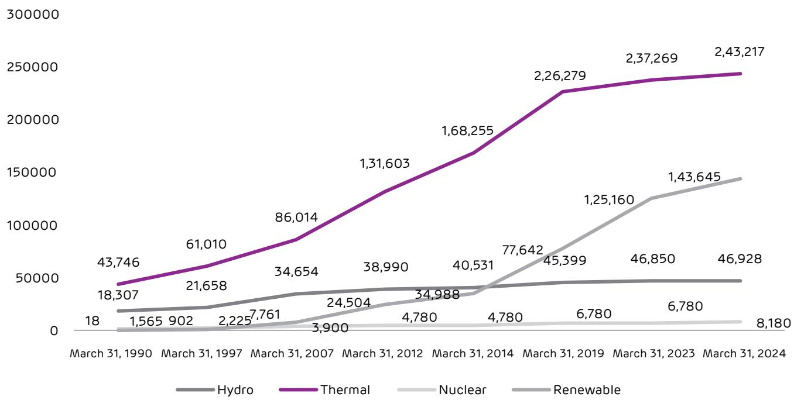

line

| Date | Hydro | Thermal | Nuclear | Renewable |
|---|---|---|---|---|
| March 31, 1990 | 18 | 43,746 | 1,565 | 902 |
| March 31, 1997 | 2,225 | 61,010 | 2,225 | 7,761 |
| March 31, 2007 | 3,900 | 86,014 | 3,900 | 24,504 |
| March 31, 2012 | 4,780 | 1,31,603 | 4,780 | 34,988 |
| March 31, 2014 | 4,780 | 1,68,255 | 4,780 | 77,642 |
| March 31, 2019 | 6,780 | 2,26,279 | 6,780 | 1,25,160 |
| March 31, 2023 | 6,780 | 2,37,269 | 6,780 | 1,43,645 |
| March 31, 2024 | 8,180 | 2,43,217 | 8,180 | 1,43,645 |

India’s thermal power generation capacity, which supplies base load power requirements, is primarily based on coal and lignite, while gas-based capacity is constrained by local unavailability and high price of fuel. India has an abundance of coal reserves, which helps improve the nation’s energy security and reduce reliance on imports.

Despite a growing focus on renewable energy, thermal power continues to act as the bedrock for serving India’s energy needs. It is crucial for meeting base load requirements and providing the balancing energy output to help mitigate the inherently intermittent nature of renewable energy, which is accentuated further due to its quickly growing penetration.

India's power generation mix (Million Units)   
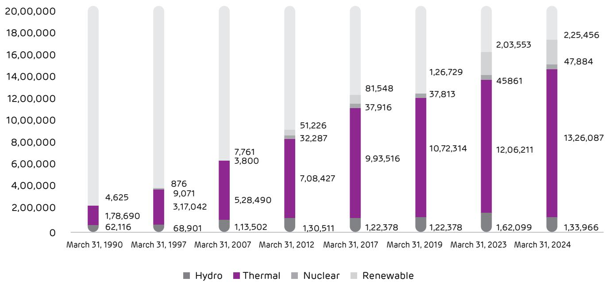

bar_stacked

| Date | Hydro | Thermal | Nuclear | Renewable |
|---|---|---|---|---|
| March 31, 1990 | 62,116 | 1,78,690 | 4,625 | |
| March 31, 1997 | 68,901 | 3,17,042 | 9,071 | |
| March 31, 2007 | 1,13,502 | 5,28,490 | 7,761 | |
| March 31, 2012 | 1,30,511 | 7,08,427 | 32,287 | |
| March 31, 2017 | 1,22,378 | 9,93,516 | 37,916 | |
| March 31, 2019 | 1,22,378 | 10,72,314 | 37,813 | |
| March 31, 2023 | 1,62,099 | 12,06,211 | 45,861 | |
| March 31, 2024 | 1,33,966 | 13,26,087 | 47,884 | |
| Final Label (approx.) | - | - | - | - |
| Final Label (approx.) - Renewable | - | - | - | - |
| Final Label (approx.) - Thermal | - | - | - | - |
| Final Label (approx.) - Hydro | - | - | - | - |
The chart displays a stacked bar chart with values labeled on each segment. The x-axis represents time points (March 31, 1990 to March 31, 2024), and the y-axis represents numerical values ranging from 0 to over 200,000. The legend indicates four categories: Hydro (dark gray), Thermal (purple), Nuclear (light gray), and Renewable (white). The data is already in English. The chart is saved as a PNG file named 'hydrolysis' and is displayed.

Strong economic growth with increasing urbanisation has resulted in a substantial increase in consumption of electricity by the domestic sector, expanding its share in the consumption basket. On the other hand, the share of the agricultural sector has dropped. As industrial activity, including both infrastructure and manufacturing grows powered by the government’s policy emphasis, the need for base load power will remain strong.

Category-wise power consumption (%)   
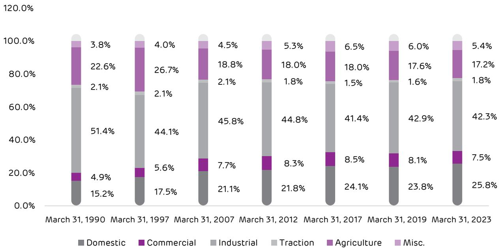

bar_stacked

| Date       | Domestic | Commercial | Industrial | Traction | Agriculture | Misc. |
|------------|----------|------------|------------|----------|-------------|-------|
| March 31, 1990 | 15.2%    | 4.9%       | 51.4%      | 2.1%     | 22.6%       | 3.8%  |
| March 31, 1997 | 17.5%    | 5.6%       | 44.1%      | 2.1%     | 26.7%       | 4.0%  |
| March 31, 2007 | 21.1%    | 7.7%       | 45.8%      | 2.1%     | 18.8%       | 4.5%  |
| March 31, 2012 | 21.8%    | 8.3%       | 44.8%      | 1.8%     | 18.0%       | 5.3%  |
| March 31, 2017 | 24.1%    | 8.5%       | 41.4%      | 1.5%     | 18.0%       | 6.5%  |
| March 31, 2019 | 23.8%    | 8.1%       | 42.9%      | 1.6%     | 17.6%       | 6.0%  |
| March 31, 2023 | 25.8%    | 7.5%       | 42.3%      | 1.8%     | 17.2%       | 5.4%  |

Power demand has grown strongly over the last decade across India. The Company supplies power under long-term Power Purchase Agreements to some of India’s economically leading States, which have shown a strong growth in power demand historically.

State-wise power demand growth (Million Units)   
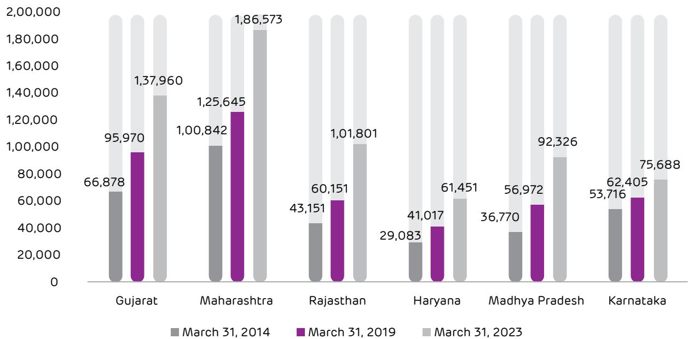

bar

| State | March 31, 2014 | March 31, 2019 | March 31, 2023 |
| :--- | :--- | :--- | :--- |
| Gujarat | 66,878 | 95,970 | 1,37,960 |
| Maharashtra | 1,00,842 | 1,25,645 | 1,86,573 |
| Rajasthan | 43,151 | 60,151 | 1,01,801 |
| Haryana | 29,083 | 41,017 | 61,451 |
| Madhya Pradesh | 36,770 | 56,972 | 92,326 |
| Karnataka | 53,716 | 62,405 | 75,688 |

During FY 2023-24, these States have continued to register a high growth in electricity demand.

Power demand in key states (Million Units)   
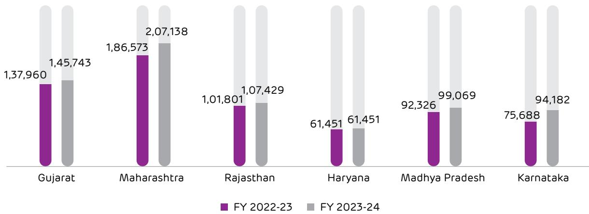

bar_stacked

| State | FY 2022-23 | FY 2023-24 |
| :--- | :--- | :--- |
| Gujarat | 1,37,960 | 1,45,743 |
| Maharashtra | 1,86,573 | 2,07,138 |
| Rajasthan | 1,01,801 | 1,07,429 |
| Haryana | 61,451 | 61,451 |
| Madhya Pradesh | 92,326 | 99,069 |
| Karnataka | 75,688 | 94,182 |

# Sector outlook

Long-term economic development of a nation, which leads to improved prosperity and well-being of its citizens, necessitates abundant availability of reliable and affordable power supply, which is a critical enabling resource for all economic activities. India is focusing on strengthening the power sector through various policies, targets, and reforms to ensure that both generation capacity and the transmission & distribution infrastructure are augmented in a timely manner, to be able to support the nation’s growth aspirations while meeting long-term sustainability goals.

The Indian government’s estimates project a 6.2% compounded annual growth rate in power demand, which is set to double by FY 2031-32 as compared to the all-India demand in FY 2020-21.

Projected annual electricity demand growth (Billion Units)   
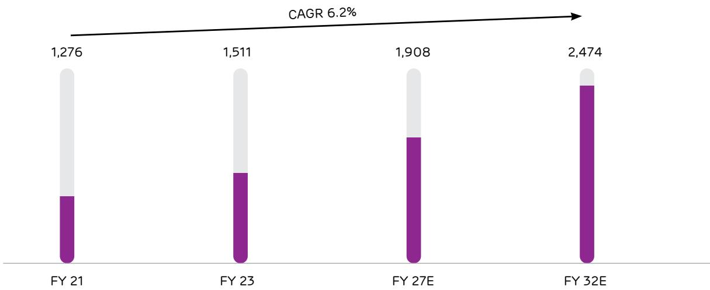

bar

| Fiscal Year | Value |
| :--- | :--- |
| FY 21 | 1,276 |
| FY 23 | 1,511 |
| FY 27E | 1,908 |
| FY 32E | 2,474 |
CAGR 6.2%

Figure 1 Aggregate power demand set to double by FY32 (Source: 20th Electric Power Survey)

Key drivers of this projected growth are rising urbanisation and consumption of power by domestic and commercial users, growth impetus being given to the manufacturing sector through various production-linked incentives, higher demand for irrigation, railway traction, etc. On the other hand, one of the major policy thrusts of the Government, a reduction in Transmission & Distribution losses, which is projected to improve from 16.5% in FY 2021-22 to 12.6% in FY 2031-32, will partially temper the translation of growth in energy requirements to overall electricity demand.

While India is on track to become the world’s third-largest economy, its per capita power consumption remains low at 1,331 kWh in FY 2022-23. As the fruits of economic development spread, per capita power consumption is expected to grow rapidly led by increase in household appliance use, shift to electric mobility, growing industrialisation and mechanisation, and growth in infrastructure.

# Power: Demand-Supply Scenario

Increase in generation capacity, along with augmentation of transmission and distribution infrastructure and improvement in inter-regional connectivity has resulted in a narrowing of the supply-demand gap in energy as well as peak power requirements. However, over the last few years, demand growth has outstripped the growth in power generation, resulting in a reemergence of deficits.

Energy and peak surplus/deficit (%)   
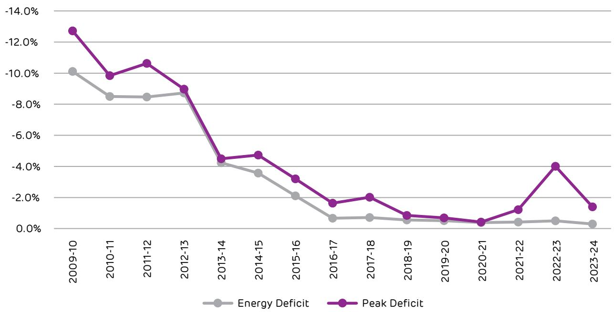

line

| Year     | Energy Deficit | Peak Deficit |
| -------- | -------------- | ------------ |
| 2009-10  | -10.0%         | -11.5%       |
| 2010-11  | -7.5%          | -10.0%       |
| 2011-12  | -7.5%          | -9.5%        |
| 2012-13  | -7.0%          | -8.5%        |
| 2013-14  | -4.0%          | -3.5%        |
| 2014-15  | -4.5%          | -3.0%        |
| 2015-16  | -2.0%          | -2.5%        |
| 2016-17  | 0.5%           | -2.5%        |
| 2017-18  | 0.5%           | -2.0%        |
| 2018-19  | 0.5%           | -1.5%        |
| 2019-20  | 0.5%           | -1.5%        |
| 2020-21  | 0.5%           | -1.5%        |
| 2021-22  | 0.5%           | -1.0%        |
| 2022-23  | 0.5%           | -4.0%        |
| 2023-24  | 0.5%           | -2.5%        |

Reemergence of deficits has increased the demand for power from the short-term markets, resulting in higher exchange prices in the merchant market in recent years.

Monthly IEX prices   
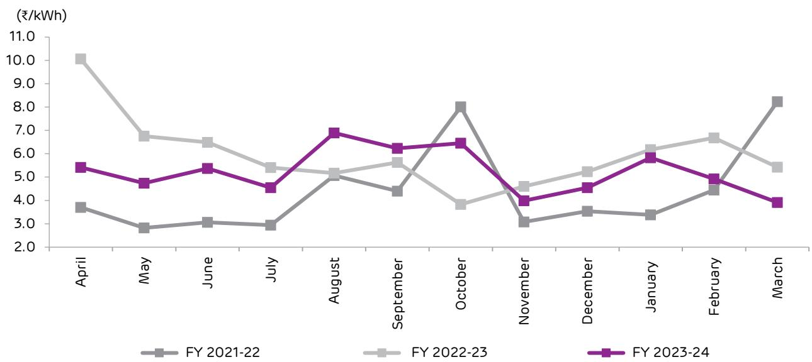

line

| Month     | FY 2021-22 | FY 2022-23 | FY 2023-24 |
| --------- | ---------- | ---------- | ---------- |
| April     | 3.7        | 10.1       | 5.4        |
| May       | 2.8        | 6.8        | 4.7        |
| June      | 3.1        | 6.5        | 5.3        |
| July      | 2.9        | 5.4        | 4.5        |
| August    | 5.0        | 5.1        | 6.9        |
| September | 4.3        | 5.6        | 6.3        |
| October   | 8.1        | 3.8        | 6.4        |
| November  | 3.0        | 4.6        | 4.0        |
| December  | 3.6        | 5.2        | 4.5        |
| January   | 3.4        | 6.3        | 5.8        |
| February  | 4.4        | 6.7        | 5.0        |
| March     | 8.3        | 5.4        | 3.9        |

Going forward, the energy and peak power deficits are expected to subsist for several years, as the power demand is expected to be strong. Even though renewable energy capacity additions have outstripped thermal power additions, the growth has been slower than expected.

The Ministry of Power of the Indian government, in consultation with the Ministry of New and Renewable Energy, has specified a trajectory of Renewable Purchase Obligations (RPOs) that has to be followed by DISCOMs to purchase a certain percentage of total energy consumed by them from renewable sources. Under this trajectory, DISCOMs have to meet 43.33% RPO by the year 2029-30. Along with this, the Indian government has also announced a target to achieve 50% of total installed generation capacity from non-fossil sources by the year 2029-30.

Consequently, various DISCOMs have been buying power in increasing quantum from renewable sources to meet their RPO obligations through lon-term contracts. At the same time, they have also increasingly relied on the merchant and short-term markets to meet incremental power demand.

However, higher demand has also resulted in merchant prices shooting up, resulting in market disruptions and government interventions. DISCOMs are therefore expected to invite bids for long-term contracts for supply of power from conventional sources like thermal power.

Further, the need for ensuring reliability of power supply in an era of increasing penetration from intermittent sources like renewables is being felt considering the projected growth in power demand. As a result, DISCOMs are expected to continue to rely on thermal power to meet the growing baseload power requirements by entering into new long-term contracts, in addition to drawing more power from existing capacities and hence helping to improve the average PLFs of the sector.

# Coal demand and supply

Coal continues to power a major portion of India’s energy needs, accounting for more than 72% of the nation’s power generation in FY 2023-24.

India is endowed with plentiful supplies of this crucial natural resource, which enhances energy security and helps strengthen the reliability and resilience of its energy sector, which contributes to the nation’s continued growth and prosperity. In times of growing energy demand, driven by a surging economy, coal as a primary fuel has witnessed an unprecedented upswing in domestic production and despatch, while imports have exhibited a declining trend.

During FY 2023-24, the production of coal in India grew by nearly 12% to 997 million tonnes. Of this, Coal India Limited produced 774 million tonnes registering 10% growth. Coal despatched to power utilities also grew by 5% to reach 618 MT during this period.

While domestic coal production has been picking up significantly, the strong growth in power demand as well as economic activity has led to a higher reliance on imports of coal. Total imports of coal registered in FY 2023-24 till February 2024 were 239 MT, as compared to 238 MT during the whole of FY 2022-23.

The Ministry of Coal estimates overall demand for coal to reach 1,448 MT by 2029-30, of which the power sector will account for 1,034 MT. Public sector coal miners are expected to hold up their commitment to maintain consistent coal production and despatch, ensuring an uninterrupted supply for a reliable and resilient energy sector. At the same time, captive mines are expected to increase their production to 175 MT in 2024-25, as compared to 145 MT more than estimated in 2023-24. Output from mines recently auctioned to the private sector is expected to contribute 20 million tonnes in 2024-25.

Imported coal prices, which had shot up following disruptions in natural gas supply consequent to the war in Ukraine, have started to come down as gas supply has improved. Indonesia is expected to cut its production to 710 MT in 2024, as compared to a record output of 775 MT in 2023. Lower gas prices amidst an oversupply in the global gas markets will create negative pressures on Indonesia's lower calorific value coal demand. This trend will be supported further by China’s resumption of coal imports from Australia and high inventories due to improved domestic production of coal in the country.

# Adani Power Limited (Adani Power): Stronger Than Ever

Adani Power is India’s largest private thermal power producer with a power generation capacity of 15,250 MW, consisting of 15,210 MW thermal power capacity and 40 MW solar power capacity. Of this, 1,600 MW capacity caters to power supply to Bangladesh, while the balance 13,650 MW is being supplied within India. In addition to this, an expansion project of 1,600 MW Ultra-supercritical power plant is also underway, which will take the operating capacity to 16,850 MW upon completion.

Out of the current and under-construction capacity, 10,840 MW of thermal power capacity, comprising a 4,620 MW plant at Mundra, Kutch in Gujarat, a 3,300 MW plant at Tiroda, Gondia in Maharashtra, a 1,320 MW plant at Kawai, Baran in Rajasthan, and 1,600 MW (under its subsidiary Adani Power (Jharkhand) Limited), at Godda in Jharkhand, have been established by the Company.

Adani Power has also acquired four thermal power plants with a combined capacity of 4,370 MW, including a 1,370 MW plant at Raipur in Chhattisgarh, a 600 MW plant at Raigarh in Chhattisgarh, a 1,200 MW plant at Udupi in Karnataka, and a 1,200 MW plant (under subsidiary Mahan Energen Limited) at Bandhaura, Singrauli in Madhya Pradesh.

The power plants of Adani Power and its subsidiaries have specific locational advantages and strengths, which allow them easy access to fuel and connectivity to key markets. The Company enjoys a substantial competitive advantage due to its ability to conduct sourcing and logistics of 60 million tonnes per annum (MPTA) coal within India and from abroad along with 13 MTPA fly ash, which is a complex, multi-point operation involving co-ordination of complete movement of up to 14,500 railway rakes a year.

Adani Power has overcome numerous challenges to emerge as a financially stronger and profitable company with low debt per MW capacity and strong cash flows. It now plans to expand its capacity further to 24,270 MW by setting up new brownfield projects at existing sites and acquiring more power plants.

# SWOT analysis

# Strengths

ƒ Proven capability to execute large and complex projects within cost and time budgets   
Proven capabilities of turning around stressed power plant acquisitions   
Dedicated teams with domain expertise in O&M, fuel management, power sector regulation, project management, and business development   
Deep backward integration experience with mine-toplant logistics capability   
Combination of coastal, pithead, and hinterland projects proximate to fuel sources and demand centres   
Competitive tariffs permitting a secured Merit Order Despatch position and increased offtake along with regulatory approvals for recovery of alternate coal cost in case of shortfall in domestic fuel availability   
85% of installed and upcoming greenfield capacities tied up through long-term / medium-term PPAs, enhancing revenue visibility   
Fuel cost pass-through included in imported coal based PPAs, enhancing cash flow stability

• Around 79% domestic coal requirements tied up in long-term / medium-term Fuel Supply Agreements (FSAs)   
Regulatory approvals for carrying cost as well as a late payment surcharge mechanism, protecting against delays in the award of regulatory claims and payment from power procurers   
Availability of land and shared infrastructure at existing plant locations to provide advantage in setting up new brownfield capacities

# Weakness

Reliance on monopolistic state-owned coal suppliers for domestic coal could lead to disruptions in fuel availability   
Non-availability of escalation in tariffs for coal price growth in some domestic coal-based PPAs and partial tariff escalation in other cases   
15% capacity exposed to short-term market risks or long-term, firm domestic fuel supplies   
Narrow sectoral focus of thermal power generation restricting opportunities to invest in renewable energy and other promising areas

# Opportunities

Growing power demand with increasing need for base load power in backdrop of increasing penetration of intermittent power sources   
- Stressed power assets with locational advantage available in superior valuations, an opportunity to enhance capacity while avoiding execution risks   
Sale of power to Commercial and Industrial (C&I) customers due to Increased industrial tariffs borne by big industrial consumers dependent on State DISCOMs, impacting their profitability and competitiveness   
Limited new thermal power capacity installations, even as baseload demand continues to grow, creating opportunities for merchant power and long-term / medium-term tie-ups   
ƒ Greater availability of domestic fuel and softening of import coal prices could result in higher PLFs   
Auctions of coal linkages under SHAKTI policy for plants without PPAs   
Coal availability from commercial coal mine licensees under liberalised regime

# Threats

Growing preference for renewable power could limit thermal power demand   
Hesitation of state DISCOMs to tie power demand through long-term PPAs   
Volatile international coal prices could hamper the Merit Order Position of PPAs with coal price pass-through   
Inability of domestic coal miners to enhance production   
Funding constraints for new coal-based projects   
Deterioration in DISCOM financial strength due to inefficiency in collections or inadequate cost recovery through tariffs

# Performance update

# Operating performance

During FY 2023-24, Adani Power posted a strong improvement in its operating performance, which was attributable to growing power demand, better domestic coal availability and lower prices of imported coal, in addition to capacity growth from addition of the 1,600 MW Godda Ultra-supercritical thermal power plant, which was commissioned during Q1 FY 2023-24. Domestic power sales volumes were driven by growing power demand across India, and offtake under Power Purchase Agreements (“PPAs”) was further supported by falling prices of imported coal and alternate fuel.

The aggregate Plant Load Factor (PLF) achieved by Adani Power on a consolidated basis during FY 2023-24 was 64.7%, which was significantly higher than the PLF of 47.9% achieved during FY 2022-23. Average operational capacity for FY 2023-24 increased to 15,051 MW with the commissioning of the 1,600 MW Ultra-supercritical power plant of Adani Power (Jharkhand) Limited at Godda, Jharkhand, in comparison to 13,650 MW of operating capacity in FY 2022-23. The installed capacity as of March 31, 2024 was 15,250 MW.

The PLF at the Kawai and Tiroda plants stayed above 70% due to continuous high grid demand and better domestic coal availability under Fuel Supply Agreements. At the same time, the PLF at Mundra improved due to higher grid offtake following growth in power demand coupled with lower prices of imported coal. Similarly, the PLF of Udupi improved significantly due to improvement in merit order position owing to low imported coal price and higher grid demand in Karnataka. The PLFs of Raipur, Raigarh, and Mahan were also strong mainly due to improved availability of domestic coal and high demand from the merchant / short-term markets. The Godda plant ramped up satisfactorily and achieved a high PLF in its first year of operation.

As a result of higher PLF and greater operating capacity, Adani Power achieved a power sales volume of 79.3 Billion Units (BUs) during FY 2023-24, which was 48% higher than the sales volume of 53.4 BUs achieved during FY 2022-23.

Plant-wise PLF and power sales trend in FY 2023-24   
Consolidated PLF (%)   
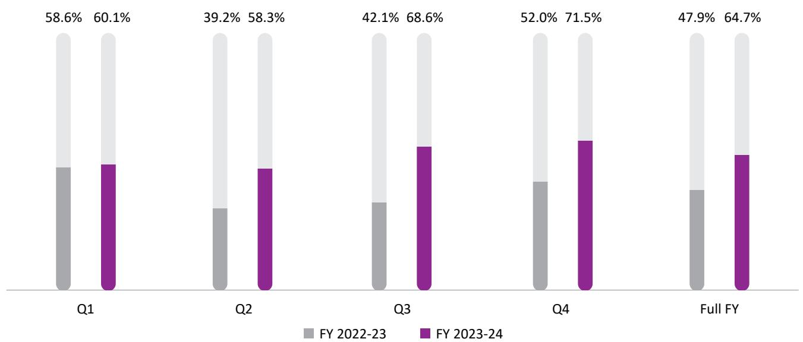

bar_stacked

| Category | FY 2022-23 (%) | FY 2023-24 (%) |
| :--- | :--- | :--- |
| Q1 | 58.6 | 60.1 |
| Q2 | 39.2 | 58.3 |
| Q3 | 42.1 | 68.6 |
| Q4 | 52.0 | 71.5 |
| Full FY | 47.9 | 64.7 |

Plant-wise PLF (%)   
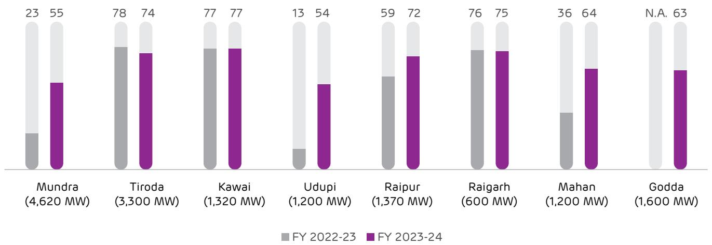

bar_stacked

| Region | FY 2022-23 (MW) | FY 2023-24 (MW) |
| :--- | :--- | :--- |
| Mundra | 23 | 55 |
| Tiroda | 78 | 74 |
| Kawai | 77 | 77 |
| Udupi | 13 | 54 |
| Raipur | 59 | 72 |
| Raigarh | 76 | 75 |
| Mahan | 36 | 64 |
| Godda | N.A. | 63 |

Volume mix   
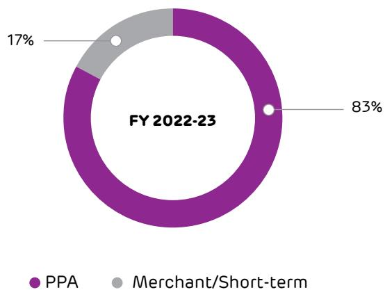

pie

FY 2022-23
| Category | Percentage (%) |
| :--- | :--- |
| PPA | 83 |
| Merchant/Short-term | 17 |

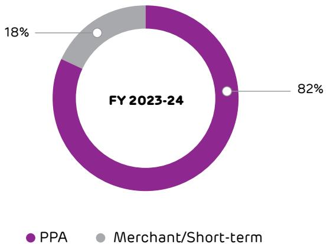

pie

FY 2023-24
| Category | Percentage (%) |
| :--- | :--- |
| PPA | 82 |
| Merchant/Short-term | 18 |

The mix of power sold under PPA and Merchant / Short-term market during FY 2023-24 was similar to FY 2022-23.

PPA sale volume rose from 44.4 BU in FY 2022-23 to 65.3 BU in FY 2023-24, primarily due to rise in power demand and reduction in import coal prices which improved merit order positioning of PPAs, in addition to growth in operating capacity.

Merchant sale volume rose from 8.9 BU in FY 2022-23 to 14 BU in FY 2023-24 mainly due to better power demand and better domestic coal availability. The Company’s domestic coal-based untied capacities enjoy a locational advantage in sourcing coal due to their proximity to major coal bearing areas. It has been able to convert this advantage into a profitable opportunity by ensuring higher plant uptime and improved coal availability to supply power during high demand periods.

# Financial Performance

Consolidated Total Income for FY 2023-24 grew by 40% at \` 60,281 crore, as compared to the revenue of \` 43,041 crore in FY 2022-23. This growth was the result of higher volumes, improved tariff realisation, capacity addition, and higher one-time revenue recognition on account of regulatory claims. The Total Income for FY 2023-24 includes recognition of prior period revenue of \` 9,322 crore on account of domestic coal shortfall, carrying cost, and late payment surcharge under PPAs, as compared to one-time prior period recognition of this nature of \` 5,772 crore for FY 2022-23.

More particularly, the prior period Operational Revenue of one-time nature recognised during FY 2023-24 was \` 683 crore, in comparison to \` 2,377 crore recognised during FY 2022-23. The Company recognised higher prior period operational income during the previous year upon conclusion of various major regulatory petitions and appeals for change-inlaw claims, pertaining to domestic coal shortfall under various PPAs.

On the other hand, prior period Other Income recognised for the FY 2023-24 period was \` 8,638 crore, as compared

to \` 3,395 crore recognised for FY 2022-23. This head of income includes carrying costs on regulatory claims along with late payment surcharges on delayed payments by customers. During the current year, the Company received a higher amount of claims under these heads.

Revenue progression (\` crore)   
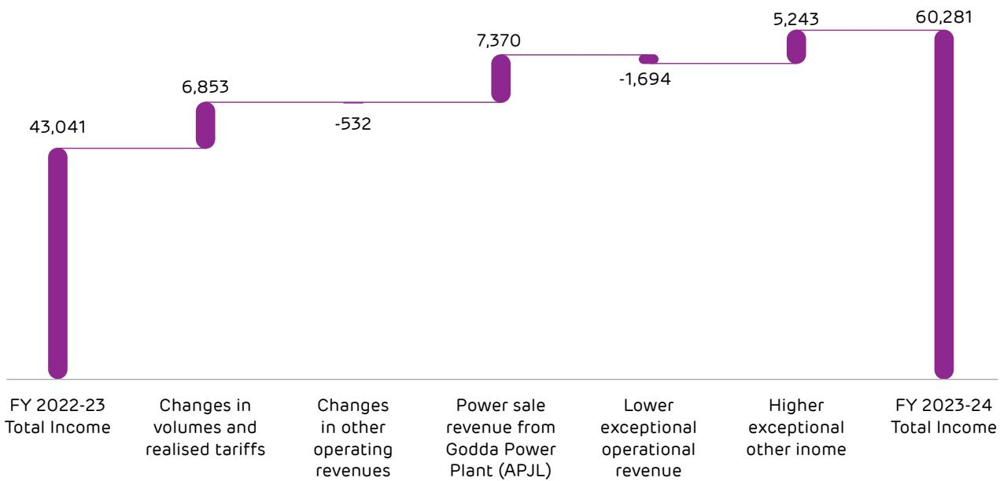

bar

| Category | Value |
|---|---|
| FY 2022-23 Total Income | 43,041 |
| Changes in volumes and realised tariffs | 6,853 |
| Changes in other operating revenues | -532 |
| Power sale revenue from Godda Power Plant (APJL) | 7,370 |
| Lower exceptional operational revenue | -1,694 |
| Higher exceptional other income | 5,243 |
| FY 2023-24 Total Income | 60,281 |

Consolidated EBITDA for FY 2023-24 stood higher by 96% at \` 28,111 crore compared to \` 14,312 crore for FY 2022-23. This increase in EBITDA was due to improved contribution on account of improved fuel cost recovery and inclusion of the Godda plant’s revenues in addition to the benefit of higher volumes as well as higher prior period revenue recognition. The Company’s strategically located open capacity near major coal mining regions was able to benefit from the growth in merchant power demand and high merchant tariffs in the short-term market due to its proximity to the fuel source, which creates a competitive advantage in terms of logistics cost of fuel.

Adani Power’s PPA capacity realised slightly lower average net tariff FY 2023-24 as against FY 2022-23, after excluding past period revenues. The reduction in realisation is due to lower imported fuel price which resulted in lower change-in-law revenue recovery as compared to the earlier period.

Similarly, Adani Power’s open capacity realised lower average tariffs during FY 2023-24 as against FY 2022-23. The reduction in tariffs was compensated by a surge in power demand across the nation.

EBITDA progression (\` crore)   
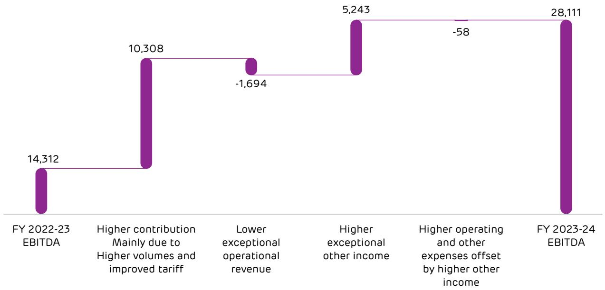

waterfall

| Category | Value |
|---|---|
| FY 2022-23 EBITDA | 14,312 |
| Higher contribution Mainly due to Higher volumes and improved tariff | 10,308 |
| Lower exceptional operational revenue | -1,694 |
| Higher exceptional other income | 5,243 |
| Higher operating and other expenses offset by higher other income | -58 |
| FY 2023-24 EBITDA | 28,111 |

Depreciation charge for FY 2023-24 increased to \` 3,931 crore from \` 3,304 crore in FY 2022-23 due to the addition of Godda power plant during Q1 FY 2023-24.

Finance Costs for FY 2023-24 increased marginally to \` 3,388 crore from \` 3,334 crore in FY 2022-23 mainly due to additional borrowing cost for the Godda power plant after its commissioning, which was largely offset by lower interest charge on existing borrowings due to a reduction in secured and unsecured debt over the year.

For FY 2023-24, the Profit Before Tax was \` 20,792 crore, as compared to \` 7,675 crore in FY 2022-23. Profit After Tax for FY 2023-24 was \` 20,829 crore as compared to \` 10,727 crore for FY 2022-23.

The Total Comprehensive Income for FY 2023-24 was \` 20,801 crore, as compared to the Total Comprehensive Income of \` 10,760 crore for FY 2022-23.

Total borrowings as of March 31, 2024 were \` 34,457 crore as compared to \` 42,252 crore as of March 31, 2023. The reduction was mainly due to prepayment of term loans by utilising internal accruals and regulatory cashflows, partially offset by addition of debt for recently commissioned Godda power plant.

The total equity at the consolidated level, including Unsecured Perpetual Securities [UPS], stood at \` 43,145 crore as of March 31, 2024 compared to \` 29,876 crore as of March 31, 2023.

# Financial performance of subsidiaries

# Financial performance of MEL

Total Income for FY 2023-24 grew by 38% to \` 3,804 crore, as compared to the revenue of \` 2,752 crore in FY 2022-23. This growth was the result of higher volumes including new capacity tie-up of 200 MW under medium-term PPA and higher merchant sales.

EBITDA for FY 2023-24 stood higher by 94% at \` 1,493 crore compared to \` 771 crore for FY 2022-23. This increase in EBITDA was due to improved contribution on account of firm tariff realisation for newly signed medium term PPA, higher merchant contribution due to high tariffs and lower fuel prices in addition to the benefit of higher volumes. MEL’s strategically located open capacity near major coal mining areas was able to benefit from the growth in merchant power demand due to its proximity to the fuel source, which creates a competitive advantage in terms of logistics cost of fuel.

Depreciation charge for FY 2023-24 was \` 98 crore as against \` 89 crore in FY 2022-23. Finance Costs for FY 2023-24 reduced to \` 374 crore from \` 437 crore in FY 2022-23 mainly due to prepayment of senior secured debt.

The Profit Before Tax and exceptional items rose significantly by 317% to \` 1,021 crore for FY 2023-24, as compared to \` 245 crore in FY 2022-23. Exceptional Items of \` 2,950 crore were recognised for FY 2023-24 on account of reversal of impairment provisions due to improved performance of the company. In comparison, Exceptional Items were NIL for FY 2022-23.

Profit After Tax for FY 2023-24 was \` 3,057 crore as compared to \` 245 crore for FY 2022-23. The Total Comprehensive Income for FY 2023-24 was \` 3,057 crore, as compared to the Total Comprehensive Income of \` 244 crore for FY 2022-23.

# Financial performance of APJL

The unit-1 and unit-2 of 800 MW each of the 1,600 MW Godda Ultra-supercritical power plant were commissioned on April 6, 2023 and June 26, 2023 respectively. APJL has been able to ramp up generation satisfactorily post-commissioning and started supplying much-needed power to Bangladesh under its 25-year PPA with the Bangladesh Power Development Board.

APJL, which exports 100% of power generated by the Godda plant to Bangladesh under the PPA, reported Total Income of \` 7,515 crore for FY 2023-24 and EBITDA of \` 2,986 crore.

Depreciation charge and Finance Costs for FY 2023-24 were \` 596 crore and \` 1,148 crore respectively. APJL reported Profit Before Tax of \` 1,242 crore for FY 2023-24. The Total Comprehensive Income for FY 2023-24 was \` 881 crore.

Key ratios (Adani Power consolidated) 

<table><tr><td>Adani Power Consolidated Ratios</td><td>FY 2023-24</td><td>FY 2022-23</td></tr><tr><td>Debtor Turnover (Days)</td><td>70</td><td>96</td></tr><tr><td>Total Trade Receivables to Total Revenue (360 days)</td><td></td><td></td></tr><tr><td>Inventory Turnover (Days)</td><td>44</td><td>36</td></tr><tr><td>Inventory to Fuel Cost (360 days)</td><td></td><td></td></tr><tr><td>Senior Debt Interest Coverage Ratio (x)</td><td>8.44</td><td>4.64</td></tr><tr><td>EBIT to Interest on Term Debt and Working Capital Borrowings</td><td></td><td></td></tr><tr><td>Current Ratio (x)</td><td>1.62</td><td>1.10</td></tr><tr><td>Current Assets to Current Liabilities</td><td></td><td></td></tr><tr><td>External Debt to Net Worth (x)</td><td>0.80</td><td>1.19</td></tr><tr><td>Senior External Debt (Total Borrowings less Loans from related parties) to Total Equity</td><td></td><td></td></tr><tr><td>External Debt to EBITDA (x)</td><td>1.22</td><td>2.48</td></tr><tr><td>Senior External Debt (Total Borrowings less Loans from related parties) to EBITDA (PBT + Finance Cost + Depreciation)</td><td></td><td></td></tr><tr><td>EBITDA Margin (%)</td><td>47%</td><td>33%</td></tr><tr><td>EBITDA to Total Revenue</td><td></td><td></td></tr><tr><td>PAT Margin (%)</td><td>35%</td><td>25%</td></tr><tr><td>PAT to Total Revenue</td><td></td><td></td></tr><tr><td>Return on Net Worth (%)</td><td>48%</td><td>36%</td></tr><tr><td>PAT to Total Equity</td><td></td><td></td></tr></table>

Debtor Turnover Days have reduced to 70 days as on March 31, 2024 as compared to 96 days as on March 31, 2023 on account of improved collections from DISCOMs, following various measures undertaken by the Central Government to encourage timely payments and reduce the outstanding amounts payable to power generators   
Senior Debt Interest Cover Ratio has increased to 8.44 times as on March 31, 2024 from 4.64 times as on March 31, 2023 due to improved profitability as well as control on finance costs following reduction in senior debt   
External Debt to Net Worth Ratio has reduced to 0.80 times as on March 31, 2024 from 1.19 times as

on March 31, 2023 due to increase in shareholders’ funds following improved profitability along with reduction in external debt

External Debt to EBITDA Ratio has reduced to 1.22 times as on March 31, 2024 from 2.48 times as on March 31, 2023 due to improved operating profits along with reduction in external debt through prepayments as well as scheduled amortisation   
EBITDA margin has improved to 47% of Total Revenues as on March 31, 2024 from 33% as on March 31, 2023 due to higher volumes, improved tariff realisation, lower fuel prices, and higher one-time prior period income recognition

• Adani Power’s PAT Margin and Return on Net Worth improved to 35% and 48% respectively in FY 2023-24 from 25% and 36% respectively in FY 2022-23 because of improvement in profitability of the Company on account of improved operating profitability, higher prior period revenue recognition, and control on finance costs. Consolidated Profit After Tax improved from \` 10,727 crore for FY 2022-23 to \` 20,829 crore for FY 2023-24   
Moreover, Adani Power’s External Debt to Net Worth ratio also improved due to prepayment of external term debt in addition to scheduled amortisation as well as improved profitability as mentioned above

Adani Power’s consolidated total debt reduced significantly to \` 34,457 crore as of March 31, 2024 as against total debt of \` 42,252 crore as on March 31, 2023. This was mainly due to prepayment of senior secured term debt and repayment of unsecured subordinated debt by prudently utilising cash surplus from operations.

Adani Power’s consolidated total equity increased from \` 29,876 crore as of March 31, 2023 to \` 43,145 crore as of March 31, 2024 mainly due to increase in profit after tax, partially offset by repayment including distribution on Unsecured Perpetual Securities.

# Key developments during FY 2023-24

# Regulatory Developments

Hon’ble Supreme Court (“SC”) on April 22, 2023 pronounced its orders pertaining to various regulatory appeals involving Adani Power Limited and its erstwhile subsidiaries Adani Power Maharashtra Limited (“APML”), Adani Power Rajasthan Limited (“APRL”), and Adani Power (Mundra) Limited (“APMuL”), which now stand amalgamated in the Company.

Hon'ble SC upheld various orders of the Hon’ble Appellate Tribunal for Electricity (“APTEL”) and dismissed appeals of:

A. Maharashtra State Electricity Distribution Company Limited against three orders of APTEL;   
B. Rajasthan Distribution Companies (“DISCOMs”) against two orders of APTEL; and   
C. Haryana DISCOMs against three orders APTEL, while partially setting aside another APTEL order and directing the Central Electricity Regulatory Commission ("CERC") to calculate the benefits that would be accruable to any of the parties, within a period of six months.

The order of the Hon’ble Court brought to a conclusion various long-pending appeals by DISCOMs, thus upholding most of the Company’s claims, and bringing clarity to the regulatory philosophy to be followed.

Consequent to this development, the Company has recovered most of the respective DISCOMs’ dues towards the respective regulatory claims, including carrying cost and late payment surcharges on delayed payments.

# Adani Power (Jharkhand) Limited

Unit 1 of 800 MW capacity of the 2x800 MW Ultra-supercritical power project of APJL, situated in Godda District in Jharkhand, achieved commercial operations on April 5, 2023. Unit 2 achieved commercial operations at on June 26, 2023 following successful completion of Reliability Run Tests, as per contract.

APJL has started exporting its entire power output directly to Bangladesh through dedicated 400 kV transmission lines, with net capacity of 1,496 MW. APJL has 25-year contract with Bangladesh Power Development Board.

Construction of the Godda USTCPP was completed despite severe challenges posed by COVID-19 pandemic lockdowns. The project, which has deployed for the first time in India state-of-the-art Ultra-supercritical technology in 800 MW units, also incorporates Flue Gas Desulphurisers and Selective Catalytic Reconverter equipment, to minimise emissions and in compliance with futuristic norms announced by the Ministry of Environment and Forests and Climate Change (“MOEF&CC”).

# Credit Ratings

CRISIL Ratings upgraded the credit rating assigned to the bank facilities of Adani Power Limited from ‘CRISIL A/Stable’ to ‘CRISIL AA-/Stable’ in January 2024. India Ratings also upgraded the credit rating assigned to Adani Power from ‘Ind A/Positive/A1’ to ‘Ind AA-/Stable/A1+’ in February 2024.

The rating upgrades takes into consideration a strong improvement in the business and financial risk profile of the Company, significant improvement in operating performance, timely commissioning and ramp-up of the 1,600 MW Godda Ultra-supercritical power plant, ramp-up of the 1,200 MW Mahan power plant, recovery of pending regulatory dues related to claims for domestic fuel shortfall after resolution of key regulatory issues, and continued improvement in receivables.

The rating also takes into consideration, inter alia, the strong market position of the Company, high level of long-term power sale tie-ups and fuel supply arrangements, a diversified generation portfolio with locational advantage, and healthy debt protection metrics.

# Inorganic acquisitions

# Coastal Energen Private Limited

The Committee of Creditors ("COC") of Coastal Energen Private Limited ("CEPL"), a company undergoing Corporate Insolvency Resolution Process ("CIRP") under the Insolvency and Bankruptcy Code 2016 ("IBC") approved the Resolution Plan submitted by a Consortium of which Adani Power Limited is a part with a 49% stake.

CEPL owns and operates a 1,200 MW thermal power plant near Tuticorin in, Tamil Nadu. In this regard, the consortium of Adani Power received a Letter of Intent ("LOI") from the Resolution Professional ("RP") on December 23, 2023.

Acquisition of this plant will give access to the Company to one of the major markets of Southern India.

# Lanco Amarkantak Power Limited

The Committee of Creditors of Lanco Amarkantak Power Limited (“LAPL”) approved the Resolution Plan submitted by Adani Power, following which its Resolution Professional has issued a Letter of Intent. LAPL is undergoing the Corporate Insolvency Resolution Process under the Insolvency and Bankruptcy Code under aegis of the Hon’ble National Company Law Tribunal.

LAPL operates a 600 MW thermal power plant in Chhattisgarh, which also has a 2x660 MW (1,320 MW) capacity under construction. Acquisition of this plant will help Adani Power expand its capacity in Central India in vicinity of some of the major coal-bearing areas of the nation.

# Outlook

Increasing power demand due to economic growth, increasing penetration of renewable energy accentuating the need for reliable power supply to serve base load requirements, increasing domestic coal production, availability of fuel from commercial mines, and lower prices of imported coal create a favourable situation for achieving high levels of capacity utilisation of both PPA-based and untied capacities.

Improved regulatory landscape, bolstered by the Hon’ble Supreme Court’s order, enables the Company to recover alternate fuel costs efficiently. Renegotiation of PPAs with Gujarat and Haryana DISCOMs has helped the Company alleviate onerous conditions and improve fuel cost recovery, protecting it from future long-term increases in imported fuel prices.

The Company expects to tap growth opportunities through organic and inorganic routes successfully, relying on its improved financial strength and core competencies in project execution, power plant O&M, fuel management and logistics, and proven turnaround capabilities.

The Company is confident of extending its lead profitably among Independent Power Producers in India, and contribute meaningfully to nation building through the provisioning of reliable power supply in a sustainable manner.

# Human Resource Practices

At Adani Power, we consider employees as our biggest asset. It is our constant endeavour to upgrade knowledge and skills, enhancing productivity of our employees. The average employee age of the company stood at 38 years, a complement of positive energy, enthusiasm and experience. We give the highest importance to employee safety and wellbeing through various safety initiatives like Chetna that sharpen our employees’ skills to create a safe workplace.

The Company has created a valuable workplace revolving around the principles of capability building, employee engagement, governance and digitalisation. To ensure employee life cycle management, the company implemented Oracle Fusion Digital HR Tool.

Learning modules and performance appraisal helped standardise systems on a real-time basis. Competence evaluation and development were focused on all major functions and services. Targeted action plans were emphasised on increased engagement based on various studies and surveys.

The company invested in young talents (GETs & MTs) and sharpened the skills of talented professionals to prepare them for bigger responsibilities rather hiring laterals. Adani Power undertook focused approach to develop and train successors for all critical positions through high potential professionals and young managers.

The Company had launched capability building initiatives under Transition Leadership Programs like Fulcrum, Adani Leadership Acceleration Program, Takshashila and North Star in alliance with leading management institutes.

# Internal control system

The Company has robust internal control procedures in place that are commensurate with its size and operations. The Board of Directors, responsible for the internal control system, sets the guidelines and verifies its adequacy, effectiveness and application.

The Company’s internal control system is designed to ensure management efficiency, measurability and verifiability, reliability of accounting and management information, compliance with all applicable laws and regulations, and the protection of the Company’s assets. This is to timely identify and manage the Company’s risks (operational, compliance-related, economic and financial).

Our risk mitigation matrix 

<table><tr><td>Scenario</td><td>Risks</td><td>Mitigation Measures</td></tr><tr><td>Mergers and acquisitions</td><td>Incorrect target selectionInadequate due diligenceIncorrect assessment of future synergies, potential benefits from the transaction, or fund infusion requirements</td><td>Creation of established criteria for target co. selection based on key parameters such as project status, PPA tie-up, technologyFormation of inter-departmental teams, with each team to focus on its core area for due diligenceEnsuring that all information that is sought is promptly provided by counterpartiesEnsuring that necessary safeguards are built into the resolution plans and final transaction documents to protect from risks / liabilities that could not be identified during due diligence stageEvery assumption having impact on valuation to be vetted by the responsible departmentConservative approach in financial projections for valuationPeriodic post-acquisition analysis of assumptions and deviations, and incorporation of learnings into procedures for future acquisitions</td></tr><tr><td>Regulatory</td><td>Favourable regulatory orders being overturned upon appealCustomers reneging on contractual terms due to unfavourable situationsNon-compliance of regulatory / judicial orders by customers</td><td>Building strong case with effective arguments, using facts, precedence, and already decided legal principlesEnforcement of contractual terms through representation and regulatory/judicial interventionContempt proceedings seeking early redressal of claim/appeal</td></tr><tr><td>Commodity price risk</td><td>Sharp increases in imported coal priceDomestic coal shortageHigh prices of alternate coal</td><td>Representations to CEA/regulators for precise matching of escalation indices with actual coal price increaseRecovery of increase in coal price through revision in tariffs and escalation indicesRamping up pre-monsoon domestic coal procurement to stock the coal during lean production periods</td></tr><tr><td>Reputation risk</td><td>Risk of reputation loss from operational issues such as safety, environment or litigation</td><td>Strengthening of communication with Stakeholders in case of any such event</td></tr></table>

# Corporate Governance Report

Corporate Governance is about meeting our strategic goals responsibly and transparently, while being accountable to our stakeholders. The Company is equipped with a robust framework of corporate governance that considers the long-term interest of every stakeholder as we operate with a commitment to integrity, fairness, equity, transparency, accountability and commitment to values. Our robust corporate governance structure is based on well-structured policies and procedures that are the backbone of our governance philosophy. Our policies are formulated to ensure business continuity and to maintain high quality throughout our operations.

This report is divided into following sections:

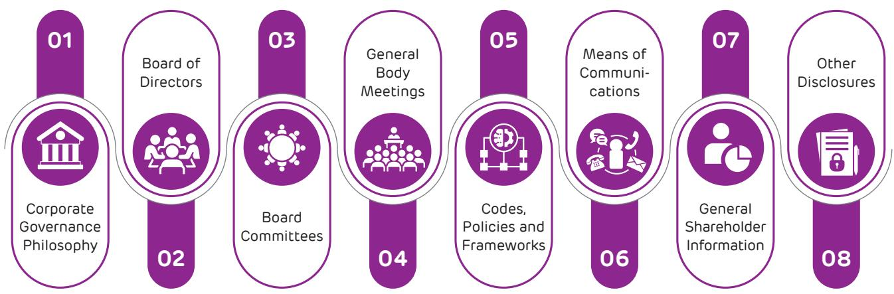

flowchart

```mermaid
graph LR
    01["Corporate Governance Philosophy"] --> 02["Board of Directors"]
    02 --> 03["Board Committees"]
    03 --> 04["General Body Meetings"]
    04 --> 05["Codes, Policies and Frameworks"]
    05 --> 06["Means of Communications"]
    06 --> 07["General Shareholder Information"]
    07 --> 08["Other Disclosures"]
```

# Corporate Governance Philosophy

Courage, Trust and Commitment are the main tenants of our Corporate Governance Philosophy -

• Courage: we shall embrace new ideas and businesses.   
• Trust: we shall believe in our employees and other stakeholders.   
Commitment: we shall standby our promises and adhere to high standards of business.

The Company believes that sustainable and long-term growth of every stakeholder depends upon the judicious and effective use of available resources and consistent endeavour to achieve excellence in business along with active participation in the growth of society, building of environmental balances and significant contribution in economic growth. The cardinal principles such as independence, accountability, responsibility, transparency, fair and timely disclosures, credibility, sustainability, etc. serve as the means for implementing the philosophy of corporate governance in letter and in spirit.

# Governance principles

At the heart of the Company, governance commitment is a one tier Board system with Board of Directors (the “Board”) possessing a disciplined orientation and distinctive priorities.

# Ethics and integrity:

The Board of the Company is committed to the highest integrity standards. Directors commit to abide by the ‘Code of Conduct’, regulations and policies under oath, endeavouring to demonstrate intent and actions consistent with stated values.

# Responsible conduct:

The Boards emphasize the Company’s role in contributing to neighborhoods, terrains, communities and societies. In line with this, the Company is accountable for its environmental and societal impact, corresponded by compliance with laws and regulations. As a mark of responsibility, the Company’s business extends beyond minimum requirements with the objective of emerging as a responsible corporate.

# Accountability and transparency:

The Boards engage in comprehensive financial and non-financial reporting, aligned to best practices relating to disclosures; it follows internal and/or external assurance and governance procedures.

# Key pillars of Corporate Governance Philosophy of the Company

Accurate, uniform and timely dissemination of disclosures of corporate, financials and operational information to all stakeholders   
• Complete and timely disclosure of relevant financial and operational information to enable the Board to play an effective role in guiding strategies   
• Board Governance through specialised sub-committees in the areas of Audit, Risk Management, HR & Nomination, ESG, Corporate Social Responsibility and Stakeholders’ Relationship, etc.   
• Compliance with all relevant laws in both form and substance   
• Effective and clear Governance structure with diverse Board, Board Committees and Senior Management.   
• Robust risk management framework, strong foundation of Code of Conduct and business policies & procedures   
• Well-defined corporate structure that establishes checks, balances and delegation of authority at appropriate levels in the organisation   
• Transparent procedures, practices and decisions based on adequate information

• Oversight of Board on Company's business strategy, major developments and key activities.

The Company is in compliance with the conditions of corporate governance as required under the SEBI (Listing Obligations and Disclosures Requirements) Regulations, 2015 (“SEBI Listing Regulations”), as applicable. .

# Board of Directors

The Board of Directors (“Board”), is the highest authority for the governance and the custodian who push our businesses in the right direction and is responsible for the establishment of cultural, ethical, sustainable and accountable growth of the Company. The Board is constituted with a high level of integrated, knowledgeable and committed professionals. The Board provides strategic guidance and independent views to the Company’s senior management while discharging its fiduciary responsibilities. The Board also provides direction and exercises appropriate control to ensure that the Company is managed in a manner that fulfils stakeholders’ aspirations and societal expectations.

# Size and Composition

The Board of your Company comprises highly experienced persons of repute, eminence and has a good and diverse mix of Executive and Non-Executive Directors with 50% of the Board members comprising Independent Directors including an Independent Woman Director. The Board composition is in conformity with the applicable provisions of Companies Act, 2013 (“Act”), SEBI Listing Regulations, as amended from time to time and other applicable statutory provisions.

As on May 01, 2024, the Board consists of following Directors: 

<table><tr><td>S. No.</td><td>Category</td><td>Name of Director</td><td>% of Total Board size</td></tr><tr><td>1</td><td>Non-Executive Promoter Directors</td><td>i. Mr. Gautam S. Adani, Chairmanii. Mr. Rajesh S. Adani</td><td>33.3%</td></tr><tr><td>2</td><td>Executive Director</td><td>i. Mr. Anil Sardana, MD</td><td>16.6%</td></tr><tr><td>3</td><td>Non-Executive Independent Directors</td><td>i. Mrs. Chandra Iyengarii. Mr. Sushil Kumar Roongtaiii. Mrs. Sangeeta Singh*</td><td>50%</td></tr></table>

MD: Managing Director   
\*appointed as an Additional Director (Non-Executive and Independent) w.e.f. May O1, 2024

Board Composition   
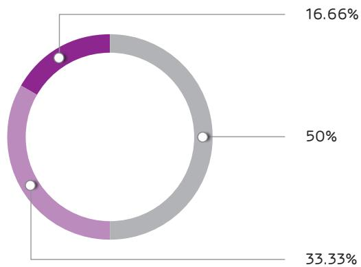

pie

| Segment | Percentage |
|---------|----------|
| Gray    | 50%      |
| Purple  | 33.33%   |
| Dark Purple | 16.66% |

Executive Directors   
Non-Executive Directors   
Independent Directors

83.3%

Non-Executive Directors on the Board

Board Gender Diversity   
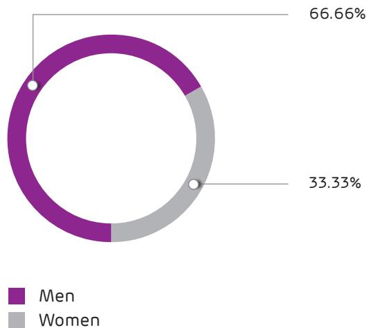

pie

| Gender | Percentage (%) |
| :--- | :--- |
| Men | 66.66 |
| Women | 33.33 |

The present strength of the Board reflects judicious mix of professionalism, competence and sound knowledge which enables the Board to provide effective leadership to the Company.

No Director is related to each other except Mr. Gautam S. Adani and Mr. Rajesh S. Adani, who are related to each other as brothers.

# Brief details of Board members

The brief details of the Directors of the Company are as under:

# Mr. Gautam S. Adani (DIN: 00006273)

# (Chairman and Non-Executive Promoter Director)

Mr. Gautam S. Adani, aged 61 years, is a Non-Executive Promoter Director of the Company.

Mr. Gautam Adani, the Chairman and Founder of the Adani Group, has more than 33 years of business experience. Under his leadership, Adani Group has emerged as a global integrated infrastructure player with interest across Resources, Logistics and Energy verticals. Mr. Adani’s success story is extraordinary in many ways. His journey has been marked by his ambitious and entrepreneurial vision, coupled with great vigour and hard work. This has not only enabled the Group to achieve numerous milestones but also resulted in creation of a robust business model which is contributing towards building sound infrastructure in India.

Mr. Gautam S. Adani holds 1 (one) Equity Share of the Company as on March 31, 2024, in his individual capacity.

Mr. Gautam S. Adani is on the Board of the following public companies: 

<table><tr><td>Listed Public Companies (Category of Directorship)</td><td>Other Public Companies (Category of Directorship)</td></tr><tr><td>Adani Ports And Special Economic Zone Limited (Promoter &amp; Executive)</td><td rowspan="6">Nil</td></tr><tr><td>Adani Total Gas Limited (Promoter &amp; Non-Executive)</td></tr><tr><td>Adani Green Energy Limited (Promoter &amp; Non-Executive)</td></tr><tr><td>Adani Enterprises Limited (Promoter &amp; Executive)</td></tr><tr><td>Ambuja Cements Limited (Non-Executive)</td></tr><tr><td>Adani Energy Solutions Limited (Promoter &amp; Non-Executive)</td></tr></table>

Mr. Gautam S. Adani does not occupy any position in any of the Audit Committee and Stakeholders’ Relationship Committee..

# Mr. Rajesh S. Adani (DIN: 00006322)

# (Non-Executive Promoter Director)

Mr. Rajesh S. Adani, aged 59 years, is a Non-Executive Promoter Director of the Company.

Associated with Adani Group since its inception, Mr. Rajesh Adani is in charge of the operations of the Group and has been responsible for developing its business relationships. His proactive, personalized approach to the business and competitive spirit has helped towards the growth of the Group and its various businesses.

Mr. Rajesh S. Adani holds 1 (one) Equity Share of the Company as on March 31, 2024, in his individual capacity.

Mr. Rajesh S. Adani is on the Board of the following public companies: 

<table><tr><td>Listed Public Companies (Category of Directorship)</td><td>Other Public Companies (Category of Directorship)</td></tr><tr><td>Adani Green Energy Limited(Promoter &amp; Non- Executive)</td><td rowspan="4">Adani Welspun Exploration Limited(Non-Executive)</td></tr><tr><td>Adani Energy Solutions Limited(Promoter &amp; Non- Executive)</td></tr><tr><td>Adani Enterprises Limited(Promoter &amp; Executive)</td></tr><tr><td>Adani Ports And Special Economic Zone Limited(Promoter &amp; Non- Executive)</td></tr></table>

Mr. Rajesh S. Adani is chairman of the following committees (other than the Company): 

<table><tr><td>Name of the Companies</td><td>Name of the Committee</td></tr><tr><td>Nil</td><td>Nil</td></tr></table>

Mr. Rajesh S. Adani is member of the following committees (other than the Company): 

<table><tr><td>Name of the Companies</td><td>Name of the Committee</td></tr><tr><td>Adani Energy Solutions Limited</td><td>Stakeholders Relationship Committee</td></tr></table>

# Mr. Anil Kumar Sardana (DIN: 00006867)

# (Managing, Executive Director)

Mr. Anil Sardana, aged 65 years, is an Executive Director of the Company

Mr. Anil Sardana comes with over 3 decades of experience in the power and infrastructure sector. He started his

career with NTPC and subsequently worked with BSES and Tata Group companies in the power and Infra sector, ranging from generation, power systems design, power distribution, Telecom and project management. Prior to joining the Adani Group, he was the MD & CEO of Tata Power Group based out of Mumbai. Mr. Sardana is an honours graduate in Electrical Engineering from Delhi University, a Cost Accountant (ICWAI) and also holds a PGDM from All India Management Association. He has undergone management training from reputed institutes like IIM – A and “Specialised Residual Life Assessment course for Assets” at EPRI – USA.

Mr. Anil Kumar Sardana is on the Board of the following public companies: 

<table><tr><td>Listed Public Companies (Category of Directorship)</td><td>Other Public Companies (Category of Directorship)</td></tr><tr><td rowspan="5">Adani Energy Solutions Limited(Executive)</td><td>Adani ElectricityNavi Mumbai Limited(Non - Executive)</td></tr><tr><td>Adani Electricity Mumbai Infra Limited(Non - Executive)</td></tr><tr><td>AEML Seepz Limited(Non - Executive)</td></tr><tr><td>Adani Data Networks Limited(Non - Executive)</td></tr><tr><td>Adani Electricity Mumbai Limited(Non - Executive)</td></tr></table>

Mr. Anil Kumar Sardana is chairman of the following committees (other than the Company): 

<table><tr><td>Name of the Companies</td><td>Name of the Committee</td></tr><tr><td>Nil</td><td>Nil</td></tr></table>

Mr. Anil Kumar Sardana is member of the following committees (other than the Company) 

<table><tr><td>Name of the Companies</td><td>Name of the Committee</td></tr><tr><td>Adani Energy Solutions Limited</td><td>Stakeholders Relationship Committee</td></tr><tr><td>Adani Energy Solutions Limited</td><td>Risk Management Committee</td></tr><tr><td>Adani Energy Solutions Limited</td><td>Corporate Social Responsibility Committee</td></tr></table>

# Mrs. Chandra Iyengar (DIN: 02821294) (Non-Executive & Independent Director)

Mrs. Chandra Iyengar, aged 73 years, is a Non-Executive - Independent Director of the Company

Mrs. Chandra Iyengar holds degree in MA from Miranda House, New Delhi and is an officer of the 1973 batch of the Indian Administrative Services (IAS).

Over the course of her career, she has led several departments in the Government of Maharashtra and the Government of India, such as Women & Child Development, Higher & Technical Education, Rural Development, and Health. As the Secretary for Women & Child Development for the Government of Maharashtra, she was responsible for drafting and implementing the first-ever state policy for women’s empowerment in India.

She has served as Additional Chief Secretary – Home Ministry for the Government of Maharashtra and as a Director on the Board of Bharat Heavy Electricals Limited (BHEL) and also as a Chairperson for the Maharashtra Energy Regulatory Commission (MERC).

Mrs. Chandra Iyengar is on the Board of the following public companies: 

<table><tr><td>Listed Public Companies (Category of Directorship)</td><td>Other Public Companies (Category of Directorship)</td></tr><tr><td>The Bombay Dyeing And Manufacturing Company LimitedNon- Executive</td><td>Adani Electricity Mumbai LimitedNon- Executive</td></tr><tr><td>The Bombay Burmah Trading Corporation LimitedNon- Executive</td><td>Maharashtra Industrial Township LimitedNon- Executive</td></tr></table>

Mrs. Chandra Iyengar is Chairman of the following committees (other than the Company): 

<table><tr><td>Name of the Companies</td><td>Name of the Committee</td></tr><tr><td>Maharashtra Industrial Township Limited</td><td>Audit Committee</td></tr></table>

Mrs. Chandra Iyengar is Member of the following committees (other than the Company): 

<table><tr><td>Name of the Companies</td><td>Name of the Committee</td></tr><tr><td>The Bombay Dyeing And Manufacturing Company Limited</td><td>Audit Committee</td></tr><tr><td>The Bombay Burmah Trading Corporation Limited</td><td>Audit Committee</td></tr><tr><td>Adani Electricity Mumbai Limited</td><td>Audit Committee</td></tr></table>

# Mrs. Sangeeta Singh\* (DIN: 10593952) (Non-Executive & Independent Director)

Mrs. Sangeeta Singh\*, aged 61 years, is a Non-Executive - Independent Director of the Company

Mrs. Sangeeta Singh holds the degree of M.Sc. (Public Economics) from University of Birmingham (UK), M. Phil. (International Relations) from Jawaharlal Nehru University (New Delhi) and M.A. (Political Science) from Jawaharlal Nehru University (New Delhi). She has worked in various capacities as Member of Central Board of Direct Taxes (CBDT), Principal Chief Commissioner of Income Tax amongst others. As a Member of CBDT, she has led the administering and implementing of Income Tax Act and Rules both for department and taxpayers and was incharge of national level revenue collection by the Department.

Mrs. Sangeeta Singh is on the Board of the following public companies: 

<table><tr><td>Listed Public Companies (Category of Directorship)</td><td>Other Public Companies (Category of Directorship)</td></tr><tr><td>Nil</td><td>Nil</td></tr></table>

Mrs. Sangeeta Singh is Chairman of the following committees (other than the Company): 

<table><tr><td>Name of the Companies</td><td>Name of the Committee</td></tr><tr><td>Nil</td><td>Nil</td></tr></table>

Mrs. Sangeeta Singh is Member of the following committees (other than the Company): 

<table><tr><td>Name of the Companies</td><td>Name of the Committee</td></tr><tr><td>Nil</td><td>Nil</td></tr></table>

\* appointed as Additional Director (Non-Executive and Independent) w.e.f. May 1, 2024

# Mr. Sushil Kumar Roongta (DIN: 00309302) (Non-Executive & Independent Director)

Mr. Sushil Kumar Roongta, aged 74 years is a Non-Executive & Independent Director of the Company.

Mr. Sushil Kumar Roongta is an Electrical Engineer from Birla Institute of Technology & Science (BITS), Pilani and a Post Graduate Diploma in Business Management - International Trade, from the Indian Institute of Foreign Trade (IIFT), New Delhi. He is a Fellow of All India Management Association (AIMA). Mr. Roongta has a wide and varied experience in public sector undertakings.

Mr. Roongta is the former Chairman of Steel Authority of India Limited (SAIL), one of India’s largest public sector company. He was also the first Chairman of International Coal Ventures Limited (ICVL) – a JV of five leading PSUs i.e. SAIL, CIL, RINL, NMDC & NTPC.

Mr. Roongta has also served as a member of various Apex Chambers - Chairman of ‘Steel Committee’ of FICCI, member of National Council of CII and Advisory Council of ASSOCHAM. Mr. Roongta was also President of Institute for Steel Development & Growth. He was also a member of the Executive Committee of the World Steel Association - the Apex Body for formulation of policy for world steel. He was Chairman of Board of Governors of IIT-Bhubaneswar.

He has been part of various think tanks and is widely regarded as one of the principal experts in the field of metal, power and public sector turnarounds. He was Chairman of ‘Panel of Experts on reforms in Central Public sector enterprises’ constituted by Planning Commission, widely known as ‘Roongta Committee’, its report is taken as benchmark for Public sector Reforms today.

Mr. Roongta is the proud recipient of a number of awards including [Standing conference of public enterprises | SCOPE Award for Excellence & Outstanding Contribution to the Public Sector Management] – Individual Category 2007-08 and IIM-JRD Tata award for excellence in Corporate Leadership in Metallurgical industries, 2016. Mr. Roongta is also associated with educational institutions and various Non-Profit organizations.

Mr. Sushil Kumar Roongta is on the Board of the following public companies: 

<table><tr><td>Listed Public Companies (Category of Directorship)</td><td>Other Public Companies (Category of Directorship)</td></tr><tr><td>Jubilant Pharmova LimitedNon- Executive</td><td>Hero Steels LimitedNon- Executive</td></tr><tr><td>Jubilant Ingrevia LimitedNon- Executive</td><td>Bharat Aluminium Co LtdNon- Executive</td></tr><tr><td>Zuari Industries LimitedNon- Executive</td><td></td></tr><tr><td>Titagarh Rails Systems LimitedNon- Executive</td><td></td></tr><tr><td>JK Paper Limited</td><td></td></tr></table>

Mr. Sushil Kumar Roongta is Chairman of the following committees (other than the Company): 

<table><tr><td>Name of the Companies</td><td>Name of the Committee</td></tr><tr><td>Jubilant Ingrevia Ltd</td><td>Audit Committee</td></tr><tr><td>Hero Steels Ltd</td><td>Audit Committee</td></tr></table>

Mr. Sushil Kumar Roongta is Member of the following committees (other than the Company): 

<table><tr><td>Name of the Companies</td><td>Name of the Committee</td></tr><tr><td>JK Paper Ltd</td><td>Stakeholders Relationship Committee</td></tr><tr><td>Jubilant Pharmova Ltd</td><td>Audit Committee</td></tr><tr><td>Jubilant Ingrevia Ltd</td><td>Stakeholders Relationship Committee</td></tr><tr><td>Zuari Industries Ltd</td><td>Audit CommitteeStakeholders Relationship Committee</td></tr><tr><td>Bharat Aluminium Co Ltd</td><td>Audit Committee</td></tr></table>

Board Age profile and Board Experience is as under:   
Board Age Profile   
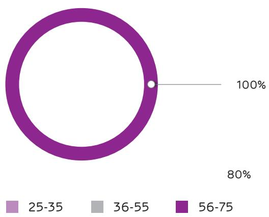

pie

| Category | Value (%) |
|---|---|
| 25-35 | 100 |
| 36-55 | 80 |
| 56-75 | 100 |

Board Experience   
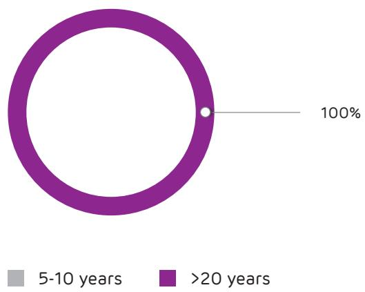

pie

| Category | Value (%) |
|---|---|
| 5-10 years | 100 |
| >20 years | 100 |

# Skills / expertise competencies of the Board of Directors:

The following is the list of core skills / competencies identified by the Board of Directors as required in the context of the Company’s business and that the said skills are available within the Board Members:

# Business Leaderships

Leadership experience including in areas of business development, strategic planning, succession planning, driving change and long-term growth and guiding the Company and its senior management towards its vision and values.

# Financial Expertise

Knowledge and skills in accounting, finance, treasury management, tax and financial management of large corporations with understanding of capital allocation, funding and financial reporting processes.

# Risk Management

Ability to understand and assess the key risks to the organization, legal compliances and ensure that appropriate policies and procedures are in place to effectively manage risk.

# Global Experiences

Global mindset and staying updated on global market opportunities, market opportunities, competition experience in driving business success around the world with an understanding of diverse business environments, economic conditions and regulatory frameworks.

# Merger & Acquisition

Ability to assess ‘build or buy’ & timing of decisions, analyze the fit of a target with the Company’s strategy and evaluate operational integration plans

# Corporate Governance & ESG

Experience in implementing good corporate governance practices, reviewing compliance and governance practices for a sustainable growth of the Company and protecting stakeholders interest.

# Technology & Innovations

Experience or knowledge of emerging areas of technology such as digital, artificial intelligence, cyber security, datacentre, data security etc.

# Industry and Sector Experience

Knowledge and experience in the business sector to provide strategic guidance to the management in fast changing environment

<table><tr><td rowspan="2">Name of Director</td><td colspan="7">Areas of Skills/ Expertise</td></tr><tr><td>Business Leadership</td><td>Financial Expertise</td><td>Risk Management</td><td>Global Experience</td><td>Corporate Governance &amp; ESG</td><td>Merger &amp; Acquisition</td><td>Technology &amp; Innovation</td></tr><tr><td>Mr. Gautam Adani</td><td>√</td><td>√</td><td>√</td><td>√</td><td>√</td><td>√</td><td>√</td></tr><tr><td>Mr. Rajesh Adani</td><td>√</td><td>√</td><td>√</td><td>√</td><td>√</td><td>√</td><td>√</td></tr><tr><td>Mr. Anil Sardana</td><td>√</td><td>√</td><td>√</td><td>√</td><td>√</td><td>√</td><td>√</td></tr><tr><td>Mr. Mukesh Shah*</td><td>√</td><td>√</td><td>√</td><td>-</td><td>√</td><td>-</td><td>-</td></tr><tr><td>Ms. Chandra Iyengar</td><td>√</td><td>√</td><td>√</td><td>-</td><td>√</td><td>√</td><td>-</td></tr><tr><td>Mr. Sushil Kumar Roongta</td><td>√</td><td>√</td><td>√</td><td>√</td><td>√</td><td>-</td><td>-</td></tr><tr><td>Mrs. Sangeeta Singh**</td><td>-</td><td>√</td><td>√</td><td>-</td><td>√</td><td>√</td><td>√</td></tr></table>

\*ceased to be Independent Director w.e.f. the close of the business hours on March 30, 2024   
\*\*appointed as an Additional Director (Non-Executive and Independent) w.e.f. May 01, 2024   
Note - Each Director may possess varied combinations of skills/ expertise within the described set of parameters and it is not necessary that all Directors possess all skills/ expertise listed therein.

# Directors’ selection, appointment and tenure:

The Directors of the Company are appointed / reappointed by the Board on the recommendation of the Nomination and Remuneration Committee and approval of the Shareholders at the General Meeting(s) or through means of Postal Ballot. In accordance with the Articles of Association of the Company and provisions of the Act, all the Directors, except the Managing Director and Independent Directors, of the Company, are liable to retire by rotation at the Annual General Meeting (“AGM”) each year and, if eligible, offer their candidature for re-appointment. The Executive Directors on the Board have been appointed as per the provisions of the Act and serve in accordance with the terms of employment with the Company.

As regards the appointment and tenure of Independent Directors, following is the policy adopted by the Board:

The Company has adopted the provisions with respect to appointment and tenure of Independent Directors which are consistent with the Act and Listing Regulations   
• In keeping with progressive governance practices, it is resolved to appoint all new Independent Directors for a maximum 2 (two) terms of up to 3 (three) years each.

None of the Independent Director(s) of the Company resigned during the year before the expiry of their tenure.

In compliance with Regulation 26 of the SEBI Listing Regulations, none of the Directors is a Director of more than 10 (ten) Committees or acts as an Independent

Director in more than 7 (seven) Listed Companies. Further, none of the Directors on the Company's Board is a member of more than 10 (ten) committees and chairperson of more than 5 (five) committees (committees being, Audit Committee and Stakeholders' Relationship Committee) across all the companies in which he/she is a Director. All the Directors have made necessary disclosures regarding committee positions held by them in other Companies.

Any person who becomes Director or Key Managerial Personnel shall be covered under the Directors’ and Officers’ Liability Insurance Policy. The Company has provided insurance cover in respect of legal action against its Directors and Key Managerial Personnel under the Directors’ and Officers’ Liability Insurance.

# Independent Directors

The Independent Directors are the Board members who are required to meet baseline definition and criteria on ‘independence’ as set out in Regulation 16 of Listing Regulations, Section 149(6) of the Companies Act, 2013 read with rules and Schedule IV thereto and other applicable regulations. In terms of Regulation 25(8) of Listing Regulations. Independent Directors of the Company have confirmed that they are not aware of any circumstance or situation, which exist or may be reasonably anticipated, that could impair or impact their ability to discharge their duties.

Accordingly, based on the declarations received from all Independent Directors, the Board of Directors has confirmed that Independent Directors of the Company fulfill the conditions specified in the Companies Act, 2013 and Listing Regulations and are independent of the management. Further, the Independent Directors confirmed that they have enrolled themselves in the Independent Directors’ Databank maintained by the Indian Institute of Corporate Affairs. As mentioned earlier in this report, the Board includes 2 (two) Independent Directors as on March 31, 2024.

The Company issues formal letter of appointment to the Independent Directors at the time of their appointment / re-appointment. The terms and conditions of the appointment of Independent Directors are available on the Company’s website at https://www.adanipower.com/-/ media/Project/Power/Investors/Corporate-Governance/ Policies/ID-Terms-and-Conditions-of-Appointment.pdf.

# Changes in the Board during the FY 2023-24

1. Mr. Gautam S. Adani (DIN: 00006273), Director is retiring at the ensuing AGM and being eligible, offers himself for re-appointment.   
2. Mr. Mukesh Shah (DIN: 00084402) ceased to be an Independent Director of the Company with effect from the close of business hours on March 30, 2024

# Changes in the Board subsequent to the FY 2023-24:

On the recommendation of Nomination & Remuneration Committee, Mrs. Sangeeta Singh (DIN: 10593952) has been appointed as Independent Director by the Board for a period of 3 (three) years w.e.f. May 01 2024, up to April 30, 2027, subject to approval of members.

Brief resume(s) of the Directors proposed to be appointed / re-appointed are given in the Explanatory Statement annexed to the Notice convening the 28th Annual General Meeting.

# Board Meetings and Procedure

# Meetings Schedule and Agenda

The schedule of the Board meetings and Board Committee meetings are finalized in consultation with the Board members and communicated to them in advance. The Board Calendar for the financial year 2024-25 has been disclosed later in this report and has also been uploaded on the Company’s website. Additional meetings are called, when necessary, to consider the urgent business matters.

All committee recommendations placed before the Board during the year under review were unanimously accepted by the Board.

The Board devotes its significant time in evaluation of current and potential strategic issues and reviews Company’s business plans, corporate strategy and risk management issues based on the markets it operates in and in light of global industry trends and developments to help achieve its strategic goals.

The Chief Financial Officer and other Senior Management members are invited to the Board and Committee meetings to present updates on the items being discussed at the meeting. In addition, the functional heads of various business segments/ functions are also invited at regular intervals to present updates on the respective business functions.

# Availability of information to the Board

The Board has complete and unfettered access to all relevant information within the Company, to the Senior Management and all the auditors of the Company. Board Meetings are governed by structured agenda. All major agenda items are backed by comprehensive background information to enable the Board to take informed decisions. The Company Secretary prepares the detailed agenda for the meetings, in consultation with the Senior Management.

Agenda papers and Notes on Agenda are circulated to the Directors, in advance, in the defined Agenda format. All material information is circulated along with Agenda papers for facilitating meaningful and focused discussions at the meeting. Where it is not practicable to attach any document to the Agenda, the same is tabled before the meeting with specific reference to this effect in the Agenda. In special and exceptional circumstances, additional or supplementary item(s) on the Agenda are permitted. In order to transact some urgent business, which may come up after circulation of agenda papers, the same is placed before the Board by way of Table Agenda or Chairman’s Agenda. Frequent and detailed deliberation on the agenda provides the strategic roadmap for the future growth of the Company.

Minimum 4 (four) pre-scheduled Board meetings are held every year. Apart from the above, additional Board meetings are convened by giving appropriate notice to address the specific needs of the Company. In case of business exigencies or urgency of matters, resolutions are also passed by way of circulation.

Detailed presentations are made at the Board / Committee meetings covering Finance and operations of the Company, terms of reference of the Committees, business environment, all business areas of the Company including business opportunities, business strategy and the risk management practices before taking on record the quarterly / half yearly / annual financial results of the Company.

The required information as enumerated in Part A of Schedule II to SEBI Listing Regulations is made available to the Board of Directors for discussions and consideration at every Board Meeting. The Board periodically reviews compliance reports of all laws applicable to the Company as required under Regulation 17(3) of the SEBI Listing Regulations.

The important decisions taken at the Board / Committee meetings are communicated to departments concerned promptly. Action taken report on the decisions taken at the meeting(s) is placed at the immediately succeeding meeting of the Board / Committee for noting by the Board / Committee.

# During the year under review, Board met 5 (five) times on:

flowchart

```mermaid
graph LR
    A["01 May 05, 2023"] --> B["02 August 03, 2023"]
    B --> C["03 November 02, 2023"]
    D["04 January 25, 2024"] --> E["05 March 22, 2024"]
```

The Board meets at least once in every quarter to review the Company’s operations and financial performance. The maximum gap between two meetings is not more than 120 days. The necessary quorum was present in all the meetings.

The attendance of the Board members at the Board meetings and the Annual General Meeting of the Company held during FY 2023-24, is as follows:

<table><tr><td rowspan="2">Name Of Director</td><td rowspan="2">AGM held on July 27, 2023</td><td colspan="5">Board Meetings</td><td rowspan="2">Total Board meetings held during tenure</td><td rowspan="2">Board meetings attended</td><td rowspan="2">% of attendance</td></tr><tr><td>1</td><td>2</td><td>3</td><td>4</td><td>5</td></tr><tr><td>Mr. Gautam S. Adani</td><td></td><td></td><td></td><td></td><td></td><td></td><td>5</td><td>4</td><td>80</td></tr><tr><td>Mr. Rajesh S. Adani</td><td></td><td></td><td></td><td></td><td></td><td></td><td>5</td><td>4</td><td>80</td></tr><tr><td>Mr. Anil Sardana</td><td></td><td></td><td></td><td></td><td></td><td></td><td>5</td><td>5</td><td>100</td></tr><tr><td>Mr. Sushil Kumar Roongta</td><td></td><td></td><td></td><td></td><td></td><td></td><td>5</td><td>5</td><td>100</td></tr><tr><td>Mr. Mukesh Shah*</td><td></td><td></td><td></td><td></td><td></td><td></td><td>5</td><td>5</td><td>100</td></tr><tr><td>Mrs. Chandra Iyengar</td><td></td><td></td><td></td><td></td><td></td><td></td><td>5</td><td>5</td><td>100</td></tr></table>

Attended through video conference

Leave of absence

Attended in Person

Chairman

\*ceased to be Independent Director w.e.f. the close of the business hours on March 30, 2024

50%

Independent Directors

5

Meetings

6

Members

100%

Average Attendance

During the year, the Board of Directors accepted all recommendations of the Committees of the Board, which were statutory in nature and required to be recommended by the Committee and approved by the Board of Directors. Hence, the Company is in compliance of condition of clause 10 (j) of schedule V of the SEBI Listing Regulations.

# Meeting of Independent Directors:

The Independent Directors meet at least once in a year, without the presence of Executive Directors or Management representatives. They also have separate

meeting(s) with the Chairman of the Board, to discuss issues and concerns, if any. The Independent Directors met once during the Financial Year 2023-24, on March 22, 2024. The Independent Directors inter alia discuss the issues arising out of the Committee Meetings and Board discussion including the quality, quantity and timely flow of information between the Company Management and the Board that is necessary for the Board to effectively and reasonably perform its duties. In addition to these formal meetings, interactions outside the Board Meetings also take place between the Chairman and Independent Directors.

Statutory Auditors also have independent access to the members of the Audit Committee to discuss internal audit effectiveness, control environment and their general feedback. The Independent Directors also have access to Secretarial Auditor, Cost Auditor and the management for discussions and questions, if any.

# Directors’ Induction and Familiarisation

The Board Familiarisation Programme comprises of the following:

• Induction Programme for Directors including Non-Executive Directors   
• Immersion sessions on business and functions; and   
• Strategy sessions

All new Directors are taken through a detailed induction and familiarization program when they join the Board of the Company. The induction program is an exhaustive one that covers the history and culture of Adani portfolio of Companies, background of the Company and its growth, various milestones in the Company’s existence since its incorporation, the present structure and an overview of the businesses and functions.

Deep dives and immersion sessions are conducted by senior executives on their respective functions. Key aspects that are covered in these sessions include:

• Industry / market trends   
• Company’s operations including those of major subsidiaries   
• Growth Strategy  
• ESG Strategy and performance

As part of familiarization program, the Company conducts Directors’ Engagement Series where the Board is apprised about critical topics such as global trends in the domain of ESG, Capital Market, Risk Management, Credit Profile, Financial Controls beside general awareness about other Adani portfolio companies and key developments. During the year, 4 (four) such events were conducted on August 2023, September 2023, November 2023 and February, 2024. Each event has a minimum of two sessions of two hours each followed by Q&A session of one hour. Site visits are also organized during one or two such events.

Apart from the above, the Company also organizes an annual strategy meet with the Board to deliberate on various topics related to strategic planning, progress of ongoing strategic initiatives, risks to strategy execution and the need for new strategic programs to achieve the Company’s long-term objectives. This serves the dual purpose of providing the Board members a platform to bring their expertise to various strategic initiatives, while also providing an opportunity for them to understand detailed aspects of execution and challenges relating to the specific theme.

In summary, through above events/meetings, members of the Board get a comprehensive and balanced perspective on the strategic issues facing the Company, the competitive differentiation being pursued by the Company, and an overview of the execution plan. In addition, this event allows the members of the Board to interact closely with the senior leadership of the Company.

# Remuneration Policy:

The Remuneration Policy of the Company is directed towards rewarding performance, based on review of achievements on a periodic basis. The Company endeavors to attract, retain, develop and motivate the high-caliber executives and to incentivize them to develop and implement the Group’s Strategy, thereby enhancing the business value and maintain a high-performance workforce. The Policy ensures that the level and composition of remuneration of the Directors is optimum.

# i) Remuneration to Non-Executive Directors:

The Board of Directors of the Company at their Meeting held on May 1, 2024 approved the payment of remuneration by way of commission to the Non-Executive and Independent Directors of the Company, of a sum not exceeding 1% per annum of the net profits of the Company, calculated in accordance with the applicable provisions of the Act. Pursuant to this, the remuneration by way of commission to the Non-Executive and Independent Directors is decided by the Board of Directors. In addition to commission, the Independent Directors are paid sitting fees of \` 50,000 for attending Board and Audit Committee meetings and \` 25,000 for attending other committees along with actual reimbursement of expenses incurred for attending each meeting of the Board and Committees.

The Company has taken a Directors’ & Officers’ Liability Insurance Policy.

# ii) Performance Evaluation Criteria for Independent Directors:

The performance evaluation criteria for Independent Directors are determined by the Nomination and Remuneration Committee. An indicative list of factors that may be evaluated include participation and contribution by a Director, commitment, effective deployment of knowledge and expertise, effective management of relationship with stakeholders, integrity and maintenance of confidentiality and independence of behaviour and judgement.

# iii) Remuneration to Executive Directors:

The remuneration of the Executive Directors is recommended by the Nomination and Remuneration Committee to the Board based on criteria such as industry benchmarks, the Company’s performance vis-à-vis the industry, responsibilities shouldered, performance/track record, macro-economic review on remuneration packages of heads of other organisations. The pay structure of Executive

Directors has appropriate success and sustainability metrices built in. On the recommendation of the Nomination and Remuneration Committee, the remuneration paid/payable by way of salary, perquisites and allowances (fixed component), incentive and/or commission (variable components), to its Executive Directors within the limits prescribed under the Act is approved by the Board of Directors and by the Members in the General Meeting.

The Executive Directors are not being paid sitting fees for attending meetings of the Board of Directors and its Committee.

# Details of Remuneration:

# i) Non-Executive Directors:

The details of sitting fees and commission paid to Non-Executive Directors during the financial year 2023-24 are as under:

(\` In lakhs) 

<table><tr><td>Name</td><td>Commission</td><td>Sitting Fees</td><td>Total</td></tr><tr><td>Mr. Gautam S. Adani</td><td>-</td><td>-</td><td>-</td></tr><tr><td>Mr. Rajesh S. Adani</td><td>-</td><td>-</td><td>-</td></tr><tr><td>Mr. Anil Sardana</td><td>-</td><td>-</td><td>-</td></tr><tr><td>Mr. Sushil Kumar Roongta</td><td>-</td><td>14,00,000</td><td>34,00,000</td></tr><tr><td>Mr. Mukesh Shah</td><td>-</td><td>14,00,000</td><td>34,00,000</td></tr><tr><td>Mrs. Chandra Iyengar</td><td>-</td><td>12,50,000</td><td>32,50,000</td></tr></table>

Other than sitting fees paid to Non-Executive Directors, there were no pecuniary relationships or transactions by the Company with any of the Non-Executive Directors of the Company. The Company has not granted stock options to Non-Executive Directors.

# ii) Executive Directors:

Details of remuneration paid/payable to Managing Director & CEO and Executive Director during the financial year 2023-24 are as under:

(\` in crore) 

<table><tr><td>Name</td><td>Salary</td><td>Perquisites, Allowances &amp; other Benefits</td><td>Commission</td><td>Total</td></tr><tr><td>Mr. Anil Sardana, Managing Director</td><td colspan="4">Nil</td></tr><tr><td>Mr. S. B. Khyalia, CEO</td><td>5.63</td><td>Nil</td><td>Nil</td><td>5.63</td></tr></table>

# iii) Details of shares of the Company held by Directors as on March 31, 2024 are as under:

<table><tr><td>Name</td><td>No. of shares held</td></tr><tr><td>Mr. Gautam S. Adani</td><td>1</td></tr><tr><td>Mr. Rajesh S. Adani</td><td>1</td></tr><tr><td>Mr. Mukesh Shah*</td><td>6,895</td></tr><tr><td>Mr. Gautam S. Adani / Mr. Rajesh S. Adani (on of behalf S. B. Adani Family Trust)</td><td>1,42,16,12,453</td></tr></table>

\*ceased to be Independent Director w.e.f. the close of the business hours on March 30, 2024.

Except above, none of Directors of the Company holds equity shares of the Company in their individual capacity. The Company does not have any Employees’ Stock Option Scheme and there is no separate provision for payment of Severance Fees.

# Board Committees

The Board Committees play a vital role in ensuring sound Corporate Governance practices. The Committees are constituted to handle specific activities and ensure speedy resolution of the diverse matters. The Board Committees are set up under the formal approval of the Board to carry out clearly defined roles under which are considered to be performed by members of the Board, as a part of good governance practice. The Board supervises the execution of its responsibilities by the Committees and is responsible for their action. The minutes of the meetings of all the Committees are placed before the Board for review.

The Board has constituted the following Committees / Sub-Committees:   
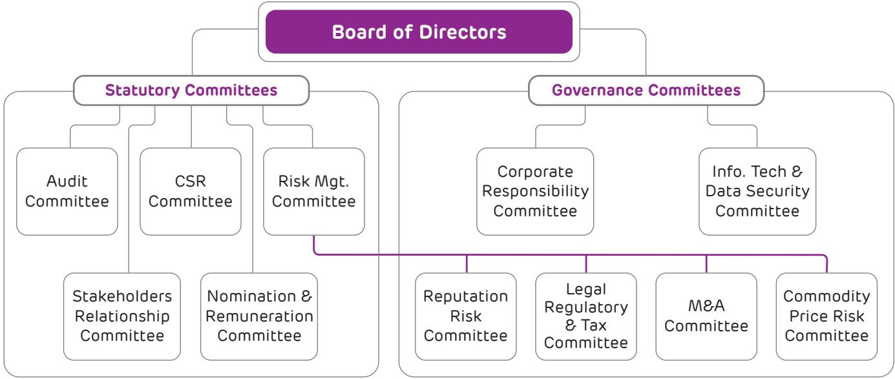

flowchart

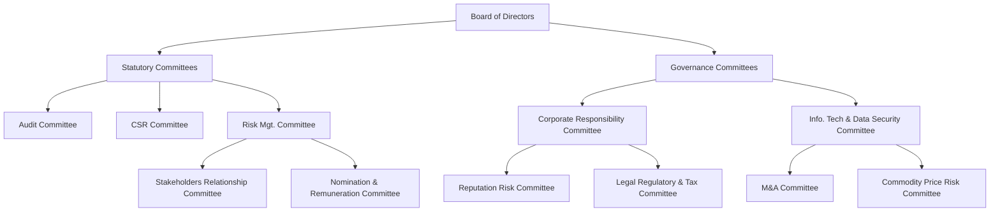
```mermaid
graph TD
    A["Board of Directors"] --> B["Statutory Committees"]
    A --> C["Governance Committees"]
    B --> D["Audit Committee"]
    B --> E["CSR Committee"]
    B --> F["Risk Mgt. Committee"]
    F --> G["Stakeholders Relationship Committee"]
    F --> H["Nomination & Remuneration Committee"]
    C --> I["Corporate Responsibility Committee"]
    C --> J["Info. Tech & Data Security Committee"]
    I --> K["Reputation Risk Committee"]
    I --> L["Legal Regulatory & Tax Committee"]
    J --> M["M&A Committee"]
    J --> N["Commodity Price Risk Committee"]
```

# Statutory Committees

# Audit Committee

The Audit Committee acts as a link among the Management, the Statutory Auditors, Internal Auditors and the Board of Directors to oversee the financial reporting process of the Company. The Audit Committee’s purpose is to oversee the quality and integrity of accounting, auditing and financial reporting process including review of the internal audit reports and action taken report. A detailed charter of the Audit Committee is available on the website of the Company at https://www.adanipower.com/investors/board-and-committee-charters

The Audit Committee comprises solely of Independent Directors to enable independent and transparent review of financial reporting process and internal control mechanism with an objective to further strengthen the confidence of all stakeholders.

# Terms of Reference:

The powers, role and terms of reference of the Audit Committee covers the areas as contemplated under SEBI Listing Regulations and Section 177 of the Act. The brief terms of reference of Audit Committee are as under:

<table><tr><td>Terms of Reference</td><td>Frequency</td></tr><tr><td>To oversee the Company&#x27;s financial reporting process and the disclosure of its financial information to ensure that the financial statement is correct, sufficient and credible</td><td></td></tr><tr><td>To recommend for appointment, remuneration and terms of appointment of statutory and internal auditors of the company</td><td></td></tr><tr><td>To approve availing of the permitted non-audit services rendered by the Statutory Auditors and payment of fees thereof</td><td></td></tr></table>

To review, with the management, the annual financial statements and auditor’s report thereon before submission to the Board for approval, with particular reference to:

<table><tr><td>Terms of Reference</td><td>Frequency</td></tr><tr><td>Matters required to be included in the Director's Responsibility Statement to be included in the Board's report in terms of Section 134(3)(c) of the Companies Act, 2013</td><td></td></tr><tr><td>Changes, if any, in accounting policies and practices and reasons for the same</td><td></td></tr><tr><td>Major accounting entries involving estimates based on the exercise of judgment by the management</td><td></td></tr><tr><td>Significant adjustments made in the financial statements arising out of audit findings</td><td></td></tr><tr><td>Compliance with listing and other legal requirements relating to financial statements</td><td></td></tr><tr><td>Disclosure of any related party transactions</td><td></td></tr><tr><td>Modified opinion(s) in the draft audit report</td><td></td></tr><tr><td>To review, with the management, the quarterly financial statements before submission to the board for approval</td><td></td></tr><tr><td>To review, with the management, the statement of uses/ application of funds raised through an issue (public issue, rights issue, preferential issue, etc.), the statement of funds utilized for purposes other than those stated in the offer document / prospectus/ notice and the report submitted by the monitoring agency, monitoring the utilisation of proceeds of a public or rights issue, and making appropriate recommendations to the Board to take up steps in this matter</td><td></td></tr><tr><td>To review and monitor the Auditor's independence and performance, and effectiveness of audit process</td><td></td></tr><tr><td>To approve or any subsequent modification of transactions of the company with related parties</td><td></td></tr><tr><td>To scrutinise inter-corporate loans and investments</td><td></td></tr><tr><td>To undertake valuation of undertakings or assets of the company, wherever it is necessary</td><td></td></tr><tr><td>To evaluate internal financial controls and risk management systems</td><td></td></tr><tr><td>To review, with the management, the performance of statutory and internal auditors, adequacy of the internal control systems</td><td></td></tr><tr><td>To review the adequacy of internal audit function, if any, including the structure of the internal audit department, staffing and seniority of the official heading the department, reporting structure coverage and frequency of internal audit</td><td></td></tr><tr><td>To discuss with internal auditors of any significant findings and follow up there on</td><td></td></tr><tr><td>To review the findings of any internal investigations by the internal auditors into matters where there is suspected fraud or irregularity or a failure of internal control systems of a material nature and reporting the matter to the board</td><td></td></tr><tr><td>To discuss with statutory auditors before the audit commences, about the nature and scope of audit as well as post-audit discussion to ascertain any area of concern</td><td></td></tr><tr><td>To look into the reasons for substantial defaults, if any, in the payment to the depositors, debenture holders, shareholders (in case of non-payment of declared dividends) and creditors</td><td></td></tr><tr><td>To review the functioning of the Whistle Blower mechanism</td><td></td></tr><tr><td>To approve appointment of Chief Financial Officer after assessing the qualifications, experience and background, etc. of the candidate</td><td></td></tr><tr><td>To review financial statements, in particular the investments made by the Company's unlisted subsidiaries</td><td></td></tr><tr><td>To review compliance with the provisions of SEBI Insider Trading Regulations and verify that the systems for internal control are adequate and are operating effectively</td><td></td></tr><tr><td>To review the utilization of loans and/ or advances from investment by the holding company in the subsidiary exceeding rupees 100 Crore or 10% of the asset size of the subsidiary, whichever is lower including existing loans / advances / investments</td><td></td></tr><tr><td>To oversee the company's disclosures and compliance risks, including those related to climate</td><td></td></tr><tr><td>To consider and comment on rationale, cost benefits and impact of schemes involving merger, demerger, amalgamation etc., on the listed entity and its shareholders</td><td></td></tr><tr><td>To review key significant issues, tax and regulatory / legal report which is likely to have significant impact on financial statements and management's report on actions taken thereon</td><td></td></tr><tr><td>To discuss with the management regarding pending technical and regulatory matters that could affect the financial statements and updates on management's plans to implement new technical or regulatory guidelines</td><td></td></tr><tr><td>To review and recommend to the Board for approval – Business plan, Budget for the year and revised estimates</td><td></td></tr><tr><td>To review Company's financial policies, strategies and capital structure, working capital and cash flow management</td><td></td></tr><tr><td>To ensure the Internal Auditor has direct access to the Committee chair, providing independence from the executive and accountability to the Committee</td><td>-</td></tr><tr><td>To review the treasury policy &amp; performance of the Company, including investment of surplus funds and foreign currency operations</td><td></td></tr><tr><td>To review management discussion and analysis of financial condition and results of operations</td><td></td></tr><tr><td>To review, examine and deliberate on all the concerns raised by an out-going auditors and to provide views to the Management and Auditors</td><td></td></tr><tr><td>To carry out any other function mandated by the Board from time to time and/or enforced by any statutory notification, amendment or modification, as may be applicable</td><td></td></tr></table>

# Frequency

Annually

Half yearly

Quarterly

Periodically

# Meetings, Attendance & Composition of the Audit Committee:

The Audit Committee met 8 (eight) times during the FY 2023-24 on:

01 May 05, 2023

02 August 02, 2023

03 August 03, 2023

04 November 01, 2023

05 November 02, 2023

06 January 24, 2024

07 January 25, 2024

08 March 22, 2024

The intervening gap between the two meetings did not exceed 120 days.

The composition of Audit Committee and details of attendance of the members during FY 2023-24 are given below:

Independent Directors 66.66% (as on 31.03.2024) 100% (w.e.f. 01.05.2024)

8 Meetings

3 Members

100% Average Attendance

<table><tr><td rowspan="2">Name of the Director</td><td colspan="8">Audit Committee Meetings</td><td rowspan="2">Held during the tenure</td><td rowspan="2">Total Attended</td><td rowspan="2">% of attendance</td></tr><tr><td>1</td><td>2</td><td>3</td><td>4</td><td>5</td><td>6</td><td>7</td><td>8</td></tr><tr><td>Mr. Mukesh Shah $^{1}$ </td><td></td><td></td><td></td><td></td><td></td><td></td><td></td><td></td><td>8</td><td>8</td><td>100</td></tr><tr><td>Mrs. Chandra Iyengar $^{2}$ </td><td></td><td></td><td></td><td></td><td></td><td></td><td></td><td></td><td>8</td><td>8</td><td>100</td></tr><tr><td>Mr. Sushil K. Roongta</td><td></td><td></td><td></td><td></td><td></td><td></td><td></td><td></td><td>8</td><td>8</td><td>100</td></tr><tr><td>Mr. Rajesh S. Adani $^{3}$ </td><td colspan="11">Not Applicable</td></tr></table>

Attended through video conference

Leave of absence

Attended in Person

Chairman

1 Ceased to be Member w.e.f. the close of the business hours on March 30, 2024

2Appointed as Chairperson w.e.f. March 31, 2024

3Appointed as Member w.e.f. March 31, 2024 and ceased w.e.f. May 01, 2024

As on May 01, 2024, the Audit Committee has been re-constituted and the composition of the re-constituted Audit Committee is given as under:

Name of the Members of the Audit Committee 

<table><tr><td>Ms. Sangeeta Singh $^{4}$ </td><td>Mr. Sushil K. Roongta</td><td>Ms. Chandra Iyengar</td></tr></table>

Chairperson

4Appointed as Member and Chairperson w.e.f. May 01, 2024

All members of the Audit Committee have accounting and financial management knowledge and expertise / exposure. The meetings of Audit Committee are also attended by the Chief Financial Officer, Statutory Auditors, Finance Controller and Internal Auditor as special invitees. The Company Secretary acts as the Secretary to the Committee. The minutes of each Audit Committee meeting are placed in the next meeting of the Board. The Audit Committee also meets the Internal and Statutory Auditors separately, without the presence of Management representatives.

Chairman of the Audit Committee attended the last AGM held on July 27, 2023 to answer the shareholders’ queries.

# Nomination and Remuneration Committee

As on March 31, 2024, the Nomination and Remuneration Committee (“NRC”) comprised of 3 (three) members, with a majority of Independent Directors. A detailed charter of the NRC is available on the website of the Company at: https://www.adanipower.com/investors/board-and-committee-charters

# Terms of reference:

The powers, role and terms of reference of Committee covers the areas as contemplated under the Listing Regulations and Section 178 of the Act. The brief terms of reference of Nomination and Remuneration Committee are as under

<table><tr><td>Terms of Reference</td><td>Frequency</td></tr><tr><td>To formulate the criteria for determining qualifications, positive attributes and independence of a director and recommend to the Board a policy, relating to the remuneration of the Directors, Key Managerial Personnel and other employees</td><td></td></tr><tr><td>To formulate criteria for &amp; mechanism of evaluation of Independent Directors and the Board of Directors</td><td>[T5Y0]</td></tr><tr><td>To specify the manner for effective evaluation of performance of Board, its Committees and individual Directors to be carried out either by the Board, by the Nomination and Remuneration Committee or by an independent external agency and review its implementation and compliance</td><td>[ZCAX]</td></tr><tr><td>To devise a policy on diversity of Board of Directors</td><td></td></tr><tr><td>To Identify persons who are qualified to become Directors and who may be appointed in senior management in accordance with the criteria laid down, and recommend to the Board their appointment and removal</td><td>[8273]</td></tr><tr><td>To extend or continue the term of appointment of the Independent Director, on the basis of the report of performance evaluation of Independent Directors</td><td></td></tr><tr><td>To review and recommend remuneration of the Managing Director(s) / Whole-time Director(s) based on their performance</td><td></td></tr><tr><td>To recommend to the Board, all remuneration, in whatever form, payable to senior management</td><td></td></tr><tr><td>To review, amend and approve all Human Resources related policies</td><td></td></tr><tr><td>To ensure that the management has in place appropriate programs to achieve maximum leverage from leadership, employee engagement, change management, training &amp; development, performance management and supporting system</td><td></td></tr><tr><td>To oversee workplace safety goals, risks related to workforce and compensation practices</td><td></td></tr><tr><td>To oversee employee diversity programs</td><td></td></tr><tr><td>To oversee HR philosophy, people strategy and efficacy of HR practices including those for leadership development, rewards and recognition, talent management and succession planning (specifically for the Board, KMP and Senior Management)</td><td></td></tr><tr><td>To oversee familiarisation programme for Directors</td><td></td></tr><tr><td>To recommend the appointment of Independent Director(s) of the Company on the Board of its Material Subsidiary</td><td></td></tr><tr><td>To carry out any other function as is mandated by the Board from time to time and / or enforced by any statutory notification, amendment or modification, as may be applicable</td><td></td></tr></table>

Frequency

Annually

Periodically

# Meeting, Attendance & Composition of NRC:

NRC met 5 (five) times during the FY 2023-24 on:

text_image

01 May 5, 2023
02 September 4, 2023
03 November 01, 2023
04 January 24, 2024

The composition of NRC and details of attendance of the members during FY 2023-24 are given below:

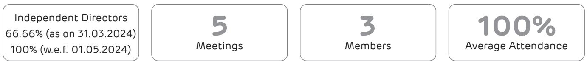

text_image

Independent Directors
66.66% (as on 31.03.2024)
100% (w.e.f. 01.05.2024)
5
Meetings
3
Members
100%
Average Attendance

<table><tr><td rowspan="2">Name of the Director</td><td colspan="5">NRC Meetings</td><td rowspan="2">Held during the tenure</td><td rowspan="2">Total Attended</td><td rowspan="2">% of attendance</td></tr><tr><td>1</td><td>2</td><td>3</td><td>4</td><td>5</td></tr><tr><td>Mr. Sushil K. Roongta</td><td></td><td></td><td></td><td></td><td></td><td>5</td><td>5</td><td>100</td></tr><tr><td>Mr. Mukesh Shah1</td><td></td><td></td><td></td><td></td><td></td><td>5</td><td>5</td><td>100</td></tr><tr><td>Mrs. Chandra Iyengar</td><td></td><td></td><td></td><td></td><td></td><td>6</td><td>6</td><td>100</td></tr><tr><td>Mr. Rajesh S. Adani2</td><td colspan="8">Not Applicable</td></tr></table>

Attended through video conference

Leave of absence

Attended in Person

Chairman

As on May 01, 2024, the NRC Committee has been re-constituted and the composition of the re-constituted NRC is Committee is given as under:

<table><tr><td colspan="3">Name of the NRC Committee Members</td></tr><tr><td>Mr. Sushil K. Roongta</td><td>Mrs. Sangeeta Singh3</td><td>Mrs. Chandra Iyengar</td></tr></table>

# Chairman

3Appointed as Member w.e.f. May 01, 2024

The Company Secretary acts as the Secretary to the NRC. The minutes of each NRC meeting are placed in the next meeting of the Board.

# Stakeholders’ Relationship Committee

As on March 31, 2024, the Stakeholders’ Relationship Committee of Directors (“SRC”) comprised of 3 (three) members, with a majority of Independent Directors. A detailed charter of the SRC is available on the website of the Company at: https://www.adanipower.com/investors/board-and-committee-charters.

# Terms of Reference:

The powers, role and terms of reference of SRC covers the areas as contemplated under the SEBI Listing Regulations and Section 178 of the Act. The brief terms of reference of SRC are as under:

<table><tr><td>Terms of Reference</td><td>Frequency</td></tr><tr><td>To look into various aspects of interest of shareholders, debenture holders and other security holders including complaints related to transfer/ transmission of shares, non-receipt of annual report, non-receipt of declared dividends, issue of new/duplicate certificates, general meetings etc.</td><td></td></tr><tr><td>To review the measures taken for effective exercise of voting rights by shareholders</td><td></td></tr><tr><td>To review adherence to the service standards adopted in respect of various services being rendered by the Registrar &amp; Share Transfer Agent</td><td></td></tr><tr><td>To review various measures and initiatives taken for reducing the quantum of unclaimed dividends and ensuring timely receipt of dividend warrants/ annual reports/ statutory notices by the shareholders of the Company</td><td></td></tr><tr><td>To review engagement programs with investors, proxy advisors, etc. and to oversee investors movement (share register)</td><td></td></tr><tr><td>To review engagement with rating agencies (Financial, ESG etc.)</td><td></td></tr><tr><td>To oversee statutory compliance relating to all the securities issued, including but not limited to dividend payments, transfer of unclaimed dividend amounts / unclaimed shares to the IEPF</td><td></td></tr><tr><td>To suggest and drive implementation of various investor-friendly initiatives</td><td></td></tr><tr><td>To approve and register transfer and / or transmission of securities, issuance of duplicate security certificates, issuance of certificate on rematerialization and to carry out other related activities</td><td></td></tr><tr><td>To carry out any other function as is referred by the Board from time to time or enforced by any statutory notification / amendment or modification as may be applicable</td><td></td></tr></table>

Frequency

Annually

Half yearly

Quarterly

Periodically

# Meeting, Attendance & Composition of the SRC:

SRC met 4 (four) times during the Financial Year 2023-24 on:

01 May 05, 2023

02 August 02, 2023

03 November 01, 2023

04 January 24, 2024

The composition of SRC and details of attendance of the members during FY 2023-24 are given below:

<table><tr><td>Independent Directors66.66% (as on 31.03.2024)100% (w.e.f. 01.05.2024)</td><td>4Meetings</td><td>3Members</td><td>100%Average Attendance</td></tr></table>

<table><tr><td rowspan="2">Name of the Director</td><td colspan="4">SRC Meetings</td><td rowspan="2">Held during the tenure</td><td rowspan="2">Total Attended</td><td rowspan="2">% of attendance</td></tr><tr><td>1</td><td>2</td><td>3</td><td>4</td></tr><tr><td>Mr. Sushil K. Roongta</td><td></td><td></td><td></td><td></td><td>4</td><td>4</td><td>100</td></tr><tr><td>Mrs. Chandra Iyengar</td><td></td><td></td><td></td><td></td><td>4</td><td>4</td><td>100</td></tr><tr><td>Mr. Mukesh Shah $^{1}$ </td><td></td><td></td><td></td><td></td><td>4</td><td>4</td><td>100</td></tr><tr><td>Mr. Rajesh S. Adani $^{2}$ </td><td colspan="7">Not Applicable</td></tr></table>

Attended through video conference

Leave of absence

Attended in Person

Chairman

1 Ceased to be Member w.e.f. the close of the business hours on March 30, 2024

2Appointed as Member w.e.f. March 31, 2024 and ceased w.e.f. May 01, 2024

As on May 01, 2024, the Committee has been re-constituted and the composition of the re-constituted SRC Committee is given as under:

<table><tr><td colspan="3">Name of the SRC Committee Members</td></tr><tr><td>Mr. Sushil K. Roongta</td><td>Mrs. Sangeeta Singh3</td><td>Mrs. Chandra Iyengar</td></tr></table>

Chairman

3Appointed as Member w.e.f. May 01, 2024

The Company Secretary acts as the Secretary to the Committee. The minutes of each SRC meeting are placed in the next meeting of the Board.

# Compliance Officer

In terms of the requirement of Listing Regulations, Mr. Deepak S. Pandya, Company Secretary, is the Compliance Officer of the Company.

# Details of Investor Complaints

The Company and its Registrar and Share Transfer Agent address all complaints, suggestions and grievances expeditiously and replies are sent usually within 7-10 days except in case of dispute over facts or other legal impediments and procedural issues. The Company endeavors to implement suggestions as and when received from the investors.

3

Complaints

During the Financial Year 2023-24, 03 complaints were received and resolved. As on March 31, 2024, no complaint was pending.

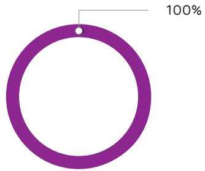

other

| Category | Value (%) |
|---|---|
| Top Label | 100 |

# 3

Investor Complaints

# 3

Investor Complaints redressed

Miscellaneous/Others   
Non- receipt of dividend/dividend warrants/fractional entitlements

# Corporate Social Responsibility Committee

As on March 31, 2024, the Corporate Social Responsibility (“CSR”) Committee comprised of 3 (three) members, with a majority of Independent Directors. A detailed charter of the CSR Committee is available on the website of the Company at: https://www.adanipower.com/investors/board-and-committee-charters

# Terms of reference:

The powers, role and terms of reference of CSR Committee covers the areas as contemplated under Section 135 of the Act. The brief terms of reference of CSR Committee are as under:

<table><tr><td>Terms of Reference</td><td>Frequency</td></tr><tr><td>To formulate and recommend to the Board, a Corporate Social Responsibility (&quot;CSR&quot;) Policy which shall indicate the activities to be undertaken by the Company as specified in Schedule VII of the Companies Act, 2013 and rules made there under and review thereof</td><td></td></tr><tr><td>To formulate and recommend to the Board, an annual action plan in pursuance to CSR Policy</td><td></td></tr><tr><td>To recommend to the Board the amount of expenditure to be incurred on the CSR activities</td><td></td></tr><tr><td>To monitor the implementation of framework of CSR Policy</td><td></td></tr><tr><td>To review the performance of the Company in the areas of CSR</td><td></td></tr><tr><td>To institute a transparent monitoring mechanism for implementation of CSR projects/activities undertaken by the Company</td><td></td></tr><tr><td>To recommend extension of duration of existing project and classify it as on-going project or other than on-going project</td><td></td></tr><tr><td>To submit annual report of CSR activities to the Board</td><td></td></tr><tr><td>To consider and recommend appointment of agency / consultant for carrying out impact assessment for CSR projects, as applicable, to the Board</td><td></td></tr><tr><td>To review and monitor all CSR projects and impact assessment report</td><td></td></tr><tr><td>To carry out any other function as is mandated by the Board from time to time and/or enforced by any statutory notification, amendment or modification as may be applicable or as may be necessary or appropriate for performance of its duties</td><td></td></tr></table>

Frequency

Annually

Half yearly

Periodically

# Meeting, Attendance & Composition of the CSR Committee:

CSR Committee met 2 (two) times during the FY 2023-24 on:

01 May 05, 2023

02 January 24, 2024

The composition of CSR Committee and details of attendance of the members during FY 2023-24 are given below:

66.66%

Independent Directors

2

Meetings

4

Members

87.5%

Average Attendance

<table><tr><td rowspan="2">Name of the Director</td><td colspan="2">CSR Meetings</td><td rowspan="2">Held during the tenure</td><td rowspan="2">Total Attended</td><td rowspan="2">% of attendance</td></tr><tr><td>1</td><td>2</td></tr><tr><td>Mr. Mukesh Shah $^{1}$ </td><td></td><td></td><td>2</td><td>2</td><td>100</td></tr><tr><td>Mr. Sushil K. Roongta</td><td></td><td></td><td>2</td><td>2</td><td>100</td></tr><tr><td>Mrs. Chandra Iyengar $^{2}$ </td><td></td><td></td><td>2</td><td>2</td><td>100</td></tr><tr><td>Mr. Anil Sardana</td><td></td><td></td><td>2</td><td>1</td><td>50</td></tr></table>

Attended through video conference

Leave of absence

Attended in Person

Chairman

1 Ceased to be Member and Chairman w.e.f. the close of the business hours on March 30, 2024

2Appointed as Chairperson w.e.f. March 31, 2024

As on May 01, 2024, the details of CSR Committee Members is given as under:

<table><tr><td colspan="3">Name of the CSR Committee Members</td></tr><tr><td>Mrs. Chandra Iyengar</td><td>Mr. Sushil K. Roongta</td><td>Mr. Anil Sardana</td></tr></table>

Chairperson

The Company Secretary acts as the Secretary to the Committee. The minutes of each CSR meeting are placed in the next meeting of the Board.

# Sustainability Governance

The Company has integrated sustainability into its core business strategy. To ensure smooth implementation of various measures across the organization, we have established a Sustainability Governance mechanism wherein at the pinnacle is the Board of Directors followed by Corporate Sustainability Leadership Committee which looks after the Sustainability Business Unit Committee who is responsible for Sustainability Reporting at each site. The Sustainability Report of the Company is available on the website of the Company at https://www.adanipower.com/sustainability

# Risk Management Committee

As on March 31, 2024, the Risk Management Committee (“RMC”) comprised of 3 (three) members, with a majority of Independent Directors. A detailed charter of the Risk Management Committee is available on the website of the Company at: https://www.adanipower.com/investors/board-and-committee-charters

The Board of Directors of the Company at its meeting held on October 28, 2021, constituted the following committees as Sub-committees of RMC as a part of good corporate governance practice –

• Mergers & Acquisitions Committee   
Legal, Regulatory & Tax Committee   
• Reputation Risk Committee   
• Commodity Price Risk Committee

The Constitution, meetings and terms of reference and other details of the above Sub-Committees, are separately included as a part of this report.

# Terms of reference:

The powers, role and terms of reference of RMC covers the areas as contemplated under Regulation 21 of the SEBI Listing Regulations. The brief terms of reference of RMC are as under:

<table><tr><td>Terms of Reference</td><td>Frequency</td></tr><tr><td>To review the Company&#x27;s risk governance structure, risk assessment and risk management policies, practices and guidelines and procedures, including the risk management plan</td><td></td></tr><tr><td>To review and approve the Enterprise Risk Management (&#x27;ERM&#x27;) framework</td><td></td></tr><tr><td>To formulate a detailed risk management policy which shall include: · A framework for identification of internal and external risks specifically faced by the listed entity, in particular including financial, operational, sectoral, sustainability (particularly, ESG related risks), information technology, cyber security risks or any other risk as may be determined by the Committee · Measures for risk mitigation including systems and processes for internal control of identified risks · Business continuity plan, oversee of risks, such as strategic, financial, credit, market, liquidity, technology, security, property, IT, legal, regulatory, reputational, and other risks · Oversee regulatory and policy risks related to climate change, including review of state and Central policies</td><td></td></tr><tr><td>To ensure that appropriate methodology, processes and systems are in place to identify, monitor, evaluate and mitigate risks associated with the business of the Company</td><td></td></tr><tr><td>To monitor and oversee implementation of the risk management policy, including evaluating the adequacy of risk management systems</td><td></td></tr><tr><td>To review compliance with enterprise risk management policy, monitor breaches / trigger trips of risk tolerance limits and direct action</td><td></td></tr><tr><td>To periodically review the risk management policy, at least once in a year, including by considering the changing industry dynamics and evolving complexity</td><td></td></tr><tr><td>To consider appointment and removal of the Chief Risk Officer, if any, and review his terms of remuneration</td><td></td></tr><tr><td>To review and approve Company&#x27;s risk appetite and tolerance with respect to line of business</td><td></td></tr><tr><td>To review and monitor the effectiveness and application of credit risk management policies, related standards and procedures to control the environment with respect to business decisions</td><td></td></tr><tr><td>To review and recommend to the Board various business proposals for their corresponding risks and opportunities</td><td></td></tr><tr><td>To obtain reasonable assurance from management that all known and emerging risks has been identified and mitigated and managed</td><td></td></tr><tr><td>To form and delegate authority to subcommittee(s), when appropriate, such as: · Mergers &amp; Acquisition Committee; · Legal, Regulatory &amp; Tax Committee; · Reputation Risk Committee; · Commodity Price Risk Committee; and · Other Committee(s) as the committee may think appropriate</td><td></td></tr><tr><td>To oversee suppliers&#x27; diversity</td><td></td></tr><tr><td>To carry out any other function as is referred by the Board from time to time or enforced by any statutory notification/ amendment or modification as may be applicable</td><td></td></tr></table>

Frequency

Annually

Half yearly

Quarterly

Periodically

# Meeting, Attendance & Composition of the RMC:

RMC met 4 (four) times during the FY 2023-24 on:

01 May 05, 2023

02 August 02, 2023

03 November 01, 2023

03 January 24, 2024

The composition of RMC and details of attendance of the members during FY 2023-24 are given below

66.66%

Independent Directors

4

Meetings

4

Members

87.5%

Average Attendance

<table><tr><td rowspan="2">Name of the Director</td><td colspan="4">RMC Meetings</td><td rowspan="2">Held during the tenure</td><td rowspan="2">Total Attended</td><td rowspan="2">% of attendance</td></tr><tr><td>1</td><td>2</td><td>3</td><td>4</td></tr><tr><td>Mr. Mukesh Shah $^{1}$ </td><td></td><td></td><td></td><td></td><td>4</td><td>4</td><td>100</td></tr><tr><td>Mr. Sushil K. Roongta $^{2}$ </td><td></td><td></td><td></td><td></td><td>4</td><td>4</td><td>100</td></tr><tr><td>Mrs. Chandra Iyengar</td><td></td><td></td><td></td><td></td><td>4</td><td>4</td><td>100</td></tr><tr><td>Mr. Anil Sardana</td><td></td><td></td><td></td><td></td><td>4</td><td>2</td><td>50</td></tr></table>

Attended through video conference

Leave of absence

Attended in Person

Chairman

1 Ceased to be Member and Chairman w.e.f. the close of the business hours on March 30, 2024

2Appointed as Chairman w.e.f. March 31, 2024

As on May 01, 2024, the Committee has been re-constituted and the composition of the re-constituted RMC Committee is given as under:

Name of the RMC Committee Members 

<table><tr><td>Mrs. Sangeeta Singh3</td><td>Mr. Sushil K. Roongta</td><td>Mr. Anil Sardana</td><td>Mrs. Chandra Iyengar</td></tr></table>

Chairperson

3Appointed as Member and Chairperson w.e.f. May 01, 2024

The Company Secretary acts as the Secretary to the Committee. The minutes of each RMC meeting are placed in the next meeting of the Board.

The Company has a risk management framework to identify, monitor and minimize risks.

# Chief Risk Officer

As on March 31, 2024, Mr. Santosh Kumar Singh is the Chief Risk Officer of the Company.

# Non-Statutory Committees

# Corporate Responsibility Committee

As on March 31, 2024, the Corporate Responsibility Committee (“CRC”) comprised of 3 (three) members, with a majority of Independent Directors. A detailed charter of the CRC is available on the website of the Company at: https://www.adanipower.com/investors/board-and-committee-charters.

Terms of reference: 

<table><tr><td>Terms of Reference</td><td>Frequency</td></tr><tr><td>To define the Company's corporate and social obligations as a responsible citizen and oversee its conduct in the context of those obligations</td><td></td></tr><tr><td>To approve a strategy for discharging the Company's corporate and social responsibilities in such a way as to provide an assurance to the Board and stakeholders</td><td>[SYSA]</td></tr><tr><td>To oversee the creation of appropriate policies and supporting measures (including Public disclosure policy, Anti-money Laundering policy, Anti Bribery, Fraud &amp; Corruption policies etc.) and map them to UNSDG and GRI disclosure standards</td><td></td></tr><tr><td>To identify and monitor those external developments which are likely to have a significant influence on Company's reputation and/or its ability to conduct its business appropriately as a good citizen and review how best to protect that reputation or that ability</td><td></td></tr><tr><td>To review the Company's stakeholder engagement plan (including vendors / supply chain)</td><td></td></tr><tr><td>To ensure that appropriate communications policies are in place and working effectively to build and protect the Company's reputation both internally and externally</td><td></td></tr><tr><td>To review the Integrated Annual Report of the Company</td><td></td></tr><tr><td>To review and direct for alignment of actions / initiatives of the Company with United Nations Sustainable Development Goals 2030 (UNSDG):1. No poverty2. Zero hunger3. Good health &amp; well being4. Quality education5. Gender equality6. Clean water and sanitation7. Affordance and clean energy8. Decent work and economic growth9. Industry, Innovation and Infrastructure10. Reduced inequalities11. Sustainable cities and communities12. Responsible consumption and production13. Climate action14. Life below water15. Life on land16. Peace and justice strong intuitions17. Partnerships for goals</td><td></td></tr><tr><td>To review sustainability and / or ESG and / or Climate reports or other disclosures such as ethical governance, environmental stewardship, safety performance, water and energy use etc. and similar communications to stakeholders on ESG initiatives and activities by the Company and ensure mapping of the same to GRI disclosure standards</td><td></td></tr><tr><td>To oversee strategies, activities and policies regarding sustainable organisation including environment, social, governance, health and safety, human talent management and related material issue and indicators in the global context and evolving statutory framework</td><td></td></tr><tr><td>To oversee ethical leadership, compliance with the Company's sustainability policy, sustainability actions and proposals and their tie-in with the Strategic Plan, interaction with different stakeholders and compliance with the ethics code</td><td></td></tr><tr><td>To oversee Company's initiatives to support innovation, technology, and sustainability</td><td></td></tr><tr><td>To oversee sustainability risks related to supply chain, climate disruption and public policy</td><td></td></tr><tr><td>To monitor Company's ESG ratings / scores from ESG rating agencies and improvement plan</td><td></td></tr><tr><td>To approve appointment of Chief Sustainability Officer after assessing the qualification, experience and background etc. of the candidate</td><td></td></tr><tr><td>To oversee the Company's:a. Vendor development and engagement programsb. program for ESG guidance (including Climate) to stakeholders and to seek feedback on the same and make further improvement programs</td><td></td></tr><tr><td>To provide assurance to Board in relation to various responsibilities being discharged by the Committee</td><td></td></tr></table>

Frequency

Annually

Half yearly

Quarterly

Periodically

# Meeting, Attendance & Composition of the CRC:

CRC met 4 (four) times during the FY 2023-24 on:

01 May 05, 2023

02 August 02, 2023

03 November 01, 2023

04 January 24, 2024

The composition of CRC and details of attendance of the members during FY 2023-24 are given

Independent Directors 66.66% (as on 31.03.2024) 100% (w.e.f. 01.05.2024)

4 Meetings

3 Members

100% Average Attendance

<table><tr><td rowspan="2">Name of the Director</td><td colspan="4">CRC Meetings</td><td rowspan="2">Held during the tenure</td><td rowspan="2">Total Attended</td><td rowspan="2">% of attendance</td></tr><tr><td>1</td><td>2</td><td>3</td><td>4</td></tr><tr><td>Mrs. Chandra Iyengar</td><td></td><td></td><td></td><td></td><td>4</td><td>4</td><td>100</td></tr><tr><td>Mr. Sushil K. Roongta</td><td></td><td></td><td></td><td></td><td>4</td><td>4</td><td>100</td></tr><tr><td>Mr. Mukesh Shah $^{1}$ </td><td></td><td></td><td></td><td></td><td>4</td><td>4</td><td>100</td></tr><tr><td>Mr. Anil Sardana $^{2}$ </td><td colspan="7">Not Applicable</td></tr></table>

Attended through video conference

x Leave of absence

Attended in Person

Chairperson

1 Ceased to be Member w.e.f. the close of the business hours on March 30, 2024

2Appointed as Member w.e.f. March 31, 2024 and ceased as Member w.e.f. May 01, 2024

As on May 01, 2024, the Committee has been re-constituted and the composition of the re-constituted CRC Committee is given as under:

<table><tr><td colspan="3">Name of the CRC Committee Members</td></tr><tr><td>Mrs. Chandra Iyengar</td><td>Mrs. Sangeeta Singh3</td><td>Mr. Sushil K. Roongta</td></tr></table>

Chairperson

3Appointed as Member w.e.f. May 01, 2024

The Company Secretary acts as the Secretary to the Committee. The minutes of each CRC meeting are placed in the next meeting of the Board.

# Chief Sustainability Officer

As on March 31, 2024, Mr. Santosh Kumar Singh is the Chief Sustainability Officer of the Company.

# Information Technology & Data Security Committee:

As on March 31, 2024, the Information Technology & Data Security Committee (“IT & DS Committee”) comprised of 3 (three) members, with a majority of Directors being Independent Directors. A detailed charter of the IT & DS Committee is available on the website of the Company at: https://www.adanipower.com/investors/board-and-committee-charters

<table><tr><td>Terms of Reference</td><td>Frequency</td></tr><tr><td>To review and oversee the function of the Information Technology (IT) within the Company in establishing and implementing various latest IT tools and technologies by which various key functions and processes across various divisions within the group can be automated to the extent possible and thereby to add the value</td><td></td></tr><tr><td>To review and oversee the necessary actions being taken by IT and Cyber team with respect to protection of various important data across the Company and what the policy for data protection and its sustainability</td><td></td></tr><tr><td>To oversee the current cyber risk exposure of the Company and future cyber risk strategy</td><td>[GAW6]</td></tr><tr><td>To review at least annually the Company's cyber security breach response and crisis management plan</td><td>—[HBCS]</td></tr><tr><td>To review reports on any cyber security incidents and the adequacy of proposed action</td><td></td></tr><tr><td>To assess the adequacy of resources and suggest additional measures to be undertaken by the Company</td><td></td></tr><tr><td>To regularly review the cyber risk posed by third parties including outsourced IT and other partners</td><td></td></tr><tr><td>To annually assess the adequacy of the Group's cyber insurance cover</td><td></td></tr></table>

Frequency

Annually

Half yearly

Meeting, Attendance & Composition of the IT & DS Committee:

IT & DS Committee met 2 (two) times during the FY 2023-24 on:

01 August 02, 2023 02 January 24, 2024

The composition of IT & DS Committee and details of attendance of the members during FY 2023-24 are given below:

66.66%

Independent Directors

2

Meetings

3

Members

83.3%

Average Attendance

<table><tr><td rowspan="2">Name of the Director</td><td colspan="2">IT &amp; DS Committee Meetings</td><td rowspan="2">Held during the tenure</td><td rowspan="2">Total Attended</td><td rowspan="2">% of attendance</td></tr><tr><td>1</td><td>2</td></tr><tr><td>Mr. Anil Sardana</td><td></td><td></td><td>2</td><td>2</td><td>50</td></tr><tr><td>Mr. Mukesh Shah1</td><td></td><td></td><td>2</td><td>2</td><td>100</td></tr><tr><td>Mr. Sushil K. Roongta</td><td></td><td></td><td>2</td><td>2</td><td>100</td></tr><tr><td>Mrs. Chandra Iyengar2</td><td colspan="5">Not Applicable</td></tr></table>

Attended through video conference

x Leave of absence

Attended in Person

Chairman

1 Ceased to be Member w.e.f. the close of the business hours on March 30, 2024

2Appointed as Member w.e.f. March 31, 2024 and ceased as Member w.e.f. May 01, 2024

As on May 01, 2024, the Committee has been re-constituted and the composition of the re-constituted IT & DS Committee is given as under:

<table><tr><td colspan="3">Name of the IT &amp; DS Committee Members</td></tr><tr><td>Mrs. Sangeeta Singh3</td><td>Mr. Sushil K. Roongta</td><td>Mr. Anil Sardana</td></tr></table>

Chairperson

3Appointed as Member and Chairperson w.e.f. May 01, 2024

The Company Secretary acts as the Secretary to the Committee. The minutes of each IT&DS Committee are placed in the next meeting of the Board.

# Merger & Acquisition Committee (M&A Committee):

As on March 31, 2024, the Merger & Amalgamation Committee (“M&A Committee”) is a Sub-Committee of RMC and comprised of 3 (three) members, with a majority of Independent Directors. A detailed charter of the M&A Committee is available on the website of the Company at: https://www.adanipower.com/investors/corporate-governance.

<table><tr><td>Terms of Reference</td><td>Frequency</td></tr><tr><td>To review acquisition strategies with the management</td><td></td></tr><tr><td>To review proposals relating to merger, acquisition, investment or divestment ("Transaction/s") that are presented to the Committee [including how such transaction fits with the Company's strategic plans and acquisition strategy, Transaction timing, important Transaction milestones, financing, key risks (including cyber security) and opportunities, , risk appetite, tolerance and the integration plan] and if thought fit, to recommend relevant opportunities to the Audit Committee / Board as appropriateTo oversee due diligence process with respect to proposed Transaction(s) and review the reports prepared by internal teams or independent external advisors, if appointed</td><td></td></tr><tr><td>To evaluate execution / completion, integration of Transaction(s) consummated, including information presented by management in correlation with the Transaction approval parameters and the Company's strategic objectives</td><td></td></tr><tr><td>To periodically review the performance of completed Transaction(s)</td><td></td></tr><tr><td>To review the highlights good practices and learnings from Transaction and utilize them for future Transactions</td><td></td></tr><tr><td>To review the tax treatment of transactions and ascertain their effects upon the financial statements of the Company and seek external advice on the tax treatment of these items, where appropriate</td><td></td></tr></table>

Frequency

Annually

Periodically

# Meeting, Attendance & Composition of the M & A Committee:

M&A Committee met 2 (two) time during the FY 2023-24 on:

01 August 02, 2023

02 January 24, 2024

The composition of M&A Committee and details of attendance of the members during FY 2023-24 are given below:

Independent Directors 66.66% (as on 31.03.2024) 75% (w.e.f. 01.05.2024)

2 Meetings

4 Members

87.5% Average Attendance

<table><tr><td rowspan="2">Name of the Director</td><td colspan="2">M&amp;A Committee Meeting</td><td rowspan="2">Held during the tenure</td><td rowspan="2">Total Attended</td><td rowspan="2">% of attendance</td></tr><tr><td>1</td><td>2</td></tr><tr><td>Mr. Anil Sardana</td><td></td><td></td><td>2</td><td>1</td><td>50</td></tr><tr><td>Mr. Mukesh Shah1</td><td></td><td></td><td>2</td><td>2</td><td>100</td></tr><tr><td>Mr. Sushil K. Roongta</td><td></td><td></td><td>2</td><td>2</td><td>100</td></tr><tr><td>Mrs. Chandra Iyengar</td><td></td><td></td><td>2</td><td>2</td><td>100</td></tr></table>

Attended through video conference

Leave of absence

Attended in Person

8 Chairman

1 Ceased to be Member w.e.f. the close of the business hours on March 30, 2024

As on May 01, 2024, the Committee has been re-constituted and the composition of the re-constituted M&A Committee is given as under:

<table><tr><td colspan="4">Name of the M &amp; A Committee Members</td></tr><tr><td>Mrs. Chandra Iyengar</td><td>Mr. Anil Sardana</td><td>Mr. Sushil K. Roongta</td><td>Mrs. Sangeeta Singh2</td></tr></table>

Chairperson

2Appointed as Member w.e.f. May 01, 2024

The Company Secretary acts as the Secretary to the Committee. The minutes of each M&A Committee are placed in the next meeting of the Board.

# Legal, Regulatory & Tax Committee:

As on March 31, 2024, the Legal, Regulatory & Tax Committee (“LRT Committee”), a Sub-Committee of RMC, comprised of 3 (three) members, all of which are Independent Directors. A detailed charter of the LRT Committee is available on the website of the Company at: https://www.adanipower.com/investors/board-and-committee-charters.

<table><tr><td>Terms of Reference</td><td>Frequency</td></tr><tr><td>To exercise oversight with respect to the structure, operation and efficacy of the Company&#x27;s compliance program</td><td></td></tr><tr><td>To review legal, tax and regulatory matters that may have a material impact on the Company&#x27;s financial statements and disclosures, reputational risk or business continuity risk</td><td></td></tr><tr><td>To review compliance with applicable laws and regulations</td><td></td></tr><tr><td>To approve the compliance audit plan for the year and review of such audits to be performed by the internal audit department of the Company</td><td></td></tr><tr><td>To review significant inquiries received from, and reviews by, regulators or government agencies, including, without limitation, issues pertaining to compliance with various laws or regulations or enforcement or other actions brought or threatened to be brought against the Company by regulators or government authorities / bodies / agencies</td><td>[XD4S]</td></tr><tr><td>To review oversee and approve the tax strategy and tax governance framework and consider and action tax risk management issues that are brought to the attention of the Committee</td><td></td></tr></table>

Frequency

Annually

Half yearly

Periodically

# Meeting, Attendance & Composition of the LRT Committee:

LRT Committee met 2 (two) times during the Financial Year 2023-24 on:

01 August 02, 2023

02 January 24, 2024

The composition of LRT Committee and details of attendance of the members during FY 2023-24 are given below:

Independent Directors 66.66% (as on 31.03.2024) 100% (w.e.f. 01.05.2024)

2 Meetings

4 Members

87.5% Average Attendance

<table><tr><td rowspan="2">Name of the Director</td><td colspan="2">LRT Committee Meetings</td><td rowspan="2">Held during the tenure</td><td rowspan="2">Total Attended</td><td rowspan="2">% of attendance</td></tr><tr><td>1</td><td>2</td></tr><tr><td>Mr. Anil Sardana $^{1}$ </td><td></td><td></td><td>2</td><td>1</td><td>50</td></tr><tr><td>Mr. Mukesh Shah $^{2}$ </td><td></td><td></td><td>2</td><td>2</td><td>100</td></tr><tr><td>Mr. Sushil K. Roongta</td><td></td><td></td><td>2</td><td>2</td><td>100</td></tr><tr><td>Mrs. Chandra Iyengar</td><td></td><td></td><td>2</td><td>2</td><td>100</td></tr></table>

Attended through video conference

x Leave of absence

Attended in Person

Chairman

1 Ceased as Member w.e.f. May 01, 2024

2Ceased to be Member w.e.f. the close of the business hours on March 30, 2024

As on May 01, 2024, the Committee has been re-constituted and the composition of the re-constituted LRT Committee is given as under:

<table><tr><td colspan="3">Name of the LRT Committee Members</td></tr><tr><td>Mrs. Sangeeta Singh3Ω</td><td>Mr. Sushil K. Roongta</td><td>Mrs. Chandra Iyengar</td></tr></table>

Chairperson

3Appointed as Member and Chairperson w.e.f. May 01, 2024

The Company Secretary acts as the Secretary to the Committee. The minutes of each LRT Committee are placed in the next meeting of the Board.

# Reputation Risk Committee:

As on March 31, 2024, the Reputation Risk Committee (“RR Committee”), a sub-committee of RMC, comprised of 3 (three) members, with majority of Independent Directors. A detailed charter of the RR Committee is available on the website of the Company at: https://www.adanipower.com/investors/board-and-committee-charters.

<table><tr><td>Terms of Reference</td><td>Frequency</td></tr><tr><td>To review reports from management regarding reputation risk, including reporting on the Reputation Risk Management Framework and Reputation Risk Appetite</td><td></td></tr><tr><td>To provide ongoing oversight of the reputational risk posed by global business scenario, functions, geographies, material legal changes, climate change or high-risk relationships / programs</td><td></td></tr><tr><td>To assess and resolve specific issues, potential conflicts of interest and other reputation risk issues that are reported to the Committee</td><td></td></tr><tr><td>To recommend good practices and measures that would avoid reputational loss</td><td></td></tr><tr><td>To review specific cases of non-compliances, violations of codes of conduct which may cause loss to reputation the Company</td><td></td></tr></table>

# Frequency

Annually

Half yearly

Periodically

# Meeting, Attendance & Composition of the RR Committee:

RR Committee met 2 (two) times during the Financial Year 2023-24 on:

01 August 02, 2023

02 January 24, 2024

The composition of RR Committee and details of attendance of the members during FY 2023-24 are given below:

66.66%

Independent Directors

2

Meetings

4

Members

100%

Average Attendance

<table><tr><td rowspan="2">Name of the Director</td><td colspan="2">RR Committee Meetings</td><td rowspan="2">Held during the tenure</td><td rowspan="2">Total Attended</td><td rowspan="2">% of attendance</td></tr><tr><td>1</td><td>2</td></tr><tr><td>Mr. Anil Sardana</td><td></td><td></td><td>2</td><td>2</td><td>100</td></tr><tr><td>Mr. Mukesh Shah1</td><td></td><td></td><td>2</td><td>2</td><td>100</td></tr><tr><td>Mr. Sushil K. Roongta</td><td></td><td></td><td>2</td><td>2</td><td>100</td></tr><tr><td>Mrs. Chandra Iyengar</td><td></td><td></td><td>2</td><td>2</td><td>100</td></tr></table>

Attended through video conference

Leave of absence

Attended in Person

Chairman

1 Ceased to be Member w.e.f. the close of the business hours on March 30, 2024

The Company Secretary acts as the Secretary to the Committee. The minutes of each RR Committee are placed in the next meeting of the Board.

As on May 01, 2024, the details of RR Committee Members is given as under:

<table><tr><td colspan="3">Name of the RR Committee Members</td></tr><tr><td>Mr. Anil Sardana</td><td>Mr. Sushil K. Roongta</td><td>Mrs. Chandra Iyengar</td></tr></table>

Chairman

# Commodity Price Risk Committee

As on March 31, 2024, the Commodity Price Risk Committee (“CPR Committee”) comprised of four members, with a majority of Independent Directors. A detailed charter of the CPR Committee is available on the website of the Company at https://www.adanipower.com/investors/board-and-committee-charters.

<table><tr><td>Terms of Reference</td><td>Frequency</td></tr><tr><td>To monitor commodity price exposures of the Company</td><td></td></tr><tr><td>To oversee procedures for identifying, assessing, monitoring and mitigating commodity price risks</td><td></td></tr><tr><td>To devise Commodity Price Risk Management (CPRM) Policy and to monitor implementation of the same</td><td></td></tr><tr><td>To review strategy for hedging in relation to volume, tenure and choice of the hedging instruments and to approve /ratify of any deviations in transactions vis-a-vis the CPRM Policy</td><td></td></tr><tr><td>To review MIS, documentation, outstanding positions including MTM of transactions and internal control mechanisms</td><td></td></tr><tr><td>To review internal audit reports in relation to the CPRM Policy</td><td></td></tr><tr><td>To review and amend the CPRM Policy, if market conditions dictate from time to time</td><td></td></tr></table>

Frequency

Annually

Half yearly

Periodically

# Meeting, Attendance & Composition of the CPR Committee:

CPR Committee met 2 (two) times during the Financial Year 2023-24 on:

01 August 02, 2023

02 January 24, 2024

The composition of CPR Committee and details of attendance of the members during FY 2023-24 are given below:

66.66%

Independent Directors

2

Meetings

3

Members

100%

Average Attendance

<table><tr><td rowspan="2">Name of the Director</td><td colspan="2">CPR Committee Meetings</td><td rowspan="2">Held during the tenure</td><td rowspan="2">Total Attended</td><td rowspan="2">% of attendance</td></tr><tr><td>1</td><td>2</td></tr><tr><td>Mr. Anil Sardana</td><td></td><td></td><td>2</td><td>2</td><td>100</td></tr><tr><td>Mr. Mukesh Shah1</td><td></td><td></td><td>2</td><td>2</td><td>100</td></tr><tr><td>Mr. Sushil K. Roongta2</td><td></td><td></td><td>2</td><td>2</td><td>100</td></tr><tr><td>Mrs. Chandra Iyengar</td><td></td><td></td><td>2</td><td>2</td><td>100</td></tr></table>

Attended through video conference

X Leave of absence

Attended in Person

Chairman

1 Ceased to be Member w.e.f. the close of the business hours on March 30, 2024

2Ceased to be Member w.e.f. May 01, 2024

As on May 01, 2024, the Committee has been re-constituted and the composition of the re-constituted CPR Committee is given as under:

<table><tr><td colspan="3">Name of the CPR Committee Members</td></tr><tr><td>Mrs. Chandra Iyengar</td><td>Mr. Anil Sardana</td><td>Mrs. Sangeeta Singh3</td></tr></table>

Chairperson

3Appointed as Member w.e.f. May 01, 2024

The Company Secretary acts as Secretary to the Committee. The minutes of each CPR Committee are placed in the next meeting of the Board.

# GOVERNANCE OF SUBSIDIARY COMPANIES

The Company has One material subsidiary as on the date of this Integrated Annual Report, having an income or net worth exceeding 10% of the consolidated income or net worth respectively, of the Company. The subsidiaries of the Company function with an adequately empowered Board of Directors and sufficient resources.

The minutes of the Board Meetings of the subsidiary companies along with the details of significant transactions and arrangements entered into by the

subsidiary companies are shared with the Board of Directors on a quarterly basis. The Financial Statements of the subsidiary companies are presented to the Audit Committee. The information in respect of the loans and advances in the nature of loans to subsidiaries pursuant to Regulation 34 of the Listing Regulations is provided in Notes to the standalone Financial Statements.

The Company has a policy for determining ‘material subsidiaries’ which is uploaded on the website of the Company at:https://www.adanipower.com/investors/ board-and-committee-charters

# GENERAL BODY MEETINGS

# Annual General Meetings:

The details of last three Annual General Meetings (“AGMs”) are as follows:

<table><tr><td>Financial Year</td><td>Location / Mode</td><td>Day, date and time (IST)</td><td>Special resolution passed</td><td>Transcript</td></tr><tr><td>2022-23</td><td>[ANTW]</td><td>Wednesday, July 19, 2023, at 12.00 Noon</td><td>For approving reappointment of Mr. Anil Sardana (DIN: 00006867) as Managing Director of the CompanyFor approving the increase in borrowing limits of the Company under section 180(1)(c) of the Companies Act, 2013For conversion of loan into equity under Section 62(3) of the Companies Act, 2013For approving the creation of mortgage / charge on the properties / undertakings of the Company under Section 180(1)(a) of the Companies Act, 2013</td><td>Transcript available at Link</td></tr><tr><td>2021-22</td><td>[SHSA]</td><td>Wednesday, July 27, 2022, at 12.00 Noon</td><td>For approving the appointment of Mr. Mukesh Shah (DIN: 00084402) as an Independent Director (Non-Executive) of the Company for a second term of 1 (one) year.</td><td>Transcript available at Link</td></tr><tr><td>2020-21</td><td>[S33T]</td><td>Tuesday, July 13, 2021, at 12:00 Noon</td><td>For alteration of the Object Clause of the Company</td><td>Transcript available at Link</td></tr></table>

# Held through video conference

All the resolutions proposed by the Directors to shareholders in last three years are approved by shareholders with requisite majority.

Voting results of the last AGM is available on the website of the Company at: https://www.adanipower.com/ investors/corporate-governance

# Whether any resolutions are proposed to be conducted through postal ballot:

There is no immediate proposal for passing any resolution through postal ballot. None of the businesses proposed to be transacted at the ensuing AGM require passing of a resolution through postal ballot.

# Procedure for postal ballot:

Prescribed procedure for postal ballot as per the provisions contained in this behalf in the Act read with rules made there under as amended from time to time shall be complied with, whenever necessary.

# Code of Conduct:

The Board has laid down a Code of Business Conduct and Ethics (the “Code”) for all the Board Members and Senior Management of the Company. The Code is available on the website of the Company www.adanipower.com. All Board Members and Senior Management Personnel have affirmed compliance of the Code. A declaration signed by Managing Director to this effect is attached to this report.

The Board has also adopted separate code of conduct with respect to duties of Independent Directors as per the provisions of the Act.

# Whistle Blower Policy

The Company has adopted a Whistle Blower Policy and has established the necessary vigil mechanism for employees and Directors to report concerns about unethical or improper activities and financial irregularities. No person has been denied access to the chairman of the Audit Committee. The Audit Committee monitors and reviews the investigations of the whistle blower complaints. The said policy is uploaded on the website of the Company at: https://www.adanipower. com/investors/corporate-governance.

# Anti-Corruption, Anti-Bribery & Conflict of Interest Policy

It is Company’s endeavor to conduct its business in an honest and ethical manner. Company takes a zero-tolerance approach to bribery and corruption and is committed to acting professionally, fairly and with integrity in all its business dealings and relationships, wherever it operates. Company’s designated personnel are strongly prohibited from engaging in any form of unethical activity. This includes a prohibition against direct bribery and indirect bribery, including payments that can be routed through third parties. If any employee, partner vendor, supplier, stakeholder suspects or becomes aware of any potential bribery involving the employee, it is incumbent upon the person to report it to the Vigilance and Ethics Officer.

A copy of the said Policy, is available on the website of the Company at: https://www.adanipower.com/investors/ corporate-governance.

# Code on Prohibition of Insider Trading

In compliance with the SEBI (Prohibition of Insider Trading) Regulations, 2015 (“PIT Regulations”), the Company has formulated the Code of Conduct for Prevention of Insider Trading (“Code”) to regulate and monitor trading by Designated Persons (“DPs”) and their immediate relatives.

The Code, inter alia, lays down the procedures to be followed by DPs while trading / dealing in Company shares / derivatives and while sharing Unpublished Price Sensitive Information (UPSI). The Code includes the obligations and responsibilities of DPs, obligation to maintain the structured digital database, mechanism for prevention of insider trading and handling of UPSI, process to familiarise with the sensitivity of UPSI, transactions which are prohibited and manner in which permitted transactions in the securities of the Company shall be carried out, etc.

A report on insider trading, covering trading by DPs and various initiatives/ actions taken by the Company under the PIT Regulations is also placed before the Audit Committee on quarterly basis.

The Company periodically circulates the informatory e-mails along with the FAQs on Insider Trading Code, Do’s and Don’ts etc. to the employees (including new employees) to familiarize them with the provisions of the Code. The Company also conducts frequent workshops/ training sessions to educate and sensitise the employees/ designated persons.

# Policy on Related Party Transactions

The Company has adopted the Policy on Related Party Transactions (“RPTs”) in line with the requirements of the Act and SEBI Listing Regulations, as amended from time to time, which is available on the website of the Company at : https://www.adanipower.com/investors/ corporate-governance.

The Policy intends to ensure that proper reporting, approval, disclosure processes are in place for all transactions between the Company and related parties. This Policy specifically deals with the review and approval of Material RPTs, keeping in mind the potential or actual conflicts of interest that may arise because of entering into these transactions. All RPTs by the Company and RPTs by the subsidiary companies, exceeding their respective standalone turnover, were placed before the Audit Committee for review and prior approval. Prior omnibus approval is obtained for RPTs on a yearly basis, for the transactions which are of repetitive nature and/ or entered in the ordinary course of business and are at arm’s length. All RPTs entered during the year were in ordinary course of business and on arm’s length basis.

The Company had also obtained the prior approval of shareholders for the material RPTs entered into during the Financial Year 2023-24.

# Risk Management Framework

The Company has established an Enterprise Risk Management (“ERM”) framework to optimally identify and manage risks, as well as to address operational, strategic and regulatory risks. In line with the Company’s commitment to deliver sustainable value, this framework aims to provide an integrated and organised approach to evaluate and manage risks. Risk assessment monitoring is included in the Company’s annual Internal Audit programme and reviewed by the Audit Committee / Risk Management Committee at regular intervals. In compliance with Regulation 17 and 21 of the SEBI Listing Regulations, the Board of Directors has formulated a Risk Management Policy for framing, implementing and monitoring the risk management plan for the Company.

The Board is periodically updated on the key risks, steps and processes initiated for reducing and, if feasible, eliminating various risks. Business risk evaluation and management is an ongoing process within the Company.

Detailed update on risk management framework has been covered under the risk section, forming a part of the Integrated Annual Report.

# Policy on Material Subsidiary

The Company has adopted a Policy on Material Subsidiary in line with the requirements of the Listing Regulations. The objective of this Policy is to lay down criteria for identification and dealing with material subsidiaries and to formulate a governance framework for subsidiaries of the Company. The Policy on Material Subsidiary is available on the website of the Company at https:// www.adanipower.com/investors/corporate-governance.

Apart from above, the Company has adopted many other mandatory and non-mandatory policies, which are available on Company’s website at https:// www.adanipower.com/investors/corporate-governance.

# MEANS OF COMMUNICATION

# Website:

The Company has dedicated “Investors” section on its website viz. www.adanipower.com, wherein any person can access the corporate policies, Board committee charters, Annual Reports, financial results, investor presentation and shareholding details etc.

# Announcement of material information:

All the material information, requisite announcements and periodical filings are being submitted by the Company electronically through web portals of NSE and BSE, where the equity shares of the Company are listed.

# Media Releases:

All official media releases are submitted to NSE and BSE and also being uploaded on the website of the Company.

# Quarterly financial results:

The financial results were published in prominent daily newspapers viz. Indian Express (English daily) and Financial Express (Gujarati daily – vernacular) and were also uploaded on the website of the Company.

# Earning Calls & presentations to Institutional Investors/ Analysts

The Company organizes an earnings call with analysts and investors on the same day / next day of announcement of results. The audio recordings and transcript of these earning calls are posted on the Company’s website. Presentations made to institutional investors and financial analysts on the financial results are submitted to the Stock Exchanges and also uploaded on the Company’s website.

The Company has maintained consistent communication with investors at various forums.

# Integrated Annual Report and AGM

Integrated Annual Report containing audited standalone and consolidated financial statements together with Report of Board of Directors, Management Discussion and Analysis Report, Corporate Governance Report, Auditor's Report and other important information are circulated to the Members. In the AGM, the Shareholders also interact with the Board and the Management

# Registrar and Share Transfer Agent:

Kfin Technologies Limited are acting as Registrar and Share Transfer Agent of the Company. They have adequate infrastructure and VSAT connectivity with both the depositories, which facilitate better and faster services to the investors.

Address: Selenium Tower B, Plot 31-32,

Gachibowli, Financial District Nanakramguda,

Serilingampally, Hyderabad – 500 032

Tel: +91-40-67161526 | Fax: +1-40-23001153

E-mail: einward.ris@kfintech.com

Website: www.kfintech.com

The Shareholders are requested to correspond directly with the R&T Agent for transfer/transmission of shares, change of address, queries pertaining to their shares, dividend etc.

# Name, Designation and Address of the Compliance Officer:

# Mr. Deepak S Pandya,

Company Secretary and Compliance Officer

“Adani Corporate House”, Shantigram,

Near Vaishno Devi Circle, S. G. Highway,

Khodiyar, Ahmedabad – 382 421

E-mail ID: investor.apl@adani.com

# Green Initiative

As a responsible corporate citizen, the Company welcomes and supports the ‘Green Initiative’ undertaken by the Ministry of Corporate Affairs, Government of India, enabling electronic delivery of documents including the Integrated Annual Report to Shareholders at their e-mail address previously registered with the depositories or the Company’s Registrar and Share Transfer Agent.

In line with the SEBI Listing Regulations, the Company has emailed soft copies of its Integrated Annual Report to all those Shareholders who have registered their email address for the said purpose. With reference to Ministry of Corporate Affairs issued Circular No. 09/2023 dated September 25, 2023 read with Circular No. 14/2020 dated April 8, 2020 and Circular No. 17/2020 dated April 13, 2020, read with Circular No. SEBI/HO/CFD/CMD2/CIR/P/2021/11 dated January 15, 2021, Circular No. SEBI/HO/DDHS/P/ CIR/2022/0063 dated May 13, 2022, Circular No. SEBI/HO/DDHS/ DDHS RACPOD1/P/CIR/2023/001 dated January 5, 2023 and Circular No. SEBI/HO/CFD/CFD-PoD-2/P/ CIR/2023/167 dated October 7, 2023 issued by the Securities Exchange Board of India, Companies have been dispensed with the printing and dispatch of Annual Reports to Shareholders. Hence, the Annual Report of the Company for the financial year ended March 31, 2024, would be sent through email to the Shareholders.

# GENERAL SHAREHOLDER INFORMATION

# 28th Annual General Meeting:

Date & Time

Tuesday, June 25, 2024 at 02:00 PM (IST)

Mode

Video Conferencing/Other Audio Visual Means

Instructions for attending AGM/Remote e-voting:

Refer Notice AGM

E-voting details

Starts: Friday, June 21, 2024 from 9.00 AM (IST)

Ends: Monday, June 24, 2024 at 5.00 PM (IST)

Book Closure for 28th AGM

From : Tuesday, June 18, 2024

To : Tuesday, June 25, 2024

(both days inclusive)

We would greatly appreciate and encourage more Members to register their email address with their Depository Participant or the RTA/Company, to receive soft copies of the Annual Report and other information disseminated by the Company. Shareholders who have not registered their e-mail addresses so far are requested to do the same. Those holding shares in demat form can register their e-mail address with their concerned DPs. Shareholders who hold shares in physical form are requested to register their e-mail addresses with the RTA/ Company, by sending KYC updation forms duly signed by the shareholder(s) with required details.

Please note that all documents relating to Annual General Meeting shall be available on the Company’s website.

# Dividend Distribution Policy:

The Dividend Distribution Policy of the Company is available on the website of the Company at: https:// www.adanipower.com/investors/corporate-governance.

# Company Registration Details:

The Company is registered in the State of Gujarat, India and having registered office at “Adani Corporate House”, Shantigram, Near Vaishno Devi Circle, S G Highway, Khodiyar, Ahmedabad – 382 421, Gujarat. The Corporate Identity Number allotted to the Company by the Ministry of Corporate Affairs is L40100GJ1996PLC030533.

# Financial Calendar for 2024-25:

The Company’s financial year starts on April 1 and ends on March 31 every year. The calendar for approval of quarterly financial results are as under:

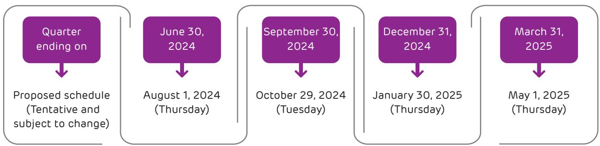

flowchart

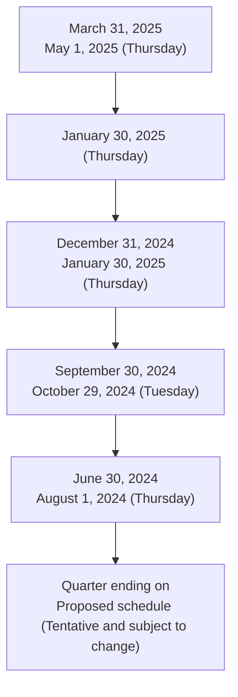
```mermaid
graph TD
    A["March 31, 2025\nMay 1, 2025 (Thursday)"] --> B["January 30, 2025 (Thursday)"]
    B --> C["December 31, 2024\nJanuary 30, 2025 (Thursday)"]
    C --> D["September 30, 2024\nOctober 29, 2024 (Tuesday)"]
    D --> E["June 30, 2024\nAugust 1, 2024 (Thursday)"]
    E --> F["Quarter ending on\nProposed schedule (Tentative and subject to change)"]
```

# Listing on Stock Exchanges:

# Equity Shares

The Equity Shares of the Company are listed with the following stock exchanges:

<table><tr><td>Name and Address of Stock Exchange</td><td>ISIN</td><td>Code</td></tr><tr><td>BSE Limited (BSE)Floor 25, P. J Towers, Dalal Street, Mumbai – 400 001</td><td rowspan="2">INE814H01011</td><td>533096</td></tr><tr><td>National Stock Exchange of India Limited (NSE)Exchange Plaza, Bandra Kurla Complex, Bandra (E), Mumbai – 400 051</td><td>ADANIPOWER</td></tr></table>

The annual listing fee for the Financial Year 2024-25 has been paid to both, NSE and BSE.

# Listing of Debt Securities:

As on March 31, 2024, no Rated, Listed, Taxable, Secured, Redeemable, Non-Convertible Debentures were outstanding on the Wholesale Debt Market Segment of BSE Limited.

# Details of Debenture Trustees (for privately placed Debentures):

As on March 31, 2024, the Company has no outstanding Debentures, which were issued earlier on private placement basis.

# Outstanding GDRs/ ADRs/ Warrants or any convertible instruments conversion date and likely impact on equity:

There were no outstanding GDRs/ ADRs/ Warrants or any convertible instruments as at March 31, 2024.

# Details of Debenture Trustees (for privately placed Debentures):

As on March 31, 2024, the Company has no outstanding Debentures, which were issued earlier on private placement basis.

Depositories: 

<table><tr><td>Name of Depositories</td><td>Address of Depositories</td></tr><tr><td>National Securities Depository Limited (NSDL)</td><td>Trade World, 4thFloor, Kamala Mils Compound, Senapati Bapat Marg, Lower Parel, Mumbai- 400013.</td></tr><tr><td>Central Depository Services (India) Limited (CDSL)</td><td>25thFloor, A Wing, Marathon Futurex, Mafatlal Mills Compound, NM Joshi Marg, Lower Parel (E), Mumbai- 4000013</td></tr></table>

The annual custody / issuer fees for the Financial Year 2024-25 have been paid to both, NSDL and CDSL.

Market Price Data: 

<table><tr><td rowspan="2">Month</td><td colspan="3">BSE</td><td colspan="3">NSE</td></tr><tr><td>High (₹)</td><td>Low (₹)</td><td>Volume(No. of shares)</td><td>High (₹)</td><td>Low (₹)</td><td>Volume(No. of shares)</td></tr><tr><td>April, 2023</td><td>224.85</td><td>185.10</td><td>1,62,23,455</td><td>224.85</td><td>185.20</td><td>12,02,05,000</td></tr><tr><td>May, 2023</td><td>272.80</td><td>214.00</td><td>2,15,13,085</td><td>272.90</td><td>214.00</td><td>15,46,85,000</td></tr><tr><td>June, 2023</td><td>286.00</td><td>230.95</td><td>1,76,14,809</td><td>286.00</td><td>231.00</td><td>10,65,17,000</td></tr><tr><td>July, 2023</td><td>275.05</td><td>235.70</td><td>1,65,86,624</td><td>275.50</td><td>235.85</td><td>9,73,66,000</td></tr><tr><td>August, 2023</td><td>359.30</td><td>260.40</td><td>37,38,67,147</td><td>359.25</td><td>260.60</td><td>44,32,48,000</td></tr><tr><td>September, 2023</td><td>410.00</td><td>312.50</td><td>2,53,02,406</td><td>409.70</td><td>312.25</td><td>39,88,46,000</td></tr><tr><td>October, 2023</td><td>377.50</td><td>289.30</td><td>1,50,95,031</td><td>377.50</td><td>289.35</td><td>11,09,09,000</td></tr><tr><td>November, 2023</td><td>470.90</td><td>357.85</td><td>2,38,16,254</td><td>470.80</td><td>357.60</td><td>36,50,13,000</td></tr><tr><td>December, 2023</td><td>589.30</td><td>435.45</td><td>2,24,19,794</td><td>589.45</td><td>435.35</td><td>22,04,05,000</td></tr><tr><td>January, 2024</td><td>580.00</td><td>508.00</td><td>53,83,264</td><td>579.80</td><td>506.10</td><td>8,45,37,000</td></tr><tr><td>February, 2024</td><td>584.90</td><td>528.00</td><td>32,05,148</td><td>584.95</td><td>517.30</td><td>2,95,57,000</td></tr><tr><td>March, 2024</td><td>581.00</td><td>501.70</td><td>95,71,782</td><td>580.00</td><td>501.55</td><td>3,95,33,000</td></tr></table>

The Company’s equity shares are frequently traded on the BSE Limited and National Stock Exchange of India Limited

Performance in comparison to broad-based indices such as BSE Sensex:

APL Share Price vs Nifty-50   
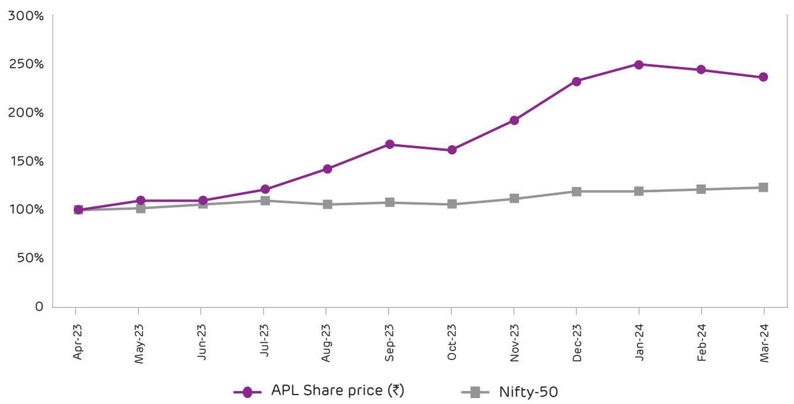

line

| Month   | APL Share price (₹) | Nifty-50 |
|---------|---------------------|----------|
| Apr-23  | 100%                | 100%     |
| May-23  | 110%                | 100%     |
| Jun-23  | 110%                | 105%     |
| Jul-23  | 120%                | 110%     |
| Aug-23  | 140%                | 105%     |
| Sep-23  | 170%                | 110%     |
| Oct-23  | 160%                | 105%     |
| Nov-23  | 190%                | 115%     |
| Dec-23  | 230%                | 120%     |
| Jan-24  | 250%                | 120%     |
| Feb-24  | 245%                | 125%     |
| Mar-24  | 235%                | 125%     |

Note: APL Share Price and NSE Nifty-50 values on April 1, 2023 have been baseline to 100

Graph 2: APL Share Price vs BSE Sensex   
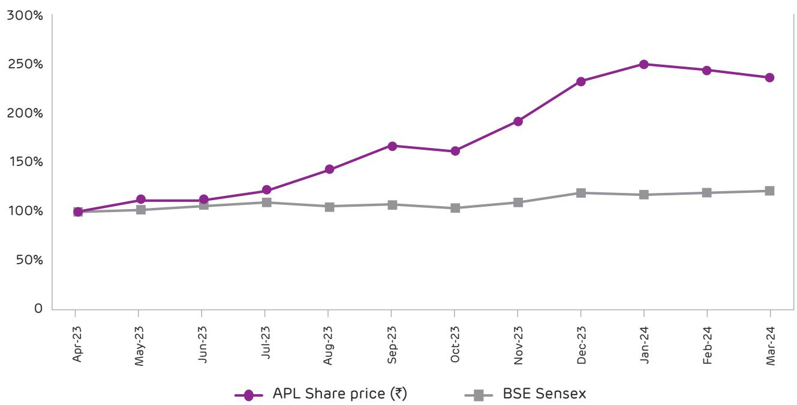

line

| Month   | APL Share price (₹) | BSE Sensex |
|---------|---------------------|----------|
| Apr-23  | 100%                | 100%     |
| May-23  | 110%                | 100%     |
| Jun-23  | 110%                | 105%     |
| Jul-23  | 120%                | 110%     |
| Aug-23  | 140%                | 105%     |
| Sep-23  | 165%                | 105%     |
| Oct-23  | 160%                | 100%     |
| Nov-23  | 190%                | 110%     |
| Dec-23  | 230%                | 120%     |
| Jan-24  | 250%                | 115%     |
| Feb-24  | 245%                | 118%     |
| Mar-24  | 235%                | 120%     |

Note: APL Share Price and BSE Sensex values on April 1, 2023 have been baseline to 100

# Market Capitalisation:

The Market Capitalization of the Company based on year-end closing prices quoted in the BSE for last 10 years is given below:

Market Cap on BSE (\` Crore)   
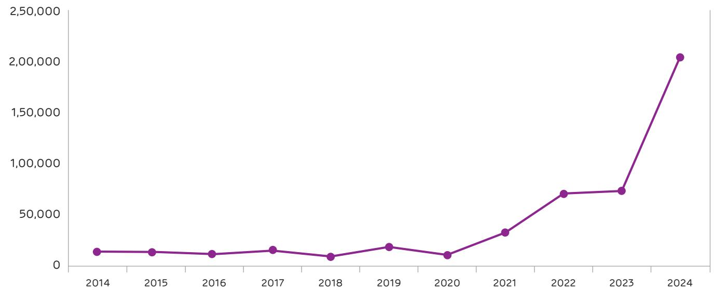

line

| Year | Value   |
| ---- | ------- |
| 2014 | 12000   |
| 2015 | 11000   |
| 2016 | 9000    |
| 2017 | 13000   |
| 2018 | 7000    |
| 2019 | 16000   |
| 2020 | 8000    |
| 2021 | 32000   |
| 2022 | 70000   |
| 2023 | 72000   |
| 2024 | 205000  |

# Transfer of unpaid / unclaimed amounts and shares to Investor Education and Protection Fund (IEPF):

In terms of the Section 125 and 124 of the Act read with Investor Education and Protection Fund Authority (Accounting, Auditing, Transfer and Refund) Rules, 2016 (IEPF Rules), the unclaimed fractional entitlements amount that remains unclaimed for a period of seven years or more is required to be transferred to the IEPF administered by the Central Government, along with the corresponding shares to the demat account of IEPF Authority.

During the year under review and after completion of seven years, the amount of unpaid or unclaimed fractional entitlements belonging to total 3100 shareholders, amounting to \` 54,225, in aggregate, lying unpaid or unclaimed till September 2023, were transferred to “Investor Education and Protection Fund” (“IEPF”), as established under the applicable provisions of the Companies Act 2013 and the Company has also sent a statement containing the details of unpaid or unclaimed fractional entitlements in the prescribed form IEPF-1, in terms of the applicable rules framed under the Companies Act 2013, to the authority which administers the said fund and that authority has issued a receipt to the Company as an evidence of such transfer to IEPF.

Further, in accordance with the IEPF Rules, the Board of Directors have appointed Mr. Deepak S Pandya as Nodal Officer of the Company for the purposes of verification of claims of shareholders pertaining to shares transferred to IEPF and / or refund of dividend from IEPF Authority and for coordination with IEPF Authority. The details of the Nodal Officer are available on the website of the Company

# Share Transfer System Dematerialisation of Shares and Liquidity thereof:

The Board has delegated the authority for approving transfer, transmission etc to the Stakeholders’ Relationship Committee.

Approximately the entire equity shares capital of the Company is held in dematerialised form. The Company’s shares are compulsorily traded in dematerialised form and are available for trading with both the depositories i.e. National Securities Depository Limited and Central Depository Services (India) Limited. The shareholders can hold the Company’s shares with any depository participant, registered with the depositories.

<table><tr><td></td><td>Number of shares</td><td>Number of shareholders*</td><td></td></tr><tr><td rowspan="2">March 31, 2024</td><td>3,856,583,775(99.99%)</td><td>1,453,600(99.99%)</td><td>Demat</td></tr><tr><td>355,166(0.01%)</td><td>51(Negligible)</td><td>In physical form</td></tr><tr><td rowspan="2">March 31, 2023</td><td>3,856,544,726(99.9%)</td><td>1,830,558(99.9%)</td><td>Demat</td></tr><tr><td>39,4215(0.01%)</td><td>55(Negligible)</td><td>In physical form</td></tr></table>

\*Data is PAN based

The demat security (ISIN) code for the equity share is INE814H01011.

In terms of the amended Regulation 40(1) of Listing Regulations, with effect from April 1, 2019, securities of listed Companies can be transferred only in dematerialised form (except transmission of securities or transposition in the name(s) of holding). Accordingly, the shares held in physical form will not be transferred unless they are converted into dematerialised form. Transfers of equity shares in electronic form are effected through the depository system with no involvement of the Company.

Pursuant to Regulation 40(9) of the Listing Regulations, the Company obtain certificates from a practicing Company Secretary (i) on a yearly basis to the effect that all the transfers are completed within the statutory stipulated period and (ii) on a quarterly basis regarding reconciliation of the share capital audit of the Company confirming that the total issued / paid-up capital of the Company is in agreement with the total number of shares in physical form and the total number of dematerialized shares held with NSDL and CDSL. A copy of these certificates so received are submitted to both the Stock Exchanges viz. NSE and BSE.

All share transfer and other communication regarding share certificates, change of address, dividend etc. should be addressed to R & T Agents of the Company at the address given above.

There was no instance of suspension of trading in Company’s shares during FY 2023-24.

# Shareholding as on March 31, 2024:

Distribution of Shareholding as on March 31, 2024\*: 

<table><tr><td rowspan="3">No. of shares</td><td colspan="4">2024</td><td colspan="4">2023</td></tr><tr><td colspan="2">Equity Shares in each category</td><td colspan="2">Number of shareholders</td><td colspan="2">Equity Shares in each category</td><td colspan="2">Number of shareholders</td></tr><tr><td>Total Shares</td><td>% of total</td><td>Holders</td><td>% of total</td><td>Total Shares</td><td>% of total</td><td>Holders</td><td>% of total</td></tr><tr><td>1-500</td><td>8,09,98,591</td><td>2.10</td><td>13,64,230</td><td>95.67</td><td>11,73,26,942</td><td>3.04</td><td>16,93,492</td><td>94.57</td></tr><tr><td>501-1000</td><td>2,54,87,944</td><td>0.66</td><td>33,221</td><td>2.33</td><td>4,03,76,367</td><td>1.05</td><td>53,439</td><td>2.98</td></tr><tr><td>1001-2000</td><td>2,20,45,206</td><td>0.57</td><td>15,055</td><td>1.06</td><td>3,53,82,511</td><td>0.92</td><td>24,346</td><td>1.36</td></tr><tr><td>2001-3000</td><td>1,23,12,601</td><td>0.32</td><td>4,872</td><td>0.34</td><td>1,86,67,847</td><td>0.48</td><td>7,426</td><td>0.41</td></tr><tr><td>3001-4000</td><td>78,70,924</td><td>0.20</td><td>2,208</td><td>0.15</td><td>1,20,35,772</td><td>0.31</td><td>3,384</td><td>0.19</td></tr><tr><td>4001-5000</td><td>76,78,629</td><td>0.20</td><td>1,647</td><td>0.12</td><td>1,12,33,636</td><td>0.29</td><td>3,384</td><td>0.13</td></tr><tr><td>5001-10000</td><td>1,84,23,731</td><td>0.48</td><td>2,578</td><td>0.18</td><td>2,56,83,862</td><td>0.67</td><td>3,595</td><td>0.20</td></tr><tr><td>10001 &amp; above</td><td>3,68,21,21,315</td><td>95.47</td><td>2,151</td><td>0.15</td><td>3,59,62,32,004</td><td>93.24</td><td>2,581</td><td>0.14</td></tr><tr><td>Total</td><td>3,85,69,38,941</td><td>100.00</td><td>14,25,962</td><td>100.00</td><td>3,85,69,38,941</td><td>100.00</td><td>17,90,676</td><td>100.00</td></tr></table>

\*Data is demat account based

Category-wise shareholding Pattern as on March 31, 2024: 

<table><tr><td>Category</td><td>Total No. of Shares</td><td>% of holding</td></tr><tr><td>Promoter and Promoter Group</td><td>2,76,74,02,967</td><td>71.75</td></tr><tr><td>Foreign Institutional Investors / Portfolio Investor</td><td>61,35,13,055</td><td>15.91</td></tr><tr><td>Insurance Companies</td><td>6,33,353</td><td>0.02</td></tr><tr><td>Mutual Funds/Banks/Financial Institutions</td><td>5,37,83,835</td><td>1.39</td></tr><tr><td>NRI/Foreign Nationals</td><td>68,45,404</td><td>0.18</td></tr><tr><td>IEPF/Clearing Member</td><td>13,965</td><td>0.00</td></tr><tr><td>Bodies Corporate</td><td>1,43,01,864</td><td>0.37</td></tr><tr><td>Indian Public and others</td><td>3,16,77,89,347</td><td>10.38</td></tr><tr><td>Alternative Investment Fund</td><td>58,118</td><td>0.00</td></tr><tr><td>Shares underlying GDRs</td><td>NA</td><td>NA</td></tr><tr><td>Total</td><td>3,85,69,38,941</td><td>100.00</td></tr></table>

Category-wise shareholding as on March 31, 2024   
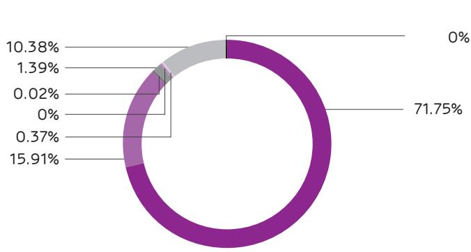

pie

| Category | Percentage |
| -------- | ---------- |
| Segment 1 | 71.75% |
| Segment 2 | 15.91% |
| Segment 3 | 0.37% |
| Segment 4 | 0% |
| Segment 5 | 0.02% |
| Segment 6 | 1.39% |
| Segment 7 | 10.38% |
| Segment 8 | 0% |
| Segment 9 | 0% |

Promoter and Promoter Group   
Foreign Institutional Investors / Portfolio Investor   
Insurance Companies   
Mutual Funds/Banks/Financial Institutions   
NRI/Foreign Nationals   
IEPF/Clearing Member   
Bodies Corporate   
Indian Public and others   
Alternative Investment Fund

# Commodity Price Risk/Foreign Exchange Risk and Hedging:

In the ordinary course of business, the Company is exposed to risks resulting from exchange rate fluctuation and interest rate movements. It manages its exposure to these risks through derivative financial instruments. The Company’s risk management activities are subject to the management, direction and control of Treasury Team of the Company under the framework of Risk Management Policy for Currency and Interest rate risk as approved by the Board of Directors of the Company. The Company’s Treasury Team ensures appropriate

financial risk governance framework for the Company through appropriate policies and procedures and that financial risks are identified, measured and managed in accordance with the Company’s policies and risk objectives. It is the Company’s policy that no trading in derivatives for speculative purposes may be undertaken. The decision of whether and when to execute derivative financial instruments along with its tenure can vary from period to period depending on market conditions and the relative costs of the instruments. The tenure is linked to the timing of the underlying exposure, with the connection between the two being regularly monitored.

Site Location: 

<table><tr><td>Name of Sites</td><td>Address of the Sites</td></tr><tr><td>Solar Project</td><td>&quot;Adani House&quot;, Navinal Island, Mundra, Dist. Kutch, Gujarat.</td></tr><tr><td>Mundra TPP</td><td>Village Bitta-Naliya, District - Kutchh, Gujarat</td></tr><tr><td>Tiroda TPP</td><td>Village Tunda &amp; Siracha Taluka Mundra, Kutch - 370 435 Gujarat, India</td></tr><tr><td>Kawai TPP</td><td>Plot A-1, Tiroda Growth Centre MIDC Area, Tiroda</td></tr><tr><td>Udupi TPP</td><td>Gondia - 441 911 Maharashtra, India.</td></tr><tr><td>Raigarh TPP</td><td>NH 90, Atru Road Village Kawai Taluka Atru Baran - 325 219 Rajasthan, India.</td></tr><tr><td>Raipur TPP</td><td>Yelluru Village Pilar Post Padubidri Udupi - 574 113</td></tr><tr><td>Mahan TPP</td><td>Karnataka, India.</td></tr><tr><td>Godda</td><td>Village- Chhote Bhandar PO- Bade Bhandar, The- Pussore District- Raigarh- 496 100 Chhattisgarh, India.</td></tr></table>

# Credit Rating:

International Rating 

<table><tr><td>Rating Agency</td><td>Type of Instrument / facility</td><td>Rating / Outlook</td></tr><tr><td>Standard &amp; Poor&#x27;s</td><td>Long-term Foreign Currency Issuer Credit Rating</td><td>Not Applicable</td></tr><tr><td>Moody&#x27;s</td><td>Long-term Foreign Currency Issuer Rating</td><td>Not Applicable</td></tr><tr><td>Fitch</td><td>Long-term Foreign Currency Issuer Default Rating</td><td>Not Applicable</td></tr></table>

Domestic Rating 

<table><tr><td>Rating Agency</td><td>Type of Instrument / facility</td><td>Rating / Outlook</td></tr><tr><td>ICRA</td><td>Long-term Facility Short Term Facility</td><td>CRISIL AA-/Stable</td></tr><tr><td>India Ratings</td><td>Long-term Facility Short Term Facility</td><td>IND AA-/Stable/IND A1+</td></tr><tr><td colspan="3">Adani Power (Jharkhand) Limited</td></tr><tr><td>India Ratings</td><td>Long-term Facility / Short Term Facility</td><td>IND BBB/Stable/IND A3+</td></tr></table>

# Details of Corporate Policies:

Details of corporate policies are provided as a part of Directors’ Report, forming integral part of this Integrated Annual Report.

# Dispute Resolution Mechanism at Stock Exchanges (SMART ODR):

SEBI vide its Circular dated May 30, 2022 provided an option for arbitration as a Dispute Resolution Mechanism for investors. As per this Circular, investors can opt for arbitration with Stock Exchanges in case of any dispute against the Company or its RTA on delay or default in processing any investor services related request.

In compliance with SEBI guidelines, the Company had sent communication intimating about the said Dispute Resolution Mechanism to all the Members holding shares in physical form.

# Compliance with Non-mandatory Requirements:

The non-mandatory requirements have been adopted to the extent and in the manner as stated under the appropriate headings detailed below:

# The Board:

The Board of Directors periodically reviewed the compliance of all the applicable laws and steps taken by the Company to rectify instances of non-compliance, if any. The Company is in compliance with all mandatory requirements of Listing Regulations.

The Company has Non-Executive Chairman and hence, the need for implementing the non-mandatory requirement i.e., maintaining a chairperson's office at the Company’s expense and allowing reimbursement of expenses incurred in performance of his duties, does not arise.

# Shareholders’ Right:

The Company ensures that the disclosure of all the information is disseminated on a non-discretionary basis to all the Shareholders. The quarterly results along with the press release, investor presentations, recordings and transcripts of earnings call are uploaded on the website of the Company www.adanipower.com. The same are also available on the sites of stock exchanges (BSE and NSE) where the shares of the Company are listed.

# Audit Qualification:

The Auditors’ modified opinion has been appropriately dealt with in Note No. 67 and 69 (Consolidated Financial Statements) and Note No. 63 (Standalone Financial Statements) and 69 doesn’t require any further comments under section 134 of the Act.

# Reporting of Internal Auditor:

The Internal Auditor of the Company is a permanent invitee to the Audit Committee Meeting and regularly attends the Meeting for reporting their findings of the internal audit to the Audit Committee Members.

# Separate posts of Chairperson and Chief Executive Officer:

Mr. Gautam S. Adani is the Chairman and Mr. S. B. Khyalia is Chief Executive Officer of the Company. Both these positions have distinct and well-articulated roles and responsibilities. They are not related to each other.

The Company has submitted quarterly compliance report on Corporate Governance with the Stock Exchanges, in accordance with the requirements of Regulation 27(2)(a) of the Listing Regulations.

# Independence of Audit Committee:

All the members of the Committee are Non-Executive Independent Directors.

# OTHER DISCLOSURES:

# Disclosure of Related Party Transactions:

During the year, all related party transactions entered into by the Company were in the ordinary course of business and were at arm’s length basis and were approved by the members of Audit Committee, comprising only of the Independent Directors. The Company had sought the approval of shareholders at the 27th Annual General Meeting held on July 19, 2023 for material related party transactions as per Regulation 23 of SEBI Listing Regulations. Similarly, the Company intends seeking approval of its shareholders for the material related party transactions for FY 2024-25 at its ensuing annual general meeting to be held on June 25, 2024. The details of Related Party Transactions are disclosed in financial section of this Integrated Annual Report.

The Board has adopted a policy on materiality of Related Party Transactions and also on dealing with Related Party Transactions.

The Board’s approved policy for related party transactions is uploaded on the website of the Company at: https:// www.adanipower.com/investors/corporate-governance.

# Disclosure of accounting treatment in preparation of Financial Statements

The Company follows the guidelines of Accounting Standards referred to in section 133 of the Companies Act, 2013 read with Rule 7 of the Companies (Accounts) Rules, 2014 together with Ind AS issued by the Institute of Chartered Accountants of India.

# Fees paid to Statutory Auditor

Total fees for all services paid by the Company and its subsidiaries, on a consolidated basis, to the Statutory Auditor and all entities in the network firm / network entity of which the Statutory Auditor is a part, is given below:

(\` in crore) 

<table><tr><td>Payment to Statutory Auditor</td><td>FY 2023-24</td></tr><tr><td>Audit Fees</td><td>3.51</td></tr><tr><td>Certification Fees</td><td>0.44</td></tr><tr><td>Reimbursement of Expenses</td><td>0.13</td></tr><tr><td>Total</td><td>4.08</td></tr></table>

# Compliance with Capital Market Regulations during the last three years:

There has been no instance of non-compliance by the Company and no penalty and/ or stricture has been imposed by Stock Exchanges or SEBI or any statutory authority on any matter related to capital markets during the last three years.

# Contributions:

The Company has not made any contributions to / spending for political campaigns, political organizations, lobbyists or lobbying organizations, trade associations and other tax-exempt groups.

# ADANI Code of Conduct:

The ADANI Code of Conduct for the Directors and Senior Management of the Company has been laid down by the Board and the same is posted on the website of the Company.

A declaration signed by the Managing Director affirming the compliance with the ADANI Code of Conduct by the Board Members and Senior Management Personnel of the Company is appended as an annexure to this report.

# Conflict of Interest:

The designated Senior Management Personnel of the Company have disclosed to the Board that no material, financial and commercial transactions have been made during the year under review in which they have personal interest, which may have a potential conflict with the interest of the Company at large.

# Details of Loans and Advances by the Company and its Subsidiaries in the nature of loans to firms/ companies in which Directors are interested:

The aforesaid details are provided in the financial statements of the Company forming part of this Integrated Annual Report. Please refer to Note 57 of the standalone financial statements.

# Proceeds from public issues, rights issues, preferential issues, etc.

The Company discloses to the Audit Committee, the uses/ application of proceeds/funds raised from public issues, rights issues, preferential issues, etc. as part of the quarterly review of financial results whenever applicable.

# Governance Policies:

1. The Company has also adopted Material Events Policy, Website Content Archival Policy and Policy on Preservation of Documents which is uploaded on the website of the Company at: https://www.adanipower. com/investors/corporate-governance.   
2. As a part of good governance practice, the Company has also constituted several policies from ESG perspective and the same are available on Company’s website at https://www.adanipower.com/investors/ corporate-governance   
3. The Company has in place an Information Security Policy that ensure proper utilization of IT resources.   
4. Details of the familiarization programmes imparted to the Independent Directors are available on the website of the Company at: https://www.adanipower. com/investors/corporate-governance.   
5. The Company has put in place succession plan for appointment to the Board and to Senior Management.

# Statutory Certificates:

# CEO / CFO Certification

The certificate required under Regulation 17(8) of the Listing Regulations, duly signed by the CEO and CFO of the Company was placed before the Board. The same is provided as an annexure to this report.

# Certificate from Secretarial Auditor on Corporate Governance

The Company has complied with all the mandatory requirements specified in Regulations 17 to 27 and clauses (b) to (i) of sub-regulation (2) of Regulation 46 of the SEBI Listing Regulations. It has obtained a certificate affirming the compliances from CS Chirag Shah, Partner, M/s. Chirag Shah & Associates, Practising Company Secretaries, affirming compliance of Corporate Governance requirements during FY 2023-24 and the same is attached to this Report.

# Certificate from Secretarial Auditor pursuant to Schedule V of the SEBI Listing Regulations

A certificate from CS Chirag Shah, Partner, Chirag Shah & Associates, Practising Company Secretaries, pursuant to Schedule V of the Listing Regulations, confirming that none of the Directors on the Board of the Company has been debarred or disqualified from being appointed or continuing as director of the Company by the Securities and Exchange Board of India, Ministry of Corporate Affairs or any such statutory authority as on March 31, 2024, is annexed to this report.

# Senior Management:

The details of senior management including changes therein since the close of the previous financial year is as under:

<table><tr><td>Name</td><td>As on March 31, 2024</td><td>As on March 31, 2023</td></tr><tr><td>Mr. Anil Sardana</td><td>√</td><td>√</td></tr><tr><td>Mr. S. B. Khyalia</td><td>√</td><td>√</td></tr><tr><td>Mr. Shailesh Sawa</td><td>√</td><td>√</td></tr><tr><td>Mr. Deepak S Pandya</td><td>√</td><td>√</td></tr><tr><td>Mr. Sameer Ganju</td><td>√</td><td>√</td></tr><tr><td>Mr. Savan Patel</td><td>√</td><td>√</td></tr><tr><td>Mr. Jayadeb Nanda</td><td>√</td><td>√</td></tr><tr><td>Mr. M.R. Krishna Rao</td><td>√</td><td>√</td></tr><tr><td>Mr. Kulpati Jha</td><td>√</td><td>√</td></tr><tr><td>Mr. Vijay Kumar Sinha*</td><td>√</td><td>√</td></tr><tr><td>Mr. Ramesh Jha</td><td>√</td><td>√</td></tr></table>

\*Mr. Vijay Kumar Sinha resigned w.e.f. May 01, 2024. Mr. Sanjay Argade was appointed as Head - Human Resources in his place w.e.f. May 01, 2024

# Directors’ details:

As required under Regulation 36(3) of the SEBI Listing Regulations, particulars of Director seeking re-appointment at the forthcoming AGM are given in the Annexure to the Notice of the 28th AGM to be held on June 25, 2024.

# Compliance with Secretarial Standards:

The Company complies with all applicable secretarial standards.

# Reconciliation of Share Capital Audit:

A qualified Practicing Company Secretary carried out a reconciliation of Share Capital Audit to reconcile the total admitted capital with National Securities Depository Limited (NSDL) and Central Depository Services (India) Limited (CDSL) and the total issued and listed capital. The Secretarial Audit confirms that the total issued / paid-up capital of the Company is in agreement with the total number of shares in physical form and the total number of dematerialized shares held with NSDL and CDSL.

# Raising of the any funds, if any, through preferential allotment:

During the year under review, the Company did not raise any funds through preferential allotment or qualified institutional placement as specified under Regulation 32(7A) of the SEBI Listing Regulations.

# Details of the Company’s material subsidiary:

Name :

Adani Power (Jharkhand) Limited

Date of Incorporation :

December 18, 2015

Name of the Statutory Auditor :

M/s Dharmesh Parikh & Co., LLP

Date of appointment of Statutory Auditor:

June 30, 2021

# CERTIFICATE ON CORPORATE GOVERNANCE

To

The Members of

Adani Power Limited

We have examined the compliance of conditions of Corporate Governance by Adani Power Limited (“the Company”) for the year ended on March 31, 2024 as stipulated in the applicable regulations of SEBI (Listing Obligations and Disclosure Requirements) Regulations, 2015, as amended, pursuant to the Listing Agreement of the Company with the Stock Exchanges.

The compliance of conditions of Corporate Governance is the responsibility of the Management. Our examination was limited to a review of procedures and implementations thereof adopted by the Company for ensuring the compliance of the conditions of Corporate Governance. It is neither an audit nor an expression of opinion on the financial statement of the Company.

In our opinion and to the best of our information and according to the explanations given to us, we certify that the Company has complied with the conditions of Corporate Governance as stipulated in the applicable regulations of SEBI (Listing Obligations and Disclosure Requirements} Regulations, 2015, as amended except Regulation 17 of the SEBI (Listing Regulations and Disclosure Requirements) Regulations, 2015 relating to the composition of the Board for an intermittent period from March 30, 2024 to May 1, 2024 and the Company has complied with the said provisions w.e.f. May 1, 2024.

We further state that such compliance is neither an assurance as to the future viability of the Company nor the Efficiency or effectiveness with which the management has conducted the affairs of the Company.

Chirag Shah

Partner

Chirag Shah & Associates

Company Secretaries

FCS. 5545

C P No. 3498

Place: Ahmedabad

Date: May 01, 2024

Peer Review Cert. No. 704/2020

UDIN: F005545F000286551

# CERTIFICATE OF NON-DISQUALIFICATION OF DIRECTORS

# (Pursuant to Regulation 34(3) and Schedule V Para C clause (10)(i) of the SEBI (Listing Obligations and Disclosure Requirements) Regulations, 2015)

To,

The Members of

# Adani Power Limited

Adani Corporate House, Shantigram,

Near Vaishno Devi Circle,

S.G. Highway, Khodiyar,

Ahmedabad – 382 421.

We have examined the relevant registers, records, forms, returns and disclosures received from the Directors of Adani Power Limited having CIN L40100GJ1996PLC030533 and having registered office at Adani Corporate House, Shantigram, Near Vaishno Devi Circle, S. G. Highway, Khodiyar Ahmedabad - 382421. (hereinafter referred to as ‘the Company’), produced before us by the Company for the purpose of issuing this Certificate, in accordance with Regulation 34(3) read with Schedule V Para-C Sub clause 10(i) of the Securities Exchange Board of India (Listing Obligations and Disclosure Requirements) Regulations, 2015.

In our opinion and to the best of our information and according to the verifications (including Directors Identification Number (DIN) status at the portal www.mca.gov.in) as considered necessary and explanations furnished to us by the Company & its officers, we hereby certify that none of the Directors on the Board of the Company as stated below for the Financial Year ending on March 31, 2024 have been debarred or disqualified from being appointed or continuing as Directors of companies by the Securities and Exchange Board of India, Ministry of Corporate Affairs or any such other Statutory Authority.

<table><tr><td>Sr. No.</td><td>Name of Director</td><td>DIN</td><td>Date of appointment in Company</td></tr><tr><td>1.</td><td>Mr. Gautam Shantilal Adani</td><td>00006273</td><td>26/12/2005</td></tr><tr><td>2.</td><td>Mr. Rajesh Shantilal Adani</td><td>00006322</td><td>12/06/2007</td></tr><tr><td>3.</td><td>Mr. Anil Kumar Sardana</td><td>00006867</td><td>11/07/2020</td></tr><tr><td>4.</td><td>Mr. Sushil Kumar Roongta</td><td>00309302</td><td>11/11/2022</td></tr><tr><td>5.</td><td>Mrs. Chandra Iyengar</td><td>02821294</td><td>11/11/2022</td></tr></table>

Ensuring the eligibility of for the appointment / continuity of every Director on the Board is the responsibility of the management of the Company. Our responsibility is to express an opinion on these based on our verification. This certificate is neither an assurance as to the future viability of the Company nor of the efficiency or effectiveness with which the management has conducted the affairs of the Company.

For, Chirag Shah and Associates

CS Chirag Shah

Partner

FCS. 5545

C P No. 3498

Place: Ahmedabad

Date: May 01, 2024

Peer Review Cert. No. 704/2020

UDIN: F005545F000286540

# Declaration

[Regulation 34(3) read with Schedule V (Part D) of the SEBI (Listing Obligations and Disclosure Requirements) Regulations, 2015]

I, Anil Sardana, Managing Director of Adani Power Limited hereby declare that as of March 31, 2024, all the Board Members and Senior Management Personnel have affirmed compliance with the Code of Conduct and Ethics for Board of Directors and Senior Management Personnel laid down by the Company

For and on behalf of the Board of Directors

Anil Sardana

Place: Ahmedabad

Date: May 01, 2024

Managing Director

# CERTIFICATION BY CHIEF EXECUTIVE OFFICER (CEO) AND CHIEF FINANCIAL OFFICER (CFO)

We have reviewed the financial statements, and the cash flow statements for the year ended March 31, 2024 and that to the best of our knowledge and belief:

1. These statements do not contain any materially untrue statement or omit any material fact or contain statements that might be misleading.   
2. These statements together present a true and fair view of the Company's affairs and are in compliance with existing accounting standards, applicable laws and regulations.   
3. To the best of our knowledge and belief, no transactions entered into by the Company during the year ended March 31, 2024, which are fraudulent, illegal or violation of the Company's Code of Conduct.   
4. We accept responsibility for establishing and maintaining internal control system and that we have evaluated the effectiveness of the internal control system of the Company and we have disclosed to the auditors and the Audit Committee, efficiencies in the design or operation of internal control system, if any, of which we are aware and the steps we have taken or propose to take to rectify these deficiencies.

5. We further certify that we have indicated to the auditors and the Audit Committee:

a) There have been no significant changes in internal control system during the year;   
b) There have been no significant changes in accounting policies during the year and that the same have been disclosed in the notes to the financial statements; and   
c) There have been no instances of significant fraud of which we have become aware, involving management or an employee having a significant role in the Company's internal control system over financial reporting.

Date : May 01, 2024

Place : Ahmedabad

S. B. Khyalia

Chief Executive Officer

Dilip Kumar Jha

Chief Financial Officer

# Business Responsibility & Sustainability Report

# Section A : General Dislosure

I. Details of the listed Entity 

<table><tr><td>1</td><td>Corporate Identity Number (CIN) of the Listed Entity</td><td>L40100GJ1996PLC030533</td></tr><tr><td>2</td><td>Name of the Listed Entity</td><td>Adani Power Limited (APL / Company)</td></tr><tr><td>3</td><td>Year of incorporation</td><td>1996</td></tr><tr><td>4</td><td>Registered office address</td><td>&quot;Adani Corporate House&quot;, Shantigram, Near Vaishnodevi Circle, S. G. Highway, Khodiyar, Ahmedabad – 382421, Gujarat, India.</td></tr><tr><td>5</td><td>Corporate address</td><td>&quot;Adani Corporate House&quot;, Shantigram, Near Vaishnodevi Circle, S. G. Highway, Khodiyar, Ahmedabad – 382421, Gujarat, India.</td></tr><tr><td>6</td><td>E-mail</td><td>investor.apl@adani.com</td></tr><tr><td>7</td><td>Telephone</td><td>+91 79 – 26567555</td></tr><tr><td>8</td><td>Website</td><td>www.adanipower.com</td></tr><tr><td>9</td><td>Financial year for which reporting is being done</td><td>April 01, 2023 to March 31, 2024</td></tr><tr><td>10</td><td>Name of the Stock Exchange(s) where shares are listed</td><td>BSE Limited (BSE) and National Stock Exchange of India Limited (NSE)</td></tr><tr><td>11</td><td>Paid-up Capital</td><td>₹ 4572.80 Cr.</td></tr><tr><td>12</td><td>Name and contact details (telephone, email address) of the person who may be contacted in case of any queries on the BRSR report</td><td>Name: Mr. Santosh Kumar SinghDesignation: Chief Sustainability OfficerTelephone Number: (079) 2555 57289Email Id: cso.power@adani.com</td></tr><tr><td>13</td><td>Reporting boundary - Are the disclosures under this report made on a standalone basis (i.e. only for the entity) or on a consolidated basis (i.e. for the entity and all the entities which form a part of its consolidated financial statements, taken together).</td><td>Disclosures under this report are made on a consolidated basis. The following Power generation stations of energy businesses are included in the reporting boundary.(i) Adani Power Limited, (Solar Plant), Bitta, Kutch, Gujarat.(ii) Adani Power Limited, Mundra, Gujarat.(iii) Adani Power Limited, Tiroda, Maharashtra.(iv) Adani Power Limited, Kawai, Rajasthan.(v) Adani Power Limited, Udupi, Karnataka.(vi) Adani Power Limited, Raipur, Chhattisgarh.(vii) Adani Power Limited, Raigarh, Chhattisgarh.(viii) Adani Power Jharkhand Limited, Godda, Jharkhand and (ix) Mahan Energen Limited, Singrauli, Madhya Pradesh</td></tr><tr><td>14</td><td>Name of assurance provider</td><td>DNV Business Assurance India Pvt Ltd.</td></tr><tr><td>15</td><td>Type of assurance obtained</td><td>Reasonable Assurance of Core Indicators &amp; Limited assurance for non-core Indicators</td></tr></table>

# II. Products and Services

16. Details of business activities (accounting for 90% of the turnover): 

<table><tr><td>Sr. No.</td><td>Description of Main Activity</td><td>Description of Business Activity</td><td>% of Turnover of the entity</td></tr><tr><td>1</td><td>Power Generation and related activities</td><td>Power Generation by Coal Based Thermal Power Plant</td><td>99%</td></tr></table>

# ADANI POWER LIMITED

# Integrated Annual Report 2023-24

17. Products/Services sold by the entity (accounting for 90% of the entity’s Turnover): 

<table><tr><td>S. No.</td><td>Product/Service</td><td>NIC Code</td><td>% of total Turnover contributed</td></tr><tr><td>1</td><td>Electric power generation by Coal Based Thermal Power Plants*</td><td>35102</td><td>99.7%</td></tr><tr><td>2</td><td>Electric power generation using Solar Energy</td><td>35105</td><td>0.3%</td></tr></table>

(\*Note: Coal base Thermal Power Plant includes generation by APL & its subsidiaries including Generation & Transmission from Adani Power(Jharkhand) Limited)

# III. Operations

18. Number of locations where plants and/or operations/offices of the entity are situated 

<table><tr><td>Location</td><td>Number of plants</td><td>Number of offices</td><td>Total</td></tr><tr><td>National</td><td>09</td><td>01</td><td>10</td></tr><tr><td>International</td><td>00</td><td>00</td><td>00</td></tr></table>

19. Markets served by the entity: 

<table><tr><td>a. Locations</td><td>Number</td></tr><tr><td>National (No. of States)</td><td>17</td></tr><tr><td>International (No. of Countries)</td><td>01</td></tr></table>

# b. What is the contribution of exports as a percentage of the total turnover of the entity?

APL installed 1600 MW Thermal Power Plant to export electricity to fulfill the requirement of electricity demand in Bangladesh under Indo-Bangla Maitry Treaty signed between Government of India (GoI) and Government of Bangladesh (GoB), about 10.49% of total generation contributed toward export and 14.64% of exports of the total turnover of the entity.

# c. A brief on types of customers:

The Company primarily serves B2B customers (comprising of State utilities & DISCOMS).

# IV. Employees

# 20. Details as at the end of Financial Year

1. Employees (including differently abled): 

<table><tr><td rowspan="2">Particulars</td><td rowspan="2">Total (A)</td><td colspan="2">Male</td><td colspan="2">Female</td></tr><tr><td>No. (B)</td><td>% (B/A)</td><td>No. (C)</td><td>% (C/A)</td></tr><tr><td colspan="6">EMPLOYEES</td></tr><tr><td>Permanent (D)</td><td>3295</td><td>3254</td><td>98.8%</td><td>41</td><td>1.2%</td></tr><tr><td>Other than Permanent (E)</td><td>20</td><td>20</td><td>100%</td><td>0</td><td>0%</td></tr><tr><td>Total Employees (D+E)</td><td>3315</td><td>3274</td><td>98.8%</td><td>41</td><td>1.2%</td></tr><tr><td colspan="6">WORKERS</td></tr><tr><td>Permanent (F)</td><td>0</td><td>0</td><td>0</td><td>0</td><td>0</td></tr><tr><td>Other than Permanent (G)</td><td>13044</td><td>13035</td><td>99.9%</td><td>09</td><td>0.1%</td></tr><tr><td>Total Workers (F+G)</td><td>13044</td><td>13035</td><td>99.9%</td><td>09</td><td>0.1%</td></tr></table>

(Workers include AIMSL 323 nos., Innov Global Ltd. 539 nos. & Contractual workers 12,182)

2. Differently abled Employees and workers: 

<table><tr><td rowspan="2">Particulars</td><td rowspan="2">Total (A)</td><td colspan="2">Male</td><td colspan="2">Female</td></tr><tr><td>No. (B)</td><td>% (B/A)</td><td>No. (C)</td><td>% (C/A)</td></tr><tr><td colspan="6">DIFFERENTLY ABLED EMPLOYEES</td></tr><tr><td>Permanent (D)</td><td>1</td><td>1</td><td>100%</td><td>0</td><td>0</td></tr><tr><td>Other than Permanent (E)</td><td>0</td><td>0</td><td>0</td><td>0</td><td>0</td></tr><tr><td>Total Differently abled employees (D+E)</td><td>1</td><td>0</td><td>100%</td><td>0</td><td>0</td></tr><tr><td colspan="6">DIFFERENTLY ABLED WORKERS</td></tr><tr><td>Permanent (F)</td><td>0</td><td>0</td><td>0</td><td>0</td><td>0</td></tr><tr><td>Other than Permanent (G)</td><td>0</td><td>0</td><td>0</td><td>0</td><td>0</td></tr><tr><td>Total differently abled Workers (F+G)</td><td>0</td><td>0</td><td>0</td><td>0</td><td>0</td></tr></table>

21. Participation/Inclusion/Representation of women 

<table><tr><td></td><td>Total (A)</td><td>No. (B)</td><td>% (B/A)</td></tr><tr><td>Board of Directors</td><td>6</td><td>1</td><td>16.7</td></tr><tr><td>Key Managerial Personnel*</td><td>4</td><td>0</td><td>0</td></tr></table>

\* Managing Director D,\* Chief Executive Officer, Chief Financial Officer and Company Secretary

22. Turnover rate for permanent employees and workers: (Disclose trends for the past 3 years) 

<table><tr><td rowspan="2"></td><td colspan="3">FY 2023-24(Turnover Rate in current FY)</td><td colspan="3">FY 2022-23(Turnover Rate in previous FY)</td><td colspan="3">FY 2021-22(Turnover Rate in year prior to the previous FY)</td></tr><tr><td>Male</td><td>Female</td><td>Total</td><td>Male</td><td>Female</td><td>Total</td><td>Male</td><td>Female</td><td>Total</td></tr><tr><td>Permanent Employees</td><td>9.76%</td><td>6.15%</td><td>9.72%</td><td>7.02%</td><td>5.26%</td><td>7.01%</td><td>8.38%</td><td>0%</td><td>8.38%</td></tr><tr><td>Permanent Workers</td><td>0</td><td>0</td><td>0</td><td>0</td><td>0</td><td>0</td><td>0</td><td>0</td><td>0</td></tr></table>

# V. Holding, Subsidiary and Associate Companies (including joint ventures)

23. Names of holding / subsidiary / associate companies / joint ventures 

<table><tr><td>Sr. No.</td><td>Name of the holding / subsidiary / associate companies / joint ventures (A)</td><td>Indicate whether holding/ Subsidiary/ Associate/ Joint Venture</td><td>% of shares held by listed entity</td><td>Does the entity indicated at column A, participate in the Business Responsibility initiatives of the listed entity? (Yes/No)</td></tr><tr><td>1</td><td>Adani Power (Jharkhand) Limited</td><td>Subsidiary</td><td>100.00</td><td>Yes</td></tr><tr><td>2</td><td>Mahan Energen Limited (Formerly known as Essar Power MP Limited)</td><td>Subsidiary</td><td>100.00</td><td>Yes</td></tr><tr><td>3</td><td>Adani Power Dahej Limited</td><td>Subsidiary</td><td>100.00</td><td>No</td></tr><tr><td>4</td><td>Pench Thermal Energy (MP) Limited</td><td>Subsidiary</td><td>100.00</td><td>No</td></tr><tr><td>5</td><td>Kutchh Power Generation Limited</td><td>Step Down</td><td>100.00</td><td>No</td></tr><tr><td>6</td><td>Mahan Fuel Management Limited</td><td>Subsidiary</td><td>100.00</td><td>No</td></tr><tr><td>7</td><td>Adani Power Resources Limited</td><td>Subsidiary</td><td>51.00</td><td>No</td></tr><tr><td>8</td><td>Alcedo Infra Park Limited</td><td>Subsidiary</td><td>100.00</td><td>No</td></tr><tr><td>9</td><td>Chandenvalle Infra Park Limited</td><td>Subsidiary</td><td>100.00</td><td>No</td></tr><tr><td>10</td><td>Emberiza Infra Park Limited</td><td>Subsidiary</td><td>100.00</td><td>No</td></tr><tr><td>11</td><td>Resurgent Fuel Management Limited</td><td>Subsidiary</td><td>100.00</td><td>No</td></tr><tr><td>12</td><td>Innovant Buildwell Private Limited* (Formerly known as Etemus Real Estate Private Limited)</td><td>Subsidiary</td><td>100.00</td><td>No</td></tr><tr><td>13</td><td>Aviceda Infra Park Limited$</td><td>Subsidiary</td><td>100.00</td><td>No</td></tr><tr><td>14</td><td>Moxie Power Generation Limited#</td><td>Associate</td><td>49.00</td><td>No</td></tr></table>

\*Ceased to be subsidiary w.e.f. January 29, 2024 upon transfer of all the equity shares to Adani connex Private Limited (a related party of the Company)   
\$Ceased to be subsidiary w.e.f. March 29, 2024 upon transfer of all the equity shares to Adani connex Private Limited (a related party of the Company)   
#Incorporated on January 30, 2024

<table><tr><td colspan="2">VI. CSR Details</td><td>Response</td></tr><tr><td>24. (i)</td><td>Whether CSR is applicable as per section 135 of Companies Act, 2013: (Yes/No)</td><td>Yes</td></tr><tr><td>(ii)</td><td>Turnover (₹ in Crs.)</td><td>60281.48</td></tr><tr><td>(iii)</td><td>Net worth (₹ in Crs.)</td><td>43145.03</td></tr></table>

# VII. Transparency and Disclosures Compliances

25. Complaints/Grievances on any of the principles (Principles 1 to 9) under the National Guidelines on Responsible Business Conduct.

<table><tr><td rowspan="2">Stakeholder group from whom complaint is received</td><td rowspan="2">Grievance Redressal Mechanism in Place (Yes/No) (If Yes, then provide web-link for grievance redress policy)</td><td colspan="3">Current Financial Year FY 2023-24</td><td colspan="3">Previous Financial Year FY 2022-23</td></tr><tr><td>Number of complaints filed during the year</td><td>Number of complaints pending resolution at close of the year</td><td>Remarks</td><td>Number of complaints filed during the year</td><td>Number of complaints pending resolution at close of the year</td><td>Remarks</td></tr><tr><td>Communities</td><td>Yes</td><td>0</td><td>0</td><td>0</td><td>0</td><td>0</td><td>0</td></tr><tr><td>Investors (other than shareholders)</td><td>Yes</td><td>0</td><td>0</td><td>0</td><td>0</td><td>0</td><td>0</td></tr><tr><td>Shareholders</td><td>Yes</td><td>3</td><td>0</td><td>Resolved during the year</td><td>1</td><td>0</td><td>Resolved during the year</td></tr><tr><td>Employees and workers</td><td>Yes</td><td>1</td><td>0</td><td>0</td><td>0</td><td>0</td><td>0</td></tr><tr><td>Customers</td><td>Yes</td><td>0</td><td>0</td><td>0</td><td>0</td><td>0</td><td>0</td></tr><tr><td>Value Chain Partners</td><td>Yes</td><td>0</td><td>0</td><td>0</td><td>0</td><td>0</td><td>0</td></tr><tr><td>Other (please specify)</td><td>NIL</td><td>0</td><td>0</td><td>0</td><td>0</td><td>0</td><td>0</td></tr></table>

# Principle Wise Policies:

Weblink: https://www.adanipower.com/-/media/Project/Power/Investors/Corporate-Governance/Policies/ Employee-Grievance-Management-Policy.pdf

26. Overview of the entity’s material responsible business conduct issues 

<table><tr><td>Sr. No.</td><td>Material issue identified</td><td>Indicate whether risk or opportunity (R/O)</td><td>Rationale for identifying the risk / opportunity</td><td>In case of risk, approach to adapt or mitigate</td><td>Financial implications of the risk or opportunity (Indicate the positive/negative implications)</td></tr><tr><td>1</td><td>Occupational health and safety</td><td>Risk</td><td>Employee and worker well-being and safety is integral to APL.Jeopardizing the health and safety can not only impact the productivity, as well as profitability, but also affect the employee and worker morale.</td><td>Foster a safe working environment and ensure zero harm. Hazards and risks are identified on a periodic basis, and mitigation as well as prevention plans are implemented. Further, for employee and worker well-being, regular trainings on health and safety are provided.</td><td>Negative implications</td></tr><tr><td>2</td><td>Biodiversity</td><td>Risk</td><td>Reducing the impact of business operation on biodiversity and focus on optimization of natural resources to avoid negatively impacting the environment and the biodiversity.</td><td>The biodiversity policy drives the Company to do business with no net loss to biodiversity by 2025. The approach in managing biodiversity impacts at the operation and construction sites is built upon three major principles outlined in the Biodiversity Policy and embedded in the Biodiversity Assessment process</td><td>Negative implications</td></tr><tr><td>3</td><td>Regulatory Compliance</td><td>Risk</td><td>Failure to comply with regulatory requirements can result in financial and reputational consequences and erode stakeholder trust.</td><td>Legal and functional teams monitor the regulatory compliances applicable for respective business functions at defined frequencies.Disciplinary measures and reinforcement mechanisms are also defined.</td><td>Negative implications</td></tr><tr><td>4</td><td>Anti-Bribery &amp; Anti-Corruption</td><td>Risk</td><td>Failing to uphold ethical practices and behaviour can lead to severe financial and reputations damages. It also puts stakeholder trust and the Company's leadership position at risk</td><td>Anti-Bribery and Anti-Corruption Policy, Code of Conduct, Whistleblower Policy, and other ESG policies provide detailed guidance on ethical conduct and mitigate the risk of non-compliance.</td><td>Negative implications</td></tr><tr><td>5</td><td>Human Rights</td><td>Risk</td><td>Upholding human rights in accordance with all applicable national and international regulations is essential to protect employees, communities, and other stakeholders.</td><td>The Human Rights Policy provides guidance on adherence to national and international Human Rights standards and principles. From a management perspective, a body has been instituted to support in adoption of human rights. There is mechanism within each entity to address an issue raised or reported pertaining to human rights, as well as a stipulated timeline within which it should be resolved.</td><td>Negative implications</td></tr><tr><td>6</td><td>Water Management</td><td>Risk</td><td>Water is a shared resource, and hence ensuring responsible consumption is key to the business' social license to operate</td><td>The Company has instituted a Resource Conservation Policy, which serves as a guiding principle to reduce consumption of water and other resources.</td><td>Negative implications</td></tr><tr><td>7</td><td>Waste Management</td><td>Risk</td><td>Noncompliance with regulation and inefficient modus operandi can firstly have direct financial and reputational implications, and secondly impact the environment. Hence, effectively managing and reducing the waste generated and complying with environmental rules and regulations ensure environmental sustainability.</td><td>The resource conservation policy provides guidance to incorporate the principles of circularity in processes and production. Complies with all applicable environmental laws and regulations and takes initiatives to manage and reduce quantities of waste generated.</td><td>Negative implications</td></tr><tr><td>8</td><td>Energy and Emissions Management</td><td>Risk</td><td>Adopting low carbon technologies also helps an organization prepare for a future, which could bring more stringent legislation and taxation related to energy and emissions.</td><td>Energy and Emission Policy provides guidance to reduce energy consumption and conserve greenhouse gas emissions. Complies with all applicable environmental laws and regulations and take initiatives to manage energy and emissions</td><td>Negative implications</td></tr><tr><td>9</td><td>Modernization, Innovation and Resource Optimization</td><td>Opportunity</td><td>The world is changing constantly and to remain relevant and profitable, it is an essential need to adapt and develop new advancements for meeting new realities.</td><td>The company has invested in technologies and made changes to its processes to reduce resource consumption and enhance machine safety</td><td>Positive implications</td></tr><tr><td>10</td><td>Community Development</td><td>Opportunity</td><td>Community development activities helps a company to create a positive impact on society by undertaking meaningful interventions to bring significant benefits to large sections of the society.</td><td>The Adani Foundation has been striving to create sustainable opportunities for the marginalized communities by facilitating quality education, sustainable livelihood development, promoting a healthy society and supporting rural infrastructure development.</td><td>Positive implications</td></tr><tr><td>11</td><td>Climate Change Adaption and Mitigation</td><td>Risk</td><td>The severe implications of climate change make it pertinent to control and reduce the energy consumption and emissions footprint</td><td>The Company's Climate Change Policy defines the process for measuring, monitoring and reducing the Company's environmental impact.</td><td>Negative implications</td></tr><tr><td>12</td><td>Economic Performance</td><td>Opportunity</td><td>Ensuring business profitability and strong economic performance helps deliver value to investors and reinvest in the growth of the business, employees, communities and other stakeholders</td><td>The Company thrive to deliver strong economic performance through our operational practices and risk mitigation strategies that supports the nation building and create a value for all the stakeholders</td><td>Positive implications</td></tr><tr><td>13</td><td>Plant Efficiency</td><td>Risk</td><td>Efficiency is an important attribute as all inputs are scarce. It is important to conserve them while maintaining an acceptable level of output.</td><td>Undertaking initiatives to aid resource conservation and investing in research and development efforts to explore more efficient alternatives to the existing practices supports in improving the plant efficiency.</td><td>Negative implications</td></tr><tr><td>14</td><td>Business Continuity</td><td>Risk</td><td>Business continuity actions need to organization for survive from serious disruption.</td><td>We have a strategic risk management process in place that supports to identify the short, medium and long-term risks. Within these processes, we have incorporated systems that help our operations to become durable to unforeseen issues.</td><td>Negative implications</td></tr><tr><td>15</td><td>Cultural Heritage</td><td>Opportunity</td><td>The influence of cultural factors on business is extensive. Culture impacts how employees are best managed based on their values and priorities.</td><td>Understanding the importance that cultural heritage holds for current and future generations, we have identified unique cultural heritage sites at our locations and worked towards restoring the local art and culture in these locations. One such example is the Namda craft at Kutch, Gujarat. Lastly, through the Adani Foundation, we have ensured that this art survives.</td><td>Positive implications</td></tr></table>

# Section B: Management and Process Disclosures

This section is aimed at helping businesses demonstrate the structures, policies and processes put in place towards adopting the NGRBC Principles and Core Elements.

<table><tr><td>Sr. No.</td><td>Disclosure Questions</td><td>P1</td><td>P2</td><td>P3</td><td>P4</td><td>P5</td><td>P6</td><td>P7</td><td>P8</td><td>P9</td></tr><tr><td colspan="11">Policy and management processes</td></tr><tr><td rowspan="3">1</td><td>a. Whether your entity's policy/policies cover each principle and itscore elements of the NGRBCs. (Yes/No)</td><td>Yes</td><td>Yes</td><td>Yes</td><td>Yes</td><td>Yes</td><td>Yes</td><td>Yes</td><td>Yes</td><td>Yes</td></tr><tr><td>b. Has the policy been approved bythe Board? (Yes/No)</td><td>Yes</td><td>Yes</td><td>Yes</td><td>Yes</td><td>Yes</td><td>Yes</td><td>Yes</td><td>Yes</td><td>Yes</td></tr><tr><td>c. Web Link of the Policies, if available</td><td colspan="9">https://www.adanipower.com/investors/corporate-governance</td></tr><tr><td>2</td><td>Whether the entity has translated thepolicy into procedures. (Yes / No)</td><td>Yes</td><td>Yes</td><td>Yes</td><td>Yes</td><td>Yes</td><td>Yes</td><td>Yes</td><td>Yes</td><td>Yes</td></tr><tr><td>3</td><td>Do the enlisted policies extend to yourvalue chain partners? (Yes/No)</td><td>Yes</td><td>Yes</td><td>Yes</td><td>Yes</td><td>Yes</td><td>Yes</td><td>Yes</td><td>Yes</td><td>Yes</td></tr><tr><td>4</td><td>Name of the national and internationalcodes/certifications/ labels/ standards(e.g. Forest Stewardship Council,Fairtrade, Rainforest Alliance, Trustea)standards (e.g. SA 8000, OHSAS, ISO,BIS) adopted by your entity and mappedto each principle.</td><td colspan="9">APL has adopted US based Malcolm Baldrige Business Excellenceframework (MBNQA) as Adani Business Excellence Model (ABEM).Four of APL stations have participated in RBNQ BE Assessmentsand received Performance Excellence Awards, also APLimplemented management system likeISO 9001:2015 Quality Management SystemISO 14001:2015 Environment Management SystemISO 45001:2018 Occupational Health and SafetyISO 50001:2018 Energy Management SystemISO 55001:2014 Asset Management SystemISO 46001-2019 Water efficiency management systemsISO 27031:2011 Information Security Management SystemISO 27001:2019 Information and Communication Technology(ICT) Readiness for business continuityISO 22301:2019 Business Continuity Management SystemSA 8000 Social Accountability (at APL, Udupi)</td></tr><tr><td>5</td><td>Specific commitments, goals and targets set by the entity with defined timelines, if any.</td><td colspan="9">The Company's commitment to contribute to sustainable development is well aligned with Adani Group's purpose of Nation Building that provides a guiding framework for investment in businesses that accelerate India's economic growth and enhance citizen wellbeing.We have worked to embed this sustainability commitment into our strategy, our business processes and decision-making. Some of our key ESG goals and ambitions include:- Board Governance as per world best practices-To be in top-5 companies in India for ESG benchmarking of Electric Utility Sector by FY 2024-25- Explore Net carbon Neutral possibilities and public disclosures by 2024-25- Committed to Health and Safety of workforce with Zero Harm and Zero Leak objective by bringing Leadership commitment, Uniform deployment of safety standards and procedures, Capacity building, Systems and Processes- Contribution towards tree plantation pledge of 100 million tree plantation till 2030.- Single-use-Plastic-Free (SuPF) Certified Company for 100% of operating locations by 2024-25- Integrate with Management Systems in the company to conduct business with no net loss to biodiversity and 100% alignment with India Business Biodiversity Initiative (IBBI) and public disclosures by 2024-25- Building green supply chain by integration of Associates for 100% of critical supplies by 2024-25- Systematic Materiality Assessment and integration with Management Systems in the company- Inclusive growth including communities by undertaking CSR initiatives aligned with business impacts to leave positive footprints and societal happiness</td></tr><tr><td>6</td><td>Performance of the entity against the specific commitments, goals and targets along-with reasons in case the same are not met.</td><td colspan="9">Key Performance targets across ESG parameters are set internally and monitored and acted upon continuously.</td></tr><tr><td colspan="11">Governance, leadership and oversight</td></tr><tr><td>7</td><td>Statement by director responsible for the business responsibility report, highlighting ESG related challenges, targets and achievements</td><td colspan="9">At Adani Power Limited, the company is committed to provide sustainable, affordable and reliable power to all. As a thermal power producing company, we are driven with the aim of fulfilling the country's energy needs, but we strive to do so sustainably and optimally. In the long run we aspire to maintain the trust we share with our customers, and other stakeholders, by adhering to high business standards, and adopting innovative business ideas.In the short- to medium- term, we aim to continually make process related changes, such that our operational efficiency improves, and we have lesser impact on the total amount of energy consumed and GHG emissions generated. We are gradually also looking at newer technologies in the power generation industry, to enable flexible operations and support more green and intermittent power in grid which will form of our long-term business strategy. In the reporting period we spent slightly over a crore in technology focused on improving our environmental footprint.We have a keen sense of responsibility to all our stakeholders. We consistently engage with our employees and have successfully provided trainings them on a variety of topics such as sustainability and inclusivity, mental health and well-being, ethics, etc. In furtherance to this, we have a renewed focus on the health and safety of our employees and workers and strive to improve our LTIFR. We have introduced several development programs and projects for the upliftment of community member situated near our operational facilities. In FY 2023-24 we have positively impacted 2,333,855 people.The power industry is plagued with a myriad of challenges because of extreme weather conditions, cybersecurity threats, and the growth of variable renewables and distributed energy resources. Hence, we believe in undertaking necessary measures from a business viability standpoint in terms of resource allocation, strengthening internal capacities, and exploring new avenues while exhibiting a strong focus on our people and the planet.</td></tr><tr><td rowspan="6">8</td><td rowspan="6">Details of the highest authority responsible for implementation and oversight of the Business Responsibility policy (ies).</td><td colspan="9">The Board of the Company has constituted a Corporate Responsibility Committee comprising of Independent Directors and chaired by an Independent Director to oversee strategies, activities and policies including environment, social, governance, health and safety, human talent management and related material issue and indicators in the global context and evolving statutory framework.</td></tr><tr><td colspan="4">Name of Member</td><td colspan="5">Position in Committee</td></tr><tr><td colspan="4">Mrs. Chandra Iyengar</td><td colspan="5">Chairperson (Independent &amp; Non-Executive Director)</td></tr><tr><td colspan="4">Mr. Sushil K. Roongta</td><td colspan="5">Member (Independent &amp; Non-Executive Director)</td></tr><tr><td colspan="4">Mr. Mukesh Shah</td><td colspan="5">Member (Independent &amp; Non-Executive Director) up to March 30, 2024.</td></tr><tr><td colspan="4">Mrs. Sangeeta Singh</td><td colspan="5">Member (Independent &amp; Non-Executive Director) w.e.f. May 1, 2024.</td></tr><tr><td>9</td><td>Does the entity have a specified Committee of the Board/ Director responsible for decision making on sustainability related issues? (Yes / No). If yes, provide details.</td><td colspan="9">Yes, The Board of the Company has constituted aCorporate ResponsibilityCommitteecomprising solely of the Independent Directors, which meets on a quarterly basis.The objective of the Committee is to assist the Board of Directors in fulfilling its responsibilities to oversee the Company's significant strategies, policies, and programs on social and public responsibility matters and for sustainability aspects with respect to the Company.https://www.adanipower.com/-/media/Project/Power/Investors/Board-And-Committee-Charters/Corporate-Responsibility-Committee_Charter.pdf?la=en&amp;hash=55C59010BA96BE288FD2608B87D09F0C</td></tr></table>

Principle Wise Policies available of Company. 

<table><tr><td>P1</td><td>Code of conduct for board of directors and seniorRemuneration policyDividend distribution policyWhistle blower policyRelated party transaction policyCode of practices and procedures for fair disclosure of UPSIMaterial events policyDirectors familiarisation programsBusiness continuity policyPolicy on preservation of documents</td></tr><tr><td>P2</td><td>Environment policySupplier code of conductEnergy and emission policyResource conservation policyWater stewardship policyResponsible sourcing supply chainIntegrated management policyESG policyEnvironment health safety policy</td></tr><tr><td>P3</td><td>Working hours guidelinesBoard diversity policyEmployee grievance management policyFreedom of associationEnvironment health safety policy</td></tr><tr><td>P4</td><td>Business responsibility policiesEmployee grievance management policyStakeholders engagement policy</td></tr><tr><td>P5</td><td>Affirmative action policyDiversity equity and inclusion policyPrevention of sexual harassmentAnti slavery policy</td></tr></table>

Principle Wise Policies available of Company. 

<table><tr><td>P6</td><td>Environment policyEnergy and emission policyResource conservation policyWater stewardship policyResponsible sourcing supply chainIntegrated management policyESG policyEnvironment Health Safety policyEnvironment policy</td></tr><tr><td>P7</td><td>Business responsibility policies</td></tr><tr><td>P8</td><td>Diversity equity and inclusion policy</td></tr><tr><td>P9</td><td>Quality policyCyber security and data privacy policyWebsite content archival policy</td></tr></table>

10. Details of review of each NGRBCS by the company 

<table><tr><td rowspan="2">Subject for review</td><td colspan="9">Indicate whether review was undertaken by director / committee of the board/ any other committee</td><td colspan="8">Frequency (annually/ half yearly/ quarterly/ any other - pls specify)</td><td></td></tr><tr><td>P1</td><td>P2</td><td>P3</td><td>P4</td><td>P5</td><td>P6</td><td>P7</td><td>P8</td><td>P9</td><td>P1</td><td>P2</td><td>P3</td><td>P4</td><td>P5</td><td>P6</td><td>P7</td><td>P8</td><td>P9</td></tr><tr><td>Performance against above policies and follow up action</td><td>Y</td><td>Y</td><td>Y</td><td>Y</td><td>Y</td><td>Y</td><td>Y</td><td>Y</td><td>Y</td><td colspan="9">Quarterly</td></tr><tr><td rowspan="2">Compliance with statutory requirements of relevance to the principles and, rectification of any non-compliances.</td><td colspan="2">P1</td><td colspan="2">P2</td><td colspan="2">P3</td><td colspan="2">P4</td><td colspan="2">P5</td><td colspan="2">P6</td><td colspan="2">P7</td><td colspan="2">P8</td><td colspan="2">P9</td></tr><tr><td colspan="2">Yes</td><td colspan="2">Yes</td><td colspan="2">Yes</td><td colspan="2">Yes</td><td colspan="2">Yes</td><td colspan="2">Yes</td><td colspan="2">Yes</td><td colspan="2">Yes</td><td colspan="2">Yes</td></tr><tr><td rowspan="2">11. Has the entity carried out independent assessment / evaluation of the working of its policies by an external agency? (yes/no). If yes, provide name of the agency.</td><td colspan="2">P1</td><td colspan="2">P2</td><td colspan="2">P3</td><td colspan="2">P4</td><td colspan="2">P5</td><td colspan="2">P6</td><td colspan="2">P7</td><td colspan="2">P8</td><td colspan="2">P9</td></tr><tr><td colspan="2">Yes</td><td colspan="2">Yes</td><td colspan="2">Yes</td><td colspan="2">Yes</td><td colspan="2">Yes</td><td colspan="2">Yes</td><td colspan="2">Yes</td><td colspan="2">Yes</td><td colspan="2">Yes</td></tr></table>

M/s. TUV India Pvt. Ltd. is the external agency that has carried out independent assessment of our above Management systems.

12. If answer to question (1) above is “No” i.e. not all Principles are covered by a policy, reasons to be stated:

<table><tr><td>Questions</td><td>P 1</td><td>P 2</td><td>P 3</td><td>P 4</td><td>P 5</td><td>P 6</td><td>P 7</td><td>P 8</td><td>P 9</td></tr><tr><td>The entity does not consider the Principles material to its business (Yes/No)</td><td rowspan="5" colspan="9">Not Applicable</td></tr><tr><td>The entity is not at a stage where it is in a position to formulate and implement the policies on specified principles (Yes/No)</td></tr><tr><td>The entity does not have the financial or/human and technical resources available for the task (Yes/No)</td></tr><tr><td>It is planned to be done in the next financial year (Yes/No)</td></tr><tr><td>Any other reason (please specify)</td></tr></table>

# Section C: Priniple wise Performance

Principle 1: Businesses should conduct and govern themselves with integrity, and in a manner that is Ethical, Transparent and Accountable.

Essential Indicators   
1 Percentage coverage by training and awareness programs on any of the Principles during the financial year: 

<table><tr><td>Segment</td><td>Total number of training and awareness programs held</td><td>Topics / principles covered under the training and its Impact</td><td>Percentage of persons in respective category covered by the awareness programs</td></tr><tr><td>Board of Directors</td><td rowspan="2">04 Programmes</td><td rowspan="2">Brief on Adani Portfolio &amp; ESGCapital MarketESG global TrendsSite visits</td><td rowspan="2">100%</td></tr><tr><td>Key Managerial Personnel</td></tr><tr><td>Employees other than BoD and KMPs</td><td>222 Programmes</td><td>Anti-Bribery and Anti-corruption (ABAC)Introduction to ESGPrevention of sexual harassment (POSH)Mental Health &amp; Wellbeing AwarenessAdani Behavioral Competency FrameworkPercipio TrainingComplianceInsider TradingSustainability and inclusive growthSafety TrainingsCyber Security Awareness</td><td>85%</td></tr><tr><td>Workers</td><td>22 Programmes</td><td>Permit To WorkSafety Risk Field AssessmentCSMMachine GuardingElectrical Safety &amp; LOTOW/house Safety StandardWorking at HeightRoad Safety Standard (RVDTS)Rail Safety StandardMaterial HandlingScaffoldingConfined SpaceHot Work SafetyIR&amp;I (RCFA)Electrical design Safety ManualSafety InteractionExcavation SafetyPPEWork over waterGas Cylinder SafetyPre Start-up Safety ReviewProcess Safety Management</td><td>100%</td></tr></table>

Our commitment lies in creating an enriching work environment focused on individual growth for all employees and workers. Regular bi-annual and annual performance reviews form the basis of our training and development efforts, with a substantial investment of \` 4.07 crore allocated to this purpose in the reporting period. Collaborating with reputable consultants, we conduct skill assessments and gather employee feedback to tailor personalized learning plans aligned with both individual aspirations and organizational goals.

Our training initiatives extend across digital platforms such as Percipio, e-vidyalaya, and the Adani Power Training and Research Institute (APTRI). These platforms offer flexible learning pathways and mobile accessibility, empowering employees to pursue self-paced learning. Mandated trainings cover critical areas including prevention of sexual harassment (POSH), compliance, sustainability, and risk management, ensuring employees are well-versed in industry standards and best practices.

Moreover, we encourage experiential learning through peer shadowing and cross-functional team projects, fostering collaboration and knowledge exchange among employees of diverse backgrounds and expertise levels.

2 Details of fines / penalties /punishment/ award/ compounding fees/ settlement amount paid in proceedings (by the entity or by directors / KMPs) with regulators/ law enforcement agencies/ judicial institutions, in the financial year, in the following format:

<table><tr><td colspan="6">Monetary</td></tr><tr><td></td><td>NGRBC Principle</td><td>Name of the regulatory/ enforcement agencies/ judicial Institutions</td><td>Amount (In INR)</td><td>Brief of the Case</td><td>Has an appeal been preferred? (Yes / No)</td></tr><tr><td>Penalty / Fine</td><td>Nil</td><td>Nil</td><td>Nil</td><td>Nil</td><td>Nil</td></tr><tr><td>Settlement</td><td>Nil</td><td>Nil</td><td>Nil</td><td>Nil</td><td>Nil</td></tr><tr><td>Compounding Fees</td><td>Nil</td><td>Nil</td><td>Nil</td><td>Nil</td><td>Nil</td></tr></table>

<table><tr><td colspan="6">Non-Monetary</td></tr><tr><td></td><td>NGRBC Principle</td><td>Name of the regulatory/ enforcement agencies/ judicial Institutions</td><td colspan="2">Brief of the Case</td><td>Has an appeal been preferred? (Yes / No)</td></tr><tr><td>Imprisonment</td><td>Nil</td><td>Nil</td><td>Nil</td><td>Nil</td><td>Nil</td></tr><tr><td>Punishment</td><td>Nil</td><td>Nil</td><td>Nil</td><td>Nil</td><td>Nil</td></tr></table>

3. Of the instances disclosed in Question 2 above, details of the Appeal/ Revision preferred in cases where monetary or non-monetary action has been appealed.

<table><tr><td>Case Details</td><td>Name of the regulatory/ enforcement agencies/ judicial institutions</td></tr><tr><td>Not Applicable</td><td>Not Applicable</td></tr></table>

4. Does the entity have an anti-corruption or anti-bribery policy? If yes, provide details in brief and if available, provide a web-link to the policy.

Yes, an Anti-Corruption and Anti-Bribery policy is available on the website.

https://www.adanipower.com/-/media/Project/Power/Investors/Corporate Governance/Policies/Anti-Corruptionand-Anti-Bribery-Policy.pdf

The policy covers employees, consultants, contractors, trainees, or any other person associated such as the subsidiaries, their employees, suppliers, and business partners, with the objective of providing guidance on ethical conduct in accordance with all applicable regulations. The policy sets out responsibilities and forbids any form of bribery, embezzlement, corruption at Adani Power. Moreover, in case there is any suspicion around any malpractice, or a person is unsure whether the particular act constitutes bribery or corruption, then the person can raise their query with the respective manager or vigilance and ethics officer via the whistleblower facility.

5. Number of Directors/KMPs/employees/workers against whom disciplinary action was taken by any law enforcement agency for the charges of bribery/ corruption.

<table><tr><td></td><td>FY 2023-24(Current Financial Year)</td><td>FY 2022-23(Previous Financial Year)</td></tr><tr><td>Directors</td><td>NIL</td><td>NIL</td></tr><tr><td>KMPs</td><td>NIL</td><td>NIL</td></tr><tr><td>Employees</td><td>NIL</td><td>NIL</td></tr><tr><td>Workers</td><td>NIL</td><td>NIL</td></tr></table>

6. Details of complaints with regard to conflict of interest:

<table><tr><td rowspan="2"></td><td colspan="2">FY 2023-24(Current Financial Year)</td><td colspan="2">FY 2022-23(Previous Financial Year)</td></tr><tr><td>Number</td><td>Remarks</td><td>Number</td><td>Remarks</td></tr><tr><td>Number of complaints received in relation to issues of Conflict of Interest of the Directors</td><td>NIL</td><td>Not Applicable</td><td>NIL</td><td>Not Applicable</td></tr><tr><td>Number of complaints received in relation to issues of Conflict of Interest of the KMPs</td><td>NIL</td><td>Not Applicable</td><td>NIL</td><td>Not Applicable</td></tr></table>

7 Provide details of any corrective action taken or underway on issues related to fines / penalties / action taken by regulators/ law enforcement agencies/ judicial institutions, on cases of corruption and conflicts of interest. Not Applicable.   
8. Number of days of accounts payables ((Accounts payable \*365) / Cost of goods/services procured) in the following format:

<table><tr><td></td><td>FY 2023-24(Current Financial Year)</td><td>FY 2022-23(Previous Financial Year)</td></tr><tr><td>Number of days of accounts payables</td><td>39.19</td><td>42.93</td></tr></table>

9. Open-ness of business Provide details of concentration of purchases and sales with trading houses, dealers, and related parties along-with loans and advances & investments, with related parties, in the following format:

<table><tr><td>Parameter</td><td>Metrics</td><td>FY 2023-24</td><td>FY 2022-23</td></tr><tr><td rowspan="3">Concentration of Purchases</td><td>a. Purchases from trading houses as % of total purchases</td><td>0</td><td>0</td></tr><tr><td>b. Number of trading houses where purchases are made from</td><td>0</td><td>0</td></tr><tr><td>c. Purchases from top 10 trading houses as % of total purchases from trading houses</td><td>0</td><td>0</td></tr><tr><td rowspan="3">Concentration of Sales</td><td>a. Sales to dealers/distributors as % of total sales</td><td>0</td><td>0</td></tr><tr><td>b. Number of dealers /distributors to whom sales are made</td><td>0</td><td>0</td></tr><tr><td>c. Sales to top 10 dealers/distributors as % of total sales to dealers / distributors</td><td>0</td><td>0</td></tr><tr><td rowspan="4">Share of RPTs in</td><td>a. Purchases (Purchases with related parties / Total Purchases)</td><td>1.72%</td><td>3.50%</td></tr><tr><td>b. Sales (Sales to related parties / Total Sales)</td><td>23.28%</td><td>21.98%</td></tr><tr><td>c. Loans &amp; advances (Loans &amp; advances given to related parties / Total loans &amp; advances)</td><td>0.27%</td><td>0.36%</td></tr><tr><td>d. Investments (Investments in related parties / Total Investments made)</td><td>0%</td><td>0%</td></tr></table>

# Leadership Indicators

1. Awareness programmes conducted for value chain partners on any of the Principles during the financial year: 

<table><tr><td>Total number of awareness programmes</td><td>Topics/principles covered under the training</td><td>%age of vale chain partners covered (by value of business done with such partners) under the awareness programmes</td></tr><tr><td>22</td><td>Awareness on safe work at height, use of personal protective, equipment, First-aid &amp; medical emergency, incident reporting, housekeeping awareness, slip, trip, falls, health awareness, electrical safety, ergonomics and manual material handling, chemical safety, food safety, noise monitoring, HSE legal requirement, lock-out and tag-out, permit to work, road safety etc.,Environmental Awareness Overview- noise pollution, energy conservation, waste disposal and air pollution.</td><td>100%</td></tr></table>

# 2. Does the entity have processes in place to avoid/ manage conflict of interests involving members of the Board? (Yes/No) If Yes, provide details of the same.

Yes, APL has the policy on code of conduct applicable for All the members of the Board of Directors & All the members of the Senior Management of the Company

The objective of the Code is to maintain standards of business conduct of the Company and ensure compliance with Applicable Laws. Towards this end, the Code lays down standards and values which can enhance the image of the Company and set the standards for business transactions and also deter wrong doing in all business related activities.

All the members of the Board of Directors and Senior Management of the Company are expected to dedicate their best efforts to advance the Company’s interests and to make decisions that affect the Company based on the Company’s best interests and independent of outside influences.

A conflict of interest occurs when a director’s/member’s of Senior Management private interest interferes in any way, or even appears to interfere, with the interest of the Company as a whole. Directors and members of Senior Management of the Company should avoid conflicts of interests with the Company. Any situation that involves, or may reasonably be expected to involve, a conflict of interest with the Company shall be disclosed promptly to the Company Secretary of the Company.

# Principle 2: Businesses should provide goods and services in a manner that is sustainable and safe.

1. Percentage of R&D and capital expenditure (capex) investments in specific technologies to improve the environmental and social impacts of product and processes to total R&D and capex investments made by the entity, respectively. 

<table><tr><td></td><td>Current FY 2023-24</td><td>Previous FY 2022-23</td><td>Details of improvements in environmental and social impacts</td></tr><tr><td>R&amp;D</td><td>₹ 1.08 Cr.</td><td>Nil</td><td>Ammonia cofiring feasibility study at MundraStudy towards Carbon Capture technology at MundraInstallation of Brentwood fills (high efficient) in Cooling tower at Mundra</td></tr><tr><td>Capex</td><td>₹ 21.97 Cr.</td><td>₹ 52.27</td><td>Installation of modified Haman blades (13 Nos) in Unit-1 &amp; 2 Cooling tower at KawaiVariable frequency drives (VFD) at RaipurTDBFP – A &amp; B Recirculation valve replacement &amp; Solar light installation Raigarh Installation of LED Lights at Mahan TPP</td></tr></table>

# 2. Does the entity have procedures in place for sustainable sourcing? (Yes/No) If yes, what percentage of inputs were sourced sustainably?

Yes.

Yes, 100% percentage of inputs were sourced as per our supply chain management policy, which effectively governs our sustainable supply chain management practices. We ensure that our supplier selection process integrates the prerequisites of sustainability.

Our supplier Code of Conduct acts as a framework for assessing and disseminating the company’s requirements, values, and culture to suppliers. We also encourage our suppliers to adhere to social and environmental standards such as SA 8000, ISO 14001:2015, and ISO 45001:2018. Moreover, we have also devised a supplier screening and risk assessment programme which serves as an initiatory requirement in our vendor onboarding process.

In addition to the regulatory and qualitative aspects, our supplier assessment scorecard also incorporates ESG aspects for screening and prequalification of our suppliers. We have classified our suppliers and identified them as critical based on value of business and nature of supply. Further, our supplier screening framework is used to assess the identified critical suppliers on predefined ESG parameter which act as a key enabler on our Responsible Supply Chain journey.

# 3. Describe the processes in place to safely reclaim your products for reusing, recycling and disposing at the end of life, for (a) Plastics (including packaging) (b) E-waste (c) Hazardous waste and (d) other waste.

Owing to the nature of the Company’s product/service offerings [Generation of Electricity], the scope for safely reclaiming products for reuse, recycling, and disposal at the end of life is not applicable.

In alignment with the UN SDG 12- Responsible Consumption and Production, the company have defined processes for managing waste at all our operational sites.

Effective waste management begins with meticulous planning, ensuring that our waste management plan prioritizes efficient and cost effective techniques. This plan encompasses a range of activities, including waste collection, segregation, transportation, reprocessing, recycling, and disposal of different types of waste. Our thermal power plants generate various forms of waste, with fly ash (a by-product of coal combustion) being the largest solid waste component. Additionally, we handle other types of waste such as municipal or domestic waste, hazardous waste, biomedical waste, and e-waste. The disposal methods depend on the type and quality of waste generated.

Fly ash, being a significant solid waste produced from coal-based power generation, poses a landfilling challenge. To address this, our Tiroda plant has implemented a High Concentration Slurry Disposal (HCSD) system, which solidifies the ash for disposal. Furthermore, we have established infrastructure at other plants to transform fly ash into a valuable material in demand by industries such as cement and ready-mix concrete. This approach has substantially increased fly ash utilization and supply, benefiting specialised agencies. We are dedicated to reducing single-use plastic usage, and 9 out of 7 of our power-generating units have received certification for being single-use plastic-free from the Confederation of Indian Industry (CII). At our Tiroda, Kawai, Udupi, we have installed a waste-paper recycling unit.

Regarding hazardous waste, we generate a comparatively smaller quantity, which is stored in designated locations. As per regulations, non-recyclable hazardous waste is sent to a State Pollution Control Board (SPCB)- approved common treatment, storage, and disposal facility (TSDF) for proper management. We recognise the importance of waste segregation from the initial stages, and our control measures ensure that relevant information is tracked until the final disposal stage.

Additionally, the non-hazardous waste generated at our premises comprises of scrap metal, wood, glass, tires, e-waste, cardboard, and paper are sold via auctioned.

# 4. Whether Extended Producer Responsibility (EPR) is applicable to the entity’s activities (Yes / No). If yes, whether the waste collection plan is in line with the Extended Producer Responsibility (EPR) plan submitted to Pollution Control Boards? If not, provide steps taken to address the same.

Owing to the nature of the Company’s product/service offerings, EPR is not applicable to the Company.

# Leadership Indicators

1. Has the entity conducted Life Cycle Perspective / Assessments (LCA) for any of its products (for manufacturing industry) or for its services (for service industry)? If yes, provide details in the following format?

<table><tr><td>NIC Code</td><td>Name of Product service</td><td>%of total Turnover</td><td>Boundary for which the life cycle Perspective / Assessments conducted</td><td>Whether conducted by independent external agency (Yes</td><td>Results communicated in public domain (Yes/No) If yes provide web -link</td></tr></table>

Not applicable, Owing to the nature of the Company’s product/service offerings [Generation of Electricity]

However, we intend to use the LCA study for the Solar PV modules installed at APL Bitta Solar that might come up for disposal at the end of their life.

2. If there are any significant social or environmental concerns and/or risks arising from production or disposal of your products / services, as identified in the Life Cycle Perspective / Assessments (LCA) or through any other means, briefly describe the same along-with action taken to mitigate the same.

<table><tr><td>Name of product</td><td>Description of the risk / concern</td><td>Action Taken</td></tr></table>

Not applicable.

However, The Company takes proactive steps to avoid any significant environmental and or social impact from ash produced from power generation stations. Company is also committed to take responsibility of the safe disposal following Waste management hierarchy for the solar modules waste [if generated] to avoid any significant environmental and or social impact.

3. Percentage of recycled or reused input material to total material (by value) used in production (for manufacturing industry) or providing services (for service industry).

<table><tr><td rowspan="2">Indicate input material</td><td colspan="2">Recycled or re-use input material to total material</td></tr><tr><td>FY 2023 – 24(Current Financial Year)</td><td>FY 2022 – 23(Previous Financial Year)</td></tr></table>

Not Applicable

4. Of the products and packaging reclaimed at end of life of products, amount (in metric tonnes) reused, recycled, and safely disposed, as per the following format:

<table><tr><td rowspan="2"></td><td colspan="3">FY 2023 – 24(Current Financial Year)</td><td colspan="3">FY 2022 – 23(Previous Financial Year)</td></tr><tr><td>Re-Used</td><td>Re-Cycled</td><td>Safely Disposed</td><td>Re-Used</td><td>Re-Cycled</td><td>Safely Disposed</td></tr><tr><td>Plastics (including packaging)</td><td rowspan="4" colspan="6">Not applicable owing to the nature of the Company&#x27;s product/service offerings [Generation of Electricity]</td></tr><tr><td>E-waste</td></tr><tr><td>Hazardous waste</td></tr><tr><td>Other waste</td></tr></table>

5. Reclaimed products and their packaging materials (as percentage of products sold) for each product category.

<table><tr><td>Indicate product category</td><td>Reclaimed product and their packaging material as % of total products sold in respective category</td></tr></table>

Not applicable owing to the nature of the Company’s product/service offerings [Generation of Electricity]

# Principle 3: Businesses should respect and promote the well-being of all employees, including those in their value chains

# 1. a. Details of measures for the well-being of employees:

Our employees are the driving force behind our success. To protect and safeguard them from any harm is not only our business responsibility but also our utmost priority. All our operational locations are facilitated with all necessary health standards and first-aid provisions. We have annual health checkups for our employees. Additionally, if the need arises our employees have access to tele consult specialists. We offer virtual yoga and other wellness related workshops to our employees at fixed dates and times through virtual medium. For our contractual employees and workers as well, we conduct health check-ups on a timely basis, and we request them for certificates after they join back post recovery from work related injuries. The emotional and mental well-being needs of our employees are addressed through our Adani Care platform where the employees and their families can avail professional counselling services. We cover our employees with the requisite health and accident insurance. Further, we also offer all of our employees with retirement benefits such as provident fund, gratuity, GPA, and WC. In conformance with the regulatory norms, we also provide them with the maternity and paternity benefits. The return-to-work rate and retention rate for the reporting year is 100%.

<table><tr><td rowspan="3">Category</td><td colspan="11">% of employees covered by</td></tr><tr><td rowspan="2">Total (A)</td><td colspan="2">Health insurance</td><td colspan="2">Accident insurance</td><td colspan="2">Maternity benefits</td><td colspan="2">Paternity Benefits</td><td colspan="2">Day Care facilities</td></tr><tr><td>Number (B)</td><td>% (B/A)</td><td>Number (C)</td><td>% (C/A)</td><td>Number (D)</td><td>% (D/A)</td><td>Number (E)</td><td>% (E/A)</td><td>Number (F)</td><td>% (F/A)</td></tr></table>

Permanent employees 

<table><tr><td>Male</td><td>3254</td><td>3254</td><td>100</td><td>3254</td><td>100</td><td>0</td><td>0</td><td>3254</td><td>100</td><td>3254</td><td>100</td></tr><tr><td>Female</td><td>41</td><td>41</td><td>100</td><td>41</td><td>100</td><td>41</td><td>100</td><td>0</td><td>0</td><td>41</td><td>100</td></tr><tr><td>Total</td><td>3295</td><td>3295</td><td>100</td><td>3295</td><td>100</td><td>41</td><td>100</td><td>3254</td><td>100</td><td>3295</td><td>100</td></tr></table>

Other than Permanent employees 

<table><tr><td>Male</td><td>20</td><td>20</td><td>100</td><td>20</td><td>100</td><td>0</td><td>0</td><td>20</td><td>100</td><td>20</td><td>100</td></tr><tr><td>Female</td><td>0</td><td>0</td><td>0</td><td>0</td><td>0</td><td>0</td><td>0</td><td>0</td><td>0</td><td>0</td><td>100</td></tr><tr><td>Total</td><td>20</td><td>20</td><td>100</td><td>20</td><td>100</td><td>0</td><td>0</td><td>20</td><td>100</td><td>20</td><td>100</td></tr></table>

# b. Details of measures for the well-being of workers:

In order to ensure safety and well-being at workplace, we conduct various trainings for all our employees as well as contractual workers. We focus on making the trainings relevant and practical by engaging our workforce in different modules. We also conduct various awareness and health promotion activities for our employees and contractual workers.

All our operating sites carry out periodical medical examination for employees as well as contractual workers, in compliance to the applicable regulations.

We also have specific health standards and undertake first aid and health emergency management and have employed qualified medical practitioner at each of Site/location. To protect our employees and contractual workers, appropriate personal protective equipment (PPEs) are also provided.

<table><tr><td rowspan="3">Category</td><td colspan="11">% of Workers covered by</td></tr><tr><td rowspan="2">Total (A)</td><td colspan="2">Health insurance</td><td colspan="2">Accident insurance</td><td colspan="2">Maternity benefits</td><td colspan="2">Paternity Benefits</td><td colspan="2">Day Care facilities</td></tr><tr><td>Number (B)</td><td>% (B/A)</td><td>Number (C)</td><td>% (C/A)</td><td>Number (D)</td><td>% (D/A)</td><td>Number (E)</td><td>% (E/A)</td><td>Number (F)</td><td>% (F/A)</td></tr></table>

Permanent employees 

<table><tr><td>Male</td><td>0</td><td>0</td><td>0</td><td>0</td><td>0</td><td>0</td><td>0</td><td>0</td><td>0</td><td>0</td><td>0</td></tr><tr><td>Female</td><td>0</td><td>0</td><td>0</td><td>0</td><td>0</td><td>0</td><td>0</td><td>0</td><td>0</td><td>0</td><td>0</td></tr><tr><td>Total</td><td>0</td><td>0</td><td>0</td><td>0</td><td>0</td><td>0</td><td>0</td><td>0</td><td>0</td><td>0</td><td>0</td></tr><tr><td rowspan="3">Category</td><td colspan="11">% of Workers covered by</td></tr><tr><td rowspan="2">Total (A)</td><td colspan="2">Health insurance</td><td colspan="2">Accident insurance</td><td colspan="2">Maternity benefits</td><td colspan="2">Paternity Benefits</td><td colspan="2">Day Care facilities</td></tr><tr><td>Number (B)</td><td>% (B/A)</td><td>Number (C)</td><td>% (C/A)</td><td>Number (D)</td><td>% (D/A)</td><td>Number (E)</td><td>% (E/A)</td><td>Number (F)</td><td>% (F/A)</td></tr></table>

Other than Permanent employees 

<table><tr><td>Male</td><td>853</td><td>853</td><td>100</td><td>853</td><td>100</td><td>0</td><td>0</td><td>853</td><td>100</td><td>853</td><td>100</td></tr><tr><td>Female</td><td>09</td><td>09</td><td>100</td><td>09</td><td>100</td><td>09</td><td>100</td><td>0</td><td>0</td><td>09</td><td>100</td></tr><tr><td>Total</td><td>862</td><td>862</td><td>100</td><td>862</td><td>100</td><td>09</td><td>0</td><td>853</td><td>100</td><td>862</td><td>100</td></tr></table>

(Note: Other than Permanent Workers does not include Contract labors does not include, however Day care facilities is extended to contract labors too)

c. Spending on measures towards well-being of employees and workers (including permanent and other than permanent) in the following format – 

<table><tr><td></td><td>FY 2023 – 24(Current Financial Year)</td><td>FY 2022 – 23(Previous Financial Year)</td></tr><tr><td>Cost incurred on well-being measures as a % of total revenue of the company</td><td>1.06%</td><td>1.32%</td></tr></table>

(Note: Spending on measures towards well-being does not include workers category)

2. Details of retirement benefits, for Current FY and Previous Financial Year. 

<table><tr><td rowspan="2">Benefits</td><td colspan="3">FY 2023 – 24(Current Financial Year)</td><td colspan="3">FY 2022 – 23(Previous Financial Year)</td></tr><tr><td>No. of employees covered as a % of total employees</td><td>No. of workers covered as a % of total workers</td><td>Deducted &amp; deposited with the authority (Y/N/N.A.)</td><td>No. of employees covered as a % of total employees</td><td>No. of workers covered as a % of total workers</td><td>Deducted and deposited with the authority (Y/N/N.A.)</td></tr><tr><td>PF</td><td>99.97%*</td><td>100%</td><td>Yes</td><td>100%</td><td>100%</td><td>Yes</td></tr><tr><td>Gratuity</td><td>100%</td><td>100%</td><td>Yes</td><td>100%</td><td>100%</td><td>Yes</td></tr><tr><td>ESI</td><td>NA</td><td>100%</td><td>Yes</td><td>NA</td><td>100%</td><td>Yes</td></tr><tr><td>Others – PIs specify</td><td>GPA 100%</td><td>WC 100%</td><td>Yes</td><td>GPA 100%</td><td>WC 100%</td><td>Yes</td></tr></table>

(\* CEO has opted out voluntarily) (GPA: Group Personal Accident WC: Workmen’s Compensation)

# 3. Accessibility of workplaces

Yes, the Company conforms with the requirements of the Rights of Persons with Disabilities Act, 2016, and is committed to provide the employees and workers a diverse and equitable work environment. The Company’s infrastructure plan is designed and constructed to address the accessibility to workplace for differently abled employees and workers. The corporate offices have a ramp at the entry across office locations, the elevators have braille signs and are designed for visually impaired, and there are dedicated toilets for differently abled employees and workers.

# 4. Does the entity have an equal opportunity policy as per the Rights of Persons with Disabilities Act, 2016? If so, provide a web-link to the policy.

Yes. The Company has a Diversity, Equality, and Inclusion Policy which promotes an inclusive work culture, as well as the values of empathy and mutual respect. The Company strives to foster a diverse and equitable environment.

Weblink: chrome https://www.adanipower.com/-/media/Project/Power/Investors/Corporate-Governance/ Policies/APL-Diversity-Equity--Inclusion-Poicy.pdf